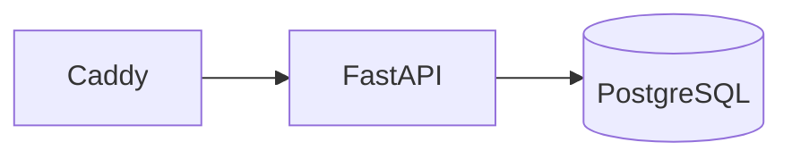

# 1. Executive summary

Stub paragraph with a status [PROD] and [ROADMAP].

```mermaid {name=test-flow caption=Request_flow_stub}
flowchart LR
  A[Caddy] --> B[FastAPI]
  B --> C[(PostgreSQL)]
```

## 1.1 Sub

| a | b |
|---|---|
| 1 | 2 |

# 2. Second section

Text.
