# 1. Executive summary

**What this document is.** The reference architecture of a platform that runs in production today for one community association and is designed as the foundation of an enterprise-ready, multi-tenant ERP that I-X IT Solutions develops further. The first tenant is small on purpose; the structure underneath is not.

**What runs today.** Activity registration, family membership with renewal, online and bank-transfer payments through Mollie, a form engine, a CMS, a chatbot and a back office. In production for Raak Millegem since June 2026.

**Why it is an ERP foundation and not a club portal.** The functional surface is small; the *structure* is that of business software: thirteen domain packages behind facades with one Postgres schema each, master data with merge and survivorship, a payment ledger with a stated reconciliation invariant, row-level multi-tenancy, a kernel with in-transaction events and a durable job queue, and a workbench that turns every exception into a task. None of that is needed to sell tickets for a barbecue; all of it is needed the day the same code runs an order book, a warehouse or a second customer (Chapter 8).

**How it was built.** By one architect directing AI coding agents. That only works when agents cannot quietly break things, so much of the engineering went into *gates*: 1,343 tests against a real PostgreSQL, twelve gate files that fail the build on architectural drift, a rendered-HTML gate, browser flows where money moves, and a CI that boots the real startup script. The agent corrects itself on the failing test (Chapter 6).

**The five architectural choices that make it scale to business software**

1. **Domain packages behind facades, one schema each.** Thirteen packages, each with `api.py` as its only public door and its own Postgres schema; two AST-based tests enforce it on every push.
2. **ERP-style master data.** Never hard-deleted; duplicates merge into a golden record with a survivorship chain; every entity has an append-only history table; other domains reference it by value, without cross-schema foreign keys.
3. **A ledger, not a payment field.** Every charge and refund is a record with a polymorphic reference to what is paid; one function owns the invariant *sum of records equals amount due*; the Mollie webhook never trusts its own body.
4. **Row-level multi-tenancy from the kernel.** A `tenant_id` mixin on 43 tables, resolved per request and applied as a global ORM filter no query can forget. A third tenant is configuration, not code.
5. **Quality as infrastructure, because AI writes most of the code.** Issue-driven changes, four blocking CI jobs, allowlists that must shrink to zero, and the written rule that *a test must be able to go red*.

**Status tags.** [PROD] on production (v1.14.0, 13 July 2026) · [HDEV] on `master`, validated on HDEV, pending as v2.0.0 · [PARTIAL] partly built · [ROADMAP] designed only. Unless stated otherwise the text describes `master`.

**Table 1 — The platform in numbers (master @ b373f864)**

| Measure | Value |
|---|---|
| Domain packages / Postgres schemas | 13 / 11, plus `public` for the kernel |
| ORM-mapped tables, of which tenant-scoped | 55 / 43 |
| Tests, of which browser end-to-end flows | 1,343 / 19 |
| Gate files enforcing architecture and conventions | 12, all allowlists empty |

# 2. Architecture principles

Each principle is followed by where it is enforced. A principle that is only written down is a wish; these are tests.

**2.1 Domain separation with facades.** Every domain owns its models, service, routers, screens and templates. Other code reaches it only through `api.py`. Enforced by `tests/test_import_boundaries.py` (an import linter written as a pytest: kernel never imports domains, cross-domain imports only target `.api`) and `tests/test_schema_boundaries.py` (no foreign keys across schemas). [HDEV]

**2.2 Screens build a view-model and choose a template. Nothing else.** A UI module may not touch the database session, may not import ORM classes or router functions, and passes a typed `ViewModel` to its template. Enforced by `tests/test_layer_gate.py` (AST-based, five rules) and `tests/test_template_variables_gate.py` (a template may not ask for a variable the view-model does not promise). Templates render under `StrictUndefined` in development, test and HDEV, so a typo fails instead of rendering blank. [HDEV]

**2.3 ERP-ready data model.** Master data is never hard-deleted; merges keep a survivorship pointer; every business entity has a history table written in the same transaction as the change; references between domains are values, not database constraints, so a domain can be extracted later. Money is a ledger with a reconciliation invariant. See Chapter 3. [HDEV, ledger since v1.x in PROD]

**2.4 Multi-tenant by construction.** Tenant scoping is a kernel mixin plus a global ORM filter, not a `WHERE` clause developers must remember. Configuration and secrets are per tenant in the database, with `.env` as fallback. See Chapter 5. [HDEV]

**2.5 Gatekeepers in the request path.** Eighteen distinct checks stand between a request and a row, from TLS and security headers at the edge to Jinja auto-escaping and HTML sanitisation on the way out. Chapter 4 lists them in order. The financial gate is separate from the administrative gate: an administrator can read payments but cannot mutate them. [PROD for most, HDEV for the UI gates]

**2.6 Security by design, refused at startup.** A weak or short `SECRET_KEY`, `DEBUG` or SQL echo make the application refuse to start in UAT and production. API documentation is disabled there. Logs carry an allow-list of fields and never a query string, a body or a token. [PROD]

**2.7 Test automation as the safety net for AI-driven development.** The agent's feedback is the failing test, not a human review of every line. Hence the investment in gates that cannot pass by looking nowhere (`tests/test_gate_niet_leeg.py`), a rendered-HTML gate, a query budget per screen, and browser flows that fail rather than skip when the seed data is present. See Chapter 6. [HDEV]

**2.8 AI-first, in both directions.** The product is built *with* AI agents inside the gates above, and it embeds AI *in* the solution: a chatbot over the site's own content with an allow-listed tool boundary, OCR of posters and documents, and speech-to-text. Every AI feature ships dark and is switched on per environment. See Chapter 7. [PROD for the chatbot, HDEV for the rest]

**2.9 Europe first.** Hosting on an EU provider (Hetzner, Germany), Mistral for language, OCR and speech, Mollie (NL) for payments, self-hosted Umami instead of a tracking SaaS, OpenDocument instead of proprietary spreadsheet formats. Where no EU option exists the trade-off is written down before the dependency is added (the rule lives in the project's `CLAUDE.md`). [PROD]

# 3. Logical architecture and domain model

## 3.1 System context and deployment

Every environment is a Docker Compose stack with an explicit project name. Development and the integration environment (HDEV) carry their own reverse proxy. UAT and production publish no host ports at all; they sit behind one shared Caddy container that terminates TLS for both and is deployed with an expand/contract discipline, because its configuration serves two releases at once. The backend serves HTML and JSON from one process; there is no separate frontend container since the React exit.

<!-- figure: name=deployment caption=Deployment_topology_per_environment -->
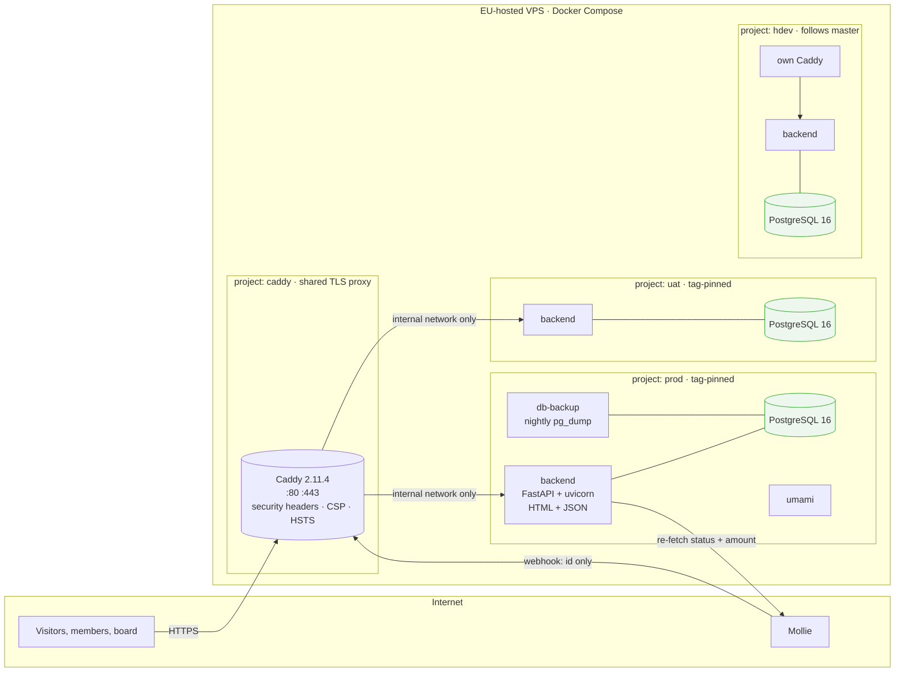
```mermaid
flowchart LR
  subgraph Internet
    U[Visitors, members, board]
    M[Mollie]
  end
  subgraph Host["EU-hosted VPS · Docker Compose"]
    subgraph Shared["project: caddy · shared TLS proxy"]
      C[("Caddy 2.11.4<br/>:80 :443<br/>security headers · CSP · HSTS")]
    end
    subgraph PROD["project: prod · tag-pinned"]
      PB[backend<br/>FastAPI + uvicorn<br/>HTML + JSON]
      PD[(PostgreSQL 16)]
      PU[umami]
      PK[db-backup<br/>nightly pg_dump]
      PB --- PD
      PK --- PD
    end
    subgraph UAT["project: uat · tag-pinned"]
      UB[backend]
      UD[(PostgreSQL 16)]
      UB --- UD
    end
    subgraph HDEV["project: hdev · follows master"]
      HC[own Caddy]
      HB[backend]
      HD[(PostgreSQL 16)]
      HC --> HB --- HD
    end
  end
  U -->|HTTPS| C
  C -->|internal network only| PB
  C -->|internal network only| UB
  M -->|webhook: id only| C
  PB -->|re-fetch status + amount| M
  classDef db fill:#eef7ee,stroke:#3a3;
  class PD,UD,HD db
```

Points an operator will look for: images are pinned (`caddy:2.11.4`, `postgres:16`); the backend runs as a non-root user; production compose fails fast on any missing secret (`${VAR:?…}`); the deploy script takes a pre-migration database dump, checks out the release tag detached, rebuilds, runs a read-only smoke test and rolls back once automatically if the smoke test fails. A single entry point, `raakctl`, resolves an environment name to its checkout so nobody runs the UAT script against production. [PROD]

## 3.2 Component map

The map below is the intended structure and, since v2.0.0, the actual one. Layer 1 holds identity, master data and mail; layer 2 the business domains; capabilities are cross-cutting services. Everything rests on a kernel that contains no business logic and imports no domain.

<!-- figure: name=components caption=Layered_package_structure_(master) -->
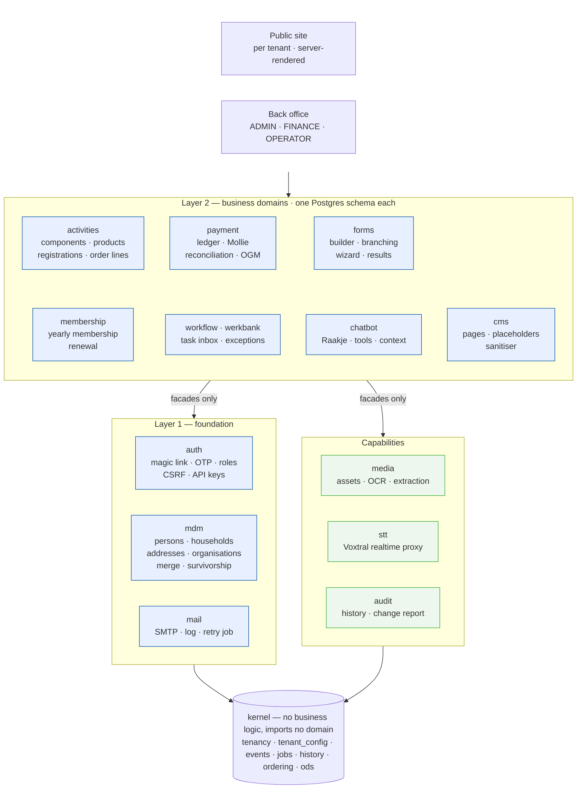
```mermaid
flowchart TB
  subgraph USERS[" "]
    direction LR
    PUB["Public site<br/>per tenant · server-rendered"]
    ADM["Back office<br/>ADMIN · FINANCE · OPERATOR"]
  end
  subgraph L2["Layer 2 — business domains · one Postgres schema each"]
    direction TB
    ACT["activities<br/>components · products<br/>registrations · order lines"]:::c
    PAY["payment<br/>ledger · Mollie<br/>reconciliation · OGM"]:::c
    FORM["forms<br/>builder · branching<br/>wizard · results"]:::c
    CMS["cms<br/>pages · placeholders<br/>sanitiser"]:::c
    MEM["membership<br/>yearly membership<br/>renewal"]:::c
    WB["workflow · werkbank<br/>task inbox · exceptions"]:::c
    CHAT["chatbot<br/>Raakje · tools · context"]:::c
    ACT ~~~ MEM
    PAY ~~~ WB
    FORM ~~~ CHAT
  end
  subgraph L1["Layer 1 — foundation"]
    direction LR
    AUTH["auth<br/>magic link · OTP · roles<br/>CSRF · API keys"]:::c
    MDM["mdm<br/>persons · households<br/>addresses · organisations<br/>merge · survivorship"]:::c
    MAIL["mail<br/>SMTP · log · retry job"]:::c
  end
  subgraph CAP["Capabilities"]
    direction LR
    MEDIA["media<br/>assets · OCR · extraction"]:::x
    STT["stt<br/>Voxtral realtime proxy"]:::x
    AUD["audit<br/>history · change report"]:::x
  end
  K[("kernel — no business logic, imports no domain<br/>tenancy · tenant_config · events · jobs · history · ordering · ods")]
  USERS --> L2
  L2 -->|facades only| L1
  L2 -->|facades only| CAP
  L1 --> K
  CAP --> K
  classDef c fill:#e8f0ff,stroke:#0051a4;
  classDef x fill:#eef7ee,stroke:#3a3;
  style USERS fill:#ffffff,stroke:#ffffff
```

Domains talk to each other in exactly two ways, both visible in the code: a call on the other domain's facade, or an event published through the kernel and handled in the same transaction. The figure below shows every such link that exists on master.

<!-- figure: name=interactions caption=Cross-domain_links_on_master:_facade_calls_and_kernel_events -->
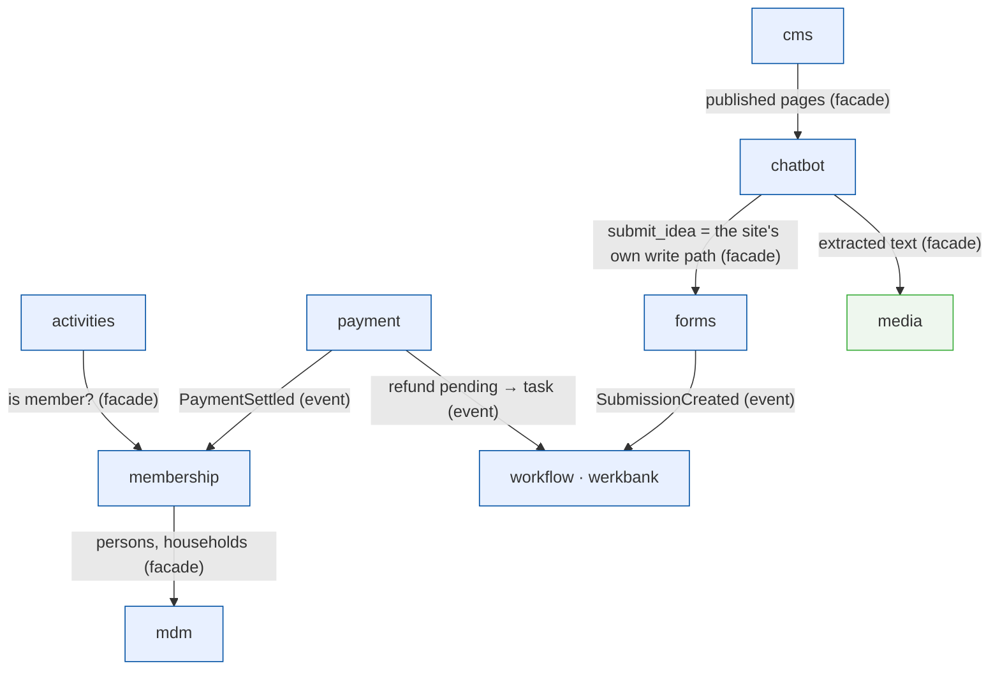
```mermaid
flowchart TB
  ACT["activities"]:::c -->|"is member? (facade)"| MEM["membership"]:::c
  PAY["payment"]:::c -->|"PaymentSettled (event)"| MEM
  MEM -->|"persons, households (facade)"| MDM["mdm"]:::c
  PAY -->|"refund pending → task (event)"| WB["workflow · werkbank"]:::c
  FORM["forms"]:::c -->|"SubmissionCreated (event)"| WB
  CHAT["chatbot"]:::c -->|"submit_idea = the site's own write path (facade)"| FORM
  CHAT -->|"extracted text (facade)"| MEDIA["media"]:::x
  CMS["cms"]:::c -->|"published pages (facade)"| CHAT
  classDef c fill:#e8f0ff,stroke:#0051a4;
  classDef x fill:#eef7ee,stroke:#3a3;
```

**Table 2 — Domains on master**

| Domain | Schema | Facade | Service | JSON API | Screens | Contract |
|---|---|---|---|---|---|---|
| activities | activities | yes | 779 lines | yes | public + admin | yes |
| membership | membership | yes | yes | yes | public portal | yes |
| payment | payment | yes | 1,178 lines | 3 routers | admin | yes |
| forms | form | yes | 982 lines | yes | public + admin | yes |
| mdm | mdm | yes | yes | 2 routers | admin | yes |
| auth | auth | yes | yes | yes | login + users | yes |
| mail | mail | yes | yes | yes | e-mail log | yes |
| cms | cms | yes | yes | yes | public + admin | yes |
| media | media | yes | yes | yes | admin | yes |
| chatbot | ai | yes | yes | 2 routers | widget + admin | yes |
| workflow | workflow | yes | in facade | none | werkbank | yes |
| audit | (uses domain schemas) | yes | yes | yes | changes screen | no |
| stt | none | none | none | WebSocket | none | no |

Rules that hold on master: kernel imports no domain; cross-domain imports target only `.api`; no cross-schema foreign keys; a UI module never touches the session. Two facades still delegate part of their implementation back into a router (`activities`, `forms`), which the layer gate tolerates for services but not for screens. That is honest debt, and it is listed in Chapter 9.

## 3.3 Master data and membership

The MDM domain is generic on purpose: an `Organization` tree (ACCOUNT above UNIT) is the tenant registry; `Person` and `Member` (a household) are linked through a junction with a relation type; addresses use a postal-code lookup table; contact details are typed rows rather than columns on the person; legacy identifiers live in a separate external-number table. Every entity has an append-only history table with no foreign keys, so history survives the deletion of its subject (the figure shows the person's; membership has its own).

Merge and survivorship are implemented: `merge_persons` flattens chains so `resolve()` is O(1), writes a `person_merged` snapshot as the anchor for `unmerge_person`, and publishes an `EntityMerged` event. Nothing is hard-deleted; a global soft-delete filter hides `deleted_at` rows from every ORM query, including relationship loads, with an explicit escape hatch for the audit screen. [HDEV]

<!-- figure: name=er-mdm caption=Master_data_and_membership_(schemas_mdm,_membership)_-_key_columns_per_entity -->
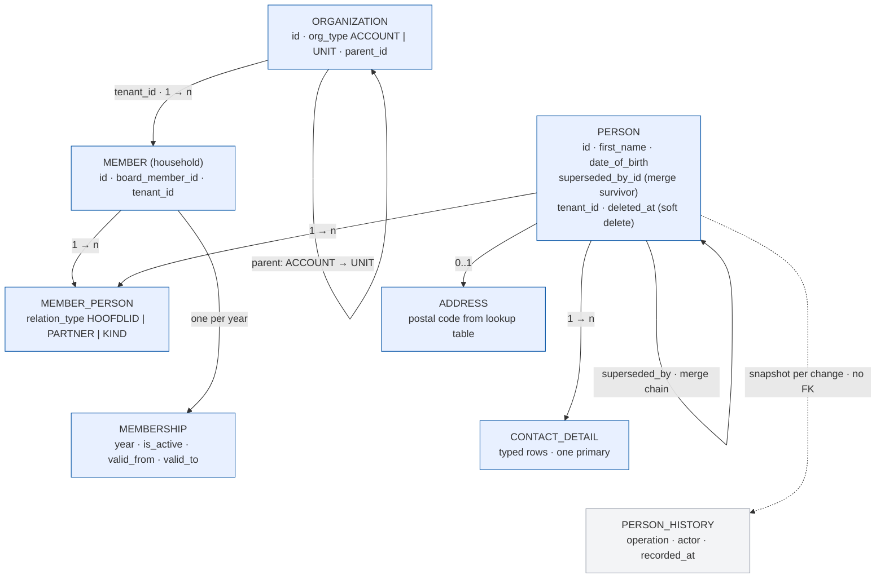
```mermaid
flowchart TB
  ORG["ORGANIZATION<br/>id · org_type ACCOUNT | UNIT · parent_id"]:::e
  PERSON["PERSON<br/>id · first_name · date_of_birth<br/>superseded_by_id (merge survivor)<br/>tenant_id · deleted_at (soft delete)"]:::e
  MEMBER["MEMBER (household)<br/>id · board_member_id · tenant_id"]:::e
  MP["MEMBER_PERSON<br/>relation_type HOOFDLID | PARTNER | KIND"]:::e
  MS["MEMBERSHIP<br/>year · is_active · valid_from · valid_to"]:::e
  ADDR["ADDRESS<br/>postal code from lookup table"]:::e
  CD["CONTACT_DETAIL<br/>typed rows · one primary"]:::e
  PH["PERSON_HISTORY<br/>operation · actor · recorded_at"]:::h
  ORG -->|"parent: ACCOUNT → UNIT"| ORG
  ORG ~~~ PERSON
  ADDR ~~~ CD ~~~ PH
  MP ~~~ MS
  ORG -->|"tenant_id · 1 → n"| MEMBER
  MEMBER -->|"1 → n"| MP
  PERSON -->|"1 → n"| MP
  PERSON -->|"superseded_by · merge chain"| PERSON
  PERSON -->|"0..1"| ADDR
  PERSON -->|"1 → n"| CD
  MEMBER -->|"one per year"| MS
  PERSON -.->|"snapshot per change · no FK"| PH
  classDef e fill:#e8f0ff,stroke:#0051a4;
  classDef h fill:#f3f4f6,stroke:#9ca3af;
```

## 3.4 Activities, registrations and the payment ledger

An activity has dates, components (the thing you register for, with capacity and its own price) and products (order lines with quantity, member price, free or pay-on-site). A registration holds contact data and order lines. Money lives in a separate ledger domain: every charge and refund is a `PaymentRecord` that points at what is being paid through a polymorphic reference (`payable_type`, `payable_id`) without a foreign key, so the same ledger serves registrations and memberships and can serve invoices later.

The ledger's single invariant is stated in code (`payment/service.py`, `reconcile_charges`): *after reconciliation, the sum of all non-deleted records equals the amount due*. Paid amounts are the truth; unpaid records are re-derived; a shortfall becomes one transfer charge with a Belgian structured communication generated from a Postgres sequence with the mod-97 check; a surplus becomes one refund that is a pending *obligation* until the treasurer confirms it, and the workbench shows it within minutes. The same function reconciles memberships. [PROD for the ledger and Mollie flow; HDEV for the generalised reconciliation]

<!-- figure: name=er-ledger caption=Activities,_registrations_and_the_payment_ledger_-_key_columns_per_entity -->
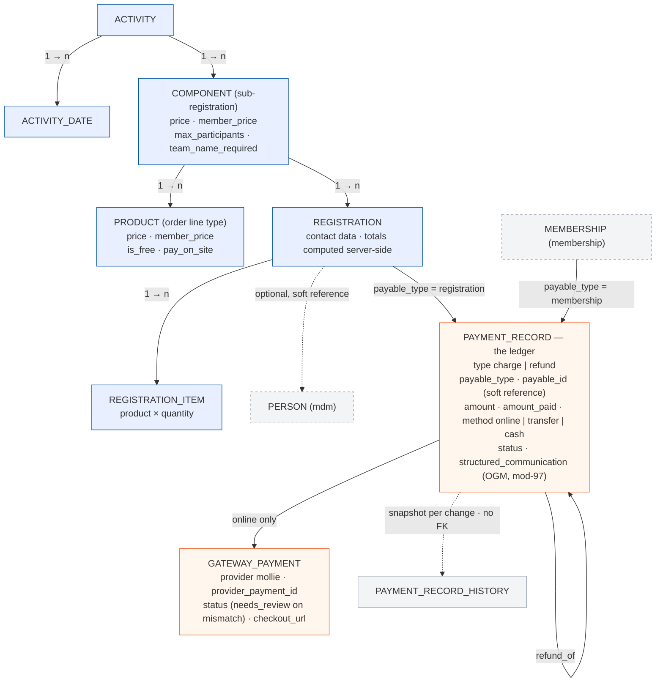
```mermaid
flowchart TB
  ACT["ACTIVITY"]:::e
  AD["ACTIVITY_DATE"]:::e
  COMP["COMPONENT (sub-registration)<br/>price · member_price<br/>max_participants · team_name_required"]:::e
  PROD["PRODUCT (order line type)<br/>price · member_price<br/>is_free · pay_on_site"]:::e
  REG["REGISTRATION<br/>contact data · totals computed server-side"]:::e
  RI["REGISTRATION_ITEM<br/>product × quantity"]:::e
  PERSON["PERSON (mdm)"]:::x
  MS["MEMBERSHIP (membership)"]:::x
  PR["PAYMENT_RECORD — the ledger<br/>type charge | refund<br/>payable_type · payable_id (soft reference)<br/>amount · amount_paid · method online | transfer | cash<br/>status · structured_communication (OGM, mod-97)"]:::l
  GP["GATEWAY_PAYMENT<br/>provider mollie · provider_payment_id<br/>status (needs_review on mismatch) · checkout_url"]:::l
  PRH["PAYMENT_RECORD_HISTORY"]:::h
  ACT -->|"1 → n"| AD
  ACT -->|"1 → n"| COMP
  COMP -->|"1 → n"| PROD
  COMP -->|"1 → n"| REG
  REG -->|"1 → n"| RI
  REG -.->|"optional, soft reference"| PERSON
  REG -->|"payable_type = registration"| PR
  MS -->|"payable_type = membership"| PR
  PR -->|"refund_of"| PR
  PR -->|"online only"| GP
  PR -.->|"snapshot per change · no FK"| PRH
  classDef e fill:#e8f0ff,stroke:#0051a4;
  classDef l fill:#fff7ed,stroke:#f16532;
  classDef x fill:#f3f4f6,stroke:#9ca3af,stroke-dasharray:4;
  classDef h fill:#f3f4f6,stroke:#9ca3af;
```

## 3.5 Form engine, CMS, media and workflow

The form engine is a complete server-side builder: ten field types with typed answer columns, sections with branching at section and option level computed on the server, a step-by-step wizard that follows exactly the route the server computed, JSON import and export with a published format guide written for AI assistants, server-side statistics so raw answers never reach the browser, and OpenDocument export. The CMS is one table of pages with text placeholders for prices that resolve from tenant configuration on public read only, and an HTML sanitiser at every public render. Media assets (posters, photos, sponsor logos, component documents) are stored in Postgres with generated thumbnails. The workflow domain provides tasks with a subject reference, a step definition as data, and the workbench that Chapter 4 describes.

# 4. Request flow, gatekeepers and roles

## 4.1 The gatekeeper ladder

Eighteen distinct checks stand between a request and a database row. Most are not middleware but explicit dependencies on routes, which is what makes them testable one by one.

Two decisions in this ladder are worth a conversation. First, capabilities are derived per request from the database, never baked into the token: the JWT carries only the e-mail address, so a revoked role takes effect on the next request. Second, the UI session is a stateless, HMAC-signed HttpOnly cookie (`email|expiry|signature`) from which the CSRF token is derived, so rotating a session rotates its CSRF token with it and there is no session store to operate.

<!-- figure: name=gatekeepers caption=Gatekeepers_in_request_order wide=1 -->
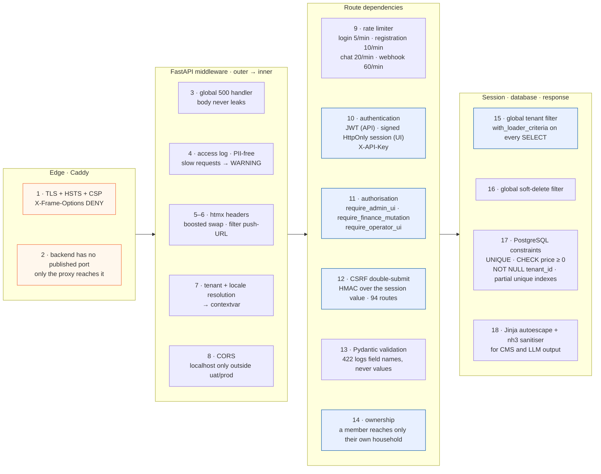
```mermaid
flowchart LR
  subgraph EDGE["Edge · Caddy"]
    direction TB
    G1["1 · TLS + HSTS + CSP<br/>X-Frame-Options DENY"]
    G2["2 · backend has no published port<br/>only the proxy reaches it"]
    G1 ~~~ G2
  end
  subgraph MW["FastAPI middleware · outer → inner"]
    direction TB
    G3["3 · global 500 handler<br/>body never leaks"]
    G4["4 · access log · PII-free<br/>slow requests → WARNING"]
    G5["5–6 · htmx headers<br/>boosted swap · filter push-URL"]
    G7["7 · tenant + locale resolution<br/>→ contextvar"]
    G8["8 · CORS<br/>localhost only outside uat/prod"]
    G3 ~~~ G4 ~~~ G5 ~~~ G7 ~~~ G8
  end
  subgraph ROUTE["Route dependencies"]
    direction TB
    G9["9 · rate limiter<br/>login 5/min · registration 10/min<br/>chat 20/min · webhook 60/min"]
    G10["10 · authentication<br/>JWT (API) · signed HttpOnly session (UI)<br/>X-API-Key"]
    G11["11 · authorisation<br/>require_admin_ui · require_finance_mutation<br/>require_operator_ui"]
    G12["12 · CSRF double-submit<br/>HMAC over the session value · 94 routes"]
    G13["13 · Pydantic validation<br/>422 logs field names, never values"]
    G14["14 · ownership<br/>a member reaches only their own household"]
    G9 ~~~ G10 ~~~ G11 ~~~ G12 ~~~ G13 ~~~ G14
  end
  subgraph DATA["Session · database · response"]
    direction TB
    G15["15 · global tenant filter<br/>with_loader_criteria on every SELECT"]
    G16["16 · global soft-delete filter"]
    G17["17 · PostgreSQL constraints<br/>UNIQUE · CHECK price ≥ 0<br/>NOT NULL tenant_id · partial unique indexes"]
    G18["18 · Jinja autoescape + nh3 sanitiser<br/>for CMS and LLM output"]
    G15 ~~~ G16 ~~~ G17 ~~~ G18
  end
  EDGE --> MW --> ROUTE --> DATA
  classDef e fill:#fff7ed,stroke:#f16532;
  classDef s fill:#e8f0ff,stroke:#0051a4;
  class G1,G2 e
  class G10,G11,G12,G14,G15 s
```

## 4.2 A request, end to end

<!-- figure: name=request-sequence caption=Server-rendered_request_with_htmx_(admin_action) -->
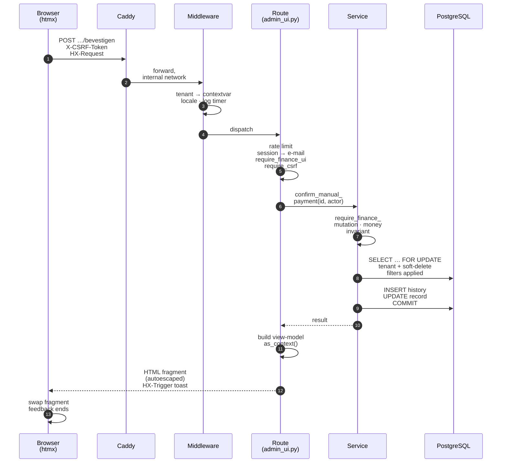
```mermaid
sequenceDiagram
  autonumber
  participant B as Browser<br/>(htmx)
  participant C as Caddy
  participant M as Middleware
  participant R as Route<br/>(admin_ui.py)
  participant S as Service
  participant D as PostgreSQL
  B->>C: POST …/bevestigen<br/>X-CSRF-Token<br/>HX-Request
  C->>M: forward,<br/>internal network
  M->>M: tenant → contextvar<br/>locale · log timer
  M->>R: dispatch
  R->>R: rate limit<br/>session → e-mail<br/>require_finance_ui<br/>require_csrf
  R->>S: confirm_manual_<br/>payment(id, actor)
  S->>S: require_finance_<br/>mutation · money<br/>invariant
  S->>D: SELECT … FOR UPDATE<br/>tenant + soft-delete<br/>filters applied
  S->>D: INSERT history<br/>UPDATE record<br/>COMMIT
  S-->>R: result
  R->>R: build view-model<br/>as_context()
  R-->>B: HTML fragment<br/>(autoescaped)<br/>HX-Trigger toast
  B->>B: swap fragment<br/>feedback ends
```

The public side follows the same shape without a session: registration, form submission and chatbot posts are rate-limited instead of CSRF-gated, and the total of an activity registration is always recomputed on the server before it is shown or stored.

## 4.3 Money: online payment and the untrusted webhook

<!-- figure: name=payment-sequence caption=Online_registration,_Mollie_webhook_and_reconciliation -->
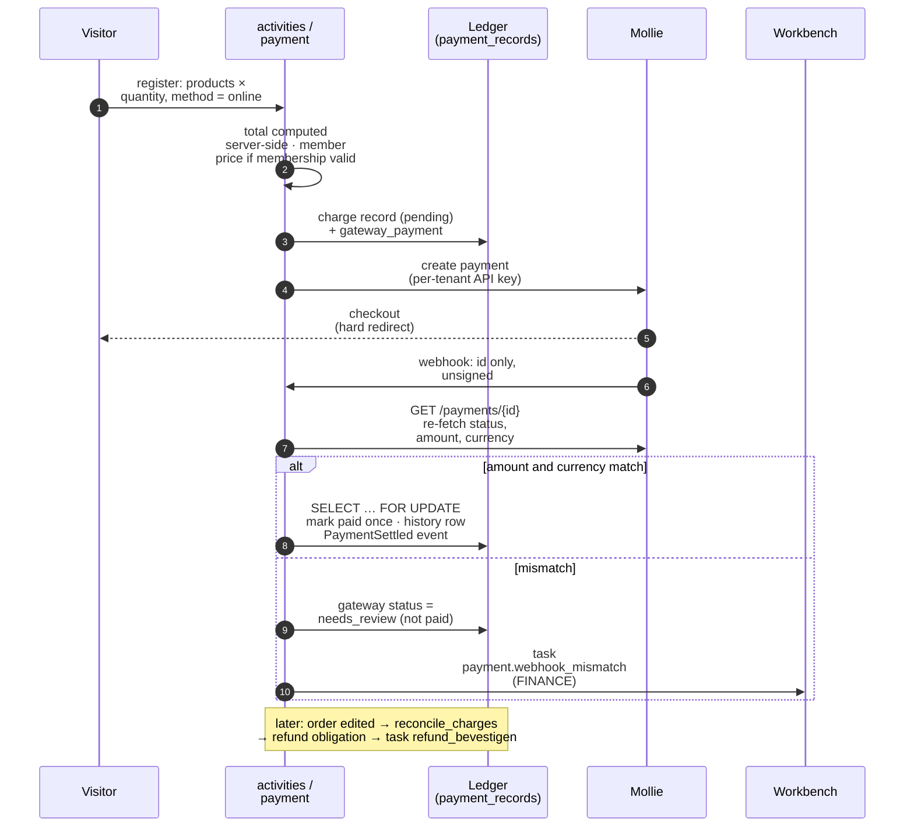
```mermaid
sequenceDiagram
  autonumber
  participant V as Visitor
  participant A as activities /<br/>payment
  participant L as Ledger<br/>(payment_records)
  participant MO as Mollie
  participant W as Workbench
  V->>A: register: products ×<br/>quantity, method = online
  A->>A: total computed<br/>server-side · member<br/>price if membership valid
  A->>L: charge record (pending)<br/>+ gateway_payment
  A->>MO: create payment<br/>(per-tenant API key)
  MO-->>V: checkout<br/>(hard redirect)
  MO->>A: webhook: id only,<br/>unsigned
  A->>MO: GET /payments/{id}<br/>re-fetch status,<br/>amount, currency
  alt amount and currency match
    A->>L: SELECT … FOR UPDATE<br/>mark paid once · history row<br/>PaymentSettled event
  else mismatch
    A->>L: gateway status =<br/>needs_review (not paid)
    A->>W: task<br/>payment.webhook_mismatch<br/>(FINANCE)
  end
  Note over A,L: later: order edited → reconcile_charges<br/>→ refund obligation → task refund_bevestigen
```

The rule *never trust the webhook body* is written into the repository's instructions as a security invariant and covered by a regression test that posts a forged `status=paid&amount=999` and asserts the record stays pending. [PROD]

## 4.4 Roles and how a user reaches their work

One login flow serves everyone: an e-mail address receives a magic link and a six-digit code; the code is stored hashed with a pepper, one live code per address, five attempts, fifteen minutes. Whether the address belongs to a back-office user or to a member is decided per request, not at login. After login the platform routes the person to their work: administrators land on the workbench, a treasurer on the payments screen, a member in the household portal.

<!-- figure: name=roles caption=Login_and_role-based_routing -->
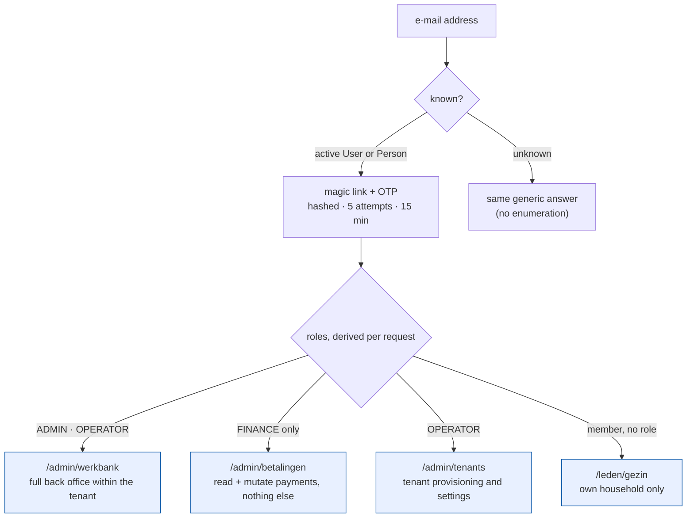
```mermaid
flowchart TB
  E[e-mail address] --> L{known?}
  L -->|active User or Person| T["magic link + OTP<br/>hashed · 5 attempts · 15 min"]
  L -->|unknown| Q["same generic answer<br/>(no enumeration)"]
  T --> R{roles, derived per request}
  R -->|ADMIN · OPERATOR| WB["/admin/werkbank<br/>full back office within the tenant"]
  R -->|FINANCE only| PAY["/admin/betalingen<br/>read + mutate payments, nothing else"]
  R -->|OPERATOR| TEN["/admin/tenants<br/>tenant provisioning and settings"]
  R -->|member, no role| HH["/leden/gezin<br/>own household only"]
  classDef r fill:#e8f0ff,stroke:#0051a4;
  class WB,PAY,TEN,HH r
```

**Table 3 — Role matrix (verified against `auth/session.py` and `auth/service.py`)**

| Capability | Anonymous | Member | FINANCE | ADMIN | OPERATOR |
|---|---|---|---|---|---|
| Public site, registration, forms, chatbot (rate-limited) | yes | yes | yes | yes | yes |
| Household portal (own household only) | — | yes | — | — | — |
| General back office (members, activities, CMS, forms, media) | — | — | — | yes | yes |
| View and export payments | — | — | yes | yes | yes |
| Confirm, refund, edit, void payments | — | — | yes | **no** | yes |
| Manage users and roles | — | — | — | yes | yes |
| Tenants and per-tenant settings | — | — | — | **no** | yes |

The treasurer's separation is enforced by a single function called on all seven mutating payment routes, and by the JSON API in the same way. The ADMIN-only user management deliberately does not accept OPERATOR-widening, so a FINANCE account cannot escalate itself. [HDEV]

## 4.5 The workbench: management by exception

Human work is an exception or a decision, and it lands in one place. Six task kinds exist today, raised by events or by an hourly sweep: a message to handle, a refund to confirm, a payment whose gateway state disagrees with the ledger, an orphaned payment record, a mail that failed after retries, and any other job that failed for good. The sweep is idempotent on the task title and closes tasks whose cause disappeared, but only for the kinds it created itself. Tasks are filtered by required role and refreshed by polling. [HDEV]

# 5. Multi-tenancy and security in detail

## 5.1 Tenant model and resolution

<!-- figure: name=tenancy caption=Tenant_hierarchy_and_per-request_resolution -->
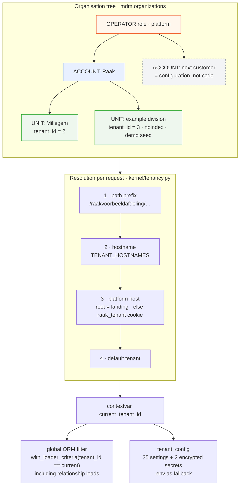
```mermaid
flowchart TB
  subgraph H["Organisation tree · mdm.organizations"]
    direction TB
    OP["OPERATOR role · platform"]:::o --> A1["ACCOUNT: Raak"]:::a
    A1 --> U1["UNIT: Millegem<br/>tenant_id = 2"]:::u
    A1 --> U2["UNIT: example division<br/>tenant_id = 3 · noindex · demo seed"]:::u
    OP --> A2["ACCOUNT: next customer<br/>= configuration, not code"]:::a2
  end
  subgraph RES["Resolution per request · kernel/tenancy.py"]
    direction TB
    P["1 · path prefix<br/>/raakvoorbeeldafdeling/…"] --> HN["2 · hostname<br/>TENANT_HOSTNAMES"]
    HN --> PH["3 · platform host<br/>root = landing · else raak_tenant cookie"] --> DF["4 · default tenant"]
  end
  H --> RES
  RES --> CV["contextvar current_tenant_id"]
  CV --> F["global ORM filter<br/>with_loader_criteria(tenant_id == current)<br/>including relationship loads"]
  CV --> CFG["tenant_config<br/>25 settings + 2 encrypted secrets<br/>.env as fallback"]
  classDef o fill:#fff7ed,stroke:#f16532
  classDef a fill:#e8f0ff,stroke:#0051a4
  classDef a2 fill:#f3f4f6,stroke:#9ca3af,stroke-dasharray:4
  classDef u fill:#eef7ee,stroke:#3a3
```

**Data.** A `TenantMixin` adds `tenant_id NOT NULL` with an index and a default taken from the request context; migration 086 backfilled 41 tables. The filter is applied by an ORM event listener with `with_loader_criteria`, the same recipe as the soft-delete filter, so relationship lazy-loads are covered and no query can forget the clause. Row-level security in PostgreSQL is prepared for (non-null, indexed) but not enabled. [HDEV]

**Configuration and secrets.** `kernel_tenant_settings` holds 25 known keys per tenant (display name, base URL, social links, language, membership prices and dates, payment IBAN, mail settings, analytics, limits) and two secrets, the Mollie API key and the mail app password, encrypted with Fernet using a key derived from `SECRET_KEY`. Secrets are never rendered back; an empty field means unchanged. Infrastructure secrets stay in `.env` because they are not tenant-scoped. One deliberate safety rule: outside production, the environment's `FRONTEND_URL` always beats a tenant's stored base URL, so a production database restored into a test environment cannot send real payment redirects. [HDEV]

**What is shared by design.** Back-office identity (`auth.users`, roles, API keys, login tokens), the organisation table itself, postal codes and code tables carry no tenant. A user is a platform account granted roles; which tenant they act in is decided by the request.

## 5.2 Honest gaps in the tenancy story

An architect will find these, so they are listed here rather than discovered later.

- **Background jobs run tenant-less.** The job table has no `tenant_id`; the hourly sweep and the orphan reconciler scan all tenants and file their tasks under the default tenant. Correct for one paying tenant, wrong for two. Roadmap item R3.
- **OPERATOR widens roles, not scope.** The `include_all_tenants` escape hatch exists but has no call site; cross-tenant reach exists only for the unfiltered organisation and settings tables. The role document overstates this; the code is the truth.
- **The tenant filter is ORM-only.** Raw SQL, such as the OGM sequence call, bypasses it. Row-level security would close that; it is a migration away.
- **Rate limiters are in-memory per process.** The startup script refuses more than one uvicorn worker for that reason. Horizontal scaling needs a shared store.

## 5.3 Security controls

**Table 4 — Controls and where they live**

| Control | Implementation | Status |
|---|---|---|
| Startup refuses weak config | `config.py` validator: weak/short `SECRET_KEY`, `DEBUG`, `SQL_ECHO` raise in uat/prod | [PROD] |
| No API docs in production | `/docs`, `/redoc`, `/openapi.json` return 404 in uat/prod, tested | [PROD] |
| Session and CSRF | HMAC-signed HttpOnly cookie, `secure` in uat/prod, 12 h; CSRF = HMAC over the session value, constant-time compare, four failure reasons logged, token never logged | [HDEV] |
| OTP hardening | hashed with pepper, one live code, 5 attempts, generic errors, no account enumeration | [PROD] |
| Financial separation | `require_finance_mutation` on every mutating payment route; ADMIN reads only | [HDEV] |
| Webhook integrity | re-fetch from Mollie, amount and currency check, `needs_review` on mismatch, row lock, idempotent | [PROD] |
| IDOR on the household portal | `_assert_in_household` on every person mutation, tested with 403 | [PROD] |
| Output sanitisation | Jinja `autoescape=True` guarded by a lint rule; nh3 allow-lists, stricter for LLM output than for CMS | [HDEV] |
| Logging hygiene | allow-list of extra fields; no query strings, bodies or tokens; SQL logger pinned to WARNING | [HDEV] |
| Secrets in the repository | none; `.env.*.example` only; a read-only agent screens diffs and issues for leaks before every push | [PROD] |
| Dependency audit | `pip-audit` on every push, reporting but never silent (annotations + job summary); whether a finding blocks is a human decision | [HDEV] |
| Formula injection in exports | ODS cells typed as strings, never CSV | [PROD] |

Known weaknesses, in the open: the CSP still allows `unsafe-inline` and `unsafe-eval` for scripts, and its comment still cites the removed React stack as the primary defence; history tables are append-only by convention (every writer only inserts) but not by database grant; the API-key mechanism is implemented and manageable but no endpoint consumes it yet. All three are roadmap items in Chapter 9.

# 6. Development process: how an AI agent works inside the gates

## 6.1 The loop

The working model is written down in the repository's `CLAUDE.md` and enforced by CI. Three rules from it, verbatim:

> *Every deployable code change goes through an issue. No "drive-by" commits without an issue.*

> *A test must be able to go red. Ask for every new test: would it also be green if the subject were broken? If so, it proves nothing, and that is worse than no test, because it suggests protection that is not there.*

> *For a gate or a guard that question is not enough: prove it. Make one violation, check that it fails with the intended message, restore it, and note in the docstring what you broke.*

<!-- figure: name=devloop caption=Issue_to_production:_the_self-correcting_loop -->
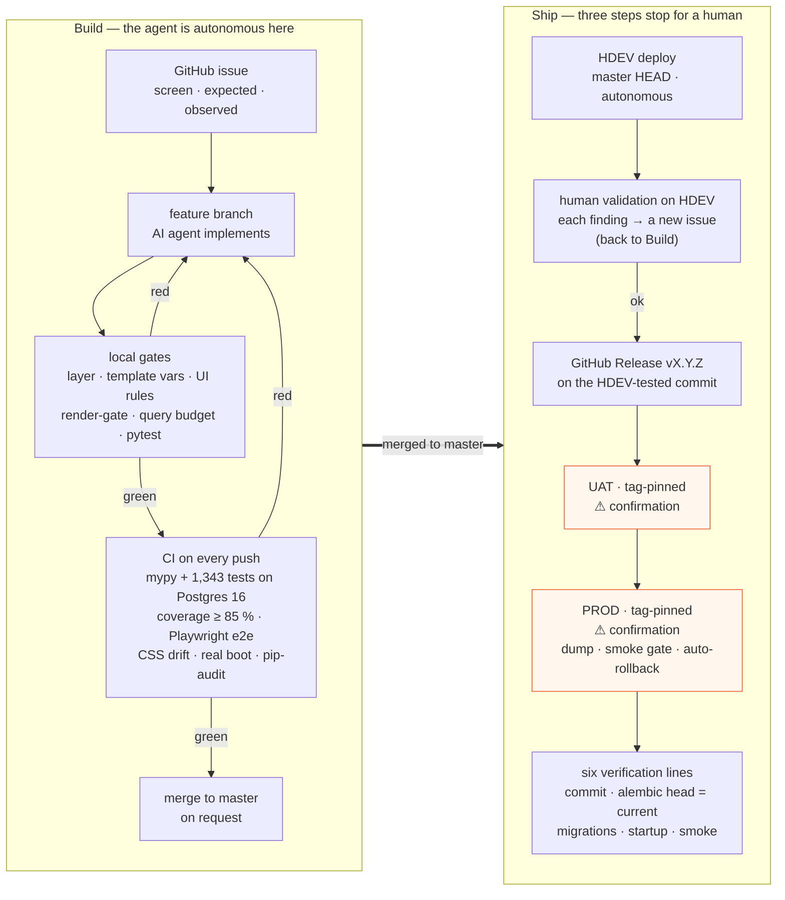
```mermaid
flowchart LR
  subgraph BUILD["Build — the agent is autonomous here"]
    direction TB
    I["GitHub issue<br/>screen · expected · observed"] --> B["feature branch<br/>AI agent implements"]
    B --> LG["local gates<br/>layer · template vars · UI rules<br/>render-gate · query budget · pytest"]
    LG -->|red| B
    LG -->|green| CI["CI on every push<br/>mypy + 1,343 tests on Postgres 16<br/>coverage ≥ 85 % · Playwright e2e<br/>CSS drift · real boot · pip-audit"]
    CI -->|red| B
    CI -->|green| MR["merge to master<br/>on request"]
  end
  subgraph SHIP["Ship — three steps stop for a human"]
    direction TB
    HD["HDEV deploy<br/>master HEAD · autonomous"] --> VAL["human validation on HDEV<br/>each finding → a new issue<br/>(back to Build)"]
    VAL -->|ok| TAG["GitHub Release vX.Y.Z<br/>on the HDEV-tested commit"]
    TAG --> UAT["UAT · tag-pinned<br/>⚠ confirmation"]
    UAT --> PROD["PROD · tag-pinned<br/>⚠ confirmation<br/>dump · smoke gate · auto-rollback"]
    PROD --> LOG["six verification lines<br/>commit · alembic head = current<br/>migrations · startup · smoke"]
  end
  BUILD ==>|merged to master| SHIP
  classDef stop fill:#fff7ed,stroke:#f16532;
  class UAT,PROD stop
```

The agent is autonomous *inside* a release: implement, test, get CI green, merge, close the issue with a "how to test on HDEV" comment, update the release tracker. Exactly three steps stop for a human: the UAT deploy, a change to the shared proxy, and the production deploy. Every closed issue carries the CI run id, the test count and the audit outcome as evidence; the release tracker is the single source of truth for what ships and how.

## 6.2 Test layers

<!-- figure: name=testlayers caption=Test_layers_and_what_each_one_catches -->
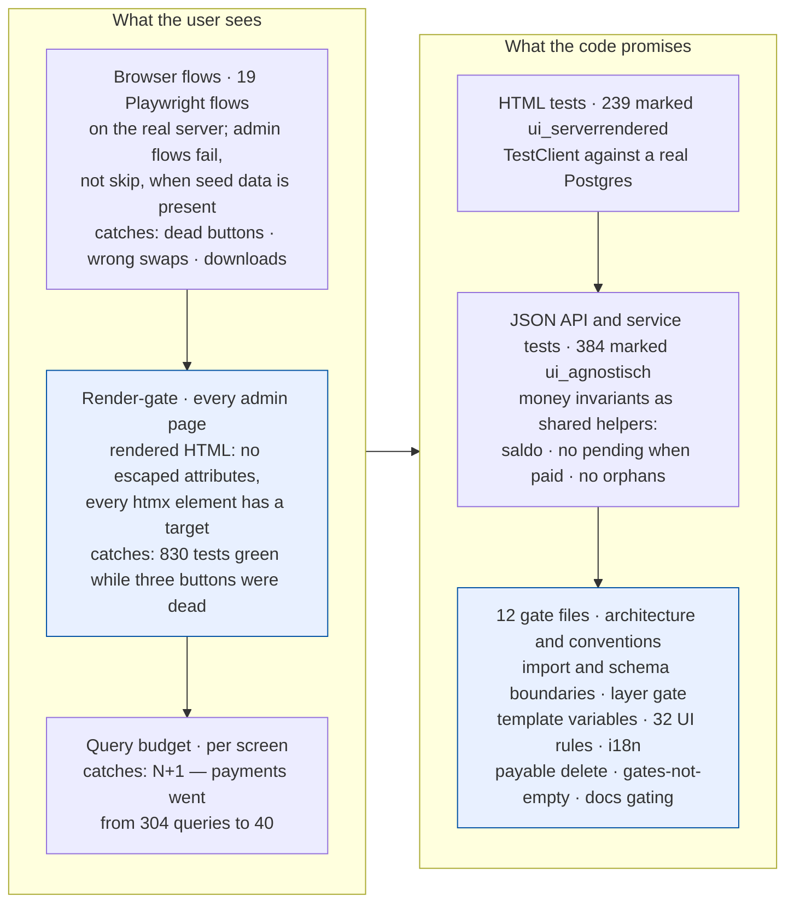
```mermaid
flowchart LR
  subgraph OUTER["What the user sees"]
    direction TB
    E2E["Browser flows · 19 Playwright flows<br/>on the real server; admin flows fail,<br/>not skip, when seed data is present<br/>catches: dead buttons · wrong swaps · downloads"]
    RG["Render-gate · every admin page<br/>rendered HTML: no escaped attributes,<br/>every htmx element has a target<br/>catches: 830 tests green while three buttons were dead"]
    QB["Query budget · per screen<br/>catches: N+1 — payments went<br/>from 304 queries to 40"]
    E2E --> RG --> QB
  end
  subgraph INNER["What the code promises"]
    direction TB
    UI["HTML tests · 239 marked ui_serverrendered<br/>TestClient against a real Postgres"]
    API["JSON API and service tests · 384 marked ui_agnostisch<br/>money invariants as shared helpers:<br/>saldo · no pending when paid · no orphans"]
    G["12 gate files · architecture and conventions<br/>import and schema boundaries · layer gate<br/>template variables · 32 UI rules · i18n<br/>payable delete · gates-not-empty · docs gating"]
    UI --> API --> G
  end
  OUTER --> INNER
  classDef g fill:#e8f0ff,stroke:#0051a4;
  class G,RG g
```

Two design choices explain the shape. First, every test session drops the thirteen schemas and rebuilds them through all 92 migrations against a real PostgreSQL 16, so the migration chain is exercised on every run. Second, gates use an *allowlist-to-zero* pattern: when a rule is introduced, the current violators are listed explicitly with a reason; every fix removes a line; when the list is empty the rule is absolute and adding an exception is a visible diff. On master every such list is empty.

## 6.3 What the gates caught

The gates exist because of specific failures, and the failures are documented in the tests themselves.

- **The escaping class.** Three times an htmx attribute was HTML-escaped and a button silently did nothing while all endpoint tests passed. Answer: the render-gate over the *rendered* HTML of every admin page, a shared money-invariant helper, and browser flows on the admin screens.
- **Green by looking nowhere.** Fourteen gate functions scanned files without asserting they found any. Answer: a meta-gate that fails when a gate's file set is empty, and a rule in the working instructions.
- **Green while undeployable.** A renamed module passed CI and failed only in the Docker build. Answer: the real `startup.sh` boots in CI against an empty database and the import check derives its module list from the package.
- **The typo that rendered blank.** Jinja renders an unknown variable as an empty string. Answer: `StrictUndefined` outside production, typed view-models, and a gate that compares each template's variables with its view-model's fields. Its first run found five real gaps, including role checkboxes that had silently disappeared from a form.

## 6.4 Two read-only agents

Judgment that regexes cannot express is delegated to two agents defined in the repository. The *design-conformity guard* reviews templates and UI modules against the design system on three axes (mechanical rules are left to the gate; patterns, and since v2.0.0 the layering of Python UI modules) and reports findings with a proposed issue title; it changes nothing. The *public-repository guard* screens every diff and every issue text for secrets, real hosts, credentials and personal data, because the repository and its issue tracker are public. Both are on-request and produce reports, not commits.

# 7. AI in the solution, today and next

## 7.1 What runs today

- **Raakje, the chatbot** [PROD, dark-launched by `CHAT_ENABLED`]. Context stuffing rather than retrieval: the data volume is small, so published pages, notes and aggregates go straight into the system prompt with a hard character limit. The security boundary is the tool list: three functions, no member data, no payments, no admin; an unknown tool name is refused; empty values are rendered as the literal *not stated* to suppress invention. Output passes through a markdown-to-HTML step and a sanitiser stricter than the CMS one. Per-IP rate limit and a daily character budget shared between the JSON route and the widget.
- **Document extraction** [HDEV]. A poster or component document is read through its PDF text layer first (free) and only sent to OCR when that yields too little; the result is cleaned and stored next to the asset, where an administrator can override or extend it. Runs as a background task after upload; an explicit *read again* action exists.
- **Speech-to-text** [HDEV, dark-launched by `STT_MODE`]. A WebSocket proxy to Voxtral realtime so the key never reaches the browser, with a per-IP handshake limit, a daily audio budget, idle and size limits, and a browser-native fallback. Text-to-speech is browser-only and sends nothing anywhere.
- **Provider seams.** Chat, OCR and STT each sit behind an abstraction with a deterministic mock, so CI runs without keys and a provider can be swapped without touching a domain. Mail and payments follow the same pattern for Mollie; mail does not yet.

<!-- figure: name=ai caption=AI_features_and_their_boundaries_-_orange_is_Mistral_(EU),_mocked_in_CI -->
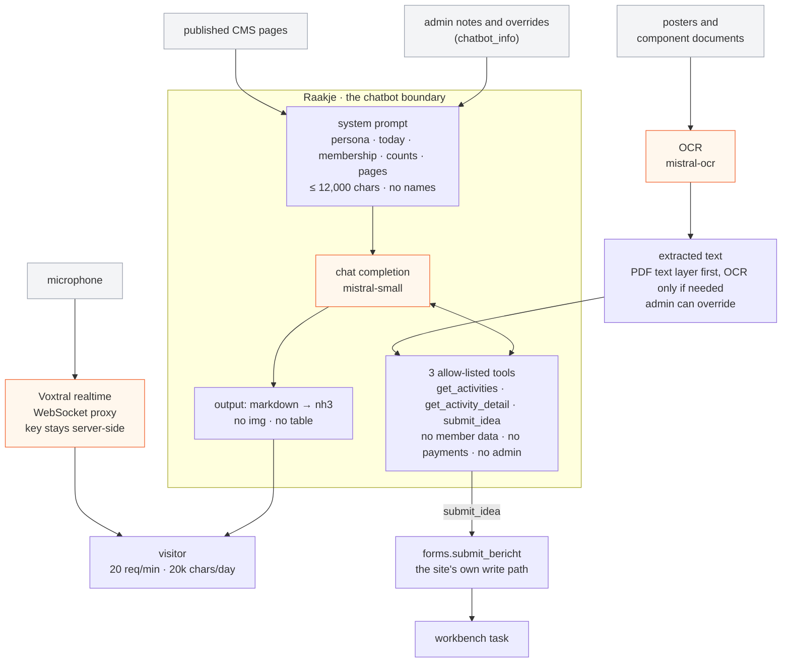
```mermaid
flowchart TB
  CMS["published CMS pages"]:::i
  NOTES["admin notes and overrides<br/>(chatbot_info)"]:::i
  DOCS["posters and<br/>component documents"]:::i
  MIC["microphone"]:::i
  OCR["OCR<br/>mistral-ocr"]:::m
  STT["Voxtral realtime<br/>WebSocket proxy<br/>key stays server-side"]:::m
  EXT["extracted text<br/>PDF text layer first, OCR only if needed<br/>admin can override"]
  subgraph RAAKJE["Raakje · the chatbot boundary"]
    CTX["system prompt<br/>persona · today · membership · counts · pages<br/>≤ 12,000 chars · no names"]
    LLM["chat completion<br/>mistral-small"]:::m
    TOOLS["3 allow-listed tools<br/>get_activities · get_activity_detail · submit_idea<br/>no member data · no payments · no admin"]
    SAN["output: markdown → nh3<br/>no img · no table"]
  end
  USER["visitor<br/>20 req/min · 20k chars/day"]
  FORM["forms.submit_bericht<br/>the site's own write path"]
  WB["workbench task"]
  CMS --> CTX
  NOTES --> CTX
  DOCS --> OCR --> EXT --> TOOLS
  MIC --> STT --> USER
  CTX --> LLM
  LLM <--> TOOLS
  LLM --> SAN --> USER
  TOOLS -->|submit_idea| FORM --> WB
  classDef m fill:#fff7ed,stroke:#f16532;
  classDef i fill:#f3f4f6,stroke:#9ca3af;
```

## 7.2 Extensibility: the mailing engine for member recruitment [ROADMAP]

The design for AI-assisted recruitment and communication exists (working document §23) and reuses only components that are already there. It starts with consent as data in MDM (opt-in per capture, scope and source recorded, a suppression list every send passes), then segments as saved queries rather than copied lists (members, first-time participants, lapsed members, interest profiles from participation history), then an AI-drafted newsletter that appears as a *decision task* in the workbench: a human edits and approves, the mail domain sends and logs, nothing generated leaves unread. Lifecycle flows (thank-you after participation, first-time participant to membership, renewal reminder, win-back) become workflow definitions with a kill switch each, measured in-house. None of it is in code today; the consent model is the first brick, and it is small.

# 8. From association to enterprise: the same building blocks

The platform was built for a community, but the blocks were chosen for what they become: the foundation of a multi-tenant ERP that I-X IT Solutions develops further for distribution, warehousing, production and web-shop companies. Table 5 names, per block, what exists in code today, its enterprise counterpart and the gap in code terms, so that the distance is sized rather than assumed; the figure that follows shows the same mapping.

**Table 5 — What each block does today and what it would take**

| Block | Today, in code | Enterprise counterpart | Gap |
|---|---|---|---|
| Master data | persons, households, organisation tree, typed contacts, addresses via lookup, merge/unmerge, history | customers, suppliers, sites, contacts | entity types and roles on the organisation tree; same patterns |
| Orders | activity → component → product → registration → order line, server-computed totals, member pricing | catalogue, price lists, sales and purchase orders | quantities on stock, units of measure, price-list dimension |
| Ledger | charge/refund records, polymorphic payable, reconciliation invariant, structured communication, Mollie | invoices, credit notes, open items, payment matching | document numbering, VAT, bank-statement import; the invariant already fits |
| Forms | builder, branching, wizard, statistics, ODS, AI format guide | intake, inspection, quality and return forms | attach a form to any subject via the existing soft-reference |
| Workflow | tasks by role, step definitions as data, sweep that opens and closes by state | approvals, exceptions, SLA queues | definitions editor, deadlines, escalation |
| Tenancy and roles | account/unit tree, row-level filter, per-tenant config and secrets, role-derived capabilities | one instance per group, units per company | tenant-aware background jobs, RLS, SSO |
| AI | context-stuffed assistant with tool boundary, OCR, speech | document intake, voice order entry, assistant over orders | retrieval over larger corpora; the tool boundary pattern carries over |
| Forecasting and planning | not present | demand forecasting, reorder proposals as workbench tasks | a read model over order lines; the exception-as-task delivery already exists |

The honest conclusion: the *shape* transfers, the *volume* does not yet. Nothing in the codebase has been load-tested beyond an association's traffic, media is stored in the database, and the rate limiter is per process. Those are known, sized items, not surprises.

<!-- figure: name=enterprise caption=Building_blocks_today_and_their_enterprise_counterparts wide=1 -->
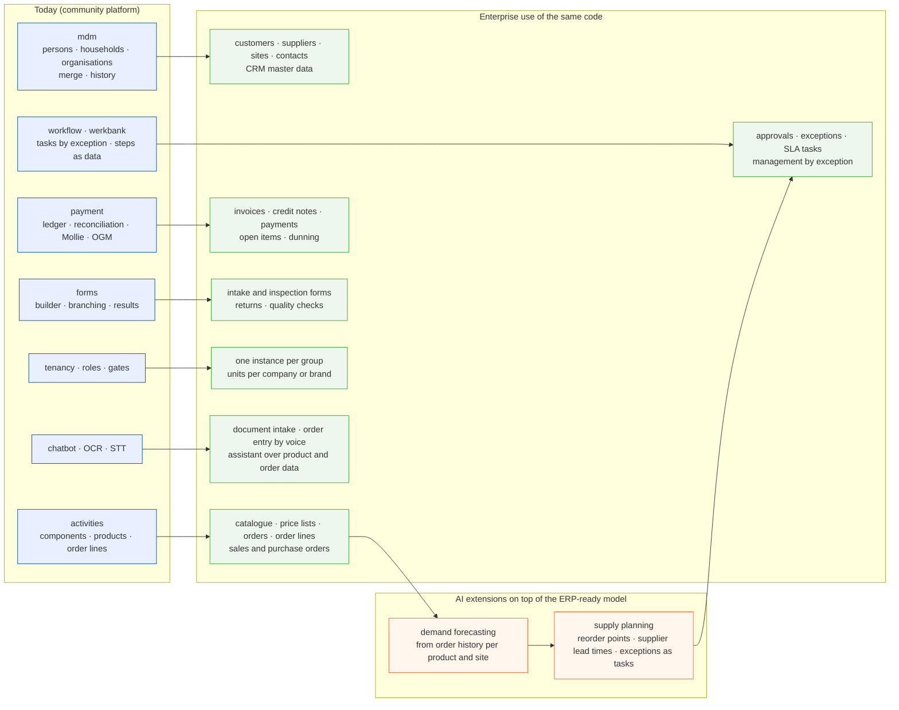
```mermaid
flowchart LR
  subgraph NOW["Today (community platform)"]
    N1["mdm<br/>persons · households · organisations<br/>merge · history"]
    N2["activities<br/>components · products · order lines"]
    N3["payment<br/>ledger · reconciliation · Mollie · OGM"]
    N4["forms<br/>builder · branching · results"]
    N5["workflow · werkbank<br/>tasks by exception · steps as data"]
    N6["tenancy · roles · gates"]
    N7["chatbot · OCR · STT"]
  end
  subgraph NEXT["Enterprise use of the same code"]
    E1["customers · suppliers · sites · contacts<br/>CRM master data"]
    E2["catalogue · price lists · orders · order lines<br/>sales and purchase orders"]
    E3["invoices · credit notes · payments<br/>open items · dunning"]
    E4["intake and inspection forms<br/>returns · quality checks"]
    E5["approvals · exceptions · SLA tasks<br/>management by exception"]
    E6["one instance per group<br/>units per company or brand"]
    E7["document intake · order entry by voice<br/>assistant over product and order data"]
  end
  N1 --> E1
  N2 --> E2
  N3 --> E3
  N4 --> E4
  N5 --> E5
  N6 --> E6
  N7 --> E7
  subgraph AIX["AI extensions on top of the ERP-ready model"]
    F1["demand forecasting<br/>from order history per product and site"]
    F2["supply planning<br/>reorder points · supplier lead times · exceptions as tasks"]
  end
  E2 --> F1 --> F2 --> E5
  classDef n fill:#e8f0ff,stroke:#0051a4;
  classDef e fill:#eef7ee,stroke:#3a3;
  classDef f fill:#fff7ed,stroke:#f16532;
  class N1,N2,N3,N4,N5,N6,N7 n
  class E1,E2,E3,E4,E5,E6,E7 e
  class F1,F2 f
```

# 9. Way forward

The roadmap has two horizons. R0 to R5 finish the platform as it runs for the first tenant; R6 to R9 are the first steps toward the enterprise use of Chapter 8. Everything is grouped by what it unlocks, and each item carries its status in the same vocabulary as the rest of the document.

**Table 6 — Roadmap, grouped by what it unlocks**

| # | Item | Why | Status |
|---|---|---|---|
| R0 | **v2.0.0 cutover** — server-rendered UI, modular domains, multi-tenancy, gates | 277 commits validated on HDEV; production still runs the React build of 13 July | [HDEV], release pending: env vars per host, Caddy expand/contract, memory headroom on the host, tag |
| R1 | Contract step for the shared proxy (`v2.0.1`) and removal of the deploy wrappers | closes the expand/contract cycle of the cutover | [PARTIAL] |
| R2 | Security audit against the code that actually runs (v2.1) | CSP without `unsafe-inline`/`unsafe-eval`; append-only history by grant; wire or remove the API-key mechanism; shared rate-limit store | [ROADMAP], issue exists |
| R3 | Tenant-aware background jobs and the OPERATOR cross-tenant view | the two real gaps in the tenancy story (5.2) | [ROADMAP] |
| R4 | Row-level security in PostgreSQL as the second line behind the ORM filter | prepared for since migration 086; one migration plus a session variable | [ROADMAP] |
| R5 | Remaining view-model conversions (14 modules) and facade clean-up (`activities`, `forms` still delegate into routers) | finishes principle 2.2 for every screen | [PARTIAL], gated by allowlists |
| R6 | Consent register in MDM, then segments, then the AI-drafted newsletter with workbench review | the recruitment engine of 7.2; consent first, by law and by design | [ROADMAP] |
| R7 | Transactional outbox for events; component extraction where a driver appears (STT first) | today's events are synchronous and in-transaction by design; extraction is a deployable decision, not a code decision | [ROADMAP] |
| R8 | Object storage adapter for media | blobs live in Postgres today; the adapter seam is named in the media facade | [ROADMAP] |
| R9 | PWA manifest and service worker | designed in the frontend decision, not started | [ROADMAP] |

What is deliberately *not* on the list: a return to a JavaScript frontend. The decision record in the working document weighed React against server-rendered htmx along eleven dimensions and chose one language for one architect plus agents; the v2.0.0 validation confirmed that the feel of the interface is a matter of polish (navigation without reload, feedback on every action, server latency under 150 ms on every admin route), not of framework.

# Appendix A — Documentation versus code

The working document `docs/intermediate-architecture-upgrade-v1.md` (July 2026) was compared claim by claim with `master`. This is the condensed result; it is the list a reviewer should use to calibrate the rest of this document.

**Table A1 — Claims in the working document**

| Claim | Verdict | Evidence on master |
|---|---|---|
| Package-by-domain with `api.py` as the only door | in code | 13 packages; import-boundary test with an empty allowlist |
| Import linter enforcing the boundary | in code, as a pytest | `tests/test_import_boundaries.py`; no third-party tool |
| Own Postgres schema per component, one Alembic chain | in code | 11 schemas, 92 migrations, one head |
| `CONTRACT.md` per component | partial | 11 of 13; missing for `audit` and `stt` |
| Per-component `tests/` and `seeds.py` | not in code | tests are central; seeds are top-level scripts |
| OpenAPI export with a drift gate (§19.4) | not in code | the opposite exists: docs are hidden in uat/prod |
| Synchronous in-transaction events (ladder rung 1) | in code | `kernel/events.py`, four contracts |
| Transactional outbox (rung 2) | not in code, deferred by design | documented in `kernel/events.py` |
| Job primitive with retry and locking | in code | `kernel/jobs.py`: `FOR UPDATE SKIP LOCKED`, backoff, savepoint isolation |
| MDM merge and survivorship | in code | `mdm/service.py`: merge, flattened resolve, unmerge, `EntityMerged` |
| Tombstones as a distinct concept | not as such | soft delete plus survivorship pointer cover the intent |
| Row-level tenancy, RLS-ready | in code; RLS not enabled | `kernel/tenancy.py`, migration 086 |
| Per-tenant config in the database | in code | `kernel/tenant_config.py`, migration 087 |
| Contract tests with schema-validated stubs as a distinct layer | not in code | covered by boundary tests and component tests instead |
| `alembic check` drift gate | not in code | — |
| Record-centric navigation (§20) | partial | the records-list pattern is real and gated; generated relation navigation is not |
| Workbench, zero-touch, management by exception | in code, v1 scope | six task kinds; not all proto-queues consolidated |
| BPMN/DMN vocabulary and export | partial | step definitions as data; no editor, no XML |
| PWA | not in code | — |
| AI-assisted recruitment (§23) | not in code | no consent model, segments or newsletter; the LLM adapter it would reuse exists |
| "Three services" end state | true for UAT; prod has five (two backup sidecars) | the frontend container is gone everywhere |
| Analytics read-model component | not in code | Umami configuration only |
| `search()` on every facade | not in code | search is per screen |
| Security batch: non-root, OTP hash, strict CSP, blocking audit | partial | non-root and OTP hashing done; CSP still permissive; audit reporting by choice |
| `mistralai` SDK replaced by plain `httpx` | half | chat and OCR use `httpx`; STT still pins the SDK |

**Table A2 — What the code does that the documents do not say**

| Finding | Where |
|---|---|
| Some facades delegate back into routers; the layer gate imports facades at runtime to catch screens pulling those functions out | `activities/api.py`, `forms/api.py`, `test_layer_gate.py` |
| Authentication is platform-wide, not tenant-scoped, by design | `auth/models.py` |
| `Form.requires_login` is stored and editable but enforced nowhere | `forms/router.py`, `forms/service.py` |
| Extracted document text reaches the chatbot only through tools, never the system prompt; a keyword list forces a tool call on the first round | `chatbot/context.py`, `chatbot/tools.py`, `chatbot/service.py` |
| Refunds are pending obligations that pre-empt the hourly sweep; the sweep closes only the task kinds it created | `payment/service.py`, `workflow/handlers.py` |
| Outside production the environment URL beats a tenant's stored base URL, so a restored production database cannot leak real redirects | `kernel/tenant_config.py` |
| The hosting provider is named in the README and the specification; no hosts or addresses are | `README.md`, `docs/spec.md` |

**Stale documents.** The README still describes a Next.js frontend, `docs/umami.md` still references a React component, and `docs/rollen-en-rechten.md` points at two files that no longer exist and overstates OPERATOR's cross-tenant reach. The instructions to *check parity against the tag, never a loose commit* were added after exactly that mistake.

# Appendix B — Evidence index

| Topic | Files |
|---|---|
| Working instructions and release process | `CLAUDE.md` |
| Kernel | `backend/app/kernel/{tenancy,tenant_config,events,jobs,history,ordering,ods}.py`, `kernel/contracts/` |
| Gatekeepers | `backend/app/main.py`, `app/limiter.py`, `app/soft_delete.py`, `domains/auth/{session,service,login}.py`, `caddy/parts/snippets.caddy` |
| Ledger and Mollie | `domains/payment/{service,gateway_service,gateway_router,structured_communication,exports}.py`, `providers/{base,mollie}.py` |
| Master data | `domains/mdm/{models,service,tenant_service,import_service}.py`, `domains/audit/{service,changes}.py` |
| Form engine | `domains/forms/{models,service,results,export,ui}.py`, `app/static/form-json-formaat.md` |
| AI | `domains/chatbot/{context,tools,service,render}.py`, `chatbot/providers/`, `domains/media/extraction.py`, `domains/stt/` |
| Gates | `backend/tests/test_{import_boundaries,schema_boundaries,layer_gate,template_variables_gate,ui_conventions_gate,gate_niet_leeg,payable_delete_gate,query_budget,render_gate,docs_gating,i18n_gate}.py` |
| Browser flows and seed | `backend/tests_e2e/`, `backend/seed_e2e.py` |
| CI and deployment | `.github/workflows/backend-tests.yml`, `deploy.sh`, `deploy-caddy.sh`, `raakctl`, `backend/startup.sh`, `backend/Dockerfile`, `docker-compose.*.yml` |
| Agents | `.claude/agents/design-conformiteit-bewaker.md`, `.claude/agents/publieke-repo-bewaker.md` |
| Design system and conventions | `docs/design-system.html`, `docs/ui-conventies.md`, `docs/ui-conformiteit.md`, `docs/rollen-en-rechten.md` |
| Decision record on the frontend | `docs/intermediate-architecture-upgrade-v1.md` §21 |

# Gespreksleidraad

**Kernboodschap.** Dit zijn de fundamenten van een enterprise-ready, multi-tenant ERP, en ze draaien vandaag al in productie. Ik bouw bedrijfssoftware met een klein team dat AI-agents aanstuurt, en ik kan dat bewijzen met een product dat geld, persoonsgegevens en meerdere tenants aankan, gebouwd in drie maanden, met een kwaliteitslaag die de meeste bedrijven pas na jaren hebben. I-X IT Solutions ontwikkelt dit platform verder.

**Waarom dit meer is dan een verenigingssite.** De functionaliteit is klein, de structuur is die van een ERP: dertien domeinpakketten achter facades met elk een eigen schema, masterdata met merge en historiek, een betaalgrootboek met één reconciliatie-invariant, rijniveau-multitenancy vanuit de kernel, een werkbank die elke uitzondering een taak maakt. Hetzelfde skelet draagt morgen orders, facturen en een magazijn.

**Bewijspunten (allemaal in de code, zie bijlage B).**

1. 1.343 tests tegen een echte PostgreSQL, twaalf gate-bestanden, vier blokkerende CI-jobs, coverage-drempel 85 %.
2. Achttien gatekeepers tussen request en rij; de penningmeester kan betalingen wijzigen, de beheerder niet; de Mollie-webhook wordt nooit vertrouwd.
3. Multitenancy als kernel-mixin plus globaal ORM-filter; tweede tenant is configuratie, geen code.
4. AI in beide richtingen: gebouwd mét agents binnen de gates, en AI ín het product (chatbot met toolgrens, OCR, spraak), alles Europees en dark-launched.
5. Eerlijkheid als methode: het document noemt zijn eigen gaten (achtergrondjobs zonder tenant, CSP, API-keys zonder consument) en de tests bewijzen dat een test rood kán worden.

**Hoe ik werk met AI-agents.** Elke wijziging start bij een issue. De agent implementeert op een feature branch, de gates zijn zijn feedback, CI is zijn reviewer, en ik valideer op HDEV wat CI niet kan zien. Drie stappen stoppen voor een mens: UAT, de gedeelde proxy, PROD. Twee leesagenten bewaken design-conformiteit en de publieke repo. Wat de agent fout deed, werd een gate; zo groeit de kwaliteit met elke fout.

**Wat ik zoek in dit gesprek.** Een klankbord op twee vragen: welke van deze bouwstenen zijn voor een bedrijf het meest waard als startpunt, en welke ontbrekende schakel (SSO, RLS, objectopslag, load) zou u als eerste willen zien voordat u dit in een organisatie zou vertrouwen?

**I-X IT Solutions.** AI-first softwarebedrijf in oprichting: kleine teams die agents aansturen, met kwaliteit als infrastructuur. Referentie: deze repository. Contact: *[link en contactgegevens I-X invullen]*.

