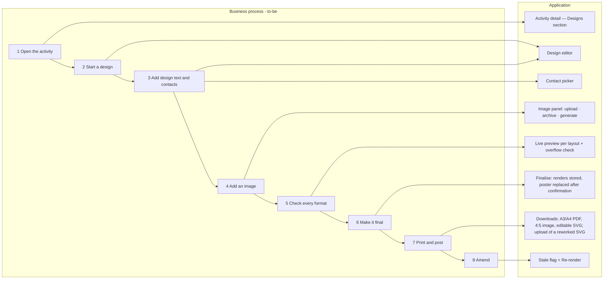
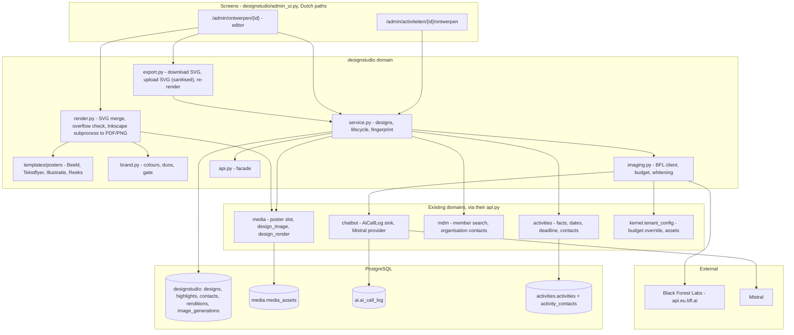
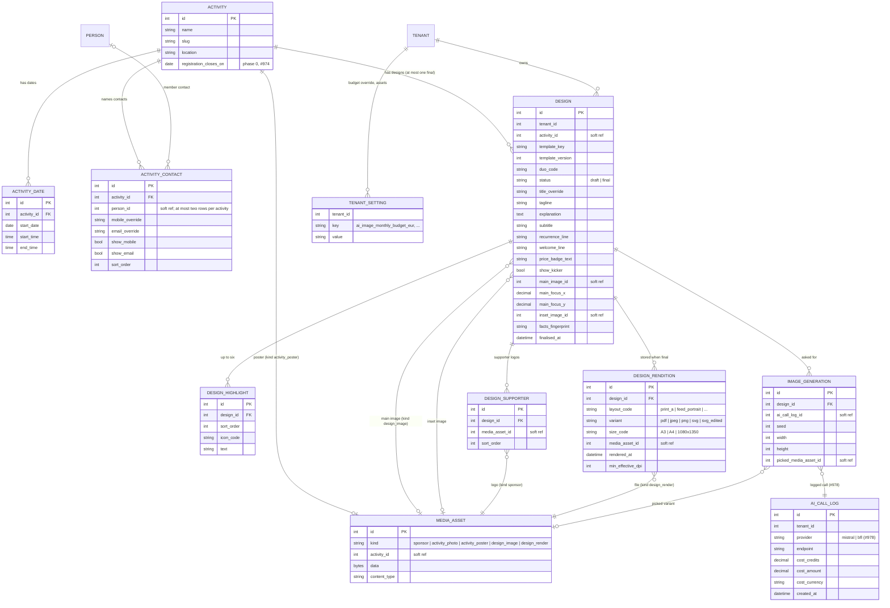

# Change Request 10 — Design Studio: posters and social images from an activity

**Project:** Web Portal "Raak Millegem"
**Status:** Shaped with Koen on 16 September 2026 (brainstorm on
`feature/designstudio`); **restructured on 17 September 2026** to the change
request template (`docs/change_request_template.md`) as its first example.
**Reviewed on 17 September 2026** (independent review and a template-tool
survey, both in Koen's Nextcloud folder `designstudio/review/`); the
rendering engine was then decided (Inkscape, B1.3). **#974 (deadline) and
#978 (AI call log) are on master** (verified 17 September 2026, master
55f2fd54), so the Design Studio stands on them rather than waiting for
them. The Design Studio itself is not on a release yet, apart from **phase 0** (the registration deadline, B4 §3.8a)
is #974 and assigned to **v2.5** (#925). The Design Studio itself is not on a
release yet.
**Applies to:** a new `designstudio` domain (backend + admin screens), a
contacts table, two new media kinds, the name search moving into MDM, the AI
call log (#978). Posters are rendered by **Inkscape** (decided 17 September
2026, Q10); text proposals reuse the
Mistral provider (chatbot).

---

# Part A — The business

> Written by the business (Koen, 17 September 2026, corrected after a first
> draft that the CLI had filled in itself). Everything here is what the
> units and the movement say; nothing here names a component or a tool.

## A1. Reason to act

*Left open by Koen: there is no single triggering event. The situation in A2
is the reason.*

## A2. As-is

Announcing activities is **fragmented across the Raak units in Flanders**:

- Many people make a poster in Word, in Canva, or by asking ChatGPT. Others
  make almost none.
- The result is a **scattered house style**: different tools, different
  quality, different looks per unit and per maker.
- Posters are usually made in **one format**, so they cannot be printed
  properly, or they look bad on Facebook or Instagram. The format rarely
  fits the channel it ends up on — paper, print, social media.

## A3. To-be

When a unit has an activity, **professional, good-looking invitations** are
made for it, in a consistent Raak look, and they can be:

- published on the website;
- posted on social media;
- distributed by e-mail;
- printed.

## A4. Supplied material (measured, 16 September 2026)

Koen collected the input in his Nextcloud project folder
(`designstudio/huisstijl Raak en Raak Millegem`). It stays there: the
example posters carry names, phone numbers and addresses, and none of that
enters this repository.

### A4.1 The Raak house style guide (9 pages, for local groups)

- **Eight colours, all equal** — no primary or secondary colour. The
  general rule is **at most 4 or 5 colours per design**.

  | Name | HEX | RGB | CMYK | PMS |
  |---|---|---|---|---|
  | Golden Yellow | `#ffce00` | 255 207 1 | 0 18 100 0 | Yellow 012 |
  | Pumpkin Orange | `#f16532` | 242 101 51 | 0 75 89 0 | 1645 |
  | Cool Green | `#3aba9b` | 58 187 155 | 70 0 51 0 | 3255 |
  | Dark Green | `#005d29` | 0 93 41 | 100 0 100 56 | 348 |
  | Hot Pink | `#f17fb2` | 242 127 178 | 0 64 0 0 | 237 |
  | Ocean Blue | `#0051a4` | 0 82 164 | 100 77 0 0 | 2935 |
  | Watermelon Red | `#ee3a37` | 239 59 55 | 0 92 84 0 | Red 032 |
  | Indigo | `#460359` | 70 3 89 | 68 100 0 47 | 2617 |

  (The guide's RGB and HEX differ by one unit in places; HEX is used.)

- **Twelve permitted duo combinations** for text on a background, usable in
  both directions (light text on dark, dark text on light):

  | Light | Dark |
  |---|---|
  | Golden Yellow | Ocean Blue · Indigo · Dark Green · Pumpkin Orange · Watermelon Red |
  | Cool Green | Ocean Blue · Indigo · Dark Green |
  | Hot Pink | Ocean Blue · Indigo · Dark Green |
  | Watermelon Red | Indigo |

  The guide also shows a page of *forbidden* combinations. The duo rule
  covers text on a background. It does not apply to graphic elements or
  backgrounds.

- **Logos:** the wordmark without a baseline, the wordmark with a baseline,
  the pin, and the wordmark with the local group's name. The group name
  always goes into the baseline as "Beleef meer in <group>", split over two
  lines when it is long.
  - The **pin** is always placed on a coloured field, **never on an image**.
  - The wordmark in the pin **stays white** on every combination.
  - The pin is not combined with a baseline or group name.
  - A monochrome logo exists for black-and-white print.

- **Typeface:** Radio Canada Big (Google Fonts, OFL) for all text, in
  regular, medium, semibold and bold.

### A4.2 The unit's assets

- **Official SVG lockups** for Raak Millegem, supplied on 16 September 2026.
  There are five: four colour variants and one monochrome.
  - Each is a coloured tile with the white wordmark and the baseline
    "Beleef meer in Millegem". The file name gives the tile colour first,
    then the baseline colour.
  - The four colour variants are Ocean Blue/Golden Yellow, Ocean Blue/Hot
    Pink, Golden Yellow/Indigo and Dark Green/Golden Yellow. All four are
    permitted duos (A4.1).
  - The monochrome variant is black/white.
- **Measured:** all five files have the same structure — the same viewBox
  (702 × 451), 17 paths, and no embedded bitmaps, scripts or external
  references. They differ **only in their fill values**: the tile colour,
  the baseline colour, and white.
- The older `.ai` and `.png` files are superseded.
- **The neutral Raak lockup** (wordmark with the baseline "Beleef meer!", no
  unit name), supplied on 16 September 2026:
  - **24 PNG files**, 6090 × 4060 px;
  - they are **exactly the twelve permitted duos of A4.1, each in both
    directions** (tile colour / baseline colour). Raak itself thus offers the
    lockup in every permitted duo.
  - **One SVG** followed the same day: Ocean Blue tile, Golden Yellow
    baseline. It has a 2048 × 1365 viewBox, 15 paths, no bitmaps, scripts or
    external references, and the same structure as the unit lockups. It is
    the master for recolouring, so the PNGs are no longer needed.

  (In the file names, "appelblauwzeegroen" is Cool Green and "groen" is Dark
  Green.)

### A4.3 Four example posters, and what they share

| Example | Made with | Format | Bleed | Character |
|---|---|---|---|---|
| Play afternoon + summer bar | chatbot (image) | A3 | none | line illustration, date badge, icon list, price badge, footer bar with contacts, supporter logo |
| Walking group | LibreOffice Draw (chatbot image) | A3 | none | icon list, photo + inset photo, **grid of six concrete dates**, recurrence line ("every 2nd Monday") |
| Father-and-son evening | Canva | A3 | trim box only | full-bleed photo, colour wave, text bottom, **responsible publisher (V.U.)**, funder logo |
| Bowling | Word | A4 | none | text flyer: "… organiseert", title, date-time-location, long explanation, photo, registration deadline, contact persons |

None of them has a real bleed: in all four, the trim box equals the page.

A Word "flyer template" names the text flyer's slots:
- "RAAK Millegem organiseert", title, date-hour-location, extra info;
- explanation part 1, image(s), explanation part 2;
- "register via the website until …";
- "more info from <name>, <phone>, <e-mail>".

The chatbot brief that produced the first two posters asks for:
- the house style, and line drawings when the supplied photos do not fit;
- **"printable on A3 with 5 mm bleed so a borderless print cuts off no colour
  and leaves no white edge"**;
- an Instagram format;
- delivery both as an image and as a borderless A3 PDF;
- no rounded corners.

### A4.4 Added on 17 September 2026

- **Target designs, version 1a** (`designstudio/design objectief versie 1a`):
  ten existing posters of one-off activities — father-and-son evening (two
  versions), cooking workshop, wine-estate visit, beer tasting, bowling,
  bunker walk, darts tournament, members' party, Scherpenheuvel walk/ride.
  Koen's reading: all of these should come out of **one template** (perhaps
  one for A4/A3 and one for Instagram), because they are alike.
- **Target designs, version 1b** (`… versie 1b`): three **series** — cycling
  (five dates, none in winter), walking (twelve dates next year, one per
  month), litter pick-up (three dates). Same template as 1a, or a second?
  (see B4 §3.4, Q16).
- **Raak national's Facebook banner** (`Kopie van Raak banner Facebook.png`,
  from Raak vzw's house-style page): the neutral lockup on Indigo, a photo,
  and overlapping colour blobs in Golden Yellow, Hot Pink, Ocean Blue and
  Cool Green with small pin marks, "raakvzw.be" in a pill. The reference for
  the `landscape` layout (Facebook, phase 4) and for the pin motif.
- **The unit's site QR code** (`raakmillegem_qrcode_https.svg/.png`): the
  code the unit prints when a poster has no activity-specific link. The
  portal generates the same code from the URL (B4 §3.7), so the file is a
  reference, not an asset to upload.

### A4.5 Content blocks, derived from the examples

| Block | In examples | Source |
|---|---|---|
| Kicker ("RAAK <unit> organiseert") | 1 | unit name, toggle |
| Title (large, 1–3 words per line) | 4 | activity |
| Subtitle ribbon ("Wandelen", a place name) | 3 | design |
| When: one date + time range, **or** a recurrence line + concrete dates | 4 | activity dates; recurrence line from design |
| Where | 4 | activity |
| Highlights: icon + short line, up to six | 2 | design |
| Price badge ("Gratis", "Alles aan 1 euro") | 2 | activity prices; wording from design |
| Welcome line ("Iedereen welkom!") | 2 | design |
| Explanation, one or two paragraphs | 1 | design |
| Registration: link, QR code, deadline | 2 | activity |
| Contact: website, e-mail, contact persons | 4 | the activity's contact persons (at most two); Raak's details when there are none |
| Supporter / funder logos | 2 | media, kind `sponsor` |
| Responsible publisher (V.U.) | 1 | out of scope for now (B4 §3.10) |
| Image slot, optional inset image | 4 | design |

## A5. Business requirements

The table lists what the business asked for, in its words. MoSCoW: proposed
by the CLI and validated by Koen on 17 September 2026 (Q7).

| # | Requirement | MoSCoW | Source | Comment |
|---|---|---|---|---|
| R1 | From the activity's data, **quickly** make good-looking designs. | Must | Koen, 17 Sep 2026 | |
| R2 | Designs suited for **print**: A3, A4 and A5. | Must | Koen, 17 Sep 2026 | A6 not needed (Koen, 17 Sep). All A sizes share one ratio, so one layout serves them; the safe zone is an absolute measure per size (review finding 4). |
| R3 | Designs suited for **Instagram** (4:5). | Must | Koen, 17 Sep 2026 | |
| R4 | A design made by the system can still be **reworked by hand** afterwards, for instance in LibreOffice or another tool: add a text, add a box, rewrite a sentence. | Should | Koen, 17 Sep 2026 | Everything editable except the images used (Q8). |
| R5 | The designs follow the **Raak house style** (guide, colours, logos, typeface in A4). | Must | Koen, 16 Sep 2026 | |
| R6 | Print at home must work (borderless). | Must | Koen, 16 Sep 2026 | |
| R7 | Designs for the **Facebook event cover** and the **square** social format. | Could | Koen, 17 Sep 2026 | "Later" (16 Sep). |
| R8 | **Print-shop output**: bleed, crop marks, CMYK. | Won't | Koen, 16 Sep 2026 | Units order print online; not a must for now. |
| R9 | The **responsible publisher** (V.U.) on print. | Won't | Koen, 16 Sep 2026 | For now. |
| R10 | Contacts on the **public website**. | Won't | Koen, 16 Sep 2026 | Posters and social images only, for now. |

## A6. Non-functional requirements

The requirements every change is tested against. Business-level answers;
how they are met is Part B.

| Concern | This change |
|---|---|
| **Reporting** | What each unit spends on generated images must be countable, per month. |
| **Security** | Only the unit's board reaches the design tools. Nothing a unit uploads may harm another unit or the platform. |
| **Privacy** | People named on a poster have agreed to it — the board asks them beforehand, at a meeting, by WhatsApp or in person; the portal records no consent of its own (Koen, 17 Sep 2026). Members' photos do not leave the movement's own systems to an outside service; no photos of children as test material. |
| **House style** | Designs follow the Raak style guide; the tool's own screens follow the portal's UI norm. |
| **Multi-tenant** | Each unit has its own logo, its own designs and its own spending; the templates and the style guide are shared by all units and maintained centrally — by Koen for now, by Raak nationally in time. |

## A7. Acceptance criteria

End-to-end, by a person on HDEV, without reading code.

| # | Criterion | Requirement |
|---|---|---|
| AC1 | For an activity in the portal, every input the design needs can be entered in the tool; nothing has to be retyped from the activity. | R1 |
| AC2 | Each print format in R2 can be downloaded and printed borderless at home without cut-off text or white edges. | R2, R6 |
| AC3 | Each social-media format in R3 can be downloaded and looks right on the channel it is meant for (checked on a phone). | R3 |
| AC4 | The design can be opened in LibreOffice (or another tool), a sentence changed and a box added, and the result saved. | R4 |
| AC5 | Three elements checked with a colour picker are Raak colours; the logo and typeface are the official ones. | R5 |
| AC6 | The unit's monthly spend on generated images is visible. | A6 reporting |
| AC7 | The A4 PDF printed at A5 (reduced) is still readable: the smallest text at least 6 pt, the QR code at least 20 mm, the safe margin kept. | R2 |

The external review's proposal of a timed usage goal ("a first-time board
member makes a poster within ten minutes") was **not adopted by Koen**
(17 September 2026).

# Part B — The solution

## B1. Solution outline

A new `designstudio` domain in the portal. A **design** belongs to an
activity and stores its inputs: template, colour pair, design text, images
and their focal points, contacts. **Templates are SVG files** with
`{{placeholders}}`, designed centrally in the house style — in Inkscape by a
designer, or as code; a design is data merged into a template and rendered
by **Inkscape** (headless, `inkscape --export-type=pdf|png`). Every effect
is native SVG on real text: pattern fills, text on a path, filters. Each
template defines **one layout per aspect ratio** (A-series portrait, 4:5),
so nothing is cropped. **The merged SVG is the editable file**: a unit
downloads it, reworks it in Inkscape, and uploads it back (R4). QR codes via
**segno**. Illustrations come from **Black
Forest Labs FLUX.2 [pro]** through the EU endpoint, steered by a per-template
style reference; text proposals (later) from the existing **Mistral**
provider. Every AI call is logged in the existing AI call log (#978), which
also feeds the per-unit budget.

Alternatives weighed (B1.3, prototypes in iterations 01–15): HTML/CSS with
WeasyPrint (fast, strong overflow check, but effects become outlines and
there is no editable file); LibreOffice Draw (editable in LibreOffice, but
Fontwork breaks the glyphs and effects become pictures); headless Chromium
and Scribus (not tried; heavier, no editable-file gain). Europe First:
Inkscape (open source, self-hosted; the project is international, hosted by
a US non-profit), Black Forest Labs (DE, EU endpoint), Mistral (FR), segno
(DE, pure Python).

## B1.1 Functional analysis — derived requirements

Derived by the CLI from the business requirements (A5) and Koen's decisions
of 16 September 2026. These are design, not business input; MoSCoW here is
the CLI's proposal. Numbered FR to keep them apart from the business
requirements R1–R10 in A5; the derived acceptance checks are DAC.

| # | Requirement | MoSCoW | Source |
|---|---|---|---|
| FR1 | A poster is made **from the activity**: title, dates, hours, place, price and registration link come from the portal and are never retyped. | Must | Koen, 16 Sep |
| FR2 | A poster follows the **Raak house style** (colours, permitted colour pairs, logo rules, Radio Canada Big) without the maker having to know the guide. | Must | Koen, style guide |
| FR3 | A poster can be **amended later** — add a line, change a photo — without starting over. | Must | Koen, 16 Sep |
| FR4 | A poster prints **borderless on A3 and A4** at home, with nothing cut off. | Must | Koen, 16 Sep |
| FR5 | The same design is available as an **Instagram image (4:5)**. | Must | Koen, 16 Sep |
| FR6 | A **final** design becomes the activity's poster on the public site. | Must | Koen, 16 Sep |
| FR7 | The unit can get a **generated illustration** in its own drawing style, with a choice of variants. | Should | Koen, 16 Sep |
| FR8 | A generated illustration never carries text, logos or a recognisable person. | Must | Koen, 16 Sep |
| FR9 | A **registration deadline** can be set on an activity, is enforced by the registration form, and appears on the poster. | Must | Koen, 16 Sep (#974) |
| FR10 | Contacts on a poster are **members chosen from the list** (at most two, with an optional other number or e-mail) — never typed; with none, Raak's own details. | Must | Koen, 16–17 Sep |
| FR11 | A changed activity fact **marks the design stale**; nothing re-renders silently. | Must | Koen, 16 Sep |
| FR12 | Several templates: photo-led, text flyer, illustration, recurring series. | Should | Koen, iterations 02–13 |
| FR13 | The unit's own **logo** and **drawing-style references** are uploaded by the unit, not shipped in the code. | Should | Koen, 16 Sep |
| FR14 | Suggested texts (subtitle, highlights) from an AI assistant. | Could | Koen, 16 Sep — later phase |
| FR15 | Facebook event cover and square formats. | Could | Koen, 16 Sep — later |
| FR16 | Print-shop output (bleed, crop marks, CMYK). | Won't (for now) | Koen, 16 Sep |
| FR17 | The responsible publisher (V.U.) on print. | Won't (for now) | Koen, 16 Sep |
| FR18 | Contacts on the public activity page. | Won't (for now) | Koen, 16 Sep |
| FR19 | A free-form editor (move boxes, Canva-like). | Won't | Koen, 16 Sep |

## B1.2 Functional acceptance — derived

Developer-level checks that follow from B1.1; the business criteria are A7.

Each is checked by a person on HDEV.

| # | Criterion | Requirement |
|---|---|---|
| DAC1 | Change the hour of an activity with a final design: the design shows "stale" on the activity page; after "Re-render" the new hour is on the A3 PDF. | FR1, FR11 |
| DAC2 | Every template-defined element on a rendered poster (fields, text, ornaments, lockup) is one of the eight guide colours or white — checked with a colour picker in the centre of three flat fields on the PDF; photos, illustrations and supporter logos excepted; the logo tile matches the chosen pair. | FR2 |
| DAC3 | Add a line to a final design, re-render: the new PDF differs only in that line. | FR3 |
| DAC4 | Print the A3 PDF borderless at home: no white edge, no text within the cropped margin (measured 2–5 mm on Koen's printer). | FR4 |
| DAC5 | The Instagram image is 1080 × 1350 px and shows title, date, place and image without cropped text. | FR5 |
| DAC6 | Mark a design final on an activity that already has a poster: a confirmation names the replacement; decline keeps the old poster; accept shows the new one on the public activity page. | FR6 |
| DAC7 | Ask for illustrations: four variants arrive within a minute; none contains letters; the chosen one is on the poster. | FR7, FR8 |
| DAC8 | Set a deadline of yesterday: the public card shows "Inschrijvingen afgesloten" and a submitted form is refused; the poster prints "Inschrijven tot …". | FR9 |
| DAC9 | Add a member as contact with another mobile number: the poster shows the member's name with the override. Remove all contacts: the poster shows Raak's website, e-mail and mobile without a name. | FR10 |
| DAC10 | Upload an SVG logo with a script tag: refused with a clear message. | A6 security |
| DAC11 | Exceed the unit's monthly image budget: the request is refused before it is sent, and the remaining budget is shown. | A6 operations |
| DAC12 | The month's AI cost per unit is visible in the AI call log. | A6 reporting |

## B1.3 Rendering engine — options compared (17 September 2026)

Requirement R4 (reworkable by hand afterwards) and the review of 17 September
turned the rendering engine into an open decision. Five options, three of
them tried on the same poster ("Stappen en Klappen", iteration 13 as the
reference). Prototypes in Koen's Nextcloud folder, iterations 14 (Draw) and
15 (Inkscape).

| | A. HTML/CSS → WeasyPrint | B. ODG template → LibreOffice Draw | C. SVG template → Inkscape | D. HTML/SVG → headless Chromium | E. Scribus (.sla) |
|---|---|---|---|---|---|
| Tried | yes (it. 01–13) | yes (it. 14) | yes (it. 15) | no | no |
| Effects (speckles, curved text, rough edges) | as glyph outlines (paths) | only as embedded SVG images; Fontwork breaks glyphs and distorts | **native, as editable text** (pattern fill, textPath, filters) | native (browser) | text on path yes; grain/rough limited |
| Text stays text in the PDF | partly (effects are paths) | yes | **yes** (fonts embedded) | yes | yes |
| Editable afterwards, in | LibreOffice Draw via PDF import (per line) | **LibreOffice Draw, natively** (ODG) | Inkscape (SVG); LibreOffice imports the SVG as one picture | none without extra export | Scribus |
| Template authoring | code (Jinja/CSS) | designer in Draw, or code (odfpy) | designer in Inkscape, or code (SVG) | code | designer in Scribus |
| One layout per ratio, safe zones, overflow check | built (zones + box-tree check) | shrink-to-fit only; no overflow signal | to build (text length check on the SVG) | to build | to build |
| Fonts | embedded by WeasyPrint | must be embedded in the ODG (done) or installed | embedded by Inkscape | installed in the image | installed |
| Server footprint | Pango/Cairo (present) | LibreOffice ~300–400 MB, a daemon to keep warm | Inkscape ~100 MB, no daemon | Chromium ~400 MB + Playwright | Scribus ~150 MB + Qt |
| Render time (A3, measured) | < 1 s in-process | ~1 s warm, ~2 s cold | ~0.8 s per export | not measured | not measured |
| Live preview | in-process, fast | not live | subprocess, ~1 s | subprocess | subprocess |
| Brand gate on templates | on CSS (built) | on ODG styles (to build) | on SVG (simple: same hex gate) | on CSS/SVG | on .sla |
| Europe First | CourtBouillon (FR) | The Document Foundation (DE) | Inkscape project (int., US non-profit host) | Chromium (US) | Scribus (int.) |
| Fits R4 "everything editable except images" | no | yes, but effects become pictures | yes, in Inkscape | no | yes |

**What the prototypes showed**
- B: templates in Draw work end to end (placeholders, fill without LibreOffice,
  fonts embedded in the file, exact A3 in ~1 s). Fontwork, Draw's own text
  effects, was tested to its limits: it renders arches, waves, pattern fills
  and strokes, but the glyphs come out with slits and are stretched to the
  box; overflow is silently squeezed. Not usable for the titles.
- C: the poster is pixel-equal to iteration 13 with every effect as native
  SVG on real text; PDF, PNG and A4 from one file; the SVG survives an
  Inkscape round trip with all text objects. LibreOffice, however, imports
  that SVG as a single picture — so "editable afterwards" means Inkscape.
- A: what the Design Studio was designed on; fastest preview and the
  strongest overflow check, but the effects are outlines and there is no
  editable file without a second export.

**Combinations that keep both R4 readings open**
- C + B: SVG as the master; a second export writes an ODG from the same
  block model for LibreOffice users (effects as embedded SVG pictures there).
- A + C: the existing zone/overflow machinery, with SVG instead of HTML as
  the template language, rendered by Inkscape.

**Decision (Koen, 17 September 2026): C — Inkscape.** The only option that
gives the full Raak look *and* text that stays text, downloadable and
editable. Consequences: the editable file is an SVG for Inkscape (not an
ODG for LibreOffice); download and upload of that file become part of the
Design Studio (B4 §3.6a); Inkscape (Debian package) joins the backend
image; rendering is a subprocess of one to five seconds, so the live
preview is debounced and full renders run as a job. Q10 in the Q&A log.

## B2. Architecture

### B2.1 Components

| Component | Status | Role in this change |
|---|---|---|
| `designstudio` domain (models, service, `admin_ui.py`, templates, renderer, AI client) | **new** | designs, templates, rendering, generation, budget |
| Poster templates (`designstudio/templates/posters/*.svg`) | **new** | Beeld, Tekstflyer, Illustratie, Reeks — one SVG layout per ratio, with `{{placeholders}}` and two layers (Raak locked, Inhoud editable) |
| House-style constant + gate test | **new** | eight colours, twelve duos, enabled duos; template lint |
| `activities` domain | used, **changed** | facts read through `api.py`; `registration_closes_on` (#974); contacts table |
| `media` domain | used, **changed** | poster slot (#223); new kinds `design_image` (no 1600 px resize) and `design_render` |
| `mdm` domain | used, **changed** | member search moves into MDM (shared with the meeting circle); organisation contact details |
| `chatbot` domain — `AiCallLog`, `sink_for`, Mistral provider | used, **changed** (#978) | provider, endpoint, cost per call; text proposals later |
| `kernel.tenant_config` | used | per-unit budget override, logo and reference assets |
| Inkscape 1.4 (Debian package) | **new** in the image | SVG → PDF and PNG, headless subprocess |
| segno, Pillow, fontTools, defusedxml | **new** dependencies | QR; image prep; text-width measurement for the overflow check; safe SVG parsing |
| SVG sanitiser + restricted renderer | **new** | allowlist re-serialiser for uploaded SVG; Inkscape run without network and with assets from the store only |
| Black Forest Labs API (`api.eu.bfl.ai`) | **new** integration | illustrations |
| Radio Canada Big, Caveat (OFL) | used / **new** font | poster typography, handwritten note; installed in the image and offered for download to units that edit in Inkscape |
| WeasyPrint (#258) | unchanged | stays for the meeting PDFs; not used for posters |

### B2.2 Application usage

Business steps (A3) mapped onto the screens and services that serve them.



### B2.3 Application structure

Screens, modules, facades, data stores and integrations, with dependencies.



### B2.4 Impact on the existing architecture

What the solution stands on, measured on master:

| | measured |
|---|---|
| PDF | **WeasyPrint 70** is in the backend image (#258) for the meeting PDFs; it stays. Posters use **Inkscape**, a new Debian package in the image (~100 MB), as a subprocess. |
| Fonts | `backend/app/static/fonts/` already holds **Radio Canada Big** (variable) and Inter. |
| Icons | Lucide (ISC) through `ui.icon()` — one line style, already the UI norm. |
| Activity | `name`, `slug` (#884, stable share link), `location`, `poster_url`, several `ActivityDate` rows (date + optional time range), and components with `price` / `member_price` / `is_free`. **There is no public description** — `notes` exists but no screen uses it. **There is no registration deadline.** |
| Poster slot | `MediaAsset(kind="activity_poster")` — an image or PDF that takes precedence over `poster_url` and is already shown publicly (#223). |
| Photos | `MediaAsset(kind="activity_photo")` — the activity's archive; `kind="sponsor"` — supporter logos. |
| Image processing | `media/images.py` resizes every upload to **1600 px** on the longest side. That is too small for print (A3 at 300 dpi is 3508 × 4961 px). |
| Organisation | website and e-mail as the organisation's contact details (#945); the person↔organisation relation arrives with CR-09 B4 §3.11. |
| LLM | `chatbot/providers` — the Mistral provider behind an `LLMProvider` interface, plus a mock. |
| Secrets | `kernel_tenant_settings` with encrypted values (Fernet). |
| Pillow | 12.3, already a dependency. |

**AI call log (#978):** every call to the image engine (FLUX) and, later,
to Mistral for text proposals is written to the existing `ai.ai_call_log` at
the provider seam, with provider, endpoint, cost and duration. #978 adds
those columns; the Design Studio keeps no log of its own and reads the
per-unit spend from that table. This is an impact on the `chatbot` domain
(model, migration, `sink_for`) and on the reporting of AI cost.

**Coupling (Koen, 17 September 2026: "we want decoupled modules").** The
Design Studio is a consumer of the other domains, never the other way
round:
- it **reads** activity facts, dates, deadline and contacts through
  `activities.api`, members through `mdm.api`, and photos through
  `media.api`;
- it **writes** into the other domains at one point only: **publishing**
  hands the rendered A3 PDF to `media.api` as the activity's
  `activity_poster` — a copy of the bytes, the same call the manual upload
  makes today. Media keeps no reference to the design; the activity page
  shows whatever poster media holds, whether it came from the Design
  Studio or from a hand upload;
- nothing in `activities`, `media` or `mdm` imports `designstudio`;
  staleness is computed inside the Design Studio by comparing its stored
  fingerprint with the live facts when a design is listed — no callback
  from the activity.

Layer rules: `admin_ui.py` never touches `db` and imports only from
domain `api.py` facades; template context comes from view-models; the
import-boundary test enforces it. No cross-schema foreign keys (soft
references, as elsewhere).

## B3. Cost and operations

**Operations:** new env vars (provider key, budget, kill switch, exchange
rate) named in the "Na de merge" block; one additive migration; generated
files stay small and renders are re-creatable from inputs.


| Item | Basis | Measured / estimated |
|---|---|---|
| FLUX.2 [pro] illustration | per megapixel, 1 credit = $0.01 | **4.5 credits ($0.045)** per 1920 × 1072 image; **6 credits** with a style reference; four variants per request = $0.18–0.24 |
| Monthly image budget | per unit, configurable in `.env`, per-unit override | **€50 while testing** ≈ 200–270 requests of four variants |
| Prototype spend so far | 16 September 2026 | **about $1.20** for 26 images across 8 rounds |
| Mistral text proposals | tokens per request, existing contract | small; a few hundred tokens per proposal (phase 2) |
| Storage | renders per final design (A3 + A4 PDF, one JPEG) | ≈ 1–3 MB per final design in `media_assets`; drafts store nothing |
| Fonts | Radio Canada Big, Caveat — OFL | free |
| Rendering stack | Inkscape (apt), segno — open source | free; one new apt package in the image (~100 MB); renders 1–5 s each as a background job |

Cost is capped by the budget (refused before sending when the estimate
would exceed it) and the kill switch; every call's cost is logged (#978).

**Who pays (Koen, 17 September 2026):** for now everything comes out of the
one budget set aside for FLUX — the platform key and the €50 test budget.
Charging units for their image generation is **for later**; the per-call
cost in the AI log (#978) makes that possible without new plumbing.

## B4. Detailed decisions

### 3.1 Templates, not free generation

A poster is **data rendered through a template**. The alternative — asking a
chatbot for a complete poster — cannot be amended, cannot keep facts in
sync with the activity, and gets text in images wrong. AI supplies
*ingredients* (an illustration, text proposals). It never supplies the
poster.

### 3.2 Template technology: SVG templates rendered by Inkscape

Decided by Koen on 17 September 2026 after the comparison in B1.3.

- A template is **one SVG file per layout** with `{{placeholders}}` for the
  facts and design text, two layers (**Raak**: frame, logo, colour fields,
  ornaments — locked; **Inhoud**: text, photos, boxes — editable), and the
  house-style colours by name. Effects are native SVG on real text: pattern
  fills for speckles, `textPath` for curved text, `feTurbulence` +
  `feDisplacementMap` for rough edges, a stroke with `paint-order` for
  bolder titles. Nothing is a picture except photos, generated illustrations
  and the logo lockup.
- **Merge, not layout:** the portal fills the placeholders (plain text
  substitution with XML escaping), inserts images as data URIs, and hands the
  SVG to `inkscape --export-type=pdf` / `png`. Fonts are embedded by Inkscape;
  text stays text in the PDF. Measured: 0.8 s without filters, 2–5 s with
  filters, per export, on a laptop.
- **Text has no flow in SVG, so the overflow check moves to the merge
  step.** Two measurements, one authority (second external review,
  17 September 2026):
  - while typing, a fast estimate from the font's metrics (fontTools)
    decides the block's rule — shrink to the minimum size, break into two
    lines, or refuse;
  - at "final", **Inkscape itself is the source of truth**: `inkscape
    --query-all` on the merged SVG returns the rendered bounding box of
    every element (rotated titles, `textPath`, filters included); the gate
    compares those boxes with the template contract (B4 §3.4) and refuses
    overlap or overshoot. A metrics estimate that disagrees with Inkscape
    is a bug in the estimate, never a reason to ship.
  - **Before phase 1, a time-boxed prototype** compares the fontTools
    estimate with `--query-all` on a long title, a rotated title and a
    curved subtitle, and fixes the tolerance. This is the largest untried
    piece of the build and is done first.
- **Pattern tiles cover a whole block.** A tiled pattern shows hairline
  seams in poppler viewers (Okular) and possibly on some printers; one tile
  per title avoids that (B9).
- **Templates live in the repository**, versioned (`key` + `version`),
  reviewed with the brand gate (hex values outside the palette, more than
  five colours, a pin on an image). A designer can author them in Inkscape;
  the gate keeps them in the house style. A design records the template
  version it was rendered with.
- **Who maintains them (Koen, 17 September 2026):** for now Koen; in time
  **Raak nationally**, the ACCOUNT organisation in MDM. Templates are
  therefore platform-wide, never per unit, and the path to "a designer at
  Raak uploads a new template version through the portal" is kept open: a
  template is a versioned SVG that passes the brand gate, whether it comes
  from the repository or from an upload. Phase 1 ships them in the
  repository.
- **Why not WeasyPrint** (the prototypes' engine): effects only as glyph
  outlines, no editable file. **Why not LibreOffice Draw:** Fontwork
  distorts glyphs and leaves slits; effects would be pictures; a 300–400 MB
  daemon. Both measured in iterations 14 and 15.

Europe First: Inkscape is open source and self-hosted (the project is
international; its fiscal host is a US non-profit).

### 3.3 The house style is data, and a gate checks it

- The eight colours, with CMYK and PMS, and the twelve duos (A4.1) become
  **one constant in code**. Templates reference them by name, never by hex.
- A design picks **one duo**. The template derives its palette from that
  duo plus at most two accents drawn from the eight colours. The picker
  offers only permitted duos, so a forbidden pair cannot be chosen.
- **Enabled for now: three duos** (Koen, 16 September 2026 — the ones the
  unit uses today):

  | Tile | Baseline |
  |---|---|
  | Ocean Blue | Golden Yellow |
  | Dark Green | Golden Yellow |
  | Golden Yellow | Indigo |

  The constant holds all twelve; a short list of enabled duos limits the
  picker. Enabling another duo is a one-line change. (The baseline on the
  yellow tile is Indigo, as in the unit's own yellow lockup.)
- A gate test fails when a template contains a hex value outside the eight
  colours, and when a template declares more than five colours. This is the
  same shape as the existing css gate. **The rule covers the elements the
  template defines** — colour fields, text, ornaments, the lockup — not
  photos, generated illustrations or supporter logos, which carry their own
  colours.
- **Logo rules are template rules:**
  - the pin sits only on a coloured field;
  - the wordmark in the pin is white;
  - no pin together with a baseline.

  The lint gate enforces what it can mechanically. The rest is template
  review.
- **Logos are tenant assets, not repository files.** Each unit uploads its
  lockups as SVG (colour variants and monochrome). The repository ships a
  neutral placeholder only.

  **The lockup is recoloured per duo** (approved by Koen, 16 September
  2026). A unit uploads **one** SVG. The
  engine sets the tile colour and the baseline colour from the design's duo,
  in either direction; the wordmark stays white. That gives one source
  instead of 24 files, and the logo tile always matches the poster.

  The basis is A4.2: the unit's variants differ only in those two fill
  values, and Raak's own neutral set covers every permitted duo in both
  directions. The recolouring needs a structured master — the tile and the
  baseline recognisable by an id — and the upload check refuses an SVG
  without it. The monochrome variant stays a separate upload for
  black-and-white print.

- **The neutral lockup is the fallback** for a unit without its own lockup.
  It is a platform asset in the database, like the unit lockups, and not a
  repository file. It is the supplied SVG (A4.2), recoloured in the same way.

  **Uploaded SVG is sanitised** — no `<script>`, no event attributes, no
  external references — because an SVG served to a browser is active
  content. The sanitiser gets a test that proves a scripted SVG is refused.

- **The poster follows the Raak house style guide**, not the site's
  design-track palette (#913): a poster carries the Raak brand outside the
  website. Koen supplied the guide as the input for this CR.

### 3.4 One design, several layouts — no cropping

Cropping one master does not work across the ratios involved. A portrait A
page is 1 : 1.41; a Facebook event cover is 1.91 : 1, so cropping would
remove more than half of the page. Instead, **each template defines one
layout per ratio**. All layouts use the same content, the same image and the
same duo.

| Layout | Ratio | Serves | Size |
|---|---|---|---|
| `print_a` | 1 : √2 | A3 and A4 print — **one layout**, because all A sizes share the ratio. Units and type scale with the page. **Phase 1.** | 297 × 420 / 210 × 297 mm |
| `feed_portrait` | 4 : 5 | Instagram / Facebook feed. **Phase 1.** | 1080 × 1350 px |
| `square` | 1 : 1 | Instagram / Facebook post (phase 4) | 1080 × 1080 px |
| `landscape` | 1.91 : 1 | Facebook event cover **and** the share image (`og:image`) (phase 4) | 1920 × 1005 px |
| `story` | 9 : 16 | Stories (phase 4) | 1080 × 1920 px |

- **Blocks carry a priority.** Smaller layouts drop blocks from the bottom of
  the list:
  1. the explanation;
  2. the concrete-dates grid, replaced by the recurrence line;
  3. highlights beyond three;
  4. contacts.

  Title, date, place, image and the link are never dropped.
- **Every template carries a contract per layout** (external review,
  17 September 2026), as a small declaration next to the SVG:
  - which fields are required, optional or repeatable (highlights ≤ 6,
    dates ≤ 6, contacts ≤ 2);
  - per block: its box, its minimum font size, and its overflow rule
    (shrink to the minimum, break into a second line, or refuse);
  - which blocks may be dropped, in which order (the priority list above);
  - the image slots: ratio, and crop around the focal point.

  The merge step reads the contract; the check at "final" measures text
  width **and height** against the box and rejects overlap with another
  block. Effects that extend past a box (a rough edge, a rotated title)
  declare their overshoot in the contract, so the check knows what is
  allowed.
- **What a format leaves out is shown before download:** "Op Instagram
  worden de zes data vervangen door 'iedere 2de maandag'." Each layout's
  download carries that line, so nobody assumes all formats say the same.
- **Social layouts keep text inside a safe zone**, because Facebook crops the
  event cover differently on mobile.
- **The image has one focal point**, stored as x/y percentages. Each layout
  crops the image around that point (`object-position`), so the swing stays
  in view in every layout.

**Phase 1 renders A3, A4 and 4:5** (Koen, 16 September 2026). The Facebook
event cover and the square format come later.

**Pilot templates — proposal (Q16, 17 September 2026).** Koen's reading of
the target designs (A4.4): the ten one-off posters (1a) fit one template;
the three series (1b) are alike but carry dates. Proposal: **one template,
"Affiche", with content-driven blocks**, in two layouts (`print_a` and
`feed_portrait`):
- always: frame, lockup, title (speckled, optional "X en Y" bubble),
  when/where, image, contacts/Raak, footer with website and QR;
- when present: kicker, subtitle band (the father-and-son curve), highlight
  lines (≤ 6), explanation (≤ 2 paragraphs — bowling, bunker walk), practical
  box (price, registration, deadline — cooking workshop, wine visit),
  supporter logo (Mona, Krishna);
- **when the activity has more than one date: the dates grid** (≤ 12 dates
  in `print_a`, three columns; in `feed_portrait` the recurrence line
  instead). That covers cycling (5), walking (12 next year) and litter
  pick-up (3) without a second template.

Photo or generated illustration is only the image; the look is the same.
The "Beeld", "Tekstflyer", "Illustratie" and "Reeks" prototypes become
**presets of block choices** within "Affiche", not separate templates. A
second template only when a poster needs a different structure. **Koen
decides** whether the pilot also includes generated illustrations (Q20). **A5 is not a separate
output:** it has the same ratio as A4, so the A4 PDF prints on A5 paper at
reduced size.

### 3.5 Print: one PDF for borderless home printing

Decided by Koen on 16 September 2026: **borderless printing at home is the
target**, and it works well on his printer. Units that use a printer order
online, where a bleed file is not a must. **Print-shop output — bleed,
crop marks, CMYK/PDF-X — is out of scope for now.**

- The PDF page is **exactly A3 (or A4)** and the colour runs to the page
  edge. A borderless printer enlarges the page slightly and prints past the
  paper edge, so a few millimetres are lost on each side. Text therefore
  stays inside a **safe zone of at least 8 mm**.
- A PDF with bleed would be the wrong file for this printer: its page is
  10 mm larger, so the driver shrinks it or cuts it unpredictably. This
  resolves the "5 mm bleed" wording in the brief (A4.3): what the brief
  wants is colour to the edge, and the home PDF delivers that.
- Validation includes one real borderless print on Koen's printer, to
  measure how much the printer actually crops. The safe zone is a single
  template constant, adjusted to that measurement.
- **Measured on 16 September 2026** with an edge-test page (numbered marks
  1–12 mm from each edge). The lowest visible mark was 5 at the top, 2 at the
  bottom, and 3 on each side, so the printer crops less than 5, 2 and 3 mm
  respectively. **The 8 mm safe zone stands**: it leaves at least 3 mm
  everywhere. The crop is not symmetrical, so an A3 that is correct on one
  printer is not proof for another; the edge-test page ships with the
  Design Studio as a download.
- Adding a bleed variant later is cheap: the layout already extends its
  colour fields to the edge, and a bleed is a larger SVG page with the same
  content, plus crop marks.

**Colour: RGB, deliberately.** Koen asked for CMYK straight away if it is
feasible, and otherwise a route that does not force a change of modules
later.
- For the target printer, **RGB is the right output, not a compromise**.
  An inkjet driver takes RGB and does its own conversion to its inks. A CMYK
  PDF is converted back by the driver, and colours usually get worse.
- CMYK matters for offset print, which is out of scope (above).
- **The route to CMYK leaves the render path untouched, but is not free.**
  A CMYK or PDF/X file is a new post-processing step on the rendered PDF —
  a new apt dependency with its own licence and Europe First choice
  (Ghostscript with an ICC profile is the obvious candidate, but Artifex is
  US-based). That choice is made when the step is added, not now. The CMYK and PMS
  values stay recorded in the palette constant (B4 §3.3), so the brand values
  are there when that step is added.

**Image resolution:** a rendered print design reports the effective dpi of
every image at its placed size. Below 150 dpi, the editor shows a warning.
It does not block the render.

### 3.6 Raster output

Inkscape exports PNG directly from the same SVG (`--export-type=png
--export-width=1080`); Pillow encodes JPEG where a photo dominates. Nothing
leaves the machine.

A design can be downloaded file by file, or as one ZIP. File names follow
`<activity-slug>_<layout>_<size>.<ext>`.

### 3.6a Editable file: download and upload (R4)

Koen, 17 September 2026: "everything editable except the images", and the
Inkscape decision makes the merged SVG that file.

- **Download.** Every design offers its merged SVG per layout, next to the
  PDF and images. It contains real text, the two layers, the fonts by name
  (not embedded — SVG cannot), and the photos as data URIs. The download
  page links the two fonts (Radio Canada Big, Caveat; both OFL) with a
  one-line install note, because Inkscape needs them installed.
- **Upload.** A unit can upload a reworked SVG back onto the design, per
  layout. From then on that layout is **"handmatig bewerkt"**: the portal
  renders the uploaded SVG instead of merging the template, and shows the
  state on the design and on each download.
- **A hand-edited layout does not become current by re-rendering** (external
  review, 17 September 2026). The uploaded file holds "19u" as literal
  text; re-rendering it after the activity moved to "20u" still prints
  "19u". So, when a fact changes:
  - a template-merged layout re-renders with the new facts (§3.14);
  - a hand-edited layout stays **stale with a list of what changed** ("uur:
    19u → 20u"). The person either edits the file and uploads it again, or
    returns to the template ("discard my edits"). Re-rendering the same
    file does not clear the warning.
  - Staleness is tracked **per layout**: a hand-edited print layout and a
    template-merged Instagram layout can differ in currency, and the design
    shows both states.
- **Sanitising, without exception.** An uploaded SVG is active content and
  reaches the renderer. It is parsed with defusedxml (no entity expansion)
  and **re-serialised through an allowlist**: known elements and attributes
  only; no `<script>`, `<foreignObject>`, event attributes, `javascript:`
  hrefs, external `href`/`xlink:href` (images must be data URIs or store
  assets), no `<style>` with `@import`. Inkscape runs without network access
  and with a size limit on the file. A test proves refusal on each class.
- **Two sources, one design:** the merged SVG is derived and re-creatable;
  the uploaded SVG is stored as a `design_render`-kind asset with
  `variant = svg_edited`. The overflow check does not run on an uploaded
  file (the person took over). **The brand gate warns and does not block**
  on an uploaded file (Koen, 17 September 2026, Q18): the person may choose
  to leave the house style, exactly as today, where any poster can be
  uploaded onto an activity through the media screen. That manual path
  stays; blocking inside the Design Studio would only push people to it.

### 3.7 Facts stay live; design text belongs to the design

One place per fact:
- **From the activity, always live:** title, dates and times, location,
  prices, registration link and QR code (from `slug`; **without a slug the
  QR code points to the unit's site**, as the unit does today with its
  printed site code, A4.4), registration deadline, contacts.
- **From the organisation:** logo lockup, unit name, and — when the
  activity has no contact persons — its website, e-mail and mobile number.
- **Only on the design:**
  - **title line breaks** (where the activity title breaks: "SPEELNAMIDDAG /
    EN / ZOMERBAR") — the words stay the activity's, only the breaks are
    design; a **deviating title** is a separate, explicit choice, shown in
    the editor as "eigen tekst, wijkt af van de activiteit";
  - tagline, explanation, subtitle, recurrence line, highlights, welcome
    line;
  - price-badge wording, as an explicit deviation from the computed price
    (below);
  - images and focal point;
  - supporter logos;
  - the kicker toggle.

A design stores its **inputs, not its renders**. "Add this line a week
later" is an edit plus a re-render.

**Design text that shadows a fact ages** (external review, 17 September
2026): a deviating title, a price text, a recurrence line. Each such field
is marked in the editor as design text, and **when the related fact changes
the design shows a warning naming both** ("prijs gewijzigd naar € 6; de
affiche zegt nog 'Alles aan € 1'"). The warning is part of the stale state
(§3.14) and clears when the person confirms or changes the text.

**Price display, decided here and not by the builder:**
- no payable component → **"Gratis"**;
- one price → **"€ 6"**; with a member price → **"€ 6 · leden € 4"**;
- several components with different prices → **"vanaf € 4"** (the lowest),
  and the layouts with room list the components ("Volwassenen € 6 ·
  Kinderen € 4");
- pay on site → the price followed by **"ter plaatse"**;
- a price text of the design's own replaces all of the above and carries
  the ageing warning.

### 3.8 Tagline and explanation live on the design, for now

Koen, 16 September 2026: the activity is **not** extended with a tagline or
a public description yet. Both are entered **in the Design Studio**:
- `tagline` — one short line (≤ 90 characters), the hook under the title;
- `explanation` — plain text with paragraphs, for the layouts that have
  room for it.

The public website does not change. Later, the activity can get these
fields in the activities module, and the Design Studio will read them from
there instead. When that happens, the design fields become overrides or
disappear, so that there is one place per fact.

`notes` is not repurposed: its meaning was never defined, and reusing an
undefined column reintroduces the ambiguity. Whether to remove it is outside
this CR.

A **registration deadline** is added as a real rule — see B4 §3.8a.

A recurrence engine is **not** added. The concrete dates are the existing
`ActivityDate` rows. The phrase "every 2nd Monday" is design text.

### 3.8a A registration deadline that the form enforces

Koen, 16 September 2026: some activities have a deadline (bowling, a wine
estate visit, …). Today it cannot be entered, and **after that date,
registering must no longer be possible**. A deadline printed only on a
poster would be a promise the form does not keep, so the deadline is a rule
of the activities domain first, and a poster field second.

- **One field on the activity:** `registration_closes_on` (a date, null for
  no deadline). The date is **inclusive**: registering is possible through
  the end of that day, Belgian time.
  - It is an activity-level date, because the examples (bowling, wine
    estate) are activity-wide.
  - A deadline per component is not added until an activity needs one.
- **The service decides whether registration is open.** Today the
  "no longer open for registration" check (no future date left) sits inline
  in the registration route, and the public card works out by itself
  whether to show the button. With a second reason to be closed, both
  conditions move into **one service function**. The route and the public
  screens call it, so they can never disagree about whether an activity is
  open.
- **Enforced on every path that creates a registration.** The public form
  and the JSON API refuse a registration after the deadline with a clear
  message, not a generic 400.
  - Corrections in the back office to *existing* registrations stay
    possible. They are corrections, not new registrations.
- **Public screens.** After the deadline, the activity card shows
  "Inschrijvingen afgesloten" instead of the registration button, the same
  mechanism as the 'Volzet' badge (#451). The link to an **external
  registration form** is hidden as well. The external form itself cannot be
  closed from here.
- **Before the deadline**, the card and the modal say "Inschrijven kan tot
  <date>".
- **On the poster**, the registration block prints "Inschrijven tot <date>"
  when the field is set. The date is part of the stale fingerprint
  (B4 §3.14).
- **Server date.** The existing check uses `date.today()`, which follows the
  container's time zone. The shared function uses the Belgian date
  explicitly, so a deadline does not close at 01:00 or 02:00 local time
  instead of midnight.

This part changes registration behaviour and **ships on its own**, ahead
of the Design Studio (B7, phase 0): **#974**, assigned to v2.5 (#925) by
Koen on 16 September 2026 and built by the finetuning CLI. At Koen's
request, the same service function also refuses a **cancelled** activity.
Until now only the card hid its button; the server accepted the
registration.

### 3.9 Contacts belong to the activity: at most two members, else Raak

Koen, 16 and 17 September 2026: contacts are recorded **on the activity**.
**Per activity at most two contact persons**, each shown with name, e-mail
address and phone number. **Without contact persons, the poster shows the
association's website, e-mail and mobile number** (from the organisation's
own contact details, #945). A contact person is a member chosen from the
list, with the option to enter a different number or address for this
activity.

- **On the activity — decided (Koen, 17 September 2026, Q19).** Koen asked
  which module should hold them. Contact persons are a fact about the activity
  ("who answers questions"), not about one poster: every design of the
  activity shows the same two, and a later consumer (a newsletter, a mail)
  can read them without knowing the Design Studio. So they belong in the
  `activities` module, entered on the **activity's own admin screen** in a
  "Contactpersonen" block, and the Design Studio only reads them through
  `activities.api` — which keeps the modules decoupled (B2.4). The
  alternative (contacts inside the Design Studio) would leave `activities`
  untouched, but ties an activity fact to one consumer. Changing a contact
  marks the final design stale (B4 §3.14), like a changed date.
- **Empty means empty in the activities module.** The activity screen shows
  nothing when no contact persons are entered, and the public website shows
  no contact block at all (Q15). The fallback to Raak's website, e-mail and
  mobile is **a poster rule** in the Design Studio (B4 §3.7), not a rule of
  the activity — "it would be odd to show Raak's website when you are on
  it" (Koen).
- **Removing the last contact person asks first** (Koen, 17 September
  2026): "Zonder contactpersonen tonen de affiches de website, het
  e-mailadres en het gsm-nummer van Raak. Doorgaan?"
- **A contact row is a member.**
  - **A member.** The name is shown. Mobile number and e-mail come from the
    person's `ContactDetail` rows, **unless the contact row overrides
    them**. Per channel, the row can also leave it off the poster —
    someone may be fine with their e-mail but not their number.
  - **No contact persons → Raak.** The contact block then shows the
    organisation's website, e-mail and mobile number from its own
    `ContactDetail` rows (#945 — EMAIL, MOBILE and WEBSITE exist), without
    a person's name. This is what some posters already do.
- **At most two rows per activity**, enforced in the service (and a CHECK
  on `sort_order in (0, 1)`). The association is not a row: it is the
  default when there are no rows. `organization_id` therefore drops out of
  the table.
- **The picker follows the meeting circle** (CR-09). It has a search field
  over names, a short result list and an "Add" button; with no contacts the
  editor says "Zonder contactpersonen tonen we de gegevens van Raak". Added
  contacts form an ordered list (at most two); each
  row has the two override fields, the two show toggles, and a remove
  button. The picker marks a member who has neither a mobile number nor an
  e-mail.
- **Members only.** This is the difference with the circle, which
  deliberately admits non-members. A candidate is a person in a household
  (`MemberPerson`). **Every person in a household counts as a member**
  (Koen, 16 September 2026), regardless of whether this year's fee is
  paid.
- **One search, not two.** The circle screen filters `list_persons` inside
  its UI module; its comment says a search argument in MDM "would be a
  second contract for one caller". With this second caller, the name search
  moves into MDM as one function with a members-only option, and the circle
  calls it too. Two copies of the same filter would drift apart.
- **Where contacts are shown.** On posters and social images the contact
  block follows the layout priority (B4 §3.4). Koen (16 September 2026):
  no separate contact block on the public website. **Open (Q15):** a
  published poster with contact persons *is* shown on the public activity
  page (§3.14) — is that acceptable ("no contact block on the site, but the
  poster may carry them"), or must the published web copy be rendered
  without personal contacts (Raak's details instead)? Until decided, the
  build assumes the first reading.

A member's number printed on a poster is personal data made public.
**Consent is given outside the portal** — at the board meeting, by WhatsApp,
at the café — and the board member who adds the contact vouches for it
(Koen, 17 September 2026). The portal stores no consent flag; the picker
reminds the person of that. Contact details are never sent to an LLM (B6).

### 3.10 Responsible publisher — out of scope for now

One of the examples carries a responsible publisher (V.U.: name and
address); the others do not. **Koen put the V.U. out of scope on
16 September 2026.** No setting, no block, no warning.

If it comes back, the shape is already clear: it would be a unit setting,
rendered on the print layout only and never on social images.

### 3.11 Images: three sources, one media kind

- **Sources:**
  - an upload;
  - a photo from the activity's archive (`activity_photo`);
  - an AI generation (B4 §3.12).
- The chosen image is copied into a new media kind, **`design_image`**,
  which is **exempt from the 1600 px resize**. It is stored at up to 4096 px
  on the longest side, with a thumbnail as usual.
- A design has one main image and, optionally, one inset image (the walking
  poster uses one).
- The pin logo is never placed on the image area — a template rule (B4 §3.3).

### 3.12 AI illustrations — Black Forest Labs, EU endpoint, with a quota

Approved by Koen on 16 September 2026, with a limit.

- **Provider:** Black Forest Labs (Freiburg, DE), model **FLUX.2 [pro]**,
  through the **EU endpoint `api.eu.bfl.ai`**, which exists for GDPR data
  residency.
  - Pricing is per megapixel, from about **$0.03 per image** (1 credit =
    $0.01). The response reports the actual cost, and that cost is stored
    per generation.
  - **Measured on 16 September 2026** (B9): 4.5 credits ($0.045) and
    15–21 seconds for a 1920 × 1072 px image.
- **Flow:** the request is asynchronous and the response contains a
  `polling_url`. **Result URLs expire after about 10 minutes**, so the
  worker downloads the image into `design_image` immediately and never
  stores or serves a BFL URL. The screen polls with htmx.
- **Four variants per request.** The person picks one and discards the rest.
  Unpicked results are not kept.
- **State machine of `image_generations`** (second external review): each
  variant row is `requested` → `fetched` (bytes stored as `design_image`) →
  `picked` or `discarded`; or `refused` (moderation), `failed` (error,
  timeout, or the worker died between generation and storage — the BFL URL
  has expired by then and the row stays `failed` with the reason). Only
  `fetched` rows can be picked; `failed`/`refused` rows keep their logged
  cost and can be retried once (below).
- **Rules for the background work** (external review, 17 September 2026):
  - generation and full renders run as jobs; the screen polls and shows
    per variant "bezig · klaar · geweigerd · mislukt";
  - partial success is shown as such: three variants, one refused, with the
    reason; the person can keep the three;
  - a refresh or a second click on "Genereer" does not start a second job
    while one runs for that design (idempotent on design + prompt);
  - a failed or refused variant may be retried once by the person; retries
    are charged like any request;
  - a preview render is tagged with the design's change counter; a result
    for an older counter is dropped, never shown over a newer one;
  - "four variants within a minute" is a target, not a guarantee: measured
    15–22 s per image (B9). Acceptance covers delay (a job past 3 minutes
    is shown as failed and releases its reservation), refusal and partial
    failure.
- **House style through references:**
  - each template carries a small set of **style reference images** (up to
    eight inputs are accepted);
  - each template carries a fixed **style suffix**: "clean line
    illustration, fresh colours, palette <the design's duo>, white
    background, **no text, no letters, no logos**".

  Text belongs to the template. Image models render text unreliably.
- **Prompt:** Mistral drafts it from the activity title, the design's
  tagline and explanation, and a few **mood keywords** the person types ("playground,
  climbing house, swing, lemonade bar"). The person can edit it before
  sending.

  The editor warns that the prompt leaves the platform, and that it must not
  contain names.
- **Size:** the generation covers the largest image slot of the template's
  layouts, at the ratio of the `print_a` slot, and the other layouts crop
  around the focal point. Expected print resolution is 150–200 dpi for a
  half-page A3 image. That is acceptable for line illustrations, and the dpi
  warning (B4 §3.5) makes it visible.
- **Budget, not a count** (Koen, 16 September 2026):
  - a **monthly budget in euro per unit**, **configurable**, set to
    **€50 per month** while testing;
  - **the budget lives in `.env`** (`DESIGNSTUDIO_AI_MONTHLY_BUDGET_EUR`,
    default 50), the same pattern as `max_registrations_per_email`: a
    default in `app/config.py` that the environment file overrides. A
    **tenant setting** can override it per unit; only OPERATOR can change
    that setting. Without a tenant value, the `.env` value applies;
  - BFL reports the cost of each request in credits (1 credit = $0.01).
    That cost is stored in the AI call log (#978). **The month's spend is
    read from that log** with #978's read function, converted to euro at a
    configured rate;
  - **before sending**, the service estimates the cost of the request (known
    price per megapixel × four variants). It refuses the request when the
    estimate would take the month over budget, so the budget is never
    exceeded by more than a rounding difference;
  - the editor shows what is left this month;
  - **a platform-wide cap** next to the per-unit budgets (external review,
    17 September 2026): with N units, N × €50 is not what Koen set aside.
    `DESIGNSTUDIO_AI_MONTHLY_BUDGET_EUR` is the per-unit default; a second
    setting, `DESIGNSTUDIO_AI_PLATFORM_BUDGET_EUR`, caps the sum. For now
    both come out of the one FLUX budget (Q14);
  - **a request reserves its estimated cost** before it is sent, so two
    simultaneous requests cannot both pass the check; the reservation is
    replaced by the reported cost when the call returns, or released when it
    fails;
  - a platform-wide **kill switch** turns generation off everywhere.

  BFL prices FLUX.2 per megapixel, from about $0.03 for a small image, so
  €50 buys a few hundred images. Print-sized images cost more; the build
  takes the rate per megapixel from BFL's price list.

  **Every generation is logged in the existing AI call log**
  (`ai.ai_call_log`, CR-07), through the same seam as the Mistral calls,
  with tenant, provider, endpoint, user, prompt, credits, cost, duration and
  time. **#978** adds those columns to the log. The Design Studio builds on
  that issue and keeps no cost log of its own: two logs would record the same
  fact twice.
- **Key:** one platform key (`BFL_API_KEY` in `.env`), since the platform
  holds the contract. A per-unit encrypted key can be added later through
  tenant settings if a unit ever pays for its own usage.
- **Safety:** BFL's default `safety_tolerance`. The style suffix asks for
  illustration, not photorealism. There are no recognisable faces and no
  realistic children.

### 3.13 AI text proposals — Mistral

- One action, "Suggest text", sends the activity's title, dates, place and
  price, plus whatever the design already has as tagline, explanation or
  mood keywords, to the existing Mistral provider.
- It returns proposals for:
  - title line breaks;
  - subtitle;
  - up to six highlights, each with an icon name from the template's Lucide
    subset;
  - welcome line;
  - a shortened explanation.
- **Proposals are shown next to the fields, and nothing is applied until the
  person takes it.** The request carries no registrations, no persons and no
  contact details.

### 3.14 Lifecycle: draft → final → stale

- An activity has **zero or more designs**. A design is `draft` or `final`.
  **At most one design per activity is final.**
- **Draft:** the editor shows a live preview per layout — a low-resolution
  PNG that is re-rendered on change and not stored.
- **Mark final** creates a **numbered version** of the design: every chosen
  layout and format is rendered and stored under that version number. If
  any render fails, **no version is created** and nothing is replaced —
  all files or none (external review, 17 September 2026). The editable
  draft lives on next to its versions.
- **Publish is a separate step from final.** A version becomes the
  activity's **`activity_poster`** (A3 PDF) only when the person publishes
  it:
  - **if the activity already has a poster**, the person is asked first. The
    confirmation says explicitly that the current poster — possibly
    uploaded by hand — will be replaced (Koen: "the user in control").
    Declining keeps the version final and unpublished;
  - the design records **which version is published**, and shows it:
    "Versie 4 is definitief. Op de website staat versie 3." A wrong
    publication is undone by publishing an earlier version again;
  - once the `landscape` layout exists (phase 4), publishing also sets the
    activity page's **share image**.
- **Stale:**
  - a final design stores a **fingerprint of the facts it used** (B4 §3.7);
  - when the activity changes those facts (a new date, a changed time, a
    changed price), the design shows *stale* in the list and on the activity
    detail;
  - **Re-render** makes it current again, with the same inputs and the new
    facts.

  Nothing re-renders automatically: a poster that is already printed should
  not silently differ from the file.
- **Reopen:** the draft is always editable; the published version stays on
  the website until another version is published.
- **A published poster may carry the contact persons** (Koen, 17 September
  2026, Q15): there is no separate contact block on the website, but the
  poster itself is shown as it is — exactly as with today's hand-made
  posters. No second web-only render.

### 3.15 Screens and roles

- The entry point is the activity detail: a **"Ontwerpen"** section with
  the list of designs (template, duo, status, stale flag, thumbnail) and
  **"Nieuw ontwerp"**.
- **Editor** (back office, so desktop-first with a usable phone variant):
  - fields on the left, grouped by block;
  - preview on the right with a layout switcher;
  - an image panel with the three sources;
  - a download panel.

  It uses the design-system macros throughout.
- **Access:** `require_admin_ui` (ADMIN/OPERATOR), scoped to the tenant.
  The quota setting and the kill switch are OPERATOR only.
- **Paths are Dutch** (`/admin/activiteiten/{id}/ontwerpen`,
  `/admin/ontwerpen/{id}`). Code is English (`designstudio`, `Design`,
  `render_design`).

## B5. Data model (sketch)

### B5.1 Entity-relationship diagram

Soft references across schemas (no cross-schema foreign keys, as elsewhere)
are drawn as relationships all the same. Subject to change after the review
of 17 September 2026 (contacts, editable export, logo assets).



### B5.2 Tables

A new schema, `designstudio`. Repeatable things get their own table (the
modelling rule in `CLAUDE.md`).

```
designstudio.designs
  id, tenant_id, activity_id (soft ref), template_key, template_version,
  duo_code, status (draft|final), title_override, tagline (90),
  explanation, subtitle, recurrence_line, welcome_line, price_badge_text,
  show_kicker, main_image_id, main_focus_x, main_focus_y,
  inset_image_id, facts_fingerprint, published_version_id,
  created_at, updated_at, created_by

designstudio.design_highlights      -- up to six, ordered
  id, design_id, sort_order, icon_code, text

designstudio.design_supporters      -- supporter / funder logos
  id, design_id, media_asset_id, sort_order

designstudio.design_versions        -- one row per "final"; published_version_id on designs
  id, design_id, number, facts_fingerprint, created_at, created_by

designstudio.design_renditions      -- per version; svg_edited also on the draft
  id, design_id, version_id (null for the draft's svg_edited), layout_code,
  variant (pdf|jpeg|png|svg|svg_edited),
  size_code (A3|A4|1080x1350|…), media_asset_id, rendered_at,
  min_effective_dpi

designstudio.image_generations      -- which design asked, and what was picked
  id, design_id, ai_call_log_id, seed, width, height,
  status (requested|fetched|picked|discarded|refused|failed), failure_reason,
  media_asset_id (the fetched variant), picked bool
  -- tenant, provider, model, prompt, user, credits, cost, status and time
  -- live in ai.ai_call_log (#978), not here

activities.activities
  + registration_closes_on  date         null   -- inclusive, Belgian date (B4 §3.8a)

activities.activity_contacts        -- at most two members per activity
  id, tenant_id, activity_id, sort_order (0 | 1),
  person_id        (soft ref)         -- a member
  mobile_override  varchar(50)  null
  email_override   varchar(255) null
  show_mobile, show_email       boolean
  unique (activity_id, person_id), unique (activity_id, sort_order)
  -- no rows → the poster shows Raak's website, e-mail and mobile (#945)
media.media_assets.kind
  + design_image   (no 1600 px resize; see B4 §3.11)
  + design_render  (rendered PDF / image / SVG)
```

**Storage (second external review):** `media_assets.data` is a `LargeBinary`
column in PostgreSQL, as for today's `activity_poster` PDFs; renders (1–3 MB
per version) and `design_image` files (≤ 4096 px, a few MB) stay in it, under
the existing 15 MB upload limit. Old versions' renders are the only growth;
a version's files are deleted when the version is deleted, and B7 phase 1
keeps at most the last three versions per design.

Codes (`duo_code`, `layout_code`, `icon_code`) are validated in code against
the constants of B4 §3.3 and the template's icon subset. There are no
cross-schema foreign keys, as elsewhere.

Environment: `DESIGNSTUDIO_AI_MONTHLY_BUDGET_EUR` (default 50, the budget
per unit per month), `DESIGNSTUDIO_AI_PLATFORM_BUDGET_EUR` (the cap on the
sum) and `BFL_USD_EUR_RATE` (the cost conversion).
Tenant setting: `ai_image_monthly_budget_eur` — an optional per-unit
override of the `.env` budget.
Environment: `BFL_API_KEY`, `DESIGNSTUDIO_AI_IMAGES_ENABLED` (the kill
switch, default off).

## B6. Privacy and security — the mechanics

| Leaves the platform | To | Contains |
|---|---|---|
| Text proposal request | Mistral (EU) | activity title, dates, place, price and the design's own texts — no contact fields, no registrations; the editor shows the exact text before sending, because a free text or a title can still hold a name |
| Image prompt | BFL, EU endpoint | a prompt the person has seen and may edit; the editor shows the exact text that will be sent and warns against names |
| Style references | BFL, EU endpoint | template-owned reference illustrations — never member photos |

- **Uploaded photos and archive photos are never sent to BFL** (no image
  editing of member photos). Doing that would be a separate decision.
- Contacts are rendered locally and never sent anywhere.
- **Uploaded SVG** (logos, style references, reworked designs) is parsed
  with defusedxml and re-serialised through an allowlist before it is stored
  or rendered; Inkscape runs without network and only sees the asset store
  (§3.6a). This closes the local-file-read/SSRF path the review of
  17 September named.
- BFL's zero-retention option is an enterprise offer. The standard API keeps
  results for about 10 minutes.

## B7. Phasing

Each phase ships on its own.

0. **Registration deadline** (B4 §3.8a). This phase is independent of the
   Design Studio and useful without it:
   - the field on the activity;
   - one service function that decides "open for registration";
   - enforcement in the registration route;
   - the closed state and the "until" line on the public screens;
   - the admin field.
1. **Engine and first template.**
   - Domain, the contacts table, the media kinds, and the house-style
     constant with its gate; Inkscape in the image; the SVG sanitiser.
   - One template, **"Illustratie"** (the play-afternoon and walking-group
     family), with the `print_a` layout (borderless A3 and A4 PDF) and the
     `feed_portrait` layout (4:5).
   - Images from upload or archive, QR code, contacts, supporter
     logos.
   - Draft, final, stale; the final design becomes the poster, after
     confirmation; downloads of PDF, PNG and SVG.
   - Upload of a reworked SVG ("handmatig bewerkt") with sanitising.
   - Logo upload with sanitising.
2. **Text proposals** (Mistral).
3. **AI illustrations** (BFL): quota, kill switch, audit, style references.
4. **More templates and formats:**
   - "Beeld" — a photo-led template like the father-and-son poster;
   - "Tekstflyer" — the A4 text flyer from the Word template;
   - the `landscape` layout (Facebook event cover and share image), the
     `square` layout, and the `story` layout.

New dependencies:
- phase 1: Inkscape (apt, in the Dockerfile — named in the "Na de merge"
  block), `defusedxml`, `fontTools`, and a QR library — **`segno`** (BSD,
  pure Python, no dependencies);
- phase 3: an HTTP client for BFL, which the codebase already has.

## B8. Tests — what the build must reproduce

With **seed data only**, the "Illustratie" template must reproduce the
structure of two of the examples in A4.3:

- **a one-day activity:** date badge with a time range, five highlights, a
  price badge, a supporter logo, and a footer with two member contacts;
- **a recurring activity with six dates:** recurrence line, dates grid,
  highlights, and an inset image.

The tests must be able to go red:
- a long title (40 characters) still fits `print_a` and `feed_portrait`;
- the six-date grid collapses to the recurrence line in `feed_portrait`;
- finalising a design for an activity that already has a poster does not
  replace it without the confirmation — tested through the route;
- the A3 PDF's page is exactly 297 × 420 mm, and a coloured background
  reaches all four page edges;
- a text box placed inside the 8 mm safe zone makes the safe-zone check
  fail — the guard is proven by that violation;
- a template with a hex value outside the palette fails the gate;
- a lockup SVG without the `tile` and `baseline` ids is refused at upload,
  because recolouring per duo depends on them (B4 §3.3);
- a forbidden duo is refused by the service, not only hidden in the picker;
- a scripted SVG upload is refused, and so are `<foreignObject>`, an
  external `href`, a `javascript:` href and an entity bomb — each proven by
  violation;
- the merged SVG round-trips through Inkscape with every text object kept;
- an uploaded, reworked SVG renders instead of the template; after a
  changed fact the layout stays stale with the changed fact named, and only
  a new upload or "discard my edits" clears it — per layout;
- marking final with one failing render creates no version and replaces
  nothing; publishing an earlier version restores the previous poster;
- two simultaneous generation requests cannot together exceed the budget
  (reservation), and a second click while a job runs starts no second job;
- a deviating title or price text shows the ageing warning when the fact
  changes, naming both values;
- a title longer than its box is shrunk or refused per the template rule,
  measured with the font metrics, not by a character count;
- changing an activity date marks its final design stale — tested through
  the activity service, not by calling the fingerprint function directly;
- changing an activity's contacts also marks its final design stale;
- a registration at 23:30 Belgian time on the deadline day is accepted
  through the public route;
- one at 00:30 Belgian time the next day is refused, even though the UTC
  date is then still the deadline day (summer time);
- after the deadline, the public card shows "Inschrijvingen afgesloten" and
  neither the registration button nor the external link;
- a back-office correction to an existing registration still succeeds
  after the deadline;
- an override wins over the member's own number, and removing the override
  brings the member's number back;
- with no contact persons the poster renders Raak's website, e-mail and mobile, and no name;
- a third contact on an activity is refused by the service; with no
  contacts the poster shows Raak's website, e-mail and mobile;
- the picker refuses a person who is not a member — tested through the
  route, because the picker only hides non-members;
- the meeting circle still finds non-members after the name search moves to
  MDM;
- marking a design final replaces the activity's poster — tested through the
  public activity page;
- the quota refuses the generation after the limit, and the kill switch
  refuses every generation — with the BFL client mocked;
- a generation whose download fails after BFL returned ends as `failed`
  with a reason, keeps its logged cost, and cannot be picked;
- removing the last contact person makes the poster show Raak's details —
  with the behaviour Koen decides in Q19 (silent or confirmed).

## B9. Prototype findings (16 September 2026)

> **Historical.** These findings were made on the first engine (WeasyPrint)
> and explain decisions; the mechanics described here (glyph outlines,
> box-tree check) are **not build instructions** for the Inkscape build in
> B4 §3.2. What still applies is marked in B4.

Thirteen iterations of throwaway prototypes on the first engine
(WeasyPrint 70, pypdfium2, segno, Radio Canada Big); the engine prototypes
of 17 September are B9.1. The results and scripts
are in Koen's Nextcloud project folder (`designstudio/iteraties/`) and not in
this repository: they contain photos and test data from real posters. What the
build takes from them:

- **Three templates carry the Design Studio.**
  - **"Beeld"**: a photo on top, the subtitle curving along a brand wave, a
    colour corner holding the logo and the QR code.
  - **"Tekstflyer"**: an A4 text flyer with a header, a photo, a "Praktisch"
    box and a contact footer. Koen: "mooi zo".
  - **"Illustratie"**: built from zones, with the date and a concrete
    location next to the logo, three short messages, and a registration or
    "Meer info" block that depends on the activity.
- **Zones, not free positioning.** A layout is a column of fixed-height
  zones, with normal flow and flexbox inside each zone. **After layout, a
  check walks the box tree and fails the render when any box leaves its
  zone.** The pages use `overflow: hidden`, which would otherwise hide such
  a box silently.
  - The check caught three real faults during the prototypes.
  - It must treat only block boxes as zones: line and text boxes inherit
    their block's element, and a check that misses this compares a box with
    itself.
- **Title size is fitted on real glyph advances** from the font's `hmtx`
  table, not on a character count.
- **Curved text is set glyph by glyph.** WeasyPrint ignores SVG `<textPath>`
  and draws the text straight. The subtitle along the wave is therefore
  built from the font's glyph outlines (fontTools, with the variable font
  instanced at the wanted weight). Each glyph is placed with its own
  translation and rotation along the curve. The output is plain vector
  paths; if the text is longer than the curve, the render fails.
- **Radio Canada Big's weight axis ends at 700.** A weight above that renders
  as 700, so templates never ask for more.
- **QR codes keep their quiet zone** (`border=4`, on white).
- **AI images need a whitening step.** FLUX returns a near-white background
  (RGB 253), which shows as a pale block on a white page. The import step
  lifts near-white to pure white before the image is stored.
- **AI colours are close to the palette, not on it.** The yellow tends
  towards ochre. That is acceptable for an illustration, because text and
  colour fields stay in exact brand colours in the template, and the image
  never carries text.
- **A style reference makes the difference.** Prompt-only line art came
  out grey and generic. With a cut-out of the unit's own poster illustration
  passed as `input_image`, the style matched what Koen liked (6 credits per
  image instead of 4.5, because the reference counts as input).
- **Counts and single objects are unreliable.** "Exactly two children and
  one adult", "one ladder golf set" and "one ball": in the final round, one
  of four variants followed all of it, while the style was right in all four.
  The four variants per request (B4 §3.12) are therefore a requirement, not a
  convenience.
- **Moderation is intermittent.** With a reference image and children in the
  prompt, one request was refused ("Content Policy Violation") and later
  requests with the same combination passed. The client handles a refusal
  per request (`status` `moderated` in the log, #978) and carries on with
  the other variants; the screen says which variant was refused.
- **Words that mean something else in US English.** "Football" came back as
  an American football and "torch" as a burning torch. The prompt says
  "round soccer ball" and "electric LED flashlight". Prompts are written in
  English and checked for such words.
- **A fourth template, "Reeks", for recurring activities** (built as
  "Stappen en Klappen", iterations 10–13, approved by Koen). Its parts:
  - a frame in Dark Green, with the unit's wordmark in a rounded corner of
    that frame;
  - a speckled, slightly rotated two-word title, where "en" sits in a speech
    bubble;
  - a brush-edged bar under the title;
  - icon bullets with dotted rules, with one date bullet and one place
    bullet emphasised;
  - a ragged-edged main photo and a polaroid inset;
  - a "DATA IN <year>" table filled from the activity's dates;
  - a handwritten note ("Zet het in je agenda!");
  - a brush-edged footer.

  How the pieces are built:
  - **Speckles:** WeasyPrint cannot use text as a clip path, so the title is
    glyph outlines with white dots. A dot is placed only where a raster of
    the same glyph says "inside".
  - **Bolder titles:** Radio Canada Big stops at weight 700, so the letters
    get a stroke in their own colour. The stroke width must be converted into
    glyph units, because a stroke scales with the glyph transform.
  - **Frame and corner as one shape:** the page minus the paper with its
    rounded notch. Two overlapping shapes left a visible hairline seam.
  - **The wordmark without its tile:** the tile is a separate path in the
    lockup and is left out. The crop must match the wordmark's real bounds,
    and the SVG's width and height attributes must change with the viewBox.
    Otherwise the wordmark stays letterboxed, or is clipped. The render check
    therefore measures the wordmark's full height, not only its offsets.
  - **Handwriting:** Caveat (OFL), as vector outlines.
  - **Title split:** "X en Y" titles get the bubble; any other title falls
    back to a plain title.
- **Colours checked, not assumed.** Every colour code in the rendered poster
  is one of the guide's colours or white. The ChatGPT original used a darker
  green (about `#014411`). The official Dark Green is `#005d29`, which is
  the value in Koen's colour list with a typo removed.
- **Decorations that belong to the scene live in the scene.** When the image
  has its own sun or bunting, a sticker placed over the image collides with
  it. The price therefore sits in a zone (a bar next to the registration
  block), not on the image.

### B9.1 Engine prototypes (17 September 2026 — iterations 14 and 15)

- **LibreOffice Draw (iteration 14):** an ODG template with placeholders,
  filled by text substitution without LibreOffice, fonts embedded in the
  file (ODF embedded fonts — a variable font breaks Fontwork, so static Bold
  and SemiBold instances were generated with fontTools), PDF in ~1 s warm
  and ~2 s cold. Fontwork tested to its limits: every shape, pattern fill
  and stroke renders, but glyphs show slits and are stretched to the box;
  overflow is silently squeezed; one style per object. Not usable for
  titles. On the laptop the Debian `libreoffice-core-nogui` package cannot
  load anything (no Draw filters); the Flatpak works but joins an open
  window and does not see `/tmp`.
- **Inkscape (iteration 15):** the same poster as one SVG with real text
  reaches pixel parity with iteration 13; PDF, PNG and A4 from one file in
  ~0.8 s (2–5 s with filters); fonts embedded; the SVG survives an Inkscape
  round trip with all text objects. Two lessons: `--export-text-to-path=false`
  is read as *true* (leave the flag out), and a tiled pattern shows hairline
  seams in poppler viewers — use one tile per title. Ragged photo edges as
  a mask with a displacement filter keep the photo sharp; the filter on the
  photo itself distorts it. LibreOffice imports the SVG as a single picture.
- **All "Reeks" effects were reproduced in Inkscape**, not a subset:
  iteration 15 *is* "Stappen en Klappen" — speckled rotated titles (pattern
  fill, one tile per title), the speech bubble, the brush-edged bar and
  footer (displacement filter), the handwritten note, the ragged photo edge
  (filter on a mask), the dotted rules, the dates table; the curved subtitle
  of "Beeld" via `textPath` in the effects test. Phase 4 does not need a
  redesign.
- The full comparison, with Chromium and Scribus on paper, is B1.3; the
  decision is Inkscape (Q10).

## B10. Decisions log

### B10.1 Koen's answers (16 September 2026)

| Question | Answer | Where |
|---|---|---|
| House style for posters | the Raak house style guide | B4 §3.3 |
| Print | borderless home print, **A3 required**; print shops out of scope | B4 §3.5 |
| CMYK | RGB for now; CMYK later as a post-processing step, no module change | B4 §3.5 |
| Responsible publisher (V.U.) | out of scope for now | B4 §3.10 |
| Logo recolouring | approved; three duos enabled to start | B4 §3.3 |
| Neutral lockup as SVG | supplied | A4.2 |
| AI image provider | Black Forest Labs, with a limit | B4 §3.12 |
| AI limit | configurable monthly budget, €50 while testing | B4 §3.12 |
| Registration deadline | a real, enforced field on the activity — #974, v2.5 | B4 §3.8a |
| Contacts | on the activity; at most two members (with overrides), else Raak's details | B4 §3.9 |
| Who is a member | every person in a household | B4 §3.9 |
| Contacts on the website | no — posters and social images only | B4 §3.9 |
| Tagline on yellow tile | Indigo, as in the unit's yellow lockup | B4 §3.3 |
| Formats in phase 1 | A3 + A4 borderless and 4:5; Facebook cover and square later; A5 is the A4 PDF | B4 §3.4 |
| Replacing an existing poster | only after an explicit confirmation | B4 §3.14 |
| Tagline and explanation | on the design for now, not on the activity or the website | B4 §3.8 |

Open items are in B10.2 and the Q&A log.

### B10.2 Proposals of 16 September 2026 (historical; see the Q&A log for the current state)

1. ~~**v2.5 scope:** the editor with the four templates and AI images~~ —
   **superseded**: after the review the scope of the first release is an
   open decision (Q16). B7's phase 1 (one template, no AI images) is the
   current proposal.
2. ~~Contacts stored in the Design Studio module~~ — superseded: they are
   on the activity (§3.9, Q11).
3. **Caveat** (OFL) goes into the repository. Reference drawings per
   template and the unit logo are uploaded through the screen and never
   committed.
4. **HDEV:** Koen creates a BFL key in `.env.hdev`. The AI kill switch is off
   by default.
5. **Test material:** fictitious data and drawn test images only. No photos
   of real people in the repository.

Clarified in the same conversation:
- **Facts stay on the activity:** the dates table is built from the
  activity's dates, and the price comes from the activity. A price text of
  the design's own (such as "Drankje of ijsje € 1") is an optional exception.
- **The editor has fields only for design text:** title with line breaks and
  colours, labels and bar, tagline, explanation, recurrence line, icon lines
  with emphasis, welcome line, price override and handwritten note. Each
  template shows only the fields it uses.

## Q&A log

Questions asked during shaping and review, with their answers, so they are
not asked twice. Open questions carry no answer yet.

| # | Date | Question (who) | Answer |
|---|---|---|---|
| Q1 | 16 Sep | Which FLUX API and why? (Koen) | FLUX.2 [pro] via `api.eu.bfl.ai`: style references (up to 8), measured $0.045/image, EU processing. Other FLUX.2 variants not compared. |
| Q2 | 16 Sep | Does the poster use the official Raak colours? (Koen) | Yes, checked on the rendered file: only the eight guide colours and white; photos and AI drawings approximate. |
| Q3 | 16 Sep | Which dark green is right? (Koen) | `#005d29` (guide). The ChatGPT poster used about `#014411`. |
| Q4 | 16 Sep | Are drawn children a problem for the image engine? (Koen) | Not by themselves; one request with a reference image plus children was refused, later ones passed. Moderation is intermittent. |
| Q5 | 16 Sep | Is the corner drawing from FLUX or hand-made? (Koen) | Hand-made in iteration 10; from FLUX since iteration 11. |
| Q6 | 16 Sep | Is the AI budget stored in `.env`? (Koen) | Yes: `DESIGNSTUDIO_AI_MONTHLY_BUDGET_EUR`, with an optional per-unit override. |
| Q7 | 17 Sep | MoSCoW in A5: does Koen fill it in, or does the CLI propose? (CLI) | The CLI proposed on 17 Sep; **validated by Koen the same day** ("MoSCoW is prima"). |
| Q8 | 17 Sep | R4 "reworkable in LibreOffice": an editable file next to the PDF (ODG/SVG), or editable fields in the tool? (CLI) | Koen: ideally **everything is editable except the images used** (photos and generated illustrations). So: an editable export next to the PDF, with text, shapes and layout as objects and the images as embedded bitmaps. Format and consequences for the renderer are for the review of Part B. |
| Q9 | 17 Sep | Is A6 a real print size? (reviewer) | No — A6 is not needed (Koen, 17 Sep). R2 is A3, A4, A5. |
| Q10 | 17 Sep | Which rendering engine: WeasyPrint, LibreOffice Draw, Inkscape, Chromium or Scribus? (see B1.3) | **Inkscape** (Koen, 17 Sep). Download and upload of the SVG are part of the scope (§3.6a). |
| Q11 | 17 Sep | How many contact persons per activity? (reviewer, via Q3 of the review) | At most two, with name, e-mail and phone; none → Raak's website, e-mail and mobile (Koen, 17 Sep). |
| Q12 | 17 Sep | Does a phone number on a poster need recorded consent? (reviewer) | No. Consent is asked beforehand outside the portal (meeting, WhatsApp, in person); the board member adding the contact vouches for it (Koen, 17 Sep). |
| Q13 | 17 Sep | Who designs and maintains the templates? (reviewer) | Koen for now; in time Raak nationally (the ACCOUNT organisation). Templates stay platform-wide (Koen, 17 Sep). |
| Q14 | 17 Sep | Is €50/unit/month a platform cost or a Millegem test figure; are units charged? (reviewer) | For now all generation comes from the one FLUX budget; charging units is for later, on the per-call cost in the AI log (Koen, 17 Sep). |
| Q15 | 17 Sep | May a published poster on the public activity page carry the contact persons, given "no contacts on the website"? (external review) | **Yes** (Koen, 17 Sep): no contact block on the site, the poster may carry them — as with today's hand-made posters. |
| Q16 | 17 Sep | Scope of the first release: which templates? (external review, reviewer Q2) | Koen: the one-off posters (1a) should fit one template; the series (1b) are alike but carry dates. **Proposal in B4 §3.4:** one content-driven template "Affiche", two layouts, dates grid when the activity has several dates. *Awaiting Koen's confirmation.* |
| Q17 | 17 Sep | One shared €50 budget or €50 per unit? (external review) | Both, layered: per-unit default plus a platform cap; for now all from the one FLUX budget (§3.12, Q14). |
| Q18 | 17 Sep | May a hand-edited SVG leave the house style (gate warns only), or does the gate block with an admin override? (second external review) | **Warn only** (Koen, 17 Sep): the person may upload any poster, as today through the media screen. |
| Q19 | 17 Sep | Removing the last contact person silently falls back to Raak's details — silent, or with a confirmation? And which module holds the contacts? (second external review; Koen) | **With a confirmation** (Koen, 17 Sep). Module: **the `activities` module**, entered on the activity's own screen; the Design Studio reads them through the facade. Empty shows nothing on the activity and the site; only the poster falls back to Raak's details (Koen, 17 Sep). |
| Q20 | 17 Sep | Does the pilot include generated illustrations, or photos only? (CLI) | *open — Koen*. The 1a/1b targets are mostly photos; AI images are phase 3 in B7. |

## Non-goals

- A free-form editor (Canva-like). Units choose templates; they do not move
  boxes.
- Posting directly to Facebook or Instagram through their APIs.
- Video (BFL offers it; not here).
- Editing member photos with AI.
- A recurrence engine for activity dates.
- Templates that units edit themselves.
- Text inside AI images.
- Print-shop output: bleed, crop marks, CMYK/PDF-X (B4 §3.5).
- The responsible publisher (V.U.) on print (B4 §3.10).

## Relationship to existing work

- **#258 / CR-09:** WeasyPrint stays for the meeting PDFs; the meeting
  circle picker whose pattern and name search B4 §3.9 reuses.
- **#223:** the poster media slot that a final design fills.
- **#884:** the stable slug behind the QR code and the share link.
- **#945:** the organisation's website and e-mail.
- **#913 (design track):** the site's palette. Posters deliberately follow
  the Raak house style guide instead (B4 §3.3).
- **CR-05 (newsletter):** a final design's `landscape` image (phase 4) is a natural
  illustration for the activity in a newsletter. That link belongs to CR-05.
