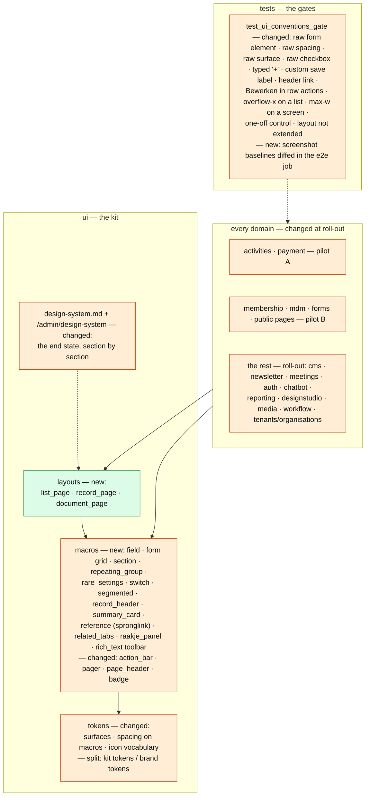

# Change Request 11 — GUI redesign 2: the end state of the screens, and the road there

**Project:** Web Portal "Raak Millegem"
**Status:** parked on 20 September 2026 · shaped on 30 September 2026 as the GUI's end state and roadmap · draft, for the business to read · not assigned
**Applies to:** admin list screens, the public homepage and cards, the admin assistant — GUI work deferred from the v2.5 design track (#913, #996).

> Once a parking lot for GUI work deferred from v2.5; since 30 September
> 2026 the change request that fixes **where the portal's screens are going**
> — the end state in B4 — and **how to get there** — the roadmap in B6. The
> pains it answers are listed in A2, one row each, measured; the candidates
> parked earlier are still in A6 as P-rows until one is taken up.

---

# Part A — The business

## A1. Reason to act — the trigger

Deciding every GUI candidate the moment it surfaces keeps widening a
release. v2.5 carried the design track plus four other work streams, so the
candidates that were not needed for v2.5 were parked here, to be decided
one by one later — "laten we dat enkel inbouwen in betalingen, de rest is
voor later; dan kunnen we stuk per stuk bekijken wat we nog doen en de rest
parkeren we naar later" (20 September 2026).

**The end goal, sharpened on 1 October 2026.** While validating the quick
wins on HDEV, Koen reported five corrections of shape in one day — a tile
with two amounts, a rare section between fields, URL fields side by side,
figures of one tile row at different heights, a title squeezed by its
buttons — and had each relayed to this change request. Not because they
should be fixed one by one, but because he does not want to report such
things any more: *"ons framework zou dit moeten regelen, verhinderen."*
That is the end goal in one sentence: **a convention of shape is never
again something Koen has to notice, explain or decide; the kit makes it or
a gate refuses it before a screen reaches him.** The measure is in A4 and
the sign-off in AC8.

**Background that shapes the end state without being in scope:** the
platform will be used by other organisations than RAAK — a company that
wants a webshop on it, another association with its own menu and brand.
That is a separate change request (the menu structure and more are fixed
for RAAK today); nothing in this one builds for it. But the patterns and
the style decided here are the platform's, not RAAK's: the end state keeps
apart what belongs to the **kit** (behaviour patterns, layout grammar,
control shapes, icons' meanings) and what belongs to a **tenant's brand**
(colours, fonts, wordmark, the icon set's look), so a second organisation
changes the second and inherits the first.

## A2. As-is process — how it works today, and where it hurts

Not one process but the screens and the behaviour patterns of the admin and
the public site as they are lived with today. Listed with the person who
uses them daily (Koen, 30 September 2026), one row per pain: which screen or
pattern, what hurts, and — where there is one — a first idea for a solution.
An idea is not a direction: the direction is chosen in Part B, per item,
with the usability arguments beside it.

| # | Screen or pattern | What hurts today | Solution idea | Source |
|---|---|---|---|---|
| 1 | **A repeating group inside a detail** — several e-mail addresses on a person; the same shape for contact details, products under a component, dates on an activity, options on a form field, lines on an order | Every time such a group is built, its behaviour and its look are described again from scratch: where the save button sits, how "make this the main address" looks, that the row title does not repeat per row, the size of the group's heading, the "add" button to the right of the heading. The multiple e-mail addresses (this week: #1223, #1229) were first built as a different screen — ugly, taking far more room than the group deserves — and then corrected point by point, each point a decision the person asking already made elsewhere. A lot of work for the asker, for a thing the application already does several times. | Name it once and build it once: a **repeating group** pattern in the design system (§4, next to P1–P12) with one macro that renders the heading, the "add" action at its right, the rows with their row actions, the one-among-many marker ("hoofdadres") and the save behaviour — rendered live on `/admin/design-system` like the other components. Every existing instance is listed under the pattern and migrated to the macro, so an issue can say "a repeating group of e-mail addresses" and nothing more. The gate that already checks that promised macros exist then guards it. | Koen, 30 Sep 2026 |
| 2 | **Cluttered edit screens** — the activity detail with its components (`_aa_detail.html`) as the example | The screen reads as if each field, radio button and button was added one under the other as it came up: 37 labels, 32 inputs, 7 radio or check controls and 4 action bars in one 422-line template, in one column. Nothing groups what belongs together (a product's price, member price, free and pay-on-site are four separate rows), settings and content sit in one stream, and the eye finds no rhythm. It looks amateurish next to the redesigned list screens. | A **form layout grammar** in the design system, as the list screens got one (§3.2): a screen is sections with a heading, each section a grid that lays related fields side by side on a desktop and stacks on a phone; a small set of control shapes per kind of choice (a segmented control for two or three options instead of a row of radios, a switch for a yes/no, a select above five); settings apart from content; one action bar per section or one per screen, never four. Written once with a live example, then each edit screen is laid out on it — the components screen first, as the worst and the most used. | Koen, 30 Sep 2026 |
| 3 | **Rarely used, discouraged settings take the front row** — the three external links on a component (`external_register_url`, `external_registrations_url`, `info_url`), and on the activity the poster URL (`poster_url`), the manual way from before the Design Studio | They date from the very start, when documents lived in Google Drive and registrations ran on external systems. They are still needed for the odd case and may stay, but they are used in perhaps 2 to 5 % of components, and the platform wants to *discourage* them — yet they take half of the component's form, three full-width fields, as prominent as the name and the price. | A pattern for **the rare and the discouraged**: progressive disclosure. Such settings live in a collapsed section at the bottom of the form ("Externe koppelingen" or "Geavanceerd"), closed by default, with a one-line summary when something is set ("2 externe links") and a short note that the platform's own registration is preferred. Open it and the fields are there as today — on the component its three links, on the activity its poster URL, so the discouraged path looks the same on both levels. The same shape serves every other rarely used group, so an issue can say "in the advanced section" and be done. Measure the real share on PROD before deciding the wording — 2 % and 20 % ask for a different default. | Koen, 30 Sep 2026 |
| 4 | **Saving behaves differently per detail screen** — a CMS page has a save button at the top and stays open; a meeting saves itself while you type; almost every other screen edits per card with edit → save / cancel | Three ways of saving on screens that are all "a record in detail". The design system decided one (§3.4 record management, P1 *edit and stay*: save and cancel at the bottom, the screen stays, a toast), but two screens went their own way without a rule that says when that is allowed. The user learns three habits for one job, and each new screen is a fresh argument. | Decide **one default** and write the **deviation rule** next to it, so a deviation is a decision and not a habit. The default is P1 — and row 14 makes it "whole screen, one save" rather than per card. Deviations are allowed by kind of screen, not by taste: **autosave** where the screen is a *document* — one long text, nothing a rule can refuse, losing typed text is the real risk (meeting notes; possibly the CMS body) — and never on a *record* with fields that validation can refuse; a save button at the top only on a document long enough that the bottom is out of sight, and then the same button at the bottom too. Each detail screen names its save model in one line in §3.4's register; the gate that reads templates checks that a screen declaring "record" uses the edit-toggle macros and one declaring "document" uses the autosave form — so a fourth way cannot appear unnoticed. | Koen, 30 Sep 2026 |
| 5 | **List screens: some are tables, some are cards** — the admin lists (Betalingen a dense table since v2.5; Leden, Activiteiten and others still cards) | Two shapes for one kind of screen, and the split follows the order in which the screens were redesigned, not a rule. The person using them daily calls it his own doing and wants one choice, applied consistently — this is P2 in A6, and it carries P1 (pagination) with it, because a table and a card list page differently. | Not "tables everywhere" or "cards everywhere" but **one rule, by place**: **in the admin every list is a table** — payments, members, registrations, users, activities, designs, all of them; a record that has a picture gets a thumbnail *column*, not a card. **Cards exist in two places only**: the **public site**, where an activity is browsed by its poster, and the **media library**, which is a grid of images because the image is the thing being chosen. That is the whole rule; it needs no judgment per list, it answers the doubt about Betalingen (a table), and it gives every admin list the sortable columns and the column chooser of P6. §3.2 already fixes everything above the list (header, KPI row, search, filters); the rule fixes the list itself. Then classify every list screen in one table in the design system, migrate the ones on the wrong side, and let the doubt about Betalingen (P2) be settled by the rule rather than by mood. On a phone the difference shrinks: a table row stacks into a card-like block, which is what makes the table safe as the admin default. | Koen, 30 Sep 2026 |
| 6 | **Pagination is there on some lists and not on others, sits in a different place each time, and does not always say how many** — the page-size choice (25 / 50 / 100) sometimes at the bottom, sometimes top right; the pager itself at the bottom; Wijzigingen says "1–50 van 312" while the AI calls list (Betalingen › info) says only "Pagina 1" | On Betalingen the person using it daily did not see that the list was paged at all: the pager sat bottom right, after a full scroll. Only Betalingen pages (measured by an external review, 30 Sep: the member list and the registrations list load everything; only the members' search path carries a limit), and where a list pages the controls are not where the eye looks first. The design system decided a pager (§2.3: server-side, 50 per page, `ui.pager()`, "x–y van n", hides itself when everything fits) but not its *place*, the page-size choice is not part of it, and it allows a second form — "Pagina n" with only previous/next, for a list whose total is not counted — which is what the AI calls list shows: the reader does not learn how many there are or where they stand. | **One pager, two places, one rule.** The fact that there are pages must be visible **before scrolling**: a compact count "1–50 van 312" in the toolbar row at the top, right of search and filters, with the page-size choice beside it — the place where every mail client and every ERP list puts it. The page navigation (vorige / volgende) repeats at the **bottom**, where the eye arrives after reading, and never only there. Both come from the one `ui.pager()` macro (extended with the size choice), so no screen can invent a third place; on a phone the top row keeps the count and the bottom keeps the buttons. And **one wording**: "x–y van n" everywhere — a list always knows its total (a count in PostgreSQL costs nothing at these sizes; where a log ever grows large, an approximate count "van meer dan 10 000" still says more than "Pagina 3"); the "Pagina n" form goes. Apply it to every list that pages (P1 brings Leden and Activiteiten), and the classification table of row 5 says per list whether it pages at all. | Koen, 30 Sep 2026 |
| 7 | **Read mode hides what could be filled in** — a card in read mode shows only the fields that have a value; a yes/no that is off disappears with them | You cannot see what a card *can* hold until you press "Bewerken": an empty field is simply absent, and a switch that is off is absent too, so "off" and "does not exist" look the same, so the map of the record differs between reading and editing, and the user does not know where something sits, or that it exists, until they open the editor. | **Read and edit share one map.** In read mode a card shows every field the editor has, in the same order and the same grid, the empty ones with a quiet placeholder ("—" in grey, or "niet ingevuld") instead of vanishing; a yes/no shows its state either way — an *off* switch or "nee" in grey, not nothing — so "not set" is readable and not mistaken for "not there". Switching to edit then changes the *controls*, never the layout — nothing jumps, nothing appears. Two exceptions, both by rule: the rare-and-discouraged section of row 3 stays collapsed in both modes, and a repeating group (row 1) with no items shows its heading, its "add" action and one line "nog geen …". This is the read-side half of the layout grammar of row 2; it goes into the same design-system section and the same live example. | Koen, 30 Sep 2026 |
| 8 | **The checkbox as the control for every yes/no** — 65 raw `type="checkbox"` inputs in the domain templates; the kit has no switch macro | A checkbox looks dated next to the rest of the redesigned screens, and it is used for two different things at once: a setting that is on or off, and a choice among several. Modern web apps show a **switch** for the first, and it reads better: the state is visible at a glance, on a phone it is a larger target, and it says "this is a setting". | **One rule, two controls, one macro each.** A **switch** for every boolean *setting* on a record — is active, publicly bookable, members only, requires a team name, free, pay on site — rendered by one `ui.switch()` macro, with its label on the left and the state word ("aan" / "uit") for the screen reader, and in read mode the same switch disabled (row 7). The **checkbox** stays where it belongs: choosing several out of a list (a form's checkbox question, the rows of a bulk selection when P3 comes) and an explicit consent. The rule lives in the design system §2.2 next to the field family; the UI gate that already refuses raw hex and `alert()` learns to refuse a raw `type="checkbox"` outside those two uses, so the 65 shrink to the ones the rule allows and no new one appears. A switch inside an edit-and-stay form does not save on its own: it changes with the form and is saved with it, and the toast of P1 says when. | Koen, 30 Sep 2026 |
| 9 | **Surfaces and their colours differ per screen** — some pages grey on a grey ground, some cards white on grey with the text on the card; this morning the public registration page and the public form, two screens of one solution, came in a different colour combination (#1380) | Every template picks its own ground and card colour: 224 raw `bg-white` / `bg-gray-50` / `bg-gray-100` classes in the domain templates. Two screens built by the same team in the same week look like two products, and the volunteer who uses both sides sees no family resemblance where §3.1 promises one. | **A surface scale, three levels, named once.** Tokens for the *page ground* (one grey), the *card* (white, with its border and shadow) and the *inset* (a light grey block inside a card), each with its text and border colours — nothing else. The card macro and the page shell apply them; a template names a surface, never a colour. The same three levels on the public side and in the admin: §3.1 keeps "family, not twins" for type scale, photos and decoration, but the ground and the cards are the same, so a registration page and a form can only look alike. The UI gate that refuses a raw hex learns to refuse a raw surface class outside the kit, and the 224 become a migration list. | Koen, 30 Sep 2026 |
| 10 | **Betalingen shows its totals three times** — the KPI tiles at the top (Netto te betalen · Ontvangen · Openstaand), a total row as the last row of the table, and a summary block under the table with payments, claims and a grand total | Three places for one set of figures; the eye does not know which one to trust, and the bottom two only appear after a scroll. The KPI row at the top is the standard (§3.2: the management summary, the quick look "what is the state of this module") — the other two are leftovers. One thing must survive their removal: the **open** position must stay unmistakable. Today the "Openstaand" tile shows the *net* balance and colours orange only when that net is above zero — so when open claims and open refunds happen to cancel out, the tile shows € 0 in neutral ink and reads as "nothing to do", which is wrong. | **Totals live in the KPI row and nowhere else**, on this screen and as the rule for every list with figures (the classification table of row 5 carries a "KPI row" column). The table's total row and the summary block go. The third tile becomes **"Nog af te handelen"** with the two amounts as its figures — "€ 120 te ontvangen · € 120 terug te betalen" — and the net balance as its small line; it colours when *either* side is open. So a coincidental net of zero never sits as the big number (Q19), still without a bigger bar and without a fourth place. | Koen, 30 Sep 2026 |
| 11 | **List screens are not all the same width** — some use the full width, others leave five to ten centimetres empty on each side and then scroll sideways inside the table | The admin shell defaults to a reading width (`max-w-5xl`, meant for forms, #620) and lets a screen opt into the wide one (`max-w-7xl`) by itself — so the width is a per-screen decision, and eight list templates answer the squeeze with `overflow-x-auto`: a scroll bar inside the table under a page that scrolls too. Two scrolls for one list, and the reader never knows whether the columns end where the table ends. | **Width by kind of screen, never per screen; no sideways scroll in a list.** A list screen — table or cards — always takes the wide width; the list layout sets the shell's width block itself, so no screen chooses. An edit or document screen keeps the reading width, because long lines hurt reading there. Inside a list there is no horizontal scrolling: a table fits its columns to the width, hides the secondary ones as the width shrinks (`hidden md:table-cell`, already the practice for status and balance) and stacks into blocks on a phone; what does not fit is a column too many, to be solved by the column chooser (P6), not by a scroll bar. The page scrolls vertically, with the browser, and nothing else scrolls. The gate on templates refuses `overflow-x-auto` on a list, so the eight become a migration list. | Koen, 30 Sep 2026 |
| 12 | **Detail screens differ in width and alignment too** — editing a household became wider a few releases ago; becoming a member on the public site is narrower; the public registration page (with the component chips on top) does not use its width and sits left-aligned, while the admin centres its screens | The same per-screen freedom as in row 11, on the screens where reading and editing happen. Measured: the admin shell defaults to `max-w-5xl` and three screens set `max-w-none` or `max-w-7xl` themselves; the public shell is `max-w-7xl` and the registration page narrows itself to `max-w-xl` *without* centring — hence a narrow form hugging the left edge of a wide page. Each screen chose; nobody chose for all. | **Two formats for a detail screen, fixed once**: on a **phone**, full width with the 16 px gutters the design system already prescribes; on a **desktop**, one reading width (`max-w-3xl`, about 770 px — long enough for a two-column field grid, short enough to read), **centred**, the same on the public site and in the admin. The detail layout sets it; a screen never does. Together with row 11 that gives the whole portal three widths and no more: *list — wide*, *detail — reading width, centred*, *phone — full*. The design system carries the table, the shells apply it through the layout blocks, and the template gate refuses a `max-w-*` on a screen's own root — the width is not the screen's to choose. The household form, "Word lid" and the registration page are the first three to fall in line. | Koen, 30 Sep 2026 |
| 13 | **Creating and editing the same thing differs by where you do it** — becoming a member on the public site creates a household in one screen: fill in, press save, pay, done; in the admin the same household is edited per card — the head member, the address, the members — and on some screens a single line inside a card is saved on its own | One record, two behaviours, depending on the door. The public flow is the one the volunteer finds natural; the admin makes the same person work three or four times for one change, and the difference is not a decision anyone took — the admin screens grew card by card. | **One behaviour per kind of screen, whatever the door.** The public creation and the admin editing of a household are the same screen type (a *record*) and follow the same save model — the one row 14 fixes. Where the public side is one form with one save, the admin side becomes one form with one save too; the per-card and per-line saves go, except where row 14's exception rule says so. The classification table (rows 5 and 12) gets a column "save model" per screen, public and admin on one line, so a difference is visible before it is built. | Koen, 30 Sep 2026 |
| 14 | **Too many save buttons** — 14 per-card edit toggles across the admin, and on some screens a save per line inside the card; once a change was lost because one of the small buttons was not pressed | Every card and some lines are their own editor with their own button. The user has to remember which of the several saves on the page is still open; a missed one is silent. And it contradicts the ideal the daily user names: *open the detail as a whole, change what you want, save once; what changed is written and lands in the change log; leaving the page with unsaved changes warns you.* | **One screen, one save, by default — with one rule for the exception.** A detail screen opens as a whole (read mode, row 7), "Bewerken" turns the whole screen into an editor, one save at the bottom (and at the top when the screen is long, row 4) writes everything at once; the service saves only what changed and the history rows say what — the change log already records per field. Leaving with unsaved changes warns, as a property of this editor kind (which brings back, for this kind, the promise dropped on 13 September as a *system* rule). Repeating groups (row 1) live inside that one form: add a row, change a row, remove a row, all committed with the screen. The **exception is by rule, not by size**: a part of a screen keeps its own save only when it is a *sub-record with its own lifecycle and consequences* — a payment, a registration line that reconciles money, a person's membership — because saving it is an action with effects elsewhere (P4), not an edit. Everything else, however complex, is one save. This is row 4's default made concrete: P1 becomes "whole screen, one save"; per-card editing stops being the norm and the 14 toggles become a migration list. | Koen, 30 Sep 2026 |
| 15 | **Editing a web page (CMS) is clumsy** — one long rich-text field (Trix) with its toolbar at the top: to insert an image at the bottom you scroll all the way up; indenting an image is two unobvious buttons; the whole thing reads as fiddly | The page editor is a single rich-text control stretched over a page's length, so every tool is where the page starts and not where the cursor is. Good enough for a paragraph, not for a page with headings, images and layout. Explicitly **not urgent** and only about the CMS pages; noted so it is not forgotten. | Two steps, far apart. **Now, if wanted**: a toolbar that sticks to the top of the viewport while the editor scrolls — one CSS change, no new library. **Later, when the portal aims at beautiful public pages** (a club or a company wanting it for its own site): a **block editor** instead of one rich-text field — a page is a list of blocks (heading, text, image with its alignment and width, gallery, call-to-action, embed), each with its own small toolbar where it sits, dragged to reorder. That is what makes professional pages editable by non-designers, and it changes how a page is stored, so it is its own change request. Europe First applies to the library choice then (Trix is Basecamp's; an EU-made block editor exists — TipTap, on ProseMirror, from Germany). **Parked as P8**; only the sticky toolbar is a quick win. | Koen, 30 Sep 2026 |
| 16 | **The icons on the buttons are gone** — download, upload, add and the like on the forms screens once carried an icon; after some release or refactoring they are plain text, and "+ Nieuw formulier" carries a typed plus instead | Measured: zero icons on the forms admin screens today, while the button macros *can* carry one (`lead_icon`); the labels carry a typed "+" — the loose-glyph remnant the icon rule (§1.4) already rejects for ⬇ and 📄. When the icons went is not traced; that they went unnoticed is the point: nothing says **when** a button has an icon, so a rebuild through the kit dropped them without breaking a rule. | **A rule for icons on buttons, with a vocabulary.** Three cases: a *text button* carries a lead icon **when its verb has an established glyph** — add, download, upload, delete, edit, copy, print, send, filter — and then always that glyph through `lead_icon`, never a typed "+" or arrow in the label; a *verb without a glyph* ("Formaat (voor AI)", "Importeren") stays text only; an *icon-only button* exists only in row actions and toolbars, with its `aria-label` (the gate already checks). The vocabulary is one table in §1.4, verb → Lucide glyph, next to the one-meaning-per-glyph table, and the gate learns two more things: a typed "+" at the start of a button label is red, and a label whose verb is in the vocabulary without its icon is red. The forms screens are the first to get their icons back — through the vocabulary, not by hand. | Koen, 30 Sep 2026 |
| 17 | **Importing a form from JSON: two ways in, and one step too many** — the import block offers a paste box *and* a file upload (the file wins when both are given); and the flow is: create a form, type its name, open it, import — and the import overwrites the name you just typed | The paste box was a concession that introduced a second concept for one action; the daily user wants it gone: a file can always be made, one way is simpler. And the creation step is wasted effort: a name typed only to be replaced. Low priority, noted as an optimisation. | **One way in, at the right moment.** The import is a **file upload only** — the paste box goes; `ui.upload_field` alone, as everywhere else a file comes in (§2.6). And the **creation screen offers the import as a way to create**: next to "+ Nieuw formulier" the choice "…of importeer een .json" creates the form *from* the file, name included, so nothing is typed twice; the import on an existing form stays for replacing its build-up (with #665's refusal once it has submissions). One concept — a file — in two places that make sense. | Koen, 30 Sep 2026 |
| 18 | **Two imports, one with a dry run and one without** — the member import from the national report shows what it will do and asks before it does it; the JSON import of a form replaces the form's whole build-up on one click behind a confirm text | The design system has the pattern (P6 *Import in steps*: dry run → report → an explicit commit whose label names the consequence; "forbidden: a commit without a dry run") but scopes it to "bulk input that can go wrong halfway", so the form import was built outside it — and it is exactly the kind of action where you want to see the consequences first: fields added, changed, removed, answers affected. | **Every import of data follows one behaviour: show what you are about to do, then "doe maar".** P6's "when" becomes *any upload or import that creates, updates or deletes records* — the member import, the form JSON import, and every import to come — with the report always in the same three lines: *nieuw · gewijzigd · verwijderd*, each with a count and the names, plus the consequences ("3 antwoorden op inzendingen vervallen"). The commit button names the consequence; leaving before it changes nothing. The same principle already governs the command line (`raak run`: dry run by default, `--apply` does what the dry run showed), so screen and script say the same thing. The form import is the first to be brought under it. | Koen, 30 Sep 2026 |
| 19 | **A good pattern exists in one place and not in the others** — from an activity you see its registrations, per component, on a sheet beside it, and from there the payments linked through those registrations; a person's page has a registrations tab too, but a household's does not, and on the public side a family cannot see for which activities it is registered and whether it has paid | Measured: the related lists exist as hand-built screens — registrations per activity and per person; payments per activity, per household, per registration — each its own build; the family portal shows no registrations at all. Yet "for which activities are we registered, and is it paid?" is a question the association gets asked. | **The related-records pattern, named and generalised.** The detail of a core entity — activity, household, person, registration — carries one fixed set of tabs to its related records, in one order (registrations · payments · …), each tab being the *list screen* filtered on that entity, not a new screen: the same table or cards, the same KPI row, the same pager (rows 5, 6, 10, 11), with the filter shown and removable. Written once in the design system next to P8 (*list, detail, edit*), applied to the four existing screens first, then to the household and the person. The **same pattern on the public side**: the family portal gets a tab "Onze inschrijvingen" — the upcoming activities the household is registered for, with the payment state per registration (betaald · openstaand · ter plaatse) — the member's own answer to the question. Decide on the fine-tuning first (which entities, which tabs, which order), then implement where it is wanted. | Koen, 30 Sep 2026 |
| 20 | **Jumping from a detail to the record it points at exists in one place and not in the others** — on a person's registrations tab each row has "Open activiteit" (the kit's `ui.spronglink`, used on two screens — a person's registrations and the werkbank — and shown on the design-system page); in a registration you read the household's name and the activity's name and cannot click through | Elsewhere a detail names its related records as text. To look at the household behind a registration you leave the screen, open the list, search, open. An application designed twenty-five years ago had it: a small red mark next to every reference, one click, and you were on that record's detail. Not a priority; a pattern to fix. | **The reference is a link — always, and always the same link.** Wherever a detail shows a field that *is* another record (the household of a registration, the activity of a registration, the person of a payment, the component of a product), the value is rendered by one macro — `ui.spronglink`, which already exists, generalised and given its English name: the name as a link to that record's detail, with a small consistent glyph after it (the successor of the red mark, from the vocabulary of row 16), same hover, same colour, and the way back of P3 (*the way back*) so the jump is not a dead end. Row 19 is the same idea in the other direction — from the record to the lists that point at it; together they make the portal navigable as a graph: down to the lists, up to the owners. One macro, one rule in the design system, and the template gate flags a related name rendered as plain text where a reference macro exists. | Koen, 30 Sep 2026 |
| 21 | **A member registers publicly without logging in and nothing tells them they could** — the address they type is a member's, but they are not signed in, so the registration is not tied to their household and they miss the member price | A member who lands on the registration page from a mail or a share link fills it in as a guest. Nothing says "you are a member, sign in first". The wish: a **non-blocking** hint when the address is recognised — "Ben je lid? Log je dan eerst aan" with the link — and they can carry on regardless. Usability, and a little new functionality. | **The hint, yes — but for everyone, not on recognition.** Recognising the typed address means the public form looks it up, and today it deliberately never does (`registration_form.py`: whoever types a member's address would get the member price); a hint on recognition leaks the same fact in the other direction — type any address and learn whether it belongs to a member. So the hint is shown **unconditionally**, once, above the contact fields of every public registration and of "Word lid": *"Lid van RAAK? Log je eerst aan: dan staat de inschrijving bij je gezin."* with the sign-in link that returns to this page (P3). No lookup, no leak, the same nudge for the person it is meant for; a signed-in member never sees it. The design system gets it as a small pattern (*the member nudge*) so it looks the same everywhere. | Koen, 30 Sep 2026 |
| 22 | **Buttons take too much room, and say and sit differently per screen** — Opslaan, Verwijderen, Annuleren as three large buttons, on many cards, and on a phone they wrap and jump (#1367, #1387: buttons pushing a 390 px page to 682 px); editing a meeting's header ends in "Annuleren" and "Wijzigingen bewaren" at the bottom, where other screens say "Opslaan" and put it at the top right | 34 action bars and 10 separate delete buttons across the admin, each bar three buttons of the same weight and size. Three equal buttons say nothing about which one matters; on a card they take a full row; on a phone they break the line or the page. | **Fewer bars, and a hierarchy inside the bar.** Fewer: rows 14 and 2 leave one action bar per screen (or per sub-record with its own lifecycle), so most of the 34 disappear with the per-card editors. Inside the one bar, three weights instead of three equals: **one primary** (Opslaan, filled), **cancel as a text button** (no border, no fill — it is the way back, not an action), and **delete apart** — a red text action at the far left, or in the `⋯` menu of the record header (row actions already cap at two plus `⋯`), never a third big button beside save. Sizes: `sm` in bars, `md` only for the one call to action on a public page. On a phone the bar sticks to the bottom of the viewport, primary full width, cancel as text beside it, delete in the menu — nothing wraps, nothing jumps, and the save is reachable without scrolling back. **The words and the place are one too:** the primary says **Opslaan** (never "Wijzigingen bewaren" or another variant — the macro's default label, and a custom label only for a consequence that must be named, as P6's "Definitief importeren"), the way back says **Annuleren**, the destructive one says **Verwijderen**; the bar sits at the **bottom** of the editor on every screen (and repeats at the top only on a document long enough, row 4), never top right on one screen and bottom on another. Where a record can be deleted — a meeting that does not take place is one — the delete is always present in that same place, the `⋯` of the record header, so the user never hunts for it. `ui.action_bar()` renders it so, with its default labels; the gate flags a custom save label that is not a named consequence; the screenshot set at 390 px (the merge-gate eye) is the proof. | Koen, 30 Sep 2026 |
| 23 | **Spacing and grouping are decided per screen** — the distance between fields, the margins left and right, how many fields share a row, which fields sit together in a zone: each screen gets the best insight of its day, and no two agree | The tokens exist (§1.3: one 4 px scale — 12 field gap, 16 card padding, 24 between cards, 32 section) but nothing says *where each one goes* on a form, and nothing says what to group. Measured: 1 215 raw spacing classes in the domain templates — every template spaces itself. The address grid is the one grouping rule written down (a fixed UI decision), because it was argued once; every other grouping is improvised. | **The form grid, written once — the missing half of row 2's layout grammar.** Three rules. **Rhythm**: page gap > section gap (32) > field gap (12) > label gap (4), from the tokens, applied by the section and field macros — a template never writes a spacing class. **Columns**: at the reading width (row 12) a form is a two-column grid; a field is *half* by default, *full* when its content is long (a description, a URL, a textarea), *quarter* when it is a number or a code; on a phone everything is one column. **Grouping**: fields that describe one thing sit in one section with a heading, in the order a person would say them; fields share a *row* only when they are read together (street · number · bus; price · member price; from · to) — the address grid is the first instance, not an exception. Zones are sections; a section is a card or a heading in a card, never a nested box. The gate refuses a raw spacing class on a form element, and the 1 215 shrink as screens are laid out on the grid — the activity detail first (the pilot). | Koen, 30 Sep 2026 |
| 24 | **Small layout faults reach the person who validates** — "two labels stuck against each other", a badge out of line, a clipped plus: things that have to be *reported* after the build, screen by screen | Such a fault can only exist because a screen writes its own markup around a field: measured, 456 raw `<label>` / `<input>` / `<select>` / `<textarea>` elements in the domain templates next to the kit's macros, and every one of them is a place where a distance is the template's to get wrong. Standards on paper do not stop it; only markup that the template cannot write wrongly does. And nothing compares a screen with how it looked yesterday — the screenshot set exists, but it is looked at, not diffed. | **Two mechanical layers, so it cannot happen and, if it does, it is seen before the validator sees it.** First, **the kit owns the layout**: a field is only ever `ui.field(...)` — label, control, help and error placed by the macro on the form grid of row 23 — and a template composes sections and fields, never a raw form element; the UI gate refuses a raw `<label>`, `<input>`, `<select>` or `<textarea>` in a domain template, and the 456 become the migration list of rows 2 and 23. Two labels cannot touch when no template positions a label. Second, **visual regression in CI**: the 390 px screenshot set gets a baseline per screen in the repository and the e2e job fails on a pixel difference above a small threshold, so a spacing regression is red on the pull request — before the merge-gate eye, and long before HDEV. The eye stays for judgment; the diff catches what eyes miss on the fortieth screen. | Koen, 30 Sep 2026 |
| 25 | **The summary card sits right on one screen and left on another** — on the activity detail it is on the right, on the newsletter on the left | The same element, two positions, decided per screen. The reader who learned one screen looks in the wrong place on the next. | **Right, always — and on a phone, first.** On a desktop the main content and the form take the left column, in reading direction, and the summary card sits in a narrower column on the **right**: that is where every record-centred application puts the "at a glance" panel (the order page of a shop, the sidebar of a pull request), so the eye expects it there, and it keeps the form's reading width (row 12) intact. On a phone there is no side column: the summary becomes a compact strip **above** the content — state, the two or three key figures, the main action — because it is what you check before you scroll. One macro (`ui.summary_card`) with those two renderings, so no screen chooses; the newsletter moves to the right. | Koen, 30 Sep 2026 |
| 26 | **Opening a record from a list: sometimes a "Bewerken" button on the row, sometimes the row itself, and on the payments table a click on the row opens nothing** — activities and payments show the button at the right; newsletters and meetings do not, you click the row; on Betalingen the row is inert and the detail unfolds in place through the button (§3.4's inline disclosure) | Three ways to do the most frequent thing on a list. Measured: five list templates carry a "Bewerken" row action, the others rely on the row, and the payments table answers a click with nothing. The daily user's preference: no button — click the row, and you are on the record, where you can edit if you want. | **The row is the link; "Bewerken" is not a row action.** Opening a record is done by clicking the row (or the card), everywhere: the whole row is the target (the stretched-link pattern the design system already names, §2.7), with a visible hover, a focus ring for the keyboard, and on a phone the whole card as the 44 px tap target. Editing is not a list action at all: it happens in the detail, from read mode (row 7) through its one "Bewerken" (row 14). The row actions (`⋯`, §2.4) keep only what is *not* opening — delete, duplicate, a quick state change — and the gate refuses a "Bewerken" among them, so the five become a migration list and the shapes become one. **One gesture, two depths, by place:** on a *top-level* list (Betalingen, Leden, Activiteiten) the row opens the **record page**; inside a *record's related list* (the payments of an activity, the lines of a registration — the embedded lists of rows 19 and 29) the same click unfolds the record **in place** as a preview, with the jump link of row 20 to its full page — because there the context is the parent and leaving it would lose it. The inline disclosure stays for that second depth only; a top-level table never uses it, and no row is ever inert. | Koen, 30 Sep 2026 |
| 27 | **To take along, not a pain yet: the width jump between a detail and its related list** — reading an activity at reading width, centred (row 12), then opening its "Betalingen" tab, a list at full width (row 11): the screen would widen with a jump | Rows 11, 12 and 19 together create this: a record page holds both a detail and lists, and the two widths meet on one page. Noted before it is built, so the experience is designed rather than discovered. | **One frame for the record page; only the inner column changes.** A record page — header, summary card (row 25), the tabs of row 19 — takes the **wide** frame of a list screen, always. Inside it the "Gegevens" tab centres its form at the reading width (a column within the frame, not a narrower page), and a related-list tab fills the frame. The shell, the header, the tab bar and the summary card do not move between tabs; only the content column below the tabs is narrow or wide, and the switch happens inside a stable frame — the same way a mail client keeps its chrome and changes the pane. On a phone there is one width anyway. So the rule of row 12 is refined: *reading width* is a property of a **form**, not of a page. | Koen, 30 Sep 2026 |
| 28 | **Action point: "‹ Terug naar alle activiteiten" sits on the activity and not on every entity** | The way back (P3) is a button on some record pages and absent on others; the user who has it once expects it everywhere. | Decide once and apply everywhere: every record page carries the same way back, in the same place (the first line above the header, as the board registration page has it), to the list it came from — with the list's filter state preserved, which P3 already asks. One macro, one gate line: a record page without it is red. | Koen, 30 Sep 2026 |
| 29 | **The payments tab inside an activity is a heavy screen** — the activity's header, its summary, the record actions on the right (photos, Design Studio, AI), the tabs (overzicht · inschrijvingen · betalingen); then, under *Betalingen*, the three KPI cards, the status sheets (alle · openstaand · betaald · terugbetaald), the search, the status filter, export .ods, AI, the line "4 boekingen, recentste eerst, gegroepeerd per inschrijving, alleen finance" — and only then the table | All of it is relevant; nothing asks to be thrown away. What makes it heavy is not the content but **two full screens stacked**: the record page with all its chrome, and under it the complete payments list screen with all of *its* chrome. Each was designed to stand alone; together they say everything twice. | **The embedded list is a lighter variant of the list screen, not the whole screen inside another.** One list component with two renderings: *standalone* (everything it has today) and *embedded* (row 19), which drops what the record already gives and folds the rest: no page header; the KPI figures become one line of three numbers **in the summary card** (row 25), which already shows amounts; the status sheets become one status chip filter in the toolbar; the toolbar is **one row** — search · status · count — with export and AI in its `⋯` (rarely used per visit, row 3's principle); the group/sort line becomes a small caption over the table. The record actions on the right (photos, Design Studio, AI) go into one "Acties" menu on the header, shown once for the record rather than as a row of buttons. Result under *Betalingen*: one toolbar row and the table; above it the record's header, summary and tabs — the frame of row 27. Nothing lost: every control is one click away, and the standalone Betalingen screen keeps its full layout. Recognisable, because it is the same list, lighter, in the same place on every record page. | Koen, 30 Sep 2026 |
| 30 | **A blue name that leads somewhere else than its name says** — on the person's registrations tab the name "Koen Renders" is blue; clicking it opens the *registration*, where the reader expected the household; the component's name, which the registration is about, is plain | A link's text is a promise about its target. When the name of a person opens a registration, the promise is broken and the reader stops trusting blue. And the row already opens the registration by itself (row 26), so the blue name was never needed for that. | **The link text names its target, always.** Blue on a name means "go to that record": a person's name goes to the person, an activity's name to the activity (`ui.spronglink`, row 20). What is not a record's name is not blue: opening the row is done by the row (row 26), and a component's name is not a destination — it stays plain, or it is the row's title. One line in the design system under P8, and the gate flags a link whose text is a person's or activity's name pointing at another kind of record. | Koen, 30 Sep 2026 |
| 31 | **"+ Nieuw" is top right on one screen and left under the title on another** | The rule exists for list screens (§3.2: the create button right-aligned in the page header row, "+ Nieuwe <item>", no exceptions) and, measured, all list screens honour it on a desktop — the button sits in the header's call slot. Where it drifts is **below the page**: a create inside a record or a card ("+ Persoon" in a household, "+ Onderdeel" in an activity, "+ Optie" in the form builder) has no rule and lands wherever the section was drawn; and on a **phone** the header row wraps, so the button drops under the title, left. A rule that is not gated and stops at the page level is not one rule. | **One rule at every level, gated.** A create sits **at the right of the heading of the thing it creates into**: the page header for a list, the section heading for a group inside a record (the repeating group of row 1 gets it from its macro), never in the body and never at the bottom. On a phone the heading row does not wrap: the title truncates and the button stays at the right, compact ("+ Nieuw", or the icon alone with its `aria-label` when the title needs the room). The gate: a primary button whose label starts with "+" is red unless it is rendered inside a `page_header` or `section_header` call slot — the rule of row 16 then also removes the typed "+" in favour of the *add* glyph. | Koen, 30 Sep 2026 |
| 32 | **Raakje looks and behaves differently per place** — on the public site a floating icon; in the admin a button; sometimes a page of its own (`/admin/rapporten/raakje`), sometimes an overlay in front of the record, and on the newsletter a right-hand panel with selectors above it (past and future activities to pick) | The design system made the *controls* one (§2.11, #1075, #1115: one modal, one row of controls) but not the *invocation* or the *place*: three surfaces and two triggers for one assistant, so it is not recognisable as one thing. The wish: always callable the same way, always in front of or beside the screen, big enough and not too big, public and admin alike. And a vision behind it: Raakje should be able to take over data entry — "maak een activiteit aan" and it knows which objects an activity needs, what is required, and fills it in while you talk or type, then "make the poster". | **One trigger, one surface, one place — and the screen keeps its own selectors.** The **trigger** is the same control in the shell chrome on both sides (the `sparkles` button in the header bar of the admin and of the site; the floating bell goes), the same everywhere. The **surface** is a **side panel docked on the right**, not a modal: on a wide screen it sits in the column the reading-width form leaves free (row 12) — beside the record, so Raakje can fill the form while the user watches it happen, which the data-entry vision needs; on a phone it is a bottom sheet over the page. The assistant page goes: it becomes the panel opened on an empty context. **What the screen has selected is Raakje's context** (#1060): the newsletter's activity picker is a control of the newsletter screen, not of the panel — Raakje reads the selection, it does not carry it. Recognisable because the same button always opens the same panel in the same place. Parked with it, as **P9**: Raakje as the data-entry agent, filling a record's form from a conversation — the reason the panel must sit beside the form, not on top of it. | Koen, 30 Sep 2026 |
| 33 | **Where Raakje can be called from in the admin is decided per screen** — measured: an `AI · <Scherm>` button on the activity record header, on the payments screen and on the reports; nowhere else, and not on a list screen or a person's detail | Which screens offer Raakje follows which screens happened to get an overlay, not a rule. The daily user's rule: Raakje is offered for a module when it can **read** its data (the module is in the reporting universe) or **act** on it (it can create or change its records) — and then it is offered at both levels, the module's list and each record's detail. | **Offered by rule, in one place per level.** A module is *Raakje-enabled* when at least one holds: its objects are in the reporting universe (`reporting/universe.py`), or its facade exposes commands Raakje may run (the agent of P9, later). For an enabled module the trigger of row 32 is **on** — in the header bar on its list screen (context: the module, the filter) and on each record page (context: the record) — and for a module that is neither, the trigger is **off**, greyed with "Raakje kent deze gegevens nog niet" on hover, never absent, so the place stays the same. The enabled set is one table in the design system (§2.11), derived from the universe and the facades rather than typed by hand, and the gate asserts that every screen of an enabled module renders the trigger and no screen of another module does. The per-screen `AI · <Scherm>` buttons go: one trigger, one rule, no exceptions per screen. | Koen, 30 Sep 2026 |
| 34 | **A module's configuration is reached through a button named after one of its parts, and sometimes from a second place too** — on Vergaderingen the header button says "Vergaderkring" while it manages more than the circle, and under the list a stray sentence "De vergaderkring telt 3 personen. Beheer de kring" links to the same page again; on Nieuwsbrieven the same kind of button says "Instellingen" | Measured on the list headers: Vergaderingen → "Vergaderkring", Nieuwsbrieven → "Instellingen" (and "Abonnees"), Formulieren → "Formaat (voor AI)", the others nothing. Three names for the same idea — where a module's configuration lives — one of them names a part rather than the whole, and one module offers it twice on one screen. | **"Instellingen", the moment a module has configuration.** One name, one place, one glyph: a secondary button "Instellingen" with the *settings* glyph (the gear, which by §1.4 means settings and nothing else) at the right of the list's page header, next to "+ Nieuw", for every module that has configuration; its page holds all of that module's configuration (the meeting circle becomes a section of Vergaderingen › Instellingen; the newsletter's already is). A module's *other* records (Abonnees) are a related list, not settings, and keep their own button; a reference document ("Formaat (voor AI)") is a link inside the settings page, not a header button; and the sentence under the meetings list goes — a count of the circle, if worth showing, is a KPI tile (row 36), not a footnote, and the way to the settings is the one button. The design system names it in §3.2 as an optional slot of the records-list header — [+ Nieuw] [Instellingen] — and the gate refuses a header button that leads to a settings page under another name, and a screen that links to the same settings page from two places. *Weighed against two alternatives and kept:* naming each button after its part (rejected — it names one part of the configuration and hides the rest, the Vergaderkring case); one global settings page with a tab per module (rejected — far from the module, and the roles differ: module settings are the organiser's, the tenant's settings under `/admin/tenants` are the operator's and keep their own place and name). "Instellingen" is the word every application uses for this, so nothing has to be learned. | Koen (suggestion), analyst (weighed), 30 Sep 2026 |
| 35 | **A header button that only repeats the menu** — on Organisaties a button "Naar de tenants" at the right of the page header, while Tenants is one click away in the menu on the left; on the AI-Raakje page a button to the reports, while Rapporten is in the menu too (noted apart from row 32, which may fold that page into the panel) | A header button is a promise that this is an action or a place of this screen; a link to another module's list is neither, and the menu already has it. It costs a slot in the header, draws the eye, and teaches that header buttons may point anywhere. | **The page header holds only what belongs to this screen; navigation is the menu's.** The header's slots are fixed by rows 31 and 34 — [+ Nieuw] [Instellingen] — plus at most one action of the screen itself (export, print); a link to another module is never one of them. Going elsewhere is the menu, or a jump link from a record that points there (row 20), or a related-records tab (row 19). "Naar de tenants" and the Raakje page's button to the reports go; the gate refuses a header button whose target is another module's list. | Koen, 30 Sep 2026 |
| 36 | **The activities list: a KPI that cannot be found, and a count that means nothing on some rows** — the KPI row says "Open inschrijvingen 13" but no filter or row shows which they are; the cards say "0 inschrijvingen" on an activity nobody can register for (a photo hunt with no registration at all) | A KPI that does not lead to the rows it counts is a number without a use; a count on a card that has no meaning for that card ("0 inschrijvingen" where registration does not exist) reads as a problem that is not one. One screen, but the shape repeats: what a KPI row and a card show was chosen per module, with no rule about relevance. | **Two conventions, for every list.** *(Amended 2 Oct 2026, block 2: a tile is a key figure in plain text and never a filter; the way to the rows is the toolbar's chip with the same name — B10.)* *KPI tiles*: a tile shows a figure the reader can act on **and** it is a filter — clicking it filters the list to the rows it counts (as the payments' status tabs do). A tile therefore says **what it counts and which rows open**: "Toekomstige activiteiten 4" counts activities and opens those four; "Activiteiten met een volzet onderdeel 3" counts activities (not components — eleven full components may belong to three activities) and opens those three; a figure that is a sum rather than a count ("Netto te betalen € 4 210") opens the rows it sums. A figure that can do neither is not a tile. For activities the two tiles become *toekomstige activiteiten* and *volzette onderdelen*; "open inschrijvingen" goes or becomes a filter. *Cards and rows*: a card shows only what is **relevant for that record** — a value is omitted, not zeroed, when the concept does not apply (no registration count on an activity without registration; no "volzet" on a component without a maximum); what is shown is the same three or four things for every record of the list, in the same order, so the eye scans. Both live in §3.2 (the records list) with one live example, and the classification table of row 5 gets two columns — *tiles* and *card fields* — per list. | Koen, 30 Sep 2026 |
| 37 | **"Wat Raakje weet" manages three kinds of things on one scrolling page, with a control that exists nowhere else** — documents first, then, far below, CMS pages, then notes (three `h2` groups in one list); each card has "Toon gelezen tekst / Verberg gelezen tekst", a disclosure used on this screen only | Two faults. The reader cannot see what the page is about without scrolling: three kinds stacked assume you already know they are there. And the read-text toggle is a one-off: a control invented for one screen, so nobody recognises it, and it duplicates what the detail is for. | **Tabs for several kinds on one page; the detail for the text; no one-off controls.** A page that manages more than one kind of object shows them as **tabs** with the count in the label — *Documenten (12) · Pagina's (4) · Notities (3)* — one kind visible at a time, the page header saying what the whole is about; the same shape as the related-records tabs of row 19, so it is already familiar. The read text is not on the card: the row opens the detail (row 26) and the detail shows the text — read mode, row 7. The toggle goes. And the general rule it stands for: **a control that exists on one screen only is either promoted to the kit, with a name and a place in the design system, or removed** — the gate that checks promised macros exist gets its mirror: no interaction (an `x-data` toggle, a bespoke button) in a domain template that the kit does not provide. Row 3's collapsed section is what the external links get instead of this toggle. | Koen, 30 Sep 2026 |
| 38 | **The meetings list says the status twice** — each row shows the status badge ("Verslag verstuurd", green) *and*, at the right where actions sit, the same words as plain text ("verslag verstuurd", "agenda verstuurd") | Measured in the list partial: the badge from the code list (`code_label`, `tone`) and, two lines later, a hand-written text at the right that repeats it — in the place of a row action, so it reads as one and is not. The daily user likes the status words; he does not want them twice, and he wants the row to open the detail. | **One status, in the badge.** A row states its status once, as the badge the code list gives it (§2.5) — the badge *is* the status, coloured by its tone — and nothing else on the row repeats it in words; the right of the row holds row actions or nothing (row 26: the row opens the detail). The general rule: **a fact appears once per screen, in the element made for it** — a status in its badge, a count in a tile (row 36), a setting behind Instellingen (row 34); the gate flags a row that renders a `code_label` twice. | Koen, 30 Sep 2026 |
| 39 | **The record header is built by hand per screen** — on a meeting the status badge ("Verslag bezig") sits on the line of the buttons, and the header's own fields are edited through a button that names them ("Datum, uur, locatie", with a pencil); on an activity the badges sit in the title and the date and place under it, and editing is "Bewerken" | Measured: the kit has a `page_header` for lists and no record header; the activity draws its own (`_aa_recordkop.html`: title, badges, facts line, actions), the meeting draws another (`_vg_document.html`: badge beside the buttons, a bespoke edit button for three fields). Same element, two builds, and the status lands wherever the builder put it. The pencil button exists because a meeting is a *document* (row 4): its body autosaves, so its header fields needed an editor of their own — and got a button named after the fields instead of the one word every other screen uses. | **One record header, from the kit.** `ui.record_header` with fixed slots: the way back above it (row 28); the **title with its badges in the title line, status first** (§2.5 — the badge is the status, and it lives in one place on every record); the **facts line** under the title (date · time · place, or what the record's key facts are); the **actions** at the right as one "Acties" menu (row 29) plus the one primary of the screen; the summary card (row 25) and the tabs (row 19) attached. Editing the header's fields is **"Bewerken"**, one word, on every record — on a *document* screen it opens the header's small editor (the body keeps its autosave), on a *record* screen it opens the whole (row 14); never a button named after the fields it edits. The activity and the meeting are the first two to move onto the macro; the gate refuses a title-and-badge block in a domain template outside it. | Koen, 30 Sep 2026 |
| 40 | **The rich-text editor behaves differently on the newsletter and on a page** — the newsletter puts "Activiteit invoegen · Kalender invoegen · Bijlage invoegen · Afsluiting invoegen" as buttons beside the header, hides the HTML button and shows no undo/redo; the page puts an "Afbeelding" button and an HTML-source toggle *inside* the editor's own toolbar, in grey, with undo/redo | Measured: one editor (Trix, through `ui.rich_text`), extended in two different ways — the newsletter inserts HTML snippets from buttons outside the toolbar, the page adds its own buttons and an Alpine source toggle to the toolbar, and each screen hides different toolbar groups. Two toolbars for one editor: the writer who learned one is lost on the other. | **One editor, one toolbar, one insert slot.** `ui.rich_text` renders the **same toolbar everywhere** — the format groups, lists, link, undo/redo, and the HTML-source toggle when the screen allows it — hidden until focus by one rule, not per screen. What differs per screen is only *what can be inserted*, and that goes into **one "Invoegen ▾" menu in the toolbar**, always in the same place, fed by the screen as a list of (label, glyph, snippet or picker): the newsletter's four items, the page's image from the library, a meeting's agenda point later. The screen supplies content; the macro supplies the behaviour and the look. No `trix-toolbar` markup, no extra button and no toolbar CSS in a domain template — the gate refuses them — and the sticky toolbar of row 15 comes with the macro, so both screens get it at once. | Koen, 30 Sep 2026 |
| 41 | **The newsletter's "Raakje schrijft mee" panel owns choices that are not Raakje's** — top right, the panel lists the past activities, the coming activities (the next three months) and the meeting reports since the last newsletter, each with checkboxes; meanwhile the content's own "Kalender invoegen" inserts the coming activities without that choice, and there is no manual "voorbije activiteiten invoegen" at all | The selection of what the newsletter covers has been filed under the assistant, so the person writing by hand does not get it and the person writing with Raakje ticks boxes that are really the newsletter's. And the meeting reports are a choice that need not be one: a newsletter covers the past month, exceptionally two, so "the reports since the last newsletter" is always the right set — and Raakje's text is a suggestion that is read before it goes out. | **The screen owns the selection; hand and Raakje use the same one; what has one right answer is not a choice.** The activities to cover — past since the last newsletter, coming in the next three months, each activity tickable — become a section of the **newsletter screen** (the frame of row 32: selectors are the screen's, Raakje reads them). Two manual inserts use it: "Kalender invoegen" (the coming ones ticked) and a new **"Voorbije activiteiten invoegen"** (the past ones ticked, as text to edit); Raakje writes from the same ticks — so anyone can do everything by hand, and Raakje can do all of it too. The meeting reports lose their checkboxes: Raakje always uses the reports since the last newsletter, said in one line of the panel, nothing to tick. The panel itself becomes the docked Raakje panel of row 32 with the newsletter as context. | Koen, 30 Sep 2026 |
| 42 | **"Versturen" on the newsletter reads as "send now", while it opens a step in between** — the writer hesitated, afraid the mail would leave at once; it did not, there is a send page first. And the editor carries a card "Zo vertrekt hij" bottom right, on a screen that already holds a lot | Measured: the newsletter's buttons say "Versturen" (twice) and, in one place, "Versturen…"; the meeting says "Verstuur agenda" / "Verstuur verslag". The same word for a button that *does* it and for one that *leads to* it, so the reader cannot tell, and hesitates — on the one action that cannot be undone. | **A button says whether it acts or leads on, by one convention.** A button that opens a further step ends in an **ellipsis** — "Versturen…" — the convention every desktop and web application uses for "a dialog or page follows"; a button that executes an irreversible action names the consequence — "Verstuur naar 312 abonnees" — and sits on that last page only (P6's shape: report, then a commit whose label says what happens). The card "Zo vertrekt hij" is that report: it moves to the send page, where it is read at the moment it matters, and the editor loses one card. The meeting's "Verstuur agenda" and "Verstuur verslag" follow the same rule. One line in §2.1 (buttons), and the gate flags a button label that names an irreversible action without a consequence in it and without the ellipsis. | Koen, 30 Sep 2026 |
| 43 | **The organisation and tenant screens look like no other, and not like each other** — the organisation: no cards, a button back to the list, one long form ending in Annuleren / Opslaan at the bottom; the tenant: Opslaan / Annuleren at the *top*, above them a line "Code: /platform" whose purpose is unclear, a button "De organisatie" and, at the far right, "‹ Alle tenants" as a button; the record pages elsewhere have a header with badges, a summary, cards or sections, and their own way back | Measured: the organisation detail (`admin_organisatie.html`, 110 lines) is built from the kit — a page header, five section headers, labels and inputs, an action bar — and yet reads as foreign, because it uses the *list* page header where the others draw a record header, has no summary card, and lays its sections as one plain column. The tenant page (`admin_tenant.html`) is the same story in another arrangement: its action bar sits at the top, the way back is a button at the right instead of the line above the header (row 28), the jump to the organisation is a button rather than the reference link of row 20, and "Code: /platform" is the tenant's URL prefix shown as a bare fact line without a label a reader understands. Both are record pages built from the kit's parts without the record page's *shape*; the parts are right, the assembly is not. That is what happens when a screen type exists as a description and not as a layout. | **The record page is a layout, not a description.** Rows 12, 22, 25, 27, 28 and 39 together define it: the way back, the record header with its badges and facts line, the actions menu, the summary card on the right, the sections on the form grid in the reading-width column, one action bar at the bottom. That shape becomes **one layout template** (`record_page.html`, with blocks for header, summary, sections and bar) that every record page extends — organisation, activity, meeting, household, person — so a screen cannot assemble the right parts into the wrong shape. The organisation and the tenant move onto it first: they are the smallest, and the two that show the gap most clearly — the way back above the header, the organisation as a reference link in the facts line, the code as a labelled fact ("Adres op het platform: /platform") or in the settings section, the bar at the bottom. The gate: a template that renders a form for a record without extending the record layout is red. | Koen, 30 Sep 2026 |
| 44 | **Users are edited on their card: one line with an "actief" tick and a tick per role** — three roles today, fitting on a row; a fourth is certain (ledenadministratie) and more will follow, and a row of ticks will not hold them | The users list was built as the one list without a detail — "an account is one line with role ticks, no editor page belongs to it" says its own template — because three roles fit. The moment roles grow, the row breaks, and the users screen becomes the one place that edits differently from every other record. The daily user's point is the general one: a pattern is worth more than a locally better design, because *everywhere the same* is what makes screens bug-free, well laid out and usable without questions or support. | **A user is a record like any other: the row opens the detail, the detail edits.** The list shows name, e-mail, the active state as a badge and the roles as chips (read, row 36's card rule); clicking the row opens the user's record page (row 43's layout) where "Bewerken" (row 14) edits everything at once — the active switch (row 8) and the roles as a checkbox group (the multi-choice case row 8 keeps for checkboxes), with room for ten roles and a line of help per role. Inline editing on the card goes, as it goes everywhere (row 26). The general rule this decides, for every future case: **no screen is the exception because it is small today**; a record that has three fields follows the record pattern as one that has thirty, and the pattern is chosen for how the module will look when it has grown. | Koen, 30 Sep 2026 |
| 45 | **On Betalingen the list starts halfway down a large screen** — above it, top to bottom: the navigation, the breadcrumb "Financieel › Betalingen", the page title with its description line, the three KPI cards, the status sheets (alle · openstaand · betaald · terugbetaald), the search and filters, a line of explanation — and only then the first row | Every element above the list is legitimate on its own (§3.2 fixes that order); stacked, each on its own line with its own padding, they use half the height of a wide screen before the content the user came for. The list screen is designed as a column of blocks, not as a **toolbar over a table**. | **Compress the chrome into two rows; the list starts on the third.** Row one, the **title row**: title at the left, and at its right the three KPI figures as compact tiles *in the same row* (row 36: tiles are filters — number and label, no card around them), with "+ Nieuw" / "Instellingen" at the far right (rows 31, 34). Row two, the **toolbar**: the status chips (the sheets, as chips), the search, the filters, the count and page size of row 6, export and the rest in `⋯` — one row, wrapping only on a phone. The breadcrumb goes where the menu already shows the place, or becomes part of the title row; the description line becomes a tooltip on the title or the empty-state text, not a permanent line; the explanation line above the table becomes the caption of row 29. Vertical rhythm from the spacing scale (row 23), no extra padding per block. Measured target: on a 1080-px-high screen the first row of the table sits within the top third; the 390 px set proves nothing is lost on a phone. This is the standalone version of the embedded list of row 29 — the same rows, the same components, so the two stay one. | Koen, 30 Sep 2026 |
| 46 | **The primary button has many names** — adding a product to a component ends in "Toevoegen" where other screens end in "Opslaan"; measured across the admin templates: "Toevoegen" seven times, "Opslaan" once, "Wijzigingen opslaan", "Toepassen", "Notitie toevoegen", "Registreren", "Vervang de selectie" — and the public side has "Inschrijven", "Word lid", "Uitschrijven" | Each screen names its primary after what it thinks it does, so the same act — commit what I typed — has a different word per screen, and the reader checks the label before pressing. "Toevoegen" on a product form is also a symptom of row 1: the product is a repeating-group row saved on its own, with its own verb, instead of a row of the component's form. | **A short vocabulary for the primary, and a rule for which word when.** In the admin, the primary that commits a form says **Opslaan** — on a new record too (P2 *create and continue*: the record exists after "Opslaan", not after "Toevoegen"). A row added to a repeating group (a product, a date, an e-mail address) is not a form of its own: it is added inline by the group's "+" and committed with the screen's one save (rows 1, 14). "Toevoegen" survives only where something is added *to a set that is not this form* — a person to a meeting circle, a subscriber to a list — and then names the set ("Toevoegen aan kring"). Irreversible or outward actions keep their consequence word (row 42: Versturen…, Verstuur naar 312 abonnees). The public side keeps its own three verbs — Inschrijven, Word lid, Uitschrijven — because there the button *is* the promise. The vocabulary is one table in §2.1, the macro's default label is Opslaan, and the gate flags a primary label outside the table that names no consequence. | Koen, 30 Sep 2026 |
| 47 | **The mobile menu is a second menu** — on a phone the hamburger menu of the admin ends in "Naar de site" and "Uitloggen" only; the account items of the desktop menu ("Mijn profiel", "Werkruimte wisselen", who is signed in) are missing (#1381 — taken out of v2.11.0 by Koen on 30 Sep 2026 and folded into this row) | Two menus built by hand for two widths drift apart the moment one gains an item. The bug is the instance; the class is a navigation that is not derived from one source. | **One navigation source, two renderings.** The shell's menu — the modules, the account items, the way to the site — is one definition (`_account_menu.html` and the admin navigation already exist as that source), rendered as the sidebar on a desktop and as the hamburger sheet on a phone by the same macro; an item added to the source appears in both, and the gate that reads templates flags a menu item written into one rendering only. The same rule for the Raakje trigger of row 32, which sits in that shell. | Koen, 30 Sep 2026 |
| 48 | **The account menu does not look like a menu** — top right of the admin: initials and an e-mail address, plain; nothing says that clicking them opens "Mijn profiel", "Werkruimte wisselen" and "Uitloggen" | An affordance is missing: the thing that opens is drawn like a label. Every other tool shows an avatar or initials *as a button* with a chevron, or at least a hover and a cursor that say "this opens". Here the user discovers the menu by accident, or not. | **The account control is a button with a chevron, and only the initials.** One macro in the shell: a round badge with the initials (the avatar convention every application shares), a small chevron after it, a hover state and a focus ring, `aria-haspopup`; the e-mail address moves *into* the opened menu as its first line ("Aangemeld als …") instead of sitting in the bar, which also frees the bar on a narrow desktop. The same control opens the same list on a phone, in the top bar (block 1, 2 Oct 2026: the drawer is for navigation; row 47, one source). And the general rule it stands for, next to row 42's ellipsis: **a control that opens something shows that it opens** — a chevron on a menu button, "…" on a button that leads to a step, a disclosure triangle on a collapsible section (row 3); the design system lists the three and the gate flags a click target with an Alpine toggle and none of them. | Koen, 30 Sep 2026 |
| 49 | **The form builder's action row mixes what a form *is* with what it *collected*, and names the pair unevenly** — Bekijk · Afdruk · Export · JSON · JSON-import in one row above the form: "JSON" is the export of the form's definition, "Export" is the submissions as .ods, "JSON-import" the import; the tab *Inzendingen* has no export of its own | Measured on the builder page (`_fb_builder.html`): five text actions on one line; two of them export different things under two words, one of them imports what the other exports without the pair being named; and the submissions export sits with the form's own actions instead of on the tab that shows the submissions — where, on other screens, the export lives (the component's registrations export, the payments export). | **Actions sit with the thing they act on, and a pair is named as a pair.** The form's *definition* keeps two actions in the record header's menu: "Definitie exporteren (JSON)" and "Definitie importeren (JSON)…" — a named pair, the second with the ellipsis of row 42 and the import-in-steps of row 18, hidden once the form has submissions (#665) as today. The *submissions* export moves to the **Inzendingen tab's toolbar**, as "Export (.ods)" in the `⋯` of row 45's toolbar row — where every embedded or related list has it (rows 19, 29). "Bekijk" and "Afdruk" are the record's own actions and stay in the "Acties" menu of the record header (row 39). The rule, in §3.2 and §3.3: an export of a list belongs to that list's toolbar; an export or import of a record's definition belongs to the record's actions; import and export of the same thing are named as a pair. The gate flags an "Export" outside a list toolbar or a record menu. | Koen, 30 Sep 2026 |
| 50 | **Editing a component: the arrows, delete, cancel and save line up from the left** — on the activity detail a component card (a "Huisbezoek") carries, in its header, the move-up and move-down arrows, the edit toggle and, once editing, the action bar with Verwijderen · Annuleren · Opslaan, all in one left-aligned row | Measured (`_aa_detail.html`): one flex row holds `reorder`, `edit_toggle` and `action_bar` side by side, so three different kinds of control — ordering, mode, commit — share a line and start at the left, where the card's title already is. Ugly, and not what any other screen does: elsewhere the bar sits at the bottom, right-aligned. It is the per-card editor of row 14 again, with its ordering controls thrown in. | **The repeating group owns the row controls; the screen owns the bar.** With one save per screen (row 14) the per-card bar disappears; a component, a date and a product are rows of a repeating group (row 1) whose macro places the controls in one place for every group: the **ordering handle at the far left** of the row (drag, with up/down arrows for the keyboard), the row's actions — delete, duplicate — in its `⋯` at the far right, nothing else on the row; editing is the screen's "Bewerken", saving the screen's one bar at the bottom (row 22). Until row 14 lands, the interim rule for any per-card bar that still exists: right-aligned, in the card's footer, never in its header beside the title. The gate flags an `action_bar` inside a repeating-group row. | Koen, 30 Sep 2026 |
| 51 | **The place of one action on a record page was decided four times** — "Kopiëren" on the activity (#1397, 30 September to 1 October 2026): the issue said "in the record header, without widening it"; the build measured that the header's button group is already 685 px wide at 390 px (#1387) and offered three options, and a text link under the date line was chosen; at the validation on HDEV a button was wanted after all, "like on other screens"; then the button row after all, with the overflow accepted as "solved in the GUI redesign" | Four decisions for one button, each a question, a choice and a change by a CLI. Not because anyone was wrong: because nothing said where a record's action sits, in which form, and what yields first on a phone — so every screen invents it, and every validation reopens it. The person who lives with it: "we reinvent every screen; after CR-11 there must be a fixed set of rules, a template and conventions, so this is always built the same way and there is no discussion per screen." | **A placement grammar for actions, per layout and per kind of action, and a header that takes its actions as data.** Four kinds: the *primary* (one, the thing the screen is for), the *record's actions* (bewerken, kopiëren, verwijderen, versturen…), *tools* (photos, Design Studio, AI), and *navigation* (the way back, references). Per layout the rule says where each kind sits and in which form (button, menu item, link); and the phone rule is that there is nothing to overflow: a record header holds at most one primary button and one "Acties" menu, so "does it fit?" is never asked. The macro `record_header(actions=[…])` receives the actions as a list with their kind and places them itself; a screen cannot build its own button row, and the gate refuses one. The four steps above are the test case: with the rule, "Kopiëren" is a record action, so it is an item in the "Acties" menu — decided before the issue was written. B4.3 holds the table; #1387 and #1397's button are its first application in phase 2. | Koen, via the master CLI, 1 Oct 2026 |
| 52 | **A tile that stacks two amounts** — W1 as decided on 30 September put one tile "Nog af te handelen" with "€ x te ontvangen · € y terug te betalen"; on HDEV (1 October 2026) Koen had it rebuilt as two tiles, "Nog te ontvangen" and "Nog terug te betalen" | Two amounts in one tile are two things to do read as one figure; the eye wants one number per tile, and a click on a tile must open one set of rows — two amounts would open two sets. Decided twice for one tile (Q19, then HDEV): the second decision is the rule the first lacked. | **One tile = one figure** ("= one action" dropped on 2 Oct 2026, block 2: figures are read, chips filter). A tile carries exactly one figure; two things to do are two tiles; a tile never stacks amounts or shows a pair. The tiles macro accepts one figure per tile and nothing else — the rule is in its signature, not in a review. The net figure, when wanted, is a tile of its own or not shown. (W1, built so in v2.11.0.) | Koen, via the master CLI, 1 Oct 2026 |
| 53 | **A collapsed "rare" section in the middle of the form** — W2 put the component's "Externe koppelingen" where the three URL fields used to be, between the ordinary fields; on HDEV Koen moved it to the bottom, under the info attachment, just above the button row | A disclosure between ordinary fields breaks the reading order: the eye meets a closed box, skips it, and the fields after it read as an afterthought. Rare things belong where the eye arrives last. B4.5 already said "at the bottom"; nothing placed it there mechanically. | **The form layout owns the place of the rare section**: the last block before the action bar, after every ordinary section and after the attachments, never between fields. The `rare_settings` macro is rendered by the form layout in that slot, not by the template where it likes; a `rare_settings` call followed by an ordinary section is red. (W2, built so in v2.11.0.) | Koen, via the master CLI, 1 Oct 2026 |
| 54 | **Long-value fields side by side** — the three URL fields of that section sat next to each other and were truncated; on HDEV Koen had them stacked, each full width | A URL, an e-mail address, a description, a free-text name are long by nature; next to another field they truncate and the person cannot see what is typed. B4.5 said "full for long content" and left "long" to the template's judgment; the template judged wrong. | **The field knows its width from its kind.** The field macro chooses: `url`, `email`, `textarea`, `rich_text`, a long text → full width, always; `number`, `date`, `time`, `code`, `select` with short options, `switch` → half or quarter; `text` is half unless marked long. A template may make a short field full, never a long field half. Mechanical gate: a `url`, `email` or `textarea` field with `span="half"` or placed in a row with another field is red. (W2, built so in v2.11.0.) | Koen, via the master CLI, 1 Oct 2026 |
| 55 | **Figures in one tile row at different heights** — on the activities list (W12) the label "Activiteiten met open inschrijving" wraps to two lines and "Volzette onderdelen · van 10" does not, so the "13" sits lower than the "0" | A row of tiles is read as one row of figures; when the figures jump, the eye reads two rows and compares nothing. The height depends on the label's length, which depends on the language and the width — a template cannot promise it. Fixed by dev2 in the shared tile markup as a W12 repair; the rule is what was missing. | **The figures of one tile row sit on one line, whatever the labels do.** The tiles macro fixes it itself, so no template can break it — first tried by anchoring the figure at the bottom of the tile, which row 58 corrects: the label stays on one line and the figure sits directly under it. Mechanical gate: B7 test 20. | Koen, via the master CLI, 1 Oct 2026 |
| 56 | **A title squeezed into a narrow column by its buttons** — W10 kept the create button on the title line and let the title truncate; on a header with several buttons the title became "Verg… — zondag 1 nove…" | The title is what the page is; the buttons are what you can do with it. A rule that keeps the buttons on the line at the title's expense has the priority backwards: a reader who cannot read the title does not know what the buttons act on. | **The title goes first.** The header lays the title out at the width it needs; the actions move to a line of their own under it *before* the title wraps word by word into a column or truncates to a few letters. A title truncates only at its end when it alone does not fit one line. On a record page (R13: one primary, one menu) the two controls drop under the title at 390 px when the title needs the width; on a list the create button does the same. W10's "the title truncates" is replaced by this rule. | Koen, via the master CLI, 1 Oct 2026 |
| 57 | **The way back forgets how the list was set** — in the admin's activities list, filter on "Archief", open an activity, edit it, press "‹ Alle activiteiten": the list is back on "Komende". The same on every list with a filter, a search, a sort or pages | The user was working in a view of the list — the archive, a search for a name, page three — and the way back throws it away, so after every record the filter is set again by hand to get the same result. "Heel vervelend"; it comes back on several screens. Measured: the list's state lives in the page, not in its address — the chips swap the list fragment without changing the URL (one list template of all pushes its URL), and the way back is a fixed address (26 templates call `ui.back_link` with a hard-coded list path; three pass a return address by hand). Row 28 and P3 already said "filter state preserved"; nothing made it so. | **A list's state is its address, and the way back is that address.** Every filter, search, sort, page and page size of a list is a query parameter and the list layout pushes it into the URL as it changes — so the state survives a reload, can be bookmarked and shared, and the browser's own back button returns to it. A row's link carries where it came from; the record layout's way back returns there (validated as a path of this portal, never an outside address), and to the list's default only when the record was opened from elsewhere. After saving or cancelling an edit the user is still on the record, and the way back still leads to the list as it was. The scroll position is the browser's on a real back navigation. No screen builds a way back by hand: the layouts own both halves, and the gate refuses a `back_link` with a literal list path on a record page and a filter control that does not push the URL. Usability won on every list at once. | Koen, 1 Oct 2026 |
| 58 | **Anchoring the figure at the bottom made the tiles tall** — the first repair of row 55 put the figure at the bottom of each tile so the figures lined up under a wrapped label; in practice the tiles grew as high as the longest label, and in the tile with the short label the figure stood far below its text (#1432) | The rule "figures on one line" was right; the mechanism was wrong: it kept the wrapped label and paid for it with height and with a gap between a label and its own figure. A tile is a label and its figure, read together. | **A tile's label is always one line** — too long is cut with "…", never wrapped; **the figure sits directly under the label** at a fixed distance; the figures of a row are then on one line by themselves, and no anchoring is needed. The consequence is for the copy: tile labels are short — "Activiteiten met open inschrijving" became "Open inschrijving" — and the full meaning goes in the tile's `title` and accessible name. The macro clamps the label; the gate measures one-line labels, figure tops within 1 px, and a tile no higher than label plus figure (B7 test 20). | Koen, via the master CLI, 1 Oct 2026 (#1432) |
| 59 | **A button row that makes the page wider than the phone** — at 390 px every report page is 522 px wide: the row of layout buttons in the reports panel does not wrap. Measured by dev1 on "Jaarprogramma" and on "Betalingen en vorderingen"; it predates v2.11.0 | The whole page scrolls sideways because one row of controls is wider than the screen — the same fault as the activity's record head (#1387), in a toolbar this time. Nothing says what a row of buttons does when it does not fit, so each row does what its markup happens to do. | **A row of controls never widens the page.** One rule for every toolbar and button row, by the kit: on a phone the row wraps onto further lines, and what is secondary goes into the row's `⋯` menu in a fixed order (the least used first); a control row never has `flex-nowrap` or a fixed width. The toolbar macro owns it; the general gate is the page-width check on every screen — at 390 px the document is exactly as wide as the viewport (#1262) — B7 test 22. | Koen, via the master CLI, 1 Oct 2026 |
| 60 | **A tile label that loses its meaning when cut** — after #1432 (label on one line, cut with "…") the Leden tile reads "Nog niet vernieuwd (2027) · wa…"; the part that fell away, "was lid in 2026", is exactly the meaning | Row 58 made the ellipsis the fallback and the `title` the place for the rest; on a phone there is no hover, so the rest is gone. A label that is cut has failed, not been handled: "tile labels are short" was written as advice, not as a rule. | **The label fits, or it is rewritten.** A tile's label must fit on one line in the narrowest tile of its row at 390 px — the ellipsis is the safety net against a translation or a long name, never the design. What does not fit goes into the tile itself as its one line of context under the figure, or into a hint that works on touch; it is never cut away. The gate fails on any real tile label that is truncated in the rendered screen (its text wider than its box), so a label that is too long is found when it is written. For this tile: "Te vernieuwen (2027)" — proposed, Koen decides the words. | Koen, via the master CLI, 1 Oct 2026 |
| 61 | **A choice built as an always-open box** — #1445 built the report filter's ticks as a box that is always open, about 240 px high, roughly eight centimetres on a phone; in the annual programme the first screen shows no readable report row. Koen expected a dropdown that opens, lets you tick several values and closes again. Fixed in #1456 (v2.12.0); the box passed the merge review | The content the person came for — the report — starts below the first screen because a control took it. Nothing said how a multi-choice control looks when it is not being used, nor that the first row must be on the first screen; so the review had nothing to measure, and Koen reported it, again. | **A control that holds a choice is collapsed by default and shows its value on one line.** A multi-choice filter is a dropdown: closed it shows what is chosen ("Jaarprogramma, Kerst" or "3 gekozen"), open it lets you tick several, and it closes again — the `multiselect` control of the kit, next to `select`; an always-open list of checkboxes is for a form field, never for a filter. **And the content starts on the first screen:** on every list, report and record page the first content row — the first row of the table, the first row of the report, the first field of the form — is visible at 390 × 844 px without scrolling. Measurable, so a gate checks it and not Koen: B7 test 23. | Koen, via the master CLI, 2 Oct 2026 |
| 62 | **The activity record at 390 px is 912 px wide** — five header buttons on one row (Foto's uploaden · Design Studio · Kopiëren · Terug naar concept · AI · Activiteit) widen the whole page, and the title is squeezed into a narrow column at their left; measured on the e2e seed, master 45bcd826, in the screenshot set of the first design brief (`admin-activiteit-detail-390.png`). #1387 measured the same head at 682 px before "Kopiëren" (#1397) made the row one button longer | The record head of the most-used admin screen breaks two rules of this change request at once — a row of controls never widens the page (row 59) and the title goes first (row 56) — and each new action makes it worse, because the head has no rule for where an action goes (row 51). Not for v2.12: the structural fix is the record header of the kit. | **The record header with its actions as data** (R13, B4.3, F16): one primary and one "Acties ▾" menu that holds the five, so there is nothing to overflow; the title takes the width it needs. Built as block 5 of pilot A (the record head), the first application of the rule — #1387 and this row close with it. Until then the e2e width check (B7 test 22) stays red on this screen, on purpose: the page says what the kit must fix. | Koen, via the master CLI, 2 Oct 2026 |

## A3. To-be process — how it should work afterwards

The same lanes as today — the daily user in the admin, the member on the
public site, the person who asks for a change — and one difference in each:

| Who | Today | Afterwards |
|---|---|---|
| The board member in the admin | Learns each screen on its own: where save is, whether the row opens, where the pager sits, what a blue name does. | Learns **three screens once** — a list, a record, a document — and finds every module the same: the row opens, "Bewerken" edits, one save, the summary on the right, the tabs to related records, Raakje in the same place. |
| The member on the public site | Registers in a modal, becomes a member on a narrower page, sees a form in other colours; is not told they could sign in. | Meets the same page shape, surfaces and buttons everywhere; is nudged to sign in; sees in the family portal for which activities the household is registered and what is paid. |
| The person who asks for a change | Describes the look and the behaviour of a repeating group, a button bar, a pager, again for every screen; reports two labels stuck together after the build. | Names a pattern ("a repeating group of e-mail addresses", "a record page") and nothing more; a fault in spacing is red in CI before anyone sees it. |
| The developer (a CLI) | Assembles each screen from parts with the best insight of the day; drifts. | Extends a layout, composes macros, and is refused by a gate the moment a screen writes its own markup, spacing, colour or control. |

What changes is not what the portal does but how many ways it has of doing
it: one per thing, made by the kit or refused by a gate (B8).

## A4. Benefits — what the change earns

| Benefit | Measure |
|---|---|
| Screens that impress at first sight — the portal shown to a board, a club or a company reads as one product. | the attraction the association wants; judged by the people it is shown to |
| Less to explain and less to support: one way per thing means no question "where is save on this screen?". | fewer of the small validation reports (six of twenty-four issues in v2.6.0 were visible faults, per `CLAUDE.md`) |
| Faster change requests: a pattern is named, not described; a screen extends a layout instead of being drawn. | the hours the person asking spends describing the same thing again — row 1 was one evening for one group |
| Fewer bugs and fewer regressions: what the template cannot write wrongly does not break, and a pixel diff catches the rest. | the 390 px faults per release, today found by eye |
| Koen never again reports a correction of shape: no tile, width, placement or alignment rule explained at validation. | **shape corrections per release at HDEV validation** — six of twenty-four issues in v2.6.0; five in one day on 1 October 2026 (rows 52–56). The end state is reached when the count is zero for two consecutive releases that touched screens. |
| A platform a second organisation can wear: kit apart from brand. | the separate change request for other organisations starts from a base that allows it |

Not quantified in money; the first line is the one that decides.

## A5. Supplied material — and what it taught us

Where each parked item comes from, so the original context can be reread
instead of reconstructed:

| Source | What it holds |
|---|---|
| #913, #996 — the v2.5 design track and its golf packages | the screens as they were redesigned; F10 (ledenlijst as a dense table) left undecided there |
| #1059 — server-side pagination | built for Betalingen only, scoped down on 20 September 2026; Leden and Activiteiten deferred |
| #785 triage, the conventions debate (A12, A17) | sortable columns, column chooser, saved views, command palette, scopes-with-preview for bulk actions — confirmed by all three maker-round directions |
| the Cobalt sketch | the big blue hero card for a featured activity on the homepage |
| #1060 — the admin assistant with screen context | the base on which language-model insights could be built |

## A6. Business requirements — what the board asks, with MoSCoW

Two kinds of row. **R1–R12** are the requirements this change request
delivers, each traced to the rows of A2 it answers. **P1–P9** were the parked
candidates from before; none stays parked: each is placed in the phase of
B6 where it fits, or handed to its own change request (P8, P9).

| # | Requirement | MoSCoW | Source | Comment |
|---|---|---|---|---|
| R1 | Every admin screen is one of three kinds — a list, a record, a document — and every screen of a kind looks and behaves the same, whatever the module; the shell around them has one navigation, rendered for the desktop and the phone from one source. | Must | Koen, 30 Sep 2026 | rows 4, 5, 11, 12, 13, 26, 27, 43, 44, 47, 48 |
| R2 | A record is read as a whole, edited as a whole with one save, and warns when left with unsaved changes; the only separate saves are sub-records with their own lifecycle. | Must | Koen, 30 Sep 2026 | rows 7, 14, 22, 39, 50 |
| R3 | A list is a toolbar over a table or cards: the count and the pages visible before scrolling, the KPI figures as filters, the row as the way in, the list starting in the top third of a large screen. | Must | Koen, 30 Sep 2026 | rows 5, 6, 10, 26, 36, 45 |
| R4 | From any record the user reaches the records it points at and the lists that point at it — with one click, in one look. | Must | Koen, 30 Sep 2026 | rows 19, 20, 28, 30 |
| R5 | Fields, groups, buttons, spacing, surfaces and icons are the same everywhere, and a screen cannot deviate: what the kit does not make, a gate refuses. | Must | Koen, 30 Sep 2026 | rows 1, 2, 3, 8, 9, 16, 22, 23, 24, 31, 34, 35, 38, 46, 49; B8 |
| R6 | Rare and discouraged settings are out of the way; what a card shows is only what applies to it. | Should | Koen, 30 Sep 2026 | rows 3, 36 |
| R7 | Raakje is one thing: called from one place, shown in one place, offered where the module's data allows, reading what the screen has selected. | Should | Koen, 30 Sep 2026 | rows 32, 33, 41 |
| R8 | A rich-text editor behaves the same on every screen that has one, with its tools where the cursor is. | Should | Koen, 30 Sep 2026 | rows 15, 40 |
| R9 | An import always shows what it will do before it does it; a button says whether it acts or leads on. | Should | Koen, 30 Sep 2026 | rows 17, 18, 42 |
| R10 | A member on the public site is nudged to sign in, without being told whether an address is known. | Should | Koen, 30 Sep 2026 | row 21 |
| R11 | The change arrives in steps that each impress on their own: quick wins first, then one pilot screen per kind, lived with for a release, then rolled out. | Must | Koen, 30 Sep 2026 | B6 |
| R12 | What belongs to the kit and what belongs to a tenant's brand stay apart, so another organisation can wear the platform later. | Should | Koen, 30 Sep 2026 | A1 background; own change request |
| R13 | Where an action sits on a screen, in which form, and what yields first on a phone is decided once per layout and per kind of action; a screen cannot build its own button row, and no validation reopens the question. | Must | Koen, 1 Oct 2026 (after #1397) | row 51; B4.3 |
| R14 | Returning from a record brings the user back to the list exactly as it was left — the same filter, search, sort and page — on every list, without setting anything again. | Must | Koen, 1 Oct 2026 | row 57; B4.8; sharpens row 28 and P3 |
| P1 | The admin lists Leden and Activiteiten page like Betalingen does. | Should — phase 5, with the list layout (row 6) | Koen, 20 Sep 2026 | as-is: only Betalingen pages (#1059); decided **together with P2**, because a card list and a dense table page differently |
| P2 | The admin list screens have one settled shape — table or cards — for Leden, Activiteiten and Betalingen alike. | Must — **decided** 30 Sep 2026 (row 5: tables in the admin, cards on the public site and in media); phases 3–5 apply | Koen, 19 Sep 2026 | "Ik twijfel nog altijd of we betalingen ook niet terug moeten zetten naar de cards"; F10 waits until the dense Betalingen screen has been lived with; one decision covers both directions |
| P3 | Bulk actions on admin lists (select many, act once). | Could — phase 5: the list layout gets a selection mode with scopes-with-preview; built where a list needs it | Koen, 19 Sep 2026 | "bulk selectie zou ik voorlopig niet doen"; when it comes, scopes-with-preview as sketched in the conventions debate |
| P4 | The homepage can feature one activity in a large hero card. | Could — phase 4 (pilot B, the public side), as a CMS choice on the homepage; **closed as Won't at phase 4 if the board has not asked for it by then** — a parking lot that can also close keeps itself small | the Cobalt sketch; left out of golf 11 | needs a "which activity" choice by the board and sits above an agenda that already shows the same; candidate: a CMS choice once the board misses it |
| P5 | The admin assistant offers language-model insights on top of the screen context it already has (#1060). | Should — phase 5, with the Raakje panel (row 32); every claim with a source | 20 Sep 2026 | Mistral, Europe First; under the standing rule that every claim carries a clickable source and unsupported claims are dropped |
| P6 | Admin tables follow one set of conventions: sortable columns as the norm, a column chooser, saved views, a Ctrl-K command palette. | Should — sortable columns and the column chooser in the list layout (phases 2 and 5, they serve row 11); saved views and the command palette after phase 5 | #785 triage | sized for the ERP ambition, not for one release |
| ~~P7~~ | ~~STT and TTS in the Raakje overlay~~ | **un-parked** 20 Sep 2026 | Koen | mic + read-aloud, identical to the rapporten-Raakje — "Raakje is the same everywhere; the only difference is the public security boundary"; now #1075 |
| P8 | Web pages are edited as blocks — heading, text, image, gallery, call-to-action — each with its tools where it sits, so a non-designer can make a page that looks professional. | Own change request, after phase 5 | Koen, 30 Sep 2026 | from A2 row 15; not urgent; taken up when the portal aims at public pages for a club or a company; its own change request then |
| P9 | Raakje takes over data entry: "maak een activiteit aan" and it knows the objects an activity needs, what is required, fills the form while the user talks or types, then hands over to the Design Studio for the poster. | Own change request, after phase 5 | Koen, 30 Sep 2026 | from A2 row 32; it builds on P5 (insights on the screen context) and on the panel beside the form; its own change request when taken up |

## A7. Non-functional requirements — security, privacy, house style, tenants

| Concern | This change |
|---|---|
| **Security** | No new entrance and no new data. One touch: the member nudge (R10) is shown to everyone, never on recognition of an address, so the public form still looks nothing up. |
| **Privacy** | Nothing new is stored or sent. The family portal's "Onze inschrijvingen" shows a household its own registrations only, behind its login. |
| **House style / UI norm** | This change request *is* the house style's next version: `docs/design-system.md` and the live page become the end state of B4, section by section, as the phases land. The fixed UI decisions in `CLAUDE.md` are revisited at the phase that touches them: the modal is already a page (CR-14); the address grid stays as the first instance of the form grid; row actions capped at two plus `⋯` stays. |
| **Multi-tenant** | Nothing per tenant changes now. Tokens for colour, type and the icon set are kept apart from patterns and layouts (R12), so that a later change request can give a second organisation its own brand without touching behaviour. |
| **Reporting** | None: no view, no export, no count changes. |
| **Accessibility** | A design goal of the end state: keyboard operation, visible focus, contrast, zoom to 200 %, 44 px touch targets; the sticky bar and the Raakje panel never obscure a focused field (WCAG 2.2). Verified in the screenshot set and in the people tests of B6. |

## A8. Acceptance criteria — what the business signs off on HDEV

Per phase (B6); the walkthrough per pilot is written when that pilot's
concept is drawn (B2.1).

| # | Criterion | Requirement | Walkthrough steps (B2.1) |
|---|---|---|---|
| AC1 | After the quick wins: Betalingen shows its totals once and the open tile shows both sides; the external links sit in a collapsed section; the CMS toolbar stays in view while scrolling; "Naar de tenants" and "Naar de rapporten" are gone; the meetings row shows its status once; every send button ends in an ellipsis and the last one names its consequence; every pager says "x–y van n"; the account control reads as a menu; at 390 px the create button stays on the title row; no row on Betalingen is inert and no card that is a link says "Bewerken ›"; no "0 inschrijvingen" where nobody can register, and the two activity tiles open the rows they count; the reports need no ticking; the form's export sits on the Inzendingen tab; a component's bar sits in its footer; every record page starts with the way back; the nudge shows for every anonymous visitor; the form import takes a file only. | R3, R5, R6, R8, R9 | phase 1 |
| AC2 | On the design-system page every element of the end state is rendered live: the three layouts, the form grid with its field macro, the repeating group, the switch, the surfaces, the icon vocabulary, the record header, the summary card, the pager, the action bar. | R5 | phase 2 |
| AC3 | The activity record page (pilot A) opens from its row, reads as a whole with empty fields shown, edits as a whole with one save at the bottom, warns on leaving, shows its summary on the right and its registrations and payments as embedded tabs in one stable frame; the payments tab is one toolbar row over the table. | R1, R2, R3, R4 | phase 3 |
| AC4 | The Betalingen list (pilot A) starts in the top third of a 1080 px screen: title row with inline tiles, one toolbar row with count and page size, the row opens the record. | R3 | phase 3 |
| AC5 | Becoming a member, registering for an activity and answering a form on the public site (pilot B) share one page width, one surface scale, one button bar and the member nudge; the family portal shows the household's registrations with their payment state. | R1, R5, R10, R4 | phase 4 |
| AC6 | After roll-out every list and record screen of the admin passes the same checks as the pilots, Raakje opens from the same button into the same panel on every enabled module, and the rich-text editor shows one toolbar on the newsletter and the page. | R1, R7, R8 | phase 5 |
| AC8 | Two consecutive releases that touch screens pass Koen's HDEV validation without a single correction of shape (tile, width, placement, alignment, header, button); every such finding that does occur is already a red gate or a macro's refusal when the next release is built. | R5, R13 | phase 5, then every release |
| AC9 | On the activities list, choose "Archief", search a word, open an activity, edit and save it, press the way back: the list shows "Archief" with the same search and the same rows; the same on Betalingen with a status and page two, and on Leden with a search. | R14 | phases 3 and 5 |
| AC7 | Every gate of B7 is red on its additive violation and green on `master`; the screenshot baselines exist for every screen and a shift above that screen's threshold fails the e2e job (B7 test 11: a shifted label fails, antialiasing passes). | R5 | phase 2 onward |

---

# Part B — The solution

## B1. Solution outline — the solution and the decisions that shape it

Not fifty fixes but **one kit with three layouts**, and a portal
rebuilt onto it screen by screen. The end state (B4) says what a list, a
record and a document look like and how they behave, down to the field,
the button and the pixel; the kit makes it (layouts, macros, tokens); the
gates refuse anything else; the roadmap (B6) brings the screens onto it in
the order that impresses first and risks least: quick wins, foundations,
one pilot per kind lived with for a release, then roll-out.

Decisions that shape it, with the alternatives:

- **Rebuild onto a kit, not restyle screen by screen.** Restyling each
  screen would give fifty improvements and the fifty-first drift; the
  rows of A2 exist because the kit stops at the control and the screens
  compose the rest. So the kit grows upward — to layouts — and the screens
  shrink to composition.
- **Three layouts for the admin, not one and not ten.** One layout cannot
  hold a dense list and a long document; ten is a screen each. A *list*, a
  *record*, a *document* cover every admin screen measured (A2). **The
  public site shares the kit, not the layouts** (external review, 30 Sep):
  a visitor discovers, judges whether an activity fits the household,
  registers and checks — other tasks than a board member's. So the public
  side keeps its own page shapes (homepage, agenda, activity page, content
  page; the form page for a transaction; the family portal as overview and
  details), built from the same fields, buttons, surfaces and messages;
  pilot B designs those flows on their own terms, and a long transaction
  may become a few logical steps rather than one page.
- **Gates before roll-out, as ratchets.** A gate written after the
  roll-out has nothing to catch; one written before it, as a ratchet on
  today's counts, turns the roll-out into a shrinking list and makes drift
  impossible from day one (the CR-12/13 pattern).
- **Pilots, then roll-out, not a big bang.** The pilots are chosen for
  coverage and visibility: the activity record page and the Betalingen list
  exercise every part of the record and list layouts; the public household
  creation with the forms exercises the surfaces and the form grid where the
  member sees them.
- **Kit apart from brand.** Patterns, layouts and control shapes are the
  kit's; colours, fonts, wordmark and the icon set's look are brand tokens —
  so that another organisation can wear the platform later (R12) and so
  that the graphic-design review of B6 has one place to look.

### B1.1 Functional analysis — the derived requirements

| # | Derived requirement | From |
|---|---|---|
| F1 | Three layout templates — `list_page`, `record_page`, `document_page` — that every admin screen and public page extends; a template that renders a list, a record or a document without extending its layout is red. | R1, R5 |
| F2 | The list layout: title row (title · inline key figures as plain text, not clickable · create · settings), toolbar row (the status filter as a segmented control · search · filters · count and page size · `⋯`), the list (table or cards by the content rule), bottom navigation; the row is the way in; wide width. | R3 |
| F3 | The record layout: the way back, the record header (title, badges with status first, facts line, "Acties"), the summary card right, tabs (Gegevens · related lists in the embedded rendering), the form on the form grid in the reading-width column, one action bar at the bottom; read mode shows every field; one save; leave-warning. | R1, R2, R4 |
| F4 | The document layout: reading width, autosave body, a header editor opened by "Bewerken", the rich-text toolbar sticky; declared per screen, allowed only where no rule can refuse the body. | R1, R2, R8 |
| F5 | The form grid and the field macro: rhythm from the tokens, half/full/quarter columns, sections with headings, a rule for what shares a row; no raw form element, no raw spacing in a domain template. | R5 |
| F6 | The repeating group macro (heading, add at the right, rows with row actions, the one-among-many marker, save with the screen) and the rare-settings disclosure. | R5, R6 |
| F7 | Control shapes: switch for a boolean setting, checkbox for multi-choice and consent, segmented control for two or three options, select above five; the button hierarchy (one primary, text cancel, delete apart) with fixed labels and the ellipsis/consequence rule. | R5, R9 |
| F8 | Tokens: a three-level surface scale, the spacing scale applied by macros, the icon vocabulary verb → glyph; kit tokens apart from brand tokens. | R5, R12 |
| F9 | Reference links (`spronglink` generalised) wherever a field is another record; related-records tabs on every core entity; the family portal's "Onze inschrijvingen". | R4 |
| F10 | One pager macro with count, page size and navigation, "x–y van n" only; the classification table per list (shape · tiles · card fields · pages · save model). | R3 |
| F11 | Raakje: one trigger in the shell, one docked panel (bottom sheet on a phone), enabled per module by rule from the reporting universe and the facades, the screen's selection as context; the assistant page and the per-screen buttons go. | R7 |
| F12 | Rich text: one toolbar from the macro, one "Invoegen ▾" menu fed by the screen, sticky. | R8 |
| F13 | Import in steps for every import; the form import as a file, offered as a way to create. | R9 |
| F14 | The gates of B7, one per rule, ratchets on today's counts, hard after the phase that clears them; screenshot baselines diffed in CI. | R5 |
| F15 | The member nudge, unconditional, on every public registration and on "Word lid". | R10 |
| F16 | Actions as data: `record_header(primary, actions=[{label, kind, …}])` and the list toolbar receive their actions as a list with a kind (record action, tool) and place them by the table of B4.3 — one primary, one menu, nothing to overflow; a `btn_*` call inside a header's call slot that is not the layout's own is red. | R13 |
| F17 | List state in the URL: the list layout's toolbar pushes every filter, search, sort, page and page size as query parameters (`hx-push-url`) and reads them back on load; a row's link carries the list's current address as its return; the record layout's way back uses it after validating it as a local path, else the list's default. | R14 |

## B2. Architecture — three readers, three questions

### B2.1 Fit with the process and the requirements — for the business

The process drawing of A3 is a table because the change is not a process
but the shape of every screen; the fit is read in the **traceability
matrix**, one row per requirement, followed left to right:

| R | How the end state meets it | F | Module (B2.3) | Test (B7) | AC (A8) |
|---|---|---|---|---|---|
| R1 three kinds, each the same everywhere | three layouts every screen extends; the classification table names each screen's kind | F1, F2, F3, F4, F10 | kit; every domain at roll-out | 1, 2, 12 | AC3, AC5, AC6 |
| R2 read whole, edit whole, one save | the record layout's read mode, "Bewerken", one action bar, leave-warning; the document layout's autosave by declaration | F3, F4 | kit; activities (pilot), then all | 3, 4 | AC3 |
| R3 a list is a toolbar over a table | the list layout's two rows, inline key figures (read) and the segmented status filter, the pager macro, the row as the way in, the content rule | F2, F10 | kit; payment (pilot), then all | 5, 6 | AC1, AC4 |
| R4 reach what a record points at and what points at it | reference links, related-records tabs in the embedded rendering, the way back | F3, F9 | kit; activities, mdm, membership | 7 | AC3, AC5 |
| R5 the same everywhere, no deviation possible | the form grid, field macro, repeating group, control shapes, tokens; a gate per rule | F5, F6, F7, F8, F14 | kit; tests | 1, 8, 9, 10, 11 | AC2, AC7 |
| R6 the rare out of the way, cards relevant | the rare-settings disclosure; the card rule in the classification table | F6, F10 | activities (pilot) | 8 | AC1 |
| R7 Raakje is one thing | one trigger, one panel, enabled by rule, the screen's selection | F11 | chatbot, ui shell; newsletter | 13 | AC6 |
| R8 one rich-text editor | one toolbar, one Invoegen menu, sticky | F12 | kit; cms, newsletter, meetings | 14 | AC1, AC6 |
| R9 imports show first; buttons say what they do | P6 for every import; the label rule | F7, F13 | forms, mdm import; kit | 15 | AC1 |
| R10 the member nudge | unconditional hint, no lookup | F15 | activities, membership (public) | 16 | AC5 |
| R11 steps that impress | the phases of B6 | — | — | — | AC1–AC6 in order |
| R12 kit apart from brand | two token files, the design-system page split accordingly | F8 | kit | 9 | AC2 |
| R13 actions placed by rule | the placement table of B4.3; the record header and the list toolbar take actions as data and place them; the gate refuses a hand-built button row | F3, F16 | kit; every record page | 17 | AC3 (the activity's head), AC2 |
| R14 back to the list as it was | the list's state is its URL; the record's way back is the address it was opened from | F2, F3, F17 | kit; every list and record page | 21 | AC9 |

**The walkthrough** is written per pilot, on its concept screenshots,
before that pilot is built (B6, the concept step); AC3 and AC5 point at
them then.

### B2.2 The whole across the modules — for the architect

**Data model at a glance:** none. No table, no column, no migration
anywhere in this change request; the classification of screens is a table
in the design system, not in the database.

Who depends on whom — and why the layouts do not bend the modular
architecture: every domain template already extends the shell
(`admin_base.html`, `site_base.html`) and imports `_macros.html`, both the
kit's; a layout is one more level between shell and screen, in the same
place, so a domain depends on `ui` exactly as it does today and on nothing
else; `ui` depends on nothing in a domain; the gates read
templates and models and depend on the kit's names. Raakje's panel
(`chatbot`) is mounted by the shell and receives the screen's context
through the existing mechanism (#1060); the enabled-module table is
derived from `reporting/universe.py` and the domain facades. **Impact on
the existing architecture:** the layer gate and the template-variables gate
stay and gain the layouts as one more promise (a layout's blocks are named
in the view-model); `StrictUndefined` still catches a missing name. No
route changes except those the pilots' screens already have (the modal is a
page since CR-14). The fixed UI decisions of `CLAUDE.md` change at the
phase that touches them, in the "Na de merge" block of that phase.

### B2.3 Per module: what must happen — for the build teams

#### ui — the kit (phases 2, 5)

- **Screens:** the design-system page renders every new element live
  (AC2).
- **Code:** three layout templates; the macros of F5–F12; the token split;
  view-model promises for the layouts' blocks.
- **Database:** none.
- **Templates and mail:** `_macros.html` grows; `admin_base.html` and
  `site_base.html` mount the layouts and the Raakje trigger; the brand
  tokens move to their own file.
- **Tests:** B7 1, 8, 9, 10, 11, 14; the design-system page rendered in the
  screenshot set.

#### tests — the gates (phase 2, hardened at 5)

- **Code:** the additions to `test_ui_conventions_gate.py` listed in B2.2,
  each a ratchet on the count A2 measured, each proven by an additive
  violation; the screenshot baseline mechanism in `tests_e2e/screenshots.py`
  with a per-screen baseline in the repository and a threshold.
- **Tests:** B7 1, 11.

#### activities and payment — pilot A (phase 3)

- **Screens:** the activity record page onto `record_page` (header, summary,
  tabs, read/edit whole, one save, rare settings, repeating groups for
  dates, components and products); the Betalingen list onto `list_page`
  (title row with tiles, toolbar row, row opens the record, totals once);
  the embedded payments and registrations tabs.
- **Code:** view-models for the layout blocks; the save model declared;
  `spronglink` on every reference; the open tile with two sides.
- **Database:** none.
- **Tests:** B7 2, 3, 4, 5, 6, 7, 12.

#### membership, mdm, forms, public pages — pilot B (phase 4)

- **Screens:** "Word lid", the household portal (with "Onze
  inschrijvingen"), the registration page (CR-14) and the public form onto
  the same width, surfaces, form grid and button bar; the member nudge; the
  household record page in the admin onto `record_page` (one save instead of
  per card).
- **Code:** view-models; the nudge (no lookup); the family portal's
  registrations read through `activities.api`.
- **Database:** none.
- **Tests:** B7 2, 3, 7, 16.

#### quick wins — phase 1, across modules

- Eighteen wins (W1–W18 in B6, inventoried in #1391): payment (rows 10,
  26), activities (rows 3, 36, 50), cms (row 15), the ui shell and
  `page_header` (rows 28, 31, 35, 48), meetings (rows 34, 38, 42),
  newsletter (rows 41, 42), forms (rows 17, 49), the pager and its three
  lists (row 6), the registrations groups and six card lists (rows 26, 30),
  the public registration and "Word lid" (row 21). Each a small PR on its
  own; none needs a new component beyond what the kit has.

#### the rest — roll-out (phase 5)

- **Screens:** every remaining list and record screen onto its layout;
  Raakje's trigger and panel replacing the page and the overlays; the
  rich-text toolbar on cms, newsletter, meetings; users as a record; the
  organisation and tenant pages; forms import as a file and as a way to
  create.
- **Tests:** the gates go hard; every screen in the screenshot set.

#### reporting — untouched

No view, no object, no export changes; the enabled-module table reads the
universe, it does not change it.

### B2.4 Cross-cutting impact — the checklist of what gets forgotten

| Concern | Touched? | Where |
|---|---|---|
| Reporting views and saved reports | no | B2.3 reporting |
| Existing tests, e2e golden flows, 390 px screenshots | **yes** — every screen that moves onto a layout redoes its screenshots and, where it has one, its e2e flow; the baselines become the regression net | B7, second level |
| Fixed UI decisions, `CLAUDE.md` | **yes** — revisited per phase (A7 house style); the "Na de merge" block of each phase names the change | B6 |
| Design-system documentation | **yes** — it *is* the deliverable of phase 2 and grows with every phase | B4 |
| Code lists (CR-12) | no | — |
| Events and handlers (CR-13) | no | — |
| Mail templates | no | — |
| Migration | none | — |
| Tenant settings | no now; the token split prepares the later change request | R12 |
| Env vars | no | — |
| JSON routes and API callers | no | — |
| External services (Mollie, mail, AI) | no; Raakje's calls are unchanged, only where it is opened from | F11 |

## B3. Cost — investment and running cost, and what operations must know

**Investment — effort to build**, in CLI-days, a first estimate against
the track record (a golf package of the v2.5 design track was one to two
days; #1284's one form for two channels one day), to be re-estimated when
each phase's issues are written:

| Phase | ui (kit) | tests (gates) | activities · payment | membership · mdm · forms · public | the rest | Total |
|---|---|---|---|---|---|---|
| 0 — end state and concepts | 2 (design-system text, concept screenshots, the two reviews) | — | — | — | — | 2 |
| 1 — quick wins (eighteen, #1391, in v2.11.0) | — | — | 1.5 | 0.75 | 1.25 | 3.5 |
| 2 — foundations (pilot A's) | 4 | 3 | — | — | — | 7 |
| 3 — pilot A | 1 (tuning) | 0.5 | 4 | — | — | 5.5 |
| 4 — pilot B | 1 (tuning) | 0.5 | — | 4 | — | 5.5 |
| 5 — roll-out (incl. the remaining kit) | 4 | 1 | 1 | 1 | 9 | 16 |
| **Total** | **12** | **5** | **6.5** | **5.75** | **10.25** | **~39.5** |

Around it: this analysis (done); a review per pilot on its concept (the
external advice of B6); the parity walks on HDEV per phase. No purchase,
no licence, no new dependency (the switch, the segmented control and the
panel are CSS and Alpine on what is there; the screenshot diff uses the
Playwright already in CI).

**Running cost.** None: no service, no job, no storage. The screenshot
baselines add a few megabytes of PNG to the repository.

**Operations.** No env var, no setting, no migration, no kill switch — a
screen either extends a layout or it does not, and `master` always builds.
What operations must know: the e2e job takes longer with the screenshot
diff (measure at phase 2; if it exceeds ten minutes, the diff runs on the
screens a PR touches).

**Against A4:** thirty-seven days for a portal that reads as one product,
that a change request can name in a sentence, and that cannot drift again.

## B4. Detailed decisions — one subsection each, with the reasons

This is the **end state** — Rome, the North Star — written as the
decisions it is made of. The full design — tokens, the three layouts
drawn, every component with its behaviour, the patterns, the classification
of every existing screen — is `docs/design-system-end-state.md`, the
deliverable of phase 0 in draft; this section is its summary with the
reasons. Each subsection is what one section of
`docs/design-system.md` will say when the roadmap is done; the rows of A2
it answers are named so the reasons can be reread there.

### B4.1 Three layouts, and every screen is one of them

`list_page`, `record_page`, `document_page`. A screen extends one; a
template that renders a list, a record or a document without extending its
layout is red. The **widths** are the layouts', never the screen's: a list
page is wide; a record page has a wide frame with a reading-width column
for its form; a document page is reading width. On a phone every layout is
one column with 16 px gutters. Reading width is a property of a form, not a
page: inside the record frame the "Gegevens" tab centres its form and a
related-list tab fills the frame, and the header, tabs and summary card
never move between tabs. (Rows 11, 12, 27, 43.)

### B4.2 The list page

Two rows of chrome, then the list. **Title row:** the title; the key figures
inline at its right as plain text — **one figure, one short label, no card,
not clickable** (block 2, Koen, 2 Oct 2026: the figures are read, the
toolbar's status filter filters; this replaces "a tile is a filter" of rows 36 and 52,
which forced figures into filters that do not exist — "Actieve personen" —
or say nothing — "Netto te betalen" as "all"); a tile never stacks two amounts or a
pair — two things to do are two tiles (row 52; the macro accepts one
figure); a qualifier goes into the label ("Te vernieuwen 2027"), a count
beside an amount is its own figure, the definition is a hover text; at most
four or five figures per head; the `warning` tint on an open amount above
zero and on nothing else; a tile's label is always one line — cut with "…", never wrapped — and
the figure sits directly under it at a fixed distance, so the figures of
one row are on one line by themselves and a tile is never higher than
its label plus its figure; tile labels are therefore short — **the label fits on one line in the
narrowest tile of its row at 390 px, or it is rewritten**; the ellipsis is
a safety net, not the design, and a real label that gets cut is red; what
does not fit goes into the tile's one line of context or a hint that works
on touch, never away (rows 55, 58, 60); then one primary button, "+ Nieuw", or none; nothing else — every secondary action (export, import, "Instellingen") lives under the toolbar's `⋯` on every width (block 3, Koen, 2 Oct 2026: consistency over one click), no link to
another module, no explanation line. **Toolbar row:** the same five things in the same order at every width — the status filter — a segmented control, one bordered group with one segment chosen, the segments a choice per list with a count on a state the board acts on, never tabs (tabs are a record's navigation to its linked objects and nothing else; Koen, 2 Oct 2026) — then the search (growing), one **Filters** button that opens the selects (always a button, also with one select, also at 1 920 px), the count "x–y van n" with the page size, and `⋯` for the secondary actions; one row on a desktop, three on a phone. **A row of controls never widens the
page** (row 59): on a phone it wraps onto further lines; nothing stands on two places at once and nothing changes place by device; the same rule for every
button row and toolbar in the portal — the reports panel's layout buttons
among them — owned by the toolbar macro. **The list:** in the admin
always a table — a picture is a thumbnail column; cards exist only on the
public site (an activity browsed by its poster) and in the media library (a
grid of images) — a rule by place, so the classification table records it
but never decides it; no
horizontal scrolling ever: columns fit, hide or stack. **The row is the way
in:** click it and the record opens; "Bewerken" is not a row action; **one
row action may be visible — the positive action of the row's state
("Bevestig" on an open booking), a secondary button beside `⋯`** (block 4,
Koen, 2 Oct 2026; it replaces the fixed decision "two or three inline plus
`⋯`"); the rest — quick state changes, duplicate, delete last in red — under `⋯`.
Inside a registration group the follow-up bookings are indented with "↳" and
name their kind in grey, as today; a Saldo that is not zero is orange, positive
and negative, also in the group sum row, Bedrag never coloured. **Bottom:**
the page navigation, from the same pager macro. A card shows only what
applies to that record — omitted, not zeroed. Totals live in the tiles and
nowhere else. **The content starts on the first screen:** on a 1080 px
screen the first row sits in the top third, and at 390 × 844 px the first
content row — the first row of a table or a report, the first field of a
form — is visible without scrolling; a filter or any other control that
holds a choice is collapsed to one line until it is used (row 61). (Rows 5, 6, 10, 11, 26, 31, 34, 35, 36, 45, 52, 55, 58, 59, 60, 61.)

### B4.3 The record page

Top to bottom: **the way back** ("‹ Alle activiteiten", the list's filter
state preserved); **the record header** — title with its badges on the
title line, status first; the facts line (date · time · place, or the
record's key facts) with every reference rendered as a jump link; the
actions at the right as one "Acties" menu plus the screen's one primary;
**the summary card** on the right (a compact strip above the content on a
phone); **the tabs** — Gegevens first, then the related lists in their
embedded rendering (one toolbar row over the table, no page header, no
tiles: the summary card carries the figures), clicking a row there unfolds
it in place with a jump link to its page; **the form** on the form grid in
the reading-width column; **one action bar** at the bottom. (Rows 7, 19,
20, 22, 25, 27, 28, 29, 30, 39, 43, 44.)

**Where an action sits — decided once, per layout and per kind** (row
51, R13). Four kinds of action, and for each layout one place and one
form; a screen hands its actions to the layout as data and never draws a
button row of its own.

| Kind | List page | Record page | Document page | Public page |
|---|---|---|---|---|
| **Primary** — the one thing the screen is for | "+ Nieuw <item>", a button in the title row | read mode: "Bewerken"; edit mode: "Opslaan" in the action bar; a record whose point is to be sent: "Versturen…" | "Versturen…" (or the document's one act) | "Inschrijven" (or "Word lid"), a button in the sticky card |
| **Record actions** — bewerken, kopiëren, verwijderen, heropenen, afdrukken, exporteren of the definition | not on the page: they belong to the record (the row's `⋯` holds only delete, duplicate, a quick state change) | items of the one "Acties ▾" menu, in a fixed order: duplicate · print/export · send · reopen · delete last, after a divider | the same menu | none; a visitor has no record actions |
| **Tools** — photos, Design Studio, AI, settings | "Instellingen" with the gear in the title row (one button); Raakje is the shell's trigger | in the "Acties ▾" menu under a divider, or on the tab they belong to (photos on the media tab); Raakje is the shell's trigger, never a header button | the same | none in the chrome; Raakje is the shell's trigger |
| **Navigation** — the way back, references, related lists | the menu; never a header button to another module | the way back on the first line; references as jump links in the facts line; related records as tabs | the same | the way back; links in the text |

The phone rule follows from the table and needs no second table: a record
header holds **at most one primary button and one menu**, so there is
nothing to overflow — and **the title goes first** (row 56): the two
controls stay on the title line while the title fits beside them, and
drop to a line of their own under it before the title ever wraps into a
narrow column or truncates to a few letters; a title truncates only at its
end when it alone does not fit one line. A list's title row does the same
with the create button, and lets the tiles and the settings button wrap
under it (W10). The
question "does this fit at 390 px?" is therefore never asked per screen;
it was asked four times for one button in #1397, and that is the test
case of B7 test 17. The record header receives the actions as data —
`record_header(primary=…, actions=[…])`, each with its kind — and places
them; `_aa_recordkop.html` (#1387) and the "Kopiëren" of #1397 are the
first heads rebuilt on it, in phase 2.

### B4.4 Reading and editing a record

A record is read as a whole: every field the editor has, in the same order
and grid, the empty ones with a quiet placeholder, a yes/no showing its
state either way. "Bewerken" turns the whole screen into the editor;
nothing moves. One save writes what changed; the history says what.
Leaving with unsaved changes warns. A repeating group lives inside the one
form. The only separate saves are **sub-records with their own lifecycle
and consequences** — a payment, a registration line, a membership — by
rule, never by size. The **document** is the one declared deviation:
autosave for a long text no rule can refuse, a header editor opened by the
same "Bewerken"; each screen declares record or document, and the gate
checks the declaration against the macros used. A user, an organisation, a
tenant: records like any other. (Rows 4, 13, 14, 39, 44.)

### B4.5 The form grid and the field

Rhythm from the tokens: section (32) > field (12) > label (4); a template
writes no spacing. Two columns at reading width: **the field's kind decides its width**
(row 54) — `url`, `email`, `textarea`, rich text and a long text are
always full; a number, date, time, code, short select or switch is half or
quarter; plain text is half unless marked long; a template may widen a
short field, never narrow a long one; one column on a phone. Fields that describe one thing sit in one section with a
heading, in the order a person would say them; fields share a row only when
they are read together — the address grid is the first instance. A field
is only ever the field macro, which places label, control, help and error;
no raw form element in a domain template. **Rare and discouraged
settings** sit in a collapsed section in **the last slot of the form
layout** — after every ordinary section and the attachments, just above
the action bar, never between fields (row 53) — closed, with a one-line
summary when set; the layout places it, the template cannot. A **repeating group** is one macro: heading,
"add" at its right, rows with row actions, the one-among-many marker, saved
with the screen, "nog geen …" when empty. (Rows 1, 2, 3, 7, 23, 24, 53, 54.)

### B4.6 Controls, buttons, words

A control that holds a choice is **collapsed by default and shows its
value on one line**: a **multiselect** for several out of a list in a
filter or a toolbar — closed it shows the chosen values or their count,
open it lets you tick several, then it closes (row 61); an always-open
list of checkboxes is a form field, never a filter. A **switch** for a boolean setting; a **checkbox** only for choosing
several from a list and for consent; a **segmented control** for two or
three options; a select above five. **One action bar** per screen: one
primary "Opslaan", "Annuleren" as a text button, "Verwijderen" apart (far
left, or the header's `⋯`); `sm` in bars; sticky at the bottom on a phone.
A button that leads on ends in "…"; a button that executes an irreversible
action names the consequence and sits on the last page only; the words are
the macro's defaults, a custom label only for a named consequence. A create
sits at the right of the heading of the thing it creates into, at every
level. Icons: a text button carries the lead glyph its verb has in the
vocabulary (add, download, upload, delete, edit, copy, print, send, filter)
and never a typed "+"; icon-only buttons only in row actions and toolbars.
The primary that commits a form says Opslaan, on a new record too; a repeating-group row is added inline and saved with the screen; "Toevoegen" only names an addition to a set outside the form. A fact appears once per screen, in the element made for it. (Rows 8, 16,
22, 31, 38, 42, 46.)

### B4.7 Surfaces, colour, brand

Three surface levels — page ground, card, inset — as tokens with their text
and border colours; the card macro and the shell apply them; a template
names a surface, never a colour; the same three on the public side and in
the admin. **Kit tokens** (surfaces, spacing, radii, the icon vocabulary's
meanings, the control shapes) are the platform's; **brand tokens** (the
eight brand colours, the two fonts, the wordmark, the icon set's line
style) are the tenant's — two files, so a second organisation changes the
second and inherits the first. (Rows 9, 16; R12.) **The first brand file
is decided with block 1** (2 Oct 2026, end state §1.1–§1.2 and §1.6):
palette *Atelier* (muted brand blue `37 78 115`, cool grey ground, one
yellow accent for the public call to action, a light sidebar), Inter
everywhere with Fraunces for public headings and poster areas, cards 10 px
admin / 14 px public, controls 6 px, the density of the concepts. The
house style's eight colours and Radio Canada Big go overboard, as Koen
allowed on 2 Oct 2026.

### B4.8 Navigation between records

Every reference is a link, rendered by one macro, with one glyph; a link's
text names its target — a blue name goes to the record it names, and what
is not a record's name is not blue. Every core entity carries the same
related-records tabs in the same order. The public family portal gets
"Onze inschrijvingen" with the payment state per registration. **A list's
state is its address** (row 57, R14): filter, search, sort, page and page
size are query parameters the list layout pushes into the URL as they
change, so a reload, a bookmark and the browser's back button all return
to the same view; a row's link carries that address, and the record
layout's way back returns to it — validated as a local path, the list's
default only when the record was opened from elsewhere. Saving or
cancelling an edit does not lose it. No screen writes a way back by hand.
(Rows 19, 20, 28, 30, 57.)

### B4.9 Raakje and the rich-text editor

**Raakje:** one trigger in the shell chrome on both sides — in the admin a
bordered top-bar button, `sparkles` plus the word "Assistent" (block 1); one surface, a
side panel docked right from 1 440 px (a modal below, a bottom sheet on a phone), in the column the
reading-width form leaves free, so it can fill a form while the user
watches; offered where the module's objects are in the reporting universe
or its facade exposes commands, greyed elsewhere, derived not typed; the
screen owns its selections and Raakje reads them; the assistant page and
the per-screen buttons go. **Rich text:** one toolbar from the macro,
hidden until focus, sticky while scrolling, with one "Invoegen ▾" menu the
screen feeds; no toolbar markup in a template. (Rows 15, 32, 33, 40, 41.)

### B4.10 Imports, nudges, and what the gates hold

Every import shows *nieuw · gewijzigd · verwijderd* and the consequences,
then a commit whose label names them; the form import is a file, offered
as a way to create. The member nudge is unconditional. And **the rule of
B8** over all of it: a macro or layout the template cannot get wrong, or a
gate that goes red — never a convention on paper. (Rows 17, 18, 21, 24.)

## B5. Privacy and security — the mechanics behind A7

Nothing new is stored, sent or exposed. The one mechanism worth naming: the
member nudge renders the same text for every visitor from the template,
with no request to the server about the typed address — measured by the
gate's absence check on the public registration view-model (no lookup by
e-mail on the public channel, the rule `registration_form.py` already
states). The family portal's registrations tab reads through the
activities facade filtered on the signed-in household, behind the existing
session.

## B6. Phasing — shippable phases, and what changes on the failure paths

**The approach:**

- **An end state first.** Part B fixes where the design is going — the
  North Star — including what is not needed yet, so that every step can be
  judged by whether it moves towards it.
- **A roadmap in smart steps**, release by release, piece by piece. No
  big-bang redesign.
- **Quick wins up front**, because the portal must impress: whoever is
  shown it should say "that looks good". Eighteen of them (W1–W18 below,
  #1391), planned before phase 0 goes on so they are off the table.
- **One building block at a time** (Koen, 2 October 2026, replacing
  "concept → pilot → release → roll-out" after the whole-screen concepts
  of 30 September failed to convince). The kit is designed and built block
  by block, each block in one loop: a **brief** with the measured facts and
  the fixed constraints to ChatGPT (Koen, 2 October: not to Mistral), two
  directions as rendered HTML at 390 and 1 440 px; Koen **looks and decides**, one
  decision at a time; the decision becomes a **rule in the end state and a
  macro specification**; a dev CLI **builds the macro on the pilot screens
  only** (Betalingen, the activity) with the gate as a ratchet; Koen
  **validates on HDEV**; the next block's brief runs while the previous
  one is built. Ten blocks for pilot A, in order: the frame (shell,
  navigation, widths, tokens) · the list head (title row, tiles, buttons)
  · the toolbar (status filter, search, filters, count, `⋯`, pager) · the table
  (columns, the row as the way in, row actions, sort, phone) · the record
  head (way back, title, badges, facts, Acties) · the form grid and the
  fields · the repeating group · the summary card, related tabs and the
  embedded list · the action bar, the save model and the states · Raakje
  as a panel. Each block is checked against the classification table
  (end state §5) for what the non-pilot screens will need, so a block
  that does not fit them is found at the pilot, not at the roll-out. The
  roll-out (phase 5) is then applying finished macros to the other
  screens. Pilots are chosen on purpose: the **activity detail**
  (the richest edit screen, rows 2, 3, 7, 8, 14), the **public household
  creation** (public, and the same record as the admin household — rows 12,
  13) **combined with the forms** (row 9). Once those are right they are the
  standard — "this is our core" — finished and then carried through.
- **External advice from other models, at two moments, both models at
  once.** Not a hired designer: a Mistral session and a ChatGPT session,
  given the **same brief at the same time**; their answers are read side by
  side — where they agree, that is a strong signal; where they contradict
  each other, we decide, with our own measurements; where one sees what the
  other misses, we gain it. One round per moment, not two. The two moments,
  because they ask different questions: **at phase 0**, the graphic-design
  question — on the design-system page and the concept screenshots of the
  three layouts: *what would a graphic designer change in surfaces, type,
  spacing, icons and the weight of buttons* (rows 8, 9, 16, 22); **before
  each pilot is built**, the usability question — on that pilot's concept
  screenshots and its walkthrough: *where would a user hesitate, what would
  they look for and not find* (rows 2, 7, 14, 19, 20). Not at roll-out: by
  then the questions are answered. The brief names the screens, the rows of
  A2 in play and the rule of B8, so the answer is about our portal and not
  about web design in general. What comes back is checked against our
  measurements before it changes a decision — unsupported claims are
  dropped, as with every AI answer — and the dated findings of both, agreed
  and contradictory, land in the Q&A log. Much we can decide ourselves; the
  round is for what we no longer see because we look at it every day.
- **People, not only models, test the pilots** (external review, 30 Sep;
  *proposed, Koen decides who*): per pilot a small group — three to five
  board members and three to five members, one of them new to the portal —
  performs four tasks (change an activity with a component and two prices;
  find an open payment; register two household members; check afterwards
  what is registered and paid), measured on completion, help needed,
  errors and time, the same tasks before and after. Agreement between two
  models says the design is coherent; only people say it is understood.
- **Accessibility is a design goal, not a check afterwards:** keyboard
  operation, visible focus, contrast, zoom to 200 %, comfortable touch
  targets; and, explicitly, that the sticky action bar and the Raakje panel
  never cover a focused field (WCAG 2.2, focus not obscured) — B7 test 11
  measures it in the screenshot set.
- The design system (`docs/design-system.md` and the live page) is where
  the end state is written and where each rolled-out pattern lands; this
  change request holds the roadmap.

| Phase | Delivers | Depends on | Failure paths that change | Manual validation |
|---|---|---|---|---|
| **0 — end state and concepts** | the end state as a design: `docs/design-system-end-state.md` (drafted 30 Sep 2026: tokens, layouts, components, patterns, the classification of every screen), folded into `docs/design-system.md` as sections land; concept screenshots of the three layouts and of pilot A and B drawn against real screens; the graphic-design review on them; the classification table of every list and record screen (kind · shape · tiles · card fields · pages · save model) | this document | none | Koen reads the design system and the concepts; the review's findings in the Q&A |
| **1 — quick wins** | eighteen wins, W1–W18 below (rows 3, 6, 10, 15, 17, 21, 26, 28, 30, 31, 34, 35, 36, 38, 41, 42, 48, 49, 50) — each a small PR that is visible at once, inventoried in #1391 | none | none on the happy path; a send button that reads "Versturen…" where it read "Versturen"; the nudge appears for every anonymous visitor | AC1 on HDEV |
| **2 + 3 — the kit, one block at a time, on pilot A** (since 2 October 2026 the two phases are one loop per block: brief · decide · rule and macro · build on Betalingen and the activity · validate; ten blocks, the frame first) | the list and record layouts and the macros pilot A needs (field, form grid, section, repeating group, rare settings, switch, action bar, pager, tiles, toolbar, record header **with its actions as data — the activity's head (#1387) and the "Kopiëren" of #1397 are its first application, row 51**, summary card, reference, related tabs), the token split, the design-system page rendering them live; the gates of B7 as ratchets on A2's counts; screenshot baselines for every existing screen. The document layout, the Raakje panel, the rich-text toolbar and the import steps come at the phase that first needs them (4 and 5) — so a pattern the pilots overturn is not already built everywhere (external review, 30 Sep) | 0 | none: nothing existing moves yet | AC2, AC7 on HDEV |
| **3 — pilot A** | the activity record page and the Betalingen list on the layouts, with their embedded tabs; lived with for a release and tuned; the usability review on the concept before the build | 2 | a record saved as a whole: a failed save keeps every change on screen (today a per-card save loses the others); leaving with unsaved changes now warns | AC3, AC4 on HDEV, then one release in use |
| **4 — pilot B** | "Word lid", the family portal with "Onze inschrijvingen", the registration page and the public form on the layouts, surfaces and grid; the nudge; the featured activity on the homepage as a CMS choice (P4); the household record page in the admin as one save; usability review first | 2 (3 for the household record page) | the household saved as a whole, same as pilot A; the nudge appears for everyone | AC5 on HDEV, then one release in use |
| **5 — roll-out** | every remaining screen onto its layout; pagination on every list (P1); the column chooser and, where a list needs it, the selection mode with scopes-with-preview (P3, P6); Raakje's trigger and panel with its insights (P5); the rich-text toolbar; users, organisation, tenant as records; the gates hard; the fixed UI decisions in `CLAUDE.md` rewritten | 3, 4 tuned | per screen the same as the pilots; the assistant page and the per-screen AI buttons gone | AC6, AC7 on HDEV; the screenshot set |
| **after 5** | saved views and the command palette (P6's second half); the block editor (P8) and Raakje as data-entry agent (P9) as their own change requests | 5 | — | own change requests |

**Phase 1 — the quick wins, one by one.** Each is a small pull request
on its own, visible the moment it lands, and needs no new component, no
layout and no migration — only what the kit has today. Together they are
what is shown first: "look, it already looks better." The inventory was
made from the fifty rows of A2 and the two external reviews on 30 September
2026; the template lines were measured on `master` of that day and stand
in #1391, with the DOM measurement each win hands over.

| # | Screen | What changes | Row |
|---|---|---|---|
| W1 | Betalingen | The `tfoot` total and the "Financieel overzicht" block under the table go; the totals live in the three tiles only (the per-registration subtotal row stays — a subtotal, not a total). The third tile was first decided as "Nog af te handelen" with both amounts (Q19, 30 Sep) and then, on HDEV on 1 October 2026, rebuilt as **two tiles**, "Nog te ontvangen" and "Nog terug te betalen" — one figure per tile (row 52); no net figure, so a coincidental net of zero never reads as "nothing to do". | 10, 52 |
| W2 | Activiteit and onderdeel | The same collapsed section "Externe koppelingen" at the bottom of both forms, closed by default, with a one-line summary when set: on the component its three external links (`external_register_url`, `external_registrations_url`, `info_url`); on the activity its one, the poster URL (`poster_url`) — typing a poster's address is the way from before the Design Studio, kept for the odd case and discouraged since. One field is enough to earn the section: the point is that the discouraged path looks the same on both levels. A native `
`; the section macro is phase 2. On HDEV (1 October 2026) two corrections became rules: the section sits at the very bottom, above the button row, never between fields (row 53); the URL fields inside it stack, each full width (row 54). | 3, 53, 54 |
| W3 | Pagina's (CMS) | The editor's own button bar and the Trix toolbar stick to the top of the viewport, under the header row that already sticks, so an image can be inserted at the bottom without scrolling up. | 15 |
| W4 | Vergaderingen | The header button "Vergaderkring" becomes "Instellingen" with the gear, its page titled so and holding the circle (the URL stays; renaming it is phase 5); the stray line "De vergaderkring telt 3 personen. Beheer de kring" under the list goes. | 34 |
| W5 | Organisaties · Raakje-pagina | The header buttons "Naar de tenants" and "Naar de rapporten" go; the menu already has both. | 35 |
| W6 | Vergaderingen (list) | The status words at the right of each row go; the badge stays as the one status. | 38 |
| W7 | Nieuwsbrief · Vergadering | Every send button that opens a further step ends in "…" (the newsletter's already does; the meeting's "Verstuur agenda" / "Verstuur verslag" become "Agenda versturen…" / "Verslag versturen…"); the last button on the send page names the consequence ("Verstuur naar 312 abonnees" instead of "Versturen (312)"; the meeting's already does); the card "Zo vertrekt hij" moves from the editor to the send page. | 42 |
| W8 | AI-oproepen · e-maillogboek · Rapporten | `ui.pager` loses its "Pagina n" branch; the three lists that used it pass a counted total and say "x–y van n"; the reports panel uses the macro instead of its own copy. | 6 |
| W9 | Admin shell | The account control top right shows the initials only, as a button with a chevron, hover, focus ring and `aria-haspopup`; the e-mail address moves into the opened menu as its first line. The phone side — the account items in the hamburger sheet — is #1381, which Koen took out of v2.11.0 and folded into row 47 (phase 2, one navigation source). | 48 |
| W10 | Every list, on a phone | `page_header` keeps the create button on the title row when the title fits beside it; otherwise the actions drop to a line of their own under the title — **the title goes first** (row 56, Koen on HDEV, 1 Oct 2026, replacing "the title truncates" of 30 Sep). Measured at 390 px on the headers with two and three buttons. | 31, 56 |
| W11 | Betalingen · registrations tabs · six card lists | On Betalingen a click on the row does what "Bewerken" does, so no row is inert. In the registrations groups the contact's name is plain text — blue promised the person and opened the registration; "Details" stays the way in. The five card lists whose card already is the link drop the "Bewerken ›" label and keep a plain "›"; the CMS pages list makes the whole card the link. | 26, 30 |
| W12 | Activiteiten (list) | The registration count is omitted, not zeroed, on an activity without any component (nothing to register for; a closed component still shows its count); the tiles are named after what they count — first "Activiteiten met open inschrijving", shortened to "Open inschrijving" on 1 October 2026 because a tile's label is one line (row 58); the old "Open inschrijvingen" read as a number of registrations while it counts activities. Filtering on a tile is not in this win: it comes with pilot A, where the list layout builds the tiles as filters (Koen, 30 Sep 2026). | 36 |
| W13 | Nieuwsbrief (Raakje panel) | The meeting-report checkboxes go: Raakje always uses the reports since the last newsletter, and the panel says so in one line with the count. The activity selection stays where it is until phase 5. | 41 |
| W14 | Formulieren (builder) | "JSON" / "JSON-import" become the named pair "Definitie exporteren (JSON)" / "Definitie importeren (JSON)…"; the submissions "Export" moves to the Inzendingen tab as "Export (.ods)"; "Bekijk" and "Afdruk" stay. | 49 |
| W15 | Activiteit (component and product cards) | The per-card action bar leaves the header row for a right-aligned footer line; the reorder arrows and the edit toggle stay in the header. The interim rule of row 50, until pilot A replaces the screen. | 50 |
| W16 | Every record page | `ui.back_link` on the first line of every record page: the six raw copies use the macro, the two "←" record heads switch to it, and tenant, organisation and design get it and lose their "Alle …" header button. Filter state comes with the list layout (phase 2). | 28 |
| W17 | Public registration · "Word lid" | The member nudge, unconditional, one sentence above the contact fields with the sign-in link that returns to the page; hidden for a signed-in member; no lookup. Moved from phase 4 (Koen, 30 Sep 2026): it needs no layout. The sentence does not mention the member price. | 21 |
| W18 | Formulieren (import) | The paste box goes; the import takes a file only. The second half of row 17 (import as a way to create) is phase 5, with the import steps of row 18. | 17 |

Not in phase 1, on purpose: anything that needs a new macro or layout
(rows 1, 2, 22, 23…); row 37, because the read-text toggle is today the
only place that text is shown and no detail page exists to take it; row
16, because icons without the vocabulary and the gate go as quietly as they
went; rows 25 and 45, which are the record layout and pilot A; row 47,
which is #1381, folded into this change request. Those wait for the foundations of phase 2.

Each phase rides a release of its own or shares one with functional work;
none spans two. Phase 5 may be split per module across releases — the
gates, as ratchets, make every split safe. "Na de merge" per phase: no
migration, no env var; the `CLAUDE.md` decisions touched.

## B7. Tests — what the build must prove

Each able to go red; every gate proven by an additive violation, with the
violation in its docstring.

1. **Layout extended.** A domain template that renders a list, record or
   document without extending its layout → red with the layout's name.
2. **Read whole, edit whole.** The activity in read mode renders every
   field the editor has, empty ones as placeholders, a false switch as
   "uit"; one save writes every changed field and one history row per
   field.
3. **Leave-warning.** A record editor with a changed field blocks
   navigation with the warning; an unchanged one does not.
4. **The declared save model.** A screen declaring "record" that uses the
   autosave form, or "document" that uses the edit toggle → red.
5. **Figures are read, the status filter filters.** A key figure rendered as a link,
   a button or a card → red; a tab bar in a list's toolbar → red; the status filter carries a segment for every status a
   figure names ("Nog te ontvangen" ↔ Openstaand), checked per list in §5.
6. **The row is the way in.** Every list row carries the record's link; a
   "Bewerken" in row actions → red; a top-level table with inline
   disclosure → red.
7. **References are links.** A field whose value is another record renders
   the reference macro; a person's name pointing at a registration → red.
8. **The kit owns the field.** A raw `<label>`, `<input>`, `<select>`,
   `<textarea>`, a raw spacing class on a form element, a raw surface
   class → red; the counts of A2 (456, 1 215, 224) are the ratchet's
   baselines and may only fall.
9. **Control shapes.** A raw `type="checkbox"` outside a multi-choice group
   or a consent → red; a boolean setting without the switch → red.
10. **Buttons and words.** A typed "+" at the start of a label, a custom
    save label without a named consequence, a primary label outside the
    vocabulary of B4.6, a header button targeting
    another module's list, a create outside a header slot, a `code_label`
    rendered twice on a row → red.
11. **Pixels.** Every screen has a baseline PNG at 390 px and at desktop
    width; a diff above the threshold fails the e2e job; the design-system
    page is in the set. **Stability protocol**, because a pixel diff is the
    one gate that can go red for nothing and a gate that cries wolf gets
    switched off: fixed seed data for the screenshot run; a fixed viewport
    and device scale; the clock frozen so no date or "x minutes ago"
    moves; fonts self-hosted (they are) and the browser pinned with the
    Playwright version; a threshold *per screen* (a few pixels of
    antialiasing pass, a shifted label does not); dynamic regions masked
    by a `data-screenshot="mask"` attribute; and **the baseline-update
    rule**: an intended visual change ships its new baseline in the same
    pull request, reviewed at the merge gate as part of the eye — a
    baseline updated without a design change in that PR is refused. If the
    run exceeds ten minutes it diffs the screens the PR touches (B3).
12. **The frame does not move.** Switching from Gegevens to Betalingen on
    an activity leaves the header, tabs and summary card at the same
    coordinates (measured from the DOM).
13. **Raakje by rule.** Every screen of an enabled module renders the
    trigger; a screen of another module renders it disabled; no `AI ·`
    button survives.
14. **One toolbar.** The newsletter and the page render the same toolbar
    groups; a `trix-toolbar` element in a domain template → red.
15. **Import in steps.** The form import shows nieuw · gewijzigd ·
    verwijderd and writes nothing until the commit.
16. **The nudge looks nothing up.** The public registration view-model
    makes no query by the typed e-mail address (a query counter on the
    session).
17. **Actions as data.** A record page whose head renders a `btn_*`
    macro outside `record_header(primary=…, actions=[…])`, or a `page_header`
    call slot with more than the create button and "Instellingen", → red.
    Proven additively: a header with one extra hand-placed button fails
    naming the template. The worked case: the activity head with
    "Kopiëren" passed as a record action renders it as an item of "Acties
    ▾", the head at 390 px is at most 390 px wide, and the title line holds
    two controls — the four decisions of #1397 reduced to none.
18. **One figure per tile.** The tiles macro refuses an item with two
    figures or a figure containing "·" or two currency amounts (a type
    error at render); a domain template that draws a tile outside the
    macro is red. Proven by passing a pair.
19. **Width by kind; the rare section last.** A `url`, `email` or
    `textarea` field with `span="half"` or `span="quarter"`, or two such
    fields in one grid row, → red naming the template and field; a
    `rare_settings` call followed by an ordinary `section` in the same form
    → red. Proven additively with a throwaway template.
20. **Figures on one line; the title first.** In the rendered DOM of every
    list with tiles, at 390 px and at desktop: every tile label is one
    line (its height equals one line-height, with an over-long label in the
    fixture cut by an ellipsis), and **no real label is cut** — for every
    tile the screens actually render, the label's text is not wider than
    its box (red on the Leden tile of 1 October 2026); the tops of the figures in one tile row
    differ by at most 1 px; and a tile is no higher than its label plus its
    figure plus the fixed gap and padding; and in every header, the title's box is at least as wide as
    its longest word and never narrower than 60 % of the row when actions
    sit beside it — otherwise the actions must be on their own line. Red
    on the activities list of 1 October 2026 (the "13" lower than the
    "0") and on the meeting header of W10.
21. **Back to the list as it was.** For every list with a filter, a
    search, a sort or pages (e2e): set each to a non-default value, open
    a row, edit and save, follow the way back — the URL equals the list's
    URL before opening and the rendered rows are the same ids. And two
    mechanical gates: a filter, search, sort or pager control in a list
    template without `hx-push-url` → red; a `back_link` on a record page
    with a literal list path instead of the layout's return address →
    red (baseline 26 on 1 October 2026, a ratchet until the record layout
    owns it). The return address is refused when it is not a local path
    — proven with `?terug=https://elders.example`.
23. **The content starts on the first screen.** On every list, report and
    record page in the screenshot set at 390 × 844 px, the first content
    row's top edge lies within the viewport before any scroll (its
    `getBoundingClientRect().top` below the chrome and above 844 px); and
    mechanically, a `checkbox_group` inside a toolbar or filter row → red,
    the `multiselect` control is the only multi-choice there. Red on the
    annual programme of 2 October 2026 (#1445, no report row on the first
    screen).
22. **No row of controls widens the page.** On every screen in the
    screenshot set at 390 px the document's scroll width equals the
    viewport's width (the one automatic width check of #1262); red on the
    report pages of 1 October 2026 (522 px). And mechanically: a toolbar or
    button row in a domain template with `flex-nowrap`, `whitespace-nowrap`
    on the row or a fixed `min-w-*` → red.

Tests 5, 7, 10 and the "one-off control" of test 8 carry a judgment part (18 and 19 are mechanical); there the test flags a candidate and the merge gate decides (B8).

**Impact on the test landscape:** every screen that moves onto a layout
redoes its screenshots and, where it has one, its e2e flow (registration,
household, forms, payments); the layer and template-variables gates gain
the layouts' blocks as promises; the UI conventions gate grows by the rules
above, as ratchets first; the e2e job gains the pixel diff and its baseline
directory.

## B8. Rule and gatekeeper — what this fixes for all future work

**The rule of this change request, stated by the person who lives with the
screens (30 September 2026), before the solution is designed:**

> *Everything a screen must have in common with the other screens is either
> **made automatically** by the kit — a macro, a layout, a token — or
> **strictly validated** by a gate that runs on every push. A convention that
> is neither is not a convention: it drifts at the next new screen and at
> the next change to an existing one. That is how the rows of A2 came
> to be.*

Every solution idea in A2 therefore ends in one of the two: a macro or
layout the template cannot get wrong, or a gate that goes red. Reach,
baseline and the gates themselves are written per item in Part B when the
solution is designed; the measured counts in A2 (raw form elements, raw
spacing classes, raw surface classes, raw checkboxes, per-card editors,
sideways scrolls, hand-placed creates) are the first baselines.

**The measure of success**, added on 1 October 2026 from Koen's words at
the HDEV validation: the count of shape corrections he reports per release
(A4), today five in a day; the rule above is kept when that count is zero
for two consecutive releases — not because nothing is wrong, but because
whatever is wrong was refused by a gate or made impossible by a macro
before he saw it. Until the macros of phase 2 exist, that count cannot be
zero: a screen drawn by hand has nothing to refuse it, which is why the
five rules of rows 52–56 each got a gate the day they were found.

**Reach and baseline.** Every template under `app/domains/*/templates` and
`app/ui/templates`. Baselines measured on 30 September 2026, before the
build: 456 raw form elements · 1 215 raw spacing classes · 224 raw surface
classes · 65 raw checkboxes · 14 per-card edit toggles · 34 action bars ·
10 separate delete buttons · 8 lists scrolling sideways · 3 screens setting
their own width · 5 lists with "Bewerken" as a row action. Target after
this change request: 0 for each, and the gates hard.

**The gate — two kinds, said apart.** *Mechanical*, in
`test_ui_conventions_gate.py` and the e2e job: the layouts extended, the raw
form elements, spacing classes, surface classes and checkboxes, the typed
"+", a `max-w-*` on a screen, `overflow-x-auto` on a list, "Bewerken" among
row actions, a header link to another module, a `code_label` twice on a
row, an `action_bar` inside a repeating-group row, the declared save model
against the macros used, the Raakje trigger by rule, one toolbar per rich
text, the screenshot baselines. Each is a count or a structural fact a test
reads without judgment. *The eye*, at the merge gate and in the
classification table: whether a custom label names a consequence, whether
a tile filters what it counts, whether a control is a one-off, whether a
link's text names its target, whether a screen is a record or a document,
which columns a list needs, what a card shows — a test can approximate
these with word lists and will flag candidates, but the verdict is a
person's; the document does not claim hardness there. **Ratchets from
phase 2; and each mechanical gate goes hard on its own, the moment its count
reaches zero** — not all at once at the end of phase 5, which would make
"hard" a deadline that one lagging screen breaks on `master`. Hardness is
then a consequence of the roll-out, per rule, and phase 5 may be split over
releases without a cliff.

## B9. Prototype findings — what was measured before the build

**Concept screens, 30 September 2026:** six static HTML pages on the
real kit stylesheet plus one layer for what the end state introduces — the
Betalingen list, the activity record page in read and in edit mode, its
embedded Betalingen tab, the meeting as a document page, the public
registration page — each with the rows of A2 it answers noted at the
bottom, and an index that shows three of them in a 390 px phone frame.
They live in `docs/concepts/cr11-gui-redesign-2/` (with a README): design
material with invented data only, the real kit stylesheet by relative path,
so a reviewer reads them on GitHub and a checkout renders them. Added after the second review: the record page with a validation error on
save, the record page with the Raakje panel open, the public activity page
(seven to nine); stacked table rows, a phone menu and content-driven
breakpoints in the concept layer; the fonts by relative path so a checkout
renders the real letters. Still to produce in phase 0: the two external
reviews *with screenshots*, and the measurements — the graphic-design review on them;
the measured height of the Betalingen chrome before and after the two-row
title and toolbar; the e2e job's duration with the pixel diff.

## B10. Decisions log — dated answers and open proposals

| Date | Decision | By |
|---|---|---|
| 20 Sep 2026 | CR-11 is a parking lot, not a work order; pagination in v2.5 on Betalingen only; the rest decided piece by piece later. | Koen |
| 20 Sep 2026 | STT/TTS in the Raakje overlay un-parked: mic + read-aloud, the same Raakje everywhere (#1075). | Koen |
| 30 Sep 2026 | Brought onto the change-request template of 30 September; the parked items are candidate requirements P1–P6 in A6. | Koen |
| 30 Sep 2026 | The rule of CR-11: what screens must share is made automatically by the kit or strictly validated by a gate; a convention that is neither drifts with every new screen or change. | Koen |
| 30 Sep 2026 | Background: the platform will serve other organisations than RAAK (a company's webshop among them) — a separate change request; here the end state keeps kit and brand apart. | Koen |
| 30 Sep 2026 | CR-11 becomes the GUI redesign's end state and roadmap: North Star first, quick wins up front for attraction, each concept prepared with screenshots, built on one pilot screen, run through a release and tuned, then rolled out; pilots: the activity detail, the public household creation with the forms. The as-is (A2) is listed first, the solution and the approach follow. | Koen |
| 30 Sep 2026 | External reviews: Mistral and ChatGPT together, same brief, one round per moment — the graphic-design question at phase 0, the usability question before each pilot. | Koen |
| 2 Oct 2026 | The design briefs of the building blocks go to **ChatGPT only**; Mistral is not asked (Koen; this narrows Q7 of 30 September, which had both models on the same brief, for the design briefs of pilot A). | Koen |
| 4 Oct 2026 | **Block 9, the action bar, the save model and the states, decided** on ChatGPT's brief-09 answer, as drawn: the bar sticky on a desktop too (64 px, in the flow at the form's end), Verwijderen in the bar in edit mode and not also in Acties, the phone bar (Opslaan full width, Verwijderen and Annuleren on the second line), the validation banner with links, the saving and failed states, the toast after save (top right / bottom on a phone), the discard and leave dialogs without "Opslaan en verlaten", the delete dialog with the record's name and a consequence sentence the build verifies against the service (C1), the lighter dialog for a state command, no access, the document's autosave line, the household's board-member select saving with the household. **One correction**: the filled button in a discard or leave dialog is the safe choice (Verder bewerken, Blijven), Weggooien outline — ChatGPT had filled Weggooien. **Added**: keyboard — Ctrl/⌘+S saves in edit mode, Esc closes only the top-most dialog or menu, Enter in a one-line field submits; a state command ends in a toast and the changed badge. End state §3.6, §3.18. | Koen |
| 4 Oct 2026 | **Record and document pages are left-aligned**, not centred (Koen, correcting block 1): the reading group (768 + 24 + 300 px) starts against the page margin on every width, so a form begins on the same x as a list, the title and the tabs; on 1 920 px the space beyond the summary card stays empty. End state §1.4. Applies to #1482's frame when the record layout is built (block 5–8). | Koen |
| 4 Oct 2026 | **Block 8, the summary card, the related tabs and the embedded list, decided** on ChatGPT's brief-08 answer: the summary card's anatomy (state badge, three figures, one action — the activity's public link with copy; the household's Lidmaatschap badge, Personen, Openstaand), what of "Publicatie" goes where (Toegang to the form and the head's badge, Inschrijven tot and Bezetting to the component), the phone strip, registrations as one table with group rows per component (Q41), the row that unfolds in place read-only with "Inschrijving openen ↗" and one open row per list, Personen as a table with the same unfold (no person page), Betalingen as the third tab. **Corrections by Koen**: (1) **the summary card only on Gegevens** — a list tab has no card and no strip (ChatGPT kept the card beside the list and left 190 px empty above the toolbar; the first row landed at y = 578); (2) no Bewerken in an unfolded row — editing is the registration page's; (3) the relation label is **Hoofdlid**, not "Contactpersoon"; (4) the household's address is in the facts line and in a section **Adres** on Gegevens. Q34 amended accordingly. End state §2.2, §3.10, §5. | Koen |
| 4 Oct 2026 | **Block 7, the repeating group, decided** on ChatGPT's brief-07 answer, as drawn: the simple row (handle where order matters, fields inline, `⋯`), the composite component with its products as an indented child group behind a line and no nested card, the product row and its read-mode summary, adding in place with focus, the organiser through a member search inside the group, the empty group with only the heading's add button, the `⋯` with Omhoog · Omlaag · Dupliceren | Verwijderen, the drag affordance, the "hoofdadres" tag with "Maak hoofdadres" and no delete on the main row, the phone in one column. **One correction**: removing a row inside an unsaved form asks no confirmation (Annuleren undoes it; the kit's dialog is for deleting a record; a component with registrations is refused by the service at Opslaan, on the row). End state §3.3. | Koen |
| 4 Oct 2026 | **Block 6, the form grid and the field, decided** on ChatGPT's brief-06 answer: one card per section with the rhythm 32 / 12 / 4 from the tokens; the width by kind (a new kind `slug` for a URL name, half, next to `url` which is always full); label above the control, required asterisk, help 13 px under the control, the error under the control in `danger` with the border coloured; read mode = the same sections with "—" for empty and words for a yes/no, edit mode = the same order with inputs; no buttons in a card, one Opslaan in the action bar (block 9), the head's "Bewerken" badge; the phone one column; the kit's own upload button; the postal code a select. **Corrections by Koen**: the grouping — *Activiteit* (naam, slug, locatie, omschrijving, **affiche**: public, not internal) · *Publiek* (doelpubliek, enkel leden) · *Intern* (interne nota); **"Geannuleerd" is a state, not a field** → the record action "Annuleren" in Acties; the component is drawn **with its products** (block 7); **the switch's knob at the left, the label at its right** (two half switches on a row had a knob beside the wrong label); one word for the members-only badge and field ("Enkel leden"); ChatGPT's invented "Extra vragen: nu / later" segmented control and the organiser roles are dropped — the component keeps its select of the attached form, organisers stay a list of members. Measured: the Activiteit section 231 px read / 403 px edit at 1 440 px; first field at y = 313. End state §3.1, §3.2, §3.5, §3.9, §5. | Koen |
| 3 Oct 2026 | Q13 closed: the switch stays for every yes/no setting in an edit form (the whole screen is visibly in edit mode with one Opslaan); the people test of pilot A asks whether anyone expected it to act at once. | Koen |
| 3 Oct 2026 | **Block 5, the record head, decided** on ChatGPT's brief-05 answer, everything as drawn except one thing: (1) the title line with the badges beside it, the facts line under it with references as jump links, a long title on one line with the badges moving under it; (2) "Acties ▾" with the activity's six former buttons as items in three groups, delete last in red; (3) on a phone the title first at full width, badges under it, Bewerken and Acties on their own line at the right; (4) **the way back names its origin** ("‹ Activiteiten", "‹ Betaling van Emma Vermeulen", "‹ Zoekresultaten"), `return_to` and label handed by the navigation layer; (5) tabs as a 2 px underline, no border, clearly another thing than the segmented status filter under them; (6) edit mode = a badge "Bewerken" after the status, the primary gone, Acties stays, Opslaan in the action bar only; (7) a record without tabs has no empty tab line; (8) the block-4 appendix as drawn (Bevestig beside `⋯`, the ↳ indent, orange balances). **Refused: the phone abbreviations of the facts line** ("1 nov · 14u · Publiek") — the words stay full and the line wraps. The activity head that is 912 px wide at 390 px today (row 62) fits in 358 px. End state §2.2, §3.9, §3.12. | Koen |
| 2 Oct 2026 | **Block 4, the table, decided** on ChatGPT's brief-04 answer, with four corrections from Koen: (1) **the ↳ indent inside a registration group stays** — the first booking is the parent row, every following booking (extra claim, refund) is indented and names its kind and method in grey under the context, as today ("de visuele koppeling en indent … vind ik wel sterk"); a refund is otherwise a negative amount, no badge; (2) **a Saldo that is not zero is orange, positive and negative, also in the group sum row**; Bedrag is never coloured; red is for delete and errors only (ChatGPT had the open balance in a red tint); (3) **one visible row action**: the positive action of the row's state ("Bevestig" on an open booking, "in 90 % van de gevallen") as a secondary button beside `⋯`, the rest in `⋯` — this replaces the fixed UI decision "row_actions shows two or three inline plus `⋯`" in AGENTS.md (proposed to the master CLI); (4) **Wijzigingen keeps its Persoon column** (the member the change concerns), which ChatGPT had dropped. Accepted as drawn: the column head and sort affordance, the whole row as link with the context as its own link, the `⋯` row menu with delete last in red, columns hiding by list width and the column chooser (Automatisch / Tonen / Verbergen) carried in the URL, the phone as one continuous table (no cards), the quiet group sum row, the empty state naming its cause, Wijzigingen in the pattern. End state §2.1, §5. | Koen |
| 2 Oct 2026 | **Block 3, the toolbar, decided** on ChatGPT's brief-03 answer, with four corrections from Koen: (1) `warning` becomes a real orange (`194 65 12`; the muted amber did not read as "something to do"); (2) the segments per list are a choice per list with counts on the states the board acts on — Betalingen *Alle \| Openstaand n*, Leden *Actief n \| Te vernieuwen n \| Opgezegd*, Activiteiten *Komende \| Archief \| Alles*; the count is what the click yields (with the other filters of the moment); (3) **consistency over one click**: secondary actions (Export, Leden importeren) and Instellingen always under `⋯`, on desktop as on phone — beslissing 02 point 6 revised; nothing on two places at once (ChatGPT had Export both as a head button and under `⋯`); (4) **Filters is always one button** with a panel, also with one select, also at 1 920 px, so the toolbar is the same five things at every width. Accepted as drawn: the head on one row, the search second and growing (scope before query; the fixed block left keeps the right group in place), the count and page size right, `⋯` order (actions, divider, moved controls), the phone in three lines, the bottom pager Vorige · Volgende only, the embedded rendering. End state §1.1, §2.2, §3.7, §3.13, §5; B4.2. | Koen |
| 2 Oct 2026 | **A list's status filter and a record's tabs are two things and look different** (Koen, on reading brief 03): the status filter is a segmented control (one bordered group, one segment chosen, on the brand tint, in the toolbar); tabs with an underline are navigation inside a record only (block 8), never in a toolbar; no loose pills; the word "chip" goes. Today Betalingen's filter is drawn as tabs and the activity's tabs look the same. End state §3.12, §3.13; brief 03 fixed accordingly. | Koen |
| 2 Oct 2026 | **Block 2, the list head, decided** on ChatGPT's brief-02 answer — and against it: Koen found tiles as filters hard ("Actieve personen" cannot filter; open and refund-due payments are followed up together; "Netto te betalen" as "all" says nothing) and preferred the subtle figures of the brief-01 frame. Decided: (1) title first, no breadcrumb (row 35 already); (2) **key figures as plain text in the title row — one figure, one short label, no card, not clickable**; (3) **filtering is the toolbar's** (chips; the status tabs become chips, brief 03); (4) the figures per list: Betalingen *Netto te betalen · Nog te ontvangen · Nog terug te betalen* ("Ontvangen" and the count go), Leden *Actieve gezinnen · Actieve personen · Te vernieuwen 2027*, Activiteiten *Open activiteiten · Volzet onderdeel* ("inschrijving" is too hard a word), Werkbank and Abonnees two each when built, the rest none; (5) the `warning` tint on an open amount above zero only; (6) Export (.ods) a secondary button in the Betalingen head, "+ Nieuw" primary, "Instellingen" only where the module has settings; (7) on a phone the primary button beside the title when both fit, else under it, the figures on one line under the title. ChatGPT's two variants (card tiles, active state, filter links) are not used; the head's phone rendering goes into brief 03 with the toolbar. End state §2.2, §3.8, §5; B4.2; F2; B7 test 5. | Koen |
| 2 Oct 2026 | **Block 1, the frame, decided** in six steps on ChatGPT's two directions (brief 01): (0) the shared frame accepted — sidebar 224 px, icon rail 64 px below 1 440, drawer below 768, remembered in the browser; lists full width; a record's reading group 768 + 24 + 300 px; the top bar 64 px with title, search, assistant and account; margins 24 px at 1 440 and 32 px from 1 680; one navigation source; the account button with initials and chevron also on a phone; a collapsible menu group shows a chevron, not a gear; (1) a **light** sidebar; (2) palette **Atelier** (A): muted blue `37 78 115`, cool grey ground, yellow public accent; (3) **Inter** for the whole back office and every control, **Fraunces** for public headings and poster areas (B's type on A's palette); (4) radius 10 px admin cards, 14 px public cards, 6 px controls; (5) the concepts' density (nav rows 32, buttons 36, fields 40, table rows ~57, labels 14, touch targets 44). Written into the end state §1.1–§1.6, §3.14, §3.15. Next: the token and macro specification for the pilots, then brief 02 (the list head). | Koen |
| 2 Oct 2026 | The assistant: the admin button is a bordered button with the kit's `sparkles` glyph and the word "Assistent" — not a gear (unclear as an AI, and the gear is settings), not the old "AI Raak je" wording; "Raakje" stays the tenant's name for it on the public site. | Koen |
| 2 Oct 2026 | The activity record head at 390 px (912 px wide, five buttons; row 62) goes into the as-is inventory, not into v2.12: the record header of block 5 fixes it structurally. | Koen, via the master CLI |
| 2 Oct 2026 | **Two design priorities, one kit** (Koen): the public site is designed phone-first (80 % of its visits are mobile); the back office desktop-first (80–90 % of its use is on a desktop), where a phone carries a few simple actions — look up, confirm, check — and never breaks, but is not designed for a day's work. The phone rules of B4 (no sideways scroll, content on the first screen, the title first, 44 px targets) stay as the floor for the admin; the admin is designed for 1 920 and 1 440 px, with **1 440 px as the lower bound** on a desktop where sidebar, summary column and two-column form all fit (Koen, 2 Oct 2026, settled the same day after 1 024 and 1 280 were considered); **below 1 440 the sidebar collapses to an icon rail** and the frame collapses by content down to the 390 px floor; at any width the user may collapse the left menu to an icon rail to gain room, the choice remembered; the frame must use a 1 920 px screen — a list grows, a record keeps its reading column, no page is a box in a sea of margin. | Koen |
| 2 Oct 2026 | **The direction for the look** (Koen): the house style — colours and the rest — is not what matters and may go overboard; the behaviour patterns may change; **the functionality and the menu structure stay**. The goal: a modern, sleek, professional application that makes people say "that looks good" — the public site warmer and different, the back office a pleasant, fast workplace for a whole day's work, like an ERP. The approach to the application: process-driven where a real process exists, record-centred everywhere (the lesson of the wizard era: perfect process screens and the same data managed eight times over). | Koen |
| 2 Oct 2026 | **The working method**: one building block at a time — brief → look and decide → rule and macro → build on the pilots → validate — ten blocks for pilot A, starting with the frame; the brief for block 1 written the same day (in Koen's project folder, `briefpakket`). Phases 2 and 3 of B6 become this loop; the external reviews run per block, both models, same brief. | Koen |
| 2 Oct 2026 | The classification of every screen (end state §5) confirmed: no person page; the builder and the Design Studio keep per-section saves as declared exceptions; tiles only where acted on weekly (Werkbank, Abonnees); the activity's header buttons into "Acties". Q28. | Koen |
| 2 Oct 2026 | A control that holds a choice is collapsed by default and shows its value on one line; the first content row is on the first screen at 390 px. Row 61, B4.2, B4.6, B7 test 23. | Koen, via the master CLI |
| 1 Oct 2026 | Two more rules from the day's findings: a row of controls never widens the page (wrap, then `⋯`); a tile label fits its tile or is rewritten — a cut label is a red gate, not a fallback. Rows 59–60, B4.2, B7 tests 20 and 22. | Koen, via the master CLI |
| 1 Oct 2026 | The tile rule corrected after its first build (#1432): a tile's label is one line, cut with an ellipsis, the figure directly under it; no anchoring at the bottom; tile labels are short. Rows 55 and 58, B4.2, B7 test 20. | Koen, via the master CLI |
| 1 Oct 2026 | Returning from a record must bring the user back to the list as it was left (filter, search, sort, page): row 57, R14, B4.8 — a list's state is its address, the way back is that address; the layouts own both. | Koen |
| 1 Oct 2026 | The end goal sharpened: Koen does not want to report corrections of shape any more — the framework must prevent them. Measure: shape corrections per release at HDEV validation, zero for two consecutive releases as the sign-off (A1, A4, AC8, B8). Not a work item now; context for the end state. | Koen |
| 1 Oct 2026 | Two further findings on HDEV become rules: the figures of one tile row sit on one line (the macro anchors them); the title goes first in every header — actions drop to their own line before the title breaks (replaces W10's "the title truncates"). Rows 55–56, B4.2, B4.3, B7 test 20. | Koen, via the master CLI |
| 1 Oct 2026 | Three corrections at the HDEV validation of the quick wins become conventions in the kit, not instructions per screen: one figure per tile; the rare section last in the form, above the bar; a long-value field (URL, e-mail, text area) always full width — rows 52–54, B4.2, B4.5, B7 18–19. | Koen, via the master CLI |
| 1 Oct 2026 | After #1397 (four decisions for the place of one button): where an action sits, in which form, and what yields on a phone is a **requirement** (R13), decided once per layout and kind of action (the table in B4.3), enforced by a header that takes its actions as data and a gate (B7 test 17). #1387 and #1397's button are the first application, in phase 2. | Koen, via the master CLI |
| 30 Sep 2026 | The quick wins are inventoried first and planned with the build CLI before phase 0 goes on, so they are off the table while the end state is worked out: eighteen wins, W1–W18 in B6, issue #1391 with the measured template lines and the DOM measurement per win. Decided the same day: W17 (the nudge, without the member price in its sentence) moves from phase 4; W19 (labels 13 px) proposed and withdrawn the same day — dev2 measured that `ui.label` already renders 14 px and the 11 px the review saw was the concepts' and Betalingen's tile chrome, so the win would have shrunk the labels (a size is measured against the app, not the concept); W12 without the tile filters (pilot A); W1's tile is "Nog af te handelen"; a truncated title on a phone is accepted (W10); the eighteen ride v2.11.0. | Koen |
| 30 Sep 2026 | Pilot order: A (activity record, Betalingen list) before B (public household, forms, registration). | Koen |
| 30 Sep 2026 | Lists: in the admin every list is a table, a picture is a thumbnail column; cards only on the public site and in the media library. P2 decided. | Koen |
| 30 Sep 2026 | The end state (B4) and the roadmap (B6) written from the rows of A2 (fifty by the end of the day): three layouts, a kit that owns fields, buttons, surfaces and spacing, gates as ratchets, quick wins → foundations → pilot A (activity record, Betalingen list) → pilot B (public household, forms, registration) → roll-out. | author, for Koen to confirm |
| 2 Oct 2026 | **Built as (#1482, PR #1504), block 1 the frame:** the top bar keeps the search room and the title room reserved and empty (no global search exists; the h1 stays in the content until block 2); the Assistent button links to `/admin/rapporten/raakje` under the same rule as its menu item; "Naar de site" moved into the account menu (the end state's top bar has no slot for it) — the four decided by the master CLI because the issue said no functional change. Yellow is the admin's warning family (the Openstaand badge, Terug te betalen, a draft and a blocked answer use the `yellow` tone, and the admin uses no yellow accent); Tailwind's gray/red/green/orange/yellow scales, the lg/xl/2xl radii and `font-brand` are tokens with Tailwind's values in `:root` and the Atelier values under the admin shell, so no template changed for the palette. Warning `194 65 12` measured at 5.18:1 on white and 4.52:1 on the badge's soft orange. The public site is byte-identical (26 of 26 screens). The design-system page's token reader missed the minified `body[data-shell=admin]` and showed the base values — fixed. | master CLI, at the merge |

## Q&A log — asked once, answered here

| # | Date | Question (who) | Answer |
|---|---|---|---|
| Q1 | 30 Sep 2026 | Does CR-11 become a real change request on the new template, or stay a parking lot from which each item gets its own CR or issue? (Claude) | Koen, 30 Sep: a real change request — the end state of the GUI and the roadmap towards it; the parked items stay in A6 as candidates, the pains are listed in A2 first, then the solution and the approach (B6). |
| Q2 | 30 Sep 2026 | Which of P1–P6 are taken up now, and is there new material — the dense Betalingen screen lived with (P2), the board missing a featured activity (P4)? (Claude) | Koen, 30 Sep: none stays on hold — the parking lot was context; whatever fits the phasing goes in. Placed: P1, P3, P5, P6 (first half) in phase 5, P2 in phases 0 and 3–5, P4 in phase 4, P6's second half after 5, P8 and P9 as their own change requests. A6, B6, B3. |
| Q19 | 30 Sep 2026 (decided the same day: "Nog af te handelen", both amounts the same size, no net — W1; overturned on HDEV on 1 Oct: two tiles, one figure each, row 52) | The "Openstaand" tile shows € 0 as its biggest figure while € 120 is to receive and € 120 to refund — the second line corrects it, but the big number sets the first impression. Retitle the tile "Nog af te handelen" with the two amounts as its figures and the net as the small line? (external review on the concepts) | *recommendation:* yes — it keeps row 10's "subtle, no bigger bar" and removes the misleading zero. Done in concept 01; row 10's idea updated. *Koen confirms.* |
| Q18 | 30 Sep 2026 | Card radius: 18 px everywhere reads soft; test 12 px for the admin (calmer, denser) and keep 18 on the public site? (external review on the concepts) | *proposed*, decided at phase 0 on the two directions of Q15. |
| Q17 | 30 Sep 2026 | External review (ChatGPT, on the end state and the six concepts): design the 768–1024 px range by content, not two device classes; read mode must not show edit handles and add buttons, booleans as words; "nothing moves" is too strict — same sections, order and place, edit may take more room; two variants of the repeating group, handles only where order matters; the mobile concepts are unfinished (stacked rows, phone menu, now/later stacked, slots in one column, the scale wrapping); the public form's section names, slot feedback, final button "Inschrijven en naar betaling"; labels 11–12 px too small; error, saving, empty and no-access states; a Raakje-open concept, a public activity page, a validation-error concept; fonts by relative path. | All adopted in the end state (§1.4, §1.6, 2.2, 3.3, 3.18) and in the concepts (01–06 revised, 07–09 added, concept.css); the tile retitling is Q19, the radius Q18. |
| Q12 | 30 Sep 2026 | External review (ChatGPT, on the rewritten CR-11, pasted by Koen): the public site deserves its own patterns; several rules are too absolute (a switch in a form with Opslaan, never horizontal scrolling, all empty fields in read mode, every KPI a filter, two-column forms); two visual directions on real screens in phase 0; real user tests with volunteers; accessibility explicit; a smaller phase 2; scope of bulk/AI/import; corrections (title, duplicates, counts, AC7 vs threshold, "no new functionality", re-estimate after pilot A). | **Adopted:** the public site shares the kit, not the layouts (B1); the tile rule now says what it counts and what opens (B4.2); phase 2 shrinks to pilot A's needs (B6, B3); people tests and accessibility in B6 and A7; the corrections. **Put to Koen with a recommendation (Q13–Q16):** the switch in a form, the horizontal-scroll exception, the two visual directions, the people tests. **Kept as decided, noted:** every empty field in read mode (row 7 — the reader's explicit wish) and the two-column grid with the "read together" rule for rows (B4.5 already lets task order lead); bulk, insights and imports stay where B6 put them, as Could/Should, not in the pilots. |
| Q13 | 30 Sep 2026 | A switch on a form that only changes after Opslaan suggests immediate effect (Carbon: a checkbox with a button when a setting is not applied at once). Keep the switch (row 8) or use a checkbox / yes-no choice inside edit forms? (external review) | *recommendation:* keep the switch, because the whole screen is visibly in edit mode with one Opslaan (row 14) — the context says "nothing applies until you save" — and make it a **testable proposal**: the people test of pilot A asks whether anyone expected the switch to act at once; if so, the edit form gets a yes/no segmented control instead. **Decided by Koen, 3 Oct 2026: the switch stays for every yes/no setting in an edit form; the people test of pilot A asks the question.** |
| Q14 | 30 Sep 2026 | "Never horizontal scrolling in a list" (row 11) — W3C allows it for data tables that need their two-dimensional structure; hiding important columns can be worse. Keep the rule, or allow a controlled exception? (external review) | *recommendation:* keep "fit, hide or stack" as the rule, with the column chooser as the way to bring a hidden column back — and one **declared exception**, by name in the classification table, for a table whose columns must be compared side by side (none identified today); a scroll that is a declared exception is a decision, an undeclared one is drift. *Koen decides.* |
| Q15 | 30 Sep 2026 | Two visual directions in phase 0, on the same four real screens (Betalingen, an activity, the public activity page, the public registration), with real amounts of data, to decide the look before the pilots? (external review) | *recommendation:* yes, but light: the concepts of B9 are direction one; a second direction for the two public screens only (more photography, stronger blue-yellow accents, the "expressive public site" of the review) — the admin's calm direction is not in doubt. Half a day. *Koen decides.* |
| Q16 | 30 Sep 2026 | People tests per pilot — three to five board members and three to five members on four tasks, before and after? (external review) | *recommendation:* yes; it is the only proof that a screen is understood. Koen names the people; the tasks are in B6. *Koen decides.* |
| Q49 | 4 Oct 2026 | Should the copy button beside the activity's public link not simply copy the link instead of opening a screen? (Koen) | Yes — the kit's rule since #689 (`ui.copy_button`): one press copies to the clipboard and the button shows a check mark in place; on failure no check mark and the text is selected; never a screen, never a toast. ChatGPT's static prototype opened a "deelvoorbeeld" only because it may carry no clipboard script. |
| Q48 | 4 Oct 2026 | Must the labels (Datum · Van · Tot) be repeated on every date row? That is what we removed on the e-mail addresses days ago. (Koen) | No: in a simple group the labels stand once as a column head above the first row; the rows carry only the fields (row 1's rule). On a phone, where the fields stack, each field carries its label. End state §3.3. |
| Q47 | 4 Oct 2026 | An activity date also has an end date ("datum tot"); ChatGPT's date row shows only Datum · Van · Tot as times. (Koen) | Measured: `ActivityDate` has `start_date`, an optional `end_date`, `start_time`, `end_time`. The simple date row becomes four quarter fields — Datum · Van · Einddatum · Tot — the end date optional (empty = the same day); in read mode a one-day date reads "zondag 1 november 2026 · 14:00–17:00", a multi-day one "za 7 – zo 8 november 2026". End state §3.3. |
| Q46 | 4 Oct 2026 | What is "autosave" here, and does nothing follow "Terug naar concept"? (Koen) | Autosave is the document page's declared deviation (B4.4): a meeting report or a CMS page saves while you type, without Opslaan, and the facts line says "opgeslagen om 21:14" / "opslaan…" / "niet opgeslagen — opnieuw proberen". A state command such as "Terug naar concept" does get a follow-up: the lighter dialog with its consequence, then a toast ("Teruggezet naar concept") and the status badge changes to Concept. |
| Q45 | 4 Oct 2026 | Are there conventions for keyboard shortcuts for Opslaan and Annuleren? (Koen) | Ctrl/⌘+S saves while a record is in edit mode (the browser's save-page is suppressed); Enter in a one-line field submits the form as browsers do; Esc closes only the top-most dialog or menu, never the form — a cancel that loses work must not sit on one key. Written into the end state §3.6. |
| Q44 | 4 Oct 2026 | Should the record pages not be left-aligned against the menu instead of centred? (Koen) | Yes: the reading group is left-aligned on every width; centring made the content jump 200 px to the right between a list and a record on 1 920 px. The summary card then sits at a fixed x beside the form, with empty space to its right. |
| Q43 | 4 Oct 2026 | Where does the household's address go, now that the address card of today disappears? (Koen) | In the facts line of the head ("Milostraat 14, 2400 Mol · e-mail ↗") for reading, and in a section **Adres** (straat · nummer · bus · postcode) on the Gegevens tab for editing — the address is the household's, not a person's. |
| Q42 | 4 Oct 2026 | Should an unfolded registration row have an edit button, or is editing on the registration's detail? (Koen) | On the detail: the unfolded row is read-only and carries "Inschrijving openen ↗"; the registration page has Bewerken (row 26: Bewerken is never a row action). |
| Q41 | 4 Oct 2026 | The activity's registrations are one collapsible card per component today, with Export and Antwoorden in the card head; in the pattern of block 4, should they become group rows in one table? (author) | Yes (Koen): one table with a collapsible group row per component (name, count) — per activity on the household — and Export and Antwoorden in the group row's `⋯`; the grouping is data, not layout, as the Betalingen groups per registration. |
| Q40 | 4 Oct 2026 | ChatGPT lets "Verwijderen" in a row's `⋯` ask "definitief verwijderen?" although nothing applies before Opslaan — keep the dialog? (author) | No (Koen follows the recommendation): a row removed inside an unsaved form is undone by Annuleren, so no dialog; the kit's confirmation stays for deleting a record. Whether a component with registrations may go is a service rule at Opslaan, with the refusal shown on the row. |
| Q39 | 4 Oct 2026 | ChatGPT drew "Extra vragen: Nu / Later" as a segmented control on the component — what is that doing there? (Koen) | A mistake: today "Extra vragen" on a component is a select of which form attaches to it; "nu invullen / later via de link" is the registrant's choice on the registration page (CR-14 B4.8), not a component setting. The select stays; the segmented control is drawn only where it really occurs. Likewise the "organiser roles" checkbox group: roles do not exist and are not introduced. |
| Q38 | 4 Oct 2026 | Should the switch not sit at the left of its label? (Koen) | Yes: knob left, label right, 8 px apart, as a checkbox reads; two half-width switches on one row then never put a knob beside the next label (ChatGPT's draft had "Enkel voor leden [on] Geannuleerd [off]"). The end state's "label at the left" is reversed. |
| Q37 | 3 Oct 2026 | ChatGPT shortened the facts line on a phone ("1 nov · 14u · Miloheem · Publiek ↗") to keep it on one line; keep? (author) | No (Koen): the words stay as on a desktop — the full date, "14:00", "Publieke pagina" — and the line wraps to a second line. Copy is not shortened per device; a label that must be short is short everywhere. |
| Q36 | 2 Oct 2026 | In which colour do negative amounts stand, on the row and in the group sum? (Koen) | Bedrag never coloured: "− € 15,00" in ink; the ↳ indent and the grey kind line say it is a refund. Saldo orange whenever it is not zero, positive (to receive) and negative (to refund), on the row and in the sum row; zero in ink. |
| Q35 | 2 Oct 2026 | May a row show one action, e.g. "Bevestig" on an open booking, since that is the 90 % case? (Koen) | Yes: one visible row action, the positive action of the row's state, as a secondary button beside `⋯`; the cell empty where the row has none; the confirmation (Annuleren / Bevestigen) stays as today (block 9). Replaces "two or three inline plus `⋯`" (AGENTS.md fixed decision, proposed for change). |
| Q34 | 2 Oct 2026 | The embedded payments list under an activity looks tight, but where is the activity's total amount? (Koen, on brief 03) | In the record's summary card (row 25, blocks 5 and 8), not in the list: row 29 moved the figures there so a total stands once on the sheet, on every tab. Brief 03 drew the record head as a 120 px placeholder, so the card was not visible. Koen keeps it so. *Amended 4 Oct 2026 (block 8): the card stands on Gegevens only; a list tab shows neither card nor strip, so the activity's totals are read on Gegevens, not beside the payments list.* |
| Q33 | 2 Oct 2026 | Why is the search in the middle of the toolbar and not at the left, as before? (Koen) | Scope before query: the status filter says which set you look at, the search searches inside it, Filters refines, the count is the result; and a fixed block at the left keeps the right-hand group in place while the search grows. The counter-argument is frequency (on Leden searching by name is the first action). Koen keeps the order. |
| Q32 | 2 Oct 2026 | Export and Leden importeren are buttons in the head and also under `⋯` — why? (Koen) | ChatGPT put them in both places so the `⋯` menu reads the same on desktop and phone. That is one fact twice. Koen chose the stricter rule: secondary actions always under `⋯`, on every width; the head keeps one primary button. Same for the selects: always behind one Filters button. |
| Q31 | 2 Oct 2026 | Are the toolbar's "chips" the same thing as the tabs on an activity that lead to its registrations and payments? Koen read them as one concept used for two purposes and wanted them apart. (Koen) | Two things: a list's status filter (the old blue filter buttons) narrows one list and leaves you where you are; a record's tabs lead to its linked objects. Decided: the status filter is a segmented control in the toolbar, tabs are record navigation only, and the word "chip" is dropped. |
| Q30 | 2 Oct 2026 | Will one label per key figure do, without the second line today's tiles carry? (Koen) | Yes, when the label carries the qualifier: a count beside an amount ("6 boekingen") is a second figure; "na terugbetalingen" becomes "Netto ontvangen"; "(2027) · was lid in 2026" becomes "Te vernieuwen 2027" with the definition on hover. Four or five figures per head at most; Betalingen keeps three (Koen). |
| Q29 | 2 Oct 2026 | Does the choice between the two directions affect how forms are reused between the public site and the back office — Koen wants the same forms (registration, membership) to serve both? (Koen) | No: both directions share one frame and one kit; only the brand file differs, and a form macro renders in either shell from the same tokens. The question did settle step 3: Inter for every field and button on both faces, so a reused form reads the same; Fraunces is reserved for headings and poster areas, which a form does not have. |
| Q28 | 2 Oct 2026 | The classification table of every screen is complete in the end state §5 (phase 0): per list the row fields, tiles, toolbar and header; per record the header facts, summary, tabs, save model and groups; the public pages per §2.4. Four things are the author's draft and Koen's call: a record page for a person (today a card on the household page; new scope); the form builder and the Design Studio keeping per-section saves as declared exceptions to "one save"; the draft tiles for seven lists (recommended only where the figure is acted on weekly: Werkbank and Abonnees); which header buttons become items of each record's "Acties" menu. (Claude) | Koen, 2 Oct 2026, all four as recommended: no person page (the card on the household page stays); the form builder and the Design Studio keep per-section saves as declared exceptions; tiles only for Werkbank and Abonnees, the others when asked; the activity's six header buttons become items of "Acties" with one primary. The table in §5 is the end state. |
| Q27 | 2 Oct 2026 | #1445 built the report filter's ticks as an always-open box (about 240 px); on a phone the annual programme shows no report row on the first screen; it passed the merge review. Koen expects a dropdown that opens, lets you tick several and closes, and wants this a convention he never reports again. (master CLI, for Koen) | Row 61; B4.6: a control that holds a choice is collapsed by default and shows its value on one line — the kit's `multiselect`, a checkbox group never a filter; B4.2: the content starts on the first screen; B7 test 23 measures the first content row at 390 × 844 px and refuses a checkbox group in a toolbar. Fixed for the report in #1456 (v2.12.0). |
| Q26 | 1 Oct 2026 | Two findings Koen wants in this change request, not as issues: every report page is 522 px wide at 390 px because the reports panel's layout buttons do not wrap; and a tile label cut by #1432 lost exactly its meaning ("Nog niet vernieuwd (2027) · wa…"). (master CLI, for Koen) | Rows 59 and 60; B4.2: a row of controls never widens the page — it wraps and its secondary controls go into `⋯`; a tile's label fits the narrowest tile at 390 px or is rewritten, the ellipsis only a safety net; B7 test 20 fails on any real label that is cut, test 22 is the page-width check of #1262 on every screen. The words for the Leden tile ("Te vernieuwen (2027)") are a proposal for Koen. |
| Q25 | 1 Oct 2026 | The tile rule of this morning — the macro anchors the figure at the bottom — did not work in practice: tall tiles, and a figure far below a short label. Koen chose (#1432): the label always one line, cut with "…"; the figure directly under it; the figures line up by themselves. (master CLI, for Koen) | Row 58; row 55's idea, B4.2, the end state §3.8 and B7 test 20 corrected (one-line labels, figure tops within 1 px, a tile no higher than label plus figure); the copy rule that tile labels are short, the full meaning in the `title`; W12's label recorded as "Open inschrijving". |
| Q24 | 1 Oct 2026 | In the admin, filtering the activities on "Archief", editing one and pressing the way back lands on "Komende" again; the same pattern on several screens — the filter must be set again after every return. To be in the as-is and solved. (Koen) | Row 57 with the measurement (the state lives in the page, not the URL; 26 hard-coded way-back addresses); R14 (Must); B4.8: a list's state is its address and the way back is that address; F17; B7 test 21 with two mechanical gates and the open-redirect refusal; AC9. Built with the list and record layouts (phase 2, pilot A on the activities and Betalingen, the rest at roll-out). A smaller first step is possible before that — the activities list alone pushing its scope and search into the URL and the activity's way back carrying it — if Koen wants it sooner; *not assigned*. |
| Q23 | 1 Oct 2026 | Two more findings at the HDEV validation: the figures of the activities' tile row at different heights (a wrapped label), and a header title squeezed to "Verg… — zondag 1 nove…" by its buttons under W10's rule. (Koen, via the master CLI) | Rows 55 and 56; B4.2: the figures of one row on one line, anchored by the macro; B4.3 and the end state §3.9: the title goes first, the actions drop to their own line before the title breaks — W10 reworded; B7 test 20 as the mechanical gate (figure tops within 1 px; the title's box never narrower than its longest word or 60 % of the row beside actions). |
| Q22 | 1 Oct 2026 | Validating the quick wins on HDEV, Koen had to explain three times how something must be built — a tile with two amounts, a rare section in the middle of a form, URL fields side by side. Same point as #1397: a convention should have fixed it beforehand; we do not want to rethink and re-instruct every pattern. (Koen, via the master CLI) | Rows 52–54 as measured pains with their quick win; three rules in B4.2 and B4.5, placed in the kit and not in a screen — the tiles macro takes one figure, the field macro chooses the width from its kind, the form layout owns the slot of the rare section; B7 tests 18 and 19 as mechanical gates (two of the three rules are grep-able; the third — one figure — is the macro's signature); the end state §3.1, §3.4 and §3.8 updated. |
| Q21 | 1 Oct 2026 | #1397 (copy an activity): the place of one button was decided four times — issue, measurement at 390 px, HDEV validation, then the button row after all. Koen asks, via the master CLI: a fixed set of rules per layout for where actions sit, what happens at 390 px, and a macro or gate that enforces it, so no CLI chooses and Koen does not decide per screen. | Taken in as a requirement, not an idea: R13; row 51 with the four steps; the placement table in B4.3 (four kinds × four layouts, form included); the phone rule that a record header has at most a primary and a menu, so nothing overflows; F16 actions as data; B7 test 17 with #1397 as the worked case; phase 2 applies it first to #1387 and #1397's button. |
| Q20 | 30 Sep 2026 | Which rows of A2 are quick wins, now that rows 46–50 and the two external reviews are in? Koen wants them planned with the build CLI before phase 0 continues. (Koen) | Eighteen, W1–W18 in B6 and #1391: the eight already listed, sharpened by the measurement (W7: two buttons already right; W8: three lists, not two), plus ten more that need no macro, layout or migration — the account control (48), the phone title row (31), opening a record from a list (26, 30), the activity tiles and count (36), the report checkboxes (41), the form builder's actions (49), the interim bar position (50), the way back through the existing `ui.back_link` (28), the nudge (21, *proposed* — it moves from phase 4), the paste box (17). Kept out with the reason: 37 (no detail page to take the text), 16 (needs the vocabulary and the gate), 25 and 45 (the record layout, pilot A), 47 (#1381, folded into CR-11). Cost 1.5 → 3.5 days. Open: Q4 (own release or not) and W17. |
| Q11 | 30 Sep 2026 | Width conflict found by the review: this CR and the end state put the form column at 768 px (`max-w-3xl`, the two-column grid); CR-14's parity list P15 keeps the registration page at `max-w-xl` (576 px). Which wins at pilot B? (Claude, from the review) | *proposed:* the end state — 768 px is what the two-column form grid needs; CR-14's P15 is updated to say so, before phase 4. *Koen decides.* |
| Q10 | 30 Sep 2026 | External review (Mistral, on the rewritten CR-11 and the end-state document, pasted by Koen): three row counts for one table; two duplicated headings; decide Q4 (own release); the gates promise hardness that the semantic ones cannot deliver — split mechanical from eye; the pixel diff needs a stability protocol; "hard from phase 5" is a cliff — go hard per rule at zero; the width conflict with CR-14; the users list "pages: no (small)" contradicts row 44. | Taken in: counts and headings fixed; Q4 proposed as an own release; B8 splits the gates and makes hardness per rule at zero; B7 test 11 carries the protocol; Q11 for the width; the users list pages. |
| Q9 | 30 Sep 2026 | External review (Mistral, on the 74-line parking-lot version of this document, pasted by Koen): take pagination, tables-versus-cards and the table conventions as one change, not three; give the list a return moment; add a uniqueness rule like CR-14's B8; un-park bulk only for a concrete repeated task; close the featured activity rather than park it. | All but one were already the shape of the rewrite it had not seen (the list layout, the roadmap, B8, P3 as Could where a list needs it). Taken from it: P4 closes as Won't at phase 4 if the board has not asked; and its measurement — only Betalingen pages, Leden and the registrations load everything — is now row 6's baseline. |
| Q8 | 30 Sep 2026 | Does F1 — every screen extends one of three layouts — clash with the modular architecture? (Koen) | No: extending is what every domain template does today with the shell and the macros, both the kit's; a layout is one level more in the same place; the dependency stays domain → `ui`, and the template-variables gate covers the layout's blocks as promises. B2.2. |
| Q3 | 30 Sep 2026 | Tables versus cards (row 5): is the content rule the decision, so that Betalingen stays a table and Leden becomes one? (Claude) | Reworded twice on Koen's reading. First to "table when scanned, cards when the picture is the content"; then, on "why would the designs be cards — they are a list too", to a rule by place with no judgment in it: **in the admin every list is a table** (a picture is a thumbnail column); **cards only on the public site and in the media library**. Koen, 30 Sep: that is the decision. |
| Q4 | 30 Sep 2026 | Do the quick wins (phase 1) ride the next functional release, or a release of their own so they are seen together? (Claude) | Proposed as a release of their own. Koen, 30 Sep: they ride **v2.11.0** (#1331), all eighteen in one release — which keeps the point that they are seen together. #1391 assigned; the master CLI plans it, dev1 or dev2 builds. |
| Q5 | 30 Sep 2026 | Is the order pilot A (admin: activity record, Betalingen list) before pilot B (public: household, forms, registration) right, or should the public side — what members see — come first? (Claude) | Koen, 30 Sep: pilot A first — the activity record and the Betalingen list — then pilot B as proposed. |
| Q6 | 30 Sep 2026 | Phase 5's roll-out is the largest block (~14 days): one release, or split per module over releases with the ratchets keeping it safe? (Claude) | Koen, 30 Sep: deferred until phase 5 is due — nothing before it depends on the answer, the ratchets of phase 2 make either safe. Leaning: split over releases with the ratchets as the net. *Decided at phase 5.* |
| Q7 | 30 Sep 2026 | The two external reviews (graphic design at phase 0, usability per pilot): which model first — Mistral, as Europe First says? (Claude) | Koen, 30 Sep: not one first — both at once, Mistral and ChatGPT, the same brief, the answers compared in one round; agreement adopted, contradictions decided by us. B6. |

## Non-goals — deliberately outside this change

- Building anything from this list without an un-park decision and its own issue.
- Parking new GUI candidates on a release tracker instead of here.
- Making the platform usable by other organisations (a webshop for a company, another association's menu and brand) — its own change request; this one only keeps kit and brand apart so that one becomes possible.
- New functionality beyond what A6 names: the family portal's "Onze inschrijvingen" tab, the member nudge, the newsletter's "voorbije activiteiten invoegen" (row 41), and — as Could/Should in phase 5 — bulk actions (P3) and Raakje insights (P5). Everything else is the same function in one shape; no new record, field or report.
- P8 (block editor) and P9 (Raakje as agent) — their own change requests after phase 5; everything else formerly parked is in the phases.

## Relationship to existing work — issues and change requests

- **#913, #996** — the v2.5 design track this list was deferred from.
- **#1059** — pagination, built for Betalingen; P1 is its continuation.
- **#785** — the conventions debate; P3 and P6 come from its triage.
- **#1060** — the admin assistant's screen context; P5 builds on it.
- **#1075** — STT/TTS in the Raakje overlay, the one item un-parked so far.
- **CR-08 (visual), CR-10 (Design Studio)** — the design work this list sits next to.
- **`docs/design-system-end-state.md`** — the end state as a design, phase 0's deliverable in draft.
- **CR-14** — the registration page is already a page; pilot B builds on it.
- **#1397** — copy an activity; the place of its button was decided four times (row 51) and became R13.
- **#1367, #1387, #1380, #1223, #1229, #1381** — recent validation issues that are instances of rows 22, 9, 1 and 47. Each is fixed as a bug in its own release and stays its own issue; this change request does not absorb bugs — it makes their class impossible (row 22's bar that cannot wrap, row 47's one menu source) and cites them as the evidence. Two exceptions, decided by Koen on 30 Sep 2026: #1381 (the account items in the mobile menu) and #1387 (the activity's record head at 390 px) were taken out of v2.11.0 and are resolved by this change request — the one navigation source of row 47 and the record header of row 39, both phase 2.
