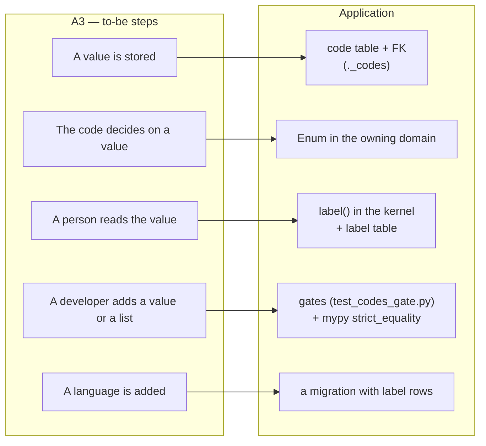
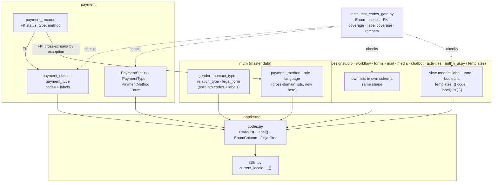
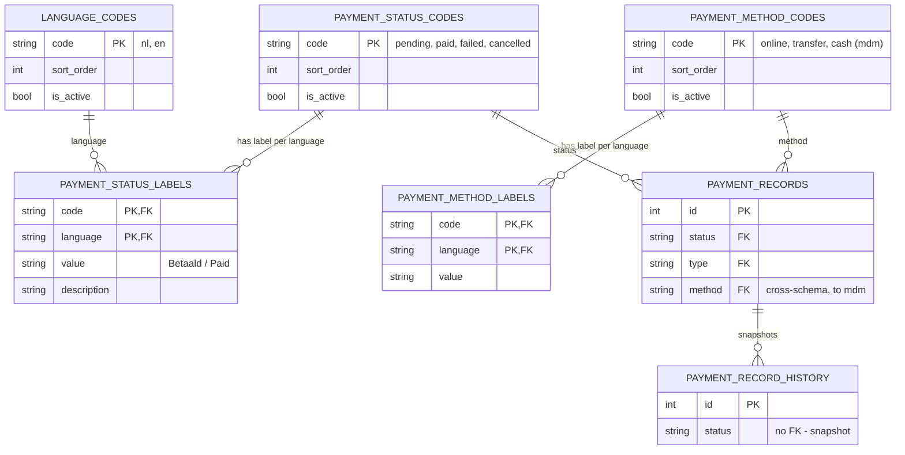

# Change Request 12 — Codes, enums and labels

> Supersedes the text of #779 (codes en enums), which is shortened to a pointer
> here. First change request written against the template with **B9 Rule and
> gatekeeper** (25 September 2026): it fixes a way of doing things for every
> module that exists and every module that follows.

**Project:** Web Portal "Raak Millegem"
**Status:** shaped with Koen on 25 September 2026 · not assigned to a release
**Applies to:** every column that carries a fixed vocabulary (status, type,
kind, method, role, …) in every domain schema; the code tables in `mdm`; the
label dictionaries in the UI layer; `app/kernel`.

---

# Part A — The business

> Draft from Koen's words of 25 September 2026, transcribed from speech. **To be
> corrected by Koen** — the analyst did not add requirements, only ordered what
> was said.

## A1. Reason to act

Two things come together. First, the platform is about to get new modules — a
mini CRM and a sales module for Koen's own company in formation, and a public
website that has to win customers rather than inform members. Before those are
built, the foundations they will stand on have to be right, so that they are
built the right way from day one instead of being reworked later. Second, the
codebase is fully English while the customers are Dutch-speaking, and soon
more than one language will be needed. Today a status is three things in
three wrong places: a loose string in the code, a comment next to the
column, and half a dozen little dictionaries that translate it — not always
the same way.

In Koen's words: *"Als ik het goed begrepen heb, gebruiken we in de code
enumeraties — dat is de best mogelijke manier om in de code bepaalde zaken af
te dwingen. En voor elke enumeratie moet er ook een code bestaan die in eerste
instantie in het Nederlands vertaald kan worden. De codebase is volledig
Engels, de enumeraties zijn Engels, maar de klanten zijn Nederlandstalig. Elke
code heeft een Engelse waarde en een Nederlandse waarde. En dan trekken we dat
door over alle schema's."*

And on why this is a change request and not an issue: *"Belangrijk om altijd
mee te denken of we een gatekeeper kunnen opzetten die de afspraak vastlegt,
zodat ze voor toekomstige ontwikkelingen automatisch gehandhaafd wordt. In
deze change request trekken we het door in alle modules, de hele codebase, en
vanaf dan is er een gatekeeper: komt er een nieuwe module, dan worden de
stappen 1, 2, 3, 4, 5, 6 automatisch afgedwongen."*

## A2. As-is process

There is no process — that is the finding. When a developer adds a status
today, they pick a word, write it in a comment next to the column, compare
against it as a string wherever the code branches, and add a Dutch text to
whichever screen shows it. Nothing checks that the word in the database, the
word in the code and the word on the screen are the same. Measured on 25
September 2026 (the full inventory is in B9.2):

- about 35 lists with a fixed vocabulary, kept in four different ways;
- 40 label dictionaries in Python and 25 templates that branch on a literal;
- `pending` shown as "In afwachting" in the list and "Openstaand" on the
  badge, sixteen lines apart (#779);
- the same payment-method list spelled `ONLINE` in one domain and `online` in
  another;
- three code tables that exist since the first migration and are used by
  nothing.

## A3. To-be process

A status is three things, each in one place: the **code** in a code table in
the database, the **enum** in the code where the code branches on it, and the
**label** per language in a label table. Whoever needs a label asks for it in
one place. A new language is a row, not a deploy. A developer who adds a list
or a value and forgets one of the three is told so by the build, with the name
of the missing piece.

Managing the lists and their translations through a screen is **not** part of
this change (Koen, 25 September 2026: *"nu maar geen scherm voorzien om
codelijsten te beheren, dat kan later"*). Until then, codes and labels are
added by migration.

## A4. Supplied material

None beyond the codebase itself and issue #779, which held the earlier design
(9 September 2026). Its measurements were redone on the branch — see B9.2.

## A5. Business requirements

| # | Requirement | MoSCoW | Source | Comment |
|---|---|---|---|---|
| R1 | Every fixed vocabulary in the system exists as a list of codes in the database, and the database refuses a value that is not in the list. | Must | Koen, 25 Sep 2026 | the check is in the data, not only in the code |
| R2 | Every code has a readable label per language; Dutch first, English second; a further language is rows added, not a change to the structure. | Must | Koen, 25 Sep 2026 | "elke code heeft een Engelse waarde en een Nederlandse waarde" |
| R3 | Where the application's behaviour depends on a value, the code uses an enumeration, so the tooling catches a wrong or misspelled value before it runs. | Must | Koen, 25 Sep 2026 | "de best mogelijke manier om in de code zaken af te dwingen" |
| R4 | The three — code list, enumeration, labels — can never drift apart; a build that misses one fails and names it. | Must | Koen, 25 Sep 2026 | the gatekeeper |
| R5 | The rule applies to the whole codebase, every module, existing and future. | Must | Koen, 25 Sep 2026 | "doortrekken in alle modules" |
| R6 | A list that belongs to one domain lives in that domain; a list that is master data, or is used by more than one domain, lives in master data. | Must | Koen, 25 Sep 2026 | "als het niet single-domein is: masterdata" |
| R7 | A screen to manage code lists and translations without a deploy. | Won't | Koen, 25 Sep 2026 | "dat kan later" — the structure allows it; see Non-goals |
| R8 | Stored values do not change meaning or spelling; history and exports read as before. | Must | #779 | one exception proposed in B4.6 |

## A6. Non-functional requirements

| Concern | This change |
|---|---|
| **Reporting** — what must be countable afterwards, by whom | The report dimensions of CR-06 (payment method, status, membership status) take code and label from the code tables; the same words appear in reports as on screens. Countable per release: the B9.2 numbers, which may only fall. |
| **Security** — who may do what; new inputs from outside; secrets | No new inputs: codes and labels enter by migration only. Roles are one of the lists (R6 → master data); their *meaning* (which role may do what) stays in `auth` and `docs/rollen-en-rechten.md`, untouched. |
| **Privacy** — personal data | None. Code lists hold no personal data. |
| **House style / UI norm** | `docs/design-system.md` §2.5 already says "labels come from one place per code list, never from a dict in a screen (#779)"; this change makes it true. Badge tones stay a UI decision (B4.5). |
| **Multi-tenant** — what differs per unit, what is platform-wide | Code lists and labels are **platform-wide**; the *language* a tenant sees is the tenant's language setting (`language`, default `nl_BE`), which already exists. A tenant does not get its own codes. |

## A7. Acceptance criteria

| # | Criterion | Requirement |
|---|---|---|
| AC1 | On HDEV, inserting a payment record with status `payed` through the database is refused by the database. | R1 |
| AC2 | Switching a tenant's language setting to `en` shows English labels for every status, type and method badge, list and export; switching back shows Dutch. No screen shows a raw code. | R2 |
| AC3 | The payment screens, the exports and the report dimensions show the same word for the same status (no "In afwachting" versus "Openstaand" for one code). | R2, R4 |
| AC4 | A developer who adds an enum member without a code row, or a code row without a label, gets a red build that names the missing member, row or language. | R4 |
| AC5 | The release issue shows the B9.2 counts, and every one of them is lower than or equal to the previous release. | R5 |
| AC6 | Every payment record, registration and history row on HDEV reads with the same value as before the migration (checked by a before/after count per value). | R8 |

---

# Part B — The solution

## B1. Solution outline

One shape for every list, in three places with one job each: a **code
table** (`<schema>.<list>_codes`) that says which values exist and is the
target of a foreign key from every column that stores the value; a **label
table** (`<schema>.<list>_labels`) keyed on `(code, language)` that carries
the human text; and, only where Python branches on the value, a plain
**`Enum`** whose members are checked against the active codes by a test. One
function in the kernel returns the label for a code in the active language,
and one Jinja filter exposes it; the label dictionaries disappear. Placement
follows Koen's rule (R6): one domain → that domain's schema; master data or
more than one domain → `mdm`. Gates enforce the shape as **ratchets** while the
inventory is being migrated and become **hard gates** once each count is zero.

Decisions that shape it, with the alternatives that lost:

- **Code table + FK, not a Postgres `ENUM` type.** A native enum makes every
  new value an `ALTER TYPE` and cannot carry labels. Lost on both counts.
- **Two tables per list, not one.** The tables of migration 001 keep code and
  language in one row with `UNIQUE(code)`, so exactly one language fits. The
  split is what R2 needs. The #924 lists (`organization_relation_types`,
  `identification_schemes`) already have this shape; it is generalised, not
  invented.
- **Plain `Enum`, not `str, Enum`.** With a `str` subclass, `status == "paid"`
  stays a valid comparison for mypy and there is no gate; with a plain `Enum`,
  `strict_equality` flags every comparison against a loose string. The two
  existing `str, Enum` classes (`LegalForm`, `RegistrationState`) convert when
  their domain is migrated.
- **Labels in the database, not in the gettext catalogue.** `app/i18n.py`
  (`_()`) stays for *sentences* — screen copy, messages. A label of a code is
  *data about a code*: it belongs next to the code, is queryable (reports,
  CR-06), and a new language is a row for a translator, not a `.po` file for a
  developer. The boundary: **codes → label table; everything else → `_()`**.
- **Placement by Koen's rule, with one named exception to §8.** See B4.1.
- **No management screen now** (R7). The tables are designed so that one can
  be added without changing them.

Europe First: no new tool, library or service. Everything is SQLAlchemy,
Alembic, mypy and pytest, already in use.

### B1.1 Functional analysis

| # | Derived requirement | Traces to |
|---|---|---|
| F1 | One kernel module defines the shape (`CodeList`) and the label function; domains declare their lists against it. | R4, R5 |
| F2 | Every list has a code table with `code`, `sort_order`, `is_active`; retiring a value is `is_active = false`, never a delete, so history rows keep their FK target. | R1, R8 |
| F3 | Every list has a label table `(code, language, value, description)`; `nl` is mandatory for every active code, `en` is seeded for every list in this change. | R2 |
| F4 | Every mapped column that stores a list value carries a FK to the code table. History (`*_history`) tables are exempt: append-only snapshots must survive a retired code. | R1, R8 |
| F5 | A list on which Python branches has a plain `Enum`; a test asserts members == active codes after `alembic upgrade head`. | R3, R4 |
| F6 | A single `label(list, code)` function, cached per process, using the request's `current_locale`; a Jinja filter of the same name. | R2, R4 |
| F7 | Templates never compare a code to a literal; the view-model exposes what the template needs (label, tone, a boolean). | R4 |
| F8 | Language keys in the label table are language codes (`nl`, `en`), not locales (`nl_BE`); the lookup takes the language part of the active locale. | R2 |
| F9 | Ratchet gates for each count in B9.2, hard gates once zero. | R4, R5 |
| F10 | mypy `strict_equality` and `disallow_untyped_defs` per migrated domain, via `[[tool.mypy.overrides]]`. | R3 |

## B2. Architecture

### B2.1 Components

| Component | new / used / changed | Role in this change |
|---|---|---|
| `app/kernel/codes.py` | **new** | `CodeList` declaration, `label()` function, cache, Jinja filter, the mypy-friendly `EnumColumn` type decorator |
| `app/kernel/tenant_config.py` (`language`) | used | source of the active language; already feeds `current_locale` |
| `app/i18n.py` | used, unchanged | keeps `_()` for copy; the label filter is registered next to it |
| `mdm` (`models.py`, migrations) | **changed** | its three single-language code tables split into codes + labels; `legal_form` gets its FK; receives the cross-domain lists (payment method, roles, languages) |
| `payment` | **changed** | first domain migrated: three lists, three enums, 37 comparisons, exports and badges through `label()` |
| `newsletter`, `meetings`, `designstudio` | **changed** | module constants become code tables + enums |
| `workflow`, `forms`, `mail`, `media`, `chatbot`, `activities`, `auth`, `reporting` | **changed** | bare string columns get their list, FK and (where branching) enum |
| `public.payment_status_codes`, `public.role_codes`, `public.registration_type_codes` | **removed** | orphans since migration 001; rows move to their domain, tables dropped |
| `backend/tests/test_codes_gate.py` | **new** | the gates of B9.3 |
| `docs/code-style.md` | **changed** | the rule, one paragraph, pointing here |

### B2.2 Application usage

*ArchiMate application-usage view: the to-be steps of A3 on the left, what
serves them on the right.*

### B2.3 Application structure

*ArchiMate application-structure view: what is built where and what talks to
what.*

### B2.4 Impact on the existing architecture

- **§8 "no cross-schema FKs"** gets one named exception: a FK from any schema
  **to an `mdm` code table**. `mdm` depends on no other domain, so no cycle can
  arise; every domain already imports `mdm.api`. Without the exception a list
  in `mdm` would lose its database check, which is the point of R1. Recorded
  in the architecture document §8 when this change is built (B4.1).
- **Import gate** (`tests/test_import_boundaries.py`): domains import
  `app.kernel.codes` (kernel is shared by design) and reach `mdm` enums only
  through `mdm.api`. No domain imports another domain's enum directly.
- **Layer gate** (`test_layer_gate.py`): `ui.py`/`admin_ui.py` do not touch
  `db` — the label cache is loaded in the kernel from a session the kernel
  owns at startup and on demand, not from a UI module.
- **Template-variables gate**: the view-model promises `label`/`tone`
  attributes where templates used to branch on the code.
- **CR-04 placement rule**: "the value is one of a closed list" is a one-field
  rule → the FK is the constraint layer, the enum the meaning layer; nothing
  moves to routers.
- **CR-06 reporting**: dimension labels read the label tables through the
  same function; the CR-06 line "labels come from the code tables (#779)"
  becomes real.

## B3. Cost and operations

- **Settings / env vars:** none new. The tenant `language` setting already
  exists.
- **Migrations:** one per domain phase (B7); each moves rows, adds FKs, drops
  the `public` orphans. Idempotent, as every migration here.
- **Backups:** unchanged; the migrations add small tables.
- **Limits / kill switch:** none needed — the label cache is a few hundred
  rows per process.
- **Cache refresh:** labels change only by migration, so a process-level
  cache loaded on first use is safe; the container restarts on deploy. A
  future management screen must invalidate it (B4.4).
- **External cost:** none.

## B4. Detailed decisions

### B4.1 Placement of a list (Koen, 25 September 2026)

*One domain → that domain's schema. Master data, or used by two or more
domains → `mdm`.* The definition of master data is "cross-domain", so doubt
resolves towards `mdm`. Moving a list later is a migration that copies rows
and re-points a FK; stored values do not change, so a wrong guess is cheap.

Consequence: the one allowed cross-schema FK is *towards an `mdm` code table*
(B2.4). Applied to today's inventory:

| List | Used by | Goes to |
|---|---|---|
| payment method | `activities.payment_method`, `payment.method` | `mdm` |
| role | `auth.role_code`, `workflow.required_role`, tenant config | `mdm` |
| language (the `language` key of every label table) | every label table | `mdm` (a two-row list, `nl`, `en`) |
| gender, contact type, relation type, legal form, identification scheme, organisation relation type | `mdm` | `mdm` (already) |
| everything else (payment status/type, newsletter, meetings, design studio, workflow, forms, mail, media, chatbot, activities registration type) | one domain | that domain |

The MDM domain itself — what else belongs to master data and how it is
governed — is being thought through separately, with an external MDM adviser. This change
does not pre-empt it: it applies the rule to the lists that exist today.

### B4.2 The shape of a list

Per list, two tables and, where the code branches, one enum. Columns are the
same everywhere; the kernel `CodeList` declaration ties them together.

| Table | Columns | Key |
|---|---|---|
| `<schema>.<list>_codes` | `code` · `sort_order` · `is_active` · `created_at` | `code` |
| `<schema>.<list>_labels` | `code` (FK) · `language` (FK → `mdm.language_codes`) · `value` · `description` · `created_at` · `updated_at` | `(code, language)` |

`is_active` retires a value without deleting it: history rows and old
records keep a valid FK target, the enum stops carrying it, and the label
stays readable. `sort_order` is what select lists and report dimensions
order by — the last place where a Python list decided the order.

### B4.3 When an enum, when only a table

The question that decides: **does Python branch on this value?**

- **No** (gender, contact type, relation type, language): code table + FK
  only. A row can be added by migration — later by a screen — without code.
- **Yes** (payment status, charge/refund, payment method, newsletter and
  meeting states, roles): code table + FK **and** a plain `Enum` in the domain
  that owns the table, exported through its `api.py`. A new value needs code
  anyway, so the enum costs nothing extra; the gate keeps it equal to the
  active codes.

The enum stores its `.value` in the column through a `TypeDecorator`
(`EnumColumn`) — never the member name (`PAID`) and never `str(member)`
(`PaymentStatus.PAID`). Test 3 in B8 reads the column raw to prove it.

### B4.4 One label function

`label(list, code)` in `app/kernel/codes.py`: looks up `(code, language)` in
the label table for `list`, with `language` = the language part of
`current_locale` (`nl_BE` → `nl`), falling back to `nl`, and — as a last
resort so a screen never renders blank under `StrictUndefined` — the code
itself, logged once. Cached per process on first use; `reset_label_cache()`
exists for tests and for the future screen.

The same function is a Jinja filter: `{{ record.status | label("payment_status") }}`.
Where two words used to exist for one code ("Betaald" on the badge,
"Vereffend" as the *balance* state — #669), the second word is a **different
concept with its own name** (a derived state on the view-model), not a
second label for the same code. Decided case by case in the migration of
that domain and recorded in the `CodeList` docstring.

### B4.5 Tones and other UI attributes stay in the UI

A badge tone (`green`/`yellow`/`red`) is not a translation; it is a UI
decision that changes with the design system, not with the language. It
stays in Python, **one total mapping per enum next to the enum's UI
consumer**, and the gate checks it is total (every member has a tone). The
code table does not get a `tone` column: that would put a design-system word
into master data, where a translator has no business changing it.

### B4.6 Payment method: one data fix (proposal — awaiting Koen)

`activities.payment_method` stores `ONLINE`/`TRANSFER`/`CASH`;
`payment.method` stores `online`/`transfer`/`cash`. One list, two spellings —
the duplication `CLAUDE.md` names as the bug. R8 says stored values do not
change; here the proposal is the **one exception**: an `UPDATE` that lowers
the case on `activities.payment_method` (and its history table, which is a
snapshot of the same value), with a before/after count per value in the
migration output. The alternative — two code tables for one list — keeps the
bug and gives it a FK. Koen decides (B11).

### B4.7 Templates show, view-models decide

25 templates branch on a literal (`.status == "paid"`). With a plain enum
those comparisons would silently become `False` — the most dangerous failure
mode of this change, because nothing errors. Therefore the rule from the
design system §8.3 is applied to codes: **a template never compares a
code**. The view-model exposes `status_label`, `status_tone`, `is_paid`
(whatever the template needs). This is a ratchet gate (B9.3) with the 25 as
baseline.

### B4.8 mypy strict, per domain

`[[tool.mypy.overrides]]` per migrated domain with `disallow_untyped_defs`,
`strict_equality`, `warn_return_any`. Not `--strict` globally: that needs an
exemption list, and an exemption list is where a rule dies (#760). The 133
untyped `db` parameters (#779 count; recounted per domain when migrated) are
typed as part of each domain's phase.

## B5. Data model

### B5.1 Entity-relationship diagram

The same pair (`_codes`, `_labels`) repeats for every list in B4.1; the
diagram shows payment because it is phase 1.

### B5.2 Tables

- **New, in `mdm`:** `language_codes` (+ labels), `payment_method_codes` (+
  labels), `role_codes` (+ labels; rows moved from `public.role_codes`).
- **Split, in `mdm`:** `gender_codes`, `contact_type_codes`,
  `relation_type_codes`, `legal_form_codes` — each becomes `_codes` +
  `_labels`; `contact_type_codes.is_social_network` (#1160) stays on the code
  table (it is data about the code, not a label). `organizations.legal_form`
  gets its FK.
- **New, in `payment`:** `payment_status_codes` (+ labels; rows moved from
  `public`), `payment_type_codes` (+ labels). FKs on
  `payment_records.status/type/method`. `gateway_payments.status/provider`
  stay out: Mollie's words, mapped by `MOLLIE_STATUS_MAP`.
- **New, per domain, in later phases:** newsletter (subscriber status,
  source, audience, letter status, reply-to, delivery kind/status, role),
  meetings (status, attendance, file kind, section kind), design studio
  (status, layout, variant, generation status, preset, corner, style, duo,
  icon, size), workflow (definition status, run status, kind), forms
  (status, field type), mail (status, type), media (kind), chatbot
  (surface, capability, status), activities (registration type — rows moved
  from `public.registration_type_codes`), reporting (kind).
- **Dropped:** the three `public` orphans, after their rows moved.
- **Untouched:** every `*_history` table (append-only; a value test instead
  of a FK), `operation`/`action`/`source` audit columns (free-form provenance,
  not a closed list).

Validation layers: form → Pydantic schemas keep their `Literal[...]` or take
the enum; meaning → the enum in the service; integrity at rest → the FK.

## B6. Privacy and security — the mechanics

Nothing leaves the system. No personal data. Role codes move table but not
meaning: `require_admin_ui`/`require_finance_ui` keep deciding; the role gate
tests (`test_role_model_gates.py`) must stay green through the move, and a
test asserts the set of role codes is unchanged before and after.

## B7. Phasing

Each phase is a release-sized issue, shippable and revertible on its own.

| Phase | Delivers | Depends on |
|---|---|---|
| **0 — kernel + gates as ratchets** | `app/kernel/codes.py`, `mdm.language_codes`, `test_codes_gate.py` with the B9.2 baselines frozen, `docs/code-style.md` paragraph, §8 exception recorded | — |
| **1 — payment** | status/type in `payment`, method in `mdm`, three enums, FKs, 37 comparisons, exports/badges via `label()`, `public.payment_status_codes` dropped, mypy strict on `payment` | 0 |
| **2 — mdm split + roles** | the four `mdm` lists split into codes+labels, `legal_form` FK, `role_codes` to `mdm` with FKs from `auth` and `workflow`, `_RELATIE_LABELS` and `SOORT_LABELS` gone | 0 |
| **3 — constants domains** | newsletter, meetings, design studio: constants → tables + enums, 20 label dicts gone | 0 |
| **4 — remaining domains** | workflow, forms, mail, media, chatbot, activities, reporting, `org_type`; `public.registration_type_codes` dropped | 0 |
| **5 — close** | every ratchet at zero → hard gate; mypy strict on every migrated domain | 1–4 |

The order after phase 1 is Koen's call; phases 2–4 are independent of each
other.

## B8. Tests

Each able to go red; guards proven by violation, the violation noted in the
docstring.

1. **Enum = active codes**, both directions. Add a member without a row: red,
   names the member. Add a row without a member: red, names the code.
2. **The FK holds.** Raw `INSERT` of `status = 'payed'` fails on the
   constraint.
3. **Round trip.** A row written with `PaymentStatus.PAID` reads back raw as
   `paid` — not `PAID`, not `PaymentStatus.PAID`. A pre-migration row reads
   as the member.
4. **One label per code per language.** For every active code, `label()` in
   `nl` and `en` returns exactly one non-empty text; the label table has no
   active code without an `nl` row.
5. **Same words as before.** Snapshot of the label dictionaries at phase 0;
   each domain's phase asserts `label()` returns the same Dutch text the
   dictionary did, except where B4.4 deliberately split a concept (listed in
   the test).
6. **Templates render text.** Every template that shows a code renders the
   label, never `PaymentStatus.PAID` or a bare code — rendered through the
   real view-model, the `StrictUndefined` environment.
7. **Values before/after.** For every migrated column, count per value before
   and after the migration is identical (with B4.6 as the one declared
   exception).
8. **mypy in both directions.** Put one comparison back to a literal in
   `payment/service.py`: `comparison-overlap`. Back: green.
9. **Roles unchanged.** Set of role codes and `test_role_model_gates.py`
   identical across phase 2.
10. The gates of B9.3, each proven by one violation.

## B9. Rule and gatekeeper

### B9.1 The rule

> **A fixed vocabulary is a code table in the schema of the domain that owns
> it — in `mdm` when it is master data or used by more than one domain — with
> a foreign key from every column that stores it, a label table per language,
> and a plain `Enum` in the owning domain wherever Python branches on the
> value. Labels come from `label()` and nowhere else; templates never compare
> a code.**

Lives in `docs/code-style.md` (one paragraph, pointing here) and in the
architecture document §8 (the `mdm` FK exception). `CLAUDE.md` points to
`docs/code-style.md` and does not repeat it.

### B9.2 Reach and baseline

Reach: the whole backend, every domain, existing and future. Measured on
the branch on 25 September 2026 (the counting commands are in
`test_codes_gate.py`, so the numbers re-appear per release):

| | 25 Sep 2026 | after this CR |
|---|---|---|
| lists with a fixed vocabulary | ~35 | ~35, all in the same shape |
| … kept as code table + FK, split codes/labels (#924 shape) | 2 | all |
| … kept as code table + FK, one language per code | 4 | 0 |
| … kept as orphan table in `public`, no FK | 3 | 0 |
| … kept as module constants | 14 (newsletter 6, meetings 3, designstudio 5) | 0 |
| … kept as a bare string + comment | ~12 | 0 |
| vocabulary columns without a FK to a code table | 43, rough count (excl. history and audit) | 0 |
| code tables that can carry two languages | 2 | all |
| domain enums | 2 (`str, Enum`) | one per branching list, plain `Enum` |
| label dictionaries in Python | 40 | 0 |
| templates comparing a code to a literal | 25 | 0 |
| loose-string comparisons on vocabulary columns (`.py`) | 92 (payment 37) | 0 |
| domains under mypy `strict_equality` | 0 | all migrated |
| languages seeded | `nl` 34 rows, `en` 17 rows | `nl` and `en` for every active code |

### B9.3 The gate

`backend/tests/test_codes_gate.py`, one test per row above that can be
counted mechanically. Shape per test: **ratchet** while the count is above
zero (a frozen list of today's offenders, checked in; a new offender is red
with its `file:line` or `schema.table.column`; an offender that disappears
from the code must be removed from the list or the test is red — the #780
pattern), **hard gate** once the list is empty (phase 5 deletes the list and
the exemption logic together).

What each gate looks at:

| Gate | Looks at | Message on violation |
|---|---|---|
| FK coverage | every mapped `String` column whose name is in the vocabulary set (`status`, `type`, `kind`, `method`, `role*`, `*_code`, `*_type`, …) on a non-history table without a FK to a `_codes` table | "`payment.payment_records.method` stores a vocabulary but has no FK to a code table — declare a `CodeList` or add it to the ratchet with a reason" |
| Label coverage | every `_codes` table has a `_labels` table; every active code has an `nl` row | "`mdm.gender_codes`: code `X` has no `nl` label" |
| Enum = codes | every `CodeList` with an enum: members == active codes | "`PaymentStatus.REFUNDED` has no row in `payment.payment_status_codes`" |
| Tone total | every enum with a tone mapping: every member has a tone | "`PaymentStatus.FAILED` has no badge tone" |
| No label dicts | `grep` for `LABELS = {` and `_LABEL = {` in `app/` | "`newsletter/admin_ui.py:50` defines labels in Python — use `label()`" |
| No template comparisons | `== "…"` / `!= "…"` on a vocabulary attribute in `templates/` | "`admin_betalingen.html:42` compares `record.status` to a literal — expose it on the view-model" |
| Loose-string comparisons | mypy `strict_equality` per domain (not a pytest) | `comparison-overlap` |

For a new module the gate spells out the steps: a new list needs (1) a
`_codes` table, (2) a `_labels` table with `nl` and `en` rows, (3) a FK from
each storing column, (4) a `CodeList` declaration, (5) an `Enum` if the code
branches, (6) `label()` on every screen and export — and fails on the one
that was forgotten, naming it. That is Koen's "1, 2, 3, 4, 5, 6 automatically".

What cannot be checked mechanically and goes to review: whether a list
really is single-domain (B4.1), and whether two words for one code are one
concept or two (B4.4).

## B10. Prototype findings

None yet. #779 notes an OGM value-object spike with zero DB fixtures as the
testability model; the enum/`TypeDecorator` round trip (B8 test 3) is the
one thing worth a spike before phase 1, because `sa.Enum` stores the member
*name* by default and that mistake would corrupt data silently.

## B11. Decisions log

| Date | Decision | Who |
|---|---|---|
| 25 Sep 2026 | Codes and enums become a change request (CR-12); #779 is shortened to a pointer. | Koen |
| 25 Sep 2026 | The CR template gets **B9 Rule and gatekeeper**; every architectural CR names its rule, baseline and gate. | Koen |
| 25 Sep 2026 | Placement: one domain → that domain; master data or two+ domains → `mdm`. MDM itself is thought through separately, with an external MDM adviser. | Koen |
| 25 Sep 2026 | No management screen for code lists now; later. | Koen |
| 25 Sep 2026 | Labels of codes live in label tables, not in the gettext catalogue; `_()` stays for copy. | proposal (Claude) — *open* |
| 25 Sep 2026 | One allowed cross-schema FK: towards an `mdm` code table (B2.4). `mdm` depends on no other domain, so no cycle; without the FK a list in `mdm` loses its database check. | Koen |
| 25 Sep 2026 | Payment method: one-time lower-casing of `activities.payment_method` (B4.6). | proposal (Claude) — *open* |
| 25 Sep 2026 | Roles move to `mdm` under the placement rule; meaning stays in `auth`. | proposal (Claude) — *open* |
| 25 Sep 2026 | Badge tones stay in Python, total per enum (B4.5). | proposal (Claude) — *open* |

## Q&A log

| # | Date | Question (who) | Answer |
|---|---|---|---|
| Q1 | 25 Sep 2026 | Code tables per domain schema or centrally in `mdm`? (Claude) | Koen: by the rule in B4.1 — single domain → domain; master data or cross-domain → `mdm`. |
| Q2 | 25 Sep 2026 | Management screen for code lists in scope? (Claude) | Koen: no, later. |
| Q3 | 25 Sep 2026 | Is the trigger the new company/CRM tenant needing a second language, or the clean-up alone? (Claude) | Both, per A1 — foundations before new modules, and Dutch-speaking customers on an English codebase. *To confirm in A1.* |
| Q4 | 25 Sep 2026 | Are `nl`/`en` the two languages, and is `fr` in scope? (Claude) | *open* — the shape takes any language; the seed in this CR is `nl` + `en`. |
| Q5 | 25 Sep 2026 | May `activities.payment_method` be lower-cased once (B4.6)? (Claude) | *open* |

## Non-goals

- **No management screen** for codes or labels (Koen, 25 Sep 2026). The
  tables are shaped so that one can be added later without a schema change:
  it would edit `_labels` rows and toggle `is_active`, and call
  `reset_label_cache()`.
- **No Postgres `ENUM` type.** The code table is the list; the FK is the check.
- **No renaming of stored values**, except the single proposed case in B4.6.
- **No state machine.** Which transitions are allowed between statuses is
  CR-04 phase 2 (#236); this CR only makes the set of states closed and
  database-anchored so that phase can build on it.
- **No per-tenant code lists.** Lists are platform-wide; tenants differ in
  language only.
- **No `--strict` mypy globally.**
- **No translation of screen copy.** `_()` and the gettext catalogue are
  #407-T's track; this CR only draws the boundary (B1).
- **Mollie's vocabulary** (`gateway_payments.status`, `.provider`) and the
  audit columns (`operation`, `action`, `source`) stay as they are.

## Relationship to existing work

- **#779 (codes en enums)** — the design's first home; shortened to point
  here. Its measurements of 9 September are superseded by B9.2.
- **CR-04 / #236 (OO-domeinmodel)** — the placement rule (one field → the
  constraint/validator layer) is what puts the FK where it is; phase 2 of
  #236 (state machine) builds on the closed status set this CR delivers.
- **#755 (nulmeting)** — the B9.2 counts join the five numbers that appear in
  every release issue.
- **#780 (taalpoort)** — the ratchet shape of the gates.
- **#924 / #945 (organisatie)** — the two lists already in the target shape;
  `LegalForm` is the first enum to convert from `str, Enum`.
- **#1160 (contacttypes)** — `is_social_network` on the code table is the
  precedent for "data about a code lives on the code table".
- **#444** — moved the code tables out of `app/models/codes.py` into their
  domains; this CR moves the three that landed in `public` the rest of the way.
- **CR-06 (reporting)** — dimension labels from the label tables.
- **#669** — "Vereffend" versus "Betaald": one code, two concepts (B4.4).
- **CR-13 (OO foundation, next)** — the second foundation change before the
  CRM module; independent of this one.
