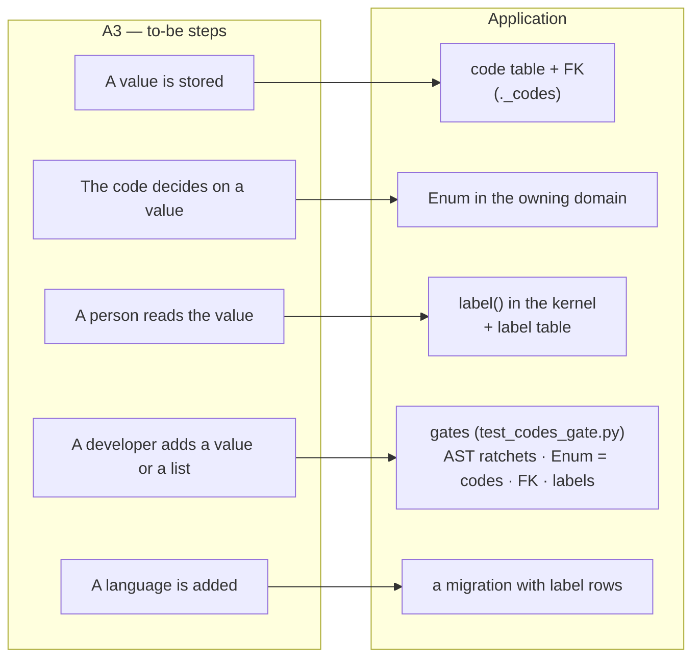
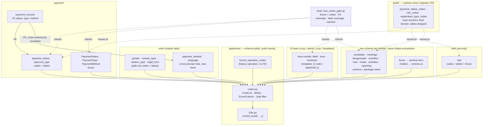
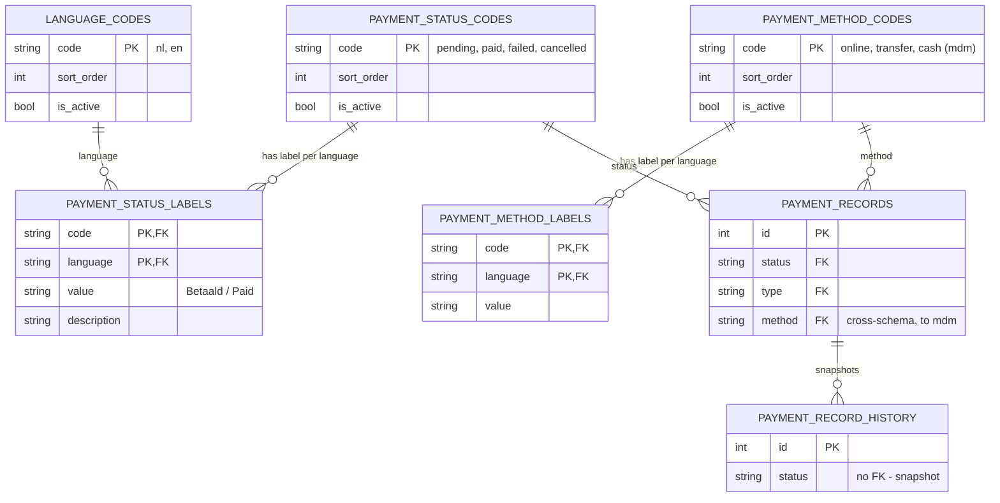

# Change Request 12 — Codes, enums and labels

> Supersedes the text of #779 (codes en enums), which is shortened to a pointer
> here. First change request written against the template with **B9 Rule and
> gatekeeper** (25 September 2026): it fixes a way of doing things for every
> module that exists and every module that follows.

**Project:** Web Portal "Raak Millegem"
**Status:** shaped with Koen on 25 September 2026 · Part A approved and Part B development-ready on 26 September 2026 · not assigned to a release
**Applies to:** every column that carries a fixed vocabulary (status, type,
kind, method, role, …) in every domain schema; the code tables in `mdm`; the
label dictionaries in the UI layer; `app/kernel`.

---

# Part A — The business

> Written from Koen's words of 25 September 2026, transcribed from speech, and
> **approved by Koen on 26 September 2026** as written. The analyst added no
> requirements, only ordered what was said.

## A1. Reason to act

Two things come together. First, the platform is about to get new modules — a
mini CRM and a sales module for Koen's own company in formation, and a public
website that has to win customers rather than inform members. Before those are
built, the foundations they will stand on have to be right, so that they are
built the right way from day one instead of being reworked later. Second, the
codebase is fully English while the customers are Dutch-speaking, and soon
more than one language will be needed. Today a status is three things in
three wrong places: a loose string in the code, a comment next to the
column, and half a dozen little dictionaries that translate it — not always
the same way.

In Koen's words: *"Als ik het goed begrepen heb, gebruiken we in de code
enumeraties — dat is de best mogelijke manier om in de code bepaalde zaken af
te dwingen. En voor elke enumeratie moet er ook een code bestaan die in eerste
instantie in het Nederlands vertaald kan worden. De codebase is volledig
Engels, de enumeraties zijn Engels, maar de klanten zijn Nederlandstalig. Elke
code heeft een Engelse waarde en een Nederlandse waarde. En dan trekken we dat
door over alle schema's."*

And on why this is a change request and not an issue: *"Belangrijk om altijd
mee te denken of we een gatekeeper kunnen opzetten die de afspraak vastlegt,
zodat ze voor toekomstige ontwikkelingen automatisch gehandhaafd wordt. In
deze change request trekken we het door in alle modules, de hele codebase, en
vanaf dan is er een gatekeeper: komt er een nieuwe module, dan worden de
stappen 1, 2, 3, 4, 5, 6 automatisch afgedwongen."*

## A2. As-is process

There is no process — that is the finding. When a developer adds a status
today, they pick a word, write it in a comment next to the column, compare
against it as a string wherever the code branches, and add a Dutch text to
whichever screen shows it. Nothing checks that the word in the database, the
word in the code and the word on the screen are the same. Measured on 25
September 2026 (the full inventory is in B9.2):

- about 35 lists with a fixed vocabulary, kept in four different ways;
- 40 label dictionaries in Python and 25 templates that branch on a literal;
- `pending` shown as "In afwachting" in the list and "Openstaand" on the
  badge, sixteen lines apart (#779);
- the same payment-method list spelled `ONLINE` in one domain and `online` in
  another;
- three code tables that exist since the first migration and are used by
  nothing.

## A3. To-be process

A status is three things, each in one place: the **code** in a code table in
the database, the **enum** in the code where the code branches on it, and the
**label** per language in a label table. Whoever needs a label asks for it in
one place. A new language is a row, not a deploy. A developer who adds a list
or a value and forgets one of the three is told so by the build, with the name
of the missing piece.

Managing the lists and their translations through a screen is **not** part of
this change (Koen, 25 September 2026: *"nu maar geen scherm voorzien om
codelijsten te beheren, dat kan later"*). Until then, codes and labels are
added by migration.

## A4. Supplied material

None beyond the codebase itself and issue #779, which held the earlier design
(9 September 2026). Its measurements were redone on the branch — see B9.2.

## A5. Business requirements

| # | Requirement | MoSCoW | Source | Comment |
|---|---|---|---|---|
| R1 | Every fixed vocabulary in the system exists as a list of codes in the database, and the database refuses a value that is not in the list. | Must | Koen, 25 Sep 2026 | the check is in the data, not only in the code |
| R2 | Every code has a readable label per language; Dutch first, English second; a further language is rows added, not a change to the structure. | Must | Koen, 25 Sep 2026 | "elke code heeft een Engelse waarde en een Nederlandse waarde" |
| R3 | Where the application's behaviour depends on a value, the code uses an enumeration, so the tooling catches a wrong or misspelled value before it runs. | Must | Koen, 25 Sep 2026 | "de best mogelijke manier om in de code zaken af te dwingen" |
| R4 | The three — code list, enumeration, labels — can never drift apart; a build that misses one fails and names it. | Must | Koen, 25 Sep 2026 | the gatekeeper |
| R5 | The rule applies to the whole codebase, every module, existing and future. | Must | Koen, 25 Sep 2026 | "doortrekken in alle modules" |
| R6 | A list that belongs to one domain lives in that domain; a list that is master data, or is used by more than one domain, lives in master data — except security vocabulary (roles), which stays with security. | Must | Koen, 25 Sep 2026 | "als het niet single-domein is: masterdata"; roles: "zit dit niet in een security-domein waar we later Keycloak, SAML kunnen aan koppelen?" |
| R7 | A screen to manage code lists and translations without a deploy. | Won't | Koen, 25 Sep 2026 | "dat kan later" — the structure allows it; see Non-goals |
| R8 | Stored values do not change meaning or spelling; history and exports read as before. | Must | #779 | one exception proposed in B4.6 |

## A6. Non-functional requirements

| Concern | This change |
|---|---|
| **Reporting** — what must be countable afterwards, by whom | The report dimensions of CR-06 (payment method, status, membership status) take code and label from the code tables; the same words appear in reports as on screens. Countable per release: the B9.2 numbers, which may only fall. |
| **Security** — who may do what; new inputs from outside; secrets | No new inputs: codes and labels enter by migration only. Roles are one of the lists and stay in `auth` — security vocabulary is not master data; their *meaning* (which role may do what) stays in `auth` and `docs/rollen-en-rechten.md`, untouched. |
| **Privacy** — personal data | None. Code lists hold no personal data. |
| **House style / UI norm** | `docs/design-system.md` §2.5 already says "labels come from one place per code list, never from a dict in a screen (#779)"; this change makes it true. Badge tones stay a UI decision (B4.5). |
| **Multi-tenant** — what differs per unit, what is platform-wide | Code lists and labels are **platform-wide**; the *language* a tenant sees is the tenant's language setting (`language`, default `nl_BE`), which already exists. A tenant does not get its own codes. |

## A7. Acceptance criteria

| # | Criterion | Requirement |
|---|---|---|
| AC1 | On HDEV, inserting a payment record with status `payed` through the database is refused by the database. | R1 |
| AC2 | Switching a tenant's language setting to `en` shows English labels for every status, type and method badge, list and export; switching back shows Dutch. No screen shows a raw code. | R2 |
| AC3 | The payment screens, the exports and the report dimensions show the same word for the same status (no "In afwachting" versus "Openstaand" for one code). | R2, R4 |
| AC4 | A developer who adds an enum member without a code row, or a code row without a label, gets a red build that names the missing member, row or language. | R4 |
| AC5 | The release issue shows the B9.2 counts, and every one of them is lower than or equal to the previous release. | R5 |
| AC6 | Every payment record, registration and history row on HDEV reads with the same value as before the migration (checked by a before/after count per value, over the whole table — soft-deleted rows included). | R8 |

---

# Part B — The solution

## B1. Solution outline

One shape for every list, in three places with one job each: a **code
table** (`<schema>.<list>_codes`) that says which values exist and is the
target of a foreign key from every column that stores the value; a **label
table** (`<schema>.<list>_labels`) keyed on `(code, language)` that carries
the human text; and, only where Python branches on the value, a plain
**`Enum`** whose members are checked against the active codes by a test. One
function in the kernel returns the label for a code in the active language,
and one Jinja filter exposes it; the label dictionaries disappear. Placement
follows Koen's rule (R6): one domain → that domain's schema; master data or
more than one domain → `mdm`. Gates enforce the shape as **ratchets** while the
inventory is being migrated and become **hard gates** once each count is zero.

Decisions that shape it, with the alternatives that lost:

- **Code table + FK, not a Postgres `ENUM` type.** A native enum makes every
  new value an `ALTER TYPE` and cannot carry labels. Lost on both counts.
- **Two tables per list, not one.** The tables of migration 001 keep code and
  language in one row with `UNIQUE(code)`, so exactly one language fits. The
  split is what R2 needs. The #924 lists (`organization_relation_types`,
  `identification_schemes`) already have this shape; it is generalised, not
  invented.
- **Plain `Enum`, not `str, Enum`.** With a `str` subclass, `status == "paid"`
  stays a valid comparison and silently true; with a plain `Enum` it is
  silently *false* — which is why the loose-string gate (B9.3) is an AST test
  and not mypy (B4.8). The two existing `str, Enum` classes (`LegalForm`,
  `RegistrationState`) convert when their domain is migrated. **Member names
  are English, values are the stored codes** (B4.3): `RelationType.PRIMARY_MEMBER
  = "HOOFDLID"` — otherwise every Dutch code becomes a new Dutch identifier
  and the #780 ratchet goes red.
- **Labels in the database, not in the gettext catalogue.** `app/i18n.py`
  (`_()`) stays for *sentences* — screen copy, messages. A label of a code is
  *data about a code*: it belongs next to the code, is queryable (reports,
  CR-06), and a new language is a row for a translator, not a `.po` file for a
  developer. The boundary: **codes → label table; everything else → `_()`**.
- **Placement by Koen's rule, with one named exception to §8.** See B4.1.
- **No management screen now** (R7). The tables are designed so that one can
  be added without changing them.

Europe First: no new tool, library or service. Everything is SQLAlchemy,
Alembic, mypy and pytest, already in use.

### B1.1 Functional analysis

| # | Derived requirement | Traces to |
|---|---|---|
| F1 | One kernel module defines the shape (`CodeList`) and the label function; domains declare their lists against it. | R4, R5 |
| F2 | Every list has a code table with `code`, `sort_order`, `is_active`; retiring a value is `is_active = false`, never a delete, so history rows keep their FK target. | R1, R8 |
| F3 | Every list has a label table `(code, language, value, description)`; `nl` is mandatory for every active code, `en` is seeded for every list in this change. | R2 |
| F4 | Every mapped column that stores a list value carries a FK to the code table. History (`*_history`) tables are exempt: append-only snapshots must survive a retired code. | R1, R8 |
| F5 | A list on which Python branches has a plain `Enum`; a test asserts members == **all** codes in the table (active and retired) after `alembic upgrade head`, so a retired code never reads back as a bare string. | R3, R4 |
| F6 | A single `code_label(list, code)` function, cached per process, using the request's `current_locale`; a Jinja filter of the same name. | R2, R4 |
| F7 | Templates never compare a code to a literal; the view-model exposes what the template needs (label, tone, a boolean). | R4 |
| F8 | Language keys in the label table are language codes (`nl`, `en`), not locales (`nl_BE`); the lookup takes the language part of the active locale. | R2 |
| F9 | Ratchet gates for each count in B9.2, hard gates once zero. | R4, R5 |
| F10 | Enum-carrying columns are written as `Mapped[Enum]` so mypy knows their type; mypy `strict_equality` and `disallow_untyped_defs` per migrated domain, via `[[tool.mypy.overrides]]` — a bonus check, not the gate (B4.8). | R3 |
| F11 | One migration helper in the kernel creates a list — both tables, seed rows, FK — from one declarative call, so 47 lists are 47 calls and not 47 hand-written migrations. | R4, R5 |
| F12 | Background jobs (mail, newsletter, workflow) pass the tenant's language to `code_label()` explicitly; there is no request locale there. | R2 |

## B2. Architecture

### B2.1 Components

| Component | new / used / changed | Role in this change |
|---|---|---|
| `app/kernel/codes.py` | **new** | `CodeList` declaration, `code_label()` function, cache, Jinja filter, the mypy-friendly `EnumColumn` type decorator |
| `app/kernel/tenant_config.py` (`language`) | used | source of the active language; already feeds `current_locale` |
| `app/i18n.py` | used, unchanged | keeps `_()` for copy; the label filter is registered next to it |
| `mdm` (`models.py`, migrations) | **changed** | its three single-language code tables split into codes + labels; `legal_form` gets its FK; receives the cross-domain lists (payment method, languages) |
| `auth` (`models.py`, migrations) | **changed** | `role_codes` moves in from `public`, split into codes + labels; FKs from `user_roles` and `workflow`; the role enum |
| `payment` | **changed** | first domain migrated: three lists, three enums, 37 comparisons, exports and badges through `code_label()` |
| `newsletter`, `meetings`, `designstudio` | **changed** | module constants become code tables + enums |
| `workflow`, `forms`, `mail`, `media`, `chatbot`, `activities`, `auth`, `reporting` | **changed** | bare string columns get their list, FK and (where branching) enum |
| `public.payment_status_codes`, `public.role_codes`, `public.registration_type_codes` | **removed** | orphans since migration 001; rows move to their domain, tables dropped |
| `backend/tests/test_codes_gate.py` | **new** | the gates of B9.3 |
| `docs/code-style.md` | **changed** | the rule, one paragraph, pointing here |

### B2.2 Application usage

*ArchiMate application-usage view: the to-be steps of A3 on the left, what
serves them on the right.*

### B2.3 Application structure

*ArchiMate application-structure view: what is built where and what talks to
what.*

### B2.4 Impact on the existing architecture

- **§8 "no cross-schema FKs"** gets one named exception: a FK from any schema
  **to a code table of a foundation domain** — `mdm`, and `auth` for roles.
  Neither depends on a business domain (`auth` depends on `mdm` only), so no
  cycle can arise; every domain already imports `mdm.api`. Without the exception a list
  in `mdm` would lose its database check, which is the point of R1. Recorded
  in the architecture document §8 when this change is built (B4.1).
- **Import gate** (`tests/test_import_boundaries.py`): domains import
  `app.kernel.codes` (kernel is shared by design) and reach `mdm` enums only
  through `mdm.api`. No domain imports another domain's enum directly.
- **Layer gate** (`test_layer_gate.py`): `ui.py`/`admin_ui.py` do not touch
  `db` — the label cache is loaded in the kernel from a session the kernel
  owns at startup and on demand, not from a UI module.
- **Template-variables gate**: the view-model promises `label`/`tone`
  attributes where templates used to branch on the code.
- **CR-04 placement rule**: "the value is one of a closed list" is a one-field
  rule → the FK is the constraint layer, the enum the meaning layer; nothing
  moves to routers.
- **CR-06 reporting**: dimension labels read the label tables through the
  same function; the CR-06 line "labels come from the code tables (#779)"
  becomes real.

## B3. Cost and operations

- **Settings / env vars:** none new. The tenant `language` setting already
  exists.
- **Migrations:** one per domain phase (B7); each moves rows, adds FKs, drops
  the `public` orphans. Idempotent, as every migration here.
- **Backups:** the DB backup before the UAT/PROD deploy is the **only way
  back** for v2.7.0 (renames are not image-revertible, B7); all phases ship
  in that one tag, so the restore point is the whole release; the dump is
  verified before the deploy.
- **Limits / kill switch:** none needed — the label cache is a few hundred
  rows per process.
- **Cache refresh:** labels change only by migration, so a process-level
  cache loaded on first use is safe; the container restarts on deploy. A
  future management screen must invalidate it (B4.4).
- **External cost:** none.

## B4. Detailed decisions

### B4.1 Placement of a list (Koen, 25 September 2026)

*One domain → that domain's schema. Master data, or used by two or more
domains → `mdm`.* The definition of master data is "cross-domain", so doubt
resolves towards `mdm`. Moving a list later is a migration that copies rows
and re-points a FK; stored values do not change, so a wrong guess is cheap.

Consequence: the one allowed cross-schema FK is *towards an `mdm` code table*
(B2.4). Applied to today's inventory:

| List | Used by | Goes to |
|---|---|---|
| payment method | `activities.payment_method`, `payment.method` | `mdm` |
| role | `auth.role_code`, `workflow.required_role`, tenant config | `auth` — security vocabulary, not master data (see below) |
| language (the `language` key of every label table) | every label table | `mdm` (a two-row list, `nl`, `en`) |
| gender, contact type, relation type, legal form, identification scheme, organisation relation type | `mdm` | `mdm` (already) |
| everything else (payment status/type, newsletter, meetings, design studio, workflow, forms, mail, media, chatbot, activities registration type) | one domain | that domain |

**Refinement (Koen, 25 September 2026): master data describes the world;**
security vocabulary is not master data. Roles — and later permissions,
identity providers, the mapping of an external group to an internal role —
belong to `auth`, the domain that Keycloak or a SAML directory will attach
to. `auth` therefore counts as a second foundation domain: it depends on
`mdm` only, and other domains may FK to its code tables. `public.role_codes`
moves to `auth.role_codes` + `auth.role_labels`, with FKs from
`auth.user_roles.role_code` and `workflow.required_role`; the role enum lives
in `auth` and is exported through `auth.api`.

The MDM domain itself — what else belongs to master data and how it is
governed — is being thought through separately, with an external MDM adviser. This change
does not pre-empt it: it applies the rule to the lists that exist today.

### B4.2 The shape of a list

Per list, two tables and, where the code branches, one enum. Columns are the
same everywhere; the kernel `CodeList` declaration ties them together.

| Table | Columns | Key |
|---|---|---|
| `<schema>.<list>_codes` | `code` · `sort_order` · `is_active` · `created_at` | `code` |
| `<schema>.<list>_labels` | `code` (FK) · `language` (FK → `mdm.language_codes`) · `value` · `description` · `created_at` · `updated_at` | `(code, language)` |

`is_active` retires a value without deleting it: history rows and old
records keep a valid FK target, the enum stops carrying it, and the label
stays readable. `sort_order` is what select lists and report dimensions
order by — the last place where a Python list decided the order.

### B4.3 When an enum, when only a table

The question that decides: **does Python branch on this value?**

- **No** (gender, contact type, relation type, language): code table + FK
  only. A row can be added by migration — later by a screen — without code.
- **Yes** (payment status, charge/refund, payment method, newsletter and
  meeting states, roles): code table + FK **and** a plain `Enum` in the domain
  that owns the table, exported through its `api.py`. A new value needs code
  anyway, so the enum costs nothing extra; the gate keeps it equal to the
  active codes.

The enum stores its `.value` in the column through a `TypeDecorator`
(`EnumColumn`) — never the member name (`PAID`) and never `str(member)`
(`PaymentStatus.PAID`). Test 3 in B8 reads the column raw to prove it.

**Member names are English; values are the stored codes, unchanged.**
`RelationType.PRIMARY_MEMBER = "HOOFDLID"`, `LegalForm.COMPANY = "BEDRIJF"`,
`DrawingStyle.LINE = "lijn"`. The value is data (R8, `CLAUDE.md`: stored
values stay Dutch); the name is an identifier and falls under the English
rule and the #780 ratchet. Where the code is already English the two
coincide (`PaymentStatus.PAID = "paid"`).

**The enum carries every code in the table, retired ones included.** Only
the select-list helper (`labels()`) filters on `is_active`. Otherwise a row
with a retired code would read back as a bare string and
`person.gender == Gender.X` would be silently false — the failure mode
nothing catches. Retiring a code therefore never removes a member; it flips
`is_active` and the member stays, documented as retired in its docstring.

### B4.4 One label function

`code_label(list, code)` in `app/kernel/codes.py` — `code_label`, not `label`,
because `_macros.html` already has a `label(text, for_id)` macro for form
fields; a filter and a macro do not collide technically, but a reader
should not have to know that. It looks up `(code, language)` in
the label table for `list`, with `language` = the language part of
`current_locale` (`nl_BE` → `nl`), falling back to `nl`, and — as a last
resort so a screen never renders blank under `StrictUndefined` — the code
itself, logged once. Cached per process on first use; `reset_label_cache()`
exists for tests and for the future screen.

The same function is a Jinja filter: `{{ record.status | code_label("payment_status") }}`.

**Outside a request there is no locale.** Mail, newsletter sending and
workflow jobs run without the tenant middleware, so `current_locale` would
fall back to `nl_BE` and an English-speaking tenant would get Dutch labels
in its e-mail. No gate can see that. The rule for jobs: pass
`language=tenant_language(db, tenant_id)` explicitly, and the job tests
assert a label in the tenant's language.
Where two words used to exist for one code ("Betaald" on the badge,
"Vereffend" as the *balance* state — #669), the second word is a **different
concept with its own name** (a derived state on the view-model), not a
second label for the same code. Decided case by case in the migration of
that domain and recorded in the `CodeList` docstring.

### B4.5 Tones and other UI attributes stay in the UI

A badge tone (`green`/`yellow`/`red`) is not a translation; it is a UI
decision that changes with the design system, not with the language. It
stays in Python, **one total mapping per enum next to the enum's UI
consumer**, and the gate checks it is total (every member has a tone). The
code table does not get a `tone` column: that would put a design-system word
into master data, where a translator has no business changing it.

### B4.6 Payment method: one data fix (Koen, 25 September 2026)

`activities.registrations.payment_method` and `payment.payment_records.method`
are one list in two spellings — the duplication `CLAUDE.md` names as the bug.
R8 says stored values do not change; here Koen chose the **one exception**: a
data fix, with a before/after count per value in the migration output. The
alternative — two code tables for one list — keeps the bug and gives it a FK.

**What the column actually holds** (master CLI, read-only on HDEV, 26
September 2026 — not the `ONLINE`/`TRANSFER`/`CASH` the export dictionary
assumes): `ONLINE` 22, `OVERSCHRIJVING` 15, `NULL` 11, `transfer` 1 — **the
whole table, 49 rows**. The laptop master CLI measured 18/14/11/1 with
`deleted_at IS NULL`: 44 live rows; the five soft-deleted ones are 4×
`ONLINE` and 1× `OVERSCHRIJVING`. Both are right; only the first one
matters here. The mapping is therefore:

| stored today | becomes | why |
|---|---|---|
| `ONLINE` | `online` | case |
| `OVERSCHRIJVING` | `transfer` | the Dutch radio value of the public form (`_inschrijf_form.html:68`), stored verbatim by `router.py:885`; `router.py:920` already maps it to `transfer` for the payment record |
| `transfer` | `transfer` | already the target spelling (the column is mixed) |
| `NULL` | `NULL` | a free registration has no method; the FK allows NULL |

The export's `_METHOD_LABELS = {ONLINE, TRANSFER, CASH}` never contained
`OVERSCHRIJVING`, so those fifteen rows print the raw word today through the
fallback — the mapping this CR first copied was already wrong in the code.

**The form and the migration ship in one commit.** The public form posts
`OVERSCHRIJVING`; with the FK in place and the form unchanged, the next
registration by bank transfer fails on the constraint. So the same phase-1
commit changes the radio values to the codes (`online`, `transfer`), the
`RegistrationCreate` schema to the enum, and drops the `"online" if … ==
"ONLINE" else "transfer"` branch at `router.py:920`.

**A foreign key holds for every row, soft-deleted ones included.**
`deleted_at` is a column, not a filter the database knows. An `UPDATE` with
`WHERE deleted_at IS NULL` would leave five rows untouched and the FK would
fail on them. So the `UPDATE` in B4.6 has **no** soft-delete filter, and the
before/after counts (B8 test 7, AC6) are over the whole table. Written out
because the rest of the codebase filters soft-deleted rows almost
everywhere — which is exactly why these five are easy to miss.

Three rules for every FK this CR adds, to be listed in the phase issue:
**find every writer of the column before the FK goes on** — the form, the
JSON API, the import; **count every row, the soft-deleted ones too**; and
**find the CHECK constraint that already says the same thing, and drop it
after the FK is in place**. The first two are the ways a FK on existing
data trips; the third is the duplication `CLAUDE.md` names: the pilot list
(phase 0, PR #1186) had a CHECK on the status column that repeated the new
FK word for word — left in place, a fourth value would cost a code row *and*
a constraint migration, and one of the two would fall behind. `form.
form_fields.field_type` (the CHECK of migration 062, B5.3) is the same case;
the payment domain is the first place to look.

There is **no history to migrate**: `activities.registration_history` has
no `payment_method` column (verified 26 September; the column exists in
exactly one place in the schema).

**Guarded, not just logged** (review, 26 September 2026). The migration
runs the mapping above, then **asserts** that every non-NULL value is in
`mdm.payment_method_codes`, and only then adds the FK; a non-zero remainder
aborts the migration with the values and their counts in the message.
Idempotent on a second run (the `UPDATE` matches nothing, the assertion
holds, the FK exists). And one pytest proves the guard: insert an `ONLINE`
and an `OVERSCHRIJVING` row into a pre-migration schema, run the migration,
read `online` and `transfer` back raw; then insert a value the mapping does
not know (`CHEQUE`) and see the migration refuse. The HDEV measurement above
is exactly what the guard would have caught had the mapping stayed at
`ONLINE` alone — fifteen real rows, not a hypothetical. This is the
one place where the document breaks its own rule R8, so it is the one place
with a guard instead of a log line.

### B4.7 Templates show, view-models decide

25 templates branch on a literal (`.status == "paid"`). With a plain enum
those comparisons would silently become `False` — the most dangerous failure
mode of this change, because nothing errors. Therefore the rule from the
design system §8.3 is applied to codes: **a template never compares a
code**. The view-model exposes `status_label`, `status_tone`, `is_paid`
(whatever the template needs). This is a ratchet gate (B9.3) with the 25 as
baseline.

### B4.8 mypy is a bonus, not the gate (corrected 26 September 2026)

#779 relied on mypy's `strict_equality` to catch `record.status == "paid"`.
That does not work here: the models use the legacy `Column(...)` style (688
columns, no `Mapped[]`, no SQLAlchemy mypy plugin), so mypy types every
column attribute as `Any`, and `Any == "paid"` is never an error. A gate
built on it would stay green with all 92 comparisons in place — the kind of
test `CLAUDE.md` forbids.

Two consequences:

- **The loose-string gate is an AST test** (B9.3): it walks the `.py` files,
  finds comparisons of a vocabulary attribute (`.status`, `.type`, `.kind`,
  `.method`, … and every `EnumColumn` attribute it can resolve) against a
  string literal, and ratchets on the baseline of 92. Provable by violation,
  independent of typing.
- **Enum-carrying columns are written as `Mapped[PaymentStatus] =
  mapped_column(EnumColumn(PaymentStatus))`** in the phase that migrates
  them. That is the SQLAlchemy 2.0 declarative style, which mypy understands
  without a plugin; then `strict_equality` becomes real for those attributes
  — a second net, for free. The other 600-odd columns are not rewritten;
  mixing the two styles in one model is supported.

mypy per domain (`[[tool.mypy.overrides]]` with `disallow_untyped_defs`,
`strict_equality`, `warn_return_any`) stays as the bonus. Not `--strict`
globally: that needs an exemption list, and an exemption list is where a
rule dies (#760). The 133 untyped `db` parameters (#779 count) are typed per
domain when migrated.

**Measured in phase 1 (PR #1188), and it narrows the bonus further.**
`Mapped[]` on the column is necessary but not sufficient: `strict_equality`
fires on `new_status == "paid"` where the variable's type is known, and stays
silent on `record.status == "paid"` inside a function whose `record`
parameter is unannotated — mypy then types `record` as `Any`, and the
column's `Mapped[]` never enters the picture. That is the shape most of the
127 comparisons had. So there are two sources of `Any`, not one: the legacy
`Column()` (fixed per column by `Mapped[]`) and the untyped parameter (fixed
per function by an annotation). The second dominates once the first is
done. Consequence for phase 5: "mypy strict per migrated domain" only means
something because `disallow_untyped_defs` is part of it — that flag forces
`record: PaymentRecord` on every function, and only then does
`strict_equality` see the column. Phase 5 therefore carries the annotations
as work, not as a side effect; the AST gate remains the gate throughout.

### B4.9 The kernel API (what phase 0 builds)

`app/kernel/codes.py`, small enough to read in one sitting. Names are the
contract; the dev CLI chooses the internals.

| Piece | Contract |
|---|---|
| `CodeList` | One declaration per list, in the owning domain's `codes.py` and exported through its `api.py`. Fields: `name` (the list's short name, e.g. `payment_status`), `codes` (the ORM class of the code table), `labels` (the ORM class of the label table), `enum` (the `Enum` class or `None`), `derived` (`True` for a list with no storing column, B5.3 note 4). A registry in the kernel collects every declaration at import time; the gates iterate over the registry. |
| `EnumColumn(enum_cls, length)` | A `TypeDecorator` over `String(length)` that writes `member.value` and reads the member back. Never the member name, never `str(member)`. Every code in the table is a member (B4.3), so a read never yields a bare string — no `partial` mode (B5.3 note 3: a list the code only touches in a place or two gets no enum, and branches on a property or a named `Code` constant instead); a value that is in neither raises on read with the list, column and value in the message — that is corrupt data, not a rendering case. Used as `Mapped[Enum] = mapped_column(EnumColumn(Enum, length=10))` (B4.8; `length` is the column's existing width, kept as is). |
| `create_code_list(op, schema, name, codes, labels, fk_from=...)` | The migration helper: creates `<schema>.<name>_codes` and `_labels` in the one shape, upserts the seed rows (`ON CONFLICT DO NOTHING`, idempotent on four environments), adds the FK from each storing column. One call per list; the shape gate then has nothing to argue about. `retire_code(op, schema, name, code)` flips `is_active` and logs the row count that carries it. |
| `code_label(list_name, code, language=None)` | The one label function. `language` defaults to the language part of `current_locale` (`nl_BE` → `nl`); falls back to `nl`; as a last resort returns the code itself and logs once per (list, code). Accepts an `Enum` member or a string. |
| `code_labels(list_name, language=None)` | The ordered `(code, label)` pairs of the **active** codes, by `sort_order` — for select lists and report dimensions. |
| `reset_label_cache()` | Clears the process cache; used by tests and by the future screen. |
| Jinja filter `code_label` | Registered next to `install_jinja_i18n`: `{{ record.status \| code_label("payment_status") }}`. The *only* way a template turns a code into text. |
| `TechnicalEnum`, `ExternalVocabulary` | Two marker base classes for an `Enum` that is deliberately **not** a code list: a technical distinction never stored or shown (the reporting engine's `Operator`, `Direction`, …), or an external party's vocabulary (Mollie's statuses, B4.10). The reason goes in the docstring; the gate below counts them. Any other `Enum` under `app/` must be in a `CodeList`. |
| `tone(list_name, code)` | Reads the total tone mapping the owning domain registers with its `CodeList` (B4.5); Jinja filter `tone`. Both filters are registered by `install_jinja_codes(env)`, next to `install_jinja_i18n`. |

The ratchet baselines live in `backend/tests/codes_baseline.py` as frozen
Python sets, one per gate, each entry a `schema.table.column`, a `file:line`
or a `file:name` — the same form as the #780 baseline, so the two gates read
alike. An entry may only be removed. The gates themselves are
`backend/tests/test_codes_gate.py`; the functional tests of B8 sit in a
separate file per phase (phase 0's exists in PR #1186). The document names
the files, which stay; not the set and function names inside them, which
were still being brought under the English rule at the time of writing.

### B4.10 What is not a code list (Koen, 25 September 2026)

- **An external party's vocabulary.** Mollie's statuses (`open`, `authorized`,
  `expired`, `canceled`, …) on `gateway_payments.status` are Mollie's list:
  Mollie can add a value without our migration, and a FK would make the
  webhook fail on an unknown status at exactly the wrong moment. Therefore
  **no code table, no FK, no label**, but a plain `Enum` in the adapter
  (`providers/mollie.py`) for the statuses the adapter knows, an explicit
  branch for "unknown" (log, leave the record `pending`, never raise), and
  `MOLLIE_STATUS_MAP` typed from that enum to our `PaymentStatus`. The rule
  in B9.1 carries this as its second sentence. `gateway_payments.provider`
  (`mollie`, later `stripe`) is **our** list — which providers we support,
  and the code branches on it — and follows the pattern.
- **Design and brand data with a payload.** The design studio's icons
  (code → SVG path), colour duos (code → two brand colours), paper sizes and
  template keys are brand assets that change with the brand guide, not
  vocabularies a translator maintains. They stay in `brand.py`/`icons.py`.
  The icon picker's Dutch caption is the one label-shaped thing among them;
  it moves to the label table only if the design studio ever ships in
  English (parked, CR-11).
- **Numbers that are not codes.** The 1–5 rating scale of forms
  (`RATING_LABELS`) is a Likert scale, not a vocabulary; it is copy and goes
  through `_()`.
- **Provenance columns** on history and audit tables (`operation`, `action`,
  `source`) are free-form and append-only. `operation` alone
  (`insert`/`update`/`delete`) is a closed list and gets a code+label table
  **without** a FK (history exemption, F4).

## B5. Data model

### B5.1 Entity-relationship diagram

The same pair (`_codes`, `_labels`) repeats for every list in B4.1; the
diagram shows payment because it is phase 1.

### B5.2 Tables

- **New, in `mdm`:** `language_codes` (+ labels), `payment_method_codes` (+
  labels).
- **New, in `auth`:** `role_codes` (+ labels; rows moved from
  `public.role_codes`), FKs from `auth.user_roles.role_code` and
  `workflow.required_role`.
- **Split, in `mdm`:** `gender_codes`, `contact_type_codes`,
  `relation_type_codes`, `legal_form_codes` — each becomes `_codes` +
  `_labels`; `contact_type_codes.is_social_network` (#1160) stays on the code
  table (it is data about the code, not a label). `organizations.legal_form`
  gets its FK.
- **New, in `payment`:** `payment_status_codes` (+ labels; rows moved from
  `public`), `payment_type_codes` (+ labels). FKs on
  `payment_records.status/type/method`. `gateway_payments.status` stays out
  (Mollie's words, B4.10); `.provider` is ours and gets its list.
- **New, per domain, in later phases:** newsletter (subscriber status,
  source, audience, letter status, reply-to, delivery kind/status, role),
  meetings (status, attendance, file kind, section kind), design studio
  (status, layout, variant, generation status, preset, corner, style, duo,
  icon, size), workflow (definition status, run status, kind), forms
  (status, field type), mail (status, type), media (kind), chatbot
  (surface, capability, status), activities (registration type — rows moved
  from `public.registration_type_codes`), reporting (kind).
- **Dropped:** the three `public` orphans, after their rows moved.
- **Untouched:** every `*_history` table (append-only; a value test instead
  of a FK), `operation`/`action`/`source` audit columns (free-form provenance,
  not a closed list).

Validation layers: form → Pydantic schemas keep their `Literal[...]` or take
the enum; meaning → the enum in the service; integrity at rest → the FK.

### B5.3 Catalogue — every list, ready to build

Measured on the branch on 25 September 2026. **Codes are the stored values
today and do not change** (R8; B4.6 is the one exception). Dutch labels are
the ones the screens show today; where two existed, the select-list word
won (#779). The English labels were proposed by the analyst and
**approved by Koen on 26 September 2026**; a later correction is a label
row, not a design change. `Enum` names are English, plain `Enum`;
member names are English (B4.3), member values are the codes as stored.

Schema names are the database schemas, which differ from the package name in
two places: `forms` → schema `form`, `chatbot` → schema `ai`. The kernel's
tables live in `public` with a `kernel_` prefix.

Legend — *FK from:* the storing columns that get the foreign key. *Removes:*
the label dictionaries and constants that disappear. Phase numbers refer to
B7.

#### Phase 0 — kernel

| List | Schema.table | Codes → nl / en | Enum | FK from | Removes |
|---|---|---|---|---|---|
| language | `mdm.language_codes` | `nl` → Nederlands / Dutch · `en` → Engels / English | — | the `language` column of every `_labels` table | — |

#### Phase 1 — payment

| List | Schema.table | Codes → nl / en | Enum | FK from | Removes |
|---|---|---|---|---|---|
| payment status | `payment.payment_status_codes` | `pending` → In afwachting / Pending · `paid` → Betaald / Paid · `failed` → Mislukt / Failed · `cancelled` → Geannuleerd / Cancelled | `PaymentStatus` | `payment.payment_records.status` | `payment/exports.py:_STATUS`, `activities/export.py:_RECORD_STATUS_LABELS`, `reporting/assistant.py:_STATUS_LABEL`, the badge dicts in `payment/admin_ui.py` ("Openstaand"/"Vereffend" → derived balance state, B4.4) |
| payment type | `payment.payment_type_codes` | `charge` → Vordering / Charge · `refund` → Terugbetaling / Refund | `PaymentType` | `payment.payment_records.type` | `payment/exports.py:_TYPE`, `activities/export.py:_RECORD_TYPE_LABELS` |
| payable type | `payment.payable_type_codes` | `registration` → Inschrijving / Registration · `membership` → Lidmaatschap / Membership | `PayableType` | `payment.payment_records.payable_type` | 25 literal comparisons |
| payment provider | `payment.payment_provider_codes` | `mollie` → Mollie / Mollie | `PaymentProvider` | `payment.gateway_payments.provider` | `_get_provider` string branch |
| payment method | `mdm.payment_method_codes` | `online` → Online / Online · `transfer` → Overschrijving / Bank transfer · `cash` → Cash / Cash | `PaymentMethod` (in `mdm`, via `mdm.api`) | `payment.payment_records.method`, `activities.registrations.payment_method` (after B4.6; writers: `_inschrijf_form.html:67-68`, `ui.py:207`, `router.py:885`) | `payment/exports.py:_METHOD`, `activities/export.py:_METHOD_LABELS` (which never knew `OVERSCHRIJVING`) and `_RECORD_METHOD_LABELS`, the branch at `router.py:920` |

Note 1 — `public.payment_status_codes` is **dropped, not moved**: its rows
are `PENDING`/`PAID`/`FAILED` in upper case, which is not what the column
stores; nothing reads them.

#### Phase 2 — mdm split and auth

| List | Schema.table | Codes → nl / en | Enum | FK from | Removes |
|---|---|---|---|---|---|
| gender | `mdm.gender_codes` (split) | `M` → Man / Male · `F` → Vrouw / Female · `X` → X / X · `U` **retired (note 2)** | — | `mdm.persons.gender_code` (exists) | — |
| contact type | `mdm.contact_type_codes` (split; `is_social_network` stays on the code table) | `EMAIL` → E-mail / E-mail · `MOBILE` → Mobiel / Mobile · `PHONE` → Telefoon / Phone · `WEBSITE` → Website / Website · `FACEBOOK` → Facebook / Facebook · `INSTAGRAM` → Instagram / Instagram · `TIKTOK` → TikTok / TikTok | **none** (note 3) — the list is data-driven since #1160: a fifth social network is a row, not code | `mdm.contact_details.contact_type_code` (exists) | 10 literal comparisons → two named `Code` constants on the `CodeList` (`CONTACT_TYPE.EMAIL`, `.MOBILE`) and the `is_social_network` property |
| relation type | `mdm.relation_type_codes` (split) | `HOOFDLID` → Hoofdlid / Primary member · `PARTNER` → Partner / Partner · `KIND` → (meerderjarig) kind / Adult child | `RelationType` | `mdm.member_persons.relation_type` (exists) | `ui/__init__.py:_RELATIE_LABELS`, 2 template comparisons |
| legal form | `mdm.legal_form_codes` (split) | `VZW` → vzw / Non-profit association · `FEITELIJKE_VERENIGING` → Feitelijke vereniging / Unincorporated association · `BEDRIJF` → Bedrijf / Company | `LegalForm` (from `str, Enum` to plain) | `mdm.organizations.legal_form` (**new**) | — |
| organisation type | `mdm.organization_type_codes` | `ACCOUNT` → Rechtspersoon / Legal entity · `UNIT` → Afdeling / Unit · `PLATFORM` → Platform / Platform | `OrganizationType` | `mdm.organizations.org_type` (**new**) | `ui/organisaties_ui.py:SOORT_LABELS`, 2 template comparisons |
| organisation relation type | `mdm.organization_relation_types` + `_labels` (already the shape) | `BOARD_MEETING` → Bestuursvergadering / Board meeting | — | exists | registers in the `CodeList` registry only |
| identification scheme | `mdm.identification_schemes` + `_labels` (already the shape) | `KBO` → Ondernemingsnummer / Enterprise number · `VAT` → Btw-nummer / VAT number | — | exists | `en` rows added |
| role | `auth.role_codes` + `auth.role_labels` (moved from `public`) | `ADMIN` → Beheerder / Administrator · `FINANCE` → Penningmeester / Treasurer · `OPERATOR` → Platformbeheerder / Platform operator · `ACCOUNT_ADMIN` → Accountbeheerder / Account administrator · `MEMBER`, `USER` **(retired, note 4)** | `Role` (in `auth`, via `auth.api`) | `auth.user_roles.role_code` (**new**), `workflow.workflow_tasks.required_role` (**new**) | the `notin_(["USER", "MEMBER"])` filter in `auth/users.py` |

Note 2 — gender: Koen (26 September 2026): the list is `M`, `F`, `X` —
nothing else. Only `U` is retired (`is_active = false`, label kept so an
existing row still renders; the migration logs how many persons carry it).
`O` does not exist: migration 004 *renamed* `O` to `X` rather than adding
`X` — measured on a freshly migrated database by the master CLI (phase 2);
the first version of this note read the two migrations wrongly.

Note 3 — contact type gets **no enum** (decided by the author on 26
September 2026 on the master CLI's recommendation after phase 2; Koen to
confirm). The tension: B4.3 asks for an enum where Python branches, and it
branches on `EMAIL` and `MOBILE` — but #1160 made the public footer
data-driven on purpose (a fifth social network is a row, no deploy), and a
strict enum column would refuse that row and silently undo #1160. Dev1's
first answer was `EnumColumn(..., partial=True)`: the enum covers what the
code branches on, the table may carry more, an unknown code reads back as
the code itself. Rejected for the pattern: that makes the column's type a
union of member and `str` — exactly the value the type checker knows nothing
about (B4.8), the door through which `== "FACEBOOK"` walks back in, and a
precedent for 49 lists. Instead: the code branches on a **property of the
code** where it is one (`is_social_network`, already on the code table —
#1160's own shape), and on two **named `Code` constants** exposed by the
`CodeList` (`CONTACT_TYPE.EMAIL`, `CONTACT_TYPE.MOBILE`). Two things to be precise
about, measured by the master CLI in the gate as built: the AST gate
(`collect_loose_strings`) fires only when the other side of a comparison is
a string *literal* (`ast.Constant`, or the elements of a tuple/list/set); an
attribute such as `CONTACT_TYPE.EMAIL` — like an enum member — is not a
constant to it, so **no new mechanism is needed** for the gate to accept the
constants. The `Code` `NewType` over `str` therefore buys *type safety*
(mypy sees a `Code` compared with a `Code`), not gate compliance. And the
gate cannot tell a `CodeList` constant from any other named constant
(`SOMEWHERE.EMAIL` looks the same); a check that the constant comes from the
registry would be new, and is not built — that shape has not occurred in the
codebase, and a gate that guards what does not happen is maintenance without
yield. Same rule for every open-ended list the code touches in one or two
places. `partial=True` is
removed from `EnumColumn`; B4.9's invariant — a read never yields a bare
string — stands.

On the spellings: the stored code has always been `MOBILE`; the lower-case
`"mobile"` (13×) is a form-field name and a view-model attribute, not a
stored value — two different things, no inconsistency. `CLAUDE.md`'s
sentence "`contact_type_code = "mobile"`" is still imprecise about the stored
value and is corrected in the same phase.

Note 4 — `MEMBER` and `USER` exist since migration 001 and are excluded from
every screen (`auth/users.py:216`); no user carries them. Retired, not
deleted. The `HOOFDLID`/`PARTNER`/`KIND` rows that migrations 004 and 017
seeded into `role_codes` are **not** there any more: migration 017 (line 70)
already removes them. The first version of this note said they had to be
dropped; measured on a fresh database in phase 2, there is nothing to drop.

#### Phase 3 — the constants domains

| List | Schema.table | Codes → nl / en | Enum | FK from | Removes |
|---|---|---|---|---|---|
| subscriber status | `newsletter.subscriber_status_codes` | `pending` → Wacht op bevestiging / Awaiting confirmation · `confirmed` → Bevestigd / Confirmed · `unsubscribed` → Uitgeschreven / Unsubscribed | `SubscriberStatus` | `newsletter.subscribers.status` | `SUBSCRIBER_*` constants, `SUBSCRIBER_LABELS` |
| subscriber source | `newsletter.subscriber_source_codes` | `public_form` → Formulier / Form · `import` → Import / Import · `admin` → Beheer / Admin | `SubscriberSource` | `newsletter.subscribers.source` | `SOURCE_*`, `SOURCE_LABELS` |
| audience | `newsletter.audience_codes` | `members` → Leden / Members · `non_members` → Niet-leden / Non-members · `both` → Allebei / Both | `Audience` | `newsletter.newsletters.audience` | `AUDIENCE_*`, `AUDIENCE_LABELS` |
| letter status | `newsletter.letter_status_codes` | `draft` → Concept / Draft · `sending` → Wordt verstuurd / Sending · `sent` → Verstuurd / Sent | `LetterStatus` | `newsletter.newsletters.status` | `LETTER_*`, `LETTER_STATUS_LABELS` |
| reply-to mode | `newsletter.reply_to_mode_codes` | `association` → Vereniging / Association · `sender` → Afzender / Sender | `ReplyToMode` | `newsletter.newsletters.reply_to` | `REPLY_TO_*` |
| delivery kind | `newsletter.delivery_kind_codes` | `member` → Lid / Member · `subscriber` → Abonnee / Subscriber | `DeliveryKind` | `newsletter.deliveries.kind` | `DELIVERY_MEMBER/SUBSCRIBER` |
| delivery status | `newsletter.delivery_status_codes` | `queued` → In de wachtrij / Queued · `sent` → Verstuurd / Sent · `failed` → Mislukt / Failed · `skipped` → Overgeslagen / Skipped | `DeliveryStatus` | `newsletter.deliveries.status` | `DELIVERY_QUEUED/…`, `DELIVERY_LABELS` |
| message role | `newsletter.message_role_codes` | `author` → Auteur / Author · `raakje` → Raakje / Raakje | `MessageRole` | `newsletter.drafting_messages.role` | `MESSAGE_*` |
| meeting status **(built in phase 0 as the pilot; listed here for completeness)** | `meetings.meeting_status_codes` | `agenda` → Agenda / Agenda · `report` → Verslag (bezig) / Report (in progress) · `sent` → Verslag verstuurd / Report sent | `MeetingStatus` | `meetings.meetings.status` | `STATUS_*`, `STATUS_LABELS`, `STATUS_TONES` → tone mapping |
| section kind | `meetings.section_kind_codes` | `EVALUATION` → Evaluatie voorbije activiteiten / Evaluation of past activities · `UPCOMING` → Volgende activiteiten / Upcoming activities · `MEMBERS` → Leden / Members · `IDEAS` → Programma-ideeën / Programme ideas · `MISC` → Varia / Miscellaneous · `CUSTOM` → Eigen rubriek / Custom section | `SectionKind` | `meetings.meeting_sections.kind` | `SECTION_*`, `SECTION_LABELS`, 6 template comparisons |
| attendance | `meetings.attendance_codes` | `present` → Aanwezig / Present · `excused` → Verontschuldigd / Excused | `Attendance` | `meetings.meeting_attendances.status` | `ATTENDANCE_*` |
| file purpose | `meetings.file_purpose_codes` | `attachment` → Bijlage / Attachment · `sent_pdf` → Verstuurd verslag (pdf) / Sent report (PDF) | `FilePurpose` | `meetings.meeting_files.kind` | `FILE_*` |
| design status | `designstudio.design_status_codes` | `draft` → Ontwerp / Draft · `final` → Definitief / Final | `DesignStatus` | `designstudio.designs.status` | `STATUS_DRAFT/FINAL`, `STATUS_LABELS` |
| layout | `designstudio.layout_codes` | `print_a` → Print (A3/A4) / Print (A3/A4) · `feed_portrait` → Instagram (4:5) / Instagram (4:5) | `Layout` | `designstudio.design_renditions.layout_code` | `LAYOUT_*`, `LAYOUT_LABELS`, `FILE_LAYOUT_LABELS` |
| render variant | `designstudio.render_variant_codes` | `pdf` → PDF / PDF · `png` → PNG / PNG · `jpeg` → JPEG / JPEG · `svg` → SVG / SVG · `svg_edited` → Bewerkte SVG / Edited SVG | `RenderVariant` | `designstudio.design_renditions.variant` | `VARIANT_*` |
| generation status | `designstudio.generation_status_codes` | `requested` → Bezig… / In progress · `fetched` → Klaar / Ready · `picked` → Gekozen / Chosen · `discarded` → Niet gekozen / Not chosen · `refused` → Geweigerd (moderatie) / Refused (moderation) · `failed` → Mislukt / Failed | `GenerationStatus` | `designstudio.image_generations.status` | `GEN_*`, `GENERATION_LABELS` |
| preset | `designstudio.preset_codes` | `eenvoudig`, `beeld`, `tekst` → the three long captions of `PRESET_LABELS` / English equivalents | `Preset` | `designstudio.designs.preset` | `PRESETS`, `PRESET_LABELS` |
| inset corner | `designstudio.inset_corner_codes` | `top_left` → Linksboven / Top left · `top_right` → Rechtsboven / Top right · `bottom_left` → Linksonder / Bottom left · `bottom_right` → Rechtsonder / Bottom right | `InsetCorner` | `designstudio.designs.inset_corner` | `INSET_CORNERS`, `CORNER_LABELS` |
| drawing style | `designstudio.drawing_style_codes` | `lijn` → Lijntekening (zwart-wit) / Line drawing (black and white) · `lijnkleur` → Lijntekening met kleuraccenten / Line drawing with colour accents · `kleur` → Kleurtekening (vlakke kleuren) / Colour drawing (flat colours) | `DrawingStyle` | `designstudio.image_generations.style` | `STYLE_LABELS` |

#### Phase 4 — the remaining domains

| List | Schema.table | Codes → nl / en | Enum | FK from | Removes |
|---|---|---|---|---|---|
| task status | `workflow.task_status_codes` | `open` → Open / Open · `done` → Afgehandeld / Done | `TaskStatus` | `workflow.workflow_tasks.status` | 9 literal comparisons, 8 template comparisons |
| run status | `workflow.run_status_codes` | `running` → Bezig / Running · `done` → Afgerond / Done · `failed` → Mislukt / Failed | `RunStatus` | `workflow.workflow_instances.status` | — |
| task kind | `workflow.task_kind_codes` | `payment.webhook_mismatch` → Betaling: webhook wijkt af / Payment: webhook mismatch · `payment.refund_bevestigen` → Betaling: terugbetaling bevestigen / Payment: confirm refund · `mail.definitief_gefaald` → E-mail: definitief mislukt / E-mail: permanently failed · `kernel.job_gefaald` → Achtergrondtaak mislukt / Background job failed | `TaskKind` | `workflow.workflow_tasks.kind` | `workflow/ui.py:KIND_LABELS`, `CAT_LABELS` (the category is the part before the dot — a derived attribute, not a second list) |
| form status | `form.form_status_codes` | `draft` → Concept / Draft · `open` → Open / Open · `closed` → Gesloten / Closed | `FormStatus` | `form.forms.status` | `FORM_STATUSES`, `STATUS_TONES` → tone mapping, 3 template comparisons |
| field type | `form.field_type_codes` | `text` → Tekst / Text · `textarea` → Tekstvak / Text area · `number` → Getal / Number · `email` → E-mail / E-mail · `select` → Keuzelijst / Dropdown · `radio` → Keuzerondjes / Radio buttons · `checkbox` → Selectievakje / Checkbox · `rating` → Beoordeling / Rating · `info` → Infotekst / Info text · `phone` → Telefoon / Phone | `FieldType` | `form.form_fields.field_type` (replaces the CHECK of migration 062) | `FIELD_TYPES` |
| mail status | `mail.mail_status_codes` | `sent` → Verstuurd / Sent · `failed` → Mislukt / Failed · `skipped` → Overgeslagen / Skipped | `MailStatus` | `mail.email_log.status` | `mail/ui.py:_STATUS_LABELS` |
| e-mail type | `mail.email_type_codes` | `membership_confirmation` → Lidmaatschap / Membership · `activity_confirmation` → Activiteit / Activity · `idea_ack` → Idee (bevestiging) / Idea (acknowledgement) · `idea_board` → Idee (bestuur) / Idea (board) · `magic_link` → Inloglink / Login link · `member_contact_notice` → Contactbericht / Contact notice · `form_confirmation` → Formulier (bevestiging) / Form (confirmation) · `meeting` → Vergadering / Meeting · `newsletter_confirmation` → Nieuwsbrief (bevestiging) / Newsletter (confirmation) · `other` → Overig / Other | `EmailType` | `mail.email_log.email_type` | `EMAIL_TYPES`, `mail/ui.py:_TYPE_LABELS` |
| asset kind | `media.asset_kind_codes` | `sponsor` → Sponsor / Sponsor · `activity_photo` → Activiteitsfoto / Activity photo · `activity_poster` → Affiche / Poster · `component_info` → Onderdeel-info / Component info · `newsletter_file` → Nieuwsbriefbestand / Newsletter file · `design_image` → Ontwerpbeeld / Design image · `design_render` → Ontwerprender / Design render · `page_image` → Pagina-afbeelding / Page image **(added by #1173 in v2.6.0; lands on master before phase 4 — verify the exact code at build)** | `AssetKind` | `media.media_assets.kind` | `STANDAARD_KIND`, `DESIGN_*_KIND`, 9 literal comparisons |
| AI surface | `ai.ai_surface_codes` | `public` → Publiek / Public · `admin` → Beheer / Admin · `designstudio` → Ontwerpstudio / Design studio | `AiSurface` | `ai.ai_call_log.surface` | `SURFACE_*`, `SURFACE_LABELS` |
| AI capability | `ai.ai_capability_codes` | `reporting` → Rapporten / Reports · `newsletter_drafting` → Nieuwsbrief / Newsletter · `ocr` → Documenten lezen / Document reading · `dictation` → Dicteren / Dictation · `translate` → Vertalen / Translation · `image` → Beeld / Image | `AiCapability` | `ai.ai_call_log.capability` | `CAPABILITY` constants, `CAPABILITY_LABELS` |
| AI status | `ai.ai_status_codes` | `ok` → Gelukt / Succeeded · `blocked` → Tegengehouden / Blocked · `error` → Mislukt / Failed · `moderated` → Geweigerd door de provider / Refused by the provider | `AiStatus` | `ai.ai_call_log.status` | `STATUS_LABELS` |
| AI provider | `ai.ai_provider_codes` | the providers in use at build time (`mistral`, `bfl`, …) → their names | `AiProvider` | `ai.ai_call_log.provider` | `PROVIDER` constants |
| registration type | `activities.registration_type_codes` (moved from `public`) | `INDIVIDUAL` → Individueel / Individual · `FAMILY` → Gezin / Family | — (default only; no branch) | `activities.registrations.registration_type`, `activities.activity_sub_registrations.registration_type_code` (both **new**, §8 no longer blocks: same schema) | the router-side validation comment |
| registration state | `activities.registration_state_codes` (**derived**, note 5) | `open` → Open / Open · `closed` → Afgesloten / Closed · `past` → Voorbij / Past · `cancelled` → Geannuleerd / Cancelled | `RegistrationState` (from `str, Enum` to plain) | none | `activities/service.py:STATUS_LABELS` |
| export kind | `reporting.export_kind_codes` | `report` → Rapport / Report · `dataset` → Dataset / Dataset | `ExportKind` | `reporting.export_log.kind` | — |
| history operation | `public.kernel_operation_codes` (kernel, next to `kernel_jobs`; no FK, B4.10) | `insert` → Toegevoegd / Added · `update` → Gewijzigd / Changed · `delete` → Verwijderd / Deleted | `Operation` | none (history exemption) | `audit/changes.py:_OPERATION_LABELS` |

Note 5 — a **derived** state (computed, never stored) is still a list with
labels: it gets a code+label table with no storing column, so its label
comes from `code_label()` like every other. The enum is the only consumer.

**Count:** 49 lists (phase 0: 1 + the pilot, which the phase-3 table also
shows; phase 1: 5; phase 2: 8; phase 3: 19 including the pilot; phase 4:
16). Corrected on 26 September after the master CLI recounted: the phase-4
table has sixteen rows, not fourteen, and the pilot was counted twice. The
"~35" of B9.2 was the inventory by column; the catalogue is by list and
includes the derived and the already-shaped ones. **The gate's own count is
the number that binds** (B9.2), and its first run is checked against this
49 — a difference is a finding, not a discussion.

## B6. Privacy and security — the mechanics

Nothing leaves the system. No personal data. Role codes move table but not
meaning: `require_admin_ui`/`require_finance_ui` keep deciding; the role gate
tests (`test_role_model_gates.py`) must stay green through the move, and a
test asserts the set of role codes is unchanged before and after.

## B7. Phasing

Each phase is a release-sized issue, **shippable on its own**. It is *not*
revertible by image rollback, and the first version of this sentence said
it was. Measured in phase 2 (PR #1189, migration 154): the migration renames
`mdm.organization_relation_types` and `mdm.identification_schemes` to the
`_codes` shape and drops `public.role_codes`; `master`'s models need those
three names (`mdm/models.py:107,129,142,382,412,425`, `auth/models.py:90`).
`deploy.sh`'s rollback restores the *image*, not the database — the old
image would start against a schema in which those tables no longer exist
under their names. That is the normal price of a rename, not a build fault;
`downgrade()` refuses on purpose (going back would restore the
one-language shape #929 calls wrong). **The recovery path is forward, or a
database restore** — decided by Koen on 26 September 2026 (*"enkel via
backup-restore kunnen terugdraaien is prima"*): the DB backup before a
UAT/PROD deploy of any CR-12 phase is the one real net, and its dump is
verified for validity *before* the deploy, not after. Migration 154 stays a
rename; phase 2 is not reworked.

**Rejected, with its reason:** expand/contract — new tables beside the old
for one release, the old dropped the release after. It would have made every
phase two releases, **nine releases instead of one** for five phases, and
would have reworked phase 2 retroactively. That price, against a net that
already exists, is why it was not chosen.

**One release, one tag, one restore point — a risk to know, not a
recipe to change.** Koen decided (26 September) that all phases ship in
v2.7.0, one release; a tag carries all its migrations, so they reach PROD
together. The restore point is therefore the whole release, not a phase:
a restore throws away every phase's work, and after it nobody can say which
phase caused the problem. That is the price of one release, and it is
Koen's to pay — the document does not split the release on its own
account. What it does ask: the dump before the PROD deploy is verified for
validity before the deploy, and the deploy verification (the six lines of
`CLAUDE.md`) names every `Running upgrade` line of the release.

| Phase | Delivers | Depends on |
|---|---|---|
| **0 — kernel + gates as ratchets + pilot** | `app/kernel/codes.py` (B4.9, incl. the migration helper), `mdm.language_codes`, `test_codes_gate.py` with the B9.2 baselines frozen, `docs/code-style.md` paragraph, §8 exception recorded — and **one pilot list end to end**: `meetings.meeting_status` (three codes, one screen, one badge), proving the `EnumColumn` round trip, `Mapped[]` next to `Column()`, the filter and the gates before the money domain is touched | — |
| **1 — payment** | status/type/payable/provider in `payment`, method in `mdm`, five enums, FKs, 37 comparisons, exports/badges via `code_label()`, `public.payment_status_codes` dropped, mypy strict on `payment` | 0 |
| **2 — mdm split + roles** | the four `mdm` lists split into codes+labels, `legal_form` FK, `role_codes` to `auth` with FKs from `user_roles` and `workflow`, `_RELATIE_LABELS` and `SOORT_LABELS` gone | 0 |
| **3 — constants domains** | newsletter, meetings, design studio: constants → tables + enums, 20 label dicts gone | 0 |
| **4 — remaining domains** | workflow, forms, mail, media, chatbot, activities, reporting, `org_type`; `public.registration_type_codes` dropped | 0 |
| **5 — close** | every ratchet at zero → hard gate; mypy strict on every migrated domain | 1–4 |

The order after phase 1 is Koen's call; phases 2–4 are independent of each
other.

**What the CRM module waits for — and what it does not** (Koen, 26 September
2026). The foundation a new module needs is phases 0–2: the kernel, the
money lists, master data and roles. Phases 3–4 migrate internal states of
existing modules (newsletter, meetings, design studio, workflow, …) and can
run **alongside** CRM work: a new module follows the pattern from its first
migration regardless of whether the older modules are done. Only phase 5
(hard gates) waits for everything.

### B7.1 Per phase: issue and "Na de merge"

Each phase becomes one issue when Koen assigns it to a release (the master
CLI creates it; nothing is created before that). Suggested titles and the
handoff block CI cannot carry:

| Phase | Issue title | Migration | Env vars | Data | Manual validation |
|---|---|---|---|---|---|
| 0 | CR-12 fase 0 — kernel `codes.py`, `mdm.language_codes`, pilot `meeting_status`, gates als ratchet | two: `language_codes` + labels; the pilot list | none | none; the five reporting enums are marked `TechnicalEnum` and the two `str, Enum` classes (`LegalForm`, `RegistrationState`) go on the enum ratchet until their phase | the meeting screen shows the same three status words as before |
| 1 | CR-12 fase 1 — betaaldomein: status, type, payable, provider; betaalwijze naar `mdm` | one: five lists, FKs, B4.6 update, drop `public.payment_status_codes` | none | **B4.6**: `activities.registrations.payment_method` mapped `ONLINE`→`online`, `OVERSCHRIJVING`→`transfer` (no history column); count per value before/after in the migration log; the public form's radio values change in the same commit | AC2, AC3 on the payment screens and both exports; a Mollie test payment on HDEV still lands as `paid` |
| 2 | CR-12 fase 2 — `mdm`-lijsten gesplitst, `legal_form` en `org_type` met FK, rollen naar `auth` | one: splits, moves, new FKs, drop `public.role_codes` | none | gender `U`/`O` retired, count of persons per retired code in the log; `MEMBER`/`USER` retired; wrong role rows dropped | log in as each of the four roles on HDEV; `docs/rollen-en-rechten.md` unchanged |
| 3 | CR-12 fase 3 — nieuwsbrief, vergaderingen, ontwerpstudio: constanten worden codetabellen | one per domain (three) | none | none | one newsletter send, one meeting agenda→report, one design render on HDEV |
| 4 | CR-12 fase 4 — workflow, formulieren, mail, media, chatbot, activiteiten, rapporten | one per domain | none | none | the workflow inbox, a form submission, the AI log screen |
| 5 | CR-12 fase 5 — ratchets dicht, mypy strikt per domein | none | none | none; the ratchet sets are deleted, the two exemption dicts stay (B9.3); the per-function annotations that make `strict_equality` bite are work of this phase (B4.8) | CI only |

Every phase's issue closes with the B9.2 table re-measured, so the ratchet
lists shrink visibly.

## B8. Tests

Each able to go red; guards proven by violation, the violation noted in the
docstring.

1. **Enum = codes**, both directions, retired ones included. Add a member
   without a row: red, names the member. Add a row without a member: red,
   names the code. Retire a code: still green — the member stays.
2. **The FK holds.** Raw `INSERT` of `status = 'payed'` fails on the
   constraint.
3. **Round trip.** A row written with `PaymentStatus.PAID` reads back raw as
   `paid` — not `PAID`, not `PaymentStatus.PAID`. A pre-migration row reads
   as the member.
4. **One label per code per language.** For every active code, `code_label()` in
   `nl` and `en` returns exactly one non-empty text; the label table has no
   active code without an `nl` row.
5. **Same words as before.** Snapshot of the label dictionaries at phase 0;
   each domain's phase asserts `code_label()` returns the same Dutch text the
   dictionary did, except where B4.4 deliberately split a concept (listed in
   the test).
6. **Templates render text.** Every template that shows a code renders the
   label, never `PaymentStatus.PAID` or a bare code — rendered through the
   real view-model, the `StrictUndefined` environment.
7. **Values before/after.** For every migrated column, count per value before
   and after the migration is identical (with B4.6 as the one declared
   exception) — over the **whole table**, soft-deleted rows included; a FK
   does not know `deleted_at`.
7b. **The B4.6 guard.** An `ONLINE` row before the migration reads back raw
   as `online`; a `CHEQUE` row makes the migration abort before the FK, with
   the count in the message.
8. **mypy in both directions.** Put one comparison back to a literal in
   `payment/service.py`: `comparison-overlap`. Back: green.
9. **Roles unchanged.** Set of role codes and `test_role_model_gates.py`
   identical across phase 2.
10. The gates of B9.3, each proven by one violation — for the enum gate: an
    unmarked `Enum` added to a domain module, red with its `module:Name`.

**The violation must be additive** (learned in phase 0, PR #1186). Proving
the "English member names" gate by *renaming* a member broke the import of
`service.py`, the test never ran, and the run came back green — a fourth
form of a test that proves nothing, next to the three `CLAUDE.md` lists: *it
does not run*. Adding a wrongly named member made the gate fire. So: prove a
gate by adding an offender, never by breaking something that exists, and
check that the test *ran* (its own assertion in the output), not only that
the suite was red.

## B9. Rule and gatekeeper

### B9.1 The rule

> **A fixed vocabulary is a code table in the schema of the domain that owns
> it — in `mdm` when it is master data or used by more than one domain,
> in `auth` when it is security vocabulary — with
> a foreign key from every column that stores it, a label table per language,
> and a plain `Enum` in the owning domain wherever Python branches on the
> value. Labels come from `code_label()` and nowhere else; templates never compare
> a code. An external party's vocabulary gets an `Enum` in its adapter and a
> mapping to ours — never a code table: it is not our list.**

Lives in `docs/code-style.md` (one paragraph, pointing here) and in the
architecture document §8 (the `mdm` FK exception). `CLAUDE.md` points to
`docs/code-style.md` and does not repeat it.

### B9.2 Reach and baseline

Reach: the whole backend, every domain, existing and future. Measured on
the branch on 25 September 2026 with `grep`, as a first picture. **The
baseline that the ratchets freeze in phase 0 is the count as
`test_codes_gate.py` computes it**, not the numbers below — the gate's
count is reproducible, the grep is not (the "43, rough count" row is the
honest name for that). **Phase 0 has run the gate** (PR #1186, 26
September): on three of the four counted rows it measures *higher* than the
grep — the grep found half of the template comparisons. That is the
confirmation, not a deviation: the gate column is the baseline the ratchets
froze; the grep column stays as the first picture. From here on the gate's
output is re-printed per release:

**The rows below are the gate's rows**, in the order `ratchet_table()`
prints them — the document mirrors the code, not the other way round. The
grep column is the first picture of 25 September; the gate column is the
baseline the ratchets froze.

| Gate row | grep, 25 Sep 2026 | **gate, phase 0** | **gate, phase 1** | after this CR |
|---|---|---|---|---|
| lists in the pattern (`CodeList`) — target 49 | 2 in the #924 shape | 2 | 7 | 49 |
| … of which with an `Enum` | 2 (`str, Enum`) | 1 | 6 | one per branching list, plain `Enum` |
| enum-carrying columns as `Mapped[]` | 0 of 688 | 1 | 7 | every column in a `CodeList` |
| vocabulary columns without a FK (ratchet) | 43, rough count | 51 | 45 | 0 |
| enums without a `CodeList` (ratchet) | 6 | 3 | 3 | 0 |
| enums marked technical/external (counted, not capped) | 0 | 5 | 6 | reported |
| label dictionaries in Python (ratchet) | 40 | 33 | 28 | 0 |
| template comparisons on a code (ratchet) | 25 | 52 — the grep found half | 46 | 0 |
| loose-string comparisons in `.py` (ratchet) | 92 (payment 37) | 125 | 91 | 0 |
| permanent exceptions — not our vocabulary (counted, not capped): one combined row, `FK_NOT_OUR_LIST` + `LOOSE_STRINGS_NOT_A_CODE` | — | 3 | 3 | reported |
| label rows in `nl` / `en` | 34 / 17 (old tables) | 5 / 5 | 17 / 17 | `nl` and `en` for every active code |

Gate figures as printed in the closing comment of #1178 (phase 1). Two
things to know when reading them:

- **The gate column counts *after* subtracting the permanent exceptions**,
  and the phase-0 column is recomputed on that definition. The CI evidence
  of phase 0 on #1184 says 52 columns without FK and 127 loose strings;
  the table says 51 and 125 for the same phase. Both are right: phase 1
  introduced the exceptions (Mollie's gateway status; an HTTP method and a
  MIME type), and a column can only be compared across phases when every
  row carries the same definition. AC5 ("each count lower than or equal to
  the previous release") is read on this recomputed series — a difference
  between two sources that stems from a definition change is not a count
  going up.
- **Lists and columns are not interchangeable.** Payment delivers five
  lists but six columns: `payment_method` is stored in two places
  (`payment_records.method`, `registrations.payment_method`). With the
  pilot that makes seven `Mapped[]` columns against seven lists by
  coincidence, not by rule — which is why these figures are measured, never
  derived.

First picture only (not gate rows): of the 49 lists, on 25 September 4 were
code tables with one language per code, 3 were orphan tables in `public`,
14 were module constants (newsletter 6, meetings 3, designstudio 5) and ~12
were a bare string with a comment. Those shapes disappear per phase; the
gate counts the result, not the shape.

### B9.3 The gate

`backend/tests/test_codes_gate.py`, one test per row above that can be
counted mechanically. Shape per test: **ratchet** while the count is above
zero (a frozen list of today's offenders, checked in; a new offender is red
with its `file:line` or `schema.table.column`; an offender that disappears
from the code must be removed from the list or the test is red — the #780
pattern), **hard gate** once the list is empty (phase 5 deletes the list and
the exemption logic together).

What each gate looks at:

| Gate | Looks at | Message on violation |
|---|---|---|
| FK coverage — registered | every column a `CodeList` names in `fk_from` actually carries the FK to that list's `_codes` table (positive, exact: the registry is the list) |
| FK coverage — unregistered (heuristic net) | every mapped `String` column whose name is in the vocabulary set (`status`, `type`, `kind`, `method`, `role*`, `*_code`, `*_type`, …) on a non-history table and in no `CodeList` — a **ratchet**, and explicitly only a net: a column called `categorie` escapes it until someone registers it; the review rule for a new `String` column with a default literal is "is this a list?" | "`payment.payment_records.method` stores a vocabulary but has no FK to a code table — declare a `CodeList` or add it to the ratchet with a reason" |
| Label coverage | every `_codes` table has a `_labels` table; every active code has an `nl` row | "`mdm.gender_codes`: code `X` has no `nl` label" |
| Enum = codes | every `CodeList` with an enum: members == all codes in the table, active and retired | "`PaymentStatus.REFUNDED` has no row in `payment.payment_status_codes`" |
| Enum without a list | every `Enum` subclass under `app/` (found by walking the modules, not by grep) is registered in a `CodeList` **or** subclasses `TechnicalEnum`/`ExternalVocabulary` | "`newsletter/models.py:FooStatus` is an Enum without a CodeList — declare one (table + labels) or mark it `TechnicalEnum`/`ExternalVocabulary` with the reason" |
| Tone total | every enum with a tone mapping: every member has a tone | "`PaymentStatus.FAILED` has no badge tone" |
| No label dicts | `grep` for `LABELS = {` and `_LABEL = {` in `app/` | "`newsletter/admin_ui.py:50` defines labels in Python — use `code_label()`" |
| No template comparisons | `== "…"` / `!= "…"` on a vocabulary attribute in `templates/` | "`admin_betalingen.html:42` compares `record.status` to a literal — expose it on the view-model" |
| Loose-string comparisons | an AST walk over `app/**/*.py`: `==`/`!=`/`in` between a vocabulary attribute and a string literal; ratchet on the 92 (B4.8 — mypy cannot see this with legacy `Column()` models) | "`payment/service.py:212` compares `record.status` to `\"paid\"` — use `PaymentStatus.PAID`" |
| Enum member names | every member of a `CodeList` enum has an English name (the #780 word list), whatever its value | "`RelationType.HOOFDLID`: member names are English — `PRIMARY_MEMBER = \"HOOFDLID\"`" |
| Shape | every `_codes`/`_labels` pair has exactly the B4.2 columns and keys — the helper wrote it, the gate proves nobody edited it | "`form.field_type_labels` lacks `description`" |

For a new module the gate spells out the steps: a new list needs (1) a
`_codes` table, (2) a `_labels` table with `nl` and `en` rows, (3) a FK from
each storing column, (4) a `CodeList` declaration, (5) an `Enum` if the code
branches, (6) `code_label()` on every screen and export — and fails on the one
that was forgotten, naming it. The entry points are covered from both
sides: a new **column** without a FK trips the FK gate, a new **Enum**
without a `CodeList` trips the enum gate, a new **`CodeList`** without
labels trips the label gate. Whichever of the six a developer starts with,
the other five are demanded. That is Koen's "1, 2, 3, 4, 5, 6 automatically".

**Two kinds of list, and they are not interchangeable** (phase 1, PR #1188).
A **ratchet** promises zero: it holds today's offenders, may only shrink, is
red when an entry disappears from the code but not from the list, and is
deleted in phase 5. An **exemption** never reaches zero: it holds hits of the
FK and loose-string gates that are *not our vocabulary* — Mollie's
`gateway_payments.status`, `request.method == "GET"`, a MIME type — as
`dict[str, str]` so that the reason is structurally mandatory, is subtracted
before the ratchet, is counted separately in B9.2 (the same "reported, not
capped" as the marked enums), and **stays after phase 5**. The test for
which list a hit belongs to: *could this value ever be a row in a code table
of ours?* An HTTP method cannot. Today: `FK_NOT_OUR_LIST` and
`LOOSE_STRINGS_NOT_A_CODE` in `codes_baseline.py`. Without this distinction
phase 5 is unreachable by definition — a ratchet that contains Mollie's
words never gets to zero.

An exemption is held to the same staleness rule as a ratchet: **an entry
whose target no longer exists in the code is red**, exactly like a ratchet
entry that outlived its offender. Otherwise the second list is a back door
rather than a distinction — the Mollie adapter could disappear and its
exemption would stand forever, unnoticed. **A requirement, still open:**
phase 1 (PR #1188) shipped without it; it lands in #1179 (phase 2) if it
falls naturally there, otherwise in #1182 (phase 5). Until then the two
exemption dicts are unchecked for staleness.

**What "0 loose strings" means after phase 5**, so nobody reads more into
it: zero string *literals* in a comparison with a vocabulary attribute. A
value bound first (`v = "EMAIL"`) and compared afterwards escapes the gate;
so does any named constant. That is a known limit, not a reason to change
the gate — the shape it catches is the one that occurred 127 times.

What cannot be checked mechanically and goes to review: whether a list
really is single-domain (B4.1), and whether two words for one code are one
concept or two (B4.4).

## B10. Prototype findings

None yet. #779 notes an OGM value-object spike with zero DB fixtures as the
testability model; the enum/`TypeDecorator` round trip (B8 test 3) is the
one thing worth a spike before phase 1, because `sa.Enum` stores the member
*name* by default and that mistake would corrupt data silently.

## B11. Decisions log

| Date | Decision | Who |
|---|---|---|
| 25 Sep 2026 | Codes and enums become a change request (CR-12); #779 is shortened to a pointer. | Koen |
| 25 Sep 2026 | The CR template gets **B9 Rule and gatekeeper**; every architectural CR names its rule, baseline and gate. | Koen |
| 25 Sep 2026 | Placement: one domain → that domain; master data or two+ domains → `mdm`. MDM itself is thought through separately, with an external MDM adviser. | Koen |
| 25 Sep 2026 | No management screen for code lists now; later. | Koen |
| 25 Sep 2026 | Labels of codes live in label tables, not in the gettext catalogue; `_()` stays for sentences. The boundary: the name of a code → label table; a sentence on a screen → `_()`. Reasons: a label is data about a code, reports need it in SQL, a new language is rows, not a deploy. | Koen |
| 25 Sep 2026 | One allowed cross-schema FK: towards a code table of a foundation domain — `mdm`, and `auth` for roles (B2.4). Neither depends on a business domain, so no cycle; without the FK a shared list loses its database check. | Koen |
| 25 Sep 2026 | Payment method: one-time data fix on `activities.registrations.payment_method` (mapping in B4.6, corrected 26 Sep after the HDEV measurement: `OVERSCHRIJVING` → `transfer` as well; no history column exists), with a count per value before and after; both columns then FK to `mdm.payment_method_codes`. The one exception to R8. | Koen |
| 25 Sep 2026 | Roles stay in `auth`. Master data describes the world (→ `mdm`); security vocabulary — roles, later permissions, identity providers, group-to-role mapping — belongs to `auth`, the domain Keycloak/SAML will attach to. The cross-schema FK exception covers both foundation domains, `mdm` and `auth`. | Koen |
| 25 Sep 2026 | Languages in this CR: `nl` and `en` only. The shape takes any language; `fr` is rows later. | Koen |
| 25 Sep 2026 | Mollie's statuses are not a code list: `Enum` in the adapter, explicit "unknown" branch, mapping to `PaymentStatus`; no table, no FK. `gateway_payments.provider` is ours and follows the pattern (B4.10). | Koen |
| 26 Sep 2026 | Gender list is `M`, `F`, `X`; `U` retired, not deleted (`O` turned out not to exist — 004 renamed it to `X`). | Koen |
| 26 Sep 2026 | Contact type gets no enum; `partial=True` on `EnumColumn` is rejected for the pattern (union type); branching goes through `is_social_network` and two named `Code` constants on the `CodeList` (B5.3 note 3). | author, on the master CLI's recommendation — **Koen to confirm** |
| 26 Sep 2026 | B7's "revertible on its own" was untrue for a rename phase; the final form is "shippable on its own; recovery is forward or a DB restore, the dump verified before the deploy". **Expand/contract rejected** (nine releases instead of one, retroactive rework of migration 154); phase 2 stays a rename. All phases ship together in v2.7.0 (one tag); the restore point is the whole release — recorded as a risk, not changed. | Koen (*"enkel via backup-restore kunnen terugdraaien is prima"*), relayed by the master CLI |
| 26 Sep 2026 | Review round (Claude, approved by Koen): the mypy gate is hollow with legacy `Column()` models → AST ratchet as the gate, `Mapped[]` on enum columns as bonus (B4.8); enum member names English, values the stored codes (B4.3); the enum carries retired codes too (B4.3); a migration helper per list (B4.9); the filter is `code_label` (B4.4); jobs pass the language explicitly (B4.4); a pilot list in phase 0; phases 3–4 do not block the CRM module (B7). Designed for, not built: a nullable `tenant_id` on `_labels` for a tenant-specific word ("Klant" for "Lid"). | Koen |
| 26 Sep 2026 | Second review (an external model, relayed by Koen): the B4.6 exception gets a guard (assert zero unmigrated rows before the FK, a migration test); the future screen's cache problem across workers is written into the non-goal; the FK gate becomes positive (registry) with the name heuristic as a ratcheted net; the ratchet baseline is the gate's own count, not the grep; phase 0 marks the reporting enums and ratchets the two existing `str, Enum` classes. | Koen |
| 26 Sep 2026 | Part A approved as written; the English labels of B5.3 approved as proposed. CR-12 is development-ready. | Koen |
| 25 Sep 2026 | Badge tones stay in Python, one total mapping per enum, not a column on the code table: a design-system word does not belong in master data where a translator can change it (B4.5). | Koen |

## Q&A log

| # | Date | Question (who) | Answer |
|---|---|---|---|
| Q1 | 25 Sep 2026 | Code tables per domain schema or centrally in `mdm`? (Claude) | Koen: by the rule in B4.1 — single domain → domain; master data or cross-domain → `mdm`. |
| Q2 | 25 Sep 2026 | Management screen for code lists in scope? (Claude) | Koen: no, later. |
| Q3 | 25 Sep 2026 | Is the trigger the new company/CRM tenant needing a second language, or the clean-up alone? (Claude) | Both, per A1 — foundations before new modules, and Dutch-speaking customers on an English codebase. *To confirm in A1.* |
| Q4 | 25 Sep 2026 | Are `nl`/`en` the two languages, and is `fr` in scope? (Claude) | Koen: `nl` and `en` only. |
| Q6 | 25 Sep 2026 | Gender: `O` (nl only, migration 001) next to `X` (en only, 004) — keep `X`, retire `O`? (Claude) | Koen (26 Sep): only `M`, `F`, `X`; `U` and `O` retired. |
| Q7 | 25 Sep 2026 | The proposed English labels in B5.3 — any to correct? (Claude) | Koen (26 Sep): approved as proposed. |
| Q21 | 26 Sep 2026 | Expand/contract for the remaining phases, or restore as the only way back? (Claude, via the master CLI) | Koen: restore is fine. Expand/contract rejected with its price. All phases in one release (v2.7.0), as Koen decided earlier — the "one phase per PROD deploy" line that briefly stood here was the master CLI's and contradicted that; withdrawn. |
| Q20 | 26 Sep 2026 | Does the gate need a mechanism to accept `CodeList` constants; should #1189 wait for the expand/contract answer? (Claude) | Master CLI: no — the gate only sees literals, so constants pass today; the `NewType` buys type safety, not compliance; the gate cannot tell a registry constant from another one and that check is not built. No — #1189 does not wait; the price of expand/contract (nine releases) goes next to the option. |
| Q19 | 26 Sep 2026 | Master CLI, after phase 2 (PR #1189): (a) contact types — dev1 built `partial=True`; recommendation: no enum, branch on a property and named constants; (b) B7's "revertible" is untrue for migration 154 (renames + drop, image rollback breaks); (c) gender `O` never existed, `role_codes` holds no relation types, `"mobile"` is a field name not a stored value. | (a) taken as the author's decision, Koen to confirm; (b) B7 corrected, expand/contract left to Koen; (c) notes 2, 3, 4 corrected. |
| Q18 | 26 Sep 2026 | Master CLI: the derived phase-0/1 figures were wrong on two rows; and the phase-0 column is recomputed after the exemptions (52→51, 127→125). | Taken: measured figures per phase in B9.2, one column per phase, with the definition note and the lists-versus-columns note. |
| Q17 | 26 Sep 2026 | Does the gate print the exemptions as a row? (Claude) | Master CLI: one combined row, mirroring the marked-enums row; B9.2 now lists the gate's rows in the gate's order. The staleness rule for exemptions is not closed in phase 1 — #1179 or #1182. |
| Q16 | 26 Sep 2026 | Master CLI, after phase 1 (PR #1188): `strict_equality` is silent on an unannotated `record` parameter even with `Mapped[]` on the column; the ratchet needs a second kind of list for hits that are not our vocabulary. | Taken: B4.8 names the two sources of `Any` and makes the annotations phase-5 work; B9.3 defines ratchet vs exemption, the "could this be a row in our code table?" test, and the staleness rule for exemptions; B7.1 phase 5 keeps the exemptions. |
| Q15 | 26 Sep 2026 | Do the file names, the filter name and the `Mapped[]` column in PR #1186 match B4.9/B4.8? (Claude) | Master CLI: file names exact, filters `code_label` and `tone` via `install_jinja_codes(env)`, pilot column `Mapped[MeetingStatus] = mapped_column(EnumColumn(MeetingStatus, length=10))`. One signature correction taken: `EnumColumn(enum_cls, length)`. The identifiers inside the gate module and the baseline file were Dutch and are being renamed before the merge — the document names files, not those names. |
| Q14 | 26 Sep 2026 | Master CLI, after phase 0 (PR #1186): the pilot had a CHECK constraint duplicating the FK; the gate measures 52/33/52/127 against the grep's 43/40/25/92; a destructive violation made a gate test not run and come back green. | Taken: "drop the CHECK after the FK" as the third rule in B4.6; the gate column in B9.2 next to the grep; "the violation must be additive" in B8. |
| Q13 | 26 Sep 2026 | Master CLI, follow-up: the 22/15/11/1 is the whole table; the laptop measured 18/14/11/1 on live rows — five soft-deleted rows would break the FK if the `UPDATE` filtered on `deleted_at`. | Taken: no soft-delete filter in B4.6, counts over the whole table (B8.7, AC6), and "count every row, soft-deleted too" added as the second general rule for a FK on existing data. |
| Q12 | 26 Sep 2026 | Master CLI verification after planning (v2.7.0, #1184): `payment_method` holds `OVERSCHRIJVING` (15 rows on HDEV) which B4.6 did not map; "and its history" names a column that does not exist; the catalogue counts 49, not 47; #1173 adds `page_image`. | All four taken: B4.6 mapping and the form-in-the-same-commit rule, history sentence removed, count 49 with the pilot counted once, `page_image` row added. |
| Q11 | 26 Sep 2026 | External review: is B4.6 guarded enough, does the cache survive a screen, is the FK gate more than a name filter, is the baseline reproducible? (Koen, relaying) | All five taken — see the 26 Sep second-review row in B11. |
| Q10 | 26 Sep 2026 | Look at the CR again — sensible, any advice? (Koen) | Three corrections and four pieces of advice, all taken — see the 26 Sep review row in B11. |
| Q9 | 26 Sep 2026 | Does the gate also check that a new Python Enum has a code table? (Koen) | Only half, as first written: the Enum = codes gate saw registered lists only. Added: the enum gate walks every `Enum` under `app/` and demands a `CodeList` or a `TechnicalEnum`/`ExternalVocabulary` marker with a reason (B4.9, B9.3). |
| Q8 | 25 Sep 2026 | Is the CR development-ready? (Koen) | Since 26 Sep: yes — Part A approved, Q6/Q7 answered, B4.9/B5.3/B7.1 in place. Waiting for a release assignment. |
| Q5 | 25 Sep 2026 | May `activities.payment_method` be lower-cased once (B4.6)? (Claude) | Koen: yes — the one exception to R8. |

## Non-goals

- **No management screen** for codes or labels (Koen, 25 Sep 2026). The
  tables are shaped so that one can be added later without a schema change:
  it would edit `_labels` rows and toggle `is_active`. **What it must solve
  then, and this CR does not:** the label cache is per process, and the
  backend runs several Uvicorn workers — `reset_label_cache()` from a screen
  reaches one worker. The screen needs a cross-worker invalidation (a
  version stamp in `kernel_tenant_settings` or a `codes_version` table,
  compared per request, or simply "changes apply on the next deploy"). Noted
  here so it is not forgotten when the screen is built (review, 26 Sep).
- **No Postgres `ENUM` type.** The code table is the list; the FK is the check.
- **No renaming of stored values**, except the single proposed case in B4.6.
- **No state machine.** Which transitions are allowed between statuses is
  CR-04 phase 2 (#236); this CR only makes the set of states closed and
  database-anchored so that phase can build on it.
- **No per-tenant code lists.** Lists are platform-wide; tenants differ in
  language only. *Designed for, not built:* the company tenant will one day
  want another word than the association ("Klant" where Raak says "Lid");
  that is a nullable `tenant_id` on the `_labels` table as an override row,
  no schema rework.
- **No `--strict` mypy globally.**
- **No translation of screen copy.** `_()` and the gettext catalogue are
  #407-T's track; this CR only draws the boundary (B1).
- **Mollie's statuses** (`gateway_payments.status`) get no table (B4.10);
  `action`/`source` on history tables stay free-form.

## Relationship to existing work

- **#779 (codes en enums)** — the design's first home; shortened to point
  here. Its measurements of 9 September are superseded by B9.2.
- **CR-04 / #236 (OO-domeinmodel)** — the placement rule (one field → the
  constraint/validator layer) is what puts the FK where it is; phase 2 of
  #236 (state machine) builds on the closed status set this CR delivers.
- **#755 (nulmeting)** — the B9.2 counts join the five numbers that appear in
  every release issue.
- **#780 (taalpoort)** — the ratchet shape of the gates.
- **#924 / #945 (organisatie)** — the two lists already in the target shape;
  `LegalForm` is the first enum to convert from `str, Enum`.
- **#1160 (contacttypes)** — `is_social_network` on the code table is the
  precedent for "data about a code lives on the code table".
- **#444** — moved the code tables out of `app/models/codes.py` into their
  domains; this CR moves the three that landed in `public` the rest of the way.
- **CR-06 (reporting)** — dimension labels from the label tables.
- **#669** — "Vereffend" versus "Betaald": one code, two concepts (B4.4).
- **CR-13 (OO foundation, next)** — the second foundation change before the
  CRM module; independent of this one.
