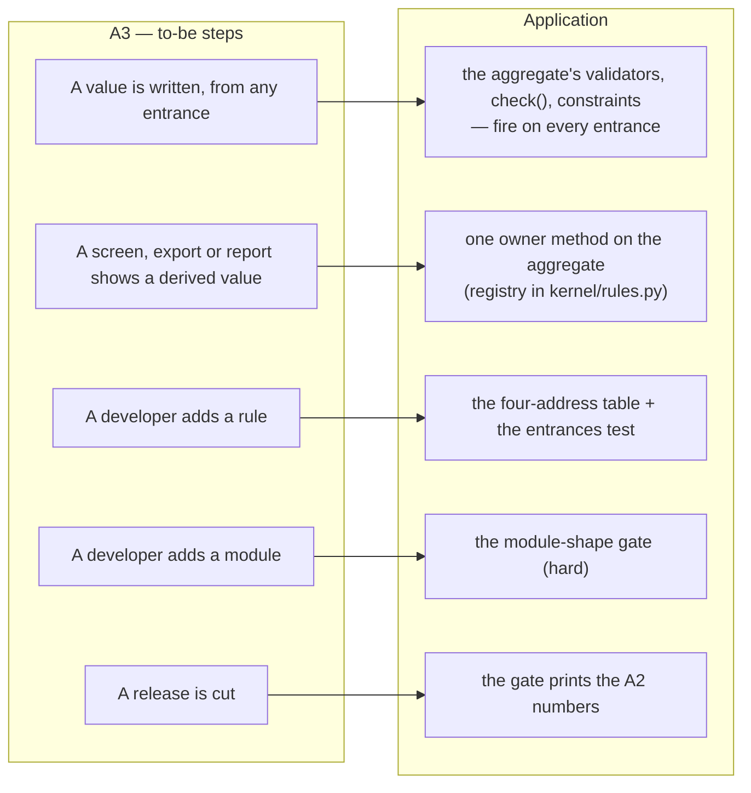
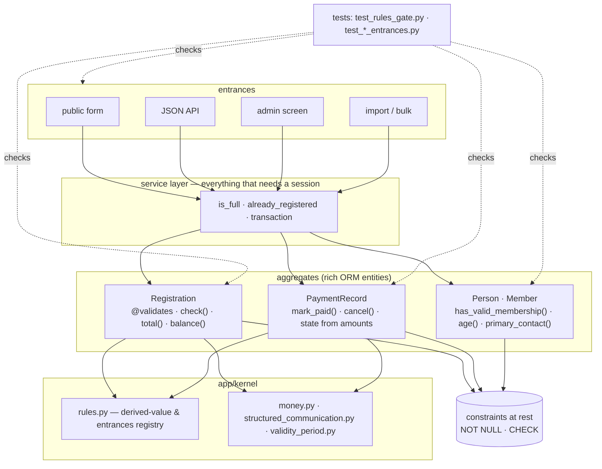

# Change Request 13 — OO foundation: a rule has one home

> Supersedes CR-04 except its placement rule (see the banner there). Being
> shaped with Koen; Part A is his, and is not complete yet.

**Project:** Web Portal "Raak Millegem"
**Status:** shaping started 26 September 2026 · not development-ready · not assigned
**Applies to:** the domain layer of every module (`backend/app/domains/*`,
`app/kernel`), the entrances to each aggregate (public form, JSON API, admin
screen, import), and the shape a new module takes from its first commit.

---

# Part A — The business

> From Koen's words of 26 and 27 September 2026 and his handover note. **Not
> yet approved** — Koen is reading it.

## A1. Reason to act

The trigger is the pain of 8 September 2026. A
validation round that day produced seventeen findings, and four of them —
#720, #727, #733, #681 — were the same defect: a rule enforced on one
entrance and not on another. The public form demanded a mobile number; the
JSON API accepted a registration without one; the admin screen let you erase
it. Not one of those was an oversight. The rule had no home, so it lived in
whichever function happened to run.

This change is about every rule in every existing module having one place,
and about every new module getting that shape from day one rather than
repeating the pattern that produced the four findings.

## A2. As-is process

Measured on the branch on 27 September 2026 (numbers), and read from the
code (the pattern). The as-is is not a process but its absence: a rule has
no address.

**The pattern.** After #733, `controleer_inschrijfvelden(...)` existed in the
service layer — but the registration route had to remember to call it,
`update_registration_contact` too, and two lines further
`Registration(contact_name=..., phone=...)` accepted anything. **The object
cannot say no.** Data in the object, rules in functions beside it, and the
coupling is discipline. Every new entrance (an import in 2027, an API client
in 2028) has to bring that discipline again. #681 found six write paths
where four were known.

**The numbers.**

| | 8–9 Sep 2026 | 27 Sep 2026 | direction |
|---|---|---|---|
| attribute validators (`@validates`) | 0 | **0** | — |
| `CheckConstraint` on models | 1 | 5 (mostly #94 and CR-12) | ↑ |
| `Enum` classes | 0 | 8, all `str, Enum` | ↑ (CR-12 converts them) |
| `db` parameters without a type | 133 of 280 | **~200** | ↑ — *drifting the wrong way* |
| `models.py` touching a session | — | 2 | — |
| exception classes | 7 `*Fout` | 7 `*Fout` + **10 `*Error`** | two conventions side by side |
| domain packages with `CONTRACT.md` / `api.py` | — | 14 / 16 of 17 | the shape exists, unenforced |
| `required=True` promises in templates | 88 in 25 templates, server side **unmeasurable** | not re-measured (#755) | ? |
| mutating UI routes that confirm / orderings without a tiebreaker | 2 of 91 / ~16–36 | not re-measured | outside this CR (#760, #761 — UI and query hygiene, not a rule's home; Koen, 27 Sep) |

Reading: a lot was built since 10 September (reporting, CR-12, 57
migrations) and the two typing numbers got **worse**, not better. That is
CR-04's own argument for "the meter first": without a recurring measurement
in every release, nobody sees this.

## A3. To-be process

A rule lives with the data it judges and fires by itself. Whoever creates
or changes a `Registration` — through the public form, the JSON API, the
admin screen, an import — gets the rule with it without knowing it exists.
A derived value (a total, a balance, a state) is computed in one place, on
the object that owns the data, and shown everywhere else. A new module —
the CRM — has this shape from its first commit, because the build refuses
any other. And every release shows the numbers of A2, each moved the right
way.

The measure over years, in the words of the 26 September handover: *someone
adds an entrance in 2028 without having read CR-04, and cannot create an
invalid `Registration`.* Only that counts; the rest is instrumentation.

## A4. Supplied material

- Koen's handover note from the "Architecturale verbeteringen" session (9–10
  September, measured again 26 September), kept in his project folder
  outside the repository: the explanation of the OO equivalent, seven
  SQLAlchemy pitfalls, nine additions to CR-04, five open questions. What of
  it lands here is English; the note itself is not in the repository.
- CR-04 — the placement rule and the five numbers; kept as the source of the
  rule (banner, 26 September).
- #236 (OO-tracker) and its execution issues: #755 and #757 become phases
  0 and 1 of this CR; #758, #759, #760, #761 stay outside it (Koen, 27 Sep).
- The validation findings of 8 September 2026: #720, #727, #733, #681.
- CR-12 — the sibling foundation; its gates are the shape this CR copies.

## A5. Business requirements

| # | Requirement | MoSCoW | Source | Comment |
|---|---|---|---|---|
| R1 | A rule has one home, and every entrance — form, JSON API, admin screen, import — passes through it. | Must | Koen, 26 Sep 2026 | the 8 September pain |
| R2 | The object can say no: someone who does not know a rule cannot get around it. | Must | handover, 26 Sep | the measure over years |
| R3 | A derived value (total, balance, state) is computed once, on the object that owns the data, and only shown elsewhere. | Must | Koen, 27 Sep 2026 | "methodes om aan bepaalde zaken te komen" |
| R4 | A rule that must hold at rest is a database constraint as well as a validator — in the same change, never split. | Must | handover, 26 Sep | `@validates` fires on assignment, not on absence |
| R5 | A new module has the required shape from its first commit, and the build enforces it. | Must | Koen, 27 Sep 2026 | the CRM module is the first |
| R6 | The rules are guarded by gates that are **hard**, reached phase by phase; nothing stays permanently exempt. | Must | Koen, 27 Sep 2026 | "hard, via fases" |
| R7 | The numbers of A2 appear in every release issue and may only move one way. | Must | CR-04, #755 | the meter before the gate |
| R8 | New names are English; each domain has one exception class, English, with the existing Dutch name kept as an alias. | Must | Koen, 27 Sep 2026 | option (b) |
| R9 | Renaming `Member → Household`. | Won't | Koen, 27 Sep 2026 | "hoort niet bij deze change request" — its own CR if ever |
| R10 | Full DDD machinery: separate domain objects, repositories. | Won't | CR-04, handover; Koen, 27 Sep 2026 | rich ORM entity is the style; see Non-goals |
| R12 | A consequence in another domain after a state change (a mail, a workflow task) goes through a domain event, never through a direct call into that domain; the object says what happened, the service publishes it. | Must | Koen, 27 Sep 2026 | "de betaalcode weet niets van mail"; the dispatcher exists (`kernel/events.py`, §5.8) and is applied in three of six places |
| R11 | CQRS — a separate write model (commands through the domain's rules) and a separate flat read model for reports. | Won't | Koen, 27 Sep 2026 | its win is that reads and writes scale apart, at very large scale; its price is two models kept in sync. Reporting (CR-06) reads the tables directly, and that suffices. |

## A6. Non-functional requirements

| Concern | This change |
|---|---|
| **Reporting** | The A2 numbers, printed by the gate per release (R7). Nothing changes in the reporting universe. |
| **Security** | The finding class of 8 September *is* a security class: a rule enforced at one door leaves the others open. R1 closes it. Bulk and import paths are entrances and are covered (B8 test 3). |
| **Privacy** | None. No new data. |
| **House style / UI norm** | Unchanged; strengthened: *templates show, view-models decide* (design-system §8.3) gets the derived values from the object instead of recomputing them. |
| **Multi-tenant** | Rules are platform-wide; tenant data is untouched. Constraints added at rest (`NOT NULL`, `CHECK`) are checked against the data of every environment before they are applied (B3). |

## A7. Acceptance criteria

| # | Criterion | Requirement |
|---|---|---|
| AC1 | On HDEV, a registration without a mobile number is refused with the same message through the public form, the JSON API and the admin screen — and the import test in the suite. | R1, R2 |
| AC2 | The release issue shows the A2 numbers, each equal to or better than the previous release. | R7 |
| AC3 | A domain package added without `api.py`, `codes.py`, `CONTRACT.md` or its tests turns CI red with the missing piece named. | R5, R6 |
| AC4 | A rule added on `Registration` fires on the JSON API with no change to the router. | R1, R2 |
| AC5 | A registration's total and balance read identically on the admin screen, in the export and in the report — from one method. | R3 |
| AC6 | On HDEV, marking a partially paid record as paid leaves it *partially paid*: the state follows the amounts, not the action (#720). | R1, phase 2 |
| AC7 | Every gate of B9.3 is hard by the end of the last phase; no ratchet file remains. | R6 |

---

# Part B — The solution

## B1. Solution outline

The SQLAlchemy model **is** the domain object — a *rich ORM entity*, the
pragmatic middle between the anemic model of today and full DDD. Each rule
gets the address CR-04's placement rule gives it: one field → a validator on
the attribute; several fields of one object → a method on that object;
other rows → a service function; at rest → a constraint. One hard boundary
keeps this alive for years: **an entity never opens a session**. Derived
values become methods on their owner (`registration.total()`), by
delegating to today's function first and moving the logic second, so every
step is revertible. Every aggregate gets an *entrances test* that discovers
its write paths and demands each passes through its rules. New modules get
a required shape enforced from the first commit. The gates are built in
phase 0 as ratchets on existing code and closed **hard, phase by phase**, so
no exemption list survives.

Decisions that shape it, with what lost:

- **Rich ORM entity, not separate domain objects with repositories.** At
  hundreds of members, a second object layer doubles the translation work
  between object and table for no bug it removes. Odoo's model style — the
  Python ERP this platform is a seed of — is exactly this.
- **Entity never opens a session.** A method that queries drags persistence
  into the domain; then the entity is no longer testable without a database
  and the value-object win is gone. SQLAlchemy makes this treacherous: a
  lazy relationship *looks* like loaded data and is a hidden query. Hence a
  gate, not an agreement (B9.3).
- **Validator and constraint together, in one issue.** `@validates` fires on
  assignment, not on absence and not on `query.update()`; alone it is a
  promise. The `NOT NULL`/`CHECK` in the same change or the gap only moves.
- **Gates hard via phases** (Koen, 27 September), not ratchets that stay:
  phase 0 freezes today's offenders per gate; each phase deletes the entries
  of the domains it migrates and turns the gate hard for them; new modules
  are hard from phase 0. The last phase deletes the ratchet file.
- **English names; one exception class per domain.** New value objects are
  `Money`, `StructuredCommunication`, `ValidityPeriod`. A domain with a
  Dutch `*Fout` gets, at first touch, one English `*Error` and the Dutch
  name becomes an alias of it — one class, two names, no rename.
- **Measurement first — in commits, not in releases.** The handover argued
  for the meter in its own release before any rebuild. Koen decided (27
  September) that **all phases ship in one release**, as CR-12 does in
  v2.7.0. The principle survives in a smaller form: phase 0 is the first
  work on the release branch, its gate run is the baseline, and no rebuild
  commit precedes it — the measurement is before the rebuild in time, and
  the release issue shows both numbers.

Europe First: nothing new — SQLAlchemy, Alembic, pytest, mypy.

### B1.1 Functional analysis

| # | Derived requirement | Traces to |
|---|---|---|
| F1 | Each rule on an aggregate is placed by the four-address table (B4.2) and documented in the aggregate's docstring with its address. | R1 |
| F2 | Each aggregate has an entrances test that discovers its write paths (router, UI route, import, seed, bulk) and asserts each passes through validation. | R1, R2 |
| F3 | `@validates` for one-field rules; `check()` for cross-field rules, never touching a session; `NOT NULL`/`CHECK` in the same issue. | R1, R4 |
| F4 | Derived values live in a registry (owner method per value); a second computation of the same value outside the owner is a gate violation. | R3 |
| F5 | Entities import nothing that yields a session; the gate proves it by violation. | R2 |
| F6 | A domain package has `api.py`, `codes.py`, `CONTRACT.md`, `models.py`, tests, and imports no other domain's internals; hard for packages created after phase 0. | R5, R6 |
| F7 | `rules_baseline.py` holds per gate the frozen offenders; a phase removes the entries of its domains and the gate is hard for them; phase 4 deletes the file. | R6 |
| F8 | The gate prints the A2 numbers; the release issue pastes them. | R7 |
| F9 | Per domain, at first touch: one English exception class, Dutch alias, `db: Session` on every function, annotations on the parameters the rules read. | R8, and CR-12 B4.8 |
| F10 | Value objects map on existing columns (`composite()` / hybrid property); no schema change. | R3 |
| F11 | `PaymentRecord`'s state is derived from its amounts by guarded transitions; requires the closed status set of CR-12 phase 1. | AC6 |
| F12 | A transition method on an aggregate returns the event it caused (`mark_paid()` → `PaymentReceived`); the service publishes it after the flush through `kernel.events.publish`; handlers live in `<domain>/handlers.py`; each `CONTRACT.md` lists what the domain publishes and subscribes to. | R12 |
| F13 | A domain's *command* functions (the ones that do something: `send_*`, `vervroeg_*`, …) are named in its `CONTRACT.md` and are called from outside the domain only by a handler; reads through `api.py` stay as they are. | R12 |

## B2. Architecture

### B2.1 Components

| Component | new / used / changed | Role |
|---|---|---|
| `app/kernel/rules.py` | **new** | the derived-value registry (owner per value) and the entrances registry the gates read; nothing else — the rules themselves live on the entities |
| `app/kernel/events.py`, `kernel/contracts/*` | used | the synchronous in-transaction dispatcher (§5.8, ladder step 1) and the event contracts; new events: `OrderChanged` (phase 1), `PaymentReceived` and `RefundDue` (phase 2), `RegistrationConfirmed` (phase 4) |
| `mail/handlers.py`, `workflow/handlers.py` | **changed** | subscribe to the new events; the three direct calls into them disappear |
| `app/kernel/money.py`, `structured_communication.py`, `validity_period.py` | **new** | the value objects (`geld.py` today has one formatting function; `Money` absorbs it) |
| `activities/models.py` (`Registration`) | **changed** | first aggregate: validators, `check()`, `total()`, `balance()`; `controleer_inschrijfvelden` moves in, is not copied (#757) |
| `payment/models.py` (`PaymentRecord`) | **changed** | second: `mark_paid(amount)`, `cancel()`, state from amounts (phase 2) |
| `mdm/models.py` (`Person`, `Member`) | **changed** | third: `has_valid_membership(on)`, `age(on)`, `primary_contact(type)` |
| every `router.py` / `admin_ui.py` / `import_service.py` that writes an aggregate | **changed** | calls the aggregate's rule; loses its inline checks |
| `backend/tests/test_rules_gate.py`, `rules_baseline.py` | **new** | the gates of B9.3 |
| `backend/tests/test_<domain>_entrances.py` | **new**, one per aggregate | the entrances test (B8 test 1) |
| `docs/code-style.md` | **created** (#781 never built it) | the layer rules, the four addresses, the module shape — one screen |
| `CLAUDE.md` *Validation layers* | **changed** | points to `docs/code-style.md`, stops repeating it |

### B2.2 Application usage

### B2.3 Application structure

### B2.4 Impact on the existing architecture

- **Layer gate** (`test_layer_gate.py`) already keeps `db` out of `ui.py`;
  this CR adds the mirror: no session in `models.py`, and no rule in a
  router (B9.3).
- **Import gate** (`test_import_boundaries.py`) is extended to the module
  shape: `api.py` is the only door, `codes.py` exists, `CONTRACT.md` exists.
- **Template-variables gate**: templates that showed a recomputed total now
  read `registration.total` from the view-model; the promise list shrinks.
- **CR-12**: phase 2 here (state machine) needs CR-12 phase 1 (closed
  status set) — a hard order. The AST-ratchet and `Mapped[]` conventions of
  CR-12 B4.8 are reused; typing per domain is shared work between CR-12
  phase 5 and this CR's per-domain phases, done once.
- **CR-04** keeps the placement rule; this CR is the rest. #236 becomes the
  pointer to this CR; #755 and #757 are phases 0 and 1 below; #758 (screen
  sweep), #759 (e2e), #760 (confirmations) and #761 (tiebreakers) stay
  separate — the last two are UI and query hygiene, not a rule's home.

## B3. Cost and operations

- **Env vars / settings:** none.
- **Migrations:** only constraints (`NOT NULL`, `CHECK`) per aggregate phase;
  no new tables, no renames — every phase is image-rollback-safe (unlike
  CR-12's migration 154), and `downgrade()` drops the constraint.
- **Data check before every constraint.** A `NOT NULL` on a column with one
  empty legacy row fails the migration on that environment. Each constraint
  migration counts the offending rows first and **aborts with the count**
  rather than silently skipping (the CR-12 B4.6 guard shape). #733 measured
  0 empty rows on PROD for the four registration fields; every other column
  is measured on HDEV, UAT and PROD before its phase ships, and the numbers
  go in the phase issue.
- **Backups:** unchanged.
- **Kill switch:** none needed; a rule that misfires is a red test before it
  ships.

## B4. Detailed decisions

### B4.1 Rich ORM entity; an entity never opens a session

The model is the domain object; no repositories, no separate domain layer.
The one boundary: a method on an entity reads what is already in memory,
and nothing else. Doubt → service function. SQLAlchemy's trap: a lazy
relationship in a method (`self.activity.registrations`) is a hidden query
— the fullness check at `activities/router.py:840` did exactly that on 9
September. The gate (B9.3) catches `Session`, `db`, `.query(` and the
import of `app.db` in `models.py`; the lazy-relationship case is caught by
the entrances test running the aggregate's methods on a **detached** object
(a query then raises `DetachedInstanceError`).

### B4.2 The four addresses, and the pitfalls each carries

| The rule looks at… | Address | SQLAlchemy pitfall | Covered by (B8) |
|---|---|---|---|
| one field | `@validates("field")` | fires on assignment, **not on absence** — `Registration(contact_email=…)` without `contact_name` never runs it | test 2: construct without the field → `NOT NULL` refuses |
| one field | same | bulk paths (`query.update()`, `bulk_insert_mappings`, Core inserts) bypass the object | test 3: the entrances test finds bulk writers and asserts each validates before |
| one field | same | does not fire on load — a legacy row with an empty field lives until touched (wanted) | test 4: a legacy row loads without error; the data check in B3 measures it |
| several fields of one object | `def check(self)` | must never need a session (B4.1) | test 5: detached object |
| other rows | service function | stays where it is | existing service tests |
| at rest | `NOT NULL` / `CHECK` | none — the last net | test 2, and the migration's own data check |

Sketched on `Registration` (from the handover), so the shape is concrete:
`@validates("contact_name", "phone")` strips and refuses blank;
`check()` refuses a missing team name when `self.component.team_name_required`;
`total()` sums the items already loaded; `balance()` uses the payment records
already loaded. The service keeps: is the component full, is this e-mail
already registered, the transaction.

### B4.3 Derived values: one owner

`app/kernel/rules.py` holds a registry: derived value → owner method
(`registration.total`, `registration.balance`, `activity.state`,
`payment_record.state`, `person.age`, `member.active_membership`). The
registry is what the gate reads to find a second computation (B9.3). The
first three already exist as free functions (`compute_registration_total`,
`registration_balance`, `RegistrationState` logic); phase 1 makes each a
method by **delegation first** — the function stays, the method calls it,
the tests keep passing — and **move second**, in a separate commit, so the
diff that moves logic moves only logic.

### B4.4 Exceptions: one English class per domain, Dutch alias (Koen, 27 September)

Seven domains raise a Dutch `*Fout` (`ActiviteitFout`, `BetalingFout`,
`FormulierFout`, `LidgegevensFout`, `MediaFout`, `TenantFout`, `VeldFout`);
ten newer ones raise an English `*Error`. At the first touch of a domain in
this CR: one English class (`ActivityError`), and the Dutch name becomes an
alias (`ActiviteitFout = ActivityError`) — one class, two names. Existing
`except ActiviteitFout` keeps working; new rules raise `ActivityError`; the
#780 ratchet sees one Dutch name fewer, not one more. The alias is removed
only when the last Dutch reference is gone, which is not this CR's job.

### B4.5 The module shape (Koen, 27 September: yes)

A package under `app/domains/` has: `api.py` (the only thing another domain
imports), `codes.py` (its lists, CR-12), `CONTRACT.md` (what it promises,
one screen), `models.py`, a `tests/` counterpart, and no import of another
domain's internals. That is what 14 of 17 packages already have; the gate
makes it a property. **Hard from phase 0 for any package created after it**
(the CRM is the first); the three existing packages that miss a piece are
on the ratchet and fixed in phase 4. Not a scaffold script — a checklist in
`docs/code-style.md` and a gate that names the missing file; a generator
would be a second place that knows the shape.

### B4.6 Gates hard via phases (Koen, 27 September)

Phase 0 builds every gate with a frozen baseline of today's offenders per
gate (`rules_baseline.py`, the CR-12 form). Each subsequent phase migrates
one or more aggregates/domains and **removes their entries**; for those
domains the gate is hard from then on. New modules never enter the
baseline. Phase 4 removes the last entries and the baseline file: from then
every gate is hard everywhere. No permanent exemption dict exists in this
CR — unlike CR-12, which needs one for external vocabularies; a rule's home
has no external party.

### B4.7 Order of aggregates

`Registration` first (#757; the four 8-September findings sit there), then
`PaymentRecord` (money; #720 sits there; needs CR-12 phase 1), then
`Person`/`Member` (membership rules now in `membership.py` loops). The value
objects (`Money`, `StructuredCommunication`, `ValidityPeriod`) run in
parallel with phase 1 — independent, no schema, testable without a
database; `StructuredCommunication.parse/validate` is missing functionality
today, not a refactor.

### B4.8 Typing is a precondition, not a later phase

The handover measured the untyped `db` parameters growing from 133 to ~200
in two weeks. A rule on an object only helps mypy if the function reading
the object is annotated (CR-12 B4.8). So per domain, in the phase that
touches it: `db: Session` everywhere, `record: PaymentRecord` on the
functions the rules pass through, `Mapped[]` on the columns the rules read.
Shared with CR-12 phase 5; done once, whichever CR reaches the domain first.

### B4.9 Domain events: the object says what happened, the service publishes (Koen, 27 September)

The twin of "the object can say no": after a transition the object can say
*what happened*. The mechanism exists — `kernel/events.py`, a synchronous
dispatcher in the same transaction (a failing handler rolls the source
back; no "maybe later"), event contracts in `kernel/contracts/`, handlers
per domain in `handlers.py`. It is applied in three places (payment, forms,
mdm publish; mail and workflow subscribe) and bypassed in three:
`activities/router.py:35` and `membership/register_router.py:52` import
`mail.api.send_*` directly, `payment/service.py:457,1244` import
`workflow.api.vervroeg_sweep`, and `activities/service.py` (`_herbereken`,
`delete_registration`) calls `payment.api.reconcile_registration_charges`.
Measured 27 September; the fourth found while walking the order-change
path with Koen.

The rule (R12): a consequence in another domain goes through an event.
Reads through `api.py` are untouched — `mdm.api.get_person` is a question,
not a consequence.

**Who publishes.** Not the entity: `publish()` needs the session, and B4.1
says an entity never touches one. The transition method **returns** the
event it caused — `record.mark_paid(amount)` returns `PaymentReceived(...)`
or raises — and the **service publishes it after the flush**. The entity
stays testable without a database; the service, which owns the transaction
anyway, does the one thing that needs it.

**Where the order is readable** (the price Koen named — "the order is no
longer in one place"): handlers sit in one file per domain, and each
`CONTRACT.md` lists *publishes* and *subscribes to*. "What happens after a
payment?" is answered by reading who subscribes to `PaymentReceived` — a
`grep`, not a search. Handlers run in registration order, synchronously;
nothing is deferred.

**Worked on the order-change path** (Koen's question, 27 September). Today
`activities` calls `payment.api.reconcile_registration_charges` directly
after an order line changes (`_herbereken`, `delete_registration`), and
`payment` calls `workflow.api.vervroeg_sweep` after creating a refund. With
events: `activities` publishes `OrderChanged(registration_id, total_due)`
and knows nothing of payments; `payment/handlers.py` reconciles — the same
`reconcile_charges`, unchanged — and, when that yields a refund, publishes
`RefundDue(record_id, amount)`; `workflow/handlers.py` makes the
confirmation task; `mail/handlers.py` can tell the member (today nobody
does — an own issue, but then a ten-line handler instead of a fourth
coupling). All of it synchronous, in the one transaction: if reconciliation
fails, the order line stays. The rule "activities must reconcile" does not
disappear, it moves: from "activities calls payment" to "payment reacts to
every order change" — stronger, because a new entrance that changes an
order only has to publish, and the entrances test checks that it does.
The `activities → payment.api` call is a fourth coupling of the same kind,
found on this walk-through; it goes in phase 1.

**The gate** (B9.3, ratchet on the four couplings, hard for new modules):
a domain's command functions — named in its `CONTRACT.md` — are called from
outside the domain only from a `handlers.py`.

## B5. Data model

### B5.1 Entity-relationship diagram

No new entities and no new relationships: this CR adds behaviour to the
tables that exist and constraints on their columns. An ERD would repeat the
existing schema; omitted on purpose.

### B5.2 Tables

Per phase, the constraints that make a validator hold at rest, each with
its data check (B3):

| Phase | Table | Constraint |
|---|---|---|
| 1 | `activities.registrations` | `NOT NULL` on `contact_name`, `contact_email`; `CHECK` that `team_name` is not empty when the component requires it is *not* expressible at rest (needs the component) — validator + `check()` only, stated in the docstring |
| 1 | `activities.registration_items` | `CHECK (quantity > 0)`, `CHECK (unit_price >= 0)` |
| 2 | `payment.payment_records` | `CHECK (amount_paid <= amount)` for charges, `CHECK (amount < 0)` for refunds (CR-12 gives the closed `type` set) |
| 3 | `mdm.persons`, `mdm.member_persons` | `CHECK (valid_from <= valid_to)` on memberships |

Validation layers: form → Pydantic (unchanged); meaning → the entity's
validator/`check()` (new home); at rest → the constraints above.

## B6. Privacy and security — the mechanics

Nothing new leaves the system. The entrances test is the security
mechanism: it *discovers* write paths instead of trusting a list of four,
which is how #681 found six. Bulk and import paths are entrances.

## B7. Phasing

The phases are issues under **one release tracker** (Koen, 27 September:
"die fases gaan we in één release realiseren"), built in order on one
branch line; each phase is shippable on its own, and — unlike CR-12 — every
migration is a constraint, so the whole release is revertible by image
rollback plus `downgrade()`. The restore point is the release, as in CR-12,
but here that costs little.

| Phase | Delivers | Depends on |
|---|---|---|
| **0 — the meter and the gates** (first on the branch, before any rebuild commit) | `test_rules_gate.py` + `rules_baseline.py` (every B9.3 gate as ratchet, the module-shape gate hard for new packages), the A2 numbers printed by the gate, `app/kernel/rules.py` registry, `docs/code-style.md` created, `CLAUDE.md` pointer, exception aliases for the domains phase 1 touches | — |
| **1 — `Registration`** + value objects | #757 by the four addresses; `total()`/`balance()` by delegate-then-move; `controleer_inschrijfvelden` moved; the entrances test; constraints of B5.2; `ActivityError` + alias; `Money`, `StructuredCommunication`, `ValidityPeriod` in the kernel (parallel); **`OrderChanged(registration_id, total_due)` published by the service after any change to the order lines — `payment/handlers.py` subscribes and reconciles; `activities` no longer calls `payment.api.reconcile_registration_charges` (`_herbereken` and `delete_registration`)** | 0 |
| **2 — `PaymentRecord`** | state from amounts (`mark_paid`, `cancel`), guarded transitions, `Charge`/`Refund` only if the branching recurs; the #720 fix; `PaymentError` + alias; **`mark_paid` returns `PaymentReceived`, the service publishes it, workflow subscribes — the two `vervroeg_sweep` calls go; reconciliation that creates a refund publishes `RefundDue(record_id, amount)`, workflow makes the confirmation task** | 0, **CR-12 phase 1 on master** |
| **3 — `Person` / `Member`** | membership and age rules on the objects; `primary_contact(type)` (CR-12 gives `ContactType` constants) | 0 |
| **4 — sweep and close** | remaining domains' offenders removed from the baseline; the three packages missing a shape piece fixed; the two direct mail calls in the registration routes become `RegistrationConfirmed` + a mail handler; `rules_baseline.py` deleted — every gate hard | 1–3 |

### B7.1 Per phase: issue and "Na de merge"

| Phase | Issue title | Migration | Env vars | Data | Manual validation |
|---|---|---|---|---|---|
| 0 | **#755**, rescoped: CR-13 fase 0 — de meter en de gates: `test_rules_gate.py`, baseline, module-vorm hard voor nieuwe modules | none | none | none | CI only; the numbers in the release issue |
| 1 | **#757**, rescoped: CR-13 fase 1 — `Registration` als aggregaat + value objects + `OrderChanged` | constraints of B5.2 phase 1, with data checks | none | the data check counts per environment in the issue | AC1, AC4, AC5 on HDEV; reduce and delete an order line in the admin and see the charge follow (the #185 behaviour, now through the event) |
| 2 | CR-13 fase 2 — `PaymentRecord`: toestand uit de bedragen, `PaymentReceived` als event | constraints of B5.2 phase 2 | none | a count of records where `amount_paid > amount` before the CHECK | AC6 on HDEV; a Mollie test payment, and the workflow task it triggers |
| 3 | CR-13 fase 3 — `Person`/`Member`: lidmaatschapsregels op het object | constraints of B5.2 phase 3 | none | memberships with `valid_from > valid_to` counted | the family portal and the member list on HDEV |
| 4 | CR-13 fase 4 — sweep: baseline weg, elke gate hard; `RegistrationConfirmed` + mail-handler | none | none | none | a registration on HDEV still gets its confirmation mail; AC7 |

## B8. Tests

All proven by an **additive** violation (CR-12 B8), each ratchet checked to
look somewhere (#678).

1. **The entrances test, per aggregate.** Discovers — by walking the code,
   not by a list — every path that writes the aggregate (router, UI route,
   import, seed, bulk) and asserts each passes through its validators or
   `check()`. Proof: add a route that writes the aggregate directly → red
   with the path.
2. **Absence is caught at rest.** Construct `Registration` without
   `contact_name`, flush → `IntegrityError`; the validator alone would not
   have fired.
3. **Bulk paths.** A `query.update()` that sets a blank `contact_name` is
   refused by the constraint, and the entrances test lists that call site.
4. **Legacy rows load.** A row inserted raw with an empty field loads without
   error and is refused on the next assignment.
5. **Detached object.** Every entity method runs on a detached instance
   without raising `DetachedInstanceError` — the proof that none queries.
6. **Value objects without a database.** `Money` rounding and currency,
   `StructuredCommunication.parse/validate` (mod-97), `ValidityPeriod.contains`
   — pure unit tests, exhaustive at the boundaries.
7. **Transitions.** `mark_paid` on a partially paid record leaves it
   partially paid; a refund larger than the charge is refused; each illegal
   transition named.
8. **One owner.** The total shown by the admin screen, the export and the
   report for one registration are the same object's method — asserted by
   mocking the method and seeing all three change.
9. **The numbers move.** Add one `@validates` → the gate's count rises by
   one; remove one `required=True` → the promise count falls (the #755
   requirement).
10. **The gates of B9.3**, each by an additive violation.
11. **The event reaches its handler, in the transaction.** `mark_paid` on a
    record returns `PaymentReceived`; the service publishes; the workflow
    handler runs before commit; a handler that raises rolls the payment
    back (the dispatcher's own semantics, proven on this event). And the
    coupling gate: add a direct `mail.api.send_*` call in a router → red.

## B9. Rule and gatekeeper

### B9.1 The rule

> **A rule has one home, and every entrance passes through it.** One field →
> an attribute validator; several fields of one object → a method on that
> object; other rows or the database → a service function; at rest → a
> constraint, in the same change as the validator. A derived value is
> computed once, on the object that owns the data, and shown everywhere
> else. An entity never opens a session. A screen, a JSON route and an
> import never carry a rule of their own. A consequence in another domain
> goes through a domain event: the object returns what happened, the
> service publishes it. A domain package has the shape of B4.5.

Lives in `docs/code-style.md` (created in phase 0) and CR-04 (the placement
rule, unchanged); `CLAUDE.md` points there.

### B9.2 Reach and baseline

Reach: every aggregate in every domain, and every module that follows. The
baseline is measured by the gate in phase 0 — the hand numbers of A2 are the
first picture, the gate's count binds (the CR-12 rule):

| Gate row | by hand, 8–27 Sep 2026 | gate, phase 0 | after this CR |
|---|---|---|---|
| attribute validators | 0 | — | one per field-level rule |
| check constraints on models | 5 | — | every critical invariant |
| template promises without a server-side counterpart | 88 promises, counterpart unmeasurable | — | 0 |
| entrances that bypass an aggregate's rules | unmeasured (four found by hand) | — | 0 |
| derived values computed outside their owner | unmeasured | — | 0 |
| rules living in a router | unmeasured | — | 0 |
| entities touching a session | 2 | — | 0 |
| direct calls into another domain's command functions (outside a handler) | 4 (mail ×2, workflow, payment-reconcile) | — | 0; hard for new modules from phase 0 |
| packages missing the module shape | 3 of 17 | — | 0; hard for new ones from phase 0 |
| untyped `db` parameters | ~200 | — | 0 in migrated domains |

### B9.3 The gate

`backend/tests/test_rules_gate.py`, run by `backend-tests.yml` on every push
and PR. Baselines in `rules_baseline.py` (frozen sets, entries may only be
removed; deleted in phase 4).

| Gate | Looks at | Message on violation |
|---|---|---|
| Promise kept | every `required=True` / `pattern=` / `min=` in a template, walked back through the view-model to the column it posts to (the template-variables gate knows the field): a validator, a schema constraint or a DB constraint must exist | "`_inschrijf_form.html:42` promises `mobile` required; `Registration.mobile` has no validator and no constraint" |
| One entrance rule | every function in `router.py` / `admin_ui.py` / `*import*.py` that writes a mapped class (AST: constructor call, attribute assignment, `db.add`) calls the aggregate's `check()` or a service function registered for it in `kernel/rules.py` | "`activities/router.py:885` writes `Registration` without `Registration.check()`" |
| One owner per derived value | for each value in the registry, a second computation of its shape outside the owner (`sum(... * ...)` over the same relationship; a state decided from `paid_at`/`amount`) | "`payment/admin_ui.py:120` recomputes a registration total — use `registration.total()`" |
| No rule in a router | an `if` on a domain attribute followed by `raise`/`flash` in `router.py`/`ui.py` (the layer gate's sibling) | "`membership/register_router.py:61` decides `mobile` is required — move it to `Person`" |
| No session on an entity | `models.py` imports or names `Session`, `db`, `.query(`, `app.db` | "`activities/models.py:212` opens a session in `Registration.is_full()` — that is a service function" |
| Module shape | every package under `app/domains/` has `api.py`, `codes.py`, `CONTRACT.md`, `models.py`, tests; no import of another domain's internals — **hard for a package created after phase 0** | "`app/domains/crm/` has no `CONTRACT.md`" |
| Events, not calls | every call from domain A into a command function of domain B (the functions B's `CONTRACT.md` names as commands) happens in a `handlers.py`; anywhere else is red — ratchet on today's four, hard for new packages | "`activities/router.py:35` calls `mail.api.send_activity_registration_confirmation` directly — publish `RegistrationConfirmed` and let mail subscribe" |
| Typed | in a migrated domain, every function has `db: Session` and annotated aggregate parameters (mypy `disallow_untyped_defs` per domain, the CR-12 B4.8 setting) | mypy's own message |

Not mechanical, and said so: whether a rule *should* exist, whether two
derived values are one concept or two, whether a `check()` is complete.
Those go to review; the entrances test makes sure review at least sees
every door.

### B9.4 Hard via phases, and why that is not "gates first"

CR-04 warned that a gate closed while eighty-five routes violate it needs
an exemption list, and an exemption list is where a rule dies. Koen's
answer (27 September): **hard, via phases.** Phase 0 freezes the offenders;
every phase deletes its own entries and is hard from then on; phase 4
deletes the file. The list exists only while it shrinks, and shrinking is
the phase's definition of done. New modules are never on it. That is the
difference between an exemption list and a burn-down.

## B10. Prototype findings

- An OGM value-object spike with a full unit suite and zero DB fixtures
  exists (CR-04) — the testability model for phase 1.
- To spike before phase 1: `composite()` versus a hybrid property for
  `Money` over `Numeric` columns — the one ORM friction CR-04 named and
  nobody has measured.
- To spike before phase 2: a `PaymentRecord` transition table on the real
  status values of CR-12 phase 1, against the 26 September data of HDEV
  (how many records are partially paid today).

## B11. Decisions log

| Date | Decision | Who |
|---|---|---|
| 26 Sep 2026 | Fresh CR-13 instead of reworking CR-04; CR-04 keeps only the placement rule. | Koen |
| 26 Sep 2026 | Trigger: the pain of 8 September; broader than the CRM module. | Koen |
| 27 Sep 2026 | The rule this CR fixes is guarded in CI on every push from the start; B9 written first. Template B9 says a rule is fixed only when its gate runs in CI. | Koen |
| 27 Sep 2026 | `Member → Household` is not part of this CR. | Koen |
| 27 Sep 2026 | `OrderChanged` is the second event of phase 1: `activities` publishes after any order-line change, `payment` reconciles as a subscriber; the direct `reconcile_registration_charges` call goes. `RefundDue` in phase 2. | Koen |
| 27 Sep 2026 | Domain events are a Must (R12): a consequence in another domain goes through an event; the object returns what happened, the service publishes (the entity never touches a session). Gate: ratchet on the three direct couplings, hard for new modules. | Koen ("Must, en de service publiceert") |
| 27 Sep 2026 | CQRS is a separate Won't (R11): reporting reads the tables, and that suffices. | Koen |
| 27 Sep 2026 | #760 (confirmations) and #761 (tiebreakers) are out of this CR — UI and query hygiene, not a rule's home; they stay open as their own issues. #755 and #757 are reused as the phase-0 and phase-1 issues. | Koen |
| 27 Sep 2026 | Exceptions: one English class per domain at first touch, the Dutch `*Fout` name kept as alias (option b). | Koen |
| 27 Sep 2026 | The module shape is a deliverable with a gate; hard for modules created after phase 0. | Koen |
| 27 Sep 2026 | Gates are hard, reached via phases: each phase deletes its baseline entries; phase 4 deletes the file. No permanent exemption. | Koen ("hard, via fases") |
| 27 Sep 2026 | Rich ORM entity, no repositories; an entity never opens a session (gate). | Koen (confirmed 27 Sep), from his handover |
| 27 Sep 2026 | All phases in **one release** (like CR-12 in v2.7.0); phase 0 is the first work on the branch so the baseline precedes the rebuild in time. | Koen |
| 27 Sep 2026 | Validator and constraint in one issue; `Registration` → `PaymentRecord` → `Person`/`Member`; value objects parallel to phase 1. | Koen (confirmed 27 Sep), from his handover |

## Q&A log

| # | Date | Question (who) | Answer |
|---|---|---|---|
| Q1 | 25 Sep 2026 | Trigger: CRM, or the 8 September pain? (Claude) | Koen (26 Sep): the 8 September pain; broader than CRM. |
| Q2 | 25 Sep 2026 | A selection from CR-04 or broader? (Claude) | Koen (26 Sep): broader. |
| Q3 | 25 Sep 2026 | "Methods to get at things": derived values once, on the object? (Claude) | Koen (27 Sep), via the handover: yes — rich ORM entity, delegate then move; B4.3. |
| Q4 | 25 Sep 2026 | A module skeleton as deliverable, with a gate? (Claude) | Koen (27 Sep): yes; B4.5. |
| Q5 | 25 Sep 2026 | How hard may the gate be? (Claude) | Koen (27 Sep): hard, via phases; B4.6, B9.4. |
| Q6 | 27 Sep 2026 | `Member → Household` in this CR? (Claude) | Koen: no. |
| Q7 | 27 Sep 2026 | The seven `*Fout` classes next to ten `*Error` classes? (Claude) | Koen: option (b) — one English class per domain, Dutch alias. |
| Q8 | 26 Sep 2026 | "Vereffend" versus "Betaald" — one word or two concepts? (handover) | Decided in CR-12 B4.4: two concepts; the balance state is derived, on the object — B4.3 here. |
| Q9 | 26 Sep 2026 | Phase 0 (value objects) before or parallel to phase 1? (handover) | Parallel; B4.7. |
| Q14 | 27 Sep 2026 | Does the Mollie screen keep working; what if nobody ever pays at Mollie? (Koen) | Unchanged: the redirect is HTTP, not an event; the webhook re-fetch stays. Never paid → record `failed`/`cancelled` via `MOLLIE_STATUS_MAP`, registration stays with an open balance, no clean-up or reminder today. Koen: leave Mollie as it is. |
| Q13 | 27 Sep 2026 | What happens when an admin reduces or deletes a registration that was (partly) paid, and how do events fit? (Koen) | `reconcile_charges`: paid amounts are the truth, the outstanding is reduced to one post — a new charge if more is due, a pending refund (treasurer confirms) if less; a deletion reconciles to 0 first, records stay. Nobody is told today. With events: `OrderChanged` → payment reconciles → `RefundDue` → workflow task, and mail can subscribe. B4.9. |
| Q12 | 27 Sep 2026 | Domain events — useful? Must or Should; who publishes? (Koen / Claude) | Koen: Must, and the service publishes. Measured: the dispatcher exists and is bypassed in three places; B4.9. |
| Q11 | 27 Sep 2026 | Are #236's six execution issues still relevant? (Koen) | #755 and #757 are phases 0 and 1; #758 and #759 were already outside; #760 and #761 taken out on Koen's decision — they were in CR-04's five numbers because of the validation day, not because they are about a rule's home. |
| Q10 | 26 Sep 2026 | When is the CR assigned — own release or woven into CR-12? (handover) | Koen (27 Sep): one release for all phases, after CR-12 v2.7.0 (phase 2 needs CR-12 phase 1 on master). Assignment is Koen's. |

## Non-goals

- **`Member → Household`** (Koen, 27 Sep): not this CR; its own CR if ever.
- **No full DDD** (R10): no separate domain objects (a second `Registration`
  with a field-by-field translation to the ORM one — every column twice),
  no repositories (a layer that repeats what the SQLAlchemy session already
  is). The model is the object. Domain events are **in** (R12, B4.9) — the
  existing synchronous dispatcher, applied everywhere a domain causes a
  consequence in another; not an asynchronous bus, not an outbox (that is
  ladder step 2 in §5.8, for when a component is extracted).
- **No CQRS** (R11, Koen, 27 Sep 2026): no separate write and read models.
  Reports (CR-06) read the tables; two models kept in sync would solve a
  scale problem this platform does not have.
- **No renaming** of existing Dutch identifiers; aliases only (B4.4).
- **No screen sweep (#758), no e2e track (#759), no confirmation sweep
  (#760), no tiebreaker gate (#761)** — separate issues; the last two are
  hygiene gates that belong with the UI-conventions gate, not with this
  rule (Koen, 27 Sep).
- **No ruff (#781)** — separate; `docs/code-style.md` is created here
  because this CR needs a home for the rule, and #781 fills the rest.
- **No Alpine gate** — the CR-12 limit (gate 8) applies here too.
- **No query logic on entities**, ever — that is the boundary, not a phase.
- **Mollie stays as it is** (Koen, 27 Sep): the checkout redirect
  (`HX-Redirect` to the `checkout_url`) and the webhook's re-fetch are
  untouched; phase 2 only moves the status decision to `mark_paid()`. A
  payment never completed at Mollie leaves the registration standing with
  an open balance, as today; no expiry job, no reminder — a policy question
  for its own issue, for which `PaymentExpired` would then be the event.

## Relationship to existing work

- **CR-04** — the placement rule lives on there; everything else is here.
- **#236 (OO-tracker)** — becomes the pointer to this CR once Part A is
  approved; #755 and #757 are phases 0 and 1 (the issues are reused, not
  recreated); #758, #759, #760, #761 stay their own issues.
- **CR-12** — sibling foundation: closed status sets (phase 2 needs its
  phase 1), `ContactType` constants (phase 3), the AST-ratchet and
  `Mapped[]` conventions, the "counted, not derived" rule for numbers, the
  additive-violation rule for gate proofs.
- **#94** — the constraint layer; each constraint here lands in the phase
  of its aggregate, not in #94.
- **#720, #727, #733, #681** — the findings this CR exists for; each is an
  acceptance criterion or a test above.
