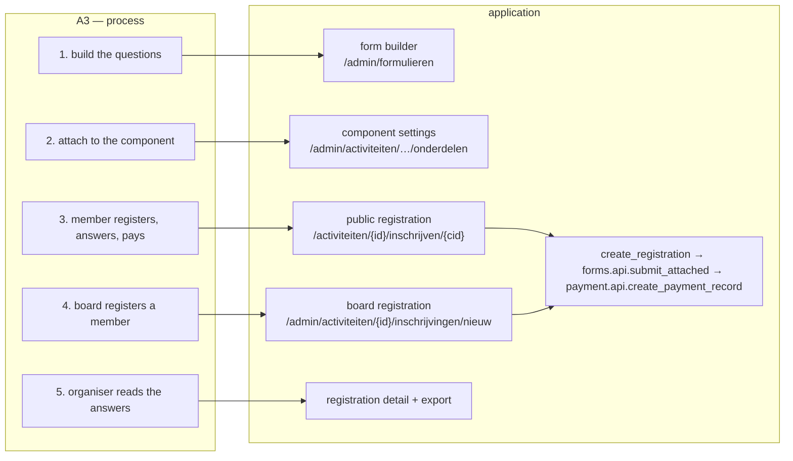
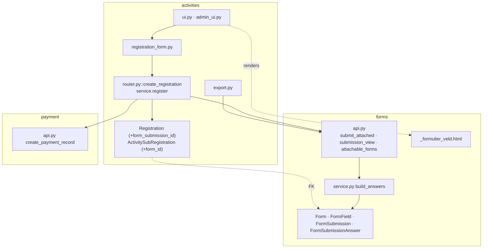
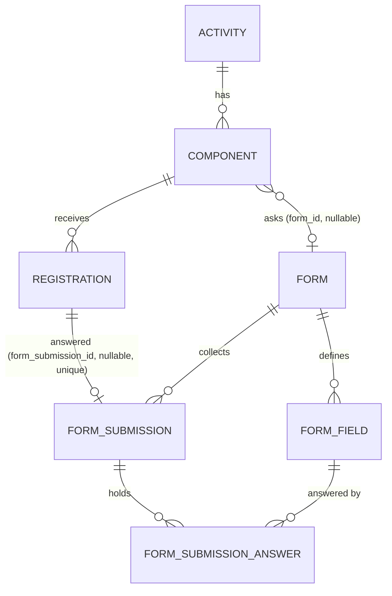

# Change Request 14 — Extra questions on a registration: a form attached to a component

**Project:** Web Portal "Raak Millegem"
**Status:** shaped with Koen on 29 September 2026; reviewed by the author the same evening (Q18–Q22 to Koen) · **draft — Part A to be confirmed by Koen** · not assigned · issue #1320
**Applies to:** the activity registration flow (the public registration — today a modal — the board form, the JSON API), the `forms` domain, the registration detail and export in the admin, the confirmation mail.

> Part A is written from Koen's spoken brief of 29 September 2026. Where the
> brief left something open, the sentence says *to confirm* and the Q&A log
> carries the question. Part B is measured on `master` `6a96af01` the same day.

---

# Part A — The business

## A1. Reason to act — the trigger
The association wants every registration to run through the new platform.
For the Sint activity it could not: the registration and its questionnaire
had to be split — the registration on the platform, the questions elsewhere
— where before the platform they were one form. That is a step back, and
the association does not take steps back. Hence this change request: the
questions integrated into the registration. (Koen, 29 September 2026.)

## A2. As-is process — how it works today, and where it hurts
| Step | Who | Today | Pain |
|---|---|---|---|
| 1. The organiser sets up the activity and its components in the admin, with products and prices. | organiser | activities module | — |
| 2. A member registers on the site: contact, products, remarks, payment method; pays through Mollie or by transfer. | member | public modal | the modal has no place for the activity's own questions |
| 3. The extra questions are asked *elsewhere*: in the confirmation mail's reply, in a separate form, on the day. | organiser, member | mail, a form, paper | a second action for the member; answers arrive late or not at all |
| 4. The organiser matches answers to registrations. | organiser, treasurer | by hand | error-prone; the registration list and the answers are two lists |
| 5. The export of a component (one row per registration) has no answers. | organiser | .ods export | a third list |

Measured on `master` (29 Sep): a registration carries `remarks` as its only
free field; the component has no setting that points at a form; the form
builder has 25 admin screens and 7 public routes, and a submission cannot
be linked to anything today.

## A3. To-be process — how it should work afterwards
| Step | Who | Afterwards |
|---|---|---|
| 1. The organiser builds the questions as a form in the form builder (as today for any form). | organiser | forms module |
| 2. The organiser attaches that form to the component: "Extra questions: <form>". | organiser | one setting on the component |
| 3. A member registers on **one page**, in this order: who (contact), what (the products — "two children for the Sint"), **then the component's questions** — with a choice: answer them now, or later through a link in the confirmation mail (Koen: "ik schreef ze eerst in, en een week voor de Sint vulde ik de rest in") — then the payment method; one submit; then Mollie or the transfer instructions, as today. | member | the public registration page |
| 4. The board registers a member on **the same page** as the member sees, in the admin shell, with the same choice: answer now, or the member answers later through the link in the mail. | board, member | the same registration page; the answer link |
| 4b. Whoever chose "later" — member or board — the member gets the link in the confirmation mail, answers when it suits, and the answers land on the registration. The organiser sees who still owes answers and can resend the link. | member, organiser | the answer link; the registration detail |
| 5. The answers are on the registration: in the admin detail, in the component's export (one column per question), in the confirmation mail. The organiser can correct one. | organiser, treasurer, member | activities module; the mail |
| 6. Whoever answers — now, later by link, member or board — a required question left empty is refused with the same message. | — | — |

## A4. Supplied material — and what it taught us
The questions of the Sint activity (Koen, 29 September 2026), and what
they teach about the shape:

| Question | Kind | Form builder field type | Note |
|---|---|---|---|
| Which time slots suit you? | several of a list | `checkbox` (multi) | a preference, not a booking: a person plans the visits afterwards (Koen, Q8) — so no capacity, no product |
| Inside or outside? | one of two | `radio` | — |
| Tell us about the children | free text | `textarea` | personal data about minors; seen by the organiser only |
| Allergies | free text | `textarea` | health data — asked because the activity needs it; no special handling in the system, the organiser decides to ask |
| Remarks | free text | `textarea` | replaces the registration's own *Opmerkingen* box on this screen: a component with a form hides the fixed box (Koen, Q9) |

Learnt: all five fit the ten field types, in one section, without
branching; none depends on a product; one form serves the activity (one
component). Nothing in the form builder has to change for this case.

## A5. Business requirements — what the board asks, with MoSCoW
| # | Requirement | MoSCoW | Source | Comment |
|---|---|---|---|---|
| R1 | An organiser can attach one form, built in the form builder, to a component of an activity. | Must | Koen, 29 Sep 2026 | "dat je aan een onderdeel binnen een activiteit koppelt" |
| R2 | A member answers the component's questions **while registering** — or chooses to answer them **later**, through a link in the confirmation mail; the registration itself never waits for the answers. | Must | Koen, 29 Sep 2026 | "in één beweging" and, the same day, the Sint story: registered first, answered a week before the visit |
| R3 | The answers belong to the registration: they are shown on the registration in the admin and included in the component's export. | Must | Koen, 29 Sep 2026 | "een inschrijving met extra vragen te voorzien" |
| R4 | Whoever answers — now on the page, later through the link, member or board — is held to the same rules: a required question refuses the answers with the same message everywhere. No channel is lenient. | Must | Koen, 29 Sep 2026; CR-13 R1 | "helemaal invullen, of leeg"; one entrance rule |
| R5 | The choice "now or later" is the same for the member and the board: the board may answer completely or leave it to the member, who gets the link. | Must | Koen, 29 Sep 2026 | "zowel de bestuurder als de publieke gebruiker kunnen kiezen" |
| R6 | The confirmation mail repeats the answers. | Should | Koen, 29 Sep 2026 | the member sees what was recorded |
| R7 | An organiser can correct an answer in the admin afterwards. | Should | Koen, 29 Sep 2026 | the form builder already supports editing a submission — see B4.7 for how |
| R8 | A form attached to a component stays fillable on its own public URL. | Should | Koen, 29 Sep 2026 | such a submission is simply not linked to any registration — harmless, because the link runs from the registration to the submission, never the other way (B4.6) |
| R9 | Questions that depend on the products chosen ("size per ticket"). | Won't | analyst | a product-level question is a different shape; own change if ever needed |
| R10 | A component may swap its form once registrations carry answers. | Won't | Koen, 29 Sep 2026 | once a registration of the component has a submission, the form can be detached but not replaced — attaching a different one is refused |
| R11 | One registration screen for the member and the board, built from the board's page as the ideal — **and the public user loses nothing**: every function and every nicety the public registration has today is on the page. | Must | Koen, 29 Sep 2026 | "dat we niet ineens functionaliteit … niet meer beschikbaar stellen voor publieke gebruikers"; the parity list is B4.9 |

## A6. Non-functional requirements — reporting, security, privacy, house style, tenants
| Concern | This change |
|---|---|
| **Reporting** | The component export carries the answers, one column per question. The reporting engine (CR-06) does not — answers are per activity, not a measure. |
| **Security** | One new thing from outside: the answer-by-link page, an unauthenticated write guarded by a secret in the link (the pattern the form builder's edit link already uses). The questions on the registration page arrive through the entrances that exist, under the same rate limit and CSRF as today. The form's own validation (required, bounds, options) applies everywhere. Mechanics in B6. |
| **Privacy** | Answers are personal data on the registration; they are seen by whoever sees the registration (organiser, treasurer, board), never on the public participant list, and they follow the registration's soft delete. An allergy is health data (GDPR art. 9): the member volunteers it for the activity's own purpose, it is seen by the organiser only, and it is not kept longer than the registration. The system does not treat it differently from another answer (Koen, 29 Sep: nothing is provided for health data today); the organiser who asks it is responsible for asking only what the activity needs. |
| **House style / UI norm** | The questions render with the same field macros as the form builder's public form, inside the registration screen. **One way for both, and it is a page** (Koen, 29 Sep): the public registration becomes a page, with or without a form, and the same page serves the board in the admin shell. This revises the fixed UI decision "public registration is a modal" in `CLAUDE.md` — edited by the master CLI at the merge of phase 1, text in B4.1. "Wie doet er mee?" stays the compact inline line. |
| **Multi-tenant** | A form and a component belong to the same tenant; the picker offers only the tenant's own forms. Nothing platform-wide. |

## A7. Acceptance criteria — what the business signs off on HDEV
| # | Criterion | Requirement |
|---|---|---|
| AC1 | On HDEV, the organiser attaches an open form with three questions (a choice, a number, a text) to a component; the public registration for that component shows the three questions after the products and before the payment method, behind the choice "nu / later"; a component without a form shows nothing new. | R1, R2 |
| AC2 | "Now" chosen and a required question left empty: refused with the question named — on the public page, on the board page, through the JSON API and on the answer-link page — and nothing is saved. "Later" chosen: the registration is saved without answers and the mail carries the link. | R2, R4 |
| AC3 | After a paid registration (stub provider) and a free one, the answers show on the registration detail in the admin and in the component's export, one column per question, in the form's order. | R3 |
| AC4 | The member (public) and the board each register with "later": the member gets a mail with a link; opening it shows the questions, answering them puts the answers on that registration in the admin detail and the export; opening the link again shows "al ingevuld". The detail shows "antwoorden gevraagd op <date>" until then and lets the organiser resend the link. | R2, R5 |
| AC5 | Attaching a closed form, a form of another tenant, or a form with more than one section is refused with a message that says why; so is replacing the form of a component that already has answered registrations. | R1, R10 |
| AC6 | Once the form has answers on a registration, the form builder refuses to change its fields (as it does today for any form with submissions). | R3 |
| AC7 | The organiser corrects an answer on the registration detail; the corrected value shows in the detail and the export; an empty required answer is refused there too. | R7 |
| AC8 | The confirmation mail of a registration with answers lists them, label and value, after the products. | R6 |
| AC9 | Every row of the parity list in B4.9 is walked on HDEV on a phone and on a desktop: each public function of today is found on the new page, and the two screenshots (modal before, page after) sit side by side in the PR. | R11 |

---

# Part B — The solution

## B1. Solution outline — the solution and the decisions that shape it
The component gets one nullable reference to a form (`form_id`); the
registration gets one nullable reference to a form submission
(`form_submission_id`). The public and board registration screens render
the attached form's fields with the form builder's own field partial, in the
registration form, and post them with the registration. `create_registration`
— the single implementation behind all three entrances — hands the answers
to the `forms` facade inside the same transaction, gets a submission back,
links it, and only then starts the payment. The answers are read back
through `forms.api.submission_view` for the admin detail and the export.
No new domain, no new event, no JSON column.

Decisions that shape it, with the alternatives:

- **Why link at all — the alternative is what the association did with
  Google Forms.** A standalone form with its link in the confirmation mail
  needs no change to the portal. It lost: the answers sit in a second list
  that somebody matches to the registrations by hand; a required question
  cannot refuse anything; nobody sees who still owes answers; the export has
  no answers. The link is what turns "a form next to a registration" into
  "a registration with answers". That is the whole change.
- **The questions are asked on the registration page, and the registration
  never waits for them** (R2). Asked there: one transaction covers the
  registration, the answers and the payment record, and a refused question
  is refused where the member is; a separate step between registration and
  Mollie would be a seam where members drop out, and a step after Mollie
  loses them to the return page. Never waits: the member may choose
  "later", and a link in the mail brings the questions back — the Sint
  practice of registering first and answering a week before.
- **A form from the form builder, not new columns on the registration.**
  The builder exists (10 field types, options, validation as columns, a
  submissions view, an export). New columns per activity would be CR-03's
  six form types over again — the thing v2.0 simplified away.
- **The link lives on the activities side** (`component.form_id`,
  `registration.form_submission_id`), not on the form. The placement rule of
  CR-04/CR-13: "this component asks these questions" and "this registration
  gave these answers" are facts about the component and the registration.
  The form stays what it is — reusable, unaware. The submission gets no
  `subject` column: one submission belongs to at most one registration, and
  the registration says which.
- **`forms` writes its own rows.** `activities` never constructs a
  `FormSubmission` (CR-13 *no foreign writes*); it calls a `forms.api`
  command inside the request, exactly as it calls
  `payment.api.create_payment_record` today. That is a door call, not an
  event: the answers are part of the request (CR-13 B4.1, the payment-record
  decision of 29 September).

### B1.1 Functional analysis — the derived requirements
| # | Derived requirement | From |
|---|---|---|
| F1 | A component has at most one form; a form may be attached to several components (the same questions for every component of one activity). | R1 |
| F2 | Only an *open*, non-anonymous form of the same tenant with **one section** and no `max_submissions` can be attached; sections and branching (#336) do not fit a registration page, an anonymous form contradicts a named registration, a cap belongs to the component (`max_participants`) — each refused at attach time with the reason. The form's other settings (`requires_login`, `send_confirmation`, `allow_edit`, and its `status` after the attach) are not consulted for attached submissions: the component governs who may register and until when. The picker says so in one line. | R1, AC5 |
| F3 | The attached form's fields render on the registration page after the products and before the payment method (B4.1), behind the choice "nu invullen / later via de link" (B4.8), with the builder's field partial; the `info` field type renders as text, `rating` as today. **The registration's own *Opmerkingen* box is hidden when the component has a form** (Koen, Q9) — the form asks for remarks if it wants them; `remarks` stays empty on such a registration. | R2 |
| F4 | The answers are validated by the `forms` rules (`build_answers`: required, min/max, options) before the registration is created; a refusal names the question and re-renders the screen with the answers kept. | R4 |
| F5 | The submission's `submitter_name`/`submitter_email` are the registration's contact; the form's own confirmation mail is **not sent** for an attached submission (the registration mail carries the answers, R6). | R3, R6 |
| F6 | The JSON API's `RegistrationCreate` accepts `answers: {field_id: value}`; answers present = "now" (validated, same message); `answers` absent = "later" (token and link). | R2, R4 |
| F7 | Both pages render the questions behind the same explicit choice — now (complete, same validation) or later by link (B4.8). With "later" the registration gets an `answer_token`; the confirmation mail — sent on both channels today when a contact address is known — carries the link `/inschrijving/{answer_token}/vragen`; that page renders the form's fields, and its post creates the submission through `forms.api.submit_attached` and links it — once: a used token shows "al ingevuld". The detail shows the open request and a "link opnieuw sturen" action. | R5 |
| F8 | The admin detail shows the answers as label/value rows; the export adds one column per field after *Opmerkingen*, in field order; a checkbox field joins its options with ", ". | R3 |
| F9 | The attached form's public URL keeps working as for any form; a submission made there has no registration and is shown as such in the form's submissions view. | R8 |
| F10 | Soft-deleting a registration leaves the submission in place (history). The form builder's own submissions view shows an attached submission like any other — submitter name and address — and **does not** point back at the registration: that would make `forms` read `activities`, the wrong direction (B4.6; Q19). | R3 |
| F11 | The form builder's existing rule — no field change once submissions exist (#665) — protects attached forms unchanged. | AC6 |
| F12 | The registration detail edits the answers through the same field partial and `forms.api.update_attached(db, submission, answers)`, which re-validates with `build_answers` and replaces the answer rows; a history row on the registration records "answers edited" with the old and new values. | R7 |
| F13 | Replacing a component's form is refused when any registration of the component has a submission; detaching is allowed (the submissions stay). | R10 |

## B2. Architecture

### B2.1 Components — new, used, changed
| Component | new / used / changed | Role |
|---|---|---|
| `activities/models.py` — `ActivitySubRegistration.form_id`, `Registration.form_submission_id` | **changed** | the two links |
| `activities/router.py::create_registration` | **changed** | "now": validates and stores the answers through `forms.api` inside the transaction, before the payment record; "later": sets `answer_token` instead |
| `activities/ui.py` — `/inschrijving/{answer_token}/vragen` (GET, POST) | **new** | the answer-later page: the form's fields, then one service call |
| `activities/service.py::answer_questions(db, answer_token, answers)` | **new** | the one write behind the answer page: finds the registration by token, calls `forms.api.submit_attached`, links, clears the token, one transaction (the UI module touches no `db`, CR-13 layer gate) |
| `activities/models.py` — `Registration.answer_token` | **changed** | the link's secret (32+ random url-safe bytes, unique, nullable; the `edit_token` pattern of `forms`) |
| `activities/registration_form.py` | **changed** | reads the now/later choice and hands the posted answer fields to `forms.api.answers_from_form` (the form builder's own parser, exported — not a second one); the result travels as `RegistrationCreate.answers` |
| `activities/templates/_inschrijf_velden.html` | **changed** | includes the form's fields, after the products, when the component has one |
| `activities/templates/_inschrijf_form.html` (modal) → `inschrijven.html` (page) | **changed** | the public registration becomes a page in the site shell; the board page keeps `admin_inschrijving_nieuw.html` in the admin shell, same content block (B4.1) |
| `activities/admin_ui.py` — component settings | **changed** | the form picker ("Extra vragen"), with F2's and F13's refusals |
| `activities/templates/_inschrijving_detail.html`, `export.py` | **changed** | show and export the answers |
| `forms/api.py` | **changed** | new commands `submit_attached(db, form, answers, submitter)` and `update_attached(db, submission, answers)` — both validate with `build_answers`; the first creates the submission without mail, the second replaces its answers; new reads `attachable_forms(db)`, `answers_from_form(form, form_data)` (today private in `forms/ui.py`), `submission_views(db, submission_ids)` (batched, for the export) |
| `forms/templates/_formulier_veld.html`, `screenfields.py` | used | the field rendering, unchanged |
| `mail` — registration confirmation | **changed** | one variable block: the answers after the products (R6), or the answer link when the request is open (R5), or nothing |
| JSON API `POST /api/v1/activities/{id}/register` | **changed** | `answers` in the schema |

### B2.2 Application usage — where each business step happens

### B2.3 Application structure — what is built where, and what talks to what

`activities` reaches `forms` only through `forms.api` (import gate); the
template include of `_formulier_veld.html` is a *read* of a template, which
the layer gate allows as it allows the macros.

### B2.4 Impact on the existing architecture — what is touched, and how the layer rules hold
- **Cross-schema FKs** `activities.activity_sub_registrations.form_id →
  form.forms.id` and `activities.registrations.form_submission_id →
  form.form_submissions.id`, both nullable — the pattern
  `registrations.person_id → mdm.persons` already uses. `ON DELETE`:
  `SET NULL` for `form_id` (a deleted form detaches; the component keeps
  working); `RESTRICT` for `form_submission_id` (an answered submission is
  not deleted under a registration — #94 phase 4 decides per FK, this one is
  decided here).
- **CR-13 rules respected:** no foreign write (forms creates its rows);
  the door service commits once (the answers, the registration and the
  payment record in one transaction, `create_registration`'s existing
  commit); no rule in a router (the "required answers" rule is `forms`'
  `build_answers`; the one cross-object rule — a linked submission belongs to the
  component's form — is `Registration.check()`, on flush; "a component with
  a form needs answers" is *not* an invariant of the row, because "later"
  exists (R2): the rule at the entrances is "now means complete", enforced
  by `build_answers` wherever answers are posted); no new JSON route
  (the existing `POST /register` grows a field).
- **CR-12:** no new code list. The field types are `forms`' list.
- **Templates:** `StrictUndefined` — the registration view-model promises
  `form_fields` (possibly empty) and `values` on every render; the forms
  partial is a macro (`veld(f)`) that expects `values` and `ui` in the
  context — the same two names the registration templates already carry.
- **Direction of dependencies:** `activities` → `forms` (facade) and
  `activities` → `payment` (facade), as today for payment; `forms` learns
  nothing about activities (F10, B4.6). The JSON route `POST /register`
  gains a field only if it survives CR-13 phase 4's pruning of routes
  without a caller; if it is pruned, F6 falls away with it.

## B3. Cost and operations — settings, limits, running cost
None new: no service, no env var, no job. One migration in phase 2 (three
nullable columns, two of them FKs; additive under #1255). Kill switch: detaching the form
from the component restores today's screen — no flag needed.

## B4. Detailed decisions — one subsection each, with the reasons
### B4.1 One registration page, for the member and for the board

**Decided by Koen, 29 September 2026: a page, not a modal — one way, with or
without a form.** Until now the public registration was a narrow modal
(`max-w-md`, a fixed UI decision of v2.0) and the board had its own page in
the admin (`admin_inschrijving_nieuw.html`, #1284), both including the same
field partial `_inschrijf_velden.html`. From this CR on there is **one
registration page, built from the board's page as the ideal** (Koen, 29
September): the public route `GET /activiteiten/{id}/inschrijven/{cid}`
renders it in the site shell, the board route renders the same content in
the admin shell; the differences between the two channels stay the ones
`registration_form.py` already lists (backoffice products, the actor, the
return path) — and the questions with their now/later choice are on both (B4.8).

Why a page and not the modal, honestly weighed (Q3): a dialog is for a
short task, and contact + products + five questions + payment method is a
page's worth; on a desktop a long modal scrolls in a small box and hides a
refused question; on iOS a fixed modal with a keyboard misbehaves on long
input; a page has a URL to share ("schrijf hier in") and a back button; and
it is the shape the forms module and the coming longer flows already have.
What it costs: every registration changes, also without a form; the
participant list "Wie doet er mee?" no longer refreshes in place (#1159)
but on return to the activity; the e2e golden flow and the 390 px
screenshots are redone. On a phone — 80 % of visits — nothing changes: the
modal was already a full-width sheet.

**The order on the page** (Koen, 29 Sep — "the flow is: register two
children, then answer"): 1. who — contact; 2. what — the products; 3. the
component's questions; 4. the payment method; then submit → Mollie or the
transfer instructions. The questions come *after* the choice and *before*
the payment, never before the registration itself: "before the payment
step" in R2 means before the redirect to Mollie, because after Mollie the
member is gone from the site.

**The fixed UI decision in `CLAUDE.md` changes when the screen changes, not
before** (Koen, 29 September): the master CLI edits it in the same merge
that brings the page to `master` (phase 1's "Na de merge" block names it).
Until then the modal is the rule and `CLAUDE.md` says so. Text, to be
placed then: *"Registration is a page — one page for
the member (site shell) and the board (admin shell), same fields, same
order: contact, products, the component's questions if any, payment method.
Not a modal (revised 29 September 2026, CR-14). 'Wie doet er mee?' is a
compact inline line (`text-xs`, N ingeschreven — naam · naam)."*

### B4.2 One transaction, in this order

Inside `create_registration`, between `service.register` (flush) and the
payment record:

1. `forms.api.submit_attached(db, form, answers, submitter=(contact_name,
   contact_email))` — `build_answers` refuses a missing required answer or
   an out-of-range value with `FormError` (alias of the forms exception,
   CR-13 B4.4), which the screen shows next to the question; on success the
   submission is flushed, not committed.
2. `registration.form_submission_id = submission.id`; `Registration.check()`
   on flush confirms: a linked submission's `form_id` is the component's
   `form_id`. (Not "component with a form ⇒ submission": "later" exists,
   R2.) With "later", step 1 is replaced by `answer_token = new_token()`.
3. `payment.api.create_payment_record` — as today; a Mollie failure rolls
   back the registration **and the submission** (one transaction; today's
   502 path).
4. `db.commit()`, mail.

The answers are validated *before* the registration's own "full" and
"already registered" checks? No — after `service.register` has passed them,
so a member is not asked to fix an answer on a component that is full. Order
of refusals on one submit: contact → products → component rules → answers.

### B4.3 Rendering and posting the fields

The form builder's field partial is a macro, `veld(f)`, keyed on
`f<field_id>` (measured: `_formulier_veld.html`, with `f<id>_other` for
"Andere…", #337). The registration page uses **the same keys**, so the
partial renders unchanged and the form builder's own parser —
`_answers_from_form(form, form_data)` in `forms/ui.py`, exported as
`forms.api.answers_from_form` — turns the post into the `AnswerIn` list
that `build_answers` expects. No second parser, no second key scheme. The
keys cannot collide with the registration's own (`contact_name`, `phone`,
`product_<id>`, `remarks`, `payment_method`, `team_name`, `questions` for
the now/later choice). The JSON API takes `answers` as
`[{"field_id": …, "text" | "number" | "option_ids" | "rating" …}]` — the
`AnswerIn` shape the forms API already speaks — and refuses an unknown id.

### B4.4 Reading the answers

`forms.api.submission_view(db, submission_id)` exists (label/value rows for
the workflow task detail) and is reused for the admin detail. The export
asks `forms.api.form_definition` for the field order and
`forms.api.submission_views(db, ids)` **once** for all registrations of the
component — not one query per row; one column per field, header = field
label. What the code calls "the door list" *is* this export (measured: no
separate print view exists; the comments in `admin_inschrijving_nieuw.html`
and `models.py` mean the component's .ods), so the answers are on it by
this section, and the form's own remarks question is one of its columns
(Q22). A component
whose form changed after the first answers cannot happen (F11).

### B4.5 Attaching and detaching

The component settings get a select "Extra vragen" over
`forms.api.attachable_forms(db)`: open, same tenant, one section, not
anonymous. Detaching is allowed at any time; existing registrations keep
their submissions. **Replacing** the form of a component that already has a
registration with a submission is refused (Koen, 29 Sep, R10): the answers
of one component then all belong to one form, and the export has one set of
columns. To change the questions after answers exist, the organiser detaches
and attaches a new form on a *new* component, or lives with #665's rule.
After the attach the form's `status` is not consulted again: closing the
form in the builder does not close the component's registration — the
component's own `registration_closes_on` does (F2).

### B4.6 What the form builder shows — and does not

The form's submissions view (`/admin/formulieren/{id}/inzendingen`) lists an
attached submission like any other: submitter name and address, the
answers, the export. The form's results view (counts per option) works
unchanged — a free win: "how many chose the morning slots". What it does
**not** show is "inschrijving #N": that cell would need `forms` to look up
which registration points at the submission, i.e. `forms` reading
`activities` — the dependency turned around for one hyperlink. The
organiser's way to the answers is the registration (detail, export), and
that is where the link lives (Q19; the first draft had the cell).

### B4.7 Correcting an answer afterwards (R7)

How the form builder edits today: a standalone form with `allow_edit` mails
the submitter an edit link (`edit_token`); the public route re-renders the
fields with the answers, and `update_submission` runs `build_answers` again
and replaces the answer rows (a checkbox answer is several rows, deleted and
recreated). No history is kept on a submission.

For an attached submission the organiser edits on the **registration
detail**, not through an edit link: the detail renders the form's fields
with the current answers (the same partial as the registration screen), the
save posts to `/admin/inschrijvingen/{id}/antwoorden`, which calls
`forms.api.update_attached` — same validation, same replacement — inside the
registration's own transaction, and writes a `RegistrationHistory` row
"answers edited" carrying old and new values as label/value text (the
registration already keeps history for remarks and lines; answers join it).
The member does not get an edit link for an attached submission (Non-goals): an
answer they want to change goes through the organiser, who then has the
history row that says who changed what.

Changing the **form itself** after answers exist is a different question and
is already answered by the form builder: refused (#665), because
`apply_definition` deletes fields and the answers cascade with them.

### B4.8 Answers later, by link (R5)

"Later" — chosen by the member on the public page, by the board on its
page, or by an API call without answers — means: the registration exists,
the answers come afterwards through a link. The mechanics follow the form
builder's own edit link (`edit_token`), on the registration side:

- `create_registration`, either channel, "later" chosen (or the API without
  `answers`): no submission; `registration.answer_token` = a fresh url-safe
  secret; the confirmation mail — sent on both channels today — carries
  `/inschrijving/{answer_token}/vragen`.
- The page renders the component's form fields with the registration's
  contact shown read-only ("Inschrijving van <name> voor <activity>"); the
  post runs `submit_attached`, links the submission, clears the token, one
  transaction, `check()` on flush. A second visit: "al ingevuld", with the
  answers shown, no edit (the organiser edits, B4.7).
- The detail shows "antwoorden gevraagd op <registered_at>" while the token
  is open, with "link opnieuw sturen" (same token, new mail). The token has
  no expiry: the activity's date is the natural end, and a stale link shows
  the registration's current state.
- A registration whose component got a form *after* it was made has no
  submission and no token — the organiser sends the link from the detail for
  those too ("link sturen" when there is no submission), which covers "we
  attached the form after the first registrations".
- The token is the only secret; it is not the registration id, and the
  page does not accept an id. The rate limiter of the registration routes
  covers the GET and the POST (an unknown token is a 404 that costs a
  request from the same budget). The page shows the first name and the
  activity, not the address or the phone: whoever holds a forwarded link
  learns no more than the mail already said.

**The mail** (decided 29 Sep, Q11). A board registration already sends the
same confirmation mail as a member's own registration, to the member's
address, with the payment information. Keep that: **one mail**, with one
variable block after the products and the payment information — the
answers as label/value when a submission exists; "nog even de vragen" with
the link when the token is open; nothing when the component has no form.
Subject stays "Inschrijving bevestigd".

**Now or later — one choice, on both pages** (Koen, 29 September: first
"the board fills it in completely or not at all", then "I would do the same
on the public side: my children were registered first so the Sint's round
could be planned, and I filled in the rest a week before"). Above the
questions, on the member's page and on the board's alike, one explicit
choice: *"Vragen: ○ nu invullen ○ later, via de link in de bevestigingsmail"*.
"Nu": the form's fields appear (Alpine toggle) and the post is validated by
`build_answers`, required fields included, refused the same way for
everyone. "Later": no answers are posted, the registration gets the token
and the confirmation mail carries the link. Completely or not at all — no
half-filled form, no lenient channel. An explicit choice rather than "all
blank means later", because a form may consist of optional fields only, and
an empty post would then be ambiguous. **Default: "nu", on both pages** (Koen,
29 September: "de bestuurder moet er maar aan denken om dat niet in te
vullen") — so the two pages differ in nothing about the questions, not even
the default. The
thank-you page after a "later" registration repeats the link, so a member
who changes their mind answers at once. "Link opnieuw sturen" on the detail
sends the same mail with the subject "Herinnering: de vragen voor
<activity>" and without the payment block once that is settled.

### B4.9 Parity: what the public keeps (R11)

Measured on `master` (29 Sep): the public modal (`_inschrijf_form.html` in
the card overlay of `_activiteiten_cards.html`) and the board page
(`admin_inschrijving_nieuw.html`) already share the field block
`_inschrijf_velden.html`, the context builder and the processing (#1284), so
the fields, the counters, the live total and the payment choice are one
already. What differs is the frame around them. Every row below is a
function the public has **today**; the last column says where it lives on
the one page. The build walks this list (AC9); a row that cannot be kept
goes back to Koen before the build, not after.

| # | The public has today | Where | On the one page |
|---|---|---|---|
| P1 | The form names the activity and its date above the fields (#996 F22) | modal header | the page header: activity · date · component, the board page's `page_header` |
| P2 | Name, e-mail, mobile prefilled for a signed-in member (#476) | `_prefill` | unchanged — the field block reads `person` from the session on the public channel |
| P3 | Member price for the signed-in person, never for a typed address (security note in `registration_form.py`) | context builder | unchanged — the public channel has no `prijzen_url`; the board's keeps it |
| P4 | Product rows with − / + counters (#1171), only publicly bookable products (#1191) | `_inschrijf_prijsblok.html` | unchanged |
| P5 | The total recomputed server-side on every change (§19.3, #607) | `/…/totaal`, `_inschrijf_totaal.html` | unchanged |
| P6 | Payment choice with its one-line consequence under each option (#996 F21); hidden when nothing is payable (#607) | field block | unchanged |
| P7 | A refusal re-renders the form with the values kept and the banner on top | `ui.error_banner`, `values` | unchanged; on a page the banner is at the top of the form and the refused question is scrolled into view (a page can do that, a modal could not) |
| P8 | After a free or transfer registration: the thank-you banner "je krijgt een bevestiging per e-mail" (#606) | `_inschrijf_klaar.html` | a thank-you **page** with the same text and a link back to the activity's component |
| P9 | After an online registration: "je wordt doorgestuurd" and the hard redirect to Mollie (`HX-Redirect`) | `_inschrijf_klaar.html`, ui.py | unchanged: the redirect is the response of the submit |
| P10 | "Wie doet er mee?" on the card refreshes in place after a free registration (#1159) | `hx-swap-oob` | on return to the activity (P8's link lands on the component's card with the list open and fresh); the in-place swap goes — that is the one visible difference, named here |
| P11 | The button on the card is the only way in; Volzet, closed, past date and an external URL hide it (#451, #974) | `_activiteiten_cards.html` | unchanged: the card decides; the button becomes a link to the page; the page itself refuses a closed or full component with the same messages as the service does today |
| P12 | Close with ×, Escape or a click outside; the sheet scrolls within 90 vh (#601) | the overlay | the browser's back button and the "‹ Terug" link; a page scrolls |
| P13 | Rate limit on the public submit (`registration_limiter`) | ui.py | unchanged |
| P14 | A component switch: **the board has it** (buttons for the activity's components), the public does not | board page | the public page gets it too when the activity has more than one component — the one thing the public *gains* from the board's page |
| P15 | Compact, phone-first: the modal was a full-width sheet at 390 px | overlay `max-w-md` | the page's form column keeps `max-w-xl` on desktop (the board page's width) and full width on a phone |

What the board page has that the public page must **not** get: the CSRF
hidden field is the admin's (the public form has its own guard), the
back-office-only products with their badge (P4), the price refresh on the
typed address (P3), the "‹ Inschrijvingen" link into the admin. Those are the `Channel`
differences `registration_form.py` already carries; this CR adds nothing to
that list — the questions and their now-or-later choice are on both pages.

**How the fields render in the two shells — no exceptions.** One partial,
`_inschrijf_velden.html`, includes the form's fields through `forms`' own
`_formulier_veld.html` with their `required` attributes as the builder set
them; the public page includes the partial in `site_base.html`, the board
page includes the same partial in `admin_base.html`. The shell differs, the
block does not. Server side one function validates the answers, called on
both channels whenever answers are posted; since 29 September the choice is
on both pages with the same default, so the channels differ in nothing
about the questions at all.

### B4.10 The page itself

One page, phone first (80 % of visits), in the kit's macros; nothing new in
the design system. Top to bottom:

1. `page_header`: the activity's name, its date, and — when the activity
   has more than one component — the component chips (the board page's
   buttons, P14); the chosen one is primary.
2. **Wie** — name, e-mail, mobile (prefilled for a signed-in member), team
   name when the component asks it.
3. **Wat** — the product rows with their counters and the total that
   follows every change; unchanged.
4. **Vragen** — only when the component has a form: a card headed with the
   form's *title* and its *description* as the intro line (the builder has
   both; today they are unused on this path), then the choice as one
   segmented control *Nu invullen · Later via e-mail*, then the fields when
   "nu" — the form builder's own rendering, so a question looks here as it
   looks on a standalone form. The registration's *Opmerkingen* box is not
   shown (Q9).
5. **Betalen** — the payment choice with its consequence line, only when
   something is payable; unchanged.
6. One primary button, *Inschrijven*, full width on a phone; "‹ Terug"
   above the header as a text link. No sticky bar: the page is short enough
   without a form and, with one, the button belongs after the last question.

After the submit: Mollie, or a thank-you page in the same shell — the
banner of today (P8), the answer link when "later" was chosen, and one
link back to the activity's component. A refusal re-renders the page with
the banner on top and the first refused question scrolled into view and
marked, the way the form builder marks one (`data-veld`, #741/#749).

## B5. Data model

### B5.1 Entity-relationship diagram

### B5.2 Tables — schemas, columns, validation layers
| Table | Change | Validation |
|---|---|---|
| `activities.activity_sub_registrations` | `form_id INTEGER NULL REFERENCES form.forms(id) ON DELETE SET NULL` | attach rule in the service (open, tenant, one section); nothing at rest beyond the FK |
| `activities.registrations` | `form_submission_id INTEGER NULL REFERENCES form.form_submissions(id) ON DELETE RESTRICT`, `UNIQUE` (partial, `WHERE deleted_at IS NULL`, the B4.2 pattern of CR-13); `answer_token VARCHAR(64) NULL UNIQUE` | `Registration.check()`: a linked submission belongs to the component's form; `CHECK (form_submission_id IS NULL OR answer_token IS NULL)` — answered and still open cannot both be true |
| `form.*` | unchanged | the forms rules as today |

Migration: one, `alembic revision -m "component form, registration submission and answer token"`,
additive (`ADDITIVE = True`); no data step. Check the CHECK constraints on
both tables before writing it (the `CLAUDE.md` lesson): none on these columns.

## B6. Privacy and security — the mechanics behind A6
- **Where the answers live and who reads them.** `form.form_submission_answers`,
  read through the admin only (`require_admin_ui` on the registration
  detail, the export and the form builder's views); never on the public
  participant list or in "Wie doet er mee?". They follow the registration's
  soft delete (F10) and are deleted with the form when the form is deleted
  (the builder's own cascade — attaching does not change it).
- **What leaves the system.** The confirmation mail, to the registrant's own
  address, repeats the answers (R6) — the member's own words back to the
  member — and, with "later", carries the answer link. Nothing to a third
  party; the export is a file the organiser downloads behind the login.
- **The answer link** is the one unauthenticated write this CR adds. The
  secret is 32 random url-safe bytes (as the builder's `edit_token`), stored
  once, cleared when used, unique; the page accepts nothing else, shows the
  first name and the activity only, refuses a used or unknown token with the
  same 404, and sits under the registration rate limiter for GET and POST.
  A forwarded mail lets its holder answer for the member — the same trust
  the builder's edit link and every "confirm your e-mail" link already
  place in the mailbox.
- **Who changed what.** An answer edited by the organiser (R7) leaves a
  `RegistrationHistory` row with old and new values and the actor; the
  submission itself keeps no history, and does not need one as long as the
  only editor is the organiser through the registration.
- **Health data** (allergies): no separate handling in the system, decided
  (Koen, 29 Sep, Q18) — see A6. What the CR does guarantee: the answer is seen by the roles that
  see the registration and nobody else, and it is asked only where an
  organiser attached a form that asks it.

## B7. Phasing — shippable phases, and what changes on the failure paths
Three phases, each shippable and testable on HDEV on its own, in one
release or spread over two; the first is worth doing even if the others
wait. Ships after CR-13 phase 1 is on `master` (the `Registration`
aggregate with `check()`, the one `create_registration`), so the rule "a
linked submission belongs to the component's form" has its home from day
one.

| Phase | Delivers | Depends on | Migration | Env vars | Failure paths that change (R13-style) | Manual validation |
|---|---|---|---|---|---|---|
| 1 — **the page** | the one registration page for member and board (B4.1, B4.10), parity walked (B4.9), the component chips on the public page, the thank-you page; no questions yet. **"Na de merge": the master CLI replaces the fixed UI decision "public registration is a modal" in `CLAUDE.md` by the text of B4.1** | CR-13 phase 1 on `master` | none | none | none on the happy path; the in-place participant refresh becomes a refresh on return (P10) | AC9 on HDEV: the parity list, phone and desktop |
| 2 — **the questions** | the two links and the token, the picker with its refusals (F2, F13), the questions with the now/later choice on both pages, the answer page and the link in the mail (B4.8), the API field, the admin detail and the export (B4.4) | 1 | one, additive: `form_id`, `form_submission_id`, `answer_token` | none | a "now" registration refused on a question is not saved (new refusal); a Mollie failure now also rolls back the submission; a "later" registration sends the confirmation with the answer link where today it sends the plain confirmation | AC1–AC6 on HDEV |
| 3 — **the aftercare** | R6 the answers in the mail, R7 editing on the registration detail with history, "link opnieuw sturen" | 2 | none | none | an empty required answer is refused on edit (new refusal) | AC7, AC8 on HDEV |

Why the page is phase 1 on its own: it is the change every member sees,
with or without a form, and it carries the parity risk (R11). Validated
first and alone, a regression there is found on a page that has no
questions yet — and the Sint form lands on a page Koen has already
approved.

## B8. Tests — what the build must prove
Each able to go red:

1. **Parity, mechanically where it can be** (phase 1). For P2–P7, P9, P11
   and P13 the existing tests of #1284 and #1159's neighbours pass on the
   page unchanged (same field names, same routes, same totals); P8 and P10
   get a new e2e step (register free → thank-you page → back on the
   component with the list showing the new name); P1, P12, P14, P15 are the
   eye, on the two screenshots of AC9.
2. **Three entrances, one rule.** Public page, board page and JSON API each
   post "now" with a required question left empty → refused with the
   question's label in the message; the registrations table is unchanged
   (count before = after). Each posts "later" → saved, `form_submission_id`
   NULL, `answer_token` set, one mail with the link.
3. **The link, once.** GET the page with the token → the fields; POST valid
   answers → submission linked, token cleared; POST again or GET again →
   "al ingevuld", no second submission; a wrong token → 404, nothing
   revealed; the twentieth wrong token in a minute → 429 (the limiter).
4. **One transaction.** Stub provider set to fail → after the 502 there is
   no registration *and no submission* for that component.
5. **The link is right.** After a registration, `registration.form_submission`
   is the submission whose `form_id` is the component's form, and its
   submitter matches the contact.
6. **Attach rules by violation.** Attaching a closed form, another tenant's
   form, a two-section form, an anonymous form, a capped form → each refused
   with its own message; an open one-section form → attached; closing the
   form afterwards → the component still registers.
7. **Export columns, one query.** A form with three fields → the export
   sheet has three extra columns after *Opmerkingen*, headers = labels, in
   field order; a checkbox answer joined with ", "; the answers are fetched
   in one call for all rows (a query counter, not a timing).
8. **Detached object.** `Registration.check()` on an in-memory registration
   whose submission belongs to another form → refused; the component's form
   → passes; no submission → passes ("later"); no session (CR-13 test 5).
9. **Replace refused, detach allowed.** A component with one answered
   registration: attaching another form → refused with the message; detaching
   → allowed, the submission still there (F13).
10. **Edit re-validates and records.** Editing an answer to empty on a
    required field → refused; to a valid value → the answer rows replaced,
    one `RegistrationHistory` row with old and new (F12).
11. **Screen at 390 px** (CR-13's merge-gate eye): the questions render in
    order, each label once, nothing clipped, the refused question marked —
    measured from the DOM.
12. **The same parser.** A post with "Andere…" text on a checkbox question
    reaches the submission as the builder's own public form would store it
    (the parser is one, B4.3) — asserted by comparing the two submissions.

## B9. Rule and gatekeeper — what this fixes for all future work
1. **The rule.** *Anything the portal asks a member beyond the fixed fields
   of a registration is a form of the form builder, linked from the
   registration — never a new column on the registration, never a JSON
   column.* Home: `docs/code-style.md` (one line under "where a rule
   belongs") and this CR.
2. **Reach and baseline.** `activities.registrations` and its schema
   objects. Baseline today: 0 ad-hoc question columns (`remarks` and
   `team_name` are fixed fields of every registration, not questions) and 0
   JSON columns on the table.
3. **The gate.** Hard, small: a pytest in `backend/tests/` asserts that
   `Registration.__table__` has no JSON column and that its column set equals
   a frozen list in the test — adding a column means editing the list in the
   same commit, which is the review moment the rule needs. Proven by
   violation: add `t_shirt_size = Column(String)` → red with "a question is
   a form field (CR-14 B9)". The cross-domain mechanics are already gated by
   CR-13 (*no foreign writes*, *one transaction*, the import gate).

## B10. Prototype findings — what was measured before the build
None yet. To measure before the build of phase 2:

- how the `veld(f)` macro renders inside `_inschrijf_velden.html` on the
  registration page at 390 px for each of the ten field types (one
  screenshot per type), and what `_form_render_ctx` in `forms/ui.py` puts
  in the context that the macro needs (`values`, the screen fields, the
  "wiz" flag) — the registration view-model must promise the same names;
- whether `build_answers` runs on a form loaded in the registration's
  session and a submission flushed but not committed (it reads the form
  definition, so it should);
- the size of the `_answers_from_form` move to `forms.api` — it is private
  today and tied to the request's form data type.

## B11. Decisions log — dated answers and open proposals
| Date | Decision | By |
|---|---|---|
| 29 Sep 2026 | A registration can carry extra questions; they are a form attached to a component and answered in one movement while registering. | Koen (spoken brief; Part A to confirm) |
| 29 Sep 2026 | The Sint time slots are a preference (checkbox), not a booking with capacity — a person plans afterwards. A component with a form hides the registration's fixed remarks box. | Koen |
| 29 Sep 2026 | Questions in the registration screen, before the payment. The board form asks none; the member gets a link to answer afterwards *(superseded the same day: the choice now/later on both pages, last row)*. A component cannot replace its form once answers exist. The confirmation mail lists the answers; the organiser can correct an answer on the registration detail. The form's own public URL stays usable. One presentation, with or without a form: **a page**, the same page for the member and the board; the order is contact, products, questions, payment method. | Koen |
| 29 Sep 2026 | One screen for member and board, the board's page as the ideal; the public loses nothing — parity list B4.9, walked on HDEV (AC9). | Koen |
| 29 Sep 2026 | Nothing is provided for health data today (an allergy is an answer like any other). The form builder does not point back at the registration. Three phases: the page first, then the questions, then mail and editing. | Koen |
| 29 Sep 2026 | The board fills the questions in completely or not at all — one explicit choice, no board-only leniency in validation; "not at all" sends the member the link. **Extended the same day to the member:** the public page has the same choice, now or later via the link; default "nu" on both. | Koen |

## Q&A log — asked once, answered here
| # | Date | Question (who) | Answer |
|---|---|---|---|
| Q18 | 29 Sep 2026 | Allergies are health data (GDPR art. 9). Is "asked by the organiser for the activity, seen by the roles that see the registration, no separate handling" how the association wants it — or should the picker warn when a form asks for health data, or the mail leave those answers out? (Claude, review) | Koen, 29 Sep: nothing is provided for health data today. A6, B6. |
| Q19 | 29 Sep 2026 | The first draft let the form builder's submissions view show "inschrijving #N". That needs `forms` to read `activities` — the dependency the wrong way round, for one link. Dropped: the way to the answers is the registration. Agreed? (Claude, review) | Koen, 29 Sep: agreed. F10, B4.6. |
| Q20 | 29 Sep 2026 | Three phases instead of one: the page first (parity, no questions), then the questions, then mail/edit/door list. Each testable on HDEV alone; the page — the change every member sees — is approved before the Sint form lands on it. Agreed? (Claude, review) | Koen, 29 Sep: agreed. B7. |
| Q21 | 29 Sep 2026 | The answer keys and parser are the form builder's own (`f<id>`, `answers_from_form`), not a second scheme — the first draft had `q_<id>` and its own dict. Corrected on review; the JSON API speaks the `AnswerIn` shape. No decision needed, noted for the record. (Claude, review) | B4.3 |
| Q22 | 29 Sep 2026 | The door list prints `remarks` under each name (the board's practice: a paper list of names goes into the remarks). With a form attached the remarks box is hidden (Q9), so the door list loses that unless it prints the form's answers too. Print the answers on the door list? (Claude, review) | Withdrawn, 29 Sep: measured, "the door list" is the component's export itself — there is no separate print view — and the export gets one column per question in phase 2 (F8). The form's remarks question is one of those columns. Nothing extra. B4.4. |
| Q1 | 29 Sep 2026 | Which activity triggers this, and what are its questions? (Claude) | Koen, 29 Sep: the Sint activity — a multi-select of time slots, inside/outside, a story about the children, allergies, remarks. A1, A4. |
| Q8 | 29 Sep 2026 | Do the Sint time slots have a capacity (so many visits per slot)? (Claude) | Koen, 29 Sep: no — a person plans the visits afterwards. A checkbox question it is. |
| Q9 | 29 Sep 2026 | The form's "remarks" and the registration's own *Opmerkingen* box: keep both on one screen? (Claude) | Koen, 29 Sep: the proposal — a component with a form hides the registration's box; the form's remarks are the one place. F3. |
| Q2 | 29 Sep 2026 | Are the questions asked in the registration screen (before payment), or on a page after it? (Claude) | Koen, 29 Sep: in the registration, before the payment. B1. |
| Q11 | 29 Sep 2026 | Is the board registration's mail the same as the member's, given the form is not filled yet — unless the board fills it? (Koen) | One mail with one variable block (answers, or the link, or nothing); the resend is the same mail with a reminder subject. B4.8. Koen, 29 Sep, on the board's part: **completely or not at all** — no board-only leniency; the CR makes it one explicit choice on the board page (default: the member answers by link), same validation when the board fills it in. |
| Q15 | 29 Sep 2026 | Give the public user the same choice as the board — answer now or later through the link? (Koen, from his own Sint years: registered first, answered a week before) | Yes: one choice on both pages, "nu invullen / later via de link"; the API says it by sending `answers` or not; the thank-you page repeats the link. R2, R4, R5, F3, F6, F7, B4.8, B8 test 1. No channel difference about the questions remains. |
| Q16 | 29 Sep 2026 | The default of the choice: "nu" for the member, "later" for the board? (Claude) | Koen, 29 Sep: "nu" on both; the board member switches it when needed. B4.8. |
| Q17 | 29 Sep 2026 | Update the fixed UI decision in `CLAUDE.md` now, or when the CR is implemented? (Koen) | When implemented: in the "Na de merge" block of phase 1, by the master CLI. B4.1, B7. |
| Q14 | 29 Sep 2026 | One screen for back office and public, built from the internal form as the ideal — but check that the public loses no function or nicety. (Koen) | Measured: both already share the field block, context and processing (#1284); the frame differs. B4.9 lists the fifteen things the public has today and where each lives on the page; one visible difference (P10, the in-place participant refresh becomes a refresh on return) and one gain (P14, the component switch). R11, AC9, test 10. |
| Q13 | 29 Sep 2026 | How do the questions render in the admin shell and the public shell, without exceptions for the board? (Koen) | One partial (`_inschrijf_velden.html` → `forms`' `_formulier_veld.html`, `required` as the builder set it) included in two shells; one validation function on both channels; the board's only extra input is the choice. B4.8. |
| Q10 | 29 Sep 2026 | "Why not define and store them with the existing form engine?" (Koen) | That is the proposal, exactly: defined in the form builder, stored in `form.form_submissions` / `form_submission_answers`, validated by `build_answers`, read back by `submission_view`. What is *new* is only the two links (component → form, registration → submission) and the rendering of the form's fields inside the registration screen, so the answers ride the registration's transaction and its payment. B1. |
| Q3 | 29 Sep 2026 | A component with a form: still the narrow modal, or a full page? (Claude) | Koen, 29 Sep: one way for both — first leaning modal, then, after the honest pros and cons (a dialog is for a short task), **a page**, and the same page for the board. B4.1; the fixed UI decision in `CLAUDE.md` to be revised by Koen. |
| Q12 | 29 Sep 2026 | Why would the questions come at the start, before choosing and paying? (Koen) | They do not: the order is contact → products → questions → payment method → Mollie. "Before the payment step" means before the redirect to Mollie. Made explicit in A3 step 3, F3 and B4.1. |
| Q4 | 29 Sep 2026 | Must the board answer the questions on the board form? (Claude) | Koen, 29 Sep: no — "dan sturen we een link dat ze het formulier nog moeten invullen". R5 Must: an answer link by mail, the answers land on the registration; B4.8, F7, AC4, B4.2. |
| Q5 | 29 Sep 2026 | May a component swap its form once registrations have answers? (Claude) | Koen, 29 Sep: no. R10, F13, B4.5. |
| Q6 | 29 Sep 2026 | Repeat the answers in the confirmation mail (R6)? Let the organiser correct an answer (R7)? (Claude) | Koen, 29 Sep: yes to both (Should), with the question "how does it work when the form may be changed afterwards?" — answered in B4.7: an *answer* is edited on the registration detail, re-validated, with a history row; the *form* cannot change once it has answers (#665). |
| Q7 | 29 Sep 2026 | Does the attached form's own public URL stay usable? (Claude) | Koen, 29 Sep: yes. R8 Should; such a submission has no registration and the form's submissions view shows it so. F9. |

## Non-goals — deliberately outside this change
- Questions per product or per ticket (R9) — a different shape.
- Sections and branching inside a registration (#336) — a one-section form only; a longer questionnaire stays a standalone form.
- Answers in the reporting engine (CR-06) — the export covers it.
- A new field type (date, file upload) — the form builder's list is what it is; a new type is a forms change.
- Editing answers by the member after registering — the form builder's edit link exists for standalone forms; not wired to a registration here (the organiser edits, R7).
- A link from the form builder's submissions view back to the registration (Q19) — the dependency would run the wrong way.
- Reminders on a schedule for open answer requests — the organiser resends by hand; a job that nags is a workflow feature, later if ever.

## Relationship to existing work — issues and change requests
- **#1320** — the issue for this change request (blank on purpose; the CR is the content).
- **CR-03 (form types):** the six registration form types this idea replaces in spirit — v2.0 removed them; this CR is the attachable form instead of fixed types.
- **CR-13:** the placement rule, *no foreign writes*, the one transaction in `create_registration`, `Registration.check()` — this CR builds on phase 1.
- **CR-12:** no new code list.
- **#1192 / #1284:** the one `create_registration` and the board form that this CR extends.
- **#336, #337, #665:** sections, "Andere…", and the no-change-after-submissions rule in the form builder.
- **#94 phase 4:** `ON DELETE` per FK — the two FKs here are decided in B2.4.
