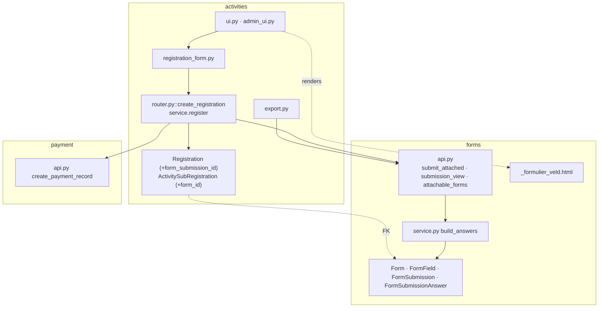
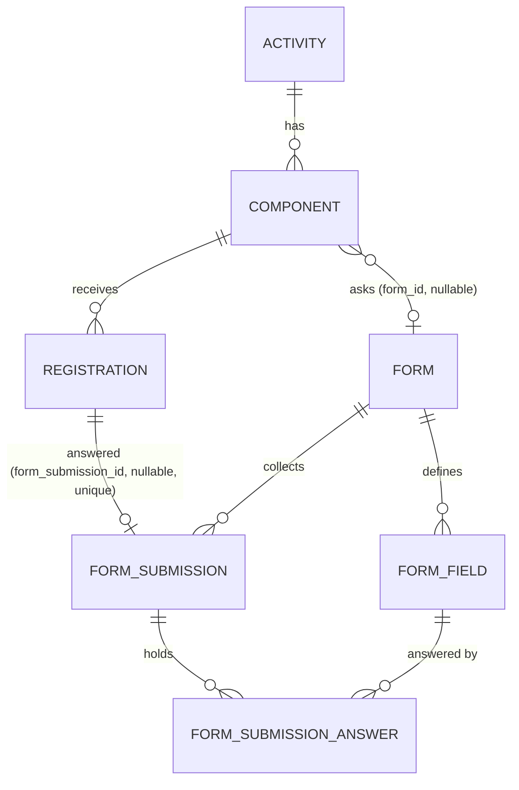

# Change Request 14 — Extra questions on a registration: a form attached to a component

**Project:** Web Portal "Raak Millegem"
**Status:** shaped with Koen on 29 September 2026 · **draft — Part A to be confirmed by Koen** · not assigned
**Applies to:** the activity registration flow (public modal, board form, JSON API), the `forms` domain, the registration detail and export in the admin.

> Part A is written from Koen's spoken brief of 29 September 2026. Where the
> brief left something open, the sentence says *to confirm* and the Q&A log
> carries the question. Part B is measured on `master` `6a96af01` the same day.

---

# Part A — The business

## A1. Reason to act

An activity sometimes needs more from a participant than a name, an e-mail,
a phone number and a choice of products. Who joins which group, which size,
an allergy, a lift needed, a licence number — questions that differ per
activity and per component. The activities module cannot ask them: a
registration collects the contact, the products and a free "remarks" box,
and nothing else. So today those questions are asked next to the
registration — by mail, on the day itself, or through a separate form that
the participant has to find and fill in a second time — and the treasurer
or the organiser matches the answers to the registrations by hand.

The moment is now because an activity is coming up that needs such
questions, and because the portal already has a form builder (the `forms`
module, with ten field types, sections and a submissions view) that asks
exactly this kind of question — only not *as part of* a registration. The
idea, in Koen's words: attach a form to a component of an activity, so that
registering flows into the questions **in one movement**, and the answers
belong to the registration.

The trigger is the **Sint activity** (Koen, 29 September): five questions
that today have no place in the registration — see A4.

## A2. As-is process

| Step | Who | Today | Pain |
|---|---|---|---|
| 1. The organiser sets up the activity and its components in the admin, with products and prices. | organiser | activities module | — |
| 2. A member registers on the site: contact, products, remarks, payment method; pays through Mollie or by transfer. | member | public modal | the modal has no place for the activity's own questions |
| 3. The extra questions are asked *elsewhere*: in the confirmation mail's reply, in a separate form, on the day. | organiser, member | mail, a form, paper | a second action for the member; answers arrive late or not at all |
| 4. The organiser matches answers to registrations. | organiser, treasurer | by hand | error-prone; the registration list and the answers are two lists |
| 5. The export of a component (one row per registration) has no answers. | organiser | .ods export | a third list |

Measured on `master` (29 Sep): a registration carries `remarks` as its only
free field; the component has no setting that points at a form; the form
builder has 25 admin screens and 7 public routes, and a submission cannot
be linked to anything today.

## A3. To-be process

| Step | Who | Afterwards |
|---|---|---|
| 1. The organiser builds the questions as a form in the form builder (as today for any form). | organiser | forms module |
| 2. The organiser attaches that form to the component: "Extra questions: <form>". | organiser | one setting on the component |
| 3. A member registers: contact, products, **the component's questions**, remarks, payment method — one screen, one submit; then Mollie or the transfer instructions, as today. | member | the public registration |
| 4. The board registers a member from the admin: the same questions on the board form. | board | the board registration |
| 5. The answers are on the registration: in the admin detail, in the component's export (one column per question), in the confirmation mail *(to confirm)*. | organiser, treasurer | activities module |
| 6. A required question that is not answered refuses the registration with the same message on every entrance — public, board, API. | — | — |

## A4. Supplied material

The questions of the Sint activity (Koen, 29 September 2026), and what
they teach about the shape:

| Question | Kind | Form builder field type | Note |
|---|---|---|---|
| Which time slots suit you? | several of a list | `checkbox` (multi) | *if a slot has a capacity, it is a product with `max_participants`, not a question — Q8* |
| Inside or outside? | one of two | `radio` | — |
| Tell us about the children | free text | `textarea` | personal data about minors; seen by the organiser only |
| Allergies | free text | `textarea` | health data — asked because the activity needs it; no special handling in the system, the organiser decides to ask |
| Remarks | free text | `textarea` | overlaps the registration's own *Opmerkingen* box — one of the two should go on this screen (Q9) |

Learnt: all five fit the ten field types, in one section, without
branching; none depends on a product; one form serves the activity (one
component). Nothing in the form builder has to change for this case.

## A5. Business requirements

| # | Requirement | MoSCoW | Source | Comment |
|---|---|---|---|---|
| R1 | An organiser can attach one form, built in the form builder, to a component of an activity. | Must | Koen, 29 Sep 2026 | "dat je aan een onderdeel binnen een activiteit koppelt" |
| R2 | A member answers the component's questions **while registering**, in one movement, before the payment step. | Must | Koen, 29 Sep 2026 | "in één beweging doorgaan naar dat formulier" |
| R3 | The answers belong to the registration: they are shown on the registration in the admin and included in the component's export. | Must | Koen, 29 Sep 2026 | "een inschrijving met extra vragen te voorzien" |
| R4 | A required question refuses the registration on every entrance — public modal, board form, JSON API — with the same message. | Must | CR-13 R1 | one entrance rule |
| R5 | The board can answer the questions when registering a member from the admin. | Should | analyst, to confirm | otherwise a board registration has a hole where the answers should be |
| R6 | The confirmation mail repeats the answers. | Could | analyst, to confirm | the member sees what was recorded |
| R7 | An organiser can correct an answer in the admin afterwards. | Could | analyst, to confirm | the form builder already supports editing a submission |
| R8 | A form attached to a component is also fillable on its own public URL. | Won't | analyst | two ways in for one set of answers — the link to the registration would be missing on one of them |
| R9 | Questions that depend on the products chosen ("size per ticket"). | Won't | analyst | a product-level question is a different shape; own change if ever needed |

## A6. Non-functional requirements

| Concern | This change |
|---|---|
| **Reporting** | The component export carries the answers, one column per question. The reporting engine (CR-06) does not — answers are per activity, not a measure. |
| **Security** | Nothing new from outside: the questions arrive through the registration entrances that exist, under the same rate limit, honeypot and CSRF as today. The form's own validation (required, bounds, options) applies. |
| **Privacy** | Answers are personal data on the registration; they are seen by whoever sees the registration (organiser, treasurer, board), never on the public participant list, and they follow the registration's soft delete. An allergy is health data — the organiser decides per activity whether to ask it; the system does not treat it differently *(to confirm with Koen)*. |
| **House style / UI norm** | The questions render with the same field macros as the form builder's public form, inside the registration screen. The narrow modal (fixed UI decision, `max-w-md`) stays for a component without a form; **with a form the registration becomes a full page** *(proposal, see B4.1)*. |
| **Multi-tenant** | A form and a component belong to the same tenant; the picker offers only the tenant's own forms. Nothing platform-wide. |

## A7. Acceptance criteria

| # | Criterion | Requirement |
|---|---|---|
| AC1 | On HDEV, the organiser attaches an open form with three questions (a choice, a number, a text) to a component; the public registration for that component shows the three questions between the products and the remarks; a component without a form shows nothing new. | R1, R2 |
| AC2 | A registration with a required question left empty is refused, with the question named, on the public screen, on the board form and through the JSON API — and the registration is not saved. | R4 |
| AC3 | After a paid registration (stub provider) and a free one, the answers show on the registration detail in the admin and in the component's export, one column per question, in the form's order. | R3 |
| AC4 | The board registers a member for that component from the admin and answers the questions there. | R5 |
| AC5 | Attaching a closed form, a form of another tenant, or a form with more than one section is refused with a message that says why. | R1 |
| AC6 | Once the form has answers on a registration, the form builder refuses to change its fields (as it does today for any form with submissions). | R3 |

---

# Part B — The solution

## B1. Solution outline

The component gets one nullable reference to a form (`form_id`); the
registration gets one nullable reference to a form submission
(`form_submission_id`). The public and board registration screens render
the attached form's fields with the form builder's own field partial, in the
registration form, and post them with the registration. `create_registration`
— the single implementation behind all three entrances — hands the answers
to the `forms` facade inside the same transaction, gets a submission back,
links it, and only then starts the payment. The answers are read back
through `forms.api.submission_view` for the admin detail and the export.
No new domain, no new event, no JSON column.

Decisions that shape it, with the alternatives:

- **The questions are asked in the registration, not after it** (R2). An
  extra step after the registration and before the payment would mean a
  registration saved without answers, a page in between, and a Mollie
  redirect that is no longer the response of the registration submit — three
  seams where a member drops out. A step *after* payment loses the member to
  the Mollie return page. In the registration, one transaction covers the
  registration, the answers and the payment record, and the refusal of a
  required question happens where the member is.
- **A form from the form builder, not new columns on the registration.**
  The builder exists (10 field types, options, validation as columns, a
  submissions view, an export). New columns per activity would be CR-03's
  six form types over again — the thing v2.0 simplified away.
- **The link lives on the activities side** (`component.form_id`,
  `registration.form_submission_id`), not on the form. The placement rule of
  CR-04/CR-13: "this component asks these questions" and "this registration
  gave these answers" are facts about the component and the registration.
  The form stays what it is — reusable, unaware. The submission gets no
  `subject` column: one submission belongs to at most one registration, and
  the registration says which.
- **`forms` writes its own rows.** `activities` never constructs a
  `FormSubmission` (CR-13 *no foreign writes*); it calls a `forms.api`
  command inside the request, exactly as it calls
  `payment.api.create_payment_record` today. That is a door call, not an
  event: the answers are part of the request (CR-13 B4.1, the payment-record
  decision of 29 September).

### B1.1 Functional analysis

| # | Derived requirement | From |
|---|---|---|
| F1 | A component has at most one form; a form may be attached to several components (the same questions for every component of one activity). | R1 |
| F2 | Only an *open* form of the same tenant with **one section** can be attached; sections and branching (#336) do not fit a registration screen — refused at attach time with the reason. | R1, AC5 |
| F3 | The attached form's fields render in the registration, between the products and the remarks, with the builder's field partial; the `info` field type renders as text, `rating` as today. | R2 |
| F4 | The answers are validated by the `forms` rules (`build_answers`: required, min/max, options) before the registration is created; a refusal names the question and re-renders the screen with the answers kept. | R4 |
| F5 | The submission's `submitter_name`/`submitter_email` are the registration's contact; the form's own confirmation mail is **off** for an attached form (the registration mail covers it). | R3, R6 |
| F6 | The JSON API's `RegistrationCreate` accepts `answers: {field_id: value}`; a component with a form refuses a registration without the required answers (same message). | R4 |
| F7 | The board form renders and posts the same fields. | R5 |
| F8 | The admin detail shows the answers as label/value rows; the export adds one column per field after *Opmerkingen*, in field order; a checkbox field joins its options with ", ". | R3 |
| F9 | The attached form's public URL answers "this form is part of a registration" and links to the activity (R8 Won't: no second way in). | R8 |
| F10 | Soft-deleting a registration leaves the submission in place (history); the submissions view of the form shows it as "on registration #N". | R3 |
| F11 | The form builder's existing rule — no field change once submissions exist (#665) — protects attached forms unchanged. | AC6 |

## B2. Architecture

### B2.1 Components

| Component | new / used / changed | Role |
|---|---|---|
| `activities/models.py` — `ActivitySubRegistration.form_id`, `Registration.form_submission_id` | **changed** | the two links |
| `activities/router.py::create_registration` | **changed** | validates and stores the answers through `forms.api` inside the transaction, before the payment record |
| `activities/registration_form.py` | **changed** | parses the answer fields from the posted form (public and board) into `RegistrationCreate.answers` |
| `activities/templates/_inschrijf_velden.html` | **changed** | includes the form's fields when the component has one |
| `activities/admin_ui.py` — component settings | **changed** | the form picker ("Extra vragen"), with F2's refusals |
| `activities/templates/_inschrijving_detail.html`, `export.py` | **changed** | show and export the answers |
| `forms/api.py` | **changed** | new command `submit_attached(db, form, answers, submitter)` — validates with `build_answers`, creates the submission without mail, returns it; new read `attachable_forms(db)` |
| `forms/templates/_formulier_veld.html`, `screenfields.py` | used | the field rendering, unchanged |
| `forms/ui.py` — public form route | **changed** | F9: an attached form's share URL points at the activity |
| `mail` — registration confirmation | **changed** (Could, R6) | repeats the answers |
| JSON API `POST /api/v1/activities/{id}/register` | **changed** | `answers` in the schema |

### B2.2 Application usage

```mermaid
flowchart LR
  subgraph business["A3 — process"]
    S1["1. build the questions"]
    S2["2. attach to the component"]
    S3["3. member registers, answers, pays"]
    S4["4. board registers a member"]
    S5["5. organiser reads the answers"]
  end
  subgraph app["application"]
    FB["form builder<br/>/admin/formulieren"]
    CS["component settings<br/>/admin/activiteiten/…/onderdelen"]
    PR["public registration<br/>/activiteiten/{id}/inschrijven/{cid}"]
    BR["board registration<br/>/admin/activiteiten/{id}/inschrijvingen/nieuw"]
    CR["create_registration → forms.api.submit_attached → payment.api.create_payment_record"]
    AD["registration detail + export"]
  end
  S1 --> FB
  S2 --> CS
  S3 --> PR --> CR
  S4 --> BR --> CR
  S5 --> AD
```

### B2.3 Application structure

`activities` reaches `forms` only through `forms.api` (import gate); the
template include of `_formulier_veld.html` is a *read* of a template, which
the layer gate allows as it allows the macros.

### B2.4 Impact on the existing architecture

- **Cross-schema FKs** `activities.activity_sub_registrations.form_id →
  form.forms.id` and `activities.registrations.form_submission_id →
  form.form_submissions.id`, both nullable — the pattern
  `registrations.person_id → mdm.persons` already uses. `ON DELETE`:
  `SET NULL` for `form_id` (a deleted form detaches; the component keeps
  working); `RESTRICT` for `form_submission_id` (an answered submission is
  not deleted under a registration — #94 phase 4 decides per FK, this one is
  decided here).
- **CR-13 rules respected:** no foreign write (forms creates its rows);
  the door service commits once (the answers, the registration and the
  payment record in one transaction, `create_registration`'s existing
  commit); no rule in a router (the "required answers" rule is `forms`'
  `build_answers`; the "a component with a form needs a submission" rule is
  `Registration.check()` — cross-object, on flush); no new JSON route
  (the existing `POST /register` grows a field).
- **CR-12:** no new code list. The field types are `forms`' list.
- **Templates:** `StrictUndefined` — the registration view-model promises
  `form_fields` (possibly empty) on every render.

## B3. Cost and operations

None new: no service, no env var, no job. One migration (two nullable
columns with FKs; additive under #1255). Kill switch: detaching the form
from the component restores today's screen — no flag needed.

## B4. Detailed decisions

### B4.1 Where the questions render — modal or page

Fixed UI decision: the public registration is a narrow modal (`max-w-md`).
Three questions fit; a form of twelve does not, and 80 % of visitors are on
a phone. **Proposal:** the modal stays the rule; when the component has a
form, the registration opens as a **full page** at the same URL (the modal
route renders a page layout instead of the modal partial), with the same
fields in the same order. The alternative — always a page — changes every
activity's registration for the few with a form. The alternative — always
the modal, scrolling — hides a long form in a small box on a phone.
*Open for Koen (Q3).*

### B4.2 One transaction, in this order

Inside `create_registration`, between `service.register` (flush) and the
payment record:

1. `forms.api.submit_attached(db, form, answers, submitter=(contact_name,
   contact_email))` — `build_answers` refuses a missing required answer or
   an out-of-range value with `FormError` (alias of the forms exception,
   CR-13 B4.4), which the screen shows next to the question; on success the
   submission is flushed, not committed.
2. `registration.form_submission_id = submission.id`; `Registration.check()`
   on flush confirms: component with a form ⇒ submission present.
3. `payment.api.create_payment_record` — as today; a Mollie failure rolls
   back the registration **and the submission** (one transaction; today's
   502 path).
4. `db.commit()`, mail.

The answers are validated *before* the registration's own "full" and
"already registered" checks? No — after `service.register` has passed them,
so a member is not asked to fix an answer on a component that is full. Order
of refusals on one submit: contact → products → component rules → answers.

### B4.3 Rendering and posting the fields

Field names in the registration post: `q_<field_id>` (the form builder's
own public form posts `field_<id>`; the prefix differs on purpose so a
registration field and a question can never collide — `phone` is a field
type *and* a registration column). `registration_form.py` collects every
`q_*` into `RegistrationCreate.answers: dict[int, str | list[str]]`
(checkbox = list). The board form posts the same names. The JSON API takes
`answers` as `{"<field_id>": value}`; unknown ids are refused (a question
that is not on this form).

### B4.4 Reading the answers

`forms.api.submission_view(db, submission_id)` exists (label/value rows for
the workflow task detail) and is reused for the admin detail. The export
asks `forms.api.form_definition` for the field order and `submission_view`
per registration; one column per field, header = field label. A component
whose form changed after the first answers cannot happen (F11).

### B4.5 Attaching and detaching

The component settings get a select "Extra vragen" over
`forms.api.attachable_forms(db)`: open, same tenant, one section, not
anonymous. Detaching is allowed at any time; existing registrations keep
their submissions. Re-attaching a *different* form to a component that has
registrations with answers is allowed (the old answers stay on the old
submissions) — *to confirm (Q5)*; the alternative is to refuse it once
answers exist.

### B4.6 What the form builder shows

The form's submissions view (`/admin/formulieren/{id}/inzendingen`) lists
the attached submissions like any other, with one extra cell "inschrijving
#N" linking to the registration. The form's results view (counts per
option) works unchanged — that is a free win: "how many chose vegetarian".

## B5. Data model

### B5.1 Entity-relationship diagram

### B5.2 Tables

| Table | Change | Validation |
|---|---|---|
| `activities.activity_sub_registrations` | `form_id INTEGER NULL REFERENCES form.forms(id) ON DELETE SET NULL` | attach rule in the service (open, tenant, one section); nothing at rest beyond the FK |
| `activities.registrations` | `form_submission_id INTEGER NULL REFERENCES form.form_submissions(id) ON DELETE RESTRICT`, `UNIQUE` (partial, `WHERE deleted_at IS NULL`, the B4.2 pattern of CR-13) | `Registration.check()`: component with `form_id` ⇒ `form_submission_id` set |
| `form.*` | unchanged | the forms rules as today |

Migration: one, `alembic revision -m "component form and registration submission"`,
additive (`ADDITIVE = True`); no data step. Check the CHECK constraints on
both tables before writing it (the `CLAUDE.md` lesson): none on these columns.

## B6. Privacy and security — the mechanics

Answers are stored in `form.form_submission_answers`, seen through the
admin only (`require_admin_ui` on the detail and export), never rendered on
the public participant list or in the "Wie doet er mee?" line. They ride
the registration's audit history? No — the submission has no history table
today, and an answer edited by the organiser (R7, Could) would need one;
that is why R7 is Could. Nothing leaves the system except in the
confirmation mail (R6, Could) to the registrant's own address. The export
already carries personal data and stays behind the same login.

## B7. Phasing

One phase; it is one feature. Ships after CR-13 phase 1 is on `master`
(the `Registration` aggregate with `check()`, `Money`, the one
`create_registration`), so the "component with a form needs a submission"
rule has its home from day one.

| Phase | Delivers | Depends on | Migration | Env vars | Failure paths that change (R13-style) | Manual validation |
|---|---|---|---|---|---|---|
| 1 | the two links, the picker, the fields in both registration screens and the API, the admin detail and export, F9 | CR-13 phase 1 on `master` | one, additive | none | a registration refused on a question is not saved (new refusal); a Mollie failure now also rolls back the submission | AC1–AC6 on HDEV |
| 1b (Could) | R6 mail, R7 edit in the admin | 1 | none | none | none | a confirmation mail with answers |

## B8. Tests

Each able to go red:

1. **Three entrances, one refusal.** Public modal, board form and JSON API
   each post a registration for a component with a required question left
   empty → refused with the question's label in the message; the
   registrations table is unchanged (count before = after).
2. **One transaction.** Stub provider set to fail → after the 502 there is
   no registration *and no submission* for that component.
3. **The link is right.** After a registration, `registration.form_submission`
   is the submission whose `form_id` is the component's form, and its
   submitter matches the contact.
4. **Attach rules by violation.** Attaching a closed form, another tenant's
   form, a two-section form → each refused with its own message; an open
   one-section form → attached.
5. **Export columns.** A form with three fields → the export sheet has three
   extra columns after *Opmerkingen*, headers = labels, in field order; a
   checkbox answer joined with ", ".
6. **Detached object.** `Registration.check()` on an in-memory registration
   with `component.form_id` set and no submission → refused; with a
   submission → passes; no session (CR-13 test 5).
7. **No new way in.** The attached form's share URL → the activity page, no
   submission created (F9).
8. **Screen at 390 px** (CR-13's merge-gate eye): the questions render in
   order, each label once, nothing clipped — measured from the DOM.

## B9. Rule and gatekeeper

1. **The rule.** *Anything the portal asks a member beyond the fixed fields
   of a registration is a form of the form builder, linked from the
   registration — never a new column on the registration, never a JSON
   column.* Home: `docs/code-style.md` (one line under "where a rule
   belongs") and this CR.
2. **Reach and baseline.** `activities.registrations` and its schema
   objects. Baseline today: 0 ad-hoc question columns (`remarks` and
   `team_name` are fixed fields of every registration, not questions) and 0
   JSON columns on the table.
3. **The gate.** Hard, small: a pytest in `backend/tests/` asserts that
   `Registration.__table__` has no JSON column and that its column set equals
   a frozen list in the test — adding a column means editing the list in the
   same commit, which is the review moment the rule needs. Proven by
   violation: add `t_shirt_size = Column(String)` → red with "a question is
   a form field (CR-14 B9)". The cross-domain mechanics are already gated by
   CR-13 (*no foreign writes*, *one transaction*, the import gate).

## B10. Prototype findings

None yet. To measure before build: how `_formulier_veld.html` renders inside
`_inschrijf_velden.html` at 390 px for each of the ten field types (one
screenshot per type), and whether `build_answers` can run on a flushed but
uncommitted form submission (it reads the form definition, so it should).

## B11. Decisions log

| Date | Decision | By |
|---|---|---|
| 29 Sep 2026 | A registration can carry extra questions; they are a form attached to a component and answered in one movement while registering. | Koen (spoken brief; Part A to confirm) |

## Q&A log

| # | Date | Question (who) | Answer |
|---|---|---|---|
| Q1 | 29 Sep 2026 | Which activity triggers this, and what are its questions? (Claude) | Koen, 29 Sep: the Sint activity — a multi-select of time slots, inside/outside, a story about the children, allergies, remarks. A1, A4. |
| Q8 | 29 Sep 2026 | Do the Sint time slots have a capacity (so many visits per slot)? (Claude) | *open* — if yes, a slot is a product with `max_participants` (exists today, counts and shows "Volzet"), and the form asks the rest; a checkbox question cannot count |
| Q9 | 29 Sep 2026 | The form's "remarks" and the registration's own *Opmerkingen* box: keep both on one screen? (Claude) | *open* — proposal: a component with a form hides the registration's box; the form's remarks are the one place |
| Q2 | 29 Sep 2026 | Are the questions asked in the registration screen (before payment), or on a page after it? (Claude) | *proposed:* in the registration, one submit — B1; *open* |
| Q10 | 29 Sep 2026 | "Why not define and store them with the existing form engine?" (Koen) | That is the proposal, exactly: defined in the form builder, stored in `form.form_submissions` / `form_submission_answers`, validated by `build_answers`, read back by `submission_view`. What is *new* is only the two links (component → form, registration → submission) and the rendering of the form's fields inside the registration screen, so the answers ride the registration's transaction and its payment. B1. |
| Q3 | 29 Sep 2026 | A component with a form: still the narrow modal, or a full page? (Claude) | *proposed:* full page for a component with a form, modal otherwise — B4.1; *open* |
| Q4 | 29 Sep 2026 | Must the board answer the questions on the board form (R5 Should)? (Claude) | *open* |
| Q5 | 29 Sep 2026 | May a component swap its form once registrations have answers? (Claude) | *proposed:* yes, old answers stay on their submissions — B4.5; *open* |
| Q6 | 29 Sep 2026 | Repeat the answers in the confirmation mail (R6)? Let the organiser correct an answer (R7)? (Claude) | *open* — both Could |
| Q7 | 29 Sep 2026 | Does the attached form's own public URL stay usable (R8 Won't as proposed)? (Claude) | *proposed:* no — it points at the activity; *open* |

## Non-goals

- Questions per product or per ticket (R9) — a different shape.
- Sections and branching inside a registration (#336) — a one-section form only; a longer questionnaire stays a standalone form.
- Answers in the reporting engine (CR-06) — the export covers it.
- A new field type (date, file upload) — the form builder's list is what it is; a new type is a forms change.
- Editing answers by the member after registering — the form builder's edit link exists for standalone forms; not wired to a registration here.

## Relationship to existing work

- **CR-03 (form types):** the six registration form types this idea replaces in spirit — v2.0 removed them; this CR is the attachable form instead of fixed types.
- **CR-13:** the placement rule, *no foreign writes*, the one transaction in `create_registration`, `Registration.check()` — this CR builds on phase 1.
- **CR-12:** no new code list.
- **#1192 / #1284:** the one `create_registration` and the board form that this CR extends.
- **#336, #337, #665:** sections, "Andere…", and the no-change-after-submissions rule in the form builder.
- **#94 phase 4:** `ON DELETE` per FK — the two FKs here are decided in B2.4.
