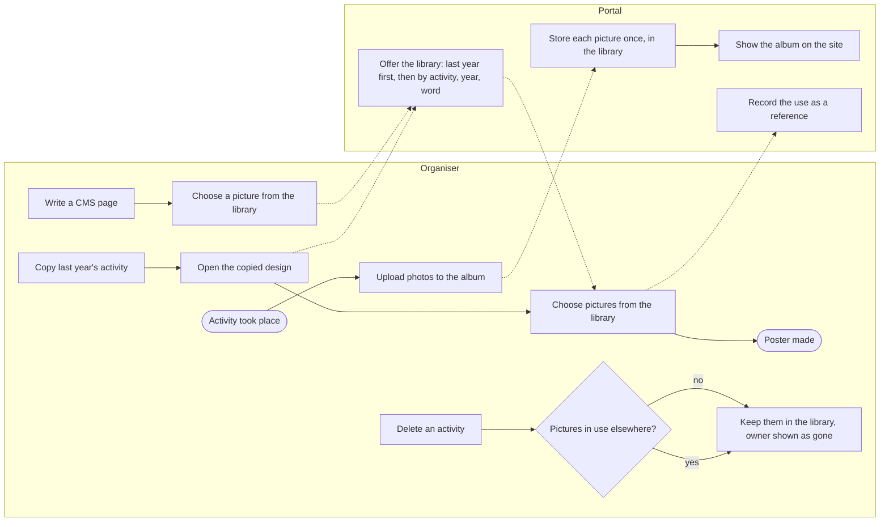
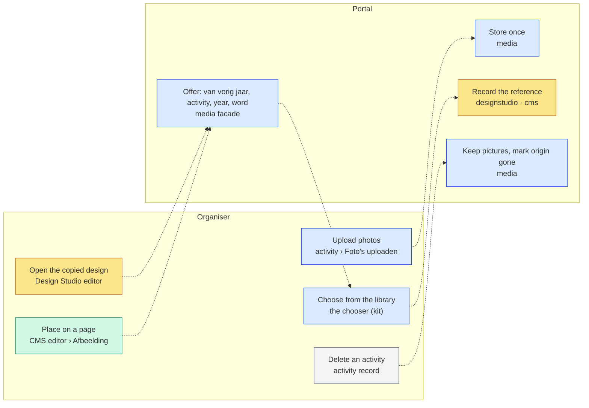
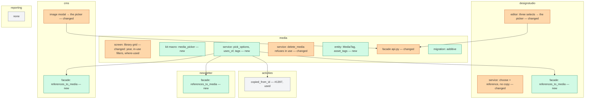
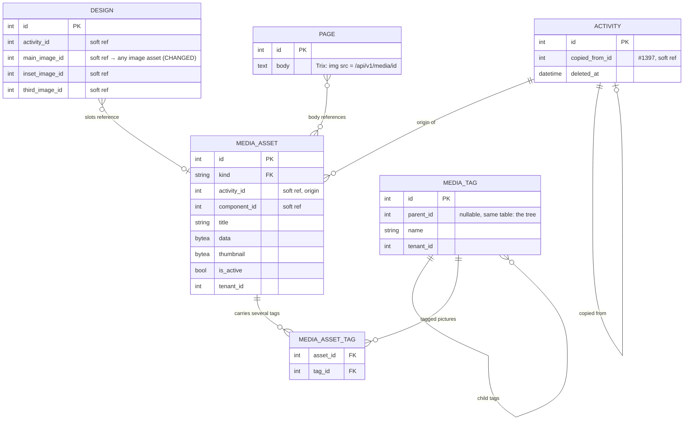

# Change Request 15 — Media library: one picture, stored once, usable everywhere

**Project:** Web Portal "Raak Millegem"
**Status:** shaped on 1 October 2026 · walked through with Koen on 2 October 2026, every question answered · on hold until Koen plans it on a release
**Tracking issue:** #1410 — the one place where what is open stands; this document is the design, the issue is the status
**Applies to:** the media domain and its admin screen; the picture choosers of Design Studio and the CMS; the public photo albums; one new field on the activity, already under way (#1397).
**Reading:** A 2392 words · B 2964 · C 2533 — words to read, drawings excluded, measured on 2 October 2026; the budget is A ≤ 1 500, B ≤ 2 500

---

# Part A — The business

## A1. Reason to act — the trigger

Many activities return every year. The poster of next year is best made with the photos of this year: the real children at the real Sint, the real Kerstherberg. Those photos exist — the board uploads them into the album of the activity after it took place, and the site shows them. Yet when the board copies last year's activity (#1397) and opens its design, the picture choice is empty: the design only sees pictures of the *new* activity, which has none. The board then searches its own computers for last year's photos and uploads them again, or gives up and uses a stock picture.

Koen's words, 1 October 2026: in the future all photos of activities go into media, into the albums. Those albums are the best material for the poster of the year after. In Design Studio he wants to choose from all those photos, also from activities that were not created by copying. Pictures must be reusable.

What stops it today: a picture belongs to one activity and to one use; nothing can find it from anywhere else, and the three screens that place pictures (Design Studio, the CMS pages, the newsletter) each look at their own slice or at nothing. Uploading the same picture twice is the workaround, and it is the kind of work that makes a volunteer stop.

## A2. As-is process — how it works today, and where it hurts

Two actors: the organiser (a board member) and the portal. Measured on HDEV on 1 October 2026 (`media.media_assets`, per kind): 17 activity photos, 27 design images, 13 posters, 24 design renders — every one tied to one activity; the rest (component info, sponsors, page images, logos, newsletter files) small and tied to none.

| # | Step | Who | Today | Pain |
|---|---|---|---|---|
| 1 | Upload the photos after the activity | organiser | "Foto's uploaden" on the activity; up to 20 per batch; they become the album | none — this works |
| 2 | The site shows the album | portal | `/fotos` per year, for archived activities with a cover | none |
| 3 | Copy the activity for next year | organiser | #1397, since v2.11.0: texts, dates, organisers and the design come along; the design keeps the *references* to the same pictures | none |
| 4 | Open the copied design, choose pictures | organiser | the choice shows the photos and design images of the design's own activity — the copy, which has none | **empty list**, although the pictures exist one activity away |
| 5 | Find last year's photos elsewhere | organiser | own computer, a phone, the site's album saved again | ten to thirty minutes per poster, and the picture is not the original |
| 6 | Upload again as a design image | organiser | "Foto toevoegen" in the editor | **a second copy**: 27 design images today, and the Design Studio already copies a chosen activity photo into a design image (CR-10 §3.11) — one picture, two or three rows |
| 7 | Place a picture on a CMS page | organiser | a chooser, but only over page images | a photo of the Sint cannot go on the "Sinterklaas" page without a third upload |
| 8 | Put a picture in the newsletter | organiser | not possible; the activity block takes the poster or the album cover by itself | no choice at all |
| 9 | Delete an activity or a design | organiser | the activity is soft-deleted; the design is deleted | **the pictures stay behind** without an owner (design renders and images orphaned; photos keep showing) |

Three facts the measurement adds. There is no album: an album is the set of photos that share an activity. There is no consent record: whether a photo of a recognisable child may go on a poster is decided by nobody and recorded nowhere (CR-10 §B: "the portal records no consent of its own", Koen, 17 September 2026). And the bytes live in the database, in every backup: a library that stores each picture once also keeps the backups small.

## A3. To-be process — how it should work afterwards

Same lanes, same order. The change is in steps 4 to 8: one library, one chooser, one picture stored once and *referenced* wherever it is used.

What changes, one line each:

- Step 4 becomes *choose from the library*: the chooser opens on "van vorig jaar" (the predecessors of this activity), then the whole library by activity, year and word.
- Steps 5 and 6 disappear: nothing is searched outside the portal and nothing is uploaded twice; choosing is a reference, the picture stays where it is.
- Step 7 uses the same chooser; a page image is a picture like any other.
- Step 9 gains a question: a picture in use elsewhere is kept, with its origin shown as gone; deleting a picture that is in use is refused until the uses are changed.

## A4. Benefits — what the change earns

- **Volunteer time:** ten to thirty minutes per poster no longer spent finding and re-uploading last year's photos; with roughly fifteen recurring activities a year, five to seven hours a year — and the poster gets made with the right pictures instead of a stock one.
- **No duplicates:** 27 design images today for 17 activity photos; each picture stored once keeps the database and every backup smaller (a design image is stored at 4096 px today, three to five times the bytes of an album photo; after this change every upload is one 2 400 px picture, stored once).
- **Nothing lost on delete:** pictures survive the activity and the design they were uploaded for, so next year's poster can still find them.
- **A decision that is recorded:** whether a picture may be used publicly is answered once, at upload, instead of silently every time — the first step towards the consent model the architecture names as roadmap.
- **Possible at all:** a photo of the Sint on the "Sinterklaas" CMS page without a third upload.

## A5. Supplied material — and what it taught us

- Koen's wish as relayed by the master CLI on 1 October 2026, with the measurement of media rows per kind on HDEV (the table in A2).
- Issue #1397 (copy an activity) and its five follow-ups of 30 September and 1 October 2026: the empty picture choice on the copied design, and the small step already under way — `copied_from_id` on the activity, so the choice also shows the predecessors' pictures. That step is the seed of this change, not a competitor: it defines "van vorig jaar", which stays the default filter of the chooser.
- CR-10 (Design Studio), §3.11: three sources for a design's picture (upload, activity photo, AI), one media kind — and the chosen activity photo is *copied* into a design image. That copy is what this change removes.
- CR-08 (visual) §A: consent for recognisable people, often children, named as the structural concern that deferred the imagery round. CR-10: "the portal records no consent of its own" (Koen, 17 September 2026). `docs/architecture.md`: the consent model and the object-storage adapter are roadmap (R6, R8).
- Reporting need: none asked. Counting pictures per activity or per year is a Won't (A6), unless Koen says otherwise when walking through.

## A6. Business requirements — what the board asks, with MoSCoW

| # | Requirement | MoSCoW | Source | Comment |
|---|---|---|---|---|
| R1 | A picture is uploaded once and can be used on any poster, page or newsletter afterwards, without uploading it again. | Must | Koen, 1 Oct 2026 | "afbeeldingen moeten herbruikbaar zijn" |
| R2 | When making the poster of a copied activity, the pictures of last year's activity are offered first, without the organiser searching for them. | Must | Koen, 1 Oct 2026 (#1397) | the chain of copies; the step already under way |
| R3 | From the poster editor the organiser can find any picture in the library: by activity, by year, and by a word in its title. | Must | Koen, 1 Oct 2026 | keywords beyond the title: Could (R9) |
| R4 | The photos of an activity stay its album on the site, also when the same photos are used elsewhere. | Must | derived from Koen's words; *to confirm* | the album is the origin; a use is a reference |
| R5 | A picture that is used somewhere cannot be deleted by accident: the portal says where it is used and refuses until those uses are changed. | Should | author, *proposed* | same shape as CR-14's refusal of a form in use |
| R6 | Deleting an activity or a design does not delete the pictures uploaded for it; they stay in the library with their origin marked. | Should | author, *proposed* | today they become orphans |
| R7 | A clearance per picture (public or back-office only). | Won't | Koen, 2 Oct 2026: "als het in het systeem zit, is het vrijgegeven" | what is uploaded is released; the consent register stays the architecture's roadmap, untouched by this change |
| R8 | Uploading a picture works on a phone; the chooser and the library do not break there. | Should | Koen, 2 Oct 2026 | beyond an upload, the picture admin is never used on a phone: no design effort for it |
| R9 | A picture can carry several **tags**, searched by tag and shown as a tree — the way the board orders the library's own material (page pictures, logos, sponsors, loose uploads); a picture with two tags appears under both, by design. | Must | Koen, 2 Oct 2026 (first "eventueel trefwoorden" on 1 Oct, then folders, then tags the same day) | replaces the folders of R13 |
| R10 | The newsletter can place a picture from the library in its text. | Won't | Koen, 2 Oct 2026 | today a letter shows a picture only through the activity block (the poster or the album cover) and that keeps working; a free picture in a letter is out of scope |
| R11 | Counting or listing pictures (per activity, per year, usage) in the reporting module. | Won't | author | nothing asked; the library screen shows the counts it needs itself |
| R12 | A separate "album" the board composes by hand, across activities. | Won't | author | the album *is* the activity's photos; a hand-made selection is a design or a page, not a second album concept — the board's need for order is R13's folders |
| R13 | The library's own material is kept in folders and subfolders. | Won't | Koen, 2 Oct 2026, reversed the same day in favour of tags (R9) | a picture belongs in several places; a folder allows one. The activity's photos keep the activity as their place, shown as a branch of the same tree |
| R14 | The Design Studio and the CMS pages can use **every** picture in the library — activity photos, page pictures, sponsor logos, the association's logo. | Must | Koen, 2 Oct 2026 | sharpens R1 and settles Q2 |

MoSCoW: **Must** (without it the change is worthless), **Should** (important,
but the change ships without it), **Could** (nice, if cheap), **Won't** (asked
and deliberately not done — recorded so it is not asked again).

## A7. Non-functional requirements — security, privacy, house style, tenants

| Concern | This change |
|---|---|
| **Security** | No new entrance from outside: uploads stay where they are, with their size and type checks; the chooser is a back-office screen behind the admin session. One existing weakness becomes visible and is closed: a picture is reachable by its numeric id regardless of whether it is active or cleared — a picture cleared for the back office only must not be served publicly (C5). |
| **Privacy** | Photos of members and their children are personal data. The board's rule (Koen, 2 Oct 2026): what is uploaded into the library is released for the site, the posters and the pages — the decision is the upload. This change adds no clearance and asks nothing of the person on the photo; the consent register of the architecture's roadmap is untouched. Nothing leaves the system that does not leave it today. |
| **House style / UI norm** | The library stays the one admin screen that is a grid of cards (CR-11 row 5: the picture is the thing being chosen). The chooser is a kit component rendered live on the design-system page, used by every screen that places a picture (CR-11 R13: one place, one form). |
| **Multi-tenant** | Pictures are tenant-scoped today and stay so; the library is per tenant. No tenant setting. |

## A8. Acceptance criteria — what the business signs off on HDEV

| # | Criterion | Requirement | Walkthrough steps |
|---|---|---|---|
| AC1 | On a copied activity, the design's picture choice opens on the predecessor's photos and design images, already selected where the copy kept them; the number of media rows does not change by copying or choosing. | R2, R1 | 1–4 |
| AC2 | From the editor of any design, the chooser finds a photo of any other activity by activity name, by year and by a word of its title, and places it by reference. | R3, R1 | 5–7 |
| AC3 | After a photo of activity A is used on the poster of activity B, the album of A on the site is unchanged, and the library shows the photo once with two uses. | R4 | 8–9 |
| AC4 | Deleting a photo that is in use is refused with the list of its uses; deleting the design or the activity it was uploaded for leaves it in the library with its origin marked as gone. | R5, R6 | 10–12 |
| AC5 | *(withdrawn: R7 is a Won't)* | — | — |
| AC6 | On a phone, uploading a picture works; the chooser and the library open without breaking (no horizontal scroll). | R8 | 16 |
| AC7 | A CMS page places a photo from the library through the same chooser as the design editor. | R1 | 17 |

---

---

# Part B — The solution, for whoever approves it

## B1. Solution outline — the solution and the decisions that shape it

The media domain already is a library: one table, one row per picture, one kind code, a tenant, an origin (`activity_id`). What is missing is three things, and the solution adds exactly those. **One: reuse is a reference, never a copy.** A design slot, a CMS page and later the newsletter point at the media row; the Design Studio stops copying a chosen photo into a design image. **Two: one chooser.** A kit component — search, the filters *activity · year · van vorig jaar*, a thumbnail grid, a bottom sheet on a phone — used by every screen that places a picture, fed by one facade function that knows the current record and opens on its predecessors. **Three: the library knows its uses and its order.** A derived "where used" (read from the designs, pages and letters that reference a picture — not stored twice), the refusal of a delete while uses exist, pictures that outlive their activity and design, and one tree of folders — the board's for its own material, the activities as derived folders for their photos.

Decisions that shape it, each with the rejected alternative (the reasoning in C4):

- **Reuse is a reference, never a copy** (C4.1). Rejected alternative: keep copying a chosen photo into a `design_image`. A copy costs bytes and backups, orphans when the design goes, and drifts from its original.
- **Tags, shown as a tree; the activity as a derived branch for its photos** (C4.2). A picture carries several tags and appears under each; search is by tag, title and activity. Rejected alternative: folders (a picture can be in one folder only — Koen reversed this the same day) and a hand-composed album entity (an activity's photos already are one). A tag vocabulary with a parent is a small table; the activity branch costs nothing.
- **One chooser from the kit** (C4.3). Rejected alternative: improve the three `<select>`s of the design editor. A select of two hundred photos cannot be chosen from on a phone; one component means one behaviour everywhere (CR-11 R13).
- **"Where used" is derived, not stored** (C4.4). Rejected alternative: a `media_uses` table every consumer writes. Two places for one fact drift; a read across three facades costs nothing at this scale.
- **No clearance** (C4.5). Koen, 2 October: what is in the system is released; the consent register stays the architecture's roadmap. Rejected alternative: the author's clearance field as a first step.
- **Bytes stay in Postgres** (C4.6). Rejected alternative: the object-storage adapter (architecture R8). This change adds references, not bytes; the seam stays clean so R8 is a drop-in. Europe First applies when R8 comes.
- **Pictures outlive their activity and design** (C4.7). Rejected alternative: cascade on delete. Today they become orphans; next year's poster needs them.

### B1.1 Functional analysis — the derived requirements

| # | Derived requirement | From |
|---|---|---|
| F1 | A design's three picture slots reference any active image asset the chooser offers; `add_design_image` keeps storing an *upload* or an AI result as `design_image`, but choosing an existing photo stores nothing. | R1, R2 |
| F2 | One facade function `media.api.pick_options(db, *, for_activity_id, q, activity_id, year, scope)` returns the library in pages, grouped "van vorig jaar" first (the predecessor chain of #1397's `copied_from_id`), then the rest as one tree (the activities by year, the tag tree); one search box on title, activity name and tag; a year filter. | R2, R3, R9 |
| F3 | The chooser is a kit macro (`ui.media_picker`) with htmx paging and an Alpine-less sheet on a phone; the design editor and the CMS image modal render it; the design-system page shows it live; on a phone it does not break (R8). | R1, R8 |
| F4 | "Where used" is derived: one facade function `media.api.uses_of(db, asset_id)` asks the designstudio, cms and newsletter facades for their references (each exposes `references_to_media(ids)`); nothing is stored twice. | R5 |
| F5 | `delete_media` refuses while `uses_of` is not empty, naming the uses; the library card shows the count and the list. | R5 |
| F6 | Deleting a design or an activity leaves the media rows; the library shows "van een verwijderde activiteit/ontwerp" from the soft-deleted activity or the missing design. The `_prune_versions` deletion of renders stays (a render is a product, not a picture). | R6 |
| F7 | *(withdrawn with R7)* No clearance column; the public URL stays reachable by id for every asset, as today. | R7 Won't |
| F8 | A tag vocabulary with a parent (`media.tags`: id, parent_id, name, tenant) the board maintains, and a many-to-many `media.asset_tags (asset_id, tag_id)`; the tree view in the library and the picker shows the activities branch and the tag tree; a picture appears under every tag it carries; searched by the same `q`. Phase 1. | R9 |
| F9 | The library screen gains the filters year and "in use", and the "where used" list per card; it stays a card grid. | R3, R5 |

## B2. Fit with the process and the requirements — for the business

The to-be process of A3 with, per step, the screen that serves it:

Legend: blue media · yellow Design Studio · green CMS · grey activities (used, not changed beyond #1397's field).

**Traceability matrix**

| R | How the solution meets it (as the organiser sees it) | F | Module | Test (C6) | AC |
|---|---|---|---|---|---|
| R1 upload once, use anywhere | choosing places a reference; the row count never grows by choosing | F1, F3 | designstudio, cms, media | 1, 2 | AC1, AC2, AC7 |
| R2 last year's first | the chooser opens on the predecessor chain | F2 | media (reads activities' `copied_from_id`) | 3 | AC1 |
| R3 find any picture | search and the two filters over the whole library | F2, F9 | media | 4 | AC2 |
| R4 the album stays | the origin is the activity; a use does not move the picture | F1, F4 | media | 5 | AC3 |
| R5 no accidental delete | refusal with the list of uses | F4, F5 | media + the three facades | 6 | AC4 |
| R6 pictures outlive their owner | no cascade; origin shown as gone | F6 | media, designstudio, activities | 7 | AC4 |
| R7 clearance | Won't | — | — | — | — |
| R8 on a phone | upload works; the chooser and the library do not break | F3 | kit | 10 | AC6 |
| R9 tags as the order | the tag vocabulary with a parent, the many-to-many, the tree in library and picker | F8 | media | 9, 11 | AC3 (the picker shows the tree) |
| R10 newsletter picture | Won't; the activity block keeps working as today | — | — | — | — |
| R11 reporting | Won't | — | reporting: none | — | — |
| R12 hand-made album | Won't | — | — | — | — |

**Walkthrough on HDEV** (the organiser; the treasurer plays no part)

1. Open an activity that has photos and a design (seed: "Sinterklaas huisbezoeken 2025" with four photos). Copy it to next year (#1397). *See:* the copy opens, its design is listed.
2. Open the copied design. *See:* the three picture slots show the same pictures as the source.
3. Open the chooser of the main slot. *See:* the first group is "Van Sinterklaas huisbezoeken 2025" with the four photos and the design images, the current one marked.
4. Choose another photo of 2025. *See:* the slot shows it; `/admin/media` still counts the same number of rows.
5. In the chooser, clear the group and type "kerst". *See:* the photos whose title or activity contains it, grouped per activity with the year.
6. Filter on year 2024. *See:* only 2024's activities.
7. Choose one. *See:* placed by reference; the library card of that photo now says "gebruikt in 1 ontwerp".
8. Open `/fotos` on the site. *See:* the album of the source activity is unchanged.
9. Open `/admin/media`, filter "in gebruik". *See:* the photo once, with two uses listed.
10. Try to delete that photo. *See:* refused, with the two uses as links.
11. Delete the copied design. *See:* the photo is still in the library; its uses drop to one.
12. Delete (soft) a test activity that has photos. *See:* its photos stay in the library, origin "verwijderde activiteit"; they no longer appear on `/fotos`.
13. *(withdrawn: no clearance)*
14. Open the poster chooser. *See:* that photo is not offered; the library screen shows it with the mark.
15. Open its URL in a private window. *See:* 404.
16. Repeat 3–4 on a phone or at 390 px. *See:* a sheet from the bottom, search on top, two filter chips, a three-column grid; three taps to choose.
17. Open a CMS page, "Afbeelding". *See:* the same chooser; a Sint photo can be placed.

## B3. The whole across the modules — for the architect

Legend: green new · orange changed · grey used.

**Data model at a glance**

Who calls whom: the design editor and the CMS modal call `media.api.pick_options` and render `ui.media_picker`; the media service calls `activities.api.predecessors_of` (from #1397) for the first group, and `designstudio.api.references_to_media`, `cms.api.references_to_media`, `newsletter.api.references_to_media` for "where used". The new dependencies run media → activities (already exists for `list_activity_photos`), and media → designstudio/cms/newsletter *for a read-only question* — that is the one direction to watch: the import gate allows a facade call, and it is a query, not a command; the alternative (each consumer registering its uses in media) stores the fact twice and was rejected (C4.4). Transaction boundary: choosing is the consumer's transaction (the design or page saves its reference); the refusal of a delete is one read then one refused write; tagging an asset is one row per tag.

Impact on the existing architecture: `media.media_assets` stays as it is; the schema gains a `tags` table and the `asset_tags` link; the designstudio stops writing a `design_image` row for a chosen photo (its `design_image` kind stays for uploads and AI); three facades gain one function each; no table is dropped, no contract to an outside caller changes (the JSON routes keep their shape). The layer rules hold: screens through facades, services through facades, nothing reaches into another domain's models.

## B4. Rules this change needs an exception from — decided once, here

| Rule (where) | What the design does instead | Mechanism | Temporary until … / the new rule | Decided |
|---|---|---|---|---|
| None. Checked: the import gate (`test_import_boundaries`: media's "where used" is a *read* through three facades — allowed), `COMMAND_CALLS` (reads only, no new command across domains), `test_schema_boundaries` (no key across schemas: the slots and `activity_id` are soft references, as they are today; `asset_tags` keys inside the `media` schema), the Europe First rule (no new tool). | — | — | — | — |

## B5. Cost — investment and running cost, and what operations must know

**Investment** (CLI-days; S/M/L where the team has no track record):

| Module | Ph 1 library | Ph 2 picker + reference | — | Total |
|---|---|---|---|---|
| media | 3 (incl. the tag tree) | 2 (the picker, the facade) | — | 5 |
| designstudio | — | 1.5 | — | 1.5 |
| cms | — | 0.5 | — | 0.5 |
| newsletter | — | 0.25 (facade for "where used") | — | 0.25 |
| tests | 0.75 | 1 | — | 1.75 |
| **Total** | **3.75** | **5.25** | — | **~9** |

Plus analysis (this document, ~1), review and HDEV validation per phase (~0.5 each), no purchases.

**Running cost:** none added; fewer bytes stored and backed up (each picture once). No paid service.

**Operations:** no env var, no kill switch; a migration per phase 3 and 4 (additive); backups unchanged in shape. The one behaviour change to know: an `internal` picture's URL answers 404 publicly — a picture that disappears from the site after phase 3 was marked internal, not lost.

## B6. Phasing — shippable phases, and what changes on the failure paths

| Phase | Delivers | Issue | Migration | Env | Data | Failure paths that change | Manual validation |
|---|---|---|---|---|---|---|---|
| **0 — the seed** (#1397, under way by dev1) | `copied_from_id`; the design's picture choice shows the predecessors' pictures under their own heading; no copy | #1397 follow-up | additive (activities) | — | — | none | the copied design's choice on HDEV |
| **1 — the library knows** | the tree: the tag vocabulary the board maintains, every picture under each of its tags, the activities as a derived branch; year and "in use" filters; "where used" per card; delete refused while in use; pictures survive their activity and design | new | additive: `media.tags`, `media.asset_tags` | — | none | a delete that succeeded silently now refuses with a list | AC3, AC4 |
| **2 — one chooser, reference only** | `ui.media_picker`; the design editor's slots and the CMS modal on it; the copy-into-`design_image` path removed; `pick_options` with the predecessor group (phase 0's grouping moves into media) | new | none | — | none: existing `design_image` rows stay as they are | choosing a photo no longer creates a row; a design saved with a slot pointing at an asset it may not use is refused | AC1, AC2, AC6, AC7 |

"Na de merge" per phase: phase 3 names the counts set per kind and the default chosen; the others nothing beyond the migration.

## B7. Rule and gatekeeper — what this fixes for all future work

1. **The rule.** *A picture is one media row; every use of it is a reference to that row through `media.api`, chosen through the one picker; no module copies a media row, reads its bytes, or builds its URL by hand.* Lives in `docs/code-style.md` under layer boundaries, and in the design system next to the picker.
2. **Reach and baseline.** The whole codebase. Measured on the branch, 1 October 2026: one copy path (`designstudio.service`, the chosen photo copied into `design_image`); three screens that offer pictures, each its own way (the design editor's selects, the CMS modal, the newsletter's nothing); zero hand-built media URLs outside media's view-models. After this change: zero copy paths, one picker.

**The gate, in one line:** two hard gates from the build (C6 tests 6 and 12 — refusal while in use, and no bytes or hand-built media URL outside `media`) and one ratchet on the copy path; the "one picker" half is judgment, handed to the merge gate. Detail in C7.

## B8. Open decisions — what the approver still decides

None on 2 October 2026: every question of the walkthrough with Koen is answered (B9, Q&A). The change request is ready to be assigned to a release when Koen plans it.

## B9. Decisions log — dated answers

| Date | Decision | By |
|---|---|---|
| 1 Oct 2026 | A change request for the media library, to be walked through point by point before anything is assigned; nothing built from it yet. The small step of #1397 (`copied_from_id`, predecessors in the choice) goes ahead as its seed. | Koen, via the master CLI |
| 2 Oct 2026 | **Tags, not folders** — Koen reversed the folder decision the same day after reading the rejected alternative: every picture can carry several tags, you search by tag, and the tags are shown as a tree knowing that a picture then appears in several places. R9 becomes a Must and the order of the library; R13 (folders) a Won't; no folders inside an activity's album either. | Koen |
| 2 Oct 2026 | **What the picker shows when it opens** (Q1): from a design on a copied activity, first last year's photos of that activity (the chain of #1397), under it the whole tree — Activiteiten by year, the board's folders — one search box on a picture's title and its activity's name, a year filter; keywords later (phase 3). With this answer B8 is empty. | Koen |
| 2 Oct 2026 | **One stored size for every upload: 2 400 px** (Q8). The 4 096 px size for design images goes, and so does the copy of a chosen library photo into a design image: choosing is a reference. 2 400 px prints an A3 poster at about 145 dpi and an A4 at about 205 dpi — enough for a poster read from a distance, not for fine print; AI pictures come at the model's own size and are unaffected; existing assets stay as stored. | Koen, on the author's judgment that 2 400 suffices |
| 2 Oct 2026 | One tree for the library (Q9); **no clearance**: what is in the system is released, the consent register stays roadmap (Q3, R7 Won't); ownership as proposed — the activity stays the origin, a photo survives its activity (Q4); the phone is not a focus beyond uploading (Q6, R8 Should); **no picture insert in the newsletter** — the activity block keeps working, the rest is out of scope (Q7, R10 Won't). Phase 3 (clearance) and the newsletter half of phase 4 fall away; ~12.25 → ~9.5 CLI-days. | Koen |
| 2 Oct 2026 | Every picture in the library is usable by the Design Studio and the CMS pages — also sponsor logos and the association's logo (R14, settles Q2); the library's own material gets **folders and subfolders** the board names (R13), because hundreds of pictures cannot be searched by eye; the CMS is a user as important as the Design Studio. | Koen |
| 1 Oct 2026 | *Proposed:* reference not copy; no album entity; one picker from the kit; "where used" derived; clearance per picture as the first step of the consent model; bytes stay in Postgres. | author |

---

# Part C — The build, for the master CLI and the dev CLIs

## C1. Verified premises — measured before the handover

| Claim | Measured how | Result | Consequence |
|---|---|---|---|
| There is no album entity | `media/models.py` (one table, `media_assets`; `media_thumbs_up`, kind codes) | true: an album is the `activity_photo` rows sharing an `activity_id` | C4.2 |
| Design slots and `activity_id` are soft references, no FK | `media/models.py:96-99` (comment, migration 081); `designstudio/models.py:342-354` | true; `test_schema_boundaries` forbids cross-schema keys | reference-not-copy needs no migration on the slots |
| The Design Studio copies a chosen photo into `design_image` | CR-10 §3.11; `designstudio/service.py:838-868` | true | C4.1 removes it |
| Bytes live in Postgres and go into every dump | `media/models.py:58` (BYTEA); `scripts/db-backup.sh:32` (plain `pg_dump`, no exclusion) | true | C4.6; fewer copies = smaller dumps |
| `GET /api/v1/media/{id}` checks neither `is_active` nor kind | `media/router.py:186-217` | true | stays so: what is in the system is released (C4.5) |
| Deleting a design or an activity leaves its media behind | `designstudio/service.py:276` (`db.delete(design)`); `activities/service.py:476-531` (soft delete, no media handler) | true | C4.7 |
| No consent register exists | grep consent/toestemming/portretrecht in mdm, membership models and migrations | nothing; only `newsletter.subscribers.consented_at` | C4.5: the first step is per picture |
| No reporting view reads `media_assets` | `grep -ci media backend/app/domains/reporting/universe.py` | 0 | C2 reporting: none |
| #1397's `copied_from_id` and the predecessor grouping exist | dev1's worktree, migration `178_2026_10_01_045833`, `image_options` walks `predecessors_of` | on dev1's branch, uncommitted on 1 Oct 2026 | phase 0 is that step; phase 2 moves the grouping into media |

## C2. Per module: what must happen

#### media (phases 1–3)

- **Screens:** `/admin/media` — the card grid stays; the tree at the left (the tag tree the board maintains; the activities by year as a derived branch; a picture under every tag it carries); filters gain *year* and *in gebruik*; a card shows its tags and its activity and "gebruikt in N" with the list unfolded on click; judged at 1 440 px, not broken at 390. New: the kit macro `ui.media_picker` (search, chips *van vorig jaar · activiteit · jaar*, thumbnail grid, paging; a bottom sheet under 768 px), rendered live on `/admin/design-system`.
- **Code:** `service.pick_options`, `service.uses_of`, `service.tags` (create, rename, move under another tag, delete when unused), `service.tag_asset(asset, tag)` and `untag_asset`; `delete_media` refuses while in use (`MediaFout` with the uses); `api.py` exports them.
- **Database:** `media.tags (id SERIAL PK, parent_id INT NULL REFERENCES media.tags(id) ON DELETE RESTRICT, name VARCHAR(80) NOT NULL, tenant_id INT NOT NULL, UNIQUE (tenant_id, parent_id, name))` and `media.asset_tags (asset_id INT NOT NULL REFERENCES media.media_assets(id) ON DELETE CASCADE, tag_id INT NOT NULL REFERENCES media.tags(id) ON DELETE RESTRICT, PRIMARY KEY (asset_id, tag_id))` (phase 1; a tag in use or with child tags cannot be deleted; a picture may carry any number of tags). Both additive; no column on `media_assets`. Copy actions: media has none. The image size: one `MAX_FULL = 2400` for every kind, `MAX_FULL_BY_KIND` removed (phase 2, no migration).
- **Templates and mail:** `_me_lijst.html` (the tree, filters, uses), a new `_media_picker.html` partial; no mail.
- **Tests:** C6 1, 2, 4, 5, 6, 7, 9, 10, 11.

#### designstudio (phase 2)

- **Screens:** the editor's three `<select>`s become three slots that open the picker; the "Foto toevoegen" upload stays for new material; judged at 390 and 1280 px.
- **Code:** `set_slot_image(design, slot, asset_id)` stores the reference after checking the asset is one the picker offers (an image kind, the same tenant); the copy-into-`design_image` path is removed; `api.references_to_media(ids)` returns the designs whose slots hold them; `image_options` is replaced by `media.api.pick_options` (the #1397 predecessor grouping moves into media, one source).
- **Database:** none — the slots are soft refs already.
- **Tests:** C6 1, 3, 6.

#### cms (phase 2)

- **Screens:** the image modal of `_cp_detail.html` renders the picker over the whole library instead of the `page_image` list; the drop/paste refusal stays.
- **Code:** `api.references_to_media(ids)` scans page bodies for `/api/v1/media/<id>` (a regex over the stored HTML; measured cost negligible at the page counts of today).
- **Tests:** C6 2, 6.

#### newsletter (phase 2, the facade only)

- **Screens:** none — no picture insert (R10 Won't); the activity block keeps working as today.
- **Code:** `api.references_to_media(ids)` over letter bodies, for "where used".
- **Tests:** C6 6.

#### activities (used)

- `copied_from_id` and `predecessors_of` from #1397; nothing else changes.

#### reporting — none

No view in the `reporting` schema reads `media.media_assets` (measured: the universe lists no media object), so the new column and table touch no saved report. R11 is a Won't.

## C3. Cross-cutting impact — the checklist of what gets forgotten

| Row | Answer |
|---|---|
| Reporting views and saved reports | no — no view reads media |
| Existing tests, e2e flows, 390 px screenshots | yes — the design editor's e2e and screenshots change (the selects become slots); the media screen screenshots change (C6) |
| Fixed UI decisions and `CLAUDE.md` | no |
| Design-system documentation | yes — the picker is a new component (§2) and the media grid keeps its exception (§3) |
| Code lists | no — `media_kind_codes` unchanged |
| Events and handlers | no — no event; "where used" is a query |
| Mail templates | no |
| Migration: additive or contract | additive (one column with a default, one table) |
| Tenant settings | no |
| Env vars | no |
| JSON routes and API callers | `GET /media/{id}` changes behaviour for `internal` assets (404 without a session); no caller outside the portal measured |
| External services | no |

## C4. Detailed decisions — one subsection each, with the reasons

### C4.1 Reuse is a reference, never a copy

A picture is one row; everything that shows it points at the row. Today the Design Studio copies a chosen activity photo into a `design_image` (CR-10 §3.11) so that the design "owns" its material at 4096 px. The ownership was the wrong thing to want: it costs a second copy, the copy orphans when the design goes, and the activity photo and its copy drift apart in title and order. The design's slots are soft references already; they simply get to point at any image asset. **Sizes, decided by Koen on 2 October 2026:** one stored size for every upload, **2 400 px** on the long side, for album photos, page pictures, logos and pictures uploaded straight into the studio alike; the 4 096 px size for design images goes with the copy (`MAX_FULL_BY_KIND` in `media/images.py` becomes one `MAX_FULL`). Why 2 400 suffices: an A3 poster (420 mm) prints at about 145 dpi from 2 400 px and an A4 at about 205 dpi — fine for a poster read from a distance, which is what the association prints; fine print would need 4 000 px and nobody asked. A picture is about 2.25 times the bytes of today's 1 600 px one and less than a third of a 4 096 px design image, and there is one copy instead of two or three. Existing assets stay as stored; AI pictures arrive at the model's size.

### C4.2 Tags shown as a tree; the activity as a derived branch

Two kinds of material live in the library and they are ordered differently. **An activity's photos** are already ordered: the activity is their place (`activity_id`), the site shows them as its album, and nobody files them by hand — in the tree they appear as a derived branch, *Activiteiten › 2026 › Sinterklaas huisbezoeken*, built from the activity's year and name, with **no folders or tags needed inside an album**: its photos are one flat set, ordered by hand as today. **The library's own material** — page pictures, the association's logo, sponsor images, pictures uploaded for nothing in particular — has no natural place, and with hundreds of pictures a flat list cannot be searched by eye. Koen first chose folders and reversed it the same day (2 October 2026) on the rejected alternative: **tags**. A picture carries several tags; you search by tag; and the tags are shown **as a tree** — a small vocabulary the board maintains, each tag with an optional parent (*Logo's › Sponsors*, *Pagina's › Jeugd*) — knowing that a picture then appears under every tag it carries, which is the point: a photo of the Sint with a sponsor banner belongs in both places, and a folder would have forced one. The picker and the library screen show one tree, the activity branch beside the tag tree, searched by one box over title, activity name and tag. On standards: IPTC Photo Metadata names the fields a picture carries — title, description, keywords (repeatable), date created, creator, rights/usage terms; the tag is IPTC's keyword given a parent, stored as a repeatable link table and never as a comma column.

### C4.3 One chooser, from the kit

`ui.media_picker` is the only way a screen offers a picture: the design editor and the CMS modal. It takes the asking context (the record, the use) and renders what `pick_options` returns: the group "Van <activity> (<year>)" for the predecessor chain first, then the rest, searchable and filterable, paged at 60 thumbnails; on a phone a bottom sheet with a three-column grid and the filters as chips. One component means one behaviour on every screen (CR-11 R13) and one place to make it good on a phone (R8).

### C4.4 "Where used" is derived, not stored

Each consumer knows what it references; media asks them. Storing a `media_uses` table would mean every consumer writes twice (its reference and the use row) and the two drift — the shape CLAUDE.md calls the bug ("twee keer dezelfde reparatie"). The cost is a query across three facades at delete time and on the library card; at the counts of this portal (hundreds of pictures, tens of designs) it is not measurable. The direction media → consumers is read-only and through facades; the import gate allows it.

### C4.5 No clearance: the upload is the release

The author proposed a clearance per picture (public or back-office only) as a first step towards the architecture's consent register. Koen decided otherwise on 2 October 2026: what is in the system is released — the board decides by uploading, and a picture that may not be shown is not uploaded. So this change adds no clearance column, no filter in `pick_options`, no 404 on the public URL; the consent register (architecture R6) stays roadmap, untouched. Recorded as the decision it is, so the question is not asked again when the register comes: the register will then decide per person, and the library will follow it.

### C4.6 Bytes stay in Postgres; the storage seam stays clean

This change adds references and one short column, not bytes; it removes bytes (no more copies). The object-storage adapter (architecture R8) stays roadmap; the only rule kept here is that nothing outside `media` reads `data` or builds a media URL by hand, so that R8 is a change inside one module. Measured: the designstudio and cms templates build `/api/v1/media/<id>` URLs through the media view-models today; C6 test 12 keeps it so.

### C4.7 Pictures outlive their activity and their design

An activity is soft-deleted (#166); its photos stay rows with an `activity_id` that now points at a deleted activity: the library shows the origin as gone, the site no longer lists the album (it never listed deleted activities). A design is hard-deleted; its slots vanish with it and the pictures stay. Renders (`design_render`) are products of a version and keep being pruned with it — a render is not a picture anyone reuses.

## C5. Privacy and security — the mechanics behind A7

- `GET /api/v1/media/{id}` and `/thumb` stay as they are: every asset reachable by id (Koen, 2 October 2026: what is in the system is released).
- No new personal data is stored; a tag and a tagging are data about pictures, not about people.
- Uploads keep their checks (type, size, SVG sanitising, batch cap).

## C6. Tests — what the build must prove

1. **Choosing stores nothing.** Setting a design slot to an existing activity photo leaves `media_assets` at the same count and the slot pointing at that photo's id; uploading through "Foto toevoegen" adds exactly one row. Red on master, where the choice creates a `design_image`.
2. **The CMS places a reference.** Placing a photo through the modal inserts `/api/v1/media/<id>` of that photo; no `page_image` row is created.
3. **Last year first.** For a design on a copied activity, `pick_options` returns the predecessor chain's photos as the first group, labelled with the source's name and year; for an activity without predecessors, no such group.
4. **Search and filters.** `q="kerst"` matches title and activity name; `year=2024` restricts to activities dated in 2024; the two combine.
5. **The album is untouched.** After a photo of A is placed on B's design, `list_activity_photos(A)` is unchanged and `/activiteiten/A/fotos` renders the same ids.
6. **Refuse while in use.** `delete_media` on a referenced asset raises `MediaFout` naming each use (design, page, letter); on an unreferenced one it deletes. Proven by violation: a reference added through each of the three facades makes the delete refuse.
7. **Survives its owner.** Soft-deleting an activity and hard-deleting a design leave their media rows; the library labels the origin as gone; `/fotos` no longer lists the activity.
8. *(withdrawn: no clearance, R7 Won't)*
9. **The tree.** A tag with a child tag and two tagged pictures renders as a tree in the library and in the picker; a picture with two tags appears under both; an activity with photos appears under Activiteiten › its year › its name without any tag row; a tag in use cannot be deleted.
10. **The sheet at 390 px.** The picker renders as a sheet: search on top, the chips, a three-column grid; the DOM measurement — the grid's width equals the viewport minus the 16 px gutters, no horizontal scroll (the stability protocol of CR-11 C6 applies).
11. **Tags are repeatable.** Two tags on one asset are two rows; `q` matches either; the same tag twice is refused by the primary key.
12. **The storage seam.** A gate: no template or module outside `media` reads `MediaAsset.data` or builds a `/api/v1/media/` URL by string; baseline measured at the build (expected zero, hard).

**Impact on the test landscape:** the design editor's e2e flow and its screenshots (three selects → three slots with the picker); `/admin/media` screenshots (filters, badges); the CMS image modal e2e; the media router tests gain the 404 cases. Nothing else: the public pages' tests keep passing because `public` is the default for existing photos (phase 3's one-off).

## C7. The gate — what refuses a deviation from now on

**The gate.** C6 test 12 (hard: the count is zero after the build) for bytes and URLs; and a ratchet on the copy path: a test that the designstudio service has no function creating a `MediaAsset` from an existing one (`copy` of `data`), proven by adding one. The "one picker" half cannot be checked by grep — a screen can still draw a `<select>` of assets — and is handed to the `design-conformiteit-bewaker` agent and the merge gate, as a weaker guarantee, written down as one.

## C8. Prototype findings — what was measured before the build

- HDEV, 1 October 2026: 17 activity photos, 27 design images, 13 posters, 24 renders; every photo, design image and poster tied to one activity; renders tied to none.
- The design editor's picture choice is three `<select>`s with text labels — no thumbnail is shown while choosing, although the view-model carries the thumb URL.
- The CMS modal lists `page_image` only; the newsletter cannot place a picture.
- `GET /api/v1/media/{id}` checks neither `is_active` nor kind.
- Deleting a design orphans its images and renders; deleting an activity leaves its photos without a listed owner.
- The blob bytes are in every `pg_dump` (no exclusion).

## C9. Screens before the build — the concepts the approver saw

Not yet made. Before the handover: the picker at 390 px (the sheet: search, the chips *van vorig jaar · activiteit · jaar*, the three-column grid, a chosen tile) and at desktop width inside the design editor; the library with the tag tree at the left, the "in gebruik" filter and a card's "gebruikt in 2" list. Invented data, in Koen's project folder outside the repository; the date he looked at them goes here.

## C10. Close-out at the release

Not yet: on hold, nothing built. Filled in when the release that builds this change runs on PROD (`CLAUDE.md`, release step 14).

---

## Q&A log — asked once, answered here

| # | Date | Question (who) | Answer |
|---|---|---|---|
| Q1 | 1 Oct 2026 | Search and filter: by activity, year, keywords; "van vorig jaar" as the default? (master CLI, for Koen) | *Proposed:* the picker opens on the predecessor chain when there is one, then the whole library; filters activity and year, search over title and activity name now, over tags in phase 4. **Koen, 2 Oct 2026: yes, as proposed** — last year's photos of the same activity first, then the whole tree, one search box on title and activity name, a year filter. |
| Q2 | 1 Oct 2026 | Which kinds are reusable, for which use (poster, newsletter, CMS)? (master CLI) | Koen, 2 Oct 2026: **every picture** — activity photos, design images, page pictures, posters as pictures, **and the sponsor logos and the association's logo** — for the Design Studio and the CMS pages alike (R14). Not pictures and so not in the picker: renders (products) and newsletter files (documents). The use filter is clearance, not kind. |
| Q3 | 1 Oct 2026 | Privacy and consent: may every album photo go on a poster, with minors on it? (master CLI) | *Proposed:* a clearance per picture, two values, set at upload with a default per kind (`public` for album photos, `internal` for design and page images until placed); the consent register of the roadmap plugs in later (C4.5). The real question for Koen: **does an album photo count as cleared for a poster by the fact that it is on the site, or must the board say so per picture?** The author recommends the first. **Koen, 2 Oct 2026: nothing changes — what is in the system is released.** R7 becomes a Won't; no clearance column, no phase 3. |
| Q4 | 1 Oct 2026 | Ownership: does a photo stay with its activity when used elsewhere; what when the activity is deleted? (master CLI) | *Proposed:* yes — the activity is the origin and the album; a use is a reference; on delete the photo stays, origin marked gone (C4.7). **Koen, 2 Oct 2026: yes.** How the loose coupling across domains works: media keeps the activity's id as a *soft reference* — a number, no foreign key, already so since migration 081 — so deleting (soft-deleting) an activity touches no media row; the library shows "van een verwijderde activiteit" by asking `activities.api` whether that id is still alive; the design's slots are soft references to media ids the same way; "where used" is a read through the three facades, never a stored link. Nothing cascades because nothing is tied. |
| Q5 | 1 Oct 2026 | Storage: blobs in Postgres — does this touch R8, the object-storage adapter? (master CLI) | *Answer:* no — this change adds references and removes copies; R8 stays roadmap, the seam is kept clean (C4.6, C6 test 12). |
| Q6 | 1 Oct 2026 | Mobile first: choosing from hundreds of photos at 390 px? (master CLI) | *Proposed:* a bottom sheet, search on top, filter chips, a three-column thumbnail grid paged at 60, the predecessor group first so the common case is one scroll (C4.3, AC6). **Koen, 2 Oct 2026: not a focus — beyond an upload, the picture admin is never used on a phone.** R8 becomes a Should: upload works, nothing breaks, no design effort. |
| Q7 | 1 Oct 2026 | One picker for Design Studio, newsletter and CMS? (master CLI) | *Proposed:* yes, a kit component (C4.3), Design Studio and CMS in phase 2, the newsletter in phase 4 as a Could. **Koen, 2 Oct 2026: can a letter take a picture today?** Measured: no — only through the activity block (the poster or the album cover, chosen by the portal) and attachments as links; that keeps working. So the newsletter picker is **out of scope** (R10 Won't); the newsletter keeps only the "where used" read. |
| Q8 | 1 Oct 2026 | Should the Design Studio keep its 4096 px copies for print quality? (author) | *Proposed:* no copy; a design that needs more than the album's 1600 px uploads its own material through the path that stays (C4.1). Koen, 2 Oct 2026, after the explanation: **the 4 096 px size goes, the copy into a design image goes, every upload is stored at 2 400 px** — on the author's judgment that 2 400 is enough (A3 at about 145 dpi). C4.1 carries the sizes. |

## Non-goals — deliberately outside this change

- The consent register per person (architecture R6): a change of its own; this change leaves the field it will drive.
- Object storage for media bytes (architecture R8).
- A hand-composed album across activities (R12, Won't).
- Image editing (crop, rotate) in the library.
- Face recognition or automatic tagging — not Europe First, not wanted.
- Reporting on media (R11, Won't).

## Relationship to existing work — issues and change requests

- **#1397** — copy an activity; its follow-up (`copied_from_id`, predecessors in the choice) is phase 0 of this change.
- **CR-10** — Design Studio; §3.11's copy-into-`design_image` is what C4.1 removes; the slots as soft refs are what makes it cheap.
- **CR-11** — the media library stays the one card grid in the admin (row 5); the picker is a kit component under its rule R13; the media screen is in its roll-out.
- **CR-08** — the deferred imagery round named consent as the structural concern; C4.5 is the first step.
- **CR-14** — the refusal of a delete while in use (C4.4) follows its RESTRICT semantics for a form with submissions.
- **CR-05** — the newsletter's album links and activity block, which keep working; no picture insert (R10 Won't).
- **`docs/architecture.md`** — R6 consent model and R8 object storage, both roadmap, both left in place.
