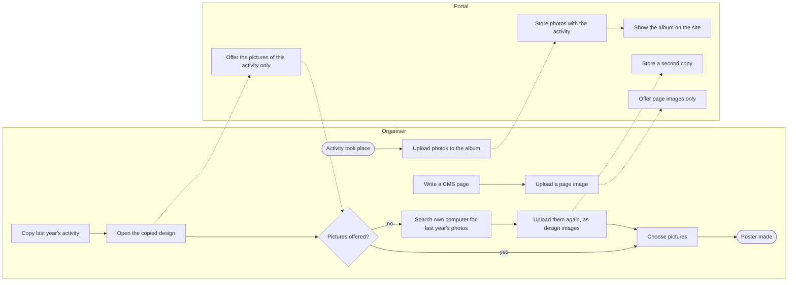
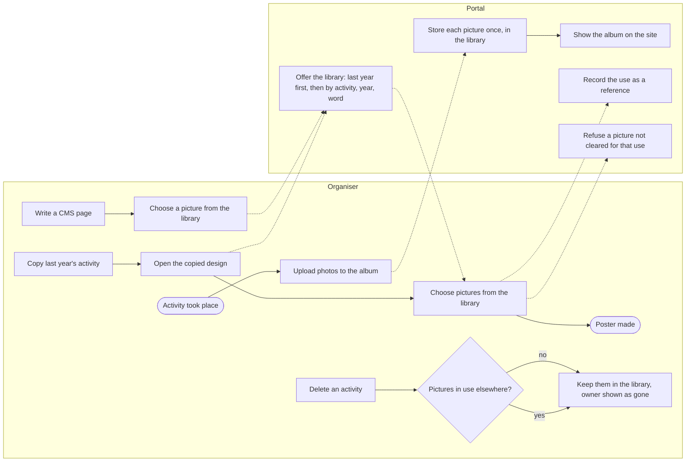
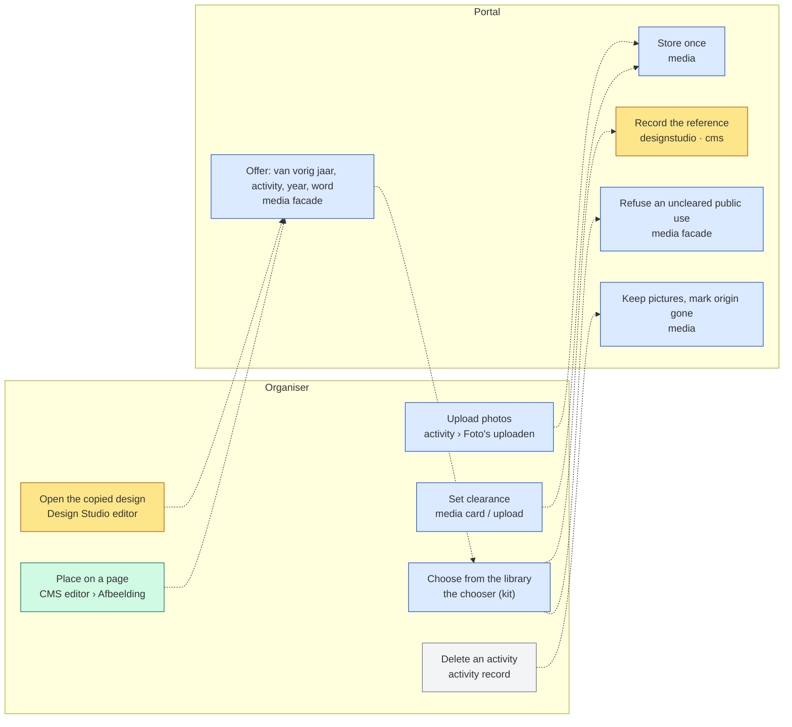
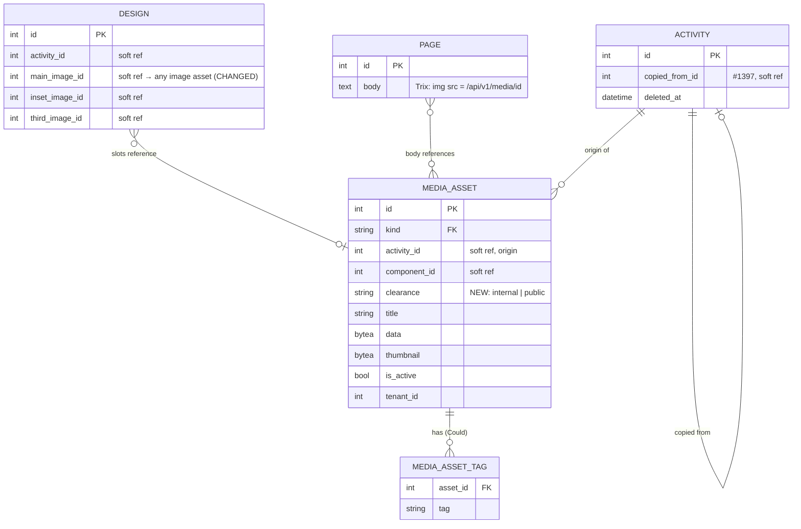

# Change Request 15 — Media library: one picture, stored once, usable everywhere

**Project:** Web Portal "Raak Millegem"
**Status:** shaped on 1 October 2026 · on hold — Koen walks through it point by point before anything is assigned
**Applies to:** the media domain and its admin screen; the picture choosers of Design Studio and the CMS; later the newsletter; the public photo albums; one new field on the activity, already under way (#1397).

---

# Part A — The business

## A1. Reason to act — the trigger

Many activities return every year. The poster of next year is best made with the photos of this year: the real children at the real Sint, the real Kerstherberg. Those photos exist — the board uploads them into the album of the activity after it took place, and the site shows them. Yet when the board copies last year's activity (#1397) and opens its design, the picture choice is empty: the design only sees pictures of the *new* activity, which has none. The board then searches its own computers for last year's photos and uploads them again, or gives up and uses a stock picture.

Koen's words, 1 October 2026: in the future all photos of activities go into media, into the albums. Those albums are the best material for the poster of the year after. In Design Studio he wants to choose from all those photos, also from activities that were not created by copying. Pictures must be reusable.

What stops it today: a picture belongs to one activity and to one use; nothing can find it from anywhere else, and the three screens that place pictures (Design Studio, the CMS pages, the newsletter) each look at their own slice or at nothing. Uploading the same picture twice is the workaround, and it is the kind of work that makes a volunteer stop.

## A2. As-is process — how it works today, and where it hurts

Two actors: the organiser (a board member) and the portal. Measured on HDEV on 1 October 2026 (`media.media_assets`, per kind): 17 activity photos, 27 design images, 13 posters, 24 design renders — every one tied to one activity; the rest (component info, sponsors, page images, logos, newsletter files) small and tied to none.

| # | Step | Who | Today | Pain |
|---|---|---|---|---|
| 1 | Upload the photos after the activity | organiser | "Foto's uploaden" on the activity; up to 20 per batch; they become the album | none — this works |
| 2 | The site shows the album | portal | `/fotos` per year, for archived activities with a cover | none |
| 3 | Copy the activity for next year | organiser | #1397, since v2.11.0: texts, dates, organisers and the design come along; the design keeps the *references* to the same pictures | none |
| 4 | Open the copied design, choose pictures | organiser | the choice shows the photos and design images of the design's own activity — the copy, which has none | **empty list**, although the pictures exist one activity away |
| 5 | Find last year's photos elsewhere | organiser | own computer, a phone, the site's album saved again | ten to thirty minutes per poster, and the picture is not the original |
| 6 | Upload again as a design image | organiser | "Foto toevoegen" in the editor | **a second copy**: 27 design images today, and the Design Studio already copies a chosen activity photo into a design image (CR-10 §3.11) — one picture, two or three rows |
| 7 | Place a picture on a CMS page | organiser | a chooser, but only over page images | a photo of the Sint cannot go on the "Sinterklaas" page without a third upload |
| 8 | Put a picture in the newsletter | organiser | not possible; the activity block takes the poster or the album cover by itself | no choice at all |
| 9 | Delete an activity or a design | organiser | the activity is soft-deleted; the design is deleted | **the pictures stay behind** without an owner (design renders and images orphaned; photos keep showing) |

Three facts the measurement adds. There is no album: an album is the set of photos that share an activity. There is no consent record: whether a photo of a recognisable child may go on a poster is decided by nobody and recorded nowhere (CR-10 §B: "the portal records no consent of its own", Koen, 17 September 2026). And the bytes live in the database, in every backup: a library that stores each picture once also keeps the backups small.

## A3. To-be process — how it should work afterwards

Same lanes, same order. The change is in steps 4 to 8: one library, one chooser, one picture stored once and *referenced* wherever it is used.

What changes, one line each:

- Step 4 becomes *choose from the library*: the chooser opens on "van vorig jaar" (the predecessors of this activity), then the whole library by activity, year and word.
- Steps 5 and 6 disappear: nothing is searched outside the portal and nothing is uploaded twice; choosing is a reference, the picture stays where it is.
- Step 7 uses the same chooser; a page image is a picture like any other.
- Step 8 (newsletter) gets the same chooser later — a Could, see A6.
- Step 9 gains a question: a picture in use elsewhere is kept, with its origin shown as gone; deleting a picture that is in use is refused until the uses are changed.
- One new step for the portal: it refuses a picture for a use it is not cleared for (a poster, the public site) — the clearance is set at upload, see A6 and A7.

## A4. Benefits — what the change earns

- **Volunteer time:** ten to thirty minutes per poster no longer spent finding and re-uploading last year's photos; with roughly fifteen recurring activities a year, five to seven hours a year — and the poster gets made with the right pictures instead of a stock one.
- **No duplicates:** 27 design images today for 17 activity photos; each picture stored once keeps the database and every backup smaller (a design image is stored at 4096 px, three to five times the bytes of an album photo).
- **Nothing lost on delete:** pictures survive the activity and the design they were uploaded for, so next year's poster can still find them.
- **A decision that is recorded:** whether a picture may be used publicly is answered once, at upload, instead of silently every time — the first step towards the consent model the architecture names as roadmap.
- **Possible at all:** a photo of the Sint on the "Sinterklaas" CMS page, or in the newsletter, without a third upload.

## A5. Supplied material — and what it taught us

- Koen's wish as relayed by the master CLI on 1 October 2026, with the measurement of media rows per kind on HDEV (the table in A2).
- Issue #1397 (copy an activity) and its five follow-ups of 30 September and 1 October 2026: the empty picture choice on the copied design, and the small step already under way — `copied_from_id` on the activity, so the choice also shows the predecessors' pictures. That step is the seed of this change, not a competitor: it defines "van vorig jaar", which stays the default filter of the chooser.
- CR-10 (Design Studio), §3.11: three sources for a design's picture (upload, activity photo, AI), one media kind — and the chosen activity photo is *copied* into a design image. That copy is what this change removes.
- CR-08 (visual) §A: consent for recognisable people, often children, named as the structural concern that deferred the imagery round. CR-10: "the portal records no consent of its own" (Koen, 17 September 2026). `docs/architecture.md`: the consent model and the object-storage adapter are roadmap (R6, R8).
- Reporting need: none asked. Counting pictures per activity or per year is a Won't (A6), unless Koen says otherwise when walking through.

## A6. Business requirements — what the board asks, with MoSCoW

| # | Requirement | MoSCoW | Source | Comment |
|---|---|---|---|---|
| R1 | A picture is uploaded once and can be used on any poster, page or newsletter afterwards, without uploading it again. | Must | Koen, 1 Oct 2026 | "afbeeldingen moeten herbruikbaar zijn" |
| R2 | When making the poster of a copied activity, the pictures of last year's activity are offered first, without the organiser searching for them. | Must | Koen, 1 Oct 2026 (#1397) | the chain of copies; the step already under way |
| R3 | From the poster editor the organiser can find any picture in the library: by activity, by year, and by a word in its title. | Must | Koen, 1 Oct 2026 | keywords beyond the title: Could (R9) |
| R4 | The photos of an activity stay its album on the site, also when the same photos are used elsewhere. | Must | derived from Koen's words; *to confirm* | the album is the origin; a use is a reference |
| R5 | A picture that is used somewhere cannot be deleted by accident: the portal says where it is used and refuses until those uses are changed. | Should | author, *proposed* | same shape as CR-14's refusal of a form in use |
| R6 | Deleting an activity or a design does not delete the pictures uploaded for it; they stay in the library with their origin marked. | Should | author, *proposed* | today they become orphans |
| R7 | The board decides per picture whether it may appear publicly (site, poster, newsletter) or only inside the back office, and the portal refuses a public use of a picture that is not cleared. | Should | author, *proposed*; Koen decides | the first step towards a consent model; the default per kind is Koen's call (Q3) |
| R8 | Choosing a picture works on a phone: a few taps, thumbnails, the same filters. | Must | the mobile-first norm (80 % of visits) | the chooser is judged at 390 px |
| R9 | A picture can carry a few words (keywords) to find it by, next to its title. | Could | Koen, 1 Oct 2026 ("eventueel trefwoorden") | |
| R10 | The newsletter can place a picture from the library in its text. | Could | author, *proposed* | today no picture can be placed at all |
| R11 | Counting or listing pictures (per activity, per year, usage) in the reporting module. | Won't | author | nothing asked; the library screen shows the counts it needs itself |
| R12 | A separate "album" the board composes by hand, across activities. | Won't | author | the album *is* the activity's photos; a hand-made selection is a design or a page, not a second album concept |

MoSCoW: **Must** (without it the change is worthless), **Should** (important,
but the change ships without it), **Could** (nice, if cheap), **Won't** (asked
and deliberately not done — recorded so it is not asked again).

## A7. Non-functional requirements — security, privacy, house style, tenants

| Concern | This change |
|---|---|
| **Security** | No new entrance from outside: uploads stay where they are, with their size and type checks; the chooser is a back-office screen behind the admin session. One existing weakness becomes visible and is closed: a picture is reachable by its numeric id regardless of whether it is active or cleared — a picture cleared for the back office only must not be served publicly (B5). |
| **Privacy** | Photos of members and their children are personal data. Today they are published on the site without a recorded decision. This change records one decision per picture — public or back-office only — set by the board at upload, and the public site and the posters honour it. It does not yet ask the person on the photo; that is the consent register of the architecture's roadmap, and this change leaves the place for it (B4.5). Nothing leaves the system that does not leave it today. |
| **House style / UI norm** | The library stays the one admin screen that is a grid of cards (CR-11 row 5: the picture is the thing being chosen). The chooser is a kit component rendered live on the design-system page, used by every screen that places a picture (CR-11 R13: one place, one form). |
| **Multi-tenant** | Pictures are tenant-scoped today and stay so; the library is per tenant. Clearance defaults are a tenant setting only if Koen wants them to differ per unit (Q3). |

## A8. Acceptance criteria — what the business signs off on HDEV

| # | Criterion | Requirement | Walkthrough steps |
|---|---|---|---|
| AC1 | On a copied activity, the design's picture choice opens on the predecessor's photos and design images, already selected where the copy kept them; the number of media rows does not change by copying or choosing. | R2, R1 | 1–4 |
| AC2 | From the editor of any design, the chooser finds a photo of any other activity by activity name, by year and by a word of its title, and places it by reference. | R3, R1 | 5–7 |
| AC3 | After a photo of activity A is used on the poster of activity B, the album of A on the site is unchanged, and the library shows the photo once with two uses. | R4 | 8–9 |
| AC4 | Deleting a photo that is in use is refused with the list of its uses; deleting the design or the activity it was uploaded for leaves it in the library with its origin marked as gone. | R5, R6 | 10–12 |
| AC5 | A picture cleared for the back office only does not appear on the site and cannot be placed on a poster; its direct URL answers 404 to a visitor without a session. | R7 | 13–15 |
| AC6 | On a phone (390 px) the chooser is a sheet with search, the two filters and a thumbnail grid; choosing takes at most three taps. | R8 | 16 |
| AC7 | A CMS page places a photo from the library through the same chooser as the design editor. | R1 | 17 |

---

# Part B — The solution

## B1. Solution outline — the solution and the decisions that shape it

The media domain already is a library: one table, one row per picture, one kind code, a tenant, an origin (`activity_id`). What is missing is three things, and the solution adds exactly those. **One: reuse is a reference, never a copy.** A design slot, a CMS page and later the newsletter point at the media row; the Design Studio stops copying a chosen photo into a design image. **Two: one chooser.** A kit component — search, the filters *activity · year · van vorig jaar*, a thumbnail grid, a bottom sheet on a phone — used by every screen that places a picture, fed by one facade function that knows the current record and opens on its predecessors. **Three: the library knows its uses and its clearance.** A derived "where used" (read from the designs, pages and letters that reference a picture — not stored twice), the refusal of a delete while uses exist, pictures that outlive their activity and design, and one field per picture that says whether it may go public.

Decisions that shape it, with the alternative that lost:

- **Reference, not copy** (B4.1). The alternative — keep copying into `design_image`, add a "copy from the library" button — would have kept two or three rows per picture and the orphan problem. Lost on bytes, backups and truth.
- **No album entity** (B4.2). The alternative — an `albums` table the board composes — adds a concept the measurement does not need: an album is the photos of an activity, and a hand-picked set across activities is what a design or a page already is. Lost on "build what is needed, in the shape that grows": the shape that grows here is the *tag*, not the album (R9).
- **Clearance on the picture, not on the person yet** (B4.5). The alternative — build the consent register first — is the right end state and far larger; a per-picture clearance is the smallest step that stops publishing without a decision, and it is where the register plugs in later. Declared deviation from the end state, with the seam named.
- **Bytes stay in Postgres** (B4.6). The alternative — the object-storage adapter (architecture R8) — is independent of reuse: this change adds references, not bytes. Lost on scope; the seam (`media.api` as the only way to a picture's bytes and URL) is kept clean so R8 remains a drop-in. Europe First applies when R8 comes (a Storage Box or an EU object store).
- **The chooser as a kit component** (B4.3), not three choosers. Lost alternative: improve the three `<select>`s of the design editor. Lost on CR-11 R13 and on the phone: a `<select>` of two hundred photos cannot be chosen from.

### B1.1 Functional analysis — the derived requirements

| # | Derived requirement | From |
|---|---|---|
| F1 | A design's three picture slots reference any active image asset the chooser offers; `add_design_image` keeps storing an *upload* or an AI result as `design_image`, but choosing an existing photo stores nothing. | R1, R2 |
| F2 | One facade function `media.api.pick_options(db, *, for_activity_id, q, activity_id, year, scope)` returns the library in pages, grouped "van vorig jaar" first (the predecessor chain of #1397's `copied_from_id`), then the rest by activity and year; it filters on clearance for the asking use. | R2, R3, R7 |
| F3 | The chooser is a kit macro (`ui.media_picker`) with htmx paging and an Alpine-less sheet on a phone; the design editor, the CMS image modal and later the newsletter render it; the design-system page shows it live. | R1, R8, R10 |
| F4 | "Where used" is derived: one facade function `media.api.uses_of(db, asset_id)` asks the designstudio, cms and newsletter facades for their references (each exposes `references_to_media(ids)`); nothing is stored twice. | R5 |
| F5 | `delete_media` refuses while `uses_of` is not empty, naming the uses; the library card shows the count and the list. | R5 |
| F6 | Deleting a design or an activity leaves the media rows; the library shows "van een verwijderde activiteit/ontwerp" from the soft-deleted activity or the missing design. The `_prune_versions` deletion of renders stays (a render is a product, not a picture). | R6 |
| F7 | One column `clearance` on the asset (`internal` · `public`), set at upload with a default per kind, editable on the card; the public routes and the poster chooser filter on it; `GET /media/{id}` answers 404 to a visitor for an `internal` asset. | R7 |
| F8 | Keywords as a repeatable tag table (`media.asset_tags`), searched by the same `q`; Could, phase 4. | R9 |
| F9 | The library screen gains the filters year and "in use", and the "where used" list per card; it stays a card grid. | R3, R5 |

## B2. Architecture — three readers, three questions

### B2.1 Fit with the process and the requirements — for the business

The to-be process of A3 with, per step, the screen that serves it:

Legend: blue media · yellow Design Studio · green CMS · grey activities (used, not changed beyond #1397's field).

**Traceability matrix**

| R | How the solution meets it (as the organiser sees it) | F | Module | Test (B7) | AC |
|---|---|---|---|---|---|
| R1 upload once, use anywhere | choosing places a reference; the row count never grows by choosing | F1, F3 | designstudio, cms, media | 1, 2 | AC1, AC2, AC7 |
| R2 last year's first | the chooser opens on the predecessor chain | F2 | media (reads activities' `copied_from_id`) | 3 | AC1 |
| R3 find any picture | search and the two filters over the whole library | F2, F9 | media | 4 | AC2 |
| R4 the album stays | the origin is the activity; a use does not move the picture | F1, F4 | media | 5 | AC3 |
| R5 no accidental delete | refusal with the list of uses | F4, F5 | media + the three facades | 6 | AC4 |
| R6 pictures outlive their owner | no cascade; origin shown as gone | F6 | media, designstudio, activities | 7 | AC4 |
| R7 cleared or not | one field, honoured by the site, the poster chooser and the URL | F7 | media | 8, 9 | AC5 |
| R8 on a phone | the chooser is a sheet with a thumbnail grid | F3 | kit | 10 | AC6 |
| R9 keywords | tags, Could | F8 | media | 11 | — (phase 4) |
| R10 newsletter picture | the same chooser in the editor's "Invoegen" | F3 | newsletter | — | — (phase 4) |
| R11 reporting | Won't | — | reporting: none | — | — |
| R12 hand-made album | Won't | — | — | — | — |

**Walkthrough on HDEV** (the organiser; the treasurer plays no part)

1. Open an activity that has photos and a design (seed: "Sinterklaas huisbezoeken 2025" with four photos). Copy it to next year (#1397). *See:* the copy opens, its design is listed.
2. Open the copied design. *See:* the three picture slots show the same pictures as the source.
3. Open the chooser of the main slot. *See:* the first group is "Van Sinterklaas huisbezoeken 2025" with the four photos and the design images, the current one marked.
4. Choose another photo of 2025. *See:* the slot shows it; `/admin/media` still counts the same number of rows.
5. In the chooser, clear the group and type "kerst". *See:* the photos whose title or activity contains it, grouped per activity with the year.
6. Filter on year 2024. *See:* only 2024's activities.
7. Choose one. *See:* placed by reference; the library card of that photo now says "gebruikt in 1 ontwerp".
8. Open `/fotos` on the site. *See:* the album of the source activity is unchanged.
9. Open `/admin/media`, filter "in gebruik". *See:* the photo once, with two uses listed.
10. Try to delete that photo. *See:* refused, with the two uses as links.
11. Delete the copied design. *See:* the photo is still in the library; its uses drop to one.
12. Delete (soft) a test activity that has photos. *See:* its photos stay in the library, origin "verwijderde activiteit"; they no longer appear on `/fotos`.
13. Upload a photo with clearance "alleen beheer". *See:* the card shows the clearance.
14. Open the poster chooser. *See:* that photo is not offered; the library screen shows it with the mark.
15. Open its URL in a private window. *See:* 404.
16. Repeat 3–4 on a phone or at 390 px. *See:* a sheet from the bottom, search on top, two filter chips, a three-column grid; three taps to choose.
17. Open a CMS page, "Afbeelding". *See:* the same chooser; a Sint photo can be placed.

### B2.2 The whole across the modules — for the architect

```mermaid
flowchart TB
  subgraph media[media]
    m1[screen: library grid — changed: year, in-use filters, where-used]:::chg
    m2[kit macro: media_picker — new]:::new
    m3[service: pick_options, uses_of, clearance — new]:::new
    m4[service: delete_media refuses in use — changed]:::chg
    m5[entity: MediaAsset.clearance, asset_tags — new]:::new
    m6[facade api.py — changed]:::chg
    m7[migration: additive]:::new
  end
  subgraph ds[designstudio]
    d1[editor: three selects → the picker — changed]:::chg
    d2[service: choose = reference, no copy — changed]:::chg
    d3[facade: references_to_media — new]:::new
  end
  subgraph cms[cms]
    c1[image modal → the picker — changed]:::chg
    c2[facade: references_to_media — new]:::new
  end
  subgraph nl[newsletter]
    n1[facade: references_to_media — new]:::new
    n2[editor: Invoegen › Afbeelding — phase 4]:::new
  end
  subgraph act[activities]
    a1[copied_from_id — #1397, used]:::used
  end
  subgraph rep[reporting]
    r1[none]:::used
  end
  d1 --> m6
  c1 --> m6
  n2 --> m6
  m3 --> d3
  m3 --> c2
  m3 --> n1
  m3 --> a1
  classDef new fill:#d1fae5,stroke:#047857
  classDef chg fill:#fed7aa,stroke:#c2410c
  classDef used fill:#f3f4f6,stroke:#6b7280
```

Legend: green new · orange changed · grey used.

**Data model at a glance**

Who calls whom: the design editor and the CMS modal call `media.api.pick_options` and render `ui.media_picker`; the media service calls `activities.api.predecessors_of` (from #1397) for the first group, and `designstudio.api.references_to_media`, `cms.api.references_to_media`, `newsletter.api.references_to_media` for "where used". The new dependencies run media → activities (already exists for `list_activity_photos`), and media → designstudio/cms/newsletter *for a read-only question* — that is the one direction to watch: the import gate allows a facade call, and it is a query, not a command; the alternative (each consumer registering its uses in media) stores the fact twice and was rejected (B4.4). Transaction boundary: choosing is the consumer's transaction (the design or page saves its reference); the refusal of a delete is one read then one refused write; clearance is a one-row update.

Impact on the existing architecture: `media.media_assets` gains one column and one Could table; the designstudio stops writing a `design_image` row for a chosen photo (its `design_image` kind stays for uploads and AI); three facades gain one function each; `GET /media/{id}` learns about clearance; no table is dropped, no contract to an outside caller changes (the JSON routes keep their shape). The layer rules hold: screens through facades, services through facades, nothing reaches into another domain's models.

### B2.3 Per module: what must happen — for the build teams

#### media (phases 1–4)

- **Screens:** `/admin/media` — the card grid stays; filters gain *year* and *in gebruik*; a card shows the clearance as a badge and "gebruikt in N" with the list unfolded on click; judged at 390 px. New: the kit macro `ui.media_picker` (search, chips *van vorig jaar · activiteit · jaar*, thumbnail grid, paging; a bottom sheet under 768 px), rendered live on `/admin/design-system`.
- **Code:** `service.pick_options`, `service.uses_of`, `service.set_clearance`; `delete_media` refuses while in use (`MediaFout` with the uses); `list_media` filters on clearance for public callers; `api.py` exports them.
- **Database:** `media.media_assets.clearance VARCHAR(16) NOT NULL DEFAULT 'public'` with `CHECK (clearance IN ('internal','public'))` — and the default per kind applied by the service at upload, not by the column (phase 3; the data default is Koen's Q3); `media.asset_tags (asset_id INT NOT NULL REFERENCES media.media_assets(id) ON DELETE CASCADE, tag VARCHAR(40) NOT NULL, PRIMARY KEY (asset_id, tag))` (phase 4). Both additive.
- **Templates and mail:** `_me_lijst.html` (filters, badge, uses), a new `_media_picker.html` partial; no mail.
- **Tests:** B7 1, 2, 4, 5, 6, 7, 8, 9, 10, 11.

#### designstudio (phase 2)

- **Screens:** the editor's three `<select>`s become three slots that open the picker; the "Foto toevoegen" upload stays for new material; judged at 390 and 1280 px.
- **Code:** `set_slot_image(design, slot, asset_id)` stores the reference after checking the asset is offered for this design (clearance, tenant); the copy-into-`design_image` path is removed; `api.references_to_media(ids)` returns the designs whose slots hold them; `image_options` is replaced by `media.api.pick_options` (the #1397 predecessor grouping moves into media, one source).
- **Database:** none — the slots are soft refs already.
- **Tests:** B7 1, 3, 6.

#### cms (phase 2)

- **Screens:** the image modal of `_cp_detail.html` renders the picker over the whole library instead of the `page_image` list; the drop/paste refusal stays.
- **Code:** `api.references_to_media(ids)` scans page bodies for `/api/v1/media/<id>` (a regex over the stored HTML; measured cost negligible at the page counts of today).
- **Tests:** B7 2, 6.

#### newsletter (phase 4, Could)

- **Screens:** "Invoegen ▾ › Afbeelding" in the editor, the same picker.
- **Code:** `api.references_to_media(ids)` over letter bodies; the insert as a Trix attachment pointing at the media URL.
- **Tests:** B7 6.

#### activities (used)

- `copied_from_id` and `predecessors_of` from #1397; nothing else changes.

#### reporting — none

No view in the `reporting` schema reads `media.media_assets` (measured: the universe lists no media object), so the new column and table touch no saved report. R11 is a Won't.

### B2.4 Cross-cutting impact — the checklist of what gets forgotten

| Row | Answer |
|---|---|
| Reporting views and saved reports | no — no view reads media |
| Existing tests, e2e flows, 390 px screenshots | yes — the design editor's e2e and screenshots change (the selects become slots); the media screen screenshots change (B7) |
| Fixed UI decisions and `CLAUDE.md` | no |
| Design-system documentation | yes — the picker is a new component (§2) and the media grid keeps its exception (§3) |
| Code lists | yes — `media_kind_codes` unchanged; `clearance` is a two-value CHECK, not a code list (two values, no label table needed; B4.5) |
| Events and handlers | no — no event; "where used" is a query |
| Mail templates | no |
| Migration: additive or contract | additive (one column with a default, one table) |
| Tenant settings | only if the clearance default differs per tenant (Q3); otherwise no |
| Env vars | no |
| JSON routes and API callers | `GET /media/{id}` changes behaviour for `internal` assets (404 without a session); no caller outside the portal measured |
| External services | no |

## B3. Cost — investment and running cost, and what operations must know

**Investment** (CLI-days; S/M/L where the team has no track record):

| Module | Ph 1 library | Ph 2 picker + reference | Ph 3 clearance | Ph 4 tags, newsletter | Total |
|---|---|---|---|---|---|
| media | 1.5 | 2 (the picker, the facade) | 1 | 1 | 5.5 |
| designstudio | — | 1.5 | 0.25 | — | 1.75 |
| cms | — | 0.5 | — | — | 0.5 |
| newsletter | — | 0.25 (facade) | — | 1 | 1.25 |
| tests | 0.5 | 1 | 0.5 | 0.25 | 2.25 |
| **Total** | **2** | **5.25** | **1.75** | **2.25** | **~11.25** |

Plus analysis (this document, ~1), review and HDEV validation per phase (~0.5 each), no purchases.

**Running cost:** none added; fewer bytes stored and backed up (each picture once). No paid service.

**Operations:** no env var, no kill switch; a migration per phase 3 and 4 (additive); backups unchanged in shape. The one behaviour change to know: an `internal` picture's URL answers 404 publicly — a picture that disappears from the site after phase 3 was marked internal, not lost.

## B4. Detailed decisions — one subsection each, with the reasons

### B4.1 Reuse is a reference, never a copy

A picture is one row; everything that shows it points at the row. Today the Design Studio copies a chosen activity photo into a `design_image` (CR-10 §3.11) so that the design "owns" its material at 4096 px. The ownership was the wrong thing to want: it costs a second copy, the copy orphans when the design goes, and the activity photo and its copy drift apart in title and order. The design's slots are soft references already; they simply get to point at any image asset. The 4096 px argument: a design that needs more resolution than the album's 1600 px uploads its own material (that path stays) — the album photo at 1600 px is what the poster of a village association prints at A3 anyway (CR-10 measured 1–3 MB per final design).

### B4.2 No album entity; the activity is the album, the tag is what grows

An album is the set of photos with one `activity_id`; the site already shows it that way. A table `albums` would be a second place for the same fact. What Koen may want beyond it — "the ten best of 2025", "all Sint photos over the years" — is a *selection*, and a selection is either a design, a page, or a search: tags (R9) give the search its words. On standards: IPTC Photo Metadata names the fields a picture carries — title, description, keywords (repeatable), date created, creator, rights/usage terms; the asset has title and a date, gets keywords as a repeatable table (never a comma column), and the usage terms are what `clearance` is the first value of.

### B4.3 One chooser, from the kit

`ui.media_picker` is the only way a screen offers a picture: the design editor, the CMS modal, later the newsletter. It takes the asking context (the record, the use) and renders what `pick_options` returns: the group "Van <activity> (<year>)" for the predecessor chain first, then the rest, searchable and filterable, paged at 60 thumbnails; on a phone a bottom sheet with a three-column grid and the filters as chips. One component means one behaviour on every screen (CR-11 R13) and one place to make it good on a phone (R8).

### B4.4 "Where used" is derived, not stored

Each consumer knows what it references; media asks them. Storing a `media_uses` table would mean every consumer writes twice (its reference and the use row) and the two drift — the shape CLAUDE.md calls the bug ("twee keer dezelfde reparatie"). The cost is a query across three facades at delete time and on the library card; at the counts of this portal (hundreds of pictures, tens of designs) it is not measurable. The direction media → consumers is read-only and through facades; the import gate allows it.

### B4.5 Clearance on the picture: the first step of the consent model, with the seam named

The architecture's consent register (R6 there) is a model of *persons* and *their* permissions; it does not exist, and building it is its own change. What can be decided today, per picture, is whether it may go public — and today that decision is made by nobody. One field, two values, set at upload with a default per kind (Koen decides the default, Q3; the author proposes `public` for activity photos because that is how they are used today, and `internal` for design images and page images until placed). When the register comes, a picture's clearance becomes derived from the persons on it; the field stays as the override. Declared deviation from the end state; the seam is the one field and the one filter in `pick_options`.

### B4.6 Bytes stay in Postgres; the storage seam stays clean

This change adds references and one short column, not bytes; it removes bytes (no more copies). The object-storage adapter (architecture R8) stays roadmap; the only rule kept here is that nothing outside `media` reads `data` or builds a media URL by hand, so that R8 is a change inside one module. Measured: the designstudio and cms templates build `/api/v1/media/<id>` URLs through the media view-models today; B7 test 12 keeps it so.

### B4.7 Pictures outlive their activity and their design

An activity is soft-deleted (#166); its photos stay rows with an `activity_id` that now points at a deleted activity: the library shows the origin as gone, the site no longer lists the album (it never listed deleted activities). A design is hard-deleted; its slots vanish with it and the pictures stay. Renders (`design_render`) are products of a version and keep being pruned with it — a render is not a picture anyone reuses.

## B5. Privacy and security — the mechanics behind A7

- `GET /api/v1/media/{id}` and `/thumb`: an `internal` or inactive asset answers 404 without an admin session (today both are served by id). The cache header stays immutable for `public` assets; `internal` assets are served with `private, no-store` to the back office.
- `pick_options(use="poster"|"page"|"newsletter")` filters on `clearance = 'public'`; the back-office library shows everything with the badge.
- No new personal data is stored; the clearance is a decision about a picture, logged in the asset's history row like any field change.
- Uploads keep their checks (type, size, SVG sanitising, batch cap).

## B6. Phasing — shippable phases, and what changes on the failure paths

| Phase | Delivers | Issue | Migration | Env | Data | Failure paths that change | Manual validation |
|---|---|---|---|---|---|---|---|
| **0 — the seed** (#1397, under way by dev1) | `copied_from_id`; the design's picture choice shows the predecessors' pictures under their own heading; no copy | #1397 follow-up | additive (activities) | — | — | none | the copied design's choice on HDEV |
| **1 — the library knows** | year and "in use" filters; "where used" per card; delete refused while in use; pictures survive their activity and design | new | none | — | none | a delete that succeeded silently now refuses with a list | AC3, AC4 |
| **2 — one chooser, reference only** | `ui.media_picker`; the design editor's slots and the CMS modal on it; the copy-into-`design_image` path removed; `pick_options` with the predecessor group (phase 0's grouping moves into media) | new | none | — | none: existing `design_image` rows stay as they are | choosing a photo no longer creates a row; a design saved with a slot pointing at an asset it may not use is refused | AC1, AC2, AC6, AC7 |
| **3 — clearance** | the field with its defaults; the site, the poster chooser and the URL honour it; the badge and editor on the card | new | additive (media) | — | a one-off: every existing asset gets the default of its kind — the migration sets it, the "Na de merge" names the counts per kind | a public URL of an internal asset answers 404; a poster cannot be rendered with an uncleared picture | AC5 |
| **4 — words and the newsletter** (Could) | tags; the newsletter's "Afbeelding" insert | new | additive (media) | — | none | none | walkthrough step 5 with a tag |

"Na de merge" per phase: phase 3 names the counts set per kind and the default chosen; the others nothing beyond the migration.

## B7. Tests — what the build must prove

1. **Choosing stores nothing.** Setting a design slot to an existing activity photo leaves `media_assets` at the same count and the slot pointing at that photo's id; uploading through "Foto toevoegen" adds exactly one row. Red on master, where the choice creates a `design_image`.
2. **The CMS places a reference.** Placing a photo through the modal inserts `/api/v1/media/<id>` of that photo; no `page_image` row is created.
3. **Last year first.** For a design on a copied activity, `pick_options` returns the predecessor chain's photos as the first group, labelled with the source's name and year; for an activity without predecessors, no such group.
4. **Search and filters.** `q="kerst"` matches title and activity name; `year=2024` restricts to activities dated in 2024; the two combine.
5. **The album is untouched.** After a photo of A is placed on B's design, `list_activity_photos(A)` is unchanged and `/activiteiten/A/fotos` renders the same ids.
6. **Refuse while in use.** `delete_media` on a referenced asset raises `MediaFout` naming each use (design, page, letter); on an unreferenced one it deletes. Proven by violation: a reference added through each of the three facades makes the delete refuse.
7. **Survives its owner.** Soft-deleting an activity and hard-deleting a design leave their media rows; the library labels the origin as gone; `/fotos` no longer lists the activity.
8. **Clearance on the URL.** `GET /api/v1/media/{id}` for an `internal` asset answers 404 without a session and 200 with an admin session; `public` answers 200 to both.
9. **Clearance in the chooser.** `pick_options(use="poster")` never returns an `internal` asset; `use="library"` returns it with the mark.
10. **The sheet at 390 px.** The picker renders as a sheet: search on top, the chips, a three-column grid; the DOM measurement — the grid's width equals the viewport minus the 16 px gutters, no horizontal scroll (the stability protocol of CR-11 B7 applies).
11. **Tags are repeatable.** Two tags on one asset are two rows; `q` matches either; the same tag twice is refused by the primary key.
12. **The storage seam.** A gate: no template or module outside `media` reads `MediaAsset.data` or builds a `/api/v1/media/` URL by string; baseline measured at the build (expected zero, hard).

**Impact on the test landscape:** the design editor's e2e flow and its screenshots (three selects → three slots with the picker); `/admin/media` screenshots (filters, badges); the CMS image modal e2e; the media router tests gain the 404 cases. Nothing else: the public pages' tests keep passing because `public` is the default for existing photos (phase 3's one-off).

## B8. Rule and gatekeeper — what this fixes for all future work

1. **The rule.** *A picture is one media row; every use of it is a reference to that row through `media.api`, chosen through the one picker; no module copies a media row, reads its bytes, or builds its URL by hand.* Lives in `docs/code-style.md` under layer boundaries, and in the design system next to the picker.
2. **Reach and baseline.** The whole codebase. Measured on the branch, 1 October 2026: one copy path (`designstudio.service`, the chosen photo copied into `design_image`); three screens that offer pictures, each its own way (the design editor's selects, the CMS modal, the newsletter's nothing); zero hand-built media URLs outside media's view-models. After this change: zero copy paths, one picker.
3. **The gate.** B7 test 12 (hard: the count is zero after the build) for bytes and URLs; and a ratchet on the copy path: a test that the designstudio service has no function creating a `MediaAsset` from an existing one (`copy` of `data`), proven by adding one. The "one picker" half cannot be checked by grep — a screen can still draw a `<select>` of assets — and is handed to the `design-conformiteit-bewaker` agent and the merge gate, as a weaker guarantee, written down as one.

## B9. Prototype findings — what was measured before the build

- HDEV, 1 October 2026: 17 activity photos, 27 design images, 13 posters, 24 renders; every photo, design image and poster tied to one activity; renders tied to none.
- The design editor's picture choice is three `<select>`s with text labels — no thumbnail is shown while choosing, although the view-model carries the thumb URL.
- The CMS modal lists `page_image` only; the newsletter cannot place a picture.
- `GET /api/v1/media/{id}` checks neither `is_active` nor kind.
- Deleting a design orphans its images and renders; deleting an activity leaves its photos without a listed owner.
- The blob bytes are in every `pg_dump` (no exclusion).

## B10. Decisions log — dated answers and open proposals

| Date | Decision | By |
|---|---|---|
| 1 Oct 2026 | A change request for the media library, to be walked through point by point before anything is assigned; nothing built from it yet. The small step of #1397 (`copied_from_id`, predecessors in the choice) goes ahead as its seed. | Koen, via the master CLI |
| 1 Oct 2026 | *Proposed:* reference not copy; no album entity; one picker from the kit; "where used" derived; clearance per picture as the first step of the consent model; bytes stay in Postgres. | author |

## Q&A log — asked once, answered here

| # | Date | Question (who) | Answer |
|---|---|---|---|
| Q1 | 1 Oct 2026 | Search and filter: by activity, year, keywords; "van vorig jaar" as the default? (master CLI, for Koen) | *Proposed:* the picker opens on the predecessor chain when there is one, then the whole library; filters activity and year, search over title and activity name now, over tags in phase 4. *Koen decides.* |
| Q2 | 1 Oct 2026 | Which kinds are reusable, for which use (poster, newsletter, CMS)? (master CLI) | *Proposed:* every *image* kind is reusable for every use — activity photos, design images, page images, posters as pictures; not reusable: renders (products), newsletter files (documents), logos and sponsor images stay in their own place. The use filter is clearance, not kind. *Koen decides.* |
| Q3 | 1 Oct 2026 | Privacy and consent: may every album photo go on a poster, with minors on it? (master CLI) | *Proposed:* a clearance per picture, two values, set at upload with a default per kind (`public` for album photos, `internal` for design and page images until placed); the consent register of the roadmap plugs in later (B4.5). The real question for Koen: **does an album photo count as cleared for a poster by the fact that it is on the site, or must the board say so per picture?** The author recommends the first (one decision at upload, not two). *Koen decides.* |
| Q4 | 1 Oct 2026 | Ownership: does a photo stay with its activity when used elsewhere; what when the activity is deleted? (master CLI) | *Proposed:* yes — the activity is the origin and the album; a use is a reference; on delete the photo stays, origin marked gone (B4.7). *Koen decides.* |
| Q5 | 1 Oct 2026 | Storage: blobs in Postgres — does this touch R8, the object-storage adapter? (master CLI) | *Answer:* no — this change adds references and removes copies; R8 stays roadmap, the seam is kept clean (B4.6, B7 test 12). |
| Q6 | 1 Oct 2026 | Mobile first: choosing from hundreds of photos at 390 px? (master CLI) | *Proposed:* a bottom sheet, search on top, filter chips, a three-column thumbnail grid paged at 60, the predecessor group first so the common case is one scroll (B4.3, AC6). *Koen decides.* |
| Q7 | 1 Oct 2026 | One picker for Design Studio, newsletter and CMS? (master CLI) | *Proposed:* yes, a kit component (B4.3), Design Studio and CMS in phase 2, the newsletter in phase 4 as a Could. *Koen decides.* |
| Q8 | 1 Oct 2026 | Should the Design Studio keep its 4096 px copies for print quality? (author) | *Proposed:* no copy; a design that needs more than the album's 1600 px uploads its own material through the path that stays (B4.1). *Koen decides.* |

## Non-goals — deliberately outside this change

- The consent register per person (architecture R6): a change of its own; this change leaves the field it will drive.
- Object storage for media bytes (architecture R8).
- A hand-composed album across activities (R12, Won't).
- Image editing (crop, rotate) in the library.
- Face recognition or automatic tagging — not Europe First, not wanted.
- Reporting on media (R11, Won't).

## Relationship to existing work — issues and change requests

- **#1397** — copy an activity; its follow-up (`copied_from_id`, predecessors in the choice) is phase 0 of this change.
- **CR-10** — Design Studio; §3.11's copy-into-`design_image` is what B4.1 removes; the slots as soft refs are what makes it cheap.
- **CR-11** — the media library stays the one card grid in the admin (row 5); the picker is a kit component under its rule R13; the media screen is in its roll-out.
- **CR-08** — the deferred imagery round named consent as the structural concern; B4.5 is the first step.
- **CR-14** — the refusal of a delete while in use (B4.4) follows its RESTRICT semantics for a form with submissions.
- **CR-05** — the newsletter's album links and activity block; phase 4 adds the picture insert.
- **`docs/architecture.md`** — R6 consent model and R8 object storage, both roadmap, both left in place.
