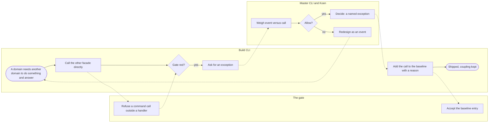
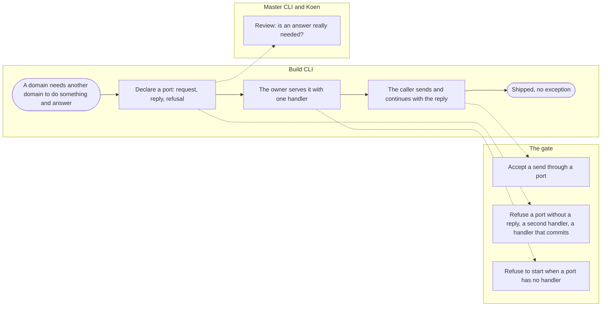
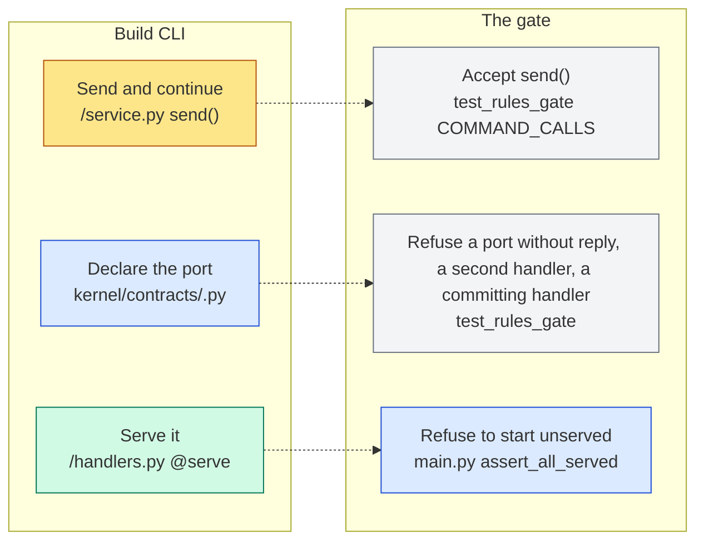
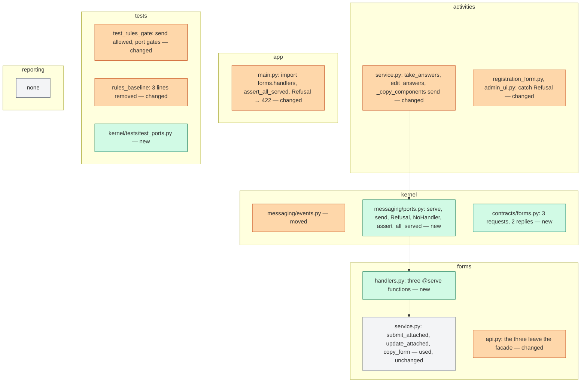
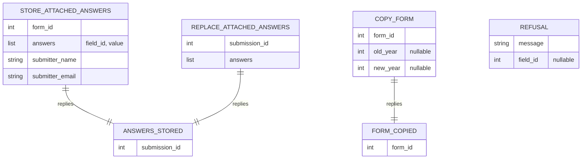

# Change Request 16 — The port (het loket): one command with one answer between domains

**Project:** Web Portal "Raak Millegem"
**Status:** shaped on 1 October 2026 · on hold — Koen walks through it first, then plans it; not deferred, not rushed · **re-measure before planning** (10 October 2026, at the close-out of CR-13 phase 4): CR-13 phase 4c built the port mechanism (`kernel/ports.py`) and the two forms ports `SubmitAttached` and `UpdateAttached` in v2.16.0 (#1251), and `tests/rules_baseline.py` is deleted — the rows of C1 and the passages that cite it describe the code of 1 October; what this change request still adds is measured against v2.16.0 before Koen plans it
**Tracking issue:** #1411 — the one place where what is open stands; this document is the design, the issue is the status
**Applies to:** the kernel (a new `kernel/messaging/` package holding events and ports); the three synchronous commands from `activities` into `forms`; the `COMMAND_CALLS` gate and its baseline; `docs/architecture.md` §3.2.1 and `docs/code-style.md`.
**Reading:** A 1898 words · B 2417 · C 2434 — words to read, drawings excluded, measured on 2 October 2026; the budget is A ≤ 1 500, B ≤ 2 500

---

# Part A — The business

## A1. Reason to act — the trigger

The portal is built as modules that talk to each other through two doors: a *read* (ask the other module something) and an *event* (tell the others something happened, without an answer). That shape is what lets a module be taken out and run elsewhere later, and what keeps a change in one module from breaking another. It has one gap: sometimes a module needs another module to **do something and answer** — store these answers and tell me their number, or refuse them and tell me which question was wrong. An event cannot answer. So three times now the board's work needed such a call, and each time it was allowed as a named exception to the rule, with Koen deciding per case.

The three: when a member registers for an activity with extra questions, the activity module asks the forms module to store the answers and needs their number back and the refusal of a wrong answer on the screen (CR-14); when the board corrects those answers (CR-14); and, on 1 October 2026, when the board copies last year's activity and its component's question form must be copied with it, with the new form's number back (#1397). The architecture said in advance that the third such call is the moment to build the proper door — the **port** — instead of a fourth exception. Koen chose to ship v2.11.0 quickly with the third exception and to build the port next, talked through first, not deferred and not rushed. His sentence for it, 1 October 2026: "een CR dat die drie uitzonderingen laat verdwijnen."

What stops the board today: nothing visible. What it costs: every such call is a decision for Koen, a reason on a line in a baseline, and a coupling that the rule says should not exist — and the fourth one will be made by whoever builds it next, under time pressure, as the fourth exception.

## A2. As-is process — how it works today, and where it hurts

The actors are the ones who build and decide: the build CLI, the master CLI with Koen, and the codebase's own gate. Measured on 1 October 2026: three exceptions in the baseline of `COMMAND_CALLS` added after its freeze by decision (two on 29 September for CR-14, one on 1 October for #1397), plus one read with a cache write (#1368) and 132 legacy couplings frozen on 29 September that CR-13's phases are working off.

| # | Step | Who | Today | Pain |
|---|---|---|---|---|
| 1 | A domain needs another to do something and answer | build CLI | calls the other domain's facade function directly (`forms.api.submit_attached`, `update_attached`, `copy_form`) | the call is the kind the rule forbids |
| 2 | The gate refuses | the gate | `test_events_not_calls` names the call: "publish an event and let forms subscribe" | the advice is wrong for this case: an event cannot answer |
| 3 | Ask for an exception | build CLI → master CLI → Koen | a question, a weighing, a decision, each time | three times in three days; the fourth is made under time pressure |
| 4 | Record it | build CLI | one line in `rules_baseline.py` with the reason | the baseline grows; the rule's own exceptions are the rule's wound |
| 5 | The refusal travels back | forms → activities → screen | `VeldFout`, an `HTTPException` with a `veld_id`, raised inside forms, caught as a generic `HTTPException` by the activity's screens with `getattr(exc, "veld_id", None)` | the caller knows the other domain's exception shape; the JSON route gets a 422 by accident of inheritance |
| 6 | The answer travels back | forms → activities | an ORM object (`FormSubmission`) whose `.id` is read; `copy_form` returns an `int` | two shapes for the same idea; the caller holds another domain's mapped object |
| 7 | Nothing happens when the owner is absent | — | a direct call cannot be absent | — (but see A3: a port can) |

## A3. To-be process — how it should work afterwards

What changes, one line each:

- Step 1 keeps its question but gets a door: the build CLI declares a port (a request, a reply, the refusals) in the kernel's contracts, like an event.
- Steps 3 and 4 disappear: no exception, no baseline line, no decision per case. The review question shrinks to one: *does the caller really need an answer to continue?* — and that question is asked at the contract, where it can be read.
- Step 5 changes: a refusal is a kernel `Refusal` with a message and, when it names a field, the field's id; the caller never imports another domain's exception.
- Step 6 changes: a reply is a small frozen value (`AnswersStored(submission_id=…)`, `FormCopied(form_id=…)`), never a mapped object.
- Step 7 is new: a port with no handler refuses at startup, not at the first call in production.

## A4. Benefits — what the change earns

- **Decisions saved:** three per-case decisions in three days become zero; the next such call is built from the rule in an hour, without asking.
- **A rule that stays whole:** the `COMMAND_CALLS` baseline loses its only post-freeze entries; it goes back to being what it was meant to be — a list of legacy couplings that only shrinks.
- **Extraction stays possible:** every synchronous call between domains goes through one seam that can later carry a network call with its own means (idempotency, compensation), instead of through direct imports scattered through services.
- **Fewer accidental couplings:** the caller holds a value, not another domain's ORM object or exception class.
- **Nothing for the board to see**, and nothing to break: the three flows behave as today on the happy path and on refusal.

## A5. Supplied material — and what it taught us

- Koen's request as relayed by the master CLI on 1 October 2026, with the six points the change must at least work out (the form, refusals, the transaction, the gate, the migration of the three, what not). They are C4.1–C4.6.
- `docs/architecture.md` §3.2.1 (decided with Koen on 30 September 2026): the choice between event, port and read "is made by what the caller says, not by transactional integrity"; the port lives in the kernel; step 2's trigger is "a third synchronous command, or a second domain pair"; then "the named exceptions leave the baseline in the same change". R10 names it as roadmap. This change is step 2, exactly as written.
- CR-14 §C4.2 and §C4.7 and its decisions log (29–30 September): the two exceptions with their reason; one wording there says "a second and a third of the kind become a port", the architecture says "a third, or a second pair" — the third has come, so both readings agree now; the architecture's wording is the one kept.
- #1397's follow-up (dev1, 1 October, uncommitted on its branch at the time of writing): `forms.api.copy_form(db, form_id, *, old_year, new_year) -> int`, called from `_copy_components`, its baseline line reading "synchronous copy, returned id; Koen 1 Oct 2026; the port follows in its own CR". The third exception, as the trigger foresaw.
- CR-13 §C4.9 and R12: consequences go through events; handlers never commit and never touch the network; the gates `COMMAND_CALLS`, `COMMIT_IN_HANDLER`, `NETWORK_IN_HANDLER`, `COMMIT_BEHIND_API`. The port inherits all four, as C4 says.
- Reporting need: none; nothing is counted or exported. One row in A6 says so.

## A6. Business requirements — what the board asks, with MoSCoW

Written in the words of the one who decides on the architecture; the board sees none of it.

| # | Requirement | MoSCoW | Source | Comment |
|---|---|---|---|---|
| R1 | A module that needs another module to do something *and answer* has one proper way to ask, next to the event and the read, so it is never again an exception to decide per case. | Must | Koen, 1 Oct 2026 | the port of §3.2.1 step 2 |
| R2 | The three exceptions of today (`submit_attached`, `update_attached`, `copy_form`) disappear from the baseline in this change, and the three flows behave as before. | Must | Koen, 1 Oct 2026 | "laat die drie uitzonderingen verdwijnen" |
| R3 | A refusal comes back to the asking module and its screen without that module knowing the other module's errors — and still names the field that was refused. | Must | Koen, 1 Oct 2026 | the `VeldFout` case |
| R4 | The ask runs inside the asker's own transaction, all or nothing, as events do today. | Must | Koen, 1 Oct 2026 | nothing half done |
| R5 | The gate recognises a call through a port as allowed, and refuses what would make the port the new back door: a port without an answer, a second handler, a handler that commits or calls the network. | Must | Koen, 1 Oct 2026 | C4.4 says what can be checked mechanically and what cannot |
| R6 | A port that nobody serves is found at startup, not at the first use. | Should | author, *proposed* | today two publishers refuse an event with no subscriber by hand |
| R7 | When a module is extracted later, the port is the one place where the call becomes a network call; nothing else in the caller changes. | Should | §3.2.1 step 3, R7 of the architecture | designed for, not built |
| R8 | No generic remote-procedure framework, no network, no asynchronous bus, no middleware pipeline. | Must (as a limit) | Koen, 1 Oct 2026 | Non-goals |
| R9 | Reporting: nothing to count, list or export. | Won't | author | — |

## A7. Non-functional requirements — security, privacy, house style, tenants

| Concern | This change |
|---|---|
| **Security** | No new entrance from outside; a port is called from code, never from a route. The tenant filter stays the session's. |
| **Privacy** | No personal data moves differently: the same answers reach the same table in the same transaction. |
| **House style / UI norm** | Not applicable; no screen changes. The refusal keeps marking the refused question on the page exactly as today. |
| **Multi-tenant** | Not applicable; the port carries the session, and the session carries the tenant. |

## A8. Acceptance criteria — what the business signs off on HDEV

| # | Criterion | Requirement | Walkthrough steps |
|---|---|---|---|
| AC1 | Registering for an activity with questions, correcting the answers from the board, and copying an activity whose component has a form all work exactly as on v2.11.0 — same screens, same refusals with the question marked, same mails. | R2, R3, R4 | 1–6 |
| AC2 | `rules_baseline.py` holds no entry added after the 29 September freeze except the #1368 read; the three lines are gone and CI is green. | R2 | 7 |
| AC3 | A port declared without a handler makes the backend refuse to start with a message naming the port (shown on HDEV once, deliberately, then reverted). | R6 | 8 |

---

---

# Part B — The solution, for whoever approves it

## B1. Solution outline — the solution and the decisions that shape it

One small kernel package, `kernel/messaging/`, holds the two ways a domain talks to another with effect: **events** (moved there unchanged: `publish`, `@subscribe`, the contracts) and **ports** (new: a request type, a reply type, `@serve` for the one handler, `send(request, db) -> reply`, and `Refusal`). A port is declared in `kernel/contracts/<owner>.py` next to the owner's events: a frozen request dataclass, a frozen reply dataclass, and a docstring that says what answer the caller needs. The owner serves it with one function; a second registration raises at import. The caller sends and gets the reply or a `Refusal`. Everything runs in the caller's transaction and flushes; a serving function never commits and never touches the network — the handler gates of CR-13 cover `@serve` as they cover `@subscribe`. The three exceptions become three ports, and their baseline lines go. The gate learns that `send()` is allowed and that a port's reply must be declared.

Decisions that shape it, each with the rejected alternative (the reasoning in C4):

- **Same package as events, same contract files** (C4.1). Rejected alternative: a `ports.py` at the kernel root, or a domain of its own. §3.2.1 said "move together"; a domain would be the hub everything couples to.
- **Request and reply as values; refusal as one kernel exception** (C4.2). Rejected alternative: returning the owner's ORM object and letting `VeldFout` travel. The caller holds a value, never another domain's class.
- **One handler, by decorator, checked at startup** (C4.1, C4.3). Rejected alternative: a handler list in `main.py` and the hand-written `has_subscribers` refusals. A port without a handler is "the caller cannot continue", so it stops the app at startup.
- **The gate accepts `send()` and checks what can be checked** (C4.4). Rejected alternative: pretending a grep can tell whether an answer is really needed — that part is the contract's "Answer needed:" line and the review.
- **No network, no async, no framework** (C4.6). Rejected alternative: nothing; there is no dependency to choose, so Europe First has nothing to decide here.

### B1.1 Functional analysis — the derived requirements

| # | Derived requirement | From |
|---|---|---|
| F1 | `kernel/messaging/__init__.py`, `events.py` (moved from `kernel/events.py`, every import updated in the same change, no shim), `ports.py` (new). | R1 |
| F2 | `ports.py`: `class Port(Generic[Req, Rep])` is not needed — a port is identified by its request type: `serve(RequestType)` decorator registering exactly one callable `(request, db) -> reply`; `send(request, db)`; `Refusal(message, *, field_id=None)`; `NoHandler`; `assert_all_served(request_types)` for startup. | R1, R6 |
| F3 | Contracts: `kernel/contracts/forms.py` gains `StoreAttachedAnswers`, `ReplaceAttachedAnswers`, `CopyForm` (requests) and `AnswersStored`, `FormCopied` (replies), each request's docstring opening with "Answer needed: …". | R1, R2 |
| F4 | `forms/handlers.py` (exists for nothing today — new file, imported by `main.py` like the others) serves the three: it calls the existing service functions, maps `VeldFout` to `Refusal(field_id=…)` and `LookupError` to `Refusal`, and returns the reply value. | R2, R3 |
| F5 | `activities/service.py`: `take_answers`, `edit_answers` and `_copy_components` send the request and use the reply; they import nothing from `forms` any more except reads. | R2 |
| F6 | The screens that caught `HTTPException` for a refused answer catch `Refusal` and read `field_id`; the JSON route maps `Refusal` to 422 with the field in one exception handler registered in `main.py`. | R3 |
| F7 | Gates: `COMMAND_CALLS` treats `send` as allowed; `COMMIT_IN_HANDLER` and `NETWORK_IN_HANDLER` cover `@serve`; new: every request type has a reply type and a docstring "Answer needed:"; a request type served twice is red; `send` only from a service or a handler, never from a router or a UI module. | R5 |
| F8 | Startup: `main.py` calls `assert_all_served()` after the handler imports; a port without a handler stops the app with its name. | R6 |
| F9 | The docs: `docs/architecture.md` §3.2.1 step 2 marked built, R10 moved to "in code"; `docs/code-style.md` gains one sentence under "A rule has one home"; `kernel/contracts/` README line. | R1 |

## B2. Fit with the process and the requirements — for the business

The to-be process of A3 with, per step, the place that serves it:

Legend: blue kernel · green the owning domain (forms) · yellow the calling domain (activities) · grey tests.

**Traceability matrix**

| R | How the solution meets it | F | Module | Test (C6) | AC |
|---|---|---|---|---|---|
| R1 one proper way to ask | `send()` to a declared port with one handler | F1, F2, F3 | kernel | 1, 2 | — (code) |
| R2 the three exceptions go | three ports, three baseline lines removed, flows unchanged | F3, F4, F5 | forms, activities, tests | 3, 4, 5 | AC1, AC2 |
| R3 refusal without knowing the owner | `Refusal(field_id)` raised by the handler, caught by the caller and the screens | F4, F6 | kernel, activities | 6, 7 | AC1 |
| R4 the asker's transaction | `send` is a function call; the handler flushes, never commits | F2, F7 | kernel, tests | 8 | AC1 |
| R5 the gate | `send` allowed; reply declared; one handler; no commit, no network, no send from a route | F7 | tests | 9, 10, 11, 12 | AC2 |
| R6 unserved found at startup | `assert_all_served` in `main.py` | F8 | kernel, app | 13 | AC3 |
| R7 extraction-ready | the request is a frozen value; `send` is the one seam | F2 | kernel | — (design) | — |
| R8 no framework | Non-goals; nothing added to `requirements.txt` | — | — | 14 (dependency count unchanged) | — |
| R9 reporting | Won't | — | reporting: none | — | — |

**Walkthrough on HDEV** (a board member; nothing new to see — the point is that nothing changed)

1. As a visitor, register for the Sint activity (seed with the question form). Leave a required question empty. *See:* the page comes back with the values kept, the banner on top and that question marked in red.
2. Fill it in, submit. *See:* the confirmation; the answers on the registration in the admin.
3. From the admin, open the registration, correct an answer with a value out of range. *See:* refused, the question marked.
4. Correct it properly. *See:* saved, the history row "answers_edited".
5. Copy the activity to next year. *See:* the copy with its components; the component's form is a new form with the year in its title; the old form's submissions untouched.
6. Register on the copy's public page. *See:* the new form's questions.
7. Open the CI run of the merge. *See:* green; open `rules_baseline.py` on master: the three lines are gone.
8. (Developer, once, on HDEV) Deploy a branch that declares a port without a handler. *See:* the backend does not start; the log names the port. Revert.

## B3. The whole across the modules — for the architect

Legend: green new · orange changed · grey used.

**Data model at a glance:** no table, no column, no migration. The values that cross the seam:

Who calls whom: `activities.service` → `kernel.messaging.send` → the one `@serve` function in `forms.handlers` → `forms.service`. The dependency direction is activities → kernel and forms → kernel; neither domain imports the other for a command any more (reads through `forms.api` stay: `submission_views`, `get_form`). The handler returns a reply value; a refusal is a `Refusal` raised through `send` to the caller. Transaction boundary: unchanged — the door (the router or the door service) commits once; `send` does nothing to the session; the handler flushes. The import gate holds: the kernel imports no domain (the registry holds callables registered by the domains at import time, as the event registry does today); domains import only `kernel.messaging` and `kernel.contracts`.

Impact on the existing architecture: `kernel/events.py` moves one directory down and every `from app.kernel.events import` (measured at the build; expected around twenty files) changes in the same commit; `forms.api` loses three exports (a smaller facade); `COMMAND_CALLS` loses three lines; `architecture.md` §3.2.1 step 2 is marked built. No contract to an outside caller changes; the JSON route `POST /activities/{id}/register` keeps answering 422 with the field on a refused answer — now through one registered handler for `Refusal` instead of `VeldFout`'s inheritance from `HTTPException`.

## B4. Rules this change needs an exception from — decided once, here

| Rule (where) | What the design does instead | Mechanism | Temporary until … / the new rule | Decided |
|---|---|---|---|---|
| "A consequence in another domain goes through an event; a call into another domain's command outside a handler is red" — CR-13 R12, `COMMAND_CALLS` (`test_rules_gate.py`), `docs/code-style.md` *A rule has one home* | A **port**: a synchronous command with one handler and an answer, for the three cases that need the answer | `send()` is the kernel's and not a command call; the three baseline exceptions are removed in the same change | **The new rule**: event, port or read by what the caller says (`docs/architecture.md` §3.2.1 step 2, built) | Koen, 30 Sep 2026 (the rule), 1 Oct 2026 (this change); *the shape is B8* |
| "The kernel imports no domain" — `test_import_boundaries` | unchanged: the registry holds callables the domains register at import, as the event registry does | — | not an exception; checked | — |
| "One request is one transaction; a facade or handler never commits" — `COMMIT_BEHIND_API`, `COMMIT_IN_HANDLER` | unchanged: a `@serve` function flushes; the gates are widened to `@serve` | C6 test 8 | not an exception; the gate grows | — |

## B5. Cost — investment and running cost, and what operations must know

**Investment** (CLI-days):

| Module | Ph 1 kernel | Ph 2 the three ports | Total |
|---|---|---|---|
| kernel | 0.75 | — | 0.75 |
| forms | — | 0.5 | 0.5 |
| activities | — | 0.5 | 0.5 |
| app + docs | — | 0.25 | 0.25 |
| tests (gates) | 0.5 | 0.5 | 1 |
| **Total** | **1.25** | **1.75** | **~3** |

Plus this analysis (~0.5) and one HDEV validation (~0.25). No purchases.

**Running cost:** none. **Operations:** nothing to set; one new failure mode to know — a backend that refuses to start naming a port means a handler module was not imported in `main.py`.

## B6. Phasing — shippable phases, and what changes on the failure paths

| Phase | Delivers | Issue | Migration | Env | Data | Failure paths that change | Manual validation |
|---|---|---|---|---|---|---|---|
| **1 — the package** | `kernel/messaging/` with events moved and ports added; the kernel tests; the startup check wired but with zero ports | #1411 (sub-issue) | none | — | none | none: no port exists yet; events behave as before | CI green; the app starts |
| **2 — the three ports** | `CopyForm`, `ReplaceAttachedAnswers`, `StoreAttachedAnswers` served by forms, sent by activities; the baseline lines gone; the gates of C6 9–12; `Refusal` → 422; docs | #1411 (sub-issue) | none | — | none | a refused answer now travels as `Refusal`: the same screens, the same 422, one more key in the JSON body; a port without a handler stops the backend at startup instead of failing at first use | AC1, AC2, AC3 on HDEV |

Both phases ride one release, after v2.11.0 (Koen: not deferred, not rushed). "Na de merge": no migration, no env var; the startup check is the one thing to watch in the backend log.

## B7. Rule and gatekeeper — what this fixes for all future work

1. **The rule.** *A domain that needs another domain to do something and answer declares a port in `kernel/contracts/` — a request, a reply, the refusals — and the owner serves it with one handler; a direct call into another domain's command function is never an exception again.* Lives in `docs/architecture.md` §3.2.1 (step 2 built) and in `docs/code-style.md` under "A rule has one home", one sentence after the event sentence.
2. **Reach and baseline.** The whole codebase. Measured 1 October 2026: three post-freeze exceptions in `COMMAND_CALLS`; after this change zero, and the mechanism exists so the count stays zero. The legacy entries of the freeze (132) are CR-13's work and not this change's.

**The gate, in one line:** `test_events_not_calls` keeps refusing direct command calls; the port gates (C6 tests 9–12) are hard from the first port; the startup check is the runtime half; "is the answer really needed" stays with the review, written down as the weaker guarantee. Detail in C7.

## B8. Open decisions — what the approver still decides

| # | Question | Recommendation | What the answer changes |
|---|---|---|---|
| Q1 | The form: a request type in the contracts, `@serve` in the owner's `handlers.py`, a second handler raises at import, no handler stops the app at startup — rather than a `Protocol`? | Yes; the request type is the key and the handler a callable `(request, db) -> reply`. | C4.1; whether `assert_all_served` runs in `main.py`. |
| Q2 | Refusals: the owner's handler translates `VeldFout` into the kernel's `Refusal(message, field_id)`? | Yes; the caller and the screens know only `Refusal`. | C4.2; the 422 handler in `main.py`. |
| Q7 | Should `VeldFout` itself become a kernel class so forms raises the refusal directly? | No — the owner translates at its edge; a domain's errors stay its own. | Whether forms' own screens change (they do not). |
| Q8 | Move `kernel/events.py` into `kernel/messaging/` now, in one mechanical commit, no shim? | Yes; a shim is a second place. | Phase 1's size (about twenty import lines). |
| Q9 | The registration history (#1502): `activities` calls `audit.api.snapshot_registration_item` directly from four functions — `add_order_line`, `update_order_line`, `delete_order_line` and `set_order_quantities` (the fourth approved as an exception on 2 October 2026, #1494). Do they move onto this port in this CR, or is a history write an event rather than a command? **To be talked through with Koen before this CR starts** (Koen, 2 October 2026). | Talk it through first; recommendation follows from that conversation. | Whether CR-16's phase list grows by one slice, and whether audit gets its first handler. |

## B9. Decisions log — dated answers

| Date | Decision | By |
|---|---|---|
| 30 Sep 2026 | §3.2.1: event, port or read is chosen by what the caller says; the port lives in the kernel; step 2's trigger is a third synchronous command or a second domain pair. | Koen (architecture) |
| 1 Oct 2026 | v2.11.0 ships with the third exception (`copy_form`); the port gets its own change request, talked through first, planned next — not deferred, not rushed. | Koen, via the master CLI |
| 1 Oct 2026 | *Proposed:* C4.1–C4.6 as written; the order of migration (copy, replace, store). | author |

---

# Part C — The build, for the master CLI and the dev CLIs

## C1. Verified premises — measured before the handover

| Claim | Measured how | Result | Consequence |
|---|---|---|---|
| Three synchronous commands `activities → forms` exist | `rules_baseline.py:683-687` (`submit_attached`, `update_attached`; `copy_form` on dev1's branch `feature/dev1-1397-predecessor-photos`, uncommitted on 1 Oct 2026) | true; the third is not on master yet | the trigger of §3.2.1 step 2 has fired; the migration order in C4.5 |
| The event registry is a module dict with a decorator and a dispatcher, registered by importing `handlers` modules in `main.py` | `kernel/events.py` (70 lines); `main.py:32-75` | true | the port registry copies the shape |
| Two publishers refuse to publish into silence by hand | `activities/service.py:1300` (`OrderChanged`), `meetings/service.py:909` (`CircleStartChosen`) | true; no central check | `assert_all_served` for ports |
| `VeldFout` is an `HTTPException` with `veld_id`; callers catch `HTTPException` generically | `forms/service.py:49`; `activities/registration_form.py:366-369`, `admin_ui.py:1389-1400`, `forms/ui.py:264,343` | true; no `except VeldFout` anywhere | C4.2: one `Refusal`, four catch sites |
| The three service functions flush and never commit | `forms/service.py:1416,1494`, `copy_form` docstring "Flushes; the caller's transaction commits" | true | C4.3: handlers inherit it |
| `COMMAND_CALLS` recognises only two import forms | `test_rules_gate.py:1318-1372` (`from app.domains.X.api import f`, `from app.domains.X import api`) | true; an aliased module import escapes | noted in C8 for the build, not designed here |
| `kernel/messaging/` does not exist; `kernel/contracts/` holds 7 modules, 13 events | `ls backend/app/kernel`; `kernel/contracts/*.py` | true | phase 1 creates the package |
| No reporting view reads anything this change touches | no table or column changes | true | C2 reporting: none |

## C2. Per module: what must happen

#### kernel (phase 1)

- **Screens:** none.
- **Code:** `kernel/messaging/__init__.py` exporting `publish`, `subscribe`, `has_subscribers`, `send`, `serve`, `Refusal`, `NoHandler`, `assert_all_served`; `messaging/events.py` is today's `kernel/events.py` moved; `messaging/ports.py`: a module-level `_handlers: dict[type, Callable]`, `serve(RequestType)` raising `RuntimeError("port … already served by …")` on a second registration, `send(request, db)` raising `NoHandler` when absent and otherwise returning the handler's value, `Refusal(Exception)` with `message` and `field_id`, `assert_all_served(request_types)` taking the contract modules' request types (found by a marker base class `PortRequest`, the sibling of `KernelEvent`), `reset_handlers()` for tests.
- **Database:** none.
- **Templates and mail:** none.
- **Tests:** C6 1, 2, 8, 13.

#### forms (phase 2)

- **Code:** `kernel/contracts/forms.py`: `StoreAttachedAnswers`, `ReplaceAttachedAnswers`, `CopyForm`, `AnswersStored`, `FormCopied`; `forms/handlers.py`: three `@serve` functions calling `service.submit_attached`, `service.update_attached`, `service.copy_form`, translating `VeldFout` (its `veld_id`, its detail) and `LookupError` to `Refusal`; `forms/api.py` stops exporting the three; `CONTRACT.md` lists the three ports under "Served ports".
- **Database:** none.
- **Tests:** C6 3, 6.

#### activities (phase 2)

- **Code:** `take_answers` sends `StoreAttachedAnswers` and sets `registration.form_submission_id = reply.submission_id`; `edit_answers` sends `ReplaceAttachedAnswers`; `_copy_components` sends `CopyForm` and uses `reply.form_id`; the savepoints stay as they are. `registration_form.py` and `admin_ui.py` catch `Refusal` (and keep `ActiviteitFout`), marking `field_id`.
- **Tests:** C6 4, 5, 7.

#### app (phase 2)

- **Code:** `main.py` imports `forms.handlers`; registers `Refusal` → 422 `{"detail": message, "field_id": …}`; calls `assert_all_served()` after the imports.
- **Tests:** C6 7, 13.

#### tests (phases 1–2)

- `rules_baseline.py`: the three lines removed; `test_rules_gate.py`: `send` recognised; the port gates of C6 9–12; the parametrised command test keeps `update_attached` as a command (it still writes) but no longer expects a cross-domain caller.

#### docs (phase 2)

- `architecture.md` §3.2.1 step 2 "built, CR-16", R10 "in code"; `code-style.md` one sentence; `kernel/contracts/` docstring.

#### reporting — none

No view reads anything this change touches; no table changes.

## C3. Cross-cutting impact — the checklist of what gets forgotten

| Row | Answer |
|---|---|
| Reporting views and saved reports | no |
| Existing tests, e2e flows, 390 px screenshots | yes — the import path of events changes in tests that import `app.kernel.events` (mechanical); the CR-14 e2e flows must stay green unchanged (C6) |
| Fixed UI decisions and `CLAUDE.md` | no |
| Design-system documentation | no |
| Code lists | no |
| Events and handlers | yes — moved, not changed; `main.py` gains one handler import |
| Mail templates | no |
| Migration: additive or contract | none |
| Tenant settings | no |
| Env vars | no |
| JSON routes and API callers | the 422 body of a refused answer gains `field_id` as a named key (today it is only on the exception object); shape otherwise unchanged |
| External services | no |

## C4. Detailed decisions — one subsection each, with the reasons

### C4.1 The form: one package, one handler per port, registered by decorator

Events and ports move together into `kernel/messaging/`, as §3.2.1 planned, so that "how domains talk" is one small place and the kernel root does not collect modules. A port is identified by its **request type** — a frozen dataclass in `kernel/contracts/<owner>.py`, subclass of a marker `PortRequest` — exactly as an event is identified by its event type. The owner registers one function with `@serve(RequestType)`; registration happens at import, in the owner's `handlers.py`, which `main.py` already imports for events — one mechanism, one place. A second `@serve` for the same request raises at import time, so two handlers cannot coexist even in tests. **When there is no handler**: `send` raises `NoHandler` — and before any request is served, `assert_all_served()` at startup walks the contract modules for `PortRequest` subclasses and refuses to start if one has no handler. Today two publishers do this by hand for events (`OrderChanged`, `CircleStartChosen`); ports get it once, centrally, because a port without a handler is not "nobody listened" but "the caller cannot continue".

### C4.2 Refusals: one kernel exception, translated at the owner's edge

A refusal must reach the asking screen and name the field, and the caller must not know the owner's exception classes. So the kernel defines `Refusal(message, *, field_id=None)` and the **owner's handler translates**: forms catches its own `VeldFout` and raises `Refusal(exc.detail, field_id=exc.veld_id)`, and `LookupError` becomes `Refusal("…")`. The caller catches `Refusal`; the screens mark `field_id` exactly where they mark `veld_id` today; one exception handler in `main.py` turns an uncaught `Refusal` into 422 with `field_id`. `VeldFout` stays what it is inside forms (its own screens use it); it simply never crosses the seam. Why not let `VeldFout` subclass `Refusal`? Because then every domain's errors would have to know the kernel's, and the translation at the edge is the place where the owner decides what the outside may know.

### C4.3 Transaction: the caller's, flush only — and what extraction changes

`send` is a function call; nothing about the session changes. The handler flushes (the three service functions already do) and never commits — `COMMIT_IN_HANDLER` is extended from `@subscribe` to `@serve`, and `COMMIT_BEHIND_API` keeps covering the service functions. The savepoints the callers use today stay: a refusal rolls the savepoint back and the registration keeps its own rows. **On extraction (R7 of the architecture):** an event tolerates delay through the outbox; a port cannot, because the caller needs the answer now. Then `send` is the seam where the network adapter plugs in: the request is a frozen value and serialises as it is; the adapter adds an idempotency key (the caller's registration id) so a retried call stores once; the compensation (undo the registration when forms answered but the caller failed) is the caller's savepoint today and a compensating request then. None of that is built now; the design only makes sure nothing in the caller has to change except the adapter behind `send`.

### C4.4 The gate: what is checked mechanically, and the one question it cannot answer

`COMMAND_CALLS` keeps refusing a direct call into another domain's command function outside a handler; it does not see `send` as such a call, because `send` is the kernel's. What stops the port from becoming the new back door — a domain "sending" what should have been an event, so that the owner is coupled synchronously to every caller:

- **Mechanical, hard from the start** (the count is zero today): every `PortRequest` has a reply type declared and a docstring beginning "Answer needed:"; a request served twice is red; a `@serve` function that commits, or reaches the network, is red (the handler gates); `send()` appears only in a service or a handler, never in a router, a UI module or a template (a port is a domain-to-domain seam, not an HTTP convenience); `kernel/messaging` imports no domain.
- **Not mechanical, and said so:** whether the caller *really* needs the answer. A grep cannot tell "store and tell me the id" from "store, and I happen to read the id back". That question is answered in the contract's "Answer needed:" line — written where the reviewer reads it — and at the merge gate by the master CLI, with §3.2.1's rule: the choice is what the caller says. The number of ports is small and visible: `grep -c "class .*(PortRequest)"` is the measurement, and the Q&A of this document records each new port's reason as long as the count stays under ten. A port whose reply nobody uses and whose refusal nobody catches is an event in disguise — the review's one question.

### C4.5 The migration of the three

Each exception becomes one port, in one commit per port, each red against master first: (1) the baseline line removed makes `test_events_not_calls` red; (2) the port built makes it green; (3) the CR-14 tests and e2e flows stay green unchanged. The order: `copy_form` first (the simplest: one call, one id back, no screen), then `update_attached`, then `submit_attached` (the one on the public path). `forms.api` loses the three exports; a caller that still imports them fails at import, which is the point. CR-14 §C4.2 and §C4.7 and the architecture get one line each saying the exceptions are gone.

### C4.6 What this is not

Not a remote-procedure framework: no serialisation, no transport, no retries, no timeouts — the request is a dataclass and `send` is a dictionary lookup. Not asynchronous: no queue, no worker; the outbox for events is §3.2.1 step 3 and stays there. Not a middleware pipeline: no interceptors, no decorators-of-decorators. Not a second way to read: a port always has an effect; a question is a read through `api.py`.

## C5. Privacy and security — the mechanics behind A7

Nothing new leaves the system, nothing new comes in. One thing improves: the 422 body of a refused answer is produced by one named handler instead of by `VeldFout` inheriting from `HTTPException`, so what a visitor sees on refusal is decided in one place (the message the owner put in the `Refusal`, nothing else).

## C6. Tests — what the build must prove

1. **One handler.** `@serve(X)` twice raises at registration naming both functions; `reset_handlers()` clears for tests.
2. **Send and reply.** `send(X(...), db)` returns the handler's reply value; the handler receives the same request object and the same session.
3. **The three ports serve the three flows.** For each: the reply carries the id; the rows are flushed and not committed (session `in_transaction()` true, no commit call — a spy on `commit`).
4. **The flows are unchanged.** The CR-14 tests for registering with answers, correcting answers and the #1397 copy pass without modification except the exception class they expect.
5. **Baseline shrinks.** `rules_baseline.COMMAND_CALLS` contains none of the three keys, and `test_events_not_calls` is green — proven red first by leaving one line in.
6. **Refusal translated.** A required question left empty makes the handler raise `Refusal` with `field_id` equal to the question's id and the message that `VeldFout` carried; `activities` never imports `VeldFout` (an import-boundary assertion on the module's names).
7. **Refusal on the screen and the API.** The public page re-renders with that question marked (the DOM: the `ring-red-600` wrapper around exactly that field); the JSON route answers 422 with `field_id` in the body.
8. **No commit, no network in a server.** A `@serve` function that calls `db.commit()` or `httpx` is red by the extended handler gates — proven additively with a throwaway handler.
9. **A port declares its answer.** A `PortRequest` subclass without a reply annotation or without a docstring starting "Answer needed:" is red, naming the class.
10. **Send only from a service or a handler.** A `send(` in a `router.py`, `ui.py`, `admin_ui.py` or template is red — proven by adding one.
11. **The kernel imports no domain.** `kernel/messaging` passes `test_import_boundaries` (existing gate; the assertion that it ran on the new package).
12. **`COMMAND_CALLS` sees through `send`.** A direct call to `forms.service.submit_attached` from activities is still red; a `send(StoreAttachedAnswers(...))` is not.
13. **Unserved refuses to start.** With a declared request and no handler, `assert_all_served()` raises naming the request type; `main.py` calls it (an assertion that the call is present after the handler imports).
14. **No new dependency.** `requirements.txt` unchanged by this change (a diff assertion in the PR, not a test).

**Impact on the test landscape:** every test importing `app.kernel.events` changes its import (mechanical, one commit); the CR-14 and #1397 tests change only the expected exception class; no e2e flow changes; no screenshot changes.

## C7. The gate — what refuses a deviation from now on

**The gate.** `test_events_not_calls` keeps refusing direct command calls (hard for new modules, ratchet for the frozen list); the port gates of C6 9–12 are hard from the first port (count zero before, zero violations after); the startup check is the runtime half. What stays with the judgment layer, written down as the weaker guarantee: whether the answer is really needed (C4.4).

## C8. Prototype findings — what was measured before the build

- 1 October 2026: three exceptions, all `activities → forms`, all flush-only, two returning an ORM object and one an `int`, one with its refusal typed as the owner's `HTTPException` subclass and caught generically by `getattr(exc, "veld_id", None)` in four places.
- The event registry (`kernel/events.py`, 70 lines) is the shape the port registry copies: a module dict, a decorator, a dispatcher; registration by importing `handlers` modules in `main.py`.
- Two publishers refuse to publish into silence by hand (`OrderChanged`, `CircleStartChosen`); no central check exists.
- The `COMMAND_CALLS` walk recognises imports of the forms `from app.domains.X.api import f` and `from app.domains.X import api`; an aliased module import escapes it (a gap to close while touching the gate, noted for the build, not in scope to design).

## C9. Screens before the build — the concepts the approver saw

No screen changes. The refused answer keeps marking the same question on the same page (C6 test 7 measures it in the DOM); nothing to draw.

## C10. Close-out at the release

Not yet: on hold, nothing built. Filled in when the release that builds this change runs on PROD (`CLAUDE.md`, release step 14).

---

## Q&A log — asked once, answered here

| # | Date | Question (who) | Answer |
|---|---|---|---|
| Q1 | 1 Oct 2026 | The form: a Protocol plus a register with one handler per port in `kernel/messaging/` with `events.py`; how does a domain register, and what if there is no handler? (master CLI, for Koen) | C4.1: a request type in the contracts, `@serve` in the owner's `handlers.py` imported by `main.py` as for events; a second handler raises at import; no handler → `NoHandler` at send and, before that, a refusal to start. A `Protocol` is not needed: the request type is the key and the handler is a callable `(request, db) -> reply`. *Koen decides.* |
| Q2 | 1 Oct 2026 | Refusals: how does `VeldFout` with its field id come back without the caller knowing forms? (master CLI) | C4.2: the owner's handler translates to the kernel's `Refusal(message, field_id)`; the caller and the screens know only `Refusal`. *Koen decides.* |
| Q3 | 1 Oct 2026 | Transaction: the caller's, as events today; and on extraction (R7)? (master CLI) | C4.3: yes, flush only, handler never commits; on extraction `send` is the seam for a network adapter with an idempotency key, nothing else in the caller changes; not built now. |
| Q4 | 1 Oct 2026 | The gate: how does `COMMAND_CALLS` allow a port, and how is the port kept from being the new back door — when a port, when an event? (master CLI) | C4.4: `send` is the kernel's and not a command call; mechanical gates on reply, docstring, one handler, no commit, no network, no send from a route; the one question a grep cannot answer — is the answer really needed — lives in the contract's "Answer needed:" line and the merge review; the rule stays §3.2.1's: what the caller says. |
| Q5 | 1 Oct 2026 | The migration of the three, with tests? (master CLI) | C4.5 and C6 3–7: one port per commit, red first by the baseline, copy → replace → store. |
| Q6 | 1 Oct 2026 | Not: no generic RPC framework, no network? (master CLI) | C4.6 and Non-goals: no serialisation, transport, retries, queue, middleware; `send` is a dictionary lookup. |
| Q7 | 1 Oct 2026 | Should `VeldFout` itself become a kernel class so forms raises the kernel's refusal directly? (author) | *Proposed:* no — the owner translates at its edge (C4.2), so a domain's own errors stay its own and the seam decides what the outside learns. *Koen decides.* |
| Q8 | 1 Oct 2026 | Move `kernel/events.py` now, or leave it and add `ports.py` beside it? (author) | *Proposed:* move now, in one mechanical commit, no shim — §3.2.1 said "move together", and a shim is a second place. *Koen decides.* |

## Non-goals — deliberately outside this change

- A remote-procedure framework, serialisation, transport, retries, timeouts, a network call of any kind (R8).
- The transactional outbox for events (§3.2.1 step 3, architecture R7).
- Working off the 132 frozen legacy couplings of `COMMAND_CALLS` (CR-13's phases).
- A port for reads: a question stays a read through `api.py`.
- Replacing `VeldFout` inside forms.

## Relationship to existing work — issues and change requests

- **#1411** — the tracking issue of this change.
- **#1397** — copy an activity; its `copy_form` is the third exception and the trigger.
- **CR-14** — §C4.2 and §C4.7: the first two exceptions and the sentence that a third becomes a port.
- **CR-13** — R12, §C4.9: events for consequences; the handler gates and `COMMAND_CALLS` that this change extends to ports.
- **`docs/architecture.md`** — §3.2.1 (the rule, decided 30 September 2026), R10 (this change), R7 (extraction, where the port's seam matters).
- **CR-15** — unrelated in substance; its "where used" question across facades is a *read*, not a port, and stays one.
