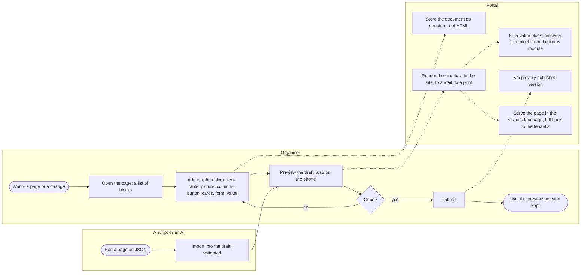
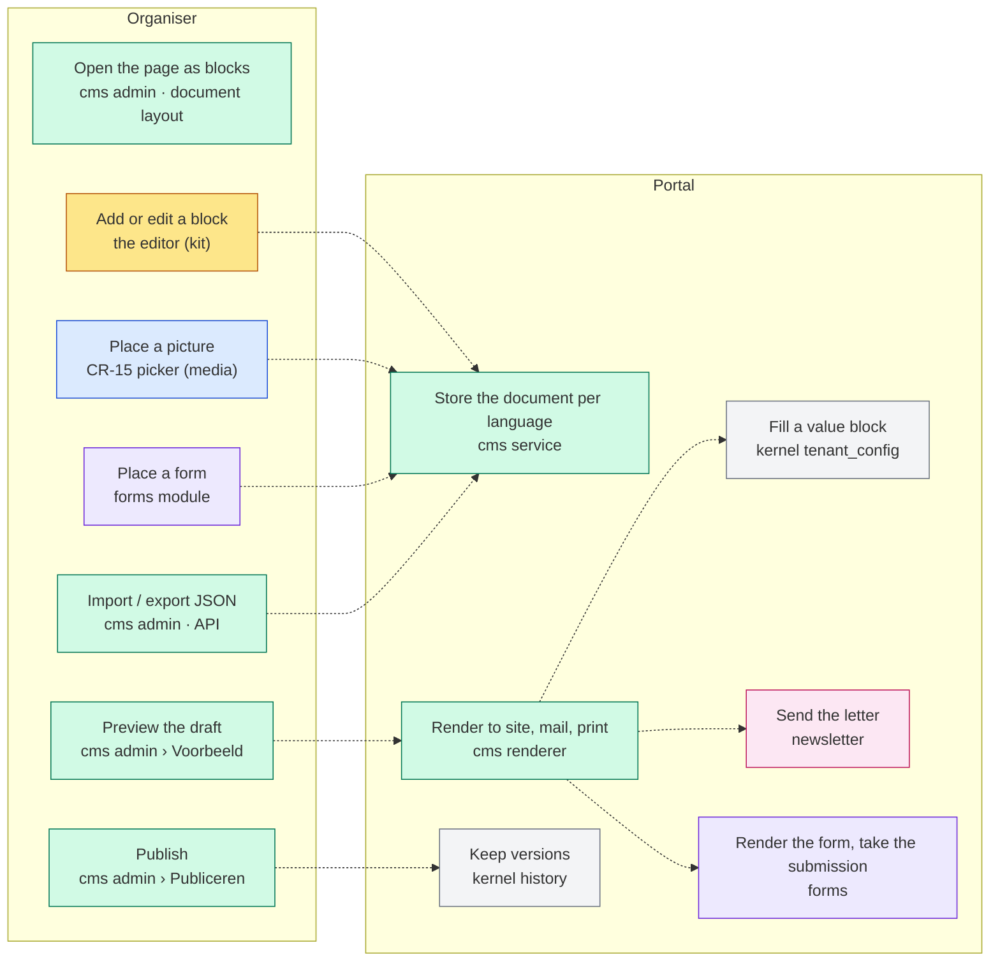
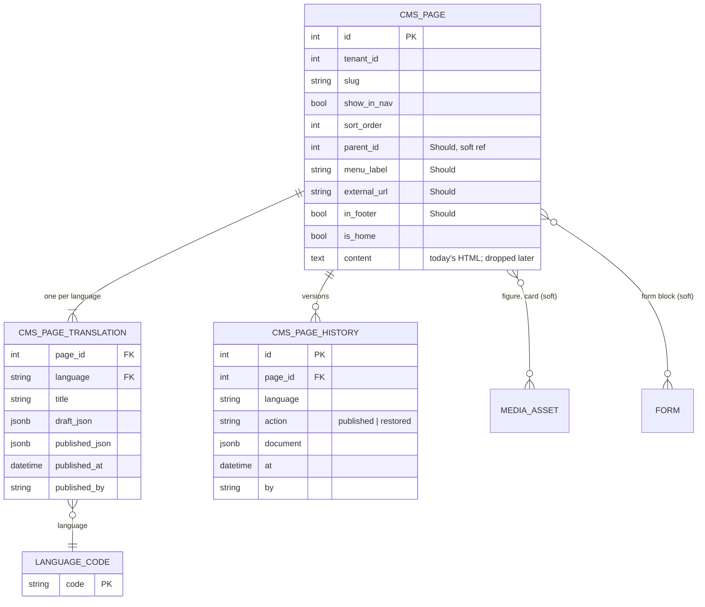

# Change Request 17 — Web content: pages as structured documents, one editor for three places

**Project:** Web Portal "Raak Millegem"
**Status:** shaped on 1 October 2026, reframed on 4 October 2026 (the CMS must carry a company tenant's whole public site; the association's sites do not change) · on hold — Koen answers B8
**Tracking issue:** #1427 — the one place where what is open stands; this document is the design, the issue is the status
**Applies to:** the cms domain (pages, the home blocks, the footer, placeholders, the renderer, the menu); the rich-text editor and its three users (CMS pages, the newsletter, meeting notes); the public page template; the kit macro `ui.rich_text`; the media picker of CR-15; the forms module (a form placed on a page); the public site of a tenant of the kind *company* (CR-19).
**Reading:** A 2724 words · B 3902 · C 3955 — measured on 4 October 2026 with the template's count; **over the budget of A ≤ 1 500, B ≤ 2 500 after the reframing — to be trimmed by moving text to C before the external review**

---

# Part A — The business

## A1. Reason to act — the trigger

On 1 October 2026 Koen asked whether he can put a table on a web page. He cannot: the editor the pages use has no table button and does not know tables; the HTML door beside it lets a table in, and the next edit flattens it to text. The same editor writes the newsletter and the meeting notes, so the limit sits in three places.

Behind the question is how web content is made at all: one long text field per page, a checkbox that publishes it the moment it is saved, no draft, no history, no preview of what is not saved, a flat menu, images through a side door, prices as typed codes between braces. It works for a paragraph.

On 4 October 2026 the frame changed. The sites of the association are good as they are and **do not change**. What the change request serves is the public site of **a tenant of the kind company** (CR-19): a site that consists entirely of CMS pages — sections with a row of clickable cards, a page with a photo beside a heading and a button, a contact page with a form beside the contact details, in Dutch first and in a second language later. Koen's ask: the capabilities of the CMS, talked through first, not built yet; what the editor is, how a page is structured, how it meets the media library, how one editor serves three places, mobile first — and, explicitly, no site builder.

## A2. As-is process — how it works today, and where it hurts

One actor who writes (a board member or the company's administrator, "the organiser") and the portal. Measured on 1 October 2026.


What to see in it: everything a page needs beyond paragraphs goes through the HTML door and does not survive the next edit; publishing is a checkbox with no step between writing and live.

| # | Step | Today | Pain |
|---|---|---|---|
| 1 | Write | Trix, vendored: bold, italic, headings, lists, quote, link, an image from the library, price codes as chips, an HTML-source toggle | **no table**, no columns, no button, no caption, no cards, no form on a page; the toolbar extended differently in each of its three places (CR-11 row 40) |
| 2 | A table anyway | type it in the HTML source | **the editor does not keep it** (measured 19 Sep 2026: only text and links survive its document model) |
| 3 | A picture | the library modal: alt text, three widths; no caption, no placement | a stop in the text, never beside it; no rounded corners, no shadow |
| 4 | A price or a date | type `{{membership_price_full}}` (five codes) | braces in a text |
| 5 | Publish | a checkbox; saving a published page changes it live | **no draft, no history, no preview of the edit** |
| 6 | The menu | "in het menu" per page plus an order; flat; Home, Foto's and Archief fixed | no grouping, no external link, no footer menu — a company site needs all three |
| 7 | A form | the forms module renders a form as a page of its own | no text beside it, no form inside a page |
| 8 | Read on a phone | the page is the full site width, hand-written styles, none for a table | long lines; a table would run off the phone |
| 9 | The newsletter and the notes | the same editor; the newsletter inserts server-made blocks as markers; the notes autosave a plain field | three variants of one tool |
| 10 | A second language | none for content; the app's own words have one catalogue (nl_BE); code lists have labels per language | a company site in two languages is impossible |

The content is stored as raw editor HTML and sanitised at every render; the CSP is `default-src 'self'`, no CDN — whatever replaces the editor is vendored like the current one (203 KB) and loads from the portal itself.

## A3. To-be process — how it should work afterwards



What changes, one line each:

- Step 1: a page is a **document of blocks** — paragraph, heading, list, table, picture with caption and placement, two columns, button, callout, link card, a row of cards, a form, a value — edited in place; on a phone a block at a time.
- Step 2's dead end disappears: a table is a block the editor knows; the HTML door closes.
- Step 3: a picture gets its rounded corners and shadow **from the kit**, never baked into the file; the organiser chooses the picture, the caption and the placement.
- Step 5: **draft and published are two states of one page**; the preview shows the draft; publishing keeps the previous version.
- Step 6: the menu can group pages under a section, carry an external link and a footer menu.
- Step 7: a **form block** places a form of the forms module on a page, beside text in two columns; submissions land where they land today.
- Step 10: a page's title and documents live **per language**; Dutch is filled now, a second language is a row later; the site shows the visitor's language and falls back.
- New: a page's document can be **exported and imported as JSON**, by hand or by a script or an AI, always into the draft and always validated — publishing stays a person's act.
- The newsletter and the notes use **the same editor** with a smaller block set each.

The words the user reads: "Blok invoegen ▾", "Voorbeeld", "Publiceren", "Geschiedenis", "Terugzetten", "Document exporteren (JSON)", "Document importeren (JSON)".

## A4. Benefits — what the change earns

- **A company's public site can be made in the portal**: sections of cards, a photo beside a heading and a button, a contact page with a form beside the details — today impossible without a second product.
- **The page the board wants** exists too: prices and dates in a table, a photo beside the text, a button to the registration.
- **Nothing published by accident, nothing lost**: a draft, a preview, a history.
- **One tool to learn** for pages, the newsletter and the notes.
- **Content from outside**: a page written by a script or an AI enters through one validated door, into the draft.
- **Phones**: 80 % of readers; writing from a phone.
- Not quantified in money; the first line decides.

## A5. Supplied material — and what it taught us

- Koen's question (a table on a page) and his seven points of 1 October 2026 (C4.1–C4.7).
- Koen's three examples of 4 October 2026, described and not reproduced here (an outside site): a contact page with a form at the left and, at the right, the contact details and a boxed list "what happens next"; a photo with rounded corners and a soft shadow beside a heading, a line of text and a button; a section heading over a row of clickable cards, each with an icon, a title, a line of text and two labels. They taught: all three are blocks the schema can hold (two columns, form, callout, figure, button, cards); the picture's look is the kit's; a card is a link to a page; a company site has sections with pages under them; and a language switch in the header.
- The code: `cms/render.py`, `admin_pagina.html`, `_cp_detail.html`, `newsletter/service.py`, `meetings/templates/_vg_punt.html`, `caddy/parts/snippets.caddy` (the CSP), `scripts/build-css.sh`, `static/vendor/` (htmx, alpine, trix 203 KB); the forms module's JSON import of a definition — the precedent for a JSON door; `mdm.language_codes` and the `_labels` tables — labels per language already exist; `tenant_language` — a tenant has a language.
- The decisions that led here: #520 (Trix, Europe First as "no data leaves"); CR-05 decision 10 (one `ui.rich_text` macro); CR-11 row 15, P8 and row 40 (a block editor is its own change request; one toolbar); CR-19 (a company tenant; a CMS page as home, built; "Contacteer ons" as a button to a form).
- The repository carries no licence file; a GPL-licensed editor is a question for the repository.

## A6. Business requirements — what the board asks, with MoSCoW

| # | Requirement | MoSCoW | Source | Comment |
|---|---|---|---|---|
| R1 | A page can hold a table, and the table survives every later edit. | Must | Koen, 1 Oct 2026 | the trigger |
| R2 | A page is built from parts the organiser understands — text, heading, list, table, picture with a caption, two columns, a button, a highlighted note, a link card — each added, moved and removed on its own. | Must | Koen's seven points | blocks |
| R3 | A page has a draft and a published version; the draft can be previewed before it goes live, also as a phone sees it; publishing keeps the previous version and it can be brought back. | Must | author, confirmed 4 Oct 2026 | |
| R4 | A picture on a page comes from the media library and can sit beside the text with a caption; a gallery of an album can be placed; its rounded corners and shadow are the site's, never in the file. | Should | Koen (CR-15; 4 Oct 2026) | the kit styles |
| R5 | A price or a date is placed as a value, not typed as a code, and shows the current value. | Should | author | value block |
| R6 | The newsletter and the meeting notes use the same editor as the pages, each with the parts that make sense there; a letter still arrives as a mail every mail program shows. | Must | Koen, 1 Oct 2026 | |
| R7 | Writing and reading work on a phone: a block at a time to write; reading width, tables and pictures that fit. | Must | Koen, 1 Oct 2026 | |
| R8 | The menu can group pages under a section, carry a link to elsewhere, and the footer can carry its own short menu. | **Should** | Koen, 4 Oct 2026 (was Could) | a company site has sections |
| R9 | The editor and everything it loads are served by the portal itself, from Europe, with no data leaving; no page is built with a tool the tenant does not own. | Must | Europe First, CSP `'self'`, zero Node in the build | |
| R10 | No site builder: no themes, no free placement, no colours or widths per block, no second site per tenant. The organiser chooses blocks; the kit chooses the pixels. | Must (as a limit) | Koen, 1 and 4 Oct 2026 | Non-goals |
| R11 | Embedded video or maps from outside. | Won't | author | the CSP forbids frames; a link card instead |
| R12 | Reporting on pages. | Won't | author | Umami counts visits |
| R13 | A form of the forms module can be placed on a page, beside text; the submissions arrive as today. | Should | Koen, 4 Oct 2026 | form block |
| R14 | A row of clickable cards — icon or picture, title, a line, labels — each a link to a page of the site or to elsewhere, under a section heading. | Should | Koen, 4 Oct 2026 | cards block |
| R15 | Content can exist in more than one language: Dutch first, a second language later without rebuilding; the visitor sees their language and falls back to the tenant's. | Should | Koen, 4 Oct 2026 | the shape now, the switch later |
| R16 | A page's content can be exported and imported as JSON — by a person, a script or an AI — into the draft, validated, never straight to live. | Should | Koen, 4 Oct 2026 | the JSON door |
| R17 | The sites of the association do not change: their pages render identically after the migration; their home stays. | Must (as a limit) | Koen, 4 Oct 2026 | Non-goals |

## A7. Non-functional requirements — security, privacy, house style, tenants

| Concern | This change |
|---|---|
| **Security** | The portal stores a **structure** and renders the HTML itself from a known set of blocks; the sanitiser is a last net. The editor is vendored under the existing CSP and uploads nothing (pictures come through the media library). An imported document is validated against the schema; an unknown block is refused with its name, not stripped. The admin session guards every editing route; the JSON import route needs an API key as every admin route does. |
| **Privacy** | No personal data added. Pictures follow CR-15's rules. Form submissions follow the forms module's. |
| **House style / UI norm** | One editor as one kit component with one toolbar (CR-11 row 40, gate 14); the public typography of pages, tables, pictures and cards is written once in the kit; the admin screens follow the record and document layouts decided in CR-11 blocks 5–9. |
| **Multi-tenant** | Pages, menu and languages are per tenant; the block set and the typography are the platform's; the brand (colours, fonts) is the tenant's brand file (CR-11 beslissing 01) — a company tenant has its own, the association keeps its own. The form block shows only the tenant's forms; the cards link only within the tenant's site or outside. |

## A8. Acceptance criteria — what the business signs off on HDEV

| # | Criterion | Requirement | Walkthrough |
|---|---|---|---|
| AC1 | A table of three columns and four rows is added, published, reopened, edited and published again; still a table, on the site and on a phone. | R1, R7 | 1–4 |
| AC2 | A page is composed of a heading, a text, a picture beside the text with a caption, two columns and a button; each can be moved and removed; the picture has the site's corners and shadow. | R2, R4 | 5–7 |
| AC3 | Editing a published page does not change the site until "Publiceren"; the preview shows the draft at two widths; the previous version is listed and can be restored. | R3 | 8–11 |
| AC4 | The membership price is placed as a value and follows the setting. | R5 | 12 |
| AC5 | The newsletter and the notes use the same editor with their own set; a letter with an activity block arrives in a mail client as before. | R6 | 13–15 |
| AC6 | On a phone a block is added and edited with the thumb; nothing scrolls sideways. | R7 | 16 |
| AC7 | The editor loads from the portal's own origin only; the CSP shows no violation. | R9 | 17 |
| AC8 | A contact page: two columns, a form of the tenant at the left, the contact details and a callout at the right; a submission from the page lands in the workbench; on a phone the form comes first. | R13 | 18 |
| AC9 | A section heading over three cards; each card is a link to a page or elsewhere; the whole card is the target; one per row on a phone. | R14 | 19 |
| AC10 | A document exported as JSON, changed in a text editor, imported: the draft shows the change; a document with an unknown block is refused naming the block; the site is unchanged until Publiceren. | R16 | 20 |
| AC11 | Every page of the association renders the same before and after the migration (a screenshot per page, compared). | R17 | 21 |
| AC12 | A page with a parent appears under its section in the menu; an external item links out; a footer item appears in the footer only. | R8 | 22 |

---

# Part B — The solution, for whoever approves it

## B1. Solution outline — the solution and the decisions that shape it

A page becomes a **structured document**: a tree of blocks in a known schema — paragraph, heading, list, table, picture (caption, placement), two columns, button, callout, link card, cards, form, value — stored as JSON, rendered by the portal to HTML for the site, to mail-safe HTML for the newsletter and to print for the notes. The editor edits that tree in place with one toolbar and one "Blok invoegen ▾" menu; it is a vendored, self-hosted library under the existing CSP. The same editor serves three places with a block set each. A page has a draft and a published document, a preview, a history of published versions, and — from the first phase — its title and documents in a **translation row per language**. Pictures come through CR-15's picker and get their look from the kit. A form block places a form of the forms module; a cards block holds a row of link cards. The menu groups pages under sections. A document can be exported and imported as JSON through the screen and through the JSON API, into the draft, validated. The association's pages are converted losslessly and render identically.

Decisions that shape it, each with the rejected alternative (the reasoning in C4):

- **Structure stored, HTML rendered** (C4.2). Rejected alternative: keep storing editor HTML and sanitise. Only a structure renders four ways and survives edits.
- **One document with block nodes, not a table of block rows** (C4.2). Rejected alternative: a `page_blocks` table with a form per block. A document editor already gives selection, reordering, undo and inline editing.
- **The editor: ProseMirror-based, Europe First — TipTap (Germany, MIT) recommended; CKEditor 5 (Poland, GPL/commercial) the alternative** (C4.1). Rejected alternative: Trix (no document model, measured), bare ProseMirror (too low-level), the non-EU editors. One spike decides (C8).
- **Vendored bundle, zero Node in the repository's build** (C4.1). Rejected alternative: a CDN or a Node build in the repo. The bundle is built once outside the repo and committed, pinned.
- **Draft and published as two documents, versions through `*_history`** (C4.3). Rejected alternative: live on save.
- **Value blocks instead of placeholder codes** (C4.4).
- **The kit styles a picture; the file stays clean** (C4.8). Rejected alternative: rounded corners and shadow baked into the image. The same file serves the poster, the newsletter and the picker.
- **A form on a page is a block that renders the forms module's form** (C4.9). Rejected alternative: intro and side texts inside the forms module. That is a page builder in the wrong module.
- **Cards are a block of link cards; a card is a link** (C4.9). Rejected alternative: hover reveals and labels as filters.
- **Content per language is a translation row, from phase 1** (C4.10). Rejected alternative: columns per language on the page. One language fills a row, a second adds one.
- **One JSON door, into the draft, validated** (C4.11). Rejected alternative: a direct write to the published document. Publishing stays a person's act.
- **No site builder** (C4.7); **the association's sites unchanged** (C4.12).

### B1.1 Functional analysis — the derived requirements

| # | Derived requirement | From |
|---|---|---|
| F1 | A document schema (`cms/schema.py`, one source for the editor's configuration and the renderer): nodes paragraph, heading (2–4), bullet and ordered list, table (header row), figure (media id, caption, placement left · right · full · small), columns (two; aligned top, or middle when one column is a figure), button (label, target, primary/secondary), callout, link_card (icon or media id, title, text, labels, target = a page of the site or a URL), cards (a heading and a list of link cards), form (a form id of the tenant), value (code); marks bold, italic, link, strike. | R1, R2, R5, R13, R14 |
| F2 | Storage: `cms.page_translations (page_id, language, title, draft_json, published_json, published_at, published_by)` — one row per language, the tenant's language first; `cms_pages` keeps slug, menu and flags; `content` kept read-only for the migration and dropped two releases later; `cms_page_history` via `kernel/history.py` with the published document per version and language. | R3, R15 |
| F3 | Rendering: `cms/render.py` renders the schema to site HTML (typography from the kit), to mail HTML (the newsletter's tables and inline styles) and to print (the notes); nh3 stays as the last net. | R1, R6, R7 |
| F4 | The editor: `ui.rich_text(name, blocks=…)` renders the vendored editor with the caller's block set (`page`, `letter`, `notes`), one toolbar, one "Blok invoegen ▾"; the content travels as JSON; autosave for the draft (the document layout, CR-11 block 9). | R2, R6 |
| F5 | The figure block opens CR-15's picker; a gallery block takes an album. The kit renders every figure with the public card radius and the soft shadow; a figure beside text stacks under it on a phone. | R4 |
| F6 | The value block lists the codes of `service.placeholders()` and renders the current value. | R5 |
| F7 | Draft/publish: autosave saves the draft; "Voorbeeld" renders it at 390 and 1 280 px; "Publiceren" copies draft → published and writes the history row; "Terugzetten" restores a version into the draft. | R3 |
| F8 | Public page: the reading width of the kit (768 px), the prose rules for blocks written once; a table scrolls inside its block on a phone; columns stack, the form first. | R7 |
| F9 | The newsletter: block set letter (paragraph, heading, list, figure, button, activity, calendar, closing); the activity and calendar blocks replace the `[[…]]` markers; the newsletter page's three choices decide which activity gets which block — *Uitgelicht* (at most three) an activity block each, *In de kalender* one calendar block (CR-11 Q55, Koen, 4 Oct 2026). The notes: paragraph, heading, list, table; autosave as today. | R6 |
| F10 | Menu (Should): `cms_pages.parent_id` (soft ref in the table), `menu_label`, `external_url`, `in_footer`; the site menu renders sections with their pages; the way back on a page names its section. | R8 |
| F11 | Migration: existing HTML parsed server-side into the schema; a page that does not parse losslessly is listed and keeps its HTML until opened; a screenshot per page before and after (test 19). | R1, R17 |
| F12 | The gate of CR-11 row 40 kept and widened to the new editor; a schema change is a change of `cms/schema.py` and nothing else. | R6, R9 |
| F13 | The form block renders the chosen form through `forms.api` inside the page, with the same fields, validation and submission as the form's own page; the organiser picks a form of the tenant from a list; a form that no longer exists renders a quiet notice in the admin preview and nothing on the site. | R13 |
| F14 | The cards block: a heading and link cards, two or three per row on a desktop, one on a phone; the whole card is the link (the kit's stretched-link pattern), hover and focus ring, the kit's radius and shadow; a card's target is a page chosen from the site's pages (a reference, not a typed URL) or an outside URL. | R14 |
| F15 | Languages: the site serves the visitor's language (the browser's preference, or the switch) when a published translation exists, else the tenant's language; the switch appears in the public header only when a second language has published content (a later phase); the admin shows one language at a time with a selector. | R15 |
| F16 | JSON: "Document exporteren (JSON)" on the page (draft or published); "Document importeren (JSON)" writes the draft after validation; `PUT /api/v1/cms/pages/{id}/draft` does the same with an API key; the schema is served as one JSON Schema file (`GET /api/v1/cms/schema`) so an outside tool knows the blocks; a media reference that does not exist is a validation error. | R16 |

## B2. Fit with the process and the requirements — for the business



Legend: green cms · yellow the kit · blue media · purple forms · grey kernel · pink newsletter.

**Traceability matrix**

| R | How the solution meets it | F | Test (C6) | AC |
|---|---|---|---|---|
| R1 a table that survives | a table block, stored as structure, rendered by the server | F1–F3 | 1, 2 | AC1 |
| R2 built from parts | block nodes in one document | F1, F4 | 3 | AC2 |
| R3 draft, preview, history | two documents, a preview route, `cms_page_history` | F2, F7 | 4–6 | AC3 |
| R4 pictures, styled by the kit | figure and gallery on the picker; radius and shadow in the prose rules | F5 | 7, 11 | AC2 |
| R5 values | the value block | F6 | 8 | AC4 |
| R6 one editor, three places | three block sets, three renderers | F4, F9 | 9, 10 | AC5 |
| R7 phones | reading width; table and figure rules; block-at-a-time | F8, F4 | 11, 12 | AC1, AC6 |
| R8 menu | parent, label, external link, footer flag | F10 | 13 | AC12 |
| R9 served by the portal | vendored bundle, pinned; CSP unchanged | F12 | 14 | AC7 |
| R10 no site builder | Non-goals | — | — | — |
| R13 a form on a page | the form block through `forms.api` | F13 | 16 | AC8 |
| R14 cards | the cards block, a card a link | F14 | 17 | AC9 |
| R15 languages | translation rows; fallback; the switch later | F2, F15 | 20 | — (phase 5) |
| R16 JSON | export, import, the API route, the served schema | F16 | 18 | AC10 |
| R17 the association unchanged | lossless migration, screenshots compared | F11 | 19 | AC11 |
| R11, R12 | Won't | — | — | — |

**Walkthrough on HDEV** (the organiser; a visitor for steps 4 and 18)

1. Open a page. *See:* the page as blocks; a draft badge if unpublished changes exist.
2. Add a table block, three columns, four rows. *See:* a header row; Tab moves between cells.
3. Publish, reopen, change a cell, publish again. *See:* still a table.
4. As a visitor, open it on a phone. *See:* the table scrolls inside its block only.
5. Add a heading, a text, a picture from the library, caption, placement right. *See:* the text flows left of the picture; the picture has rounded corners and a shadow.
6. Add two columns with a text each and a button. *See:* two columns on a desktop, stacked on the phone preview.
7. Move the picture above the heading; remove a text. *See:* the order changed; undo brings it back.
8. Change a word on a published page, do not publish. *See:* the site unchanged; the admin says "concept gewijzigd".
9. Open Voorbeeld. *See:* the draft, desktop and phone.
10. Publish. *See:* Geschiedenis lists two versions.
11. Restore the first. *See:* the draft is the first version; publish to make it live.
12. Add a value block "Lidgeld". *See:* the amount from the settings.
13. Open a newsletter. *See:* the same editor; Blok invoegen ▾ offers Activiteit, Kalender, Afsluiting, Afbeelding, Knop.
14. Insert an activity block, send a test mail. *See:* the block in the mail as today.
15. Open a meeting's notes. *See:* the same editor, autosave; a table can be added.
16. On a phone, add a text block and a picture. *See:* the toolbar reachable; nothing sideways.
17. The browser's console: no CSP violation; the editor from `/static/vendor/`.
18. Make a page "Contact": two columns, the form block "Contactformulier" at the left, a heading, a text and a callout at the right; publish; as a visitor, submit. *See:* the submission in the workbench; on a phone the form first.
19. Make a page with a section heading and three cards, one to a page of the site, one outside. *See:* each card a link; one per row on a phone.
20. Export the page as JSON, change a heading in a text editor, import. *See:* the draft changed, the site not; import a file with a block "slider". *See:* refused: "Onbekend blok: slider".
21. Open each page of the association, before and after the migration. *See:* identical screenshots.
22. Give a page a parent and an external item to the menu. *See:* the section in the menu with its pages; the item links out; a footer item in the footer only.

## B3. The whole across the modules — for the architect

```mermaid
flowchart TB
  subgraph kit[ui — the kit]
    k1[rich_text macro on the new editor, block sets — changed]:::chg
    k2[static/vendor: the editor bundle, pinned — new]:::new
    k3[prose rules: figure radius and shadow, columns, cards, table — new]:::new
  end
  subgraph cms[cms]
    c1[schema.py: the block schema, one source; served as JSON Schema — new]:::new
    c2[render.py: schema → site / mail / print — changed]:::chg
    c3[service: draft, publish, restore, versions, import, export — changed]:::chg
    c4[page_translations; cms_page_history; menu columns — new]:::new
    c5[admin screens: document layout, preview, history, JSON — changed]:::chg
    c6[public page: reading width, language fallback, the menu with sections — changed]:::chg
    c7[migration: HTML → schema, lossless or listed — new]:::new
    c8[api.py: render_document, schema_for, import_draft — changed]:::chg
    c9[router: PUT /pages/{id}/draft, GET /schema — new]:::new
  end
  subgraph media[media — CR-15]
    m1[picker; gallery of an album — used]:::used
  end
  subgraph forms[forms]
    f1[api: render a form inside a page; take the submission — used, one new facade call]:::chg
  end
  subgraph nl[newsletter]
    n1[block set letter; markers gone — changed]:::chg
  end
  subgraph mt[meetings]
    t1[notes on the editor — changed]:::chg
  end
  subgraph kernel[kernel]
    h1[history.py — used]:::used
    h2[tenant_config, tenant_language — used]:::used
  end
  k1 --> c1
  c2 --> h2
  c3 --> h1
  c2 --> f1
  n1 --> c8
  t1 --> k1
  c5 --> m1
  classDef new fill:#d1fae5,stroke:#047857
  classDef chg fill:#fed7aa,stroke:#c2410c
  classDef used fill:#f3f4f6,stroke:#6b7280
```

Legend: green new · orange changed · grey used.

**Data model at a glance**



Who calls whom: the admin screens call the cms service (save draft, publish, restore, preview, import, export) and render the editor through the kit macro, which reads the block set from `cms.api.schema_for`; the public page and the newsletter call `cms.api.render_document(doc, target, language)`; a figure's media id goes through `media.api`; a form block goes through `forms.api.render_embedded(form_id)` and the submission through the forms module's own route; the value block reads `kernel.tenant_config`; the language through `tenant_language`. New dependencies: cms → forms.api (render), newsletter → cms.api (render). Transaction boundary: publish is one transaction (copy, history row). Impact: one new table (`page_translations`), one history table, four menu columns; the association's data converted in place; no JSON route changes shape except the new draft and schema routes.

## B4. Rules this change needs an exception from — decided once, here

| Rule (where) | What the design does instead | Mechanism | Temporary until … / the new rule | Decided |
|---|---|---|---|---|
| "CMS editor is Trix, vendored, file attachments disabled, HTML sanitised at every render" — `docs/design-system.md` (#520) | a ProseMirror-based editor; content as a structured document; HTML rendered by the portal | the design-system text rewritten at phase 1 | **the new rule** (B7) | B8 Q1 |
| "Zero Node in the build" — `AGENTS.md`, #520 | unchanged for the repository's build; the bundle is built once outside the repo and committed, pinned | C6 test 14 | not an exception if the bundle is a committed artifact like `trix.min.js` | B8 Q1 |
| CSP `default-src 'self'` | unchanged; the editor loads from `/static/vendor/` | C6 test 14 | not an exception | — |
| Expand/contract (#1255) | the drop of `cms_pages.content` two releases after phase 1 | the phase table | the rule applied | — |
| CR-11 row 40: one toolbar (gate 14) | kept and widened | C6 test 3 | the gate grows | — |
| "A form renders as its own page" (forms module) | the form block renders the same form inside a page through the facade | F13 | not an exception: the forms module keeps its page; the block is a second rendering of one definition | — |

## B5. Cost — investment and running cost, and what operations must know

**Investment** (CLI-days):

| Module | Ph 0 spike | Ph 1 pages | Ph 2 blocks | Ph 3 letter, notes | Ph 4 menu | Ph 5 languages | Total |
|---|---|---|---|---|---|---|---|
| ui (kit) | 1 | 2 | 1.5 | 0.5 | — | 0.5 | 5.5 |
| cms | — | 5 | 3 | 0.5 | 1 | 2 | 11.5 |
| forms | — | — | 0.5 | — | — | — | 0.5 |
| newsletter, meetings | — | — | — | 2.5 | — | — | 2.5 |
| tests | 0.5 | 1.5 | 1.5 | 1 | 0.25 | 0.5 | 5.25 |
| **Total** | **1.5** | **8.5** | **6.5** | **4.5** | **1.25** | **3** | **~25** |

Plus this analysis, two external reviews, HDEV validation per phase. Purchases: none with TipTap (MIT); CKEditor 5 needs the GPL terms accepted or a licence (Q1).

**Running cost:** none added; the editor is a static file; the history grows by one document per publish.

**Operations:** no env var; the vendored bundle is upgraded like htmx (a pinned file and its checksum); one contract migration (dropping `content`) under expand/contract.

## B6. Phasing — shippable phases, and what changes on the failure paths

| Phase | Delivers | Migration | Data | Failure paths that change | Validation |
|---|---|---|---|---|---|
| **0 — the spike** | TipTap and CKEditor 5 each vendored on a throwaway branch; a table round trip, a custom figure node, the CSP, typing on a phone measured; Koen decides Q1 | none | none | none | C8 |
| **1 — pages as documents** | the schema; the editor macro; the page screen on the document layout with autosave, draft, publish, history, preview; the renderer and the reading-width page with its typography (figure radius and shadow included); `page_translations` with the tenant's language; value blocks; figure through the picker; JSON export and import in the screen, the schema served; the lossless migration with its report and screenshots | additive: `page_translations`, `cms_page_history` | the one-off conversion of pages | a page is no longer live on save; an unknown block is refused with its name | AC1, AC3, AC4, AC6, AC7, AC10, AC11 |
| **2 — the blocks** | table (full), columns with their alignment, button, callout, link card, **cards**, **form**, gallery; the API draft route | none | none | a form that no longer exists renders nothing on the site | AC2, AC8, AC9 |
| **3 — the letter and the notes** | the newsletter on the editor with its set, markers gone, the mail renderer from blocks; the notes on the editor; lazy conversion | none | lazy conversion on first open | a letter that fails the mail renderer is refused at "Versturen…" with the block named | AC5 |
| **4 — the menu** (Should) | parent, label, external link, footer menu; the section in the way back | additive | none | none | AC12 |
| **5 — a second language** (Could) | the language selector in the admin, a second translation row, the fallback, the switch in the public header | none | none | a page without a translation falls back | walkthrough extension |
| **later** | drop `content` two releases after phase 1 | contract | — | — | — |

Dependencies: CR-15's picker is built (v2.13.0); the document and record layouts come from CR-11 blocks 5–9 (decided 3–4 October 2026) and are built with the pilot or carried by phase 1 for the page screen alone; a company tenant exists through CR-19. Phase 0 can start now, independent of the GUI pilot.

## B7. Rule and gatekeeper — what this fixes for all future work

1. **The rule.** *Content a person writes in the portal is stored as a structured document against one schema and rendered by the portal; a screen never stores or trusts browser HTML, never draws its own editor toolbar, never adds a block outside the schema; the look of a block is the kit's, never the content's.* Lives in `docs/design-system.md` and, one sentence, in `docs/code-style.md`.
2. **Reach and baseline.** Every place that edits rich content: three today, each its own variant; after this change one macro, one schema, three sets; four measured workarounds (the HTML toggle, the markers, the attachment-JSON lift, the per-screen toolbar buttons) to zero.

**The gate, in one line:** three hard gates from phase 1 — a node outside the schema is refused on save and on import, toolbar markup outside the macro is red, an unpinned or unvendored script is red (C6 tests 2, 3, 14).

## B8. Open decisions — what the approver still decides

| # | Question | Recommendation | What the answer changes |
|---|---|---|---|
| Q1 | The editor: TipTap (MIT, Germany; a bundle built once outside the repo and committed) or CKEditor 5 (Poland, GPL or commercial, official self-hosted zip, licence key)? | TipTap, after the phase-0 spike on both; the comparison with pros and cons is C4.1. | C4.1; a licence question or none. |
| Q2 | The menu with sections, an external link and a footer menu as a Should in phase 4 — confirmed? | Yes: a company site has sections with pages under them. | Phase 4 exists; four columns. |
| Q6 | Start the spike (phase 0) now, independent of the GUI pilot? | Yes; it needs nothing from CR-11 or CR-15. | The first sub-issue of #1427. |
| Q8 | The activity's description on the same editor later, as a fourth set? | Yes, after phase 1 is stable. | A later phase. |
| Q9 | Merged cells in tables? | Not in phase 1; phase 2 if a real page needs them. | The table node's attributes. |
| Q10 | The form block and the cards block in phase 2 (with the columns they live in)? | Yes, phase 2. | Phase 1 stays smaller. |
| Q11 | A second language: only the public content (phase 5), or also the app's own words (a second gettext catalogue, a separate issue)? | Only the content, for the public site; the back office stays Dutch unless asked. | An extra issue or none. |

## B9. Decisions log — dated answers

| Date | Decision | By |
|---|---|---|
| 18 Jul 2026 | Trix as the CMS editor: self-hosted, no CDN, zero-Node prebuilt file (#520). | Koen |
| 16 Sep 2026 | One `ui.rich_text` macro for every editor (CR-05 decision 10). | Koen |
| 30 Sep 2026 | A block editor is its own change request; TipTap named as the EU candidate (CR-11 row 15, P8). | Koen |
| 1 Oct 2026 | A change request for web content management as a whole, talked through first; no site builder. | Koen, via the master CLI |
| 4 Oct 2026 | **The frame**: the association's sites do not change; the change request serves the public site of a tenant of the kind company (CR-19), kept abstract — no name, no screenshots of the examples; the CMS's capabilities are the subject. | Koen |
| 4 Oct 2026 | A form of the forms module on a page: a **form block** (R13); a row of clickable cards: a **cards block** whose card is a link to a page or elsewhere (R14); the look of a picture (rounded corners, shadow) is the kit's, never baked into the file (R4); two columns align top, or middle when one is a figure. | Koen |
| 4 Oct 2026 | Content per language as a translation row from phase 1, the switch and a second language later (R15); the public site only, the back office Dutch (Q11 proposed). | Koen |
| 4 Oct 2026 | A JSON door for a page's content — export, import into the draft, the API route, the schema served — as a Should (R16). | Koen |
| 4 Oct 2026 | The menu (sections, external link, footer) from Could to Should (R8). | Koen |
| 1 Oct 2026 | *Proposed:* C4.1–C4.7 as written; TipTap recommended, CKEditor 5 the alternative, decided after the spike. | author |

---

# Part C — The build, for the master CLI and the dev CLIs

## C1. Verified premises — measured before the handover

| Claim | Measured how | Result | Consequence |
|---|---|---|---|
| Trix keeps no table through an edit | `newsletter/service.py:946-951` (19 Sep 2026); no `table` handling in `admin_pagina.html` | true | the editor must change (C4.1) |
| The sanitiser allows tables but nothing styles them | `cms/render.py:25-63`; `site_base.html:60-96`; `build-css.sh` has no typography plugin | true | the prose rules (C2 kit) |
| Content is stored as raw editor HTML and sanitised at every render | `cms/service.py:94`; `render.py:227-235` | true | C4.2 |
| A page has one `content` field, `is_published`, no draft, no version | `cms/models.py:9-33`; no `cms_*_history`; `kernel/history.py` exists | true | C4.3 |
| The preview shows the saved state, not the edit | `cms/admin_ui.py:285-316` | true | C4.3 |
| Five placeholders replaced by `str.replace` at render | `render.py:173-179, 214-235` | true | C4.4 |
| The CSP is `default-src 'self'` with inline scripts allowed, no CDN | `caddy/parts/snippets.caddy:26` | true | vendored editor; test 14 |
| The repository's build has no Node; vendored JS is htmx 2.0.4, alpine 3.14.8, trix 2.1.15 (203 KB) | `scripts/build-css.sh`; `static/vendor/`; no `package.json` | true | a committed bundle, pinned |
| The newsletter inserts markers and builds them at send; the notes autosave a plain field | `newsletter/service.py:41,965,1021`; `meetings/templates/_vg_punt.html:89-102` | true | phase 3 |
| A CMS page renders at the site's full width (about 1 248 px of text at 1 440 px) | `site_base.html:244` | true | reading width |
| The repository carries no licence file | `ls LICENSE*` | none | Q1 |
| The forms module imports a definition as JSON; a form renders as its own page | the form builder's "Definitie importeren (JSON)"; `forms/ui.py` | true | the precedent for F16; F13 renders the same definition inside a page |
| A tenant has a language; code lists carry labels per language | `kernel/tenant_config.tenant_language`; `mdm.language_codes`, the `_labels` tables | true | F2's `language` FK; F15's fallback |
| A CMS page can be the home page | CR-19 J3 (`cms_pages.is_home`), built on v2.13.0 | true | a company site starts from a page |
| *To measure before phase 2:* what the forms module needs to render a form outside its own page (CSRF, the submission route, the thank-you) | `forms/ui.py`, the public form template | — | F13's facade call |

## C2. Per module: what must happen

#### ui — the kit (phases 1–2)

- **Screens:** the design-system page renders the editor with every block of every set, and the public prose rules (figure with its radius and shadow, columns, cards, table) as live examples; judged at 390 px.
- **Code:** `rich_text(name, blocks, value_json, autosave_url=None)`; the editor bundle under `static/vendor/<editor>-<version>.js|css` with its checksum in `scripts/vendor-manifest.txt`; the editor configuration generated from `cms.api.schema_for(set)` into a `<script type="application/json">`.
- **Templates:** `_macros.html` (the macro), `admin_base.html` (the one load), the prose rules in `build-css.sh`'s config as hand-written utilities for `.prose-raak` (tables, figures with `rounded-[14px]` and the card shadow, columns top/middle, cards grid); `site_base.html` and `admin_base.html` lose their hand-written `.cms-content` rules.
- **Tests:** C6 3, 9, 11, 14, 17.

#### cms (phases 1, 2, 4, 5)

- **Screens:** `/admin/paginas/{id}` on the document layout (CR-11 blocks 5 and 9): title and slug in the header editor, a language selector (one language shown at a time; phase 1 shows the tenant's), the document with autosave of the draft, the actions Voorbeeld · Publiceren · Geschiedenis, and in Acties: Document exporteren (JSON) · Document importeren (JSON); `/voorbeeld` renders the draft with a width switch; `/geschiedenis` lists versions with "Terugzetten"; the list shows a draft badge and, in phase 5, the languages a page has.
- **Code:** `schema.py` (the schema as data: node types, attributes, sets; exported as JSON Schema); `render.py` (three targets; the form node calls `forms.api.render_embedded`; the cards node resolves page references to URLs; nh3 on the result); `service.save_draft`, `publish`, `restore`, `versions`, `parse_html` (F11), `import_draft(page_id, language, document)` (validation, then save_draft), `export_document`; `api.py` exports `schema_for`, `render_document`, `placeholders`, `import_draft`; `router.py` adds `PUT /api/v1/cms/pages/{id}/draft` (API key, `?language=`) and `GET /api/v1/cms/schema`.
- **Database:** phase 1, additive: `cms.page_translations (page_id INT NOT NULL REFERENCES cms.cms_pages(id) ON DELETE CASCADE, language VARCHAR(5) NOT NULL REFERENCES mdm.language_codes(code), title VARCHAR(200) NOT NULL, draft_json JSONB NULL, published_json JSONB NULL, published_at TIMESTAMPTZ NULL, published_by VARCHAR(255) NULL, PRIMARY KEY (page_id, language))`; `cms.cms_page_history (id, page_id FK CASCADE, language VARCHAR(5) NOT NULL, action VARCHAR(20) NOT NULL CHECK (action IN ('published','restored')), document JSONB NOT NULL, at TIMESTAMPTZ NOT NULL, by VARCHAR(255))`; the migration moves `title` and `content` (parsed) into the row of the tenant's language; `cms_pages.title` kept one release, then dropped with `content`; phase 4: `parent_id INT NULL`, `menu_label VARCHAR(80) NULL`, `external_url VARCHAR(500) NULL`, `in_footer BOOL NOT NULL DEFAULT false`. Check the CHECK constraints of `cms_pages` before touching flags (the `media_assets.kind` lesson).
- **Templates:** `admin_pagina.html` and `_cp_detail.html` shrink to the layout plus the macro; `cms_pagina.html` on the reading width; the public menu renders sections (phase 4); the public header renders the language switch when a second language has published content (phase 5).
- **Tests:** C6 1, 2, 4, 5, 6, 8, 12, 13, 16, 18, 19, 20.

#### forms (phase 2)

- **Code:** `api.render_embedded(form_id, tenant_id)` returns the form's fields as the same partial the form page uses, with the form's own action route, CSRF and thank-you behaviour; the form block passes the page as the return target. The forms module keeps its own page and share link; the block is a second rendering of one definition. *Measure first* (C1's last row) what the public form template needs outside its page.
- **Tests:** C6 16.

#### media (used)

- The figure block uses the picker; the gallery block uses the album; a link card's picture is a media id. CR-15 is built.

#### newsletter and meetings (phase 3)

- As before: the editor with the letter set; `_clean_body` becomes a schema validation; the mail renderer from blocks; the notes on the macro with the notes set, autosave unchanged. Tests C6 10.

#### reporting — none

## C3. Cross-cutting impact — the checklist of what gets forgotten

| Row | Answer |
|---|---|
| Reporting views and saved reports | no |
| Existing tests, e2e flows, 390 px screenshots | yes — the CMS, newsletter and notes editor e2e and their screenshots are redone; the public page screenshots of the association must stay identical (test 19) |
| Fixed UI decisions and `AGENTS.md` | yes — "CMS editor is Trix" in the design system and the row-15 reference are rewritten at phase 1 (proposed to the master CLI) |
| Design-system documentation | yes — the editor as a component, the prose rules, the block set table, the cards and form blocks |
| Code lists | `language_codes` reused; the block types are code (`schema.py`), not data |
| Events and handlers | no |
| Mail templates | yes — the newsletter's HTML from blocks (phase 3); three mail clients checked as CR-05 did |
| Migration: additive or contract | additive in phases 1 and 4; one contract migration (dropping `content` and `cms_pages.title`) two releases after phase 1 |
| Tenant settings | no new ones; `tenant_language` read |
| Env vars | no |
| JSON routes and API callers | `GET /pages/{slug}` keeps returning rendered HTML (`?language=` optional); `PUT /admin/pages/{id}` with `content` HTML kept one release then removed; new: `PUT /api/v1/cms/pages/{id}/draft`, `GET /api/v1/cms/schema` |
| External services | no |
| Modules per tenant (CR-19) | the form block is offered only when the tenant has the forms module; the value block only with membership values that exist for the tenant's kind |

## C4. Detailed decisions — one subsection each, with the reasons

### C4.1 The editor — Europe First, self-hosted, zero Node in the build

The requirements: a real document model that keeps tables and custom blocks (Trix fails this by design — measured); block nodes we define; a single-file build we can vendor under `static/vendor/` and load under `default-src 'self'`; mobile editing; an EU origin; a licence the repository can carry; no data leaving.

| Candidate | Origin, licence | Document model, tables, custom blocks | Vendorable without Node in the repo | For | Against | Verdict |
|---|---|---|---|---|---|---|
| **Trix** (today) | USA (37signals), MIT | **no** — keeps only text, links and attachments | already vendored, 203 KB | known, small, the macro exists | misses the core: no table, no custom block, no structure; 430 lines of hand-added features around it | fails R1 |
| **TipTap** | Germany (Tiptap GmbH), MIT (core and open extensions incl. table), on ProseMirror | yes — nodes and marks are the schema; custom nodes first class | no official single-file build: bundled once outside the repo (esbuild), committed, pinned by checksum | fits "blocks as JSON, HTML as rendering" exactly; light; EU; active | the bundle is an artifact we build and keep (Node once, on a machine, outside the repo); the UI (toolbar, menus) is our work on its API | **recommended** |
| **CKEditor 5** | Poland (CKSource), GPL 2+ or commercial; a licence key required since v44 (a GPL key is free) | yes — tables, captions, image styles out of the box; custom blocks through its plugin system, heavier | official self-hosted zip, no Node | everything out of the box; official builds; EU | heavy (over 1 MB); the GPL in a repository without a licence file or a paid licence; a key in the code; custom blocks more work | the alternative, licence first |
| ProseMirror bare | Netherlands, MIT | yes — the engine | as TipTap | lightest, EU | an engine only: toolbar, menus, table handling to write ourselves — days more | too low-level |
| Editor.js, Quill, Lexical, Slate, Toast UI | RU / US / US / US / KR | — | — | — | not EU | out |

Recommendation: **TipTap** — a page is one ProseMirror document whose node types are our blocks, stored as the JSON TipTap emits, rendered by our Python renderer from the same schema; the repository's own build stays Tailwind-standalone and Python only. If Koen prefers an official self-hosted build over a committed one, CKEditor 5 is the answer and the GPL question comes first. The spike (C8) proves both on four points: a table round trip, a custom node, the CSP, a phone.

### C4.2 A page is one structured document; blocks are its nodes; HTML is a rendering

The content is stored as the editor's **JSON document** against a schema in one Python module (`cms/schema.py`) that also generates the editor's configuration and is served as JSON Schema. The server renders it to site HTML, to mail HTML, to print; nh3 sanitises the *output* as a last net. Not a `page_blocks` table: a document editor already gives selection, reordering, undo and inline editing; rows would rebuild that as forms and make "two columns with a table in the left one" a tree in SQL.

The block set, phase 1 and 2: paragraph, heading (2–4), lists, link, bold, italic, strike; **table** (header row; `colspan` phase 2 if asked); **figure** (media id, caption, placement left · right · full · small); **columns** (two sub-documents; aligned top, middle when one is a figure); **button** (label, target, primary/secondary); **callout**; **link card** and **cards**; **form**; **value**. The newsletter adds activity, calendar, closing; the notes have paragraph, heading, lists, table.

### C4.3 Draft, published, versions, preview

A translation row carries `draft_json`, autosaved as the organiser types (the document layout: autosave in the facts line, CR-11 beslissing 09), and `published_json`, written only by "Publiceren". The site renders `published_json`; the preview renders the draft at desktop and 390 px. Publishing writes a history row (document, language, time, person). "Terugzetten" copies a version into the draft; publishing it makes it live. `is_published` means "has a published document in the tenant's language". No scheduled publishing.

### C4.4 Value blocks, not codes

The five placeholders become a **value block** chosen from "Blok invoegen ▾ › Waarde", shown in the editor as a chip with the current value, rendered as the current value from `tenant_config`; the migration maps `{{code}}` to a value node. A company tenant without membership values sees only the values its kind has (CR-19).

### C4.5 One editor, three places, three block sets

`ui.rich_text(name, blocks="page"|"letter"|"notes")` renders the same editor with the set the schema names; the toolbar and the "Blok invoegen ▾" menu are the macro's (gate 14). The newsletter's activity and calendar blocks are nodes whose data the newsletter supplies at render time. The notes keep autosave and gain a table.

### C4.6 Mobile first, reading and writing

Reading: reading width (768 px); a table scrolls inside its own block on a phone (CR-11 Q14's declared exception); a figure beside text stacks under it below 640 px; columns stack with the form first; cards one per row. Writing: block-at-a-time; the sticky toolbar; "Blok invoegen ▾" as a bottom sheet; a 44 px block handle. The spike measures typing a table on a phone.

### C4.7 Not a site builder

No themes, no free placement, no per-page templates, no colours or widths per block, no plugin system, no embeds. The organiser chooses blocks; the kit chooses the pixels: a photo beside text always looks the same, a row of cards always looks the same. What a tenant cannot express with the blocks is a change to the schema, decided here. (Forms inside pages were a non-goal on 1 October; the form block of 4 October is a block of the schema, not a builder.)

### C4.8 The look of a picture is the kit's, never the file's

A figure, a card's picture and a gallery item render with the public card radius (14 px) and the soft shadow of CR-11 beslissing 01, by the prose rules, for every picture. The organiser chooses the picture, the caption and the placement; nothing else. The file stays clean because the same asset serves the poster (Design Studio), the newsletter (mail knows no shadow) and the picker. Changing the look later is one place.

### C4.9 A form on a page, and cards

**Form block**: a node holding a form id of the tenant; the renderer asks `forms.api.render_embedded` for the form's fields and submission route, so the page shows the same form the forms module shows on its own page — same validation, same thank-you, same submission into the workbench; two renderings of one definition, no copy. Placed in two columns it gives the contact page: the form at the left, the details and a callout at the right, the form first on a phone. **Cards block**: a heading and a list of link cards (icon from the kit's vocabulary or a picture, title, one line, labels as plain text); two or three per row, one on a phone; the whole card is the link (the stretched-link pattern); a card's target is a page chosen from the site's pages — a reference that survives a slug change — or an outside URL. No hover reveal: a card that is a link says so with its cursor and focus; a phone has no hover. Labels do not filter: a page is not a list.

### C4.10 Content per language

"Build what is needed in the shape that grows": a page's title and documents live in `page_translations` keyed by (page, language) from phase 1, with the tenant's language as the only row; a second language is a row, not a column. The site serves the visitor's language (the browser's `Accept-Language` or the switch) when a published translation exists, else the tenant's language; the switch appears only when a second language has published content. One slug per page, the language in a prefix (`/en/…`) — or a slug per language — is the one open question for phase 5. The app's own words (gettext) and the back office stay Dutch unless Koen asks (Q11); code-list labels already exist per language.

### C4.11 One JSON door

A page's document is data, and data has a door: export (draft or published) and import into the draft, through the screen and through `PUT /api/v1/cms/pages/{id}/draft` with an API key — the same validation as the editor's save, an unknown block or attribute refused with its name, a media reference that does not exist refused, nothing stripped silently. The schema is served as one JSON Schema file so a script or an AI knows the blocks before it writes. Publishing stays a person's act, with the preview before it. The Assistent (CR-11 block 10), when it writes a page, uses the same door: one validation, one draft.

### C4.12 The association's sites do not change

The migration converts every existing page losslessly into a document (test 12) and the renderer produces the same page (test 19: a screenshot per page, before and after, compared); the association's home composition, menu and look stay; its brand file stays. New blocks are available to it but nothing on its site uses them until an organiser does.

## C5. Privacy and security — the mechanics behind A7

The stored content is a JSON document validated against the schema on save and on import (unknown node types and attributes refused, not stripped); the HTML the site serves is generated by the renderer, so an `on*` attribute, a `javascript:` URL or an unknown tag has no way in except through a renderer bug — nh3 on the output catches that. A card's outside URL is `http(s)` only, with `rel="noopener noreferrer"`. The form block renders the forms module's form with its CSRF and validation; a submission is the forms module's. The import route needs an API key and the tenant's scope; it can touch the draft only. The editor loads from the portal's origin under the unchanged CSP; it fetches nothing. The history rows hold a person only in the "by" column.

## C6. Tests — what the build must prove

1. **A table survives.** Saved, loaded into the editor (e2e), edited, saved: the node unchanged except the edit; the site renders `<table>` with a header row. Red on Trix.
2. **Schema is one source.** The editor configuration and the served JSON Schema are generated from `cms/schema.py`; a node added appears in both and in the renderer's dispatch; a node not in the schema is refused on save with its name (proven by posting one).
3. **One toolbar.** No editor toolbar markup or configuration in a domain template (gate 14, widened).
4. **Draft is not live.** Saving a draft leaves `published_json` and the site unchanged; "Publiceren" changes both and writes exactly one history row.
5. **Preview shows the draft** at two widths.
6. **Restore is not live.** "Terugzetten" writes into `draft_json` only.
7. **Figure through the picker.** A media id the picker offered; resolved through `media.api`.
8. **Value is current.** A value node renders the amount from `tenant_config`; a migrated `{{code}}` became a value node.
9. **Three sets.** `notes` offers no figure or button; `letter` offers activity and calendar; `page` offers neither; an unknown set is a `ValueError`.
10. **Mail from blocks.** A letter with an activity and a calendar node renders to the same HTML the markers produced (snapshot on the old code); the notes render to print.
11. **Reading width, tables and pictures on a phone.** The content column is 768 px at desktop and the viewport minus 32 px at 390 px; a table's block scrolls inside itself while the page does not; a figure beside text stacks below 640 px; a figure carries the 14 px radius and the card shadow (computed style).
12. **Migration is honest.** `render(parse(html))` equals the sanitised html modulo whitespace for every seeded page; the ones it cannot are listed and still render.
13. **Menu (phase 4).** A page with a parent renders under it; an external item links out with `rel`; a footer item appears in the footer only.
14. **Vendored and pinned.** The bundle's checksum matches the manifest; no `<script src>` outside `/static/`; the CSP header unchanged.
15. **The bar does not cover a field** at 390 px.
16. **The form block.** A page with a form node renders the form's fields; a submission from the page lands as a submission of that form (workbench) with the page as return target; a form id of another tenant or a deleted form renders nothing on the site and a notice in the admin preview; a tenant without the forms module cannot insert the block.
17. **Cards.** Three cards render as links (the whole card, `a` with the stretched pattern); a card to a page follows a slug change; one per row at 390 px (DOM measurement).
18. **The JSON door.** Export → import round-trips a document unchanged; a document with an unknown block is refused with "Onbekend blok: <name>" and the draft untouched; the API route refuses without a key and cannot write `published_json`; a media id that does not exist is refused.
19. **The association unchanged.** A screenshot per seeded association page before and after the migration, compared pixel-exact (the e2e screenshot set); red on any difference.
20. **Language fallback.** A page with a translation in the tenant's language only renders that language for a visitor asking for another; with two published translations each visitor sees their own; a draft in the second language is not served.

**Impact on the test landscape:** the CMS, newsletter and notes editor e2e are rewritten; the public page screenshots of the association become a comparison, not a new baseline; the render tests become renderer tests per target; the sanitiser tests stay as output tests.

## C7. The gate — what refuses a deviation from now on

C6 tests 2, 3 and 14 are hard from phase 1: a node outside the schema is refused on save and on import; toolbar markup outside the macro is red; an unpinned or unvendored script is red. Test 19 is hard from phase 1 too: a changed association page is red. What stays with judgment: whether a new block belongs in the schema — decided in this document's Q&A.

## C8. Prototype findings — what was measured before the build

Phase 0 measures and records here: the vendored size of each candidate (Trix is 203 KB today); a table round trip in each; a custom figure node with caption and placement in each; the CSP report with the bundle loaded; typing a three-column table on a phone in each (time, errors); the licence terms of CKEditor 5's GPL key for this repository. Already measured on 1 October 2026: Trix keeps no table; the sanitiser allows tables but nothing styles them; pages render at 1 248 px of text width on a 1 440 px screen; the admin editor's hand-added features total 430 lines across two files.

## C9. Screens before the build — the concepts the approver saw

Not yet made. Before the handover, concepts at 390 px and at desktop width: the page editor with a heading, a text, a picture beside the text, a table, a button and a cards block, with the toolbar and the "Blok invoegen ▾" menu; the public page of that document at reading width; a contact page with the form block in two columns; the newsletter editor with an activity block. Invented data, in Koen's project folder outside the repository (`CR17 webinhoud/`), never in the repository; the date he looked at them goes here.

## C10. Close-out at the release

Not yet: on hold, nothing built. Filled in when the release that builds this change runs on PROD (release step 14).

---

## Q&A log — asked once, answered here

| # | Date | Question (who) | Answer |
|---|---|---|---|
| Q1 | 1 Oct 2026 | The editor: Trix with extensions, or another one — under Europe First, self-hosted, zero Node in the build, CSP `'self'`? (master CLI, for Koen) | C4.1: not Trix (no document model, measured); TipTap recommended, CKEditor 5 the alternative; a spike on both decides. Koen asked for the comparison with pros and cons on 4 Oct 2026: C4.1's table, Trix included. |
| Q2 | 1 Oct 2026 | Page structure: blocks versus one HTML field; templates, menu, draft and publish, versions, preview? (master CLI) | C4.2 one document of block nodes; no page templates; C4.3 draft/published/history/preview; the menu in phase 4 — a Should since 4 Oct 2026 (R8). |
| Q3 | 1 Oct 2026 | Media: the link with the library of CR-15? (master CLI) | F5: the figure block opens CR-15's picker, the gallery block takes an album; CR-15 is built (v2.13.0). |
| Q4 | 1 Oct 2026 | Placeholders and dynamic blocks? (master CLI) | C4.4: value blocks from the same codes; the newsletter's activity and calendar become blocks. |
| Q5 | 1 Oct 2026 | One editor for CMS, newsletter and meeting; what each may do? (master CLI) | C4.5: one macro, three sets. |
| Q6 | 1 Oct 2026 | Mobile first; and the order with CR-11 and CR-15? (master CLI) | C4.6. The order question dissolved on 4 Oct 2026: CR-15's picker is built, CR-11's document layout is decided per block; phase 0 can start now (B8 Q6). |
| Q7 | 1 Oct 2026 | Deliberately not: no site builder? (master CLI) | C4.7 and Non-goals. |
| Q8 | 1 Oct 2026 | The activity's description on the same editor later? (author) | *Proposed:* yes, a fourth set after phase 1. *Koen decides.* |
| Q9 | 1 Oct 2026 | Merged cells in tables? (author) | *Proposed:* not in phase 1. *Koen decides.* |
| Q10 | 4 Oct 2026 | Which site is this for? (Koen) | Not the association's: those sites are good and do not change (R17, C4.12). The public site of a tenant of the kind company (CR-19), kept abstract here; the CMS's capabilities are the subject. |
| Q11 | 4 Oct 2026 | A text beside a contact form, as on an outside site Koen showed? (Koen) | A **form block** (R13, C4.9) in two columns: the forms module's form rendered inside the page, submissions as today; not intro and side texts inside the forms module. Phase 2 (B8 Q10). |
| Q12 | 4 Oct 2026 | Something decent graphically — a picture with rounded corners and a shadow: in the CMS or in an image editor? (Koen) | In the kit (R4, C4.8): every picture gets the site's radius and shadow by rule; the file stays clean because it also serves the poster and the mail. A photo beside a heading, a text and a button is the columns block with middle alignment. |
| Q13 | 4 Oct 2026 | Clickable cards, to a sub-page for instance? (Koen) | A **cards block** of link cards (R14, C4.9); a card's target is a page chosen from the list or an outside URL; sections with pages under them are the menu of phase 4 (R8, now a Should). |
| Q14 | 4 Oct 2026 | Multilingual content, Dutch first, English foreseen? (Koen) | Three layers: the app's words (gettext, one catalogue), code-list labels (already per language), content (none). Content gets a translation row per language from phase 1 (R15, C4.10); the switch and a second language in phase 5; the back office stays Dutch unless asked (B8 Q11). |
| Q15 | 4 Oct 2026 | Content changed from outside through JSON, in the age of AI — a Should? (Koen) | Yes (R16, C4.11): export and import into the draft through the screen and the API, validated against the served schema; publishing stays a person's act; the Assistent uses the same door later. |
| Q16 | 4 Oct 2026 | Screenshots of the outside examples in the document? (Koen) | No: described in words in A5, abstract, no name — the repository is public. Concepts for C9 go in Koen's project folder, never in the repository. |

## Non-goals — deliberately outside this change

- A site builder: themes, free placement, per-page templates, colours or widths per block, a plugin system, a second site per tenant (R10).
- Embedded frames (video, maps): the CSP forbids them; a link card instead (R11).
- Comments, search, scheduled publishing, approval workflows.
- Reporting on pages (R12).
- Changing the association's sites, their home, their look or their menu (R17); the public shell of CR-11 is a separate track.
- Translating the back office or the app's own words (B8 Q11).

## Relationship to existing work — issues and change requests

- **#1427** — the tracking issue of this change.
- **#520, #555, #1173, #1224, #1230** — Trix adopted, extended by hand; the workarounds this change removes.
- **CR-05** — the newsletter's editor and markers; phase 3 replaces the markers.
- **CR-09** — the meeting notes' autosave; phase 3 keeps it.
- **CR-11** — P8 (this change), row 15, row 40 (one toolbar, gate 14), beslissing 01 (the brand file per tenant, the public radius and shadow), blocks 5–9 (the record and document layouts), block 10 (the Assistent writing through the JSON door), Q14's declared exception for a data table.
- **CR-15** — the picker and the library, built on v2.13.0; the figure, gallery and card pictures.
- **CR-19** — a tenant of the kind company; a CMS page as home (built); modules per tenant (the form block only with the forms module); the button to a form on a company page.
- **The forms module** — the form block renders its definition; its JSON import is the precedent for the JSON door.
