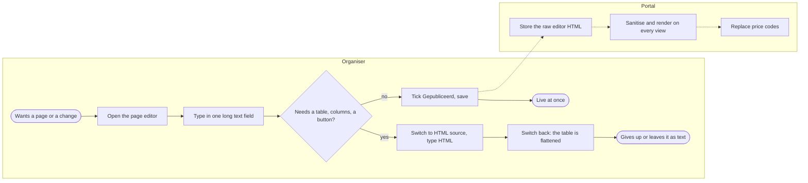
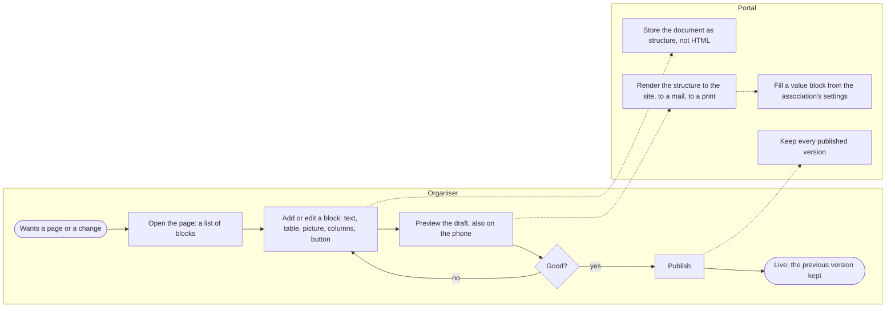
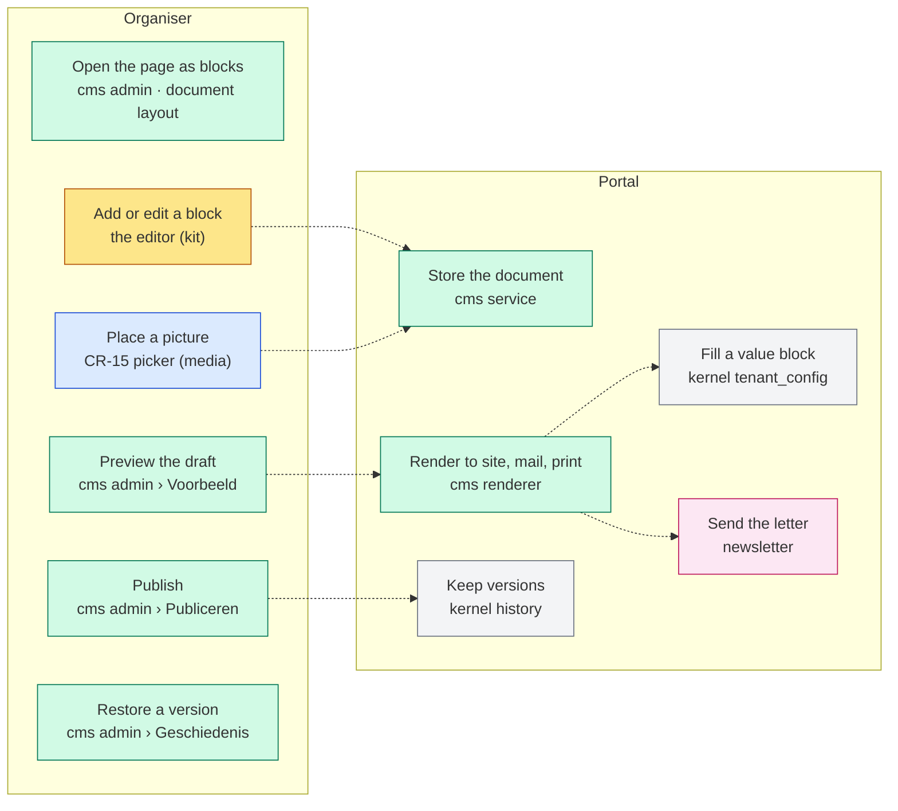
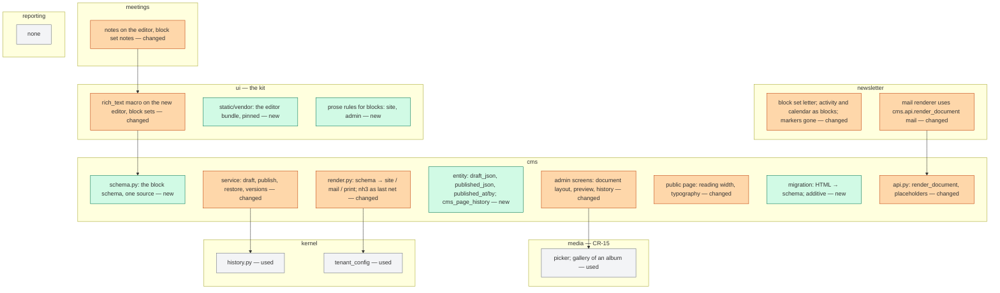
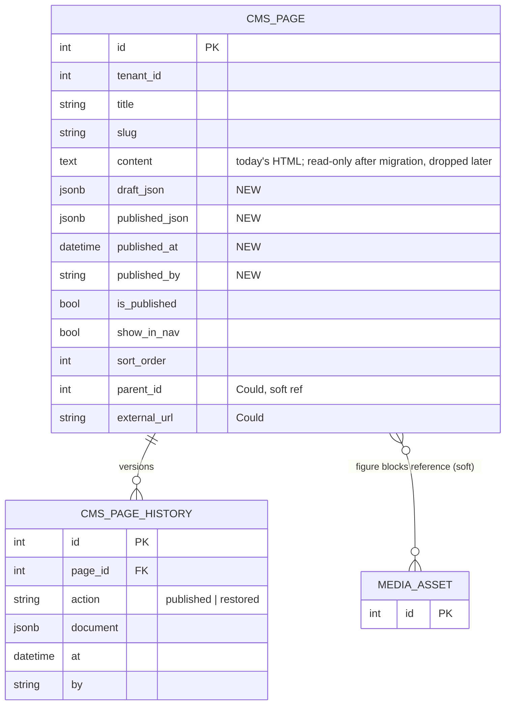

# Change Request 17 — Web content: pages as structured documents, one editor for three places

**Project:** Web Portal "Raak Millegem"
**Status:** shaped on 1 October 2026 · on hold — Koen walks through it first; nothing is built
**Tracking issue:** #1427 — the one place where what is open stands; this document is the design, the issue is the status
**Applies to:** the cms domain (pages, the home blocks, the footer, placeholders, the renderer); the rich-text editor and its three users (CMS pages, the newsletter, meeting notes); the public page template and the site menu; the kit macro `ui.rich_text`; the media picker of CR-15.
**Reading:** A 2284 words · B 3388 · C 3308 — words to read, drawings excluded, measured on 2 October 2026; the budget is A ≤ 1 500, B ≤ 2 500

---

# Part A — The business

## A1. Reason to act — the trigger

On 1 October 2026 Koen asked whether he can put a table on a web page. He cannot. The editor the pages use has no table button and does not know tables; the HTML door next to it lets a table in, and the next edit flattens it to text. The same editor writes the newsletter and the meeting notes, so the same limit sits in three places.

Behind the one question is the whole of how the association's web content is made: one long text field per page, a checkbox that publishes it live the moment it is saved, no draft, no history, no preview of what is not yet saved, a menu that is a flat list of titles, images placed through a side door, prices that are typed codes between braces. It works for a paragraph. It does not work for the page the board actually wants: a table of prices and dates, two columns, a photo with a caption beside the text, a button "Schrijf je in" — and it does not work on a phone, where most of the reading and a growing part of the writing happens.

Koen's ask: a change request for web content management as a whole, talked through first, not built yet; what the editor is, how a page is structured, how it meets the media library (CR-15), what the placeholders become, how one editor serves three places, mobile first — and, explicitly, no site builder.

## A2. As-is process — how it works today, and where it hurts

One actor who writes (a board member, "the organiser") and the portal. Measured on 1 October 2026 on the branch.

| # | Step | Who | Today | Pain |
|---|---|---|---|---|
| 1 | Open a page | organiser | `/admin/paginas/{id}`: title, slug, one rich-text field, "in het menu", "gepubliceerd" | fine for a paragraph |
| 2 | Write | organiser | Trix 2.1.15, vendored: bold, italic, headings (two added by hand), lists, quote, link, an image from the library, price codes as chips, an HTML-source toggle | **no table**, no columns, no button, no caption, no alignment; the toolbar is the editor's, extended differently in each of its three places (CR-11 row 40) |
| 3 | A table anyway | organiser | type it in the HTML source; the sanitiser allows `table/tr/td` | **the editor does not keep it**: measured on 19 September 2026 in the newsletter — "Trix keeps neither a table, nor a class, nor a data attribute; only text and links survive its document model" |
| 4 | Place a picture | organiser | the library modal: a `page_image`, alt text, three widths; no caption, no alignment, no gallery | the picture is a stop in the text, never beside it |
| 5 | A price or a date | organiser | type `{{membership_price_full}}` (five codes, replaced at render) | a code in a text; the reader of the editor sees braces |
| 6 | Publish | organiser | a checkbox; saving a published page changes it live | **no draft, no history, no "what did it look like last week"**; the preview shows the saved state, not the edit |
| 7 | The menu | organiser | "in het menu" per page plus an order; the menu is flat; Home, Foto's and Archief are fixed | no grouping, no external link, no second menu (footer) |
| 8 | Read on a phone | member | the page is the full site width (about 1 248 px of text on a wide screen); hand-written styles for headings and images; **no style for a table** | long lines on a desktop; a table, if one got in, would run off the phone |
| 9 | Write on a phone | organiser | the same long field with a toolbar on focus | a thumb in a 2 000-word field |
| 10 | The newsletter and the notes | organiser | the same editor; the newsletter inserts server-made blocks as *markers* because the editor keeps no table; the notes autosave a plain field | three variants of one tool; the newsletter's layout is rebuilt at send time from markers |

What the measurement adds: the content is stored as the editor's raw HTML and sanitised at every render (nh3, an allow-list that already includes tables but no `style`, no `colspan`, no `figure`); the sanitiser is shared by the newsletter and the notes, the placeholders are not; the editor is loaded once in the admin shell with its file tools hidden and file drops refused; the CSP is `default-src 'self'` with inline scripts allowed, no CDN — whatever replaces the editor is vendored like the current one (203 KB) and loads from the portal itself.

## A3. To-be process — how it should work afterwards

What changes, one line each:

- Step 2: a page is a **document of blocks** — paragraph, heading, list, table, picture with caption and placement, two columns, button, callout, link card — edited in place, each block its own small thing; on a phone a block at a time.
- Step 3's dead end disappears: a table is a block the editor knows; the HTML door closes.
- Step 5: a price or a date is a **value block**, chosen from a list and shown as the value, not typed as a code.
- Step 6: **draft and published are two states of one page**; the preview shows the draft; publishing keeps the previous version; the history is readable.
- Step 8: a page reads at reading width; a table scrolls inside its own block on a phone or stacks (CR-11 row 11's rule); a picture beside text stacks under it.
- Step 10: the newsletter and the notes use **the same editor** with a smaller block set each; the newsletter's activity and calendar blocks become real blocks rendered to mail-safe HTML at send; the notes keep one text block and autosave.

## A4. Benefits — what the change earns

- **The page the board wants can be made:** prices and dates in a table, a photo beside the text, a button to the registration — today impossible or lost at the next edit.
- **Nothing published by accident, nothing lost:** a draft, a preview, a history; the volunteer who edits the privacy page on a Sunday evening can look before it is live and go back after.
- **One tool to learn** for pages, the newsletter and the notes, instead of three variants of one.
- **Phones:** 80 % of readers; the organiser who adds a date from the car park.
- **Fewer repairs:** the markers, the HTML toggle, the hand-lifted image attributes, the per-screen toolbar buttons — four workarounds measured in the code today — go.
- Not quantified in money; the first line decides.

## A5. Supplied material — and what it taught us

- Koen's question (a table on a page) and his seven points as relayed by the master CLI on 1 October 2026; they are C4.1–C4.7.
- The code: `cms/render.py` (nh3 allow-list with tables, five placeholders), `admin_pagina.html` and `_cp_detail.html` (the hand-added H2/H3, image modal, placeholder chips, HTML toggle), `newsletter/service.py:946-951` (the measurement that Trix keeps no table), `meetings/templates/_vg_punt.html` (notes autosave), `caddy/parts/snippets.caddy:26` (the CSP), `scripts/build-css.sh` (Tailwind standalone, no plugins, no Node), `static/vendor/` (htmx 2.0.4, alpine 3.14.8, trix 2.1.15 — 203 KB).
- The decisions that led here: #520 (Trix, 18 July 2026: self-hosted, no CDN, zero-Node prebuilt file, Europe First as "no data leaves"); CR-05 decision 10 (text letter first, insert helpers write text; one `ui.rich_text` macro); CR-11 row 15 and P8 (a block editor is its own change request, after phase 5; TipTap named as the EU candidate) and row 40 (one toolbar, one "Invoegen" menu, gate 14).
- The repository carries no licence file; a GPL-licensed editor is a question for the repository, not only for the page (B1).
- Reporting need: none; one Won't row in A6.

## A6. Business requirements — what the board asks, with MoSCoW

| # | Requirement | MoSCoW | Source | Comment |
|---|---|---|---|---|
| R1 | A page can hold a table, and the table survives every later edit. | Must | Koen, 1 Oct 2026 | the trigger |
| R2 | A page is built from parts the board understands — text, heading, list, table, picture with a caption, two columns, a button, a highlighted note — each added, moved and removed on its own. | Must | author from Koen's seven points; *to confirm* | "blocks" |
| R3 | A page has a draft and a published version; the draft can be previewed before it goes live, also as a phone sees it; publishing keeps the previous version and it can be brought back. | Must | author, *proposed* | today a checkbox |
| R4 | A picture on a page comes from the media library and can sit beside the text with a caption; a gallery of an album can be placed. | Should | Koen (CR-15), author | CR-15's picker |
| R5 | A price or a date of the association is placed as a value, not typed as a code, and shows the current value. | Should | author, from the five placeholders | value block |
| R6 | The newsletter and the meeting notes use the same editor as the pages, each with the parts that make sense there; a letter still arrives as a mail that every mail program shows. | Must | Koen, 1 Oct 2026 ("één editor voor drie plekken") | |
| R7 | Writing and reading work on a phone: a block at a time to write; reading width, tables and pictures that fit. | Must | Koen, 1 Oct 2026 | 80 % mobile |
| R8 | The menu can group pages and carry a link to elsewhere; the footer can carry its own short menu. | Could | author, *proposed* | today flat |
| R9 | The editor and everything it loads are served by the portal itself, from Europe, with no data leaving; no page is built with a tool the association does not own. | Must | `CLAUDE.md` (Europe First, CSP `'self'`, zero Node in the build) | B1 |
| R10 | No site builder: no themes, no drag-and-drop page layouts, no second site per tenant, no WordPress. | Must (as a limit) | Koen, 1 Oct 2026 | Non-goals |
| R11 | Embedded video or maps from outside. | Won't | author | the CSP forbids frames; a link card instead |
| R12 | Reporting on pages (views, versions, counts). | Won't | author | Umami counts visits already |

## A7. Non-functional requirements — security, privacy, house style, tenants

| Concern | This change |
|---|---|
| **Security** | The content is no longer HTML a browser typed: the portal stores a **structure** and renders the HTML itself, from a known set of blocks, so the sanitiser becomes a last net rather than the first. The editor is vendored, loads under the existing CSP, uploads nothing by itself (pictures come through the media library, with its checks). The admin session guards every editing route as today. |
| **Privacy** | No personal data is added. Pictures on pages follow CR-15's clearance. |
| **House style / UI norm** | The editor is one kit component with one toolbar (CR-11 row 40, gate 14); the public typography of pages, tables and pictures is written once in the design system; the admin screens follow the record layout of CR-11 (the page is a *document* layout: autosave of the draft, a header editor). |
| **Multi-tenant** | Pages stay per tenant; the block set and the typography are the platform's; the brand (colours, fonts) is the tenant's (CR-11 R12). |

## A8. Acceptance criteria — what the business signs off on HDEV

| # | Criterion | Requirement | Walkthrough steps |
|---|---|---|---|
| AC1 | A table of three columns and four rows is added to a page, published, reopened, edited and published again; it is still a table, on the site and on a phone (scrolling inside its block or stacked). | R1, R7 | 1–4 |
| AC2 | A page is composed of a heading, a text, a picture beside the text with a caption, two columns and a button; each can be moved up or down and removed. | R2, R4 | 5–7 |
| AC3 | Editing a published page does not change the site until "Publiceren"; the preview shows the draft at desktop and phone width; after publishing, the previous version is listed and can be restored. | R3 | 8–11 |
| AC4 | The membership price is placed as a value and shows the amount from the settings; changing the setting changes the page. | R5 | 12 |
| AC5 | The newsletter editor is the same editor with its own block set; a letter with an activity block and a calendar block arrives in a mail client as before; the meeting notes keep autosaving in one text block. | R6 | 13–15 |
| AC6 | On a phone, a block is added and edited with the thumb; the toolbar is reachable; nothing scrolls sideways. | R7 | 16 |
| AC7 | The browser loads the editor from the portal's own origin only; the CSP report shows no violation. | R9 | 17 |

---

---

# Part B — The solution, for whoever approves it

## B1. Solution outline — the solution and the decisions that shape it

A page becomes a **structured document**: a tree of blocks in a known schema — paragraph, heading, list, table, picture (with caption and placement), two columns, button, callout, link card, value — stored as JSON, rendered by the portal to HTML for the site, to mail-safe HTML for the newsletter and to print for the meeting notes. The editor edits that tree in place, block by block, with one toolbar and one "Invoegen ▾" menu; it is a vendored, self-hosted library under the existing CSP. The same editor serves the three places with a block set per place. A page has a draft document and a published document, a preview of the draft, and a history of published versions through the kernel's history pattern. Pictures come through CR-15's picker; the five placeholders become value blocks. The public typography of a page — reading width, headings, tables that fit a phone, pictures beside text — is written once in the kit.

Decisions that shape it, each with the rejected alternative (the reasoning in C4):

- **Structure stored, HTML rendered** (C4.2). Rejected alternative: keep storing editor HTML and sanitise. A table that must survive edits, a value that must show the current price, a letter that must become mail-HTML and a note that must print are four renderings of one content; only a structure renders four ways.
- **One document with block nodes, not a table of block rows** (C4.2). Rejected alternative: a `page_blocks` table with a form per block type. A document editor already gives selection, reordering, undo and inline editing; rows would rebuild that by hand.
- **The editor: ProseMirror-based, Europe First — TipTap (Germany, MIT) recommended; CKEditor 5 (Poland, GPL/commercial) the alternative** (C4.1). Rejected alternative: Trix (no document model, measured), Editor.js, Quill, Lexical, Slate (not EU), bare ProseMirror (too low-level). One spike decides (C8).
- **Vendored bundle, zero Node in the repository's build** (C4.1). Rejected alternative: a CDN (the CSP and #520 forbid it) and a Node build step in the repo. The bundle is a release artifact built once outside the repo and committed, pinned by checksum, like `trix.min.js` today.
- **Draft and published as two documents, versions through `*_history`** (C4.3). Rejected alternative: "live on save" and a separate versions table.
- **Value blocks instead of placeholder codes** (C4.4). Rejected alternative: typed `{{codes}}`; kept: the five values and their source.
- **No site builder** (C4.7).

### B1.1 Functional analysis — the derived requirements

| # | Derived requirement | From |
|---|---|---|
| F1 | A document schema (`cms/schema.py`, one source for the editor's configuration and the server's renderer): block nodes paragraph, heading(2–4), bullet/ordered list, table (header row, no merged cells in phase 1), figure (media id, caption, placement left/right/full/small), columns(2), button (label, href, style), callout, link_card (url, title, description, picture), value (code); marks bold, italic, link, underline, strike. | R1, R2, R5 |
| F2 | Storage: `cms_pages.draft_json JSONB`, `published_json JSONB`, `published_at`, `published_by`; `content` (HTML) kept read-only for the migration and dropped two releases later; `cms_page_history` via `kernel/history.py` with the published document per version. | R3 |
| F3 | Rendering: `cms/render.py` becomes a renderer of the schema to site HTML (typography classes from the kit), to mail HTML (tables, inline styles — the newsletter's `nb-blok-*` today), to print (the notes); nh3 stays as the last net on the output. | R1, R6, R7 |
| F4 | The editor: `ui.rich_text(name, blocks=…)` renders the vendored editor with the block set of the caller (`page`, `letter`, `notes`), one toolbar, one "Invoegen ▾" fed by the screen (CR-11 row 40); the content travels as JSON in a hidden field; autosave for the draft (document layout, CR-11 C4.4). | R2, R6 |
| F5 | The picture block opens CR-15's picker; a gallery block takes an activity (its album). | R4 |
| F6 | The value block lists the codes of `service.placeholders()` and renders the current value; in the editor it shows the preview value as a chip. | R5 |
| F7 | Draft/publish: "Opslaan" saves the draft (autosave); "Voorbeeld" renders the draft at 390 and 1280 px in the admin; "Publiceren" copies draft → published and writes the history row; "Terugzetten" restores a version into the draft. | R3 |
| F8 | Public page: the document layout at reading width (CR-11 C4.1, 768 px), the kit's `prose` rules for blocks (written once in `build-css.sh`'s config or a kit stylesheet), a table in an overflow container inside its block on a phone, figures stacking under 640 px. | R7 |
| F9 | The newsletter: block set letter (paragraph, heading, list, figure, button, activity, calendar, closing); the activity and calendar blocks replace the `[[…]]` markers; the mail renderer produces the tables it produces today. The notes: block set notes (paragraph, heading, list, table); autosave as today. | R6 |
| F10 | Menu (Could): `cms_pages.parent_id` (nullable, soft ref within the table), `menu_label`, `external_url` for a link item; the footer block becomes a small menu of pages marked `in_footer`. | R8 |
| F11 | Migration of content: existing HTML parsed into the schema server-side (a Python parser for the allow-listed HTML: p, h2–h4, lists, links, strong/em, img figures with their attachment JSON, tables) at migration time into `draft_json` and `published_json`; a page that cannot be parsed losslessly is listed in the migration's report and keeps its HTML until opened. Letters and notes convert the same way, lazily on first open. | R1, R6 |
| F12 | The gate of CR-11 row 40 (no `trix-toolbar`, no extra toolbar button in a domain template) is kept and widened to the new editor's markup; a schema change is a change of `cms/schema.py` and nothing else (the editor configuration is generated from it). | R6, R9 |

## B2. Fit with the process and the requirements — for the business

Legend: green cms · yellow the kit (the editor) · blue media (CR-15) · grey kernel · pink newsletter.

**Traceability matrix**

| R | How the solution meets it | F | Module | Test (C6) | AC |
|---|---|---|---|---|---|
| R1 a table that survives | a table block in the schema, stored as structure, rendered by the server | F1, F2, F3 | cms, kit | 1, 2 | AC1 |
| R2 built from parts | block nodes in one document, edited in place | F1, F4 | kit, cms | 3 | AC2 |
| R3 draft, preview, history | two documents, a preview route of the draft, `cms_page_history` | F2, F7 | cms, kernel | 4, 5, 6 | AC3 |
| R4 pictures from the library | figure and gallery blocks on CR-15's picker | F5 | cms, media | 7 | AC2 |
| R5 values not codes | the value block | F6 | cms | 8 | AC4 |
| R6 one editor, three places | `ui.rich_text(blocks=…)`, three block sets, three renderers | F4, F9 | kit, newsletter, meetings | 9, 10 | AC5 |
| R7 phones | document layout at reading width; table and figure rules; block-at-a-time editing | F8, F4 | kit, cms | 11, 12 | AC1, AC6 |
| R8 menu (Could) | parent, label, external link, footer flag | F10 | cms | 13 | — (phase 4) |
| R9 served by the portal | vendored bundle, pinned; CSP unchanged | F12 | kit | 14 | AC7 |
| R10 no site builder | Non-goals | — | — | — | — |
| R11 embeds | Won't; link card instead | F1 | — | — | — |
| R12 reporting | Won't | — | reporting: none | — | — |

**Walkthrough on HDEV** (the organiser; a member for steps 4 and 11)

1. Open `/admin/paginas`, open "Lidmaatschap". *See:* the page as blocks; a draft badge if unpublished changes exist.
2. Add a table block, three columns, four rows; fill prices and dates. *See:* a table with a header row; Tab moves between cells.
3. Publish. Reopen, change one cell, publish again. *See:* the table still a table, the cell changed.
4. As a member, open the page on a phone. *See:* the table inside its block, scrolling sideways within the block only; the page itself does not.
5. Add a heading, a text, then a picture block: choose a photo from the library, caption "De Sint op bezoek", placement right. *See:* the text flows left of the picture at desktop width.
6. Add a two-columns block with a text in each; add a button "Schrijf je in" to `/activiteiten`. *See:* two columns at desktop, stacked on the phone preview; the button in the kit's primary style.
7. Move the picture block above the heading; remove the second column's text. *See:* the order changed; the undo brings it back.
8. Change a word on a published page and do not publish. *See:* the site shows the old word; the admin shows "concept gewijzigd".
9. Open "Voorbeeld". *See:* the draft, with a switch desktop/phone.
10. Publish. *See:* "Geschiedenis" lists two versions with date and who.
11. Restore the first version. *See:* the draft is the first version; publish to make it live.
12. Add a value block "Lidgeld (volledig)". *See:* "€ 35,00" in the editor as a chip and on the site as text; change the setting on `/admin/tenants`; the page shows the new amount.
13. Open a newsletter. *See:* the same editor; the "Invoegen ▾" menu offers Activiteit, Kalender, Afsluiting, Afbeelding, Knop.
14. Insert an activity block and send a test mail. *See:* the mail shows the activity block as today (picture, title, dates, link).
15. Open a meeting, type in a point's notes. *See:* the same editor, one text block, autosave; a table can be added.
16. On a phone, open a page, add a text block after the second block, type, add a picture. *See:* the toolbar reachable, no sideways scroll, the block added where chosen.
17. In the browser's console, the CSP: no violation when the editor loads; the network tab shows the editor from `/static/vendor/`.

## B3. The whole across the modules — for the architect

Legend: green new · orange changed · grey used.

**Data model at a glance**

Who calls whom: the admin screens call the cms service (save draft, publish, restore, preview) and render the editor through the kit macro, which reads the block set from `cms.api.schema_for("page")`; the public page and the newsletter call `cms.api.render_document(doc, target)`; the figure block's picture is a media id resolved through `media.api`; the value block reads `kernel.tenant_config`. New dependencies: newsletter → cms.api (render, a read — today it already imports the sanitiser), meetings → the kit only. Transaction boundary: the door commits; publish is one transaction (copy, history row, `published_at`). Impact: `cms_pages` gains four columns and later loses one; one history table; the newsletter's markers and the meetings' plain field go; the sanitiser stays as output guard; no JSON route changes shape except `GET /pages/{slug}`'s `content` which keeps returning rendered HTML.

## B4. Rules this change needs an exception from — decided once, here

| Rule (where) | What the design does instead | Mechanism | Temporary until … / the new rule | Decided |
|---|---|---|---|---|
| Fixed decision "CMS editor is Trix, vendored, file attachments disabled, HTML sanitised at every render" — `docs/design-system.md` (#520), `CLAUDE.md` row 15 reference | A ProseMirror-based editor; content stored as a structured document; HTML rendered by the portal, nh3 as the last net | the design-system text and `CLAUDE.md` rewritten at phase 1 | **The new rule** (B7) | *B8 Q1 — Koen decides the editor* |
| "Zero Node in the build" — `CLAUDE.md` (Tailwind standalone), #520 | unchanged for the repository's build; the editor bundle is built once outside the repo and committed under `static/vendor/`, pinned by checksum in a manifest | C6 test 14 | not an exception if the bundle is a committed artifact like `trix.min.js`; **an exception if Koen reads the rule as "no Node anywhere"** | *B8 Q1* |
| CSP `default-src 'self'`, no CDN — `caddy/parts/snippets.caddy:26` | unchanged; the editor loads from `/static/vendor/` | C6 test 14 | not an exception; checked | — |
| Expand/contract for a contract migration (#1255) | the drop of `cms_pages.content` two releases after phase 1 | the phase table | not an exception; the rule applied | — |
| CR-11 row 40: one toolbar, no toolbar markup in a domain template (gate 14) | kept and widened to the new editor | C6 test 3 | not an exception; the gate grows | — |

## B5. Cost — investment and running cost, and what operations must know

**Investment** (CLI-days; L where no track record):

| Module | Ph 0 spike | Ph 1 pages | Ph 2 blocks | Ph 3 letter, notes | Ph 4 menu | Total |
|---|---|---|---|---|---|---|
| ui (kit) | 1 | 2 | 1 | 0.5 | — | 4.5 |
| cms | — | 4 | 2 | 0.5 | 1 | 7.5 |
| newsletter | — | — | — | 2 | — | 2 |
| meetings | — | — | — | 0.5 | — | 0.5 |
| tests | 0.5 | 1.5 | 1 | 1 | 0.25 | 4.25 |
| **Total** | **1.5** | **7.5** | **4** | **4.5** | **1.25** | **~18.75** |

Plus this analysis (~1), two external reviews on the editor choice and the block set (~0.5), HDEV validation per phase. One-off purchases: none if TipTap (MIT); CKEditor 5 needs the GPL terms accepted for this repository or a licence bought — a decision, not a cost estimate (Q1).

**Running cost:** none added; the editor is a static file. Storage: a page's JSON is about the size of its HTML; the history grows by one document per publish — negligible at this scale.

**Operations:** no env var; the vendored bundle is upgraded like htmx or alpine (a pinned file and its checksum); the contract migration dropping `content` is the one step to plan under expand/contract.

## B6. Phasing — shippable phases, and what changes on the failure paths

| Phase | Delivers | Issue | Migration | Env | Data | Failure paths that change | Manual validation |
|---|---|---|---|---|---|---|---|
| **0 — the spike** | TipTap and CKEditor 5 each vendored on a throwaway branch; a table round trip, a custom figure node, the CSP, typing on a phone measured; the external reviews on the editor choice and the block set; Koen decides (Q1) | #1427 (sub-issue) | none | — | none | none | the spike's measurements in C8 |
| **1 — pages as documents** | the schema, the editor macro, the page screen on the document layout with autosave, draft/publish/history/preview, the site renderer and the reading-width page with its typography; the migration of existing pages to documents; value blocks; figure through CR-15's picker | #1427 (sub-issue) | additive: four columns, one history table | — | the one-off conversion of pages, with a report of pages that did not parse losslessly | a page is no longer live on save: the organiser must publish; a document that fails validation is refused with the block named, not stripped | AC1, AC3, AC4, AC6, AC7 |
| **2 — the blocks** | table (full), columns, button, callout, link card, gallery; `colspan` if asked | #1427 (sub-issue) | none | — | none | none | AC2 |
| **3 — the letter and the notes** | the newsletter on the editor with its set, markers gone, the mail renderer from blocks; the notes on the editor; lazy conversion of old letters and notes | #1427 (sub-issue) | none | — | lazy conversion on first open; a report of letters whose body did not parse | a letter that fails the mail renderer is refused at "Versturen…" with the block named; the three mail clients checked as in CR-05 | AC5 |
| **4 — the menu** (Could) | parent, label, external link, footer menu | #1427 (sub-issue) | additive | — | none | none | walkthrough extension |
| **later** | drop `content` (contract migration) two releases after phase 1 | — | contract | — | — | — | — |

Dependencies: phase 1's figure block waits for CR-15 phase 2 (the picker); phase 1 lands after CR-11 phase 2 (the document layout and the kit's prose rules) or carries them for the page screen alone — Koen orders the three change requests (Q6).

## B7. Rule and gatekeeper — what this fixes for all future work

1. **The rule.** *Content a person writes in the portal is stored as a structured document against one schema and rendered by the portal; a screen never stores or trusts browser HTML, never draws its own editor toolbar, and never adds a block outside the schema.* Lives in `docs/design-system.md` (the editor as a component, the block set table) and in `docs/code-style.md` under layer boundaries (one sentence).
2. **Reach and baseline.** Every place that edits rich content: three today (pages, letters, notes), each its own variant (A2 step 10); after this change one macro, one schema, three sets. Measured workarounds removed: the HTML-source toggle, the `[[…]]` markers, the attachment-JSON lift for alt and size, the per-screen toolbar buttons — four, to zero.

**The gate, in one line:** three hard gates from phase 1 — a node outside the schema is refused on save, toolbar markup outside the macro is red, an unpinned or unvendored script is red (C6 tests 2, 3, 14); whether a new block belongs in the schema stays with this document's Q&A. Detail in C7.

## B8. Open decisions — what the approver still decides

| # | Question | Recommendation | What the answer changes |
|---|---|---|---|
| Q1 | The editor: a bundle built once outside the repo and committed, pinned (TipTap, MIT, Germany) — or an official self-hosted zip (CKEditor 5, Poland, GPL or commercial, licence key required)? With CKEditor: the GPL for a repository that carries no licence file. | TipTap, after the phase-0 spike on both; the committed bundle is the same kind of artifact as `trix.min.js`. | C4.1, the whole of phase 1's kit work; a licence question or none. |
| Q2 | The menu with grouping, an external link and a footer menu — a Could in phase 4? | Yes, as a Could; nobody asked for it yet. | Phase 4 exists or not; `parent_id`, `external_url`, `in_footer`. |
| Q6 | The order of CR-11 phase 2 (the document layout), CR-15 phase 2 (the picker) and this phase 1: which first? | CR-15 phase 2, then this phase 1 carrying the document layout for the page screen alone, then CR-11 phase 2 generalises it. | Which change request builds the document layout; the dependencies in B6. |
| Q8 | The activity's description (plain text today) on the same editor later, as a fourth set? | Yes, after phase 1 is stable. | A later phase; nothing now. |
| Q9 | Merged cells in tables? | Not in phase 1; phase 2 if a real page needs them — they are what breaks on a phone. | The table node's attributes. |

## B9. Decisions log — dated answers

| Date | Decision | By |
|---|---|---|
| 18 Jul 2026 | Trix as the CMS editor: self-hosted, no CDN, zero-Node prebuilt file, file uploads off (#520). | Koen |
| 16 Sep 2026 | One `ui.rich_text` macro for every editor; the newsletter's inserts write text through the editor (CR-05 decision 10). | Koen |
| 30 Sep 2026 | A block editor is its own change request, after CR-11 phase 5; TipTap named as the EU candidate (CR-11 row 15, P8). | Koen |
| 1 Oct 2026 | A change request for web content management as a whole, talked through first; nothing built; no site builder. | Koen, via the master CLI |
| 1 Oct 2026 | *Proposed:* C4.1–C4.7 as written; TipTap recommended, CKEditor 5 the alternative, decided after the spike. | author |

---

# Part C — The build, for the master CLI and the dev CLIs

## C1. Verified premises — measured before the handover

| Claim | Measured how | Result | Consequence |
|---|---|---|---|
| Trix keeps no table through an edit | `newsletter/service.py:946-951` (measured 19 Sep 2026); `admin_nieuwsbrief.html:233-235`; no `table` handling in `admin_pagina.html` | true: only text and links survive its document model | the editor must change (C4.1) |
| The sanitiser already allows tables but nothing styles them | `cms/render.py:25-63` (`table/thead/tbody/tr/th/td` allowed; no `style`, no `colspan`); `site_base.html:60-96` and `admin_base.html:19-34` (no table rules); `build-css.sh` has no typography plugin | true | C2 kit: the prose rules; C4.6 |
| Content is stored as raw editor HTML and sanitised at every render | `cms/service.py:94` (no sanitising on save); `render.py:227-235` | true | C4.2 replaces it with structure |
| A page has one `content` field, `is_published`, no draft, no version, no scheduled publish | `cms/models.py:9-33`; no `cms_*_history` table; `kernel/history.py` pattern exists | true | C4.3 adds two documents and a history table |
| The preview shows the saved state, not the edit | `cms/admin_ui.py:285-316` | true | C4.3 |
| Five placeholders, replaced by `str.replace` at render | `render.py:173-179, 214-235`; `service.placeholders()` | true | C4.4 value blocks |
| The CSP is `default-src 'self'` with inline scripts allowed, no CDN, no nonce | `caddy/parts/snippets.caddy:26`; commit 2de1c713 | true | the editor must be vendored; C6 test 14 |
| The repository's build has no Node; vendored JS is htmx 2.0.4, alpine 3.14.8, trix 2.1.15 (203 KB) | `scripts/build-css.sh`; `static/vendor/`; no `package.json` | true | C4.1: a committed bundle, pinned |
| The newsletter inserts server-made blocks as `[[…]]` markers and builds them at send time; the notes use the plain toolbar with autosave | `newsletter/service.py:41,965,1021`; `meetings/templates/_vg_punt.html:89-102` | true | phase 3 replaces markers with blocks |
| A CMS page renders at the site's full width, about 1 248 px of text on a 1 440 px screen | `site_base.html:244` (`max-w-7xl`), comment at :91 | true | C4.6: reading width |
| The repository carries no licence file | `ls LICENSE*` | none | B8 Q1: CKEditor's GPL is a question for the repository |

## C2. Per module: what must happen

#### ui — the kit (phase 1)

- **Screens:** the design-system page renders the editor with every block of every set; judged at 390 px.
- **Code:** `rich_text(name, blocks, value_json, autosave_url=None)`; the editor bundle under `static/vendor/<editor>-<version>.js|css` with its checksum in `scripts/vendor-manifest.txt`; the editor configuration generated from `cms.api.schema_for(set)` into a `<script type="application/json">` the vendored bundle reads (no inline script per screen beyond the shell's).
- **Templates:** `_macros.html` (the macro), `admin_base.html` (the one load), the prose rules in `build-css.sh`'s config (no plugin; hand-written utilities for `.prose-raak` — tables, figures, columns) and `site_base.html`/`admin_base.html` lose their hand-written `.cms-content` rules.
- **Tests:** C6 3, 9, 11, 14.

#### cms (phases 1–2, 4)

- **Screens:** `/admin/paginas/{id}` on the document layout (CR-11 C4.1): title and slug in the header editor, the document as the body with autosave of the draft, the actions Voorbeeld · Publiceren · Geschiedenis; `/admin/paginas/{id}/voorbeeld` renders the draft with a width switch; `/admin/paginas/{id}/geschiedenis` lists versions with "Terugzetten"; the list shows a draft badge.
- **Code:** `schema.py` (the schema as data: node types, attributes, which sets include which nodes); `render.py` (three targets; nh3 on the result); `service.save_draft`, `publish`, `restore`, `versions`, `parse_html` (F11); `api.py` exports `schema_for`, `render_document`, `placeholders`.
- **Database:** `cms.cms_pages`: `draft_json JSONB NULL`, `published_json JSONB NULL`, `published_at TIMESTAMPTZ NULL`, `published_by VARCHAR(255) NULL` (phase 1, additive); `cms.cms_page_history (id, page_id INT NOT NULL REFERENCES cms.cms_pages(id) ON DELETE CASCADE, action VARCHAR(20) NOT NULL CHECK (action IN ('published','restored')), document JSONB NOT NULL, at TIMESTAMPTZ NOT NULL, by VARCHAR(255))` (phase 1); phase 4 (Could): `parent_id INT NULL`, `menu_label VARCHAR(80) NULL`, `external_url VARCHAR(500) NULL`, `in_footer BOOL NOT NULL DEFAULT false`; `content` dropped in a contract migration two releases after phase 1.
- **Templates:** `admin_pagina.html` (190 lines of Trix handling) and `_cp_detail.html` (240) shrink to the layout plus the macro; `cms_pagina.html` on the reading width.
- **Tests:** C6 1, 2, 4, 5, 6, 8, 12, 13.

#### media (used; CR-15 phase 2 first)

- The figure block uses the picker; the gallery block uses `list_activity_photos`. One line: CR-17 phase 2 depends on CR-15 phase 2.

#### newsletter (phase 3)

- **Screens:** the editor with the letter set; "Invoegen ▾" with Activiteit, Kalender, Afsluiting, Afbeelding, Knop; the markers and the buttons outside the toolbar go.
- **Code:** `_clean_body` becomes a schema validation; `service.py:1021`'s block building becomes the mail renderer of cms for the activity and calendar nodes (the newsletter supplies the data, cms renders); `drafting.py`'s Raakje proposals insert nodes, not HTML.
- **Tests:** C6 10.

#### meetings (phase 3)

- **Screens:** `_vg_punt.html` on the macro with the notes set; autosave unchanged.
- **Code:** save stores JSON; the read view renders through `cms.api.render_document(doc, "print")`.
- **Tests:** C6 10.

#### reporting — none

No view reads `cms_pages`; the new columns and table are read by nothing in the reporting schema.

## C3. Cross-cutting impact — the checklist of what gets forgotten

| Row | Answer |
|---|---|
| Reporting views and saved reports | no |
| Existing tests, e2e flows, 390 px screenshots | yes — the CMS editor e2e, the newsletter editor e2e, the meeting notes e2e and their screenshots are redone (C6); the public page screenshots change (reading width) |
| Fixed UI decisions and `CLAUDE.md` | yes — "CMS editor is Trix" in the design system and `CLAUDE.md`'s row 15 reference are rewritten at phase 1 |
| Design-system documentation | yes — the editor as a component, the prose rules, the block set table |
| Code lists | no (the block types live in `schema.py` as the one source; not a code table — they are code, not data) |
| Events and handlers | no |
| Mail templates | yes — the newsletter's HTML is rendered from blocks (phase 3); the mail must be checked in three clients as CR-05 did |
| Migration: additive or contract | additive in phases 1 and 4; one contract migration (dropping `content`) two releases after phase 1, under #1255's expand/contract |
| Tenant settings | no |
| Env vars | no |
| JSON routes and API callers | `GET /pages/{slug}` keeps returning rendered HTML; `PUT /admin/pages/{id}` with `content` HTML is kept one release for the API caller (none measured) then removed |
| External services | no |

## C4. Detailed decisions — one subsection each, with the reasons

### C4.1 The editor — Europe First, self-hosted, zero Node in the build

The requirements the editor must meet: a real document model that keeps tables and custom blocks (Trix fails this by design — measured, A2 step 3); block nodes we define (figure with caption, columns, button, value, activity); a single-file build we can vendor under `static/vendor/` and load under `default-src 'self'` (no CDN, no fonts or icons fetched elsewhere); mobile editing; an EU origin; a licence the repository can carry; no data leaving.

| Candidate | Origin | Licence | Document model, tables, custom blocks | Vendorable without Node in the repo | Verdict |
|---|---|---|---|---|---|
| **TipTap** | Germany (Tiptap GmbH), on ProseMirror | MIT (core and the open-source extensions incl. table) | yes — nodes and marks are the schema; custom nodes are first class | a bundle must be built once (esbuild/rollup) outside the repo and committed, pinned; no official single-file build | **recommended** |
| **CKEditor 5** | Poland (CKSource) | GPL 2+ or commercial; a licence key is required since v44 (a GPL key is free) | yes — tables, captions, image styles out of the box; custom blocks through its plugin system (heavier) | official self-hosted zip builds, no Node | the alternative; the GPL question for a repository without a licence file (Q1) |
| ProseMirror bare | Netherlands (Marijn Haverbeke) | MIT | yes — it is the engine | same as TipTap | too low-level to build the UI on; TipTap is ProseMirror with the UI work done |
| Trix | USA (37signals) | MIT | **no** — keeps only text, links and attachments | already vendored | fails R1 |
| Editor.js, Quill, Lexical, Slate, Toast UI | RU / US / US / US / KR | — | — | — | not EU |

Recommendation: **TipTap**, because the block model we want *is* its schema — a page is one ProseMirror document whose node types are our blocks, stored as the JSON TipTap emits, rendered by our Python renderer from the same schema definition; MIT; German. The one cost is the bundle: built once with a script kept outside the repo next to the other local tooling, committed under `static/vendor/tiptap-<version>.js` with its checksum, upgraded like htmx — the repository's own build stays Tailwind-standalone and Python only, as `CLAUDE.md` asks. If Koen prefers an official self-hosted build over a committed one, CKEditor 5 is the answer and the GPL question comes first. The spike of phase 0 (C8) proves both on the four points that matter: a table round trip, a custom node, the CSP, a phone.

### C4.2 A page is one structured document; blocks are its nodes; HTML is a rendering

The content of a page, a letter and a note is stored as the editor's **JSON document** against a schema that lives in one Python module (`cms/schema.py`) and generates the editor's configuration — one source for what a block is. The server renders that document: to site HTML with the kit's typography; to mail HTML with tables and inline styles; to print for the notes. nh3 keeps sanitising the *output*, as a last net against a renderer bug, not as the thing that makes content safe. Why not a `page_blocks` table with a row per block? Because a document editor already gives selection, reordering, undo and inline editing across blocks; a table of rows would need all of that rebuilt as forms, and would make "two columns with a table in the left one" a tree in SQL. The document is the tree; the history keeps it whole.

The block set, phase 1 and 2: paragraph, heading (2–4), bullet list, ordered list, link, bold, italic, strike; **table** (header row, no merged cells in phase 1 — `colspan` is phase 2 if asked); **figure** (media id, caption, placement left · right · full · small); **columns** (two, each a sub-document of paragraphs, lists and figures); **button** (label, href, primary/secondary); **callout** (a highlighted note); **link card** (an outside link with its title and picture, instead of an embed — the CSP forbids frames and that stays); **value** (a code). The newsletter adds **activity**, **calendar**, **closing**; the notes have paragraph, heading, lists, table only.

### C4.3 Draft, published, versions, preview

A page carries two documents: `draft_json`, autosaved as the organiser types (the document layout of CR-11: the save is the autosave, nothing a rule can refuse), and `published_json`, written only by "Publiceren". The site renders `published_json`; the admin preview renders the draft, at desktop and at 390 px side by side. Publishing writes a `cms_page_history` row with the document, the time and the person — the kernel's history pattern, used by mdm, payment and activities already. "Terugzetten" copies a version into the draft; publishing it makes it live, so a restore is never live by accident. `is_published` stays as "has a published document" for the menu and the sitemap. No scheduled publishing (nobody asked; a Won't if asked).

### C4.4 Value blocks, not codes

The five placeholders (`membership_price_full` and the others) become a **value block**: chosen from a list in "Invoegen ▾ › Waarde", shown in the editor as a chip with the current preview value, rendered on the site as the current value from `tenant_config`. The codes stay as the block's attribute, so the migration maps `{{code}}` in existing text to a value node. No new source of values; adding a value is adding it to `service.placeholders()` as today.

### C4.5 One editor, three places, three block sets

`ui.rich_text(name, blocks="page"|"letter"|"notes")` renders the same editor with the block set the schema names for that place; the toolbar and the "Invoegen ▾" menu are the macro's (CR-11 row 40 — no toolbar markup in a domain template, gate 14 kept). What differs per place is only the set and the renderer target. The newsletter's activity and calendar blocks are nodes whose *data* the newsletter supplies at render time (the activities, the dates), so a letter edited in May and sent in June shows June's data — as the markers do today, now as blocks the organiser can see and move. The meeting notes keep autosave on blur and gain a table.

### C4.6 Mobile first, reading and writing

Reading: a page is a document at reading width (CR-11 C4.1 and Q11 — 768 px), not the site's 1 280; a table sits in a block that scrolls sideways *inside itself* on a phone (the one declared exception of CR-11 Q14 — a data table whose columns must be compared) or, when it has two columns, stacks; a figure placed beside text stacks under it below 640 px; columns stack. Writing: the editor is block-at-a-time by nature; the toolbar is the kit's sticky bar (W3); the "Invoegen ▾" menu is a bottom sheet on a phone; the block handle is a 44 px target. The spike measures typing a table on a phone before the choice is final.

### C4.7 Not a site builder

No themes, no drag-and-drop page layouts beyond the two-columns block, no per-page templates, no second site per tenant, no plugin system, no forms inside pages (the forms domain has its own builder and its share links), no embeds. A page is a document with a known set of blocks; what the association cannot express with them is a change to the schema, decided here, not a feature the organiser switches on.

## C5. Privacy and security — the mechanics behind A7

The stored content is a JSON document validated against the schema on save (unknown node types and attributes are refused, not stripped silently); the HTML the site serves is generated by the renderer from that document, so an `on*` attribute, a `javascript:` URL or an unknown tag has no way in except through a renderer bug — and nh3 on the output catches that. Links keep `rel="noopener noreferrer"`. The editor loads from the portal's origin under the unchanged CSP; it fetches nothing. Pictures come through the media library's checks and CR-15's clearance. The history rows are personal data only in the "by" column, as every history table is.

## C6. Tests — what the build must prove

1. **A table survives.** A document with a table node saved, loaded into the editor (e2e), edited, saved: the node is unchanged except the edit; the site renders `<table>` with a header row. Red on Trix.
2. **Schema is one source.** The editor configuration served to the browser is generated from `cms/schema.py`; a node added to the schema appears in the configuration and in the renderer's dispatch, a node not in the schema is refused on save with its name (proven by posting one).
3. **One toolbar.** No `trix-toolbar`, no editor toolbar markup and no editor configuration in a domain template; the macro is the only place (CR-11 gate 14, widened).
4. **Draft is not live.** Saving a draft on a published page leaves `published_json` and the site's HTML unchanged; "Publiceren" changes both and writes exactly one history row.
5. **Preview shows the draft.** The preview route renders `draft_json`, at the two widths, with the banner.
6. **Restore is not live.** "Terugzetten" writes the version into `draft_json` only.
7. **Figure through the picker.** A figure node holds a media id that the picker offered; the renderer resolves it through `media.api`; an id not cleared for public use is refused on publish.
8. **Value is current.** A value node renders the amount from `tenant_config`; the editor's chip shows the preview value; `{{membership_price_full}}` in a migrated page became a value node.
9. **Three sets.** `rich_text(blocks="notes")` offers no figure or button; `"letter"` offers activity and calendar; `"page"` offers neither; a set not in the schema is a `ValueError`.
10. **Mail from blocks.** A letter with an activity and a calendar node renders to the same table-based HTML the markers produced (snapshot against today's output on the old code, per the testing convention); the notes render to print.
11. **Reading width and tables on a phone.** The public page's content column is 768 px at desktop and the viewport minus 32 px at 390 px; a table's block scrolls inside itself (its `scrollWidth` > its `clientWidth` while the page's does not); a figure beside text stacks below 640 px (DOM measurement, the stability protocol of CR-11 C6).
12. **Migration is honest.** The HTML parser converts the seeded pages losslessly (render(parse(html)) equals the sanitised html modulo whitespace) and lists the ones it could not; a page it lists keeps its HTML and still renders.
13. **Menu (phase 4).** A page with a parent renders under it; an external item links out with `rel`; a footer item appears in the footer only.
14. **Vendored and pinned.** The bundle's checksum matches `scripts/vendor-manifest.txt`; no `<script src>` outside `/static/`; the CSP header unchanged (a request through the test client, the header compared).
15. **The bar does not cover a field.** The sticky toolbar and the "Invoegen" sheet never obscure a focused block (CR-11 accessibility rule), measured at 390 px.

**Impact on the test landscape:** the CMS editor e2e (Trix selectors) is rewritten; the newsletter editor e2e and the meeting notes e2e change their editor interactions; the public page screenshots change (reading width); the render tests of `cms/render.py` are replaced by renderer tests per target; the sanitiser tests stay as output tests.

## C7. The gate — what refuses a deviation from now on

**The gate.** C6 tests 2, 3 and 14 are hard from phase 1 (the count is zero when it ships): a node outside the schema is refused; toolbar markup outside the macro is red (CR-11 gate 14, widened to the new editor); an unpinned or unvendored script is red. What stays with judgment: whether a new block belongs in the schema — decided in this document's Q&A as long as the set is small.

## C8. Prototype findings — what was measured before the build

Before the build, phase 0 measures and records here: the vendored size of each candidate (Trix is 203 KB today); a table round trip in each; a custom figure node with caption and placement in each; the CSP report with the bundle loaded; typing a three-column table on a phone in each (time, errors); the licence terms of CKEditor 5's GPL key for this repository. Already measured on 1 October 2026: Trix keeps no table (A2); the sanitiser allows tables but nothing styles them; pages render at 1 248 px of text width on a 1 440 px screen; the admin editor's hand-added features total 430 lines of template and script across two files.

## C9. Screens before the build — the concepts the approver saw

Not yet made. Before the handover, three concepts at 390 px and at desktop width: the page editor with a heading, a text, a picture beside the text, a table and a button as blocks, with the toolbar and the "Invoegen ▾" menu; the public page of that document at reading width, the table inside its block on the phone; the newsletter editor with an activity block. Invented data, in Koen's project folder outside the repository; the date he looked at them goes here.

## C10. Close-out at the release

Not yet: on hold, nothing built. Filled in when the release that builds this change runs on PROD (`CLAUDE.md`, release step 14).

---

## Q&A log — asked once, answered here

| # | Date | Question (who) | Answer |
|---|---|---|---|
| Q1 | 1 Oct 2026 | The editor: Trix with extensions, or another one — under Europe First, self-hosted, zero Node in the build, CSP `'self'`? Which structures must the content carry? (master CLI, for Koen) | C4.1: not Trix (no document model, measured); TipTap (DE, MIT, ProseMirror) recommended, CKEditor 5 (PL, GPL/commercial, official self-hosted build) the alternative; a spike on both decides. Structures: C4.2's block set. **Two things Koen decides:** a committed bundle built outside the repo (TipTap) versus an official zip (CKEditor) — and, with CKEditor, the GPL for a repository without a licence file. |
| Q2 | 1 Oct 2026 | Page structure: blocks or sections versus one HTML field; templates, navigation and menu, draft and publish, versions, preview? (master CLI) | C4.2 one document of block nodes stored as JSON; no page templates (one page shape, the document layout); C4.3 draft/published/history/preview; the menu as a Could in phase 4 (R8). *Koen decides on R8.* |
| Q3 | 1 Oct 2026 | Media: the link with the picture choice and the library of CR-15? (master CLI) | F5: the figure block opens CR-15's picker, the gallery block takes an album; CR-17 phase 1 depends on CR-15 phase 2. |
| Q4 | 1 Oct 2026 | Placeholders and dynamic blocks (`{{membership_price_full}}`)? (master CLI) | C4.4: value blocks from the same five codes; the newsletter's activity and calendar become blocks whose data is supplied at render. |
| Q5 | 1 Oct 2026 | One editor for CMS, newsletter and meeting; what each may do? (master CLI) | C4.5: one macro, three sets — page: the full set; letter: text, lists, figure, button, activity, calendar, closing; notes: text, lists, table. |
| Q6 | 1 Oct 2026 | Mobile first for reading and writing? (master CLI) | C4.6; and the order of CR-11 phase 2, CR-15 phase 2 and this phase 1 is Koen's: the page screen needs the document layout and the picker. *Koen decides the order.* |
| Q7 | 1 Oct 2026 | Deliberately not: no full site builder, no WordPress? (master CLI) | C4.7 and Non-goals. |
| Q8 | 1 Oct 2026 | Should the activity page (activities domain, plain-text description) get the same editor for its description? (author) | *Proposed:* yes, later — a fourth set "activity" (paragraph, lists, link) once phase 1 is stable; today the description is plain text with line breaks. *Koen decides.* |
| Q9 | 1 Oct 2026 | Merged cells (`colspan`/`rowspan`) in tables? (author) | *Proposed:* not in phase 1; added in phase 2 if a real page needs it — merged cells are what breaks on a phone. *Koen decides.* |

## Non-goals — deliberately outside this change

- A site builder: themes, drag-and-drop layouts, per-page templates, a plugin system, a second site per tenant (R10).
- Embedded frames (video, maps): the CSP forbids them; a link card instead (R11).
- Forms inside pages (the forms domain), comments, search.
- Scheduled publishing, workflows with approval (one person edits and publishes; the history is the safety).
- Reporting on pages (R12).
- Replacing the activity page's layout (CR-11 pilot B).

## Relationship to existing work — issues and change requests

- **#1427** — the tracking issue of this change.
- **#520, #555, #1173, #1224, #1230** — Trix adopted, extended by hand, and its alt/size problem worked around: the measured workarounds this change removes.
- **CR-05** — the newsletter's editor decisions and its markers; phase 3 replaces the markers with blocks and keeps the mail output.
- **CR-09** — the meeting notes' autosave; phase 3 keeps it.
- **CR-11** — P8 (this change), row 15 (sticky toolbar as W3, the block editor as "later"), row 40 (one toolbar, gate 14), the document layout and reading width (C4.1, Q11), Q14's declared exception for a data table.
- **CR-15** — the picker the figure block uses; the clearance a published picture must have.
- **`docs/design-system.md`** — "CMS editor is Trix" and the editor conventions, rewritten at phase 1.
