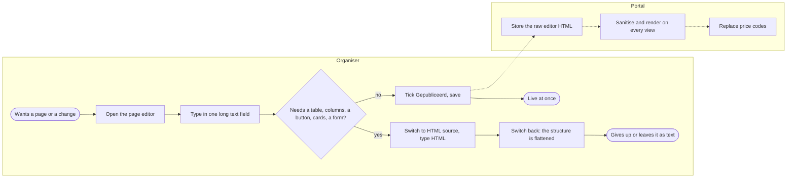
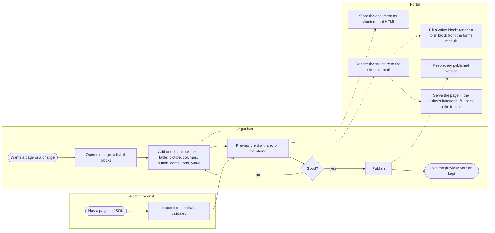
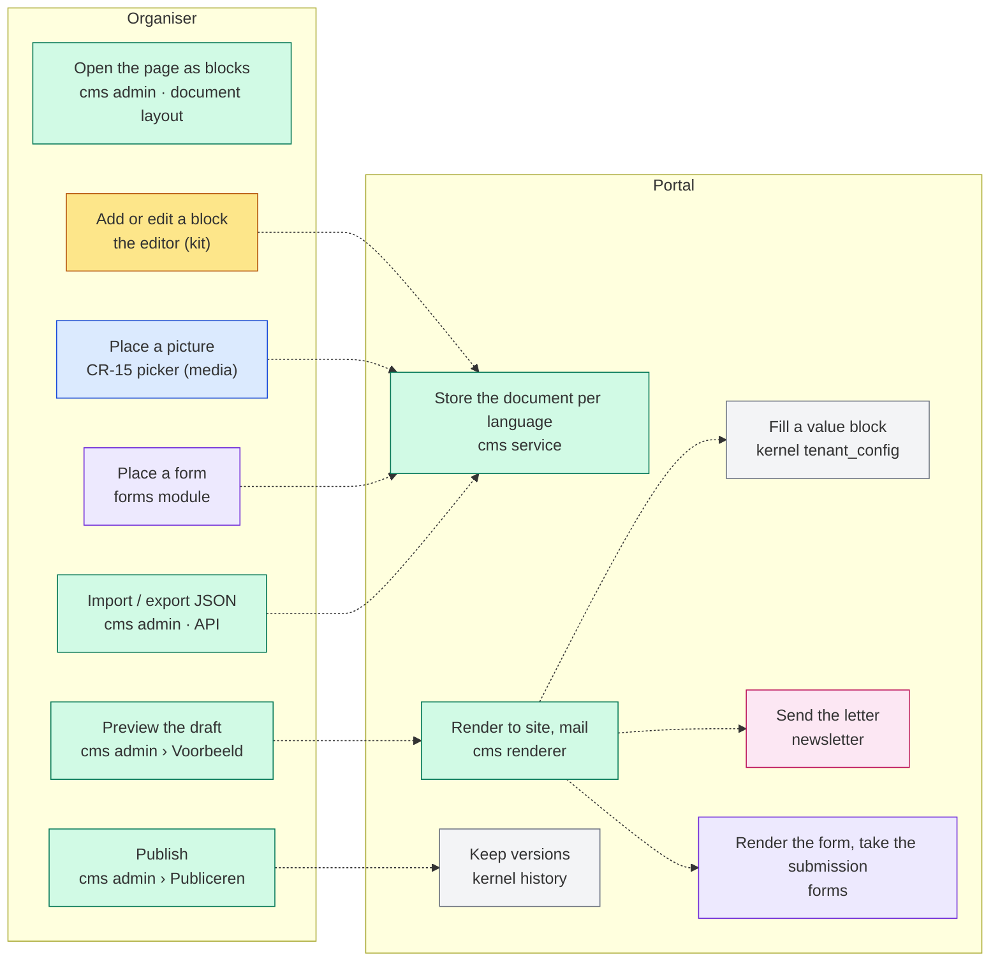
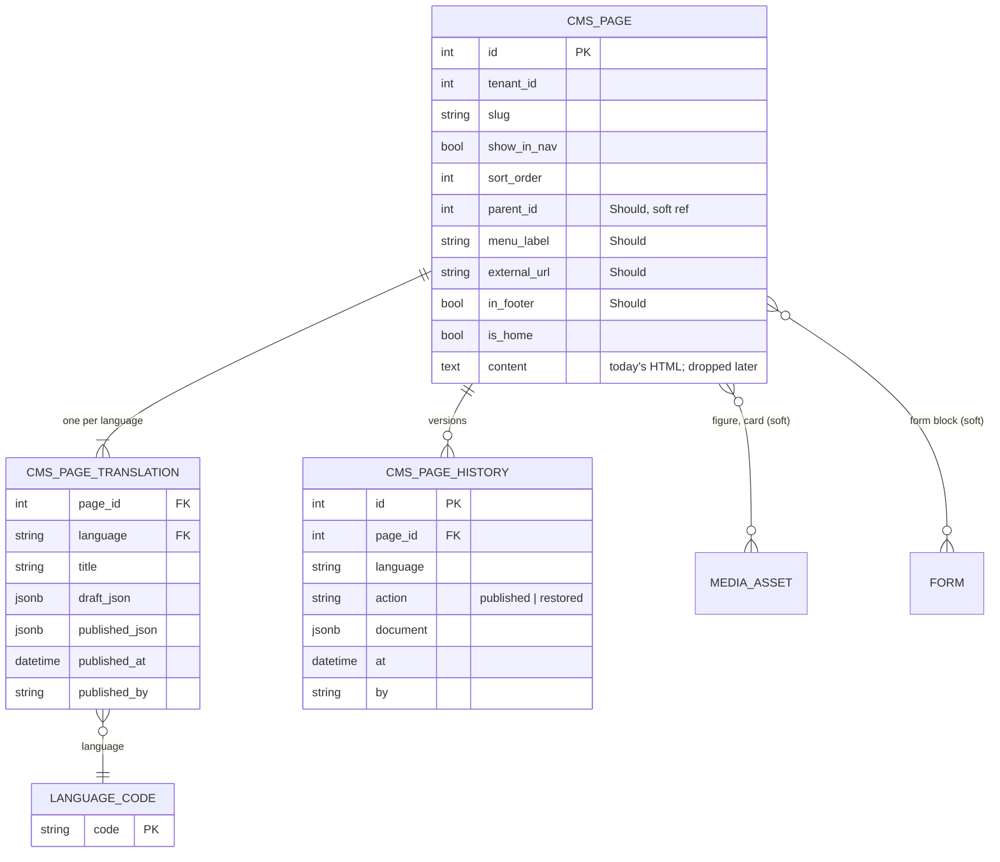

# Change Request 17 — Web content: pages as structured documents, one editor for three places

**Project:** Web Portal "Raak Millegem"
**Status:** shaped on 1 October 2026, reframed on 4 October 2026 (the CMS must carry a company tenant's whole public site; the association's sites do not change) · **decided on 5 October 2026** (B8 empty) · assigned to v2.14.0 on 5 October and **moved to v2.15.0 by Koen on 6 October 2026** (tracker #1666); the spike of phase 0 (#1626) is the first sub-issue of #1427 and its start is Koen's to give
**Tracking issue:** #1427 — the one place where what is open stands; this document is the design, the issue is the status
**Applies to:** the cms domain (pages, the home blocks, the footer, placeholders, the renderer, the menu); the rich-text editor and its three users (CMS pages, the newsletter, meeting notes); the public page template; the kit macro `ui.rich_text`; the media picker of CR-15; the forms module (a form placed on a page); the public site of a tenant of the kind *company* (CR-19).
**Reading:** A 1498 words · B 2498 · C 5430 — words to read, code fences excluded, Part C up to the Q&A log; measured on 5 October 2026 after the review of PR #1625; the budget is A ≤ 1 500, B ≤ 2 500

---

# Part A — The business

## A1. Reason to act — the trigger

On 1 October 2026 Koen asked whether he can put a table on a web page. He cannot: the editor knows no tables, and one typed through the HTML door is flattened at the next edit. Behind it: one text field per page, publishing on save, no draft, no history, a flat menu, prices as typed codes.

On 4 October 2026 the frame changed: the association's sites are good and **do not change**; the change request serves the public site of **a tenant of the kind company** (CR-19), made entirely of CMS pages — sections of clickable cards, a photo beside a heading and a button, a contact page with a form beside the details, a second language later. Koen's ask: the CMS's capabilities, talked through first, no site builder.

## A2. As-is process — how it works today, and where it hurts

One actor ("the organiser") and the portal; measured on 1 October 2026 (C1, C8).



What to see in it: everything beyond a paragraph goes through the HTML door and does not survive; publishing has no step between writing and live. The pains: **no table, columns, button, cards or form**; a picture never beside the text; a price is a code; **no draft, no history, no preview**; a flat menu; a form only as its own page; full-width pages without a table style; three variants of one editor; **no second language for content**.

## A3. To-be process — how it should work afterwards



What changes, one line each:

- A page is a **document of blocks** — text, table, picture, columns, button, callout, cards, form, value — edited in place; the HTML door closes.
- A picture gets its rounded corners and shadow **from the kit**, never baked into the file.
- **Draft and published are two states of one page**; the preview shows the draft; publishing keeps the previous version.
- The menu groups pages under a section, carries an external link and a footer menu.
- A **form block** places a form of the forms module on a page; submissions land where they land today.
- A page's title and documents live **per language**; the site shows the visitor's language and falls back.
- A page can be **exported and imported as JSON** — always into the draft, validated; publishing stays a person's act.
- The newsletter and the notes use **the same editor** with a smaller set each.

The words the user reads: "Blok invoegen ▾", "Voorbeeld", "Publiceren", "Geschiedenis", "Terugzetten", "Document exporteren (JSON)", "Document importeren (JSON)".

## A4. Benefits — what the change earns

- **A company's public site can be made in the portal**, and **the page the board wants** too.
- **Nothing published by accident, nothing lost**; **one tool** for pages, letter and notes; **content from outside** through one validated door; **phones** for 80 % of readers.
- Not quantified in money; the first line decides.

## A5. Supplied material — and what it taught us

- Koen's seven points of 1 October (C4.1–C4.7) and his three examples of 4 October from an outside site, described in A1, not reproduced.
- The code: C1 names every file and issue; the forms module's JSON import is the precedent for the JSON door.

## A6. Business requirements — what the board asks, with MoSCoW

| # | Requirement | MoSCoW | Source |
|---|---|---|---|
| R1 | A page can hold a table, and the table survives every later edit. | Must | Koen, 1 Oct |
| R2 | A page is built from parts the organiser understands — text, table, picture, columns, button, callout, link card — each added, moved and removed on its own. | Must | Koen, 1 Oct |
| R3 | A page has a draft and a published version, previewable; publishing keeps the previous version, restorable. | Must | Koen, 4 Oct |
| R4 | A library picture sits beside the text with a caption; its corners and shadow are the site's, never in the file. | Should | Koen, 4 Oct |
| R5 | A price or a date is placed as a value, not typed as a code, and shows the current value. | Should | author |
| R6 | The newsletter and the notes on the same editor; a letter still arrives as a mail every program shows. | Could | Koen, 4 Oct |
| R7 | Reading works on a phone; writing there is a Could — the editor must open and save, no comfort required. | Must / Could | Koen, 4 Oct |
| R8 | The menu groups pages under sections, carries an external link, and the footer has its own short menu — only if it comes nearly free; otherwise a follow-up change request. The order of the pages in the menu stays settable, as today. | Could | Koen, 5 Oct (Should on 4 Oct) |
| R9 | The editor and everything it loads are served by the portal, from Europe; no data leaves. | Must | Europe First, CSP, zero Node |
| R10 | No site builder: the organiser chooses blocks, the kit chooses the pixels. | Must (limit) | Koen, 1 and 4 Oct |
| R11 | Embedded video or maps from outside. | Won't | the CSP forbids frames; a link card instead |
| R12 | Reporting on pages. | Won't | Umami counts visits |
| R13 | A form of the forms module can be placed on a page, beside text. | Should | Koen, 4 Oct |
| R14 | A row of clickable cards, each a link to a page or elsewhere. | Should | Koen, 4 Oct |
| R15 | Content in more than one language: Dutch first, English soon, without rebuilding; the visitor sees their language with a fallback. | Should | Koen, 4 Oct |
| R16 | A page can be created, changed and published from outside as JSON (a script, an AI agent from a CLI), with the screen's validation and history, under an API key. | Should | Koen, 4 Oct |
| R17 | The association's sites keep their content and look; only the text column narrows (F8). | Must (limit) | Koen, 4 Oct |

## A7. Non-functional requirements — security, privacy, house style, tenants

| Concern | This change |
|---|---|
| **Security** | The portal stores a **structure** and renders the HTML itself; the sanitiser is a last net; the editor is vendored under the CSP and uploads nothing; an import is validated, an unknown block refused by name; the import route needs an API key. |
| **Privacy** | No personal data added. |
| **House style / UI norm** | One editor, one toolbar (CR-11 gate 14); the public typography written once in the kit; the admin screens on CR-11's layouts. |
| **Multi-tenant** | Pages, menu and languages per tenant; the block set the platform's; the brand the tenant's brand file; the form block shows only the tenant's forms. |

## A8. Acceptance criteria — what the business signs off on HDEV

| # | Criterion | R |
|---|---|---|
| AC1 | A table is added, published, edited and published again; still a table, also on a phone. | R1, R7 |
| AC2 | A page with heading, text, a picture beside the text, two columns and a button; blocks move and go; the picture has the site's corners and shadow. | R2, R4 |
| AC3 | An edit does not change the site until "Publiceren"; the preview shows the draft; the previous version is restorable. | R3 |
| AC4 | The membership price is placed as a value and follows the setting. | R5 |
| AC5 | (Could) The newsletter and the notes on the same editor; an activity block arrives as before. | R6 |
| AC6 | On a phone the editor opens, adds a block and saves; nothing scrolls sideways. | R7 |
| AC7 | The editor loads from the portal only; no CSP violation. | R9 |
| AC8 | A contact page: form left, details right; a submission lands in the workbench; on a phone the form first. | R13 |
| AC9 | A section heading over three cards, each a link; the whole card is the target; one per row on a phone. | R14 |
| AC10 | From a CLI with an API key a page is created, written and published; Terugzetten undoes it; an unknown block is refused by name. | R16 |
| AC11 | Every page of the association renders the same HTML before and after the migration. | R17 |
| AC12 | A page under its section; an external item links out; a footer item in the footer only. | R8 |

---

# Part B — The solution, for whoever approves it

## B1. Solution outline — the solution and the decisions that shape it

A page becomes a **structured document**: a tree of blocks in a known schema, stored as JSON, rendered by the portal to the site and to mail. One vendored editor, one toolbar, a block set per place. A page has a draft and a published document, a preview, a history, and its title and documents in a **translation row per language**. Pictures come through CR-15's picker, styled by the kit; a form block places a form; a cards block holds link cards; the menu may group pages under sections (Could); a page can be created, changed and published from outside as JSON, validated, with the same history as the screen. The association's pages convert losslessly and keep their look.

Decisions, each with the rejected alternative (the reasoning in C4):

- **Structure stored, HTML rendered** (C4.2). Rejected: keep storing editor HTML and sanitise. Only a structure renders several ways (print later) and survives edits.
- **One document with block nodes** (C4.2). Rejected: a `page_blocks` table. A document editor already gives selection, reordering, undo.
- **The editor: TipTap (Germany, MIT)**, decided 5 October 2026; the spike confirms the bundle step (C4.1). Rejected: CKEditor 5, Trix, bare ProseMirror, the non-EU editors.
- **Vendored bundle, zero Node in the repository's build** (C4.1). Rejected: a CDN or a Node build.
- **Draft and published as two documents, versions through `*_history`** (C4.3). Rejected: live on save.
- **Value blocks instead of placeholder codes** (C4.4).
- **The kit styles a picture; the file stays clean** (C4.8). Rejected: corners and shadow baked into the image.
- **A form on a page is a block rendering the forms module's form** (C4.9). Rejected: texts inside the forms module.
- **Cards are a block of link cards; a card is a link** (C4.9). Rejected: hover reveals, labels as filters.
- **Content per language is a translation row, from phase 1** (C4.10). Rejected: columns per language.
- **One JSON door, validated, with the screen's history** (C4.11). Rejected: a write that bypasses the history.
- **No site builder** (C4.7); **the association's sites unchanged** (C4.12).

### B1.1 Functional analysis — the derived requirements

| # | Derived requirement | From |
|---|---|---|
| F1 | One schema (`cms/schema.py`) for editor and renderer: paragraph, heading, lists, table, figure, columns (top, middle beside a figure), button, callout, link_card, cards, form, value; marks bold, italic, link, strike. | R1, R2, R5, R13, R14 |
| F2 | `cms.page_translations` (one row per language: title, draft, published, by, at); `cms_page_history` per published version; `content` read-only until dropped. | R3, R15 |
| F3 | Rendering: schema → site HTML, mail HTML (print later); nh3 as the last net. | R1, R6, R7 |
| F4 | `ui.rich_text(name, blocks=…)`: the vendored editor with the caller's set, one toolbar, one "Blok invoegen ▾", Opslaan (autosave later). | R2, R6 |
| F5 | The figure block opens CR-15's picker; a gallery block takes an album (phase 5); the kit renders every figure with the public radius and shadow. | R4 |
| F6 | The value block lists the placeholder codes and renders the current value (phase 5; the renderer replaces codes from phase 1). | R5 |
| F7 | Voorbeeld renders the draft; Publiceren copies draft → published with a history row; Terugzetten restores into the draft. | R3 |
| F8 | Public page at reading width; a table scrolls inside its block on a phone; columns stack, the form first. | R7 |
| F9 | Newsletter set (text, figure, button, activity, calendar, closing) replacing the markers; the page's three choices decide the blocks — *Uitgelicht* an activity block each, *In de kalender* one calendar block (CR-11 Q55). Notes set: text, lists, table; autosave. (Could, phase 7.) | R6 |
| F10 | Menu: `parent_id`, `external_url`, `in_footer` on the page, `menu_label` in the translation row; sections in the site menu; the way back names the section. | R8, R15 |
| F11 | Migration: HTML parsed into the schema; a page that does not parse losslessly is listed and keeps its HTML; equal HTML before and after. | R1, R17 |
| F12 | CR-11 gate 14 widened to the new editor; a schema change is a change of `cms/schema.py` only. | R6, R9 |
| F13 | The form block renders the chosen form through `forms.api`, same fields, validation and submission; a deleted form renders nothing. | R13 |
| F14 | The cards block: heading and link cards, two or three per row, one on a phone; the whole card the link; the target a page of the site or a URL. | R14 |
| F15 | The visitor's language when a published translation exists, else the tenant's; the switch only when a second language has content. | R15 |
| F16 | Export and import (JSON) on the page; the API with an API key: list and create pages, read and write the draft, **publish**, and the reference lists an agent needs (the schema as JSON Schema, placeholders, media ids, form ids) — phase 4. | R16 |

## B2. Fit with the process and the requirements — for the business



Legend: green cms · yellow kit · blue media · purple forms · grey kernel · pink newsletter.

**Traceability matrix**

| R | F | Test (C6) | AC |
|---|---|---|---|
| R1 table | F1–F3 | 1, 2 | AC1 |
| R2 parts | F1, F4 | 3 | AC2 |
| R3 draft, history | F2, F7 | 4–6 | AC3 |
| R4 pictures | F5 | 7, 11 | AC2 |
| R5 values | F6 | 8 | AC4 |
| R6 one editor | F4, F9 | 9, 10 | AC5 |
| R7 phones | F8, F4 | 11, 12 | AC1, AC6 |
| R8 menu | F10 | 13 | AC12 |
| R9 served by the portal | F12 | 14 | AC7 |
| R13 form block | F13 | 16 | AC8 |
| R14 cards | F14 | 17 | AC9 |
| R15 languages | F2, F15 | 20 | phase 3 |
| R16 JSON | F16 | 18 | AC10 |
| R17 association unchanged | F11 | 19 | AC11 |

**Walkthrough on HDEV** (the organiser; a visitor for 4, 10 and 11) — the detailed steps are C9's annex:

1 A page as blocks. 2 A table added, published, edited, published: still a table. 3 Heading, text, picture beside the text, columns, button; the picture has corners and shadow. 4 A visitor on a phone: the table scrolls inside its block. 5 An unpublished edit leaves the site unchanged; Voorbeeld, Publiceren, Geschiedenis, Terugzetten. 6 A value block follows the setting. 7 (Could) The newsletter and the notes on the same editor. 9 No CSP violation. 10 A contact page with the form block; a submission in the workbench. 11 A cards page; each card a link. 12 From a CLI: create, write, publish; an unknown block refused. 13 The association's pages the same before and after. 14 A section in the menu, an external item, a footer item.

## B3. The whole across the modules — for the architect

```mermaid
flowchart TB
  subgraph kit[ui — the kit]
    k1[rich_text macro on the new editor, block sets — changed]:::chg
    k2[static/vendor: the editor bundle, pinned — new]:::new
    k3[prose rules: figure radius and shadow, columns, cards, table — new]:::new
  end
  subgraph cms[cms]
    c1[schema.py: the block schema, one source; served as JSON Schema — new]:::new
    c2[render.py: schema → site / mail — changed]:::chg
    c3[service: draft, publish, restore, versions, import, export — changed]:::chg
    c4[page_translations; cms_page_history; menu columns — new]:::new
    c5[admin screens: document layout, preview, history, JSON — changed]:::chg
    c6[public page: reading width, language fallback, the menu with sections — changed]:::chg
    c7[migration: HTML → schema, lossless or listed — new]:::new
    c8[api.py: render_document, schema_for, import_draft — changed]:::chg
    c9[router: PUT /pages/{id}/draft, GET /schema — new]:::new
  end
  subgraph media[media — CR-15]
    m1[picker; gallery of an album — used]:::used
  end
  subgraph forms[forms]
    f1[api: render a form inside a page; take the submission — used, one new facade call]:::chg
  end
  subgraph nl[newsletter]
    n1[block set letter; markers gone — changed]:::chg
  end
  subgraph mt[meetings]
    t1[notes on the editor — changed]:::chg
  end
  subgraph kernel[kernel]
    h1[history.py — used]:::used
    h2[tenant_config, tenant_language — used]:::used
  end
  k1 --> c1
  c2 --> h2
  c3 --> h1
  c2 --> f1
  n1 --> c8
  t1 --> k1
  c5 --> m1
  classDef new fill:#d1fae5,stroke:#047857
  classDef chg fill:#fed7aa,stroke:#c2410c
  classDef used fill:#f3f4f6,stroke:#6b7280
```

Legend: green new · orange changed · grey used.

**Data model at a glance**



Who calls whom: the admin screens call the cms service and render the editor through the kit macro; the public page and the newsletter call `cms.api.render_document`; a figure goes through `media.api`, a form block through `forms.api`, a value through `kernel.tenant_config`. New dependencies: cms → forms.api, newsletter → cms.api. Publish is one transaction.

## B4. Rules this change needs an exception from — decided once, here

| Rule (where) | What the design does instead | Temporary until … / the new rule | Decided |
|---|---|---|---|
| "CMS editor is Trix" — `docs/design-system.md` (#520) | a ProseMirror-based editor; content as structure | **the new rule** (B7) | B8 Q1 |
| "Zero Node in the build" — `AGENTS.md` | the bundle built once outside the repo, committed, pinned | no exception: a committed artifact | — |
| CSP `default-src 'self'` | unchanged; the editor loads from `/static/vendor/` | not an exception; test 14 | — |
| Expand/contract (#1255) | `cms_pages.content` dropped two releases after phase 1 | the rule applied | — |
| CR-11 row 40: one toolbar (gate 14) | kept and widened | the gate grows | — |
| "A form renders as its own page" (forms) | the form block renders the same form inside a page | a second rendering of one definition | — |

## B5. Cost — investment and running cost, and what operations must know

| Module | Ph 0 spike | Ph 1 pages | Ph 2 blocks | Ph 3 languages | Ph 4 JSON door | Ph 5 value, gallery | Ph 6 menu (Could) | Ph 7 letter, notes (Could) | Total |
|---|---|---|---|---|---|---|---|---|---|
| ui (kit) | 1 | 1.5 | 1 | 0.5 | — | 0.5 | — | 0.5 | 5 |
| cms | — | 3.5 | 3 | 2 | 2 | 1 | 1 | 0.5 | 13 |
| forms; newsletter, meetings | — | — | 0.5 | — | — | — | — | 2.5 | 3 |
| tests | 0.5 | 1 | 1 | 0.5 | 0.5 | 0.5 | 0.25 | 1 | 5.25 |
| **Total** | **1.5** | **6** | **5.5** | **3** | **2.5** | **1.5** | **1.25** | **4.5** | **~26 CLI-days** (20 for phases 0–5) |

Purchases: none. **Running cost:** none. **Operations:** no env var; the bundle upgraded like htmx; one contract migration.

## B6. Phasing — shippable phases, and what changes on the failure paths

| Phase | Delivers | Migration | Failure paths that change | Validation |
|---|---|---|---|---|
| **0 — the spike** (#1626; its start is Koen's to give) | TipTap on a throwaway branch — the one-off bundle without Node in the repo, a table round trip, a custom node, the CSP, a phone; the measurements into C8 | none | none | C8 |
| **1 — pages as documents** | the schema; the editor macro; the page screen with draft, publish, history, preview; the renderer and the reading-width page; `page_translations`; the picker; the lossless migration | additive | a page is no longer live on save; an unknown block refused by name | AC1, AC3, AC6, AC7, AC11 |
| **2 — the blocks** | table (full), columns with alignment, button, callout, link card, **cards**, **form** | none | a deleted form renders nothing | AC2, AC8, AC9 |
| **3 — a second language** (Should) | the language selector, a second translation row, `/en/`, the fallback, the switch | none | a page without a translation falls back | walkthrough |
| **4 — the JSON door** | export and import on the page; the API: pages, draft, publish, the reference lists; the schema served | none | an unknown block refused by name | AC10 |
| **5 — the value block and the gallery** | the value block in the toolbar (the renderer replaces codes meanwhile); the gallery block on an album | none | none | AC4 |
| **6 — the menu** (Could, only if nearly free) | parent, external link, footer menu; the page order already exists (`sort_order`) | additive | none | AC12 |
| **7 — the letter and the notes** (Could, last) | the newsletter on the editor, markers gone, the mail renderer from blocks; the notes | none | a letter the mail renderer refuses is refused at "Versturen…" | AC5 |
| **later** | the print rendering, the preview's width switch, autosave of the draft; drop `content` two releases after phase 1 | contract for the drop | — | — |

Dependencies: CR-15's picker and a company tenant (CR-19) exist. **Order** (Koen, 5 Oct 2026): 0 → 1 → 2 → 3 → 4 → 5 are the change; 6 and 7 only when nearly free, otherwise a follow-up change request.

## B7. Rule and gatekeeper — what this fixes for all future work

1. **The rule.** *Content a person writes is stored as a structured document against one schema and rendered by the portal; a screen never stores browser HTML, never draws its own toolbar, never adds a block outside the schema; a block's look is the kit's.* Lives in `docs/design-system.md` and, one sentence, in `docs/code-style.md`.
2. **Reach and baseline.** Three editor variants today; after this one macro, one schema, three sets; four workarounds to zero.

**The gate:** a node outside the schema is refused on save and import; toolbar markup outside the macro, an unvendored script and a changed association page are red (C6 2, 3, 14, 19).

## B8. Open decisions — what the approver still decides

None (B9, 5 Oct 2026).

## B9. Decisions log — dated answers

| Date | Decision | By |
|---|---|---|
| 18 Jul 2026 | Trix as the CMS editor, self-hosted, zero Node (#520). | Koen |
| 16 Sep 2026 | One `ui.rich_text` macro for every editor (CR-05). | Koen |
| 30 Sep 2026 | A block editor is its own change request (CR-11). | Koen |
| 1 Oct 2026 | Web content management as a whole, talked through first; no site builder. | Koen |
| 4 Oct 2026 | **The frame**: the association's sites do not change; the subject is a company tenant's site, kept abstract. | Koen |
| 4 Oct 2026 | Form block (R13), cards block (R14), kit-styled pictures (R4), columns middle beside a figure; a translation row from phase 1 (R15); a JSON door (R16); the menu to Should (R8); the three newsletter choices decide the blocks (F9). | Koen |
| 4 Oct 2026 | **Six answers**: R6 and writing on a phone Could; R12 Won't; cards are layout; English soon with `/en/`; the JSON door also creates and publishes. | Koen |
| 5 Oct 2026 | **B8 closed** (Q1 TipTap; Q2 the menu a Could, only if nearly free; Q8, Q9 the activity editor and merged cells Coulds outside this change; Q10 form and cards in phase 2; Q11 content only, the back office Dutch; Q6 the spike now). **Phases**: 1 pages, 2 blocks, 3 language, 4 the JSON door, 5 value block and gallery; 6 menu and 7 letter are Could. **To later**: print, the preview's width switch, autosave. **Assigned to v2.14.0.** | Koen |
| 6 Oct 2026 | Moved to **v2.15.0** (#1666). Reading width also for the association's pages (Q17). | Koen |
| 1 Oct 2026 | *Proposed:* C4.1–C4.7. | author |

---

# Part C — The build, for the master CLI and the dev CLIs

## C1. Verified premises — measured before the handover

| Claim | Measured how | Result | Consequence |
|---|---|---|---|
| Trix keeps no table through an edit | `newsletter/service.py:946-951` (19 Sep 2026); no `table` handling in `admin_pagina.html` | true | the editor must change (C4.1) |
| The sanitiser allows tables but nothing styles them | `cms/render.py:25-63`; `site_base.html:60-96`; `build-css.sh` has no typography plugin | true | the prose rules (C2 kit) |
| Content is stored as raw editor HTML and sanitised at every render | `cms/service.py:94`; `render.py:227-235` | true | C4.2 |
| A page has one `content` field, `is_published`, no draft, no version | `cms/models.py:9-33`; no `cms_*_history`; `kernel/history.py` exists | true | C4.3 |
| The preview shows the saved state, not the edit | `cms/admin_ui.py:285-316` | true | C4.3 |
| Five placeholders replaced by `str.replace` at render | `render.py:173-179, 214-235` | true | C4.4 |
| The CSP is `default-src 'self'` with inline scripts allowed, no CDN | `caddy/parts/snippets.caddy:26` | true | vendored editor; test 14 |
| The repository's build has no Node; vendored JS is htmx 2.0.4, alpine 3.14.8, trix 2.1.15 (203 KB) | `scripts/build-css.sh`; `static/vendor/`; no `package.json` | true | a committed bundle, pinned |
| The newsletter inserts markers and builds them at send; the notes autosave a plain field | `newsletter/service.py:41,965,1021`; `meetings/templates/_vg_punt.html:89-102` | true | phase 7 |
| A CMS page renders at the site's full width (about 1 248 px of text at 1 440 px) | `site_base.html:244` | true | reading width |
| The repository carries no licence file | `ls LICENSE*` | none | Q1 |
| The forms module imports a definition as JSON; a form renders as its own page | the form builder's "Definitie importeren (JSON)"; `forms/ui.py` | true | the precedent for F16; F13 renders the same definition inside a page |
| A tenant has a language; code lists carry labels per language | `kernel/tenant_config.tenant_language`; `mdm.language_codes`, the `_labels` tables | true | F2's `language` FK; F15's fallback |
| A CMS page can be the home page | CR-19 J3 (`cms_pages.is_home`), built on v2.13.0 | true | a company site starts from a page |
| *Measured again on 6 October 2026, after v2.13.0:* `ui.rich_text` already exists, as the Trix macro, in four places | `_macros.html:1382`; `_cp_detail.html:111`, `_vg_punt.html:97`, `admin_nieuwsbrief.html:211`, `design_system.html:232` | true | the new editor is a second macro while two editors coexist (C2 ui) |
| Content headings are stored as h1–h3 and shown one level down on a page, not in a fragment | `render.py:367-378` (`on_page=True`), `cms_pagina.html`, `ui.py:57` (#1656, CR-11 Q87) | true | heading levels are semantic (C4.2) |
| A page already has its footer flag | `cms/models.py`, `show_in_footer` (#1569) | true | phase 6 adds no flag |
| Five readers of `content` beside the page screen | `chatbot/context.py:168`, `ui.py:57` (the home intro), `router.py:20`, `service.py:215` (media "where used"), `service.py:248` (the placeholder list) | true | C2 cms, *Readers* |
| The page screen is a list with a hand-built detail fragment, not on the record page | `_cp_detail.html`; `record_header` and `record_columns` exist in `_macros.html` | true | phase 1 moves it onto the kit's record page |
| The e2e baseline is measurements in JSON; pixels are not compared | `tests_e2e/measures.py` (#1605; Koen, 5 October 2026) | true | test 19 compares HTML and measurements, not pixels; the association's pages take the reading width too (Koen, 6 October 2026; Q17) |
| *To measure before phase 2:* what the forms module needs to render a form outside its own page (CSRF, the submission route, the thank-you) | `forms/ui.py`, the public form template | — | F13's facade call |

## C2. Per module: what must happen

#### ui — the kit (phases 1–2)

- **Screens:** the design-system page renders the editor with every block of every set, and the public prose rules (figure with its radius and shadow, columns, cards, table) as live examples; judged at 390 px.
- **Code:** `document_editor(name, blocks, value_json, autosave_url=None)` — a second macro beside today's `rich_text` (Trix), which keeps serving the letter and the notes until phase 7 moves them and removes it; one name per editor, never one macro with two engines; the editor bundle under `static/vendor/<editor>-<version>.js|css` with its checksum in `scripts/vendor-manifest.txt`; the editor configuration generated from `cms.api.schema_for(set)` into a `<script type="application/json">`.
- **Templates:** `_macros.html` (the macro), `admin_base.html` (the one load), the prose rules in `build-css.sh`'s config as hand-written utilities for `.prose-raak` (tables, figures with `rounded-[14px]` and the card shadow, columns top/middle, cards grid); `site_base.html` and `admin_base.html` lose their hand-written `.cms-content` rules.
- **Tests:** C6 3, 9, 11, 14, 17.

#### cms (phases 1 to 6)

- **Screens:** `/admin/paginas/{id}` on the document layout (CR-11 blocks 5 and 9): title and slug in the header editor, from phase 3 a language selector (one language shown at a time; until then the tenant's language, with no selector), the document with Opslaan of the draft (autosave later), the actions Voorbeeld · Publiceren · Geschiedenis, and in Acties: Document exporteren (JSON) · Document importeren (JSON); `/voorbeeld` renders the draft (a width switch later); `/geschiedenis` lists versions with "Terugzetten"; the list shows a draft badge and, in phase 3, the languages a page has.
- **Code:** `schema.py` (the schema as data: node types, attributes, sets; exported as JSON Schema); `render.py` (two targets, print later; the form node calls `forms.api.render_embedded`; the cards node resolves page references to URLs; nh3 on the result); `service.save_draft`, `publish`, `restore`, `versions`, `parse_html` (F11), `import_draft(page_id, language, document)` (validation, then save_draft), `export_document`; `api.py` exports `schema_for`, `render_document`, `placeholders`, `import_draft`, `create_page`, `publish` (also from the API), `references`; `router.py` adds `PUT /api/v1/cms/pages/{id}/draft` (API key, `?language=`) and `GET /api/v1/cms/schema`.
- **Database:** phase 1, additive: `cms.page_translations (page_id INT NOT NULL REFERENCES cms.cms_pages(id) ON DELETE CASCADE, language VARCHAR(5) NOT NULL REFERENCES mdm.language_codes(code), title VARCHAR(200) NOT NULL, menu_label VARCHAR(80) NULL, draft_json JSONB NULL, published_json JSONB NULL, published_at TIMESTAMPTZ NULL, published_by VARCHAR(255) NULL, PRIMARY KEY (page_id, language))`; `cms.cms_page_history (id, page_id FK CASCADE, language VARCHAR(5) NOT NULL, action VARCHAR(20) NOT NULL CHECK (action IN ('published','restored')), document JSONB NOT NULL, at TIMESTAMPTZ NOT NULL, by VARCHAR(255))`; the migration moves `title` and `content` (parsed) into the row of the tenant's language; `cms_pages.title` kept one release, then dropped with `content`; phase 6: `parent_id INT NULL`, `external_url VARCHAR(500) NULL` — the menu label is the translation row's (C4.10) and the footer flag exists as `show_in_footer` (#1569). Check the CHECK constraints of `cms_pages` before touching flags (the `media_assets.kind` lesson).
- **Readers** (phase 1 moves each from `content` to the published document, through `cms.api`): the public page and the admin preview; the home intro (the `home-intro` page as a fragment on the home); `GET /pages/{slug}`; the chatbot's context, which reads every published page as text (`render_document(…, target="text")`, or the site HTML as today); the media "where used" scan, which becomes a walk over the figure, card and gallery nodes (`references`); the placeholder list.
- **A page that does not convert losslessly** (F11): the migration writes the parsed document into `draft_json` and leaves `published_json` empty; the site keeps rendering its `content` as today; the list marks it and the editor opens the draft with a notice to compare it with the live page; publishing replaces the HTML rendering. No second page editor is kept.
- **Templates:** `admin_pagina.html` and `_cp_detail.html` shrink to the layout plus the macro; `cms_pagina.html` on the reading width; the public menu renders sections (phase 6); the public header renders the language switch when a second language has published content (phase 3).
- **Tests:** C6 1, 2, 4, 5, 6, 8, 12, 13, 16, 18, 19, 20.

#### forms (phase 2)

- **Code:** `api.render_embedded(form_id, tenant_id)` returns the form's fields as the same partial the form page uses, with the form's own action route, CSRF and thank-you behaviour; the form block passes the page as the return target. The forms module keeps its own page and share link; the block is a second rendering of one definition. *Measure first* (C1's last row) what the public form template needs outside its page.
- **Tests:** C6 16.

#### media (used)

- The figure block uses the picker; the gallery block uses the album; a link card's picture is a media id. CR-15 is built.

#### newsletter and meetings (phase 7)

- As before: the editor with the letter set; `_clean_body` becomes a schema validation; the mail renderer from blocks; the notes on the macro with the notes set, autosave unchanged. Tests C6 10.

#### reporting — none

## C3. Cross-cutting impact — the checklist of what gets forgotten

| Row | Answer |
|---|---|
| Reporting views and saved reports | no |
| Existing tests, e2e flows, 390 px screenshots | yes — the CMS, newsletter and notes editor e2e and their screenshots are redone; the association's public pages keep their HTML and their measured look, but for the column width (test 19) |
| Fixed UI decisions and `AGENTS.md` | yes — "CMS editor is Trix" in the design system and the row-15 reference are rewritten at phase 1 (proposed to the master CLI) |
| Design-system documentation | yes — the editor as a component, the prose rules, the block set table, the cards and form blocks |
| Code lists | `language_codes` reused; the block types are code (`schema.py`), not data |
| Events and handlers | no |
| Mail templates | yes — the newsletter's HTML from blocks (phase 7); three mail clients checked as CR-05 did |
| Migration: additive or contract | additive in phases 1 and 4; one contract migration (dropping `content` and `cms_pages.title`) two releases after phase 1 |
| Tenant settings | no new ones; `tenant_language` read |
| Env vars | no |
| JSON routes and API callers | `GET /pages/{slug}` keeps returning rendered HTML (`?language=` optional); `PUT /admin/pages/{id}` with `content` HTML kept one release then removed; new: `PUT /api/v1/cms/pages/{id}/draft`, `GET /api/v1/cms/schema` |
| External services | no |
| Modules per tenant (CR-19) | the form block is offered only when the tenant has the forms module; the value block only with membership values that exist for the tenant's kind |

## C4. Detailed decisions — one subsection each, with the reasons

### C4.1 The editor — Europe First, self-hosted, zero Node in the build

The requirements: a real document model that keeps tables and custom blocks (Trix fails this by design — measured); block nodes we define; a single-file build we can vendor under `static/vendor/` and load under `default-src 'self'`; mobile editing; an EU origin; a licence the repository can carry; no data leaving.

| Candidate | Origin, licence | Document model, tables, custom blocks | Vendorable without Node in the repo | For | Against | Verdict |
|---|---|---|---|---|---|---|
| **Trix** (today) | USA (37signals), MIT | **no** — keeps only text, links and attachments | already vendored, 203 KB | known, small, the macro exists | misses the core: no table, no custom block, no structure; 430 lines of hand-added features around it | fails R1 |
| **TipTap** | Germany (Tiptap GmbH), MIT (core and open extensions incl. table), on ProseMirror | yes — nodes and marks are the schema; custom nodes first class | no official single-file build: bundled once outside the repo (esbuild), committed, pinned by checksum | fits "blocks as JSON, HTML as rendering" exactly; light; EU; active | the bundle is an artifact we build and keep (Node once, on a machine, outside the repo); the UI (toolbar, menus) is our work on its API | **recommended** |
| **CKEditor 5** | Poland (CKSource), GPL 2+ or commercial; a licence key required since v44 (a GPL key is free) | yes — tables, captions, image styles out of the box; custom blocks through its plugin system, heavier | official self-hosted zip, no Node | everything out of the box; official builds; EU | heavy (over 1 MB); the GPL in a repository without a licence file or a paid licence; a key in the code; custom blocks more work | the alternative, licence first |
| ProseMirror bare | Netherlands, MIT | yes — the engine | as TipTap | lightest, EU | an engine only: toolbar, menus, table handling to write ourselves — days more | too low-level |
| Editor.js, Quill, Lexical, Slate, Toast UI | RU / US / US / US / KR | — | — | — | not EU | out |

Decided: **TipTap** (Koen, 5 October 2026) — a page is one ProseMirror document whose node types are our blocks, stored as the JSON TipTap emits, rendered by our Python renderer from the same schema; the repository's own build stays Tailwind-standalone and Python only. The spike (C8) confirms it on four points: a table round trip, a custom node, the CSP, a phone. CKEditor 5 is the fallback only if the one-off bundle step fails (B8); then its GPL question comes first.

### C4.2 A page is one structured document; blocks are its nodes; HTML is a rendering

The content is stored as the editor's **JSON document** against a schema in one Python module (`cms/schema.py`) that also generates the editor's configuration and is served as JSON Schema. The server renders it to site HTML and to mail HTML (print later, with the notes); nh3 sanitises the *output* as a last net. Not a `page_blocks` table: a document editor already gives selection, reordering, undo and inline editing; rows would rebuild that as forms and make "two columns with a table in the left one" a tree in SQL.

The block set, phase 1 and 2: paragraph, heading (three levels — Kop, Subkop, Kleine kop — stored as level 1–3; the renderer picks the tag from where the document stands: h2–h4 under a page's title, h1–h3 in a fragment such as the home intro, as `render_cms_content(on_page=…)` does since #1656), lists, link, bold, italic, strike; **table** (header row; `colspan` phase 2 if asked); **figure** (media id, caption, placement left · right · full · small); **columns** (two sub-documents; aligned top, middle when one is a figure); **button** (label, target, primary/secondary); **callout**; **link card** and **cards**; **form**; **value**. The newsletter adds activity, calendar, closing; the notes have paragraph, heading, lists, table.

### C4.3 Draft, published, versions, preview

A translation row carries `draft_json`, written by Opslaan (autosave later; the document layout of CR-11 beslissing 09 has the slot), and `published_json`, written only by "Publiceren". The site renders `published_json`; the preview renders the draft at desktop and 390 px. Publishing writes a history row (document, language, time, person). "Terugzetten" copies a version into the draft; publishing it makes it live. `is_published` means "has a published document in the tenant's language". No scheduled publishing.

### C4.4 Value blocks, not codes

The five placeholders become a **value block** chosen from "Blok invoegen ▾ › Waarde", shown in the editor as a chip with the current value, rendered as the current value from `tenant_config`; the migration maps `{{code}}` to a value node. A company tenant without membership values sees only the values its kind has (CR-19).

### C4.5 One editor, three places, three block sets

`ui.document_editor(name, blocks="page"|"letter"|"notes")` renders the same editor with the set the schema names; the toolbar and the "Blok invoegen ▾" menu are the macro's (gate 14). The newsletter's activity and calendar blocks are nodes whose data the newsletter supplies at render time. The notes keep autosave and gain a table.

### C4.6 Mobile first, reading and writing

Reading: reading width (768 px); a table scrolls inside its own block on a phone (CR-11 Q14's declared exception); a figure beside text stacks under it below 640 px; columns stack with the form first; cards one per row. Writing on a phone is a Could (Koen, 4 October 2026): the editor must open, not scroll sideways and save there; the bottom sheet for "Blok invoegen ▾", the 44 px handle and typing a table on a phone are comfort, not a gate. The spike measures that the editor works on a phone, not how well.

### C4.7 Not a site builder

No themes, no free placement, no per-page templates, no colours or widths per block, no plugin system, no embeds. The organiser chooses blocks; the kit chooses the pixels: a photo beside text always looks the same, a row of cards always looks the same. What a tenant cannot express with the blocks is a change to the schema, decided here. (Forms inside pages were a non-goal on 1 October; the form block of 4 October is a block of the schema, not a builder.)

### C4.8 The look of a picture is the kit's, never the file's

A figure, a card's picture and a gallery item render with the public card radius (14 px) and the soft shadow of CR-11 beslissing 01, by the prose rules, for every picture. The organiser chooses the picture, the caption and the placement; nothing else. The file stays clean because the same asset serves the poster (Design Studio), the newsletter (mail knows no shadow) and the picker. Changing the look later is one place.

### C4.9 A form on a page, and cards

**Form block**: a node holding a form id of the tenant; the renderer asks `forms.api.render_embedded` for the form's fields and submission route, so the page shows the same form the forms module shows on its own page — same validation, same thank-you, same submission into the workbench; two renderings of one definition, no copy. Placed in two columns it gives the contact page: the form at the left, the details and a callout at the right, the form first on a phone. **Cards block**: layout, not data (Koen, 4 October 2026) — the author types each card's title and line and picks its icon or picture; nothing is pulled from a record; a heading and a list of link cards (icon from the kit's vocabulary or a picture, title, one line, labels as plain text); two or three per row, one on a phone; the whole card is the link (the stretched-link pattern); a card's target is a page chosen from the site's pages — a reference that survives a slug change — or an outside URL. No hover reveal: a card that is a link says so with its cursor and focus; a phone has no hover. Labels do not filter: a page is not a list.

### C4.10 Content per language

"Build what is needed in the shape that grows": a page's title and documents live in `page_translations` keyed by (page, language) from phase 1, with the tenant's language as the only row; a second language is a row, not a column. The site serves the visitor's language (the browser's `Accept-Language` or the switch) when a published translation exists, else the tenant's language; the switch appears only when a second language has published content. One slug per page, the language as a prefix (`/en/…`) — decided now that phase 3 moves up (Koen wants English soon, 4 October 2026): the switch stays on the same page and a link survives a translation; the menu label lives in the translation row. The forms module's forms, the newsletter and the site name stay single-language — outside this change. The app's own words (gettext) and the back office stay Dutch unless Koen asks (Q11); code-list labels already exist per language.

### C4.11 One JSON door

A page's document is data, and data has a door: export (draft or published) and import into the draft, through the screen and through `PUT /api/v1/cms/pages/{id}/draft` with an API key — the same validation as the editor's save, an unknown block or attribute refused with its name, a media reference that does not exist refused, nothing stripped silently. The schema is served as one JSON Schema file so a script or an AI knows the blocks before it writes. Publishing from outside is allowed too (Koen, 4 October 2026: a Claude Code CLI must be able to change and publish pages): `POST /api/v1/cms/pages/{id}/publish` runs the same `publish` as the button — one history row, so a wrong publish is one Terugzetten away — and the API lists and creates pages, so a whole site can be written from a CLI. What an agent needs to write a valid document is served next to the schema: the placeholders, the media ids and the form ids of the tenant. The Assistent (CR-11 block 10) uses the same door.

### C4.12 The association's sites do not change

The migration converts every existing page losslessly into a document (test 12) and the renderer produces the same HTML (test 19). One thing changes, by decision (Koen, 6 October 2026; Q17): the text column of a content page narrows from the site's full width to the reading width of 768 px on a wide screen — nothing on a phone. The association's home composition, menu and look stay; its brand file stays. New blocks are available to it but nothing on its site uses them until an organiser does.

## C5. Privacy and security — the mechanics behind A7

The stored content is a JSON document validated against the schema on save and on import (unknown node types and attributes refused, not stripped); the HTML the site serves is generated by the renderer, so an `on*` attribute, a `javascript:` URL or an unknown tag has no way in except through a renderer bug — nh3 on the output catches that. A card's outside URL is `http(s)` only, with `rel="noopener noreferrer"`. The form block renders the forms module's form with its CSRF and validation; a submission is the forms module's. The import route needs an API key and the tenant's scope; it can touch the draft only. The editor loads from the portal's origin under the unchanged CSP; it fetches nothing. The history rows hold a person only in the "by" column.

## C6. Tests — what the build must prove

1. **A table survives.** Saved, loaded into the editor (e2e), edited, saved: the node unchanged except the edit; the site renders `<table>` with a header row. Red on Trix.
2. **Schema is one source.** The editor configuration and the served JSON Schema are generated from `cms/schema.py`; a node added appears in both and in the renderer's dispatch; a node not in the schema is refused on save with its name (proven by posting one).
3. **One toolbar.** No editor toolbar markup or configuration in a domain template (gate 14, widened).
4. **Draft is not live.** Saving a draft leaves `published_json` and the site unchanged; "Publiceren" changes both and writes exactly one history row.
5. **Preview shows the draft** at two widths.
6. **Restore is not live.** "Terugzetten" writes into `draft_json` only.
7. **Figure through the picker.** A media id the picker offered; resolved through `media.api`.
8. **Value is current.** A value node renders the amount from `tenant_config`; a migrated `{{code}}` became a value node.
9. **Three sets.** `notes` offers no figure or button; `letter` offers activity and calendar; `page` offers neither; an unknown set is a `ValueError`.
10. **Mail from blocks.** A letter with an activity and a calendar node renders to the same HTML the markers produced (snapshot on the old code); the notes render to print — the print half runs when print is built (B6, later), the mail half in phase 7.
11. **Reading width, tables and pictures on a phone.** The content column is 768 px at desktop and the viewport minus 32 px at 390 px; a table's block scrolls inside itself while the page does not; a figure beside text stacks below 640 px; a figure carries the 14 px radius and the card shadow (computed style).
12. **Migration is honest.** `render(parse(html))` equals the sanitised html modulo whitespace for every seeded page; the ones it cannot are listed and still render.
13. **Menu (phase 6).** A page with a parent renders under it; an external item links out with `rel`; a footer item appears in the footer only.
14. **Vendored and pinned.** The bundle's checksum matches the manifest; no `<script src>` outside `/static/`; the CSP header unchanged.
15. **The bar does not cover a field** at 390 px.
16. **The form block.** A page with a form node renders the form's fields; a submission from the page lands as a submission of that form (workbench) with the page as return target; a form id of another tenant or a deleted form renders nothing on the site and a notice in the admin preview; a tenant without the forms module cannot insert the block.
17. **Cards.** Three cards render as links (the whole card, `a` with the stretched pattern); a card to a page follows a slug change; one per row at 390 px (DOM measurement).
18. **The JSON door.** Export → import round-trips a document unchanged; a document with an unknown block is refused with "Onbekend blok: <name>" and the draft untouched; the API refuses without a key; publishing through the API writes exactly one history row like the button, and Terugzetten undoes it; a media id that does not exist is refused.
19. **The association unchanged, but for the width.** For every seeded association page the content HTML rendered from the document equals the HTML rendered from `content` on the old code (a snapshot taken before the migration; whitespace aside); red on any difference. And the measurement baseline (`tests_e2e/measures.py`, #1605) carries one association page at 390 and 1 440 px: at 390 px no number moves; at 1 440 px the content column is 768 px wide and centred, and the heights follow from that — the new numbers ship with `--write` in the pull request that narrows the column. No pixel comparison (Koen, 5 October 2026: numbers, no images).
20. **Language fallback.** A page with a translation in the tenant's language only renders that language for a visitor asking for another; with two published translations each visitor sees their own; a draft in the second language is not served.

**Impact on the test landscape:** the CMS, newsletter and notes editor e2e are rewritten; the association's public pages get an HTML snapshot comparison and a place in the measurement baseline; the render tests become renderer tests per target; the sanitiser tests stay as output tests.

## C7. The gate — what refuses a deviation from now on

C6 tests 2, 3 and 14 are hard from phase 1: a node outside the schema is refused on save and on import; toolbar markup outside the macro is red; an unpinned or unvendored script is red. Test 19 is hard from phase 1 too: a changed association page is red. What stays with judgment: whether a new block belongs in the schema — decided in this document's Q&A.

## C8. Prototype findings — what was measured before the build

**The as-is, measured on 1 October 2026** (moved here from A2 on 4 October): the page editor is Trix 2.1.15, vendored: bold, italic, two hand-added headings, lists, quote, link, an image from the library (alt text, three widths, no caption, no placement), five price codes as chips, an HTML-source toggle — the toolbar extended differently in each of its three places (CR-11 row 40). A table typed in the source is flattened at the next edit (measured 19 September 2026 in the newsletter: only text and links survive Trix's document model). Publishing is a checkbox on save; the preview shows the saved state. The menu is "in het menu" per page plus an order, flat, with Home, Foto's and Archief fixed. A form renders only as its own page. A page renders at the site's full width, with hand-written styles for headings and images and none for a table. The newsletter inserts server-made blocks as `[[…]]` markers; the notes autosave a plain field. For content there is one language; the app's own words have one catalogue (nl_BE); code lists carry labels per language.


Phase 0 measures and records here: the one-off bundle step (command, duration) and the vendored size of TipTap (Trix is 203 KB today); a table round trip; a custom figure node with caption and placement; the CSP report with the bundle loaded; typing a three-column table on a phone (time, errors). Only if the bundle step fails: the same four points on CKEditor 5 and the terms of its GPL key for this repository. Already measured on 1 October 2026: Trix keeps no table; the sanitiser allows tables but nothing styles them; pages render at 1 248 px of text width on a 1 440 px screen; the admin editor's hand-added features total 430 lines across two files.

## C9. Screens before the build — the concepts the approver saw

**Phase 1 is built without a concept** (Koen, 6 October 2026: "ik oordeel op de proefomgeving"): the editor keeps the buttons the page editor has today, and Koen judges each slice on a local test version of the builder's branch before the merge — the branch started on a seeded database of its own, never the shared development database; that this version sends no mail, takes no payment and reaches no outside AI service is accepted. The blocks of phase 2 get a brief of their own while phase 1 is built. What was planned before that decision — concepts at 390 px and at desktop width: the page editor with a heading, a text, a picture beside the text, a table, a button and a cards block, with the toolbar and the "Blok invoegen ▾" menu; the public page of that document at reading width; a contact page with the form block in two columns; the newsletter editor with an activity block. Invented data, in Koen's project folder outside the repository (`CR17 webinhoud/`), never in the repository; the date he looked at them goes here.

**Annex — the walkthrough in detail** (the numbered summary is B2): 1 Open a page: the page as blocks; a draft badge if unpublished changes exist. 2 Add a table block, three columns, four rows; a header row; Tab moves between cells; publish; reopen; change one cell; publish: still a table, the cell changed. 3 Add a heading, a text, a picture from the library with caption and placement right: the text flows left of the picture, the picture with rounded corners and a shadow; add two columns with a text each and a button: two columns on a desktop, stacked on the phone preview; move the picture above the heading, remove a text: the order changed, undo brings it back. 4 As a visitor on a phone: the table scrolls sideways within its block only. 5 Change a word on a published page without publishing: the site shows the old word, the admin "concept gewijzigd"; Voorbeeld shows the draft with a desktop/phone switch; publish: Geschiedenis lists two versions with date and who; restore the first: the draft is the first version, publish to make it live. 6 Add a value block "Lidgeld": "€ 35,00" as a chip and as text; change the setting: the page follows. 7 Open a newsletter: the same editor; Blok invoegen ▾ offers Activiteit, Kalender, Afsluiting, Afbeelding, Knop; insert an activity block, send a test mail: the block as today. 8 A meeting's notes: the same editor, one text block, autosave, a table can be added. 9 The browser's console: no CSP violation; the editor from `/static/vendor/`. 10 A page "Contact": two columns, the form block "Contactformulier" at the left, a heading, a text and a callout at the right; publish; a visitor submits: the submission in the workbench; on a phone the form first. 11 A page with a section heading and three cards, one to a page of the site, one outside: each card a link; one per row on a phone. 12 Export the page as JSON, change a heading in a text editor, import: the draft changed, the site not; import a file with a block "slider": refused, "Onbekend blok: slider". 13 Each page of the association before and after the migration: the same content and look, the text column at the reading width on a wide screen, nothing changed on a phone. 14 Give a page a parent and add an external item: the section in the menu with its pages; the item links out; a footer item in the footer only.

## C10. Close-out at the release

Not yet: on hold, nothing built. Filled in when the release that builds this change runs on PROD (release step 14).

---

## Q&A log — asked once, answered here

| # | Date | Question (who) | Answer |
|---|---|---|---|
| Q1 | 1 Oct 2026 | The editor: Trix with extensions, or another one — under Europe First, self-hosted, zero Node in the build, CSP `'self'`? (master CLI, for Koen) | C4.1: not Trix (no document model, measured); TipTap recommended, CKEditor 5 the alternative; a spike on both decides. Koen asked for the comparison with pros and cons on 4 Oct 2026: C4.1's table, Trix included. |
| Q2 | 1 Oct 2026 | Page structure: blocks versus one HTML field; templates, menu, draft and publish, versions, preview? (master CLI) | C4.2 one document of block nodes; no page templates; C4.3 draft/published/history/preview; the menu in phase 6 — a Should on 4 Oct 2026, a Could since 5 Oct (R8). |
| Q3 | 1 Oct 2026 | Media: the link with the library of CR-15? (master CLI) | F5: the figure block opens CR-15's picker, the gallery block takes an album; CR-15 is built (v2.13.0). |
| Q4 | 1 Oct 2026 | Placeholders and dynamic blocks? (master CLI) | C4.4: value blocks from the same codes; the newsletter's activity and calendar become blocks. |
| Q5 | 1 Oct 2026 | One editor for CMS, newsletter and meeting; what each may do? (master CLI) | C4.5: one macro, three sets. |
| Q6 | 1 Oct 2026 | Mobile first; and the order with CR-11 and CR-15? (master CLI) | C4.6. The order question dissolved on 4 Oct 2026: CR-15's picker is built, CR-11's document layout is decided per block; phase 0 can start now (B8 Q6). |
| Q7 | 1 Oct 2026 | Deliberately not: no site builder? (master CLI) | C4.7 and Non-goals. |
| Q8 | 1 Oct 2026 | The activity's description on the same editor later? (author) | A Could outside this change (Koen, 5 Oct 2026): a follow-up when wanted, not a phase of CR-17. |
| Q9 | 1 Oct 2026 | Merged cells in tables? (author) | A Could outside this change (Koen, 5 Oct 2026): not built in CR-17; a follow-up when a page asks for it. |
| Q10 | 4 Oct 2026 | Which site is this for? (Koen) | Not the association's: those sites are good and do not change (R17, C4.12). The public site of a tenant of the kind company (CR-19), kept abstract here; the CMS's capabilities are the subject. |
| Q11 | 4 Oct 2026 | A text beside a contact form, as on an outside site Koen showed? (Koen) | A **form block** (R13, C4.9) in two columns: the forms module's form rendered inside the page, submissions as today; not intro and side texts inside the forms module. Phase 2 (B8 Q10). |
| Q12 | 4 Oct 2026 | Something decent graphically — a picture with rounded corners and a shadow: in the CMS or in an image editor? (Koen) | In the kit (R4, C4.8): every picture gets the site's radius and shadow by rule; the file stays clean because it also serves the poster and the mail. A photo beside a heading, a text and a button is the columns block with middle alignment. |
| Q13 | 4 Oct 2026 | Clickable cards, to a sub-page for instance? (Koen) | A **cards block** of link cards (R14, C4.9); a card's target is a page chosen from the list or an outside URL; sections with pages under them are the menu of phase 6 (R8, a Could since 5 Oct). |
| Q14 | 4 Oct 2026 | Multilingual content, Dutch first, English foreseen? (Koen) | Three layers: the app's words (gettext, one catalogue), code-list labels (already per language), content (none). Content gets a translation row per language from phase 1 (R15, C4.10); the switch and a second language in phase 3; the back office stays Dutch unless asked (B8 Q11). Added 4 Oct: English soon — phase 3 moves to right after phase 2; the `/en/` prefix decided (C4.10). |
| Q15 | 4 Oct 2026 | Content changed from outside through JSON, in the age of AI — a Should? (Koen) | Yes (R16, C4.11): export and import into the draft through the screen and the API, validated against the served schema; since 4 Oct the door also creates and publishes (C4.11): a Claude Code CLI must be able to change and publish pages; the Assistent uses the same door later. |
| Q16 | 4 Oct 2026 | Screenshots of the outside examples in the document? (Koen) | No: described in words in A5, abstract, no name — the repository is public. Concepts for C9 go in Koen's project folder, never in the repository. |
| Q17 | 6 Oct 2026 | The reading width (F8) against "the association's sites do not change" (R17), and test 19's pixel comparison: which gives? (author, re-measuring before the handover to the builder) | The association's content pages take the reading width too (Koen: "akkoord dan voor 1") — the one named exception to R17: 768 px, centred, on a wide screen; nothing changes on a phone; the association's home keeps its own composition. A second width would have been a setting per site, which C4.7 excludes. Test 19 becomes an HTML snapshot comparison plus the measurement baseline; pixels are not compared (#1605). Still open, for the brief of phase 2: whether the wide blocks (cards, columns) and a company's home page (a CMS page, CR-19) stay within 768 px. |
| Q18 | 6 Oct 2026 | The Mistral CLI builds this change, its first build in this repository: who checks its code? (author) | A Claude dev CLI reviews **every** pull request the Mistral CLI writes, before the merge (Koen, 6 October 2026: "een Claude CLI moet alle code die Mistral schreef checken") — routed by the master CLI per `docs/review-protocol.md`; and Koen wants to look at its work before it reaches master. He looks at a local test version of the branch (C9); a fourth environment on the server was considered and not chosen. |

## Non-goals — deliberately outside this change

- Merged cells in tables, and the activity's description on the same editor — both Could, follow-ups when wanted (Koen, 5 October 2026).
- A site builder: themes, free placement, per-page templates, colours or widths per block, a plugin system, a second site per tenant (R10).
- Embedded frames (video, maps): the CSP forbids them; a link card instead (R11).
- Comments, search, scheduled publishing, approval workflows.
- Reporting on pages (R12).
- Changing the association's sites, their home, their look or their menu (R17); the public shell of CR-11 is a separate track.
- Translating the back office or the app's own words (B8 Q11).

## Relationship to existing work — issues and change requests

- **#1427** — the tracking issue of this change.
- **#520, #555, #1173, #1224, #1230** — Trix adopted, extended by hand; the workarounds this change removes.
- **CR-05** — the newsletter's editor and markers; phase 7 replaces the markers.
- **CR-09** — the meeting notes' autosave; phase 7 keeps it.
- **CR-11** — P8 (this change), row 15, row 40 (one toolbar, gate 14), beslissing 01 (the brand file per tenant, the public radius and shadow), blocks 5–9 (the record and document layouts), block 10 (the Assistent writing through the JSON door), Q14's declared exception for a data table.
- **CR-15** — the picker and the library, built on v2.13.0; the figure, gallery and card pictures.
- **CR-19** — a tenant of the kind company; a CMS page as home (built); modules per tenant (the form block only with the forms module); the button to a form on a company page.
- **The forms module** — the form block renders its definition; its JSON import is the precedent for the JSON door.
