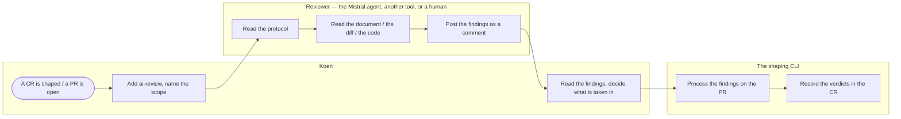

# Change Request 18 — Review on request: a change request and a PR reviewed through GitHub, by whoever is asked

**Project:** Web Portal "Raak Millegem"
**Status:** shaped on 3 October 2026 · on hold — Koen walks through it before anything is assigned
**Tracking issue:** #1455 — the one place where what is open stands; this document is the design, the issue is the status
**Applies to:** the review procedure and its artifacts (`docs/review-protocol.md`, the PR description template, one label); no product code, no database, no screen.
**Reading:** A 612 words · B 1450 · C 1320 — measured on 3 October 2026; the budget is A ≤ 1 500, B ≤ 2 500

---

# Part A — The business

## A1. Reason to act — the trigger

Change requests are shaped in the Claude Code CLI and reviewed by an outside AI (Mistral) by copy-paste: Koen opens the document in the chat, waits, and pastes the findings back into the CLI. It works — CR-15 and CR-19 were corrected by it — but it is hand-work through one man's clipboard, and it only serves the document half. The code half has no outside review at all: a PR is opened, CI runs its gates, the master CLI looks with its own eye, and the merge happens. Nobody else, human or tool, is asked.

What the platform owner asks: a review that can be *triggered* — a change request, and later every PR that carries code — so that a second pair of eyes (an AI tool or a human) starts on request, reads against the house conventions, and answers on GitHub, where the work already lives. Not automatic: a review starts when Koen asks for it, never on its own.

## A2. As-is process — how it works today, and where it hurts

Two actors: the platform owner (Koen) and the reviewers (the Claude Code CLI that shapes, the outside AI that reviews). Measured on 3 October 2026.

| # | Step | Who | Today | Pain |
|---|---|---|---|---|
| 1 | Shape a change request | Koen + the CLI | a `docs/change_request_<NN>_<slug>.md` per the template | none — this works |
| 2 | Ask for a review | Koen | open the chat, paste the whole document by hand | the document is 30–60 KB; pasting it is work, and the reviewer sees a copy, not the repository |
| 3 | Get the findings back | Koen | read the chat, copy the remarks, paste them into the CLI | the findings live in a chat transcript, not next to the document they are about |
| 4 | Review a PR | nobody | CI runs lint, the suite and the pip-audit; the master CLI looks | no outside review of code exists; the judgment layer (style, conventions, "does this fit the CR") has one eye |
| 5 | Do it again next time | Koen | the same clipboard round-trip | every review re-invents what to look at; the checklist is in nobody's head twice |

What the measurement adds: the reviews of 2 October 2026 found real defects (CR-15's copy path that did not exist, the `org_type` string comparison in CR-19) — the process earns its keep; what it lacks is a trigger and a home, not a reviewer.

## A3. To-be process — how it should work afterwards

Same actors, one new lane: the reviewer, started by a request on GitHub.

- Step 2 becomes *ask on GitHub*: the change request lands on its branch and the review is requested with one label and one sentence on the PR or the tracking issue; the reviewer reads the document *in the repository*, with the code next to it to verify premises.
- Step 3 becomes *findings on GitHub*: the reviewer answers as a comment on the PR or issue, structured by the protocol; the CLI that shapes reads them there and processes them; nothing passes through a clipboard.
- Step 4 (code review) gets the same shape: a PR that carries code gets the label, the reviewer reads the diff against the conventions and the CR it implements, and answers on the PR; CI keeps the hard gates, the reviewer is the judgment layer, and Koen decides the merge.

The words the user reads: the label **`ai-review`**; the review request "review please, <scope>"; the findings comment headed **"Review — <date>, <scope>"**.

## A4. Benefits — what the change earns

- **No clipboard:** the document and the findings live next to the work; the round-trip is a link, not a paste.
- **Any reviewer:** the trigger names a task, not a tool — the Mistral agent, another AI, or a human gets the same scope and the same protocol.
- **A second eye on code:** the judgment layer (conventions, CR-conformance, "would this test go red") gets a review it never had, at check-in time, without new infrastructure.
- **One checklist, written once:** the protocol is a document in the repo, so every review asks the same questions the last one learned to ask.

## A5. Supplied material — and what it taught us

- The reviews of CR-15 and CR-19 (2–3 October 2026): copy-paste today; their findings are the proof the process pays.
- `docs/change_request_template.md`: the five rules (measured premises, exceptions named, screens shown, business copy, close-out) — the protocol reviews a change request against exactly these.
- `CLAUDE.md` (the workflow, the test-evidence conventions, the fixed UI decisions) and `docs/code-style.md`: the conventions a code review reads against.
- `backend/app/domains/*/CONTRACT.md` (measured: every domain has one) and the gates (`test_import_boundaries`, `test_layer_gate`, …): what CI already proves, so the reviewer does not repeat the machine but reads what the machine cannot.
- The CI workflow `.github/workflows/backend-tests.yml`: lint, the suite, pip-audit — the hard half of a review that already exists.

## A6. Business requirements — what the board asks, with MoSCoW

| # | Requirement | MoSCoW | Source | Comment |
|---|---|---|---|---|
| R1 | A review starts on request, from GitHub: one label and one sentence on the PR or the tracking issue. | Must | Koen, 3 Oct 2026 | never automatically |
| R2 | The same trigger and the same protocol serve both a change request review and a code review of a PR. | Must | Koen, 3 Oct 2026 | two scopes, one shape |
| R3 | The findings arrive as a comment on that PR or issue, structured by a protocol that lives in the repository. | Must | Koen, 3 Oct 2026 | |
| R4 | The reviewer can read the repository: the document, the diff, and the code a claim refers to. | Must | author, from the 2 Oct findings | a review that cannot measure is an opinion |
| R5 | The review is advisory: Koen (with the shaping CLI) decides what is taken in; nothing blocks a merge but CI. | Must | Koen, 3 Oct 2026 | the reviewer proposes, the owner disposes |
| R6 | The protocol names the conventions to read against: the template's five rules, `CLAUDE.md`, `docs/code-style.md`, the domain contracts. | Should | author | |
| R7 | A review request can name a tool or a person; a human can run the same protocol. | Should | Koen, 3 Oct 2026 | |
| R8 | Reviews start automatically on every push or PR. | Won't | Koen, 3 Oct 2026 | "gelieve niet automatisch te laten beginnen" |
| R9 | The reviewer's findings are machine-enforced (a required CI check that a review happened). | Won't | author | advisory means advisory |
| R10 | A dashboard or report of reviews given, taken in, and rejected. | Won't | author | nothing asked |

## A7. Non-functional requirements — security, privacy, house style, tenants

| Concern | This change |
|---|---|
| **Security** | No new entrance: the reviewer works through the existing GitHub access of the tool or person asked; the repository is public (CLAUDE.md: "This repository is PUBLIC"), so a review reads what the world can read. No secret, no token, no workflow input is added. |
| **Privacy** | No personal data; review comments are text about documents and code. |
| **House style / UI norm** | No screen. The findings comment follows the repo's Markdown conventions (English, tables where a table fits). |
| **Multi-tenant** | Not applicable: a procedure, not a feature of the portal. |

## A8. Acceptance criteria — what the business signs off on HDEV

Not applicable — a process change with no screen and no deploy. The walkthrough of B2 serves as the sign-off: a review asked, a review answered, a finding taken in, on the CR-18 or CR-19 PR itself.

---

# Part B — The solution, for whoever approves it

## B1. Solution outline — the solution and the decisions that shape it

GitHub is the bus; the review is a request and an answer that both live there; the protocol is a document in the repo that any reviewer — the Mistral agent through its GitHub App, another AI tool, a human with a browser — reads and follows. Three artifacts carry it: **the protocol** (`docs/review-protocol.md`): what a review of a change request asks, what a review of a PR asks, in the order the template's five rules already teach; **the label** (`ai-review`) plus one sentence on the PR or issue: the trigger, on request only; **the PR description template** for code PRs: what the builder states (the CR it implements, the gates that prove it), so the reviewer starts from a claim, not a guess.

Decisions that shape it, each with the rejected alternative (the reasoning in C4):

- **Findings as a PR/issue comment** (C4.1). Rejected alternative: findings in a file in the repo. A comment is where the discussion already lives, it threads per remark, and it costs no commit.
- **The protocol is a document, the reviewer is not named in it** (C4.2). Rejected alternative: a tool-specific integration (a webhook, a bot) per reviewer. The request names the task; whoever picks it up gets the same scope; swapping the Mistral agent for another tool or a human changes nothing in the repo.
- **Advisory, never a required check** (C4.3). Rejected alternative: a status check that blocks the merge. CI owns the hard gates; the review is the judgment layer; Koen decides.
- **Explicit trigger only** (C4.4). Rejected alternative: review on every PR. Asked-for reviews get read; unsolicited noise gets ignored, and costs run up.

### B1.1 Functional analysis — the derived requirements

| # | Derived requirement | From |
|---|---|---|
| F1 | `docs/review-protocol.md`, drafted in the appendix: two checklists (change request, PR), each ending in the same three verdicts: *take in*, *already decided*, *not taken, with the reason*. | R2, R3, R6 |
| F2 | The label `ai-review` on a PR or the tracking issue, plus a comment naming the scope; the reviewer answers as a comment headed "Review — <date>, <scope>". | R1, R3 |
| F3 | A PR description template (`.github/PULL_REQUEST_TEMPLATE.md`), drafted in the appendix, for code PRs: the CR or issue, what changed per module, the evidence (CI run, tests added, gates proven). | R2, R4 |
| F4 | The shaping CLI reads the findings from the PR/issue and processes them there; the decisions log of the CR records what was taken in (as CR-15's Q10 does). | R3, R5 |
| F5 | `CLAUDE.md`'s workflow section gains three lines: the label, the protocol, the advisory rule. | R6 |

## B2. Fit with the process and the requirements — for the business



What to see in it: the clipboard is gone; every arrow is a link on GitHub; the reviewer is a lane, not a tool.

**Traceability matrix**

| R | How the solution meets it | F | Test (C6) | AC |
|---|---|---|---|---|
| R1 asked, never automatic | the label and the sentence are the only trigger | F2 | 1 | walkthrough |
| R2 two scopes, one shape | the protocol's two checklists, one trigger | F1, F3 | 1, 2 | walkthrough |
| R3 findings on GitHub | the comment, headed and structured | F2, F4 | 1, 2 | walkthrough |
| R4 the reviewer reads the repo | the reviewer works from the PR/issue, repository access assumed | F3, F4 | 1 | walkthrough |
| R5 advisory | no check, Koen decides | F4 | 1 | walkthrough |
| R6 the conventions named | the protocol lists its sources | F1, F5 | 3 | walkthrough |
| R7 any reviewer | the protocol names no tool | F1 | 1 | walkthrough |
| R8–R10 | Won't | — | — | — |

**Walkthrough** (on the CR-18 PR itself, then on the first code PR after it):

1. Koen pushes the CR-18 branch, opens the PR, adds `ai-review`, comments "review please, the document". *See:* the review arrives as a comment on the PR, structured by the protocol, with its findings measured against the code where it claims a premise.
2. The CLI processes the findings on the PR; the verdicts land in the CR's decisions log. *See:* no clipboard anywhere; the trail is the PR.
3. The first code PR after: the description follows the template, Koen adds the label, the review reads the diff against `CLAUDE.md` and the CR the PR implements. *See:* findings on the PR; CI green independently; Koen merges when he is satisfied.

## B3. The whole across the modules — for the architect

No product module is touched. The artifacts: `docs/review-protocol.md` (new), `.github/PULL_REQUEST_TEMPLATE.md` (new), the `ai-review` label (new, GitHub-side), three lines in `CLAUDE.md` (changed). No workflow, no webhook, no secret, no migration, no env var.

Who calls whom: Koen triggers on GitHub; the reviewer reads the protocol from the repo and answers on the PR/issue; the shaping CLI reads and processes the comment. Nothing in the backend changes.

## B4. Rules this change needs an exception from — decided once, here

| Rule (where) | What the design does instead | Mechanism | Temporary until … / the new rule | Decided |
|---|---|---|---|---|
| None. Checked: no code, no schema, no import; the CI gates are untouched; the Europe First rule (no new tool is *required* — the reviewer may be any tool or a human). | — | — | — | — |

## B5. Cost — investment and running cost, and what operations must know

**Investment:** the protocol ~0.5 CLI-day (it restates the template's five rules and the test-evidence conventions, each with a pointer), the PR template 0.25, the label and the CLAUDE.md lines 0.25, the trial run of the walkthrough 0.5. **~1.5 CLI-days**, no purchases.

**Running cost:** a review costs what a review costs (a session of the reviewer asked); nothing runs unasked. **Operations:** nothing — no env var, no deploy.

## B6. Phasing — shippable phases, and what changes on the failure paths

| Phase | Delivers | Migration | Failure paths that change | Manual validation |
|---|---|---|---|---|
| **1 — the review loop on documents** | the protocol, the label, the CLAUDE.md lines; the walkthrough on this CR's own PR | none | none | step 1–2 |
| **2 — the code PR half** | the PR description template; the protocol's PR checklist; the first code review | none | none | step 3 |

## B7. Rule and gatekeeper — what this fixes for all future work

1. **The rule.** *A review is asked for with the label and a sentence, answered as a comment on the PR or issue, structured by `docs/review-protocol.md`, and advisory.* Lives in `CLAUDE.md`'s workflow section.
2. **Reach and baseline.** Every change request and every code PR. Measured on 3 October 2026: two reviews given (copy-paste), zero PR reviews, no protocol written down.
3. **The gate.** None — a procedure cannot be gated; the `design-conformiteit-bewaker` agent and the merge eye keep their role.

## B8. Open decisions — what the approver still decides

| Decision | Options |
|---|---|
| Does the review of a code PR become standard for *every* code PR from a certain release on (still on request, but the request becomes habit), or stays per-PR? | per-PR now (proposed) · always-ask from release vX |
| The findings language | English like the docs (proposed) · Dutch |

## B9. Decisions log — dated answers

| Date | Decision | By |
|---|---|---|
| 2 Oct 2026 | The number CR-18 and issue #1455 reserved for "code review by other AI tool". | Koen |
| 3 Oct 2026 | *Proposed:* the GitHub bus, the protocol, the label, advisory reviews, explicit trigger, PR template; CR review and code review as one shape. | author |

---

# Part C — The build, for the master CLI and the dev CLIs

## C1. Verified premises — measured before the handover

| Claim | Measured how | Result | Consequence |
|---|---|---|---|
| The reviews of CR-15 and CR-19 arrived by copy-paste | the Q&A logs of both (CR-15 Q10: "pasted by Koen") | true | the process works; the trigger and the home are missing |
| No PR review exists beyond CI and the master CLI's eye | `.github/workflows/backend-tests.yml` (lint, pytest, pip-audit); `CLAUDE.md`'s workflow section names no reviewer | true | F3, phase 2 |
| The conventions a review reads against exist in writing | `CLAUDE.md` (1 183 lines), `docs/code-style.md`, `CONTRACT.md` per domain (measured: every domain has one), the template's five rules | true | the protocol can point instead of restate |
| The hard gates already exist in CI and need no duplicate | `test_import_boundaries`, `test_layer_gate`, `test_schema_boundaries`, the render gate, `ruff` | true | the protocol reviews what the machine cannot judge |
| The repository is public | `CLAUDE.md` §"This repository is PUBLIC" | true | any reviewer reads without new access |
| No `ai-review` label or PR template exists | `gh label list`, absence of `.github/PULL_REQUEST_TEMPLATE.md` | true | F2, F3 |

## C2. Per module: what must happen

#### docs (phase 1)

- **`docs/review-protocol.md`** — two checklists. *A change request:* the template's five rules each asked concretely (are C1's premises measured with file and line; are exceptions named in B4; is C9 handled or waived; is the user's copy in A3; does the reading budget hold); Part A free of components; the Won'ts deliberate; the ACs walkable. *A PR:* the description states the CR and the evidence; the diff stays in its CR's scope; the conventions (`CLAUDE.md`, code-style, the domain's CONTRACT) hold; every new test could go red; no copy-paste shape the gates forbid. Both end in the three verdicts.
- **`CLAUDE.md`** — three lines in the workflow section: the label, the protocol, "advisory; Koen decides".

#### .github (phase 2)

- **`.github/PULL_REQUEST_TEMPLATE.md`** — the CR/issue, what changed per module, the evidence (CI run, tests, gates proven), the "Na de merge" line if any.
- **The label** `ai-review` on the repository (GitHub-side, no file).

#### backend — none

No code, no migration, no test. The gates keep their role; nothing in this change is machine-checkable by nature.

## C3. Cross-cutting impact — the checklist of what gets forgotten

| Row | Answer |
|---|---|
| Reporting views and saved reports | no |
| Existing tests, e2e flows, screenshots | no |
| Fixed UI decisions and `CLAUDE.md` | yes — three lines added |
| Design-system documentation | no |
| Code lists | no |
| Events and handlers | no |
| Mail templates | no |
| Migration | none |
| Tenant settings, env vars | no |
| JSON routes and API callers | no |
| External services | none required; the reviewer's own access is its own affair |

## C4. Detailed decisions — one subsection each, with the reasons

### C4.1 Findings as a comment

The findings belong where the work is discussed: the PR or the tracking issue. A file would need a commit per review and threads nothing; a chat (the status quo) is invisible to the repository. A comment links to the lines it is about, threads per remark, and closes the loop for whoever reads the PR later.

### C4.2 The protocol names no tool

Koen asked for a review that another AI or a human could run tomorrow. A tool-specific integration (a bot account, a webhook, an API token) would couple the procedure to one vendor and add an entrance to maintain. The protocol is a document; the trigger is a label and a sentence; whoever reads both can review. Swapping the Mistral agent for another tool, or asking a colleague, changes nothing in the repo.

### C4.3 Advisory, never a required check

CI owns the hard truth: lint, the suite, the audit, the gates. A review that could block a merge would either rubber-stamp (worse than nothing, per the test-evidence convention's own warning about green-without-proof) or stall a volunteer's PR on a judgment call. The reviewer proposes with reasons; Koen and the shaping CLI dispose; the decisions log records the verdicts so a finding is never lost silently.

### C4.4 Explicit trigger only

"Op mijn vraag uiteraard" — Koen's words. An automatic review on every push would spend sessions unsupervised and bury the findings in noise. The label is one click; the sentence is one line; the cost lands only where the owner asked for it.

## C5. Privacy and security — the mechanics behind A7

- No token, no secret, no workflow input is added; the repository is public and the reviewer reads what it already shows.
- A reviewer, human or tool, is granted nothing by this change; its access to GitHub is its own.
- Findings are text about documents and code; no personal data enters them.

## C6. Tests — what the build must prove

Nothing in pytest; the proof is the walkthrough of B2, run twice (document scope, code scope). The one check that could be red: the protocol must name a source for every checklist item (a pointer to `CLAUDE.md`, the template, or a CONTRACT), so it never invents a convention the repo does not carry — checked by reading, once, at the build.

## C7. The gate — what refuses a deviation from now on

None, and written down as such: a procedure is kept by habit, not by a gate. The merge eye and the `design-conformiteit-bewaker` agent keep their existing roles.

## C8. Prototype findings — what was measured before the build

See C1. Nothing prototyped; the two copy-paste reviews of 2 October 2026 are the prototype, and their yield (a wrong premise caught in CR-15, a latent bug caught in CR-19) is the evidence the process is worth a trigger.

## C9. Screens before the build — the concepts the approver saw

Waived: no screen. The protocol document itself is the artifact Koen reads.

## C10. Close-out at the release

Not yet: on hold, nothing built. Filled in when the release that builds this change runs on PROD (`CLAUDE.md`, release step 14) — for a process change, that is: the first review asked and answered through the loop, named here.

---

## Appendix — the drafts the build will turn into files

Nothing of this exists yet; it is the shape of the artifacts phase 1 and 2 will create, written here so the approver signs off the words themselves.

### The protocol (`docs/review-protocol.md`, phase 1)

> One trigger, one answer, one place: a review is asked for with the **`ai-review`** label plus one sentence on the PR or the tracking issue, and it is answered as a comment on that PR or issue. It is *advisory*: nothing blocks a merge but CI, and the platform owner decides what is taken in. Any reviewer — an AI tool or a human — gets the same scope. Never automatic: a review starts only when asked.

**The request.** Add the label `ai-review`; comment: *review please, <scope>* — "the document" for a change request, "the diff against CR-<NN>" for a PR.

**The answer.** One comment, headed **"Review — <date>, <scope>"**, findings grouped by weight, each with file and line or section; ending with the verdict list (*take in* · *already decided* · *not taken, with the reason*).

**Checklist — a change request.** 1. Premises measured: every "as X already does" claim carries file and line in C1. 2. Exceptions named once (B4). 3. Screens shown or waived (C9). 4. The user's words in A3; no components in Part A. 5. The shape holds: deliberate Won'ts, walkable ACs, the reading budget, no old decision lingering against a new one. 6. The tests could go red.

**Checklist — a PR with code.** 1. The description states its claim (CR, modules, evidence). 2. Scope: the diff stays inside its CR. 3. Conventions hold (`CLAUDE.md`, `docs/code-style.md`, the domain's `CONTRACT.md`). 4. Every new test could go red. 5. No copy-paste of a fact the codebase keeps in one place.

**Sources.** Every item points at `docs/change_request_template.md` (the five rules), `CLAUDE.md`, `docs/code-style.md`, the contracts, and the CR the PR implements; a convention found nowhere in those is an observation, not a finding.

### The PR description template (`.github/PULL_REQUEST_TEMPLATE.md`, phase 2)

```markdown
## Summary
- The change request or issue this PR implements: <CR-NN / #issue>
- What changed, per module: <one line per module>

## Evidence
- CI run: <run-id + link, pytest summary (N passed)>
- Tests added: <which invariant each proves, and how each could go red>
- Gates proven by violation: <which, what was broken to prove it>

## Na de merge
- <what the release issue must name, if anything>
```

## Q&A log — asked once, answered here

| # | Date | Question (who) | Answer |
|---|---|---|---|
| Q1 | 3 Oct 2026 | Does the trigger need a CLI installed on Koen's Debian machines? (Koen) | *No.* The trigger lives on GitHub: the label and the sentence are added in the web client (or `gh`, or from a phone); the reviewer works from the repository. Nothing is installed on the desktop or the laptop. |
| Q2 | 3 Oct 2026 | Which tools can review? (Koen) | Any that can read the repository and answer on the PR or issue: the Mistral agent through its GitHub integration, another AI tool Koen grants, or a human with a browser. The protocol and the trigger name a scope, not a vendor. |
| Q3 | 3 Oct 2026 | Could reviews start automatically on check-in? (author) | R8 Won't — asked for, never automatic; the label is one click when the habit forms. |
| Q4 | 3 Oct 2026 | Does a review block the merge? (author) | No — advisory (R5, C4.3); CI stays the only blocker; Koen decides with the findings in hand. |

## Non-goals — deliberately outside this change

- Automatic reviews on push or PR (R8, Won't).
- A required CI check for a review (R9, Won't).
- Dashboards or reporting on reviews (R10, Won't).
- Tool-specific integrations (webhooks, bot accounts, tokens) — the protocol names no tool (C4.2).
- Changing the existing gates, CI, or the merge process.

## Relationship to existing work — issues and change requests

- **#1455** — the tracking issue of this change (number reserved 2 October 2026).
- **CR-15, CR-19** — the two reviews of 2–3 October 2026, the process's proof; their decisions logs show the verdicts this change standardises.
- **`docs/change_request_template.md`** — the five rules the protocol restates as questions.
- **`CLAUDE.md`**, **`docs/code-style.md`**, the domains' **`CONTRACT.md`** — the conventions the protocol points to, never restates.
