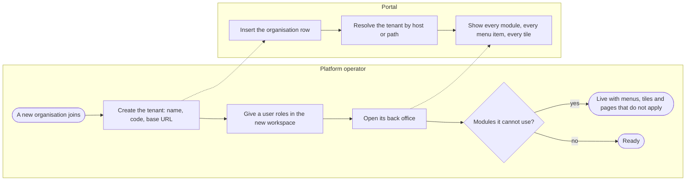
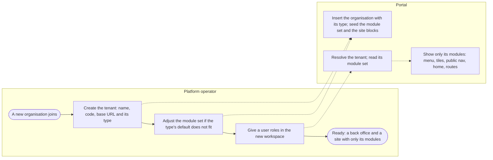
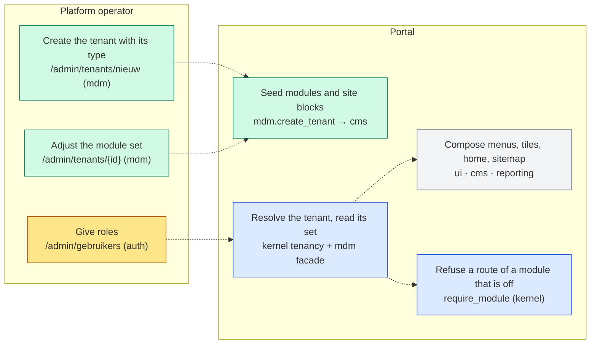
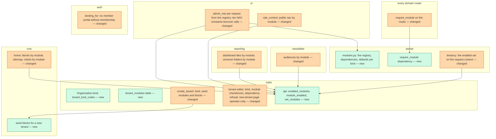
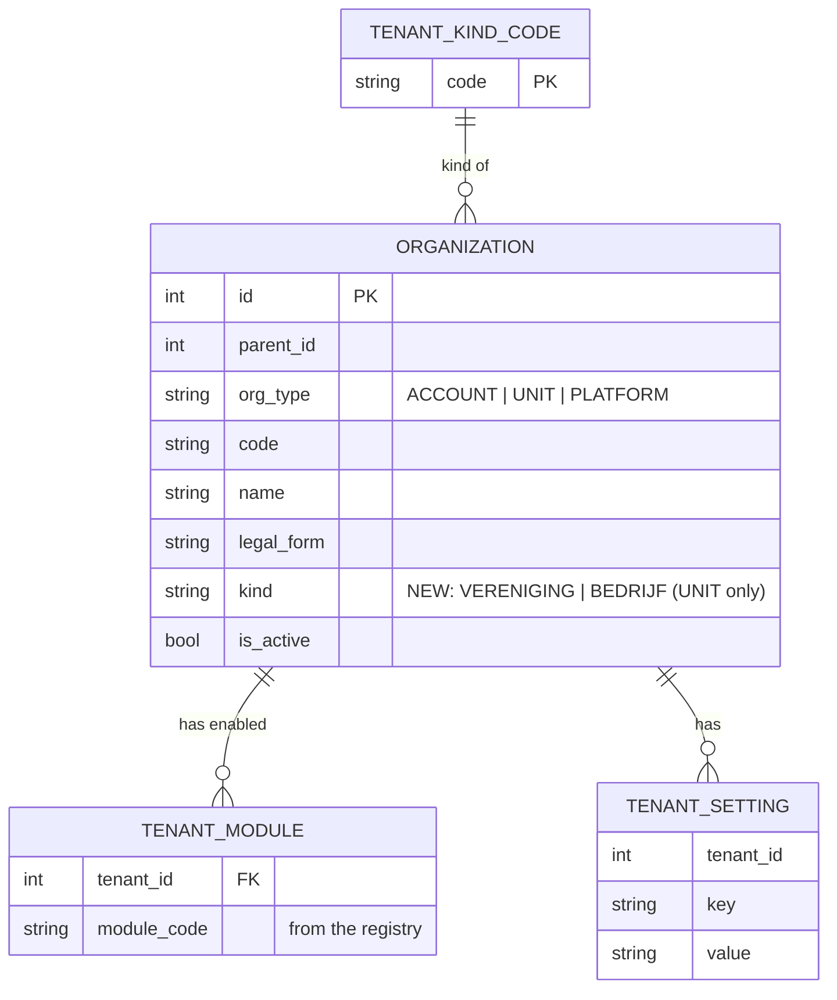

# Change Request 19 — Tenant types and modules per tenant: an organisation that is not an association

**Project:** Web Portal "Raak Millegem"
**Status:** shaped on 2 October 2026 · walked through on 2 October 2026, every question answered · **go: v2.13.0 (#1469), planned by the master CLI** (2 Oct 2026); C9 waived
**Tracking issue:** #1468 — the one place where what is open stands; this document is the design, the issue is the status
**Applies to:** the tenant model and its editor (mdm, kernel tenant settings), the admin and public navigation (ui), the route guards of every domain, the home page and sitemap (cms), the dashboard and the reporting universe (reporting), tenant provisioning (mdm).
**Reading:** A 1992 words · B 3097 · C 3052 — words to read, drawings excluded, measured on 2 October 2026; the budget is A ≤ 1 500, B ≤ 2 500

---

# Part A — The business

## A1. Reason to act — the trigger

The platform was built for one association and its departments: every tenant is a department of RAAK with members, activities, registrations and payments, and every screen assumes so. The architecture always meant more — "ACCOUNT: next customer = configuration, not code", a platform tenant exists since #854 "because companies may become customers too" — but nothing lets a tenant *be* something else. The first organisation that is not an association is now in sight: a company that has no members and runs no activities, but wants a website on the platform with a few pages, pictures, and a form through which a visitor asks for a quote; later perhaps a newsletter, payments and a shop.

Today such a tenant would get a back office with Leden, Activiteiten and Vergaderingen it cannot use, a public site whose home page shows a membership price and an activity agenda, and a login that lands on "Mijn gezin". What stops the association's platform from serving another kind of organisation is not a missing module; it is that every module is always on, for everyone.

What the platform owner asks: that a tenant has a **type** and a **set of modules**, so that a department of the association keeps working exactly as today, and a tenant of another type gets only what it needs — the behaviour of the public site and the back office following that set. Minimal now; a template per type to reset to, later.

## A2. As-is process — how it works today, and where it hurts

Two actors: the platform operator (the one person who creates and administers tenants) and the portal. Measured on 2 October 2026.

| # | Step | Who | Today | Pain |
|---|---|---|---|---|
| 1 | Create the tenant | operator | `/admin/tenants/nieuw`: name, code, parent, base URL; one organisation row of type UNIT | nothing else is seeded — no home block, no footer block, no settings; the new site is empty until the operator fills the CMS blocks by hand |
| 2 | Roles | operator | roles per workspace on `/admin/gebruikers` | fine |
| 3 | The back office of the new tenant | operator | the full menu: Werkbank, Activiteiten, Leden, Formulieren, Pagina's, Media, Raakje, Betalingen, Vergaderingen, Nieuwsbrief, Design Studio, Dashboard, Rapporten, Gebruikers, … | **everything is always on**; a company sees Leden and Activiteiten it will never fill |
| 4 | The dashboard | operator | six tiles: Gezinnen, Actieve gezinnen, Personen, Komende activiteiten, Open taken, Openstaand saldo | four of six are about members and activities |
| 5 | The public site | visitor | Home with the membership price band and the activity cards; nav Home · Foto's · Archief · pages · Aanmelden; sitemap with `/activiteiten`, `/lid-worden` | a company's home page advertises a membership it does not sell |
| 6 | Logging in as the organisation's user | user | lands on `/leden/gezin` unless admin | a member portal for a tenant without members |
| 7 | Turning something off | operator | one precedent: `admin_chat_enabled`, an environment switch and a tenant key in series; its menu item stays visible | no module switch exists; every other module is code with no setting |
| 8 | Telling types apart | operator | `legal_form` on the organisation (VZW, feitelijke vereniging, bedrijf) | a legal form is not what the site is for; nothing reads it |

What the measurement adds: there is no tenants table — a tenant is an `mdm.organizations` row with `org_type` UNIT (the platform is PLATFORM); the routers are included statically in `main.py`, with no conditional; ten admin modules compute their navigation once at import time, so a per-tenant menu needs those to become per-request; the admin menu's desktop and phone renderings already share one source.

## A3. To-be process — how it should work afterwards

What changes, one line each:

- Step 2: the tenant gets a **type** at creation; the type gives the default **module set** and the site's starting blocks, so the new site is not empty.
- Step 3 is new and optional: the operator switches a module on or off for one tenant; a module another module needs cannot be switched off alone.
- Step 5 and 7 of the as-is disappear: a module that is off is absent from the back-office menu, the dashboard, the public navigation, the home page, the sitemap, and its routes answer "not found" for that tenant.
- The departments of the association are of type *association* with every module on, and notice nothing.

The words the user reads (the type names, the module names in the tenant editor): *Vereniging* and *Bedrijf* for the types; the module names are the menu items as they are today (Activiteiten, Leden, Betalingen, Formulieren, Pagina's, Media, Nieuwsbrief, Vergaderingen, Design Studio, Rapporten, Werkbank, Raakje).

## A4. Benefits — what the change earns

- **Possible at all:** a second kind of organisation on the platform without a second code base, and without the first kind noticing.
- **A clean workplace for the new tenant:** no menus, tiles or pages about things it does not do — the condition for anyone outside the association taking the back office seriously.
- **A website with a form in days, not weeks:** pages, pictures and the forms module already exist; this change only lets a tenant have exactly those.
- **The architecture's promise kept:** "next customer = configuration, not code" becomes true for the module set; the template per type later builds on the same switch.
- Not quantified in money; the first line decides.

## A5. Supplied material — and what it taught us

- The platform owner's brief of 2 October 2026 (spoken): a type per tenant, a module set with defaults per type, the association's departments unchanged, a company tenant with pages, media, forms and the workbench, payments later, newsletter and reports as Could, no meetings as they are today, no membership, no activities (an activity as a block on a page, later); the operator creates and administers, no new user management; a template per type later.
- `docs/architecture.md` §5.1 and §8: the account/unit tree, the per-tenant config and secrets, the platform tenant, and the stated horizon of other organisation kinds; §5.2's honest gaps. The roadmap table has no row for this; it gets one.
- CR-11 A1's background paragraph: kit apart from brand, so a second organisation changes the brand and inherits the kit — this change is the module half of the same thought.
- Measured: `admin_chat_enabled` as the one precedent of a per-tenant switch; the tenant editor's 21 known keys and 2 secrets; `create_tenant` seeding nothing; the hard-coded sitemap paths; the dashboard tiles; the newsletter audiences (members / non-members / both); the reporting universe's folders per module.
- Reporting need: none new. The reporting module itself becomes switchable; what it shows follows the module set (C2).

## A6. Business requirements — what the board asks, with MoSCoW

| # | Requirement | MoSCoW | Source | Comment |
|---|---|---|---|---|
| R1 | A tenant has a type — *vereniging* or *bedrijf* — chosen when it is created, and the type sets which modules the tenant starts with. | Must | platform owner, 2 Oct 2026 | |
| R2 | The platform operator can switch a module on or off for one tenant; the departments of the association keep every module on and notice nothing. | Must | platform owner, 2 Oct 2026 | |
| R3 | A module that is off is absent everywhere for that tenant: the back-office menu, the dashboard, the public navigation, the home page, the sitemap, and its pages answer "not found". | Must | platform owner, 2 Oct 2026 | "het gedrag van front-end en back-end" |
| R4 | A tenant of type *bedrijf* starts with pages, media, forms and the workbench, so that a website with a quote-request form can be made the day it is created. | Must | platform owner, 2 Oct 2026 | the first use |
| R5 | A new tenant's site is not empty: it starts with a home text block and a footer block to edit. | Should | author, from the measurement | today `create_tenant` seeds nothing |
| R6 | A module that another module needs cannot be switched off alone (payments need something to pay for; the Design Studio needs activities). | Must | author | the editor refuses, naming the dependency |
| R7 | A company tenant can take payments through the platform later, when it has something to sell. | Could | platform owner, 2 Oct 2026 | the switch exists from day one; nothing to build for it now |
| R8 | Newsletter and reports for a company tenant. | Could | platform owner, 2 Oct 2026 | switchable; the newsletter's audiences and the reports' folders follow the module set |
| R9 | A template per type, to which a tenant's settings and modules can be reset. | Won't (now) | platform owner, 2 Oct 2026 | later; the type's defaults are its first form |
| R10 | Meetings for a company tenant, in their present form. | Won't | platform owner, 2 Oct 2026 | |
| R11 | A shop, products or services, a company's own user management or sign-on. | Won't | platform owner, 2 Oct 2026 | own change requests when they come |
| R12 | Reporting: nothing new to count or export. | Won't | author | |

## A7. Non-functional requirements — security, privacy, house style, tenants

| Concern | This change |
|---|---|
| **Security** | Only the platform operator sets a tenant's type and modules (the tenant editor is operator-only today; one gap closes: the "new tenant" page is reachable by any admin while its save is operator-only). A switched-off module answers "not found" to everyone, including an admin of that tenant. No new input from outside. |
| **Privacy** | No personal data is added. A tenant without the membership module holds no members and shows no member portal. |
| **House style / UI norm** | The tenant editor's module set is a checkbox group of the kit; the menus already have one source each (admin, public). CR-11's frame will carry the per-tenant menu as data. |
| **Multi-tenant** | This is the multi-tenant change: type and module set are per tenant; the registry of modules and the dependencies are platform-wide. |

## A8. Acceptance criteria — what the business signs off on HDEV

| # | Criterion | Requirement | Walkthrough steps |
|---|---|---|---|
| AC1 | A new tenant of type *bedrijf* shows, logged in as its admin, a back-office menu with Werkbank, Formulieren, Pagina's, Media, Gebruikers and the system items only; its dashboard shows no member or activity tiles. | R1, R3, R4 | 1–4 |
| AC2 | Its public site shows Home with the home block and no membership band or activity cards; the navigation has Home, the pages and the login; `/activiteiten` and `/lid-worden` answer "not found"; the sitemap lists neither. | R3, R5 | 5–7 |
| AC3 | A visitor fills in a form on that site and the submission appears in the tenant's Formulieren and Werkbank. | R4 | 8 |
| AC4 | The operator switches Nieuwsbrief on for the company tenant: the menu item appears, the public newsletter sign-up appears, the audience choice offers only "iedereen". Switching Activiteiten off while Design Studio is on is refused with the reason. | R2, R6, R8 | 9–11 |
| AC5 | The association's departments show every module, the same menus, tiles and pages as before, and their screenshots at 390 and 1 440 px are unchanged. | R2 | 12 |

---

# Part B — The solution, for whoever approves it

## B1. Solution outline — the solution and the decisions that shape it

A **module registry** in code names the platform's modules and what each one owns: its admin menu items, its public navigation items, its route prefixes, its dashboard tiles, its home-page blocks, its sitemap paths, its newsletter audiences and reporting folders, and the modules it depends on. A tenant carries a **type** (`vereniging`, `bedrijf`) and a **set of enabled modules**, stored with the tenant; the type gives the defaults at creation. One question, `module_enabled(tenant, module)`, is asked in the few places that compose a screen — the admin and public navigation, the dashboard, the home page, the sitemap — and by one dependency on every router, which answers "not found" when the tenant has the module off. Creating a tenant seeds its module set and its two site blocks. The tenant editor shows the modules as a checkbox group and refuses a set that breaks a dependency. Existing tenants are of type *vereniging* with every module on, by the migration.

Decisions that shape it, each with the rejected alternative (the reasoning in C4):

- **A type and a module set, not a type alone** (C4.1). Rejected alternative: behaviour derived from the type only. A type decides the defaults; the set decides behaviour, so a company can switch payments on later without becoming another type.
- **The registry is code; the enabled set is data** (C4.2). Rejected alternative: a modules table that also describes the modules. What a module owns changes with the code; what a tenant has on is a fact about the tenant.
- **Routes stay included; a dependency refuses** (C4.3). Rejected alternative: include routers per tenant. One app serves all tenants; the guard is a one-line dependency per router, the same shape as `require_admin_ui`.
- **Per-request navigation** (C4.4). Rejected alternative: keep the ten import-time menus and filter in the template. The menu must be computed per request to differ per tenant; that is the hidden cost of this change and it is paid once.
- **Dependencies between modules declared and enforced** (C4.5). Rejected alternative: trust the operator. A design without activities or a payment without a payable breaks at runtime, not at the switch.
- **Type on the organisation, next to legal form, not instead of it** (C4.6). Rejected alternative: read `legal_form`. A legal form is about law; a type is about what the site is for.

### B1.1 Functional analysis — the derived requirements

| # | Derived requirement | From |
|---|---|---|
| F1 | A module registry (`kernel/modules.py`): one entry per module with code, label, admin menu items, public nav items, route prefixes, dashboard tiles, home blocks, sitemap paths, newsletter audiences, reporting folders, dependencies. The admin menu groups of today are derived from it. | R3 |
| F2 | Tenant type: a code list `tenant_kind_codes` (`VERENIGING`, `BEDRIJF`) and a column `kind` on the UNIT organisation; defaults per kind in the registry. | R1 |
| F3 | Enabled modules per tenant: a table `mdm.tenant_modules (tenant_id, module_code)`; the facade `mdm.api.enabled_modules(tenant_id)` and `module_enabled(module)` for the current tenant, cached per request. | R2 |
| F4 | A router dependency `require_module(code)` on every domain router (JSON and UI) that answers 404 when the module is off for the resolved tenant. | R3 |
| F5 | The admin navigation computed per request from the registry and the tenant's set; the ten import-time `NAV` constants become a call. | R3 |
| F6 | The public shell's navigation, the home page's blocks, the sitemap and robots, the dashboard tiles, the newsletter's audiences and the reporting universe's folders read the module set. | R3, R8 |
| F7 | `create_tenant` takes the kind, seeds the module set from its defaults and the two CMS blocks (home-intro, site-footer) with placeholder text. | R1, R4, R5 |
| F8 | The tenant editor shows the kind (read-only after creation) and the modules as a checkbox group with the record count per module (F12); saving a set that breaks a dependency is refused naming it; the "new tenant" page becomes operator-only. | R2, R6 |
| F9 | The migration gives every existing UNIT kind `VERENIGING` and every module; the platform tenant keeps its own behaviour. | R2 |
| F10 | The login landing for a user without a member role on a tenant without the membership module goes to the back office or the home page, never to "Mijn gezin". | R3 |
| F11 | A CMS page flagged as the home page (`cms_pages.is_home`, one per tenant) renders at `/`; without one the shell's composition renders. | R3, R4 |
| F12 | Switching a module off deletes nothing and touches no row; its data is unreachable through the portal while it is off — for the operator too — and switching it on shows everything again. The editor shows beside each module how many records it holds for this tenant, so an operator sees what disappears from view. | R2, R3 |

## B2. Fit with the process and the requirements — for the business

Legend: green mdm · yellow auth · blue kernel · grey ui, cms, reporting.

**Traceability matrix**

| R | How the solution meets it | F | Module | Test (C6) | AC |
|---|---|---|---|---|---|
| R1 a type with defaults | kind code on the organisation, defaults in the registry, seeded at creation | F2, F7 | mdm, kernel | 1, 2 | AC1 |
| R2 switch per tenant, departments unchanged | the enabled set, the editor, the migration giving everyone everything | F3, F8, F9 | mdm | 3, 9 | AC4, AC5 |
| R3 off is absent everywhere | the registry, `require_module`, per-request menus, the composed screens | F1, F4, F5, F6 | kernel, ui, cms, reporting, every domain | 4, 5, 6, 7 | AC1, AC2 |
| R4 a company starts with pages, media, forms, workbench | the `BEDRIJF` defaults | F2, F7 | kernel, mdm | 2 | AC1, AC3 |
| R5 a site that is not empty | the two blocks seeded | F7 | mdm, cms | 8 | AC2 |
| R6 dependencies enforced | the registry's dependencies, the editor's refusal | F1, F8 | kernel, mdm | 9 | AC4 |
| R7 payments later | the switch exists; nothing else | F3 | — | — | — |
| R8 newsletter and reports switchable | audiences and folders follow the set | F6 | newsletter, reporting | 7 | AC4 |
| R9 template per kind | Won't now; the defaults are its first form | — | — | — | — |
| R10 meetings for a company | Won't; off by default for `BEDRIJF` | — | — | — | — |
| R11 shop, users, sign-on | Won't | — | — | — | — |
| R12 reporting | Won't | — | reporting: folders only | — | — |

**Walkthrough on HDEV** (the platform operator; a visitor for steps 5–8)

1. As operator on the platform, open "Nieuwe tenant", fill name, code, base URL, choose type *Bedrijf*, save. *See:* the tenant in the list with its type.
2. Open the tenant. *See:* the modules as checkboxes: Pagina's, Media, Formulieren, Werkbank ticked; the rest unticked; the type shown.
3. Give a user the ADMIN role in that workspace; log in as that user, switch to the workspace. *See:* the back-office menu: Werkbank · Formulieren · Pagina's · Media · Gebruikers · Wijzigingen · E-maillog · Info; no Activiteiten, Leden, Betalingen, Vergaderingen, Nieuwsbrief, Design Studio, Rapporten, Raakje.
4. Open the dashboard. *See:* Open taken only.
5. As a visitor, open the tenant's site. *See:* Home with the seeded home text, no membership band, no activity cards; the footer block; the navigation Home · Aanmelden.
6. Open `/activiteiten`, `/lid-worden`, `/fotos` on that site. *See:* "niet gevonden".
7. Open `/sitemap.xml`. *See:* the home page and the published pages only.
8. Create a form in the tenant's Formulieren, publish a page with its link, fill it in as a visitor. *See:* the submission on Formulieren and the task in Werkbank.
9. As operator, tick Nieuwsbrief for the tenant and save. *See:* the menu item appears; the public sign-up appears on the site; in a new letter the audience offers "iedereen" only.
10. Tick Design Studio without Activiteiten. *See:* refused: "Design Studio heeft Activiteiten nodig."
11. On the company tenant, flag a page "dit is de homepagina". *See:* `/` renders that page. Untick Pagina's. *See:* the public site's pages and navigation disappear and `/` falls back to the home block (the shell's).
12. Open a department of the association (Millegem) as its admin and as a visitor. *See:* everything as before; compare the screenshots.

## B3. The whole across the modules — for the architect

Legend: green new · orange changed.

**Data model at a glance**

Who calls whom: every domain router depends on `kernel.require_module(code)`, which reads the enabled set that the tenancy middleware put on the request context after resolving the tenant (one read per request, through `mdm.api.enabled_modules`); the ui's `admin_nav` and `site_context`, the cms home and sitemap, the dashboard and the reporting universe ask `module_enabled`; the registry itself is the kernel's and imports no domain — a domain's entry names its own menu items and prefixes as data. The direction stays domain → kernel and domain → `mdm.api`; the kernel imports no domain. Transaction boundary: switching modules is one transaction in the tenant editor's door; creation seeds in the same transaction as the organisation row. Impact: one column and one code list on `mdm.organizations`, one table; every router gains one dependency; ten modules lose an import-time constant; the render gate asserts the full menu for a `VERENIGING` tenant and the reduced one for a `BEDRIJF`; no route changes shape, no contract to an outside caller changes except that a disabled module's JSON routes answer 404 for that tenant.

## B4. Rules this change needs an exception from — decided once, here

| Rule (where) | What the design does instead | Mechanism | Temporary until … / the new rule | Decided |
|---|---|---|---|---|
| "The kernel imports no domain" — `test_import_boundaries` | unchanged: the registry is data in the kernel; the domains' entries are names and prefixes, not imports | — | not an exception; checked | — |
| The render gate asserts `len(_ADMIN_NAV) >= 13` and visits every item — `test_render_gate.py` | the gate runs for a `VERENIGING` tenant (every item) and for a `BEDRIJF` tenant (the reduced menu, and 404 on the rest) | C6 test 5 | **the new rule**: the gate visits the menu per kind | *B8 Q1* |
| Code lists are code tables with a label table (CR-12) | `tenant_kind_codes` follows it; the **module codes do not** — they are code (the registry), as CR-17's block types are | the registry is the one source; a label per module lives in it | the new rule for module codes | *B8 Q2* |
| None else. Checked: `COMMAND_CALLS` (no new cross-domain command), the layer gate (the editor stays a view-model screen), CR-11's R13 (the menu as data is what it asks). | | | | |

## B5. Cost — investment and running cost, and what operations must know

| Module | Ph 1 registry and guards | Ph 2 kind, editor, provisioning | Total |
|---|---|---|---|
| kernel | 1 | — | 1 |
| ui (the ten menus per request, public nav) | 1.5 | — | 1.5 |
| cms, reporting, newsletter, auth (composition by module) | 1 | 0.5 | 1.5 |
| every domain router (the dependency) | 0.5 | — | 0.5 |
| mdm (kind, table, editor, provisioning, migration) | — | 1.5 | 1.5 |
| tests | 1 | 0.5 | 1.5 |
| **Total** | **5** | **2.5** | **~7.5** |

Plus this analysis (~0.5) and one HDEV validation per phase. No purchases.

**Running cost:** none. **Operations:** no env var for the module set (it is data). A tenant on its own domain still needs what it needs today: DNS, a site block variable in the shared Caddy's parts and in `.env.caddy` ("weg is veilig, leeg is fataal"), a `host=code` entry in `TENANT_HOSTNAMES`, a Caddy deploy and a backend restart — named in the "Na de merge" of the release that creates such a tenant, not of this change. A tenant without its own domain works at the platform host's `/<code>` path with no server change.

## B6. Phasing — shippable phases, and what changes on the failure paths

| Phase | Delivers | Issue | Migration | Env | Data | Failure paths that change | Manual validation |
|---|---|---|---|---|---|---|---|
| **1 — the registry and the guards** | `kernel/modules.py`; `require_module` on every router; the per-request admin menu; public nav, home, sitemap, dashboard, audiences and reporting folders by module; the `tenant_modules` table filled with every module for every UNIT — so nothing visible changes for anyone | #1468 (sub-issue) | additive: `mdm.tenant_modules`, seeded full | — | the seed: every existing UNIT × every module | a route of a module that is off answers 404 (nobody has one off yet); the render gate runs per kind | AC5 (nothing changed) |
| **2 — the kind, the editor, provisioning** | `kind` with its code list, defaults per kind, the editor's checkbox group with the dependency refusal, `create_tenant` seeding modules and the two blocks, the new-tenant page operator-only, the login landing | #1468 (sub-issue) | additive: `kind`, `tenant_kind_codes`; existing UNITs `VERENIGING` | — | the two seeded blocks hold placeholder text | an inconsistent module set is refused at save; a user without a member role on a tenant without membership lands on the home page | AC1–AC4 |
| **later** | a template per kind to reset to (R9); an activity as a block on a page | — | — | — | — | — | own change request |

Both phases ride one release. "Na de merge": the two additive migrations; no env var.

## B7. Rule and gatekeeper — what this fixes for all future work

1. **The rule.** *A module is an entry in the kernel's registry — its menu items, routes, tiles, blocks, paths, audiences, folders and dependencies declared there — and a tenant has a set of enabled modules; a screen or route that belongs to a module asks the registry, never a hard-coded list, and a new module is one entry plus one dependency on its router.* Lives in `docs/architecture.md` §5 (a new §5.3 "Modules per tenant") and in `docs/code-style.md` under layer boundaries.
2. **Reach and baseline.** Every domain and every place that lists modules. Measured on 2 October 2026: four hard-coded lists (the admin menu groups, the public nav's fixed items, the sitemap's paths, the dashboard's tiles), ten import-time menu constants, zero route guards per module. After this change: one registry, zero hard-coded lists, every router guarded.
3. **The gate, in one line:** a hard gate from phase 1 — every router has `require_module`, every registry entry's prefixes and items exist, and the render gate runs per kind (C7).

## B8. Open decisions — what the approver still decides

None on 2 October 2026: the four questions of the first reading are answered (B9). The change request is ready to be assigned to a release when the platform owner plans it.

## B9. Decisions log — dated answers

| Date | Decision | By |
|---|---|---|
| 2 Oct 2026 | A change request for tenant types and modules per tenant; minimal now (type, set, defaults, absent everywhere when off), a template per type later; the association's departments unchanged; a company tenant starts with pages, media, forms and the workbench, payments later, newsletter and reports Could, no meetings, no membership, no activities; the operator creates and administers, no new user management; the document abstract, naming no organisation. | platform owner |
| 2 Oct 2026 | **Built as** (#1475, approved by the master CLI as a technical choice): the login routes (`/login`, `/login/verify`, `/leden/login/verify`) move from `membership/ui.py` to `auth/ui.py`, because the membership router served them and gating membership would have broken the mail link for a tenant without that module (a deviation from C4.3's "no domain file changes"); the shell without a module also holds the public cms core (`/`, the sitemap, robots, `/{slug}`), `/api/v1/stt`, `/api/v1/postal-codes`, audit, the admin API and the e-mail log; the PLATFORM tenant gets the full set too, and `create_tenant` seeds the full set until #1478 adds the kind. | master CLI |
| 2 Oct 2026 | After Mistral's review: switching off deletes nothing and its data is unreachable while off (F12, C4.3); the editor shows the record count per module; the membership, chatbot, reporting, workflow and payment entries' boundaries written out (C2); `admin_chat_enabled` stays a kill switch in series; the request-cost rule and the company persona become tests (C6 12, 13); F renumbered. | author, on the review |
| 2 Oct 2026 | Pre-build answers: **Rapporten and Raakje are off by default for `BEDRIJF`** (the defaults stay cms, media, forms, workflow); **C9 is waived** — no concept of the tenant editor, the master CLI's eye at the merge is the net; the seeded blocks' placeholder copy is the author's draft (C2 cms); the sponsors line in the footer is headed **"Partners"** for a `BEDRIJF` tenant and "Sponsors" for a `VERENIGING` (one label per kind in the registry); a "Contacteer ons" on a company's page is a link to one of its forms today and CR-17's button block later — no new button in the shell. | platform owner |
| 2 Oct 2026 | The e2e seed gets a `BEDRIJF` tenant and the screenshot set its screens, so the company behaviour is looked at by the eye (Q1). | platform owner |
| 2 Oct 2026 | Module codes are **an Enum in code** (`ModuleCode`), keyed by the registry, with a `CHECK` on `tenant_modules.module_code` listing its values — CR-12's "code plus Enum", without a code table or a label table: a module exists only when its code exists, and its label is the menu label the registry already carries (Q2). | platform owner, on the author's explanation |
| 2 Oct 2026 | **A page can be the home page** (Q3): a CMS page flagged "dit is de homepagina" renders at `/` for its tenant; without one, the shell's composition renders as today (the home block, and the membership band and activity cards only when those modules are on). A company tenant thus edits its home as a page. | platform owner |
| 2 Oct 2026 | The dependencies agreed: payments need activities or membership; Design Studio needs activities; newsletter and reports need nothing — and **a shop module, when it comes, will depend on payments**, which then come into scope for the `BEDRIJF` kind (Q4). | platform owner |
| 2 Oct 2026 | *Proposed and accepted:* C4.1–C4.6 as written. | author |
| 2 Oct 2026 | **Built as (#1475, PR #1485):** `/login`, `/login/verify`, `/leden/login/verify` and the member login redirect moved from `membership/ui.py` to `auth/ui.py` — the membership router served them, so gating membership would have broken the mail link of a tenant without that module (deviates from §C4.3, which touched no domain file); the moved functions got English names (`member_login_redirect`, `member_login_verify_redirect`) because the Dutch-names gate counts a moved function as new code. The shell without a module: the public cms core (`/`, sitemap, robots, `/{slug}`), `/api/v1/stt`, `/api/v1/postal-codes`, audit, `admin_api` and the e-mail log. The PLATFORM tenant is seeded with the full set too (a request on the platform host resolves to it), and `create_tenant` seeds the full set until #1478 adds the kind. The set is cached per process: a manual change takes effect after a backend restart until `set_modules` (#1478) clears the cache. | master CLI, at the merge |
| 2 Oct 2026 | **Built as (#1478, PR #1488):** `create_tenant(kind)` publishes `TenantCreated` and cms seeds the two site blocks on that event, instead of calling `cms.api` directly — the events gate (CR-13 §B4.9) refuses the direct call; the record counts live in the kernel next to the registry (`record_tables`), and reporting is not counted (`UNCOUNTED`, shown without a number) because the reporting schema may not be read outside its domain; tables without `deleted_at` count every stored row; C6 tests 5 and 13 moved to #1476 and #1477, where the reduced menu and screens exist. On #1477's scope: the site footer keeps "Met steun van" for an association and says "Partners" for a company (Koen decided only the company label; the association must render as before). | master CLI, at the merge |

---

# Part C — The build, for the master CLI and the dev CLIs

## C1. Verified premises — measured before the handover

| Claim | Measured how | Result | Consequence |
|---|---|---|---|
| A tenant is an `mdm.organizations` row of type UNIT; there is no tenants table | `kernel/tenancy.py:4,23-29`; `mdm/models.py:94-105,571-634`; migrations 078, 086, 097, 154 | true; types ACCOUNT, UNIT, PLATFORM; `legal_form` VZW / FEITELIJKE_VERENIGING / BEDRIJF | the kind goes on the organisation (C4.6) |
| No module or feature-flag mechanism exists | grep `FEATURE_`, `enabled_modules`, `module_enabled`; `app/config.py` switches are process-wide | true; the one per-tenant precedent is `admin_chat_enabled` (env and key in series, `tenant_config.py:406-422`) | the registry is new (C4.2) |
| Routers are included statically | `main.py:142-184,211` | true; no loop, no condition | a dependency, not conditional inclusion (C4.3) |
| Ten admin modules compute their menu at import time | `ui/changes_ui.py:32`, `ui/system_ui.py:22`, `payment/ui.py:45`, `media/admin_ui.py:26`, `cms/admin_ui.py:25`, `forms/admin_ui.py:41`, `auth/admin_ui.py:27`, `mdm/ui.py:31`, `activities/admin_ui.py:51`; 46 `admin_nav(` call sites | true | F5: per-request menus; the hidden cost of phase 1 |
| The admin menu's desktop and phone renderings share one source | `admin_base.html:142,170-171` both loop `nav_items` | true | one filter serves both |
| `create_tenant` seeds nothing but the organisation row | `mdm/tenant_service.py:35` | true | F7 |
| The "new tenant" page is admin-reachable, its save operator-only | `ui/tenants_ui.py:243` (`require_admin_ui`) vs `:267` (`require_operator_ui`) | true — a gap | F8 closes it |
| The sitemap and robots hard-code activity and membership paths | `cms/ui.py:91-117` (`/activiteiten`, `/lid-worden`, …) | true | F6 |
| The dashboard tiles are a fixed list of six | `reporting/service.py:713-750` | true; four about members and activities | F6 |
| `site_context` compares `org_type` (a CodeEnum) with the string `"PLATFORM"` | `ui/__init__.py:923-925`; `kernel/codes.py:80-94` | always true — a latent bug, invisible today | fixed in passing in phase 1; the kind check must compare codes, never strings |
| The newsletter has three audiences tied to membership | `newsletter/models.py:72-75`, `codes.py:67-71`, `admin_ui.py:469-475,736` | true | F6: "iedereen" only without membership |
| The Design Studio needs an activity | `designstudio/models.py:316` (`activity_id NOT NULL`) | true | the dependency Design Studio → activities |
| Payments pay for registrations or memberships only | `payment/models.py:78-89` (`PayableType`) | true | payments → activities or membership |
| A tenant without its own domain works at `/<code>` on the platform host | `kernel/tenancy.py:111-159` | true | no server change for the first company tenant |

## C2. Per module: what must happen

#### kernel (phase 1)

- **Code:** `kernel/modules.py`: `Module(code, label, admin_items, public_items, route_prefixes, dashboard_tiles, home_blocks, sitemap_paths, newsletter_audiences, reporting_folders, depends_on)`; `MODULES` as the one tuple; `DEFAULTS = {"VERENIGING": all, "BEDRIJF": ("cms", "media", "forms", "workflow")}`; `require_module(code)` as a FastAPI dependency reading the enabled set from the request context and raising 404; the tenancy middleware puts `enabled_modules` on the context after resolving the tenant (one read, through `mdm.api`). Owner of the registry: the kernel; a domain adds its own entry in the same file (one place, reviewed). A field a module has nothing for stays an empty tuple (the sitemap has two paths today, the audiences three); the registry describes what exists, it is not a wish list. The entries whose boundary is not obvious, made explicit: **membership** = the `membership` domain (public "Word lid" at `/lid-worden`, the family portal at `/leden/…`, renewals, `/api/v1/families`), the admin Leden screens of mdm (`/admin/leden`), the home page's membership band, the newsletter's member audiences and the login landing to "Mijn gezin" — while mdm's master data itself (persons, households as data, organisations, postal codes, tenants) is core and never off; **chatbot** = Raakje the assistant and "Wat Raakje weet" (`/admin/ai-context`, `/admin/rapporten/raakje`, the public chat); **reporting** = Rapporten and the dashboard's figures; **workflow** = the Werkbank; **payment** = Betalingen and the payment gateway routes.
- **Database:** none.
- **Tests:** C6 1, 4, 5, 10.

#### mdm (phase 1 the table; phase 2 the rest)

- **Screens:** `/admin/tenants/nieuw` gains the kind (radio: Vereniging, Bedrijf) and becomes operator-only; `/admin/tenants/{id}` shows the kind read-only and the modules as a checkbox group (kit control), with the refusal message naming the dependency; judged at 1 440 px.
- **Code:** `tenant_service.create_tenant(name, code, parent_id, base_url, kind)` seeds `tenant_modules` from the defaults and calls `cms.api.seed_site_blocks(tenant_id)`; `set_modules(tenant_id, codes)` validates against `depends_on` and raises `TenantFout` naming the missing dependency; `api.enabled_modules(tenant_id)`, `module_enabled(code)`, `set_modules`; the migration seeds every UNIT with every module (phase 1) and `kind = VERENIGING` (phase 2).
- **Database:** `mdm.tenant_modules (tenant_id INT NOT NULL REFERENCES mdm.organizations(id) ON DELETE CASCADE, module_code VARCHAR(20) NOT NULL CHECK (module_code IN (…the ModuleCode values…)), PRIMARY KEY (tenant_id, module_code))` (phase 1, additive, seeded full; the CHECK widens by migration when a module is added — grep the migrations before adding one, per `CLAUDE.md`); `mdm.tenant_kind_codes (code PK)` with its label table per CR-12, seeded `VERENIGING`, `BEDRIJF`; `mdm.organizations.kind VARCHAR(20) NULL REFERENCES mdm.tenant_kind_codes(code)` (phase 2, additive; NULL for ACCOUNT and PLATFORM, `VERENIGING` for every existing UNIT). Copy actions: the organisation has none.
- **Templates:** `admin_tenant.html`, `admin_tenant_nieuw.html`.
- **Tests:** C6 2, 3, 9.

#### ui (phase 1)

- **Code:** `admin_nav(active, roles, modules)` derives the groups from the registry and drops items of modules that are off; the ten `NAV = admin_nav(...)` constants become a call inside each view (or a request-scoped helper `nav_for(request)`); `site_context` builds the public items from the registry (Foto's and Archief belong to activities/media; Mijn gezin to membership; the login stays) and fixes the `org_type` string comparison.
- **Templates:** `admin_base.html` and `site_base.html` unchanged in markup (they loop the items).
- **Tests:** C6 4, 5, 6.

#### cms (phase 1 composition; phase 2 seed)

- **Code:** `/` renders the page flagged `is_home` when the tenant has one, else the shell's composition — the membership band only with membership on, the activity cards only with activities on; sitemap and robots take their paths from the registry; `api.seed_site_blocks(tenant_id)` inserts `home-intro` and `site-footer` with placeholder text in the tenant's language — the draft: home-intro *"Welkom bij <naam>. Deze tekst past u aan onder Pagina's."*, site-footer *"<naam>"* (address and contact come from the organisation record through `site_context` already); the sponsors line is headed "Sponsors" for a `VERENIGING` and "Partners" for a `BEDRIJF`.
- **Database:** `cms.cms_pages.is_home BOOLEAN NOT NULL DEFAULT false`, with a partial unique index on `(tenant_id) WHERE is_home` (phase 2, additive). Copy actions: pages have none.
- **Tests:** C6 6, 8.

#### reporting (phase 1)

- **Code:** `DASHBOARD_TEGELS` filtered by module; the universe's folders filtered by module (the views stay; what the engine *offers* follows the set). Reporting as a module is itself switchable; off by default for `BEDRIJF` (Could, R8).
- **Tests:** C6 7.

#### newsletter (phase 1)

- **Code:** the audience choice offers only "iedereen" when membership is off; the public sign-up appears only with the newsletter module on.
- **Tests:** C6 7.

#### auth (phase 2)

- **Code:** `landing_for`: a user without an admin role on a tenant without membership lands on the home page, not `/leden/gezin`.
- **Tests:** C6 9.

#### every domain router — through `main.py` (phase 1)

- **Code:** nothing in the domains' router files — `main.py` includes each module's JSON and UI routers with `dependencies=[Depends(require_module(ModuleCode.X))]`; the shell's own routes (login, account menu, system, tenants, users, changes, e-mail log) carry no module. The gate (C6 test 10) checks the includes.
- **Tests:** C6 1, 4.

#### reporting — the views

No view changes; no column is added that a view reads; the universe's folders are filtered at offer time.

## C3. Cross-cutting impact — the checklist of what gets forgotten

| Row | Answer |
|---|---|
| Reporting views and saved reports | no view changes; saved reports of a module that is off are not offered to that tenant (none exist for a company yet) |
| Existing tests, e2e flows, 390 px screenshots | yes — the render gate runs per kind; the e2e seed gains a `BEDRIJF` tenant (B8 Q1); the ten import-time menus touch many test fixtures mechanically |
| Fixed UI decisions and `CLAUDE.md` | yes — the roles matrix note "tenants OPERATOR-only" gains "kind and modules"; `docs/rollen-en-rechten.md` one line |
| Design-system documentation | no (the checkbox group is the kit's) |
| Code lists | yes — `tenant_kind_codes` with labels; module codes deliberately not (B4) |
| Events, ports and handlers | no |
| The one existing per-tenant switch, `admin_chat_enabled` | stays as it is: a kill switch in series with the environment (off wins), inside the `chatbot` module — the module switch says whether Raakje exists for the tenant, the key whether it is on today; not merged into the registry |
| Mail templates | no |
| Migration: additive or contract | additive, twice |
| Tenant settings | no new key; the module set is a table, not a setting |
| Env vars | none |
| JSON routes and API callers | a disabled module's routes answer 404 for that tenant; no external caller measured |
| External services | no |
| Copy actions | the organisation has none |
| Architecture document | yes — §5.1 corrected (21 keys, IBAN on the organisation, base URL rule), §5.3 added, roadmap row added |

## C4. Detailed decisions — one subsection each, with the reasons

### C4.1 A type and a module set

The type is what the operator chooses once, in words a person uses: a *vereniging* or a *bedrijf*. The set is what the software reads. Deriving behaviour from the type alone would make "a company that takes payments" a third type, and "an association without meetings" a fourth; the set makes those a tick. The type stays, because it gives the defaults and, later, the template to reset to (R9).

### C4.2 The registry is code; the enabled set is data

What a module owns — which menu items, which route prefixes, which tiles — changes whenever the code changes, so it lives with the code, in one kernel module, and a new module is one entry there. Which modules a tenant has on is a fact about that tenant and lives in a table. A table describing modules would drift from the code within a release; a settings key with a list would be a string nobody validates. Module codes are an `Enum` in code (`ModuleCode`), the registry keyed by it, and `tenant_modules.module_code` carries a `CHECK` on its values — CR-12's "code plus Enum" without the code table: a module exists only when its code exists, so a table would be a second place for a fact the code holds, and the label is the menu label the registry already carries (the platform owner asked why no code table, 2 October 2026; this is the answer he accepted).

### C4.3 Routes stay included; a dependency refuses

One application serves every tenant, resolved per request; including routers per tenant is impossible in that shape. A dependency on the router — `require_module(ModuleCode.ACTIVITIES)` — is one line per router, the same shape as the role guards, and it covers JSON and UI routes alike. It is applied **at include time in `main.py`** (`app.include_router(router, dependencies=[…])`), not inside the domains' router files: one place says which router belongs to which module, next to the registry, and no domain file changes for it — which also keeps this change out of the files CR-15 is editing in the same release (planning, 2 October 2026). A module that is off answers 404, not 403: for that tenant the pages do not exist. **Its data stays and is unreachable while it is off** — a form's submissions, an activity's registrations — for the operator too; switching off deletes nothing, switching on shows everything again (F12). That is a choice, written down because it will raise the question "where are my submissions?": the answer is the module switch, not a search.

### C4.4 Per-request navigation

Ten admin modules compute `NAV = admin_nav(...)` at import time, once for the process; a per-tenant menu cannot come out of that. Each becomes a call per request (or a request-scoped helper). This is the one refactor of size in the change; it is mechanical, it is paid once, and it is also what CR-11's frame needs when the menu becomes data of the shell. The desktop and phone menus already share one source, so one filter serves both.

### C4.5 Dependencies declared and enforced

A design needs an activity (its `activity_id` is NOT NULL); a payment needs a registration or a membership to pay for. Declared in the registry as `depends_on`, checked at the one write (`set_modules`), shown as a refusal naming the dependency. Trusting the operator would move the failure to a visitor's screen.

### C4.6 Kind on the organisation, next to legal form

The organisation already carries `legal_form` (VZW, feitelijke vereniging, bedrijf), which is about law — a company can run a club, an association can trade. The kind is about what the site is for. Two columns, two meanings; the kind only on UNIT rows (the ones that are tenants), NULL on ACCOUNT and PLATFORM. On standards: UBL's `PartyLegalEntity` holds the legal form; a "kind of site" has no standard home and is ours.

## C5. Privacy and security — the mechanics behind A7

- `require_module` runs before any role guard, so a disabled module is 404 for an admin of that tenant too; the platform operator sees every tenant's set in the editor only.
- `/admin/tenants/nieuw` gets `require_operator_ui` on GET as its POST already has.
- No personal data is added; the module set is configuration.

## C6. Tests — what the build must prove

1. **Off is 404.** With `activities` off for a tenant, every route with the activities prefix (JSON and UI) answers 404 for a visitor and for that tenant's admin; with it on, as before. Proven for one module by violation: a router without `require_module` is caught by test 10.
2. **Defaults per kind.** `create_tenant(kind="BEDRIJF")` yields exactly cms, media, forms, workflow in `tenant_modules`; `VERENIGING` yields every module; both seed `home-intro` and `site-footer`.
3. **Dependencies.** `set_modules` with `designstudio` and without `activities` raises `TenantFout` naming activities; with `payment` and neither `activities` nor `membership` likewise; a valid set saves.
4. **The menu per tenant.** `admin_nav` for a `BEDRIJF` tenant has no item whose module is off, and every item for a `VERENIGING`; the mobile and desktop renderings list the same items (DOM count equal).
5. **The render gate per kind.** The existing gate visits every item for a `VERENIGING` tenant (200) and, for a `BEDRIJF` tenant, every item of its reduced menu (200) and one URL of each disabled module (404).
6. **The public shell by module.** Without activities: no Foto's, no Archief in the nav, no activity cards on Home, no `/activiteiten` in the sitemap; without membership: no membership band, no Mijn gezin, no `/lid-worden`; with both on: unchanged against a snapshot taken on the old code.
7. **Audiences and tiles.** Without membership the newsletter's audience choice is "iedereen" only; the dashboard shows only the tiles of modules that are on; the reporting universe offers only their folders.
8. **A new site is not empty.** The home page of a freshly created tenant renders the placeholder home block and footer.
9. **Landing.** A user with no admin role on a tenant without membership lands on `/`, not `/leden/gezin`.
10. **Every router guarded, every entry real (gate).** For every router in `main.py` that belongs to a module, `require_module` is among its dependencies; for every registry entry, its route prefixes match an included router and its menu items exist (the render gate's list is derived from the registry); the ten import-time `NAV` constants are gone (a grep for `NAV = admin_nav(` → zero).
11. **Codes, not strings.** `site_context` compares `org_type` with the enum member; a test passes the PLATFORM organisation and asserts the branch (red on master, where the comparison is always true).
12. **No extra session per request.** On a non-default tenant, the middleware opens no more sessions and runs no more queries per request than on master before this change (a counter on `SessionLocal` and on the engine's `before_cursor_execute`); the module set rides the existing read or a per-request cache. Red on a build that opens a third session.
13. **The company persona, end to end.** An e2e flow on the `BEDRIJF` seed walks steps 1–8 of B2 (create, roles, menu, dashboard, site, 404s, sitemap, a form submission into the workbench) and a second flow asserts the association's menu, dashboard and home against a snapshot taken on the old code — R2's promise, run on every push.

**Impact on the test landscape:** two new e2e flows (test 13); the render gate and every test using `_ADMIN_NAV` change (derived from the registry, run per kind); fixtures that imported the ten `NAV` constants change mechanically; the e2e seed gains a `BEDRIJF` tenant and the screenshot set its screens (B8 Q1); the public-shell snapshot for the association must be taken on the old code first.

## C7. The gate — what refuses a deviation from now on

C6 test 10 is the gate, hard from phase 1: a router of a module without `require_module`, a registry entry whose prefix or item does not exist, or a menu list written outside the registry (a grep for the module's menu label in a template or a Python list other than `kernel/modules.py`) → red, naming the module. Proven by adding a router without the dependency and a menu label in a template. The render gate per kind is its runtime half.

## C8. Prototype findings — what was measured before the build

See C1; nothing prototyped. One thing to measure at the build: the request cost of reading the module set — one query per request on a non-default tenant today already opens two sessions (language, noindex); the set must ride the same read or a per-request cache, not a third session — C6 test 12 makes it a requirement, not a wish.

## C9. Screens before the build — the concepts the approver saw

**Waived by the platform owner on 2 October 2026**: no concept of the tenant editor before the build; the master CLI's eye at the merge gate is the net.

## C10. Close-out at the release

Not yet: on hold, nothing built. Filled in when the release that builds this change runs on PROD (`CLAUDE.md`, release step 14).

---

## Q&A log — asked once, answered here

| # | Date | Question (who) | Answer |
|---|---|---|---|
| Q1 | 2 Oct 2026 | Is there a change request to let the platform serve organisations that are not associations — no members, no activities, a website with a form, later a shop? (platform owner) | No: CR-11 names it as "a separate change request" three times; this is it. The groundwork exists (tenants, the platform tenant, organisations with a role, roles per workspace, per-tenant settings and secrets); what is missing is a type and a module set. |
| Q2 | 2 Oct 2026 | Which modules does a company tenant need at least? (author) | Platform owner, 2 Oct: pages, media, forms, workbench; payments later (a shop is coming); newsletter and reports possible; meetings not in their present form; no membership, no activities (an activity as a block on a page later). |
| Q3 | 2 Oct 2026 | Who administers a company tenant? (author) | Platform owner, 2 Oct: the operator creates the account and the tenant and administers it, as for the association's departments; no new user management. |
| Q5 | 2 Oct 2026 | External review (Mistral, pasted by Koen; its C1 checks confirmed, including the `org_type` string comparison): what happens to existing data when a module is switched off; the data of an off module unreachable for the operator too; the membership module's boundary implicit; the `admin_chat_enabled` precedent left hanging; the request-cost rule a wish, not a test; F11 out of order; the reading budget exceeded; two suggestions — empty registry fields allowed, the company persona as a permanent e2e flow. | Taken in: F12 and C4.3 (nothing deleted, unreachable while off, counts in the editor); the boundaries of membership, chatbot, reporting, workflow and payment in C2; `admin_chat_enabled` as a kill switch in series (C3); C6 tests 12 and 13; empty fields explicit; F renumbered. Not changed: the reading budget — the counts are honest and the text is content, not padding. |
| Q4 | 2 Oct 2026 | Does a company tenant ever pay through the platform? (author) | Platform owner, 2 Oct: yes, in time — the switch exists from day one (R7 Could), nothing is built for it now. |

## Non-goals — deliberately outside this change

- A shop, a catalogue of products or services, prices for them (own change request when it comes).
- The content and design of any tenant's website (the CMS and CR-17 cover pages; CR-11 the look).
- A template per kind to reset to (R9, later).
- New user management, self-registration of organisations, sign-on.
- Meetings for a company (R10).
- Per-tenant branding beyond what exists (CR-11 R12 keeps kit and brand apart; the colour per tenant exists).

## Relationship to existing work — issues and change requests

- **#1468** — the tracking issue of this change.
- **#546, #854, #924, #971** — tenants created by an OPERATOR; the platform tenant; the organisation with a role and its world attributes; the organisations screen — the groundwork this change stands on.
- **#963** — roles per workspace, which gives a new tenant its users.
- **#992** — a house colour per tenant, the brand half of what CR-11 keeps apart from the kit.
- **CR-11** — the kit apart from the brand; its frame carries the admin menu as data, which this change makes per tenant.
- **CR-17** — pages as documents, which make a company's site worth having; its block types decided "code, not a code list" as this change does for module codes.
- **`docs/architecture.md`** — §5 tenancy, §8 the horizon of other organisations; this change adds §5.3 and a roadmap row.
