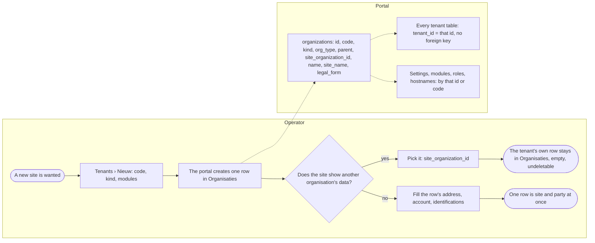
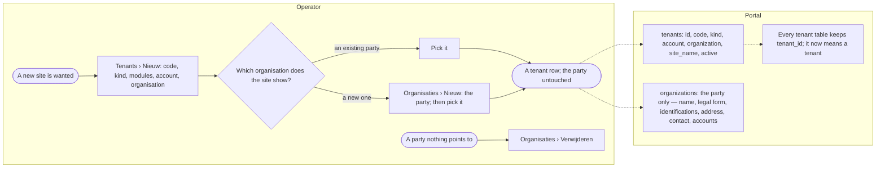
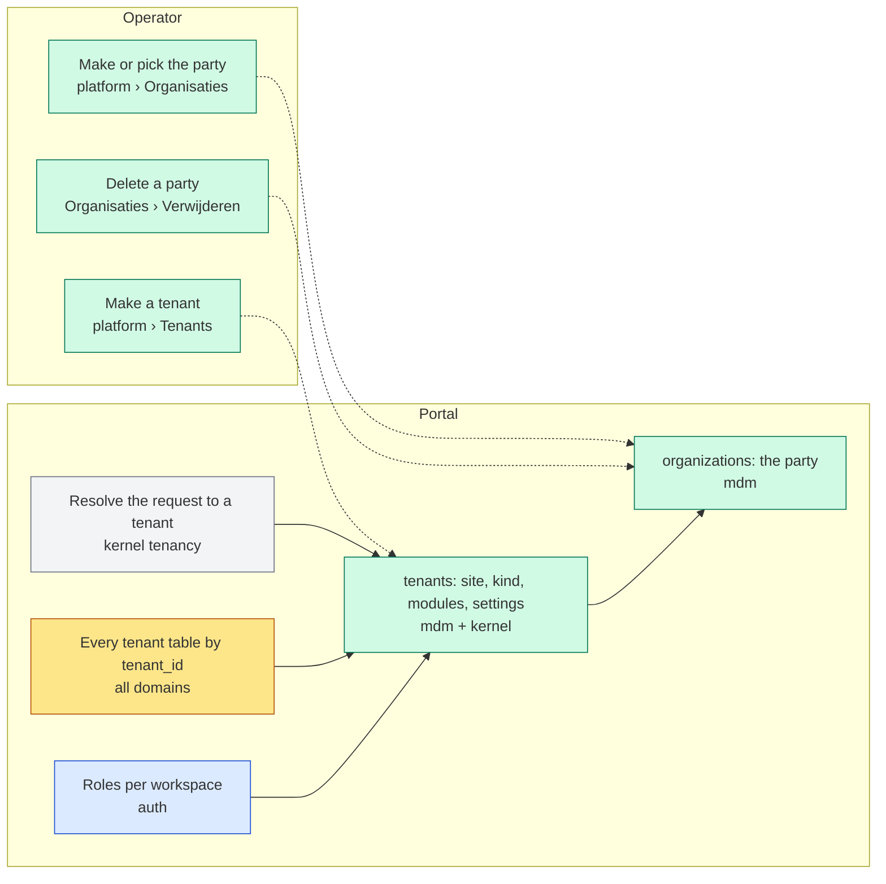
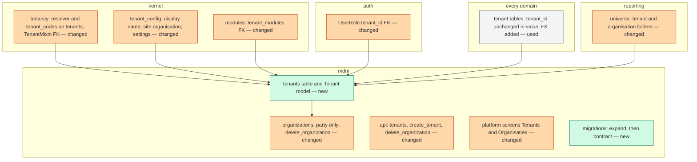
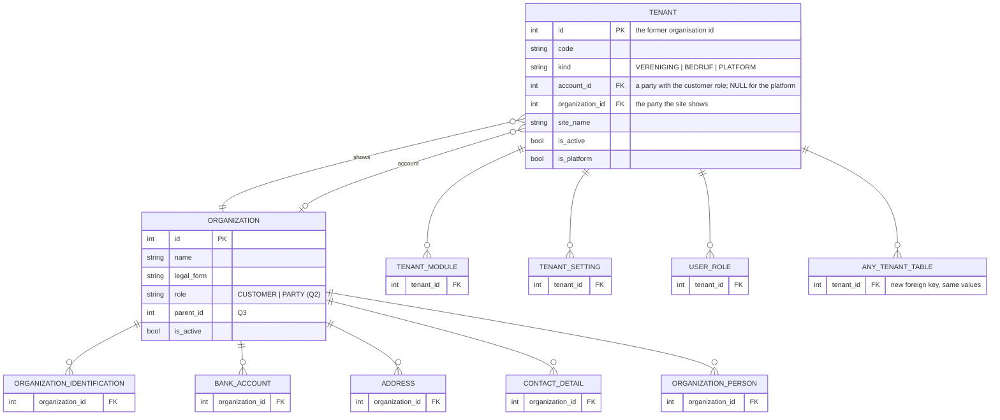

# Change Request 20 — A tenant is its own thing, apart from the organisation whose data it shows

**Project:** Web Portal "Raak Millegem"
**Status:** shaped on 4 October 2026 · on hold — Koen walks through it; nothing is built; not on a release
**Tracking issue:** #1578 — the one place where what is open stands; this document is the design, the issue is the status
**Applies to:** the mdm domain (`mdm.organizations` and everything that reads it as a tenant), the kernel's tenancy (`TenantMixin`, the resolver, `kernel_tenant_settings`, `mdm.tenant_modules`), the auth roles per workspace, the platform screens Tenants and Organisaties, the reporting universe; every tenant-scoped table by its key, none by its content.
**Reading:** A 1410 words · B 2161 · C 2009 — words to read, drawings excluded, measured on 4 October 2026; the budget is A ≤ 1 500, B ≤ 2 500

---

# Part A — The business

## A1. Reason to act — the trigger

On 4 October 2026, validating v2.13.0 on HDEV, Koen asked "that the tenant really is the tenant, not the organisation". Since CR-19 a tenant's site may show the data of another organisation of its account (#1550): a brand site and the platform of one company each show that company's name, address and account number. But the tenant itself is still a row in the list of organisations, with legal form, identifications and bank accounts nobody fills in; it stands beside the company as if it were a second company, and it cannot be deleted, because deleting it would delete the site. There is no delete for an organisation at all.

One row carries two things: **the tenant** (a site: its code, its kind, its modules, its settings, the name its site shows) and **an organisation** (a party: name, legal form, identifications, address, contact, bank accounts). The ask: pull them apart. A tenant hangs under an account and points to the organisation whose data it shows; an organisation is a party on its own, shared by several tenants when they are the same company, deletable when nothing points to it. The smaller step — hiding such tenants from the list — Koen does not want.

## A2. As-is process — how it works today, and where it hurts

Two actors: the platform operator (who makes tenants and organisations) and the portal. Measured on 4 October 2026 (C1).

What to see in it: one row, two meanings; the second meaning is empty for every tenant that borrows its data, and nothing can remove it.

| # | Step | Today | Pain |
|---|---|---|---|
| 1 | Make a tenant | `/admin/tenants/nieuw` writes a row in `mdm.organizations` with `org_type = UNIT`, a code, a kind, the modules | the row is also an organisation |
| 2 | Show whose site it is | `site_organization_id` (#1550) points at another organisation of the account; the footer and "Onze organisatie" read that one | the tenant's own row keeps name, legal form, address fields — unused |
| 3 | The list of organisations | every row, tenants included | a brand site and the platform stand next to the company as organisations |
| 4 | Delete | none for an organisation; a tenant's row cannot go because 64 tables point at its id | clutter that cannot be cleaned |
| 5 | An account | an organisation with `org_type = ACCOUNT`; tenants hang under it by `parent_id` | the customer is a party too — that part is right |

## A3. To-be process — how it should work afterwards

What changes, one line each:

- Step 1: a tenant is made as a tenant — code, kind, modules, the account it belongs to, the organisation it shows — and becomes no row in Organisaties.
- Step 3: the list of organisations shows parties only; the list of tenants shows tenants only; a party shows which tenants point at it.
- Step 4: a party nothing points at can be deleted; a party a tenant points at refuses, naming the tenant.
- Step 5: an account stays a party with the role *customer*; a tenant points at it.
- Nothing changes for a member, a visitor or a board member: the sites, the data, the footers and the roles are the same the day after.

The words the user reads: "Tenant", "Organisatie", "Account", "Toont de gegevens van", "Verwijderen" (on an organisation), "Deze organisatie wordt gebruikt door 2 tenants".

## A4. Benefits — what the change earns

- **The model says what things are**: a site is a site, a party is a party; the next feature (invoicing an account, a company with three brand sites) finds its place instead of a workaround.
- **Clean lists**: Organisaties holds organisations; a brand site is not a second company.
- **Delete exists** for a party, with a reason when it refuses.
- **The door CR-19 left open stays open**: an account workspace over its tenants' members is a query over tenants with one account, not a new model.
- Not quantified in money; a model mistake found at the first extra site is cheaper fixed now than after the tenth.

## A5. Supplied material — and what it taught us

- Koen's sentence of 4 October and his model: "a tenant hangs under an account and under an organisation" (relayed by the master CLI).
- #1578 with its six points to measure; #1546 (`site_name`), #1550 (`site_organization_id`), #1569 (the footer page as a page's flag); CR-19 B9's direction (the account is the customer; no data shared across accounts).
- The code: `mdm/models.py` (the organisation with its docstring that already names the three roles ACCOUNT · UNIT · PLATFORM), `kernel/tenancy.py` (`TenantMixin`, the resolver), `kernel/tenant_config.py`, `kernel/modules.py`, `auth/models.py` (`UserRole.tenant_id`), the platform screens.
- The modelling rule in `AGENTS.md`: a party is UBL `cac:Party`; what repeats gets a table; the shape that grows.

## A6. Business requirements — what the board asks, with MoSCoW

| # | Requirement | MoSCoW | Source |
|---|---|---|---|
| R1 | A tenant is its own record — a site with a code, a kind, modules and settings — under an account and pointing to the organisation whose data it shows. | Must | Koen, 4 Oct |
| R2 | An organisation is a party on its own: several tenants may point to one; one that nothing points to can be deleted. | Must | Koen, 4 Oct |
| R3 | The list of organisations shows organisations only; the list of tenants shows tenants only. | Must | #1578 |
| R4 | Nothing a member, visitor or board member sees or does changes; every site keeps its data, address, roles and hostnames. | Must (limit) | author |
| R5 | An account stays what it is — the customer, a party with that role; tenants hang under it; no data crosses accounts. | Must | CR-19 B9 |
| R6 | The split keeps the door open to an account workspace with access to its tenants' members. | Should | CR-19 B9 |
| R7 | The migration runs on PROD under expand/contract without downtime and with a tested rollback. | Must | AGENTS.md |
| R8 | Hiding tenants from the list of organisations as a stop-gap. | Won't | Koen, 4 Oct |
| R9 | Invoicing, billing or a customer portal for accounts. | Won't | author |

## A7. Non-functional requirements — security, privacy, house style, tenants

| Concern | This change |
|---|---|
| **Security** | The tenant isolation does not weaken: every tenant table keeps its `tenant_id`, which now gets a foreign key to the tenant table it never had; the resolver reads codes from tenants; a role per workspace points at a tenant. The platform screens stay operator-only. |
| **Privacy** | No personal data moves; a party's details stay a party's. Deleting a party is a soft delete like every delete. |
| **House style** | The two platform screens on the kit's list and record layouts of CR-11 when their roll-out comes; nothing new in shape. |
| **Multi-tenant** | This *is* the multi-tenant model: tenant → account (party, role customer) and tenant → organisation (party shown); a company with three sites is one party and three tenants. |

## A8. Acceptance criteria — what the business signs off on HDEV

| # | Criterion | R |
|---|---|---|
| AC1 | After the migration every site renders exactly as before: home, footer, "Onze organisatie", roles, hostnames (screenshots and a smoke per tenant compared). | R4 |
| AC2 | Tenants lists tenants only, with kind, account and the organisation shown; Organisaties lists parties only, each with "gebruikt door n tenants". | R1, R3 |
| AC3 | A new tenant is made pointing at an existing party; no row appears in Organisaties. | R1 |
| AC4 | A party nothing points at is deleted; a party a tenant points at refuses with the tenant's name. | R2 |
| AC5 | Two tenants pointing at one party show the same footer; changing the party's address changes both. | R2 |
| AC6 | A board member's roles, a member's login and a form's share link work unchanged on each tenant. | R4 |

---

# Part B — The solution, for whoever approves it

## B1. Solution outline — the solution and the decisions that shape it

A new table **`mdm.tenants`** carries what a site is: `id`, `code`, `kind`, `account_id` (a party with the customer role), `organization_id` (the party the site shows), `site_name`, `is_active`, the platform flag. **`mdm.organizations` becomes the party only**: name, legal form, identifications, addresses, contacts, bank accounts, persons; `org_type` shrinks to the party's role (customer or shown party — or goes), `code`, `kind`, `site_organization_id`, `site_name` and the platform row leave it. **Every tenant-scoped table keeps its `tenant_id` and its values**: the tenant rows are created **with the same ids** as today's UNIT and PLATFORM rows, so 64 tables, 464 references and 198 migrations change nothing — the column gains a foreign key it never had. Settings, modules, roles and the resolver point at tenants. Expand/contract over two releases; the organisation rows that were tenants are deleted at the contract step, the borrowed-data tenants first.

Decisions, each with the rejected alternative (the reasoning in C4):

- **Same ids, a new table** (C4.1). Rejected alternative: a new key and a rewrite of every `tenant_id`. The ids are the only thing every table shares; keeping them makes the migration a copy, not a rewrite.
- **The account stays a party with a role** (C4.2). Rejected alternative: an `accounts` table now. Nothing invoices yet; a party that pays is a party (UBL `cac:Party` with a role); an `accounts` table is a row later when billing comes, not a rework.
- **The platform is a tenant** (C4.3). Rejected alternative: a third thing. The platform has a site, settings and modules — it is a tenant whose kind is PLATFORM and that shows the operator's party.
- **Delete a party by rule, soft** (C4.4). Rejected alternative: cascade. A party referenced by a tenant refuses; its own details (addresses, contacts, accounts, identifications, persons) go with it, soft.
- **Codes and hostnames stay on the tenant** (C4.5). Rejected alternative: on the party. A hostname serves a site.
- **Two releases, expand then contract** (C4.6). Rejected alternative: one migration. UAT and PROD share one shape per release; the old column must survive one release so a rollback is a redeploy.

### B1.1 Functional analysis — the derived requirements

| # | Derived requirement | From |
|---|---|---|
| F1 | `mdm.tenants (id PK — the former organisation id, code UNIQUE, kind FK tenant_kind_codes, account_id FK organizations NULL for the platform, organization_id FK organizations NOT NULL, site_name, is_active, is_platform BOOL, created_at, updated_at)`; `tenant_modules.tenant_id` and `kernel_tenant_settings.tenant_id` get FKs to it; `UserRole.tenant_id` too (nullable stays). | R1, R4 |
| F2 | `TenantMixin.tenant_id` gains `ForeignKey("mdm.tenants.id")` on every table, added in the expand migration as NOT VALID then validated — the isolation is in the key at last. | R4 |
| F3 | `organizations` keeps the party: `name`, `legal_form`, `is_active`, timestamps, `parent_id` (an organisational hierarchy if wanted — or dropped, Q3); `org_type` becomes `role` (`CUSTOMER`, `PARTY`) or is dropped (Q2); `code`, `kind`, `site_organization_id`, `site_name` dropped at the contract step. | R2 |
| F4 | The resolver (`tenancy.resolve_tenant`, `tenant_codes()`, `TENANT_HOSTNAMES`) reads tenants; `platform_tenant_id` the tenant with `is_platform`; `tenant_config.site_organization_id` becomes `tenants.organization_id`; `tenant_display_name` and `site_name_default` read the tenant then its party. | R1, R4 |
| F5 | Platform screens: Tenants (list, editor with kind, modules, account, organisation shown, site name) on tenants; Organisaties (list, editor, **Verwijderen** with the refusal naming the tenants) on parties; the tenant editor offers a party of its account or "nieuwe organisatie". | R1, R3 |
| F6 | `mdm.api`: `tenants()`, `tenant(id)`, `create_tenant(…)` (writes a tenant, never a party), `delete_organization(id)` refusing when referenced; the facade is the only writer. | R1, R2 |
| F7 | Migration: expand — create tenants from UNIT and PLATFORM rows with the same ids, copy code/kind/site_name/account (= parent_id)/organisation (= site_organization_id or self), repoint FKs, add the mixin FKs; the app reads tenants; contract (one release later) — drop the tenant columns from organizations, soft-delete the organisation rows of tenants that showed another party, keep the rows of tenants that were their own party (now the party they show). | R7 |
| F8 | The account workspace of CR-19 B9 stays a query: tenants with one `account_id`; no schema reserved for it. | R6 |
| F9 | Reporting: the universe's organisation joins keep working (they join on `tenant_id`); a "tenant" folder lists tenants, an "organisatie" folder parties — one source each. | R3 |

## B2. Fit with the process and the requirements — for the business

Legend: green mdm · grey kernel · yellow every domain (by key only) · blue auth.

**Traceability matrix**

| R | F | Test (C6) | AC |
|---|---|---|---|
| R1 a tenant is its own record | F1, F4, F5, F6 | 1, 2, 5 | AC2, AC3 |
| R2 a party on its own, deletable | F3, F6 | 3, 4 | AC4, AC5 |
| R3 two lists | F5, F9 | 5 | AC2 |
| R4 nothing changes for a user | F2, F4, F7 | 6, 7, 8 | AC1, AC6 |
| R5 the account a party | F1 | 2 | AC2 |
| R6 the door stays open | F8 | — | — |
| R7 expand/contract | F7 | 9 | — (the deploy) |

**Walkthrough on HDEV** (the operator; a board member for 6):

1. Open Tenants. *See:* the known sites, each with kind, account and "toont de gegevens van"; the platform among them.
2. Open Organisaties. *See:* the parties only — the association, the company, the operator's party; each with "gebruikt door n tenants"; no brand site, no platform.
3. Make a tenant "Noordhoek" under the company's account, showing the company. *See:* a tenant; Organisaties unchanged.
4. Delete the party "Oude Firma" that nothing uses. *See:* gone (soft), with its addresses. Try the company. *See:* refused: "gebruikt door Noordhoek, Firma Zuid".
5. Change the company's address. *See:* both sites' footers follow.
6. As a board member of the association: log in, open the admin, the members, a form's share link. *See:* unchanged.
7. On the server: `alembic current`, the deploy's chain check, the screenshots per tenant before and after.

## B3. The whole across the modules — for the architect

Legend: green new · orange changed · grey used.

**Data model at a glance**

Who calls whom: the middleware resolves host → path → default to a tenant through `mdm.api.tenant_codes()`; every domain keeps filtering on `tenant_id`; `tenant_config` reads a tenant's settings and, for the name and the footer, the party it shows; the platform screens call `mdm.api` only. Transaction boundary: the door commits; a tenant's creation is one transaction (the tenant, its modules, its settings seed). Impact: one new table, FKs on 64 tables, two platform screens, the resolver, the reporting universe's two folders; no change in any domain's own code.

## B4. Rules this change needs an exception from — decided once, here

| Rule (where) | What the design does instead | Temporary until … / the new rule | Decided |
|---|---|---|---|
| Expand/contract, one shape per release (#1255) | the tenant columns on organizations survive one release; the app reads tenants from the expand release on | the rule applied | — |
| "Never modify a merged migration" | two new migrations; the 25 old ones that mention organizations stay | the rule applied | — |
| Model on standards: a party is `cac:Party` (AGENTS.md) | the party keeps its repeatable tables; the tenant is not a party | the rule applied, the reason the change exists | — |
| Data operations through the app, never raw SQL | the expand migration copies rows itself (schema work, not an operation); the soft delete of the old rows at contract runs as a migration step with a count in the log | the rule applied | — |

## B5. Cost — investment and running cost, and what operations must know

| Module | Ph 1 expand | Ph 2 screens | Ph 3 contract | Total |
|---|---|---|---|---|
| mdm (model, api, migration) | 2 | 1 | 1 | 4 |
| kernel (tenancy, config, modules) | 1.5 | — | 0.5 | 2 |
| auth, reporting | 0.5 | 0.5 | — | 1 |
| platform screens | — | 2 | — | 2 |
| tests, screenshots, smoke per tenant | 1.5 | 1 | 0.5 | 3 |
| **Total** | **5.5** | **4.5** | **2** | **~12 CLI-days** |

**Running cost:** none. **Operations:** two migrations in two releases; before the expand release a checked backup and `raak restore-test`; the smoke per tenant (`SMOKE_TENANT`) extended to every tenant's home and footer; no env var — `TENANT_HOSTNAMES` keeps host=code.

## B6. Phasing — shippable phases, and what changes on the failure paths

| Phase | Delivers | Migration | Failure paths that change | Validation |
|---|---|---|---|---|
| **1 — expand** | `mdm.tenants` filled with the same ids; the FKs; the resolver, settings, modules and roles on tenants; `tenant_config` reads the tenant then its party; the organisation columns still present and still written for one release (double write) | additive (`NOT VALID` FKs validated in the same migration, measured on a PROD-sized dump) | a request for an unknown code answers as today; a tenant without a party refuses to render with a named error | AC1, AC6 |
| **2 — the screens** | Tenants and Organisaties on their own records; create a tenant; delete a party with its refusal; "gebruikt door n tenants"; the reporting folders | none | the refusal names the tenants | AC2–AC5 |
| **3 — contract** | drop `code`, `kind`, `site_organization_id`, `site_name`, the tenant meaning of `org_type` from organizations; soft-delete the organisation rows that were borrowed-data tenants; the double write off | contract, one release after phase 1 | none | AC1 again |

Dependencies: none on other change requests; CR-11's roll-out moves the two screens to the kit's layouts whenever it comes. Order of the three in the document's Q&A: phase 1 and 2 may ship in one release; phase 3 never with phase 1.

## B7. Rule and gatekeeper — what this fixes for all future work

1. **The rule.** *A tenant is a site; an organisation is a party; a tenant-scoped row points at a tenant by a foreign key.* Lives in `docs/architecture.md` §5 (tenancy) and in the organisation's docstring, which today explains the confusion instead of the rule.
2. **Reach and baseline.** 64 tenant-scoped models, 464 references, no foreign key on any of them (measured 4 October 2026); after phase 1: every one with a key.

**The gate:** a model with `TenantMixin` whose `tenant_id` has no foreign key is red (test 7); `mdm.api.create_tenant` is the only writer of a tenant (the facade gate); an organisation row with a tenant column after phase 3 is red (test 9).

## B8. Open decisions — what the approver still decides

| # | Question | Recommendation | What the answer changes |
|---|---|---|---|
| Q1 | Keep today's organisation ids as the tenant ids (no rewrite of 64 tables)? | Yes — the whole cost of this change hangs on it. | F1, F7 |
| Q2 | `org_type` on the party: keep as a role (`CUSTOMER` for an account, `PARTY` for the rest) or drop it and derive "is an account" from `tenants.account_id`? | Keep a role column: an account without tenants yet is still a customer. | F3 |
| Q3 | `parent_id` on the party (an organisational tree): keep or drop? | Drop at phase 3 — nothing reads it once tenants carry their account; a hierarchy of parties returns when a feature needs it. | F3, phase 3 |
| Q4 | Phases 1 and 2 in one release, or 1 first? | One release: the screens are what makes the split visible; without them the expand changes nothing an operator sees. | B6 |

## B9. Decisions log — dated answers

| Date | Decision | By |
|---|---|---|
| 10 Sep 2026 | The three roles of an organisation written down: ACCOUNT the customer, UNIT the tenant, PLATFORM the platform (the model's docstring). | Koen |
| 2 Oct 2026 | CR-19: a tenant has a kind and modules; the account is the customer; a tenant's shown organisation may differ from its account (#1550). | Koen |
| 4 Oct 2026 | "That the tenant really is the tenant, not the organisation": a tenant under an account and under an organisation; the stop-gap (hiding) refused; a change request, not an issue. | Koen, via the master CLI |
| 4 Oct 2026 | *Proposed:* same ids, a new `tenants` table, the party kept, the account a party with a role, the platform a tenant, soft delete by rule, expand/contract over two releases. | author |

---

# Part C — The build, for the master CLI and the dev CLIs

## C1. Verified premises — measured before the handover

| Claim | Measured how | Result | Consequence |
|---|---|---|---|
| One row carries site and party | `mdm/models.py` `Organization`: `parent_id`, `site_organization_id`, `org_type`, `code`, `name`, `site_name`, `is_active`, `legal_form`, `kind` | true; the docstring itself names the three roles | B1 |
| `tenant_id` has no foreign key anywhere | `kernel/tenancy.py:64-70` (`Column(Integer, nullable=False, index=True, default=_tenant_default)`) | true | F2: the key is new |
| 64 models carry `TenantMixin`; 464 references to `tenant_id` in 50 files; 198 migrations, 25 mention organizations | `grep -rh "TenantMixin" domains/*/models.py`; `grep -rn tenant_id app`; `ls alembic/versions` | true | same ids or a rewrite (Q1) |
| What points at an organisation as a party | FKs: `OrganizationPerson`, `Address.organization_id`, `ContactDetail.organization_id`, `BankAccount`, `OrganizationIdentification`, `parent_id`, `site_organization_id`, `tenant_modules.tenant_id` (CASCADE) | eight; no `OrganizationHistory` | F3, C4.4 |
| What uses the organisation as a tenant | `kernel_tenant_settings.tenant_id`, `tenant_modules.tenant_id`, `UserRole.tenant_id` (nullable), `TENANT_HOSTNAMES` host=code, `tenant_codes()` from UNIT rows, `platform_tenant_id`, `tenant_config` (33 functions by tenant id) | true | F1, F4 |
| No delete for an organisation | no `delete_organization` in `mdm/api.py` or service | true | F6 |
| The account is an organisation with `org_type = ACCOUNT`; tenants hang under it by `parent_id` | `OrganizationType` codes ACCOUNT · UNIT · PLATFORM; `tenants_ui` `account_id` = `parent_id` | true | C4.2 |
| `site_name` (#1546) and the footer page flag (#1569) are on master | `organizations.site_name`; `cms_pages.show_in_footer` | true | F1 carries `site_name`; the footer flag is the page's, untouched |
| *To measure at phase 1*: the time to add and validate 64 FKs on a PROD-sized dump | `raak restore-test` + the migration | — | the deploy window |

## C2. Per module: what must happen

#### mdm (phases 1–3)

- **Model:** `Tenant` (`mdm.tenants`) per F1; `Organization` loses its tenant meaning in the code at phase 1 (the columns stay until phase 3); `TenantKind` moves to the tenant; `OrganizationType` becomes the party's role (Q2).
- **Facade (`api.py`):** `tenants()`, `tenant(id)`, `tenant_by_code(code)`, `platform_tenant_id()`, `create_tenant(code, kind, account_id, organization_id, site_name, modules)`, `set_modules` unchanged in signature, `organizations()` (parties only), `delete_organization(id)` → refuses with the tenants' names when referenced, soft-deletes the party and its details otherwise.
- **Migrations:** phase 1 `alembic revision -m "tenants apart from organisations: expand"` — create `mdm.tenants`; insert from organizations where `org_type IN ('UNIT','PLATFORM')` with the same `id`, `code`, `kind`, `site_name`, `is_active`, `account_id = parent_id`, `organization_id = COALESCE(site_organization_id, id)`, `is_platform = (org_type = 'PLATFORM')`; `SELECT setval` on the sequence; add FKs on `tenant_modules`, `kernel_tenant_settings`, `auth user_roles` (nullable), and on every `TenantMixin` table as `NOT VALID` + `VALIDATE CONSTRAINT`; the mixin declares the FK. Phase 3 `… : contract` — drop the five columns, soft-delete the borrowed-data organisation rows (log the count), drop `parent_id` if Q3 says so. Check the CHECK constraints on `organizations` first (the `media_assets.kind` lesson).
- **Screens:** `tenants_ui.py` (list, editor, nieuw) on `Tenant`; `organisaties_ui.py` (list with "gebruikt door n tenants", editor, Verwijderen with the refusal) on parties; the tenant editor's organisation select lists the account's parties plus "nieuwe organisatie".
- **Tests:** C6 1–5, 9.

#### kernel (phase 1)

- `tenancy.py`: `TenantMixin.tenant_id` with `ForeignKey("mdm.tenants.id")`; `tenant_codes()` from tenants; the hard-coded fallback map keyed the same; `resolve_tenant` unchanged in logic.
- `tenant_config.py`: `_organisatie()` → the tenant's shown party; `site_organization_id()` → `tenants.organization_id`; `tenant_display_name`, `site_name_default` read the tenant then the party; settings keyed by tenant id as today.
- `modules.py`: `tenant_modules.tenant_id` FK to tenants; DEFAULTS per kind read the tenant's kind.
- **Tests:** C6 6, 7, 8.

#### auth (phase 1)

- `UserRole.tenant_id` gets the FK (nullable stays for platform-wide roles); `require_platform_operator_ui` reads the platform tenant.

#### reporting (phase 2)

- The universe gains a folder "Tenants" (code, kind, account, shown party) and keeps "Organisaties" as parties; a saved report on organisations that counted tenants changes its figure — list them in the closing comment.

#### every other domain

- Nothing in code; the FK arrives through the mixin. Their tests run as they are: a test that creates a row with an arbitrary `tenant_id` now needs a tenant — the test seed makes the tenants (C6 10).

## C3. Cross-cutting impact — the checklist of what gets forgotten

| Row | Answer |
|---|---|
| Reporting views and saved reports | yes — the universe's organisation folder (parties only) and a new tenant folder; saved reports that counted tenants as organisations change |
| Existing tests, e2e flows, screenshots | yes — every test that writes a `tenant_id` needs a tenant row (the seed); the e2e seed makes tenants; screenshots per tenant before and after (AC1) |
| Fixed UI decisions, `AGENTS.md` | the tenancy section of `docs/architecture.md` §5; `AGENTS.md`'s "Rollen" line on tenants unchanged |
| Design-system documentation | no |
| Code lists | `tenant_kind` moves to the tenant; `organization_type` becomes the party's role or goes (Q2) |
| Events and handlers | no; `tenant_id` on an event payload keeps its value |
| Mail templates | the footer and signature read the party through the tenant — same output |
| Migration: additive or contract | phase 1 additive (+ FK validation), phase 3 contract, one release apart |
| Tenant settings | keyed by tenant id as today; no key changes |
| Env vars | none; `TENANT_HOSTNAMES` unchanged (host=code) |
| JSON routes and API callers | `/api/v1/tenants` (if any) returns tenants; organisation endpoints return parties; measure callers first |
| External services | no |
| PROD data | the migration copies 3–5 rows and validates 64 FKs; `raak restore-test` first; the deploy stops, not rolls back, on a failed migration (#1203) |

## C4. Detailed decisions — one subsection each, with the reasons

### C4.1 Same ids, a new table

The only thing every tenant table shares is the integer in `tenant_id`. A new key would mean rewriting that integer in 64 tables, every history row and every event payload, and keeping a mapping during the switch. Creating `mdm.tenants` **with the same ids** as the UNIT and PLATFORM rows makes the migration a copy of a handful of rows and the addition of a foreign key; the values do not move. The sequence is set past the highest id so new tenants get fresh ids that never collide with a party.

### C4.2 The account stays a party with a role

An account pays and receives the invoices (CR-19 B9): that is a party with a role, UBL's `cac:Party` with `cac:PartyLegalEntity`, identifications and bank accounts — all tables the party already has. A separate `accounts` table today would carry nothing the party does not; when billing comes, an invoice points at a party, and an `accounts` table — if ever — is one row per customer party. "Build what is needed in the shape that grows."

### C4.3 The platform is a tenant

The platform has a hostname, settings (sender, keys), modules and a landing page: everything a tenant has, nothing a party has. It becomes the tenant with `is_platform` and kind PLATFORM, showing the operator's party as the organisation behind it. `platform_tenant_id()` reads that flag.

### C4.4 Deleting a party

A party a tenant points at (as shown organisation or as account) refuses with the tenants' names: the user sees why. A party nothing points at is soft-deleted together with its details — addresses, contacts, bank accounts, identifications, persons — the way every delete in the portal is soft; a history row records who. No cascade through foreign keys: the facade decides, the key only guards.

### C4.5 Codes and hostnames on the tenant

`TENANT_HOSTNAMES` maps a host to a code; a code names a site. Both belong to the tenant. A party has no code: it has identifications (enterprise number, VAT) in their own table, as the standard says.

### C4.6 Two releases

Phase 1 adds the table and the keys and switches the readers; the old columns stay and are written for one release (double write in `create_tenant` and the editor), so a rollback is "deploy the previous tag" and nothing is lost. Phase 3 drops the columns and soft-deletes the organisation rows that were borrowed-data tenants (the brand site, the platform) — the rows of tenants that were their own party stay, as the party they show. Never in one release: UAT and PROD share one shape.

## C5. Privacy and security — the mechanics behind A7

Tenant isolation rests on `tenant_id`; this change gives that column the foreign key it lacked, so a row can no longer carry a tenant that does not exist. The resolver's input (host, path) and its output (a tenant id) do not change. Roles per workspace point at tenants. A soft-deleted party's data stays in the database as every soft delete does; a party is organisation data, not personal data, except the persons linked to it (`organization_persons`), which are references, not copies.

## C6. Tests — what the build must prove

1. **A tenant is a tenant.** `create_tenant` writes a row in `mdm.tenants` and none in `mdm.organizations`; the tenant points at an existing party.
2. **The account is a party with a role.** A tenant's `account_id` references a party; a party with the customer role and no tenants lists as an account.
3. **Delete refuses with names.** `delete_organization` on a party used by two tenants raises with both names; the party stays.
4. **Delete is soft and complete.** On an unused party: the party and its addresses, contacts, accounts, identifications and persons carry `deleted_at`; a history row; nothing hard-deleted.
5. **Two lists.** Tenants lists no party; Organisaties lists no tenant; "gebruikt door n tenants" counts right.
6. **The resolver.** Host, path prefix and default resolve to the same tenant ids as before the migration (a table of hosts and codes from the seed, asserted before and after).
7. **The key exists.** Every model with `TenantMixin` has a foreign key on `tenant_id` to `mdm.tenants` (introspection); red on master today.
8. **Settings, modules, roles.** A tenant's settings, modules and roles read unchanged after the migration (a snapshot of the seed before, compared after).
9. **Contract.** After phase 3 no tenant column exists on `organizations` (introspection); the borrowed-data rows are soft-deleted and counted.
10. **The seed.** The test seed creates tenants and parties; a test writing a `tenant_id` that no tenant has fails on the key (proven by one).
11. **Screens unchanged.** The e2e screenshots of every tenant's home, footer and admin menu are identical before and after phase 1 (the comparison of CR-17 test 19, reused).

**Impact on the test landscape:** every domain's tests that insert rows with a bare `tenant_id` run on the seed's tenants; the mdm and tenancy tests change; the e2e set gains the per-tenant comparison.

## C7. The gate — what refuses a deviation from now on

Test 7 is hard from phase 1: a `TenantMixin` model without the foreign key is red. The facade gate keeps `create_tenant` and `delete_organization` the only writers. Test 9 is hard from phase 3. What stays with judgment: whether a new thing is a tenant, a party or a role on a party — decided in this document's Q&A.

## C8. Prototype findings — what was measured before the build

Measured on 4 October 2026: the organisation row with its two meanings (C1); 64 tenant models without a key; 25 migrations that mention organizations; the eight tables pointing at a party; no delete. To measure at phase 1 on a PROD-sized dump: the time of `VALIDATE CONSTRAINT` on the largest tenant tables (registrations, payments, history), so the deploy knows its window.

## C9. Screens before the build — the concepts the approver saw

Waived in the author's proposal: the two platform screens are a list and a record on the existing kit, with one new column each and one delete; the refusal text is in A3. Koen decides whether a concept is wanted.

## C10. Close-out at the release

Not yet: on hold, nothing built. Filled in when the release that builds phase 3 runs on PROD (release step 14).

---

## Q&A log — asked once, answered here

| # | Date | Question (who) | Answer |
|---|---|---|---|
| Q1 | 4 Oct 2026 | Keep the organisation ids as the tenant ids? (author) | *Proposed:* yes (C4.1). *Koen decides.* |
| Q2 | 4 Oct 2026 | What becomes of `org_type` on the party? (author) | *Proposed:* a role column, CUSTOMER or PARTY (C4.2). *Koen decides.* |
| Q3 | 4 Oct 2026 | Keep `parent_id` on the party? (author) | *Proposed:* drop at phase 3. *Koen decides.* |
| Q4 | 4 Oct 2026 | Phases 1 and 2 in one release? (author) | *Proposed:* yes; phase 3 one release later. *Koen decides.* |
| Q5 | 4 Oct 2026 | Why not the smaller step (hide tenants from the list)? (master CLI) | Koen refused it: it hides the symptom and keeps the row that cannot be deleted. |
| Q6 | 4 Oct 2026 | Does the split close the door to an account workspace (CR-19 B9)? (#1578) | No: the workspace is a query over tenants with one `account_id`; the model needs nothing reserved. |

## Non-goals — deliberately outside this change

- Invoicing, billing, a customer portal (R9).
- The account workspace itself (R6 keeps the door open; nothing built).
- Hiding tenants from the list as a stop-gap (R8).
- Changing any domain's own tables or screens beyond the key.
- The kit's layouts for the two platform screens (CR-11's roll-out).

## Relationship to existing work — issues and change requests

- **#1578** — the tracking issue of this change.
- **CR-19 (#1468)** — kinds and modules per tenant; the shown organisation (#1550); `site_name` (#1546); the direction on accounts (B9); this change gives those a home.
- **#1569** — the footer page as a page's flag, untouched.
- **#406, #854, #963** — the tenancy phase, the platform row, roles per workspace: the three steps that put the tenant on the organisation row.
- **#1255** — expand/contract.
- **AGENTS.md, "Modelleer op standaarden"** — the party as `cac:Party`; the reason the organisation keeps its repeatable tables and loses the tenant.
