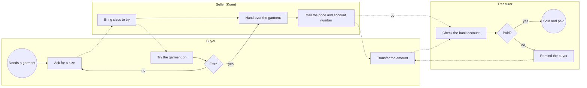

# Change Request 21 — E-loket: a shop with stock and pricing

**Project:** Web Portal "Raak Millegem"
**Status:** being shaped since 6 October 2026 · Part A in progress · nothing is built; not on a release
**Tracking issue:** none yet — the one place where what is open stands; this document is the design, the issue is the status
**Applies to:** to be filled in once Part B is shaped
**Reading:** A <n> words · B <n> · C <n> — measured with the word count per part; A ≤ 1 500, B ≤ 2 500

---

# Part A — The business

## A1. Reason to act — the trigger

On 6 October 2026 Koen put forward the reason, in his words: *"we currently have no module to sell the T-shirts we have."* Raak has T-shirts in stock and no way to sell them through the portal.

The second half of the trigger is the platform: *"I also want a module we can later use in companies — T-shirts for Raak, selling other things, for other companies that will use the platform."* The shop is not a one-off for one batch of T-shirts; it is meant to serve any tenant of the platform, with its own products.

The platform half has no concrete case behind it yet (Koen, 6 October 2026): *"there is no concrete demand or process from companies that sell articles; it comes from the principle."* Raak's garments are the one real case; other tenants are the reason the shape must not be Raak-only.

## A2. As-is process — how it works today, and where it hurts

Raak has three kinds of garment in stock — T-shirts, sweaters and polos — each in several sizes. A sale today runs on conversation and e-mail; the portal plays no part in it.

*What to see: three people and an e-mail carry the sale; nothing records what was sold or what is left on the shelf.*

| # | Step | Who | Tool | Pain — **to be confirmed by Koen** |
|---|---|---|---|---|
| 1 | Ask for a garment in a size | Buyer | word of mouth, message | the buyer cannot see what is available, in which size, at what price |
| 2 | Bring sizes to try on | Seller | the stock, at home or in storage | depends on one person being available |
| 3 | Hand over the garment | Seller | — | the stock count is in nobody's system; what is left is known by looking |
| 4 | Mail the price and Raak's account number, treasurer in copy | Seller | e-mail | written by hand for every sale; the price is whatever the mail says |
| 5 | Transfer the amount | Buyer | own bank | free-text communication; the transfer has to be matched by eye |
| 6 | Check the bank account, remind if unpaid | Treasurer | bank, mailbox | follow-up lives in a mailbox; no list of open sales |

Not measured yet: how many garments are sold per year, how many are in stock, and what a garment costs.

## A3. To-be process — how it should work afterwards

> [!NOTE]
> *How the work should go afterwards: the same drawing and table as A2, the*
> *same lanes in the same order, so the difference is what the eye finds.*
> *Still no components: "the portal renders the poster", not "WeasyPrint*
> *renders the poster". A step that disappears, moves lane or turns into a*
> *choice is the change — name it under the drawing in one line each.*
>
> *The words the user will read are decided here, not in Part C: the name*
> *of a button, a page title, a tile label, a menu item — one short list,*
> *"what it says on the screen", in the user's language and never the*
> *domain's pet word.*

## A4. Benefits — what the change earns

> [!NOTE]
> *The business side of the decision: what this change earns, in the*
> *measures the association counts in — hours of volunteer work saved per*
> *activity or per year, mistakes avoided, money collected sooner or not*
> *lost, members who would otherwise drop out, a process that becomes*
> *possible at all. One line per benefit, with the figure where it can be*
> *estimated and the reason where it cannot; a benefit that only the*
> *solution can name does not belong here. Set against the cost of B5, this*
> *is what says whether the change is worth doing, and when.*

## A5. Supplied material — and what it taught us

> [!NOTE]
> *What the business handed over to start from — brand guides, examples,*
> *photos, spreadsheets, briefs — with where it lives (described in words or*
> *by file name; never a local path, never in the repository when it holds*
> *personal data or brand assets). What was learnt from it goes here too, as*
> *measurements: "four example posters; none has a bleed". Do not forget the*
> *reporting need: must something be counted, listed, exported or printed*
> *afterwards, for whom, in which form? If so, it is a requirement in A6; if*
> *not, A6 says so in one row.*

## A6. Business requirements — what the board asks, with MoSCoW

> [!NOTE]
> *One table. Each requirement is a sentence a board member would say, with a*
> *MoSCoW class. Numbered, so Part B, Part C and the acceptance criteria can*
> *point at them.*

| # | Requirement | MoSCoW | Source | Comment |
|---|---|---|---|---|
| R1 | The webshop shows clearly what an article is. | Must *(proposed)* | Koen, 6 Oct 2026 | description and pictures, R3 |
| R2 | Products are master data: the product portfolio is managed in its own place, apart from any activity. | Must *(proposed)* | Koen, 6 Oct 2026 | "very simple at this moment" |
| R3 | A product has a description and one or a few pictures — one, two, three, four. | Must *(proposed)* | Koen, 6 Oct 2026 | |
| R4 | A role for product master data may manage the products; others may not. | Must *(proposed)* | Koen, 6 Oct 2026 | name of the role: open |
| R5 | Any tenant of the platform can use the shop with its own products, not only Raak. | Must *(proposed)* | Koen, 6 Oct 2026 (A1) | no company asks for it yet; a principle |
| R6 | One product can have different prices over time; at any moment it is clear what the price of an article is. | Must *(proposed)* | Koen, 6 Oct 2026 | "maybe overdone now, but in time price setting will matter" |

MoSCoW: **Must** (without it the change is worthless), **Should** (important,
but the change ships without it), **Could** (nice, if cheap), **Won't** (asked
and deliberately not done — recorded so it is not asked again).

## A7. Non-functional requirements — security, privacy, house style, tenants

> [!NOTE]
> *The requirements every change request is tested against, each answered*
> *explicitly at business level, "not applicable" included. How they are met*
> *belongs in Part C (C5):*

| Concern | This change |
|---|---|
| **Security** — who may do what; new inputs from outside; secrets | … |
| **Privacy** — personal data: what, where, who sees it, what leaves the system | … |
| **House style / UI norm** — `docs/design-system.md`; brand rules | … |
| **Multi-tenant** — what differs per unit, what is platform-wide | … |

## A8. Acceptance criteria — what the business signs off on HDEV

> [!NOTE]
> *Criteria the business signs off on, each testable by a person on HDEV*
> *without reading code, each pointing at a requirement and at the steps of*
> *the walkthrough (B2) that show it. These are the business's unit tests;*
> *the developer's tests live in Part C.*

| # | Criterion | Requirement | Walkthrough steps |
|---|---|---|---|
| AC1 | … | R1 | … |

---

# Part B — The solution, for whoever approves it

> [!NOTE]
> *Part B is read by the people who say "yes, build this": Koen, the*
> *analyst, the architect. It answers four questions — what is the solution,*
> *does it fit our process and our requirements, how does it hang together*
> *across the modules and what does it touch, what does it cost and in which*
> *steps does it arrive — and it ends with what is still theirs to decide.*
> *Reasoning in depth, mechanics and per-module detail go to Part C; Part B*
> *names the decision and the rejected alternative ("Rejected alternative: …"), in five lines at most.*

## B1. Solution outline — the solution and the decisions that shape it

> [!NOTE]
> *The solution in one paragraph; then the decisions that shape it, one*
> *bullet each of at most five lines: the decision, the rejected alternative that
> *lost, why (Europe First named where a tool or service is chosen). The*
> *full reasoning behind each decision is C4, which points back here. Then*
> *the **derived requirements** (F1, F2, …) in one table, traced to A6: the*
> *finer-grained requirements the solution answers — design work by the*
> *analyst, which is why they are not in Part A.*

## B2. Fit with the process and the requirements — for the business

> [!NOTE]
> *Three things. First, the **application usage drawing**: the to-be process*
> *of A3 once more — same lanes, same activities — with, in every activity*
> *box, a second line naming the screen or module that serves it, the box*
> *coloured per module (`classDef`, one legend line). Every step has a home*
> *or is marked "outside the portal"; a module no step uses is not part of*
> *this change. Two audiences (those who set up, those who use) means two*
> *drawings. Second, the **traceability matrix** — the one place where a*
> *requirement's thread is followed from left to right, so it is kept*
> *nowhere else: one row per requirement of A6 — R · how the solution meets*
> *it, in the words of the role that will see it · the derived requirements*
> *(F, B1) · the module that builds it (C2) · the test that proves it (C6) ·*
> *the acceptance criterion the business checks (A8). An empty cell is a*
> *finding: a requirement without a test, a test without a requirement. A*
> *Won't gets a row that says so. Third, the **walkthrough** — how the*
> *business tests this on HDEV: one numbered script per role of A3, in the*
> *order of the to-be process, happy path first and then the turns where it*
> *must refuse or fall back; each step names what to do and what to see —*
> *nothing else, it is a script. A8's last column names the steps that show*
> *each criterion; every criterion has at least one step. The closing*
> *comment of each issue points at the walkthrough instead of rewriting it.*

## B3. The whole across the modules — for the architect

> [!NOTE]
> *The **application structure drawing**: one subgraph per module touched,*
> *inside it a box per layer (screen · view-model · service · entity ·*
> *facade · migration · template) — a separate box for what is **new** and*
> *for what is **changed** in that layer, and one grey box for what is only*
> *used. Here the colour is the kind of change, not the module: green new,*
> *orange changed, grey unchanged. One legend line. Arrows between modules*
> *only through a facade (`api.py`), as the import gate enforces; external*
> *systems and data stores as their own boxes. Then the **data model at a*
> *glance**: a Mermaid `erDiagram` of the entities involved with their key*
> *columns and relationships, cardinality on the edges, soft references*
> *across schemas drawn as relationships too, and what is new or changed*
> *marked in the label. Under it, in at most two hundred words: who calls*
> *whom and through which facade, the direction of every new dependency,*
> *the transaction boundary, and the **impact on the existing*
> *architecture** — which existing modules, tables, screens and contracts*
> *are touched, and how the layer rules (`docs/code-style.md`, the import*
> *gate) hold. This is where a reviewer checks that the change does not*
> *bend the architecture; the per-module detail is C2.*

## B4. Rules this change needs an exception from — decided once, here

> [!NOTE]
> *Every existing rule, gate or fixed decision the design breaks or bends:*
> *the rule by name and place (`CLAUDE.md`, `docs/code-style.md`,*
> *`docs/architecture.md` §…, a gate in `backend/tests/`), what the design*
> *does instead, the mechanism (a named baseline entry, a widened gate, a*
> *replaced fixed UI decision), and whether the exception is temporary (with*
> *what ends it) or the new rule. One table; "none" is an answer, with the*
> *gates that were checked to say so. The approver decides each row at the*
> *handover — once. CR-14 needed an exception from the cross-domain call rule*
> *and nobody had written it down: the gate found it, the master CLI asked*
> *six times, and the third case became a change request of its own.*

| Rule (where) | What the design does instead | Mechanism | Temporary until … / the new rule | Decided |
|---|---|---|---|---|
| … | … | … | … | <who>, <date> |

## B5. Cost — investment and running cost, and what operations must know

> [!NOTE]
> *Three parts, each with a figure or "none". **Investment:** one table,*
> *module × phase, with the effort to build in CLI-days or person-days (S /*
> *M / L until the team has a track record), a total per module and per*
> *phase; then analysis, review, validation on HDEV and the release steps;*
> *then one-off purchases (a licence, a product, a device). **Running*
> *cost:** what it costs per month or per year once live — usage rights and*
> *paid services (per use and per month, measured where a prototype exists),*
> *storage and backups, hosting, and the maintenance it adds (a job to watch,*
> *a certificate to renew, a dependency to keep current). **Operations:***
> *settings, env vars, limits, kill switch, backups — what the person running*
> *the stack must know. Set beside the benefits of A4: the two together are*
> *the input for the release decision.*

## B6. Phasing — shippable phases, and what changes on the failure paths

> [!NOTE]
> *Shippable phases, each with what it delivers and its dependencies, one*
> *row per phase: issue · migration · env vars · data · failure paths that*
> *change · manual validation. The "Na de merge" block per phase names what*
> *CI cannot see. The column **failure paths that change** exists because a*
> *change that reorganises behaviour — where a rule lives, who commits, what*
> *a handler does — rarely changes what the system does on the happy path,*
> *and almost always changes what it does when something fails: what rolls*
> *back, what is refused, what is left half done. Name those per phase, so*
> *"no functional change" is a claim about the happy path with the failure*
> *paths listed beside it. "None" is an answer. Dependencies on other change*
> *requests are named per phase, so the approver can order them.*

## B7. Rule and gatekeeper — what this fixes for all future work

> [!NOTE]
> *An architectural change request fixes a way of doing things, not just one*
> *instance of it. Here, for the approver: **the rule** in one sentence a*
> *reviewer can apply, in the form the decision takes from now on, and where*
> *it ends up (`CLAUDE.md`, `docs/code-style.md`, the architecture document,*
> *the design system); **the reach and the baseline** — where it applies and*
> *how many places violate it today, measured on the branch, and to what*
> *this change brings that number; and in one line whether the gate is a*
> *ratchet or hard. The gate itself — what it looks at, its message, the*
> *violation it was proven with — is C7. "No gate" is an answer, with the*
> *reason and what catches it instead, written down as the weaker guarantee*
> *it is.*

## B8. Open decisions — what the approver still decides

> [!NOTE]
> *The questions that are still open, each with the author's recommendation*
> *and the difference the answer makes; numbered Q-entries, the same numbers*
> *as the Q&A log, so an answer moves the row from here to the log. This is*
> *the last thing the approver reads before saying yes; an empty section*
> *means the change request is ready to assign.*

| # | Question | Recommendation | What the answer changes |
|---|---|---|---|
| Q1 | Is a size a product of its own ("T-shirt Raak – M"), or a variant of one product ("T-shirt Raak", sizes S–XL)? | A variant: one description and one set of pictures per product, stock per variant. UBL knows the same shape (an item with properties). | Variant: product and variant are two things in master data, stock and price may hang at either. Own product: simpler model, but four copies of one description and its pictures. |
| Q2 | Does price get its own domain (Koen, 6 Oct 2026: *"a new domain pricing … maybe overdone now, but in time price setting will matter"*), or is it a column on the product? | Its own small domain from the start, holding only what R6 needs: a price per article with the date from which it applies. No discounts, no price lists per customer group yet — the form allows them later as rows, not as a rework (`AGENTS.md`, *model on standards*). | Own domain: the shop asks pricing for "the price now"; the product stays master data without money in it. A column: no history, and R6 cannot be met without a second column. |

## B9. Decisions log — dated answers

> [!NOTE]
> *Dated decisions of the business and of the architecture, one row each,*
> *with who decided. A decision taken during the build is added here with*
> *the date and marked "built as"; the text it contradicts gets an as-built*
> *note pointing here (C10).*

| Date | Decision | By |
|---|---|---|
| … | … | … |

---

# Part C — The build, for the master CLI and the dev CLIs

> [!NOTE]
> *Part C is read by whoever plans and builds. It is as long as it needs to*
> *be and it carries no decision Part B does not carry: a dev CLI that finds*
> *a decision missing here brings it to the master CLI, who brings it to the*
> *approver and records it in B9 — never a choice made in the code alone.*

## C1. Verified premises — measured before the handover

> [!NOTE]
> *Every claim the design rests on, measured in the code before the change*
> *request is assigned: a key or constraint that "already exists", a column*
> *that "has room", "no migration", "the gate allows this", "the pattern X*
> *already uses". One row each: the claim · how it was measured (the command,*
> *the test, the file and line) · the result · what changed in the design if*
> *the result differed. A change request is not assigned while a premise in*
> *B or C has no row here. CR-14 planned two foreign keys across schemas "as*
> *`registrations.person_id` already does"; it did not, and a gate refused*
> *them: B3, C2, C5, C6 and two tests were rewritten during the build.*

| Claim | Measured how | Result | Consequence |
|---|---|---|---|
| … | … | … | … |

## C2. Per module: what must happen

> [!NOTE]
> *One subsection per module touched, in build order, each with the same*
> *five headings: **screens** (which, what changes, at which width it is*
> *judged), **code** (view-model · service · entity · facade — the functions*
> *by name, and **the named owner of every writer** to a shared table),*
> ***database** (schema, table, each column with its type, nullability and*
> *constraints, the `ON DELETE` of every FK, the migration and whether it is*
> *additive — and, for every column added to an entity that has a **copy**
> *action, whether the copy takes it along or not, and why: the gate of*
> *#1464 refuses an unclassified column, so the design decides it here and*
> *the gate only confirms it; `target_audience` was added to the activity*
> *and `copy_activity` silently left it out, #1463), **templates and mail**,*
> ***tests** (which of C6). No effort*
> *here: the effort per module and phase is the table of B5. Which*
> *requirements a module serves is read from the matrix of B2, not repeated*
> *here. A module that is only used, not changed, gets one line. **Reporting*
> *is always one of the modules**, touched or not: the engine reads the*
> *tables through SQL views in the `reporting` schema and through its object*
> *universe, so for every column this change adds, renames, retypes,*
> *retires or gives a new meaning, its subsection says which views and*
> *objects read it (measured, not recalled) and in which phase the view*
> *follows. "Reporting — none: no view reads these columns" is a subsection*
> *too.*

## C3. Cross-cutting impact — the checklist of what gets forgotten

> [!NOTE]
> *One table, every row answered, "no" included, one sentence each:*
> *reporting views and saved reports (C2) · existing tests, e2e golden flows*
> *and 390 px screenshots (C6) · fixed UI decisions and `CLAUDE.md` ·*
> *design-system documentation · code lists · events, ports and handlers —*
> *and **which gate sees every new call across domains, and what it will*
> *say** · mail templates · migration: additive or contract (#1255) · tenant*
> *settings · env vars · JSON routes and API callers · external services*
> *(Mollie, mail) · **copy actions**: does this change add a field to an*
> *entity that has a copy action, and is the field copied or not, and why*
> *(C2). A "yes" points at the section that handles it. The next*
> *thing that gets missed becomes the next row.*

## C4. Detailed decisions — one subsection each, with the reasons

> [!NOTE]
> *The design decisions of B1 in full, one subsection each, with their*
> *reasons, the alternatives weighed and the measurements that decided*
> *them. B1 names the decision; this is where a builder reads why.*

## C5. Privacy and security — the mechanics behind A7

> [!NOTE]
> *How A7's privacy and security answers are implemented: what leaves the*
> *system to whom, what is sanitised, what is logged, which route answers*
> *what to whom.*

## C6. Tests — what the build must prove

> [!NOTE]
> *Two levels. **What the build must prove:** the new tests, each able to go*
> *red, guards proven by violation — numbered, so C2 can point at them per*
> *module. **Impact on the test landscape:** which existing suites, e2e*
> *golden flows and screenshot sets change or must be redone because of this*
> *change, per module, with the reason — a screen that moves, a route that*
> *changes, a fixture that no longer matches. A change that breaks no*
> *existing test says so, and why that is plausible. A test and a section of*
> *this document that contradict each other are a finding: CR-14's B5 said a*
> *spent link answers 404 while its test 3 expected "al ingevuld".*

## C7. The gate — what refuses a deviation from now on

> [!NOTE]
> *The gate behind B7's rule: which test fails when a new development breaks*
> *the rule, what it looks at, what its message says, and the violation it*
> *was proven with (C6). A rule is fixed only when its gate runs in CI on*
> *every push — a pytest in `backend/tests/` that `backend-tests.yml` runs,*
> *not a script someone remembers, not a review checklist. Two shapes, chosen*
> *by the baseline: a **ratchet** when the count is not yet zero (a frozen*
> *list of today's violations that may only shrink — the #780 pattern;*
> *nothing new may join it, an entry that disappears from the code must leave*
> *the list); a **hard gate** when the count is zero after this change.*
> *Gates come last, not first: a gate with a growing exemption list is a*
> *dead rule, and a gate written too early freezes the wrong understanding.*
> *Where the rule cannot be checked mechanically, say so and hand it to the*
> *judgment layer (the `design-conformiteit-bewaker` agent, the merge gate)*
> *instead of pretending a grep is a gate. The gate is also what makes the*
> *rule cheap to follow: for a new case it spells out the steps and fails on*
> *the one that was forgotten, with the name of the missing piece.*

## C8. Prototype findings — what was measured before the build

> [!NOTE]
> *What was learnt from prototypes and spikes before the build:*
> *measurements, refusals, things that did not work, the sizes and times*
> *that decided a choice in B1.*

## C9. Screens before the build — the concepts the approver saw

> [!NOTE]
> *For every screen this change adds or changes: a rendered concept at*
> *390 px (and at desktop width where it differs), with invented data, kept*
> *in the project folder outside the repository and looked at by the*
> *approver before the handover; here the list of those concepts, what each*
> *shows, and the date the approver saw it. A change request that changes a*
> *screen is not assigned without this row. Two of CR-14's four follow-ups*
> *at the HDEV validation were visible on a drawing: a question block that*
> *looked different from the form, a button named after the domain.*

## C10. Close-out at the release

> [!NOTE]
> *Filled in by the architecture CLI when the release that built this change*
> *runs on PROD (`CLAUDE.md`, release step 14): the status line set to "built*
> *in vX.Y.Z, on PROD since …"; every as-built deviation in B9, with an*
> *as-built note in the text it contradicts; the tracking issue closed by the*
> *master CLI with a comment naming the release; what was left for a later*
> *change request, by issue number. Until this section is written, the*
> *document describes the design, not what runs.*

---

## Q&A log — asked once, answered here

> [!NOTE]
> *Every question asked during shaping, review and build, dated, with who*
> *asked and the answer — so nothing is asked twice. Open questions stand in*
> *B8 with their recommendation; when answered they move here. An external*
> *review (Mistral, ChatGPT) is one entry with what was taken in and what*
> *was not, with the reason.*

| # | Date | Question (who) | Answer |
|---|---|---|---|
| Q1 | … | … | … |

## Non-goals — deliberately outside this change

> [!NOTE]
> *What is deliberately outside this change.*

## Relationship to existing work — issues and change requests

> [!NOTE]
> *Issues and CRs this builds on or hands off to; the tracking issue first.*
