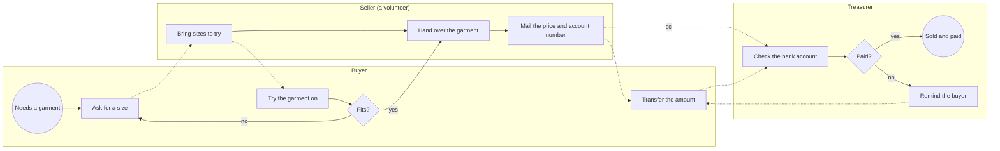
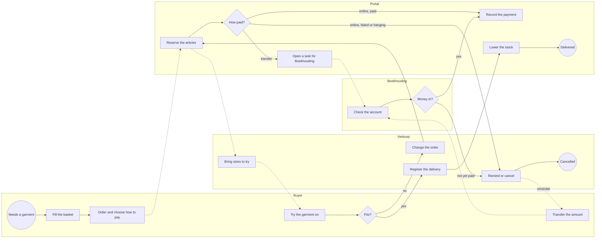
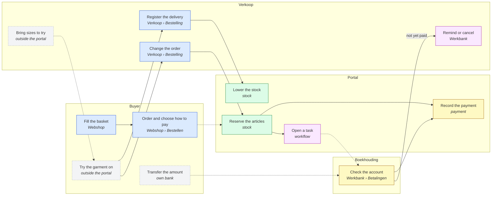
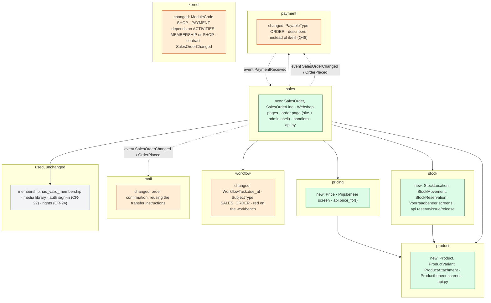
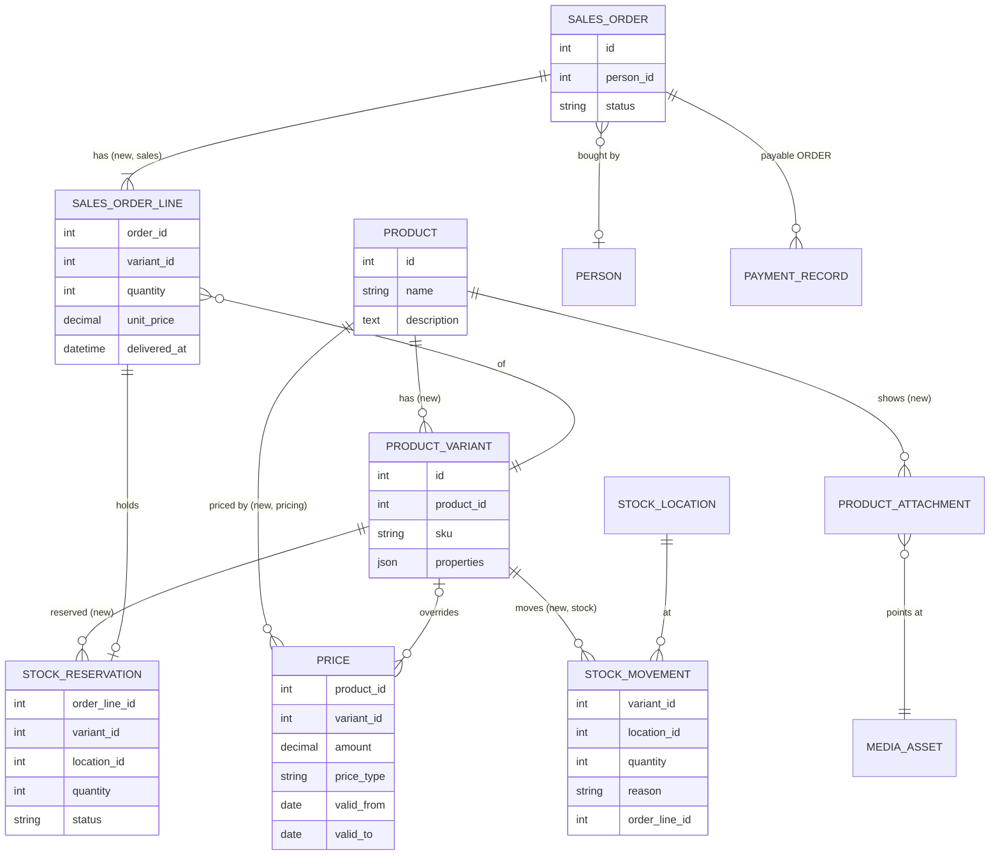

# Change Request 21 — Webshop: products, stock and pricing

**Project:** Web Portal "Raak Millegem"
**Status:** being shaped since 6 October 2026 · Parts A, B and C written; C8 run (8 October 2026), C9 concepts made (8 October 2026); not yet read against the code · nothing is built; not on a release
**Tracking issue:** none yet — the one place where what is open stands; this document is the design, the issue is the status
**Applies to:** to be filled in once Part B is shaped
**Reading:** A 4 333 words · B 4 014 (the decisions log excluded) · C 3 181 — measured on 8 October 2026 without drawings and notes; the budget is A ≤ 1 500  B ≤ 2 500: **over budget, accepted by Koen (Q53)** — A6 carries 38 requirements in the business's words with their sources  B2 the traceability of all of them and a walkthrough of 21 steps; cutting them would cut what the build read and Koen's validation need

---

# Part A — The business

## A1. Reason to act — the trigger

On 6 October 2026 Koen put forward the reason, in his words: *"we currently have no module to sell the T-shirts we have."* Raak has T-shirts in stock and no way to sell them through the portal.

The second half of the trigger is the platform: *"I also want a module we can later use in companies — T-shirts for Raak, selling other things, for other companies that will use the platform."* The shop is not a one-off for one batch of T-shirts; it is meant to serve any tenant of the platform, with its own products.

The platform half has no concrete case behind it yet (Koen, 6 October 2026): *"there is no concrete demand or process from companies that sell articles; it comes from the principle."* Raak's garments are the one real case; other tenants are the reason the shape must not be Raak-only.

## A2. As-is process — how it works today, and where it hurts

Raak has three kinds of garment in stock — T-shirts, sweaters and polos — each in several sizes. A sale today runs on conversation and e-mail; the portal plays no part in it.

*What to see: three people and an e-mail carry the sale; nothing records what was sold or what is left on the shelf.*

| # | Step | Who | Tool | Pain — confirmed by Koen, 7 Oct 2026 |
|---|---|---|---|---|
| 1 | Ask for a garment in a size | Buyer | word of mouth, message | the buyer cannot see what is available, in which size, at what price |
| 2 | Bring sizes to try on | Seller | the stock, at home or in storage | depends on one person being available |
| 3 | Hand over the garment | Seller | — | the stock count is in nobody's system; what is left is known by looking |
| 4 | Mail the price and Raak's account number, treasurer in copy | Seller | e-mail | written by hand for every sale; the price is whatever the mail says |
| 5 | Transfer the amount | Buyer | own bank | free-text communication; the transfer has to be matched by eye |
| 6 | Check the bank account, remind if unpaid | Treasurer | bank, an Excel list | the open sales are kept by hand in an Excel list, apart from the bank and the mails |

Not measured: how many garments are sold per year, how many are in stock, and what a garment costs. Deliberately left out (Koen, 7 Oct 2026: "niet zo belangrijk, gaan we nu niet uitkristalliseren"); the case for the shop rests on the principle of A1, not on volume.

## A3. To-be process — how it should work afterwards

> [!NOTE]
> *How the work should go afterwards: the same drawing and table as A2, the*
> *same lanes in the same order, so the difference is what the eye finds.*
> *Still no components: "the portal renders the poster", not "WeasyPrint*
> *renders the poster". A step that disappears, moves lane or turns into a*
> *choice is the change — name it under the drawing in one line each.*
>
> *The words the user will read are decided here, not in Part C: the name*
> *of a button, a page title, a tile label, a menu item — one short list,*
> *"what it says on the screen", in the user's language and never the*
> *domain's pet word.*

*What to see: the portal now holds what the e-mail and the Excel list held — the order, the reservation, the price and the open payment — and the treasurer's chase becomes a task that reaches Verkoop only when Boekhouding says the money is not there.*

What changes against A2, one line each:

- **Asking for a size** becomes filling a basket in the Webshop: the buyer sees what exists, in which size, at what price (pain 1).
- **The mail with price and account number** is no longer written by hand: the portal sends the buyer a confirmation mail with the order, the amount and — for a transfer — the account number and the structured communication, exactly as for a registration (pain 4, pain 5; R38).
- **The stock** is in the portal: reserved at the order, lowered at delivery (pain 3).
- **The Excel list** disappears: an unpaid transfer is a task on the workbench, first Boekhouding, then Verkoop (pain 6, R18).
- **Trying on and exchanging** stay by agreement, outside the portal; a change of size changes the order and the money follows it (R15, R16).
- **Bringing sizes** still depends on a volunteer (pain 2): the portal shows what is reserved, it does not deliver.

| # | Step | Who | Tool | What changed |
|---|---|---|---|---|
| 1 | Fill the basket, order, choose online or transfer | Buyer | Webshop | was: ask by word of mouth |
| 2 | Reserve the articles | Portal | — | new: what is reserved cannot be sold again (R13) |
| 3 | Receive the confirmation mail; pay online, or transfer with the structured communication | Buyer | e-mail, Mollie, own bank | was: a mail written by hand, and a free-text transfer (R38) |
| 4 | Check the account and book the transfer | Boekhouding | workbench task, bank | was: the Excel list; the task is due in 14 days and turns red after (R18, Q38) |
| 5 | Remind the buyer or cancel the order | Verkoop | workbench task | new: only when Boekhouding says "not yet paid", or an online payment failed (R17, R18) |
| 6 | Bring sizes, try on, change the order | Verkoop, Buyer | Verkoop screen | the order and the money follow the change (R15, R16) |
| 7 | Register the delivery, per line | Verkoop | Verkoop screen | new: the stock goes down here (R21) |
| 8 | Book a receipt from the supplier, correct the stock | Voorraadbeheer | Voorraadbeheer screen | new (R36, R37) |

Step 8 has no place in the drawing: it is not part of a sale.

**What it says on the screen** (Koen, 6 October 2026):

| Where | Word |
|---|---|
| The public page | Webshop |
| Role and screen: the product list | Productbeheer |
| Role and screen: prices | Prijsbeheer |
| Role and screen: orders, delivery, fitting, exchanges | Verkoop |
| Role and screen: stock | Voorraadbeheer |
| Delivery status of an order, for the buyer | **Klaar om af te halen** (nothing delivered yet) · **Deels afgeleverd** · **Afgeleverd** · **Geannuleerd** |
| Payment status of an order | Te betalen · Betaald · Terugbetaald — the payment domain's words, as on registrations |

## A4. Benefits — what the change earns

> [!NOTE]
> *The business side of the decision: what this change earns, in the*
> *measures the association counts in — hours of volunteer work saved per*
> *activity or per year, mistakes avoided, money collected sooner or not*
> *lost, members who would otherwise drop out, a process that becomes*
> *possible at all. One line per benefit, with the figure where it can be*
> *estimated and the reason where it cannot; a benefit that only the*
> *solution can name does not belong here. Set against the cost of B5, this*
> *is what says whether the change is worth doing, and when.*

No benefit carries a figure: the volumes were deliberately not measured (A2). The case rests on the first line; the rest is what the work stops costing.

| # | Benefit | Pain or reason | Figure |
|---|---|---|---|
| 1 | Raak can sell its garments through the portal at all | A1 | — |
| 2 | The buyer sees what exists, in which size and at what price, and can read the size chart before asking | pain 1 | — |
| 3 | No mail is written by hand for a sale: the price comes from one place, the member price applies by itself | pain 4 | one mail per sale |
| 4 | A transfer carries a structured communication and is matched by it, not by eye | pain 5 | — |
| 5 | What is in stock is known without going to look, and a reserved garment cannot be sold twice | pain 3 | — |
| 6 | The Excel list of open sales disappears: what is unpaid is a task on the workbench, with whom it lies and since when | pain 6 | one list less |
| 7 | Another tenant of the platform can sell its own articles with the same module | A1, R5 | a principle; no tenant asks for it yet |

**Not earned:** bringing sizes to try still depends on one volunteer being available (pain 2); the portal shows what is reserved, it does not deliver.

## A5. Supplied material — and what it taught us

> [!NOTE]
> *What the business handed over to start from — brand guides, examples,*
> *photos, spreadsheets, briefs — with where it lives (described in words or*
> *by file name; never a local path, never in the repository when it holds*
> *personal data or brand assets). What was learnt from it goes here too, as*
> *measurements: "four example posters; none has a bleed". Do not forget the*
> *reporting need: must something be counted, listed, exported or printed*
> *afterwards, for whom, in which form? If so, it is a requirement in A6; if*
> *not, A6 says so in one row.*

| Material | Where it lives | What it taught us |
|---|---|---|
| The size charts that came with the delivery of the garments — one or more per product (Koen, 7 Oct 2026) | with Koen; uploaded per product in Productbeheer, never in the repository | a buyer chooses a size from the supplier's own chart, so a product carries documents next to its pictures, as many as needed (R3) |
| The Excel list of open sales | with the treasurer; holds names and amounts, so it stays outside the repository | the open sales are followed apart from the bank and the mails (pain 6); the workbench task replaces it (R18), nothing is imported from it |
| Pictures of the garments | none supplied yet; taken when the products are entered | one to four per product (R3) |

**Reporting need.** None asked (Koen, 7 Oct 2026, Q46) beyond what the screens show: the orders with their statuses (R34), the stock per location (R7) and the open tasks on the workbench (R18). No export, no printed list, no figure for the board; stock value is Won't (R8). If one is wanted, it becomes a requirement in A6.

## A6. Business requirements — what the board asks, with MoSCoW

> [!NOTE]
> *One table. Each requirement is a sentence a board member would say, with a*
> *MoSCoW class. Numbered, so Part B, Part C and the acceptance criteria can*
> *point at them.*

| # | Requirement | MoSCoW | Source | Comment |
|---|---|---|---|---|
| R1 | The webshop shows clearly what an article is. | Must | Koen, 6 Oct 2026 | description, pictures and documents, R3 |
| R2 | Products are master data: the product portfolio is managed in its own place, apart from any activity. | Must | Koen, 6 Oct 2026 | "very simple at this moment" |
| R3 | A product has a description, one or a few pictures — one, two, three, four — and one or more documents a buyer looking at the article can open, for example the size chart that came with the delivery of the clothing, so the buyer can choose a size from it. | Must | Koen, 6 Oct 2026 | documents added later the same day, first as R20 |
| R4 | Only the role Masterdata may manage the products (product master data); others may not. | Must | Koen, 6–7 Oct 2026 | the role of CR-24 (Q2 there); first written as "a role for product master data" |
| R5 | Any tenant of the platform can use the shop with its own products, not only Raak. | Must | Koen, 6 Oct 2026 (A1) | no company asks for it yet; a principle |
| R6 | One product can have different prices over time; at any moment it is clear what the price of an article is. | Must | Koen, 6 Oct 2026 | "maybe overdone now, but in time price setting will matter" |
| R7 | Stock is kept per location: which articles are in stock, and how many, at which place. | Must | Koen, 6 Oct 2026 | today one location: a volunteer's home serves as the warehouse of Raak Millegem |
| R8 | The value of the stock can be known. | Won't *(now)* | Koen, 6 Oct 2026 | stock valuation is for later; what is built now must not stand in its way |
| R9 | Warehouse management: where inside a location an article lies — which rack, which shelf — and barcodes on articles, with scanning. | Won't | Koen, 6 Oct 2026 | barcodes added as R10 the same day |
| R10 | *Merged into R9.* | — | Koen, 6 Oct 2026 | the number stays empty, so later references do not shift |
| R11 | Everyone can buy, members and non-members; a member pays the member price where the article has one — the same principle as registering for an activity. | Must | Koen, 6 Oct 2026 | |
| R12 | The portal arranges how the buyer gets the article — pick-up, bringing it, trying it on first. | Won't | Koen, 6 Oct 2026 | all three stay possible, by agreement between buyer and seller, outside the portal |
| R13 | An order reserves its articles the moment it is placed: what is reserved cannot be sold again. The stock itself only goes down when the article has left the warehouse — when it is delivered. A reservation is cancelled when the buyer withdraws, exchanges for another article, or the payment fails; the article is then free to sell again. | Must | Koen, 6 Oct 2026 | replaces "stock is taken at the order" of the same day (Q16) |
| R14 | The buyer pays online or by bank transfer, as with a registration for an activity. | Must | Koen, 6 Oct 2026 | |
| R15 | An order can be changed after trying on — a bigger size for a smaller one, a T-shirt instead of a sweater — and the stock follows the change. | Must | Koen, 6 Oct 2026 | same principle as changing a registration |
| R16 | The money follows a changed order as it does for a registration: an extra payment when it was paid and the new amount is higher, an updated amount when it was not paid yet, a refund when it was paid and the new amount is lower. | Must | Koen, 6 Oct 2026 | |
| R17 | An order whose online payment fails, or stays hanging (the buyer closed the browser), becomes a task on the workbench for Sales, because something has to happen with it. | Must | Koen, 6 Oct 2026 | replaces "cancelled by itself" of the same day (Q15); the reservation stays until someone acts (Q17) |
| R18 | An order paid by bank transfer becomes a workbench task at once, due within 14 days, and runs as a workflow of two steps: first **Boekhouding** ("is the money on the account?" — it books the transfer, and the task closes by itself), then **Verkoop** (remind the buyer or cancel the order) — the task moves to Verkoop only when Boekhouding answers "nog niet betaald", not by itself. Verkoop's task shows how recent the information is: the date on which Boekhouding answered "nog niet betaald" (Q47). A task past its due date only turns red on the workbench; no mail goes out (Q38). | Must | Koen, 6 and 7 Oct 2026 | "de boekhouding moet wel op tijd de betaling afboeken, anders heeft sales geen juiste informatie"; Q15, Q36. Built on the steps of `WorkflowDefinition` (a role per step); a due date on a task is new to the workbench. Importing bank statements is a change request of its own, reserved and not planned (Q37) |
| R19 | The roles that carry the process: Masterdata (keeps the product list — product master data), Prijsbeheer (sets the price of an article), Verkoop (the webshop: orders, delivery, fitting moments, exchanges), Boekhouding (follows up payments — the existing role `FINANCE`) and Voorraadbeheer (enters stock and changes it by hand). One person may hold several. | Must | Koen, 6–7 Oct 2026 (Q11, Q33) | Productbeheer became part of Masterdata (CR-24); screen names follow CR-24 |
| R20 | *Merged into R3.* | — | Koen, 6 Oct 2026 | the number stays empty, so later references do not shift |
| R21 | Sales registers per order line that it is delivered; picked up or brought makes no difference. That is the moment the stock goes down. | Must | Koen, 6–7 Oct 2026 (Q30) | the goods issue (GI) of an ERP: in one transaction the line is delivered, the stock goes down and the reservation closes; a line is delivered whole — a partial delivery is a change that splits the line (R15) (Q30) |
| R22 | An unpaid order ends in one of three ways: the buyer still pays — for example through a new payment link — and the task closes by itself; the buyer cancels it (R23); or Sales cancels it from the task. | Must | Koen, 6 Oct 2026 | |
| R23 | A signed-in buyer (member or account) can cancel his own order in the webshop, on the same page Sales uses in the back office. | Must | Koen, 6 Oct 2026 | first Won't, taken in the same day: "if we use the same screen in public and in the back office, we may get it for free" (Q19); until delivery (Q20); the buyer gets back to his order through a link in the confirmation mail (Q21); a guest cannot — without an account nothing is changed afterwards (CR-22 Q10): he asks Sales |
| R24 | The buyer collects articles in a shopping basket and orders and pays two, three or more articles in one go. | Must | Koen, 6 Oct 2026 | the basket reserves nothing and needs no account; it lives in the buyer's browser (Q22, Q23) |
| R25 | The buyer may cancel until the order is delivered. A return after delivery is out of scope: it is handled by hand — Sales removes the order and books the refund. | Must | Koen, 6–7 Oct 2026 | "retour is out-of-scope, gaan we doen door bestelling te verwijderen en terugbetaling te boeken" — "manueel" (Q40) |
| R26–R30, R32 | *Moved to CR-22* (signing in to buy or register: member, account or guest). | — | Koen, 7 Oct 2026 | the numbers stay empty, so later references do not shift |
| R33 | The buyer signs in as a member or with an account, or orders as a guest, as CR-22 defines for activity registrations and the webshop alike. | Must | Koen, 7 Oct 2026 | CR-22 is built first, on the activities; the webshop uses the same mechanism |
| R34 | An order shows its statuses side by side, each from its own source: its payment status from payments, its delivery status from its lines (reserved, partly delivered, delivered, cancelled). Later, for companies, an invoicing status from invoices joins them, in parallel with payments. | Must | Koen, 7 Oct 2026 (Q29) | invoices: not now; the shape must take them |
| R35 | Invoices. | Won't *(now)* | Koen, 7 Oct 2026 (Q31) | later, in the existing payment domain, called finance; the webshop will ask it through its facade to invoice delivered lines and will only know the invoicing status |
| R36 | Voorraadbeheer can correct the stock of an article by hand, up or down, at a location — for example when a returned garment comes back after delivery (R25). | Must | Koen, 7 Oct 2026 (Q41) | a stock movement of its own kind, next to the goods issue of R21 |
| R37 | Voorraadbeheer books a delivery from the supplier as a receipt at a location — a stock movement apart from corrections, so it stays visible what came in and what was corrected. | Must | Koen, 7 Oct 2026 (Q42) | the goods receipt (GR) of an ERP, next to the goods issue of R21; keeps the way open for stock valuation (R8) |
| R38 | The buyer receives a confirmation mail of the order — the articles, the amount and, for a bank transfer, the account number and the structured communication — exactly as for a registration for an activity. | Must | Koen, 7 Oct 2026 (Q44) | today's registration mail carries the transfer instructions (`mail/service.py:402`, `_transfer_instructions_html`, used by `activity_confirmation_message`, measured on master 25c74f60) |
| R31 | An account says whether it is a company or a natural person, and holds an address to deliver to. | Won't *(for now)* | Koen, 6 Oct 2026 | today an order is only ever for a person |

MoSCoW: **Must** (without it the change is worthless), **Should** (important,
but the change ships without it), **Could** (nice, if cheap), **Won't** (asked
and deliberately not done — recorded so it is not asked again).

## A7. Non-functional requirements — security, privacy, house style, tenants

> [!NOTE]
> *The requirements every change request is tested against, each answered*
> *explicitly at business level, "not applicable" included. How they are met*
> *belongs in Part C (C5):*

| Concern | This change |
|---|---|
| **Security** — who may do what; new inputs from outside; secrets | Each back-office screen is reached through its role only — Masterdata, Prijsbeheer, Verkoop, Voorraadbeheer, Boekhouding (R4, R19) — and ADMIN sees all (CR-24). The new inputs from outside are the basket and the order: the price and the amount are always computed by the portal, never taken from what the buyer's browser sends; the reservation decides whether an article can still be ordered. A buyer sees and cancels only their own orders (R23). Online payment uses the existing Mollie flow, under its existing rule that the status always comes from Mollie. No new secrets. |
| **Privacy** — personal data: what, where, who sees it, what leaves the system | The buyer's data are those of a registration — name, e-mail, mobile — plus what they ordered and paid. Verkoop and Boekhouding see them, and ADMIN; Masterdata, Prijsbeheer and Voorraadbeheer see products, prices and stock, not buyers. What leaves the system is what leaves for a registration: the payment to Mollie and the confirmation mail (R38). The basket lives in the buyer's browser and holds no personal data. Nothing new is kept longer than an order. |
| **House style / UI norm** — `docs/design-system.md`; brand rules | The Webshop is a public page in the site shell, the back-office screens in the admin shell; both follow `docs/design-system.md` and are looked at on a phone (390 px). Screen words are the Dutch words of A3. Pictures and the size chart are shown as the media of the portal are today. |
| **Multi-tenant** — what differs per unit, what is platform-wide | Products, prices, stock, locations, orders and roles are per tenant (R5): a tenant sees only its own (AC17). The shop is a module a tenant switches on, and works for a tenant without members — a company — as well. What is platform-wide: the module itself, the order statuses and the payment words. |

## A8. Acceptance criteria — what the business signs off on HDEV

> [!NOTE]
> *Criteria the business signs off on, each testable by a person on HDEV*
> *without reading code, each pointing at a requirement and at the steps of*
> *the walkthrough (B2) that show it. These are the business's unit tests;*
> *the developer's tests live in Part C.*

The last column names the steps of the walkthrough (B2) that show each criterion.

| # | Criterion | Requirement | Walkthrough steps |
|---|---|---|---|
| AC1 | Someone with the role Masterdata creates a T-shirt with the sizes S, M, L and XL, two pictures and a size chart. The Webshop shows it; the size chart opens. | R1, R2, R3 | W1, W2 |
| AC2 | Someone without the role Masterdata cannot open Productbeheer, nor change a product. | R4 | W3 |
| AC3 | Prijsbeheer sets a price from today and a new price from next month. The Webshop shows today's price; a signed-in member sees the member price, everyone else the regular price. | R6, R11 | W4, W5 |
| AC4 | Voorraadbeheer books a receipt of ten T-shirts size M at the warehouse; the stock shows ten. | R7, R37 | W6 |
| AC5 | A buyer puts two articles in the basket, closes the browser, comes back: the basket is still there. They order and pay online (Mollie test mode). The order reads **Betaald** and **Klaar om af te halen**; one M is reserved, the stock still counts ten. | R13, R14, R24, R33, R34 | W7, W8 |
| AC6 | When every M is reserved, a second buyer cannot order an M. | R13 | W9 |
| AC7 | A buyer orders and pays by transfer. They receive a confirmation mail with the articles, the amount, the account number and the structured communication; a task appears on the workbench for Boekhouding, due within 14 days. | R18, R38 | W10, W12 |
| AC8 | Boekhouding confirms the transfer: the task closes by itself and the order reads **Betaald**. | R18 | W13 |
| AC9 | Boekhouding answers "nog niet betaald": the task moves to Verkoop and shows "Boekhouding: nog niet betaald" with the date of that answer. A task past its due date turns red on the workbench; nobody gets a mail. | R18 | W14, W15 |
| AC10 | An online payment that fails, or that the buyer abandons, becomes a task for Verkoop; the articles stay reserved until someone acts. | R17, R13 | W16 |
| AC11 | After trying on, Verkoop changes an M into an L. The reservation moves to the L; the amount follows: an extra payment when the L costs more and the order was paid, a refund due when it costs less, a new amount when it was not paid yet. | R15, R16 | W17 |
| AC12 | Verkoop registers one line of a two-line order as delivered: the order reads **Deels afgeleverd**, the stock of that article goes down by one and its reservation closes. When the second line is delivered, the order reads **Afgeleverd**. | R21, R34 | W18 |
| AC13 | A signed-in buyer cancels their own order before delivery, on the same page Verkoop uses: the order reads **Geannuleerd**, the articles are free to sell again, and a paid order shows a refund due. | R13, R23, R25 | W11 |
| AC14 | After delivery, the buyer can no longer cancel. | R25 | W18 |
| AC15 | Verkoop cancels an unpaid order from the task: the task closes, the articles are free again. | R22 | W19 |
| AC16 | Voorraadbeheer corrects the stock up by one after a return; the correction is visible apart from the receipt of AC4. | R36, R37 | W20 |
| AC17 | A second tenant on HDEV has its own products in its own Webshop; it does not see Raak's, nor Raak its. | R5 | W21 |

---

# Part B — The solution, for whoever approves it

> [!NOTE]
> *Part B is read by the people who say "yes, build this": Koen, the*
> *analyst, the architect. It answers four questions — what is the solution,*
> *does it fit our process and our requirements, how does it hang together*
> *across the modules and what does it touch, what does it cost and in which*
> *steps does it arrive — and it ends with what is still theirs to decide.*
> *Reasoning in depth, mechanics and per-module detail go to Part C; Part B*
> *names the decision and the rejected alternative ("Rejected alternative: …"), in five lines at most.*

## B1. Solution outline — the solution and the decisions that shape it

> [!NOTE]
> *The solution in one paragraph; then the decisions that shape it, one*
> *bullet each of at most five lines: the decision, the rejected alternative that
> *lost, why (Europe First named where a tool or service is chosen). The*
> *full reasoning behind each decision is C4, which points back here. Then*
> *the **derived requirements** (F1, F2, …) in one table, traced to A6: the*
> *finer-grained requirements the solution answers — design work by the*
> *analyst, which is why they are not in Part A.*

Four new domains, one per role that keeps them: **`product`** (the catalogue — product, variant, pictures and documents; Masterdata), **`pricing`** (prices over time, regular and member; Prijsbeheer), **`stock`** (locations, movements, reservations; Voorraadbeheer) and **`sales`** (the Webshop pages, the order and its lines, delivery, change and cancel, the order's tasks; Verkoop). They talk only through their facades. `payment` learns a third thing that can be paid, the order; `workflow` learns a due date and the order as a subject; `mail` sends the order confirmation from an event; `kernel` gets a module, SHOP, that a tenant switches on. Nothing in activities or membership changes.

- **D1 — Four domains, one per role.** Rejected alternative: one `shop` domain. Each role's data lives differently — master data, prices in time, a ledger of movements, transactions — and `pricing` is its own domain by decision (Q2); one domain would put the product inside the sale, which R2 forbids.
- **D1a — The domain is `sales`, not `orders` (Q54).** Purchasing, when it comes, is a domain of its own, `purchasing` — hiring a carrier included, as a purchase of a service — beside `sales`, sharing `product`, `pricing`, `stock`, `payment` and the party. Rejected: one `orders` domain with a kind — a branch per kind at every step (reserve or not, money in or out). Moving stock between own locations is out of scope and not decided.
- **D2 — Stock is a ledger of movements; a reservation is apart.** On hand = the sum of movements; available = on hand − open reservations, per variant and location (Q3, Q16). Rejected: one stock number per variant — it forgets why it changed and cannot carry a value later (R8).
- **D3 — The price is fixed on the line when the order is placed.** `pricing` answers "the price of this variant on this day, for a member or not"; `sales` writes it on the line and computes the total inline. Rejected: reading `pricing` at every display — a new price would change orders already placed.
- **D4 — An order is a payable of `payment`, like a registration.** Online and transfer, the structured communication, refunds and the recalculation after a change (`reconcile_charges`, R16) are reused, not rebuilt. The event that announces a change is `SalesOrderChanged`: `OrderChanged` already names a registration's items (C1).
- **D5 — The unpaid transfer is a workflow definition of two steps** (Q36): Boekhouding, then Verkoop, each step a task with its role; `PaymentReceived` for the order ends the run; Boekhouding's "nog niet betaald" completes step 1 and starts step 2. A failed or expired online payment starts a one-step run for Verkoop. Rejected: a sweep task keyed by its title, as refunds have — it cannot carry two steps.
- **D6 — One order page, in the site shell for the buyer and the admin shell for Verkoop** (R23), as registration is one page since CR-14. The basket lives in the browser and reserves nothing (Q22, Q23).
- **D7 — Pictures and documents live in the media library**, with two new kinds, linked to the product by `product_attachment` (B3a). Rejected: files on the product — the library already stores, thumbnails and deletes.

**Derived requirements**

| F | Requirement | From |
|---|---|---|
| F1 | An order is refused, line by line with the reason, when the available quantity of a variant at the location is short; the check and the reservation happen in one transaction, under a lock on that variant and location. | R13 |
| F2 | A tenant has one default location; an order reserves there. More locations hold stock; moving stock between them is out of scope and not decided (Q54). | R7, R13 |
| F3 | The price of a line: the variant's price valid on the order date, else the product's; the member price when the buyer has a valid membership (`has_valid_membership`) and the article has one. | R6, R11 |
| F4 | A line keeps variant, quantity, unit (C62) and unit price; the order total is computed while the lines are made, never from the relationship after a flush. | R16, B3a |
| F5 | The delivery status is derived from the lines: none delivered → Klaar om af te halen; some → Deels afgeleverd; all → Afgeleverd; a cancelled order → Geannuleerd. | R34 |
| F6 | Delivering a line is one transaction: the line is delivered, a movement GOODS_ISSUE takes its quantity, its reservation closes. | R21 |
| F7 | A change replaces lines; reservations follow; `SalesOrderChanged` lets `payment` recalculate. A partial delivery is a change that splits the line first. | R15, R16, Q30 |
| F8 | Cancelling takes the whole order and is possible while no line is delivered: reservations cancel, open tasks close, a paid order gets its refund through the same recalculation. | R22, R23, R25 |
| F9 | Movement reasons are a code list: RECEIPT, GOODS_ISSUE, CORRECTION. | R36, R37 |
| F10 | A task carries `due_at`; the workbench shows a task past it in red; nothing is mailed. The transfer step is due 14 days after the order. | R18, Q38 |
| F11 | Verkoop's task shows Boekhouding's answer on the step before, with its date: "Boekhouding: nog niet betaald — <date>". The decision and `done_at` of the closed task are kept today; they are only shown on the next task. Nothing is derived, nothing new to click (Q47). | R18 |
| F12 | Placing an order mails the confirmation with its lines, the amount and, for a transfer, the transfer instructions the registration mail already builds. | R38 |
| F13 | The link in the mail signs the buyer in and opens the order (CR-22). | Q21, Q26 |
| F14 | Every new table is tenant-scoped (`TenantMixin`); no screen shows another tenant's rows. | R5 |

## B2. Fit with the process and the requirements — for the business

> [!NOTE]
> *Three things. First, the **application usage drawing**: the to-be process*
> *of A3 once more — same lanes, same activities — with, in every activity*
> *box, a second line naming the screen or module that serves it, the box*
> *coloured per module (`classDef`, one legend line). Every step has a home*
> *or is marked "outside the portal"; a module no step uses is not part of*
> *this change. Two audiences (those who set up, those who use) means two*
> *drawings. Second, the **traceability matrix** — the one place where a*
> *requirement's thread is followed from left to right, so it is kept*
> *nowhere else: one row per requirement of A6 — R · how the solution meets*
> *it, in the words of the role that will see it · the derived requirements*
> *(F, B1) · the module that builds it (C2) · the test that proves it (C6) ·*
> *the acceptance criterion the business checks (A8). An empty cell is a*
> *finding: a requirement without a test, a test without a requirement. A*
> *Won't gets a row that says so. Third, the **walkthrough** — how the*
> *business tests this on HDEV: one numbered script per role of A3, in the*
> *order of the to-be process, happy path first and then the turns where it*
> *must refuse or fall back; each step names what to do and what to see —*
> *nothing else, it is a script. A8's last column names the steps that show*
> *each criterion; every criterion has at least one step. The closing*
> *comment of each issue points at the walkthrough instead of rewriting it.*

**Application usage drawing** — the to-be process of A3, each step with the screen or module that serves it.

*Legend: blue `sales` · green `stock` · yellow `payment` · purple `workflow` · grey outside the portal. The setting-up roles have their own screens, not drawn: Masterdata › Productbeheer (`product`), Prijsbeheer (`pricing`), Voorraadbeheer (`stock`).*

**Traceability matrix**

| R | How the solution meets it | F | Module | Test | AC |
|---|---|---|---|---|---|
| R1, R3 | The product page shows description, pictures and documents, as many as the product has | — | product, sales | T1 | AC1 |
| R2 | Productbeheer is its own screen, no activity involved | — | product | T1 | AC1 |
| R4 | Productbeheer needs `product.masterdata` (CR-24) | — | product | T2 | AC2 |
| R5 | Every table tenant-scoped; the module SHOP per tenant | F14 | all, kernel | T3 | AC17 |
| R6 | A price has a validity period; the one valid today is shown | F3 | pricing | T4 | AC3 |
| R7 | Stock per variant and location, as a ledger | F2 | stock | T5 | AC4 |
| R8, R9, R12, R31, R35 | Won't — nothing built; the ledger and the line keep the way open | — | — | — | — |
| R11 | Member price for a valid membership | F3 | pricing, sales | T4 | AC3 |
| R13 | Reserve at "Bestellen"; refuse when short | F1 | stock, sales | T6 | AC5, AC6 |
| R14 | Online or transfer through `payment` | — | payment, sales | T7 | AC5, AC7 |
| R15, R16 | Change replaces lines; payment recalculates | F7 | sales, payment | T8 | AC11 |
| R17 | Failed or expired online payment → task for Verkoop | — | sales, workflow | T9 | AC10 |
| R18 | Two-step run, due date, freshness | F10, F11 | sales, workflow, payment | T10 | AC7–AC9 |
| R19 | The roles of CR-24 gate the four screens; Boekhouding is FINANCE | — | all | T2 | AC2 |
| R21 | Delivery per line lowers the stock | F6 | sales, stock | T11 | AC12 |
| R22 | Verkoop cancels from the task | F8 | sales, workflow | T12 | AC15 |
| R23, R25 | The buyer cancels on the same page while nothing is delivered | F8 | sales | T12 | AC13, AC14 |
| R24 | Basket in the browser | — | sales | T13 | AC5 |
| R33 | Sign-in of CR-22 | F13 | auth, sales | T14 | AC5 |
| R34 | Payment status from `payment`, delivery status from the lines | F5 | sales | T11 | AC5, AC12 |
| R36, R37 | Receipt and correction as movements with their reason | F9 | stock | T5 | AC4, AC16 |
| R38 | Confirmation mail with transfer instructions | F12 | mail, sales | T15 | AC7 |

**Walkthrough on HDEV** — per role, in the order of the process.

*Masterdata* — W1 Beheer › Productbeheer › Nieuw: "T-shirt Raak", a description, sizes S, M, L, XL. W2 Add two pictures and two size charts; see them on the product. W3 Sign in as a user without Masterdata: Productbeheer is not in the menu, and its address refuses.

*Prijsbeheer* — W4 Prijsbeheer › T-shirt Raak: price €15, member price €12, from today; €17 from next month. W5 Open the Webshop signed out: €15. Signed in as a member: €12.

*Voorraadbeheer* — W6 Voorraadbeheer › Ontvangst: ten M at the default location; the stock reads 10, available 10.

*Buyer* — W7 Webshop: an M and an L in the basket; close the browser, return: the basket is there. W8 Bestellen, pay online (Mollie test): the order reads Betaald and Klaar om af te halen; available M 9, stock 10. W9 With all M reserved, order an M: refused, with the reason. W10 Order and pay by transfer: the mail holds the articles, the amount, the account number and the structured communication. W11 Before delivery, cancel the order from "Mijn aankopen": Geannuleerd, the articles available again.

*Boekhouding* — W12 Werkbank: a task for the order of W10, due in 14 days. W13 Confirm the transfer: the task closes, the order reads Betaald. W14 On a second transfer order, answer "nog niet betaald": the task leaves Boekhouding's list.

*Verkoop* — W15 Werkbank: the task of W14, with "Boekhouding: nog niet betaald — <today>"; set its due date in the past on HDEV: red, no mail. W16 Abandon an online payment as buyer: a task for Verkoop. W17 Change an M into an L on a paid order where the L costs more: an extra payment is due. W18 Deliver one line of a two-line order: Deels afgeleverd, stock down by one; deliver the second: Afgeleverd; the buyer can no longer cancel. W19 Cancel the order of W16 from its task: the task closes, the articles are free. W20 Voorraadbeheer › Correctie +1 after a return: shown apart from the receipt.

*Second tenant* — W21 Sign in at the second tenant on HDEV: its Webshop and screens show none of Raak's products.

## B3. The whole across the modules — for the architect

> [!NOTE]
> *The **application structure drawing**: one subgraph per module touched,*
> *inside it a box per layer (screen · view-model · service · entity ·*
> *facade · migration · template) — a separate box for what is **new** and*
> *for what is **changed** in that layer, and one grey box for what is only*
> *used. Here the colour is the kind of change, not the module: green new,*
> *orange changed, grey unchanged. One legend line. Arrows between modules*
> *only through a facade (`api.py`), as the import gate enforces; external*
> *systems and data stores as their own boxes. Then the **data model at a*
> *glance**: a Mermaid `erDiagram` of the entities involved with their key*
> *columns and relationships, cardinality on the edges, soft references*
> *across schemas drawn as relationships too, and what is new or changed*
> *marked in the label. Under it, in at most two hundred words: who calls*
> *whom and through which facade, the direction of every new dependency,*
> *the transaction boundary, and the **impact on the existing*
> *architecture** — which existing modules, tables, screens and contracts*
> *are touched, and how the layer rules (`docs/code-style.md`, the import*
> *gate) hold. This is where a reviewer checks that the change does not*
> *bend the architecture; the per-module detail is C2.*

**Application structure drawing**

*Legend: green new · orange changed · grey used unchanged. Solid arrows are facade calls (`api.py`), dotted arrows events.*

**Data model at a glance**

`sales` calls `product`, `pricing`, `stock`, `payment` and `workflow` through their facades and depends on nothing else new; `pricing` and `stock` read `product`; nothing calls `sales` except through events. `payment` does not import `sales`: it learns an order's name, link, filter label and export kind from a describer that `sales` registers (Q48, decided). Placing an order is one transaction — lines, prices, reservations, the payment record, the workflow run — and the mail leaves after the outer commit (`OrderPlaced`). Delivering a line and cancelling an order are each one transaction. The impact on what exists: `payment`'s readers of the payable type, the workbench's task row, the module list and its CHECK, the payable delete gate and the reporting view `f_payments`. The import gate and the layer gate hold: screens read view-models, domains meet in `api.py`.

## B3a. Standards the model follows — and where it deviates, on purpose

*Seeded on 7 October 2026, before B3 is written: the names here are the ones B3 and Part C will use.*

Standards checked: UBL 2.1 (`Catalogue`, `Order`, `DespatchAdvice`, `InventoryReport`) and EN 16931 / PEPPOL BIS Billing 3.0 for the later invoice; UN/CEFACT code lists UNCL 5387 (price type) and UN/ECE Rec. 20 (unit of measure); ISO 4217 for currency; GS1 GTIN and GLN for article and location identifiers; ISO 20022 and the Belgian structured communication for payment references; schema.org `Product` / `Offer` for the public page. For a reservation no standard applies: it is an ERP concept (a sales order's committed quantity), modelled after common practice.

| Concept in this change | Standard and element | Ours (table · column, name) | Follows / deviates — why |
|---|---|---|---|
| Product | UBL `cac:Item` (`cbc:Name`, `cbc:Description`); schema.org `Product` | `product` · `name`, `description` | follows |
| Variant (size) | UBL `cac:Item/cac:AdditionalItemProperty` (`cbc:Name` "Maat", `cbc:Value` "M"); schema.org `ProductGroup` + `variesBy` | `product_variant` · `product_id`, and its properties as rows (name, value) | follows: a property is repeatable, so a second axis (colour) is a row, not a column |
| Article identification | UBL `cac:SellersItemIdentification`; GS1 GTIN in `cac:StandardItemIdentification` | `product_variant` · `sku`; GTIN: not now | follows for the seller's code; GTIN left out "not now" — a separate identification row can take it, never a second column |
| Pictures and documents | UBL `cac:AdditionalDocumentReference` (`cbc:DocumentTypeCode`, `cac:Attachment`); schema.org `image` | `product_attachment` · `product_id`, `kind` (picture, document), `media_asset_id`, `sort_order`, `title` | follows: repeatable, typed, pointing at the media library (CR-15) |
| Price | UBL `cac:Price` (`cbc:PriceAmount` with `currencyID`, `cbc:BaseQuantity`, `cac:ValidityPeriod`) | `pricing.price` · `product_id`, `variant_id` (null = the product's), `amount`, `currency` (EUR), `valid_from`, `valid_to` | follows: validity as a period, a variant's price overrides the product's (Q4) |
| Member price | UBL `cbc:PriceType` / `cbc:PriceTypeCode` (UNCL 5387) | `pricing.price` · `price_type` code list: `REGULAR`, `MEMBER` | follows: a second price is a row with a type, not a column `member_price` |
| Currency | ISO 4217 | `currency` CHAR(3) | follows |
| Order and its lines | UBL `Order` · `cac:OrderLine/cac:LineItem` (`cbc:Quantity` with `unitCode`, `cac:Price`, `cac:Item`) | `sales_order`, `sales_order_line` · `variant_id`, `quantity`, `unit_code` ("C62"), `unit_price` | follows; the line keeps its price at sale, as EN 16931 needs it on the invoice (BT-146) |
| Buyer | UBL `cac:BuyerCustomerParty` (a `cac:Person`; later a party with a contact person) | `sales_order.person_id` (the person who ordered, CR-22 account or member) or the guest's name, e-mail, mobile on the order | follows for a person; deviates for a guest: contact fields on the order without a party — "not now", as for registrations; the household is no buyer but a point of view (Q34) |
| Reservation | — (ERP: committed quantity of a sales order) | `stock_reservation` · `order_line_id`, `variant_id`, `location_id`, `quantity`, `status` (open, delivered, cancelled) | no standard; kept apart from movements (Q16) |
| Delivery | UBL `DespatchAdvice` · `cac:DespatchLine` (`cbc:DeliveredQuantity`) | `sales_order_line.delivered_at` + a stock movement | follows the meaning per line (Q25); no despatch document "not now" |
| Stock movement | UBL `InventoryReport` (a count); GS1 EPCIS (events) | `stock_movement` · `variant_id`, `location_id`, `quantity` (signed), `reason`, `occurred_at`, `order_line_id` | follows EPCIS's event shape: one row per what happened; a count is a correction row |
| Location | UBL `cac:Location`; GS1 GLN | `stock_location` · `name`; GLN: not now | follows; no bins (R9) |
| Payment reference | Belgian structured communication; ISO 20022 `RmtInf/Strd` | the existing `payment_records.structured_communication` | follows, as payments already do |
| Invoice (later) | EN 16931 / PEPPOL BIS 3.0 | — | not now; the order line carries what an invoice line needs (quantity, unit, unit price, item) |

## B4. Rules this change needs an exception from — decided once, here

> [!NOTE]
> *Every existing rule, gate or fixed decision the design breaks or bends:*
> *the rule by name and place (`CLAUDE.md`, `docs/code-style.md`,*
> *`docs/architecture.md` §…, a gate in `backend/tests/`), what the design*
> *does instead, the mechanism (a named baseline entry, a widened gate, a*
> *replaced fixed UI decision), and whether the exception is temporary (with*
> *what ends it) or the new rule. One table; "none" is an answer, with the*
> *gates that were checked to say so. The approver decides each row at the*
> *handover — once. CR-14 needed an exception from the cross-domain call rule*
> *and nobody had written it down: the gate found it, the master CLI asked*
> *six times, and the third case became a change request of its own.*

| Rule (where) | What the design does instead | Mechanism | Temporary until … / the new rule | Decided |
|---|---|---|---|---|
| The payable delete gate knows exactly two payable types (`tests/test_payable_delete_gate.py:80, 235`) | a third, ORDER | the gate's list grows to three, with `sales` refusing to delete an order that has a payment record | the new rule | Koen, at the handover |
| PAYMENT depends on ACTIVITIES and MEMBERSHIP (`kernel/modules.py:193`) | a tenant with only the shop needs payments | the dependency becomes "one of ACTIVITIES, MEMBERSHIP, SHOP" | the new rule | Koen, at the handover |

Checked and not bent: the import gate (facades only), the layer gate, the template-variable gate, the public shell gate, the Dutch-identifier ratchet (all new code English), the money rule "never trust the webhook body", the fixed decision "registration is one page" (followed, not bent).

## B5. Cost — investment and running cost, and what operations must know

> [!NOTE]
> *Three parts, each with a figure or "none". **Investment:** one table,*
> *module × phase, with the effort to build in CLI-days or person-days (S /*
> *M / L until the team has a track record), a total per module and per*
> *phase; then analysis, review, validation on HDEV and the release steps;*
> *then one-off purchases (a licence, a product, a device). **Running*
> *cost:** what it costs per month or per year once live — usage rights and*
> *paid services (per use and per month, measured where a prototype exists),*
> *storage and backups, hosting, and the maintenance it adds (a job to watch,*
> *a certificate to renew, a dependency to keep current). **Operations:***
> *settings, env vars, limits, kill switch, backups — what the person running*
> *the stack must know. Set beside the benefits of A4: the two together are*
> *the input for the release decision.*

**Investment** (S ≈ 1, M ≈ 2–3, L ≈ 4–6 CLI-days)

| Module | Phase 0 (Claude) | Phase 1 | Phase 2 | Phase 3 | Phase 4 | Total |
|---|---|---|---|---|---|---|
| kernel (module SHOP, PAYMENT dependency, contract `SalesOrderChanged`) | S | — | — | — | — | S |
| payment (payable ORDER, describers, view `f_payments`) | M | — | S | S | — | M+2S |
| mail (transfer instructions through the facade) | S | — | — | — | — | S |
| media (two kinds) and the admin menu | S | — | — | — | — | S |
| path check for `opencode1` | S | — | — | — | — | S |
| workflow (due date, subject SALES_ORDER) | — | — | — | — | S (Claude, before phase 4) | S |
| product | — | M | — | — | — | M |
| pricing | — | S | — | — | — | S |
| stock | — | M | S | — | — | M+S |
| sales (Webshop, order page, list of orders, mail, handlers) | — | — | L | M | M | L+2M |
| **Per phase** | **≈ 5** | **≈ 5** | **≈ 8** | **≈ 4** | **≈ 4** | **≈ 26 CLI-days** |

Besides: the build read before assignment, review per phase, Koen's HDEV validation of the walkthrough, phase 0 through a release to `master`; phases 1–4 on the integration branch `cr21/webshop`, Koen's approval on `opencode1`'s local test version, then one release. No purchases.

**Running cost:** none new. Mollie charges per online payment as it does for registrations; pictures and documents go into the existing media storage and its backup.

**Operations:** no env vars. The module SHOP is switched on per tenant in the tenant editor; the module is off by default for every kind of tenant, also for an association, whose defaults are otherwise every module (Q49); the existing workbench kill switch (`workbench_enabled`) also stops the sweep for these tasks. Migrations: phase 0 (module CHECK, media kinds, payable type), phases 1, 2 and 4.

## B6. Phasing — shippable phases, and what changes on the failure paths

> [!NOTE]
> *Shippable phases, each with what it delivers and its dependencies, one*
> *row per phase: issue · migration · env vars · data · failure paths that*
> *change · manual validation. The "Na de merge" block per phase names what*
> *CI cannot see. The column **failure paths that change** exists because a*
> *change that reorganises behaviour — where a rule lives, who commits, what*
> *a handler does — rarely changes what the system does on the happy path,*
> *and almost always changes what it does when something fails: what rolls*
> *back, what is refused, what is left half done. Name those per phase, so*
> *"no functional change" is a claim about the happy path with the failure*
> *paths listed beside it. "None" is an answer. Dependencies on other change*
> *requests are named per phase, so the approver can order them.*

| Phase | Delivers | Migration | Env vars | Data | Failure paths that change | Manual validation |
|---|---|---|---|---|---|---|
| 0 — Seams (Claude dev CLI, to `master`) | nothing visible: module SHOP (off), payable type ORDER with the describers, transfer instructions through `mail`'s facade, media kinds, the menu entries behind the module and the rights, the path check for `opencode1` | module CHECK widened; payable type; media kinds | none | none | none for existing payables: the describers must give the same names, links and filters as today (a snapshot of the payments screen before and after) | none beyond the payments screen unchanged |
| 1 — Catalogue, prices, stock | Productbeheer, Prijsbeheer, Voorraadbeheer with receipt and correction; nothing public | `product`, `pricing`, `stock` schemas | none | none | a product with prices or movements refuses deletion, naming why | W1–W6, W20 |
| 2 — Ordering and paying | Webshop, basket, order page, online and transfer, confirmation mail, delivery per line; **Verkoop's list of orders, filterable on "Te betalen"**, and cancelling from the order page; Boekhouding confirms transfers on the payments screen, as for registrations | `sales` schema; view `f_payments` learns the order | none | none | an order short of stock is refused whole, nothing reserved; a payment that fails leaves the order "Te betalen" with its reservation, visible in the list; a mail that fails does not undo the order | W7–W10, W13, W18, W21 (Mollie test mode) |
| 3 — Change and self-cancel | change after trying on with recalculation; the buyer cancels on the same page | none expected | none | none | a change short of stock is refused and the order stays as it was; a cancel after a delivery is refused | W11, W17 |
| 4 — Workbench tasks | the two-step run for an unpaid transfer (Boekhouding, then Verkoop) with its due date and red; the task for a failed or expired online payment; cancelling from the task (R17, R18, R22) | task `due_at`; subject SALES_ORDER | none | the transfer workflow definition seeded per tenant with SHOP; a run started for every order still "Te betalen" by transfer when the phase goes live | a task whose order is paid or cancelled meanwhile closes by itself; a payment confirmed while the run is at Verkoop ends the run | W12, W14–W16, W19 |

**Until phase 4,** open orders are followed in Verkoop's list (filter "Te betalen") instead of on the workbench. *Koen asked on 7 October 2026: "Zouden we alles met betrekking tot werkbank-taken als een laatste fase in CR21 kunnen zetten?" Claude proposed this phasing in answer; asked "volstaat tot fase 4 een lijst van bestellingen met filter 'Te betalen' voor Verkoop?", Koen answered "ja" (Q50).*

**Builders:** phase 0, and the workflow seam before phase 4, by a Claude dev CLI to `master`; phases 1–4 by `opencode1` on `cr21/webshop`, one pull request per slice, each read by a Claude dev CLI, refused by the path check outside `backend/app/domains/{product,pricing,stock,sales}/` and new migrations (Q52). **Dependencies:** CR-24 part 1 (the rights and the webshop roles) before phase 0 or with it; CR-22 (sign-in, built in v2.15) before phase 2. **Not** dependent on CR-20: the shop hangs on `tenant_id`, which keeps its ids there, and the buyer is a person, not an organisation.

## B7. Rule and gatekeeper — what this fixes for all future work

> [!NOTE]
> *An architectural change request fixes a way of doing things, not just one*
> *instance of it. Here, for the approver: **the rule** in one sentence a*
> *reviewer can apply, in the form the decision takes from now on, and where*
> *it ends up (`CLAUDE.md`, `docs/code-style.md`, the architecture document,*
> *the design system); **the reach and the baseline** — where it applies and*
> *how many places violate it today, measured on the branch, and to what*
> *this change brings that number; and in one line whether the gate is a*
> *ratchet or hard. The gate itself — what it looks at, its message, the*
> *violation it was proven with — is C7. "No gate" is an answer, with the*
> *reason and what catches it instead, written down as the weaker guarantee*
> *it is.*

**The rule:** `payment` never branches on a payable type to describe it; a domain that becomes payable registers a describer (name, link, filter label, export kind), and every screen, export and audit line asks the describers. It goes into `docs/code-style.md` beside the facade rule.

**Reach and baseline:** measured on master `25c74f60`: 33 comparisons with `PayableType.REGISTRATION`/`MEMBERSHIP` in 12 files and 21 `payable_type ==`/`in` tests outside `payment/codes.py`. This change moves the ones that describe a payable (≈ 14, C1) onto the describers; the rest decide behaviour and stay. **Ratchet**: the count may only shrink. Decided by Koen on 7 October 2026 (Q48).

## B8. Open decisions — what the approver still decides

> [!NOTE]
> *The questions that are still open, each with the author's recommendation*
> *and the difference the answer makes; numbered Q-entries, the same numbers*
> *as the Q&A log, so an answer moves the row from here to the log. This is*
> *the last thing the approver reads before saying yes; an empty section*
> *means the change request is ready to assign.*

| # | Question | Recommendation | What the answer changes |
|---|---|---|---|
| Q55 | The module gate refuses a module whose routes do not exist yet (C8), so the module's registry entry and its menu line must come with the routes of phase 1–2 — in `kernel/modules.py` and the admin layout, existing files outside `opencode1`'s paths. How? (a) the path check allows `opencode1` exactly those two files, for lines that name the shop only, each such change read by the Claude reviewer; (b) a Claude dev CLI adds the entry by a commit on `cr21/webshop` when the routes are there; (c) the shop's routes, menu and module entry are all built by Claude, `opencode1` builds only the domains' insides. | (a): one named exception to the path check, small and visible; the module and its routes arrive in one pull request, as the gate demands. | (b) keeps `opencode1` fully isolated but needs a Claude step inside each phase; (c) leaves `opencode1` little to evaluate. |

## B9. Decisions log — dated answers

> [!NOTE]
> *Dated decisions of the business and of the architecture, one row each,*
> *with who decided. A decision taken during the build is added here with*
> *the date and marked "built as"; the text it contradicts gets an as-built*
> *note pointing here (C10).*

| Date | Decision | By |
|---|---|---|
| 6 Oct 2026 | A size is a variant of a product; stock is kept per variant (Q1). | Koen |
| 6 Oct 2026 | The price hangs at the product; a variant may override it. One price is entered, only the exception is set per variant; prices over time (R6) work the same for both (Q4). | Koen |
| 6 Oct 2026 | Price gets its own domain, `pricing`, small from the start: a price per article with the date from which it applies; no discounts or price lists per customer group yet (Q2). | Koen |
| 6 Oct 2026 | Everyone may buy; members pay the member price where there is one, by the same rule as an activity registration (Q5). This refines Q2: `pricing` holds two kinds of price from the start, the regular price and the member price, both with their date; still no other customer groups. | Koen |
| 6 Oct 2026 | Stock is taken at the order, not at the payment; a cancelled order gives it back — "for now" (Q7). | Koen |
| 6 Oct 2026 | Five roles: product master, pricing, sales, stock management — four new — and the existing finance role for following up payments (Q11). | Koen |
| 6 Oct 2026 | ADMIN may view everything of the webshop, only the four roles may change it — the pattern of the financial separation (#83). OPERATOR may do everything, as today (Q12). | Koen |
| 6 Oct 2026 | The task for an unpaid order goes to Sales; Finance confirms a payment as today (Q13). | Koen |
| 6 Oct 2026 | Screen names: Productbeheer, Prijsbeheer, Verkoop, Voorraadbeheer; the public page is the "Webshop" (Q14). | Koen |
| 6 Oct 2026 | Stock is kept as movements — receipt, order, cancellation, exchange, correction, each with date and reason — and the stock of a variant at a location is their sum (Q3). | Koen |
| 6 Oct 2026 | An order reserves stock; the stock goes down only at delivery, registered by Sales without distinguishing pick-up from bringing. A reservation can be cancelled (buyer withdraws, exchange, failed payment). **Replaces** the decision "stock is taken at the order" (Q7) of the same day (Q16). | Koen |
| 6 Oct 2026 | An unpaid order becomes a task for Sales at once, due within 14 days, closing by itself when the payment comes in — for a bank transfer, and also for a failed or hanging online payment, because something has to happen with it (Q15). | Koen |
| 6 Oct 2026 | The reservation of an unpaid order stays until someone acts — nothing expires it by itself, also not after a failed or hanging online payment (Q17). | Koen |
| 6 Oct 2026 | The buyer may cancel his own order in the webshop; the order page is one page, public and in the back office, as the registration is since CR-14. **Replaces** the part of Q18 that left it out (Q19). | Koen |
| 6 Oct 2026 | The buyer may cancel until delivery; after that it is a return through Sales; a paid order is refunded through the recalculation of R16 (Q20). | Koen |
| 6 Oct 2026 | The buyer reaches his order through a link in the confirmation mail, valid until delivery, without an account (Q21). | Koen |
| 6 Oct 2026 | Stock is reserved when the buyer presses "Bestellen", not when an article goes into the basket (Q22). | Koen |
| 6 Oct 2026 | The basket lives in the buyer's browser, without an account (Q23). | Koen |
| 6 Oct 2026 | Cancelling applies to the whole order; taking one line out is a change (R15) (Q24). | Koen |
| 6 Oct 2026 | Sales registers "delivered" per order line, not per order (Q25). | Koen |
| 6 Oct 2026 | The link in the confirmation mail is a sign-in link that brings the buyer to his order: link and account are one way in (Q26). | Koen |
| 6 Oct 2026 | An account with an e-mail address already on a person creates no second person; a sign-in link goes to that address (Q27). | Koen |
| 7 Oct 2026 | Signing in is lifted out into its own change request, CR-22, built first on the activity registrations so registration and webshop share one mechanism: a household member (an e-mail address may be shared inside one household), an account (e-mail address unique outside a household, otherwise "this account already exists"), or a guest (name, e-mail address and mobile on the order, regular price). R26–R30 and R32 move there (Q28). | Koen |
| 7 Oct 2026 | Two statuses side by side, none stored on the order: payment from the payment domain (`payable_type` ORDER), delivery derived from the lines; only a cancellation is stored, with date and who. Invoices for companies come later, in parallel with payments, as a third status from their own domain (Q29). | Koen |
| 7 Oct 2026 | "Afgeleverd" is the goods issue of an ERP (SAP Post Goods Issue): line delivered, stock movement out, reservation closed, in one transaction; no separate delivery document, no picking. A line is delivered whole; to deliver part of it, Sales splits the line by a change (Q30). | Koen |
| 7 Oct 2026 | Invoices, later and out of scope now, belong to the payment domain (called finance): receivables, payments and open items in one place, as `docs/architecture.md` table 5 foresees; sales asks finance to invoice delivered lines; no own invoice domain, no rename (Q31). | Koen |
| 7 Oct 2026 | The buyer reads "Klaar om af te halen" while nothing of the order is delivered; then Deels afgeleverd, Afgeleverd, or Geannuleerd (Q32). | Koen |
| 7 Oct 2026 | **Party model for CR-21:** the buyer is the **person** who orders, exactly as a registration is made by a person (`registrations.person_id`); a guest has no person, only the contact fields on the order. The household is a point of view, not the buyer: the member price comes through the person's household membership, and a household sees the orders of all its persons (as CR-22 R8 for registrations). An organisation as buyer — a person ordering on its behalf — comes later (R31). **Not final:** a person changes company, a household splits (divorce, custody); whether an order then stays with the person, the organisation or the parent who has the children is an open architectural question for later (Q34). | Koen |
| 7 Oct 2026 | Orders follow registrations exactly: no household recorded on the order; the party concept (person, household, organisation; what happens on a divorce or a change of company) is worked out as a whole later, for registrations and orders alike (Q35). | Koen |
| 7 Oct 2026 | Productbeheer is part of the role Masterdata (CR-24, Q2), which holds `product.masterdata`; Penningmeester is called Boekhouding. **Replaces** the five roles of Q11 in part (Q33). | Koen |
| 7 Oct 2026 | The expiry of a transfer payment is a workflow of two steps, Boekhouding and then Verkoop, the task moving to Verkoop only when Boekhouding answers "not yet paid", and Verkoop's task shows how recent the information is (the date of Boekhouding's answer, Q47). **Replaces** in part Q15: the task for a transfer starts with Boekhouding, not Verkoop; a failed or hanging online payment (R17) stays a task for Verkoop (Q36). | Koen |
| 7 Oct 2026 | Reading bank statements automatically (CODA, ISO 20022 camt.053) is a change request of its own, CR-27, reserved now and left lying for a while; CR-21 relies on Boekhouding booking transfers by hand (Q37). | Koen |
| 7 Oct 2026 | `payment` describes a payable through describers that each payable domain registers (name, link, filter label, export kind), instead of a third branch at each reader; a ratchet counts the remaining branches (B7, Q48). | Koen |
| 7 Oct 2026 | The module SHOP is off by default for every kind of tenant, the association included; it is switched on per tenant (Q49). | Koen |
| 7 Oct 2026 | "How recent the information is" is Boekhouding's answer on the order itself, with its date, shown on Verkoop's task; no tenant-wide "account last checked", no button (Q47). | Koen |
| 7 Oct 2026 | Every workbench task is the last phase (4); until then Verkoop follows open orders in its list of orders filtered on "Te betalen" and cancels from the order page; Boekhouding confirms transfers on the payments screen (Q50). Koen asked "Zouden we alles met betrekking tot werkbank-taken als een laatste fase in CR21 kunnen zetten?"; to "volstaat tot fase 4 een lijst van bestellingen met filter 'Te betalen' voor Verkoop?" he answered "ja". | Koen |
| 7 Oct 2026 | Phases 1–4 are built by `opencode1` on an integration branch `cr21/webshop`, one pull request per slice, only inside the four new domains and new migrations, refused by a path check otherwise; the branch goes to `master` after Koen's approval on its local test version (`AGENTS.md`, *A builder outside the Claude series*). Asked whether phase 0 goes to a Claude dev CLI and phases 1–4 to `opencode1` with the path check, Koen answered: "wat is fase 0? Voor de rest akkoord." Phase 0, explained to him as the six seams in existing code a Claude dev CLI opens first, answered "akkoord" (Q52). | Koen |
| 8 Oct 2026 | The domain is `sales`; purchasing will be a domain of its own, `purchasing`, hiring transport included; moving stock between own locations is out of scope and not decided now (Q54). Koen: "akkoord, met uitzondering dat verplaatsingen bij stock hoort, dat is nu out-of-scope, dus hoeven we nu niet uit te klaren". | Koen |
| 8 Oct 2026 | Reminding the buyer of an unpaid transfer is out of scope, for later; until then Verkoop reminds outside the portal (Q39). Koen: "inderdaad, geen deel van de scope, is voor later." | Koen |
| 8 Oct 2026 | The document may stay over the word budget: its length is the requirements with their sources, the traceability and the walkthrough (Q53). Koen: "akkoord". | Koen |
| 8 Oct 2026 | Koen wants phase 0 in v2.16, after CR-13's JSON sweep and CR-24: "Ik zou zelfs fase 0 van de webshop ook in deze release willen doen." Phase 0 is not yet read against the code; per `AGENTS.md` it is assigned after its build read. | Koen |
| 7 Oct 2026 | If OpenCode builds the shop for evaluation, it runs on DeepSeek through DeepSeek's own API — a deliberate deviation from Europe First (`AGENTS.md`): what the model is sent is stored in China. Accepted with hard limits: a working copy with only a clone of the repository, no `.env` files, no `raak`, no SSH keys, never an environment (HDEV, UAT, PROD), made-up data only (Q51). Koen, answering "a or b" (a: DeepSeek's API with hard limits; b: DeepSeek's open weights hosted in the EU): "hier gaan we voor" — to option a. | Koen |
| 7 Oct 2026 | A task past its due date only turns red on the workbench; nobody gets a mail about it (Q38). | Koen |
| 7 Oct 2026 | Cancelling until delivery is a Must; a return after delivery is out of scope and handled by hand: Sales removes the order and books the refund (Q40). | Koen |

---

# Part C — The build, for the master CLI and the dev CLIs

> [!NOTE]
> *Part C is read by whoever plans and builds. It is as long as it needs to*
> *be and it carries no decision Part B does not carry: a dev CLI that finds*
> *a decision missing here brings it to the master CLI, who brings it to the*
> *approver and records it in B9 — never a choice made in the code alone.*

## C1. Verified premises — measured before the handover

*Measured on master `f731a836`, 7 October 2026, before Part B is written — the step "who reads a concept this change alters" asked for after CR-22. Re-measured on the handover commit before assignment.*

**Readers of the concepts this change alters**

| Concept | What changes | Readers today (file:line) | Verdict |
|---|---|---|---|
| `PayableType` (`payment/models.py:78`, code list `payment/codes.py:60-73`) | a third value, ORDER | ~40 reader sites in ~22 files, every one an if/elif on two values. **Silently wrong for an order (~14):** `payment/service.py:265` `family_payables` and `:306`; `:951` `matches_filter` (no "Bestellingen" context); `:1385` `enriched_records` (no name, description, link); `payment/exports.py:40-71` (raw "order #id") and `:144` (exported as "Activiteit"); `payment/ui.py:296-321, 1089-1115` (no context link) and `:729-740` (no filter entry); `_betalingen_lijst.html:40,86` ("inschrijving" wording); `audit/changes.py:225-234` (empty subject); `reporting/universe.py:2409-2420` ("two streams"); view `reporting.f_payments` (`alembic/106:226-290`: CASE gives Activiteit/Lidgeld, joins registration/membership only). **Refused (1):** `kernel/modules.py:193` PAYMENT `depends_on (ACTIVITIES, MEMBERSHIP)` — a shop-only tenant cannot switch payments on. **Handled generically:** `create_payment_record`, `group_cards`, `status_router`, workflow refund title, event fields. | every "silently wrong" site must learn ORDER in this change (C2 payment, reporting); the dependency must accept the shop (C2 kernel) |
| `PaymentReceived` / `RefundDue` (`kernel/contracts/payment.py`) | an order must react when it is paid | 2 subscribers: `membership/handlers.py:16-28` (ignores non-membership), `workflow/handlers.py:40-50` (type-agnostic). Nothing subscribes for registrations. | an order needs its own subscriber for "paid" (closing the workbench task of R18) |
| `reconcile_charges` (`payment/service.py:769`) | a third caller (R16) | `payment/handlers.py:24` (`OrderChanged` → registrations), `membership/household_service.py:169`; `reconcile_registration_charges` exported, no non-test caller | reusable as planned |
| `OrderChanged` (`kernel/contracts/activities.py:11`) | name collision | its "order" means a registration's items (`payment/handlers.py:16-21`, `activities/service.py:1821-1838`) | the webshop's event needs another name (e.g. `SalesOrderChanged`); naming in B3a |
| member price: `has_valid_membership` (`membership/service.py:25`), `_unit_price` (`activities/totals.py:35`) | the shop prices by the same rule (Q5) | ~13 readers of the rule, ~9 of the totals (`totals.py:109-190`, `registration_form.py:92-101`, `activities/service.py:1843-1867`, `auth/router.py:157,167`, mail, payment, export, kernel/rules). **Three different "is member":** `membership.has_valid_membership` (dues), `mdm/service.py:274` `is_member` (in a household), `ui/__init__.py:954` and `auth/router.py:135` `is_member = person is not None` (read by `_member_nudge.html`, `_site_account.html`, `cms/home.html`) — the last one is what CR-22 had to split | the shop reads `has_valid_membership` only; the price column `member_price` stays on activity products (Non-goal), the shop's member price lives in `pricing` |
| `Role` (`auth/models.py:11`) | four new roles — superseded: the roles now come from CR-24 | ~30 role literals in 12 files; access sets `auth/session.py:116-120`; `landing_for` `auth/service.py:83`; nav `ui/__init__.py:858-900`; workflow defaults | CR-21 uses the roles of CR-24 and does not add codes of its own; built after CR-24 or with today's `require_admin_ui` as CR-22 did (B4) |
| `ModuleCode` and `mdm.tenant_modules` CHECK (`kernel/modules.py:31-52`, `alembic/187:58-59`) | a module for the shop | 1 enum, 1 CHECK, `DEFAULTS` `modules.py:287-294`, ~12 readers (tenant editor, nav, reporting, cms, auth landing) | a migration widens the CHECK; `DEFAULTS` decides whether VERENIGING and BEDRIJF get the shop |
| routes `/webshop`, products outside activities | new | none exist; the old `webshop_products`, `orders`, `order_items` were dropped by `006_remove_webshop.py`; "Product" already names `ActivityProduct` and a reporting object (`universe.py:2197`) and an audit entity (`audit/changes.py:531`) | the shop's names must not collide: B3a names `product` in its own schema; the reporting object needs a distinct label |

**Tests that guard the old behaviour (likely red, read before building)**
- `tests/test_payable_delete_gate.py:235` `test_de_payable_types_in_de_code_zijn_de_twee_die_de_gate_kent` — asserts the payable types are exactly two; with `PAYABLE_DOMEINEN` (line 80) and three more tests of that file.
- `tests/test_module_gate.py` (4), `mdm/tests/test_tenant_modules.py` (DEFAULTS, the CHECK, routes off → 404).
- `mdm/tests/test_codes_phase2.py` (the exact role set), `tests/test_role_set_gate.py` — if roles are added.
- Member price: `tests/integration/test_membership_pricing.py`, `test_kritische_flows_coverage.py`, `test_registration_form_1284.py`, `test_reporting_facts.py`, `test_db_constraints.py`.
- Payments by type: `tests/integration/test_betalingen_domeinregels.py`, `payment/tests/test_terugbetaling_kaarten.py`, `test_penningmeester_door_het_scherm.py`, `tests/integration/test_werkbank_betaalkaart.py`.

**Visitors and tenants walked (C3 list)** — to be completed with Part B: guest (orders without account: R33 via CR-22), account, member (member price), board user without a person (no shop buying), signed in at another tenant (accounts per tenant: no shop access across tenants), operator; tenant with members (Raak), company (no member price, no "of ben je lid"), platform (no shop).

## C2. Per module: what must happen

> [!NOTE]
> *One subsection per module touched, in build order, each with the same*
> *five headings: **screens** (which, what changes, at which width it is*
> *judged), **code** (view-model · service · entity · facade — the functions*
> *by name, and **the named owner of every writer** to a shared table),*
> ***database** (schema, table, each column with its type, nullability and*
> *constraints, the `ON DELETE` of every FK, the migration and whether it is*
> *additive — and, for every column added to an entity that has a **copy**
> *action, whether the copy takes it along or not, and why: the gate of*
> *#1464 refuses an unclassified column, so the design decides it here and*
> *the gate only confirms it; `target_audience` was added to the activity*
> *and `copy_activity` silently left it out, #1463), **templates and mail**,*
> ***tests** (which of C6). No effort*
> *here: the effort per module and phase is the table of B5. Which*
> *requirements a module serves is read from the matrix of B2, not repeated*
> *here. A module that is only used, not changed, gets one line. **Reporting*
> *is always one of the modules**, touched or not: the engine reads the*
> *tables through SQL views in the `reporting` schema and through its object*
> *universe, so for every column this change adds, renames, retypes,*
> *retires or gives a new meaning, its subsection says which views and*
> *objects read it (measured, not recalled) and in which phase the view*
> *follows. "Reporting — none: no view reads these columns" is a subsection*
> *too.*

Grouped by phase, because each phase has one builder (Q52): phase 0 and the seam before phase 4 by a Claude dev CLI on `master`; phases 1–4 by `opencode1` on `cr21/webshop`, inside `backend/app/domains/{product,pricing,stock,sales}/` and new migrations only (C7). Each slice reads only this section, B3a for names, C4 for the mechanics and C6 for its tests.

### Phase 0 — the seams (Claude dev CLI, to `master`)

| Module | What must happen | Reads (measured on `6854bee1`) |
|---|---|---|
| **kernel** | `ModuleCode.SHOP = "shop"`; a `Module(M.SHOP, "Webshop", admin_items=(…the four screens…), route_prefixes=("/webshop", "/admin/producten", "/admin/prijzen", "/admin/voorraad", "/admin/verkoop", "/mijn/aankopen"), record_tables=(…), depends_on=())`; `DEFAULTS`: SHOP in no kind's set — `VERENIGING` is `frozenset(ModuleCode)` today, so it becomes "every module but SHOP" (Q49). PAYMENT's `depends_on` becomes `((M.ACTIVITIES, M.MEMBERSHIP, M.SHOP),)` — the tuple already means "one of". Contract `kernel/contracts/sales.py`: `OrderPlaced(order_id, buyer_email, payment_record_id)`, `SalesOrderChanged(order_id, total_due)`, `SalesOrderCancelled(order_id)`. Migration: widen the CHECK of `mdm.tenant_modules` (`alembic/187:58-59`). | `kernel/modules.py:31-52, 84, 202, 285-296` |
| **payment** | `PayableType.ORDER = "order"` in the code list (`payment/codes.py:60-73`) with its label rows. **Describers** (Q48): `payment/describers.py` with `PayableDescriber(name(id), link(id), filter_label, export_kind)` and `register_describer(type, describer)`, exported in `payment/api.py`; activities and membership register theirs; the ≈ 14 sites of C1 (`service.py:265, 306, 951, 1385`, `exports.py:40-71, 144`, `ui.py:296-321, 729-740, 1089-1115`, `_betalingen_lijst.html:40, 86`, `audit/changes.py:225-234`, `reporting/universe.py:2409-2420`) ask the describers. The view `reporting.f_payments` (`alembic/106:226-290`) gains a branch for `order` that joins nothing it does not have (a label "Webshop"); the order's own join comes in phase 2 from `sales`. The payable delete gate's list grows to three (B4). | C1 rows `PayableType` |
| **mail** | `mail.api.transfer_instructions_html(payment_record) -> str`, the existing `_transfer_instructions_html` (`mail/service.py:402`) made public, unchanged. `sales` sends its mail through `MailRequested` (`kernel/contracts/mail.py:18`) with that block in the body. | `mail/service.py:402-430, 643` |
| **ui** | a `shopping-cart` icon in `ui.icon` (`_macros.html:112`), for the Webshop's basket link (C9). | `_macros.html:112-135` |
| **media** | two rows in the code list `media.media_kind_codes`: `product_photo`, `product_document`, with labels; no CHECK any more (migration 164). | `media/models.py:27-30, 87-89` |
| **auth** | nothing: the rights and roles come from CR-24 (`product.masterdata`, `price.manage`, `sales.manage`, `stock.manage`). | CR-24 B1 |
| **CI** | the path check of C7, in `.github/workflows/` — an outside builder may not edit `.github/` (`AGENTS.md`). | — |
| **reporting** | the `f_payments` branch above; nothing else in phase 0. | `alembic/106` |

**Before phase 4 (Claude):** `workflow` — `WorkflowTask.due_at` (nullable `DateTime(timezone=True)`), a step's `due_in_days` read by `_create_step_task` (`workflow/api.py:263`), the workbench row red when `due_at < now` and open; `SubjectType.SALES_ORDER = "sales_order"` with its code-list row (`workflow/models.py:41-54`). `payment` — a contract `PaymentFailed(payment_record_id, payable_type, payable_id, status)` published where the provider's status becomes failed, expired or canceled. Migration for the column and the code row.

### Phase 1 — catalogue, prices, stock (`opencode1`)

| Domain | What must happen |
|---|---|
| **product** | schema `product`; `Product(id, tenant, name, description, is_active)`, `ProductVariant(id, product_id FK ON DELETE RESTRICT, sku, properties JSON [{name, value}], sort_order, is_active)`, `ProductAttachment(id, product_id FK CASCADE, kind ∈ {picture, document}, media_asset_id, title, sort_order)` — B3a's names. Screens `/admin/producten` (list, new, edit; variants inline; attachments through the media library's picker) behind `product.masterdata`. `api.py`: `get_product`, `list_products(active_only)`, `get_variant`, `variants_of`. A product or variant with prices or movements is deactivated, never deleted. |
| **pricing** | schema `pricing`; `Price(id, tenant, product_id, variant_id nullable, price_type ∈ {REGULAR, MEMBER}, amount Numeric(10,2) CHECK ≥ 0, currency CHAR(3) default 'EUR', valid_from date, valid_to date nullable)`; no two prices of one type overlap for one product/variant (checked by the service, C4.2). Screen `/admin/prijzen` behind `price.manage`. `api.price_for(variant_id, on: date, member: bool) -> Decimal | None` (F3). |
| **stock** | schema `stock`; `StockLocation(id, tenant, name, is_default)`, `StockMovement(id, tenant, variant_id, location_id, quantity int signed, reason ∈ {RECEIPT, GOODS_ISSUE, CORRECTION}, occurred_at, order_line_id nullable, note, actor)`, `StockReservation(id, tenant, order_line_id, variant_id, location_id, quantity > 0, status ∈ {OPEN, DELIVERED, CANCELLED})`. Screens `/admin/voorraad` (levels per variant and location, receipt, correction) behind `stock.manage`. `api.py`: `on_hand`, `available`, `receive`, `correct`; `reserve`, `release`, `issue` come in phase 2 (C4.1). A tenant gets one default location on first use. |

### Phase 2 — ordering and paying (`opencode1`)

| Domain | What must happen |
|---|---|
| **sales** | schema `sales`; `SalesOrder(id, tenant, person_id nullable, guest_name, guest_email, guest_mobile, status ∈ {OPEN, CANCELLED}, placed_at, payment_method)`, `SalesOrderLine(id, order_id FK CASCADE, variant_id, quantity > 0, unit_code 'C62', unit_price Numeric(10,2), delivered_at nullable)`. Public: `/webshop` (products of the tenant, price per F3), `/webshop/{product}`; the basket in `localStorage`, posted whole at "Bestellen" (`/webshop/bestellen`), where the server recomputes every price (C5). Placing (C4.1): one transaction — lines with prices, `stock.api.reserve` per line, `payment.api.create_payment_record(ORDER, order.id, total, method)`, `OrderPlaced` after the commit → the mail (F12). The order page `/mijn/aankopen/{id}` in the site shell and `/admin/verkoop/{id}` in the admin shell, one template (D6). Verkoop: `/admin/verkoop` — the list of orders with filters "Te betalen", "Klaar om af te halen", "Deels afgeleverd" (Q50); deliver a line (F6, `stock.api.issue`); cancel the order (F8). Registers its describer with `payment` and its reporting join. Handler: `PaymentReceived` for `order` → nothing to change on the order (the status is read from payment, R34). |
| **stock** | `reserve(order_line_id, variant_id, quantity)`, `release(order_line_id)`, `issue(order_line_id)` as C4.1. |

### Phase 3 — change and self-cancel (`opencode1`)

| Domain | What must happen |
|---|---|
| **sales** | change an order (F7): replace lines in one transaction, reservations follow, publish `SalesOrderChanged(order_id, total_due)`; `payment` subscribes (phase 0 seam) and calls `reconcile_charges(ORDER, id, total_due, source="sales-order-edit")`. The buyer's cancel on `/mijn/aankopen/{id}` while no line is delivered (F8), the same action as Verkoop's. |

### Phase 4 — workbench tasks (`opencode1`, after the Claude seam)

| Domain | What must happen |
|---|---|
| **sales** | at placing with method transfer: `workflow.api.start("sales_transfer_due", subject_type=SALES_ORDER, subject_id=order.id)` — a definition seeded per tenant with SHOP: step 1 role FINANCE "Overschrijving nakijken — bestelling {nr}", `due_in_days` 14; step 2 role SALES "Klant herinneren of annuleren — bestelling {nr}". Boekhouding's answer "nog niet betaald" completes step 1 (`complete_task(decision=…)`); Verkoop's task shows the previous task's decision and `done_at` (F11). `PaymentReceived` (fully paid) for `order` → `close_subject_tasks(SALES_ORDER, id, reason="Betaald")`; `SalesOrderCancelled` → the same with "Geannuleerd". `PaymentFailed` for `order` → a one-step run for SALES. A run is started at go-live for every open order still "Te betalen" by transfer (B6). |

## C3. Cross-cutting impact — the checklist of what gets forgotten

> [!NOTE]
> *One table, every row answered, "no" included, one sentence each:*
> *reporting views and saved reports (C2) · existing tests, e2e golden flows*
> *and 390 px screenshots (C6) · fixed UI decisions and `CLAUDE.md` ·*
> *design-system documentation · code lists · events, ports and handlers —*
> *and **which gate sees every new call across domains, and what it will*
> *say** · mail templates · migration: additive or contract (#1255) · tenant*
> *settings · env vars · JSON routes and API callers · external services*
> *(Mollie, mail) · **copy actions**: does this change add a field to an*
> *entity that has a copy action, and is the field copied or not, and why*
> *(C2). A "yes" points at the section that handles it. The next*
> *thing that gets missed becomes the next row.*

| Concern | This change |
|---|---|
| **Visitors and tenants** | anonymous: sees the Webshop, orders as a guest (R33, CR-22); account and member: order, see "Mijn aankopen"; member price only with a valid membership (F3). Board user without a person: back-office roles only, no buying. Signed in at another tenant: nothing of this tenant (F14). Operator: every right (CR-24). Tenant with members: member price; company: no member price, no "of ben je lid"; platform: SHOP off. A tenant with SHOP off: every route 404 (T3). |
| **Order inside a transaction** | the mail and the workbench run leave after the outer commit (`OrderPlaced`); a failing mail does not undo the order. |
| **Reporting** | `f_payments` learns `order` (phase 0 label, phase 2 join); no new reporting objects (Q46). |
| **Existing tests** | the payable delete gate (B4), the module gates, the payments-screen tests that list two payable types (C1). |
| **390 px** | the Webshop, the product page, the basket, the order page, Verkoop's list. |
| **Code lists** | module SHOP; payable ORDER; media kinds; subject SALES_ORDER; price type, movement reason, reservation status (each a `CodeEnum` with a code list, `docs/code-style.md`). |
| **JSON routes** | none new. |
| **External services** | Mollie, through `payment` as for registrations; nothing new. |
| **Copy actions** | none: no copied entity gains a field. |
| **Env vars** | none. |

## C4. Detailed decisions — one subsection each, with the reasons

> [!NOTE]
> *The design decisions of B1 in full, one subsection each, with their*
> *reasons, the alternatives weighed and the measurements that decided*
> *them. B1 names the decision; this is where a builder reads why.*

### C4.1 Reserving without selling twice (F1, R13)

`stock.api.reserve` takes a transaction-scoped advisory lock per (tenant, variant, location) — `pg_advisory_xact_lock` on a stable hash, new to the codebase (none on `6854bee1`) — then computes `available = Σ movements − Σ open reservations` and inserts the reservation or raises `NotEnoughStock(variant, available)`. Placing an order reserves line by line in one transaction; the first refusal rolls back the whole order, so nothing is reserved half (F1). Rejected: a stock-level row with `SELECT … FOR UPDATE` — a second source of truth beside the ledger (D2). `issue` writes a GOODS_ISSUE movement of the line's quantity and sets the reservation DELIVERED, in one transaction with the line's `delivered_at`.

### C4.2 Prices that do not overlap (F3)

Two prices of the same type for the same product and variant may not overlap in time. Enforced by the service, with a test (T4): no migration on master uses `btree_gist` or an exclusion constraint (measured on `6854bee1`), and a new database extension for one rule is not worth it. A new price closes the previous one the day before.

### C4.3 The order page is one template (D6)

As registration since CR-14: the public route renders it in the site shell, the admin route in the admin shell, the same view-model; the actions shown depend on who looks — the buyer sees "Annuleren" while nothing is delivered, Verkoop sees "Afgeleverd" per line, change, cancel.

## C5. Privacy and security — the mechanics behind A7

> [!NOTE]
> *How A7's privacy and security answers are implemented: what leaves the*
> *system to whom, what is sanitised, what is logged, which route answers*
> *what to whom.*

- **Price and amount**: the basket posts variant ids and quantities only; every price, the member check and the total are computed by the server at "Bestellen" (`pricing.api.price_for`, `membership` facade `has_valid_membership`). Nothing the browser sends is an amount. (T6, T7)
- **Whose order**: `/mijn/aankopen/{id}` admits the signed-in person whose `person_id` it is; any other id answers 404, not 403, so ids reveal nothing. A guest reaches his order through the sign-in link of the mail (CR-22). (T12, T14)
- **Payment**: the Mollie webhook re-fetches the status from Mollie as for every payable — the security invariant of `AGENTS.md`; `sales` never sets "paid". (T7)
- **Rights**: each back-office screen behind its right (CR-24); the buyer's cancel is the same action with an ownership check. (T2)
- **Tenants**: every table `TenantMixin`; the ORM's tenant filter; a test reads across tenants and finds nothing. (T3)
- **`opencode1` and DeepSeek**: what it is sent is code and made-up data only (Q51); the limits stand in `AGENTS.md` and are checked per pull request.

## C6. Tests — what the build must prove

> [!NOTE]
> *Two levels. **What the build must prove:** the new tests, each able to go*
> *red, guards proven by violation — numbered, so C2 can point at them per*
> *module. **Impact on the test landscape:** which existing suites, e2e*
> *golden flows and screenshot sets change or must be redone because of this*
> *change, per module, with the reason — a screen that moves, a route that*
> *changes, a fixture that no longer matches. A change that breaks no*
> *existing test says so, and why that is plausible. A test and a section of*
> *this document that contradict each other are a finding: CR-14's B5 said a*
> *spent link answers 404 while its test 3 expected "al ingevuld".*

| T | What it proves | Becomes red when | Phase |
|---|---|---|---|
| T1 | A product with variants, two pictures and two documents shows them on its page | an attachment kind or the page drops one | 1 |
| T2 | Each screen refuses a user without its right; the buyer's cancel refuses another person | a gate or the ownership check is missing | 1–3 |
| T3 | Tenant A's products, prices, stock and orders are invisible in tenant B; SHOP off → 404 | a table lacks the tenant filter, or a route is outside the module | 1–2 |
| T4 | The price valid on a date, the variant's over the product's, the member price only with a valid membership; overlapping prices refused | F3 or C4.2 breaks | 1 |
| T5 | On hand is the sum of movements; receipt and correction appear with their reason | the ledger is bypassed | 1 |
| T6 | Two concurrent orders for the last unit: one succeeds, one is refused, nothing half reserved; a posted price is ignored | the lock or the server-side price is missing | 2 |
| T7 | Online and transfer create the payment record of the right amount; the webhook re-fetches | the order bypasses `payment` | 2 |
| T8 | A change up, down and before payment gives an extra charge, a refund due, a new amount | the event or `reconcile_charges` is not reached | 3 |
| T9 | A failed or expired online payment opens one task for Verkoop | `PaymentFailed` is not handled | 4 |
| T10 | Transfer: task for Boekhouding due in 14 days; "nog niet betaald" → task for Verkoop with that answer and date; payment closes the run; past due → red, no mail | the workflow or F11 breaks | 4 |
| T11 | Delivering a line: movement, reservation DELIVERED, status Deels afgeleverd → Afgeleverd | F5 or F6 breaks | 2 |
| T12 | Cancel while nothing delivered frees the stock and, if paid, makes a refund due; after a delivery it is refused | F8 breaks | 2–3 |
| T13 | The basket survives a reload and posts as one order | the basket is server-side or lost | 2 |
| T14 | The mail's link signs in and opens the order | CR-22's link does not reach `/mijn/aankopen` | 2 |
| T15 | The confirmation mail holds the lines, the amount and, for a transfer, the account and structured communication; it leaves after the commit | F12 or the transaction order breaks | 2 |
| T16 | The payments screen, its exports and its audit lines read the same for registrations and memberships before and after the describers (a snapshot) | phase 0 changed what exists | 0 |
| T17 | The path check refuses a pull request of `opencode1` that touches a file outside its paths | C7 is gone | 0 |

**Proven additively** for T6 and T17 (`AGENTS.md`, *Testen*): add a second order in a second session for the last unit and see one refused; add a file outside the paths and see the check fail with its message.

## C7. The gate — what refuses a deviation from now on

> [!NOTE]
> *The gate behind B7's rule: which test fails when a new development breaks*
> *the rule, what it looks at, what its message says, and the violation it*
> *was proven with (C6). A rule is fixed only when its gate runs in CI on*
> *every push — a pytest in `backend/tests/` that `backend-tests.yml` runs,*
> *not a script someone remembers, not a review checklist. Two shapes, chosen*
> *by the baseline: a **ratchet** when the count is not yet zero (a frozen*
> *list of today's violations that may only shrink — the #780 pattern;*
> *nothing new may join it, an entry that disappears from the code must leave*
> *the list); a **hard gate** when the count is zero after this change.*
> *Gates come last, not first: a gate with a growing exemption list is a*
> *dead rule, and a gate written too early freezes the wrong understanding.*
> *Where the rule cannot be checked mechanically, say so and hand it to the*
> *judgment layer (the `design-conformiteit-bewaker` agent, the merge gate)*
> *instead of pretending a grep is a gate. The gate is also what makes the*
> *rule cheap to follow: for a new case it spells out the steps and fails on*
> *the one that was forgotten, with the name of the missing piece.*

Two gates.

1. **Path check** (hard, phase 0): a job in `backend-tests.yml` that runs on pull requests whose head branch is `feature/opencode-*` or whose base is `cr21/webshop`, and fails when a changed file lies outside `backend/app/domains/{product,pricing,stock,sales}/`, `backend/alembic/versions/` (new files only) and `backend/app/static/app.css`. Message: "opencode1 builds only inside the shop's domains (CR-21 Q52); this file belongs to phase 0 — ask the master CLI." Proven by a pull request that adds a line to `payment/api.py`.
2. **Describers** (ratchet, phase 0): `tests/test_payable_describers_gate.py` counts comparisons with `PayableType.<member>` and `payable_type ==/in` outside `payment/codes.py` and `payment/describers.py`; the baseline (54 on `1b3237b1`, minus what phase 0 moves) may only shrink. Message: "Describe a payable through its describer (CR-21 Q48)."

## C8. Prototype findings — what was measured before the build

> [!NOTE]
> *What was learnt from prototypes and spikes before the build:*
> *measurements, refusals, things that did not work, the sizes and times*
> *that decided a choice in B1.*

**Run on 8 October 2026** (Q55), against master `fc2798d8`, on a local Postgres 16: the full suite (5 580 tests) once as it stands, once with phase 0's changes applied as a throwaway patch — `ModuleCode.SHOP` with its registry entry, `DEFAULTS["VERENIGING"]` without SHOP, PAYMENT's dependency widened, `PayableType.ORDER` with its code row, the two media kinds with their rows. Not in the patch: the describers (a restructuring proven by T16) and the workflow seam of phase 4.

- **Baseline:** 5 565 passed, 14 skipped, 1 failed — `test_designstudio_service.py::test_at_most_three_versions_and_the_published_one_survives`, because Inkscape is not installed in the measuring container; not this change's.
- **Patched:** 5 557 passed, 9 failed: the one above and **eight new**.

| Red test | Why | Verdict |
|---|---|---|
| `tests/integration/test_tenant_kind_and_modules.py::test_a_new_tenant_starts_with_its_kinds_modules_and_two_site_blocks` [VERENIGING], [None] | a new association no longer starts with every module | by design (Q49): the expected set leaves SHOP out |
| `tests/integration/test_tenant_kind_and_modules.py::test_a_dependency_is_refused_before_anything_changes` | the refusal now reads "Betalingen heeft Activiteiten of Leden of Webshop nodig." | by design: the message follows the dependency |
| `app/domains/mdm/tests/test_tenant_modules.py::test_every_unit_is_seeded_full_and_the_platform_with_its_own_set`, `::test_the_defaults_per_kind_and_a_new_tenant` | existing and new units are no longer "full" | by design (Q49): "full" becomes every module but SHOP |
| `tests/test_module_gate.py::test_every_registry_entry_is_real` | "shop: guards no router · no guarded route under /webshop, /admin/producten, … · menu item /admin/verkoop is no route" | **a finding**: the module gate refuses a module whose routes and menu items do not exist |
| `tests/test_module_gate.py::test_every_counted_table_exists_and_belongs_to_a_tenant` | "shop: counts nothing and is not in UNCOUNTED" | **a finding**: the module names its tables, which exist only from phase 1 |
| `app/domains/mdm/tests/test_nav_per_request.py::test_every_registry_admin_item_stands_in_the_layout_once_by_href_only` | `/admin/verkoop` stands in the admin layout 0× | **a finding**: a menu item of the registry must also stand in the layout |

**What follows.** The module's registry entry — its routes, menu items and counted tables — can only land **together with the routes it names**, so it cannot be part of phase 0 as written: phase 0 keeps the code `ModuleCode.SHOP`, the defaults and the dependency only if the gate accepts a module without routes, which it does not. The entry and the layout's menu line move into the phase that builds the routes, and both live in existing files (`kernel/modules.py`, the admin layout) outside `opencode1`'s paths — an open decision (Q55, B8). Not red, and still to be built: the CHECK on `mdm.tenant_modules` lives only in migration 187 and the test database is built from the models, so no test sees it — phase 0's migration must widen it and a test must prove it. `PayableType.ORDER` and the media kinds turned nothing red: the payable delete gate reads the types from the code (no change needed to its list after all — B4's first row to be re-read at the build).

## C9. Screens before the build — the concepts the approver saw

> [!NOTE]
> *For every screen this change adds or changes: a rendered concept at*
> *390 px (and at desktop width where it differs), with invented data, kept*
> *in the project folder outside the repository and looked at by the*
> *approver before the handover; here the list of those concepts, what each*
> *shows, and the date the approver saw it. A change request that changes a*
> *screen is not assigned without this row. Two of CR-14's four follow-ups*
> *at the HDEV validation were visible on a drawing: a question block that*
> *looked different from the form, a button named after the domain.*

Made on 8 October 2026 and shown to Koen in the chat, at 390 px, rendered from the kit's macros (`flow_card`, `card`, `field` segmented and radio group, `stepper`, `inset`, `badge`, `back_link`) against master `35a109fc`: (1) Webshop — the articles with sizes, price and member price, "Uitverkocht"; (2) product — pictures, description, price, size as segmented choice, quantity, "In mandje", the documents; (3) basket — quantities, total with the member price applied, payment method, "Bestellen", the line that reserving happens at ordering; (4) order to pay — the two statuses side by side, the lines, the transfer block as on a registration, "Bestelling annuleren"; (5) order partly delivered — "Betaald" and "Deels afgeleverd", a delivery date per line, no cancel. The images are kept outside the repository. **Found while making them:** the kit has no shopping-cart icon (`ui.icon`), a line in `_macros.html` — existing code, so it joins phase 0; a sold-out size must be disabled in the segmented choice with "uitverkocht" beside it (the concept still lets XL be chosen) — a criterion for AC1/T1.

## C10. Close-out at the release

> [!NOTE]
> *Filled in by the architecture CLI when the release that built this change*
> *runs on PROD (`CLAUDE.md`, release step 14): the status line set to "built*
> *in vX.Y.Z, on PROD since …"; every as-built deviation in B9, with an*
> *as-built note in the text it contradicts; the tracking issue closed by the*
> *master CLI with a comment naming the release; what was left for a later*
> *change request, by issue number. Until this section is written, the*
> *document describes the design, not what runs.*

---

## Q&A log — asked once, answered here

> [!NOTE]
> *Every question asked during shaping, review and build, dated, with who*
> *asked and the answer — so nothing is asked twice. Open questions stand in*
> *B8 with their recommendation; when answered they move here. An external*
> *review (Mistral, ChatGPT) is one entry with what was taken in and what*
> *was not, with the reason.*

| # | Date | Question (who) | Answer |
|---|---|---|---|
| Q1 | 6 Oct 2026 | Is a size a product of its own, or a variant of one product? (Claude) | A variant; stock is kept per variant. (Koen) |
| Q2 | 6 Oct 2026 | Does price get its own domain, or is it a column on the product? (Koen raised it, Claude asked) | Its own domain: `pricing`. (Koen) |
| Q3 | 6 Oct 2026 | Is stock kept as one number per variant and location, or as movements whose sum is the stock? (Claude) | Movements. (Koen) |
| Q4 | 6 Oct 2026 | Does the price hang at the product or at the variant? (Claude) | At the product, and a variant may override it. (Koen) |
| Q5 | 6 Oct 2026 | Who may buy — members only or everyone — and is there a member price? (Claude) | Both: everyone may buy, and there is a member price, the same principle as registrations for activities. (Koen) |
| Q6 | 6 Oct 2026 | How does the buyer get the article — pick-up or brought — and can it still be tried on first? (Claude) | Pick-up or brought, and trying on stays possible; automating any of it is out of scope. (Koen) |
| Q7 | 6 Oct 2026 | Is stock taken when the order is placed, or only when it is paid? (Claude) | For now at the order; if the order is cancelled, the stock comes free again. (Koen) |
| Q8 | 6 Oct 2026 | How does the buyer pay — Mollie, bank transfer, or both? (Claude) | Both, as with registrations. (Koen) |
| Q9 | 6 Oct 2026 | What happens with an exchange or a return after trying on? (Claude) | The same principle as activities: the order is changed (bigger size in, smaller size back, or a T-shirt instead of a sweater), and the financial impact is computed as for activities — extra payment if already paid, updated payment if not yet paid, refund if already paid and the new amount is lower. (Koen) |
| Q10 | 6 Oct 2026 | Who cancels an unpaid order — automatically when an online payment fails or expires, by hand for a bank transfer, from a list of open orders? (Claude) | Automatically for the online payment; for a transfer, a task on the workbench for a new role "sales". (Koen) |
| Q11 | 6 Oct 2026 | One role or several for products, prices, orders and stock? (Claude) | Five: product master, pricing, sales, finance (existing) and stock management. (Koen) |
| Q12 | 6 Oct 2026 | Does ADMIN see everything of the webshop, and may OPERATOR do everything? (Claude) | Yes: ADMIN may view everything and only the four roles may change; OPERATOR may do everything, as today. (Koen) |
| Q13 | 6 Oct 2026 | The task for an unpaid order: to Sales, with Finance confirming payments as today? (Claude) | Yes. (Koen) |
| Q14 | 6 Oct 2026 | Screen names of the roles, and "E-loket" or "Webshop"? (Claude) | Productbeheer, Prijsbeheer, Verkoop, Voorraadbeheer; "Webshop". (Koen) |
| Q15 | 6 Oct 2026 | When does the task for an unpaid transfer appear: at once with a due date, or after 14 days? (Claude) | At once, due within 14 days, closing by itself when paid — and also a task for a failed or hanging online payment, because then something has to happen. (Koen) |
| Q16 | 6 Oct 2026 | When does the stock go down — at the order, at the payment, or at the hand-over? (Claude, asked before Q7) | Koen came back on Q7: an order only reserves; the stock goes down when Sales registers the delivery, picked up or brought alike. (Koen) |
| Q17 | 6 Oct 2026 | Does the reservation of an unpaid order stay until Sales decides, or does it expire by itself? (Claude) | It stays until the user does something. (Koen) |
| Q18 | 6 Oct 2026 | Who ends an unpaid order: the buyer by paying, the buyer by withdrawing in the webshop, or Sales by cancelling? (Claude) | Paying and Sales cancelling; the buyer withdrawing in the webshop is not provided for now. (Koen) |
| Q19 | 6 Oct 2026 | (Koen came back on Q18) Should the buyer be able to cancel his own order after all? | Yes, modelled at once: with the same screen in public and in the back office it may come for free. (Koen) |
| Q20 | 6 Oct 2026 | Until when may the buyer cancel? (Claude) | Until the order is delivered; afterwards a return through Sales, refund through the recalculation of an exchange. (Koen) |
| Q21 | 6 Oct 2026 | How does the buyer get back to his order — a link in the confirmation mail, or by signing in? (Claude) | A link in the confirmation mail. (Koen) |
| Q22 | 6 Oct 2026 | Is stock reserved when an article goes into the basket, or at "Bestellen"? (Claude) | At "Bestellen". (Koen) |
| Q23 | 6 Oct 2026 | Where does the basket live? (Claude) | In the browser, without an account. (Koen) |
| Q24 | 6 Oct 2026 | Is cancelling per line or for the whole order? (Claude) | The whole order; one line out is a change. (Koen) |
| Q25 | 6 Oct 2026 | Is "delivered" registered per line or per order? (Claude) | Per line. (Koen) |
| Q26 | 6 Oct 2026 | Does the link in the confirmation mail stay now there is an account? (Claude) | Yes, as a link that signs in and brings the buyer to his order. (Koen) |
| Q27 | 6 Oct 2026 | An account with an e-mail address that already belongs to a person: a second person, or a sign-in link? (Claude) | A sign-in link to that address; no second person. (Koen) |
| Q28 | 7 Oct 2026 | Lift signing in out of CR-21 into its own change request, built on activities first? Three ways (member, account, guest) and name + e-mail + mobile for a guest? (Claude, after Koen's proposal) | Yes to all. (Koen) |
| Q29 | 7 Oct 2026 | Two statuses side by side — payment from the payment domain, delivery derived from the lines? (Claude) | Yes; and know that invoices towards companies come later, in parallel with payments. (Koen) |
| Q30 | 7 Oct 2026 | Is "Afgeleverd" a goods issue as in an ERP, and can part of a line be delivered? (Koen, Claude) | Yes, a goods issue; a line is delivered whole, a partial delivery splits the line through a change. (Koen) |
| Q31 | 7 Oct 2026 | Do invoices later go into the payment domain (finance), with the webshop asking it to invoice delivered lines? (Koen raised it, Claude) | Fully agreed — but for later; out of scope now. (Koen) |
| Q32 | 7 Oct 2026 | Delivery status for the buyer before anything is delivered: "Gereserveerd" or "Klaar om af te halen"? (Claude) | Klaar om af te halen. (Koen) |
| Q33 | 7 Oct 2026 | (Koen, in CR-24) Is product management product master data — one role Masterdata for persons, organisations and products? | One role is fine. (Koen) |
| Q34 | 7 Oct 2026 | Who buys: the household or the person? (Claude proposed the household; Koen asked who registers today) | The person, as with registrations; good for CR-21, not final: when a person changes company, the orders should stay with the company; after a divorce, perhaps with the parent who has the children. To think through later. (Koen) |
| Q35 | 7 Oct 2026 | Record on the order the household it was placed in, so a later rule (divorce, company change) has the fact? (Claude) | Not now: do exactly what registrations do; the party concept is to be worked out as a whole first, for registrations and orders together. (Koen) |
| Q36 | 7 Oct 2026 | Sales can only decide on an unpaid transfer if Boekhouding has booked the incoming payments in time. A workflow of two steps — Boekhouding confirms first, Verkoop decides after — with the freshness of the information on Verkoop's task? (Koen raised it, Claude proposed) | Agreed ("akkoord"), and confirmed in these words: an unpaid order goes to Boekhouding first ("is the money on the account?"); only when Boekhouding says "not yet paid" does it go to Verkoop ("remind or cancel"); Verkoop's task shows when Boekhouding last checked the account. ("prima", Koen) |
| Q37 | 7 Oct 2026 | Reserve a change request of its own for importing bank statements (CODA or camt.053), as with CR-26? (Claude) | Fine, but it will stay lying for a while. (Koen) |
| Q38 | 7 Oct 2026 | When the 14 days are over: does the task only turn red on the workbench, or does Verkoop also get a mail? (Claude) | Only red on the workbench. (Koen) |
| Q39 | 7–8 Oct 2026 | Reminding the buyer of an unpaid transfer: a button on Verkoop's task, or a mail by itself? Parked by Koen on 7 October. | "inderdaad, geen deel van de scope, is voor later." (Koen, 8 October) |
| Q40 | 7 Oct 2026 | R25: should cancelling until delivery be a Should, and how is a return after delivery handled? (Claude) | Must; a return is out of scope — done by removing the order and booking the refund, by hand ("manueel"). (Koen) |
| Q41 | 7 Oct 2026 | A returned garment: does Voorraadbeheer raise the stock again by hand, with a correction — so the webshop needs one? (Claude) | Yes. (Koen) |
| Q42 | 7 Oct 2026 | How does new stock come in: with the correction of R36, or as a receipt of its own? (Claude proposed a receipt) | A receipt of its own. (Koen) |
| Q43 | 7 Oct 2026 | MoSCoW: all proposed Musts confirmed, R23 (the buyer cancels himself) too? (Claude) | "Kies maar, we gaan het toch bouwen" — the screen exists, so it is no extra work: Must. The other Musts stand as proposed. (Koen) |
| Q44 | 7 Oct 2026 | (Koen, on A3) Does the system not send a mail, as with an activity registration? | Yes: a confirmation mail with the transfer instructions, as the registration mail does today; A3 said only that the portal shows them, and is corrected (R38). (Claude, measured) |
| Q45 | 7 Oct 2026 | AC17: is there a second tenant on HDEV to test that tenants do not see each other's products? (Claude) | Yes. (Koen) |
| Q46 | 7 Oct 2026 | Does anyone need a report, an export or a printed list beyond what the screens show? (Claude) | No. (Koen) |
| Q47 | 7 Oct 2026 | What does "how recent the information is" on Verkoop's task show: a tenant-wide "account last checked" derived from Boekhouding's actions, or a button? (Claude) | Koen: "we moeten vermijden dat we te ver gaan". Neither: the task shows Boekhouding's own answer on that order, with its date — the task only reaches Verkoop through that answer. (Claude proposed, Koen agreed) |
| Q48 | 7 Oct 2026 | Describe an order in `payment` through describers that each payable domain registers, or add a third branch at each of the ≈ 14 readers? (Claude recommended describers) | Agreed: describers. (Koen) |
| Q49 | 7 Oct 2026 | The module SHOP for a new association: on by default, as every module is today, or off and switched on per tenant? (Claude recommended off) | Off by default. (Koen) |
| Q50 | 7 Oct 2026 | (Koen) "Zouden we alles met betrekking tot werkbank-taken als een laatste fase in CR21 kunnen zetten?" Claude proposed phase 4 and asked: does a list of orders filtered on "Te betalen" suffice for Verkoop until then? | "ja" (Koen) |
| Q51 | 7 Oct 2026 | Which model under OpenCode: Koen wants to try DeepSeek. a: DeepSeek's own API (data stored in China) with hard limits; b: DeepSeek's open weights at an EU host. (Claude, after Koen named DeepSeek) | "hier gaan we voor" — option a, with the hard limits. (Koen) |
| Q52 | 7 Oct 2026 | The split: phase 0 (opening the existing code) by a Claude dev CLI to `master`; phases 1–4 by `opencode1` on `cr21/webshop`, with the path check? (Claude) | "wat is fase 0? Voor de rest akkoord." (Koen) — phases 1–4 agreed. Phase 0 explained as six seams in existing code (module, payable ORDER with describers, transfer instructions, media kinds, menu, path check; the workbench due date before phase 4): "akkoord" (Koen). |
| Q53 | 8 Oct 2026 | May CR-21 stay over the word budget (A ≈ 4 300, B ≈ 4 000) — its length being the 38 requirements with sources, the traceability and the walkthrough? (Claude) | "akkoord" (Koen) |
| Q54 | 8 Oct 2026 | (Koen) If purchases and transports come later, a separate domain or one "Orders"? Claude proposed: `sales` now, `purchasing` later (hiring transport included), moving between own locations in `stock`. | "akkoord, met uitzondering dat verplaatsingen bij stock hoort, dat is nu out-of-scope, dus hoeven we nu niet uit te klaren" (Koen) |

## Non-goals — deliberately outside this change

> [!NOTE]
> *What is deliberately outside this change.*

- **Purchasing** (purchase orders, hiring transport) and **moving stock between own locations** (Q54): later; where moving belongs is not decided.
- **Reminding the buyer** of an unpaid transfer from the portal (Q39): for later; Verkoop reminds outside the portal.
- **Returns after delivery** (R25, Q40). Handled by hand: Sales removes the order and books the refund; the portal has no return flow.

## Relationship to existing work — issues and change requests

> [!NOTE]
> *Issues and CRs this builds on or hands off to; the tracking issue first.*
