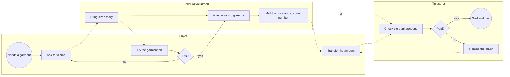
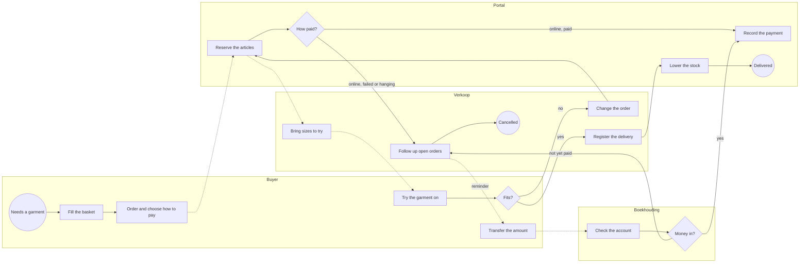
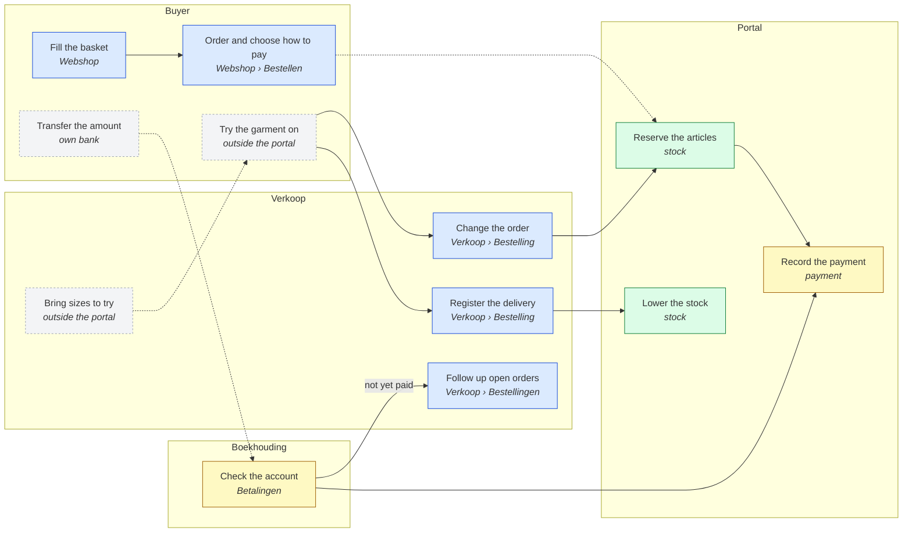
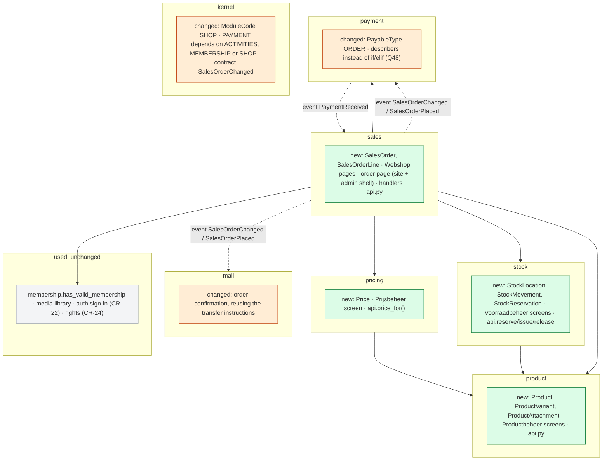
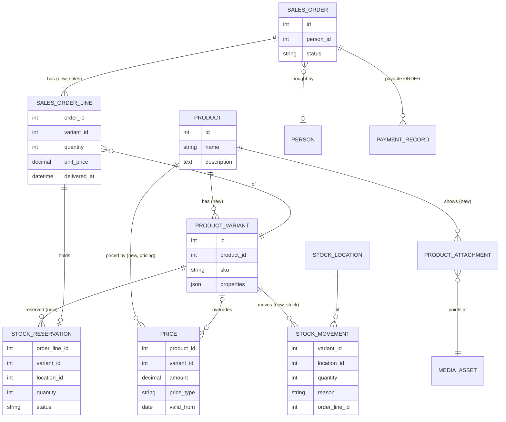

# Change Request 21 — Webshop: products, stock and pricing

**Project:** Web Portal "Raak Millegem"
**Status:** being shaped since 6 October 2026 · Parts A, B and C written · build read, second build read of phase 0 and architecture review taken in (8 October 2026) · phase 0 on v2.16 (#1738, #1748), confirmed by Koen · screen concepts of the public side in two rounds, and Koen's answers on them taken in (9 October 2026: R39–R42, Q68–Q79) · the back office drawn and answered the same day (R43, Q80–Q84) · phases 1–3 start when v2.16 is on PROD (Q66) · nothing is built
**Tracking issue:** #1743 — the one place where what is open stands; this document is the design, the issue is the status
**Applies to:** four new domains (`product`, `pricing`, `stock`, `sales`); in existing code `payment` (the order as a payable, describers), `media` (two kinds), `mail` (the order mail), `kernel` (the module SHOP, contracts), the kit (counter, payment choice, icons), the admin menu; depends on CR-24, CR-13 phase 4c and CR-22; CR-28 carries the workbench tasks
**Reading:** A 4 333 words · B 4 014 (the decisions log excluded) · C 3 181 — measured on 8 October 2026 without drawings and notes; the budget is A ≤ 1 500  B ≤ 2 500: **over budget, accepted by Koen (Q53)** — A6 carries 38 requirements in the business's words with their sources  B2 the traceability of all of them and a walkthrough of 21 steps; cutting them would cut what the build read and Koen's validation need

---

# Part A — The business

## A1. Reason to act — the trigger

On 6 October 2026 Koen put forward the reason, in his words: *"we currently have no module to sell the T-shirts we have."* Raak has T-shirts in stock and no way to sell them through the portal.

The second half of the trigger is the platform: *"I also want a module we can later use in companies — T-shirts for Raak, selling other things, for other companies that will use the platform."* The shop is not a one-off for one batch of T-shirts; it is meant to serve any tenant of the platform, with its own products.

The platform half has no concrete case behind it yet (Koen, 6 October 2026): *"there is no concrete demand or process from companies that sell articles; it comes from the principle."* Raak's garments are the one real case; other tenants are the reason the shape must not be Raak-only.

## A2. As-is process — how it works today, and where it hurts

Raak has three kinds of garment in stock — T-shirts, sweaters and polos — each in several sizes. A sale today runs on conversation and e-mail; the portal plays no part in it.

*What to see: three people and an e-mail carry the sale; nothing records what was sold or what is left on the shelf.*

| # | Step | Who | Tool | Pain — confirmed by Koen, 7 Oct 2026 |
|---|---|---|---|---|
| 1 | Ask for a garment in a size | Buyer | word of mouth, message | the buyer cannot see what is available, in which size, at what price |
| 2 | Bring sizes to try on | Seller | the stock, at home or in storage | depends on one person being available |
| 3 | Hand over the garment | Seller | — | the stock count is in nobody's system; what is left is known by looking |
| 4 | Mail the price and Raak's account number, treasurer in copy | Seller | e-mail | written by hand for every sale; the price is whatever the mail says |
| 5 | Transfer the amount | Buyer | own bank | free-text communication; the transfer has to be matched by eye |
| 6 | Check the bank account, remind if unpaid | Treasurer | bank, an Excel list | the open sales are kept by hand in an Excel list, apart from the bank and the mails |

Not measured: how many garments are sold per year, how many are in stock, and what a garment costs. Deliberately left out (Koen, 7 Oct 2026: "niet zo belangrijk, gaan we nu niet uitkristalliseren"); the case for the shop rests on the principle of A1, not on volume.

## A3. To-be process — how it should work afterwards

> [!NOTE]
> *How the work should go afterwards: the same drawing and table as A2, the*
> *same lanes in the same order, so the difference is what the eye finds.*
> *Still no components: "the portal renders the poster", not "WeasyPrint*
> *renders the poster". A step that disappears, moves lane or turns into a*
> *choice is the change — name it under the drawing in one line each.*
>
> *The words the user will read are decided here, not in Part C: the name*
> *of a button, a page title, a tile label, a menu item — one short list,*
> *"what it says on the screen", in the user's language and never the*
> *domain's pet word.*

*What to see: the portal now holds what the e-mail and the Excel list held — the order, the reservation, the price and the open payment; Boekhouding books transfers as for registrations, and Verkoop follows what is still open in its list of orders. Tasks on the workbench come later (CR-28).*

What changes against A2, one line each:

- **Asking for a size** becomes filling a basket in the Webshop: the buyer sees what exists, in which size, at what price (pain 1).
- **The mail with price and account number** is no longer written by hand: the portal sends the buyer a confirmation mail with the order, the amount and — for a transfer — the account number and the structured communication, exactly as for a registration (pain 4, pain 5; R38).
- **The stock** is in the portal: reserved at the order, lowered at delivery (pain 3).
- **The Excel list** disappears: what is unpaid is in Verkoop's list of orders, filtered on "Te betalen" (pain 6, Q50); tasks on the workbench follow in CR-28.
- **Trying on and exchanging** stay by agreement, outside the portal; a change of size changes the order and the money follows it (R15, R16).
- **Bringing sizes** still depends on a volunteer (pain 2): the portal shows what is reserved, it does not deliver.

| # | Step | Who | Tool | What changed |
|---|---|---|---|---|
| 1 | Fill the basket, order, choose online or transfer | Buyer | Webshop | was: ask by word of mouth |
| 2 | Reserve the articles | Portal | — | new: what is reserved cannot be sold again (R13) |
| 3 | Receive the confirmation mail; pay online, or transfer with the structured communication | Buyer | e-mail, Mollie, own bank | was: a mail written by hand, and a free-text transfer (R38) |
| 4 | Check the account and book the transfer | Boekhouding | Betalingen, bank | was: the Excel list; now "Bevestig betaald" as for a registration |
| 5 | Follow up open orders: remind the buyer outside the portal, or cancel | Verkoop | Verkoop › list of orders, filter "Te betalen" | new: the open orders in one list (Q50); tasks on the workbench in CR-28 |
| 6 | Bring sizes, try on, change the order | Verkoop, Buyer | Verkoop screen | the order and the money follow the change (R15, R16) |
| 7 | Register the delivery, per line | Verkoop | Verkoop screen | new: the stock goes down here (R21) |
| 8 | Book a receipt from the supplier, correct the stock | Voorraadbeheer | Voorraadbeheer screen | new (R36, R37) |

Step 8 has no place in the drawing: it is not part of a sale.

**What it says on the screen** (Koen, 6 October 2026):

| Where | Word |
|---|---|
| The public page | Webshop |
| Role and screen: the product list | Productbeheer |
| Role and screen: prices | Prijsbeheer |
| Role and screen: orders, delivery, fitting, exchanges | Verkoop |
| Role and screen: stock | Voorraadbeheer |
| Delivery status of an order, for the buyer | **Wordt besteld** (nothing delivered, a line Op bestelling still waits for the supplier, Q87) · **Klaar om af te halen** (nothing delivered yet) · **Deels afgeleverd** · **Afgeleverd** — a cancelled order leaves the lists (Q65) |
| Payment status of an order | Te betalen · Betaald · Terugbetaald — the payment domain's words, as on registrations |
| Life cycle of an article, in Productbeheer | **Concept** · **In verkoop** · **Afgevoerd** (Q74) |
| An article ordered before it is in stock | **Op bestelling** — "bestellen tot 31 oktober" when it has an end date (R39) |
| The shop's own settings, under Verkoop | **Webshop-instellingen**: the intro text above the Webshop and the shop's contact persons (R41, R42) |
| Who the buyer contacts about pick-up, bringing or a change | the shop's contact persons by name, e-mail and mobile — never "Verkoop" (Q71) |

## A4. Benefits — what the change earns

> [!NOTE]
> *The business side of the decision: what this change earns, in the*
> *measures the association counts in — hours of volunteer work saved per*
> *activity or per year, mistakes avoided, money collected sooner or not*
> *lost, members who would otherwise drop out, a process that becomes*
> *possible at all. One line per benefit, with the figure where it can be*
> *estimated and the reason where it cannot; a benefit that only the*
> *solution can name does not belong here. Set against the cost of B5, this*
> *is what says whether the change is worth doing, and when.*

No benefit carries a figure: the volumes were deliberately not measured (A2). The case rests on the first line; the rest is what the work stops costing.

| # | Benefit | Pain or reason | Figure |
|---|---|---|---|
| 1 | Raak can sell its garments through the portal at all | A1 | — |
| 2 | The buyer sees what exists, in which size and at what price, and can read the size chart before asking | pain 1 | — |
| 3 | No mail is written by hand for a sale: the price comes from one place, the member price applies by itself | pain 4 | one mail per sale |
| 4 | A transfer carries a structured communication and is matched by it, not by eye | pain 5 | — |
| 5 | What is in stock is known without going to look, and a reserved garment cannot be sold twice | pain 3 | — |
| 6 | The Excel list of open sales disappears: what is unpaid is in Verkoop's list of orders | pain 6 | one list less |
| 7 | Another tenant of the platform can sell its own articles with the same module | A1, R5 | a principle; no tenant asks for it yet |

**Not earned:** bringing sizes to try still depends on one volunteer being available (pain 2); the portal shows what is reserved, it does not deliver.

## A5. Supplied material — and what it taught us

> [!NOTE]
> *What the business handed over to start from — brand guides, examples,*
> *photos, spreadsheets, briefs — with where it lives (described in words or*
> *by file name; never a local path, never in the repository when it holds*
> *personal data or brand assets). What was learnt from it goes here too, as*
> *measurements: "four example posters; none has a bleed". Do not forget the*
> *reporting need: must something be counted, listed, exported or printed*
> *afterwards, for whom, in which form? If so, it is a requirement in A6; if*
> *not, A6 says so in one row.*

| Material | Where it lives | What it taught us |
|---|---|---|
| The size charts that came with the delivery of the garments — one or more per product (Koen, 7 Oct 2026) | with Koen; uploaded per product in Productbeheer, never in the repository | a buyer chooses a size from the supplier's own chart, so a product carries documents next to its pictures, as many as needed (R3) |
| The Excel list of open sales | with the treasurer; holds names and amounts, so it stays outside the repository | the open sales are followed apart from the bank and the mails (pain 6); the workbench task replaces it (R18), nothing is imported from it |
| Pictures of the garments | none supplied yet; taken when the products are entered | one to four per product (R3) |

**Reporting need.** None asked (Koen, 7 Oct 2026, Q46) beyond what the screens show: the orders with their statuses (R34), the stock per location (R7) and the open orders in Verkoop's list (Q50). No export, no printed list, no figure for the board; stock value is Won't (R8). If one is wanted, it becomes a requirement in A6.

## A6. Business requirements — what the board asks, with MoSCoW

> [!NOTE]
> *One table. Each requirement is a sentence a board member would say, with a*
> *MoSCoW class. Numbered, so Part B, Part C and the acceptance criteria can*
> *point at them.*

| # | Requirement | MoSCoW | Source | Comment |
|---|---|---|---|---|
| R1 | The webshop shows clearly what an article is. | Must | Koen, 6 Oct 2026 | description, pictures and documents, R3 |
| R2 | Products are master data: the product portfolio is managed in its own place, apart from any activity. | Must | Koen, 6 Oct 2026 | "very simple at this moment" |
| R3 | A product has a description, one or a few pictures — one, two, three, four — and one or more documents a buyer looking at the article can open, for example the size chart that came with the delivery of the clothing, so the buyer can choose a size from it. | Must | Koen, 6 Oct 2026 | documents added later the same day, first as R20 |
| R4 | Only the role Masterdata may manage the products (product master data); others may not. | Must | Koen, 6–7 Oct 2026 | the role of CR-24 (Q2 there); first written as "a role for product master data" |
| R5 | Any tenant of the platform can use the shop with its own products, not only Raak. | Must | Koen, 6 Oct 2026 (A1) | no company asks for it yet; a principle |
| R6 | One product can have different prices over time; at any moment it is clear what the price of an article is. | Must | Koen, 6 Oct 2026 | "maybe overdone now, but in time price setting will matter" |
| R7 | Stock is kept per location: which articles are in stock, and how many, at which place. | Must | Koen, 6 Oct 2026 | today one location: a volunteer's home serves as the warehouse of Raak Millegem |
| R8 | The value of the stock can be known. | Won't *(now)* | Koen, 6 Oct 2026 | stock valuation is for later; what is built now must not stand in its way |
| R9 | Warehouse management: where inside a location an article lies — which rack, which shelf — and barcodes on articles, with scanning. | Won't | Koen, 6 Oct 2026 | barcodes added as R10 the same day |
| R10 | *Merged into R9.* | — | Koen, 6 Oct 2026 | the number stays empty, so later references do not shift |
| R11 | Everyone can buy, members and non-members; a member pays the member price where the article has one — the same principle as registering for an activity. | Must | Koen, 6 Oct 2026 | |
| R12 | The portal arranges how the buyer gets the article — pick-up, bringing it, trying it on first. | Won't | Koen, 6 Oct 2026 | all three stay possible, by agreement between buyer and seller, outside the portal |
| R13 | An order reserves its articles the moment it is placed: what is reserved cannot be sold again. The stock itself only goes down when the article has left the warehouse — when it is delivered. A reservation is cancelled when the order is cancelled or an article is exchanged for another; the article is then free to sell again. When a payment fails, the order stays "Te betalen" with its reservation: the buyer pays again, or Verkoop removes the order (Q17, Q67). | Must | Koen, 6 Oct 2026 | replaces "stock is taken at the order" of the same day (Q16) |
| R14 | The buyer pays online or by bank transfer, as with a registration for an activity. | Must | Koen, 6 Oct 2026 | |
| R15 | An order can be changed after trying on — a bigger size for a smaller one, a T-shirt instead of a sweater — and the stock follows the change. | Must | Koen, 6 Oct 2026 | same principle as changing a registration |
| R16 | The money follows a changed order as it does for a registration: an extra payment when it was paid and the new amount is higher, an updated amount when it was not paid yet, a refund when it was paid and the new amount is lower. | Must | Koen, 6 Oct 2026 | |
| R17 | *Moved to CR-28* (webshop follow-up on the workbench, split off on 8 October 2026, Q56). A failed or hanging online payment leaves the order "Te betalen" in Verkoop's list. | — | Koen, 6 Oct 2026 | |
| R18 | *Moved to CR-28* (webshop follow-up on the workbench, split off on 8 October 2026, Q56). A transfer is confirmed by Boekhouding on the payments screen, as for registrations. | — | Koen, 6–8 Oct 2026 | |
| R19 | The roles that carry the process: Masterdata (keeps the product list — product master data), Prijsbeheer (sets the price of an article), Verkoop (the webshop: orders, delivery, fitting moments, exchanges), Boekhouding (follows up payments — the existing role `FINANCE`) and Voorraadbeheer (enters stock and changes it by hand). One person may hold several. | Must | Koen, 6–7 Oct 2026 (Q11, Q33) | Productbeheer became part of Masterdata (CR-24); screen names follow CR-24 |
| R20 | *Merged into R3.* | — | Koen, 6 Oct 2026 | the number stays empty, so later references do not shift |
| R21 | Sales registers per order line that it is delivered; picked up or brought makes no difference. That is the moment the stock goes down. | Must | Koen, 6–7 Oct 2026 (Q30) | the goods issue (GI) of an ERP: in one transaction the line is delivered, the stock goes down and the reservation closes; a line is delivered whole — a partial delivery is a change that splits the line (R15) (Q30) |
| R22 | An unpaid order ends in one of three ways: the buyer still pays — for example through a new payment link — and the task closes by itself; the buyer cancels it (R23); or Sales cancels it from the order (Verkoop's list of orders). | Must | Koen, 6 Oct 2026 | |
| R23 | A signed-in buyer (member or account) can cancel his own order in the webshop, on the same page Sales uses in the back office. | Must | Koen, 6 Oct 2026 | first Won't, taken in the same day: "if we use the same screen in public and in the back office, we may get it for free" (Q19); until delivery (Q20); the buyer gets back to his order through a link in the confirmation mail (Q21); a guest cannot — without an account nothing is changed afterwards (CR-22 Q10): he asks Sales |
| R24 | The buyer collects articles in a shopping basket and orders and pays two, three or more articles in one go. | Must | Koen, 6 Oct 2026 | the basket reserves nothing and needs no account; it lives in the buyer's browser (Q22, Q23) |
| R25 | The buyer may cancel until the order is delivered. A return after delivery is out of scope: it is handled by hand — Sales removes the order and books the refund. | Must | Koen, 6–7 Oct 2026 | "retour is out-of-scope, gaan we doen door bestelling te verwijderen en terugbetaling te boeken" — "manueel" (Q40) |
| R26–R30, R32 | *Moved to CR-22* (signing in to buy or register: member, account or guest). | — | Koen, 7 Oct 2026 | the numbers stay empty, so later references do not shift |
| R33 | The buyer signs in as a member or with an account, or orders as a guest, as CR-22 defines for activity registrations and the webshop alike. | Must | Koen, 7 Oct 2026 | CR-22 is built first, on the activities; the webshop uses the same mechanism |
| R34 | An order shows its statuses side by side, each from its own source: its payment status from payments, its delivery status from its lines (reserved, partly delivered, delivered, cancelled). Later, for companies, an invoicing status from invoices joins them, in parallel with payments. | Must | Koen, 7 Oct 2026 (Q29) | invoices: not now; the shape must take them |
| R35 | Invoices. | Won't *(now)* | Koen, 7 Oct 2026 (Q31) | later, in the existing payment domain, called finance; the webshop will ask it through its facade to invoice delivered lines and will only know the invoicing status |
| R36 | Voorraadbeheer can correct the stock of an article by hand, up or down, at a location — for example when a returned garment comes back after delivery (R25). | Must | Koen, 7 Oct 2026 (Q41) | a stock movement of its own kind, next to the goods issue of R21 |
| R37 | Voorraadbeheer books a delivery from the supplier as a receipt at a location — a stock movement apart from corrections, so it stays visible what came in and what was corrected. | Must | Koen, 7 Oct 2026 (Q42) | the goods receipt (GR) of an ERP, next to the goods issue of R21; keeps the way open for stock valuation (R8) |
| R38 | The buyer receives a confirmation mail of the order — the articles, the amount and, for a bank transfer, the account number and the structured communication — exactly as for a registration for an activity. | Must | Koen, 7 Oct 2026 (Q44) | today's registration mail carries the transfer instructions (`mail/service.py:402`, `_transfer_instructions_html`, used by `activity_confirmation_message`, measured on master 25c74f60) |
| R31 | An account says whether it is a company or a natural person, and holds an address to deliver to. | Won't *(for now)* | Koen, 6 Oct 2026 | today an order is only ever for a person |
| R39 | Some articles are ordered in advance: buyers order and pay before there is stock, and the association orders from the supplier what was ordered. Such an article is "Op bestelling", with an end date or without; after the end date it sells what is in stock, and what is out is sold out. | Must | Koen, 9 Oct 2026 (Q76) | "we doen soms ook bestellingen op voorhand en bestellen dan pas wat er besteld werd"; the order at the supplier stays outside the portal (purchasing later, Q54) |
| R40 | An article has a life cycle — Concept, In verkoop, Afgevoerd — that can be extended later; only an article in sale with a valid price shows in the Webshop. An article without stock movements and without orders can be deleted, its prices with it. | Must | Koen, 9 Oct 2026 (Q74, Q75) | "ik denk dat we ervoor moeten kunnen zorgen dat een product een levenscyclus heeft: concept --> verkoop --> afgevoerd. En dat kan zelfs nog uitgebreid worden." One state for the whole article, none per size |
| R41 | The buyer sees who to contact about his order — the shop's contact persons with name, e-mail and mobile — on the thank-you page, the order page and in the confirmation mail; not on the public Webshop. | Must | Koen, 9 Oct 2026 (Q71) | as an activity's organisers, without another address or number; no maximum |
| R42 | The text above the Webshop is the tenant's own, set by Verkoop. | Must | Koen, 9 Oct 2026 (Q77) | "waar configureer je dat het 'Kledij en spullen van Raak' zijn?" |
| R43 | Verkoop can enter an order for somebody, as the board adds a registration for somebody: the order hangs on the person of the typed e-mail address, whose member price applies. | Must | Koen, 9 Oct 2026 (Q80) | asked by Claude on the back-office concepts: "Moet Verkoop zelf een bestelling kunnen ingeven voor iemand, zoals het bestuur een inschrijving toevoegt?" — "ja" |

MoSCoW: **Must** (without it the change is worthless), **Should** (important,
but the change ships without it), **Could** (nice, if cheap), **Won't** (asked
and deliberately not done — recorded so it is not asked again).

## A7. Non-functional requirements — security, privacy, house style, tenants

> [!NOTE]
> *The requirements every change request is tested against, each answered*
> *explicitly at business level, "not applicable" included. How they are met*
> *belongs in Part C (C5):*

| Concern | This change |
|---|---|
| **Security** — who may do what; new inputs from outside; secrets | Each back-office screen is reached through its role only — Masterdata, Prijsbeheer, Verkoop, Voorraadbeheer, Boekhouding (R4, R19) — and ADMIN gets none of the shop's rights in part 1 — a board member who must see orders gets Verkoop (CR-24 Q10); viewing for every role comes with CR-25. The new inputs from outside are the basket and the order: the price and the amount are always computed by the portal, never taken from what the buyer's browser sends; the reservation decides whether an article can still be ordered. A buyer sees and cancels only their own orders (R23). Online payment uses the existing Mollie flow, under its existing rule that the status always comes from Mollie. No new secrets. |
| **Privacy** — personal data: what, where, who sees it, what leaves the system | The buyer's data are those of a registration — name, e-mail, mobile — plus what they ordered and paid. Verkoop and Boekhouding see them, and ADMIN; Masterdata, Prijsbeheer and Voorraadbeheer see products, prices and stock, not buyers. What leaves the system is what leaves for a registration: the payment to Mollie and the confirmation mail (R38). The basket lives in the buyer's browser and holds no personal data. Nothing new is kept longer than an order. |
| **House style / UI norm** — `docs/design-system.md`; brand rules | The Webshop is a public page in the site shell, the back-office screens in the admin shell; both follow `docs/design-system.md` and are looked at on a phone (390 px). Screen words are the Dutch words of A3. Pictures and the size chart are shown as the media of the portal are today. |
| **Multi-tenant** — what differs per unit, what is platform-wide | Products, prices, stock, locations, orders and roles are per tenant (R5): a tenant sees only its own (AC17). The shop is a module a tenant switches on, and works for a tenant without members — a company — as well. What is platform-wide: the module itself, the order statuses and the payment words. |

## A8. Acceptance criteria — what the business signs off on HDEV

> [!NOTE]
> *Criteria the business signs off on, each testable by a person on HDEV*
> *without reading code, each pointing at a requirement and at the steps of*
> *the walkthrough (B2) that show it. These are the business's unit tests;*
> *the developer's tests live in Part C.*

The last column names the steps of the walkthrough (B2) that show each criterion.

| # | Criterion | Requirement | Walkthrough steps |
|---|---|---|---|
| AC1 | Someone with the role Masterdata creates a T-shirt with the sizes S, M, L and XL, two pictures and a size chart. The Webshop shows it; the size chart opens. | R1, R2, R3 | W1, W2 |
| AC2 | A user without any of the shop's rights (for example only Boekhouding) cannot open Productbeheer, nor change a product. | R4 | W3 |
| AC3 | Prijsbeheer sets a price from today and a new price from next month. The Webshop shows today's price; a signed-in member sees the member price, everyone else the regular price. | R6, R11 | W4, W5 |
| AC4 | Voorraadbeheer books a receipt of ten T-shirts size M at the warehouse; the stock shows ten. | R7, R37 | W6 |
| AC5 | A buyer puts two articles in the basket, closes the browser, comes back: the basket is still there. They order and pay online (Mollie test mode). The order reads **Betaald** and **Klaar om af te halen**; one M is reserved, the stock still counts ten. | R13, R14, R24, R33, R34 | W7, W8 |
| AC6 | When every M is reserved, a second buyer cannot order an M. | R13 | W9 |
| AC7 | A buyer orders and pays by transfer. They receive a confirmation mail with the articles, the amount, the account number and the structured communication; the order appears in Verkoop's list under \"Te betalen\". | R38, Q50 | W10, W12 |
| AC8 | Boekhouding confirms the transfer on the payments screen, as for a registration: the order reads **Betaald** and leaves "Te betalen". | R14 | W13 |
| AC9 | *Moved to CR-28* (webshop follow-up on the workbench, split off on 8 October 2026, Q56). | — | — |
| AC10 | *Moved to CR-28* (webshop follow-up on the workbench, split off on 8 October 2026, Q56). | — | — |
| AC11 | After trying on, Verkoop changes an M into an L. The reservation moves to the L; the amount follows: an extra payment when the L costs more and the order was paid, a refund due when it costs less, a new amount when it was not paid yet. | R15, R16 | W17 |
| AC12 | Verkoop registers one line of a two-line order as delivered: the order reads **Deels afgeleverd**, the stock of that article goes down by one and its reservation closes. When the second line is delivered, the order reads **Afgeleverd**. | R21, R34 | W18 |
| AC13 | A signed-in buyer cancels their own order before delivery, on the same page Verkoop uses: the order leaves "Mijn aankopen", the articles are free to sell again, and a paid order shows a refund due under Betalingen (Q65). | R13, R23, R25 | W11 |
| AC14 | After delivery, the buyer can no longer cancel. | R25 | W18 |
| AC15 | Verkoop finds an unpaid order in its list under "Te betalen" and cancels it: the articles are free again. | R22, Q50 | W19 |
| AC16 | Voorraadbeheer corrects the stock up by one after a return; the correction is visible apart from the receipt of AC4. | R36, R37 | W20 |
| AC17 | A second tenant on HDEV has its own products in its own Webshop; it does not see Raak's, nor Raak its. | R5 | W21 |
| AC18 | Masterdata creates an article; it stays out of the Webshop while it is Concept. Put in sale with a price, it shows; in sale without a valid price, it does not. Afgevoerd, it leaves the Webshop and an earlier order still shows it. Back to Concept is refused. | R40 | W22 |
| AC19 | An article with only prices is deleted, its prices with it; an article with a receipt or in an order cannot be deleted, only Afgevoerd. | R40 | W23 |
| AC20 | An article "Op bestelling" until a date, with no stock: a buyer orders three and pays; Voorraadbeheer shows "Besteld, niet in voorraad: 3". After the end date only what is in stock can be ordered. | R39 | W24 |
| AC21 | Verkoop sets the intro text and two contact persons in Webshop-instellingen. The Webshop shows the text; the thank-you page, the order page and the confirmation mail show the two persons with e-mail and mobile; the Webshop itself does not. | R41, R42 | W25 |
| AC22 | Verkoop adds an order for a member by typing the member's e-mail address: before saving the page says to whom it will be linked; the order shows the member price and appears under that member's Mijn aankopen. | R43 | W26 |

---

# Part B — The solution, for whoever approves it

> [!NOTE]
> *Part B is read by the people who say "yes, build this": Koen, the*
> *analyst, the architect. It answers four questions — what is the solution,*
> *does it fit our process and our requirements, how does it hang together*
> *across the modules and what does it touch, what does it cost and in which*
> *steps does it arrive — and it ends with what is still theirs to decide.*
> *Reasoning in depth, mechanics and per-module detail go to Part C; Part B*
> *names the decision and the rejected alternative ("Rejected alternative: …"), in five lines at most.*

## B1. Solution outline — the solution and the decisions that shape it

> [!NOTE]
> *The solution in one paragraph; then the decisions that shape it, one*
> *bullet each of at most five lines: the decision, the rejected alternative that
> *lost, why (Europe First named where a tool or service is chosen). The*
> *full reasoning behind each decision is C4, which points back here. Then*
> *the **derived requirements** (F1, F2, …) in one table, traced to A6: the*
> *finer-grained requirements the solution answers — design work by the*
> *analyst, which is why they are not in Part A.*

Four new domains, one per role that keeps them: **`product`** (the catalogue — product, variant, pictures and documents; Masterdata), **`pricing`** (prices over time, regular and member; Prijsbeheer), **`stock`** (locations, movements, reservations; Voorraadbeheer) and **`sales`** (the Webshop pages, the order and its lines, delivery, change and cancel, the order's tasks; Verkoop). They talk only through their facades. `payment` learns a third thing that can be paid, the order; `mail` sends the order confirmation from an event; `kernel` gets a module, SHOP, that a tenant switches on. Nothing in activities or membership changes.

- **D1 — Four domains, one per role.** Rejected alternative: one `shop` domain. Each role's data lives differently — master data, prices in time, a ledger of movements, transactions — and `pricing` is its own domain by decision (Q2); one domain would put the product inside the sale, which R2 forbids.
- **D1a — The domain is `sales`, not `orders` (Q54).** Purchasing, when it comes, is a domain of its own, `purchasing` — hiring a carrier included, as a purchase of a service — beside `sales`, sharing `product`, `pricing`, `stock`, `payment` and the party. Rejected: one `orders` domain with a kind — a branch per kind at every step (reserve or not, money in or out). Moving stock between own locations is out of scope and not decided.
- **D2 — Stock is a ledger of movements; a reservation is apart.** On hand = the sum of movements; available = on hand − open reservations, per variant and location (Q3, Q16). Rejected: one stock number per variant — it forgets why it changed and cannot carry a value later (R8).
- **D3 — The price is fixed on the line when the order is placed.** `pricing` answers "the price of this variant on this day, for a member or not"; `sales` writes it on the line and computes the total inline. Rejected: reading `pricing` at every display — a new price would change orders already placed.
- **D4 — An order is a payable of `payment`, like a registration.** Online and transfer, the structured communication, refunds and the recalculation after a change (`reconcile_charges`, R16) are reused, not rebuilt. The event that announces a change is `SalesOrderChanged`: `OrderChanged` already names a registration's items (C1).
- **D5 — Follow-up of unpaid orders: Verkoop's list now, the workbench later.** Verkoop's list of orders filters on "Te betalen" (Q50); the workflow of two steps on the workbench is CR-28 (Q56).
- **D6 — One order page, in the site shell for the buyer and the admin shell for Verkoop** (R23), as registration is one page since CR-14. The basket lives in the browser and reserves nothing (Q22, Q23).
- **D7 — Pictures and documents live in the media library**, with two new kinds, linked to the product by `product_attachment` (B3a). Rejected: files on the product — the library already stores, thumbnails and deletes.

**Derived requirements**

| F | Requirement | From |
|---|---|---|
| F1 | An order is refused, line by line with the reason, when the available quantity of a variant at the location is short; the check and the reservation happen in one transaction, under a lock on that variant and location. | R13 |
| F2 | A tenant has one default location; an order reserves there. More locations hold stock; moving stock between them is out of scope and not decided (Q54). | R7, R13 |
| F3 | The price of a line, on the order date: for a member with a valid membership (`has_valid_membership(person)`), the MEMBER price of the variant, else of the product; otherwise, or when there is none, the REGULAR price of the variant, else of the product. A price has a start date only; it ends where the next one of the same type starts — a unique key on (tenant, product, variant, type, start date) makes overlap impossible (#1743 C). Amounts through `kernel/money.py`. | R6, R11 |
| F4 | A line keeps variant, quantity, unit (C62) and unit price; the order total is computed while the lines are made, never from the relationship after a flush. | R16, B3a |
| F5 | The delivery status is derived from the lines: none delivered and a line still waiting for the supplier → Wordt besteld (Q87); none delivered → Klaar om af te halen; some → Deels afgeleverd; all → Afgeleverd; a cancelled order is soft-deleted and leaves the lists (Q61, Q65). | R34 |
| F6 | Delivering a line is one transaction: the line is delivered, a movement GOODS_ISSUE takes its quantity, its reservation closes. | R21 |
| F7 | A change replaces lines; reservations follow; `SalesOrderChanged` lets `payment` recalculate. A partial delivery is a change that splits the line first. | R15, R16, Q30 |
| F8 | Cancelling takes the whole order and is possible while no line is delivered: reservations cancel, open tasks close, a paid order gets its refund through the same recalculation. | R22, R23, R25 |
| F9 | Movement reasons are a code list: RECEIPT, GOODS_ISSUE, CORRECTION. | R36, R37 |
| F10 | *Moved to CR-28* (webshop follow-up on the workbench, split off on 8 October 2026, Q56). | — |
| F11 | *Moved to CR-28* (webshop follow-up on the workbench, split off on 8 October 2026, Q56). | — |
| F12 | Placing an order mails the confirmation with its lines, the amount and, for a transfer, the transfer instructions the registration mail already builds. | R38 |
| F13 | The link in the mail signs the buyer in and opens the order (CR-22). | Q21, Q26 |
| F14 | Every new table is tenant-scoped (`TenantMixin`); no screen shows another tenant's rows. | R5 |
| F15 | An article "Op bestelling" may be reserved beyond what is available while its window is open — no end date, or today up to and including the end date; outside it F1 applies. Voorraadbeheer sees per variant what is ordered and not in stock. | R39 |
| F16 | An article's status is a code list with its allowed changes; the Webshop offers an article in sale with a valid price today; deleting needs no movements and no order lines, and takes the prices with it in the same transaction. | R40 |
| F17 | The shop's intro text and contact persons are the tenant's settings in `sales`; the contact persons reach the buyer only — thank-you page, order page, order mail. | R41, R42 |
| F18 | Verkoop's order uses the public order's processing through a channel, as the board's registration does (`registration_form.board_channel`, #1284): the person of the typed address, never the seller; the same stock check and reservation. | R43 |

## B2. Fit with the process and the requirements — for the business

> [!NOTE]
> *Three things. First, the **application usage drawing**: the to-be process*
> *of A3 once more — same lanes, same activities — with, in every activity*
> *box, a second line naming the screen or module that serves it, the box*
> *coloured per module (`classDef`, one legend line). Every step has a home*
> *or is marked "outside the portal"; a module no step uses is not part of*
> *this change. Two audiences (those who set up, those who use) means two*
> *drawings. Second, the **traceability matrix** — the one place where a*
> *requirement's thread is followed from left to right, so it is kept*
> *nowhere else: one row per requirement of A6 — R · how the solution meets*
> *it, in the words of the role that will see it · the derived requirements*
> *(F, B1) · the module that builds it (C2) · the test that proves it (C6) ·*
> *the acceptance criterion the business checks (A8). An empty cell is a*
> *finding: a requirement without a test, a test without a requirement. A*
> *Won't gets a row that says so. Third, the **walkthrough** — how the*
> *business tests this on HDEV: one numbered script per role of A3, in the*
> *order of the to-be process, happy path first and then the turns where it*
> *must refuse or fall back; each step names what to do and what to see —*
> *nothing else, it is a script. A8's last column names the steps that show*
> *each criterion; every criterion has at least one step. The closing*
> *comment of each issue points at the walkthrough instead of rewriting it.*

**Application usage drawing** — the to-be process of A3, each step with the screen or module that serves it.

*Legend: blue `sales` · green `stock` · yellow `payment` · grey outside the portal (the purple `workflow` class stays unused until CR-28). The setting-up roles have their own screens, not drawn: Masterdata › Productbeheer (`product`), Prijsbeheer (`pricing`), Voorraadbeheer (`stock`).*

**Traceability matrix**

| R | How the solution meets it | F | Module | Test | AC |
|---|---|---|---|---|---|
| R1, R3 | The product page shows description, pictures and documents, as many as the product has | — | product, sales | T1 | AC1 |
| R2 | Productbeheer is its own screen, no activity involved | — | product | T1 | AC1 |
| R4 | Productbeheer needs `product.masterdata` (CR-24) | — | product | T2 | AC2 |
| R5 | Every table tenant-scoped; the module SHOP per tenant | F14 | all, kernel | T3 | AC17 |
| R6 | A price has a validity period; the one valid today is shown | F3 | pricing | T4 | AC3 |
| R7 | Stock per variant and location, as a ledger | F2 | stock | T5 | AC4 |
| R8, R9, R12, R31, R35 | Won't — nothing built; the ledger and the line keep the way open | — | — | — | — |
| R11 | Member price for a valid membership | F3 | pricing, sales | T4 | AC3 |
| R13 | Reserve at "Bestellen"; refuse when short | F1 | stock, sales | T6 | AC5, AC6 |
| R14 | Online or transfer through `payment` | — | payment, sales | T7 | AC5, AC7 |
| R15, R16 | Change replaces lines; payment recalculates | F7 | sales, payment | T8 | AC11 |
| R26–R30, R32 | Moved to CR-22 (signing in) | — | — | — | — |
| R17, R18 | Moved to CR-28 (Q56) | — | — | — | — |
| R19 | The roles of CR-24 gate the four screens; Boekhouding is FINANCE | — | all | T2 | AC2 |
| R21 | Delivery per line lowers the stock | F6 | sales, stock | T11 | AC12 |
| R22 | Verkoop cancels from its list of orders | F8 | sales | T12 | AC15 |
| R23, R25 | The buyer cancels on the same page while nothing is delivered | F8 | sales | T12 | AC13, AC14 |
| R24 | Basket in the browser | — | sales | T13 | AC5 |
| R33 | Sign-in of CR-22 | F13 | auth, sales | T14 | AC5 |
| R34 | Payment status from `payment`, delivery status from the lines | F5 | sales | T11 | AC5, AC12 |
| R36, R37 | Receipt and correction as movements with their reason | F9 | stock | T5 | AC4, AC16 |
| R39 | "Op bestelling" on the product lets `sales` reserve beyond what is available until the end date; `stock` counts what is ordered and not in stock | F15 | product, sales, stock | T20 | AC20 |
| R40 | A status from a code list with its allowed changes; the Webshop lists articles in sale with a valid price; delete only without movements and orders, the prices following through an event | F16 | product, pricing, sales | T18, T19 | AC18, AC19 |
| R41, R42 | Webshop-instellingen in `sales`: the intro text and the contact persons, shown to the buyer only | F17 | sales, mail | T21 | AC21 |
| R43 | "Bestelling toevoegen" in Verkoop: the order page in the admin shell, the person of the typed address | F18 | sales | T22 | AC22 |
| R38 | Confirmation mail with transfer instructions | F12 | mail, sales | T15 | AC7 |

**Walkthrough on HDEV** — per role, in the order of the process.

*Masterdata* — W1 Beheer › Productbeheer › Nieuw: "T-shirt Raak", a description, sizes S, M, L, XL. W2 Add two pictures and two size charts; see them on the product. W3 Sign in as a user with only Boekhouding: Productbeheer is not in the menu, and its address refuses.

*Prijsbeheer* — W4 Prijsbeheer › T-shirt Raak: price €15, member price €12, from today; €17 from next month. W5 Open the Webshop signed out: €15. Signed in as a member: €12.

*Voorraadbeheer* — W6 Voorraadbeheer › Ontvangst: ten M at the default location; the stock reads 10, available 10.

*Buyer* — W7 Webshop: an M and an L in the basket; close the browser, return: the basket is there. W8 Bestellen, pay online (Mollie test): the order reads Betaald and Klaar om af te halen; available M 9, stock 10. W9 With all M reserved, order an M: refused, with the reason. W10 Order and pay by transfer: the mail holds the articles, the amount, the account number and the structured communication. W11 Before delivery, cancel the order from "Mijn aankopen" with "Bestelling annuleren": it leaves the list, the articles are available again.

*Boekhouding* — W12 Betalingen: the order of W10 stands as an open transfer, with its structured communication. W13 Confirm the transfer: the order reads Betaald. W14 *moved to CR-28*.

*Verkoop* — W15 Verkoop › Bestellingen, filter "Te betalen": the open orders, the order of W10 no longer among them after W13. W16 *moved to CR-28*. W17 Change an M into an L on a paid order where the L costs more: an extra payment is due. W18 Deliver one line of a two-line order: Deels afgeleverd, stock down by one; deliver the second: Afgeleverd; the buyer can no longer cancel. W19 Cancel an unpaid order from the list: the articles are free. W20 Voorraadbeheer › Correctie +1 after a return: shown apart from the receipt.

*Second tenant* — W21 Sign in at the second tenant on HDEV: its Webshop and screens show none of Raak's products.

*Added on 9 October 2026* — W22 Masterdata › Productbeheer › Nieuw: the article is Concept and not in the Webshop; set it In verkoop without a price: still not shown; give it a price: shown; Afgevoerd: gone, and the order of W8 still shows it; try back to Concept: refused. W23 Delete an article with only a price: gone, with its price; delete the T-shirt of W6: refused, Afgevoerd is offered. W24 Make a sweater "Op bestelling" until next week with no stock; order three as a buyer and pay; Voorraadbeheer shows "Besteld, niet in voorraad: 3"; set the end date in the past: the sweater can be ordered no further than its stock. W25 Verkoop › Webshop-instellingen: an intro text and two contact persons; the Webshop shows the text, not the persons; the thank-you page, the order page and the mail show both persons. W26 Verkoop › Bestelling toevoegen: type a member's e-mail address; the page names the member; add a T-shirt: the member price; save: the order is in Verkoop's list and in the member's Mijn aankopen.

## B3. The whole across the modules — for the architect

> [!NOTE]
> *The **application structure drawing**: one subgraph per module touched,*
> *inside it a box per layer (screen · view-model · service · entity ·*
> *facade · migration · template) — a separate box for what is **new** and*
> *for what is **changed** in that layer, and one grey box for what is only*
> *used. Here the colour is the kind of change, not the module: green new,*
> *orange changed, grey unchanged. One legend line. Arrows between modules*
> *only through a facade (`api.py`), as the import gate enforces; external*
> *systems and data stores as their own boxes. Then the **data model at a*
> *glance**: a Mermaid `erDiagram` of the entities involved with their key*
> *columns and relationships, cardinality on the edges, soft references*
> *across schemas drawn as relationships too, and what is new or changed*
> *marked in the label. Under it, in at most two hundred words: who calls*
> *whom and through which facade, the direction of every new dependency,*
> *the transaction boundary, and the **impact on the existing*
> *architecture** — which existing modules, tables, screens and contracts*
> *are touched, and how the layer rules (`docs/code-style.md`, the import*
> *gate) hold. This is where a reviewer checks that the change does not*
> *bend the architecture; the per-module detail is C2.*

**Application structure drawing**

*Legend: green new · orange changed · grey used unchanged. Solid arrows are facade calls (`api.py`), dotted arrows events.*

**Data model at a glance**

`sales` calls `product`, `pricing`, `stock` and `payment` through their facades and depends on nothing else new; `pricing` and `stock` read `product`; nothing calls `sales` except through events. `payment` does not import `sales`: it learns an order's name, link, filter label and export kind from a describer that `sales` registers (Q48, decided). Placing an order is one transaction — lines, prices, reservations, the payment record — and the mail leaves after the outer commit (`SalesOrderPlaced`). Delivering a line and cancelling an order are each one transaction. The impact on what exists: `payment`'s readers of the payable type, the workbench's task row, the module list and its CHECK, the payable delete gate and the reporting view `f_payments`. The import gate and the layer gate hold: screens read view-models, domains meet in `api.py`.

## B3a. Standards the model follows — and where it deviates, on purpose

*Seeded on 7 October 2026, before B3 is written: the names here are the ones B3 and Part C will use.*

Standards checked: UBL 2.1 (`Catalogue`, `Order`, `DespatchAdvice`, `InventoryReport`) and EN 16931 / PEPPOL BIS Billing 3.0 for the later invoice; UN/CEFACT code lists UNCL 5387 (price type) and UN/ECE Rec. 20 (unit of measure); ISO 4217 for currency; GS1 GTIN and GLN for article and location identifiers; ISO 20022 and the Belgian structured communication for payment references; schema.org `Product` / `Offer` for the public page. For a reservation no standard applies: it is an ERP concept (a sales order's committed quantity), modelled after common practice.

| Concept in this change | Standard and element | Ours (table · column, name) | Follows / deviates — why |
|---|---|---|---|
| Product | UBL `cac:Item` (`cbc:Name`, `cbc:Description`); schema.org `Product` | `product` · `name`, `description` | follows |
| Variant (size) | UBL `cac:Item/cac:AdditionalItemProperty` (`cbc:Name` "Maat", `cbc:Value` "M"); schema.org `ProductGroup` + `variesBy` | `product_variant` · `product_id`, `properties` (a JSON list of name and value) | follows: a property is repeatable, so a second axis (colour) is one more entry in the list, not a column |
| Article identification | UBL `cac:SellersItemIdentification`; GS1 GTIN in `cac:StandardItemIdentification` | `product_variant` · `sku`; GTIN: not now | follows for the seller's code; GTIN left out "not now" — a separate identification row can take it, never a second column |
| Pictures and documents | UBL `cac:AdditionalDocumentReference` (`cbc:DocumentTypeCode`, `cac:Attachment`); schema.org `image` | `product_attachment` · `product_id`, `media_asset_id` (its kind is the asset's), `sort_order`, `title` | follows: repeatable, typed, pointing at the media library (CR-15) |
| Price | UBL `cac:Price` (`cbc:PriceAmount` with `currencyID`, `cbc:BaseQuantity`, `cac:ValidityPeriod`) | `pricing.price` · `product_id`, `variant_id` (null = the product's), `amount`, `currency` (EUR), `valid_from` (the end is the next price's start) | follows: validity as a period, a variant's price overrides the product's (Q4) |
| Member price | UBL `cbc:PriceType` / `cbc:PriceTypeCode` (UNCL 5387) | `pricing.price` · `price_type` code list: `REGULAR`, `MEMBER` | follows: a second price is a row with a type, not a column `member_price` |
| Currency | ISO 4217 | `currency` CHAR(3) | follows |
| Order and its lines | UBL `Order` · `cac:OrderLine/cac:LineItem` (`cbc:Quantity` with `unitCode`, `cac:Price`, `cac:Item`) | `sales_order`, `sales_order_line` · `variant_id`, `quantity`, `unit_code` ("C62"), `unit_price` | follows; the line keeps its price at sale, as EN 16931 needs it on the invoice (BT-146) |
| Buyer | UBL `cac:BuyerCustomerParty` (a `cac:Person`; later a party with a contact person) | `sales_order.person_id` (the person who ordered, CR-22 account or member) or the guest's name, e-mail, mobile on the order | follows for a person; deviates for a guest: contact fields on the order without a party — "not now", as for registrations; the household is no buyer but a point of view (Q34) |
| Reservation | — (ERP: committed quantity of a sales order) | `stock_reservation` · `order_line_id`, `variant_id`, `location_id`, `quantity`, `status` (open, delivered, cancelled) | no standard; kept apart from movements (Q16) |
| Delivery | UBL `DespatchAdvice` · `cac:DespatchLine` (`cbc:DeliveredQuantity`) | `sales_order_line.delivered_at` + a stock movement | follows the meaning per line (Q25); no despatch document "not now" |
| Stock movement | UBL `InventoryReport` (a count); GS1 EPCIS (events) | `stock_movement` · `variant_id`, `location_id`, `quantity` (signed), `reason`, `occurred_at`, `order_line_id` | follows EPCIS's event shape: one row per what happened; a count is a correction row |
| Location | UBL `cac:Location`; GS1 GLN | `stock_location` · `name`; GLN: not now | follows; no bins (R9) |
| Payment reference | Belgian structured communication; ISO 20022 `RmtInf/Strd` | the existing `payment_records.structured_communication` | follows, as payments already do |
| Invoice (later) | EN 16931 / PEPPOL BIS 3.0 | — | not now; the order line carries what an invoice line needs (quantity, unit, unit price, item) |

## B4. Rules this change needs an exception from — decided once, here

> [!NOTE]
> *Every existing rule, gate or fixed decision the design breaks or bends:*
> *the rule by name and place (`CLAUDE.md`, `docs/code-style.md`,*
> *`docs/architecture.md` §…, a gate in `backend/tests/`), what the design*
> *does instead, the mechanism (a named baseline entry, a widened gate, a*
> *replaced fixed UI decision), and whether the exception is temporary (with*
> *what ends it) or the new rule. One table; "none" is an answer, with the*
> *gates that were checked to say so. The approver decides each row at the*
> *handover — once. CR-14 needed an exception from the cross-domain call rule*
> *and nobody had written it down: the gate found it, the master CLI asked*
> *six times, and the third case became a change request of its own.*

| Rule (where) | What the design does instead | Mechanism | Temporary until … / the new rule | Decided |
|---|---|---|---|---|
| The payable delete gate lists the payable domains and models by hand (`tests/test_payable_delete_gate.py:80-84`; its type check greps literals, `:235-246`, and does not see `PayableType.ORDER`) | a third payable, the order | phase 2 adds `sales` and `SalesOrder` to `PAYABLE_DOMEINEN` / `PAYABLE_MODELLEN`; `SalesOrder` and its lines are soft-deleted (`deleted_at`), never `db.delete` (Q61) | the new rule | Koen, at the handover |
| PAYMENT depends on one of ACTIVITIES, MEMBERSHIP (`kernel/modules.py:202`) | a tenant with only the shop needs payments; the shop needs PAYMENT and MEDIA | in the phase that registers the module (phase 1, Q55): PAYMENT's group becomes one of ACTIVITIES, MEMBERSHIP, SHOP; SHOP gets `depends_on=((M.PAYMENT,), (M.MEDIA,))` (Q59) — PAYMENT cannot be switched off while SHOP is on | the new rule | Koen, at the handover |

Checked and not bent: the import gate (facades only), the layer gate, the template-variable gate, the public shell gate, the Dutch-identifier ratchet (all new code English), the money rule "never trust the webhook body", the fixed decision "registration is one page" (followed, not bent).

## B5. Cost — investment and running cost, and what operations must know

> [!NOTE]
> *Three parts, each with a figure or "none". **Investment:** one table,*
> *module × phase, with the effort to build in CLI-days or person-days (S /*
> *M / L until the team has a track record), a total per module and per*
> *phase; then analysis, review, validation on HDEV and the release steps;*
> *then one-off purchases (a licence, a product, a device). **Running*
> *cost:** what it costs per month or per year once live — usage rights and*
> *paid services (per use and per month, measured where a prototype exists),*
> *storage and backups, hosting, and the maintenance it adds (a job to watch,*
> *a certificate to renew, a dependency to keep current). **Operations:***
> *settings, env vars, limits, kill switch, backups — what the person running*
> *the stack must know. Set beside the benefits of A4: the two together are*
> *the input for the release decision.*

**Investment** (S ≈ 1, M ≈ 2–3, L ≈ 4–6 CLI-days)

| Module | Phase 0 (Claude) | Phase 1 | Phase 2 | Phase 3 | Total |
|---|---|---|---|---|---|
| kernel: the contracts `SalesOrderPlaced`, `SalesOrderChanged` | S | — | — | — | S |
| payment: the describer mechanism for the two payables that exist | M | — | — | — | M |
| the kit: counter and payment choice (four templates), menu icons with a render test | S | — | — | — | S |
| tests: the four new schemas in `conftest.py` | S | — | — | — | S |
| product, media kinds, and the module entry with its menu (Q55) | — | M | — | — | M |
| pricing | — | S | — | — | S |
| stock | — | M | S | — | M+S |
| sales, with payable ORDER, its describer, `payment`'s subscriber, the view `f_payments` | — | — | L | M | L+M |
| **Per phase** | **≈ 4** | **≈ 5** | **≈ 9** | **≈ 4** | **≈ 22 CLI-days** |

Besides: the build read before assignment, review per phase, Koen's HDEV validation of the walkthrough, phase 0 through a release to `master`; phases 1–4 on the integration branch `cr21/webshop`, Koen's approval on `opencode1`'s local test version, then one release. No purchases.

**Running cost:** none new. Mollie charges per online payment as it does for registrations; pictures and documents go into the existing media storage and its backup.

**Operations:** no env vars. The module SHOP is switched on per tenant in the tenant editor; the module is off by default for every kind of tenant, also for an association, whose defaults are otherwise every module (Q49). Migrations: phase 0 (module CHECK, media kinds, payable type), phases 1 and 2.

## B6. Phasing — shippable phases, and what changes on the failure paths

> [!NOTE]
> *Shippable phases, each with what it delivers and its dependencies, one*
> *row per phase: issue · migration · env vars · data · failure paths that*
> *change · manual validation. The "Na de merge" block per phase names what*
> *CI cannot see. The column **failure paths that change** exists because a*
> *change that reorganises behaviour — where a rule lives, who commits, what*
> *a handler does — rarely changes what the system does on the happy path,*
> *and almost always changes what it does when something fails: what rolls*
> *back, what is refused, what is left half done. Name those per phase, so*
> *"no functional change" is a claim about the happy path with the failure*
> *paths listed beside it. "None" is an answer. Dependencies on other change*
> *requests are named per phase, so the approver can order them.*

| Phase | Delivers | Migration | Env vars | Data | Failure paths that change | Manual validation |
|---|---|---|---|---|---|---|
| 0 — Seams (Claude dev CLI, to `master`) | nothing visible: the describer mechanism in `payment` for the two payables that exist (T16); the contracts `SalesOrderPlaced` and `SalesOrderChanged`; the registration's counter and payment choice in the kit (the activities and membership forms render the same); the menu icons with a render test; the four schemas in the test setup — **not** the module (phase 1), the media kinds (phase 1), payable ORDER with its describer, subscriber and view (phase 2) (#1743, second build read 1, 2, 4) | none | none | none | none: existing payables and forms render the same (T16 and the pinning tests) | the payments screen, the registration page and the membership forms unchanged |
| 1 — Catalogue, prices, stock | Productbeheer, Prijsbeheer, Voorraadbeheer with receipt and correction; nothing public | `product`, `pricing`, `stock` schemas | none | none | a product with prices or movements refuses deletion, naming why | W1–W6, W20 |
| 2 — Ordering and paying | Webshop, basket, order page, online and transfer, confirmation mail, delivery per line; **Verkoop's list of orders, filterable on "Te betalen"**, and cancelling from the order page; Boekhouding confirms transfers on the payments screen, as for registrations | `sales` schema; payable type ORDER (code row); the view `f_payments` learns the order, by a new migration with its full text, keeping "Activiteit" and "Lidgeld" and adding "Bestelling" | none | none | an order short of stock is refused whole, nothing reserved; a payment that fails leaves the order "Te betalen" with its reservation, visible in the list; a mail that fails does not undo the order | W7–W10, W13, W18, W21 (Mollie test mode) |
| 3 — Change and self-cancel | change after trying on with recalculation; the buyer cancels on the same page | none expected | none | none | a change short of stock is refused and the order stays as it was; a cancel after a delivery is refused | W11, W17 |

**Open orders** are followed in Verkoop's list (filter "Te betalen"); the follow-up on the workbench is CR-28 (Q50, Q56).

**Builders and branch:** phase 0 by a Claude dev CLI to `master` (v2.16). Phases 1–3 by `opencode1` on **one branch, `cr21/webshop`, with one pull request against `master` that stays open from the first day, marked not to be merged**; `opencode1` pushes every slice to that branch, each commit is read on that pull request by a Claude dev CLI ("read up to commit <sha>"), and the merge to `master` comes only on Koen's own word after his local test — no pull request or merge per slice (`AGENTS.md`, *A builder outside the Claude series*, master `fa4f3f0a`, 8 October 2026). The webshop stays independent of the coming releases until then (Koen to the master CLI, 8 October 2026). **Keeping the branch current:** `opencode1` merges `master` into `cr21/webshop` after every merge to `master` that touches the gates, the ports, the describers or a file it touches (C2's list), and at least at the start of each slice; the pull request's run against `master` is the signal that it is due (architecture review on #1743, item 3). **Dependencies and start:** phases 1–3 start only when v2.16 is on PROD (Q66) — so CR-24 (rights), CR-13 phase 4c (ports, Q64) and phase 0 are on `master` before `opencode1` begins, and phase 1 is built on the rights directly, without an interim gate; CR-22 (sign-in) is already built (v2.15). **Not** dependent on CR-20: the shop hangs on `tenant_id`, which keeps its ids there, and the buyer is a person, not an organisation.

## B7. Rule and gatekeeper — what this fixes for all future work

> [!NOTE]
> *An architectural change request fixes a way of doing things, not just one*
> *instance of it. Here, for the approver: **the rule** in one sentence a*
> *reviewer can apply, in the form the decision takes from now on, and where*
> *it ends up (`CLAUDE.md`, `docs/code-style.md`, the architecture document,*
> *the design system); **the reach and the baseline** — where it applies and*
> *how many places violate it today, measured on the branch, and to what*
> *this change brings that number; and in one line whether the gate is a*
> *ratchet or hard. The gate itself — what it looks at, its message, the*
> *violation it was proven with — is C7. "No gate" is an answer, with the*
> *reason and what catches it instead, written down as the weaker guarantee*
> *it is.*

**The rule:** `payment` never branches on a payable type to describe it; a domain that becomes payable registers a describer (name, link, filter label, export kind), and every screen, export and audit line asks the describers. It goes into `docs/code-style.md` beside the facade rule.

**Reach and baseline:** a regex over Python cannot see the sites that matter (`payment/ui.py` branches on `rec.activity_id`, `rec.family_id`; templates and the SQL view are not Python — #1743 A13), so **no ratchet**: the guarantee is T16 (the output of the payments screen, its exports and audit lines is the same before and after, on the existing characterisation snapshots plus exports and audit) and a hard test that every `PayableType` member has a registered describer. Decided by Koen on 7 October 2026 (Q48); its gate changed after the build read.

## B8. Open decisions — what the approver still decides

> [!NOTE]
> *The questions that are still open, each with the author's recommendation*
> *and the difference the answer makes; numbered Q-entries, the same numbers*
> *as the Q&A log, so an answer moves the row from here to the log. This is*
> *the last thing the approver reads before saying yes; an empty section*
> *means the change request is ready to assign.*

| # | Question | Recommendation | What the answer changes |
|---|---|---|---|

## B9. Decisions log — dated answers

> [!NOTE]
> *Dated decisions of the business and of the architecture, one row each,*
> *with who decided. A decision taken during the build is added here with*
> *the date and marked "built as"; the text it contradicts gets an as-built*
> *note pointing here (C10).*

| Date | Decision | By |
|---|---|---|
| 6 Oct 2026 | A size is a variant of a product; stock is kept per variant (Q1). | Koen |
| 6 Oct 2026 | The price hangs at the product; a variant may override it. One price is entered, only the exception is set per variant; prices over time (R6) work the same for both (Q4). | Koen |
| 6 Oct 2026 | Price gets its own domain, `pricing`, small from the start: a price per article with the date from which it applies; no discounts or price lists per customer group yet (Q2). | Koen |
| 6 Oct 2026 | Everyone may buy; members pay the member price where there is one, by the same rule as an activity registration (Q5). This refines Q2: `pricing` holds two kinds of price from the start, the regular price and the member price, both with their date; still no other customer groups. | Koen |
| 6 Oct 2026 | Stock is taken at the order, not at the payment; a cancelled order gives it back — "for now" (Q7). | Koen |
| 6 Oct 2026 | Five roles: product master, pricing, sales, stock management — four new — and the existing finance role for following up payments (Q11). | Koen |
| 6 Oct 2026 | ADMIN may view everything of the webshop, only the four roles may change it — the pattern of the financial separation (#83). OPERATOR may do everything, as today (Q12). | Koen |
| 6 Oct 2026 | The task for an unpaid order goes to Sales; Finance confirms a payment as today (Q13). | Koen |
| 6 Oct 2026 | Screen names: Productbeheer, Prijsbeheer, Verkoop, Voorraadbeheer; the public page is the "Webshop" (Q14). | Koen |
| 6 Oct 2026 | Stock is kept as movements — receipt, order, cancellation, exchange, correction, each with date and reason — and the stock of a variant at a location is their sum (Q3). | Koen |
| 6 Oct 2026 | An order reserves stock; the stock goes down only at delivery, registered by Sales without distinguishing pick-up from bringing. A reservation can be cancelled (buyer withdraws, exchange, failed payment). **Replaces** the decision "stock is taken at the order" (Q7) of the same day (Q16). | Koen |
| 6 Oct 2026 | An unpaid order becomes a task for Sales at once, due within 14 days, closing by itself when the payment comes in — for a bank transfer, and also for a failed or hanging online payment, because something has to happen with it (Q15). | Koen |
| 6 Oct 2026 | The reservation of an unpaid order stays until someone acts — nothing expires it by itself, also not after a failed or hanging online payment (Q17). | Koen |
| 6 Oct 2026 | The buyer may cancel his own order in the webshop; the order page is one page, public and in the back office, as the registration is since CR-14. **Replaces** the part of Q18 that left it out (Q19). | Koen |
| 6 Oct 2026 | The buyer may cancel until delivery; after that it is a return through Sales; a paid order is refunded through the recalculation of R16 (Q20). | Koen |
| 6 Oct 2026 | The buyer reaches his order through a link in the confirmation mail, valid until delivery, without an account (Q21). | Koen |
| 6 Oct 2026 | Stock is reserved when the buyer presses "Bestellen", not when an article goes into the basket (Q22). | Koen |
| 6 Oct 2026 | The basket lives in the buyer's browser, without an account (Q23). | Koen |
| 6 Oct 2026 | Cancelling applies to the whole order; taking one line out is a change (R15) (Q24). | Koen |
| 6 Oct 2026 | Sales registers "delivered" per order line, not per order (Q25). | Koen |
| 6 Oct 2026 | The link in the confirmation mail is a sign-in link that brings the buyer to his order: link and account are one way in (Q26). | Koen |
| 6 Oct 2026 | An account with an e-mail address already on a person creates no second person; a sign-in link goes to that address (Q27). | Koen |
| 7 Oct 2026 | Signing in is lifted out into its own change request, CR-22, built first on the activity registrations so registration and webshop share one mechanism: a household member (an e-mail address may be shared inside one household), an account (e-mail address unique outside a household, otherwise "this account already exists"), or a guest (name, e-mail address and mobile on the order, regular price). R26–R30 and R32 move there (Q28). | Koen |
| 7 Oct 2026 | Two statuses side by side, none stored on the order: payment from the payment domain (`payable_type` ORDER), delivery derived from the lines; only a cancellation is stored, with date and who. Invoices for companies come later, in parallel with payments, as a third status from their own domain (Q29). | Koen |
| 7 Oct 2026 | "Afgeleverd" is the goods issue of an ERP (SAP Post Goods Issue): line delivered, stock movement out, reservation closed, in one transaction; no separate delivery document, no picking. A line is delivered whole; to deliver part of it, Sales splits the line by a change (Q30). | Koen |
| 7 Oct 2026 | Invoices, later and out of scope now, belong to the payment domain (called finance): receivables, payments and open items in one place, as `docs/architecture.md` table 5 foresees; sales asks finance to invoice delivered lines; no own invoice domain, no rename (Q31). | Koen |
| 7 Oct 2026 | The buyer reads "Klaar om af te halen" while nothing of the order is delivered; then Deels afgeleverd, Afgeleverd, or Geannuleerd (Q32). | Koen |
| 7 Oct 2026 | **Party model for CR-21:** the buyer is the **person** who orders, exactly as a registration is made by a person (`registrations.person_id`); a guest has no person, only the contact fields on the order. The household is a point of view, not the buyer: the member price comes through the person's household membership, and a household sees the orders of all its persons (as CR-22 R8 for registrations). An organisation as buyer — a person ordering on its behalf — comes later (R31). **Not final:** a person changes company, a household splits (divorce, custody); whether an order then stays with the person, the organisation or the parent who has the children is an open architectural question for later (Q34). | Koen |
| 7 Oct 2026 | Orders follow registrations exactly: no household recorded on the order; the party concept (person, household, organisation; what happens on a divorce or a change of company) is worked out as a whole later, for registrations and orders alike (Q35). | Koen |
| 7 Oct 2026 | Productbeheer is part of the role Masterdata (CR-24, Q2), which holds `product.masterdata`; Penningmeester is called Boekhouding. **Replaces** the five roles of Q11 in part (Q33). | Koen |
| 7 Oct 2026 | The expiry of a transfer payment is a workflow of two steps, Boekhouding and then Verkoop, the task moving to Verkoop only when Boekhouding answers "not yet paid", and Verkoop's task shows how recent the information is (the date of Boekhouding's answer, Q47). **Replaces** in part Q15: the task for a transfer starts with Boekhouding, not Verkoop; a failed or hanging online payment (R17) stays a task for Verkoop (Q36). → built by CR-28 (Q56). | Koen |
| 7 Oct 2026 | Reading bank statements automatically (CODA, ISO 20022 camt.053) is a change request of its own, CR-27, reserved now and left lying for a while; CR-21 relies on Boekhouding booking transfers by hand (Q37). | Koen |
| 7 Oct 2026 | `payment` describes a payable through describers that each payable domain registers (name, link, filter label, export kind), instead of a third branch at each reader; a ratchet counts the remaining branches (B7, Q48). | Koen |
| 7 Oct 2026 | The module SHOP is off by default for every kind of tenant, the association included; it is switched on per tenant (Q49). | Koen |
| 7 Oct 2026 | "How recent the information is" is Boekhouding's answer on the order itself, with its date, shown on Verkoop's task; no tenant-wide "account last checked", no button (Q47). → built by CR-28 (Q56). | Koen |
| 7 Oct 2026 | Every workbench task is the last phase (4); until then Verkoop follows open orders in its list of orders filtered on "Te betalen" and cancels from the order page; Boekhouding confirms transfers on the payments screen (Q50). Koen asked "Zouden we alles met betrekking tot werkbank-taken als een laatste fase in CR21 kunnen zetten?"; to "volstaat tot fase 4 een lijst van bestellingen met filter 'Te betalen' voor Verkoop?" he answered "ja". | Koen |
| 7 Oct 2026 | Phases 1–4 are built by `opencode1` on an integration branch `cr21/webshop`, one pull request per slice, only inside the four new domains and new migrations, refused by a path check otherwise; the branch goes to `master` after Koen's approval on its local test version (`AGENTS.md`, *A builder outside the Claude series*). Asked whether phase 0 goes to a Claude dev CLI and phases 1–4 to `opencode1` with the path check, Koen answered: "wat is fase 0? Voor de rest akkoord." Phase 0, explained to him as the six seams in existing code a Claude dev CLI opens first, answered "akkoord" (Q52). | Koen |
| 8 Oct 2026 | R13 loses "or the payment fails": a failed payment leaves the order "Te betalen" with its reservation; the buyer pays again or Verkoop removes the order (Q67, architecture review #1743 item 1). Koen: "akkoord". | Koen |
| 8 Oct 2026 | Phases 1–3 start only when v2.16 is on PROD; phase 1 is built on CR-24's rights, no interim gate (Q66). Asked whether `opencode1` starts after CR-24 (a) or at once on `require_admin_ui` with a swap later (b, the architecture review's recommendation), Koen: "die begint pas als release 2.16 naar prod gaat, we hebben tijd". | Koen |
| 8 Oct 2026 | How `opencode1` builds the whole change request, as `AGENTS.md` now says (master `fa4f3f0a`, decided by Koen with the master CLI: "Ja, ik wil het zo, en je mag agents.md zo aanpassen."): one branch `cr21/webshop`, one pull request against `master` open from the first day and marked not to be merged, every slice pushed there and read per commit, the merge only on Koen's word after his local test. **Replaces** "one pull request per slice against the integration branch" (Q52) and makes a CI change unnecessary (Q58). Reported by the master CLI, 8 October 2026. | Koen |
| 8 Oct 2026 | `sales` calls `stock` and `payment` through ports, built by CR-13 phase 4c on v2.16 (the port mechanism of `docs/architecture.md` §3.2.1 step 2); phase 2 depends on 4c, no named exception (#1743 A8, Q64). Koen: "akkoord, die gaat toch in v2.16 mee". | Koen |
| 8 Oct 2026 | Cancelling an order: one behaviour, the soft delete of a registration (Q61); the words follow who clicks — the buyer sees "Bestelling annuleren", Verkoop sees "Verwijderen" as for a registration. No status "Geannuleerd": the order leaves the lists as a deleted registration does; the payment and any refund stay visible under Betalingen (Q65). Koen: "akkoord met 1 en 2". A member cancelling his own registration is a separate issue, for v2.16 (Koen: "ja, dat issue mag als apart issue, ook mee te nemen in v2.16"). | Koen |
| 8 Oct 2026 | The module SHOP depends on PAYMENT and MEDIA: it can be switched on only when both are on (#1743 A14, Q59). Koen: "akkoord". | Koen |
| 8 Oct 2026 | A guest who pays online returns to a thank-you page of the shop's own ("Bedankt, je bestelling 1042 is betaald"); otherwise a guest gets only the mail, without a sign-in link, as CR-22 decides (#1743 A11, Q60). Koen: "akkoord". | Koen |
| 8 Oct 2026 | Cancelling an order works as deleting a registration: a soft delete of the order and its lines, the total reconciled to zero in the same transaction (a paid amount becomes a refund due, an unpaid charge disappears), the reservations released; the payment record stays visible. A return after delivery is the same, with the stock corrected by hand (#1743 A7, Q61). Koen, to the proposal "never deleted, cancelling is a status": "dit is anders dan inschrijvingen, daar kan je wel verwijderen, volgens mij is dat een soft delete" — measured: `activities/service.py:2427-2466`, `delete_registration`. | Koen |
| 8 Oct 2026 | Who sees an order: the person and his household, as for registrations (#1743 A19, Q62). Koen: "akkoord". | Koen |
| 8 Oct 2026 | Against abuse of anonymous orders: the same rate limit as the public registration, and a maximum quantity per article per order (#1743 B8, Q63). Koen: "akkoord, idem zoals bij inschrijven". | Koen |
| 8 Oct 2026 | After the build read (#1743): `opencode1` still builds phases 1–3, **without a hard path check** — phase 0 (Claude) opens as much of the existing code as can be opened in advance (the media library's kind lists, the menu icons, the test setup, the order mail, the return page after paying, a CI run on the integration branch through the master CLI); what `opencode1` must still touch outside its folders (registering in `main.py`, the menu, tests in their fixed places) it may touch, and a Claude reviewer reads every pull request, as `AGENTS.md` already prescribes. **Replaces** the path check of Q52 and Q55 (Q58). Koen: "zo dus", to option a. | Koen |
| 8 Oct 2026 | The module's registry entry and its menu line come with the routes they name, in `opencode1`'s pull request: the path check allows exactly `kernel/modules.py` and the admin menu for lines that name the shop, each read by the Claude reviewer (Q55). Koen chose a: "a". | Koen |
| 8 Oct 2026 | The shop is as consistent as possible with registering for an activity — the same quantity counter, total line, payment-method choice and words, the same transfer block, the order page as the registration page (D6); the shared pieces move into the kit in phase 0, so they exist once (Q57). Koen, on the concepts: "Ja, ziet er goed uit! Je streeft naar maximale consistentie met activiteiten wat betreft producten, totaalberekening, knoppen,...?" | Koen |
| 8 Oct 2026 | Everything about workbench tasks — what was phase 4: the two-step run for an unpaid transfer, the due date and red, the task for a failed online payment, cancelling from a task — is split off into CR-28 and is out of scope of CR-21 (Q56). CR-21 keeps Verkoop's list of orders filtered on "Te betalen" and Boekhouding's "Bevestig betaald". Koen: "Splits je dit af naar een aparte CR? Dit gaan we out-of-scope van deze CR zetten." | Koen |
| 8 Oct 2026 | The domain is `sales`; purchasing will be a domain of its own, `purchasing`, hiring transport included; moving stock between own locations is out of scope and not decided now (Q54). Koen: "akkoord, met uitzondering dat verplaatsingen bij stock hoort, dat is nu out-of-scope, dus hoeven we nu niet uit te klaren". | Koen |
| 8 Oct 2026 | Reminding the buyer of an unpaid transfer is out of scope, for later; until then Verkoop reminds outside the portal (Q39). Koen: "inderdaad, geen deel van de scope, is voor later." | Koen |
| 8 Oct 2026 | The document may stay over the word budget: its length is the requirements with their sources, the traceability and the walkthrough (Q53). Koen: "akkoord". | Koen |
| 8 Oct 2026 | Koen wants phase 0 in v2.16, after CR-13's JSON sweep and CR-24: "Ik zou zelfs fase 0 van de webshop ook in deze release willen doen." Phase 0 is not yet read against the code; per `AGENTS.md` it is assigned after its build read. | Koen |
| 7 Oct 2026 | If OpenCode builds the shop for evaluation, it runs on DeepSeek through DeepSeek's own API — a deliberate deviation from Europe First (`AGENTS.md`): what the model is sent is stored in China. Accepted with hard limits: a working copy with only a clone of the repository, no `.env` files, no `raak`, no SSH keys, never an environment (HDEV, UAT, PROD), made-up data only (Q51). Koen, answering "a or b" (a: DeepSeek's API with hard limits; b: DeepSeek's open weights hosted in the EU): "hier gaan we voor" — to option a. | Koen |
| 7 Oct 2026 | A task past its due date only turns red on the workbench; nobody gets a mail about it (Q38). → built by CR-28 (Q56). | Koen |
| 7 Oct 2026 | Cancelling until delivery is a Must; a return after delivery is out of scope and handled by hand: Sales removes the order and books the refund (Q40). | Koen |
| 9 Oct 2026 | Pictures on the product page: one at a time, with the photo pages' arrows (hidden at the first and the last) and a counter "1 / 4"; a tap opens the lightbox; one picture without arrows or counter; none without a picture block (Q68). Koen asked "Kunnen we niet gewoon pijltjes voorzien zoals in de foto-gallerij om verder en terug te gaan?", then "akkoord" on arrows with a counter. | Koen |
| 9 Oct 2026 | The member price is shown to a signed-in member only, and only where it differs from the regular price; "(ledenprijs)" under the total only when a member price was applied (Q70). Koen: "als er geen verschil is tussen prijs en ledenprijs moet het woorden ledenprijs niet getoond woorden, ledenprijs tonen we enkel bij aangelogde leden". | Koen |
| 9 Oct 2026 | The shop has contact persons, kept in `sales`, chosen from Personen, shown with their own e-mail and mobile — no other address or number, as an activity's organisers without the overrides; apart from who holds the right Verkoop; shown only to the buyer (thank-you page, order page, confirmation mail), not on the public Webshop; no maximum (Q71, R41). Koen: "ja", and "ik zou die beperking tot 3 wel niet bouwen, in de praktijk gaan dat er nooit meer dan 3 zijn". | Koen |
| 9 Oct 2026 | No "passen kan" anywhere: the shop is generic (Q72). Koen: "we willen een zo generiek mogelijke webshop, anders moeten we dat ook configureerbaar maken. Een boek of een zak meststof ga je bvb. niet passen." | Koen |
| 9 Oct 2026 | A variant keeps its repeatable properties (B3a), so colour — combined with size — can come later as a second property; now only the size is built and shown (Q73). Koen: "Momenteel enkel 'maat', simpel te bouwen." | Koen |
| 9 Oct 2026 | An article has a life cycle — Concept, In verkoop, Afgevoerd — as a code list, so a state can be added later; allowed: Concept → In verkoop, In verkoop → Afgevoerd, Afgevoerd → In verkoop, Concept → Afgevoerd; never back to Concept. One state for the whole article, none per size (Q74, R40). Koen: "akkoord op 1 en 1 schakelaar voor gans het artikel/product is prima". | Koen |
| 9 Oct 2026 | An article or a size without stock movements and without order lines can be deleted, its prices with it; otherwise only Afgevoerd. **Replaces** "a product or variant with prices or movements is deactivated, never deleted" (C2) (Q75). Koen: "met enkel prijzen zou het volgens mij nog wel weg kunnen". | Koen |
| 9 Oct 2026 | Ordering in advance is a Must (R39): an article "Op bestelling", with an end date or without, can be ordered and paid without stock; after the end date it sells what is in stock (Q76). Koen: "Must", and "akkoord" on selling the stock after the end date. | Koen |
| 9 Oct 2026 | The intro text above the Webshop and the contact persons are set on a screen "Webshop-instellingen" under Verkoop, in `sales` — not through a CMS page or slug (Q77, R42). Koen: "akkoord". | Koen |
| 9 Oct 2026 | The shop's thank-you page shows the five transfer lines itself; once the buyer navigates on they are gone from the screen, the mail keeps them (Q78). The same for the registration's confirmation page is #1875, not on a release. Koen: "ja, en als hij verder navigeert is het weg, mag zo eigenlijk ook bij activiteiten". | Koen |
| 9 Oct 2026 | On the concepts of 9 October: the basket is the order page (Je mandje → Contact → Betalen, one action bar); the basket link stands in the Webshop only, not in the site header; a sold-out size stays visible, crossed out and not choosable, which needs a disabled option in the kit's segmented field; a buyer asks the contact persons for another size and cancels only; the cancel confirmation reads "Bestelling 1042 annuleren? De artikelen komen weer vrij. Je hebt nog niets betaald." — paid: "… Je krijgt € 39,00 terug." (Q79). Koen: "ik ben het eens met je punten 1, 2, 3, 6, 7". | Koen |
| 9 Oct 2026 | Verkoop can enter an order for somebody, as the board adds a registration (Q80, R43). Koen: "ja". | Koen |
| 9 Oct 2026 | Verkoop's list has three segments — Te betalen, Te leveren (Klaar om af te halen and Deels afgeleverd together), Alles — because five do not fit a phone. **Replaces** the filters of Q50 (Q81). Koen: "akkoord". | Koen |
| 9 Oct 2026 | A receipt is prefilled per size with what is ordered and not yet in stock; Voorraadbeheer changes what differs (Q82). Koen: "akkoord". | Koen |
| 9 Oct 2026 | A correction always asks for a reason; "Beschikbaar" never goes below zero, what is short on an article Op bestelling stands under "te bestellen"; Productbeheer shows Concept and In verkoop by default ("Lopend"), Afgevoerd behind its own segment; the field Locatie is not shown while a tenant has one location (Q83). Koen: "akkoord". | Koen |
| 9 Oct 2026 | The size choice on the product page is always a grid of tiles — four per row on a phone, six from 768 px — whether an article has one size or thirteen; a sold-out size stays, crossed out with "uitverkocht" and not choosable (Q84). Koen: "akkoord" on always tiles. | Koen |
| 9 Oct 2026 | Ordering in advance is called "Op bestelling" on every screen; Masterdata switches it on in Productbeheer, not Verkoop (Q85, Q86). Koen: "'Op bestelling' is prima", "laten we maar bij master data houden". | Koen |
| 9 Oct 2026 | A fourth delivery status for the buyer and Verkoop: "Wordt besteld" while nothing is delivered and a line Op bestelling waits for the supplier; when the receipt covers it, "Klaar om af te halen" (Q87, F5). Koen: "ja". | Koen |
| 9 Oct 2026 | The order mail writes every amount with a comma ("€ 12,00"), unlike today's registration mail; that one is fixed apart, #1878 (Q88). Koen: "ja en ja". | Koen |

---

# Part C — The build, for the master CLI and the dev CLIs

> [!NOTE]
> *Part C is read by whoever plans and builds. It is as long as it needs to*
> *be and it carries no decision Part B does not carry: a dev CLI that finds*
> *a decision missing here brings it to the master CLI, who brings it to the*
> *approver and records it in B9 — never a choice made in the code alone.*

## C1. Verified premises — measured before the handover

*Measured on master `f731a836`, 7 October 2026, before Part B is written — the step "who reads a concept this change alters" asked for after CR-22. Re-measured on the handover commit before assignment.*

**Readers of the concepts this change alters**

| Concept | What changes | Readers today (file:line) | Verdict |
|---|---|---|---|
| `PayableType` (`payment/models.py:78`, code list `payment/codes.py:60-73`) | a third value, ORDER | ~40 reader sites in ~22 files, every one an if/elif on two values. **Silently wrong for an order (~14):** `payment/service.py:265` `family_payables` and `:306`; `:951` `matches_filter` (no "Bestellingen" context); `:1385` `enriched_records` (no name, description, link); `payment/exports.py:40-71` (raw "order #id") and `:144` (exported as "Activiteit"); `payment/ui.py:296-321, 1089-1115` (no context link) and `:729-740` (no filter entry); `_betalingen_lijst.html:40,86` ("inschrijving" wording); `audit/changes.py:225-234` (empty subject); `reporting/universe.py:2409-2420` ("two streams"); view `reporting.f_payments` (`alembic/106:226-290`: CASE gives Activiteit/Lidgeld, joins registration/membership only). **Refused (1):** `kernel/modules.py:193` PAYMENT `depends_on (ACTIVITIES, MEMBERSHIP)` — a shop-only tenant cannot switch payments on. **Handled generically:** `create_payment_record`, `group_cards`, `status_router`, workflow refund title, event fields. | every "silently wrong" site must learn ORDER in this change (C2 payment, reporting); the dependency must accept the shop (C2 kernel) |
| `PaymentReceived` / `RefundDue` (`kernel/contracts/payment.py`) | an order must react when it is paid | 2 subscribers: `membership/handlers.py:16-28` (ignores non-membership), `workflow/handlers.py:40-50` (type-agnostic). Nothing subscribes for registrations. | an order needs no subscriber of its own in CR-21 (its status is read from payment, R34); closing a workbench task on "paid" is CR-28's |
| `reconcile_charges` (`payment/service.py:769`) | a third caller (R16) | `payment/handlers.py:24` (`OrderChanged` → registrations), `membership/household_service.py:169`; `reconcile_registration_charges` exported, no non-test caller | reusable as planned |
| `OrderChanged` (`kernel/contracts/activities.py:11`) | name collision | its "order" means a registration's items (`payment/handlers.py:16-21`, `activities/service.py:1821-1838`) | the webshop's event needs another name (e.g. `SalesOrderChanged`); naming in B3a |
| member price: `has_valid_membership` (`membership/service.py:25`), `_unit_price` (`activities/totals.py:35`) | the shop prices by the same rule (Q5) | ~13 readers of the rule, ~9 of the totals (`totals.py:109-190`, `registration_form.py:92-101`, `activities/service.py:1843-1867`, `auth/router.py:157,167`, mail, payment, export, kernel/rules). **Three different "is member":** `membership.has_valid_membership` (dues), `mdm/service.py:274` `is_member` (in a household), `ui/__init__.py:954` and `auth/router.py:135` `is_member = person is not None` (read by `_member_nudge.html`, `_site_account.html`, `cms/home.html`) — the last one is what CR-22 had to split | the shop reads `has_valid_membership` only; the price column `member_price` stays on activity products (Non-goal), the shop's member price lives in `pricing` |
| `Role` (`auth/models.py:11`) | four new roles — superseded: the roles now come from CR-24 | ~30 role literals in 12 files; access sets `auth/session.py:116-120`; `landing_for` `auth/service.py:83`; nav `ui/__init__.py:858-900`; workflow defaults | CR-21 uses the roles of CR-24 and does not add codes of its own; built after CR-24 or with today's `require_admin_ui` as CR-22 did (B4) |
| `ModuleCode` and `mdm.tenant_modules` CHECK (`kernel/modules.py:31-52`, `alembic/187:58-59`) | a module for the shop | 1 enum, 1 CHECK, `DEFAULTS` `modules.py:287-294`, ~12 readers (tenant editor, nav, reporting, cms, auth landing) | a migration widens the CHECK; `DEFAULTS` decides whether VERENIGING and BEDRIJF get the shop |
| routes `/webshop`, products outside activities | new | none exist; the old `webshop_products`, `orders`, `order_items` were dropped by `006_remove_webshop.py`; "Product" already names `ActivityProduct` and a reporting object (`universe.py:2197`) and an audit entity (`audit/changes.py:531`) | the shop's names must not collide: B3a names `product` in its own schema; the reporting object needs a distinct label |

**Tests that guard the old behaviour (likely red, read before building)**
- `tests/test_payable_delete_gate.py:235` `test_de_payable_types_in_de_code_zijn_de_twee_die_de_gate_kent` — asserts the payable types are exactly two; with `PAYABLE_DOMEINEN` (line 80) and three more tests of that file.
- `tests/test_module_gate.py` (4), `mdm/tests/test_tenant_modules.py` (DEFAULTS, the CHECK, routes off → 404).
- `mdm/tests/test_codes_phase2.py` (the exact role set), `tests/test_role_set_gate.py` — if roles are added.
- Member price: `tests/integration/test_membership_pricing.py`, `test_kritische_flows_coverage.py`, `test_registration_form_1284.py`, `test_reporting_facts.py`, `test_db_constraints.py`.
- Payments by type: `tests/integration/test_betalingen_domeinregels.py`, `payment/tests/test_terugbetaling_kaarten.py`, `test_penningmeester_door_het_scherm.py`, `tests/integration/test_werkbank_betaalkaart.py`.

**Visitors and tenants walked (C3 list)** — to be completed with Part B: guest (orders without account: R33 via CR-22), account, member (member price), board user without a person (no shop buying), signed in at another tenant (accounts per tenant: no shop access across tenants), operator; tenant with members (Raak), company (no member price, no "of ben je lid"), platform (no shop).

## C2. Per module: what must happen

> [!NOTE]
> *One subsection per module touched, in build order, each with the same*
> *five headings: **screens** (which, what changes, at which width it is*
> *judged), **code** (view-model · service · entity · facade — the functions*
> *by name, and **the named owner of every writer** to a shared table),*
> ***database** (schema, table, each column with its type, nullability and*
> *constraints, the `ON DELETE` of every FK, the migration and whether it is*
> *additive — and, for every column added to an entity that has a **copy**
> *action, whether the copy takes it along or not, and why: the gate of*
> *#1464 refuses an unclassified column, so the design decides it here and*
> *the gate only confirms it; `target_audience` was added to the activity*
> *and `copy_activity` silently left it out, #1463), **templates and mail**,*
> ***tests** (which of C6). No effort*
> *here: the effort per module and phase is the table of B5. Which*
> *requirements a module serves is read from the matrix of B2, not repeated*
> *here. A module that is only used, not changed, gets one line. **Reporting*
> *is always one of the modules**, touched or not: the engine reads the*
> *tables through SQL views in the `reporting` schema and through its object*
> *universe, so for every column this change adds, renames, retypes,*
> *retires or gives a new meaning, its subsection says which views and*
> *objects read it (measured, not recalled) and in which phase the view*
> *follows. "Reporting — none: no view reads these columns" is a subsection*
> *too.*

Grouped by phase, because each phase has one builder (Q52): phase 0 by a Claude dev CLI on `master`; phases 1–3 by `opencode1` on `cr21/webshop`, inside `backend/app/domains/{product,pricing,stock,sales}/` and new migrations only (C7). Each slice reads only this section, B3a for names, C4 for the mechanics and C6 for its tests.

### Phase 0 — the seams (Claude dev CLI, to `master`)

Phase 0 changes nothing a user or a saved report sees. What would be visible, or would leave a gate red on `master` until the webshop is merged, comes with the phase that uses it: the module in phase 1 (#1743 A1), the media kinds in phase 1 with the product (a kind in `VALID_KINDS` shows in the media library at once, second build read 4), payable ORDER with its describer, `payment`'s subscriber and the view in phase 2 with `sales` (T17 would be red otherwise, second build read 1). Measured on `11b93f9c`.

| Module | What must happen | Reads |
|---|---|---|
| **kernel** | the contract file `kernel/contracts/sales.py`: `SalesOrderPlaced(order_id, payment_record_id)` and `SalesOrderChanged(order_id, total_due, actor)` — no gate asks a contract for a publisher or a subscriber, so they stand alone until phase 2; a cancel is a change to total 0 (Q61). | `kernel/contracts/activities.py:11` |
| **payment** | the **describer mechanism** (Q48) in batch form — `register_describer(type, describer)`, `describe(db, ids) -> {id: PayableDescription}` with the name, the two links with `?terug=`, the place in the filter tree, the export triple, the household and the person — for the two payables that exist, registered by activities and membership from `app/main.py`; the ≈ 14 sites ask it (`service.py:265-306, 951-959, 1385-1500`, `ui.py:296-321, 729-740, 1089-1115`, `exports.py:30-71`, `audit/changes.py:225-234`, `_betalingen_lijst.html:40, 86`). T16 on the screen's export, not the JSON export route that CR-13 4b prunes (second build read 8). | C1 rows `PayableType` |
| **ui — the kit** | the counter `quantity` (`activities/templates/_product_row.html:19-24`) into the kit, with `tests/test_one_product_row_gate.py:48-57` rewritten; the payment-method choice as one kit call in all four forms that have it — `activities/templates/_inschrijf_velden.html`, `_inschrijf_formulier.html`, `membership/templates/lid_worden.html`, `lidmaatschap_vernieuwen.html`; the total line's markup from one kit macro for its three partials and routes (`_inschrijf_totaal.html` via `activities/ui.py:236-250` and `admin_ui.py:1552`, `_inschrijving_totaal.html` via `admin_ui.py:1136`) (Q57; second build read 5). Pinned: `tests/integration/test_registration_screens_characterisation.py`, `activities/tests/test_registration_page.py`, the membership forms' tests, the e2e tests of the counter and the row, the baselines `public-inschrijven` and `leden-verlengen` (`tests_e2e/measures.py:425, 515`). | the files named |
| **ui — icons** | menu icons for Productbeheer, Prijsbeheer, Voorraadbeheer, Verkoop, "Mijn aankopen" and the basket (`_macros.html:112`), with one render test of the new names — the admin frame gate looks only at icons of existing menu items (second build read 7). | `_macros.html:112-135` |
| **tests** | `tests/conftest.py:62-79` lists the schemas `product`, `pricing`, `stock`, `sales`. | |
| **CI** | nothing to change: the one pull request from `cr21/webshop` against `master` runs the suite at every push; to be re-read on the workflow as CR-29 leaves it (second build read 9). | `.github/workflows/backend-tests.yml:3-7` |
| **not in phase 0** | **the transfer instructions "from one source"** — dropped: the mail block (`mail/service.py:402-429`: "Rekeningnummer", "Gestructureerde mededeling", "Te betalen vóór" with a date) and the screen's `_transfer_due.html` ("IBAN", "Mededeling (OGM)", no date) differ in wording and in the date, and making them one would change every registration and membership mail or the screens of CR-22 — a copy decision of its own, not the webshop's (second build read 3). The order mail uses the mail block as the registration mail does. | |

**Existing files `opencode1` touches in phases 1–3** (allowed, read by the Claude reviewer, Q58; #1743 B1): `app/main.py` (routers under `_module(M.SHOP)`, handler imports; router files named `ui`, `admin_ui`, `account_ui`, `handlers` or `router`), `kernel/modules.py` and `app/ui/__init__.py` (`_ADMIN_NAV_LAYOUT`, `_ADMIN_NAV_ICONS`), `tests/integration/` and `tests/` for tests that import several domains (`tests/test_tests_placement_gate.py:94-102`), `tests_e2e/` (T13, the 390 px screens), the module gate's and payable gate's lists, `app/limiter.py` (Q63), `mail/handlers.py` (the order mail) and `mail.email_type_codes` (the type `order_confirmation`), `media/service.py`, `media/admin_ui.py`, `media/images.py` and the media code list (the two kinds, phase 1: the five lists, the library's branch maps, `LOSSLESS_KINDS`, `add_document`, and the where-used hook with the two existing consumers moved onto it — second build read 4), `payment/models.py`, `payment/codes.py`, `payment/handlers.py` and a migration for the view (phase 2: ORDER, its describer registered by `sales`, the subscriber calling `reconcile_charges(ORDER, id, total_due, audit_actor=…, source="sales-order-edit")` — second build read 1, 6), `pyproject.toml` (mypy per domain).

### Phase 1 — catalogue, prices, stock (`opencode1`)

| Domain | What must happen |
|---|---|
| **product** | the package shape of a new domain (`api.py`, `codes.py`, `CONTRACT.md`, `models.py`, `tests/` with its `conftest.py` — `tests/test_rules_gate.py:139-162`), as for `pricing`, `stock` and `sales`; template names prefixed per domain, since templates share one namespace (#1743 B7); schema `product`; `Product(id, tenant, name, description, status, pre_order, pre_order_until)`, `ProductVariant(id, product_id FK ON DELETE RESTRICT, sku UNIQUE per tenant, properties JSON [{name, value}] — repeatable as UBL's property, one column (B3a follows), sort_order)`, `ProductAttachment(id, product_id FK CASCADE, media_asset_id — a soft reference across schemas, its kind read from the asset, title, sort_order)` — B3a's names. Screens `/admin/producten` (list, new, edit; variants inline; attachments through the media library's picker) behind `product.masterdata`. `api.py`: `get_product`, `list_products(active_only)`, `get_variant`, `variants_of`. `Product` also carries `status` — a code list `product.product_status_codes` (CONCEPT, ON_SALE, DISCONTINUED) with a foreign key, as CR-12's code lists, and its allowed changes in the aggregate's `check()` (Q74) — and `pre_order` (bool) with `pre_order_until` (date, nullable) (R39). A product or variant without stock movements and without order lines can be deleted (Q75): `product` publishes `ProductDeleted(product_id, variant_ids)` inside the transaction (`kernel/contracts/product.py`, a new contract) and `pricing` deletes its prices in its handler, so a refusal there rolls the delete back; one with movements or order lines is only set DISCONTINUED. `api.py` also gives `is_on_sale(product_id)` and the pre-order window. |
| **pricing** | schema `pricing`; `Price(id, tenant, product_id, variant_id nullable, price_type ∈ {REGULAR, MEMBER}, amount Numeric(10,2) CHECK ≥ 0, currency CHAR(3) default 'EUR', valid_from date)`, unique on (tenant, product_id, variant_id, price_type, valid_from) — the end of a price is the start of the next (C4.2). Screen `/admin/prijzen` behind `price.manage`. `api.price_for(variant_id, on: date, member: bool) -> Decimal | None` (F3). |
| **stock** | schema `stock`; `StockLocation(id, tenant, name, is_default — one per tenant)`, `StockMovement(id, tenant, variant_id, location_id, quantity int signed and not zero, reason ∈ {RECEIPT, GOODS_ISSUE, CORRECTION}, occurred_at, order_line_id nullable, note, actor)`, `StockReservation(id, tenant, order_line_id, variant_id, location_id, quantity > 0, status ∈ {OPEN, DELIVERED, CANCELLED} — a code list)`. Screens `/admin/voorraad` (levels per variant and location — on hand, reserved, available, and for an article "Op bestelling" **Besteld, niet in voorraad** = open reservations less on hand, never below zero (R39) — receipt — prefilled per size with what is ordered and not in stock (Q82) — and correction, whose `note` is required (Q83); "Beschikbaar" is shown never below zero; the field Locatie is hidden while the tenant has one location (Q83)) behind `stock.manage`. `api.py`: `on_hand`, `available`, `receive`, `correct`; `reserve`, `release`, `issue` come in phase 2 (C4.1). A tenant gets one default location on the first write (a receipt), never on a read. |

### Phase 2 — ordering and paying (`opencode1`)

| Domain | What must happen |
|---|---|
| **sales** | schema `sales`; `SalesOrder(id, tenant, person_id nullable, guest_name, guest_email, guest_mobile, placed_at, payment_method, deleted_at)` — soft delete as a registration (Q61), `SalesOrderLine(id, order_id FK, variant_id, quantity > 0, unit_code 'C62', unit_price Numeric(10,2), delivered_at nullable, deleted_at)`. Public: `/webshop` (products of the tenant, price per F3; only products ON_SALE with a valid price today for at least one variant; a variant without a valid price is not offered; there is no "Niet beschikbaar" (R40)), `/webshop/{product}`; the basket in `localStorage`, posted whole at "Bestellen" (`/webshop/bestellen`), where the server recomputes every price (C5). Placing (C4.1): one transaction — lines with prices, `stock.api.reserve` per line, `payment` through its port (CR-13 4c, Q64) — `create_payment_record(ORDER, order.id, total, method, redirect_url=<the shop's thank-you page>, description="Bestelling <nr>")`; `SalesOrderPlaced` published **inside** the transaction, before the commit — `mail` queues its job in that same transaction, so a rolled-back order queues nothing (#1743 A9). When the provider refuses or times out, the whole order rolls back, as a registration does (502). A guest who paid online returns to the shop's own thank-you page (Q60). The order page `/mijn/aankopen/{id}` in the site shell and `/admin/verkoop/{id}` in the admin shell, one template (D6). Verkoop: `/admin/verkoop` — the list of orders with the segments "Te betalen", "Te leveren" (nothing or part delivered) and "Alles" — three, so they fit a phone (Q81, replacing the three filters of Q50) — the payment and delivery badges in one cell; "Bestelling toevoegen" (R43, F18): the order page in the admin shell, Contact → Artikelen → Betalen, the person of the typed address named before saving ("Deze bestelling wordt gekoppeld aan …"), after saving the order in the back office; deliver a line (F6, `stock.api.issue`); cancel the order (F8). Registers its describer with `payment` and its reporting join. Handler: none for `PaymentReceived` (the status is read from payment, R34). Rate limit and a maximum quantity per article per order, as the public registration (Q63). **Webshop-instellingen** (R41, R42): `ShopSettings(tenant, intro)` and `ShopContact(id, tenant, person_id — a soft reference to `mdm.persons`, sort_order)`, no maximum and no override of e-mail or mobile (Q71); the screen `/admin/verkoop/instellingen` behind `sales.manage`; the contact persons are rendered on the thank-you page, the order page and in the order mail, never on `/webshop`. The thank-you page after a transfer shows the five lines of `payment.api.transfer_due` (Q78). **Ordering in advance** (R39): for a product `pre_order` whose window is open (no end date, or today up to and including `pre_order_until`), `stock.api.reserve(…, allow_short=True)` reserves beyond what is available; outside the window the ordinary check applies. |
| **stock** | `reserve(order_line_id, variant_id, quantity)`, `release(order_line_id)`, `issue(order_line_id)` as C4.1; `waiting(order_line_ids)` — the lines whose reservation the stock on hand does not cover yet, the oldest reservations covered first — which `sales` reads for "Wordt besteld" (F5, Q87). |

### Phase 3 — change and self-cancel (`opencode1`)

| Domain | What must happen |
|---|---|
| **sales** | change an order (F7): the old lines soft-deleted and new ones written in one transaction, reservations follow, `SalesOrderChanged(order_id, total_due, actor)` published; `payment`'s subscriber (phase 0) reconciles. The buyer's cancel on `/mijn/aankopen/{id}` while no line is delivered (F8), the same action as Verkoop's. |

## C3. Cross-cutting impact — the checklist of what gets forgotten

> [!NOTE]
> *One table, every row answered, "no" included, one sentence each:*
> *reporting views and saved reports (C2) · existing tests, e2e golden flows*
> *and 390 px screenshots (C6) · fixed UI decisions and `CLAUDE.md` ·*
> *design-system documentation · code lists · events, ports and handlers —*
> *and **which gate sees every new call across domains, and what it will*
> *say** · mail templates · migration: additive or contract (#1255) · tenant*
> *settings · env vars · JSON routes and API callers · external services*
> *(Mollie, mail) · **copy actions**: does this change add a field to an*
> *entity that has a copy action, and is the field copied or not, and why*
> *(C2). A "yes" points at the section that handles it. The next*
> *thing that gets missed becomes the next row.*

| Concern | This change |
|---|---|
| **Visitors and tenants** | anonymous: sees the Webshop, orders as a guest (R33, CR-22); account and member: order, see "Mijn aankopen"; member price only with a valid membership (F3). Board user without a person: back-office roles only, no buying. Signed in at another tenant: nothing of this tenant (F14). Operator: every right (CR-24). Tenant with members: member price; company: no member price, no "of ben je lid"; platform: SHOP off. A tenant with SHOP off: every route 404 (T3). |
| **Order inside a transaction** | `SalesOrderPlaced` is published inside the transaction; `mail` enqueues its job there, so it exists only if the order commits (#1743 A9). A mail that fails later is retried by the job, it does not undo the order. |
| **Reporting** | `f_payments` learns `order` (phase 0 label, phase 2 join); no new reporting objects (Q46). |
| **Existing tests** | the payable delete gate (B4), the module gates, the payments-screen tests that list two payable types (C1). |
| **390 px** | the Webshop, the product page, the basket, the order page, Verkoop's list. |
| **Code lists** | module SHOP; payable ORDER; media kinds; subject SALES_ORDER; price type, movement reason, reservation status (each a `CodeEnum` with a code list, `docs/code-style.md`). |
| **JSON routes** | none new. |
| **External services** | Mollie, through `payment` as for registrations; nothing new. |
| **Copy actions** | none: no copied entity gains a field. |
| **Env vars** | none. |

## C4. Detailed decisions — one subsection each, with the reasons

> [!NOTE]
> *The design decisions of B1 in full, one subsection each, with their*
> *reasons, the alternatives weighed and the measurements that decided*
> *them. B1 names the decision; this is where a builder reads why.*

### C4.1 Reserving without selling twice (F1, R13)

**Every writer of the ledger** — `reserve`, `release`, `issue`, `receive`, `correct` — takes the same transaction-scoped advisory lock per (tenant, variant, location) (the architecture review on #1743, item 2): "available ≥ 0" has no home at rest, so the lock is its one home. `stock.api.reserve` — `pg_advisory_xact_lock` on a stable hash, new to the codebase (none on `6854bee1`) — then computes `available = Σ movements − Σ open reservations` and inserts the reservation or raises `NotEnoughStock(variant, available)`. Placing an order reserves line by line in one transaction; the first refusal rolls back the whole order, so nothing is reserved half (F1). Rejected: a stock-level row with `SELECT … FOR UPDATE` — a second source of truth beside the ledger (D2). **Lock order and duration** (#1743 B3; the desktop brainstorm-architecture CLI, 8 October 2026): within one order the variants are locked in a fixed order (by variant id), so two orders never wait on each other crosswise; stock is always locked before payment is called. For an online payment `create_payment_record` calls Mollie inside the transaction (`payment/service.py:87-101`), as for a registration today, so the lock is held across that call — accepted, and named: when Mollie refuses or times out, the transaction rolls back and the reservation with it; nothing is left to release. One refusal rolls back the whole order (F1's "line by line" means the message names each short line, not that the order is placed in part). **T6** proves it with two committed connections and a forced interleaving, not with the rolled-back test session (#1743 B3). `issue` writes a GOODS_ISSUE movement of the line's quantity and sets the reservation DELIVERED, in one transaction with the line's `delivered_at`.

### C4.2 Prices by start date (F3)

A price has a start date only, and ends where the next price of the same type for the same product and variant starts. A unique key on (tenant, product, variant, type, start date) makes overlap impossible at rest, without an extension and without a service check that two simultaneous saves could pass (#1743 C). Rejected: `valid_from` and `valid_to` with a service check — no migration on master uses `btree_gist`.

### C4.3 The order page is one template (D6)

As registration since CR-14: the public route renders it in the site shell, the admin route in the admin shell, the same view-model; the actions shown depend on who looks — the buyer sees "Annuleren" while nothing is delivered, Verkoop sees "Afgeleverd" per line, change, cancel.

## C5. Privacy and security — the mechanics behind A7

> [!NOTE]
> *How A7's privacy and security answers are implemented: what leaves the*
> *system to whom, what is sanitised, what is logged, which route answers*
> *what to whom.*

- **Price and amount**: the basket posts variant ids and quantities only; every price, the member check and the total are computed by the server at "Bestellen" (`pricing.api.price_for`, `membership` facade `has_valid_membership`). Nothing the browser sends is an amount. (T6, T7)
- **Whose order**: `/mijn/aankopen/{id}` admits the signed-in person whose `person_id` it is and the persons of his household, as for registrations (CR-22 R8, Q62); any other id answers 404, not 403, so ids reveal nothing. A guest gets the mail only, no sign-in link (CR-22 R6, Q60). (T2, T12)
- **Abuse**: the rate limit of the public registration and a maximum quantity per article per order (Q63).
- **Payment**: the Mollie webhook re-fetches the status from Mollie as for every payable — the security invariant of `AGENTS.md`; `sales` never sets "paid". (T7)
- **Rights**: each back-office screen behind its right (CR-24); the buyer's cancel is the same action with an ownership check. (T2)
- **Tenants**: every table `TenantMixin`; the ORM's tenant filter; a test reads across tenants and finds nothing. (T3)
- **`opencode1` and DeepSeek**: what it is sent is code and made-up data only (Q51); the limits stand in `AGENTS.md` and are checked per pull request.

## C6. Tests — what the build must prove

> [!NOTE]
> *Two levels. **What the build must prove:** the new tests, each able to go*
> *red, guards proven by violation — numbered, so C2 can point at them per*
> *module. **Impact on the test landscape:** which existing suites, e2e*
> *golden flows and screenshot sets change or must be redone because of this*
> *change, per module, with the reason — a screen that moves, a route that*
> *changes, a fixture that no longer matches. A change that breaks no*
> *existing test says so, and why that is plausible. A test and a section of*
> *this document that contradict each other are a finding: CR-14's B5 said a*
> *spent link answers 404 while its test 3 expected "al ingevuld".*

| T | What it proves | Becomes red when | Phase |
|---|---|---|---|
| T1 | A product with variants, two pictures and two documents shows them on its page | an attachment kind or the page drops one | 1 |
| T2 | Each screen refuses a user without its right; the buyer's cancel refuses another person | a gate or the ownership check is missing | 1–3 |
| T3 | Tenant A's products, prices, stock and orders are invisible in tenant B; SHOP off → 404 | a table lacks the tenant filter, or a route is outside the module | 1–2 |
| T4 | The price valid on a date, the variant's over the product's, the member price only with a valid membership; overlapping prices refused | F3 or C4.2 breaks | 1 |
| T5 | On hand is the sum of movements; receipt and correction appear with their reason | the ledger is bypassed | 1 |
| T6 | On two committed connections with a forced interleaving (not the rolled-back test session, #1743 B3): two concurrent orders for the last unit — one succeeds, one is refused, nothing half reserved; and a negative correction against a reservation of the same unit — available never goes below zero. A posted price is ignored | the lock or the server-side price is missing | 2 |
| T7 | Online and transfer create the payment record of the right amount; the webhook re-fetches | the order bypasses `payment` | 2 |
| T8 | A change up, down and before payment gives an extra charge, a refund due, a new amount | the event or `reconcile_charges` is not reached | 3 |
| T9 | Moved to CR-28 (Q56) | — | — |
| T10 | Moved to CR-28 (Q56) | — | — |
| T11 | Delivering a line: movement, reservation DELIVERED, status Deels afgeleverd → Afgeleverd | F5 or F6 breaks | 2 |
| T12 | Cancel while nothing delivered frees the stock and, if paid, makes a refund due; after a delivery it is refused | F8 breaks | 2–3 |
| T13 | The basket survives a reload and posts as one order | the basket is server-side or lost | 2 |
| T14 | A guest gets the confirmation mail without a sign-in link; after paying online he lands on the shop's thank-you page (Q60) | the guest flow breaks or gets a link | 2 |
| T15 | The confirmation mail holds the lines, the amount and, for a transfer, the account and structured communication; it leaves after the commit | F12 or the transaction order breaks | 2 |
| T16 | The payments screen, its exports and its audit lines read the same for registrations and memberships before and after the describers (a snapshot) | phase 0 changed what exists | 0 |
| T17 | Every `PayableType` member has a registered describer | a payable type is added without describing it | 0 |
| T18 | A product is offered only ON_SALE with a valid price; each allowed change of status passes, back to CONCEPT is refused | the status is not checked, or the catalogue ignores the status or the price | 1–2 |
| T19 | A product with only prices is deleted and its prices are gone in the same transaction; with a movement or an order line the delete is refused; a refusal in `pricing` rolls the delete back | the event is not handled, or the delete bypasses the check | 1 |
| T20 | Pre-order: inside the window an order reserves beyond stock and "Besteld, niet in voorraad" counts it; the day after the end date the same order is refused | the window or `allow_short` breaks | 2 |
| T21 | The contact persons appear on the thank-you page, the order page and in the order mail, with the person's own e-mail and mobile, and not on `/webshop` | a page leaks them or the mail drops them | 2 |
| T22 | Verkoop's order hangs on the person of the typed address and carries his member price; the seller is never the buyer; a short article is refused as on the public page | the channel takes the session's person, or skips the stock check | 2 |

**Proven additively** for T6 and T17 (a member added without a describer) (`AGENTS.md`, *Testen*): add a second order in a second session for the last unit and see one refused; add a file outside the paths and see the check fail with its message.

## C7. The gate — what refuses a deviation from now on

> [!NOTE]
> *The gate behind B7's rule: which test fails when a new development breaks*
> *the rule, what it looks at, what its message says, and the violation it*
> *was proven with (C6). A rule is fixed only when its gate runs in CI on*
> *every push — a pytest in `backend/tests/` that `backend-tests.yml` runs,*
> *not a script someone remembers, not a review checklist. Two shapes, chosen*
> *by the baseline: a **ratchet** when the count is not yet zero (a frozen*
> *list of today's violations that may only shrink — the #780 pattern;*
> *nothing new may join it, an entry that disappears from the code must leave*
> *the list); a **hard gate** when the count is zero after this change.*
> *Gates come last, not first: a gate with a growing exemption list is a*
> *dead rule, and a gate written too early freezes the wrong understanding.*
> *Where the rule cannot be checked mechanically, say so and hand it to the*
> *judgment layer (the `design-conformiteit-bewaker` agent, the merge gate)*
> *instead of pretending a grep is a gate. The gate is also what makes the*
> *rule cheap to follow: for a new case it spells out the steps and fails on*
> *the one that was forgotten, with the name of the missing piece.*

One gate, and no path check (Q58).

- **Describers** (hard, phase 0): T17 — every `PayableType` member has a registered describer; message: "Describe a payable through its describer (CR-21 Q48)." The output itself is guarded by T16, not by a count (#1743 A13).
- **The path check is dropped** (Q58): it refused edits `opencode1` cannot avoid and would never have run (#1743 A3, B1). Its place is taken by the Claude reviewer, who reads every commit on the one pull request from `cr21/webshop`, and the suite that pull request runs at every push.

## C8. Prototype findings — what was measured before the build

> [!NOTE]
> *What was learnt from prototypes and spikes before the build:*
> *measurements, refusals, things that did not work, the sizes and times*
> *that decided a choice in B1.*

**Run on 8 October 2026** (Q55), against master `fc2798d8`, on a local Postgres 16: the full suite (5 580 tests) once as it stands, once with phase 0's changes applied as a throwaway patch — `ModuleCode.SHOP` with its registry entry, `DEFAULTS["VERENIGING"]` without SHOP, PAYMENT's dependency widened, `PayableType.ORDER` with its code row, the two media kinds with their rows. Not in the patch: the describers (a restructuring proven by T16) and the workflow seam of phase 4.

- **Baseline:** 5 565 passed, 14 skipped, 1 failed — `test_designstudio_service.py::test_at_most_three_versions_and_the_published_one_survives`, because Inkscape is not installed in the measuring container; not this change's.
- **Patched:** 5 557 passed, 9 failed: the one above and **eight new**.

| Red test | Why | Verdict |
|---|---|---|
| `tests/integration/test_tenant_kind_and_modules.py::test_a_new_tenant_starts_with_its_kinds_modules_and_two_site_blocks` [VERENIGING], [None] | a new association no longer starts with every module | by design (Q49): the expected set leaves SHOP out |
| `tests/integration/test_tenant_kind_and_modules.py::test_a_dependency_is_refused_before_anything_changes` | the refusal now reads "Betalingen heeft Activiteiten of Leden of Webshop nodig." | by design: the message follows the dependency |
| `app/domains/mdm/tests/test_tenant_modules.py::test_every_unit_is_seeded_full_and_the_platform_with_its_own_set`, `::test_the_defaults_per_kind_and_a_new_tenant` | existing and new units are no longer "full" | by design (Q49): "full" becomes every module but SHOP |
| `tests/test_module_gate.py::test_every_registry_entry_is_real` | "shop: guards no router · no guarded route under /webshop, /admin/producten, … · menu item /admin/verkoop is no route" | **a finding**: the module gate refuses a module whose routes and menu items do not exist |
| `tests/test_module_gate.py::test_every_counted_table_exists_and_belongs_to_a_tenant` | "shop: counts nothing and is not in UNCOUNTED" | **a finding**: the module names its tables, which exist only from phase 1 |
| `app/domains/mdm/tests/test_nav_per_request.py::test_every_registry_admin_item_stands_in_the_layout_once_by_href_only` | `/admin/verkoop` stands in the admin layout 0× | **a finding**: a menu item of the registry must also stand in the layout |

**What follows.** The module's registry entry — its routes, menu items and counted tables — can only land **together with the routes it names**, so it cannot be part of phase 0 as written: phase 0 keeps the code `ModuleCode.SHOP`, the defaults and the dependency only if the gate accepts a module without routes, which it does not. The entry and the layout's menu line move into the phase that builds the routes; `opencode1` adds them there, through the one exception of the path check (Q55). **Corrected by the build read (#1743 A6):** the test database is built with `alembic upgrade head` (`tests/conftest.py:7, 92-93`) and `mdm/tests/test_tenant_modules.py:152-158` tests the CHECK; the prototype stayed green only because nothing inserted `'shop'`. The migration that widens the CHECK comes with the module, in phase 1. `PayableType.ORDER` and the media kinds turned nothing red — the payable delete gate is blind to the new type (it greps literals, #1743 A7), not satisfied by it; its lists grow in phase 2 (B4).

## C9. Screens before the build — the concepts the approver saw

> [!NOTE]
> *For every screen this change adds or changes: a rendered concept at*
> *390 px (and at desktop width where it differs), with invented data, kept*
> *in the project folder outside the repository and looked at by the*
> *approver before the handover; here the list of those concepts, what each*
> *shows, and the date the approver saw it. A change request that changes a*
> *screen is not assigned without this row. Two of CR-14's four follow-ups*
> *at the HDEV validation were visible on a drawing: a question block that*
> *looked different from the form, a button named after the domain.*

Made on 8 October 2026 and shown to Koen in the chat, at 390 px, rendered from the kit's macros (`flow_card`, `card`, `field` segmented and radio group, `stepper`, `inset`, `badge`, `back_link`) against master `35a109fc`: (1) Webshop — the articles with sizes, price and member price, "Uitverkocht"; (2) product — pictures, description, price, size as segmented choice, quantity, "In mandje", the documents; (3) basket — quantities, total with the member price applied, payment method, "Bestellen", the line that reserving happens at ordering; (4) order to pay — the two statuses side by side, the lines, the transfer block as on a registration, "Bestelling annuleren"; (5) order partly delivered — "Betaald" and "Deels afgeleverd", a delivery date per line, no cancel. The images are kept outside the repository. **Found while making them:** the kit has no shopping-cart icon (`ui.icon`), a line in `_macros.html` — existing code, so it joins phase 0; a sold-out size must be disabled in the segmented choice with "uitverkocht" beside it (the concept still lets XL be chosen) — a criterion for AC1/T1.

**Second set, public side, 9 October 2026** — fourteen screens at 390 px and desktop, rendered from the kit of `master` `3893ab4e` with invented data, in two rounds: the Webshop (signed in and out), the product page (four pictures with arrows and a counter, thirteen sizes as a grid of tiles with two sold out; one picture with three sizes), the basket as order page (member, guest, a refused order, empty), the thank-you page (transfer with the five lines and the contact persons; online), Mijn aankopen (with orders, empty), the order page (to pay, partly delivered). Kept outside the repository (Koen's project folder and the builder's documents). Koen's answers are Q68–Q79. **Found while making them:** the kit's segmented field neither wraps nor takes a disabled option — the size choice becomes a grid of tiles, four per row on a phone and six from 768 px, for any number of sizes (Q84), and a sold-out size is crossed out with "uitverkocht" (a kit change in phase 1: a choice of tiles with a disabled option); the cancel confirmation cannot be drawn outside the app (its text is in Q79). 
**Third set, the back office, 9 October 2026** — twelve screens, the same kit and data: Productbeheer (the list by life cycle; an article as concept in edit mode with "In verkoop zetten", its sizes, pictures and documents, Op bestelling with its end date), Prijsbeheer (one article's prices by start date, a size with its own price, a new price), Voorraadbeheer (one row per size with "Besteld, niet in voorraad"; one size's movements by reason; Ontvangst with a counter per size; Correctie), Verkoop (the list with three segments; an order with "Afgeleverd" per line; changing an order with what it means for the money and the reservation; Bestelling toevoegen; Webshop-instellingen). Koen's answers are Q80–Q84. **Found while making them:** five segments do not fit a phone (Q81); the order lines need the amount beside the name and the button under it on a phone; two amount columns collapse into one cell when the table stacks, so Prijsbeheer shows "Prijs / leden" in one cell. The size choice is always a grid of tiles, whatever the number of sizes (Q84); the concepts drew a bar up to five sizes before that answer.

## C10. Close-out at the release

> [!NOTE]
> *Filled in by the architecture CLI when the release that built this change*
> *runs on PROD (`CLAUDE.md`, release step 14): the status line set to "built*
> *in vX.Y.Z, on PROD since …"; every as-built deviation in B9, with an*
> *as-built note in the text it contradicts; the tracking issue closed by the*
> *master CLI with a comment naming the release; what was left for a later*
> *change request, by issue number. Until this section is written, the*
> *document describes the design, not what runs.*

---

## Q&A log — asked once, answered here

> [!NOTE]
> *Every question asked during shaping, review and build, dated, with who*
> *asked and the answer — so nothing is asked twice. Open questions stand in*
> *B8 with their recommendation; when answered they move here. An external*
> *review (Mistral, ChatGPT) is one entry with what was taken in and what*
> *was not, with the reason.*

| # | Date | Question (who) | Answer |
|---|---|---|---|
| Q1 | 6 Oct 2026 | Is a size a product of its own, or a variant of one product? (Claude) | A variant; stock is kept per variant. (Koen) |
| Q2 | 6 Oct 2026 | Does price get its own domain, or is it a column on the product? (Koen raised it, Claude asked) | Its own domain: `pricing`. (Koen) |
| Q3 | 6 Oct 2026 | Is stock kept as one number per variant and location, or as movements whose sum is the stock? (Claude) | Movements. (Koen) |
| Q4 | 6 Oct 2026 | Does the price hang at the product or at the variant? (Claude) | At the product, and a variant may override it. (Koen) |
| Q5 | 6 Oct 2026 | Who may buy — members only or everyone — and is there a member price? (Claude) | Both: everyone may buy, and there is a member price, the same principle as registrations for activities. (Koen) |
| Q6 | 6 Oct 2026 | How does the buyer get the article — pick-up or brought — and can it still be tried on first? (Claude) | Pick-up or brought, and trying on stays possible; automating any of it is out of scope. (Koen) |
| Q7 | 6 Oct 2026 | Is stock taken when the order is placed, or only when it is paid? (Claude) | For now at the order; if the order is cancelled, the stock comes free again. (Koen) |
| Q8 | 6 Oct 2026 | How does the buyer pay — Mollie, bank transfer, or both? (Claude) | Both, as with registrations. (Koen) |
| Q9 | 6 Oct 2026 | What happens with an exchange or a return after trying on? (Claude) | The same principle as activities: the order is changed (bigger size in, smaller size back, or a T-shirt instead of a sweater), and the financial impact is computed as for activities — extra payment if already paid, updated payment if not yet paid, refund if already paid and the new amount is lower. (Koen) |
| Q10 | 6 Oct 2026 | Who cancels an unpaid order — automatically when an online payment fails or expires, by hand for a bank transfer, from a list of open orders? (Claude) | Automatically for the online payment; for a transfer, a task on the workbench for a new role "sales". (Koen) *Superseded* by Q17 and Q67: nothing cancels by itself; a failed payment leaves the order "Te betalen". |
| Q11 | 6 Oct 2026 | One role or several for products, prices, orders and stock? (Claude) | Five: product master, pricing, sales, finance (existing) and stock management. (Koen) |
| Q12 | 6 Oct 2026 | Does ADMIN see everything of the webshop, and may OPERATOR do everything? (Claude) | Yes: ADMIN may view everything and only the four roles may change; OPERATOR may do everything, as today. (Koen) *Narrowed* by CR-24 Q10 (7 October): in part 1 ADMIN gets no shop rights; viewing for every role comes with CR-25. |
| Q13 | 6 Oct 2026 | The task for an unpaid order: to Sales, with Finance confirming payments as today? (Claude) | Yes. (Koen) |
| Q14 | 6 Oct 2026 | Screen names of the roles, and "E-loket" or "Webshop"? (Claude) | Productbeheer, Prijsbeheer, Verkoop, Voorraadbeheer; "Webshop". (Koen) |
| Q15 | 6 Oct 2026 | When does the task for an unpaid transfer appear: at once with a due date, or after 14 days? (Claude) | At once, due within 14 days, closing by itself when paid — and also a task for a failed or hanging online payment, because then something has to happen. (Koen) |
| Q16 | 6 Oct 2026 | When does the stock go down — at the order, at the payment, or at the hand-over? (Claude, asked before Q7) | Koen came back on Q7: an order only reserves; the stock goes down when Sales registers the delivery, picked up or brought alike. (Koen) |
| Q17 | 6 Oct 2026 | Does the reservation of an unpaid order stay until Sales decides, or does it expire by itself? (Claude) | It stays until the user does something. (Koen) |
| Q18 | 6 Oct 2026 | Who ends an unpaid order: the buyer by paying, the buyer by withdrawing in the webshop, or Sales by cancelling? (Claude) | Paying and Sales cancelling; the buyer withdrawing in the webshop is not provided for now. (Koen) |
| Q19 | 6 Oct 2026 | (Koen came back on Q18) Should the buyer be able to cancel his own order after all? | Yes, modelled at once: with the same screen in public and in the back office it may come for free. (Koen) |
| Q20 | 6 Oct 2026 | Until when may the buyer cancel? (Claude) | Until the order is delivered; afterwards a return through Sales, refund through the recalculation of an exchange. (Koen) |
| Q21 | 6 Oct 2026 | How does the buyer get back to his order — a link in the confirmation mail, or by signing in? (Claude) | A link in the confirmation mail. (Koen) |
| Q22 | 6 Oct 2026 | Is stock reserved when an article goes into the basket, or at "Bestellen"? (Claude) | At "Bestellen". (Koen) |
| Q23 | 6 Oct 2026 | Where does the basket live? (Claude) | In the browser, without an account. (Koen) |
| Q24 | 6 Oct 2026 | Is cancelling per line or for the whole order? (Claude) | The whole order; one line out is a change. (Koen) |
| Q25 | 6 Oct 2026 | Is "delivered" registered per line or per order? (Claude) | Per line. (Koen) |
| Q26 | 6 Oct 2026 | Does the link in the confirmation mail stay now there is an account? (Claude) | Yes, as a link that signs in and brings the buyer to his order. (Koen) |
| Q27 | 6 Oct 2026 | An account with an e-mail address that already belongs to a person: a second person, or a sign-in link? (Claude) | A sign-in link to that address; no second person. (Koen) |
| Q28 | 7 Oct 2026 | Lift signing in out of CR-21 into its own change request, built on activities first? Three ways (member, account, guest) and name + e-mail + mobile for a guest? (Claude, after Koen's proposal) | Yes to all. (Koen) |
| Q29 | 7 Oct 2026 | Two statuses side by side — payment from the payment domain, delivery derived from the lines? (Claude) | Yes; and know that invoices towards companies come later, in parallel with payments. (Koen) |
| Q30 | 7 Oct 2026 | Is "Afgeleverd" a goods issue as in an ERP, and can part of a line be delivered? (Koen, Claude) | Yes, a goods issue; a line is delivered whole, a partial delivery splits the line through a change. (Koen) |
| Q31 | 7 Oct 2026 | Do invoices later go into the payment domain (finance), with the webshop asking it to invoice delivered lines? (Koen raised it, Claude) | Fully agreed — but for later; out of scope now. (Koen) |
| Q32 | 7 Oct 2026 | Delivery status for the buyer before anything is delivered: "Gereserveerd" or "Klaar om af te halen"? (Claude) | Klaar om af te halen. (Koen) |
| Q33 | 7 Oct 2026 | (Koen, in CR-24) Is product management product master data — one role Masterdata for persons, organisations and products? | One role is fine. (Koen) |
| Q34 | 7 Oct 2026 | Who buys: the household or the person? (Claude proposed the household; Koen asked who registers today) | The person, as with registrations; good for CR-21, not final: when a person changes company, the orders should stay with the company; after a divorce, perhaps with the parent who has the children. To think through later. (Koen) |
| Q35 | 7 Oct 2026 | Record on the order the household it was placed in, so a later rule (divorce, company change) has the fact? (Claude) | Not now: do exactly what registrations do; the party concept is to be worked out as a whole first, for registrations and orders together. (Koen) |
| Q36 | 7 Oct 2026 | Sales can only decide on an unpaid transfer if Boekhouding has booked the incoming payments in time. A workflow of two steps — Boekhouding confirms first, Verkoop decides after — with the freshness of the information on Verkoop's task? (Koen raised it, Claude proposed) | Agreed ("akkoord"), and confirmed in these words: an unpaid order goes to Boekhouding first ("is the money on the account?"); only when Boekhouding says "not yet paid" does it go to Verkoop ("remind or cancel"); Verkoop's task shows when Boekhouding last checked the account. ("prima", Koen) |
| Q37 | 7 Oct 2026 | Reserve a change request of its own for importing bank statements (CODA or camt.053), as with CR-26? (Claude) | Fine, but it will stay lying for a while. (Koen) |
| Q38 | 7 Oct 2026 | When the 14 days are over: does the task only turn red on the workbench, or does Verkoop also get a mail? (Claude) | Only red on the workbench. (Koen) |
| Q39 | 7–8 Oct 2026 | Reminding the buyer of an unpaid transfer: a button on Verkoop's task, or a mail by itself? Parked by Koen on 7 October. | "inderdaad, geen deel van de scope, is voor later." (Koen, 8 October) |
| Q40 | 7 Oct 2026 | R25: should cancelling until delivery be a Should, and how is a return after delivery handled? (Claude) | Must; a return is out of scope — done by removing the order and booking the refund, by hand ("manueel"). (Koen) |
| Q41 | 7 Oct 2026 | A returned garment: does Voorraadbeheer raise the stock again by hand, with a correction — so the webshop needs one? (Claude) | Yes. (Koen) |
| Q42 | 7 Oct 2026 | How does new stock come in: with the correction of R36, or as a receipt of its own? (Claude proposed a receipt) | A receipt of its own. (Koen) |
| Q43 | 7 Oct 2026 | MoSCoW: all proposed Musts confirmed, R23 (the buyer cancels himself) too? (Claude) | "Kies maar, we gaan het toch bouwen" — the screen exists, so it is no extra work: Must. The other Musts stand as proposed. (Koen) |
| Q44 | 7 Oct 2026 | (Koen, on A3) Does the system not send a mail, as with an activity registration? | Yes: a confirmation mail with the transfer instructions, as the registration mail does today; A3 said only that the portal shows them, and is corrected (R38). (Claude, measured) |
| Q45 | 7 Oct 2026 | AC17: is there a second tenant on HDEV to test that tenants do not see each other's products? (Claude) | Yes. (Koen) |
| Q46 | 7 Oct 2026 | Does anyone need a report, an export or a printed list beyond what the screens show? (Claude) | No. (Koen) |
| Q47 | 7 Oct 2026 | What does "how recent the information is" on Verkoop's task show: a tenant-wide "account last checked" derived from Boekhouding's actions, or a button? (Claude) | Koen: "we moeten vermijden dat we te ver gaan". Neither: the task shows Boekhouding's own answer on that order, with its date — the task only reaches Verkoop through that answer. (Claude proposed, Koen agreed) |
| Q48 | 7 Oct 2026 | Describe an order in `payment` through describers that each payable domain registers, or add a third branch at each of the ≈ 14 readers? (Claude recommended describers) | Agreed: describers. (Koen) |
| Q49 | 7 Oct 2026 | The module SHOP for a new association: on by default, as every module is today, or off and switched on per tenant? (Claude recommended off) | Off by default. (Koen) |
| Q50 | 7 Oct 2026 | (Koen) "Zouden we alles met betrekking tot werkbank-taken als een laatste fase in CR21 kunnen zetten?" Claude proposed phase 4 and asked: does a list of orders filtered on "Te betalen" suffice for Verkoop until then? | "ja" (Koen) |
| Q51 | 7 Oct 2026 | Which model under OpenCode: Koen wants to try DeepSeek. a: DeepSeek's own API (data stored in China) with hard limits; b: DeepSeek's open weights at an EU host. (Claude, after Koen named DeepSeek) | "hier gaan we voor" — option a, with the hard limits. (Koen) |
| Q52 | 7 Oct 2026 | The split: phase 0 (opening the existing code) by a Claude dev CLI to `master`; phases 1–4 by `opencode1` on `cr21/webshop`, with the path check? (Claude) | "wat is fase 0? Voor de rest akkoord." (Koen) — phases 1–4 agreed. Phase 0 explained as six seams in existing code (module, payable ORDER with describers, transfer instructions, media kinds, menu, path check; the workbench due date before phase 4): "akkoord" (Koen). |
| Q53 | 8 Oct 2026 | May CR-21 stay over the word budget (A ≈ 4 300, B ≈ 4 000) — its length being the 38 requirements with sources, the traceability and the walkthrough? (Claude) | "akkoord" (Koen) |
| Q54 | 8 Oct 2026 | (Koen) If purchases and transports come later, a separate domain or one "Orders"? Claude proposed: `sales` now, `purchasing` later (hiring transport included), moving between own locations in `stock`. | "akkoord, met uitzondering dat verplaatsingen bij stock hoort, dat is nu out-of-scope, dus hoeven we nu niet uit te klaren" (Koen) |
| Q55 | 8 Oct 2026 | The module gate refuses a module without routes (C8), so the registry entry and its menu line must come with the routes — in existing files outside `opencode1`'s paths. (a) the path check allows `opencode1` exactly those two files for the shop's lines, read by the Claude reviewer; (b) a Claude dev CLI adds them on `cr21/webshop`; (c) Claude builds the routes and menus. (Claude recommended a) | "a" (Koen) |
| Q56 | 8 Oct 2026 | (Koen) Split the workbench tasks (phase 4) off into a separate change request, out of scope of this one? | Yes: CR-28 (branch `claude/cr-28-shop-workbench-tasks`), carrying R17, R18, F10, F11, AC9, AC10, T9, T10 and the phase-4 build notes as they stood. (Koen asked, Claude did) |
| Q57 | 8 Oct 2026 | (Koen, on the five concepts) "Ja, ziet er goed uit! Je streeft naar maximale consistentie met activiteiten wat betreft producten, totaalberekening, knoppen,...?" | Yes: the concepts used the kit, but three pieces of the registration form live in `activities` (counter, total line, payment choice); phase 0 lifts them into the kit so both use the same. The concept's wording follows them ("Online betalen", "Totaal: … (ledenprijs)"). (Claude) |
| Q58 | 8 Oct 2026 | The build read (#1743) shows the path check cannot hold: it refuses edits `opencode1` cannot avoid and would never run. (a) `opencode1` without a hard path check — phase 0 opens what it can, the review protects the rest; (b) Claude builds the shop, `opencode1` is evaluated on something smaller. (Claude recommended a) | "zo dus" — a. (Koen) |
| Q59 | 8 Oct 2026 | Does the shop depend on PAYMENT and MEDIA (pictures are served by MEDIA's routers)? | "akkoord" (Koen) |
| Q60 | 8 Oct 2026 | Where does a guest return after paying online? A thank-you page of the shop; no sign-in link for a guest. | "akkoord" (Koen) |
| Q61 | 8 Oct 2026 | Is an order never deleted — cancelling a status with date and who? (Claude) | "dit is anders dan inschrijvingen, daar kan je wel verwijderen, volgens mij is dat een soft delete" — so: as a registration, a soft delete with the total reconciled to zero. (Koen; measured by Claude) |
| Q62 | 8 Oct 2026 | Who sees an order: the person and his household, as for registrations? | "akkoord" (Koen) |
| Q63 | 8 Oct 2026 | Against anonymous orders that hold stock: a rate limit and a maximum per article per order? | "akkoord, idem zoals bij inschrijven" (Koen) |
| Q64 | 8 Oct 2026 | Phase 2's calls `sales → stock` and `sales → payment` (#1743 A8): ports from CR-13 phase 4c (the desktop brainstorm-architecture CLI's advice), so phase 2 waits on 4c? | "akkoord, die gaat toch in v2.16 mee" (Koen) |
| Q65 | 8 Oct 2026 | Cancel on both sides? (Koen) Proposed: one behaviour (the soft delete), the buyer's word "Bestelling annuleren", Verkoop's "Verwijderen"; no status "Geannuleerd"; a member cancelling a registration as a separate issue. | "akkoord met 1 en 2, en ja, dat issue mag als apart issue, ook mee te nemen in v2.16" (Koen) |
| Q66 | 8 Oct 2026 | When does `opencode1` start phase 1: after CR-24 is on `master`, or at once on `require_admin_ui` with a one-line swap per screen later? (architecture review #1743 item 3b) | "die begint pas als release 2.16 naar prod gaat, we hebben tijd" (Koen) |
| Q67 | 8 Oct 2026 | R13 says a reservation lapses when the payment fails, against Q17 and B6: drop "or the payment fails"? | "akkoord" (Koen) |
| Q68 | 9 Oct 2026 | (Koen, on the concepts) One picture or more than two? Claude drew a large picture with a row of thumbnails; Koen: "Moet die rij eronder? Kunnen we niet gewoon pijltjes voorzien zoals in de foto-gallerij?" Claude: arrows, plus a counter "1 / 4" so the buyer knows there are more. | "akkoord" (Koen) |
| Q69 | 9 Oct 2026 | (Koen) What with many sizes — thirteen for adults and children? | Drawn by Claude: up to five a row, more a grid of tiles; not answered separately. |
| Q70 | 9 Oct 2026 | (Koen) The member price where it equals the price? | Shown only to a signed-in member and only where it differs. (Koen) |
| Q71 | 9 Oct 2026 | (Koen) "spreek je af met Verkoop" reads strangely to buyers: can we keep who is responsible for the shop, with name, e-mail and mobile? Claude: contact persons in `sales`, from Personen, own details, shown to the buyer only. | "ja"; no maximum of three. (Koen) |
| Q72 | 9 Oct 2026 | (Koen) "passen kan" | Dropped: a generic shop. (Koen) |
| Q73 | 9 Oct 2026 | (Koen) How is the size built — colours later, combinable? | Repeatable properties per variant; now only the size. (Claude; Koen: "Momenteel enkel 'maat', simpel te bouwen.") |
| Q74 | 9 Oct 2026 | (Koen) The difference between Uitverkocht and Niet beschikbaar; should an article without a price show; can an article be concept or offline? Claude: one switch; Koen asked for a life cycle; Claude proposed the states, the changes and a switch per size. | Concept, In verkoop, Afgevoerd; the changes as proposed; no switch per size. (Koen) |
| Q75 | 9 Oct 2026 | (Koen, on "no delete once there are prices") | An article with only prices can be deleted. (Koen) |
| Q76 | 9 Oct 2026 | (Koen) Orders in advance, then ordering at the supplier what was ordered — how? Claude: "Op bestelling" with an end date, a count of what is ordered and not in stock; Must, Should or later? And after the end date? | "Must"; after the end date it sells what is in stock — "akkoord". (Koen) |
| Q77 | 9 Oct 2026 | (Koen) Where is the text above the Webshop set — a slug or a tick on a web page? Claude: Webshop-instellingen under Verkoop. | "akkoord" (Koen) |
| Q78 | 9 Oct 2026 | Should the thank-you page show the five transfer lines, a guest having no order page? (Claude) | "ja, en als hij verder navigeert is het weg, mag zo eigenlijk ook bij activiteiten" — the latter is #1875. (Koen) |
| Q79 | 9 Oct 2026 | Five choices in the concepts: the basket as order page, the basket link in the Webshop only, a sold-out size not choosable, a size change asked of the contact persons, the cancel confirmation's text. (Claude) | "ik ben het eens met je punten 1, 2, 3, 6, 7" (Koen) |
| Q80 | 9 Oct 2026 | Should Verkoop be able to enter an order for somebody, as the board adds a registration? It is not in the requirements, so the concepts had no button. (Claude) | "ja" (Koen) |
| Q81 | 9 Oct 2026 | Verkoop's filter: Te betalen · Te leveren · Alles instead of Q50's three, which with Lopend and Afgeleverd made five segments that do not fit a phone? (Claude) | "akkoord" (Koen) |
| Q82 | 9 Oct 2026 | The receipt prefilled per size with what is ordered and not in stock? (Claude) | "akkoord" (Koen) |
| Q83 | 9 Oct 2026 | Four choices in the back-office concepts: a required reason on a correction, "Beschikbaar" never below zero, Productbeheer's default "Lopend", no field Locatie with one location. (Claude) | "akkoord" (Koen) |
| Q84 | 9 Oct 2026 | (Koen) What are "tiles from six sizes", and how is it done up to six? Claude: up to five the kit's segmented bar, from six a grid of tiles; recommended always tiles — one form, no tipping point. | "akkoord" — always tiles. (Koen) |
| Q85 | 9 Oct 2026 | The word for ordering in advance: "Op bestelling" or "Voorbestelling"? (Claude, after Koen said "voorbestelling") | "Op bestelling" is prima. (Koen) |
| Q86 | 9 Oct 2026 | Who switches "Op bestelling" on: Masterdata in Productbeheer, or Verkoop — opening an order round being a sales decision? (Claude) | "laten we maar bij master data houden" (Koen) |
| Q87 | 9 Oct 2026 | An order with a line Op bestelling read "Klaar om af te halen" while that line waits for the supplier: a delivery status "Wordt besteld" until the receipt covers it? (Claude, on the concepts) | "ja" (Koen) |
| Q88 | 9 Oct 2026 | The registration mail writes line amounts with a point ("€12.00"), the screens and its transfer block with a comma: the order mail with a comma, and an issue for the registration mail? (Claude) | "ja" and "ja" (Koen) — #1878 |
| — | 8 Oct 2026 | Build read by dev2 (#1743, issuecomment-6057038821), on `b8bb04d8` against master `dac57141`. | Decided by Koen: Q58 (no path check, review instead), Q59 (SHOP depends on PAYMENT and MEDIA), Q60 (the guest's thank-you page), Q61/Q65 (cancel as a registration's soft delete), Q62 (who sees), Q63 (abuse limits), Q64 (ports from CR-13 4c). Taken in: A1 (the module leaves phase 0), A2, A3/A4 (CI by the master CLI), A6 (C8 corrected), A7 (payable gate lists, soft delete), A9 (publish inside the transaction), A10 (`mail` subscribes, as for registrations), A11, A12 (describers in batch form, registered from `app.main`), A13 (no ratchet; T16 and T17), A14, A15 (media kinds usable, where-used hook), A16 (payment subscribes to `SalesOrderChanged`, cancel = total 0, `actor`), A17, A18 (names: `SalesOrderPlaced`, properties as a JSON list, attachment kind from the asset, code lists), A19, A20, B1 (the existing files `opencode1` touches, listed), B2 (soft references; products are deactivated, never deleted), B3 (lock order and duration, T6 on committed connections), B4 (the UI seam measured: counter into the kit with its gate, total line as a partial per domain), B5 (one source for the transfer instructions), B6, B7 (constraints), B8 (Q63), C (prices by start date, precedence of F3, `create_payment_record`'s arguments, the provider's failure path). Not taken: nothing. (Claude) |
| — | 8 Oct 2026 | Review by Mistral (started by Koen; #1743, issuecomment-6058723654), against `ff7f4b0e`. | Taken in: 1 (ADMIN's reach follows CR-24 Q10, Koen's decision there: A7, AC2, W3 rewritten, Q12 marked narrowed), 2 (B5 re-cut), 3 ("Applies to" and the Relationship rows), 4 (Q10 marked superseded), 5 (matrix row R26–R32), 6 (status line), 7 (the workbench rows point to CR-28). 8 recorded as an observation. Not taken: nothing. (Claude) |
| — | 8 Oct 2026 | Second build read of phase 0 by desktop-dev1 (#1743, issuecomment-6058810866), on `ae02679e` against `11b93f9c`. | Taken in: 1 (ORDER, its describer and the subscriber move to phase 2, so T17 holds from the first day), 2 (the view in phase 2, keeping "Activiteit" and "Lidgeld" and adding "Bestelling" — no rename; counted by the master CLI: no saved report on HDEV, UAT or PROD holds those words), 3 ("one source" for the transfer instructions dropped from phase 0, a copy decision of its own), 4 (the media kinds move to phase 1, with every place they are decided named), 5 (the four forms and three totals), 6 (`audit_actor`), 7 (a render test of the new icons), 8 (T16 on the screen's export), 9 (CI to be re-read after CR-29). Not taken: nothing. (Claude) |

## Non-goals — deliberately outside this change

> [!NOTE]
> *What is deliberately outside this change.*

- **Workbench tasks for unpaid orders** (Q56): CR-28.
- **Purchasing** (purchase orders, hiring transport) and **moving stock between own locations** (Q54): later; where moving belongs is not decided.
- **Reminding the buyer** of an unpaid transfer from the portal (Q39): for later; Verkoop reminds outside the portal.
- **Returns after delivery** (R25, Q40). Handled by hand: Sales removes the order and books the refund; the portal has no return flow.

## Relationship to existing work — issues and change requests

> [!NOTE]
> *Issues and CRs this builds on or hands off to; the tracking issue first.*

- **#1743** — the tracking issue of this change request; **#1748** — phase 0 on the release tracker **#1738** (v2.16).
- **CR-22** (sign-in, built in v2.15) — the buyer signs in as member or account, or orders as guest (R33); the guest gets no sign-in link (Q60).
- **CR-24** (rights, part 1, #1722, v2.16) — the rights `product.masterdata`, `price.manage`, `sales.manage`, `stock.manage` and their `.view`; ADMIN gets no shop rights in part 1 (CR-24 Q10). Phase 1 builds on them.
- **CR-13 phase 4** (#1251, v2.16) — 4b prunes the JSON routes the describers would otherwise describe; 4c builds the ports phase 2 calls `stock` and `payment` through (Q64).
- **CR-25** (back office, part 2) — viewing for every role (its R7), so that ADMIN sees the shop.
- **CR-26** (party model, reserved) — who buys, on behalf of whom (Q34, Q35).
- **CR-27** (bank statement import, reserved) — booking transfers from the bank's file.
- **CR-28** (webshop follow-up on the workbench) — the workbench tasks split off (Q56).
- **#1746** — a member cancels his own registration, the counterpart of R23 for activities (Q65), not on a release.
- **#1875** — the registration's confirmation page shows the five transfer lines too, as the shop's thank-you page does (Q78), not on a release.
- **#1878** — the registration mail writes amounts with a comma, as the order mail will (Q88), not on a release.
