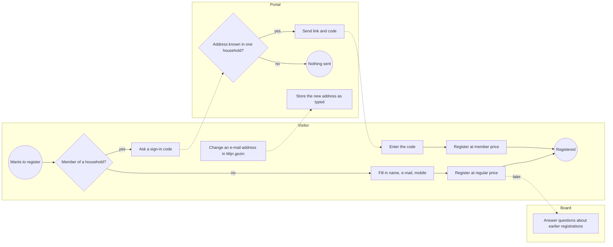
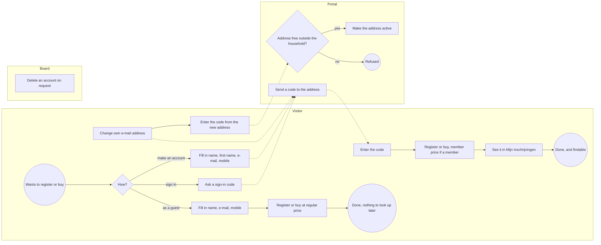
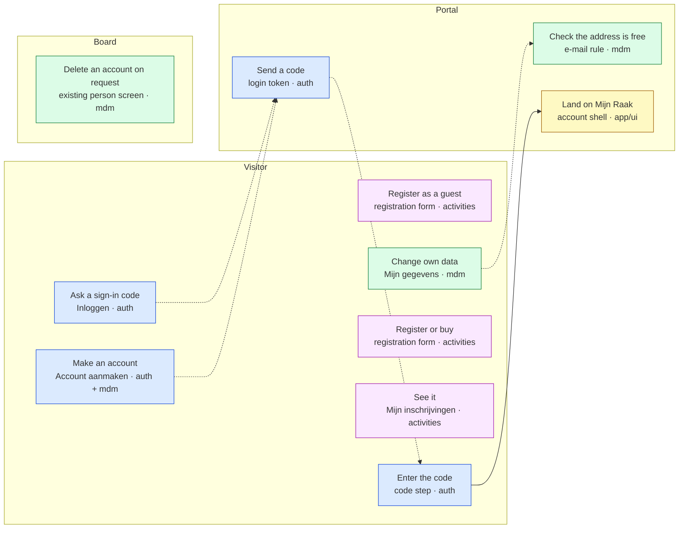
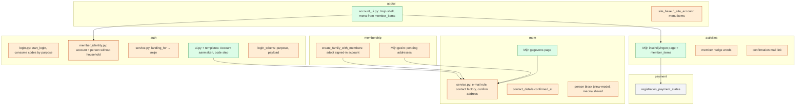
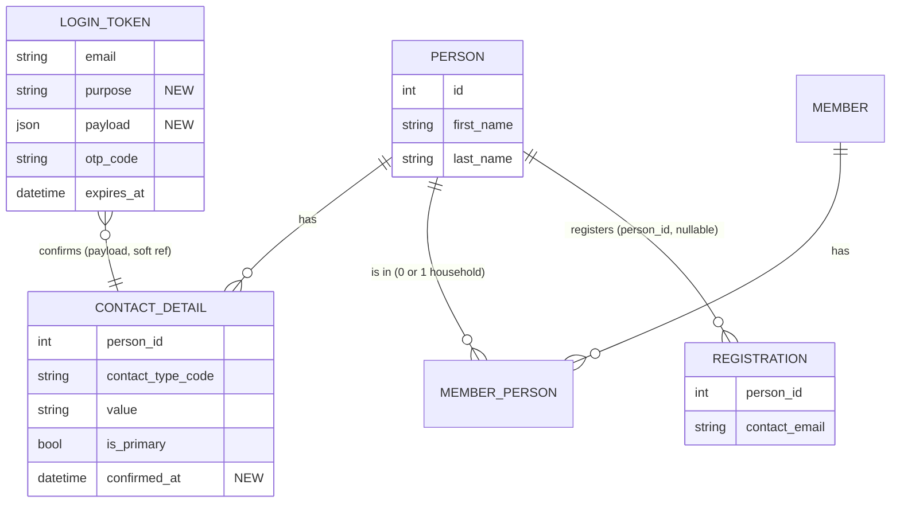

# Change Request 22 — Signing in to buy or register: member, account or guest

**Project:** Web Portal "Raak Millegem"
**Status:** shaped on 7 October 2026 · every decision taken; every screen seen by Koen (C9) · **assigned to v2.15** by Koen on 7 October 2026, handed to the master CLI the same day (phase 0 and the tracking issue are its first steps) · nothing is built yet
**Tracking issue:** #1700 — the one place where what is open stands; this document is the design, the issue is the status
**Applies to:** auth (sign-in, codes, landing), mdm (persons, e-mail addresses), membership (Mijn gezin, lid worden), activities (Mijn inschrijvingen, the hint, the confirmation mail), app/ui (Mijn Raak); built on the activity registrations first, then used by the webshop (CR-21)
**Reading:** A 2706 words · B 2822 · C 2779 — code fences excluded, measured on 7 October 2026; the budget is A ≤ 1 500, B ≤ 2 500. **Over the budget in A and B:** A carries 24 requirements, most of them Koen's answers to questions asked during shaping, and B carries the walkthrough of three roles; to be cut at the review if Koen finds them too long.

---

# Part A — The business

## A1. Reason to act — the trigger

Shaping the webshop (CR-21) on 6 and 7 October 2026, Koen asked that a buyer signs in or creates an account before paying, so that every order belongs to someone, the buyer can change his e-mail address and sees his order history. Working it through, he saw that the same question holds for registering for an activity, and on 7 October 2026 asked to lift it out: *"then we can make it like this for the activity registrations already … so that we can align that whole mechanism between activity registration and webshop."*

Signing in today sends a code to an e-mail address. That only works if the address says who signs in: inside one household two persons may share an address, because the household acts towards Raak as one; outside a household, two persons with one address leave the portal not knowing who is signed in.

## A2. As-is process — how it works today, and where it hurts

Three kinds of visitor reach a registration today; only two of them can sign in. Signing in sends a mail with a link and a six-digit code to an address; the portal sends it only when the address belongs to a board user or to the persons of exactly one household.



*What to see: a non-member can never sign in, so everything he did is gone for him after the confirmation mail; and an address typed in Mijn gezin counts at once, unchecked.*

| # | Step | Who | Pain |
|---|---|---|---|
| 1 | Register without signing in | non-member | fills in name, e-mail and mobile every time; sees nothing afterwards |
| 2 | Ask a sign-in code | non-member | nothing arrives — the portal sends codes only to board users and household members |
| 3 | Sign in and register | member | works; lands on Mijn gezin, which shows no registrations |
| 4 | Change an e-mail address in Mijn gezin | member | stored as typed: an address of another person or household is accepted, and it signs in at once |
| 5 | Find an earlier registration | anyone | only the board can look it up |

Measured in the code, not in the data: how many registrations are made without signing in is not known; the master CLI can count them read-only (registrations without a person).

## A3. To-be process — how it should work afterwards

Everyone who signs in has an account. A visitor chooses: sign in, make an account, or continue as a guest — the guest's way is today's.



*What to see: making an account is the new door; the guest's door is unchanged; an address only counts once its owner has proven he reads it.*

What changes, one line each:
- A non-member can make an account and sign in (step 2 of A2 disappears as a pain).
- After signing in, everyone lands on Mijn Raak, with his registrations (step 3).
- A new or changed address waits for its code, and an address used outside the household is refused (step 4).
- Registrations made while signed in are findable by the person himself (step 5).

**What it says on the screen** (Koen, 7 October 2026, Q15):

| Where | Words |
|---|---|
| landing page and first item of the account menu | **Mijn** + the tenant's display name: *Mijn Raak Millegem* at Raak, *Mijn [company]* elsewhere (Q32); "Mijn Raak" in this document is short for it |
| menu items | **Mijn gegevens** · **Mijn gezin** (exists) · **Mijn inschrijvingen** · later **Mijn aankopen** (CR-21) |
| link and button on the sign-in screen | **Account aanmaken** |
| sign-in button | **Inloggen** (unchanged) |
| hint above the registration form | with membership: *"Heb je een account of ben je lid? Log je eerst aan."*; without (a company tenant has no members): *"Heb je een account? Log je eerst aan."*; no reason after the link — today's ": dan staat de inschrijving bij je gezin." goes (Q39) |
| icons of the account menu | Mijn Raak Millegem: `house` · Mijn gegevens: `user` (new in the kit) · Mijn gezin: `users` (as Leden in the back office) · Mijn inschrijvingen: `calendar-days` (as Activiteiten) · later Mijn aankopen: `shopping-bag` (new) · Uitloggen: `log-out` — one meaning per glyph (#1535) (Q38) |
| a pending address | *wacht op bevestiging* |
| who registered, on a household's registration | *ingeschreven door [first name]* — only where a household is shown (Q37) |
| screen after asking a code or making an account | *"We stuurden een code naar dit adres."* — the same in every case |
| field labels on every new form and on Personen | **Voornaam** · **Achternaam** · **E-mail** · **Mobiel** — the words Koen decided in #1692 on 7 October 2026 |

## A4. Benefits — what the change earns

| Benefit | Estimate |
|---|---|
| A non-member can find back what he registered for, instead of asking the board | not measured; the count of registrations without a person (A2) is the ceiling |
| The webshop (CR-21) gets buyers who can follow and change their orders | precondition of CR-21 R23, R25 |
| An address in master data is proven to belong to its person; no one signs in as someone else through a typed address | a risk removed, not a figure |
| No duplicate persons from a second sign-up | not measured; phase 0 (R11) counts today's duplicates |
| Members see their household's registrations in one place | fewer questions to the board; not measured |

## A5. Supplied material — and what it taught us

Nothing was handed over; the design rests on the code, measured on master `457e85d` (C1). Reporting need: a report that lists the accounts (R19, Could); nothing else is counted or exported.

## A6. Business requirements — what the board asks, with MoSCoW

| # | Requirement | MoSCoW | Source | Comment |
|---|---|---|---|---|
| R1 | There are three ways to register or buy: as a member of a household, with an account, or as a guest. | Must *(proposed)* | Koen, 7 Oct 2026 | the same three for activity registrations and the webshop |
| R2 | A member of a household signs in with a code sent to his e-mail address; persons inside one household may share an address, and act as the household. | Must *(proposed)* | Koen, 7 Oct 2026 | |
| R3 | An account holds last name, first name, e-mail address and mobile — all four required when it is made — and is kept in master data. It exists only once the code from the mail has been entered. | Must *(proposed)* | Koen, 6–7 Oct 2026 (CR-21 R27; Q4, Q19) | mobile added on 7 Oct (Q19) |
| R4 | An e-mail address belongs to one person outside a household. Whoever creates an account with an address that already exists gets no second person; the screen says the same in both cases ("we sent a code to this address"), and only the mail to the owner of the address says that he already has an account, with a code to sign in. | Must *(proposed)* | Koen, 6–7 Oct 2026 (CR-21 R32; Q17) | the screen never reveals who has an account |
| R5 | A guest registers or orders without an account, giving name, e-mail address and mobile — the same three required fields a registration asks today — and pays the regular price. Whatever address he types, the portal neither blocks him nor says the address is known; the standing hint that whoever has an account signs in first stays as it is. | Must *(proposed)* | Koen, 7 Oct 2026 (Q2, Q3) | today's registration without signing in is already this; only the account is new (Q9) |
| R6 | The confirmation mail of a member or an account carries a link that signs him in and brings him to his registration or order. A guest gets no such link: without an account, nothing can be looked up or changed afterwards; the confirmation mail itself says what was registered or ordered. | Must *(proposed)* | Koen, 6–7 Oct 2026 (CR-21 R26; Q1, Q10) | the guest token of Q1 is withdrawn (Q10) |
| R7 | A signed-in person can change his e-mail address himself; a new or changed address only becomes active once the code sent to it is entered — until then it shows as waiting for confirmation — and it is refused when another person already uses it, except inside his own household. The same holds where a member changes the addresses of his household in "Mijn gezin". | Must *(proposed)* | Koen, 7 Oct 2026 (CR-21 R29; Q7, Q13) | |
| R8 | A signed-in person sees his history: his registrations — and later his orders — each with its payment status; no separate list of payments. For a member it belongs to the household, otherwise to the person. | Must *(proposed)* | Koen, 6–7 Oct 2026 (CR-21 R30; Q11) | |
| R9 | A person with an account who becomes a member through "Lid worden" becomes the person in the household; no second person is made. Whoever is not signed in and gives, for the main member, an address that already belongs to an account is refused with "Dit e-mailadres is al gekend. Log je eerst aan om lid te worden." | Must *(proposed)* | Koen, 7 Oct 2026 (Q5, Q28) | the same kind of message lid worden already gives for an existing membership |
| R10 | Accounts are per tenant: someone who buys at Raak and at a company on the platform has two accounts with the same address. | Must *(proposed)* | Koen, 7 Oct 2026 (Q6) | "so I saw it too" |
| R11 | Before the rule of R4 is enforced, today's data is measured for addresses shared outside a household; Koen decides each case. Inside a household it may, outside it may not. | Must *(proposed)* | Koen, 7 Oct 2026 (Q8) | measured read-only by the master CLI |
| R12 | Cancelling or changing a registration oneself. | Won't | Koen, 7 Oct 2026 (Q12) | out of scope; whoever wants it makes an account or becomes a member — and even then it is not part of this change |
| R13 | Everyone who signs in has an account — a member of Raak, an individual, and in the long run someone acting for a company. After signing in he lands on his account page. | Must *(proposed)* | Koen, 7 Oct 2026 (Q14) | |
| R14 | The account page has a menu with what applies to him: the account itself, always; "Mijn gezin" where he belongs to a household and the tenant has membership (renewing the membership stays there); his registrations for activities; later his purchases from the webshop. Payments and invoices may follow later, not now. | Must *(proposed)* | Koen, 7 Oct 2026 (Q14) | "given as context; maybe an insight that brings future-oriented clarity" |
| R15 | The link to "Mijn gezin" that Raak Millegem sends by mail to renew a membership keeps working: whoever follows it signs in if needed and arrives on "Mijn gezin", not on the account page. | Must *(proposed)* | Koen, 7 Oct 2026 | the address of "Mijn gezin" and of renewing does not change |
| R16 | Name, e-mail address and mobile are attributes of one natural person, edited in one way wherever the person appears: on his own page for everyone with an account, and for every person of a household in "Mijn gezin". A household is a repeating group of natural persons, each with its relation to the household, plus the household's one address. | Must *(proposed)* | Koen, 7 Oct 2026 (Q27) | a change on one page shows on the other at once |
| R17 | An account is not asked address, date of birth or gender; a member keeps those in "Mijn gezin" as today. | Must *(proposed)* | Koen, 7 Oct 2026 | data minimisation; the household's address hangs, technically, on the main member's person |
| R18 | The board sees every natural person in master data on a screen "Personen": name, e-mail, mobile, household (or none), created; a filter "Zonder gezin · In een gezin · Alle", by default "Zonder gezin". Nothing is edited there — persons manage themselves, a household's data stays in the household; the one action is deleting (R25). | Must *(proposed)* | Koen, 7 Oct 2026 (Q25, Q29) | "this is master data"; replaces "no board screen" of Q25 |
| R19 | *Replaced by R18:* the list is the report. | — | Koen, 7 Oct 2026 (Q29) | the number stays empty, so later references do not shift |
| R20 | Members-only activities, an address known in several households, and how board members sign in, stay as they are. | Must *(proposed)* | Koen, 7 Oct 2026 (Q24) | |
| R21 | When persons of one household share an e-mail address, whoever signs in with it is the household's main member, as today: "Mijn gegevens" shows the main member, and a registration is made in his name. A partner edits his own data in "Mijn gezin". | Must *(proposed)* | Koen, 7 Oct 2026 (Q22) | the household acts towards Raak as one; member price and history are the household's |
| R22 | A person deletes his own account. | Won't | Koen, 7 Oct 2026 (Q20) | the board deletes a person without household on request, from Personen (R25) |
| R23 | The history begins with the first registration made while signed in; earlier registrations made without signing in are not linked afterwards by e-mail address. Whoever wants to see old ones asks the board. | Must *(proposed)* | Koen, 7 Oct 2026 (Q23) | a typed or shared address would show someone else's registrations |
| R24 | A mail to the old address when the e-mail address changes. | Won't | Koen, 7 Oct 2026 (Q21) | whoever changes it could sign in with the old address; inside a household the board keeps the composition right |
| R25 | From Personen the board deletes a person, after a confirmation that says what happens. A person in a household is first taken out of it by the household's own rules, in the same action — with its history row — and then deleted; the main member is refused: "Een gezin heeft een hoofdlid nodig. Duid eerst een ander hoofdlid aan in het gezin." His registrations stay, with the name and address written on them. | Must *(proposed)* | Koen, 7 Oct 2026 (Q29, Q30) | the household's address hangs on the main member's person |
| R26 | For a member, the landing page shows the same membership card as Mijn gezin — valid until, a renewal that runs, or "Lidmaatschap vernieuwen" when renewing is possible. Below it, the latest registration — and later the latest purchase — each only when there is one; with nothing to show, no empty card. | Must *(proposed)* | Koen, 7 Oct 2026 (Q33) | "exactly the same card" |
| R27 | A registration still to be paid by bank transfer shows how to pay it — amount, IBAN, beneficiary, structured communication — in exactly the layout Mijn gezin uses for a renewal paid by transfer; wherever it appears: the latest registration on the landing page and Mijn inschrijvingen. | Must *(proposed)* | Koen, 7 Oct 2026 (Q34) | "exactly the same layout" |

MoSCoW: **Must** (without it the change is worthless), **Should** (important,
but the change ships without it), **Could** (nice, if cheap), **Won't** (asked
and deliberately not done — recorded so it is not asked again).

## A7. Non-functional requirements — security, privacy, house style, tenants

| Concern | This change |
|---|---|
| **Security** — who may do what; new inputs from outside; secrets | An account signs in the same way a member does: a code to the address, no password. Nothing on a screen ever tells whether an address is known (R4, R5). An address counts only once its code is entered (R3, R7). No new secrets. |
| **Privacy** — personal data: what, where, who sees it, what leaves the system | An account holds name, first name, e-mail and mobile, nothing more (R3, R17). A person sees only his own registrations, or his household's (R8, R23). Deleting an account goes through the board (R22). Nothing new leaves the system; the mails are the existing sign-in mail and confirmation mail. |
| **House style / UI norm** — `docs/design-system.md`; brand rules | New pages in the public shell with the kit's macros; judged at 390 px; the words of A3. |
| **Multi-tenant** — what differs per unit, what is platform-wide | Accounts are per tenant (R10). "Mijn Raak" carries the tenant's name. "Mijn gezin" shows only where the tenant has membership and the person a household. |

## A8. Acceptance criteria — what the business signs off on HDEV

| # | Criterion | Requirement | Walkthrough steps |
|---|---|---|---|
| AC1 | A non-member makes an account with name, first name, e-mail and mobile, enters the code, and lands on Mijn Raak | R1, R3, R13 | W1.1–W1.4 |
| AC2 | Making an account with an address that already has one shows the same screen; the mail says "you already have an account" with a code to sign in; no second person appears in the back office | R4, R17 | W1.5–W1.6 |
| AC3 | A guest registers as today and gets no link to come back | R5, R6 | W2.1–W2.2 |
| AC4 | A member signs in and lands on Mijn Raak, with Mijn gezin in the menu | R2, R13, R14 | W3.1–W3.2 |
| AC5 | The renewal link to Mijn gezin, opened while signed out, leads through sign-in to Mijn gezin | R15 | W3.3 |
| AC6 | A registration made while signed in shows under Mijn inschrijvingen with its payment status; one made as a guest does not | R8, R23 | W1.7, W2.3 |
| AC7 | Changing one's address: the new one shows "wacht op bevestiging" until its code is entered; an address of another household is refused | R7 | W1.8–W1.9, W3.4 |
| AC8 | Changing one's name on Mijn gegevens shows in Mijn gezin at once, and the other way round | R16 | W3.5 |
| AC9 | On a phone, the account menu in the drawer reaches Mijn gegevens, Mijn gezin and Mijn inschrijvingen | R14 | W3.6 |
| AC10 | Members-only activities still refuse an account without household | R20 | W1.10 |
| AC11 | In the back office, Personen shows the new account under "Zonder gezin"; deleting it asks for confirmation, after which signing in with that address gets no code | R18, R25 | W4.1–W4.3 |

---

# Part B — The solution, for whoever approves it

## B1. Solution outline — the solution and the decisions that shape it

An account is a person in master data with a confirmed e-mail address and no household — no new kind of account. Signing in keeps its one flow (a code to an address); it learns that a person without a household is an account, and lands everyone on "Mijn Raak". Every code the portal sends — to sign in, to make an account, to confirm a new address — comes from the one sign-in token, which gains a purpose. An e-mail address of a person becomes active only once confirmed, and one rule in master data refuses an address that another person outside the household already uses. Guests stay exactly as today.

- **D1 — The account is a person.** An account is a `Person` with a confirmed EMAIL contact detail; `auth.users` stays the board's account, still without a link to a person. *Rejected:* an `auth.accounts` table — a second place for a name and an address (`AGENTS.md`, *twee keer dezelfde reparatie*).
- **D2 — One code mechanism.** `auth.login_tokens` gains a `purpose` (sign in, make an account, confirm an address) and a JSON `payload`; the 15 minutes, the hashed code, the five attempts and the one live token per address apply to all three. *Rejected:* a second token table with its own expiry and lockout.
- **D3 — An address is confirmed or it does not count.** `mdm.contact_details` gains `confirmed_at`; existing rows are backfilled as confirmed; sign-in only matches confirmed EMAIL rows; an unconfirmed row shows "wacht op bevestiging". *Rejected:* keeping the pending address only in the token — Mijn gezin could not show it.
- **D4 — One rule, one home.** `mdm` owns "an e-mail address belongs to one person outside a household"; every writer of an EMAIL row passes it; a hard gate keeps it so (B7, C7). A unique index cannot say "except inside the household", so the rule lives in the service (`docs/code-style.md`, *a rule has one home*).
- **D5 — Mijn Raak is a shell, the modules fill it.** The page and its menu live in `app/ui` (cross-cutting); "Mijn gegevens" is always there; the other items come from the modules' existing `member_items` — membership keeps "Mijn gezin", activities adds "Mijn inschrijvingen", the webshop later adds "Mijn aankopen" without touching the shell.
- **D6 — One natural person, edited one way.** "Mijn gegevens" uses the person block and save path that Mijn gezin uses per person (R16); a person without household is saved by the same service functions.

| # | Derived requirement | From |
|---|---|---|
| F1 | `login_person_for_email` returns the person for an address held by exactly one person without household | R1, R13 |
| F2 | `start_login` sends a code to an account's address, still silent for an unknown address | R1, R4 |
| F3 | `landing_for` sends a non-board person to `/mijn`; a `terug` target still wins | R13, R15 |
| F4 | A code with purpose "make an account" creates the person and its confirmed address in one transaction, only if the address is still free | R3, R4 |
| F5 | A code with purpose "confirm address" sets `confirmed_at`, only if the address is still free | R7 |
| F6 | Sign-in lookups ignore unconfirmed rows | R7 |
| F7 | Lid worden, while signed in as an account, makes that person the main member | R9 |
| F8 | Mijn inschrijvingen lists registrations by person id (own, or the household's persons), with the payment state from the payment facade | R8, R23 |

## B2. Fit with the process and the requirements — for the business



*Legend: blue auth · green master data · yellow the account shell · purple activities.*

| R | How the solution meets it | F | Module (C2) | Test (C6) | AC (A8) |
|---|---|---|---|---|---|
| R1 | three doors: Inloggen, Account aanmaken, the guest form | F1, F2 | auth, activities | T1, T2, T12 | AC1, AC3, AC4 |
| R2 | a household's shared address signs in as today | F1 | auth | T3 | AC4 |
| R3 | four fields, the person exists after the code | F4 | auth, mdm | T4 | AC1 |
| R4 | the same screen; only the mail tells the owner | F2, F4 | auth, mdm | T5 | AC2 |
| R5 | the guest form unchanged; the hint's new words | — | activities | T12 | AC3 |
| R6 | a member's or account's confirmation mail links to Mijn inschrijvingen; a guest's has no link | — | activities, mail | T13 | AC3 |
| R7 | pending address until its code; refused when used outside the household | F5, F6 | mdm, auth | T6, T7 | AC7 |
| R8 | Mijn inschrijvingen with payment state | F8 | activities | T10 | AC6 |
| R9 | lid worden adopts the signed-in account's person | F7 | membership | T11 | — (C6) |
| R10 | persons per tenant, as today | — | mdm | T8 | — (C6) |
| R11 | phase 0, measured before the handover | — | — | — | C8 |
| R12 | Won't: no self-cancel | — | — | — | — |
| R13 | land on /mijn | F3 | auth, app/ui | T9 | AC1, AC4 |
| R14 | menu from the modules; on a phone the account menu | — | app/ui | T14 | AC9 |
| R15 | `terug` wins over the landing | F3 | auth | T9 | AC5 |
| R16 | one person block and save path | — | mdm, membership | T15 | AC8 |
| R17 | no address, birth date, gender for an account | — | mdm | T4 | AC1 |
| R18 | Personen in master data, filter "Zonder gezin" | — | mdm | T17 | AC11 |
| R19 | replaced by R18 | — | — | — | — |
| R20 | members-only, several households, board sign-in unchanged | — | activities, auth | T16 | AC10 |
| R21 | shared address signs in as the main member | F1 | auth | T3 | AC4 |
| R22 | Won't: self-service delete | — | — | — | — |
| R23 | history only from signed-in registrations | F8 | activities | T10 | AC6 |
| R24 | Won't: no mail to the old address | — | — | — | — |
| R25 | delete a person from Personen, through the household's rules when he has one | — | mdm | T17 | AC11 |

**Walkthrough on HDEV**

*W1 — a non-member (use a fresh test address)*
1. Open an activity, choose a component, press **Inloggen** → the sign-in screen shows **Account aanmaken**.
2. Press it; fill in name, first name, e-mail, mobile → "We stuurden een code naar dit adres."
3. Enter the code from the mail → you land on **Mijn Raak**, menu: Mijn gegevens, Mijn inschrijvingen.
4. Mijn gegevens shows the four values; no address, birth date or gender.
5. Sign out; press Account aanmaken again with the same address → the same screen.
6. The mail now says you already have an account, with a code; in the back office there is still one person with this address.
7. Register for an activity while signed in → it shows under Mijn inschrijvingen with its payment status.
8. On Mijn gegevens, change the address to a second fresh one → it shows "wacht op bevestiging"; enter its code → it is active; sign in with it works, with the old one no longer.
9. Try to change it to the address of an existing member → refused, with the message under the field.
10. Open a members-only activity → refused as today.

*W2 — a guest*
1. Signed out, register with name, e-mail, mobile → confirmation as today; the mail has no link back.
2. The hint above the form reads "Heb je een account of ben je lid? Log je eerst aan."
3. Sign in later with an account on that same address → this registration does not show under Mijn inschrijvingen.

*W3 — a member*
1. Sign in → **Mijn Raak**, menu: Mijn gegevens, Mijn gezin, Mijn inschrijvingen.
2. Mijn inschrijvingen shows the household's registrations made while signed in.
3. Sign out; open the renewal link `/leden/gezin/vernieuwen` → sign in → you arrive on the renewal page, not on Mijn Raak.
4. In Mijn gezin, add an address for a household member → "wacht op bevestiging" until its code; an address of another household is refused.
5. Change your first name on Mijn gegevens → Mijn gezin shows it; change it back in Mijn gezin → Mijn gegevens shows it.
6. On a phone (390 px), open the drawer → the account menu reaches every page.

*W4 — the board*
1. Open Systeem → **Personen** → the filter stands on "Zonder gezin"; the account of W1 is there.
2. Switch the filter to "In een gezin"; delete a main member → refused, "Een gezin heeft een hoofdlid nodig. …"; delete another household member → the confirmation names the household; afterwards Mijn gezin no longer shows him.
3. Delete the account of W1 → the confirmation names him; afterwards asking a code for his address sends nothing.

## B3. The whole across the modules — for the architect



*Legend: green new · orange changed · grey only used. Arrows go through each domain's `api.py`.*



Who calls whom: the account shell (`app/ui`) reads the signed-in person from `auth.api` and the menu from the module registry; each page asks its own domain's facade (`mdm.api`, `activities.api`, `membership.api`). `auth` asks `mdm.api` to create the person and confirm an address; `mdm` never calls `auth`. The transaction boundary of "make an account" and "confirm an address" is the code step: consuming the token and writing the person or `confirmed_at` commit together. Impact on the architecture: two additive columns, one additive code list, one new route module in `app/ui`; the layer and import gates hold without exceptions (B4). The one behaviour that moves for everyone is `landing_for`.

## B3a. Standards the model follows — and where it deviates, on purpose

Standards checked: UBL 2.1 for the party and its contact (the account is the party that CR-21 will make a buyer); vCard (RFC 6350) for a person's contact list; OpenID Connect Core for a verified e-mail address; NIST SP 800-63B for a code sent by mail; ISO 8601 for timestamps; E.164 for telephone numbers. For a household no standard applies: it is Raak's own grouping, already modelled (#1603).

| Concept in this change | Standard and element | Ours (table · column, name) | Follows / deviates — why |
|---|---|---|---|
| The account holder | UBL `cac:Party/cac:Person` (`cbc:FirstName`, `cbc:FamilyName`) | `mdm.persons` · `first_name`, `last_name` | follows the shape; the column names stay as they are (`AGENTS.md`: do not rename) — `last_name` maps to `cbc:FamilyName` |
| The account as buyer later | UBL `cac:BuyerCustomerParty/cac:Party` | `mdm.persons.id`, referenced by an order in CR-21 | follows: the party is the person, no separate customer table |
| E-mail address | UBL `cac:Contact/cbc:ElectronicMail` (one); vCard `EMAIL` (repeatable, `PREF`) | `mdm.contact_details` · `contact_type_code` = EMAIL, `value`, `is_primary` | follows vCard: repeatable and typed, `is_primary` = `PREF`; maps to UBL's single element by taking the primary |
| Mobile | UBL `cbc:Telephone`; vCard `TEL;TYPE=cell` | `mdm.contact_details` · MOBILE | follows vCard; deviates from E.164: stored as typed — "not now"; the column can take a normalised value later |
| A confirmed address | OpenID Connect `email_verified` (boolean) | `mdm.contact_details` · `confirmed_at` (timestamp) | follows the meaning; a timestamp instead of a boolean, because *when* matters for the backfill and an audit; `confirmed_at IS NOT NULL` is the boolean |
| The code by mail | NIST SP 800-63B §5.1.3 out-of-band authenticator: one use, short life, limited attempts | `auth.login_tokens` · `otp_code` (hash), `expires_at` (15 min), `attempts` (5), `used` | follows, as it already did (#268, #395) |
| What a code is for | — | `auth.login_tokens.purpose`, code list `auth.login_purpose_codes` | no standard; a code list as every list here (CR-12) |
| Timestamps | ISO 8601 with offset | `DateTime(timezone=True)` | follows |

## B4. Rules this change needs an exception from — decided once, here

| Rule (where) | What the design does instead | Mechanism | Temporary until … / the new rule | Decided |
|---|---|---|---|---|
| *Existing Dutch identifiers stay. Do not rename.* (`AGENTS.md`, *Code language*) | Phase 1 renames, to English, the Dutch names in the code this change rewrites, so a reader does not meet `create_account.html` beside `aanmelden.html`: the four sign-in templates and five Python functions (C2, phase 1) | a rename-only phase before the functional one; the five functions leave `DUTCH_IDENTIFIERS` in `tests/rules_baseline.py` (437 → 432); URLs do not change | for this change; whether it becomes the rule ("who rewrites a file may rename it") is Koen's to decide and the master CLI's to write into `AGENTS.md` | Koen, 7 Oct 2026 (Q31) |

Checked without finding another exception: `test_layer_gate.py` (the new pages have view-models; `account_ui.py` is named `*_ui.py`), `test_import_boundaries.py` (every cross-domain call through `api.py`), `test_rules_gate.py` (English identifiers; no JSON route is added, so no `## Callers`), `test_public_shell_gate.py` (account items only through `_site_account.html`), `test_public_ratchets.py` (kit buttons and cards only), `test_template_variables_gate.py`, `test_i18n_gate.py`, the fixed UI decisions in `AGENTS.md` (none touched), the URL rule (Dutch paths for people: `/mijn`, `/mijn/gegevens`, `/mijn/inschrijvingen`, `/admin/personen`, `/account-aanmaken`).

## B5. Cost — investment and running cost, and what operations must know

| Module | Size |
|---|---|
| auth (codes by purpose, account sign-in, landing, Account aanmaken screens) | M |
| mdm (confirmed_at, e-mail rule and factory, Mijn gegevens) | M |
| membership (adoption in lid worden, pending addresses in Mijn gezin) | S |
| activities (Mijn inschrijvingen, nudge words, mail link) | S |
| app/ui (Mijn Raak shell, menu) | S |
| tests and gate (C6, C7) | M |
| **Total** | about one release of one dev CLI |

Analysis and review: this document. Validation on HDEV: the walkthrough of B2, about an hour. **Running cost:** none — a few more sign-in mails through the existing mail service. **Operations:** no env vars, no setting, no kill switch; one migration (additive, with a backfill of `confirmed_at`).

## B6. Phasing — shippable phases, and what changes on the failure paths

| Phase | Delivers | Migration | Env vars | Data | Failure paths that change | Manual validation |
|---|---|---|---|---|---|---|
| 0 — before the handover | the count of addresses shared outside a household per tenant (R11), Koen's decision per case | — | — | read-only query (C8) | — | Koen decides the cases |
| 1 — rename only | English names for what this change rewrites (B4, C2 phase 1); no behaviour changes | none | none | none | none — a rename that misses a caller fails at import or in the template-variables gate, before anything runs | none: the full suite and the screenshots unchanged |
| 2 — the change | everything else in this document; same release as phase 1 | additive: `contact_details.confirmed_at` (backfilled), `login_tokens.purpose` + `payload`, code list `auth.login_purpose_codes` | none | backfill of `confirmed_at` = `created_at` | an unknown address still gets nothing; an account's address now gets a code; a code for an address taken meanwhile is refused with a message; a signed-in person without household no longer bounces from /leden/gezin to sign-in — he lands on /mijn | the walkthrough (B2) |

Dependency: CR-21 (webshop) builds on phase 1.

## B7. Rule and gatekeeper — what this fixes for all future work

**The rule:** an e-mail address of a person is written only through master data's contact service, which confirms it and refuses it when another person outside the household uses it. It goes into `docs/code-style.md` under *A rule has one home*.
**Reach and baseline:** `ContactDetail(` is constructed in ten places in four files today (C1); after this change in one, the factory in `mdm/service.py`. The gate is **hard**. Edits of an existing row's value are covered by tests (T6, T7), not by the gate — the weaker guarantee, said here.

## B8. Open decisions — what the approver still decides

None: every question is answered (Q&A log).

## B9. Decisions log — dated answers

| Date | Decision | By |
|---|---|---|
| 7 Oct 2026 | Lifted out of CR-21: built first on the activity registrations, then used by the webshop. | Koen |
| 7 Oct 2026 | Three ways: household member, account, guest; a guest gives name, e-mail address and mobile. | Koen |
| 7 Oct 2026 | Keep the guest simple: no account, so nothing can be changed afterwards; no guest link. **Replaces** Q1 (Q10). | Koen |
| 7 Oct 2026 | History shows registrations (later orders) with their payment status, no list of payments (Q11). | Koen |
| 7 Oct 2026 | Cancelling a registration oneself is out of scope (Q12). | Koen |
| 7 Oct 2026 | A new or changed address in "Mijn gezin" or "Mijn account" is active only after its code; refused when used outside the household (Q13). | Koen |
| 7 Oct 2026 | Everyone who signs in is an account; the landing page is the account, with a menu of what applies: account, Mijn gezin (household + membership), registrations, later purchases; payments and invoices later (Q14). | Koen |
| 7 Oct 2026 | One object, the natural person: one way to edit it (rules, view-model, block), used on the own page and per person in "Mijn gezin"; the household is a repeating group of persons with their relation, plus its address (Q27). | Koen |
| 7 Oct 2026 | Screen words: Mijn Raak (landing and menu title, from the tenant's name), Mijn gegevens, Mijn gezin, Mijn inschrijvingen, Account aanmaken; hint "Heb je een account of ben je lid? Log je eerst aan." (Q15). | Koen |
| 7 Oct 2026 | On a phone the account menu in the drawer is the navigation, with links at the bottom of Mijn Raak; on a desktop a menu on the left; one list from the modules (Q16). | Koen |
| 7 Oct 2026 | The screen never reveals that an account exists; only the mail to the owner says so (Q17). | Koen |
| 7 Oct 2026 | Mobile is required when an account is made (Q19). | Koen |
| 7 Oct 2026 | No board screen for accounts; a report may list them (Q25). | Koen |
| 7 Oct 2026 | Members-only, several households, board sign-in: unchanged (Q24). | Koen |
| 7 Oct 2026 | Duplicate addresses measured read-only by the master CLI before the handover (Q26). | Koen |
| 7 Oct 2026 | A shared household address signs in as the main member, as today; no "who are you?" step (Q22). | Koen |
| 7 Oct 2026 | No self-service account deletion; the board deletes on request (Q20). | Koen |
| 7 Oct 2026 | No backward linking of registrations by e-mail; history starts when signed in (Q23). No mail to the old address on a change (Q21). | Koen |
| 7 Oct 2026 | A screen "Personen" in master data lists every natural person, filter default "Zonder gezin", read-only except deleting a person without household. **Replaces** "no board screen" (Q25) and the report (R19) (Q29). | Koen |
| 7 Oct 2026 | Lid worden, not signed in, with an account's address: refused with "Dit e-mailadres is al gekend. Log je eerst aan om lid te worden." (Q28). | Koen |
| 7 Oct 2026 | Personen may delete a person in a household too: one action that first detaches him by `detach_household_person` (same refusals, same history) and then deletes him; the main member is refused (Q30). | Koen |
| 7 Oct 2026 | A rename-only phase 1 before the change: the Dutch names in what this change rewrites become English (B4) (Q31). | Koen |
| 7 Oct 2026 | The landing page is called "Mijn" + the tenant's display name: *Mijn Raak Millegem* (Q32). | Koen |
| 7 Oct 2026 | The membership card of Mijn gezin is the one on the landing page too: one partial, one view-model, two places (Q33). | Koen |
| 7 Oct 2026 | The transfer instructions are one partial, the inset of `_renewal_running.html` (#1641), used for a renewal and for a registration alike (Q34). | Koen |
| 7 Oct 2026 | No heading above the account menu; its first item is the landing page, which carries the same title (Q35). | Koen |
| 7 Oct 2026 | Every confirmation mail carries a link and a code for the same token, as the sign-in mail does; either confirms (Q36). | Koen |
| 7 Oct 2026 | Q1–Q9 answered: guest link by secret token; mobile required as today; no lookup or warning on a typed address (the standing hint stays, as decided in CR-11); an account exists after the code; an account that becomes a member keeps its person; accounts per tenant; a new address is confirmed and unique except inside the household; existing duplicates measured first, Koen decides; for registrations only the account is new. | Koen |

---

# Part C — The build, for the master CLI and the dev CLIs

## C1. Verified premises — measured before the handover

Measured on master `457e85d`, 7 October 2026.

| Claim | Measured how | Result | Consequence |
|---|---|---|---|
| A guest registration exists today | `activities/models.py:351` (`person_id` nullable), `registration_form.py:62-73` | yes: no sign-in → `person_id` None, contact fields stored | the guest is unchanged (R5) |
| Mobile is required for a registration | `registration_form.py:104-121`, `service.py:2310-2325` | yes, in the service, not in the database | the guest keeps it; the account form requires it (R3) |
| The public form never looks up a typed address | `registration_form.py:20-22, 62-73`; save at `:373` | yes | member price only from the session (R5) |
| Sign-in sends only to a board user or one household | `auth/login.py:47-104` | yes; "none" silent, "multiple" a board notice | F2 |
| One choke point resolves the signed-in person | `auth/member_identity.py:49` `login_person_for_email`; callers `ui/__init__.py:917`, `auth/router.py:127`, `auth/service.py:218`, `membership/service.py:123`, `membership/ui.py:145`, `registration_form.py:70,85`, `forms/ui.py:121` | yes, nine callers; None for a person without household | F1; each caller checked in T1 |
| The session holds only an e-mail address | `auth/session.py:29-53` | `email|exp|HMAC`, 12 h | the rule of R4 decides who is signed in |
| Codes: 15 min, hashed, 5 attempts, one live per address | `auth/login.py:25-42, 76-81, 124-131` | yes | reused for every purpose (D2) |
| The login token has no tenant and no person | `auth/models.py:116-136` | yes | `payload` carries the person or contact id (D2) |
| A non-board signed-in person lands on Mijn gezin, and without household bounces to sign-in | `auth/service.py:69-90`; `membership/ui.py:147-156, 235-240` | yes — a loop for an account | F3 |
| Back to the page after sign-in | `?terug=`; `test_sign_in_returns_to_the_page.py` | yes | R15 holds by keeping `terug` first |
| Members can change e-mail addresses in Mijn gezin, unchecked | `household_router.py:244-283`; `mdm/household_save.py:240` → `mdm/service.py:785` `write_email_rows` | yes; no cross-person check | the rule hooks into `write_email_rows` (D4) |
| No unique index on an e-mail value | migration `053`:56-59 (one primary per type only) | yes | the rule in the service (D4); phase 0 (R11) |
| Persons and contact rows are per tenant; the tenant filter covers SELECT only | `mdm/models.py:174, 500-559`; `kernel/tenancy.py:175-192` | yes; organisation rows carry a tenant that is not their scope (`models.py:509-525`) | the rule filters on `person_id IS NOT NULL` |
| Where `ContactDetail` rows are made | `grep "ContactDetail("`: `membership/household_service.py:355,364,381,1006`, `mdm/service.py:690,845,1031,1269`, `mdm/household_service.py:306,446` | ten places, four files; EMAIL possible in eight | one factory, hard gate (B7, C7) |
| Lid worden makes new persons without looking | `membership/household_service.py:245-381`; callers `register_router.py:409`, `household_service.py:431` | yes; only a same-year membership check by address (`register_router.py:357-400`) | F7, Q28 |
| Modules already carry account menu items | `kernel/modules.py:69` `member_items`; membership `:127` "Mijn gezin"; `_site_account.html:16-24` | yes; shown only `if gebruiker.is_member` | D5; the condition becomes "signed in" |
| Mijn gezin shows no registrations | membership templates and routes | none | Mijn inschrijvingen is new (F8) |
| The confirmation mail is built in Python | `mail/service.py:543` `activity_confirmation_message`, link only `answer_url` `:652-660` | yes | one link added for a signed-in person (R6) |
| Two `person_fields` macros exist | `ui/templates/_macros.html:1130` (lid worden), `membership/templates/_household_rows.html:38` (Mijn gezin) | yes | Mijn gegevens uses the second; the first is left (Non-goals) |
| The hint above the form | `ui/templates/_member_nudge.html:12-13` "Lid van RAAK? Log je eerst aan: …" | yes, with RAAK hard-coded | new words, no tenant name (A3) |
| Reporting reads persons | views `reporting.d_person`, `f_membership_persons` | yes; none reads `contact_details` | an account report needs no new view (R19) |
| Dutch identifiers in the files this change rewrites | `tests/rules_baseline.py` `DUTCH_IDENTIFIERS` against those files | five functions (`membership/ui.py` 4, `ui/__init__.py` `_huidige_gebruiker`); the sign-in template names are not in the baseline (it covers Python names) | phase 1 renames them (B4) |
| The household model is named `Member` | `mdm/models.py` `Member`, `MemberPerson` | yes | the document says household; the code keeps `Member` |
| Latest migration | `backend/alembic/versions` | 197 | the build generates the next with `alembic revision` |

## C2. Per module: what must happen

### Phase 1 — rename only (one commit, no behaviour change)

| Today | Becomes | Where |
|---|---|---|
| `aanmelden.html` | `sign_in.html` | `auth/templates/`, rendered by `auth/ui.py` |
| `_aanmelden_email.html` | `_sign_in_email.html` | idem |
| `_aanmelden_code.html` | `_sign_in_code.html` | idem |
| `_aanmelden_klaar.html` | `_sign_in_done.html` | idem |
| `gezin_portaal` | `household_page` | `membership/ui.py` (route `/leden/gezin` unchanged) |
| `gezin_vernieuwen` | `renew_membership_page` | `membership/ui.py` (route `/leden/gezin/vernieuwen` unchanged) |
| `lid_worden` | `sign_up_page` | `membership/ui.py` (route `/lid-worden` unchanged) |
| `lid_worden_submit` | `sign_up_submit` | `membership/ui.py` |
| `_huidige_gebruiker` | `_current_user` | `ui/__init__.py` |
| `gezin_portaal.html` | `household_page.html` | `membership/templates/` — rewritten by the card's extraction |

The five functions leave `DUTCH_IDENTIFIERS` (`tests/rules_baseline.py`), as the ratchet demands. Left as they are, because this change does not rewrite them: the template variable `gebruiker` (read by every public template), and the other Dutch names in the touched files (`mdm/service.py` `_persoon_of_404`, `_waarde`, `gezin_tabs`; `ui/__init__.py` `_gezinslabel`, `_beheer_account`, …). Note for the reader: the household is the model `Member`, its link `MemberPerson` — English names that say "member" for the household; they stay (`AGENTS.md`: do not rename) and this document says *household* for the concept.

### auth
- **Screens:** `/aanmelden` gets the link **Account aanmaken**; new `/account-aanmaken` (first name, last name, e-mail, mobile — each through the kit's `ui.field(..., required=True)`: the red asterisk on the label, the error under the field with the border in the danger tone, no "Verplicht veld" legend, `docs/design-system.md` §K4; `btn_primary`), posting to the same code step as sign-in (`_aanmelden_code.html`), whose message becomes "We stuurden een code naar dit adres." Judged at 390 px.
- **Code:** `login.start_login(db, email, purpose=SIGN_IN)` — also sends when `login_person_for_email` returns an account; `start_account(db, data)` — if the address is free, a token with purpose CREATE_ACCOUNT and the four fields in `payload`; if not, a SIGN_IN token and the mail "je hebt al een account"; the screen is the same. `consume_code(db, email, code)` dispatches on purpose: SIGN_IN sets the session; CREATE_ACCOUNT calls `mdm.api.create_account_person(...)` then sets the session; CONFIRM_ADDRESS calls `mdm.api.confirm_email(contact_id)`. `member_identity.login_person_for_email`: confirmed EMAIL rows only; one household → its main member (as today); exactly one person and no household → that person; otherwise None ("multiple" as today). `service.landing_for`: board users as today; everyone else `/mijn`. The writer of `login_tokens` is `auth.login` only.
- **Database:** `auth.login_tokens.purpose` `String(20)` NOT NULL default `SIGN_IN`, FK `auth.login_purpose_codes.code`; `payload` JSON NULL. New code list `auth.login_purpose_codes` + labels (pattern of migration 154): `SIGN_IN`, `CREATE_ACCOUNT`, `CONFIRM_ADDRESS`. Additive.
- **Templates and mail:** `sign_in.html`, `_sign_in_email.html` (link), new `create_account.html`; mails in `mail/service.py`: sign-in (unchanged), "bevestig je account", "je hebt al een account", "bevestig je e-mailadres" — each, like the sign-in mail today (`send_magic_link`, `mail/service.py:431`), with **a link and a code for the same token**: either confirms (Q36). The link is consumed by the route that consumes a sign-in link today (`/login/verify`, `auth/ui.py:147`), dispatching on the token's purpose; after it the person lands where the code step would have sent him.
- **Tests:** T1–T5, T9, T16.

### mdm
- **Screens:** new `/admin/personen` "Personen" (R18, R25) — gated by today's `require_admin_ui` (ADMIN, OPERATOR); CR-24 (back office rights) later replaces the gate by the right `person.delete` of the role Masterdata and moves the item to the group Relaties — one line each, nothing in this change waits for CR-24; menu item beside "Organisaties" (natural persons beside legal persons, #971); a table with search and the filter; one row action "Verwijderen", with a confirmation that names the household when there is one ("Tom Janssens verwijderen? Hij wordt ook uit het gezin Janssens gehaald."); `delete_person(db, person, actor)` in `mdm.service` first calls `detach_household_person` for a household person (its refusals and history row), then soft-deletes the person and his contact rows; registrations keep their contact fields. New `/mijn/gegevens` — the person block of Mijn gezin (`_household_rows.html` `person_fields`) for oneself: first name, last name, e-mail rows, mobile; for a member a line "Je adres en je gezinsleden beheer je in Mijn gezin →".
- **Code:** `new_contact_detail(db, person, type_code, value, *, confirmed)` — the only constructor of `ContactDetail`; for EMAIL it calls `email_refusal(db, person, value)` — refused when a confirmed EMAIL row with this value (case-insensitive, `person_id IS NOT NULL`, not deleted, this tenant) belongs to a person outside `person`'s household. `create_account_person(db, first_name, last_name, email, mobile)` — refuses when the address is no longer free, makes the person with confirmed EMAIL and MOBILE. `confirm_email(db, contact_id)` — re-checks `email_refusal`, sets `confirmed_at`. `write_email_rows`: new or changed values are stored unconfirmed and a CONFIRM_ADDRESS code is asked through an event (`EmailAddressAdded`) that `auth` handles — so `mdm` does not call `auth`. Board writes (`source` other than `member_self`) are stored confirmed, and still pass `email_refusal`. The ten construction sites of C1 go through `new_contact_detail`.
- **Database:** `mdm.contact_details.confirmed_at` `DateTime(timezone=True)` NULL; backfill `confirmed_at = created_at` for every existing row. Additive. No copy action on persons.
- **Templates:** new `my_details.html` (view-model `MyDetailsPage`); the pending state in the e-mail row of `_household_rows.html`.
- **Tests:** T4–T8, T15.

### membership
- **Screens:** Mijn gezin unchanged in layout; its membership card (`gezin_portaal.html:24-40`, `flow_card("Lidmaatschap")`) moves into a partial `_membership_card.html` with its own small view-model (valid until, renewal running, renewal available, the payment of a running renewal), included by Mijn gezin and by the landing page (R26); a pending address shows "wacht op bevestiging"; the address `/leden/gezin` and `/leden/gezin/vernieuwen` unchanged.
- **Code:** `create_family_with_members`: when the request comes from a signed-in account whose address is the main member's, use that person instead of a new one (F7); otherwise, when the main member's address belongs to an account, refuse with the message of R9 (Q28); T11 covers both. `member_items` unchanged.
- **Database:** none.
- **Tests:** T11.

### activities
- **Screens:** new `/mijn/inschrijvingen` — one card per registration: activity, date, component × quantity, amount, payment state badge; for a household "ingeschreven door [first name]" (Q37); the transfer block when due (R27); newest first; empty state "Je hebt nog geen inschrijvingen."; `member_items` gains `("/mijn/inschrijvingen", "Mijn inschrijvingen")`. `_member_nudge.html` gets the words of A3, the "of ben je lid" part only when the tenant has the membership module (`module_enabled`, `ui/__init__.py:439`) (Q39).
- **Code:** the transfer instructions move out of `membership/templates/_renewal_running.html` (the `ui.inset` "… betaal via overschrijving:" with Bedrag, IBAN, Begunstigde, Mededeling (OGM)) into one partial `_transfer_due.html` with a `TransferDue` view-model (amount, iban, beneficiary, ogm, heading), included by the renewal and by every registration still to be paid by transfer (R27); the heading is the caller's ("Inschrijving geregistreerd — betaal via overschrijving:"). `registrations_for_persons(db, person_ids)` in the facade; payment state through `payment.api.registration_payment_states`.
- **Database:** none.
- **Mail:** the confirmation mail of a registration with a person links to `/mijn/inschrijvingen`; a guest's has no link.
- **Tests:** T10, T12, T13.

### app/ui
- **Screens:** new `account_ui.py` with `/mijn` (Mijn Raak Millegem): greeting with the first name; for a member the membership card from `membership.api` (R26); the latest registration (and later purchase) only when there is one, with the transfer instructions when it is still to be paid by transfer (R27); the links to each item at the bottom; the menu without a heading, its first item the landing page itself. Desktop: menu on the left, content on the right; phone: no menu on the page, the account menu in the drawer (`site_base.html:241-246`).
- **Code:** the icon of a menu item comes with the item: `member_items` in `kernel/modules.py` gains an icon per entry (membership: `users`; activities: `calendar-days`), the shell's own items carry theirs (`house`, `user`), and `_site_account.html:18` stops drawing `house` for every item; the kit's `icon` macro gains `user` and, for CR-21, `shopping-bag` (Q38). `account_nav(gebruiker)` — "Mijn gegevens" plus `_public_nav("member_items")` filtered by what applies (Mijn gezin only with a household); `_site_account.html` shows it for every signed-in person, not only `is_member`. The title is "Mijn " + `site_name` (`tenant_display_name`, `ui/__init__.py:1291`) — *Mijn Raak Millegem* (Q32); it may wrap, never truncate, at 390 px.
- **Tests:** T9, T14.

### payment
Only used: `registration_payment_states`.

### reporting
None: no view reads `contact_details`; `confirmed_at` is not exposed. The report of R19 (Could) is a saved report on `d_person` without household, made by the board, not built here.

### Built once — what is moved, never copied

Koen, 7 October 2026: everything this change shows in a second place is built once. The build **moves** each of these out of its one place today and includes it in both; the old inline markup is deleted in the same commit:

| Piece | From | To (one partial, one view-model) | Shown in |
|---|---|---|---|
| membership card | `gezin_portaal.html:24-40` | `_membership_card.html` | Mijn gezin, Mijn Raak Millegem |
| transfer instructions | `_renewal_running.html` (the inset) | `_transfer_due.html` | the renewal, every registration to be paid by transfer |
| person block | `_household_rows.html` `person_fields` | stays there, called by both | Mijn gezin, Mijn gegevens |
| account menu | `_site_account.html` | stays there; the page menu reads the same list | header, drawer, the menu on the left |

T18 and T19 assert it: each piece renders from its one partial on both pages, and no second copy of its markup stands in any template.

## C3. Cross-cutting impact — the checklist of what gets forgotten

| Item | Answer |
|---|---|
| Reporting views and saved reports | no (C2 reporting) |
| Existing tests, e2e flows, 390 px screenshots | yes — C6 part two |
| Fixed UI decisions and `AGENTS.md` | no fixed decision touched; `docs/code-style.md` gets the rule of B7 |
| Design-system documentation | no new component; the account menu is the existing one |
| Code lists | yes — `auth.login_purpose_codes` (C2 auth) |
| Events, ports, handlers | yes — `EmailAddressAdded` from `mdm`, handled in `auth`; no commit in the handler (`test_rules_gate.py`) |
| Mail templates | yes — three code mails and the confirmation link (C2 auth, activities) |
| Migration | additive, with a backfill (B6) |
| Tenant settings | no |
| Env vars | no |
| JSON routes and API callers | no new route; `/auth/request-login` and `/auth/verify-otp` follow `start_login` and `consume_code` |
| External services | mail only, through the existing service |
| Copy actions | no — persons and contact rows have none |

## C4. Detailed decisions — one subsection each, with the reasons

- **C4.1 (D1) The account is a person.** `auth.users` was kept apart from persons on purpose (`auth/models.py:44`): a board account is about rights, a person about who someone is. An account in Koen's sense is the second. A table of its own would hold a name and an address twice.
- **C4.2 (D2) One code mechanism.** The lockout, expiry and hashing were hardened in #268 and #395; a second table would have to repeat them and would drift.
- **C4.3 (D3) `confirmed_at`.** The pending address must be visible where it is typed (Mijn gezin, Mijn gegevens), so it is a row; the column says whether it counts. Backfilling existing rows keeps every current sign-in working.
- **C4.4 (D4) Rule in the service.** A partial unique index cannot express "except inside the household" (`kernel/tenancy.py` filters SELECTs only; a household is another table). The factory makes the service the only door.
- **C4.5 (D5) Shell in `app/ui`.** The page belongs to no single domain; `AGENTS.md` puts such screens in `app/ui`. The modules' `member_items` already exist, so the webshop adds "Mijn aankopen" by one line in its module.
- **C4.6 (D6) One person block.** Koen, Q27: the household is a repeating group of natural persons. Reusing Mijn gezin's block for oneself means one view and one save path.

## C5. Privacy and security — the mechanics behind A7

- No screen or response tells whether an address is known: sign-in, Account aanmaken and the code step answer the same text and status in every case; the difference is only in the mail to the address.
- Rate limits: `login_limiter` (5 per minute per IP) on `/account-aanmaken` too; the code lockout applies per token.
- A code for CREATE_ACCOUNT or CONFIRM_ADDRESS re-checks the rule at consumption, so a race between two persons ends in one refusal, not two owners.
- Mijn inschrijvingen queries by the person ids of the session only; no id comes from the URL.
- Logged: the purpose and the outcome of a consumed code, never the code.

## C6. Tests — what the build must prove

**What the build must prove** (each able to go red; the gate proven by an additive violation):

| # | Level | Proves |
|---|---|---|
| T1 | service | `login_person_for_email`: one household → main member; one person without household → that person; two persons outside one household → None; unconfirmed rows ignored |
| T2 | route | `/aanmelden` for an account's address sends a code; for an unknown address sends nothing; the response text is identical |
| T3 | service | a shared household address signs in as the main member |
| T4 | route | Account aanmaken: four required fields, each refusal under its own field; no person before the code; after the code one person with confirmed EMAIL and MOBILE, no address, birth date or gender |
| T5 | route | Account aanmaken with an existing address: same response; the mail is "je hebt al een account"; person count unchanged |
| T6 | service | a changed address is stored unconfirmed; sign-in with it fails until its code; then succeeds and the old one fails |
| T7 | service | `email_refusal`: refused for another household's or account's address; allowed inside one's own household; case-insensitive; per tenant |
| T8 | service | two tenants may each have a person with the same address |
| T9 | route | after sign-in: a board user lands as today; a member and an account land on `/mijn`; with `?terug=/leden/gezin/vernieuwen` the member lands there |
| T10 | route | Mijn inschrijvingen lists the household's (member) or own (account) registrations with payment state; a guest registration with the same address is absent |
| T11 | service | lid worden while signed in as an account adopts the person; not signed in with an account's address, refused with the message of R9; no second person in either case |
| T12 | route | a guest registers as today; the hint carries the new words |
| T13 | mail | the confirmation mail of a signed-in registration carries the link; a guest's does not |
| T14 | e2e | at 390 px the drawer's account menu reaches the three pages; at desktop the left menu |
| T15 | route | a name changed on Mijn gegevens shows in Mijn gezin, and back |
| T16 | route | members-only refuses an account; an address in several households still gets the board notice |
| T19 | route | a registration to be paid by transfer shows the same `data-transfer-due` block as a renewal, with its own amount and OGM; a paid one shows none |
| T18 | route | the landing page: a member sees the same membership card as Mijn gezin (one partial, asserted by both pages rendering the same `data-membership-status` block); an account sees none; no registration → no "Je laatste inschrijving" card |
| T17 | route | Personen: only ADMIN/OPERATOR; the filter; deleting a person without household; deleting a household person detaches him with a history row and deletes him; the main member is refused with the message of R25; after delete the person cannot sign in and his registrations keep their contact fields |

**Impact on the test landscape:**
- Phase 1: every test that names a renamed template or function follows the new name; no assertion changes.
- `auth/tests/test_logout_and_landing_after_login.py` — expects `/leden/gezin` after sign-in; changes to `/mijn` (F3).
- `auth/tests/test_auth_unification.py`, `test_otp_hardening.py` — the token gains `purpose`; fixtures default to SIGN_IN.
- `tests/integration/test_household_add_and_email_1641.py`, `test_household_portal_characterisation.py`, `mdm/tests/test_household_save*.py` — a member-typed address is now unconfirmed; assertions on "can sign in at once" change.
- `tests/integration/test_word_lid_email_rows.py`, `test_lid_aanmaken_een_formulier_1110.py` — the factory and the rule; behaviour for a new address unchanged.
- e2e `test_golden_flows.py` — a golden flow per door is added (account, guest unchanged, member); `test_household_pages.py` :924 e-mail field — pending state.
- `tests_e2e/screenshots.py` — add `/aanmelden` with the link, `/account-aanmaken`, its code step, `/mijn`, `/mijn/gegevens`, `/mijn/inschrijvingen`, and Mijn gezin with a pending address.
- `test_test_email_domains_gate.py` — new tests use `example.com`.

## C7. The gate — what refuses a deviation from now on

`backend/tests/test_contact_detail_factory_gate.py`: walks `backend/app/**/*.py`, outside `tests`, and fails on any `ContactDetail(` call outside `mdm/service.py`'s `new_contact_detail`. Message: *"ContactDetail is made only by mdm.service.new_contact_detail — it applies the e-mail rule (CR-22 §B7). Found in <file>:<line>."* Hard: zero after this change (ten today, C1). Proven by adding a `ContactDetail(` call in a scratch module of `app/domains/membership`, seeing the message, removing it; the docstring says so. It also asserts that it found `mdm/service.py` and the factory (`AGENTS.md`: a gate that looks nowhere is green forever).

## C8. Prototype findings — what was measured before the build

Phase 0, to be run by the master CLI read-only on each environment before the handover (R11, Q26), per tenant:

```sql
SELECT p.tenant_id, lower(c.value) AS address, count(DISTINCT p.id) AS persons,
       count(DISTINCT mp.member_id) AS households,
       count(DISTINCT p.id) FILTER (WHERE mp.member_id IS NULL) AS persons_without_household
FROM mdm.contact_details c
JOIN mdm.persons p ON p.id = c.person_id AND p.deleted_at IS NULL
LEFT JOIN mdm.member_persons mp ON mp.person_id = p.id
WHERE c.contact_type_code = 'EMAIL' AND c.deleted_at IS NULL
GROUP BY p.tenant_id, lower(c.value)
HAVING count(DISTINCT coalesce(mp.member_id, -p.id)) > 1;
```

Only counts go into this section; the addresses stay in the chat with Koen (`AGENTS.md`, *This repository is PUBLIC*). Result, measured by the master CLI on 7 October 2026 (shared addresses · persons · households · persons without a household): **PROD 0 · 0 · 0 · 0**; UAT 1 · 2 · 2 · 0; HDEV 3 · 6 · 4 · 2. PROD has no case, so nothing waits for a decision per case before phase 2.

## C9. Screens before the build — the concepts the approver saw

| Screen | Shows | Seen by Koen |
|---|---|---|
| `/aanmelden` with **Account aanmaken** | the sign-in card and the new link | Koen, 7 Oct 2026 — approved |
| `/account-aanmaken` | four fields with the required asterisk, the button, the refusal under a field | Koen, 7 Oct 2026 — approved, after asking for the required-field convention |
| code step | "We stuurden een code naar dit adres." and the code field; button Bevestigen (new account) or Inloggen | Koen, 7 Oct 2026 — approved |
| `/mijn` Mijn Raak, desktop and 390 px | greeting, membership card (member), latest registration with transfer instructions, links at the bottom, menu left without heading (desktop) | Koen, 7 Oct 2026 — approved after Q33–Q35 |
| `/mijn/gegevens`, account and member | the person block; for a member the line to Mijn gezin; a pending address | Koen, 7 Oct 2026 — approved (described; labels per #1692) |
| `/mijn/inschrijvingen` | one card per registration with payment badge, "ingeschreven door …" for a household, the transfer block when due; the empty state | Koen, 7 Oct 2026 — approved |
| the drawer at 390 px | the site pages, then the account menu with its own icon per item (Q38) | Koen, 7 Oct 2026 — approved with the icons of Q38 |
| the registration form's hint | the new words, with or without "of ben je lid" by the membership module | Koen, 7 Oct 2026 — approved (Q39) |
| `/admin/personen` | the list with search and the filter "Zonder gezin", badges account / gezin, Verwijderen behind ⋯, the confirmation naming the household | Koen, 7 Oct 2026 — approved |

## C10. Close-out at the release

> [!NOTE]
> *Filled in by the architecture CLI when the release that built this change*
> *runs on PROD (`CLAUDE.md`, release step 14): the status line set to "built*
> *in vX.Y.Z, on PROD since …"; every as-built deviation in B9, with an*
> *as-built note in the text it contradicts; the tracking issue closed by the*
> *master CLI with a comment naming the release; what was left for a later*
> *change request, by issue number. Until this section is written, the*
> *document describes the design, not what runs.*

---

## Q&A log — asked once, answered here

| # | Date | Question (who) | Answer |
|---|---|---|---|
| Q1 | 7 Oct 2026 | May the link in the mail bring a guest to his registration or order without signing in, by a secret token? (Claude) | Yes. (Koen) |
| Q2 | 7 Oct 2026 | Is mobile required for a guest? (Claude) | Required, as now. (Koen) |
| Q3 | 7 Oct 2026 | A guest types the address of a member or an account: block, or warn "this address is known"? (Claude) | Neither: not blocked today, leave it; never say there is a member — that tells who is one. The hint above the form already says to sign in. (Koen) |
| Q4 | 7 Oct 2026 | Does an account exist only after the code is entered? (Claude) | Yes. (Koen) |
| Q5 | 7 Oct 2026 | An account becomes a member: is its person the household's person? (Claude) | Yes. (Koen) |
| Q6 | 7 Oct 2026 | Accounts per tenant or platform-wide? (Claude) | Per tenant. (Koen) |
| Q7 | 7 Oct 2026 | A new address confirmed first and not another person's? (Claude) | Yes, except inside a household. (Koen) |
| Q8 | 7 Oct 2026 | Existing duplicates outside a household? (Claude) | Measure first, Koen decides; inside a household it may, outside not. (Koen) |
| Q9 | 7 Oct 2026 | Does anything of today's registration disappear? (Claude) | No; only the account is added. (Koen) |
| Q10 | 7 Oct 2026 | (Koen came back on Q1) A guest link to view the registration, valid until the activity is over? | Keep it simple: no account, nothing changed afterwards — no guest link. (Koen) |
| Q11 | 7 Oct 2026 | What does the history show? (Claude) | Registrations and, later, orders, each with payment status; no separate payment list. (Koen) |
| Q12 | 7 Oct 2026 | May a guest cancel his registration through a link? (Claude) | Out of scope; then one makes an account or becomes a member. (Koen) |
| Q13 | 7 Oct 2026 | Must a new address in "Mijn gezin" be confirmed too? (Claude) | Yes. (Koen) |
| Q14 | 7 Oct 2026 | Where does an account holder land after signing in? (Claude) | Everyone who signs in is an account — member, individual, later someone for a company. Land on the account, with a menu: account, Mijn gezin if there is a household, the activities, the purchases; payments not now. (Koen) |
| Q15 | 7 Oct 2026 | Screen words? (Claude) | Mijn Raak, Mijn gegevens, Mijn gezin, Mijn inschrijvingen, Account aanmaken, and the hint as proposed. (Koen) |
| Q16 | 7 Oct 2026 | Navigation on a phone? (Koen asked whether the account menu could serve) | Yes: only the account menu, with links at the bottom of Mijn Raak. (Koen) |
| Q17 | 7 Oct 2026 | R4 said "this account already exists", against Q3. (Claude) | The screen never says it; only the mail to the owner. (Koen) |
| Q19 | 7 Oct 2026 | Mobile: remembered from the first registration? (Claude) | Required when the account is made. (Koen) |
| Q20 | 7 Oct 2026 | Deleting an account oneself? (Claude) | Won't; the board deletes on request. (Koen) |
| Q21 | 7 Oct 2026 | A notice to the old address when the e-mail address changes? (Claude) | Why? One could sign in with the old address; inside a household the board keeps the composition right. — dropped, Won't. (Koen) |
| Q22 | 7 Oct 2026 | A household shares one address: who is signed in — the main member as today (a), or a "who are you?" step (b)? (Claude) | (a). (Koen) |
| Q23 | 7 Oct 2026 | Link old registrations made without signing in to the new account by e-mail? (Claude) | No; history starts with the first registration made while signed in; the board shows old ones on request. (Koen) |
| Q24 | 7 Oct 2026 | Members-only, several households, board sign-in unchanged? (Claude) | Yes. (Koen) |
| Q25 | 7 Oct 2026 | A board screen for accounts? (Claude) | No; these persons manage themselves; maybe a report. (Koen) |
| Q26 | 7 Oct 2026 | When are existing duplicates measured? (Claude) | By the master CLI, read-only, before the handover. (Koen) |
| Q28 | 7 Oct 2026 | Lid worden, not signed in, with the address of an existing account? (Claude) | Refuse with "Dit e-mailadres is al gekend. Log je eerst aan om lid te worden." (Koen) |
| Q29 | 7 Oct 2026 | (Koen came back on Q25 and R22) Without a board screen nobody can delete an account; a screen "Accounts" or "Personen"? (Koen, Claude) | "Personen" — all natural persons; "this is master data". (Koen) |
| Q30 | 7 Oct 2026 | Why can a person in a household not be deleted from Personen? (Koen) | It can, in one action through the household's own rules; the main member is refused while he is the main member. (Koen, on Claude's proposal) |
| Q31 | 7 Oct 2026 | Will we regret the Dutch names beside the new English ones? (Koen) | Rename them in CR-22, as a phase before the change. (Koen) |
| Q32 | 7 Oct 2026 | (Koen, looking at the concepts) | For Raak Millegem it reads "Mijn Raak Millegem". (Koen) |
| Q33 | 7 Oct 2026 | A membership card on the landing page for a member? (Claude) | Yes — exactly the card Mijn gezin already has. (Koen) |
| Q34 | 7 Oct 2026 | (Koen) When paid by transfer, show how to transfer, in exactly the layout made yesterday. | One partial with the inset of Mijn gezin's renewal — confirmed by Koen: the block that appears when a membership is renewed by transfer; registrations use it too. (Koen) |
| Q35 | 7 Oct 2026 | No heading above the menu; "Mijn Raak Millegem" as first item and page title? (Claude) | Yes. (Koen) |
| Q36 | 7 Oct 2026 | Does a new address also get confirmed through the link in the mail? (Koen) | Yes: link and code, one token, as the sign-in mail today. (Claude, on the measured sign-in mail) |
| Q37 | 7 Oct 2026 | Keep "ingeschreven door An" on a household's registrations? (Claude) | Yes. (Koen) |
| Q38 | 7 Oct 2026 | (Koen, on the drawer) Other icons: a person for Mijn gegevens, the back office's for Mijn gezin, something for activities on Mijn inschrijvingen. | Mijn gegevens `user`, Mijn gezin `users`, Mijn inschrijvingen `calendar-days`, the landing page `house`; each item brings its own icon. (Koen, Claude) |
| Q39 | 7 Oct 2026 | The hint "Heb je een account of ben je lid? Log je eerst aan." — good? (Claude) | Yes for organisations with members; a company tenant has no members, only accounts. (Koen) |
| Q27 | 7 Oct 2026 | For a member, may name and e-mail be edited on the own page as well as in "Mijn gezin" (a), or read-only there (b)? (Claude) | These are attributes of a person, so edit functions on a person are needed anyway; in a household the repeating group is a natural person, including its relation to the household. (Koen) — read as (a) with one person component. |

## Non-goals — deliberately outside this change

- Cancelling or changing a registration oneself (R12), deleting an account oneself (R22), a mail to the old address (R24).
- A guest link to look up a registration (Q10).
- Passwords, social sign-in, a "remember me" beyond today's 12-hour session.
- Linking old guest registrations to an account (R23).
- Editing persons in Personen; moving "Organisaties" into a group of its own.
- Merging the two `person_fields` macros (C1): lid worden keeps `_macros.html:1130`; worth an issue of its own.
- Company or natural person, a delivery address (CR-21 R31).

## Relationship to existing work — issues and change requests

- **Tracking issue:** none yet; the master CLI opens it at the handover.
- **CR-21 (webshop)** builds on this: its R33 points here; its "Mijn aankopen" is one `member_items` line.
- **CR-11 (GUI redesign 2)** decided the unconditional hint above the form; its words change here (A3).
- **CR-24 (back office rights)** will change who may use Personen (Masterdata) and where it stands in the menu (Relaties); CR-22 is built with today's roles and does not wait for it.
- **CR-14 (registration questions)** made the registration one page for member and board; untouched.
- **CR-12 (codes and enums)** — the pattern for the new code list.
- #268, #395 (sign-in hardening) — reused, not changed. #1284 (one registration form) — the board's typed-address lookup stays. #1603 (one address per household) — unchanged.

