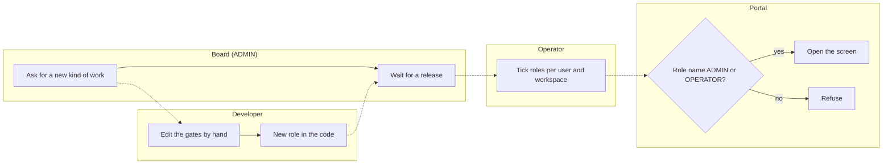
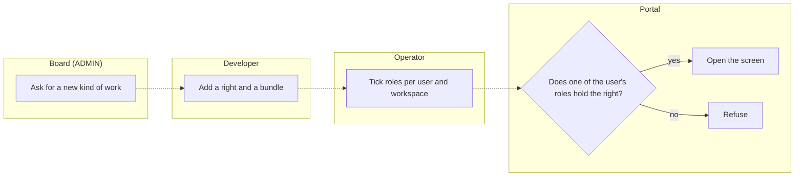
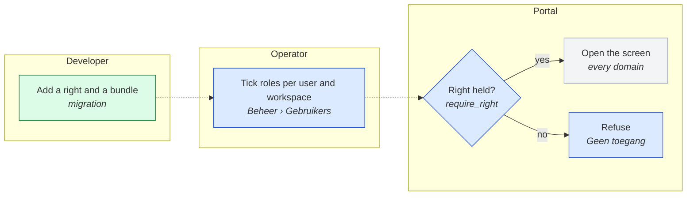
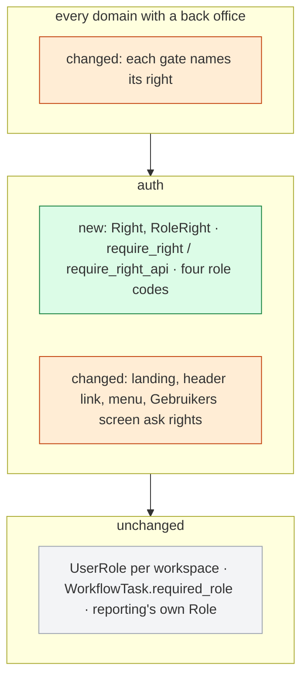
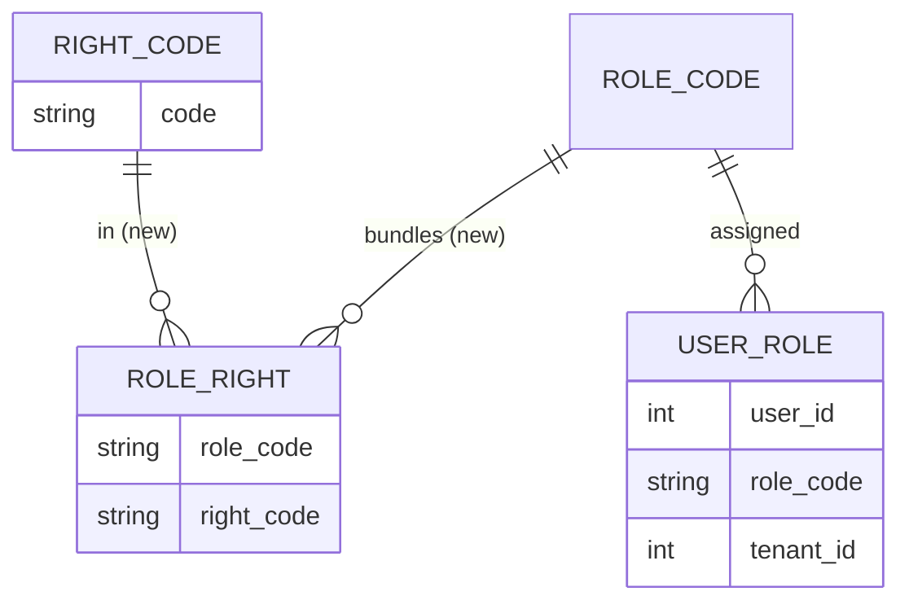

# Change Request 24 — Rights, part 1: the code asks for a right, a role is a bundle

**Project:** Web Portal "Raak Millegem"
**Status:** opened on 7 October 2026 · Parts A, B and C written; build read by desktop-dev1 on #1722 taken in (8 October 2026); B8 empty (Q12–Q14 answered 8 October 2026); architecture review on #1722 taken in (8 October 2026); Q15–Q16 answered; B8 empty; assigned to v2.16 by Koen (8 October 2026), after CR-13 4b in the same release · nothing is built; not on a release
**Tracking issue:** #1722 — the one place where what is open stands; this document is the design, the issue is the status
**Applies to:** auth (roles, rights, the gates), every back-office route's gate; part 2 is CR-25 (the back office: menu, Bestuur, workbench, business partners)
**Reading:** A 1710 words · B 2464 (the decisions log excluded) · C 2802 — re-measured on 8 October 2026 without drawings and notes; the budget is A ≤ 1 500, B ≤ 2 500: A is over by 210, the requirements in Koen's words

---

# Part A — The business

## A1. Reason to act — the trigger

Shaping the webshop (CR-21) and accounts (CR-22) on 6 and 7 October 2026 added four roles and a screen "Personen", and Koen asked how roles and rights over members, persons, accounts, organisations, products and memberships should be organised "to be well future-proof" — in the back office.

Today a screen checks role names: `require_admin_ui` lets ADMIN and OPERATOR in, `_require_finance` FINANCE and OPERATOR (`docs/rollen-en-rechten.md`). ADMIN both reads and changes nearly everything; every new role means editing the gates by hand; a company with another division of work cannot be served without code. Koen's view of ADMIN is different: the board reads everything and does no advanced work. And the organisations a tenant buys from and sells to — customers, suppliers — cannot be managed inside a tenant at all: organisations are the platform's own structure, managed by the operator.

## A2. As-is process — how it works today, and where it hurts

> [!NOTE]
> *How the work is done today, by whom, with which tools and material.*
> *Measured where possible: how often, how long, how many. Name the pain per*
> *step. Two forms, both: a **process drawing** and a **step table** with the*
> *pain column.*
>
> *The drawing is a Mermaid flowchart that follows BPMN Level 1 as Bruce*
> *Silver's "Method and Style" defines it. The Level 1 palette, in Mermaid:*
> *one `subgraph` per actor as its lane (member, organiser, treasurer, the*
> *portal), in the same order in A2 and A3 so the difference is visible; a*
> *rectangle per activity, labelled verb + noun ("Register", "Send link");*
> *one start circle and one named end circle per outcome ("Registered",*
> *"Refused"); a diamond for an exclusive gateway with its question inside*
> *and the answers on the arrows; a dashed arrow for a message between*
> *lanes; at most fifteen activities per drawing — more becomes a subprocess*
> *in its own drawing. No intermediate events, no timers, no data objects:*
> *Level 1 stops there on purpose. Under every drawing, one line that says*
> *what to see in it.*

*What to see: every screen asks for a role by name, so a new kind of work is a code change, not a setting.*

| # | Step | Who | Tool | Pain |
|---|---|---|---|---|
| 1 | Assign roles to a user, per workspace | Operator, ADMIN | Beheer › Gebruikers | four roles only: ADMIN, FINANCE, OPERATOR, ACCOUNT_ADMIN (unused) |
| 2 | Open a back-office screen | every user | the portal | the screen asks "ADMIN or OPERATOR?": ADMIN may change nearly everything; FINANCE sees only payments |
| 3 | Add a kind of work (the webshop's four roles) | developer | the code | ≈ 380 gates name roles; every new role means editing them by hand (C1) |
| 4 | Read who may do what | anyone | `docs/rollen-en-rechten.md` | already stale on master (C1) |
| 5 | Follow a task for Boekhouding | FINANCE | Werkbank | the workbench makes tasks for FINANCE (`workflow/handlers.py:114, 161`) that a user with only FINANCE cannot open: the workbench is behind `require_admin_ui` (`workflow/ui.py:114`) — measured by the build read, #1722 |

## A3. To-be process — how it should work afterwards

> [!NOTE]
> *How the work should go afterwards: the same drawing and table as A2, the*
> *same lanes in the same order, so the difference is what the eye finds.*
> *Still no components: "the portal renders the poster", not "WeasyPrint*
> *renders the poster". A step that disappears, moves lane or turns into a*
> *choice is the change — name it under the drawing in one line each.*
>
> *The words the user will read are decided here, not in Part C: the name*
> *of a button, a page title, a tile label, a menu item — one short list,*
> *"what it says on the screen", in the user's language and never the*
> *domain's pet word.*

*What to see: the screen asks for a right; a role is a bundle of rights. For the users nothing changes on the day itself (R7); the Gebruikers screen offers four more roles.*

- Step 2 changes inside the portal only: the same people open the same screens.
- Step 3 becomes "add a right, put it in a bundle": a gate is never edited for a new role again.
- Step 4 is rewritten from the bundles, so it can no longer drift from the code.

**What it says on the screen**

| Where | Word |
|---|---|
| Beheer › Gebruikers, the roles to tick | Beheerder (ADMIN) · **Boekhouding** (FINANCE; today's label Penningmeester, renamed in part 1 — a label, not a reach, Q8) · OPERATOR · **Masterdata · Prijsbeheer · Verkoop · Voorraadbeheer** |

The labels come from the code list `auth.role_labels` (`auth/codes.py:18-19`, measured on master `25c74f60`).

## A4. Benefits — what the change earns

> [!NOTE]
> *The business side of the decision: what this change earns, in the*
> *measures the association counts in — hours of volunteer work saved per*
> *activity or per year, mistakes avoided, money collected sooner or not*
> *lost, members who would otherwise drop out, a process that becomes*
> *possible at all. One line per benefit, with the figure where it can be*
> *estimated and the reason where it cannot; a benefit that only the*
> *solution can name does not belong here. Set against the cost of B5, this*
> *is what says whether the change is worth doing, and when.*

| # | Benefit | Figure |
|---|---|---|
| 1 | The webshop's roles exist, so CR-21 can be built on them | four roles |
| 2 | Member administration can be given to someone who is not the board: Masterdata manages persons, households and memberships without being ADMIN | — |
| 3 | A new kind of work costs a right and a bundle, not ≈ 380 gates edited by hand | ≈ 380 gates (C1) |
| 4 | Part 2 (Bestuur, the redistribution of work) becomes a change of bundles and assignments, not of code | — |
| 5 | Who may do what is written in one place, readable, and no longer drifts | — |

## A5. Supplied material — and what it taught us

> [!NOTE]
> *What the business handed over to start from — brand guides, examples,*
> *photos, spreadsheets, briefs — with where it lives (described in words or*
> *by file name; never a local path, never in the repository when it holds*
> *personal data or brand assets). What was learnt from it goes here too, as*
> *measurements: "four example posters; none has a bleed". Do not forget the*
> *reporting need: must something be counted, listed, exported or printed*
> *afterwards, for whom, in which form? If so, it is a requirement in A6; if*
> *not, A6 says so in one row.*

| Material | Where | What it taught us |
|---|---|---|
| `docs/rollen-en-rechten.md` | the repository | stale on master in five places (C1); this change rewrites it from the bundles |
| Koen's description of the roles, 7 October 2026 | this chat, B9 | the end state is part 2 (CR-25); part 1 is the mechanism and the shop's roles |

**Reporting need:** none.

## A6. Business requirements — what the board asks, with MoSCoW

> [!NOTE]
> *One table. Each requirement is a sentence a board member would say, with a*
> *MoSCoW class. Numbered, so Part B, Part C and the acceptance criteria can*
> *point at them.*

| # | Requirement | MoSCoW | Source | Comment |
|---|---|---|---|---|
| R1 | A right is about changing one kind of object; the code asks for the right, never for a role's name. | Must | Koen, 7 Oct 2026 | |
| R2 | Everyone reads everything — *moved to part 2* (CR-25 R7, Q7). | — | Koen, 7 Oct 2026 | |
| R3 | A role is a bundle of rights, kept as data per workspace; one user may hold several. | Must | Koen, 7 Oct 2026 | |
| R4 | The roles of part 1: today's ADMIN, FINANCE (on screen Boekhouding) and OPERATOR, each as a bundle with exactly the rights it has today; and the new roles the webshop needs — Masterdata, Prijsbeheer, Verkoop, Voorraadbeheer (CR-21). Bestuur (`BOARD`) and the other changing roles come in part 2 (CR-25). | Must | Koen, 7 Oct 2026 (Q4) | |
| R5 | Masterdata changes the master data: persons (deleting and merging included), households, memberships — member administration (validity; whether a renewal is paid stays with Boekhouding) —, the legal identity of organisations (official name, legal form, enterprise and VAT number, registered address, bank accounts, payment terms) and the product portfolio. Relatiebeheer, which changes only the commercial relationship with organisations, comes in part 2 with the business partners (CR-25). | Must | Koen, 7 Oct 2026 (Q3, Q5) | member administration is master data (Q3); the split of a master-data team and account managers is completed in part 2 |
| R13 | Master data has two rights — the legal data of persons and organisations (`party.masterdata`), the product portfolio (`product.masterdata`) — and one standard role, Masterdata, that holds both; a company with two teams makes two bundles without code. | Must | Koen, 7 Oct 2026 (Q2) | as an ERP separates business partner and material master |
| R7 | Nobody's reach changes on the day part 1 goes live — neither what he may change nor what he may read: every existing user keeps exactly what he has today, with one deliberate exception: Boekhouding (FINANCE) may open the workbench, where it sees the tasks of its own role (Q11); the gates ask rights, the bundles give them. The reach does change, deliberately, in part 2: ADMIN becomes Bestuur (reading only) and each user gets the roles for his own work. | Must | Koen, 7 Oct 2026 (Q4, Q7) | two steps: part 1 small and testable without anyone noticing; the redistribution a step of its own, user by user |
| R10 | Reading restrictions for the social tariff — *Won't now*, see Non-goals. | Won't | Koen, 7 Oct 2026 | |
| R11 | Accountbeheer (`ACCOUNT_ADMIN`) — *Won't now*, see Non-goals. | Won't | Koen, 7 Oct 2026 | |
| R14 | A screen to compose roles from rights — *Won't now* (Q6), see Non-goals. | Won't | Koen, 7 Oct 2026 | |

MoSCoW: **Must** (without it the change is worthless), **Should** (important,
but the change ships without it), **Could** (nice, if cheap), **Won't** (asked
and deliberately not done — recorded so it is not asked again).

## A7. Non-functional requirements — security, privacy, house style, tenants

> [!NOTE]
> *The requirements every change request is tested against, each answered*
> *explicitly at business level, "not applicable" included. How they are met*
> *belongs in Part C (C5):*

| Concern | This change |
|---|---|
| **Security** — who may do what; new inputs from outside; secrets | This *is* access control: every gate is rewritten, so every gate is tested before and after with the same users (R7). A user without a right is refused as today. No new input from outside, no secrets. |
| **Privacy** — personal data: what, where, who sees it, what leaves the system | Nobody sees more than today (R7), except Boekhouding, which opens the workbench and sees there only the tasks of its own role, as the workbench filters today (#674, Q11). Masterdata is a new role that reads and changes persons, households and memberships — given only to whom a board chooses. Nothing leaves the system. |
| **House style / UI norm** — `docs/design-system.md`; brand rules | One visible change: four more roles to tick in Beheer › Gebruikers, with their Dutch names. |
| **Multi-tenant** — what differs per unit, what is platform-wide | Roles stay per workspace, as today (#963). The bundles are the same in every workspace; composing them per workspace is for later (R14). OPERATOR stays platform-wide. |

## A8. Acceptance criteria — what the business signs off on HDEV

> [!NOTE]
> *Criteria the business signs off on, each testable by a person on HDEV*
> *without reading code, each pointing at a requirement and at the steps of*
> *the walkthrough (B2) that show it. These are the business's unit tests;*
> *the developer's tests live in Part C.*

| # | Criterion | Requirement | Walkthrough steps |
|---|---|---|---|
| AC1 | A user with ADMIN opens, changes and is refused exactly what he could before the release, checked on a list of screens one per menu group. | R7 | B2, to come |
| AC2 | A user with only Boekhouding sees and confirms payments as before, and is refused the activity and member screens as before; he now opens the workbench and sees only tasks for Boekhouding. | R7 | B2, to come |
| AC3 | An Operator reaches everything as before, the platform screens included. | R7 | B2, to come |
| AC4 | In Beheer › Gebruikers, the four new roles can be ticked per workspace. | R4 | B2, to come |
| AC5 | A user with only Masterdata manages persons, households and memberships, and is refused activities, payments and settings. Masterdata also holds the right on products (`product.masterdata`, R13); the product screens arrive with CR-21, where its AC2 checks it. | R5, R13 | B2, to come |
| AC6 | A user with only Prijsbeheer, Verkoop or Voorraadbeheer reaches no existing back-office screen except the workbench (their screens come with CR-21). | R4, R7 | B2, to come |
| AC7 | `docs/rollen-en-rechten.md` matches what AC1–AC6 showed. | R3 | B2, to come |

---

# Part B — The solution, for whoever approves it

> [!NOTE]
> *Part B is read by the people who say "yes, build this": Koen, the*
> *analyst, the architect. It answers four questions — what is the solution,*
> *does it fit our process and our requirements, how does it hang together*
> *across the modules and what does it touch, what does it cost and in which*
> *steps does it arrive — and it ends with what is still theirs to decide.*
> *Reasoning in depth, mechanics and per-module detail go to Part C; Part B*
> *names the decision and the rejected alternative ("Rejected alternative: …"), in five lines at most.*

## B1. Solution outline — the solution and the decisions that shape it

> [!NOTE]
> *The solution in one paragraph; then the decisions that shape it, one*
> *bullet each of at most five lines: the decision, the rejected alternative that
> *lost, why (Europe First named where a tool or service is chosen). The*
> *full reasoning behind each decision is C4, which points back here. Then*
> *the **derived requirements** (F1, F2, …) in one table, traced to A6: the*
> *finer-grained requirements the solution answers — design work by the*
> *analyst, which is why they are not in Part A.*

Every gate asks for a **right** instead of a role name. A right is a code in a code list (`auth.right_codes`, labels per language); a role is a **bundle** of rights, kept as rows (`auth.role_rights`) seeded by a migration and the same in every workspace; users keep getting roles per workspace as today (`auth.user_roles`). One gate function replaces the role-named ones: `require_right(code)` for the screens and `require_right_api(code)` for the JSON API. A user holds a right in a workspace when one of his roles there bundles it. The bundles of ADMIN, FINANCE and OPERATOR are written so that each holds exactly what its role opens today (R7); four roles are added: MASTERDATA, PRICING, SALES, STOCK, with the Dutch labels of A3.

- **D1 — Per kind of object two rights: viewing and changing (Q15).** A route that only reads (GET, HEAD) asks `<object>.view`; a route that changes (POST, PUT, PATCH, DELETE) asks `<object>.manage` (for master data `party.masterdata`, `product.masterdata`). Every bundle that holds a changing right also holds its viewing right, so nobody's reach changes (R7). Part 2's "everyone reads everything" (CR-25 R7) and the payment restriction of R10 then become rows in the bundles, no code. Rejected: one right for opening and changing — part 2 would touch the ≈ 300 gates a second time; a right per screen — some 280 rights, unreadable as bundles; a right per menu group — too coarse for the roles of part 2.
- **D2 — Bundles are data, fixed by migration.** No screen composes them (R14); a later screen edits the same rows. Rejected: bundles in code — the screen of R14 would then need a rebuild.
- **D3 — The old gate names disappear, not alias.** Each call site names its right; a gate refuses role names in code from then on (B7). Rejected: `require_admin_ui` kept as an alias for a bundle — the 280 sites would keep saying "admin" while meaning something else.
- **D4 — Workbench tasks keep their role** (`required_role`) in part 1; the workbench per role is part 2.

**The rights of part 1** — the table shows the changing right per kind of object; each row also has its viewing right `<object>.view` (`party.view`, `product.view`, … ; `payment.view` already exists), held by the same bundles (D1, Q15). With `assistant.use` and `workbench.use`, which have no changing counterpart, that is about 35 codes.

| Right | What it opens today (C1) | ADMIN | FINANCE | OPERATOR | MASTERDATA | PRICING | SALES | STOCK |
|---|---|---|---|---|---|---|---|---|
| `activity.manage` | activities, registrations | ✓ | | ✓ | | | | |
| `form.manage` | forms, submissions | ✓ | | ✓ | | | | |
| `page.manage` | pages (cms), the site's menu | ✓ | | ✓ | | | | |
| `media.manage` | media library | ✓ | | ✓ | | | | |
| `design.manage` | Design Studio | ✓ | | ✓ | | | | |
| `newsletter.manage` | newsletters | ✓ | | ✓ | | | | |
| `meeting.manage` | meetings | ✓ | | ✓ | | | | |
| `report.manage` | reports | ✓ | | ✓ | | | | |
| `assistant.use` | Raakje in the back office (using it) | ✓ | | ✓ | | | | |
| `party.masterdata` | persons, households, memberships, organisations' legal data, imports | ✓ | | ✓ | ✓ | | | |
| `product.masterdata` | products (CR-21) | | | ✓ | ✓ | | | |
| `price.manage` | prices (CR-21) | | | ✓ | | ✓ | | |
| `sales.manage` | orders (CR-21) | | | ✓ | | | ✓ | |
| `stock.manage` | stock (CR-21) | | | ✓ | | | | ✓ |
| `payment.view` | payments, claims | ✓ | ✓ | ✓ | | | | |
| `payment.manage` | confirm, refund (#83) | | ✓ | ✓ | | | | |
| `workbench.use` | the workbench (today behind `require_admin_ui`, `workflow/ui.py:114`) | ✓ | ✓ *(new, Q11)* | ✓ | ✓ | ✓ | ✓ | ✓ |
| `user.manage` | users and their roles | ✓ | | ✓ | | | | |
| `settings.manage` | settings, changes, e-mail log, API keys; the assistant's own screens (`chatbot/admin_ui.py`: Raakje's context, the AI costs) and the JSON routes behind them (`chatbot/info_router.py`); audit's routes (`audit/router.py:21, 34, 56`, the member-data export among them) | ✓ | | ✓ | | | | |
| `platform.manage` | tenants, organisations of the platform | | | ✓ | | | | |

The table follows today's five sets, which *are* the bundles already: `_GENERAL_ADMIN_ROLES = {ADMIN, OPERATOR}`, `_PAYMENTS_VIEW_ROLES = {ADMIN, FINANCE, OPERATOR}`, `_PAYMENTS_MUTATE_ROLES = {FINANCE, OPERATOR}` (`auth/session.py:115-119`) and `require_roles(*codes)`, which adds OPERATOR to every set (`auth/service.py:149-191`, `:163`), with `get_current_admin`, `get_current_finance`, `get_finance_or_admin` built on it — laid against the table by the build read (#1722, A3), they agree. The proof is F1, the before-and-after list per gate, which decides every row where a gate turns out to admit other roles than its name says. ACCOUNT_ADMIN keeps an empty bundle (R11). The rows marked CR-21 open nothing until CR-21 builds their screens.

**Derived requirements**

| F | Requirement | From |
|---|---|---|
| F1 | Before the change, a list records for every gate which roles pass it; after, the same list is computed from the bundles; the two are equal for ADMIN, FINANCE, OPERATOR and ACCOUNT_ADMIN, the workbench for FINANCE being the one listed difference (Q11), and its landing following from it (Q13). | R7 |
| F2 | The landing after sign-in, the header link to the back office and the menu ask rights, with the same outcome per user as today — except Boekhouding, which now lands on the workbench (Q13) and sees the header link (Q16): one rule, everyone with a back-office role. | R7 |
| F3 | A user with roles in two workspaces holds in each only the rights of his roles there. | R3 |
| F4 | `docs/rollen-en-rechten.md` is generated from the bundles, or checked against them by a test. | A2 step 4 |
| F5 | The label of FINANCE reads Boekhouding. | Q8 |
| F6 | The role questions outside the gates answer the same per role before and after: `may_view_payments` in services (`activities/service.py:2885, 2944`, `mdm/service.py:1221`), `may_mutate_payments` for the payment buttons (`payment/ui.py:655, 1065`, `mdm/ui.py:395`, `activities/admin_ui.py:1702`, `payment/viewmodels.py:93, 140`, `_bt_boeking.html:51`), `may_use_admin_assistant` (`reporting/admin_ui.py:924`), the header's `is_admin` (`ui/__init__.py:953`, `_site_account.html:21`), the role list handed to the menu (`payment/ui.py:861, 885, 919, 947, 1178`, `ui/no_access.py:76`), and the role list handed to the workbench's filter (`workflow/ui.py:26`, kept by D4). | R7, #1722 A2 |
| F7 | The JSON answer keeps its fields `is_admin` and `is_finance` (`schemas/auth.py:33-34`, `auth/router.py:133-134`) with exactly today's definition, **from `roles`, not from rights**: `is_finance = Role.FINANCE in roles` (false for OPERATOR today; `payment.manage` would make it true), `is_admin` = ADMIN or OPERATOR in roles. They are a convenience of the `roles` field the same answer carries; their two `Role.<member>` uses stay in B7's baseline (#1722, architecture review 3). | R7 |
| F8 | The platform screens keep their workspace condition beside the right: `platform.manage` **and** the platform workspace, as `require_platform_operator_ui` is today (`auth/session.py:247-256`); `require_tenant_workspace` stays, it is no role gate. | R7, #1722 D |
| F9 | The `Role` enum gains MASTERDATA, PRICING, SALES, STOCK in the same change as the migration: both role columns are read through `EnumColumn(Role)`, and a stored code that is no member raises on read (`kernel/codes.py:291-301`). | #1722 F |

## B2. Fit with the process and the requirements — for the business

> [!NOTE]
> *Three things. First, the **application usage drawing**: the to-be process*
> *of A3 once more — same lanes, same activities — with, in every activity*
> *box, a second line naming the screen or module that serves it, the box*
> *coloured per module (`classDef`, one legend line). Every step has a home*
> *or is marked "outside the portal"; a module no step uses is not part of*
> *this change. Two audiences (those who set up, those who use) means two*
> *drawings. Second, the **traceability matrix** — the one place where a*
> *requirement's thread is followed from left to right, so it is kept*
> *nowhere else: one row per requirement of A6 — R · how the solution meets*
> *it, in the words of the role that will see it · the derived requirements*
> *(F, B1) · the module that builds it (C2) · the test that proves it (C6) ·*
> *the acceptance criterion the business checks (A8). An empty cell is a*
> *finding: a requirement without a test, a test without a requirement. A*
> *Won't gets a row that says so. Third, the **walkthrough** — how the*
> *business tests this on HDEV: one numbered script per role of A3, in the*
> *order of the to-be process, happy path first and then the turns where it*
> *must refuse or fall back; each step names what to do and what to see —*
> *nothing else, it is a script. A8's last column names the steps that show*
> *each criterion; every criterion has at least one step. The closing*
> *comment of each issue points at the walkthrough instead of rewriting it.*

**Application usage drawing** — the to-be process of A3 with the place that serves each step.

*Legend: blue `auth` · grey every domain, its gate changed only · green a migration.*

**Traceability matrix**

| R | How the solution meets it | F | Module | Test | AC |
|---|---|---|---|---|---|
| R1 | Gates name rights; a gate refuses role names (B7) | — | auth, every domain | T1, T5 | AC1 |
| R2 | Moved to part 2 | — | — | — | — |
| R3 | Bundles as rows, roles per workspace | F3 | auth | T2 | AC4 |
| R4 | Four roles and their bundles; Boekhouding label | F5 | auth | T3 | AC4, AC6 |
| R5, R13 | MASTERDATA holds `party.masterdata` and `product.masterdata` | — | auth, mdm, membership | T4 | AC5 |
| R7 | Before-and-after list of every gate per role | F1, F2 | auth, every domain | T1 | AC1–AC3 |
| R10, R11, R14 | Won't — the rows of `role_rights` leave room | — | — | — | — |

**Walkthrough on HDEV**

*Before the release, on HDEV with the previous tag* — W1 Write down, for a user with ADMIN, one with only Penningmeester and one Operator, which of these screens open: Activiteiten, Leden, Betalingen (and "Bevestig betaald"), Formulieren, Pagina's, Gebruikers, Instellingen, Tenants.

*After the release* — W2 The same three users, the same screens: the same outcome as W1, except that Boekhouding now opens the workbench (Q11); the role reads Boekhouding. W3 Beheer › Gebruikers: tick Masterdata for a new user in Raak's workspace; the four new roles are offered. W4 Sign in as that user: Leden, Gezinnen and Lidmaatschappen open and can be changed; Activiteiten, Betalingen and Instellingen refuse. W5 Tick only Verkoop for another user: no existing back-office screen opens; the workbench does. W6 Read `docs/rollen-en-rechten.md`: it matches W2–W5.

## B3. The whole across the modules — for the architect

> [!NOTE]
> *The **application structure drawing**: one subgraph per module touched,*
> *inside it a box per layer (screen · view-model · service · entity ·*
> *facade · migration · template) — a separate box for what is **new** and*
> *for what is **changed** in that layer, and one grey box for what is only*
> *used. Here the colour is the kind of change, not the module: green new,*
> *orange changed, grey unchanged. One legend line. Arrows between modules*
> *only through a facade (`api.py`), as the import gate enforces; external*
> *systems and data stores as their own boxes. Then the **data model at a*
> *glance**: a Mermaid `erDiagram` of the entities involved with their key*
> *columns and relationships, cardinality on the edges, soft references*
> *across schemas drawn as relationships too, and what is new or changed*
> *marked in the label. Under it, in at most two hundred words: who calls*
> *whom and through which facade, the direction of every new dependency,*
> *the transaction boundary, and the **impact on the existing*
> *architecture** — which existing modules, tables, screens and contracts*
> *are touched, and how the layer rules (`docs/code-style.md`, the import*
> *gate) hold. This is where a reviewer checks that the change does not*
> *bend the architecture; the per-module detail is C2.*

*Legend: green new · orange changed · grey unchanged.*

Every domain already imports its gates from `app.domains.auth.api`; it keeps doing so, with one function instead of six. `auth` reads `user_roles` and `role_rights` in one query per request. No new dependency between domains; no transaction changes. Impact: every back-office route's dependency line (≈ 380 call sites, C1), the role-set and role-model gates, the 64 test files that build users with ADMIN. `reporting.universe.Role` is another enum and stays apart (Non-goal).

## B4. Rules this change needs an exception from — decided once, here

> [!NOTE]
> *Every existing rule, gate or fixed decision the design breaks or bends:*
> *the rule by name and place (`CLAUDE.md`, `docs/code-style.md`,*
> *`docs/architecture.md` §…, a gate in `backend/tests/`), what the design*
> *does instead, the mechanism (a named baseline entry, a widened gate, a*
> *replaced fixed UI decision), and whether the exception is temporary (with*
> *what ends it) or the new rule. One table; "none" is an answer, with the*
> *gates that were checked to say so. The approver decides each row at the*
> *handover — once. CR-14 needed an exception from the cross-domain call rule*
> *and nobody had written it down: the gate found it, the master CLI asked*
> *six times, and the third case became a change request of its own.*

| Rule (where) | What the design does instead | Mechanism | Temporary until … / the new rule | Decided |
|---|---|---|---|---|
| The role set is exactly ADMIN, FINANCE, OPERATOR, ACCOUNT_ADMIN (`tests/test_role_set_gate.py`, `mdm/tests/test_codes_phase2.py`) | eight roles | the gates' expected sets grow by the four new codes | the new rule | Koen, at the handover |

Checked and not bent: the import gate, the layer gate, the Dutch-identifier ratchet (new code English), "money mutation is narrower than viewing" (#83 — kept as `payment.view` and `payment.manage`).

## B5. Cost — investment and running cost, and what operations must know

> [!NOTE]
> *Three parts, each with a figure or "none". **Investment:** one table,*
> *module × phase, with the effort to build in CLI-days or person-days (S /*
> *M / L until the team has a track record), a total per module and per*
> *phase; then analysis, review, validation on HDEV and the release steps;*
> *then one-off purchases (a licence, a product, a device). **Running*
> *cost:** what it costs per month or per year once live — usage rights and*
> *paid services (per use and per month, measured where a prototype exists),*
> *storage and backups, hosting, and the maintenance it adds (a job to watch,*
> *a certificate to renew, a dependency to keep current). **Operations:***
> *settings, env vars, limits, kill switch, backups — what the person running*
> *the stack must know. Set beside the benefits of A4: the two together are*
> *the input for the release decision.*

**Investment:** auth (rights, bundles, gates, landing, menu, Gebruikers screen): M. The call sites, domain by domain: L — mechanical, ≈ 380 lines. The before-and-after list (F1) and the gate (B7): S. Total ≈ 8 CLI-days, plus the build read, review and Koen's walkthrough. No purchases.

**Running cost:** none.

**Operations:** one migration (codes, labels, bundles). No env vars, no kill switch: a wrong bundle is fixed by a migration.

## B6. Phasing — shippable phases, and what changes on the failure paths

> [!NOTE]
> *Shippable phases, each with what it delivers and its dependencies, one*
> *row per phase: issue · migration · env vars · data · failure paths that*
> *change · manual validation. The "Na de merge" block per phase names what*
> *CI cannot see. The column **failure paths that change** exists because a*
> *change that reorganises behaviour — where a rule lives, who commits, what*
> *a handler does — rarely changes what the system does on the happy path,*
> *and almost always changes what it does when something fails: what rolls*
> *back, what is refused, what is left half done. Name those per phase, so*
> *"no functional change" is a claim about the happy path with the failure*
> *paths listed beside it. "None" is an answer. Dependencies on other change*
> *requests are named per phase, so the approver can order them.*

| Phase | Delivers | Migration | Env vars | Data | Failure paths that change | Manual validation |
|---|---|---|---|---|---|---|
| 1 — one release | rights, bundles, four roles, every gate on a right, Boekhouding label, the roles document | right codes and labels, role codes MASTERDATA, PRICING, SALES, STOCK, `role_rights` | none | the bundles, by the migration | a user whose roles bundle no right is refused where he was refused before; a request to a screen whose right is unknown fails closed | W1–W6 |

**Failure path that changes** (#1722, architecture review 6): a POST with a bad body to one of the 22 routes whose gate moves from the body into a dependency answered 422 before the gate; it now answers 403 first to a user without the right. Harmless. **Rollback** (#1722 F): to the previous image after someone was given one of the four new roles, reading that user's roles raises (the old enum lacks the code). The recovery is to delete those `user_roles` rows before the rollback, or to roll forward; the "Na de merge" block names it. One phase: a half-converted set of gates is the state D3 forbids. It can still arrive as one pull request per domain on a branch, merged together. **Dependencies and release:** **in v2.16, after CR-13 phase 4b** (the pruning of the JSON routes without a caller, #1251), as Koen assigned it on 8 October 2026 ("ik zou deze ook in v2.16 willen doen, na de JSON-sweep"); 4c and 4d of CR-13 are not bound to that order. This replaces the reading "after v2.16, CR-13 phase 4 complete" written in after the architecture review (#1722, item 5), which Koen's assignment overtook (Mistral review, item 1). Why after 4b: of ≈ 88 JSON routes gated by a role name (`get_current_admin`, `get_current_finance`, `get_finance_or_admin`, `require_roles`), ≈ 86 are in `JSON_ROUTE_WITHOUT_CALLER` (124 entries, `tests/rules_baseline.py:42`; approximate path match on `35a109fc`); pruned first, they leave CR-24 ≈ 80 call sites fewer and shorten C4.1's list. The premise counts of C1 (356 gates, 35 literals) are stale by design after 4b: the build re-measures them on its first day, on the tree it finds. CR-21 phase 0 follows CR-24 in the same release; CR-25 builds on it.

## B7. Rule and gatekeeper — what this fixes for all future work

> [!NOTE]
> *An architectural change request fixes a way of doing things, not just one*
> *instance of it. Here, for the approver: **the rule** in one sentence a*
> *reviewer can apply, in the form the decision takes from now on, and where*
> *it ends up (`CLAUDE.md`, `docs/code-style.md`, the architecture document,*
> *the design system); **the reach and the baseline** — where it applies and*
> *how many places violate it today, measured on the branch, and to what*
> *this change brings that number; and in one line whether the gate is a*
> *ratchet or hard. The gate itself — what it looks at, its message, the*
> *violation it was proven with — is C7. "No gate" is an answer, with the*
> *reason and what catches it instead, written down as the weaker guarantee*
> *it is.*

**The rule:** a gate names a right, never a role; a role is only a bundle. It goes into `docs/code-style.md` and replaces the role table of `docs/rollen-en-rechten.md` with the bundles.

**Reach and baseline:** measured on master `1b3237b1` and confirmed on `6854bee1` by the build read (#1722 B): **35** role-name string literals in nine files outside `auth/codes.py`, `auth/models.py`, tests and migrations (the shaping counted 31), 3 uses of `Role.<member>`, and the role-named gate functions. The ratchet counts string literals and `Role.<member>` in Python **and** role names in template expressions (`_gu_rollen_velden.html:22, 28` hard-codes OPERATOR); it does not count copy — the page headers "Platformbeheer — enkel OPERATOR" stay true and stay. This change brings the gate functions to zero and the literals to those that assign roles (seeds, the e2e seed). **Hard** for the gate functions, a **ratchet** for the literals.

## B8. Open decisions — what the approver still decides

> [!NOTE]
> *The questions that are still open, each with the author's recommendation*
> *and the difference the answer makes; numbered Q-entries, the same numbers*
> *as the Q&A log, so an answer moves the row from here to the log. This is*
> *the last thing the approver reads before saying yes; an empty section*
> *means the change request is ready to assign.*

| # | Question | Recommendation | What the answer changes |
|---|---|---|---|

## B9. Decisions log — dated answers

> [!NOTE]
> *Dated decisions of the business and of the architecture, one row each,*
> *with who decided. A decision taken during the build is added here with*
> *the date and marked "built as"; the text it contradicts gets an as-built*
> *note pointing here (C10).*

| Date | Decision | By |
|---|---|---|
| 7 Oct 2026 | Rights per object and action, only for changing; every role reads everything (R1, R2). | Koen |
| 7 Oct 2026 | "Relatiebeheer" and the menu group "Relaties" for persons, organisations, households and memberships — a word for associations and companies alike. | Koen |
| 7 Oct 2026 | ADMIN becomes Bestuur, code `BOARD`: reads everything, no advanced work. | Koen |
| 7 Oct 2026 | Penningmeester becomes Boekhouding on screen; the code stays `FINANCE`. | Koen |
| 7 Oct 2026 | Masterdata and Relatiebeheer split on the organisation (R5). | Koen |
| 7 Oct 2026 | Two master-data rights, one role Masterdata; Productbeheer (CR-21) is part of it (Q2). | Koen |
| 7 Oct 2026 | Member administration (households, memberships) is master data: role Masterdata; Relatiebeheer keeps only the commercial relationship with organisations (Q3). | Koen |
| 7 Oct 2026 | Split in two: part 1 (this CR) the mechanism — rights instead of role names, roles as bundles, the shop's roles, nobody's reach changing; part 2 (CR-25) the menu, Bestuur, the workbench per role and business partners. Part 1 before CR-21, part 2 after (Q4). | Koen |
| 7 Oct 2026 | Social tariff and Accountbeheer out of scope, their meaning recorded (R10, R11). | Koen |
| 7 Oct 2026 | Part 1 brings Masterdata with its two rights — member administration (persons, households, memberships) included; Relatiebeheer moves to part 2, with the business partners it works on (Q5). | Koen |
| 7 Oct 2026 | No screen to compose roles from rights: the bundles ship fixed and are assigned to users as today; composing them is for later (R14, Q6). | Koen |
| 7 Oct 2026 | Two steps: part 1 changes nobody's reach, reading included; part 2 redistributes the work — ADMIN becomes Bestuur, every user gets the roles for his own work, and "everyone reads everything" (R2) arrives there (Q7). | Koen |
| 7 Oct 2026 | The label Penningmeester becomes Boekhouding in part 1; the code stays `FINANCE` (Q8). | Koen |
| 7 Oct 2026 | MoSCoW confirmed: R1, R3, R4, R5, R7, R13 Must; R10, R11, R14 Won't (Q9). | Koen |
| 7 Oct 2026 | ADMIN gets no webshop rights in part 1; until part 2 brings reading for every role, a board member who must see orders also gets Verkoop (Q10). | Koen |
| 7 Oct 2026 | Boekhouding gets the workbench in part 1 — the one widening of part 1; it sees the tasks of its own role (Q11). | Koen |
| 8 Oct 2026 | Assigned by Koen to **v2.16**, after the JSON sweep of CR-13 phase 4 (4b), in the same release: "ik zou deze ook in v2.16 willen doen, na de JSON-sweep. Ik zou zelfs fase 0 van de webshop ook in deze release willen doen." | Koen |
| 8 Oct 2026 | Viewing and changing are separate rights already in part 1: `<object>.view` beside `<object>.manage`, each route classified by its method; every bundle holds both, so R7 holds and part 2 and R10 become bundle rows (Q15). The back-office link in the public header shows for everyone with a back-office role, Boekhouding included (Q16). Koen: "2 b en akkoord voor Q16". | Koen |
| 8 Oct 2026 | Everyone with a back-office role lands on the workbench after signing in, Boekhouding included; the exception that sent FINANCE-only to Betalingen goes (Q13). Koen: "KIS, iedereen op werkbank, code vereenvoudigen". | Koen |
| 8 Oct 2026 | The three refusal messages that name a role become one sentence: "Je hebt geen toegang tot deze actie." (Q12). Offered a (one general sentence), b (say what may not be done, without a role) and c (name the role with its new label), Koen chose a: "ik liet in agents.md 'KIS' zetten" — `AGENTS.md`, *Keep it simple*. | Koen |
| 8 Oct 2026 | CR-24 comes after the first step of CR-13 phase 4 — pruning the JSON routes without a caller (#1251), which removes ≈ 86 of the ≈ 88 role-gated JSON routes CR-24 would otherwise convert (B6). Asked "Zal ik in CR-24 noteren dat het na die opkuis komt, met deze meting erbij?", Koen answered "ja", and asked that the desktop brainstorm-architecture CLI have that step planned by the master CLI as v2.16, "te starten na deploy v2.15 naar prod" (Q14). Koen then decided, with the desktop brainstorm-architecture CLI, more widely: all of phase 4 (4b, 4c, 4d) is v2.16, 4b first (CR-13 B11, `b3c8df60`). | Koen |
| 9 Oct 2026 | **Slice 3, the core in auth, built as** (v2.16.0, #1722, pull request #1864, migration `201_2026_10_09_135402`): 36 right codes, the bundles as 78 rows written out in the migration and held by a test against B1's table, the four roles, FINANCE's label, `rights_of`, `may`, `require_right`. **Deviations from the text:** (1) `require_right_api` is not built — since CR-13 phase 4 (#1251) no JSON route asks for a role, so it would gate nothing (C2 row 1, C4.2 name it still); F7, `is_admin` / `is_finance` in a JSON answer, no longer exists either. (2) No cache "on the request": `rights_of(db, email)` has no request to cache on, and a cache on the session would outlive one — one query returns the whole set, as `get_user_roles` does; a caller that asks several rights keeps the set. (3) The two tests of `mdm/tests/test_codes_phase2.py` that hold the role set to the letter took the four codes in this slice, not in slice 6 (B4's exception). (4) From this merge on the four new roles can be ticked in Beheer › Gebruikers (the screen reads the active codes from the table); until slice 4 a user with only a new role sees nothing of the back office. The rollback note of B6 holds from this merge. | Master CLI (the two dev CLIs' reading against the code; no decision of Koen) |
| 9 Oct 2026 | **Slice 4, group (b), built as** (v2.16.0, #1722, pull request #1867): 121 routes in cms, media, designstudio, newsletter, meetings and forms ask `<object>.view` for a GET and `<object>.manage` for every other method; the snapshot of slice 1 is unchanged. **Deviation from the text:** the four Raakje routes inside a newsletter ask `newsletter.*` like the rest of that screen, not `assistant.use` — one right per domain, no exception; whoever may edit a newsletter may use Raakje in it. | Master CLI (dev1's reading; told to Koen on 9 October 2026, no decision of his) |
| 9 Oct 2026 | **Slice 4, group (a), built as** (v2.16.0, #1722, pull request #1868): 70 gates by method — activities 13 view / 18 manage, mdm with Personen 10 `party.view` / 15 `party.masterdata`, payment 7 view / 7 manage; seven role questions in services and screens ask `may(...)`; the snapshot of slice 1 is unchanged. **Deviations from the text:** (1) membership has no gate to convert — its role-gated routes left with #1251. (2) The seven payment mutations carry one gate, `payment.manage`, not view beside manage. (3) The 301 of the old "boek" address stays ungated. (4) The five `admin_nav(roles=…)` calls of `payment/ui.py` stay for slice 5. (5) In auth, `may` filters on the one right and reads one row, and the gate asks through it: slice 3's gate fetched the whole bundle and the activity page's query budget went from under 20 rows to 84; `rights_of` stays for the menu, both on one definition. (6) A payment mutation posted by hand without the right answers "Geen toegang" where it said "Alleen FINANCE mag betalingen wijzigen." — the gate names no role; the one sentence of Q12 is slice 5's. (7) The proof that every bundle holds view beside manage (`ON_A_RIGHT`) covers 191 routes, with a named set of four whose object is not their address's, and leaves the seven payment mutations out of its second half with the reason (ADMIN never holds `payment.manage`). | Master CLI (dev2's reading against the code; no decision of Koen) |
| 9 Oct 2026 | **Slice 4, group (c), built as** (v2.16.0, #1722, pull request #1869): 53 routes of reporting, the settings screens, users and the platform screens ask a right; `require_platform_operator_ui`, `require_operator_ui`, `_require_admin` and `may_use_admin_assistant` are gone, the platform gate is `require_platform_right`. **Deviations from the text:** (1) **a second named difference beside Q11**: on the eleven platform routes in a tenant workspace the right is asked first, then the workspace (F8), so ADMIN gets 403 where it got 404, on an address its menu does not show; OPERATOR keeps 404. Nobody's reach changes; eleven lines of the snapshot were recorded again, named by the test before the recording. (2) **Rights B1 did not name**, each admitting the roles of today: Gebruikers `user.view` / `user.manage`; Onze organisatie `party.view` / `party.masterdata` (the legal data of the organisation, R5 — MASTERDATA opens it, the one role added); Info and the design system `settings.view`; the Raakje routes under Rapporten `assistant.use`. (3) Opening a saved report writes `last_run_at` and asks `report.view`, not `report.manage` as C4.3a's method rule would give — built on the recommendation, **Koen's answer still open** on 9 October 2026. (4) The proof of which right a route asks is one test per right (27), walked as the operator, over 243 routes — every gated route except the nine that wait. (5) Nine routes still stand on `require_admin_ui` and wait for Koen's answers on the shell and the landing: five of the shell, four of the workbench. | Master CLI (dev1's reading against the code; the choice in (1) is the master CLI's, told to Koen on 9 October 2026, no decision of his) |
| 9 Oct 2026 | **Slice 6, the gate and the rule, built as** (v2.16.0, #1722, pull request #1870; the last step — removing auth's old names — follows after slice 5): `tests/test_rights_gate.py` and B7's rule as a section of `docs/code-style.md`. **Deviations from C7:** (1) the count the document gives as 35 + 3 is 28 on master of this date (25 literals, 3 `Role.<member>`, 0 in template expressions), in seven files, each with its reason; where the difference went was not traced one by one. (2) The ratchet counts all eight active role codes, not four; leaves out the two retired ones (ordinary words elsewhere); and counts `Role.<member>` only where auth's `Role` is imported — reporting has an enum of its own with that name. (3) The template B7 names (`_gu_rollen_velden.html`) holds OPERATOR as copy, not as a condition: not counted, and a real condition is refused. (4) The hard half carries `STILL_NAMED`, the exact and shrinking list of what is not finished; it goes with the last step, with `tests/test_role_set_gate.py` and the four names that have no caller left since slice 4 (`require_finance_ui`, `require_finance_mutation`, `may_view_payments`, `may_mutate_payments`). | Master CLI (dev2's reading against the code; no decision of Koen) |
| 9 Oct 2026 | **Slice 5, the screens and the copy, built as** (v2.16.0, #1722, pull request #1871), on Koen's three answers of this date (the landing "a"; the shell "b + betalingen uiteraard"; a report opened "a" — quoted with their options on #1722): no route asks a role any more. The four routes of the workbench, the account menu, the profile and the two GETs of switching workspace ask `workbench.use`; one way in for every back-office role, the workbench — the header link (Q16), the "geen toegang" page and the landing (Q13); the one refusal sentence of Q12; Gebruikers shows labels, not codes; `docs/rollen-en-rechten.md` is rendered from the bundles and the routes (`python -m app.domains.auth.docs`), held by a test. The snapshot changed on the lines named before the recording: eight routes in both workspaces "ADMIN OPERATOR → ADMIN FINANCE OPERATOR", and the way in. **Deviations from the text:** (1) the start page `/admin` asks `report.view` — B1 names no right for it; every tile's number comes from a saved report since #848, so ADMIN and OPERATOR see it and FINANCE does not, without a new right. (2) Switching workspace has no POST; two GETs. (3) The menu shows an item when the viewer holds the right that item's own screen asks — read from that screen's gate, no list of its own. (4) The gate asks through `rights_of` (one row, the whole set) so the menu costs no query of its own; `may` stays for the questions in services — this turns point (5) of the row of group (a) for the gate. (5) The brand link at the top of the back-office menu points to the workbench, not `/admin`, which now refuses Boekhouding and Masterdata; the Dashboard stays a menu item. **Seen, not built:** the profile and the overview of all workspaces still show a role by its code; a tenant with the workbench module off has a way in that answers 404; a task on the workbench can link to a screen its reader may not open. | Koen (the three answers); master CLI (the rest: dev1's reading against the code, told to Koen, no decision of his) |

---

# Part C — The build, for the master CLI and the dev CLIs

> [!NOTE]
> *Part C is read by whoever plans and builds. It is as long as it needs to*
> *be and it carries no decision Part B does not carry: a dev CLI that finds*
> *a decision missing here brings it to the master CLI, who brings it to the*
> *approver and records it in B9 — never a choice made in the code alone.*

## C1. Verified premises — measured before the handover

*Measured on master `f731a836`, 7 October 2026, before Part B is written. **Re-measured on master `1b3237b1`** the same day, before the build read: call sites (definitions, imports and tests excluded) `require_admin_ui` 232, `get_current_admin` 80, `require_finance_ui` 14, `require_platform_operator_ui` 11, `require_finance_mutation` 7, `get_current_finance` 4, `get_finance_or_admin` 4, `require_operator_ui` 2 — 354 gate calls by this count; **the build read counted 356 over the syntax tree (`require_admin_ui` 233, `get_current_admin` 82, `require_operator_ui` 1 — inside `require_platform_operator_ui`), identical on `6854bee1`, and 35 literals** (#1722 B). Of these, 22 are called **inside a handler** behind a wider dependency: `require_platform_operator_ui` 11 (`ui/tenants_ui.py:456, 475, 486, 505, 538`, `ui/organisaties_ui.py:201, 222, 242, 264, 281`, `auth/admin_ui.py:219`), `require_finance_mutation` 7 (`payment/ui.py:1228, 1245, 1272, 1303, 1332, 1350, 1370`), `_require_admin` 4 (`auth/admin_ui.py`, defined at `:31`). The table below stands; its counts are those of `f731a836`.*

**Readers of the concepts this change alters**

| Concept | What changes | Readers today (file:line) | Verdict |
|---|---|---|---|
| The gates that check role names (`auth/session.py:116-259`, `auth/service.py:93-191`) | become checks of a right | `require_admin_ui` **233** call sites (activities 31, meetings 30, newsletter 30, forms 25, mdm 22, designstudio 17, reporting 16, media 10, chatbot 8, cms 8, auth 6, workflow 4, mail 3, app/ui 23); `get_current_admin` ~82 (activities 19, membership 17, forms 9, media 9, auth 8, chatbot 7, cms 4, audit 3, mdm 2, mail 2, admin_api 2); `require_finance_ui` 14, `get_current_finance` 4, `get_finance_or_admin` 4, `require_finance_mutation` 8, `require_platform_operator_ui` 13, `require_tenant_workspace` 5; `may_mutate_payments`, `may_view_payments`, `may_use_admin_assistant`, `admits_admin_ui` (nav, header, landing, users) | ~380 call sites: the change is mostly mechanical, one gate per screen group; Part B decides whether the gates keep their names and map to rights, or are renamed |
| Inline role names | must disappear from logic | `auth/service.py:83` (`"FINANCE" in roles` decides the landing), `auth/router.py:134` (`is_finance`), `auth/session.py:240` (`"OPERATOR" not in`), `auth/admin_ui.py:117,127,144-145`, `auth/users.py:130,153-164,181`; workflow `handlers.py:114,135,161,177,208`, `api.py:37,198,278`, `models.py:125`; `ui/admin_api.py:27`; `mdm/import_service.py:967` (imported users get ADMIN); migrations 001, 014, 056, 072, 074, 082, 087, 107, 127; `seed_e2e.py` | each moves to a right or a role bundle; the migration that turns ADMIN into BOARD + changing roles must keep every existing user's reach (R7) |
| `reporting/universe.py:96` `Role` | not the same enum | its own ADMIN/FINANCE/MEMBER_DETAILS, 146 uses, "declared, not enforced" | must be kept apart or aligned in Part B, never mixed with `auth.Role` |
| `user_roles` (`auth/models.py:66`, migration 127) | roles become data bundles | per workspace (`tenant_id`, NULL = platform); assigned in `auth/users.py:119-181`, screen `auth/admin_ui.py:187-356`, `_gu_rollen_velden.html` (a checkbox per role per workspace) | the screen shows bundles; the matrix stays |
| `docs/rollen-en-rechten.md` | rewritten by this change | already stale on master: `_require_finance` and `_require_operator` no longer exist; "tenant config is OPERATOR-only" is wrong since #1535; no rows for Organisaties, Instellingen, meetings, newsletter, designstudio, reporting; "migration 126" is 127; landing without membership goes to "/" | rewritten as part of this change; until then, worth a small fix of its own |

**Readers of a role outside the gates** (#1722 A2) — listed in F6 and F7; each must answer the same per role after the change (T8).

**Tests that guard the old behaviour (likely red)** — 127 test files name a role, but only 10 name `require_admin_ui` and the suite has 2 `dependency_overrides`: the tests sign in with a real role and pass through the real gate, so with the bundles right nearly all stay green — a second, independent proof of R7 (#1722 E). Red by design: the files below that import a gate by name or assert the role set.
- Core: `tests/test_role_model_gates.py` (4), `tests/test_role_set_gate.py`, `tests/test_admin_users_authz.py` (4), `tests/integration/test_finance_role.py` (6), `tests/integration/test_rollen_per_werkruimte.py` (12), `tests/test_users_per_workspace.py` (3), `tests/test_no_access_page.py` (7), `auth/tests/test_one_back_office_role_set.py` (2), `auth/tests/test_back_office_link_for_an_operator.py` (4), `payment/tests/test_payment_treasurer_mutations.py`, `workflow/tests/test_werkbank_afgehandeld.py` (the role filter on closed tasks, #674).
- Wider: 64 test or conftest files use ADMIN, 52 OPERATOR; the `admin_headers` fixture (`tests/conftest.py:231`) relies on the admin of migration 014.

**Visitors and tenants walked (C3 list)** — board user with a person, board user without a person, FINANCE-only, OPERATOR without an ADMIN row (sees an empty workbench today), signed in at another workspace (roles are per workspace); tenant with members, company, platform (Organisaties and Tenants stay platform-only).

## C2. Per module: what must happen

> [!NOTE]
> *One subsection per module touched, in build order, each with the same*
> *five headings: **screens** (which, what changes, at which width it is*
> *judged), **code** (view-model · service · entity · facade — the functions*
> *by name, and **the named owner of every writer** to a shared table),*
> ***database** (schema, table, each column with its type, nullability and*
> *constraints, the `ON DELETE` of every FK, the migration and whether it is*
> *additive — and, for every column added to an entity that has a **copy**
> *action, whether the copy takes it along or not, and why: the gate of*
> *#1464 refuses an unclassified column, so the design decides it here and*
> *the gate only confirms it; `target_audience` was added to the activity*
> *and `copy_activity` silently left it out, #1463), **templates and mail**,*
> ***tests** (which of C6). No effort*
> *here: the effort per module and phase is the table of B5. Which*
> *requirements a module serves is read from the matrix of B2, not repeated*
> *here. A module that is only used, not changed, gets one line. **Reporting*
> *is always one of the modules**, touched or not: the engine reads the*
> *tables through SQL views in the `reporting` schema and through its object*
> *universe, so for every column this change adds, renames, retypes,*
> *retires or gives a new meaning, its subsection says which views and*
> *objects read it (measured, not recalled) and in which phase the view*
> *follows. "Reporting — none: no view reads these columns" is a subsection*
> *too.*

| Module | What must happen | Reads |
|---|---|---|
| **auth** | `Right` (`CodeEnum`) with the codes of B1 and a code list `auth.right_codes` + `auth.right_labels` (nl, en); `auth.role_rights` (`role_code` FK `auth.role_codes`, `right_code` FK `auth.right_codes`, PK both); the four role codes with labels; the label of FINANCE becomes "Boekhouding" / "Accounting". `rights_of(db, email) -> set[Right]` beside `get_user_roles` (`auth/service.py:93`), same workspace rule (#963), one query joining `user_roles` and `role_rights`, cached on the request. `require_right(code)` returns a dependency for screens with the behaviour of `_require_ui_roles` (`auth/session.py:135`: 303 to `/aanmelden?terug=` for a plain GET, 401 otherwise, 403 "Geen toegang"); `require_right_api(code)` the same for the bearer token of `get_current_admin`. `may(db, email, right)` replaces `may_view_payments`, `may_mutate_payments`, `may_use_admin_assistant`, `admits_admin_ui`. The landing (`auth/service.py:75-90`) becomes one rule: whoever holds `workbench.use` → `/admin/werkbank`; else as today. The branch `"FINANCE" in roles` → `/admin/betalingen` goes (Q13). Beheer › Gebruikers lists the role codes from the code list in `sort_order` (`_gu_rollen_velden.html`). Exported through `auth/api.py`. | `auth/session.py`, `auth/service.py`, `auth/codes.py`, `auth/admin_ui.py`, `auth/users.py` |
| **every domain with a back office** | each `Depends(require_admin_ui)`, `require_finance_ui`, `get_current_admin`, `get_current_finance`, `get_finance_or_admin`, `require_finance_mutation`, `require_operator_ui`, `require_platform_operator_ui`, `require_roles(...)` becomes `require_right(Right.…)` / `require_right_api(Right.…)` with the right of B1 for that domain: activities, forms, cms, media, designstudio, newsletter, meetings, reporting, chatbot, mdm and membership (`party.masterdata`), payment (`payment.view` to look, `payment.manage` to change), workflow (`workbench.use`), mail and `app/ui` (`settings.manage`, the platform screens `platform.manage`), auth's user screens (`user.manage`). | C1 counts per domain |
| **the 22 gates inside handlers** | the commit right after the snapshot of C4.1 (the snapshot asks the running routes and sees them either way): `require_platform_operator_ui`, `require_finance_mutation` and `_require_admin` move from the body into the route's dependencies, unchanged in what they admit (#1722 A1). | the files of C1 |
| **mdm — Personen** (`/admin/personen`, CR-22 S7, #1712, behind `require_admin_ui` while CR-22 is built) | gate `party.masterdata`, like the other person screens. CR-22's sentence that CR-24 gives it a right `person.delete` is corrected there: by D1 there is no right per action (#1722 A4). | CR-22 C2 mdm |
| **auth — copy** | the three refusal messages that name a role (`auth/session.py:228`, `:243`, `auth/admin_ui.py:45`) become "Je hebt geen toegang tot deze actie." (Q12). | |
| **services that ask a right** | `may(db, email, right)` stays inside the services that ask it today (`activities/service.py:2885, 2944`, `mdm/service.py:1221`): a rights question in a service is today's shape and where R10 will one day live — not to be "fixed" into the router (#1722, architecture review 4). | |
| **chatbot, audit** | the assistant's admin screens and `info_router` ask `settings.view` / `settings.manage`; audit's three routes ask `settings.view` / `settings.manage` — both held today by ADMIN and OPERATOR only, so nobody's reach changes (Mistral review, item 4). | `chatbot/admin_ui.py`, `chatbot/info_router.py:26`, `audit/router.py:21, 34, 56` |
| **ui (`app/ui/__init__.py`)** | the admin menu (`admin_nav`, lines 858-900 on `f731a836`) shows an item when the user holds its right — the separate branch for a user without the general set (`ui/__init__.py:892-893`, one group with only Betalingen) goes, so FINANCE sees Betalingen and Werkbank (Q11); the callers that pass `roles=get_user_roles(…)` (`payment/ui.py`, `ui/no_access.py:76`) pass rights; the public header's link to the back office shows for everyone with a back-office role (`workbench.use`), Boekhouding included (Q16). | |
| **workflow** | unchanged: tasks keep `required_role` (D4); the workbench screen's gate becomes `workbench.use`. | `workflow/ui.py:114, 130, 226` |
| **reporting** | unchanged: `reporting.universe.Role` is its own enum (Non-goal). | |
| **migration** | one: right codes and labels, the four role codes and labels, FINANCE's label, `role_rights` rows for ADMIN, FINANCE, OPERATOR, MASTERDATA, PRICING, SALES, STOCK as B1. Idempotent. | |
| **docs** | `docs/rollen-en-rechten.md` rewritten from the bundles (F4); `docs/code-style.md` gets the rule of B7. | |

## C3. Cross-cutting impact — the checklist of what gets forgotten

> [!NOTE]
> *One table, every row answered, "no" included, one sentence each:*
> *reporting views and saved reports (C2) · existing tests, e2e golden flows*
> *and 390 px screenshots (C6) · fixed UI decisions and `CLAUDE.md` ·*
> *design-system documentation · code lists · events, ports and handlers —*
> *and **which gate sees every new call across domains, and what it will*
> *say** · mail templates · migration: additive or contract (#1255) · tenant*
> *settings · env vars · JSON routes and API callers · external services*
> *(Mollie, mail) · **copy actions**: does this change add a field to an*
> *entity that has a copy action, and is the field copied or not, and why*
> *(C2). A "yes" points at the section that handles it. The next*
> *thing that gets missed becomes the next row.*

| Concern | This change |
|---|---|
| **Visitors and tenants** | board user with a person and without one: same screens as before (T1). FINANCE-only: payments as before, now the workbench (Q11). OPERATOR without an ADMIN row: everything, platform included. Signed in at another workspace: roles and so rights per workspace (T2). Member, account, guest: no back-office role, no right, unchanged. Tenant with members, company, platform: the same bundles everywhere; a right whose module is off still finds its route answering 404, as today. |
| **Order inside a transaction** | none: no mail, no event, no job is started. |
| **Caching** | rights are read once per request; a role assigned in Beheer › Gebruikers applies at the user's next request. |
| **Translations** | right labels in nl and en; role labels for the four roles in nl and en. |
| **API keys** | `require_api_key` is not a role gate and stays as it is. |
| **JSON routes and API callers** | `is_admin`, `is_finance` stay in the answer with the same values (F7). |
| **390 px screenshots** | the menu of a finance user changes (Werkbank added, Q11): its screenshot is redone. |
| **Platform screens** | the workspace condition stays beside `platform.manage` (F8): an operator inside a tenant's workspace is refused Tenants and Organisaties as today. |

## C4. Detailed decisions — one subsection each, with the reasons

> [!NOTE]
> *The design decisions of B1 in full, one subsection each, with their*
> *reasons, the alternatives weighed and the measurements that decided*
> *them. B1 names the decision; this is where a builder reads why.*

### C4.1 The before-and-after list (F1, R7)

**Taken by asking the running routes**, not by walking dependencies (#1722 A1: 22 routes have their real gate in the body). Before any gate is touched, a test starts the application against a test database whose tenant has **every module on** (a route switched off answers 404 for a reason that is no right, #1722 D), and sends every route, with its method, one request per user holding exactly one role (ADMIN, FINANCE, OPERATOR, ACCOUNT_ADMIN, none), in a tenant workspace and in the platform workspace; each user signs in and sends the CSRF token of his own session (`x-csrf-token`, or the form field) on every POST, PUT, PATCH and DELETE: `require_csrf` sits on the decorator (e.g. `activities/admin_ui.py:388`) and answers 403 before the gate in the signature (`auth/session.py:270`), so without the token every mutation would read "refused" for everyone (#1722, architecture review 1). Each user's pass runs against a fresh seed, or inside a transaction rolled back after each request, so one user's DELETE does not turn the route into a 404 for the next. It records per route: admitted (anything but 401/403 — a 422 counts as admitted on purpose, since FastAPI solves the dependencies, and so the gate, before it validates the body; one test proves that order) or refused. Path parameters are filled from seeded rows. The result is a committed snapshot, and that commit is the first of the build. As a belt to it, the 22 in-body gates are moved into dependencies in the next commit (C2), unchanged in what they admit. After the conversion the same test runs again and compares; the only allowed difference is the workbench for FINANCE (Q11), named in the test. The same is done for the role questions outside the gates (F6, F7): for each of the five users, each question's answer, before and after (T8).

### C4.2 Fail closed

`require_right` never admits by default: a right that no bundle holds refuses everyone. That cannot happen for a member of `Right` once the migration seeds the bundles; T3 and T10 prove that the enum and the rows agree (#1722, architecture review 7). A route without a gate stays as it is today (public); the snapshot lists public routes too, so a gate removed by mistake shows.

### C4.3a Viewing or changing, by method (Q15)

While each call site is rewritten, its right is chosen by the route's method: GET and HEAD ask `<object>.view`, every other method `<object>.manage`. A GET that writes (measured by CR-13's count of writes outside a service, which v2.16 reduces) asks `.manage`; the build adds each one to C1 by name, as it re-measures C1 on its first day. The snapshot of C4.1 proves the bundles: every bundle holds `.view` beside its `.manage`, so the per-route answer is the same before and after.

### C4.3 Why not keep the old names as aliases

D3: an alias `require_admin_ui = require_right(…)` would leave 280 places saying "admin" and mean a bundle; part 2 changes what ADMIN holds, and every such line would then lie. The rename is mechanical and the snapshot proves it.

## C5. Privacy and security — the mechanics behind A7

> [!NOTE]
> *How A7's privacy and security answers are implemented: what leaves the*
> *system to whom, what is sanitised, what is logged, which route answers*
> *what to whom.*

- The right is computed from `user_roles` of the active workspace plus the platform rows (`tenant_id` NULL), exactly as `get_user_roles` does (#963): a right in workspace A is not a right in B (T2).
- `payment.manage` stays narrower than `payment.view` (#83): ADMIN does not hold it (T1 shows it).
- The 403 page and the 303 to sign-in are the existing ones; no information about which right was missing is shown to the user.
- No personal data moves; the one widening is the workbench for FINANCE, filtered by role (#674).

## C6. Tests — what the build must prove

> [!NOTE]
> *Two levels. **What the build must prove:** the new tests, each able to go*
> *red, guards proven by violation — numbered, so C2 can point at them per*
> *module. **Impact on the test landscape:** which existing suites, e2e*
> *golden flows and screenshot sets change or must be redone because of this*
> *change, per module, with the reason — a screen that moves, a route that*
> *changes, a fixture that no longer matches. A change that breaks no*
> *existing test says so, and why that is plausible. A test and a section of*
> *this document that contradict each other are a finding: CR-14's B5 said a*
> *spent link answers 404 while its test 3 expected "al ingevuld".*

| T | What it proves | Becomes red when |
|---|---|---|
| T1 | The before-and-after list per route equals the snapshot, the FINANCE workbench being the one named difference (C4.1) | one route gets a wrong right, or loses its gate |
| T2 | A user with MASTERDATA in workspace A holds no right in workspace B | rights are computed across workspaces |
| T3 | The role set is the eight codes with their labels; FINANCE reads "Boekhouding" | a code or a label is missing |
| T4 | MASTERDATA alone opens persons, households, memberships and changes them; is refused activities, payments, settings | the bundle is wrong |
| T5 | The gate of C7: no role-named gate function exists; role literals in application code do not grow | an old gate returns, or a role name is used in logic |
| T6 | Landing: every user with a back-office role → werkbank, FINANCE-only included (Q13); none → as today | the landing changed |
| T7 | `docs/rollen-en-rechten.md` matches the bundles | the document drifts |
| T8 | The role questions outside the gates (F6) and the JSON fields (F7) answer the same per role before and after, three roles by six questions plus the two fields | a service, a button or the API changes what it shows by role |
| T9 | An operator in a tenant's workspace is refused Tenants and Organisaties; in the platform workspace admitted | the workspace condition was dropped (F8) |
| T10 | A user with MASTERDATA is read back after the migration (the enum knows the code) | the enum and the migration diverge (F9) |

The tests that guard the old behaviour (C1) are updated in the same change, not deleted: the role-set gates take the eight codes (B4), the finance and per-workspace tests ask rights.

## C7. The gate — what refuses a deviation from now on

> [!NOTE]
> *The gate behind B7's rule: which test fails when a new development breaks*
> *the rule, what it looks at, what its message says, and the violation it*
> *was proven with (C6). A rule is fixed only when its gate runs in CI on*
> *every push — a pytest in `backend/tests/` that `backend-tests.yml` runs,*
> *not a script someone remembers, not a review checklist. Two shapes, chosen*
> *by the baseline: a **ratchet** when the count is not yet zero (a frozen*
> *list of today's violations that may only shrink — the #780 pattern;*
> *nothing new may join it, an entry that disappears from the code must leave*
> *the list); a **hard gate** when the count is zero after this change.*
> *Gates come last, not first: a gate with a growing exemption list is a*
> *dead rule, and a gate written too early freezes the wrong understanding.*
> *Where the rule cannot be checked mechanically, say so and hand it to the*
> *judgment layer (the `design-conformiteit-bewaker` agent, the merge gate)*
> *instead of pretending a grep is a gate. The gate is also what makes the*
> *rule cheap to follow: for a new case it spells out the steps and fails on*
> *the one that was forgotten, with the name of the missing piece.*

`tests/test_rights_gate.py`: (1) **hard** — no function or constant named `_GENERAL_ADMIN_ROLES`, `_PAYMENTS_VIEW_ROLES`, `_PAYMENTS_MUTATE_ROLES`, `_require_admin`, `_require_ui_roles`, `require_admin_ui`, `require_finance_ui`, `get_current_admin`, `get_current_finance`, `get_finance_or_admin`, `require_finance_mutation`, `require_operator_ui`, `require_platform_operator_ui`, `require_roles`, `admits_admin_ui`, `may_view_payments`, `may_mutate_payments`, `may_use_admin_assistant` exists or is imported in `backend/app`; message: "Gate on a right (`require_right`), not on a role — CR-24". (2) **ratchet** — role names in application code, with B7's scope: string literals `"ADMIN"`, `"FINANCE"`, `"OPERATOR"`, `"ACCOUNT_ADMIN"` in Python outside `auth/codes.py`, `auth/models.py` and migrations, uses of `Role.<member>`, and role names in template expressions (not copy); baseline 35 literals and 3 `Role.<member>` uses on `1b3237b1` (#1722 B), minus what this change removes; the two `Role.<member>` uses of F7 stay in it (Mistral review, item 3). Proven additively: add a function `require_admin_ui` in a scratch module and a literal `"ADMIN"` in a template condition; both checks fail with their message; remove.

## C8. Prototype findings — what was measured before the build

> [!NOTE]
> *What was learnt from prototypes and spikes before the build:*
> *measurements, refusals, things that did not work, the sizes and times*
> *that decided a choice in B1.*

No prototype. **The rule against the existing suite** (template step C8): the tests in C1 that name roles or gates will turn red by design; the build updates them in the same commit as the gate they cover, and T1's snapshot is taken before any of them is touched.

## C9. Screens before the build — the concepts the approver saw

> [!NOTE]
> *For every screen this change adds or changes: a rendered concept at*
> *390 px (and at desktop width where it differs), with invented data, kept*
> *in the project folder outside the repository and looked at by the*
> *approver before the handover; here the list of those concepts, what each*
> *shows, and the date the approver saw it. A change request that changes a*
> *screen is not assigned without this row. Two of CR-14's four follow-ups*
> *at the HDEV validation were visible on a drawing: a question block that*
> *looked different from the form, a button named after the domain.*

No concepts, by decision rather than by omission. The visible changes are small and use existing screens: four more roles to tick and the label Boekhouding in Beheer › Gebruikers (`_gu_rollen_velden.html`); a Boekhouding user's menu gains Werkbank (Q11), every back-office user lands on the workbench (Q13) and sees the header link (Q16). The 390 px screenshot of a Boekhouding user's menu is redone (C3); Koen checks the rest in W2–W5 (Mistral review, item 10).

## C10. Close-out at the release

> [!NOTE]
> *Filled in by the architecture CLI when the release that built this change*
> *runs on PROD (`CLAUDE.md`, release step 14): the status line set to "built*
> *in vX.Y.Z, on PROD since …"; every as-built deviation in B9, with an*
> *as-built note in the text it contradicts; the tracking issue closed by the*
> *master CLI with a comment naming the release; what was left for a later*
> *change request, by issue number. Until this section is written, the*
> *document describes the design, not what runs.*

---

## Q&A log — asked once, answered here

> [!NOTE]
> *Every question asked during shaping, review and build, dated, with who*
> *asked and the answer — so nothing is asked twice. Open questions stand in*
> *B8 with their recommendation; when answered they move here. An external*
> *review (Mistral, ChatGPT) is one entry with what was taken in and what*
> *was not, with the reason.*

| # | Date | Question (who) | Answer |
|---|---|---|---|
| Q4 | 7 Oct 2026 | CR-24 in two: the mechanism first (before CR-21), the rest after? (Claude) | Yes, as two change requests, part 1 and part 2. (Koen) |
| Q5 | 7 Oct 2026 | Relatiebeheer in part 1 or part 2? It works on customers and suppliers, which come in part 2. (Claude) | Part 2. Koen asked whether member administration belongs to it: no — households and memberships are master data (Q3), so they are in part 1, with Masterdata. (Koen, Claude) |
| Q6 | 7 Oct 2026 | A screen to compose roles from rights in part 1, or the bundles fixed? (Claude recommended fixed) | Fixed; recomposing roles from rights is "zeer mooi op termijn maar nu out-of-scope". (Koen) |
| Q7 | 7 Oct 2026 | R2 (everyone reads everything) contradicts R7 (nobody's reach changes): today FINANCE alone cannot open the activity or member screens. When does the reach change — in part 1, or in part 2 with Bestuur? (Claude recommended part 2) | Part 2: two steps — "akkoord, nu begrijp ik het". (Koen) |
| Q8 | 7 Oct 2026 | Rename Penningmeester to Boekhouding on screen already in part 1 — a label, no reach? (Claude) | Yes. (Koen) |
| Q9 | 7 Oct 2026 | MoSCoW: R1, R3, R4, R5, R7, R13 Must; social tariff, Accountbeheer, composing roles Won't? (Claude) | Yes. (Koen) |
| Q10 | 7 Oct 2026 | Does ADMIN get the webshop's rights in part 1, given that viewing without a right only arrives in part 2 and CR-21 Q12 lets only the four roles change the shop? (Claude recommended no) | No; a board member who must see orders also gets Verkoop until part 2. (Koen) |
| Q11 | 7 Oct 2026 | Today a FINANCE-only user cannot open the workbench, and CR-21 gives Boekhouding its first workbench step. Give FINANCE `workbench.use` in part 1, or with CR-21? (Claude recommended with CR-21) | In part 1 — the one widening of part 1. (Koen) |
| Q12 | 8 Oct 2026 | The three refusal messages naming a role: a one general sentence, b what may not be done without a role, c the role with its new label? (Claude recommended b at the second asking) | a — "ik liet in agents.md 'KIS' zetten". (Koen) |
| Q13 | 8 Oct 2026 | Where does a Boekhouding-only user land after signing in, now that he may open the workbench (Q11): a Betalingen as today, or b the workbench like everyone? (Claude recommended b after `AGENTS.md` *Keep it simple*) | "KIS, iedereen op werkbank, code vereenvoudigen" (Koen) |
| Q14 | 8 Oct 2026 | Plan the first step of CR-13 phase 4 (pruning the JSON routes without a caller) before CR-24, since it removes most of the API gates CR-24 would convert? (Claude, after input from the desktop brainstorm-architecture CLI) | "ja" — and that step to be planned by the master CLI as v2.16, started after v2.15 is deployed to PROD. (Koen) |
| Q15 | 8 Oct 2026 | How does part 2 read without a right: (a) later, one rule in `require_right` letting any right open a read-only route; (b) now, `.view` beside `.manage`, classified by method? (architecture review #1722 item 2; Claude and the reviewer recommended b) | "2 b" (Koen) |
| Q16 | 8 Oct 2026 | Show the back-office link in the public header to everyone with a back-office role, Boekhouding included? (architecture review #1722 item 3) | "akkoord voor Q16" (Koen) |
| — | 8 Oct 2026 | Architecture review by the desktop brainstorm-architecture CLI (#1722, issuecomment-6056141047), on `536591ff`, against master `fc2798d8`. | Taken in: 1 (C4.1: CSRF token per user, fresh seed, 422 counts as admitted), 3 (F7 from `roles`), 4 (C2: rights questions stay in services), 5 (B6: after v2.16; re-measure on the day), 6 (B6 failure path), 7 (C4.2 wording), 8 (ERD), 9 (A6 rows shortened, the Won'ts written out under Non-goals). Put to Koen: 2 (Q15, how part 2 reads without a right), 3's header link (Q16). Not taken: nothing. (Claude) |
| — | 8 Oct 2026 | Review by Mistral (started by Koen), on `573372ec` against master `ff7f4b0e`. | Taken in: 1 (B6: in v2.16 after 4b, one meaning), 2 (C2's row follows C4.1), 3 (C7's ratchet has B7's scope and number), 4 (chatbot's and audit's routes on `settings.*`), 5 (AC6 names the workbench), 6 (F6 names the workbench's role list), 7 (reading re-measured), 8 (C4.3a), 10 (C9 says why no concepts). Not taken: 9 — the CR-22 sentence was merged to master on 7 October 2026 as `cfd1f44c`; `docs/change_request_22_sign_in.md:569` on `ff7f4b0e` names `party.masterdata`, the line the reviewer read (`:549`, `person.delete`) is not on that commit. (Claude) |
| — | 7 Oct 2026 | Build read by desktop-dev1 (#1722, issuecomment-6047443629), on `fcc1835f`, counted on `1b3237b1` and `6854bee1`. | Taken in: A1 (C4.1 asks the running routes; the 22 in-body gates become dependencies first), A2 (F6, F7, T8), A3 (B1 cites today's five sets; C7's list extended), A4 (`/admin/personen` in C2 on `party.masterdata`; CR-22's sentence to be corrected there), B (counts 356 and 35; the ratchet's scope in B7), C (menu in C2, A2 step 5; the landing is Q13), D (F8, T9; all modules on for the snapshot), E (claimed in C1), F (F9, T10, rollback in B6). Not taken: nothing. Open for Koen: Q12 (refusal words), Q13 (landing). Not measured: what each environment holds per role — a read-only count by the master CLI if Koen wants it. (Claude) |

## Non-goals — deliberately outside this change

- **R10** — social tariff: who pays a reduced rate reveals something about income; later, individual payments and tariffs must not be visible to everyone who reads. The model must allow a reading restriction later.
- **R11** — Accountbeheer (`ACCOUNT_ADMIN`): within one account, create tenants and manage users and their roles in them; "nobody uses it today; we build it later".
- **R14** — a screen on which a workspace composes its own roles from rights: "zeer mooi op termijn maar nu out-of-scope" (Q6); the bundles ship fixed.
- Part 2, CR-25: the menu, Bestuur reading only, the workbench per role, organisations as business partners and Relatiebeheer (Q5), R12 (approval of master-data changes).

## Relationship to existing work — issues and change requests

- **CR-25** (back office, part 2) builds on this.
- **CR-21** (webshop) needs part 1 before it is built.
- **CR-21** (webshop) brings the four shop roles; **CR-22** (accounts) brings "Personen" and the self-scope.
- #83 (financial separation), #543, #581, #674 (task visibility), #963 (roles per workspace).
