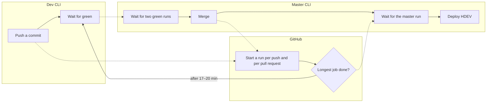
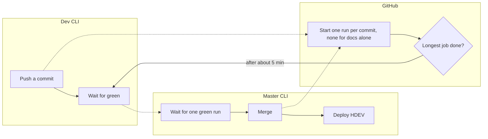
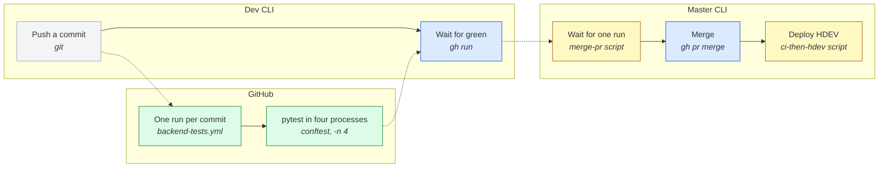
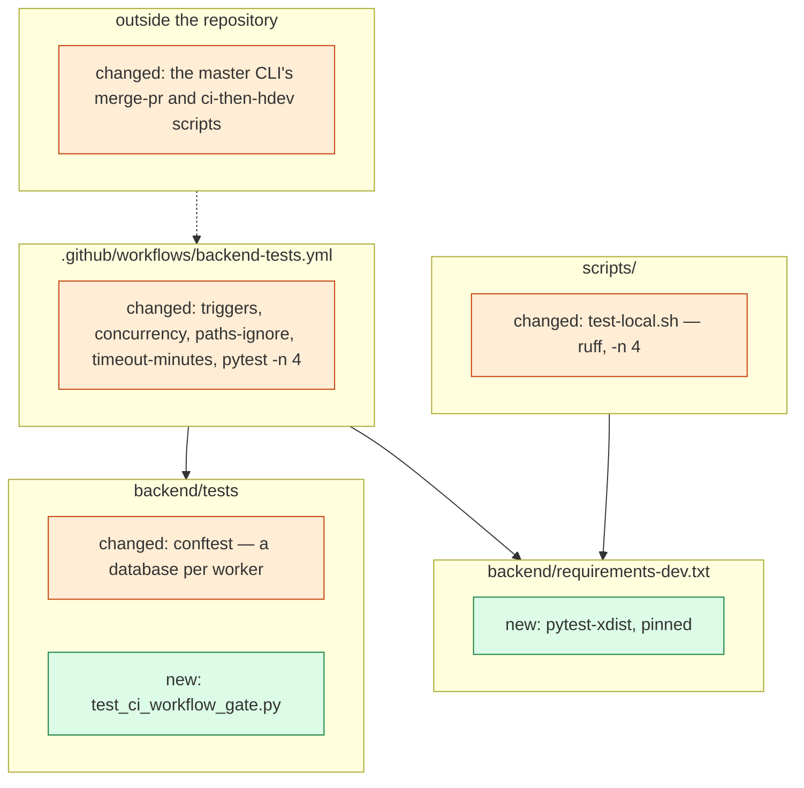

# Change Request 29 — A shorter CI: the wait per push

**Project:** Web Portal "Raak Millegem"
**Status:** shaped on 8 October 2026 at Koen's request ("Hoe zouden we de CI korter kunnen maken? Dat is nu ongeveer 20 minuten."), on the master CLI's measurement and three proposals of the same day · tracking issue #1745 · build read by dev2 on #1745 taken in (8 October 2026) · **planned on v2.16 by Koen on 8 October 2026, as its first item** (phase 1 before CR-13 phase 4b; phases 2 and 3 inside v2.16) · Mistral's external review of 8 October taken in · phases 1 and 3 in CI since 8 October (the master CLI; run 37809056177) · phase 2: Q6 answered (domain folders, 8 October), Q7–Q8 open with Koen
**Tracking issue:** #1745 — the one place where what is open stands; this document is the design, the issue is the status
**Applies to:** the CI workflow (`.github/workflows/backend-tests.yml`), the pytest fixtures (`backend/tests/conftest.py`), the local test scripts (`scripts/test-local.sh`, `scripts/e2e-local.sh`), and the master CLI's scripts outside the repository that wait for a run
**Reading:** A 1459 words · B 3417 · C 5748 (B about 3 000 without the decisions log: over the budget since the phase 2 proposal of 8 October; trimmed to 2 500 when Q7 and Q8 are answered) — measured on 8 October 2026 without drawings; the budget is A ≤ 1 500, B ≤ 2 500

---

# Part A — The business

## A1. Reason to act — the trigger

Every push to GitHub starts a CI run, and the people who wait for it are the CLIs that build: a dev CLI cannot hand over before the run is green, the master CLI cannot merge before two runs are green, and the HDEV deploy waits for the run of the master commit. On 8 October 2026 a run took about 17 to 20 minutes, and there were 115 runs the day before. Koen asked how the CI could be made shorter.

## A2. As-is process — how it works today, and where it hurts

*What to see: one commit starts two runs, and every wait is the longest job of a run.*

| # | Step | Who | Tool | Pain |
|---|---|---|---|---|
| 1 | Push a commit to a feature branch with a pull request | dev CLI | git | two runs start, a *push* run and a *pull_request* run, each with six jobs |
| 2 | Wait for green before the handover | dev CLI | `gh run` | the run takes the time of its longest job: pytest, 12 to 19 minutes (C1) |
| 3 | Merge, then wait for the run of the master commit before deploying HDEV | master CLI | its own scripts | asks both runs of step 1, then waits once more for master: three runs per change |
| 4 | Push a docs-only commit to master (as-built rows, decision logs) | master CLI, about fifteen a day | git | a full six-job run for a change no job reads |
| 5 | Run the tests locally while building | dev CLI | `scripts/test-local.sh` | one process, the same 11 minutes; no `ruff` in it while CI blocks on `ruff` |

Measured on 8 October 2026 (C1): 195 runs, median 16.7 minutes, nine in ten under 19.4 minutes, one run of 6 hours that nobody stopped; 30, 115 and 55 runs on 6, 7 and 8 October (until midday); of 7 October's 115, 86 were push runs and 29 pull-request runs.

## A3. To-be process — how it should work afterwards

*What to see: one run per commit, and its longest job is four times shorter.*

- Step 1 starts one run, the one that tests the branch combined with master.
- Step 2 waits about five minutes instead of seventeen.
- Step 3 asks one run; a master commit of code still gets its own run before HDEV.
- Step 4 starts no run.
- Step 5 runs the same checks as CI, in the same number of processes.

**What it says on the screen:** nothing — this change has no screen. The words it has are the job names in GitHub's run page (`lint`, `pytest`, `e2e`, `css`, `audit`, `boot`), which stay.

## A4. Benefits — what the change earns

| # | Benefit | Figure |
|---|---|---|
| 1 | A dev CLI hands over sooner and Koen sees a fix on HDEV sooner | about 8 minutes per push after phase 1, about 12 after phase 2, at ten to fifteen handovers a day |
| 2 | The master CLI's merge-and-deploy chain shortens by two waits | one run per commit instead of two, none for docs |
| 3 | Fewer runs queue behind each other on busy days | 115 runs of six jobs a day go to about half |
| 4 | A hung run stops itself | the six-hour run of 7 October ends at 30 minutes |
| 5 | A dev CLI's local run gives the same verdict as CI | `ruff` joins the local script |

## A5. Supplied material — and what it taught us

| Material | Where | What it taught us |
|---|---|---|
| The master CLI's measurement of three master runs and its three proposals, 8 October 2026 | the master CLI's chat with Koen, relayed to the architecture CLI | the longest job decides; pytest runs 5 598 tests in one process; the proposals are the three of B1, with the estimated gains |
| The run logs of 8 October | GitHub Actions, run ids in C1 | where the time goes per step and per test file (C1, C8) |

**Reporting need:** none. The CI duration is read from GitHub's run page; the tracker records it at the release (A8).

## A6. Business requirements — what the board asks, with MoSCoW

| # | Requirement | MoSCoW | Source | Comment |
|---|---|---|---|---|
| R1 | A push gets its green or red within about five minutes, measured as the wall time of the run. | Must | Koen, 8 Oct 2026 | the ceiling is the longest job; after phase 1 the browser job (10.5 min measured), after phase 2 the pytest job (8.5 min measured, so about 10 with queueing), under 6 only when phase 3 brings pytest's tests under about 270 s — all three in v2.16 (B6, Q8) |
| R2 | One commit starts one run, and a commit that changes only documentation starts none. | Must | the master CLI's proposal 3, 8 Oct 2026 | the pull-request run is the one kept: it tests the branch combined with master |
| R3 | A run that hangs ends by itself. | Must | C1: the run of 361 minutes | 30 minutes per job |
| R4 | What CI checks, the local script checks too, with the same tools and the same speed. | Should | A2 step 5 | `ruff` locally; the same number of processes |
| R5 | No test is made weaker, skipped or dropped to gain time; the coverage threshold stays. | Must | Koen's standing rule (`AGENTS.md`, *Testen en test-evidence*) | speed comes from parallel work and fewer runs, not from fewer tests |
| R6 | The browser tests get the same treatment when they become the longest job. | Should | the master CLI's proposal 2 | after R1 is built and measured (B6 phase 2) |
| R7 | The slowest test files are made faster themselves, without losing a case: faster locally too, where no parallel run helps a single file. | Should | Koen, 8 Oct 2026 ("stap 3") | the four files of C1, 42 % of the test time (B6 phase 3) |

## A7. Non-functional requirements — security, privacy, house style, tenants

| Concern | This change |
|---|---|
| **Security** — who may do what; new inputs from outside; secrets | No new input, no secret. One new test dependency (pytest-xdist, open source, from the pytest project; no service, so Europe First has nothing to choose). The workflow file is still edited only by Koen or the master CLI on his word (`AGENTS.md` header). |
| **Privacy** — personal data | None: CI runs on seeded, invented data, as today. |
| **House style / UI norm** | Not applicable: no screen. |
| **Multi-tenant** | Not applicable. |

## A8. Acceptance criteria — what the business signs off on HDEV

This change has nothing to see on HDEV; it is signed off on GitHub's run page and in a terminal.

| # | Criterion | Requirement | Walkthrough steps |
|---|---|---|---|
| AC1 | Five consecutive runs on master, each within the number of the phase: **11 minutes after phase 1** (the browser job is then the longest), **10 minutes after phase 2** (pytest is then the longest, 8.5 min on 8 October), **6 minutes after phase 3** if its measurement bears it out (Q8); measured from `gh run list`. | R1 | W1 |
| AC2 | A commit on a feature branch with an open pull request starts exactly one run; a second push cancels the first run if it still runs. | R2 | W2 |
| AC3 | A commit on master that changes only files under `docs/` starts no run. | R2 | W3 |
| AC4 | Every job carries a time limit of 30 minutes, visible in the workflow file. | R3 | W4 |
| AC5 | The number of tests that passed is the same before and after (5 598 passed, 1 skipped on 8 October), and the coverage threshold of 85 % still blocks. | R5 | W1 |
| AC6 | `scripts/test-local.sh`, run without `SNEL=1` and without a test selection, runs `ruff`, `mypy`, the css check and pytest in four processes, and reports the same result as CI for the same commit; with a selection it runs that selection in one process (Q2). | R4 | W5 |

---

# Part B — The solution, for whoever approves it

## B1. Solution outline — the solution and the decisions that shape it

The run's wall time is its longest job, pytest at 12 to 19 minutes, of which the tests themselves take 11 to 16 minutes in one process on a four-core runner (C1). The tests are made to run in **four processes** (pytest-xdist), each against its **own test database** (named from the worker id where the URL is set today, before the engine exists), with the coverage of the four combined as pytest-cov already does for xdist; the estimate is a pytest job of about five minutes. Around it, the workflow starts **one run per commit** — the pull-request run for a branch, the push run for master — cancels a pull request's run that a newer push makes stale, starts **none for a commit that changes only the documents no test reads** (the change requests, the architecture documents, the protocol), and gives **every job a time limit**. The local script gets the same `ruff` and the same four processes. When the browser job is then the longest, it is split in two the same way (phase 2).

- **D1 — pytest in four processes, one database per process.** `pytest -n 4`; the database name takes the worker's name at the top of `conftest.py`, where `DATABASE_URL` is set before the app and its engine are imported — the engine is created at import, so a fixture is too late (build read A1); the session fixture only creates a missing database through a separate connection. The four schema resets never meet. Tests are distributed one by one; `--dist loadfile` (a file's tests stay together) is the fallback if the sweep of F3 finds many order dependences. Rejected: a job matrix of four shards — four runners of setup (containers, pip, Inkscape, mypy: 60 to 160 s each), coverage merged by hand across artefacts, forty lines of YAML; xdist is one flag and one fixture.
- **D2 — one run per commit; none for documentation.** The push trigger keeps `master` only; `pull_request` stays on `master`. An outside builder's slice against an integration branch had the push run as its only run (build read A2) — until Koen's rule of 8 October (`AGENTS.md`, `fa4f3f0a`): one branch per change request with one open pull request against master from day one, so its run is the pull-request run (Q4). A feature branch runs through its pull request, which tests the merge with master. `concurrency` cancels a stale run on a pull request only: a master run is what the HDEV deploy and the release evidence wait for (A3). `paths-ignore` names `docs/change_request_*.md`, `docs/change_request_template.md`, `docs/architecture.md`, `docs/intermediate-architecture-upgrade-v1.md` and `docs/review-protocol.md` — the documents no test reads; tests read `CONTRACT.md` and `docs/reporting-universe.md`, so never `docs/**` (A4; Q5, Koen: other documents too, as long as no test reads them). Rejected: keeping both runs "for safety" — the push run tests the tip alone and nothing the pull-request run does not; a branch without a pull request gets no run, which is the handover convention already (a handover is a pull request).
- **D3 — a time limit of 30 minutes per job.** Today five of six jobs have none (e2e got one on 8 October, `71ec5ac4`), and one run lived six hours. Rejected: a limit per step — more lines for the same guard.
- **D4 — the local script equals CI.** `scripts/test-local.sh` adds `ruff format --check` and `ruff check` before mypy, and `-n 4` to pytest; the e2e script stays as it is. Rejected: making CI call the local scripts — they run in a helper container against the dev stack; a unification of the two is a change of its own, and this one only closes the two known gaps. The machine rule stays: one full suite at a time per machine (`AGENTS.md`), now four processes per suite.
- **D5 — the browser tests in two jobs, only when measured as the longest (phase 2).** A matrix of two, each with its own Postgres, seed and backend; the measurement baseline a job of its own. **Divided by domain folder (Koen, 8 October, Q6):** `tests_e2e/forms/`, `media/`, `pages/`, `meetings/`, `members/`, `activities/` (with registrations and payments), `assistant/` (Raakje and dictation), `reports/`, `shell/` (the admin and site shell, navigation, the kit), from CR-21 `shop/`; only the flows through several domains stay in the root, as CR-13 R15 does for pytest. Two parts: forms, media, pages, meetings, assistant and reports against members, activities, shell and the root (about 207 against 172 s); a gate places every folder in exactly one part. The first placement of the 134 files stands in C4.6. Rejected: a hash of the file name (no move and no list, but a red part names no area), a job per domain, workers against one backend, a seed job the parts inherit (C4.6); for phase 1, splitting before measuring.
- **D6 — the four slowest files made faster themselves (phase 3).** The tree-parsing gates parse once per session; the Design Studio tests render once per input. Every test and every assertion stays. Rejected: marking them slow and running them less often — a weaker gate.

**Derived requirements**

| F | Requirement | From |
|---|---|---|
| F1 | A worker's database is named from the base URL plus `PYTEST_XDIST_WORKER` (`raaktest_gw0` … `gw3`) at the top of `conftest.py`, before the engine is created; the fixture creates it when missing; without xdist the name stays `raaktest`; the engine is bound to the worker's name (T2). | R1 |
| F2 | The coverage threshold is computed over the four workers together, not per worker. | R5 |
| F3 | Order dependence across the whole suite is found before the switch: the suite three times under `-n 4` and once in one process in shuffled order — a five-line `pytest_collection_modifyitems` hook in `conftest.py` that shuffles with the seed of `TEST_SHUFFLE=<seed>` and prints it, no plugin; a difference between runs is a finding, fixed in the test it names (the known places are in C1). | R5, C1 |
| F4 | The master CLI's scripts outside the repository, the dev CLIs' handover convention and the pull-request template ask one run per tip — the pull-request run for a branch, the push run for master — and take the **latest** run per event, not the set of conclusions on the sha (a cancelled run beside a re-run is green). A commit or pull request that starts no run by the workflow's filter is read as "no run by design" at once, derived from the workflow file, never from a copy of its pattern. The HDEV script keeps its own, wider test for what may ride along on a tested commit (`docs/` or `*.md`): two rules, two names. The release evidence cites the run of the last code commit; when the tag lands on a docs commit the tracker names both shas. | R2 |
| F5 | A job's time limit is 30 minutes, in the workflow, for every job. | R3 |

## B2. Fit with the process and the requirements — for the business

*Legend: grey git · blue GitHub · yellow the master CLI's scripts outside the repository · green the workflow and the test fixtures.*

**Traceability matrix**

| R | How the solution meets it | F | Module | Test | AC |
|---|---|---|---|---|---|
| R1 | pytest in four processes, each with its own database | F1 | tests (conftest), workflow | T1, T2 | AC1 |
| R2 | one trigger per kind of branch, cancel-in-progress, paths-ignore; the scripts ask one run | F4 | workflow, the master CLI's scripts | T4 | AC2, AC3 |
| R3 | `timeout-minutes` on every job | F5 | workflow | T4 | AC4 |
| R4 | ruff and `-n 4` in the local script | — | scripts | T5 | AC6 |
| R5 | the same tests, the coverage combined | F2, F3 | tests | T1, T3 | AC5 |
| R6 | phase 2, measured first | — | workflow | T6 | — |
| R7 | phase 3: parse once, render once | — | tests | T7 | — |

**Walkthrough** — W1 After the merge of each phase: `gh run list --branch master --limit 5` shows five runs, each under the phase's number of AC1; the pytest job's summary line says `5598 passed` (or more, never fewer) and the coverage line stands. W2 Push a commit to a branch with a pull request, then a second one: `gh run list --branch <branch>` shows one run per commit, the first cancelled if it was still running. W3 Push a change under `docs/` to master: no new run appears. W4 Open the workflow file: every job has `timeout-minutes: 30`. W5 Run `scripts/test-local.sh` on the same commit, without `SNEL` and without `-k`: it prints the ruff, mypy and css steps and `5598 passed` in four workers, and the verdict equals CI's.

## B3. The whole across the modules — for the architect

*Legend: green new · orange changed.*

No data model: this change touches no table, no entity and no screen; the `erDiagram` of the template does not apply. Nothing in `backend/app` changes. The one new dependency is development-only (`requirements-dev.txt`), not in the image. The layer and import gates see nothing; the workflow gate of C7 is the one new gate.

## B3a. Standards the model follows — and where it deviates, on purpose

Standards checked: none applies — the change introduces no concept of the domain, no table and no column. The conventions it follows are GitHub Actions' own (`concurrency`, `paths-ignore`, `timeout-minutes`) and pytest's (`-n` of pytest-xdist, `worker_id`), used as documented.

## B4. Rules this change needs an exception from — decided once, here

| Rule (where) | What the design does instead | Mechanism | Temporary until … / the new rule | Decided |
|---|---|---|---|---|
| "Every feature CLI readies the PR with green CI" and the master CLI's merge script asks **two** green runs per tip (`AGENTS.md` *Development workflow*; the script outside the repo) | one green run per tip: the pull-request run | the script asks the pull-request run only; `AGENTS.md`'s wording ("green CI") already fits | the new rule | Koen, at the handover |
| "HDEV deploys master HEAD" after the run of that commit (the master CLI's `ci-then-hdev` script) | a master commit that starts no run deploys nothing | the script reads "no run for this commit" as "no run by design, nothing to deploy" at once, by the workflow's own filter; it keeps its wider ride-along test (`docs/` or `*.md`) for what may deploy on top of a tested commit | the new rule | Koen, 8 Oct 2026 (Q1: "ja") |

Checked and not bent: `.github/` is edited by Koen or the master CLI only (`AGENTS.md` header) — the dev CLI builds the fixture, the dependency, the local script and the gate; the master CLI writes the workflow change on Koen's word, in the same pull request. The pytest suite still points only at a `raaktest…` database (the fixture derives the worker names from it). "A test must be able to go red" holds: no test is skipped or weakened (R5).

## B5. Cost — investment and running cost, and what operations must know

**Investment:** phase 1 — the fixture, the dependency, the local script, the gate, the worker-safety sweep of F3: S to M, about 1.5 CLI-days; the workflow change: S, the master CLI; the two scripts outside the repo: S, the master CLI. Phase 2 (browser tests in two jobs): S, about 0.5 CLI-day, after measuring. Phase 3 (the four files): S, about 1 CLI-day. Total about 3.5 CLI-days, plus the build read.

**Running cost:** none — a public repository's GitHub-hosted runners are free; the change uses fewer minutes, not more. No purchases: no larger runner, no self-hosted machine (Non-goals).

**Operations:** nothing on a server. Two scripts in the master CLI's `bin/master-cli` folder outside the repository change (F4); they are the master CLI's.

## B6. Phasing — shippable phases, and what changes on the failure paths

| Phase | Delivers | Migration | Env vars | Data | Failure paths that change | Manual validation |
|---|---|---|---|---|---|---|
| 1 — one pull request | D1 to D4: four workers with a database each, one run per commit, none for docs, time limits, the local script, the gate; the two scripts outside the repo | none | none | none | a test that needed the whole runner alone now fails in a worker (F3 finds them first); a hung job ends red at 30 minutes instead of running on; a branch without a pull request gets no run and no verdict; a docs-only pull request or master commit has no run and passes on the docs-only rule (F4) | W1–W5 |
| 2 — after phase 1 is measured | D5: the browser tests in two jobs, divided per Q6, the measurement baseline in its own job | none | none | none | a browser test that depended on the order of files is found: each job seeds its own database and starts its own backend, so the sign-in limiter (five per minute per address) is per job | W1 measured again |
| 3 — inside v2.16 | D6: the tree-parsing gates parse once per session; the Design Studio tests render once per input | none | none | none | none: the same tests and assertions (T7) | `--durations=25` before and after |

**Order:** the **first item of v2.16** (Koen, 8 October 2026), before CR-13 phase 4b: no application code, and every later pull request of that release waits about ten minutes after phase 2 and about six after phase 3, instead of twenty. Phase 1 on a branch with a pull request, whose runs give AC1's number; phase 2 after that measurement; phase 3 at any point of v2.16. **Rollback:** revert the pull request; there is no data.

## B7. Rule and gatekeeper — what this fixes for all future work

**The rule:** the CI run is as long as its longest job, and that job is kept under about five minutes: a job has a time limit; pytest runs in as many processes as the runner has cores, each with its own database; one commit starts one run and a documentation commit none. It goes into `AGENTS.md` *CI* (one paragraph, by the master CLI on Koen's word) — the workflow file itself is the other place, and the gate of C7 keeps the two from drifting.

**The levels:** domain tests per domain folder (the fast, local loop), integration tests and gates, browser tests; CI runs all of them, in parallel, never a selection by changed paths — C4.5.

**Reach and baseline:** one workflow file, six jobs; today 1 of 6 has a time limit (e2e, since `71ec5ac4` of 8 October) and pytest runs in 1 process. After this change 6 of 6 and 4 processes. **Hard** gate for the time limit and the process count (C7). The run's wall time is **not** gated — a gate cannot measure its own run — it is reported: the master CLI records the time of the master run in the release tracker as part of the CI evidence (`AGENTS.md`, *Test-evidence*), beside the run id and `N passed`.

## B8. Open decisions — what the approver still decides

| # | Question | Recommendation | What the answer changes |
|---|---|---|---|
| Q7 | Each part seeds its own database, or master data once and then the parts? | Each its own: one script of 5 s, a Postgres per job, and the tests write — no part sees another's writes. Master data first needs a seed job and a dump handed to the parts: more set-up than it saves. | A seed job and an artifact in the workflow if the data must be shared. |
| Q8 | AC1 after phase 2: ten minutes, with six moved to phase 3? | Yes: after phase 2 pytest bounds the run (8.5 min on 8 October), and the slowest tests are D6's files, so six is phase 3's to win. If phase 3 stays above six, the next lever is pytest in two jobs with combined coverage — shaped then, not now. | AC1, R1, B6; whether a further lever is shaped. |

Q6 answered 8 October (B9): domain folders, `shell/` and `reports/` added.

## B9. Decisions log — dated answers

| Date | Decision | By |
|---|---|---|
| 8 Oct 2026 | Koen asks how the CI can be shorter; the master CLI measures three runs and proposes pytest in parallel, the browser tests in two halves, and one run per commit with none for docs; Koen sends the three to the architecture CLI for a change request. Shaped here as D1–D5; not on a release. | Koen |
| 8 Oct 2026 | Build read by dev2 (#1745) taken in, every point; the Q&A log lists them. One is Koen's to decide: Q5. | architecture CLI |
| 8 Oct 2026 | Steps 1–3 on v2.16, as its first item ("Ik ben het helemaal met je eens"); phase 3 — the four slow files — added as D6/R7; the three test levels and the place of contract testing recorded in B7. Mistral reads the document as the external review; a targeted look by the master CLI at F4, B4 and Q1 (her scripts) proposed. | Koen |
| 8 Oct 2026 | Koen's answers: Q1 a master commit without a run skips HDEV ("ja"); Q3 phase 2 after phase 1's measurement ("ja"); Q5 the filter may name other documents too, as long as no test reads them — the five of D2. Q2 four processes as the local default, a partial run (`SNEL=1` or a selection) in one process — walked through in chat, then "ja, akkoord". B8 is empty: ready for assignment. | Koen |
| 8 Oct 2026 | The master CLI's look at her own pieces (#1745, issuecomment-6058260511) taken in, all six: two docs rules with two names; "no run by design" said at once; the merge script derives "needs no run" from the workflow file; the latest run per event, in the merge script and in `wait-checks` (conclusions, not completion); both shas in the tracker when the tag lands on a docs commit; the memories corrected at the switch. | architecture CLI |
| 8 Oct 2026 | Mistral's external review (pasted by Koen; on #1745) taken in: AC1 and R1 carry a number per phase — 11 minutes after phase 1, 6 after phase 2, both in v2.16; the shuffle of F3 is a conftest hook with a seed, no plugin; AC6, W5 and T5 carry Q2's exception; one duration range from C1; the gate asserts both triggers. The three cosmetic points taken too. | architecture CLI |
| 8 Oct 2026 | Q4 answered by Koen's rule of the same day (`AGENTS.md` *A builder outside the Claude series*, `fa4f3f0a`): an outside builder builds a change request on one branch `cr<nn>/<name>` with one open pull request against master from day one — so the pull-request run is its run, and no integration branch enters the triggers. | Koen |
| 8 Oct 2026 | **Phase 1 built as, on `master`** (v2.16.0, #1745; pull request #1753 and the workflow commits of the master CLI). Deviations: (1) a worker database is dropped and created, not only created when missing — four simultaneous schema resets ran Postgres out of lock space; (2) `--dist loadgroup` on the pytest command, for the two restore tests that share one scratch database; (3) one fixture empties the job queue before every test; (4) the query budget warms up first; (5) the local script reinstalls the helper container when the requirements changed. **Measured** (AC1): before, the last eight master runs 12.3–18.1 minutes; after, 11.8, 10.6 and 10.8 minutes on the first three pull-request runs — pytest 8.4–10.6 minutes, e2e about 11.7; the estimate of 5–6 minutes is not reached by phase 1 alone. **A hole found on `master` and closed by the master CLI the same day** (`92df2a27`): with one concurrency group for the whole of master, a run waited behind the running one and GitHub cancelled the waiting run when a newer commit arrived (the run of `6a655a30` was cancelled by the push of `927f5f53`); a master commit now has a group of its own (`github.sha`), a pull request one per branch; the gate asks for it since #1761. **Two tests that four processes brought up:** #1756 — a defect of the member import, not of the test (a deleted link stayed in the loaded collection the import decides on); repaired, and the count on PROD, UAT and HDEV is 0; #1759 — a fault of the test set-up (the id of the household where the app stores the id of the membership). The master CLI`s scripts follow: the merge script asks the pull-request run only and takes the latest; "no run by design" is derived from the workflow`s own `paths-ignore`. | master CLI |
| 8 Oct 2026 | **The installs are kept between runs, built as, on `master`** (v2.16.0, #1745, pull request #1768; Koen to the question whether the workflow may keep the install of Inkscape and the test browser: "ja op 2"). Inkscape: the downloaded packages, keyed on the version of the runner image, installed with `dpkg -i`; Playwright: the browser folder, keyed on `requirements-e2e.txt`, the install command unchanged. **Measured**: before, over twenty runs, Inkscape 12–40 s with three outliers of 424, 617 and 887 s, Playwright 31–55 s with one of 321 s; kept, Inkscape 7 s without touching the package mirror, Playwright 33 s — its system packages still come from the mirror on every run, so that part of the outlier stays. | master CLI |
| 8 Oct 2026 | Koen, after the measurement of phases 1 and 3 ("Ik ben er wel voorstander van om een aantal browser-tests sowieso te verhuizen naar een andere parallelle run. Bvb. forms, media en pages moet apart kunnen. Webshop zou ook kunnen. Ga je dan aparte master data feeden? Of eerst master data en dan parallel. Hoe zou jij dat doen? Hoe werd dat in de CR door de architect gedefinieerd?"; then "vraag je de architectuur cli sowieso dit even met me uit te klaren?"): D5 laid out as two variants with the measurement of both (C1, C4.6), the seed per part reasoned, AC1 renumbered per phase; nothing decided — B8 Q6–Q8 are his. | Koen, architecture CLI |
| 8 Oct 2026 | Q6: the browser tests by domain folder. Koen asked for the placement file by file, then: "shell en reports erbij" — nine folders (forms, media, pages, meetings, members, activities, assistant, reports, shell; shop from CR-21), the flows through several domains in the root. The first placement in C4.6; two parts as D5 says. Q7 and Q8 still his. | Koen |

---

# Part C — The build, for the master CLI and the dev CLIs

## C1. Verified premises — measured before the handover

*Measured on 8 October 2026 from GitHub's run data (`gh run list`, `gh api …/actions/jobs/<id>`, the job logs) and on master `fc2798d8` for the files; laid against `dac57141` by the build read (#1745), which confirmed the triggers, the fixture, the scripts and the counts, and corrected what the rows below say they corrected.*

**The runs.** The last 200 runs (195 completed): wall time minimum 7.7 min, median 16.7, nine in ten under 19.4, maximum 361.5 (one hung run on 7 October; five of six jobs have no `timeout-minutes` — e2e got 30 on 8 October, `71ec5ac4`). The last fifteen master runs: 17.8 to 21.8 minutes. Runs per day: 30 on 6 October, 115 on 7 October (86 push, 29 pull request), 55 on 8 October until midday. Triggers today: `push` on `master` and `feature/**`, `pull_request` on `master` (`backend-tests.yml:3-7`), no `concurrency`, no `paths` filter. No branch protection on master (`gh api …/branches/master/protection`: 404), so no required check stands in the way of a commit without a run.

**The jobs of one run** (run 37753251112, master, 08:56): lint 9 s, css 9 s, audit 25 s, boot 71 s, e2e 520 s, pytest 740 s. The run's wall time is the pytest job.

**The pytest job** (job 113231402474, 740 s): containers 29 s, pip 11 s, Inkscape 14 s, mypy 9 s, pytest 670 s — of which 640 s from the first to the last test line, so collection plus `alembic upgrade head` about 30 s; `5598 passed, 1 skipped in 661 s`. The same job in run 37737463641 (job 113180173705): Inkscape 121 s, pytest 977 s — the same tests, so a runner is up to 1.5× slower than another; the estimates below use the faster one. The command: `python -m pytest -v --tb=short --cov=app --cov-report=term-missing --cov-fail-under=85` (`backend-tests.yml:88`), one process; `requirements-dev.txt` holds pytest 8.3.4 and pytest-cov 6.0.0, no xdist.

**Where the test time goes** (run A, per file, from the line timestamps): `tests/integration/test_designstudio_service.py` 128.6 s (37 tests, Inkscape renders), `tests/test_render_gate.py` 61.8 s (6 tests, renders every admin page), `tests/test_rules_gate.py` 52.1 s (31 tests, 16 places that parse the tree), `tests/integration/test_rules_meter.py` 24.8 s, `app/domains/designstudio/tests/test_poster_body_text_1677.py` 18.0 s, `tests/test_codes_gate.py` 16.8 s, `tests/integration/test_vergaderingen.py` 13.2 s, `tests/test_env_reads_reach_the_container.py` 9.0 s. The top four are 267 s, 42 % of the test time; the other 720 files share the rest. With four workers and pytest-xdist's default distribution (test by test, not file by file), the longest file no longer bounds a worker.

**The fixture.** `backend/tests/conftest.py:17-21` reads `TEST_DATABASE_URL` (default `…/raaktest`) and sets `DATABASE_URL` to it before the app imports — and line 34 imports `engine` from `app/database.py`, which creates it at import (`:8`), so the worker's name must be in the URL at that point, not in a fixture (build read A1); `:50-75` a session-scoped, autouse fixture drops every schema with `CASCADE` and runs the migration chain once per process (a module global `_SCHEMA_BUILT`); `:152-180` each test runs in a SAVEPOINT on one connection. Four processes on one database would reset each other's schema: hence one database per worker (F1). The base name is guarded: `scripts/test-local.sh` derives a `raaktest_<slug>` per worktree and refuses the dev database.

**The e2e job** (job 113231402482, 520 s): containers 22 s, Playwright and deps 32 s, migrations and seed 5 s plus the seed step, e2e 363 s (813 tests in 132 files), the measurement baseline 86 s (its own database `raakmeet`, `faketime`, `scripts/measure-run.sh`). The sign-in limiter is per IP and per backend process (`app/limiter.py`), so two jobs with two backends do not share it.

**Worker-safety (F3).** Sixteen files found by grep were read by the build read (B4): the eight that seemed to write outside `tmp_path` write under it by other names; no fixed port, no fixed `/tmp` path and no fixed scratch database was found (absence in a search is not proof). The one shared write is a snapshot re-recorded under `SNAPSHOT_UPDATE=1`, never in CI. The real risk is order dependence, which no grep finds: rows committed outside a savepoint (`tests/integration/test_ai_call_log_cost.py:6`, anything through `SessionLocal()`), module registries filled when an earlier test imported `app.main`, module caches, the in-process limiters, environment set at import — hence the sweep of the whole suite in F3.

**Tests that read Markdown** (build read A4): `app/domains/reporting/tests/test_reporting_universe_gate.py:402-406` compares `docs/reporting-universe.md` with what the universe renders; `tests/test_rules_gate.py` and `tests/integration/test_rules_meter.py` read each domain's `CONTRACT.md`. A filter on `docs/**` or `**/*.md` would skip a commit that turns one of them red.

**The local scripts.** `scripts/test-local.sh:156-161` runs mypy, the css check and pytest in a helper container against the dev stack's Postgres, one process; it runs no `ruff` (CI's lint job blocks on it, `backend-tests.yml:23-28`). `scripts/e2e-local.sh` and `scripts/measure-local.sh` mirror the e2e job.

**The master CLI's scripts** (outside the repository, read on 8 October): the merge script loops over `pull_request` and `push` and requires both runs on the tip green; the HDEV script waits for the `push` run of the master commit; the docs-merge script pushes master directly, which starts a full run per docs commit. Beside the scripts: the dev CLIs' handover convention asks both run ids on the tip in the evidence line, and the branch-name rule (`feature/`, not `fix/`) exists only because of the push run (B1). `pull_request` triggers on `master` only (`backend-tests.yml:6-7`): a slice of an outside builder against `cr17/web-content` has the push run as its only run (A2). `tests/test_lokale_testrunner.py` pins `scripts/test-local.sh` (the database-name guard `raaktest|raaktest_*`, mypy before pytest, `SNEL`) (B5).

**Measured after phases 1 and 3** (8 October 2026, master run 37809056177; the master CLI's two runs agree): the e2e job 10 min 34 s wall, the pytest job 8 min 34 s — so after a split of e2e, pytest bounds the run. pytest: `5667 passed, 1 skipped in 429 s` under `-n 4 --dist loadgroup`; the slowest calls are the rules meter 75 s, the Design Studio service 75, 51, 39 and 28 s, the render gate 58 and 16 s, the poster body text 40 s, three meeting reports of 26 s, one pdf text layer 26 s — D6's files, grouped onto one worker each by `loadgroup`. The e2e tests per file, from the log's line timestamps averaged over the two runs: about 400 s over 134 files, the longest ordinary file 12.6 s (`test_household_pages.py`), the measurement baseline 90 s in its own step. Divided by file-name hash the halves are 177 and 222 s; divided by Koen's four folders — placed by file name, a first placement, not the build's — forms 19 files 78 s, meetings 16 files 37 s, pages 11 files 30 s, media 8 files 30 s, together 175 s, against the rest 224 s. Of the 134 files, 93 visit a literal path (`/admin/formulieren`, `/admin/media`, `/admin/paginas`, `/admin/vergaderingen`, …) and 41 reach their screen through a helper: a placement derived from the URL covers two thirds, the rest is placed by hand. The seed is one script (`seed_e2e.py`, 5 s: household, activity, registration, payments) and each job's Postgres is a service container of its own; the tests write. Kept installs (Playwright, Inkscape; PR #1768) are in CI and not yet measured over ten runs.

**Not measured, to verify in the build:** GitHub's concurrency limit for a free account (recalled as 20 jobs at once; at six jobs per run, four runs fill it) — from GitHub's usage-limits page, cited by the build read; the real gain of `-n 4`, which only the first pull request's run gives (AC1); what pytest-cov does with four workers (combines and applies the threshold to the whole, by the plugin's design; not run).

## C2. Per module: what must happen

| Module | What must happen | Reads |
|---|---|---|
| **tests — conftest** | At the top of the file, where `TEST_DATABASE_URL` is read today: if `PYTEST_XDIST_WORKER` is set, append `_<worker>` to the database name before `DATABASE_URL` is set and before `app.database` creates the engine; without xdist nothing changes. The session fixture, before the schema reset, connects to the base database with autocommit and creates the worker's database if it is missing. The guard on the name (`raaktest…`) stays and covers the suffixed names. | `backend/tests/conftest.py:17-21, 34, 50-75`; `app/database.py:8` |
| **tests — the sweep (F3)** | before the switch: the whole suite three times under `-n 4` and once in one process in shuffled order (`TEST_SHUFFLE=<seed>`, the hook of F3 — reproducible by its seed; no plugin, so no new dependency); every difference between runs is fixed in the test it names (a row committed outside the savepoint, a registry that an earlier import filled, a cache), one line each with the reason; a test that must run alone is marked `xdist_group`. If the sweep finds many, `--dist loadfile` is the cheap way out (D1), at the price of the 128 s file bounding one worker. | C1, *Worker-safety* |
| **requirements-dev.txt** | `pytest-xdist`, pinned to the current release, with one comment line naming this change. | `backend/requirements-dev.txt` |
| **workflow** (the master CLI, on Koen's word) | `on.push.branches: ["master"]`; `pull_request` unchanged (Q4); `paths-ignore` with `docs/change_request_*.md`, `docs/change_request_template.md`, `docs/architecture.md`, `docs/intermediate-architecture-upgrade-v1.md` and `docs/review-protocol.md` on both triggers (Q5); top-level `concurrency: {group: ci-${{ github.ref }}, cancel-in-progress: ${{ github.event_name == 'pull_request' }}}`; `timeout-minutes: 30` on the five jobs without one; the pytest step adds `-n 4 --durations=25` (the `-v` lines arrive interleaved with a worker prefix, so the per-file timing of C1 needs `--durations` from now on). Nothing else moves. | `backend-tests.yml:3-7, 88, 127`, every `jobs.<name>` |
| **scripts/test-local.sh** | `ruff format --check .` and `ruff check .` before mypy (in the helper container, which installs `requirements-dev.txt` — the same `ruff==0.16.9` as CI); pytest with `-n 4` unless `SNEL=1` or a `-k`/path argument is given (Q2); the dev CLIs' direct `pytest` calls in the container are untouched. The per-worktree database name becomes the base of the four worker names; they live and die with it (today nothing removes the base either). `tests/test_lokale_testrunner.py` pins the script: the ruff step and the guard's acceptance of `raaktest_<slug>_gw0` go through it (T5). | `scripts/test-local.sh:100-161`, `tests/test_lokale_testrunner.py` |
| **tests — the gate** | `tests/test_ci_workflow_gate.py` (C7). | the workflow file |
| **the master CLI's scripts and the conventions** (outside the repository; the master CLI's own, on the day the workflow changes) | the merge script asks the pull-request run only and takes the **latest** run per event (a cancelled run beside a re-run on one sha is green); a pull request whose every file matches the workflow's `paths-ignore` needs no run — derived by reading the workflow file, never a second copy of the pattern. `ci-then-hdev` says "no run by design, nothing to deploy" at once for a commit the filter skips (today it would poll ten minutes and exit 1), and keeps its own wider ride-along test (`docs/` or `*.md`) for what deploys on top of the tested commit (Q1). `wait-checks` asks the conclusions, not only completion: six cancelled jobs are not "done". The release script may tag a docs commit without a run; the tracker then names both shas — the tagged one and the one with the run. The handover convention (`AGENTS.md`, the pull-request template, the memories of the dev CLIs and of the master CLI): one run id on the tip, the pull-request run; the branch-name rule for the push run goes; each session corrects its memory at the switch. | `bin/master-cli`; `AGENTS.md` *Development workflow* |
| **docs** | `AGENTS.md` *CI* gets the rule of B7 (the master CLI, on Koen's word); the test-evidence paragraph gains "and the wall time of the run". | |
| **phase 3 — the four files** | `tests/test_rules_gate.py` (31 tests, 16 places that parse the tree), `tests/test_codes_gate.py` (15 tests, 7) and `tests/test_render_gate.py` (6 tests rendering every admin page): the parsed tree, respectively the rendered set, built once per session in a fixture the tests read — no assertion changes. `tests/integration/test_designstudio_service.py` (37 tests, Inkscape): one render per distinct input shared across the tests that only read it, and a lower resolution where no assertion reads pixels. Measured with `--durations=25` before and after; the count of tests and of assertions per file is equal (T7). | C1 *Where the test time goes* |
| **phase 2 — workflow** | the e2e job becomes a matrix of two, each with its own Postgres, seed and backend: part 1 `tests_e2e/forms media pages meetings assistant reports`, part 2 `members activities shell` plus the root files; the folder list in the matrix, T6 refusing a folder in no part or in both; the measurement baseline moves to a job `measure` of its own with its own Postgres. The tests move in the same pull request, per the placement of C4.6 (by the URL the test visits where it names one, 93 of 134 files; by hand for the rest), with a `conftest.py` that keeps `tests_e2e` importable as before; `scripts/e2e-local.sh` takes a folder as its selection. | `backend-tests.yml:123-215` |
| **reporting** | none: no table, no view. | |

## C3. Cross-cutting impact — the checklist of what gets forgotten

| Concern | This change |
|---|---|
| **Visitors and tenants** | none: no screen, no route. |
| **Order inside a transaction** | none. |
| **Existing tests, e2e flows, screenshots** | every existing test runs unchanged in a worker; the ones of F3 get a one-line change; the e2e set is split, not changed (phase 2). |
| **Fixed UI decisions, design system** | none. |
| **Code lists, events, handlers, mail** | none. |
| **Migration** | none. |
| **Env vars** | none in the stack; `TEST_DATABASE_URL` keeps its meaning (the base). |
| **JSON routes and API callers** | none. |
| **The master CLI's conventions** | the merge-and-deploy scripts change (F4); the memory of "both runs green" that the master CLI keeps becomes "the pull-request run green". |
| **A branch without a pull request** | gets no run — said in B6; the handover convention already asks a pull request. An outside builder's branch has an open pull request against master from day one (`AGENTS.md`, 8 October), so it has its run (Q4). |
| **Tests that read Markdown** | the docs filter names only the change-request documents; the gate (C7) refuses a filter entry that a test reads. |
| **The release evidence** | the run id of the last code commit, when the tip of master is a docs commit; the tracker names both shas (F4). |
| **Two rules called "docs-only"** | the workflow's filter (does a run start: the five documents) and the HDEV script's ride-along test (`docs/` or `*.md`, deliberately wider) stay two rules with two names; neither borrows the other's pattern. |
| **The `ai-review` build read** | asked for by the master CLI before assignment, as for every change request. |

## C4. Detailed decisions — one subsection each, with the reasons

### C4.1 Four processes with xdist, not four jobs (D1)

Four jobs each pay the setup again (containers 23–29 s, pip 11–17 s, Inkscape 14–121 s, mypy 9–15 s: 60 to 160 s per job) and each sees a quarter of the coverage, so the 85 % threshold must be computed from merged artefacts in a seventh job. xdist pays the setup once, and pytest-cov combines the workers' coverage by itself and applies the threshold to the whole. The runner has four cores; `-n 4` matches it, and `-n auto` would do the same there but differ on a dev CLI's machine; a fixed 4 keeps local and CI equal (R4). Estimate: tests 640 s → 180 to 220 s (the top four files 267 s spread over four workers; test-by-test distribution), plus setup and collection about 120 s: a pytest job of 5 to 6 minutes, the e2e job (8.7 min) then the longest — which is why phase 2 exists.

### C4.2 One database per worker (F1)

The session fixture drops every schema with `CASCADE`; two processes on one database would race on that and on `alembic_version`. The alternatives — one schema per worker, or a transaction per worker — change the fixture more and leave the migration chain running once per worker anyway. A database per worker is four `CREATE DATABASE` and one line at the top of `conftest.py`. The chain and the collection run four times, in parallel; on four cores that is wall time, not extra (build read B7); accepted.

### C4.3 Why the pull-request run is the one kept (D2)

The push run tests the branch tip as it is; the pull-request run tests the merge of that tip with master, which is what lands. Everything the first proves the second proves too. The master CLI's memory "handover as a pull request, not a bare branch" exists for the same reason.

### C4.4 Docs-only commits (D2)

`paths-ignore` with `docs/change_request_*.md`, `docs/change_request_template.md`, `docs/architecture.md`, `docs/intermediate-architecture-upgrade-v1.md` and `docs/review-protocol.md`: a commit that touches only those starts no run — that is where the master CLI's fifteen docs commits a day go (as-built rows, decision logs) and where the architecture documents live (Koen, Q5). Everything else runs, Markdown included: tests read `CONTRACT.md` and `docs/reporting-universe.md` (C1), and a commit that edits only one of those must turn the run red under its own name, not under the next code commit's. The gate of C7 keeps the filter honest: for every entry it asserts that no test reads that file — a test *mentions* a document in a docstring (`test_rules_gate.py:1` names CR-13) without reading it, so the gate looks at string constants outside docstrings, which is where a path that is opened stands (`test_reporting_universe_gate.py:402-406`). This filter and the HDEV script's ride-along test are two rules with two names (C3).

### C4.5 The levels, and where each runs (B7)

Koen asked for a view on test levels within one codebase (8 October 2026). The suite already has three levels, placed by CR-13 R15: **domain tests** in `app/domains/<x>/tests/` — fast, in-process, one domain, the facades of the others called for real; **integration tests** in `tests/integration/` and the gates in `tests/` — flows across domains, and the rules over the whole tree; **browser tests** in `tests_e2e/`. The fast loop is local: a dev CLI runs the tests of the domain it builds (`pytest app/domains/payment/tests`, CR-13 AC10) while it builds. CI runs everything, in parallel, on every commit — one mechanism, never a selection by changed paths: after parallelisation a selection saves little, and it is exactly the mechanism that skips something silently (the build read's A4). Splitting the codebase is not needed for any of this: the domain folders and the import gate give the separation inside one repository. **Contract tests** (consumer and provider each tested against an agreed contract, Pact-style) are the instrument for a *network* boundary: they return when a component is extracted (`docs/architecture.md` R7) or when an outside party consumes the JSON API; inside one process the facade signature, `CONTRACT.md` and the import gate are the contract, enforced at import.

### C4.6 The browser tests in parts (D5) — Koen's three questions

**By domain or by hash.** Speed does not separate them: with two parts either way the e2e job lands at 3 to 5 minutes, under pytest. What separates them is what a part *is*. A folder per domain is a thing the reader knows — a red `e2e (forms)` names the area, a dev CLI building forms runs `pytest tests_e2e/forms` while it builds (CR-13 AC10 for the browser), and CR-21's shop tests, written by an outside builder, get `tests_e2e/shop/` from their first commit, so their failures never hide among 134 files. The hash is a thing nobody knows: stable and free, but `e2e (2)` says nothing and the halves are what they are. The folder's cost is real: 134 files move once, no import places them (an e2e imports no domain; CR-13's gate derives from imports, this one cannot), two thirds are placed by the URL they visit and the rest by hand; and a list exists — the folders in the matrix — which is why T6 refuses a folder that is in no part or in two, so a new folder is a failing run, never a silent skip. Not a job per domain: six jobs pay six set-ups (about 1.5 min each) for the same wall time, and on an own runner with one slot (CR-30) they run one after the other.

**Seed per part, or master data first.** Each part seeds its own database: the seed is one script of 5 s, each job's Postgres is a service container that lives and dies with the job, and the tests write — a part that owns its copy sees nothing of the other's writes, and a test that depended on another file's leftovers is found (B6). "Master data first, then parallel" would be a seed job whose data reaches the parts as a dump artifact: a job's set-up to save 5 s, and a coupling between jobs that the two runs would then share. Within one job, two workers against one backend is the other reading of "parallel": refused, because the sign-in limiter is per backend process and per address (five a minute) and the two workers would write to one seed.

**The number.** After phase 1 the run is 10.5 minutes and the e2e job is the longest; after phase 2 it is pytest's 8.5, so AC1 says ten. Six is phase 3's to win: the slowest calls are all in D6's files, and `loadgroup` already puts each group on one worker, so shortening those files shortens the critical path directly. If the measurement after phase 3 still stands above six, the next lever is pytest in two jobs with coverage combined from both — shaped then, on that measurement, not now.

**The first placement** (8 October, by the URL each test visits, then by name; the build corrects what it finds wrong and says so in the pull request; names without `test_` and `.py`):

| Folder | Files (measured seconds, two runs) |
|---|---|
| `forms/` | 22 (84 s): a_person_can_send_a_public_form, a_refusal_shows_its_reason, a_refused_number_shows_on_its_field, answers_button_fits, bevestiging_op_de_knop, board_form_is_the_public_form, cr11_forms_wins, form_fields, form_help_text_grows, form_keeps_chosen_answers, form_proposal, formulier_afstanden, formulier_anders, foutzichtbaarheid, one_question_block, public_form_page, public_forms_one_frame, record_form, record_form_guard_after_discard, record_head, repeating_groups, tekstvak_ondergrens |
| `media/` | 11 (39 s): beeld_bewerken_zichtbaarheid_1230, cms_places_an_album_photo, copy_reuses_predecessor_photos, lightbox, media_card_fits_a_phone, media_library_tree, media_picker, media_upload_follows_the_branch, page_image_edit_1224, page_image_insert, page_image_size_1207 |
| `pages/` | 8 (21 s): calm_footer_and_badges, cms_html_bron_blijft_verborgen, cms_page_headings, cr11_cms_toolbar_stays, footer_pages, public_shell, site_cards, site_colours |
| `meetings/` | 16 (37 s): annual_programme, circle_search_shows_email, circle_start_date_fits, cr11_meetings_newsletter_wins, meeting_carries_upcoming_notes, meeting_free_point_row_fits, meeting_free_point_title, meeting_new_members_first_membership, meeting_point_per_ride, meeting_point_separator, meeting_screen_fits_a_phone, meeting_steward_row_fits, newsletter_panel, nieuwsbrief_flow, vergadering_flow, vergaderkring_focus |
| `members/` | 12 (34 s): account_shell, adresrij_gaat_mee_met_opslaan, adresrij_uitlijning, company_persona, gezinsscherm_tekst_overleeft, household_pages, ledenflow_schermen, lid_aanmaken_een_formulier, organisatie_adres_blijft, phone_numbers_read_in_groups, sign_in_returns_to_the_portal, verlengflow_schermen |
| `activities/` | 25 (66 s): activiteitspagina_blok, activity_created_through_the_screens, activity_proposer, activity_status_and_audience, activity_tabs, bestuur_inschrijving_toevoegen, betalingen_list_page, betalingen_tab_houdt_scope, betalingen_table, booking_page, closed_registration_button, copy_activity, inschrijf_teller, new_activity_on_the_fiche, one_product_row_everywhere, online_payment_chain, organiser_contact_fallback_1694, product_settlement, public_card_grid, public_registration_page, publieke_kaart_uitlijning, registration_detail_fits, registration_edit_keeps_typing, registration_quantity_survives, room_for_groups |
| `assistant/` | 7 (22 s): assistant_panel, assistant_panel_always_answers, assistant_second_request, dictaat_laat_het_veld_groeien, raakje_invoer, raakje_switches, stt_worklet |
| `reports/` | 2 (4 s): drillen_in_de_draaitabel, report_filter_ticks |
| `shell/` | 27 (about 65 s): actieve_navigatie, admin_frame, admin_link_after_sign_in, association_unchanged_by_modules, controlhoogte, description_enter_spacing, design_system_page, filter_bar_shrinks_and_grows, kopbalk_logohoogte, kopkleur_blijft, landing_naar_elke_tenant, mobiel_menu_blijft_dicht, nav_per_module, navigatie_overleeft_body_swap, one_type_family, opslaan_bevestiging, public_corrections, schermafdruk_datumvolgorde, schermafdruk_zonder_banner, sidebar_remembers_its_groups, stepper_is_usable_and_lighter, switch_to_the_platform, switch_to_the_platform_from_another_host, tenant_toast, view_transition_rule |
| root | 2 (about 7 s), flows through several domains: golden_flows, beheer_flows — plus measure_baselines and measure_compare, which the `measure` job runs |

Doubtful and decided by hand: record_form and record_head (CR-11's generic record form) in `forms/`; lightbox and the page_image tests (a photo on a page) in `media/`, not `pages/`. Security has no folder: it is an invariant proved in pytest (368 files touch authorisation, CSRF or a 401/403, with their gates); the browser proves the sign-in flow and the switch to the platform, and every browser test signs in.

## C5. Privacy and security — the mechanics behind A7

Nothing leaves or enters: CI runs on invented seed data, as today. The new dependency is pinned by version in `requirements-dev.txt`, like the others, and `pip-audit` keeps reporting on `requirements.txt` only (the image).

## C6. Tests — what the build must prove

| T | What it proves | Becomes red when |
|---|---|---|
| T1 | The suite under `-n 4` passes with the same count as in one process (5 598 on 8 October), and the coverage line reports one number for the whole | a test is lost in the split, or a worker's coverage is counted alone |
| T2 | Two workers never share a database: under a worker id the engine's URL ends in `_gw<n>` and the schema reset runs there; without one it ends in `raaktest` — asserted on `engine.url`, not on a name the fixture computes | the suffix is dropped, or applied after the engine exists |
| T3 | The sweep of F3: three runs under `-n 4` and one shuffled single-process run agree test by test, not only in their count | a test depends on its predecessors |
| T4 | The gate of C7: every job has `timeout-minutes`; the pytest step carries `-n`; `push` and `pull_request` each trigger on `master` only, no second pattern; cancel-in-progress excludes master; no test names a path in `paths-ignore` | the workflow drifts, or stops testing something silently |
| T5 | `tests/test_lokale_testrunner.py`: the script runs ruff before mypy and pytest with `-n 4` when called without `SNEL` or a selection, and without `-n` when called with one; its guard admits `raaktest_<slug>_gw0` | the local script loses a step, refuses a worker's name, or parallelises a single test |
| T6 | Phase 2: every folder under `tests_e2e/` stands in exactly one part of the e2e matrix, and the root files in one | a file or a folder falls between the parts, or lands in both |
| T7 | Phase 3: the four files keep every test and every assertion (counted per file before and after); their time is reported from `--durations`, not gated | a test or an assertion is dropped for speed |

The existing tests change only where F3 names them; a test that was green alone and is red in a worker is a finding about that test, written in its docstring when fixed.

## C7. The gate — what refuses a deviation from now on

`tests/test_ci_workflow_gate.py`, **hard**: reads `.github/workflows/backend-tests.yml` with PyYAML (already a dev dependency) and asserts (1) every job has `timeout-minutes` ≤ 30 — message "CI job `<name>` has no time limit — CR-29"; (2) the pytest step's `run` contains `-n` — "pytest runs in one process — CR-29"; (3) `on.push.branches == ["master"]` and `on.pull_request.branches == ["master"]`, no second pattern on either, and `concurrency` is set with cancel-in-progress excluding master — "one run per commit, and a master run finishes — CR-29"; (4) for every entry of `paths-ignore`, no test module under `backend/tests`, a domain's `tests/` or `tests_e2e/` carries that file's name in a string constant outside a docstring (the `ast` walk; a docstring mention is not a read) — "a test reads `<path>`; the docs filter would skip it — CR-29". Proven additively: add a seventh job without a limit in a scratch copy of the file and point the gate at it; it fails with (1); add `docs/reporting-universe.md` to the filter in the copy; it fails with (4), while `docs/change_request_13_oo_foundation.md` — named in a docstring only — passes; remove both. The gate is the one place that keeps the workflow (edited only by Koen or the master CLI) and this rule from drifting; it does not read the master CLI's scripts outside the repository. From phase 2 it also reads the e2e matrix (T6): every folder under `tests_e2e/` in exactly one part — "`tests_e2e/<folder>` runs in no e2e part — CR-29".

## C8. Prototype findings — what was measured before the build

No prototype ran; the measurements of C1 stand in for it. The four slowest files (267 s) are gates that re-parse the tree per test and the Design Studio renders through Inkscape: phase 3 (D6). The Inkscape install varies from 14 to 121 s between runners (an apt mirror), which an action cache could pin — a Could, recorded in Non-goals.

## C9. Screens before the build — the concepts the approver saw

No screen: nothing to show.

## C10. Close-out at the release

> [!NOTE]
> *Filled in by the architecture CLI when the release that built this change*
> *runs on PROD (`CLAUDE.md`, release step 14): the status line set to "built*
> *in vX.Y.Z, on PROD since …"; every as-built deviation in B9, with an*
> *as-built note in the text it contradicts; the tracking issue closed by the*
> *master CLI with a comment naming the release; what was left for a later*
> *change request, by issue number. Until this section is written, the*
> *document describes the design, not what runs.*

---

## Q&A log — asked once, answered here

| # | Date | Question (who) | Answer |
|---|---|---|---|
| — | 8 Oct 2026 | The master CLI's measurement of three master runs and its three proposals (pytest in parallel, the browser tests in halves, one run per commit and none for docs), relayed to the architecture CLI on Koen's request — the trigger of this document. | Shaped as D1–D5 (B1); the three proposals are all in; the measurement re-done in C1 on 195 runs. (architecture CLI) |
| — | 8 Oct 2026 | The master CLI's look at F4, B4 and Q1 against her scripts (#1745, issuecomment-6058260511). | Taken in, all six points: 1 (two rules, two names — C3, C4.4), 2 (Q1 = skip; "no run by design" at once — B4, C2), 3 (derived from the workflow file — C2), 4 (the latest run per event — F4, C2), 5 (both shas in the tracker — F4, C3), 6 (`wait-checks` asks conclusions; memories at the switch — C2). Not taken: nothing. (architecture CLI) |
| Q1 | 8 Oct 2026 | Does a master commit without a run skip HDEV? (Claude) | Yes — and the master CLI measured that this is today's behaviour already: the HDEV script is started for the merge commit, docs commits ride along. The script says "no run by design" at once (Koen: "ja"). |
| Q2 | 8 Oct 2026 | Four processes as the local default, or opt-in? (Claude) | Default, with a partial run (`SNEL=1` or `-k`/a path) in one process: the same mechanism local and on CI; the cost is four test databases per worktree and four cores during a full run, and the rule "one full suite at a time per machine" stays (Koen: "ja, akkoord"). |
| Q3 | 8 Oct 2026 | Phase 2 in the same pull request, or after phase 1's measurement? (Claude) | After the measurement, inside v2.16 (Koen: "ja"). |
| Q5 | 8 Oct 2026 | The docs filter: only the change requests, or wider? (Claude) | Wider, as long as no test reads the file: the five documents of D2; the gate of C7 keeps any later addition honest (Koen: "mogen andere docs ook niet? Bvb. een architectuurdocument"). |
| — | 8 Oct 2026 | External review by Mistral (pasted by Koen in chat, posted on #1745 by Mistral). | Taken in: 1 (AC1/R1 per phase; A4 and W1 follow), 2 (the shuffle hook, no plugin), 3 (AC6/W5/T5 with Q2's exception), 4 (one range, C1's), 6 (both triggers in the gate); 5, 7, 8 taken as well (B8 in number order; this row; the count of jobs left as it is, one source: C1). Not taken: nothing. (architecture CLI) |
| — | 8 Oct 2026 | Build read by dev2 (#1745, issuecomment-6057294771), against master `dac57141`, nothing run. | Taken in: A1 (the worker's name at import; T2 on the engine), A2 (first as integration branches in both triggers; then Q4 answered by Koen's one-branch rule of 8 October, so the triggers stay), A3 (no cancel on master), A4 (the filter narrowed; the gate checks it; Q5), A5 (1 of 6), B1 and B2 (the handover convention, the docs-only pull request, the release evidence), B3 (the sweep of the whole suite; `--dist loadfile` as fallback), B5 (the runner's own test, the worker databases, the machine rule), B6 (`--durations=25`), B8 (the gate extended), the stable split of phase 2, the limiter's wording. Not taken: nothing. B4, B7 and the observations recorded in C1 and C4. (architecture CLI) |
| Q6–Q8 | 8 Oct 2026 | Koen (relayed by the master CLI, then asked to be worked out in the architecture CLI's chat): browser tests by domain in another parallel run — forms, media, pages, the webshop; seed per part or master data first; how the CR defined it. | D5 defined a hash split with a seed and a backend per part; now laid out as two variants with both measured (C1), the seed per part reasoned (C4.6), AC1's number per phase corrected on the measurement of phases 1 and 3. Q6 answered the same day in the architecture CLI's chat: folders, "shell en reports erbij"; Q7–Q8 open. (architecture CLI) |

## Non-goals — deliberately outside this change

- A self-hosted runner or a larger GitHub runner: the first needs a machine to keep, the second costs money; neither is needed to reach five minutes.
- A CI that runs a selection of tests by changed paths, and splitting the codebase into repositories: B7 says why neither is needed.
- Caching the Inkscape install: a Could, if the variance (14 to 121 s) still shows after phase 1.
- Unifying the local scripts with the workflow into one mechanism: D4 closes the two known gaps; the unification is a change of its own.
- Branch protection with required checks: no run exists for a docs-only commit by design, so a required check would block the merge of documentation.

## Relationship to existing work — issues and change requests

- #781 (ruff in CI), #739 (test-local runs the same gate as CI), #1605 (the measurement baseline in the e2e job), #574 (pip-audit, reporting only).
- CR-13 R15 (where tests live: `testpaths`, unchanged here; with Q6 (a) the same rule reaches `tests_e2e/`).
- CR-21 (the webshop): its browser tests land in `tests_e2e/shop/` with Q6 (a), in their own part from the first commit.
- CR-30 (a European forge, parked): a runner of our own with one slot runs a matrix serially — two parts cost one set-up more there, six would cost five; D5 stays at two.
- The master CLI's scripts `merge-pr`, `ci-then-hdev` and `merge-docs-branch` outside the repository (F4).
