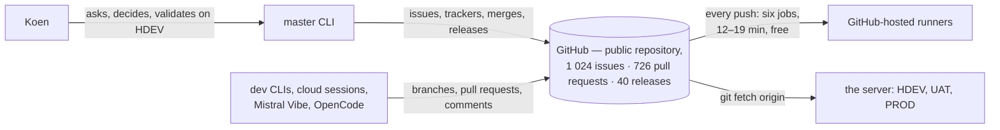
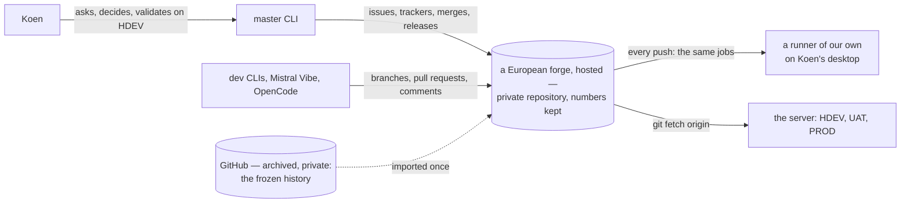
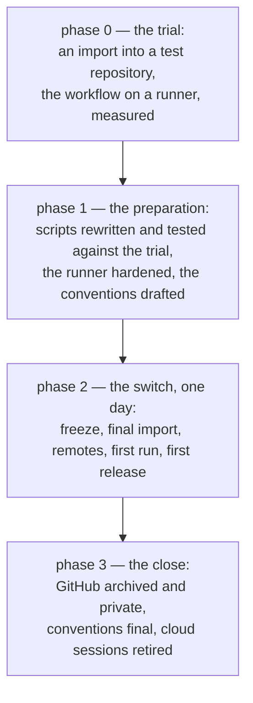
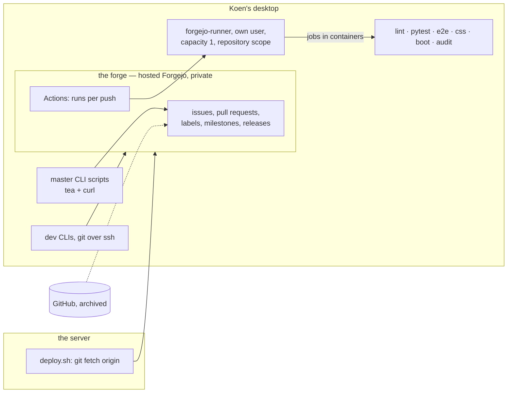

# Change Request 30 — A European forge: a hosted platform, a private repository, a runner of our own

**Project:** Web Portal "Raak Millegem"
**Status:** shaped on 8 October 2026 at Koen's request ("Is er eigenlijk een Europees alternatief voor github dat we zouden kunnen gebruiken?" — "Ja, en graag een CR hiervoor"), with his three refinements of the same day: hosted by preference, the repository private at the switch, the runner may run on his desktop · **parked by Koen on 8 October 2026 for a few weeks** ("we parkeren die repo vraag voor enkele weken") · tracking issue: on hold, created by the master CLI · build read: when the question is taken up again · not assigned to a release · nothing is built
**Tracking issue:** to be created — the one place where what is open stands; this document is the design, the issue is the status
**Applies to:** where the repository, its issues, pull requests and releases live; the CI workflow and the machine that runs it; the master CLI's scripts outside the repository; the conventions in `AGENTS.md` that name GitHub, `gh` or "public"; the Claude cloud sessions and the outside builders
**Reading:** A 1658 words · B 2555 · C 4212 (A 158 over, B 55 over: parked as shaped, trimmed when taken up) — measured on 8 October 2026 without drawings; the budget is A ≤ 1 500, B ≤ 2 500

---

# Part A — The business

## A1. Reason to act — the trigger

Koen asked on 8 October 2026 whether a European alternative to GitHub exists that the project could use. The project's own rule, *Europe First* (`AGENTS.md`), says that for every tool the European option is looked for first and preferred; the repository, its 1 750 issues and pull requests, and the CI that guards every push live at a non-European company. This document answers with measured facts and a route. Three refinements of the same day shape it: **hosted** by a European party rather than run by us; the code base **private** at the switch — known developers only, today Koen alone; the CI on **a machine of our own**, Koen's desktop.

## A2. As-is process — how it works today, and where it hurts

Everything passes through GitHub: the code, the discussion of every change (issues, review comments, the closing comments that tell Koen how to test), the release tags, the CI verdict that alone blocks a merge, and the server's deploy, which fetches `origin`. The master CLI drives it with `gh` and the GitHub API; the Claude cloud sessions push through Anthropic's integration.

Nothing is broken today. What is wrong is the **shape**: a project with *Europe First* in its rules depends, for its history of decisions and its safety net, on one non-European company, under a free plan that exists because the repository is public — and the question was never asked.

The second thing is older: the repository is public because GitHub's free CI wants it so, not because the project does. `AGENTS.md` carries a whole section (*This repository is PUBLIC*) of rules that exist only to keep out what should not be public; every leak found so far was a paste from a running environment into an issue. A private repository keeps those rules, but makes a slip a slip and not a publication.

## A3. To-be process — how it should work afterwards

The same process, on a European platform, with three differences the business sees:

- **The repository is private.** Known developers only: Koen, his CLIs, the builders he starts. The masking rules stay: the history was public for two years, and outside tools read the repository.
- **The CI runs on our own machine.** The same jobs, the same blocking verdict, on Koen's desktop in containers; the desktop has to be on. The wait becomes steadier — fixed cores, no shared queue — and depends on us.
- **Every number survives.** `#1745` stays `#1745`: one import into an empty repository, so the 396 issue numbers in the documents and the 2 247 commit messages that name one keep their meaning. GitHub keeps the frozen original, archived and private.

Unseen by the business: the Claude cloud sessions stop (A5), the master CLI's scripts are rewritten, the workflow file is ported.

## A4. Benefits — what the change earns

| # | Benefit | Measure |
|---|---|---|
| 1 | *Europe First* holds for the platform the project itself runs on, not only for the tools inside the app | the forge, the data and the CI are in the EU |
| 2 | The repository is private: a slip in an issue is a slip, not a publication | the *PUBLIC* section of `AGENTS.md` shrinks to the masking rules that still hold |
| 3 | The CI wait is ours: fixed cores, no shared queue, no plan limit | the run time after CR-29 holds on the runner (A8) |
| 4 | No dependency on a free plan that exists only while the repository is public — GitHub itself gives a private repository 2 000 CI minutes a month, which this project uses in two days | — |

## A5. Supplied material — and what it taught us

- **The master CLI's seven points** (8 October): the CI, the tooling, the references, the Claude side, what is at a non-EU party, self-hosting, the switch. Answered in B and C.
- **Codeberg's Terms of Use** (21 July 2026): no projects "that mostly consist of code written by 'generative AI'-tools", Claude named; private repositories "only for things required for FLOSS projects". This project is written by AI agents only and wants to be private: **Codeberg, the obvious choice, is excluded by its own terms**, twice.
- **Claude Code's documentation**: cloud sessions "require GitHub"; a bundle "can't push results back". **The cloud sessions end with the switch.** The terminal CLI depends on `gh` only, which every forge has an equivalent for.
- **Forgejo's import code**: an issue is imported with `Index: issue.Number` — numbers survive, into an empty repository.
- **The CI measurement** (CR-29 C1): pytest 12–19 minutes, the browser tests 9; Codeberg's largest hosted runner stops after 10. No hosted European runner found carries this suite: a runner of our own, for every candidate.

## A6. Business requirements — what the board asks, with MoSCoW

| # | Requirement | MoSCoW | Source | Comment |
|---|---|---|---|---|
| R1 | The repository, its issues, pull requests and releases live at a European party, hosted by that party. | Must | Koen, 8 Oct 2026 ("idealiter gehost") | EU zone (B8 Q2) |
| R2 | The repository is private from the switch on; only known developers have access. | Must | Koen, 8 Oct 2026 | the GitHub original becomes private and archived (B8 Q3) |
| R3 | Every issue and pull request keeps its number, text and comments; every reference from a document or a commit still points right. | Must | the project's documents (A3) | measured (C1) |
| R4 | The CI keeps every job it has today and stays the only thing that blocks a merge. | Must | `AGENTS.md`, *Reviews on request* | the runner is ours; the verdict is the forge's |
| R5 | The run is not slower than on GitHub for the same commit. | Must | Koen, 8 Oct 2026 (fixed cores) | A8; measured in phase 0 |
| R6 | A runner of our own runs on Koen's desktop, shielded from his files, and executes only what known developers pushed. | Must | Koen, 8 Oct 2026 | C5 |
| R7 | The master CLI drives the release the way it does today: merge, closing comment, evidence, tag from a release, deploy. | Must | `AGENTS.md`, *Running a release from the CLI* | the scripts are rewritten, the order is not |
| R8 | The switch is a single day with a way back; nothing is lost if it fails. | Must | — | B6 phase 2 |
| R9 | The forge works for **every builder**, not only Claude Code: Mistral Vibe, OpenCode, and whoever comes later. Everything `AGENTS.md` asks of a builder works without `gh` or with a tool each can call: open and update a pull request, read and write comments, read a tip's CI verdict, poll its own pull request; no step through one vendor's integration only; a limited token per builder; the one-branch-one-pull-request rule and the `Tool:` trailer stay. | Must | Koen, 8 Oct 2026 ("Mistral compatibel ook meeneemt als requirement, idem OpenCode") | measured per tool in phase 1, not assumed (B8 Q4, C2) |
| R10 | Claude cloud sessions continue. | Won't | the documentation (A5) | cloud sessions require GitHub; the terminal CLIs cover the work |

## A7. Non-functional requirements — security, privacy, house style, tenants

- **Security:** a runner executes every pushed commit: each job in a container, under its own Linux user, without Koen's project folder, keys or `raak`; work from this repository only (C5).
- **Privacy:** the discussion history carries no personal data by the masking rules, which stay; the forge's data stays in the EU (R1).
- **House style and tenants:** none.
- **Availability:** a verdict only while the desktop is on — accepted (Koen, 8 October); the alternatives are in B8 Q5.

## A8. Acceptance criteria — what the business signs off on HDEV

This change has nothing to see on HDEV; it is signed off on the new forge and in a terminal.

| # | Criterion | Requirement | Walkthrough steps |
|---|---|---|---|
| AC1 | On the new forge, issue and pull request numbers, titles, bodies, comments, labels, milestones and releases equal GitHub's: the counts match, ten spot checks by number match. | R3 | W1 |
| AC2 | A push to a branch with an open pull request starts one run on the runner with the same jobs as today, and the merge button refuses a red run. | R4 | W2 |
| AC3 | Five consecutive runs on master finish within the number CR-29 set for its phase (11 minutes after phase 1, 6 after phase 2). | R5 | W3 |
| AC4 | The runner's user cannot read Koen's project folder or home; a job that tries gets "permission denied"; the runner takes work from no other repository. | R6 | W4 |
| AC5 | One release runs end to end on the new forge with the master CLI's scripts: merge, closing comment, evidence, release with its tag, HDEV deploy. | R7 | W5 |
| AC6 | The repository on the forge is private; an anonymous request for its page gets no content; the GitHub original is private and archived. | R2 | W6 |

Walkthroughs: W1 the counts from before the switch against the forge's, and ten items by number on both. W2 a one-line push on a branch with a pull request; the merge tried while red. W3 the last five master runs with their durations. W4 `ls` of the project folder as the runner's user; a second repository that never gets a run. W5 the first release after the switch per `AGENTS.md`. W6 the repository URL without a session; GitHub's settings *archived* and *private*.

---

# Part B — The solution, for whoever approves it

## B1. Solution outline — the solution and the decisions that shape it

**In one paragraph.** The repository moves, in one import, to a **hosted Forgejo instance at a European provider**, **private**, with issues, pull requests, comments, labels, milestones and releases imported and every number kept. The CI runs on a **Forgejo runner on Koen's desktop**, in containers, under its own user, for this repository only; the workflow is the one CR-29 leaves, ported where Forgejo differs. The master CLI's scripts are rewritten against Forgejo's REST API: `gh` becomes `tea` (the Gitea CLI, MIT, v0.16.0) and `curl` where `tea` stops. GitHub keeps the frozen original, archived and private. The cloud sessions end; the terminal CLIs continue unchanged.

**The decisions that shape it:**

- **D1 — Forgejo, not GitLab, not Codeberg, not self-hosted.** Codeberg is excluded by its terms (A5). Self-hosting is against the preference and adds a service to keep. GitLab.com is a US company under the CLOUD Act, EU region or not. GitLab hosted at a European provider is the real alternative, B8 Q1's other answer: it keeps more of Claude Code's own integration (merge-request review posting, a GitLab CI integration in beta) but rewrites the workflow into GitLab's format, replaces `gh` by `glab`, and changes the issue and merge-request model. Forgejo reads the workflow we have, with small changes; its issue, pull request, label, mention, closing-keyword and release model is GitHub's; its import keeps the numbers. For a process written in GitHub's vocabulary, that is the smaller move.
- **D2 — hosted, dedicated instance.** The one hosted Forgejo provider with a dedicated instance, backups and updates found in Europe is Codey (VSHN, Switzerland; "hosted on European cloud infrastructure"; no runners yet). Its zone must be in the EU (B8 Q2); without one, self-hosted Forgejo at an EU provider is the fallback (B8 Q1). Codebahn and Fjord, listed by comparison sites, are not candidates (P14).
- **D3 — a runner of our own, on the desktop, shielded.** No hosted European runner gives this suite its time (P5), and a private repository on GitHub itself gets 2 000 minutes a month against about 30 000 used (P16). A runner is stateless — nothing to back up (Koen's question) — and the questions are safety, capacity and availability (C5, B5).
- **D4 — one import, into an empty repository.** Once, from GitHub with a token, into a repository without an issue yet, so `Index: issue.Number` holds (C1). No pull mirror: the switch is one day with a freeze (B6).
- **D5 — the GitHub original stays, archived and private.** The proof of what was said when, and the way back; old `github.com` links keep resolving for Koen (B8 Q3).
- **D6 — private, with the masking rules kept.** `AGENTS.md` *This repository is PUBLIC* becomes a section about a private repository that was public: the masking table and the guard stay; "never a real domain name" becomes Koen's choice (B8 Q6). The master CLI edits that file on Koen's word; this document lists what changes (C2).

## B2. Fit with the process and the requirements — for the business

| Requirement | How the solution meets it | Phase |
|---|---|---|
| R1 hosted, European | D2: a dedicated instance at a European provider; the zone verified in phase 0 | 0, 2 |
| R2 private | the repository is created private; GitHub's original made private at the close | 2, 3 |
| R3 numbers and links | D4: one import into an empty repository; AC1 counts and spot checks | 0 (trial), 2 |
| R4 the same CI | the ported workflow runs on the runner; the merge requires the run (branch protection on the forge) | 0, 1 |
| R5 not slower | measured in the trial on the desktop's cores; CR-29's numbers are the bar | 0 |
| R6 a shielded runner | C5: own user, containers, repository scope, no secrets | 1 |
| R7 the release as today | the scripts rewritten in phase 1 and proven on the trial repository; the first real release in phase 2 | 1, 2 |
| R8 one day, a way back | B6: the freeze, the final import, the checks, and `git remote` back to GitHub if a check fails | 2 |
| R9 every builder | measured per tool on the trial: what each uses of GitHub today, what it can do on the forge; a token per builder | 1 |

**What stays as it is:** the branch rules, the release order of `AGENTS.md`, the closing comment per issue, the tracker, the review door with its label and mention, the handover block, the deploy scripts (they fetch `origin`; only the URL changes).

## B3. The whole across the modules — for the architect

What this change touches, by module, and what it does not:

| Module | Touched | What |
|---|---|---|
| the forge | new | the instance, the organisation, the private repository, branch protection on `master` (the run required), the `ai-review` label |
| the runner | new | the service on the desktop, its user, its labels, its container image, its scope |
| `.github/workflows/backend-tests.yml` | ported | moved to `.forgejo/workflows/`; the differences of C4.2 applied |
| `bin/master-cli/*` (outside the repository) | rewritten | every `gh` call becomes `tea` or `curl` against the REST API; the GraphQL call for closing references becomes a read of the pull-request body (C2) |
| `AGENTS.md`, `CLAUDE.md`, `.claude/settings.json`, `.claude/agents/publieke-repo-bewaker.md`, the pull-request template | edited by the master CLI on Koen's word | what changes is listed in C3 |
| the server's checkouts (`hdev`, `uat`, `prod`, `caddy`) | one command each | the remote URL, with a read credential for a private repository |
| the application, the tests, the migrations | **untouched** | nothing in `backend/` changes; the gate of C7 is a test, not a change of the app |

## B3a. Standards the model follows — and where it deviates, on purpose

No data model. The workflow follows Forgejo Actions' documented subset of GitHub Actions; where the two differ, C4.2 names the key and the replacement.

## B4. Rules this change needs an exception from — decided once, here

| Rule | Exception | Mechanism | Decided by |
|---|---|---|---|
| *This repository is PUBLIC* (`AGENTS.md`): never a real domain name, placeholders everywhere | the repository becomes private; the masking of credentials, IPs, hostnames and personal data **stays**; whether a real domain name may now appear is Koen's (B8 Q6) | the section is rewritten by the master CLI at phase 3 | Koen, at phase 3 |
| *Every deployable code change goes through an issue* | none: the runner and the forge are not deployable code; the workflow port is, and it gets its issue | — | — |
| The cloud sessions as a shaping channel (CR-21, CR-24, CR-25 were shaped there) | they end with the switch (R10); the architecture CLI in the terminal takes the documents over | the sessions push their last state to GitHub before the freeze | Koen, at phase 2 |
| *Keep one full suite at a time per machine* (the local test rule) | the runner is a second full suite on the same desktop; `capacity: 1` and the rule "a dev CLI runs no full suite while a run is in progress" — or the reverse: the runner waits | B8 Q5 | Koen |

## B5. Cost — investment and running cost, and what operations must know

**Investment:** phase 0, the trial: S, one master-CLI day. Phase 1, the scripts (eleven, twenty-two `gh` calls, one GraphQL) with tests against the trial, the runner's hardening, the conventions drafted: M, about two CLI-days. Phase 2, the switch: one day of Koen and the master CLI, the dev CLIs idle. Phase 3: S. Together about M, four to five CLI-days and two of Koen's.

**Running cost:** the hosted instance — Codey's smallest plan shown at CHF/EUR 19 per month on 8 October 2026 (69 and 129 above it; the portal decides, phase 0); the self-hosted fallback a small EU server at €5 to €10 plus its keeping. The runner: a desktop that is on anyway. **Against today: €0** — but GitHub-private would not be €0 either (P16).

**What operations must know:** the runner is a systemd service under its own user, restarted by a reboot, updated by hand with the instance (Codey runs the latest Forgejo only). The server's four checkouts need the new remote and a read credential before the first deploy. The desktop off: every push waits in the queue — nothing lost, nothing runs.

## B6. Phasing — shippable phases, and what changes on the failure paths

| Phase | Delivers | Migration | Env vars | Data | Failure paths that change | Manual validation |
|---|---|---|---|---|---|---|
| 0 — the trial, before assignment | a trial instance with a **test** import of the whole repository; the runner on the desktop; the workflow ported; AC1 and AC3 measured; C4.2's differences, the zone and the plan confirmed | none | none | none | none: nothing moves | Koen opens ten issues by number |
| 1 — the preparation | the eleven scripts rewritten and proven on the trial (a merge, a release, a tracker update); the runner hardened (C5); the conventions drafted as a held pull request; every builder tried on the trial (R9) | none | the forge token, in a file outside the repository | none | a script that still calls `gh` fails at once | one trial release end to end |
| 2 — the switch, one day | the freeze; the final import into the empty private repository; AC1's counts; the remotes; the first run, merge and release; the conventions merged | none | the read credential on the server | none | **a check fails → the remotes back to GitHub, the forge repository deleted, the freeze lifted; GitHub was never touched** | AC1, AC2, AC5, AC6 |
| 3 — the close | GitHub archived and private; the *PUBLIC* section rewritten; the cloud sessions retired; every CLI's memories corrected; this document closed out | none | none | none | — | AC6 |

**Order:** parked; not assigned to a release. Phases 0 and 1 run beside a release; phase 2 needs a day without open pull requests, between two releases. CR-29 lands first (v2.16): phase 0 ports the workflow it leaves.

## B7. Rule and gatekeeper — what this fixes for all future work

**The forge is a tool, and *Europe First* applies to it like to every tool.** The gate of C7 keeps the repository forge-neutral: no script calls `gh`, no document links to `github.com` for something that lives here, the workflow directory is the forge's own. The dependency this change removes may not grow back by habit.

## B8. Open decisions — what the approver still decides

| # | Question | Recommendation | What the answer changes |
|---|---|---|---|
| Q1 | The forge: hosted Forgejo (D1), hosted GitLab, or self-hosted Forgejo as fallback? | Hosted Forgejo: the workflow, the vocabulary and the numbers carry over. | GitLab: C2 and C4.2 rewritten for `.gitlab-ci.yml` and `glab`; number preservation re-verified for GitLab's importer. |
| Q2 | The provider: Codey (Swiss company, European infrastructure) — is a Swiss seat European enough, and must the zone be in the EU? | The zone in the EU; the Swiss seat accepted (an EU adequacy decision covers it). | No EU zone → the self-hosted fallback, and B5's running cost changes. |
| Q3 | The GitHub original: archived and private (D5), archived and public, or deleted? | Archived and private: the proof and the way back, no longer a publication. | Public: readable by anyone. Deleted: no way back after phase 3. |
| Q4 | The builders: which of Mistral Vibe and OpenCode can push to, open a pull request on and comment on a Forgejo repository, and with which tool? | Measured in phase 1 on the trial, by Koen who starts them, per tool: what it calls of GitHub today (`gh`? the API? git only?), what replaces it. A user and a limited token per builder, so a builder reaches its own branch only (today all push as Koen). | A tool that cannot comment: its reviews come through Koen's paste again, as before CR-18; a tool that cannot push over ssh is out. |
| Q5 | The runner beside the dev CLIs on one desktop: `capacity: 1` with the runner first, or a second machine? | `capacity: 1`, the runner first: a run gates a merge, a local suite is a check; phase 0 measures whether 12 cores carry both. | A second machine: a small EU server at about €10 per month, always on — and A7's availability question disappears. |
| Q6 | Private: may a real domain name now stand in the repository (the Caddy site files, the smoke tests)? | No: keep the placeholders; outside tools read the files and the history was public. | Yes: the `.env.caddy` indirection could go; a change of its own. |

## B9. Decisions log — dated answers

| Date | Decision | By |
|---|---|---|
| 8 Oct 2026 | Koen asks whether a European alternative to GitHub exists; the master CLI proposes an exploration as a change request, without release; Koen: "Ja, en graag een CR hiervoor." The master CLI relays seven points to measure. | Koen |
| 8 Oct 2026 | "En idealiter gehost": a hosted European service by preference; self-hosting only as fallback. | Koen |
| 8 Oct 2026 | "Zou het CI wel zelf kunnen? Dat moeten niet backuppen?": the CI may run on a runner of our own; a runner is stateless. Worked out as the main variant (D3). | Koen |
| 8 Oct 2026 | "Ik zou stoppen met publieke code base op het moment van de switch. Enkel bekende devs werken op code base. Momenteel ben ik het alleen en zou het wel op desktop kunnen.": private at the switch; the runner on the desktop (R2, R6). | Koen |
| 8 Oct 2026 | Codeberg excluded: its Terms of Use (21 July 2026) refuse projects mostly written by generative-AI tools and allow private repositories only for FLOSS needs; the repository carries no free licence either (A5, C1). | architecture CLI, measured |
| 8 Oct 2026 | "Mistral compatibel ook meeneemt als requirement, idem OpenCode": the forge works for every builder — R9 a Must, with the four points the master CLI drew from it (no `gh`-only step, no vendor-only integration, a token per builder, the branch rule and the `Tool:` trailer kept). | Koen |
| 8 Oct 2026 | "We parkeren die repo vraag voor enkele weken": the document stands as shaped, parked; the tracking issue is on hold; phase 0 starts when Koen takes the question up again. | Koen |
| 8 Oct 2026 | The Claude cloud sessions end with the switch: the documentation says cloning and pull requests require GitHub and a bundle cannot push back (R10, C1). | architecture CLI, measured |

---

# Part C — The build, for the master CLI and the dev CLIs

## C1. Verified premises — measured before the handover

*Measured on 8 October 2026 on master `82722f63`'s ancestry for the repository, on the master CLI's scripts outside the repository, and on the providers' own pages (fetched that day; a page is a premise with a date, not a fact that holds). Re-measured on the handover commit: not yet.*

| # | Premise | Measured | Holds |
|---|---|---|---|
| P1 | The repository has 1 024 issues, 726 pull requests, 40 releases, no discussions. | `gh api graphql` on the repository, 8 Oct 2026 | yes |
| P2 | Issue numbers are everywhere: 396 distinct `#NNNN` in `docs/` and `AGENTS.md` (1 406 mentions), 7 783 mentions in `backend/` and `scripts/`, 2 247 of 3 400 commit messages name one. | `grep -rhoE '#[0-9]{2,4}\b'`, `git log --oneline` | yes |
| P3 | Forgejo's importer keeps the number: `Index: issue.Number` in `CreateIssues`, `Index: pr.Number` in `newPullRequest` (`services/migrations/gitea_uploader.go`, branch `forgejo`). Authors without a local account become the ghost user with the original name kept (`RemapExternalUser`). | the file, read 8 Oct 2026 | yes, into an **empty** repository; the trial proves it (phase 0) |
| P4 | Codeberg refuses the project: ToU §2(1)(7) "You must not share projects that mostly consist of code written by 'generative AI'-tools"; §2(1)(2) "Private repositories are only allowed for things required for FLOSS projects"; §1(2) "open for all projects covered by a licence for free and open source software". The repository has no `LICENSE` file (`git ls-files`). | `Codeberg/org` `TermsOfUse.md`, last commit 2026-07-21 | yes |
| P5 | Codeberg's hosted Forgejo Actions runners: `codeberg-tiny` 1 CPU/2 GB/2 min, `codeberg-small` 2/4/5 min, `codeberg-medium` 4/8/10 min; public free-licence projects only. Our pytest job: 12–19 min today, ≤ 11 after CR-29 phase 1. | `codeberg.org/actions/meta`, CR-29 C1 | yes: no hosted label carries the suite |
| P6 | Claude Code cloud sessions: "repository cloning and pull request creation require GitHub"; a non-GitHub repository "as a local bundle … but the session can't push results back"; the trusted network allowlist names gitlab.com and bitbucket.org, not codeberg.org or a self-hosted forge. The terminal CLI: `/install-github-app` and `/autofix-pr` are GitHub-only; `/code-review --comment` and `--from-pr` also know GitLab merge requests; nothing names Forgejo or Gitea. | code.claude.com docs, read 8 Oct 2026 by a guide agent | yes |
| P7 | Forgejo Actions reads `.github/workflows/` when `.forgejo/` is absent; supports `services:` (a Postgres container), `concurrency` with `cancel-in-progress`, `timeout-minutes`, `needs`, `strategy.matrix`; `on.push.paths` is documented, **`paths-ignore` is not**, and `on.pull_request` documents only `types`; actions resolve against `DEFAULT_ACTIONS_URL` (`data.forgejo.org` by default) and the docs recommend fully qualified URLs; `actions/setup-python` is mirrored at `code.forgejo.org` (synced 8 Oct 2026); the default image Codeberg uses is `ghcr.io/catthehacker/ubuntu:act-latest`. | forgejo.org docs, reference page | yes; C4.2 |
| P8 | The workflow uses only `actions/checkout` (6×) and `actions/setup-python` (5×); no `GITHUB_TOKEN`, no secrets, no artifact upload; three jobs use a `postgres:16` service; the e2e job runs `playwright install --with-deps chromium`; two jobs `apt-get install` (inkscape, faketime). | `.github/workflows/backend-tests.yml:13-255` | yes |
| P9 | The master CLI's scripts: eleven files in `bin/master-cli`; 22 `gh` invocations — `gh api` 4 (one GraphQL: `closingIssuesReferences`, `merge-pr.sh:36`), `gh run view/list/watch` 5, `gh pr merge/view/list` 4, `gh issue view/comment` 3, `gh release create` 1, and the rest in the Python helpers. `merge-naar-master.sh`, `start-worktree.sh`, `raak.sh`: no `gh`. | `grep -c '\bgh\b'` | yes |
| P10 | Inside the repository, `gh` appears in `AGENTS.md`, the public-repo guard agent and CR-29 only; `github.com` in three files (two are dependency links: Tailwind, Inter; one the clone URL). `.claude/settings.json` allows `Bash(gh:*)`. | `grep -rln` | yes |
| P11 | The server fetches `origin` (`deploy.sh:87-91`: `git fetch --tags --force origin master`, `git fetch --tags --prune origin`); the remote URL is per checkout. | `deploy.sh` | yes |
| P12 | `tea` v0.16.0 (10 Sep 2026, MIT) covers issues, pull requests (checkout, not merge in its index), releases, comments, labels, milestones, action secrets; it logs in with an application token; Forgejo's REST API takes `Authorization: token …`, has a Swagger reference per instance and **no GraphQL**. | gitea.com/gitea/tea, forgejo.org API usage page | yes; C2 uses `curl` where `tea` stops |
| P13 | Codey (VSHN): "your own dedicated, isolated Forgejo instance … hosted on European cloud infrastructure"; "updates, backups, monitoring, and security patches are handled"; "Forgejo Actions (CI/CD) runners are not available yet"; "only supports the latest available Forgejo version"; repository migration timeout 30 minutes; plans in the portal, Mini shown at CHF/EUR 19 per month on the home page. | codey.ch, docs.servala.com, 8 Oct 2026 | the zone and the plan: **to confirm in phase 0** |
| P14 | Not candidates: Codebahn (the domain `codebahn.com` redirected to a domain-for-sale page on 8 Oct 2026, while comparison sites still list it as Hackerman AB, Sweden, €7–9 a month — re-check when the question is taken up), Fjord (Raster & State LLC, no country), GitLab.com (hosted in a US region; EU residency only on GitLab Dedicated), Gitea Cloud (not European). Stackhero (France) hosts GitLab by the hour with daily backups; CI capacity not stated; GitLabHost named by the master CLI, not looked at. Framagit: no runner information found. | the providers' pages, 8 Oct 2026; the master CLI's search of the same day | yes; Q1 |
| P15 | Koen's desktop: 12 cores, 15 GB, Docker 29.8. | `nproc`, `free -g`, `docker --version` | yes |
| P16 | GitHub's free plan: 2 000 Actions minutes a month for private repositories; this project's runs: about 30 a day × 35 job-minutes (CR-29 C1) ≈ 30 000 a month. | GitHub's plan page (known figure; re-check in phase 0), CR-29 C1 | yes |

## C2. Per module: what must happen

| Module | What must happen | Reads |
|---|---|---|
| **the forge (phase 0, then 2)** | an organisation and a private repository, created empty; the import from GitHub with a token, with issues, pull requests, labels, milestones, releases ticked, within the provider's 30-minute migration timeout (P13 — a repository of 27 MB with 1 750 items; measured in the trial); branch protection on `master`: the run required, no force push; the `ai-review` label; the `.forgejo/PULL_REQUEST_TEMPLATE.md` (Forgejo also reads `.github/`) | P1, P3, P13 |
| **the runner (phase 0, hardened in 1)** | `forgejo-runner` as a systemd service under a user `forgejo-runner` with no home in Koen's folders, member of `docker`; registered with a **repository-scoped** token (the runner accepts this repository's workflows only); labels `ubuntu-latest:docker://ghcr.io/catthehacker/ubuntu:act-latest` so `runs-on: ubuntu-latest` keeps working; `capacity: 1` (Q5); jobs in containers; the Docker socket not mounted into jobs; Playwright's browser download and the apt installs run inside the job container as on GitHub — the image is cached by Docker after the first run | P7, P8, P15, C5 |
| **the workflow** | moved to `.forgejo/workflows/backend-tests.yml`; `actions/checkout@v4` → `https://code.forgejo.org/actions/checkout@v4`, `actions/setup-python@v5` → `https://code.forgejo.org/actions/setup-python@v5` (fully qualified, P7); `paths-ignore` (CR-29 D2) replaced by what Forgejo offers — `on.push.paths` is a positive list and does not express "everything but these"; the candidates are `[skip ci]` in the commit message of a docs commit (Forgejo honours it) or no filter at all; decided in phase 0 on the trial (C4.2); `on.pull_request.branches` not documented → the gate of CR-29 C7 (3) is adapted; `concurrency` and `timeout-minutes` stay | P7, CR-29 C2 |
| **`bin/master-cli` (phase 1)** | `gh pr merge` → `tea pr merge` or `curl -X POST …/pulls/{n}/merge`; `gh pr view --json` → `curl …/pulls/{n}`; the GraphQL `closingIssuesReferences` → the closing keywords read from the pull-request body (`Fixes #NN` on its own line, as the memory rule already requires) — one source, the body; `gh run list/view/watch` → `curl …/actions/runs` and `…/actions/jobs` (the Swagger of the instance says which fields; the trial proves the polling), `gh release create` → `curl -X POST …/releases` with `tag_name` and `target_commitish` (the tag is created server-side, as on GitHub — proven in the trial, AC5); `gh issue comment` → `tea comment` or `curl …/issues/{n}/comments`; `gh api` in the Python helpers → `requests` against the same paths; the token read from a file outside the repository, never a command argument. Every script keeps its name and its arguments; a test per script against the trial repository | P9, P12 |
| **the server's checkouts (phase 2)** | `git remote set-url origin <forge>` in `hdev`, `uat`, `prod` and `caddy`; a deploy key (read-only) or a token per checkout, because the repository is private; `deploy.sh` unchanged | P11 |
| **the worktrees on the desktop and the laptop (phase 2)** | `git remote set-url origin`; `start-worktree.sh` unchanged (no `gh`, P9) | P9 |
| **the conventions (drafted in 1, merged in 2, final in 3)** | `AGENTS.md`: every "GitHub" that means the forge; `gh` → `tea`/the API; *Releases* — "Creating a Release on GitHub creates the tag server-side" rewritten for the forge; *This repository is PUBLIC* → *This repository was public* (B4, Q6); the cloud-environment note ("403 on tag refs") deleted; `.claude/settings.json`: `Bash(gh:*)` → `Bash(tea:*)`; the public-repo guard agent renamed and its checklist kept. **Edited by the master CLI on Koen's word; this row is the list, not the edit** | P10 |
| **the Claude side (phase 2)** | the cloud sessions push their last state before the freeze and are not started again; the architecture CLI in the terminal takes over the documents of CR-21, CR-24, CR-25; `/autofix-pr`, `/install-github-app`, the GitHub App: unused afterwards; commit attribution (`Co-Authored-By`, `Claude-Session`) is text and stays | P6 |
| **the builders (phase 1, Koen)** | first measured, per tool, what it uses of GitHub today — Mistral Vibe posts review comments on issues and pull requests (CR-18), OpenCode pushes branches; through `gh`, the API or git only is not known and is not assumed. Then each tried on the trial repository with its own user and token: a branch pushed over ssh, a pull request opened and updated, a comment read and written, the run's verdict read, its own pull request polled. What a tool cannot do is recorded in Q4's answer. The Claude CLIs are measured the same way: nothing in the process may depend on the GitHub App or the cloud proxy (R9) | R9, P6 |
| **the application, the tests** | nothing; the gate of C7 is added to `backend/tests/` | — |

## C3. Cross-cutting impact — the checklist of what gets forgotten

| Concern | This change |
|---|---|
| **Visitors and tenants** | none: no screen, no route. |
| **Order inside a transaction** | none. |
| **The links in old comments** | a `github.com/KoenRenders/KoenTest/issues/NNNN` link in an imported comment keeps pointing at GitHub; it resolves for Koen (signed in, archived repository) and nobody else needs it; the forge's own `#NNNN` references resolve on the forge. Not rewritten: 1 750 items, and the original is the proof. |
| **The edit history of issues** | GitHub's edit history is not imported; the forge starts its own. For the leaks the *PUBLIC* section remembers, that is a gain: the history is on the archived, private original only. |
| **Attachments and screenshots** | screenshots are never in the repository or in issues (the rule); an imported attachment, if any, is checked in the trial. |
| **The review door** | the `ai-review` label and the @-mention exist on Forgejo; the reviewer's answer per `docs/review-protocol.md` is a comment, as today. The protocol document names GitHub where it means the forge: one of the master CLI's edits. |
| **The memories of every CLI** | each session carries memories that say `gh`, "GitHub", "the GitHub App", "tag refs 403": corrected at the switch, by each session, as CR-29 does for its own rule. |
| **The `v1.14.0` parity rule** | `git show v1.14.0:…` reads a tag from the local clone; unchanged once the tags are fetched from the forge (the import brings the tags with the releases; the trial counts them: 40). |
| **CR-29** | lands first; this change ports its workflow and its gate; `paths-ignore` is the one piece without a one-to-one translation (C4.2). CR-29's scripts outside the repository are rewritten once more here — the two changes touch the same eleven files, in that order. |
| **CR-18** | the review door stays; what it says about GitHub as the portal is true of the forge. |
| **Mirror the other way?** | none: a GitHub mirror of a private repository would make it public again or need a second private plan. |

## C4. Detailed decisions — one subsection each, with the reasons

### C4.1 Why not Codeberg, and why not GitHub-private (D1, D3)

Codeberg is the answer every comparison gives and the one the master CLI expected. Its Terms of Use of 21 July 2026 close it twice for this project: a project "mostly consisting of code written by generative-AI tools" may not be shared there, and this repository is written by AI agents only by its own rules; and a private repository is allowed only "for things required for FLOSS projects", while Koen wants the whole repository private. A free licence would be the third condition. The document says this first because it changes the shape of the answer: the free, non-profit, hosted European option does not exist for this project, so every remaining option costs money or a machine.

GitHub-private is the null option and is not free either: 2 000 minutes a month against about 30 000 used, so a runner of our own would be needed there too (P16). Everything else would stay. It is the measure of what the move costs, not a European answer.

### C4.2 The workflow on Forgejo Actions (P7)

Three differences matter for the file CR-29 leaves. **Action references:** a bare `actions/checkout@v4` is resolved against the instance's `DEFAULT_ACTIONS_URL`; the fully qualified `https://code.forgejo.org/actions/checkout@v4` works on every instance and says where the code comes from — it is the form the build uses. **`paths-ignore`:** not in Forgejo's reference; `on.push.paths` is a positive list, and listing every path that *should* run (`backend/**`, `scripts/**`, `.forgejo/**`, `CONTRACT.md`, `docs/reporting-universe.md`, …) is a second copy of what the tests read — the thing CR-29's gate was built to refuse. The candidates: the master CLI's docs commits carry `[skip ci]` in their message (one script, `cr-log-add.py` and `merge-docs-branch.sh`, writes most of them), or the filter is dropped and a docs commit costs a run on our own cores, which is cheap now. Decided on the trial (phase 0), recorded in B9. **`on.pull_request.branches`:** not documented; the gate of CR-29 C7 (3) asserts the push trigger only, or whatever the trial shows Forgejo honours.

Unchanged: `services:` with `postgres:16` (the host name is the key, as on GitHub), `concurrency` with `cancel-in-progress`, `timeout-minutes`, `needs`; the apt installs and the Playwright download run inside the `catthehacker` image, which is Ubuntu with the tools GitHub's runner image has, minus what it has not — the trial's first run is the list.

### C4.3 The runner's isolation (R6, C5)

A runner executes what is pushed; with a private repository that is Koen's CLIs and the two outside builders, whose code arrives unread until review. The runner therefore runs **as its own Linux user** (no access to Koen's home, his Nextcloud folder, `~/.ssh`, the `raak` alias), **jobs in containers** with no Docker socket inside, **registered at repository scope** so it picks up this repository's workflows only, **with no secrets**: the workflow needs none (P8), and a fork's pull request would get none anyway. What a job can reach: the network (package indexes, the Playwright download), its own container, the runner's cache directory. The desktop's other work (a dev CLI's local suite) competes for cores, not for data (Q5).

### C4.4 One import, numbers kept (D4, P3)

Forgejo's importer writes each issue and pull request with the index it had at the source. That holds when the target repository has no issue yet — an import into a repository where someone already opened `#1` shifts nothing but would make the next created number collide with an imported one. So: create the repository, import, and only then open the first new issue. Pull requests become pull requests with their branches where the branch still exists and closed pull requests without one — the discussion and the number survive, the diff of a merged pull request is in git. The trial counts: issues 1 024, pull requests 726, releases 40, tags per release, labels, milestones; ten items read by number on both sides.

### C4.5 The switch day (R8, B6 phase 2)

Morning: the freeze — every worktree pushed, every cloud session pushed its last state, no pull request open (between releases). The import into the empty private repository; the counts; the ten spot checks. The remotes: the worktrees on the desktop and the laptop, the server's four checkouts with their read credential. One push on a branch with a pull request: the run, the merge, the closing comment, by the scripts. The conventions merged. Afternoon: the first HDEV deploy from the forge (`raak deploy hdev` fetches `origin`). **Any check fails:** the remotes back to GitHub, the forge repository deleted, the freeze lifted; GitHub was not written to. Phase 3, a week later when nothing surfaced: GitHub archived and private.

## C5. Privacy and security — the mechanics behind A7

- **The runner:** own user, containers, repository scope, no secrets, no Docker socket (C4.3). The service file, the user and the registration are the master CLI's, outside the repository, next to its other scripts; documented there, not here.
- **The forge token** of the master CLI: an application token with repository scope, in a file outside the repository, read by the scripts, never in a command line (`AGENTS.md`'s shell-history rule). The server's read credential: a deploy key per checkout, read-only.
- **The private repository:** access by invitation; the outside builders get a user each with write access to branches and nothing else; branch protection keeps `master` the master CLI's.
- **The masking rules** stay in force: the history was public, the outside tools read the repository, and a private repository is one setting away from a public one.
- **The forge's data:** in the EU (Q2); backups by the provider (P13); the GitHub original as the second copy until phase 3, the local clones afterwards — a git repository is its own backup for the code; the issues are exported once a quarter with the API to a file outside the repository (a one-line script of the master CLI).

## C6. Tests — what the build must prove

| T | What it proves | Becomes red when |
|---|---|---|
| T1 | The import kept the numbers: for every issue and pull request number from a `gh api` export taken before the switch, the forge returns the same title and the same number of comments — a script run on the trial and on the day | an item is missing, shifted, or lost its comments |
| T2 | The ported workflow has the same jobs with the same steps as the GitHub one, minus the three documented differences (C4.2): a diff of the two YAML files normalised | a step was dropped in the port |
| T3 | Each rewritten script does on the trial repository what it did on GitHub: a merge closes the referenced issue, a release creates its tag, the wait script returns the conclusion of the latest run, the tracker script keeps every `[x]` | a script's replacement call returns a different shape |
| T4 | The runner's user cannot read Koen's folders: a job step that lists the owner's home fails with "permission denied"; a job cannot reach the Docker socket | the service runs as Koen, or the socket is mounted |
| T5 | The runner serves this repository only: a second trial repository on the same instance with the same `runs-on` never gets a run | the runner was registered at organisation or instance scope |
| T6 | Five master runs on the runner within CR-29's number for the phase (AC3) | the desktop's cores carry less than GitHub's four, or the image download is counted every run |

## C7. The gate — what refuses a deviation from now on

`tests/test_forge_neutral_gate.py`, **hard**, from phase 2: (1) no file under `scripts/` or `backend/` invokes `gh ` — message "`<file>` calls `gh`; the forge is not GitHub — CR-30"; (2) no Markdown under `docs/` links to `github.com/KoenRenders/KoenTest` — "`<file>` links to the archived GitHub repository; link the forge — CR-30"; (3) the workflow directory is `.forgejo/workflows/` and `.github/` holds no workflow — "a workflow under `.github/` does not run here — CR-30". Proven red once per rule with an additive violation in a copy, then removed. The gate of CR-29 (`test_ci_workflow_gate.py`) reads the moved file.

## C8. Prototype findings — what was measured before the build

Phase 0 *is* the prototype; its findings go here: the import's duration and counts, the first run's missing tools in the image, the five run times, Forgejo's answer to `paths-ignore` and `pull_request.branches`, the provider's zone and plan. Nothing measured yet beyond C1.

## C9. Screens before the build — the concepts the approver saw

No screen changes. The one thing Koen looks at before phase 2 is the trial repository itself: ten issues by number, one pull request with its review comments, one release with its tag.

## C10. Close-out at the release

> [!NOTE]
> *Filled in by the architecture CLI when phase 3 is done (`CLAUDE.md`, release step 14, applied to a change without a release): the status line set to "switched on …"; every as-built deviation in B9 and folded into the text it contradicts; the tracking issue closed with a comment naming the day.*

## Q&A log — asked once, answered here

| # | Date | Question (who) | Answer |
|---|---|---|---|
| — | 8 Oct 2026 | The master CLI's seven points, relayed with Koen's request. | 1 the CI: no hosted European runner carries the suite; a runner of our own (D3, P5). 2 the tooling: 22 `gh` calls in eleven scripts, one GraphQL; `tea` + REST (P9, P12, C2). 3 the references: numbers survive the import (P3, C4.4). 4 the Claude side: cloud sessions end, the terminal CLIs continue (P6). 5 what is at a non-EU party: the history and the dependency, not secrets — and the public-ness itself, which Koen ends (D6). 6 self-hosting: not preferred; hosted dedicated instance (D2). 7 the switch: one day with a freeze and a way back (C4.5). |
| — | 8 Oct 2026 | Koen: hosted by preference. | D2; self-hosted is the fallback of Q1. |
| — | 8 Oct 2026 | Koen: can the CI be ours, is there nothing to back up? | A runner is stateless; the questions are safety, capacity, availability (D3, C4.3, Q5). |
| — | 8 Oct 2026 | Koen: private at the switch, known developers only, the runner on the desktop. | R2, R6, D5, D6; what "private" changes in `AGENTS.md` is C2's conventions row and B4; Q6 is his. |
| — | 8 Oct 2026 | The master CLI's own search (Codeberg's July 2026 vote, 358 to 144, on the generative-AI clause; Codebahn, Codey at CHF 69/149, Stackhero, GitLabHost, GitLab.com under the CLOUD Act; self-hosted Forgejo as fallback). | Agrees with C1 where both looked; the Codey prices differ between its pages (19/69/129 on the home page, 69/149 on a landing page) — the portal decides in phase 0 (P13); Codebahn's domain was for sale when fetched (P14); the CLOUD Act point added to D1's reasoning against GitLab.com. |
| — | 8 Oct 2026 | Koen: every builder must be able to work on the forge, Mistral Vibe and OpenCode named. | R9 a Must; measured per tool in phase 1, nothing assumed (C2). |

## Non-goals — deliberately outside this change

- Self-hosting the forge on the PROD server or next to it: against the preference, and the forge would share the machine that serves members.
- A second runner, a hosted runner, or a runner on the laptop: Q5 names the one alternative; more is not needed for one developer.
- Rewriting old comments' `github.com` links: 1 750 items for a reader who is signed in anyway.
- Moving the Nextcloud project folder, the screenshots or the `raak` tooling: outside the repository already and unaffected.
- Changing the app, the tests or the migrations: nothing in `backend/` moves.
- A licence for the repository: private needs none; it would only matter for Codeberg, which is excluded anyway.

## Relationship to existing work — issues and change requests

- CR-29 (a shorter CI): lands first; this change ports its workflow, its gate and its scripts (C3).
- CR-18 (review on request): the review door stays as it is, on the forge.
- CR-21, CR-24, CR-25: shaped in a cloud session, which ends with the switch; their documents are taken over by the architecture CLI in the terminal.
- `AGENTS.md` *Europe First*, *This repository is PUBLIC*, *Releases and hotfixes*, *Running a release from the CLI*: the sections the master CLI edits on Koen's word (C2).
- The master CLI's scripts outside the repository (`bin/master-cli`, P9).
