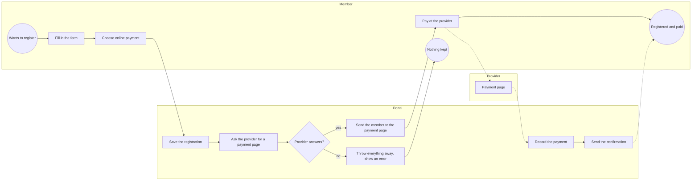
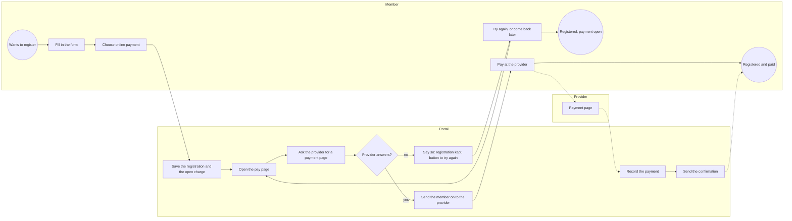
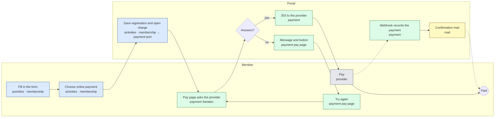
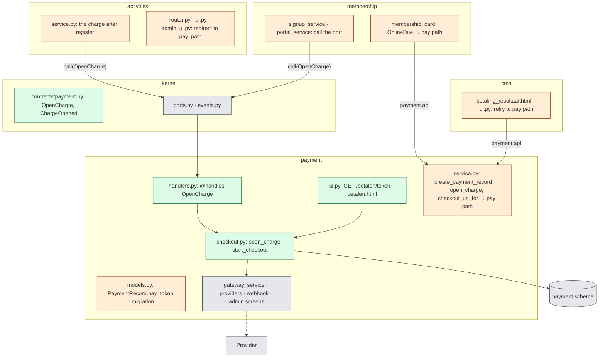
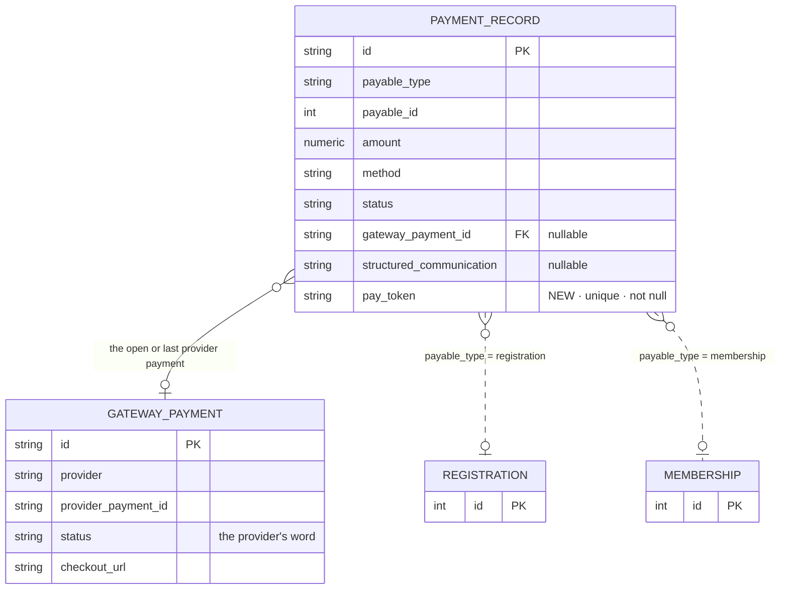

# Change Request 31 — The checkout in two steps: a registration stands with an open charge when the provider does not answer

**Project:** Web Portal "Raak Millegem"
**Status:** shaped on 9 October 2026 · **not planned on any release** (Koen, 9 October 2026: "ja, goed idee, maar niet in v2.16" and "Dit plannen we ooit") · the build read is routed to dev2 (#1829, without hurry); the screen concepts (C9) follow it · one question open (Q6)
**Tracking issue:** #1829 — the one place where what is open stands; this document is the design, the issue is the status
**Applies to:** payment (a port, a pay route with its page, one column), activities and membership (the three doors that open a charge), cms (the return page's retry), the events gate of CR-13 (three declared calls leave it); mail and reporting are used, not changed
**Reading:** A 1 500 words · B 2 496 · C 4 101 — code fences excluded, table pipes counted, measured on 9 October 2026; the budget is A ≤ 1 500, B ≤ 2 500

---

# Part A — The business

## A1. Reason to act — the trigger

A member who registers, renews a membership or signs up a family and pays online is sent to the provider's payment page. When the provider does not answer, the portal throws everything away: registration, answers, family. The screen says *"… Je inschrijving is niet bewaard — probeer ze later opnieuw"*, and the member starts over, if at all.

Not acceptable for a thing the member did right: the association wants the registration kept and the payment tried again, now or later. Koen, 9 October 2026, to the proposal: *"ja, goed idee, maar niet in v2.16."*

Two more reasons made it a change request and not a repair: the domain-boundary work (CR-13) found these three places the last where one part of the portal reaches an outside service on another's behalf, and the coming webshop (CR-21) needs the same two steps — order, then pay.

## A2. As-is process — how it works today, and where it hurts

*What to see: saving and asking the provider are one step; a silent provider takes the saving with it.*

| # | Step | Who | Pain |
|---|---|---|---|
| 1 | Fill in the form, choose online payment | member | — |
| 2 | Save and ask the provider, in one movement | portal | a silent provider undoes the saving |
| 3 | Error "niet bewaard — probeer later opnieuw" | portal → member | everything typed is gone: registration, answers, family and persons |
| 4 | Pay at the provider, come back | member | — |
| 5 | Record the payment, confirm by mail | portal | — |

Three places do this: registering for an activity (public and from the board), renewing a membership in *Mijn gezin*, and *Word lid*. How often the provider is silent is not measured; the backend log carries one line per occurrence (*"Betaling aanmaken mislukt"*), countable on PROD before the build.

## A3. To-be process — how it should work afterwards

*What to see: one step split in two; saving stands, asking the provider is its own repeatable step.*

| # | Step | Who | What changes |
|---|---|---|---|
| 1 | Fill in the form, choose online payment | member | — |
| 2 | Save the registration **and the open charge** | portal | the saving stands, whatever the provider does |
| 3 | The portal's pay page asks the provider and sends the member on | portal | new; normally invisible — the browser goes straight on |
| 4 | Silent provider: the pay page says the registration is kept, offers to try again | portal → member | replaces the error |
| 5 | Pay at the provider, come back | member | — |
| 6 | Record the payment, confirm by mail | portal | — |

The state "registered, not yet paid" exists today for a member who closes the provider's page; the board sees an open booking in *Betalingen*. A silent provider now leaves the same state instead of an error.

**What it says on the screen:**

| Where | Text |
|---|---|
| the pay page, title | *Betalen* |
| the pay page, when the provider does not answer | *De betaalpagina is even niet bereikbaar.* — *Je inschrijving is bewaard. Probeer het zo meteen opnieuw.* (for a membership: *Je lidmaatschap is geregistreerd.*) |
| its buttons | *Opnieuw proberen* (primary) · *Terug naar de startpagina* |
| the return page after a payment that did not go through | gets a working *Opnieuw proberen*, to the same pay page |
| *Mijn gezin*, a renewal whose payment is open | *Betaling hervatten* (as today), now always offered |
| *Mijn inschrijvingen*, an online registration whose payment is open | *Betaling hervatten* (new; the card's word) |
| the confirmation mail, online, signed in | *Nog niet betaald? Je kan de betaling hervatten onder Mijn inschrijvingen.* (renewal or sign-up: *… in Mijn gezin*); a guest: Q6 |

## A4. Benefits — what the change earns

- **No registration lost to a silent provider.** Today an occurrence costs a member a whole form and the association maybe a participant; afterwards a click.
- **No repair work for volunteers.** Today a member who gave up mails the board, who registers them by hand.
- **A payment that can always be resumed.** Today *Betaling hervatten* depends on the provider still knowing the old page; afterwards the portal asks for a fresh one.
- **The webshop (CR-21) gets its checkout step**, and CR-13's last three direct provider calls disappear.

## A5. Supplied material — and what it taught us

None from the board; the source is the code on master and CR-13 phase 4c/4d (#1251). Reporting need: none — the open charge is a booking like any other in *Betalingen* and the payment reports.

## A6. Business requirements — what the board asks, with MoSCoW

| # | Requirement | MoSCoW | Source | Comment |
|---|---|---|---|---|
| R1 | A registration, a renewal or a sign-up with online payment is saved even when the provider does not answer; the payment stays open. | Must | Koen, 9 Oct 2026 ("ja, goed idee") | today's state of an abandoned payment |
| R2 | The member is told the registration is kept and can retry the payment from the same screen. | Must | Koen, 9 Oct 2026 | replaces the error |
| R3 | Retrying never makes the member pay twice: one open provider payment per charge. | Must | shaping | |
| R4 | The board sees it as an abandoned payment today: an open booking, no new state or screen. | Must | shaping | |
| R5 | The return page's *Opnieuw proberen* and *Mijn gezin*'s *Betaling hervatten* lead to the same pay page. | Should | shaping | the first goes to the home page today |
| R6 | The confirmation mail of an online registration tells the member where on the site the payment can be resumed. | Should | Koen, 9 Oct 2026 ("laten verwijzen naar het scherm waar de betaling kan hernomen worden, waar het zichtbaar is in de site") | not a pay link of its own; the guest's mail: Q6 |
| R8 | *Mijn inschrijvingen* offers *Betaling hervatten* for an online registration whose payment is open, as the membership card does for a renewal. | Should | shaping, from Koen's answer on R6 | today only the card has it |
| R7 | A waiting page that keeps asking the provider in the background. | Won't | architecture CLI, 9 Oct 2026 | a new screen for every payment, for a rare failure |

## A7. Non-functional requirements — security, privacy, house style, tenants

| Concern | This change |
|---|---|
| **Security** — who may do what; new inputs from outside; secrets | a public page behind an unguessable link; one payment per charge while one is open; rate-limited like the webhook; no new secret |
| **Privacy** — personal data: what, where, who sees it, what leaves the system | the page shows what the charge is for and the amount — the provider's words today; nothing new leaves the system; the link is personal, like the confirmation mail |
| **House style / UI norm** — `docs/design-system.md`; brand rules | one public page in the site shell, from the kit (the return page's shape) |
| **Multi-tenant** — what differs per unit, what is platform-wide | each unit's own provider account, as today; a unit's pay link does not work on another's address |

## A8. Acceptance criteria — what the business signs off on HDEV

| # | Criterion | Requirement | Walkthrough steps |
|---|---|---|---|
| AC1 | Provider unreachable: registering online shows the pay page with *Je inschrijving is bewaard* and *Opnieuw proberen*; the board's list has the registration with an open booking. | R1, R2, R4 | W1–W4 |
| AC2 | Provider back: *Opnieuw proberen* opens the provider's page; paying marks the booking paid, the return page says *Betaling ontvangen*. | R2, R3 | W5–W7 |
| AC3 | The pay link opened twice while a payment is open: the same payment page; one booking, one provider payment. | R3 | W8 |
| AC4 | The same for *Word lid* and for a renewal in *Mijn gezin*; *Betaling hervatten* opens the pay page. | R1, R5 | W9–W11 |
| AC5 | Provider reachable from the start: nothing looks different — the form sends the member straight to the provider. | R1 | W12 |
| AC6 | Signed in, an online registration left unpaid shows *Betaling hervatten* under *Mijn inschrijvingen*, which opens the pay page; the confirmation mail names that screen. | R6, R8 | W13–W14 |

---

# Part B — The solution, for whoever approves it

## B1. Solution outline — the solution and the decisions that shape it

Opening a charge and asking the provider for a payment page become two steps in two requests. The first is a **port** of payment, `OpenCharge`, called by the door service of a registration, renewal or sign-up inside its own transaction; payment writes the charge (for a transfer with its structured communication), reaches no network, and answers with the charge's id and its pay path. The door commits and redirects there. The second is **payment's own pay route**, `/betalen/<token>`: it finds the charge by its token, asks the provider for a payment page unless one is open, and sends the browser on; when the provider does not answer it renders the page with the message and *Opnieuw proberen*, the charge untouched. Transfer and free charges take the same port and change nothing visible; webhook, ledger, status screens and mails stay as they are.

- **D1 — a port, not a direct call with a licence.** `OpenCharge(…) → ChargeOpened(record_id, pay_path, structured_communication)` in `kernel/contracts/payment.py`, handled in payment (§3.2.1: the caller needs the answer). Rejected: the direct call as a named network exception — the provider stays inside the door's transaction, the three gate entries for good. C4.1.
- **D2 — the provider is reached by payment's own route, after the commit.** One place knows how to start, resume and fail a checkout. Rejected: each door reaching the provider after its commit — a second transaction in three doors, the retry written three times. C4.2.
- **D3 — one open provider payment per charge.** Reused while open, replaced when lapsed (expired, failed, cancelled); a paid charge goes to the return page. Rejected: a new provider payment per visit — duplicates, a webhook finding the wrong one. C4.3.
- **D4 — an opaque token column, not the charge's id.** The id travels in board URLs, exports and logs; a capability should not. Rejected: the id as the link (no migration, an identifier doubling as a key). C4.4.
- **D5 — the failure is the pay page itself, with a button.** Rejected: a job and a polling wait page (R7) — a screen for every payment for a rare case. C4.5.
- **D6 — the existing retry paths point at the pay route.** `checkout_url_for` returns the pay path, so a lapsed provider page is no dead end. C4.6.

| # | Derived requirement | From |
|---|---|---|
| F1 | A port `OpenCharge` with exactly one handler in payment; the handler writes the charge, flushes, commits nothing, reaches no network. | R1, CR-13 |
| F2 | Every charge has an opaque token, unique, set at creation, never shown in a board screen. | R2, R3 |
| F3 | `GET /betalen/<token>`: 303 to the provider, or 200 with message and button, or 303 to the return page when paid; 404 for an unknown or another unit's token. | R2, R3 |
| F4 | The route holds the charge while it asks the provider, so two visits at once make one provider payment. | R3 |
| F5 | The three doors call the port from a service, commit, redirect to the pay path for an online charge; transfer and free as today. | R1, R4 |
| F6 | The return page's *Opnieuw proberen* (while the charge is open and the provider's payment lapsed), *Mijn gezin*'s *Betaling hervatten* and a new one under *Mijn inschrijvingen* all open the pay path. | R5, R8 |
| F9 | The confirmation mail of an unpaid online charge names the screen where it can be resumed — *Mijn inschrijvingen* or *Mijn gezin*; a guest's mail: Q6. | R6 |
| F7 | The three entries of the events gate's declared set go; `create_payment_record` is called by payment only. | CR-13 F7/AC7 |
| F8 | A way to make the provider fail: a wrong provider key for the unit (HDEV), a switch on the stub (e2e). | AC1 |

## B2. Fit with the process and the requirements — for the business

*Blue: the doors (activities, membership). Green: payment. Yellow: mail. Grey: outside the portal.*

| R | How the solution meets it (in the role's words) | F | Module (C2) | Test (C6) | AC |
|---|---|---|---|---|---|
| R1 | "My registration is saved before the portal even talks to the provider." | F1, F5 | payment, activities, membership | T1, T2, T3 | AC1, AC4, AC5 |
| R2 | "If the payment page is down I see that, and a button to try again." | F3 | payment | T4, T5 | AC1, AC2 |
| R3 | "Clicking twice does not make me pay twice." | F2, F3, F4 | payment | T6, T7 | AC3 |
| R4 | "The treasurer sees it as an open booking, nothing new to learn." | F5 | payment (unchanged screens) | T2 | AC1 |
| R5 | "Every 'try again' goes to the same page." | F6 | cms, membership | T8 | AC4 |
| R6 | "The mail tells me where on the site I can finish paying." | F9 | mail | T12 | AC6 |
| R8 | "My unpaid registration shows a button to pay, like my membership does." | F6 | activities | T8 | AC6 |
| R7 | Won't: no waiting page | — | — | — | — |

**Walkthrough on HDEV.** *Visitor, activity with a paid product; the operator first sets a wrong provider key on `/admin/tenants` (F8):*

1. W1 Register for the activity, *Online betalen*, send. **See:** *Betalen* with *De betaalpagina is even niet bereikbaar. Je inschrijving is bewaard.* and *Opnieuw proberen*.
2. W2 Press *Opnieuw proberen*. **See:** the same page again (the provider is still unreachable).
3. W3 As board: *Inschrijvingen* of the activity. **See:** the registration, its booking *Open*, the amount.
4. W4 As board: *Betalingen*. **See:** one open booking for it.
5. W5 Key restored; *Opnieuw proberen*. **See:** the provider's payment page (test mode) with the amount.
6. W6 Pay. **See:** the return page; within moments *Betaling ontvangen*.
7. W7 As board: *Betalingen*. **See:** the booking *Betaald*.
8. W8 Open the pay link of W1 again. **See:** the return page, no second payment. A fresh online registration, its pay link opened twice: **see** the same provider page; the board one booking.

*Member of a household, `Mijn gezin`; wrong key first:*

9. W9 *Lidmaatschap vernieuwen*, online, send. **See:** the pay page with *Je lidmaatschap is geregistreerd.* and the button.
10. W10 Back to *Mijn gezin*. **See:** the card with *Betaling hervatten*, which opens the pay page.
11. W11 Key restored; *Word lid* with a new family, online. **See:** straight to the provider's page, as today.
12. W12 Any registration, online, provider reachable. **See:** nothing of the pay page — the form goes straight to the provider.
13. W13 Signed in, register online, close the provider's page unpaid; open *Mijn inschrijvingen*. **See:** *Betaling hervatten* on the registration; it opens the provider's page.
14. W14 Read the confirmation mail of W13 (the e-mail log on HDEV). **See:** the sentence naming *Mijn inschrijvingen*.

## B3. The whole across the modules — for the architect

*Green new, orange changed, grey used; arrows are port calls or facade imports.*

Who calls whom: `activities/service.py` and the two membership services call `kernel.ports.call(OpenCharge(...), db)`; payment's handler writes `PaymentRecord`, flushes, returns `ChargeOpened`; the door commits — one transaction, as today. The pay route (`payment/ui.py`) alone asks the provider: it locks the charge, calls `gateway_service.create_payment` when no payment is open, writes the `GatewayPayment` and the link, commits, redirects. No new dependency direction: activities and membership already depend on payment; payment reads membership through `membership.api` for the household of a membership (the return address), a read. Transaction boundary: the provider is reached only in payment's own request, never inside a door's transaction. Impact: one additive column on `payment.payment_records`; `create_payment_record`'s gateway branch moves to `start_checkout`; the three door blocks reading `GatewayPayment` go; the import and layer gates hold (a `ui.py` on `payment.api`; the port called from services, never a router — rule 6, which moves the activities block out of `router.py`).

## B3a. Standards the model follows — and where it deviates, on purpose

Standards checked: UBL 2.1 / EN 16931 (`cac:PaymentMeans`, `cbc:PaymentID`), ISO 20022. This change adds no business concept: the charge and the provider payment exist; the new column is a technical capability.

| Concept in this change | Standard and element | Ours (table · column, name) | Follows / deviates — why |
|---|---|---|---|
| the charge | UBL `cac:PaymentMeans`, `cbc:PaymentID` | `payment.payment_records`, `structured_communication` | follows, unchanged |
| the link to pay | none: UBL carries a payment means, not a web capability | `payment.payment_records.pay_token` | no standard applies; a random identifier, no meaning encoded |
| the provider payment | ISO 20022 payment status (`ACSC`, `RJCT`, …) | `payment.gateway_payments.status`, the provider's word (CR-12 §B4.10) | deviates as before: the provider's vocabulary, mapped in the adapter |

## B4. Rules this change needs an exception from — decided once, here

| Rule (where) | What the design does instead | Mechanism | Temporary until … / the new rule | Decided |
|---|---|---|---|---|
| none — gates checked: *events, not calls* (a port call is no command call; three declared entries go), rule 6 *a port is called from a service, never from a door* (the activities block moves to the service), *no network in a handler*, *no commit behind another domain's api*, the layer gate (a `ui.py` on `payment.api`), the import gate (payment → membership, a read), `NETWORK_MODULES` (the provider's client stays in payment's adapter) | — | — | — | architecture CLI, 9 Oct 2026 |

## B5. Cost — investment and running cost, and what operations must know

**Investment:** one phase. payment — contract, handler, `checkout.py`, route and page, column and migration, tests: M, about 1.5 CLI-days. activities and membership — the three doors on the port, the redirect to the pay path, the card, *Betaling hervatten* under *Mijn inschrijvingen*: S, 0.75. cms — the return page's button: S, 0.25. mail — one sentence in two confirmation mails: S, 0.25. The stub's switch and the e2e of the failure path: S, 0.5. Total about 3.25 CLI-days, plus the build read and the three screen concepts (C9).

**Running cost:** none: no new service or dependency; the provider is called as often as today or less.

**Operations:** one additive migration (column, default, unique index; existing charges get a token). No env var. On HDEV, AC1 uses a wrong provider key on the unit's settings screen (W1, W5) — in the "Na de merge" block. Rollback: the previous tag; the column is harmless to the old code.

## B6. Phasing — shippable phases, and what changes on the failure paths

| Phase | Delivers | Migration | Env vars | Data | Failure paths that change | Manual validation |
|---|---|---|---|---|---|---|
| 1 — two pull requests | (a) port, handler, column, pay route and page, the three doors, the stub switch, tests; (b) the retry paths on the pay path, the mail sentence, the three entries out of the events gate | one, additive | none | tokens for existing charges, in the migration | **provider unreachable at registration:** today 502, nothing saved; afterwards saved, the pay page (R1, R2). **At the retry:** the same page, charge untouched. **Provider payment lapsed:** today a dead provider page behind *Betaling hervatten*; afterwards a fresh payment. **Two visits at once:** one provider payment. **A paid charge's link:** the return page. Unchanged: the webhook, an abandoned payment, a refused form | W1–W12 |

**Order:** not planned on a release (Koen, 9 October 2026: "niet voor v2.16. Dit plannen we ooit"). When it is planned: before CR-21 phase 0. The three declared calls on the events gate name this change request until (b) merges.

## B7. Rule and gatekeeper — what this fixes for all future work

**The rule:** a charge is opened through payment's port in the caller's transaction and never reaches the provider; only payment's own pay route does, in its own request, after the commit. It goes into `docs/architecture.md` §3.2.1 (the second worked example of a port) and payment's `CONTRACT.md`.

**Reach and baseline:** three call sites today, none afterwards. The events gate (`test_events_not_calls`) holds the three as declared exceptions naming this change request; pull request (b) removes them and the gate is **hard** for activities → payment and membership → payment. *No network in a handler* covers the port handler. No new gate.

## B8. Open decisions — what the approver still decides

| # | Question | Recommendation | What the answer changes |
|---|---|---|---|
| Q6 | A guest (no account; CR-22 R6: no sign-in link) has no screen where the payment can be resumed. What does the guest's mail say about an unpaid online charge? | What the return page says today: *Nog niet betaald? Je kan de betaling later voltooien via een bestuurslid.* — consistent with CR-22, and the board sees the open booking. The alternative, a pay link for guests only, is the link Koen did not choose. | the mail's template branches on "has a person" (it does for the history line); whether a guest can pay without the board. |

## B9. Decisions log — dated answers

| Date | Decision | By |
|---|---|---|
| 9 Oct 2026 | On the master CLI's question C7-B (CR-13 phase 4c): proposal (a) — a port that writes the charge, a route of payment's own that starts the checkout, idempotent, behind an opaque token; *Opnieuw proberen* instead of a 502. Rejected: a named network exception; a job with a wait page. A functional change (CR-13 R13), so its own change request, 2–3 CLI-days. | architecture CLI |
| 9 Oct 2026 | "ja, goed idee, maar niet in v2.16. Maak je issue aan?" — the registration may stand with an open charge; a change request of its own; not on v2.16. Tracking issue #1829. | Koen, to the master CLI |
| 9 Oct 2026 | Shaped as CR-31; the three calls stand declared on the events gate until this change removes them (CR-13 phase 4d, five declared entries). | architecture CLI |
| 9 Oct 2026 | Q1: no pay link of its own in the mail; it refers to the screen where the payment can be resumed — "Ik zou laten verwijzen naar het scherm waar de betaling kan hernomen worden, waar het zichtbaar is in de site." R6 reworded; R8 and F9 follow (*Mijn inschrijvingen* gets *Betaling hervatten*). The guest's mail: Q6. | Koen, via the master CLI |
| 9 Oct 2026 | Q2: "En neen, niet voor v2.16. Dit plannen we ooit." — not planned on any release; shaped and unassigned. | Koen, via the master CLI |

---

# Part C — The build, for the master CLI and the dev CLIs

## C1. Verified premises — measured before the handover

Measured on master @ `b8abc0bd` on 9 October 2026 (the merge of #1824); to be re-measured on master just before the handover.

| Concept or claim | Kind | Readers or measurement (file:line) | Verdict | Consequence |
|---|---|---|---|---|
| `create_payment_record` writes the record, flushes and does not commit; for `ONLINE` it calls `gateway_service.create_payment` first | relies on | `domains/payment/service.py:68–140` | holds | the handler is this function without the gateway branch |
| three callers outside payment, each rolling back with a 502 when the provider fails | relies on | `activities/router.py:473–510`, `membership/portal_service.py:150–184`, `membership/signup_service.py:143–160` | holds; `signup_service` only takes `ValueError` back and reads the checkout URL after its commit | all three become port calls; the 502 branches go |
| a fourth caller inside payment: the reconciliation opens a transfer charge for an outstanding amount | relies on | `domains/payment/service.py:822` | holds | `create_payment_record` stays payment's internal service (renamed or not: the build's call); the port is the door for other domains |
| `activities/router.py::create_registration` is a *door* to the rules gate (`_is_door`: `router.py`), and a port may not be called from a door (rule 6) | relies on | `tests/test_rules_gate.py:1135`, `:1623` | holds | the payment block moves into `activities/service.py` (C2) |
| `PaymentRecord.id` is a uuid4 string; `gateway_payment_id` is nullable | relies on | `domains/payment/models.py:232`, `:253` | holds | an online charge without a provider payment is representable today; D4 adds a token beside the id |
| `PaymentStatus` has four codes: pending, paid, failed, cancelled | relies on | `domains/payment/models.py:58` | holds | no new status: "no provider payment yet" is `pending` with `gateway_payment_id` null |
| `GatewayPayment.status` is the provider's word, mapped by `our_status`; an unknown word stays pending | relies on | `models.py:358–380`, `providers/mollie.py:54` | holds | D3 reads "open" through `our_status(...) is PENDING`, never the raw word |
| readers of `gateway_payment_id` outside payment | changes | the three door blocks above; `workflow/handlers.py:142` (inner join, the webhook-mismatch task) | the three go with the port; the join skips a charge without a provider payment — stays right | — |
| `checkout_url_for(db, record)` returns the provider's URL or None | changes | `payment/service.py:1583`; its readers `membership/membership_card.py:83`, `payment/api.py:40` | must change: returns the pay path (D6) | the card's *Betaling hervatten* is always offered for an open online charge |
| `open_renewal_payment` counts a membership charge not paid/cancelled/failed as running | relies on | `membership/service.py:367` | holds | an open online charge without a provider payment blocks a second renewal and shows the card — right |
| the return page `/betaling/succes` reads the ledger, polls while not settled; `/betaling/geannuleerd` renders *Opnieuw proberen* with `href="/"` | changes | `cms/ui.py:105–133`, `cms/templates/betaling_resultaat.html:41` | must change (F6): the button goes to the pay path; **finding:** nothing links to `/betaling/geannuleerd` — the provider always returns to the success address | F6 adds the button to the success page's lapsed state; the cancelled route is a Non-goal, reported |
| the `redirect_url` the provider returns to differs per door: public `/betaling/succes?registration=<id>`, board `/admin/inschrijvingen/{id}`, membership `/betaling/succes?member=<household id>` | changes | `activities/router.py:389`, `activities/api.py:354`, `portal_service.py:145`, `signup_service.py:137` | must change: the pay route derives it (C4.2) | payment reads the household of a membership through `membership.api` — one read to add; the board passes `?terug=` (C5) |
| the provider's description per door: *Inschrijving <activity> – <contact>*, *Raak Millegem lidmaatschap <year> – <name>* | changes | `activities/router.py:468`, `portal_service.py:140`, `signup_service.py:134` | must change: the pay route derives it from the payable, as the payments list derives its description (`payment/service.py:1365`, the `what` resolver) | the build read confirms the words are the same; it is the text on the member's bank statement |
| the board's registration with online payment redirects the board to the provider's page | relies on | `activities/admin_ui.py:1643` | holds | the board is redirected to the pay path with `?terug=/admin/inschrijvingen/<id>`; same behaviour |
| the stub provider has no failure switch; the e2e chain waits for the stub's checkout URL after submit | changes | `payment/providers/stub.py`, `tests_e2e/activities/test_online_payment_chain.py:39` | the wait holds through the 303 of the pay route; a switch is added (F8) | T10 |
| `test_nothing_is_committed_before_the_payment_step` expects the 502 to take the answers back | changes | `tests/integration/test_registration_questions.py:198–231` | must change: the premise ("a payment that cannot start") no longer exists at the door | rewritten as T3: a refused port (an amount of 0 for online) rolls everything back; a silent provider never reaches the door |
| other tests naming `create_payment_record` or the 502 | changes | `payment/tests/test_payment_history_rows.py`, `test_payment_stub_1274.py`, `test_webhook_url_1279.py`; `tests/integration/test_codes_phase1.py`, `test_kritische_flows_coverage.py`, `test_membership_payment_return.py`, `test_structured_communication.py`, `test_transfer_wording_1775.py`; `tests/test_record_form_gate.py` | the payment-internal ones stay right (the function stays); the webhook-URL test moves to `start_checkout`; the flows tests are read one by one in the build read | C6 |
| the confirmation mails read `payment_record_id` from the event and build the transfer block; the registration mail already carries a line with the history URL for a registration made while signed in | relies on | `mail/handlers.py:131–245` (`_transfer_of`, `history_url`), `mail/service.py:755` | holds | F9 adds its sentence to that line; the family welcome mail gets one naming *Mijn gezin* |
| *Mijn inschrijvingen* shows the transfer block for an unpaid registration and nothing for an unpaid online one | changes | `activities/my_registrations.py:68–74`, `templates/_my_registration.html:33`; the card's online block `membership/membership_card.py:83`, `_renewal_running.html:18` | must change (R8): the online block as the card has it | C2 activities, T8 |
| reporting: no view reads a column this change adds | relies on | migrations 096, 100, 102, 106, 116 read `payment_records` columns; none is `pay_token` | holds | reporting — none (C2) |
| PostgreSQL 16 has `gen_random_uuid()` in core | relies on | the stack's image (`docker-compose.*.yml`, Postgres 16) | to confirm in the build read | the migration's default for existing rows |
| which provider HDEV runs | relies on | the server's env (`PAYMENT_PROVIDER`), not in the repository | **to measure by the master CLI** | the walkthrough's F8 path: a wrong key (Mollie test mode) or the stub's switch |
| the three entries on the events gate name `create_payment_record` from the three callers | relies on | `tests/test_rules_gate.py`, the declared set after CR-13 phase 4d | holds on 9 Oct (dev1's count) | pull request (b) removes them |

## C2. Per module: what must happen

### kernel

**Code:** `kernel/contracts/payment.py` gains the port `OpenCharge(payable_type: str, payable_id: int, amount: Decimal, method: str, source: str, actor: Optional[str])` and its outcome `ChargeOpened(record_id: str, pay_path: str, structured_communication: Optional[str])` — plain values only, as the ports gate demands. No code list is new: `payable_type` and `method` are the codes of `PayableType` and `PaymentMethod`, converted at the handler as `create_payment_record` converts them today. **Tests:** T1.

### payment

**Screens:** one new public page, `betalen.html`, in the site shell: the result-page shape of the return page (`ui.public_form_page(result=True)`, `ui.flow_card`), with the heading *Betalen*, the message of A3 per payable type, the amount, and two buttons (`ui.btn_primary` *Opnieuw proberen* to the same path, `ui.btn_secondary` *Terug naar de startpagina*). Judged at 390 px (C9). The happy path renders nothing: a 303.

**Code:** `payment/handlers.py`: `@handles(OpenCharge)` — converts, calls `open_charge` (the body of today's `create_payment_record` without the gateway branch: the record, the structured communication for a transfer, the history row), returns `ChargeOpened`. `payment/checkout.py` (new): `open_charge(...)`, `pay_path_for(record) -> str` (`/betalen/<pay_token>`), `start_checkout(db, record) -> str | None`: `SELECT … FOR UPDATE` on the record; paid → None; a provider payment whose `our_status` is `PENDING` and has a checkout URL → that URL; else `gateway_service.create_payment(...)` with the derived description and return address, the new `GatewayPayment` linked, the old one left as it is (its webhook finds no record and is a no-op, as today for an unknown id), commit. The description and the return address are derived from the payable: registration → the activity's name and the contact's name, `/betaling/succes?registration=<id>`; membership → the year and the main member's name, `/betaling/succes?member=<household id>` through `membership.api` (one read to add if none exists: the household of a membership). `payment/ui.py`: `GET /betalen/{token}` (no login, `payment_limiter` like the webhook's): 404 for an unknown token or a record of another tenant than the request's; 303 to the return address for a paid record; otherwise `start_checkout`; a `ValueError` or network error from the provider → 200 with the page (the record untouched, the session rolled back); a URL → 303. An optional `?terug=<path>` overrides the return address for the board's use only when it is a local path (C5). `service.py`: `create_payment_record` keeps its name for payment's own callers and loses the gateway branch (or delegates to `open_charge`; the build's call); `checkout_url_for` returns `pay_path_for(record)` for an online charge not paid, None otherwise. `payment/api.py` exports `pay_path_for`. The named owner of every writer to `payment.payment_records`: payment, as today.

**Database:** `payment.payment_records.pay_token VARCHAR(36) NOT NULL UNIQUE`, default `gen_random_uuid()::text` on the server for the backfill and `uuid4` in the ORM; one migration from `alembic revision`, additive. No copy action has this entity.

**Templates and mail:** `betalen.html`; `messages.pot` gets the four sentences of A3. Mail: unchanged unless Q1.

**Tests:** T1, T4–T7, T9.

### activities

**Screens:** none change. **Code:** the payment block of `router.py::create_registration` (lines 456–510 today) moves into `activities/service.py` as the step after `register`: compute the total, call `OpenCharge` for a paid method, publish `RegistrationConfirmed` with the record id as today, return the record and the pay path; the router keeps the HTTP mapping and sets `result["checkout_url"]` to the pay path, so `registration_form.py` and the two doors (`ui.py:282`, `admin_ui.py:1643`) redirect as they do; the board's door appends `?terug=/admin/inschrijvingen/<id>`. `api.py:354`'s `return_path` parameter goes with the block. *Mijn inschrijvingen* (R8): `my_registrations.py` adds the online block beside the transfer block — amount and `checkout_url_for` as `membership_card.py::_running_renewal` does — and `_my_registration.html` renders *Betaling hervatten* as `_renewal_running.html` does (`ui.btn_primary`, `href`); one block shape for both screens. **Database:** none. **Tests:** T2, T3, T8, the rewritten `test_nothing_is_committed_before_the_payment_step`.

### membership

**Screens:** none change; the card's *Betaling hervatten* keeps its label. **Code:** `signup_service.py::register_family` and `portal_service.py::renew_membership` call the port instead of `create_payment_record`, drop their `GatewayPayment` queries and 502 branches, and return `pay_path` as `checkout_url`; `membership_card.py::_running_renewal` builds `OnlineDue` with `checkout_url_for` as today, which now returns the pay path. `membership.api` exposes the household of a membership if payment cannot read it yet (C1). **Tests:** T2 (membership variant), T8.

### cms

**Screens:** the return page in its lapsed state (`bevestigd == false` and the provider's word is expired, failed or cancelled) shows *Opnieuw proberen* to the pay path; the pending state keeps polling as today. **Code:** `cms/ui.py::_payment_confirmed` also returns the pay path through `payment.api` when the charge is open and online. **Tests:** T8.

### mail

**Templates and mail:** the activity confirmation (`activity_confirmation_message`) gets one sentence when the charge is online and not paid: for a registration with a person, *Nog niet betaald? Je kan de betaling hervatten onder Mijn inschrijvingen.* beside the history URL it already carries (CR-22 R6); for a guest, the sentence of Q6. The family welcome mail (`family_welcome_message`) gets *… in Mijn gezin.* No pay link in a mail (Koen, 9 October 2026). The handlers read the record already; the words are A3's. **Tests:** T12.

### reporting

None: no view reads the new column; no column changes meaning (`gateway_payment_id` null for an online charge not yet started is a state the views already carry for a transfer charge).

## C3. Cross-cutting impact — the checklist of what gets forgotten

| Row | Answer |
|---|---|
| reporting views and saved reports | no: nothing read changes (C2) |
| existing tests, e2e golden flows, 390 px screenshots | yes: one test rewritten (T3), the webhook-URL test moves, the e2e chain holds through a 303, one new e2e for the failure page (T10), one new screenshot `betalen` at 390 px |
| fixed UI decisions and `AGENTS.md` | the hard redirect to the provider stays a hard redirect (`HX-Redirect`), now to the pay path which 303s on; no fixed decision changes |
| design-system documentation | no: kit macros only |
| code lists | no new code; `PaymentStatus` unchanged |
| events, ports and handlers — which gate sees every new call across domains, and what it says | the port call: the ports gate (contract plain, one handler at home, called from a service — the activities block moves to the service or rule 6 says "a router or a screen calls its own domain's service"); the handler: *no network in a handler*, *no commit in a handler*; the events gate: three declared entries gone, the rest hard |
| mail templates | no (Q1: yes, one line) |
| migration: additive or contract | additive, with a backfill in the same migration |
| tenant settings | none new; the provider key per unit is read as today |
| env vars | none on UAT/PROD; the stub's switch is a route, not a variable |
| JSON routes and API callers | none: the pay route is a UI route; the JSON registration route (`/api/v1/activities/{id}/register`) keeps answering `checkout_url`, now the pay path |
| external services | the provider is called from one place, idempotently; the webhook unchanged |
| copy actions | none: no entity with a copy action gains a field |
| visitors and tenants, walked | anonymous: registers, lands on the pay page or the provider; guest/account/member: the same, plus *Mijn inschrijvingen* shows the open booking as today; member with a shared address: the renewal's pay page per household, as the card is; board user without a person: registers on behalf, is sent to the pay path with `?terug=`; signed in at another tenant: a pay link of tenant A on tenant B's address is 404; operator: sets the provider key (W1); a tenant without members: registrations only, same path; the platform tenant: no activities, no path |
| order inside a transaction | the port writes inside the door's transaction and starts nothing that leaves; the provider is reached after the commit, in the pay route's own request — by construction (D2) |

## C4. Detailed decisions — one subsection each, with the reasons

### C4.1 A port (D1)

The architecture's rule (§3.2.1): an event for a fact, a port where the caller needs the answer, a read for a question. The door needs the charge's id (the confirmation event carries it) and where to send the browser — an answer. An event would make the door blind to both. The direct call with a licence ("this one may reach the network") keeps a provider call inside a transaction that holds a registration, its answers and a family — exactly the coupling CR-13 B4.1 names: a 10 s timeout holding rows, a failure that must roll back three domains. A port with a handler that reaches no network removes the coupling instead of excusing it, and it is the shape CR-21 needs for an order.

### C4.2 Payment's own route reaches the provider (D2)

Three doors reach the provider today, each with its own 502 branch, its own description and its own return address — three copies of one thing, which `AGENTS.md`'s duplication rule calls the bug. One route knows how a checkout starts, how it resumes and what to say when it fails; the doors only know the path. It runs in a request of its own, after the door's commit, so the registration is never at the provider's mercy. The return address is derived from the payable, because the route runs later and stores no URL: a registration returns to the public success page with its id; a membership to the household's; the board's registration passes `?terug=` (C5). The description is derived the same way, with the same words as today (C1): it is what the member reads on the bank statement.

### C4.3 One open provider payment per charge (D3)

Mollie's payments lapse (expire, fail, get cancelled) and cannot be paid afterwards; an "open" one can. So: reuse while open, replace when lapsed, never two open ones. The route locks the record (`FOR UPDATE`) for the few seconds it asks the provider, which serialises two visits at once; the lock is one row of one member. The old `GatewayPayment` row stays unlinked: its webhook finds no record and `handle_gateway_update` does nothing, as for any unknown id today; the workflow's mismatch task joins through `gateway_payment_id` and so never flags it. Rejected: a new provider payment per visit (duplicates, and a member who pays the older one after a newer was made — a webhook for an unlinked payment that *was* paid: money without a record).

### C4.4 A token, not the id (D4)

`PaymentRecord.id` is a uuid4 and as unguessable as any token. What it is not is private: it stands in board URLs (`/admin/betalingen/<id>`), in exports and in log lines. A link that starts a payment is a capability and should be a value that appears nowhere else, so that a leaked export is not a list of pay links. The cost is one column and one migration with a backfill, so that the charges open today are resumable through the route too.

### C4.5 The failure is the page (D5)

A silent provider is rare and short. A job that keeps asking and a page that polls would add a screen and a state to every online payment to cover it; the member would wait on a page that cannot say how long. The page with the button says what happened in one sentence and lets the member decide — now or later — and it reuses the return page's shape. The board sees an open booking either way.

### C4.6 The existing retry paths join (D6)

The return page's *Opnieuw proberen* goes to the home page today (C1, a finding), and *Betaling hervatten* opens the provider's old page, which has lapsed after Mollie's expiry window. Both become the pay path: one more consumer of the route and no code of their own. The cancelled route `/betaling/geannuleerd` is unreachable today and stays out (Non-goals).

## C5. Privacy and security — the mechanics behind A7

The token is 122 bits of randomness (uuid4), unique, never shown in a board screen, and selects exactly one record of the request's tenant (the route filters on both; another tenant's token is 404, not 403, so it tells nothing). The route is rate-limited per address like the provider's webhook (`app.limiter`), so a scan cannot make the portal call the provider in a loop; and it calls the provider at most once per charge while a payment is open (D3). The page shows the amount and the description — the same words the provider shows — and no other personal data. `?terug=` is accepted only as a local path (starts with one `/`, not `//`, no scheme), else ignored: no open redirect. The provider receives what it receives today (amount, description, metadata with the payable, the return and webhook addresses). Log lines carry record ids, never names. Nothing new is stored about the member.

## C6. Tests — what the build must prove

**What the build must prove:**

| # | Test | Red when |
|---|---|---|
| T1 | `OpenCharge` writes the record and the history row, flushes, does not commit, and the provider is never called (the provider's `create_payment` monkeypatched to raise) — for online, transfer (with structured communication) and cash | a network call or a commit in the handler |
| T2 | Each of the three doors, with the provider raising: 303/`HX-Redirect` to `/betalen/<token>`, the registration (or family and membership) committed, one pending charge without a provider payment, the confirmation event published with the record id | a 502, a rollback, a missing charge |
| T3 | (rewrites `test_nothing_is_committed_before_the_payment_step`) a port refusal — an online charge of 0 — takes the registration and the answers back; the count of commits before the port is 0 | an early commit |
| T4 | the pay route, provider reachable: creates one `GatewayPayment`, links it, 303 to its checkout URL; the description and the return address equal today's words (C1) | a wrong word, a missing link |
| T5 | the pay route, provider raising: 200, the page with *Je inschrijving is bewaard* and the button to the same path; the record unchanged, no `GatewayPayment` | a 5xx, a changed record |
| T6 | the pay route twice for an open payment: one `GatewayPayment`, the same URL; after the stub marks it lapsed: a second `GatewayPayment`, the first unlinked, the record's `gateway_payment_id` on the new one | a second payment while open, or no new one when lapsed |
| T7 | the pay route for a paid charge: 303 to the return address; an unknown token: 404; a token of another tenant on this host: 404; `?terug=//evil` ignored | — |
| T8 | `checkout_url_for` returns the pay path for an open online charge; the card's `OnlineDue` carries it; *Mijn inschrijvingen* renders *Betaling hervatten* to it for an unpaid online registration and nothing for a transfer; the return page in a lapsed state renders *Opnieuw proberen* to it | — |
| T9 | the migration gives every existing charge a distinct token (a seeded table before the upgrade, counted after) | a null or a duplicate |
| T10 | e2e with the stub: the chain as today (the wait for the stub's checkout URL holds through the 303); and the failure page: stub switched down → register online → the page with the button; switched up → the button → the stub's checkout → pay → webhook → *Betaling ontvangen* | — |
| T11 | the events gate: the three entries removed from the declared set, the gate red when one of the old calls is put back (the proof, additive, in the docstring) | — |
| T12 | the confirmation mail of an online registration made while signed in carries the *Mijn inschrijvingen* sentence; a guest's carries the Q6 sentence; the family welcome mail names *Mijn gezin*; a transfer or paid charge gets none of them | a mail with a pay link, or a sentence for the wrong case |

**Impact on the test landscape:** `test_registration_questions.py::test_nothing_is_committed_before_the_payment_step` is rewritten (T3); `test_webhook_url_1279.py` asserts on `start_checkout`'s call to the provider instead of `create_payment_record`'s; the flows tests listed in C1 are read one by one in the build read, each with a verdict; the e2e chain is unchanged in its steps; one new screenshot set (`betalen`, 390 px). No other test should change: the webhook, the ledger, the transfer path and the admin screens are untouched.

## C7. The gate — what refuses a deviation from now on

The three existing gates of CR-13 hold the rule; this change adds none. *Events, not calls* (`test_events_not_calls`): a call from another domain into `payment.api.create_payment_record` is red once the three declared entries are gone — proven in T11 by putting one back. *No network in a handler*: a provider call inside `@handles(OpenCharge)` is red with the module named. *A port is called from a service, never from a door* (rule 6): `kernel.ports` imported in `activities/router.py` is red — which is what moves the payment block into the service. Where a grep is not a gate: that the pay route stays the only place that creates a provider payment is held by `NETWORK_MODULES` at module level (`gateway_service`, `providers`) and by review; a second caller of `gateway_service.create_payment` inside payment would not be caught mechanically, and is written down here as the weaker guarantee it is.

## C8. Prototype findings — what was measured before the build

Nothing was run. The names of the tests that mention the concept were read (C1): one guards the old behaviour at the door (`test_nothing_is_committed_before_the_payment_step`) and is rewritten; the e2e chain's wait for the stub's checkout URL survives a 303 by construction, to be confirmed in the build. Two findings for the master CLI from the reading: `/betaling/geannuleerd` is unreachable (nothing links to it), and the return page's *Opnieuw proberen* goes to `/`.

## C9. Screens before the build — the concepts the approver saw

Three concepts to render at 390 px and show Koen before the handover, kept in the CR-31 folder of the project material outside the repository: (1) the pay page in its failure state for a registration (heading, message, amount, two buttons); (2) the return page's lapsed state with *Opnieuw proberen*; (3) *Mijn inschrijvingen* with an unpaid online registration and its *Betaling hervatten*. Not yet shown; the status line says so.

## C10. Close-out at the release

Not written: the change is not built.

---

## Q&A log — asked once, answered here

| # | Date | Question (who) | Answer |
|---|---|---|---|
| Q1 | 9 Oct 2026 | Does the confirmation mail carry the pay link? (architecture CLI, through the master CLI) | Koen asked "wat is de betaalpagina?" and answered: "Ik zou laten verwijzen naar het scherm waar de betaling kan hernomen worden, waar het zichtbaar is in de site." — the mail names the screen, no link of its own (R6, F9, B9). That screen does not exist yet for a registration: R8 adds it. For a guest, who has no screen: Q6. |
| Q2 | 9 Oct 2026 | Which release? (architecture CLI, through the master CLI) | "En neen, niet voor v2.16. Dit plannen we ooit." — not planned (B9). |
| Q6 | 9 Oct 2026 | What does a guest's confirmation mail say about an unpaid online charge? (architecture CLI) | **Open — B8.** |
| Q3 | 9 Oct 2026 | Why not the record's uuid id as the link, without a migration? (shaping) | It is an identifier that appears in board URLs, exports and logs; a capability should appear nowhere else (C4.4). |
| Q4 | 9 Oct 2026 | Why no job and waiting page for the silent provider? (master CLI, CR-13 C7-B) | A screen and a state for every payment to cover a rare, short failure; the page with the button says it in one sentence (C4.5). |
| Q5 | 9 Oct 2026 | Where does the pay route get the return address and the description from, since the port does not carry them? (shaping) | Derived from the payable at checkout time, with today's words; the board passes `?terug=` as a local path (C4.2, C5). The build read confirms the words. |

## Non-goals — deliberately outside this change

- A waiting page or a job that keeps asking the provider (R7).
- A pay link of its own in a mail (Koen, 9 October 2026: the mail refers to the screen on the site).
- The mails that wait for their answer (the meeting mail, the newsletter sign-up's confirmation): a change request about mail's own queue, not yet shaped (CR-13 phase 4d).
- The unreachable `/betaling/geannuleerd` route: reported, not touched.
- The webshop's basket and order (CR-21): it uses this port and this route.
- A second payment provider; any change to the webhook's security model.

## Relationship to existing work — issues and change requests

- #1829 — tracking issue of this change request.
- #1251 — CR-13 phase 4: the three calls declared on the events gate until this change; the C7-B answer of 9 October 2026 that shaped it.
- CR-13 (`docs/change_request_13_oo_foundation.md`) B4.1, B4.9, Q46: "the payment record stays a door call — it reaches Mollie and the route needs the checkout URL"; this change ends that reason.
- #1743 — CR-21, the webshop: builds on the port and the route.
- #618 (resume a broken-off payment), #1589 and #1590 (the return page reads the ledger), #1274 (the stub provider and the e2e chain), CR-14 test 4 (one transaction at the door).
