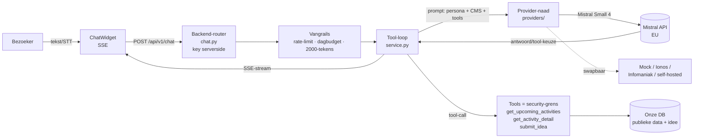
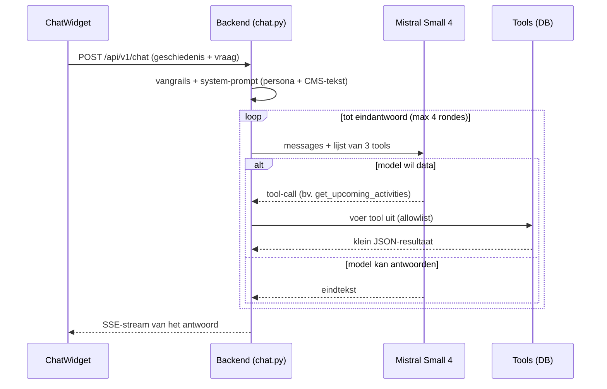

# Architectuur — chatbot 'Raakje' (#205)

Publieke website-chatbot die bezoekers informeert over Raak Millegem, hun naar de
juiste activiteit begeleidt, en hen via de bestaande IdeaBox een vraag/idee laat
achterlaten. Dit document legt uit **hoe data van ons systeem bij het taalmodel
komt** en waar de grenzen liggen.

## Schema — hoe de chat werkt

Architectuur op hoog niveau (de browser praat nooit rechtstreeks met Mistral; de
API-sleutel staat serverside):



Eén chatbeurt met de tool-lus (max 4 rondes), schematisch:



## De kern in drie zinnen

1. **Wij trainen niets en hebben geen privé-model.** We gebruiken Mistral's
   gedeelde, gehoste model (`mistral-small-latest` = Mistral Small 4) via hun API.
2. **Wij injecteren niets ín het model.** De gewichten veranderen nooit. Onze data
   reist **per vraag mee als tekst** (input), wordt één keer gelezen, en is daarna
   weg — geen opslag, geen training (Mistral traint standaard niet op API-data).
3. **Het model is stateless.** Het onthoudt niets tussen gesprekken; elke call
   draagt de nodige context opnieuw mee.

Analogie: Mistral is een belezen consultant die perfect Nederlands spreekt maar
**niets** over Raak Millegem weet. Bij elke vraag geven we hem een verse briefing,
hij mag ons dingen laten opzoeken, hij formuleert een antwoord — en vergeet daarna
alles. We sturen hem nooit naar school.

## Wie levert wat

| | Van **Mistral** | Van **ons** |
|---|---|---|
| Taalbegrip, vlot Nederlands, redeneren | ✅ | |
| Beslissen welke tool nodig is, antwoord formuleren | ✅ | |
| De **feiten** (CMS-tekst, activiteiten, datums, prijzen) | | ✅ (uit onze DB) |
| De regels ("verzin niets, structuurvelden winnen") | | ✅ (in onze prompt) |

De *wijsheid* (taal/intelligentie) komt van Mistral; de *waarheid* (data) van ons.

## Sturen we de hele database mee? Nee.

Twee mechanismen, allebei strak begrensd:

- **Context-stuffing** (`context.py`): persona + een **membership-blok** (prijzen/
  tarieven + het nu geldende tarief, uit de config) + de tekst van **gepubliceerde
  CMS-pagina's** + vrije **AI-context-notities**. Afgetopt op `MAX_CMS_CHARS`
  (12.000 tekens). Geen ledentabel, geen activiteitentabel. Placeholders zoals
  `{{membership_price_full}}` worden **gerenderd** (via `render_cms_content`) →
  de bot ziet "35,00", niet de ruwe code. CMS-pagina's gaan **opt-out** mee (alle
  gepubliceerde, tenzij uitgezet/overschreven via `chatbot_info`).
- **Tool use** (`tools.py`): activiteiten/prijzen gaan **niet** vooraf mee. Het
  model krijgt een lijst functies die het mág aanroepen; pas op aanvraag voert
  **onze** backend de query uit en stuurt enkel het **gevraagde stukje** als JSON
  terug. De data blijft in onze DB; het model ziet nooit de volledige tabel.
- **Caps**: geschiedenis ≤ 20 berichten, elk ≤ 2.000 tekens; max 4 tool-rondes.

Per call ≈ persona + afgetopte CMS-tekst + kort gesprek + (eventueel) klein
JSON-resultaat. Zou de CMS ooit enorm worden, dan stap je over op RAG (alleen
relevante stukjes ophalen). Voor één vereniging is dat niet nodig.

## In welk formaat sturen we content mee?

- **Transport = JSON** (de Mistral-API is JSON over HTTPS), maar de *inhoud* die
  het model leest is **platte tekst / lichte markdown** — géén XML of zware JSON.
  Markup (`<tag>`, geneste sleutels) is voor een taalmodel enkel extra tokens +
  ruis; het leest proza het best.
- **Geen byte-compressie** (gzip/binair): het model leest **tokens, geen bytes**.
  Gecomprimeerde data zou het niet begrijpen. "Comprimeren" gebeurt hier
  **semantisch**: (1) token-zuinig platte tekst, (2) enkel de *nuttige* info
  opslaan i.p.v. een rauwe dump, (3) enkel het relevante stukje meesturen
  (tool/RAG i.p.v. alles).

## `chatbot_info` — één tabel voor alle bot-tekst

Alle admin-/extractie-tekst voor de bot staat in **`chatbot_info`**, **losgekoppeld**
van de domeintabellen (geen kolommen op activity/media/cms). Een rij verwijst via
een **nullable FK** naar precies één ding (CHECK: hoogstens één FK):

| Rij verwijst naar | `extracted_text` | rol |
|---|---|---|
| **media-asset** (`media_asset_id`) | machine-lezing van poster/reglement | document |
| **CMS-pagina** (`cms_page_id`) | — | opt-out/override van die pagina |
| **niets** | — | vrijstaande 'eigen AI-context'-notitie |

Drie tekstvelden, elk met eigen bedoeling: `extracted_text` (machine),
`text_override` (vervangt de basis), `text_addition` (vult aan). **Effectieve
tekst** = `COALESCE(text_override, basis)` ＋ `text_addition`; `is_active=false`
→ niets. Basis = `extracted_text` (media) of de live pagina-inhoud (cms).

### Document-extractie (#206)

> Status: **geïmplementeerd.** PDF met tekstlaag → `pypdf` (gratis); scan/
> afbeelding → Mistral OCR. Achtergrond-taak bij upload van een **poster**
> (`activity_poster`) of **reglement/info-PDF** (`component_info`); schrijft naar
> de `chatbot_info`-rij van dat asset. De bot leest via `get_activity_detail`
> (poster → `flyer_text`, onderdeel → `info_text`).
> Code: `app/services/media_extraction.py`, model `app/models/chatbot_info.py`,
> migratie 059. Backfill: `backend/backfill_extracted_text.py`.

- **Wanneer:** bij **upload**, één keer, op de **achtergrond** (`BackgroundTasks`
  — geen queue/Redis). De upload slaagt direct; extractie loopt erachteraan. De
  `chatbot_info`-rij met al `extracted_text` wordt overgeslagen, tenzij `force`
  (de 'Opnieuw lezen'-knop). **`force` raakt nooit `text_override`/`text_addition`
  aan** — handmatige correcties/aanvullingen blijven dus staan.
- **Hoe:** PDF mét tekstlaag → `pypdf` (gratis). Scan/afbeelding → **Mistral OCR**
  (`/v1/ocr`, EU, zelfde key als de chat).
- **Bronwaarheid:** datum/prijs/locatie uit de structuurvelden **winnen** altijd;
  de tekst vult enkel de zachte info aan.
- Poster verwijderd → asset hard-deleted → de `chatbot_info`-rij verdwijnt mee
  (FK `ON DELETE CASCADE`).

Het admin-scherm om dit alles te beheren (extracted_text reviewen + 'Opnieuw
lezen' + eigen notities + CMS opt-out) is **issue #235** (1.9.x); dit is de CRUD
op `chatbot_info`.

## De reisweg van één vraag

```
Browser (ChatWidget.tsx, streamChat in api.ts)
   │  POST /api/v1/chat   { messages: [...] }
   ▼
ONZE BACKEND  (routers/chat.py — API-key staat hier, serverside)
   │  1. vangrails: rate-limit + dagbudget (limiter.py), 2000-tekens-cap (schemas/chat.py)
   │  2. prompt = [system: persona + CMS-tekst (context.py)] + gespreksgeschiedenis
   │  3. + lijst van 3 toegelaten tools (tools.py)
   ▼
MISTRAL API  (providers/mistral.py → api.mistral.ai — het gedeelde model)
   │  leest de briefing en kiest:
   ├─(a) "ik kan antwoorden"            → stuurt tekst terug
   └─(b) "roep get_upcoming_activities" → vraagt een tool aan
   ▼                                          ▲
ONZE BACKEND voert de tool uit ───────────────┘   (SQL op onze DB → JSON terug)
   │  de lus (service.py: run_chat) herhaalt tot een eindantwoord, max 4 rondes
   ▼
ONZE BACKEND streamt het eindantwoord als SSE terug → Browser toont het live
```

## Componenten

| Bestand | Rol |
|---|---|
| `backend/app/domains/chatbot/providers/base.py` | De naad: `LLMProvider.complete(messages, tools)`. |
| `backend/app/domains/chatbot/providers/mistral.py` | **Enige** plek die met Mistral praat (httpx → REST). |
| `backend/app/domains/chatbot/providers/mock.py` | Afhankelijkheidsvrije, data-bewuste stub (CI/lokaal, geen kost). |
| `backend/app/domains/chatbot/providers/factory.py` | Kiest provider op `CHAT_LLM_PROVIDER` (auto/mistral/mock). |
| `backend/app/domains/chatbot/context.py` | System-prompt: persona + vangrails + gepubliceerde CMS-tekst. |
| `backend/app/domains/chatbot/tools.py` | De 3 publieke tools + dispatch = de **security-grens** (allowlist). |
| `backend/app/domains/chatbot/service.py` | De tool-loop tussen provider en tools. |
| `backend/app/routers/chat.py` | `POST /api/v1/chat` (SSE), key serverside, limieten. |
| `backend/app/schemas/chat.py` | Vorm-validatie (per-bericht cap, geschiedenis). |
| `frontend/src/components/ChatWidget.tsx` | Zwevend widget, SSE-streaming, STT-mic (inspreken) + TTS-voorlezen (Web Speech API, on-device). |

## Swapbare provider-laag

De productie-eis is **Mistral (EU-verwerker)**, maar alles loopt via `LLMProvider`.
Een andere provider (Ionos, Infomaniak, self-hosted open model) inschuiven raakt
**enkel** de `providers/`-map; router, tools, context en widget blijven ongemoeid.
`CHAT_LLM_PROVIDER=auto` kiest Mistral zodra er een `MISTRAL_API_KEY` staat, anders
de kosteloze mock.

## Aan/uit-schakelaar (`CHAT_ENABLED`)

Eén `.env`-variabele **`CHAT_ENABLED`** (standaard `false`) zet de hele chatbot
aan of uit — backend én frontend:
- Backend: `settings.chat_enabled`; staat hij uit, dan geeft `POST /api/v1/chat`
  een **404** (alsof het endpoint niet bestaat).
- Frontend: via de compose-build-arg `NEXT_PUBLIC_CHATBOT_ENABLED` (gevoed uit
  dezelfde `CHAT_ENABLED`); de `ChatWidget` rendert dan **niets**.

Zo kan de code mee naar PROD zonder dat de bot live is; aanzetten zodra de
`MISTRAL_API_KEY` staat en de boel op HDEV gevalideerd is. (Frontend-flag is
build-time → een rebuild zet hem live, wat een deploy toch al doet.)

## Security-grens

De bot kan **uitsluitend** de 3 tools in de allowlist aanroepen — twee publieke
lees-acties op activiteiten en `submit_idea` (hergebruikt exact het IdeaBox-
schrijfpad + bevestigingsmail). `execute_tool` weigert elke andere naam. **Geen**
ledendata, betalingen of admin via de bot. Naar Mistral gaat enkel publieke
informatie + wat de bezoeker zelf typt.

## Kosten

Mistral Small 4: ±$0.10 input / $0.30 output per miljoen tokens. Eén
context-gestookte vraag ≈ 10k input + ~300 output ≈ **€0,001–0,003**. ~1.000
vragen/maand ≈ **€1–3**. De volumelimiet (2.000 tekens/bericht, 20.000/IP/dag) is
daarom vooral een misbruik-rem, geen budgetnoodzaak.
