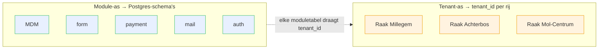
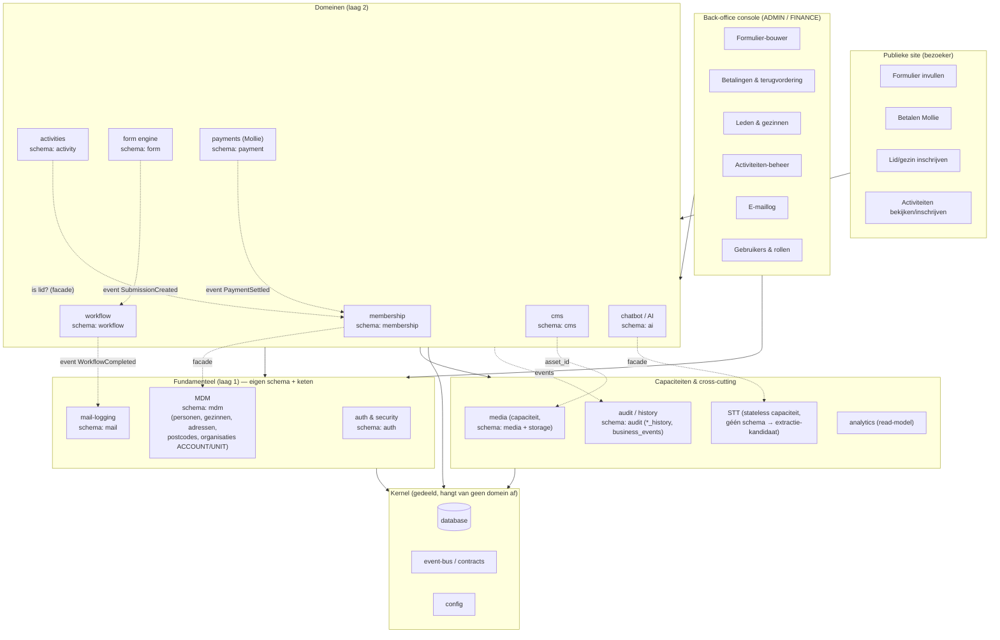
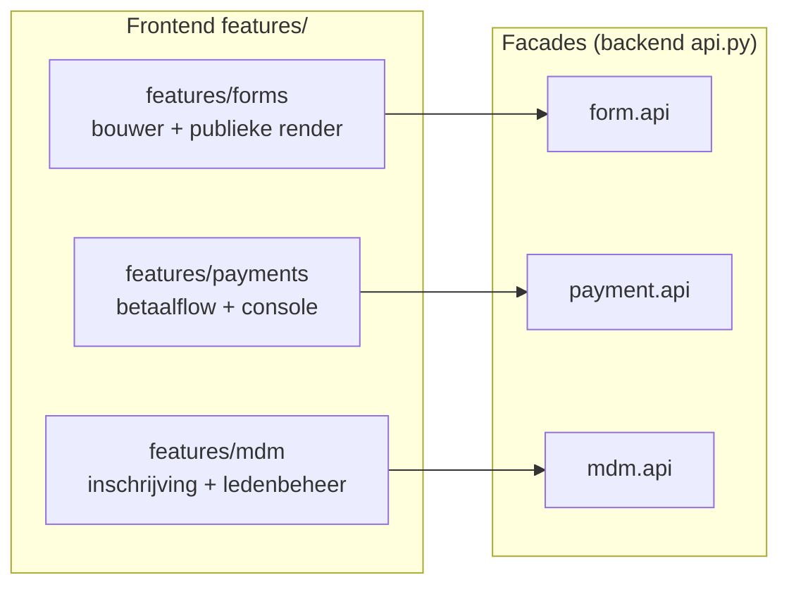
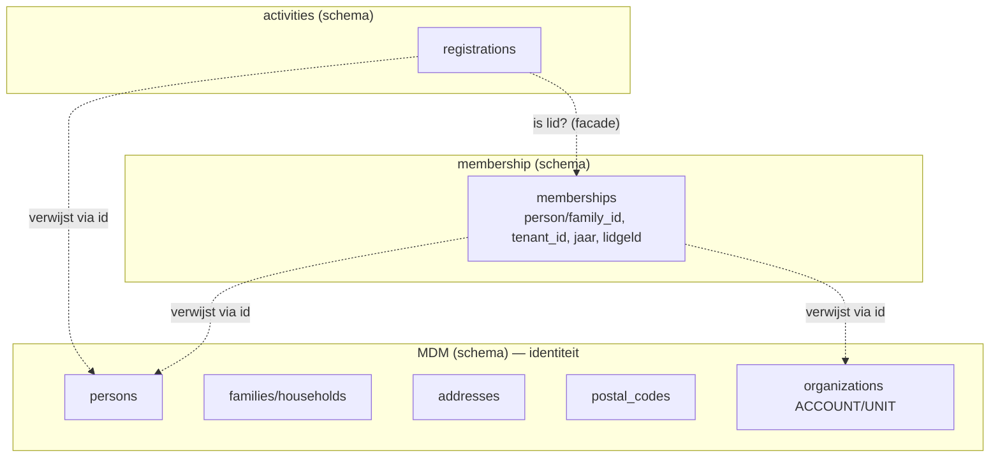
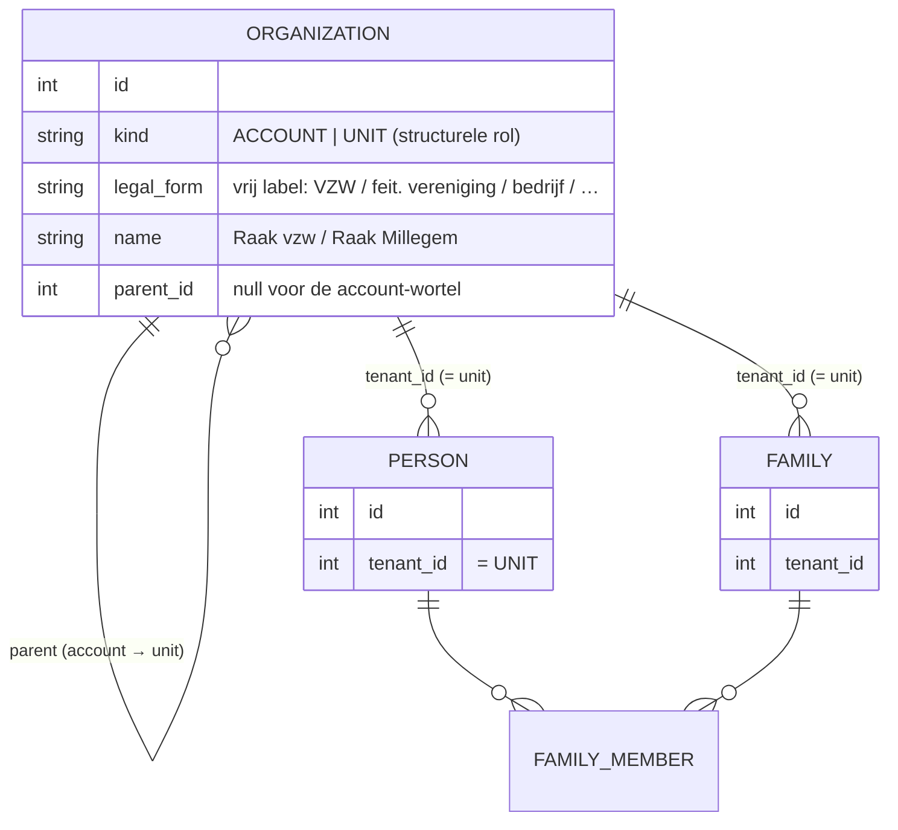
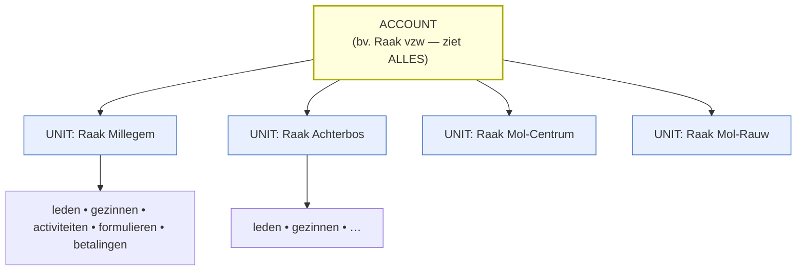
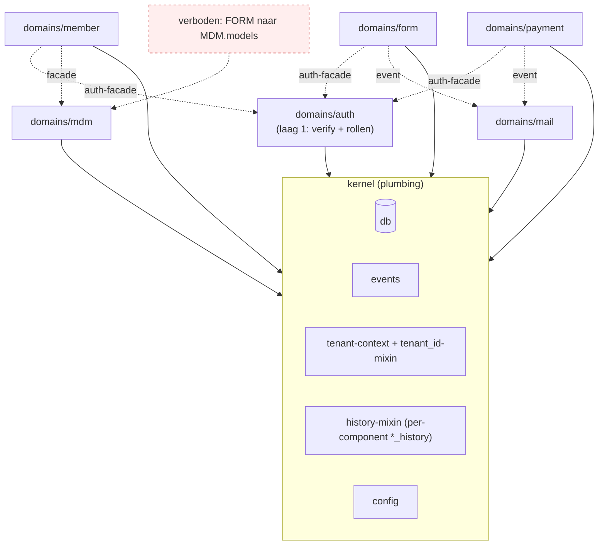
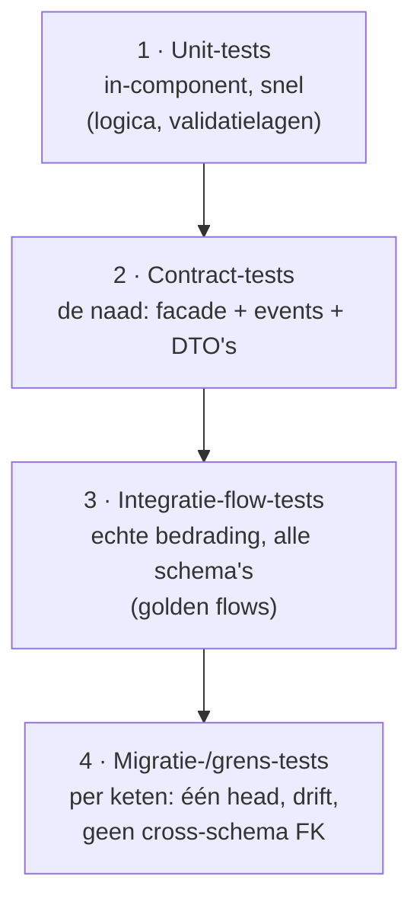
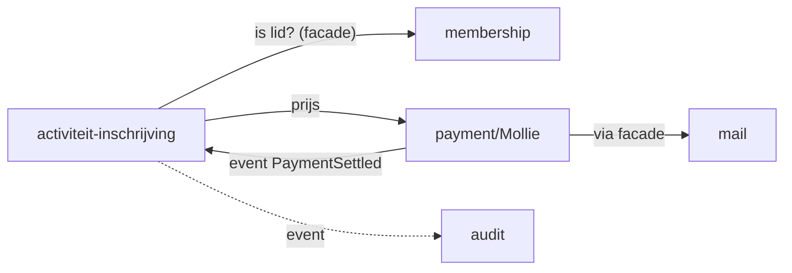
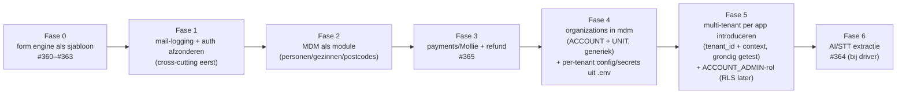

# Intermediate Architecture Upgrade — v1

> Werkdocument / bespreekstuk. Beschrijft de tussenstap-architectuur richting een
> **modulair ERP/portaal/CRM**, met domeinmodules, moduulafzondering (facade +
> eigen Postgres-schema + eventueel eigen migratieketen), de toekomstige aparte
> apps (login & security, mail-logging, MDM) en een **multi-tenant**
> opzet (Raak vzw met sub-verenigingen). Nog **geen** release toegewezen; dit is
> het denkkader waaruit we issues afleiden en inplannen.
>
> Gerelateerd: epic **#366** + sub-issues **#360–#365**.

---

## 1. Doel & leidraad

We groeien van een goed-gestructureerde **modulaire monoliet** naar een architectuur
waarin elk domein een echte module is met een **afdwingbare buitengrens**, zodat we
later — en enkel wanneer een concrete driver dat vraagt — een module als aparte app
kunnen afsplitsen. Het is bewust een **leertraject**: elke stap leert ons het
sjabloon dat we op het volgende domein toepassen.

Kernprincipes (de rode draad door alles hieronder):

- **Capture → Record → Act.** Elk domein heeft een publieke *capture*-kant
  (bezoeker), een *record*-kern (eigen data + regels) en een back-office *act*-kant
  (rol-gated console).
- **Eén verticale slice per module** in `app/domains/<domein>/`, met een **facade**
  (`api.py`) als enige publieke oppervlak. Geen reach-in in models/services.
- **Owned data**: elke module bezit zijn tabellen in een **eigen Postgres-schema**;
  cross-module verkeer via **events/DTO's**, nooit via live ORM-objecten of
  gedeelde FK's.
- **Kernel** apart: auth, database, config, events/contracts — alles hangt van de
  kernel af, de kernel van geen enkel domein.
- **Rol-as** als enige divergentie in de back-office: `ADMIN` vs `FINANCE`
  (penningmeester), later per sub-vereniging.
- **Modulariteit = OO op macroschaal**: een module is een object; facade =
  encapsulation, events = message passing, import-linter = het `private`-keyword dat
  Python over packages mist.

---

## 2. Twee onafhankelijke assen (belangrijkste inzicht)

Verwar **modularisatie** en **multi-tenancy** niet: het zijn twee loodrechte assen.

| As | Vraag | Mechanisme |
|---|---|---|
| **Module** (verticaal) | *Wélk soort data/gedrag?* (forms, betalingen, MDM …) | Eigen package + eigen **Postgres-schema** (`form`, `payment`, `mdm` …) |
| **Tenant** (horizontaal) | *Van wélke vereniging?* (Millegem, Achterbos, Mol-Centrum …) | **`tenant_id`** (rij-niveau) binnen elke moduletabel |

De VZW-koepel snijdt dwars door beide: **Raak vzw ziet alle tenants** in alle
modules. Daarom is rij-niveau (`tenant_id`) het juiste model — een schema-per-tenant
zou de koepelblik pijnlijk maken (union over N schema's). Zie §7.

---

## 3. Componentenkaart (doelbeeld)

> **IdeaBox = form + workflow**: de vroegere losse `ideas`-component vervalt; een
> geseed formulier "Idee indienen" met een simpele workflow (`nieuw → in behandeling →
> in orde`) vervangt het (§5.6).

**Legenda / regels op de pijlen:**
- Publieke en back-office schermen praten enkel met een **module-facade**, nooit
  rechtstreeks met andermans models.
- Domeinen praten onderling **enkel via facade-calls of events** (gestippeld).
- Alles mag op de **kernel** steunen; de kernel steunt op niets domein-specifiek.

---

## 4. Schermen ↔ componenten

Je intuïtie klopt: het **formulier-bouwscherm hoort bij de form-component**, en de
publieke rendering óók. Algemene regel: **een scherm hoort bij de module wiens data
het toont/bewerkt**, ongeacht of het publiek of back-office is. Publiek vs
back-office is een *rol/authenticatie*-onderscheid, geen *component*-grens.

| Scherm | Kant | Component (eigenaar) | Rol |
|---|---|---|---|
| Formulier invullen (`/formulier/[token]`) | publiek | **form** | — (capability-token) |
| Formulier-bouwer (`/admin/formulieren`) | back-office | **form** | ADMIN |
| Inzendingen bekijken/verwijderen | back-office | **form** | ADMIN |
| Betaalflow / redirect Mollie (`/betaling/*`) | publiek | **payment** | — |
| Betalingen-overzicht + **terugvordering** | back-office | **payment** | **FINANCE** |
| Lid/gezin inschrijven (publiek) | publiek | **MDM** (+ membership) | — |
| Leden & gezinnen beheren (`/admin/leden`) | back-office | **MDM** | ADMIN |
| Activiteiten bekijken/inschrijven | publiek | **activities** | — |
| Activiteiten-beheer | back-office | **activities** | ADMIN |
| E-maillog (`/admin/emails`) | back-office | **mail-logging** | ADMIN |
| Gebruikers & rollen (`/admin/gebruikers`) | back-office | **auth & security** | ADMIN |
| Login (`/login`, `/admin/login`) | beide | **auth & security** | — |
| CMS-pagina's (`/[slug]`, `/admin/paginas`) | beide | **cms** | ADMIN |

> **Frontend-consequentie:** spiegel de backend. Vandaag zit UI verspreid over
> `components/` + `lib/api.ts` + `lib/types.ts`. Doel: `features/<component>/` met
> eigen componenten, `api`-slice en types. `lib/` houdt enkel gedeelde primitives
> (money, errors, axios-client). Eén feature-map = één component, publiek én
> back-office samen.

---

## 5. Toekomstige aparte apps (jouw wensen)

Drie domeinen die je expliciet als aparte app ziet — ze zijn **cross-cutting** en
lenen zich goed voor vroege afzondering:

### 5.1 Login & Security (`auth`) — één fundamentele component
- Bevat: `users`, `user_roles`, `role_codes`, login-tokens, JWT-uitgifte/-verificatie,
  `require_roles`.
- **Eén aparte component/app** `domains/auth/` met eigen schema `auth` + eigen keten +
  facade: `authenticate()`, `issue_token()`, `verify_token()`, `require_roles()`,
  gebruikersbeheer. **Elke** andere component gebruikt die via `auth.api`.
- **Positie = laag 1 (fundamenteel)**, zie §8: auth hangt **enkel van de kernel af**
  (db, config), van geen enkel domein. De kernel roept auth niet aan — de
  `require_roles`/`verify`-check is een *route-dependency* die elke domein-router uit
  `auth.api` haalt. Zo is er geen cyclus (kernel ← auth ← domeinen) en blijft de
  kernel dunne plumbing.
- Multi-tenant: rol-toewijzingen dragen een `tenant_id` (UNIT) als **waarde**, geen
  harde FK naar `mdm` — auth blijft los van mdm.

### 5.2 Mail-logging (`mail`)
- Bevat: `email_log` + het centrale `_send`-chokepoint + retentie
  (`EMAIL_LOG_RETENTION_DAYS`).
- Vandaag al een chokepoint — ideale kandidaat. Facade: `send(email)` +
  `list_logs()` + `delete_log()`. Elke module publiceert "stuur mail" via deze
  facade (of via een `MailRequested`-event), zodat de logging één plek blijft.
- **Belangrijk:** bij de form-schema-migratie **blijft `email_log` in `public`/`mail`**,
  niet in `form` (correctie op het mengen uit migratie 062).

### 5.3 MDM (`mdm`) — identiteit, géén lidmaatschap
- Bevat: **personen, gezinnen (households), adressen, postcodes** en (§6–7) de
  **organisaties** (ACCOUNT/UNIT). Plus de bijhorende referentiecodes
  (`relation_type_codes`, `contact_type_codes`, `gender_codes`).
- **Bestaat onafhankelijk van lidmaatschap**: een persoon/gezin bestaat óók zonder lid
  te zijn. De **gezinssamenstelling** (wie zit in welk gezin) is MDM; **"dit
  gezin is betalend lid in 2026"** is géén MDM → dat is `membership`.
- Facade: `get_person()`, `find_family()`, `resolve_postal_code()`,
  `list_organizations()`.

### 5.3b Membership (`membership`) — eigen component, géén MDM
- **Aparte component** (niet samenvoegen met `activities`, niet in `mdm`): de
  **lidmaatschaps-relatie** (persoon/gezin ↔ UNIT), lidmaatschapsjaren/-periodes,
  lidgeld, bestuurslid-rol.
- **Zuster van `activities`**, niet erboven/onder: beide steunen op `mdm` (identiteit)
  en voeden **`payment`** (lidgeld resp. inschrijving). Daarom geen `activities_membership`.
- **Cross-module regel**: `activities` vraagt `membership` "is deze persoon lid dit jaar?"
  via facade (bv. ledenkorting). Aparte componenten maken die regel expliciet/testbaar.

### 5.4 AI & STT — ondersteunende capaciteiten (aan de rand)
Twee verschillende dingen, bewust niet samengevoegd met een kern-domein:
- **STT** = **stateless capaciteit** (audio → tekst), **géén schema**. Andere
  componenten roepen `stt.api.transcribe()` aan. Gedraagt zich als een gedeelde
  capaciteit maar houdt geen domeindata bij → **eerste extractie-kandidaat** (zware
  libs/GPU): in-process nu, externe service later, **zelfde facade** (issue #364).
- **Chatbot/AI** = **laag-2 domein** met klein schema `ai` (`chatbot_info` + context),
  dat **STT en LLM-providers consumeert** en op `cms`/`mdm` leunt via facades.
- **Providers** (LLM/STT-leveranciers) zitten achter **provider-adapters** →
  verwisselbaar, **Europe-First** (waar draait het model / waar blijft de audio).
- Config: provider-keys zijn **per-tenant secrets** → DB versleuteld of infra-`.env`.

### 5.5 Media (`media`) — gedeelde capaciteit
- **Aparte component, maar als capaciteit** (zoals mail), niet een blad-domein: door
  meerdere domeinen gebruikt (cms, activiteiten, later form-uploads, chatbot-context)
  die er via een `asset_id` (waarde) naar verwijzen — geen cross-schema FK.
- Eigen schema `media` (metadata `media_assets`) **+ storage-adapter** voor de bytes
  (schijf/Storage Box, **Europe-First**), zoals STT provider-adapters heeft.
- Facade: `store(file) → asset_id`, `get_url(asset_id)`, `delete()`, resize/afbeelding.
- Tenant-scoped (`tenant_id` per asset; per-tenant opslag mogelijk).

### 5.6 Workflow (`workflow`) — pluggbaar vervolgproces + menselijke taken
Sommige inzendingen vragen een **vervolgproces** (bv. IdeaBox: iemand van Raak vinkt
"in orde" af). Dat is een **aparte proces-/taak-component**, geen form-logica.

- **Form blijft dom**: capture + record + publiceert `SubmissionCreated`. De
  **`workflow`-component luistert** (event), start een proces-instantie voor formulieren
  die workflow-enabled zijn, en beheert states + menselijke taken. Geen harde koppeling:
  workflow bewaart `submission_id` als waarde.
- **Configureerbaar per form**: in de form-bouwer koppel je een `workflow_definition`
  (de form-component bewaart enkel een *referentie/id*); de **procesdefinitie zelf** en
  de **takeninbox** horen bij de workflow-component (mooie toepassing van de
  "scherm hoort bij zijn component"-regel, §4).
- **Act-plane**: de taak "afvinken" is een rol-gated taak in de **workflow-console**
  (back-office). Capture (form) → record (submission) → **act (workflow-taak)**.
- Data (schema `workflow`): `workflow_definitions`, `workflow_instances`,
  `workflow_tasks` (toewijzing/status), `workflow_transitions` (historiek).
- Facade: `start(trigger, ref)`, `advance(instance, action)`, `list_tasks(tenant, rol)`,
  `complete_task()`. Publiceert `WorkflowCompleted` → mail (notificatie) + audit.
- **IdeaBox = form + workflow**: vervang de losse `ideas`-tabel door een geseed
  formulier "Idee indienen" met een simpele workflow `nieuw → in behandeling → in orde`.
  Zo generaliseert het naar elk formulier met een complexer vervolg.
- Tenant-scoped (`tenant_id` per instantie/taak).

### 5.7 Cross-cutting & nog te plaatsen tabellen
Niet elke tabel mapt op één domein-component:
- **History = gedeeld patroon, géén centrale component.** Elke component houdt zijn
  eigen `*_history`-tabellen in **zijn eigen schema**, maar via **één herbruikbaar
  kernel-mechanisme** (een `Historized`-mixin / SQLAlchemy-listener) zodat het overal
  **identiek** werkt. *Mechanisme gedeeld (kernel), data per domein* — net als de
  `tenant_id`-mixin. `models/history.py` wordt zo een kernel-patroon i.p.v. een
  vergaarbak. (Geen apart `audit`-schema/-component.)
- **`business_events`**: momenteel **geen meerwaarde** → centraal parkeren of
  **verwijderen**. Niet uitbouwen tot een audit-component.
- **`ideas`** → **niet** langer een eigen component: wordt **form + workflow** (§5.6).
- **`external_numbers`** (externe-ID-mapping) → **MDM** (beslist): het is externe
  identiteit van personen/organisaties, dus Master Data Management.
- **Referentiecodes** → **in het schema van hun eigen component** (beslist):
  `role_codes`→auth, `payment_status_codes`→payment, `registration_type_codes`→
  activities, `relation/contact/gender_codes`→mdm. **Geen** gedeelde
  `reference`-namespace (die zou de koppeling herintroduceren). Heeft een ander
  component een code nodig, dan bewaart het de **waarde** en valideert het desnoods via
  de facade van de eigenaar.

---

## 6. Data: MDM met organisaties

`organizations` wordt de spil van zowel de **koepelstructuur** als de **tenancy**.
Het model is bewust **generiek** (niet vzw-specifiek): de app moet voor elk type
organisatie werken. Twee structurele niveaus, en het juridische type is **data**.

- **`organizations`** is zelf-refererend met een structurele `kind`:
  - **ACCOUNT** = de koepel/klant (billing-entiteit). Bij Raak: "Raak vzw".
    Wortel (`parent_id = null`).
  - **UNIT** = een operationele eenheid onder een account. Bij Raak: de feitelijke
    verenigingen (Millegem, Achterbos, Mol-Centrum, Mol-Rauw …).
- **`legal_form`** is een vrij label (VZW, feitelijke vereniging, bedrijf, …) → de
  juridische invulling is **data**, geen schema-aanname. Zo werkt de app net zo goed
  voor niet-vzw-klanten.
- Elke tenant-scoped rij (persoon, gezin, later activiteit/formulier/betaling) draagt
  een **`tenant_id`** = de **UNIT**. De **ACCOUNT**-scope leid je af door de boom op
  te lopen (`unit.parent_id`).

---

## 7. Multi-tenant opzet

**Klant = Raak vzw**; **tenants = de sub-verenigingen**; de vzw heeft **zicht op
alles**.

**Klant = een ACCOUNT** (bij Raak: Raak vzw, maar generiek elk type organisatie);
**tenants = de UNITs** (sub-verenigingen); de account heeft **zicht op alles**.

### Gekozen model: **rij-niveau tenancy (shared schema + `tenant_id`)**

| Optie | Isolatie | VZW-koepelblik | Ops-last | Verdict |
|---|---|---|---|---|
| **Rij-niveau `tenant_id`** | via app + (optioneel) Postgres **RLS** | **triviaal** (query over tenants) | laag | ✅ **aanbevolen** |
| Schema-per-tenant | sterk | pijnlijk (union over N schema's) | hoog (N×M schema's) | ❌ |
| DB-per-tenant | maximaal | zeer pijnlijk | zeer hoog | ❌ |

Waarom rij-niveau past: de koepel **moet** dwars over tenants rapporteren; dat is een
`WHERE tenant_id IN (…)` i.p.v. een cross-schema-union. Isolatie versterk je later
optioneel met **Postgres Row-Level Security** (policy op `tenant_id`), zodat de DB
zélf lekken tussen tenants blokkeert — dezelfde "DB als vangnet"-filosofie als de
per-schema `GRANT`.

### Tenant-context als kernel-concern
- De **actieve tenant** (en of de gebruiker koepel-breed mag kijken) komt uit het
  JWT / de sessie en wordt door de **kernel** in een request-context gezet.
- Elke module-facade filtert standaard op de actieve tenant; een **VZW-rol** kan de
  filter verruimen tot "alle tenants".
- Rol-model breidt uit: `ADMIN`/`FINANCE` **per UNIT**, plus een generieke koepel-rol
  **`ACCOUNT_ADMIN`** die over alle units van zijn account heen kijkt (org-type-neutraal
  — bewust niet `VZW_ADMIN`, want de app moet voor elk soort organisatie werken).

> **Uitrol per app, niet dark en niet big-bang.** Tenancy raakt elke module (as-2 uit
> §2), maar we voeren `tenant_id` **niet** vervroegd "dark" in. De kernel levert het
> *gereedschap* (een `tenant_id`-mixin + tenant-context), en **elke app adopteert dat
> op zijn eigen moment van rijpheid, met een grondige testronde** per app. Zo blijft
> elke introductie beheersbaar en getest i.p.v. een grote gelijktijdige omschakeling.

### 7.1 Configuratie & secrets: DB-beheerd per tenant vs. `.env`-infra

Multi-tenant dwingt een scherpe scheiding af tussen *wat per vereniging verschilt* en
*wat bij de deployment/technologie hoort*:

| Soort | Waar | Voorbeelden |
|---|---|---|
| **Per-tenant config** | **DB-beheerd** (per ACCOUNT/UNIT) | afzender-mailadres, Mollie-account/profiel, logo, branding, organisatienaam, domein, retentie-voorkeuren |
| **Per-tenant secret** | **DB, versleuteld at rest** (of secrets-store per tenant) | Mollie API-key, evt. per-tenant SMTP-credentials |
| **Infra / technologie** | **`.env`** (per deployment) | DB-wachtwoord, server-IP, SSH-sleutel, `SECRET_KEY`, proxy/CA-bundle |

- Vandaag zit config als `mailadres`, `mollie-code`, `logo` in `.env`; die verhuizen
  naar een **per-tenant settings-store** (tabel in `mdm` of een eigen `config`-
  component), gelezen via de tenant-context met een `.env`-**default** tijdens de
  single-tenant-fase.
- **Per-tenant secrets** (Mollie-key) horen in de DB **versleuteld**, nooit in klare
  tekst — consistent met de publieke-repo-regel (`.env` = enkel infra; geen secrets in
  git).
- **`.env` blijft** voor alles wat technologie-/deployment-gebonden is en niet per
  vereniging verschilt.

---

## 8. Afhankelijkheden & grens-handhaving

**3-lagen-afhankelijkheidsmodel** (afhankelijkheden wijzen enkel naar beneden):

| Laag | Bevat | Mag afhangen van |
|---|---|---|
| **0 · Kernel** | db, config, events, tenant-context (plumbing) | niets |
| **1 · Fundamenteel** | **auth/security** (en later evt. mail, mdm) | enkel kernel |
| **2 · Domeinen** | form, payment, activities, cms, membership | kernel + laag-1-facades + elkaars facades/events |

Auth/security is een **fundamentele component** (laag 1): één aparte, apart-deploybare
app die iedereen via `auth.api` gebruikt, en die zelf enkel op de kernel steunt. De
kernel roept auth niet aan → geen cyclus.

Gehandhaafd door:
1. **import-linter** in CI (mapgrenzen = moduulgrenzen).
2. **Geen cross-schema FK's** — geverifieerd door een integratietest
   (`information_schema`).
3. **Aparte Alembic-keten per module** (waar we dat kiezen) — twee ketens kunnen
   fysiek geen tabel delen; drift/één-head-tests falen bij een fout.
4. Later: **per-schema `GRANT`** en **RLS per tenant** als DB-afgedwongen vangnet.

---

## 9. Ontwikkelen binnen een component — contract-stabiliteit

De belofte van de facade: **binnen** een component ontwikkel je vrij, **zonder** de
consumenten te breken. Het contract — en enkel het contract — is wat anderen zien.

**Wat is het contract?**
- De **facade-signaturen** (`api.py`), de **DTO's** (in/uit) en de **event-schema's**
  (in `kernel/contracts`). Dat is het volledige, publieke oppervlak.
- **Alles daaronder** (models, services, tabellen, zelfs het schema) is *intern* en
  mag vrij wijzigen — refactor, hernoem, splits — zolang het contract gelijk blijft.

**Regels voor evolutie (semver-achtig op het contract):**
- **Additief = vrij**: nieuwe facade-functie, nieuw optioneel DTO-veld, nieuw event —
  breekt niemand, mag zonder coördinatie.
- **Breaking = deprecatie-cyclus**: nooit een signatuur/DTO/event-vorm stil wijzigen.
  In plaats daarvan: (1) nieuwe variant toevoegen, (2) oude als `@deprecated` markeren,
  (3) consumenten migreren, (4) oude verwijderen. Elke stap met groene contract-tests.
- **Events zijn versioneerbaar**: voeg velden additief toe; een echte breuk =
  `SubmissionCreatedV2` naast V1 tot iedereen mee is.

**Praktische werkregel**
> *Onder de facade: refactor vrij. Aan de facade (signatuur/DTO/event): niets wijzigen
> zonder deprecatie-cyclus én groene contract-tests.* De **import-linter** garandeert
> dat niemand stiekem onder je facade grijpt, zodat het contract écht de enige
> koppeling is.

---

## 10. Teststrategie & integratie-flow

Vier lagen, elk met één taak — samen bewaken ze zowel de **componentgrens** als de
**end-to-end flow**:

**1 · Unit** — binnen de component, snel, tegen het eigen schema. De validatielagen
(router/service/DB) elk apart getest.

**2 · Contract-tests (de naad)** — bewaken dat provider en consument het over het
contract eens blijven, in-process (geen netwerk, simpeler dan Pact, zelfde idee):
- **Provider-kant**: de component test dat zijn facade/events het gepubliceerde
  **contract-schema** naleeft (vorm van DTO's/events).
- **Consument-kant**: elke consument test tegen een **stub/fake van de facade** die
  aan datzelfde contract-schema wordt gevalideerd. Wijzigt de provider het contract
  breekend, dan **faalt de stub-validatie bij de consument** in CI — vóór integratie.
- Zo ontwikkel je een component **in isolatie** tegen de *contracten* van zijn
  dependencies, met de garantie dat de echte ze nog naleven.

**3 · Integratie-flow-tests (echte bedrading)** — draaien cross-component
gebruikersflows tegen de **echt gewired app + alle schema's/ketens gemigreerd**. Hou
een lijst **"golden flows"** altijd groen, bv.:

Voorbeelden van golden flows: *publieke lid/gezin-inschrijving → mdm + membership*;
*activiteit met ledenkorting → membership-check → betaling → bevestigingsmail + audit*;
*formulier indienen → submission → confirmatiemail*; *betaling terugvorderen (FINANCE)
→ payment-status + mail*.

**4 · Migratie-/grens-tests** (uit §8/PR4) — per keten: één head, autogenerate-drift,
schema-plaatsing, **geen cross-schema FK**. Deze falen luidruchtig bij een fout in de
moduulafzondering zelf.

**CI-gelaagdheid**
- **Elke push**: unit + contract-tests (snel) + import-linter.
- **Op PR/merge**: integratie-flow-tests + migratie-/grens-tests (volledige bedrading,
  echte Postgres 16, alle ketens).
- Elke component test tegen **zijn eigen schema**; de integratie-suite bouwt **alle**
  schema's/ketens samen.

**Waarom dit de flow bewaakt**: de import-linter sluit *verborgen* koppeling uit, de
contract-tests vangen *contract-breuk* aan de naad, en de golden-flow-tests bewijzen
dat de **samengestelde** flow blijft werken. Drie niveaus, geen gat ertussen.

---

## 11. Roadmap (fasering — nog geen releasenummers)

**Waarom deze volgorde**
- **Fase 0** eerst: forms is best geïsoleerd → leert ons het volledige sjabloon
  (facade → linter → schema → 2e keten + integratietests).
- **Fase 1** cross-cutting (mail, auth) vroeg, want elke andere module leunt erop;
  hoe langer verweven, hoe duurder later.
- **Fase 2–4** MDM vóór tenancy: je hebt eerst `organizations` nodig als
  ophangpunt van `tenant_id`.
- **Fase 5** multi-tenant als kernel-brede stap (mixin + context + rol), pas nadat de
  modules hun eigen schema hebben.
- **Fase 6** echte extractie (STT stateless → HTTP/queue-service) enkel bij een
  concrete driver (zware runtime/dependencies).

**Per fase, vaste stappen (het sjabloon):**
`facade → import-linter-contract → eigen schema + handoff-migratie → (optioneel) 2e
Alembic-keten + integratietests → frontend-feature-map`.

---

## 12. Ontwerpkeuzes

**Beslist:**
- ✅ **Generieke org-naamgeving**: geen `VZW_ADMIN` maar **`ACCOUNT_ADMIN`**; org-type
  (`legal_form`) is data, niet schema. De app is org-type-neutraal (§6–7).
- ✅ **RLS later**: eerst tenant-filtering in de facade-laag; Postgres Row-Level
  Security pas als hardening ná Fase 5 (stabiele tenant-logica = vangnet, geen
  struikelblok).
- ✅ **Eigen Alembic-keten = kandidaat-standalone-apps**: **auth, mail, mdm, form,
  payment** krijgen elk een eigen schema **én** een eigen migratieketen (apart
  deploybaar). Puur **interne** modules (cms, activities, analytics) krijgen enkel een
  eigen **schema** op de kern-keten (geen aparte keten → geen extra ops-last waar het
  niet loont).

- ✅ **Auth/security = één fundamentele component** (laag 1), niet gesplitst: eigen
  schema `auth` + eigen keten + facade; iedereen gebruikt `auth.api`; auth hangt enkel
  van de kernel af. (Geen `kernel/security`-split — de kernel roept auth niet aan, dus
  geen cyclus.)

- ✅ **Geen "dark" tenant_id**: tenancy wordt **per app** ingevoerd op het juiste
  moment, telkens grondig doorgetest (de kernel levert enkel het gereedschap:
  mixin + context). Zie §7 en §7.1.
- ✅ **Config-scheiding**: per-tenant config **DB-beheerd** (mailadres, Mollie, logo,
  branding), per-tenant secrets **DB versleuteld**, technologie/infra in **`.env`**
  (DB-wachtwoord, IP, SSH-sleutel, `SECRET_KEY`). Zie §7.1.
- ✅ **Frontend per fase/component**: `features/<component>/` wordt samen met de
  backend van dat component afgerond (geen aparte opkuis-slag later), zodat de grens
  in één keer volledig dicht is.

**Component-afbakening (beslist):**
- ✅ **`master` → `MDM` (Master Data Management)**: naam overal vervangen; bevat
  personen, gezinnen, adressen, postcodes, organisaties (ACCOUNT/UNIT) én
  `external_numbers` (externe identiteit).
- ✅ **Membership = eigen component**, géén MDM en géén `activities_membership`; zuster
  van `activities`, beide voeden `payment`; `activities` vraagt membership "is lid?"
  via facade (§5.3b).
- ✅ **AI/STT gesplitst**: STT = stateless capaciteit (géén schema, extractie-kandidaat);
  chatbot/AI = laag-2 domein (schema `ai`) dat STT + providers consumeert (§5.4).
- ✅ **Media = gedeelde capaciteit** (schema `media` + storage-adapter), door anderen
  via `asset_id` gebruikt — geen blad-domein (§5.5).
- ✅ **Workflow = eigen component**: pluggbaar vervolgproces + menselijke taken, gekoppeld
  aan forms via events. **IdeaBox = form + workflow** (de losse `ideas` vervalt) (§5.6).
- ✅ **History = gedeeld kernel-patroon** (mixin), per-component `*_history` in het eigen
  schema — géén centrale audit-component. **`business_events`**: geen meerwaarde →
  parkeren/verwijderen (§5.7).
- ✅ **Referentiecodes in het schema van hun eigen component** (geen gedeelde
  `reference`-namespace) (§5.7).

*Alle ontwerpkeuzes beslist — klaar om de fasen in issues om te zetten.*

---

## 13. Samenvatting

- **Twee assen**: module (verticaal, eigen schema) × tenant (horizontaal, `tenant_id`).
  Niet verwarren.
- **Schermen horen bij hun component**, publiek én back-office; rol bepaalt toegang,
  niet de componentgrens.
- **MDM** wordt de spil: personen, gezinnen, postcodes én `organizations`
  (vzw + feitelijke verenigingen) — de ophanging voor multi-tenancy.
- **Cross-cutting eerst** afzonderen (mail, auth), dan MDM, dan de rest.
- **Multi-tenant = rij-niveau** (shared schema + `tenant_id`, optioneel RLS), want de
  vzw-koepel moet dwars over alle tenants kijken.
- Alles gefaseerd, elk met hetzelfde sjabloon; issues hangen aan epic **#366**.
