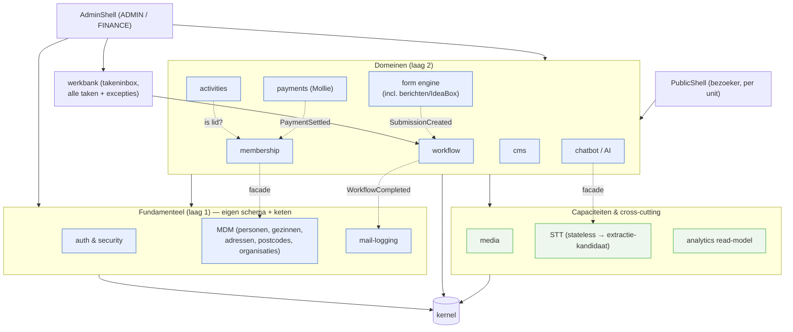
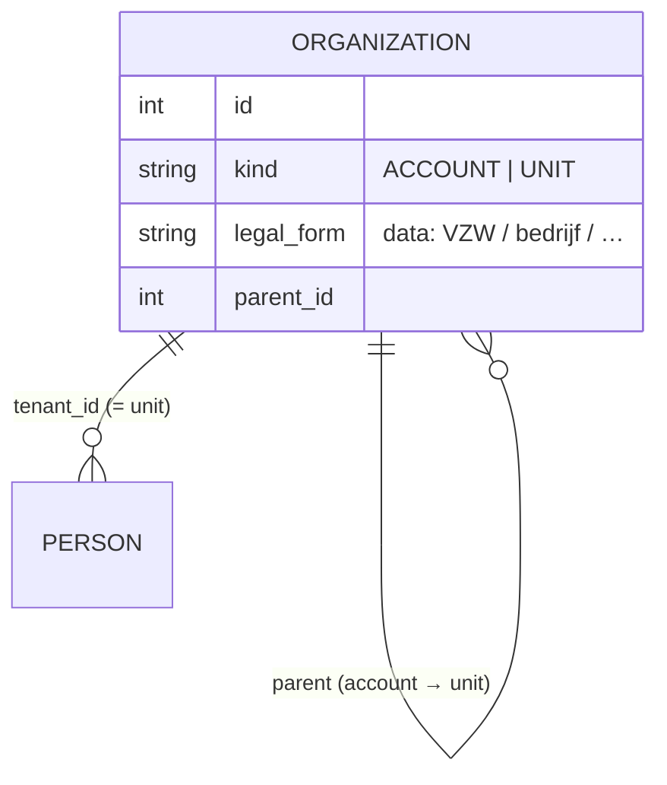
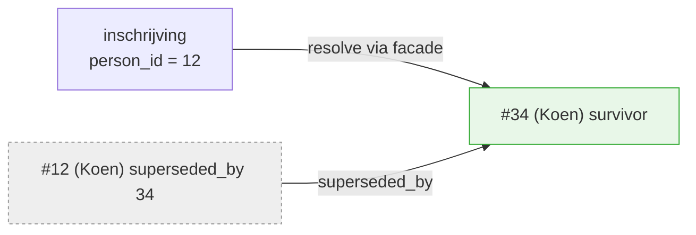
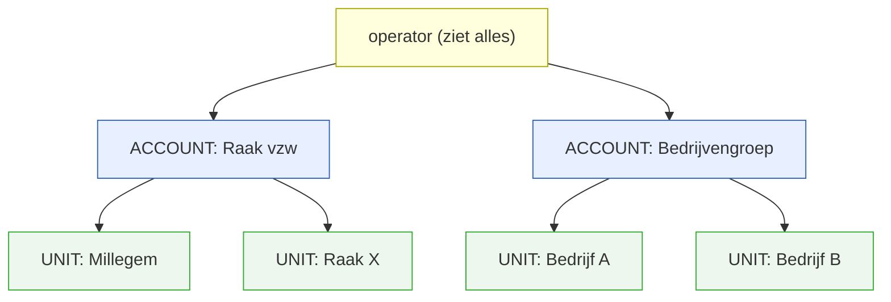
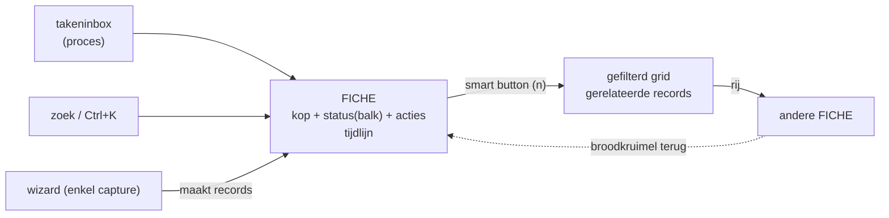

# Intermediate Architecture Upgrade — v1

> Werkdocument. Denkkader voor de tussenstap naar een **modulair, multi-tenant
> ERP/portaal/CRM**: domeinmodules met een facade + eigen Postgres-schema (en, waar
> afsplitsbaar, een eigen migratieketen), afgedwongen grenzen, en per-tenant merk-
> autonomie. Nog **geen** release toegewezen. Gerelateerd: epic **#366** (#360–#365).

---

## 0. Leeswijzer & kernbeslissingen (lees dit eerst)

De **kernbeslissingen** in één zin elk (details/ADR's staan in de genoemde secties):

1. **Package-by-domain** met facade `api.py` als enige deur; grens afgedwongen door
   import-linter (§1, §8, §13).
2. **Eigen Postgres-schema per component** (eigen Alembic-keten waar afsplitsbaar);
   één database → backup blijft één `pg_dump` (§13.1).
3. **auth, mail, MDM = laag 1**; domeinen praten enkel via facades/events (§5, §8).
4. **MDM**: nooit hard verwijderen — merge/survivorship + tombstone; anderen
   verwijzen via soft-refs (§6).
5. **membership = eigen component**, zuster van activities (§5.4).
6. **Multi-tenant = rij-niveau `tenant_id`**, aparte site per unit; **uitrol pas bij
   een concrete tweede tenant** (§7, §14).
7. **workflow + werkbank**: taken sluiten door toestand, zero-touch als norm,
   BPMN/DMN als taal, niet als motor (§20).
8. **Frontend = htmx + Jinja + Alpine (BESLIST)**; React-schermen klappen per
   component om, JS-eilanden enkel na de eilanden-toets; JSON/OpenAPI-facade blijft
   als machinecontract (§21). **Geen nieuwe React-investeringen meer.**
9. **Taalbeleid: Engels binnenin, weergave via Babel** (nl-BE eerst) (§22).
10. **Ideas → "berichten"**: geseed formulier + minimale workflow met één taak
    *behartigen* (§5.7).

**Kritiek pad** (§14): **H** (deploy-vangnet — beschermt geld, eerst) → **F**
(fundering) → **0** (forms-sjabloon) → **micro-pilot htmx** (berichten-scherm) →
1–4; **5** (tenancy) trigger-gated. O en T liften mee waar goedkoop.

**Waar staat wat**: componenten §3–§6 · tenancy §7 · grenzen/tests/conventies
§8–§12 · codestructuur & build §13 · plan §14 · beslissingen §15 · waarom §16–§17 ·
bewust-niet + risico's §18 · analyse-aanvullingen §19 · navigatie & werkbank §20 ·
frontend-ADR §21 · taal §22.

**Terminologie**: dit document gebruikt **component** als dé eenheid (map + schema
+ facade). "Module" is er een synoniem van (vermijden); "domein" = een component
in laag 2 (business), tegenover fundamentele componenten (laag 1) en
capaciteiten (media/STT).

---

## 1. Doel & principes

Van **modulaire monoliet** naar componenten met een **afdwingbare buitengrens**, zodat
we er later — enkel bij een concrete driver — een aparte app van kunnen maken. Bewust
een **leertraject**: forms is het sjabloon dat we op elk volgend domein herhalen.

- **Capture → Record → Act** — publieke capture (bezoeker), record-kern (eigen data +
  regels), rol-gated back-office (act).
- **Eén verticale slice per component** in `app/domains/<c>/`, met een **facade
  (`api.py`)** als enige publieke oppervlak — geen reach-in in models/services.
- **Owned data** — eigen Postgres-schema; cross-component enkel via **facade/events**,
  nooit live ORM-objecten of cross-schema FK's.
- **Kernel** = plumbing (db, config, events, tenant-context); hangt van geen domein af.
- **Modulariteit = OO op macroschaal** — module = object; facade = encapsulation,
  events = message passing, import-linter = het ontbrekende `private`-keyword.

---

## 2. Twee onafhankelijke assen

Verwar **modularisatie** en **multi-tenancy** niet — ze staan loodrecht op elkaar:

- **Module** (verticaal): *wélk soort data?* → eigen package + **Postgres-schema**
  (`form`, `payment`, `mdm` …).
- **Tenant** (horizontaal): *van wélke vereniging?* → **`tenant_id`** (rij-niveau) in
  elke moduletabel.

De koepel snijdt dwars door beide (ziet alle tenants in alle modules) → rij-niveau
`tenant_id` is het juiste model (§7).

---

## 3. Componentenkaart



Regels: schermen praten enkel met een **facade**; domeinen onderling enkel via
**facade/events**; **history** is een gedeeld kernel-patroon (geen aparte component).

---

## 4. Schermen ↔ componenten

Regel: **een scherm hoort bij de component wiens data het toont** — publiek én
back-office. Publiek vs back-office = rol/auth, geen componentgrens. Dus de
formulier-bouwer én de publieke render horen bij **form**.

| Scherm | Component | Rol |
|---|---|---|
| Formulier invullen / bouwer / inzendingen | **form** | — / ADMIN |
| Betaalflow / overzicht + **terugvordering** | **payment** | — / **FINANCE** |
| Lid/gezin inschrijven / ledenbeheer | **MDM** (+ membership) | — / ADMIN |
| Activiteiten publiek / beheer | **activities** | — / ADMIN |
| E-maillog | **mail** | ADMIN |
| Login / gebruikers & rollen | **auth** | — / ADMIN |
| CMS-pagina's | **cms** | — / ADMIN |
| **Werkbank / takeninbox** (alle taken + excepties, §20.5) | **workflow** | ADMIN / FINANCE |
| Berichten (IdeaBox: indienen / *behartigen*) | **form + workflow** | — / ADMIN |

**Frontend spiegelt de backend**: de schermen van een component leven in zijn eigen
map (`domains/<c>/templates/` + `ui.py`, §13.1/§21); gedeelde presentatie-primitives
(geld-/datumformattering, UI-kit-macro's) in de kernel/shell.

---

## 5. Componenten in detail

**5.1 auth & security** (laag 1). `users`, rollen, tokens, JWT-uitgifte/-verificatie.
Eén aparte, apart-deploybare component; **iedereen gebruikt `auth.api`**; auth hangt
enkel van de kernel af (de kernel roept auth niet aan → geen cyclus). Rol-toewijzingen
dragen `tenant_id` als waarde.
**Ontwerpregel autorisatie**: checks op de **facade**, uitgedrukt in **permissies
als data** (rol → permissie-mapping; per component gedeclareerd in `CONTRACT.md`,
bv. `payment.refund` → FINANCE) — nooit verspreide `if role == "ADMIN"`-checks in
services/templates. Nu volstaan de vier rollen; de permissie-laag zelf is een
heropener (§18) zodra een rol fijnmaziger moet.

**5.2 mail** (laag 1). `email_log` + het centrale `_send`-chokepoint + retentie. Facade
`send/list/delete`; anderen sturen via facade of `MailRequested`-event. `email_log`
blijft in `mail`/`public`, niet in `form` (correctie op migratie 062).

**5.3 MDM** (laag 1) — identiteit, **géén lidmaatschap**. Personen, gezinnen, adressen,
postcodes, organisaties (§6) + `external_numbers` + de codes `relation/contact/gender`.
Gezinssamenstelling = MDM; "is betalend lid" = membership. Facade `get_person/
find_family/resolve_postal_code/list_organizations` + `resolve/merge` (§6).

**5.4 membership** — eigen component, **zuster van activities** (niet samenvoegen, niet
in MDM). Lidmaatschaps-relatie (persoon/gezin ↔ UNIT), jaren, lidgeld, bestuurslid.
Beide steunen op MDM en voeden `payment`. `activities` vraagt membership "is lid?" via
facade (ledenkorting) → daarom apart en testbaar.

**5.5 AI & STT** — ondersteunend, aan de rand.
- **STT** = stateless capaciteit (audio→tekst), géén schema → **eerste
  extractie-kandidaat** (zware libs/GPU): in-process nu, externe service later, zelfde
  facade (#364).
- **chatbot/AI** = laag-2 domein (schema `ai`) dat STT + LLM-providers consumeert.
- Providers achter adapters, **Europe-First**; keys = per-tenant secret.

**5.6 media** — gedeelde **capaciteit** (zoals mail), geen blad-domein. Meerdere
domeinen verwijzen via een `asset_id` (waarde). Schema `media` (metadata) + storage-
adapter (schijf/Storage Box, Europe-First). Facade `store/get_url/delete/resize`.
Tenant-scoped.

**5.7 workflow** — pluggbaar **vervolgproces + menselijke taken**. Form blijft dom
(publiceert `SubmissionCreated`); workflow luistert, start een instantie en beheert
states + taken (bewaart `submission_id` als waarde). Bouwer koppelt enkel een
`workflow_definition`-id; de procesdefinitie + takeninbox horen bij workflow. Facade
`start/advance/list_tasks/complete_task`; publiceert `WorkflowCompleted`.
**IdeaBox (beter: "berichten") = een geseed formulier + een minimale workflow met
één menselijke taak: *behartigen*** (`nieuw → behartigen → afgehandeld`; een
afwijzing is ook een afhandeling). De losse `ideas`-component vervalt. Dit is
meteen de eenvoudigste referentie-workflow: één taak, sluit door toestand.

**5.8 Cross-cutting & plaatsing van resttabellen**
- **History = gedeeld kernel-patroon** (`Historized`-mixin), per-component `*_history`
  in het eigen schema — géén centrale audit-component.
- **Event-semantiek (ontwerpregel)**: events zijn **synchroon en in-transactie** —
  een handler-fout rolt de bron mee terug; feitelijk nette functie-aanroepen met
  ontkoppelde naamgeving. Dat is bewust: geen verborgen "misschien ooit"-semantiek.
  Bij extractie van een component verandert dit per definitie → dán het
  **transactional-outbox-patroon** (event in dezelfde DB-transactie wegschrijven,
  aparte bezorger) — heropener in §18, niet vooraf bouwen.
- **De event-ladder (beslist 2026-07-09)** — zo blijft "business event driven"
  op LT géén hybride knoeiboel:
  1. **In-transactie** (nu): alle events synchroon, zie hierboven.
  2. **Outbox met Postgres als queue** — pas bij de éérste extractie, en enkel
     voor de naden van dát component.
  3. **Echte broker** — pas als meerdere geëxtraheerde componenten onderling
     praten. Treden overslaan is verboden; elke trede heeft zijn trigger.
  Twee harde regels: **(a) per event-type is de bezorging óf synchroon óf
  asynchroon — nooit allebei, nooit "soms"** (de `CONTRACT.md` van de publisher
  vermeldt welke, dus elke consument kent zijn semantiek); **(b) nooit een
  message broker tussen componenten in hetzelfde proces** — dat betaalt alle
  kosten van gedistribueerd (volgorde, retries, dubbele bezorging, idempotentie)
  zonder één baat. Het vangnet bij async is er al: afgeleide toestandstaken in
  de werkbank (§20.5) + reconciliatie (§19.2) maken een stille queue-storing
  zichtbaar. Het programmeermodel verandert bij geen enkele trede — componenten
  reageren op feiten en kennen elkaar niet; enkel de bezorging verhuist.
- **Achtergrondwerk = kernel-primitief**: één **Postgres-gebaseerde job-tabel +
  scheduler-loop** in de kernel (geen Redis/Celery op deze schaal). Retentie-vegen,
  mail-retries, taak-respijttermijnen ("na N dagen"), reconciliaties — allemaal
  déclareert een component zijn jobs daar. Jobs zijn transactioneel met de data en
  falen zichtbaar (werkbank-taak bij herhaald falen, §20.5). Geen losse cronjobs.
- **Rapportage over componenten heen**: facades doen geen joins — dwarsdoorsnedes
  (dashboard, ERP-rapporten) lopen via een **read-only rapportageschema** met views
  die wél over schema's heen mogen lezen (lezen breekt geen eigenaarschap;
  schrijven wel). Expliciet tweederangs: wordt een component ooit geëxtraheerd,
  dan verhuizen zijn views mee naar API-aggregatie.
- **`business_events`**: geen meerwaarde → parkeren/verwijderen.
- **`external_numbers`** → MDM (externe identiteit).
- **Referentiecodes** → in het schema van hun eigen component (geen gedeelde
  `reference`-namespace); anderen bewaren de **waarde**.

---

## 6. MDM: organisaties, merge & soft-refs

### Organisaties (generiek, niet vzw-specifiek)

`organizations` is zelf-refererend: **ACCOUNT** = koepel/klant (wortel), **UNIT** =
operationele eenheid (bij Raak: Millegem, X, Y, Z). `legal_form` is **data** → org-type-
neutraal. Elke tenant-rij draagt `tenant_id` = UNIT; de account-scope volgt uit de boom.

### Merge & survivorship — nooit verwijderen
MDM-entiteiten worden **nooit hard verwijderd**; dubbels worden gemergd tot één *golden
record*, de verliezer blijft als **tombstone** die naar de survivor wijst.


- **ID-redirect**: `superseded_by_id` (self-FK, `null`=actief); `resolve()` volgt de
  keten (bij merge platgeslagen → O(1)). `merge()` idempotent.
- **Altijd actueel**: consumenten lezen via `mdm.api.get/resolve` → een oude
  inschrijving komt vanzelf bij de survivor uit.
- **Niets verloren → unmerge mogelijk**; de merge wordt gelogd (history-patroon).
- Event **`EntityMerged`** voor optionele housekeeping (niet nodig voor correctheid).

### Soft reference (zo verwijst bv. de form engine naar een persoon)
- **Waarde-kolom** `mdm_person_id` (nullable), **geen cross-schema FK** — een echte FK
  zou de schema's koppelen, onafhankelijk deployen breken én de merge-redirect
  onmogelijk maken. Concreet: `form_submissions.mdm_person_id`.
- **Optioneel** (forms mogen anoniem blijven → losse koppeling behouden); **altijd via
  de facade lezen** (redirect transparant). Het nooit-verwijderen + tombstone garandeert
  dat een id **nooit dangelt** — sterker dan een harde FK. Zelfde patroon voor
  membership/activities/payment.

---

## 7. Multi-tenant

**Klant = ACCOUNT** (generiek elk type org), **tenants = UNITs**. Drie niveaus:
**operator** (platform, ziet alles) → **account** (klant/billing) → **unit** (eigen
brand). Een klant die quasi-autonome, eigen-brand bedrijven beheert = **één account,
één unit per bedrijf**. Meerdere accounts naast elkaar is **native** (aparte
`organizations`-wortels).



- **Model = rij-niveau `tenant_id`** (shared schema). Schema-/DB-per-tenant vallen af:
  de koepel moet dwars over tenants rapporteren (`WHERE tenant_id IN …` i.p.v. een
  cross-schema-union). **RLS** later als DB-vangnet — maar **RLS-klaar vanaf dag
  één**: `tenant_id` altijd `NOT NULL` + geïndexeerd (in de kernel-mixin), zodat
  RLS aanzetten een migratieregel is, geen verbouwing.
- **Tenant-context in de kernel** (uit JWT/hostname); facades filteren standaard op de
  actieve tenant. **Rollen**: `ADMIN`/`FINANCE` per UNIT, `ACCOUNT_ADMIN` per account,
  `OPERATOR` op platformniveau.
- **Cross-account isolatie is hard**; **zichtbaarheid binnen een account is
  configureerbaar** (gedeeld: koepel ziet/deelt alles — vs geïsoleerd: units delen niet,
  account enkel oversight) — een facade-policy, geen schemawijziging.
- **Uitrol per app, niet dark/big-bang**: kernel levert de `tenant_id`-mixin + context;
  elke app adopteert dat op zijn moment, grondig getest.

### Config & secrets (multi-tenant-scheiding)
- **Per-tenant config** → **DB-beheerd** (afzendermail, Mollie-profiel, logo, branding,
  domein). Vandaag in `.env`; verhuist naar een per-tenant settings-store met `.env`-
  default tijdens de single-tenant-fase.
- **Per-tenant secrets** (Mollie-key) → **DB, versleuteld**.
- **Infra/technologie** (DB-wachtwoord, IP, SSH, `SECRET_KEY`, proxy/CA) → **`.env`**.

### Merk-autonomie & SEO — aparte site per unit
Harde eis: **elke unit is een zelfstandig indexerende site** (Google/Bing/Qwant) → een
**eigen host per unit** (geen pad-prefix):
- **Eigen domein** (`raakmillegem.be`, `raakx.be`) — aanrader, sterkste scheiding +
  domain authority. **Subdomein** kan ook. **Pad-prefix valt af** (dat is één site).
- **Hostname-resolutie** (Next.js middleware) → tenant; per unit een **canonical
  base-URL** in de per-tenant config. Cert/DNS per host via Caddy. Overstap subdomein →
  domein = config + DNS + **301-redirects**, geen code.
- **SEO is een afgeleide**: `generateMetadata`, `Organization`-JSON-LD, `sitemap.xml` en
  `robots.txt` lezen de actieve tenant. Content is al tenant-scoped (CMS + activiteiten).
  De issues #320 (JSON-LD) en #322 (og:image) worden zo **per unit**.

---

## 8. Afhankelijkheden & grens-handhaving

3-lagen-model — afhankelijkheden wijzen **enkel naar beneden**:

| Laag | Bevat | Mag afhangen van |
|---|---|---|
| **0 · Kernel** | db, config, events, tenant-context, history-mixin | niets |
| **1 · Fundamenteel** | auth, mail, MDM | enkel kernel |
| **2 · Domeinen** | form, payment, activities, membership, workflow, cms, chatbot | kernel + laag-1-facades + elkaars facades/events |

Gehandhaafd door: **(1)** import-linter in CI (mapgrens = moduulgrens); **(2)** geen
cross-schema FK's (integratietest op `information_schema`); **(3)** aparte Alembic-keten
per afsplitsbaar component (drift/één-head-tests); **(4)** later per-schema `GRANT` + RLS.

---

## 9. Ontwikkelen binnen een component — contract-stabiliteit

Het **contract** = facade-signaturen (`api.py`) + DTO's + event-schema's
(`kernel/contracts`). Alles daaronder (models, service, schema) is intern en mag vrij
wijzigen.

- **Additief = vrij** (nieuwe functie/optioneel veld/event).
- **Breaking = deprecatie-cyclus**: nieuwe variant → oude `@deprecated` → consumenten
  migreren → verwijderen; events versioneerbaar (`…V2` naast `…V1`).

> Werkregel: *onder de facade refactor je vrij; aan de facade wijzig je niets zonder
> deprecatie-cyclus én groene contract-tests.* De import-linter garandeert dat het
> contract de enige koppeling is.

---

## 10. Teststrategie

Vier lagen, van snel/lokaal naar breed:
1. **Unit** — in-component, tegen het eigen schema (validatielagen apart).
2. **Contract** (de naad) — provider bewijst dat facade/events het schema naleven; elke
   consument test tegen een **stub die aan datzelfde schema wordt gevalideerd** → een
   contract-breuk laat de consument in CI falen. Zo ontwikkel je **in isolatie**.
3. **Integratie-flow** — "golden flows" tegen de echt gewired app + alle schema's, bv.:
   *inschrijving → membership-check → betaling → mail + history*; *formulier → submission
   → confirmatiemail*; *terugvordering (FINANCE) → payment-status + mail*.
4. **Migratie/grens** — per keten: één head, autogenerate-drift, geen cross-schema FK.

CI: unit + contract + linter op elke push; integratie + migratie op PR/merge (echte
Postgres 16, alle ketens). Import-linter sluit *verborgen* koppeling uit, contract-tests
vangen *contract-breuk*, golden flows bewijzen de *samengestelde* werking.

---

## 11. Conventies (GUI · code · API)

Componenten moeten er **hetzelfde uitzien en aanvoelen** — anders krijg je N eilandjes.

- **GUI**: gedeelde **UI-kit** + twee sjablonen — **AdminConsole** (lijst+filters →
  detail → rol-gated acties + bevestiging) en **Public-capture** (token/anoniem →
  gevalideerde submit → bevestiging). Rol-bewuste UI, a11y-baseline, nl-BE + gedeelde
  formatting.
- **Code**: identieke component-structuur (`api/router/schemas/service/models`);
  validatielagen (vorm→router, regels→service, integriteit→DB); import-linter; ruff +
  mypy / eslint + prettier + tsc; **kernel-patronen hergebruiken** (tenant-mixin,
  history-mixin, soft-delete, `superseded_by`, event-dispatcher).
- **API**: `/api/v1/<component>/<resource>`; standaard error-/paginatie-envelope; DTO's
  & events als contract (`kernel/contracts`, events `<Aggregate><Verb>`); **OpenAPI** als
  waarheidsbron (`api.ts` spiegelt); idempotentie waar het telt (`merge`, Mollie-webhook);
  `created_at/updated_at` tz-aware.

---

## 12. Component-documentatie & change-impact

Prosa veroudert → **contract-als-code + een dun manifest, afgedwongen door tests.**

- **`CONTRACT.md` per component**: publiceert (facade + events), consumeert
  (afhankelijkheden), bezit (schema/config), deprecaties, `CODEOWNERS`.
- **Bron van waarheid** (manifest verwíjst ernaar): OpenAPI + DTO/event-schema's;
  contract-tests toetsen diezelfde schema's → de test *is* de handhaving.
- **Change-impact**: uit de "consumeert"-declaraties bouw je een **reverse-index**
  ("wie hangt van mij af") + de dependency-graph. Een contract-wijziging → **contract-
  tests bij de consumenten falen** → blast radius met naam; `CODEOWNERS` tagt reviewers.

> Regel: een contract wijzig je niet zonder `CONTRACT.md` bijgewerkt én groene
> contract-tests bij álle consumenten.

---

## 13. Codebase-(her)structurering

Van **package-by-layer** (form ligt versnipperd over `routers/models/services/schemas`)
naar **package-by-domain**. Je bent al begonnen (`domains/`); we maken het af.
*Eén map = één component = één schema = één toekomstige app.*

**Backend**
```
app/
  kernel/     database, config, soft_delete, security(verify),
              events, contracts, tenancy(mixin+context), history(mixin)
  domains/
    auth/  mdm/  mail/                      # laag 1
      api.py router.py schemas.py service.py models.py migrations/ CONTRACT.md
    membership/ activities/ form/ workflow/ payment/ cms/ chatbot/   # laag 2
    media/ stt/ analytics/                  # capaciteiten / read-model
  main.py     # mount enkel domains/*/router.py
  # routers/ models/ services/ schemas/ → lopen leeg en verdwijnen
```
Interne modules (cms, activities, analytics) krijgen wél een eigen schema, géén eigen
keten (§14).

**Frontend** — geen aparte spiegelboom: schermen wonen ín de component-map
(`templates/` + `ui.py`, §13.1); de UI-kit is een gedeelde Jinja-macro-bibliotheek
in de shell. De bestaande Next-`src/` blijft ongewijzigd tot elk scherm omklapt
(§21.4) en verdwijnt daarna.

**Migratiepad (strangler, geen big-bang)**: forms eerst als sjabloon (`git mv` +
facade, geen gedragswijziging) → per component één PR → kernel optrekken. **Valkuil**:
model-discovery — verplaats je models, laat `Base.metadata`/Alembic ze nog vinden
(import in `domains/__init__.py` of `env.py`).

**Data-verhuis hoort bij het pad**: bestaande tabellen verhuizen naar hun
component-schema via `ALTER TABLE … SET SCHEMA` in een migratie van de éigen keten
(expand/contract: eerst verhuizen + oude naam als view/synoniem indien nodig, dan
verwijzingen omzetten, dan opruimen). Te doen vóór/bij Fase 1 per component —
`pg_dump` blijft één commando (§13.1), de verhuis is puur namespacing.

### 13.1 Eén map per component — wat zit erin (en wat bewust niet)

Ja: **één map = álles van die module** — backend, frontend-feature, migraties,
tests, contract:

```
domains/payment/
  api.py router.py schemas.py service.py models.py   # backend
  ui.py                  # UI-routes: view-model bouwen, template kiezen (§21)
  templates/             # Jinja-templates + htmx-fragmenten van dit component
  migrations/            # eigen Alembic-keten (afsplitsbare apps)
  tests/                 # unit + contract van dit component
  CONTRACT.md            # publiceert / consumeert / bezit / deprecaties
  seeds.py               # referentiedata van dit component
```

Maar in de **intermediate** fase is dat een *package*, geen *deployable*: er blijft
**één backend-proces** (FastAPI mount routers én UI-routes; serveert JSON én HTML,
§21) en **één Postgres-instance** (per component een eigen **schema** + eigen
keten). Tijdens de hybride periode draait de bestaande Next-build ernaast tot het
laatste scherm is omgeklapt. "Eigen frontend/backend/database per app" is de
**eindtoestand-optie** die deze structuur mogelijk maakt — een component eruit
tillen is dan `git mv` + eigen deploy, geen herschrijving. We betalen de
operationele kost van N processen/DB's pas als een component er echt uit moet (§18).

**Backup blijft één commando.** Schema's zijn namespaces *binnen* één database:
één `pg_dump` van die database neemt álle schema's mee (tabellen, sequences,
indexes, grants) — één backup, één restore, één consistent point-in-time-beeld
over alle componenten heen. De bestaande `db-backup`-service werkt dus ongewijzigd
door; niets hoeft per schema gescript te worden. Pas als een component ooit een
éigen database/instance krijgt (eindtoestand-optie), splitst zijn backup mee af —
en dan bewust, met het component, niet als verborgen bijwerking.

**De GUI-orchestrator**: twee dunne **shells** die zelf géén domeincode bevatten —
**AdminShell** (navigatie, login, base-layout, UI-kit-macro's, rol-gating) en
**PublicShell** (publieke site per unit). Een shell *componeert* de
`templates/`+`ui.py` van de componenten (elke component registreert zijn nav-items
+ routes; de shell mount ze). Nieuw component = map toevoegen + registreren, de
shell wijzigt niet.

**Tests op twee niveaus**: per component `domains/<c>/tests/` (unit + contract,
draaien tegen enkel het eigen schema + gestubde facades); overkoepelend
`tests/integration/` op repo-niveau (de **golden flows** van §10, tegen de echt
gewirede app met álle schema's). Een component-map is groen te krijgen zonder de
rest te draaien; de golden flows bewijzen de samenstelling.

### 13.2 Eén bouwcommando — build · migrate · test · gate

Eén ingang (`make ci` / `./build.sh`) die lokaal en in CI **identiek** is:

1. **Build** — backend-image (alle componenten, incl. `check_imports`),
   AdminShell + PublicShell (`tsc` + `next build`).
2. **Migrate** — alle Alembic-ketens in laagvolgorde (kernel → laag 1 → laag 2),
   per keten: precies één head + autogenerate-drift-check.
3. **Test** — per component zijn eigen suite (parallelliseerbaar, CI-matrix per
   map: alleen gewijzigde componenten + hun consumenten hoeven te draaien) → daarna
   de golden flows.
4. **Gates** — import-linter (mapgrens), geen-cross-schema-FK-check, OpenAPI-drift
   (§19.4), publieke-repo-guard.

Groen = mergebaar; de stappen zijn de definitie van "af". Gedocumenteerd op één
plaats (`BUILDING.md` op repo-root) — de component-mappen documenteren enkel hun
eigen contract (`CONTRACT.md`, §12).

---

## 14. Roadmap & backlog

**Nog geen issues aangemaakt** — dit wordt op go sub-issues onder #366. Vast sjabloon
per component-PR: `facade → import-linter → eigen schema (+ keten waar afsplitsbaar) →
contract-/integratietests → frontend-feature → CONTRACT.md`.

**Kritiek pad**: **H eerst** (deploy-vangnet beschermt geld vóór er migraties
verhuizen) → F (fundering) → Fase 0 (forms-sjabloon) → **P (micro-pilot htmx)** →
mail/auth → MDM. De rest kan grotendeels **parallel** zodra fundering + sjabloon
staan — met een harde grens: **maximaal 2–3 componenten tegelijk in uitvoering**
(focus verslaat doorloop; half-verhuisde componenten zijn de duurste toestand). **Fase 5 (tenancy) is trigger-gated**: voorbereiding (kernel-mixin) hoort
bij F, de uitrol start pas bij een concrete tweede tenant.

| Blok | Werkpakketten | Status |
|---|---|---|
| **F · Fundering** | kernel optrekken (events/contracts/tenancy-mixin/history/security/**job-primitief §5.8**); import-linter-harness; component-scaffold + `CONTRACT.md`-template; test-harness (contract + golden-flow); UI-kit als **design-tokens + Jinja-macro's** (§21; basis-set, groeit per omklap) | nieuw |
| **0 · Form-sjabloon** | forms→`domains/forms` + facade; import-linter; schema `form` + handoff; 2e keten + integratietests | **#360–#363** |
| **P · Micro-pilot htmx** (direct na 0) | het **berichten/behartigen-scherm** (§5.7) als eerste htmx/Jinja/Alpine-scherm: base-layout, sessie-auth-pad, CSRF-conventie, eerste macro's; meetlat van §21.4 toegepast — dít valideert de frontend-keuze vóór de dure blokken | nieuw |
| **1 · Cross-cutting** | mail-component; auth-component (laag 1) | nieuw |
| **2 · MDM** | MDM (+ `external_numbers`) + schema/keten; merge/survivorship; soft-ref-patroon | nieuw |
| **3 · Payments** | `domains/payments` (gateway+status) + FINANCE-refund; **wees-record-check** op `payable_id` (§19) | **#365** |
| **4 · Domeinen** | membership (+`is_member`); activities; workflow + IdeaBox; media; cms; chatbot | nieuw |
| **5 · Multi-tenant** (**trigger: concrete tweede tenant**) | organizations (ACCOUNT/UNIT); per-tenant config/secrets-store; `tenant_id` per app + context + rollen; meerdere accounts + hostname-resolutie + per-unit SEO | nieuw |
| **6 · Extractie** | STT → externe service (bij driver) | **#364** |
| **H · Operationele hardening** (§19, kan vóór alles) | deploy-vangnet (pre-migratie-backup, smoke als gate, rollback-runbook); security-batch (non-root containers, OTP-hash, JWT-TTL/HttpOnly, CSP zonder unsafe-inline/eval, blokkerende audit); CI-gates vervroegen (vitest-gate, e2e-geldflow blokkerend, `alembic check`); observability (error-tracking/logs/uptime/alerts); restore-oefening per release; rate-limiter-1-worker-aanname borgen | nieuw |
| **O · Opruiming** (§19, kan vóór alles) | `business_events` verwijderen; `domains/common/` + stale docs weg; dead-endpoint-sweep. (`ideas` → formulier + minimale workflow verhuist naar fase 4: vereist de workflow-component) | nieuw |
| **T · Taalbeleid** (§22, kan vóór alles) | Babel + `nl_BE`-catalogus; backend-teksten (e-mails, validatie, ODS-koppen) door `_()`; extract/lint-gate in CI; nieuwe code/DB/tests Engels | nieuw |
| **W · Werving & communicatie** (§23, ná MDM + workflow; consent-capture kan eerder mee) | opt-in/consent in MDM + suppressielijst; segment-queries; AI-nieuwsbrief (personalisatie enkel aanhef) met werkbank-review; levenscyclus-flows (na deelname, eerste-deelname→word-lid, verlenging, win-back); enquête (form + selectieve AI-chat); feedback-scheiding intern/extern; vergaderassistent; SVG-affichegenerator | nieuw |

**Klaar wanneer** (per blok, de stuurbaarheid als de tijd op is):
- **H**: pre-migratie-backup + smoke-gate + één geslaagde restore-oefening draaien op PROD-deployflow.
- **F**: scaffold + linter + test-harness bestaan én zijn door Fase 0 als eerste klant bewezen.
- **0**: forms leeft in `domains/forms` met eigen schema/keten, linter groen, golden flow groen.
- **P**: berichten-scherm live op HDEV in htmx; §21.4-meetlat ingevuld → go/no-go voor de bredere omklap.
- **1–4**: per component zelfde definitie als 0 (map + schema + contract + tests groen); werkbank-v1 = taken tonen/sluiten voor de berichten-workflow.
- **5**: een tweede tenant draait productief op een eigen hostname zonder codewijziging.
- **O/T**: register-items afgevinkt; T = geen ongemarkeerde gebruikersstrings meer in nieuwe code (lint-gate aan).
- **W**: eerste levenscyclus-flow (na-eerste-deelname) draait zero-touch met werkbank-review; conversie en bespaarde uren worden gemeten (§23.5).

---

## 15. Ontwerpkeuzes (register)

> **Vorm (ADR-light)**: elke nieuwe beslissing krijgt vier regels — *datum ·
> context · gekozen (met verworpen alternatief) · heropener* (wat zou ons van
> gedachten doen veranderen). §18 en §20.4 tonen het patroon; bestaande regels
> hieronder blijven zoals ze zijn.

- ✅ **Package-by-domain**; facade `api.py`; grens via **import-linter**.
- ✅ **Frontend-eindbeeld = één taal, server-rendered (htmx + Jinja + Alpine)** via
  het pilotpad; form-builder het langst als React-eiland; JSON/OpenAPI-facade
  blijft — volledig ADR in **§21.5**.
- ✅ **Taalbeleid: Engels binnenin, weergave via Babel** (nl-BE eerst) — code/DB/
  tests/technische docs Engels; alle gebruikerstekst door de catalogus; Babel
  start al backend-side vóór de htmx-migratie — **§22**.
- ✅ **Eigen Alembic-keten** voor afsplitsbare apps (auth, mail, MDM, form, payment);
  interne modules enkel een eigen schema.
- ✅ **auth = één fundamentele component** (niet gesplitst; verify-mechanisme in kernel).
- ✅ **MDM**: `master`→MDM; bevat `external_numbers`; **nooit verwijderen +
  merge/survivorship**; anderen verwijzen via **soft-ref** (waarde-id).
- ✅ **membership = eigen component** (zuster van activities), **niet**
  `activities_membership`.
- ✅ **AI/STT gesplitst** (STT capaciteit/extractie-kandidaat; chatbot domein).
- ✅ **media = gedeelde capaciteit**; **workflow = eigen component**; **IdeaBox
  ("berichten") = form + minimale workflow met één menselijke taak *behartigen***
  (`ideas` vervalt; mét workflow, niet zonder).
- ✅ **history = kernel-patroon** per component; **`business_events` schrappen**.
- ✅ **Referentiecodes in eigen component-schema** (geen gedeelde namespace).
- ✅ **Multi-tenant = rij-niveau `tenant_id`**; **geen dark tenant_id** (per app,
  getest); **RLS later**. **Meerdere accounts native**; rollen `ACCOUNT_ADMIN`/`OPERATOR`.
- ✅ **Org-model generiek** (`ACCOUNT_ADMIN`, `legal_form` als data).
- ✅ **Config-scheiding**: per-tenant config/secrets in DB (secrets versleuteld); infra
  in `.env`.
- ✅ **Aparte site per unit** (eigen host, hostname-resolutie; geen pad-prefix).
- ✅ **Frontend per fase/component** (templates + `ui.py` in de component-map, §13.1).

---

## 16. Kostenefficiëntie voor AI-assisted development

De grootste kostendrijver is *hoeveel er gelezen moet worden om veilig te handelen*.
Kleine componenten verkleinen dat leesoppervlak → **lagere kost per taak** (een
investering, geen automatische korting).

- **Daalt door**: begrensde context (`domains/<c>/` i.p.v. de hele repo); **contract
  i.p.v. implementatie** lezen (`CONTRACT.md`/facade); scherpe feedback (linter +
  contract-tests wijzen breuk met naam aan); kleinere test-/CI-scope.
- **Kost of helpt niet**: upfront-herstructurering; cross-cutting wijzigingen; vereist
  discipline (grenzen echt afgedwongen); iets meer boilerplate per triviale change.

> Een typische taak verschuift van *"lees een groot deel van de repo"* naar *"lees één
> map + een paar contracten"* — dáár zit de winst, en dat maakt latere agentische/
> parallelle ontwikkeling per component haalbaar.

---

## 17. Waarom — korte & lange termijn

**Korte termijn**: stop de fragiliteit/data-verlies (bv. #357: bewerken wiste
inzendingen); sneller & goedkoper ontwikkelen; makkelijker redeneren en overdragen
(facade + `CONTRACT.md`); en de concrete noden nu (form engine, betalingen/refund,
kernel-fundering).

**Lange termijn**: modulair ERP/portaal/CRM met onafhankelijk evoluerende, afsplitsbare
componenten; multi-tenant SaaS (meerdere accounts, aparte site per unit — **nieuwe
klant = config, geen code**); herbruikbare componenten; toekomstbestendig voor
AI/agentisch werk; beheersbare compliance/isolatie; en géén "big ball of mud".

> De strangler-aanpak laat KT-waarde en LT-fundering **samenvallen**: elke stap lost nu
> iets op én legt een steen voor later.

---

## 18. Out-of-scope — bewust (nog) niet

Levend register: "LT" = heroverwegen zodra de trigger opduikt.

| Idee | Waarom nu niet / trigger |
|---|---|
| Microservices / aparte DB's / message broker | Modulaire monoliet volstaat; splits enkel bij een concrete driver. Naden liggen klaar. |
| DB-/schema-per-tenant | Rij-niveau gekozen; enkel bij harde isolatie-eis. |
| Postgres RLS | Eerst facade-filtering; als hardening ná Fase 5. |
| Externe IdP / SSO | Eigen `auth` volstaat; bij klantvraag. |
| Volledige BPM-engine (Camunda…) | Start met lichte eigen `workflow`. |
| Event-sourcing / CQRS | Enkel read-models waar nuttig. |
| Extra betaalproviders | Mollie (EU) volstaat; adapter maakt uitbreiding triviaal. |
| Volledige i18n | nl-BE nu; bij markt-/tenantvraag. |
| Mobiel/native, real-time (websockets) | Web-first; bij behoefte. |
| BI / datawarehouse | Simpele `analytics` nu. |
| `business_events` → audit-platform | Geschrapt (§5.8). |
| GDPR-self-service | Na tenancy + MDM; nu admin-verwijderen (MDM = tombstone, nooit hard). |
| PII-retentie per component (submissions/registraties/history) | Geparkeerd (2026-07-07): bewust niets doen; `email_log`-retentie volstaat. Trigger: externe eis of tenant-vraag. |
| Feature-flag-platform | Lichte config-vlaggen volstaan. |
| Kubernetes / auto-scaling | Docker-compose volstaat; bij schaalnood. |
| "Dark" `tenant_id` vervroegd | Bewust niet (per app, getest). |
| Transactional outbox voor events | Events zijn nu synchroon/in-transactie (§5.8); outbox pas bij extractie van een component — trede 2 van de event-ladder (§5.8). |
| Message broker (Kafka/RabbitMQ) | Trede 3 van de event-ladder (§5.8): pas als meerdere geëxtraheerde componenten onderling praten; nooit tussen componenten in hetzelfde proces. |
| Video-generatie (TikTok/Instagram) | Bewust niet bouwen (§23.7): platform levert script/tekst/beeldsuggesties; montage in bestaande tools (Canva/CapCut). |
| Permissie-laag (permissies als data) | Vier rollen volstaan; bouwen zodra een rol fijnmaziger moet (bv. aparte merge- of refund-bevoegdheid). Ontwerpregel ligt vast in §5.1. |

### 18.1 Risicoregister (proces, niet techniek)

| Risico | Vangnet |
|---|---|
| **Bus-factor 1** (alle context bij Koen + AI-sessies) | dit document + ADR's + `CONTRACT.md`'s zíjn de overdracht; elke beslissing met heropener vastleggen (§15-vorm); release-trackers als logboek |
| **Migratie-moeheid halverwege de strangler** | elke fase levert op zichzelf waarde (klaar-criteria §14); stoppen na eender welke fase laat een consistent systeem achter — er is geen "half verbouwd"-toestand die af móét |
| **Hybride periode (React+htmx) blijft hangen** | omklap lift mee met de modularisatie-fases (begrensd); meetbare eindstreep = frontend-container weg (§21.5); P-blok geeft vroeg een go/no-go zodat we niet láát ontdekken dat het niet werkt |

---

## 19. Aanvullingen uit de codebase-analyse (juli 2026)

De analyse (`codebase-analyse-erp-fundament.md`, vier deep-dives met
file:line-bewijs) **valideert dit plan**: de lazy-import-cykels bewijzen de
payments-facade, de frontend-duplicatie bewijst de UI-kit (§11), de CI-gaten
bewijzen §8/§10. Drie concrete aanvullingen + een vereenvoudigingsregister:

### 19.1 Operationele hardening (backlog-blok H)
- **Deploy-vangnet** — pre-migratie-backup-hook in `deploy-prod.sh`, post-deploy
  smoke als **gate** (nu `|| true`), rollback-runbook. Klein werk, essentieel met
  financiële data; vereist de modularisatie niet.
- **Security-batch** — non-root containers (`USER` in Dockerfiles), OTP-codes
  gehasht opslaan, kortere JWT-TTL of HttpOnly-cookie-pad, dependency-audit
  blokkerend voor high-severity, **CSP aanscherpen** (`unsafe-inline`/
  `unsafe-eval` eruit; wordt makkelijker naarmate schermen server-rendered
  worden, §21). (Geen kritieke bevindingen; dit is hardening.)
- **Rate-limiter-grens** — de in-memory limiter veronderstelt 1 worker/1 proces;
  bij de éérste tweede Uvicorn-worker of replica breekt die aanname stil.
  Vangnet: assert/documenteer de aanname bij de worker-config; structurele fix
  (gedeelde store, bv. Postgres/Redis) pas bij de echte schaal-driver.
- **PII-retentie verbreden — geparkeerd (beslist 2026-07-07)**: `email_log`
  heeft retentie; submissions/registraties/history niet. Bewust niets doen;
  zie §18.
- **CI-gates vervroegen** — de goedkope gates uit §10/§11 nu al aanzetten:
  vitest zonder `--passWithNoTests`, e2e-geldflow blokkerend, `alembic check`
  (drift). De import-linter volgt met Fase 0.
- **Observability** — de werkbank vangt *business*-excepties, maar technische
  signalen hebben een eigen kanaal nodig: error-tracking (Europe-First:
  **GlitchTip** of self-hosted Sentry), gestructureerde logs, uptime-check per
  site, alert bij gefaalde Mollie-webhooks/mails. Zonder dit hangt "iets is stuk"
  af van wie het toevallig meldt.
- **Restore-oefening** — een backup die nooit is teruggezet, is een hoop. Per
  release (of periodiek): restore naar een wegwerp-DB + read-only smoke test.
  Sluit de keten backup → bewezen herstelbaar.

### 19.2 Integriteit polymorfe refs
`payment_records.payable_type/payable_id` is een soft-ref zónder de
MDM-tombstone-garantie (§6): een wees-record is vandaag mogelijk. Toevoegen aan de
grens-/integratietests (§10 laag 4): **check dat elke payable_id naar een bestaande
bron wijst** (reconciliatie-query, faalt luid).

### 19.3 Vereenvoudiging & afscheid (register, backlog-blok O)
Snoeien is ook architectuur. Levend register, zelfde geest als §18:

| Actie | Winst |
|---|---|
| **`business_events` verwijderen** (beslist, §5.8 — nu uitvoeren) | −1 tabel, −PII-guard-service, −6 emit-sites in 5 flows, −admin-stats-endpoint, −13 tests |
| **`ideas` ("berichten") → geseed formulier + minimale workflow** (beslist; mét workflow — één menselijke taak *behartigen*, zie §5.7) | −router, −model+tabel, −admin-pagina, −IdeaBox-component, −idea_limiter |
| **`domains/common/` (leeg) + `docs/change_request_0X.md`** opruimen | minder dode structuur |
| **Dead-endpoint-sweep**: backend-routes vs. werkelijk `api.ts`-gebruik | kleiner API-oppervlak (kandidaat: 32 routes in `activities.py`) |
| **Consolidaties die code verwijderen** (vallen onder F/§11, **uitvoeren als Jinja-macro's bij de omklap per scherm — niet meer in React**): UI-kit (6 badges→1, 4 modals→1, 13 `confirm()`→1), één PaymentRecord-lookup-helper, design-tokens één bron. Handgeschreven `api.ts` + dubbele types verdwijnen per omklap vanzelf | netto mínder regels, zelfde gedrag |

**Niet snoeien** (lijkt vereenvoudiging, is het niet): migraties squashen (CI test
nu de hele keten — dat is waarde), history-tabellen/e-maillog-body (audit-waarde,
bewuste keuzes met retentie), tests, `member_import` (bevestigd terugkerend, #377 —
blijft; alleen het testadres-vangnet is verwijderd).

### 19.4 Het machinecontract bewaken (OpenAPI-export + gate)

> Ingekrompen na de §21-beslissing: de py↔ts-drift verdwijnt per scherm-omklap
> vanzelf (Jinja leest het Python-object). Wat blijft, is het **machinecontract**
> (JSON-API voor chatbot/integraties/ooit een app, §21.2):

1. **Conventie**: elk JSON-endpoint een `response_model` (kale dicts genereren een
   leeg schema).
2. **Export**: script dumpt `app.openapi()` deterministisch naar `openapi.json`
   (gecommit).
3. **CI-drift-gate**: export + `git diff --exit-code` → contract gewijzigd zonder
   bewuste regeneratie = build rood. Zelfde filosofie als import-linter/`alembic
   check`.

De export bewaakt de **vorm**; contract-tests (§10) bewaken de **betekenis**.
**Geschrapt** (was: TypeScript-typegeneratie + client-gen per component): alleen
nog relevant zolang een React-scherm in de hybride periode actief onderhouden
wordt — geen investering meer waard; de omklap ís de fix.

### 19.5 Test/CI-recept (concreet, volgorde = rendement)
1. **Deploy-vangnet** (½ dag): `scripts/db-backup.sh` hooken vóór de rebuild in
   `deploy-uat/prod.sh`; smoke-`|| true` weg + auto-rollback naar de vorige tag
   (loop-guard). **Voorwaarde**: expand/contract-regel — binnen een release enkel
   additieve migraties (drop/rename pas een release later), anders is rollback
   schijnveiligheid en is de backup het enige pad.
2. **CI-gates** (uur): `alembic check` na de migratie-stap; vitest zonder
   `--passWithNoTests`; `npm audit --audit-level=high` blokkerend + pip-audit met
   ignore-lijst daarna blokkerend. Import-linter wacht op Fase 0 (zou nu falen op
   de bestaande lazy-import-cykels — dat is het bewijs, niet het obstakel).
3. **Frontend gericht testen** — géén component-tests voor monoliet-pagina's die
   met de UI-kit herbouwd worden:
   a. pure logica onder vitest: `parseApiError`, `money.ts`, en
      `toEditForm`/`toPayload` uit de form-builder extraheren + round-trip-testen;
   b. golden-flow-e2e: inschrijving mét betalend product, formulier mét branching,
      admin-login → daarna e2e blokkerend;
   c. component-tests enkel voor de UI-kit-primitieven (één keer de kit testen
      verslaat elke pagina testen).
4. **`mock_mollie`-gat**: happy-path-test mét bedragverificatie (nu enkel een
   mismatch-test; de mock slaat de controle standaard over).
5. **Dunne routers bijtesten**: cms en users hebben nauwelijks dekking — per
   router de kern-invarianten (autorisatie, publiek-vs-admin-zichtbaarheid)
   toevoegen; kleine klus, hoort bij dezelfde beweging als 3b.
6. **Restpuntje uit de analyse**: `on_event("startup")` is deprecated →
   FastAPI-lifespan; mee te nemen met blok O (opruiming), geen eigen issue
   waard.

### 19.6 Usability & vormgeving (advies, convergeert op de UI-kit)
Oordeel: functioneel degelijk, visueel utilitair, organisch gegroeid — consistentie
zit in conventie, niet in componenten. Sterk: nl-BE + `parseApiError`-vertalingen,
vast paginaritme, wizard/builder/matrix-patronen. Adviezen:
1. **Actie-overdaad in lijstrijen** (formulieren: 8 tekstlinks/rij) → 1–2 zichtbaar
   + "⋯"-menu; Verwijderen altijd apart (rood, met object-naam in de bevestiging).
2. **Feedback normaliseren**: 11× native `alert()/prompt()` + 13× `confirm()` →
   één Toast- + ConfirmDialog-patroon.
3. **Nav groeperen**: 15 platte admin-items → 3–4 clusters die de componentenkaart
   spiegelen (Leden / Activiteiten & Formulieren / Financieel / Site & systeem);
   bereidt rol-gebaseerde menu's voor.
4. **Mobiel**: 3/6 admin-tabellen zonder `overflow-x-auto`; publieke formulieren
   worden op telefoons ingevuld → expliciete mobiele check van het capture-pad.
5. **Laad-/empty-states**: 13× kale "Laden…" → gedeelde `<Loading>`/`<Empty>`.
6. **A11y**: modals missen `role="dialog"`/focus-trap/Escape — lift mee met dé ene
   `<Modal>`.
7. **Semantische design-tokens** op één plek (nu dubbel gedefinieerd; `blue-700`
   32× hardcoded) — tevens voorwaarde voor per-tenant branding (§7.2).
8. **Dark mode: niet doen** (kost veel, levert hier niets).
Alles behalve 1 en 3 lost de geplande **UI-kit + AdminConsole-template** (F/§11)
in één beweging op; 1 en 3 zijn de enige nieuwe ontwerpkeuzes.
De volledige IST-inventaris + normatieve conventies (knoppen, kleuren, labeling,
zoeken, paging, verwijderen, feedback) staan in **`ui-conventies.md`** (Deel A admin, Deel B publiek/ledenportaal) —
dat document is de specificatie van de UI-kit.

> **Uitvoering ná de §21-beslissing**: de UI-kit wordt gebouwd als **design-tokens
> + Jinja-macro-bibliotheek** en toegepast bij de omklap per scherm. Aan de
> bestaande React-schermen worden deze klussen **niet** meer uitgevoerd (geen
> nieuwe React-componenten); enkel triviaal onderhoud tot hun omklap. De
> conventies zelf (ui-conventies.md) zijn technologie-neutraal en blijven de norm.

---

## 20. Navigatiepatroon: fichebak × proces ("record-centric, process-overlay")

> **Scope-waarschuwing**: dit hoofdstuk is het *eindbeeld*, geen bouwopdracht voor
> fase 4. **Werkbank-v1** = taak tonen (wat/waarom/deep-link) + rol-filter +
> sluiten-door-toestand, bewezen op de éne berichten-workflow (*behartigen*).
> Taakcontract-varianten, DMN-catalogus, federatie-degradatie en de
> e-mail-suggestielaag komen pas bij de tweede/derde workflow — telkens getrokken
> door een concreet geval, nooit vooruit gebouwd.

Twee historische benaderingen, elk met een gat:
- **Data-gedreven navigatie** (van elk scherm via een grid naar elk gerelateerd
  record): perfect vindbaar, maar kent geen *proces* — het systeem weet niet wat
  de volgende stap is.
- **Wizard-gedreven proces**: perfecte begeleiding, maar nadien is niets terug te
  vinden of te wijzigen — de wizard is een silo.

De synthese bestaat en is het kernpatroon van moderne ERP's (Odoo, Salesforce
"Path", Dynamics BPF): **records zijn de waarheid, processen zijn overlays.**

### 20.1 De vier bouwstenen

**1 · Objectpagina (de fiche).** Elk kernrecord (persoon, gezin, activiteit,
inschrijving, betaling, formulier-inzending) heeft één canoniek adres
(`/admin/<component>/<id>`, deep-linkbaar) met een vaste opbouw:
kop (identiteit + statusbadge + acties) → detailvelden → **gerelateerde grids**
→ **tijdlijn**. De AdminConsole-template (§11) krijgt er zo een zuster bij:
de **ObjectPage-template**.

**2 · Relatienavigatie (de fichebak).** Elke gedeclareerde relatie — de
soft-refs en de "consumeert"-lijsten uit `CONTRACT.md` (§12) zijn samen al een
**machine-leesbare relatiegraaf** — verschijnt op de fiche als *smart button*
(label + aantal: "Betalingen (3)") die een **gefilterd grid** opent; elke
grid-rij klikt door naar díe fiche. Zo is elk record vanaf elk record bereikbaar
via zijn echte datarelaties, zonder per scherm navigatie te programmeren: de
grids worden **afgeleid uit de declaraties**, niet handgebouwd. Een
**broodkruimelpad** onthoudt de afgelegde route (gezin → lid → inschrijving →
betaling) zodat teruglopen triviaal is.

**3 · Proces als overlay (de wizard, getemd).** Een proces bezit géén data; het
is een **statusveld + taken op bestaande records** (workflow-component, §5.7):
- Op de fiche: een **statusbalk** (nieuw → in behandeling → in orde) met de
  toegestane overgangen als knoppen — het proces is *zichtbaar op het record*.
- Cross-record: de **takeninbox** ("wat wacht op mij?") verwijst naar fiches.
- De **wizard bestaat alleen als capture-modus** (publieke inschrijving,
  formulier): een begeleide walk die gewone records aanmaakt. Na afloop bestaat
  de wizard niet meer — er zíjn alleen records, dus wijzigen/terugvinden loopt
  altijd via de fiche. Hervatten = de fiche openen, niet de wizard herstarten.

**4 · Vindbaarheid.** Drie ingangen, alle drie eindigend op een fiche:
relatienavigatie (blader), **globale zoek/command-palette** (Ctrl+K: naam, id,
e-mail → fiche), en de **takeninbox** (proces). De **tijdlijn** op elke fiche
(gratis uit de history-mixin, §5.8: wie/wat/wanneer, incl. procesovergangen)
beantwoordt "wat is hier gebeurd?" zonder zoeken.
*Motor van de globale zoek*: **federatie, zoals de werkbank** — elk component
biedt een `search(term)` op zijn facade (Postgres full-text search op het eigen
schema); een dun kernel-endpoint roept ze aan en voegt samen, met dezelfde
eerlijke degradatie (component uit de lucht → "niet doorzoekbaar", geen stille
leegte). Geen Elasticsearch — geen aparte index die drift.



### 20.2 Waarom dit hier bijna gratis is
- **Relatiegraaf**: soft-refs (waarde-id's) + `CONTRACT.md`-declaraties bestaan al
  in het ontwerp — de related-grids zijn er een *afleiding* van. Nieuwe relatie
  gedeclareerd = nieuwe smart button, nul schermcode.
- **Tijdlijn**: de history-mixin levert de feed per record.
- **Proces**: de workflow-component levert status + taken; de statusbalk is er de
  fiche-weergave van.
- **Grens blijft intact**: een related-grid toont data van een ánder component
  via diens facade/list-API (gefilterd op de soft-ref) — geen reach-in; de
  navigatie respecteert de moduulgrenzen.

### 20.3 Regels (samenvatting)
1. Elk kernrecord heeft één canonieke, deep-linkbare fiche.
2. Navigatie wordt **afgeleid uit gedeclareerde relaties**, nooit per scherm
   gebouwd.
3. Een proces bezit geen data: status op het record, taken in de inbox, wizard
   enkel als capture-modus.
4. Alles wat een wizard aanmaakt, is nadien via de fiche vindbaar én wijzigbaar
   (binnen de businessregels).
5. Elke fiche toont zijn tijdlijn.

**To-do's (backlog, sluit aan op F/§11)**: ObjectPage-template + smart-button/
related-grid-afleiding uit de relatie-declaraties + broodkruimelpad; statusbalk +
takeninbox mee met de workflow-component (Fase 4); command-palette later (nice to
have).

### 20.4 Bewerken: formulier of actie — inline bewust niet
Twee modaliteiten, geen drie:
- **Formulier** ("Bewerken", review-vóór-opslaan): álle veldwijzigingen — ook
  losse velden. Samenhang (adres als geheel), cross-veld-invarianten en geld
  sowieso.
- **Actie-knop**: alles met een gevolg — mail, betaling, procesovergang,
  verwijderen. Expliciet + bevestiging. (Directe knopjes als ↑/↓-volgorde zijn
  acties, geen inline-edit.)
- **Inline click-to-edit: bewust NIET voorzien** (YAGNI). De inline-geschikte
  velden zijn hier schaars (geen samenhang/geld/proces), het kost een dure
  UI-kit-feature (per-veld save/fout-states), en een laagfrequent gebruikte
  back-office is meer gebaat bij één voorspelbaar patroon. **Heropener**: toont
  de werkbank later een frequente één-veld-edit, dan is dát de gemeten reden om
  inline voor precies dat geval toe te voegen.
- Harde randen blijven: **procesvelden enkel via de statusbalk-overgangen**, en
  elke wijziging door **dezelfde facade/validatie**.

### 20.5 De werkbank — zero-touch & management by exception
**Ideaal ERP-scenario = zero-touch**: de happy path loopt volledig automatisch
(inschrijving → betaling → bevestiging: nul menselijke stappen). Menselijk werk is
per definitie een **exceptie of een expliciete beslissing** — en dat landt op
precies één plek: de **werkbank**.

- **Eén takeninbox over álle workflows/componenten heen**: workflow-taken (§5.7)
  én systeem-excepties — betaal-mismatches, te bevestigen refunds (bestaat al als
  pending-refund-wachtrij), ledenwijzigingen-review, import-conflicten, gefaalde
  mails, MDM-merge-kandidaten, wees-records (§19.2). Vandaag verspreide
  proto-wachtrijen → geconsolideerd.
- **Per taak**: wat + waarom (context), prioriteit/deadline, deep-link naar de
  fiche, en waar mogelijk de beslissing inline (goedkeuren/afwijzen vanaf de
  werkbank).
- **Mail is een notificatiekanaal-optie** (per gebruiker: per taak of digest),
  nooit de bron van waarheid — de werkbank is dat.
- **Live-verversen: technische nota.** SSE op de huidige sync-stack (SQLAlchemy +
  Uvicorn-workers) bezet per open verbinding een worker — naïef gebouwd is dat
  een stille DoS op onszelf. Ofwel de SSE-stream als geïsoleerd **async**
  endpoint, ofwel gewoon **htmx-polling** (bv. elke 30s de takenteller) — op onze
  schaal ruim voldoende en de standaardkeuze tot polling aantoonbaar knelt.
- **Ontwerpdoel: leeg.** Elke flow wordt ontworpen als "geen taak tenzij
  exceptie". Een lege werkbank = gezond systeem; terugkerende exceptie-types zijn
  de volgende automatiseringskandidaten (de werkbank meet zijn eigen overbodig-
  wording).
- Bouwt op de workflow-component (Fase 4): taken krijgen een uniforme vorm
  (bron-component, record-ref, type, status, toegewezen rol) zodat elke component
  excepties kan publiceren zonder eigen inbox-scherm.
- **Taken sluiten door toestand, niet door afvinken** (vertrouwensvoorwaarde):
  *toestandstaken* (excepties, bv. een niet-afgeboekte refund) zijn een afgeleide
  query op de data — lost de toestand op (via werkbank, fiche óf automatisch,
  bv. Mollie-webhook), dan verdwijnt de taak per definitie; *beslistaken*
  (workflow) hebben een eigen record maar abonneren zich op het onderliggende
  record en sluiten/annuleren automatisch als de beslissing elders valt of de
  grond vervalt. De taak volgt het record, nooit omgekeerd — één stale taak en
  niemand vertrouwt "werkbank leeg = niets te doen" nog.
- **Losse koppeling & uitval**: de werkbank bezit niets — hij *federeert* per
  component via de facade (uniforme taakvorm). Valt een component uit, dan
  blijven de taken van de overige componenten verschijnen en toont het
  uitgevallen component expliciet "niet bereikbaar — taken onbekend" (optioneel
  laatst-gekende snapshot + tijdstempel); **"leeg" en "onbekend" nooit vermengen**.
  Openstaan is toestand ín het component, dus uitval kost enkel tijdelijk
  zichtbaarheid, nooit correctheid — komt het component terug, dan verschijnen de
  nog-relevante taken vanzelf (geen replay/reconciliatie). In de monoliet is dit
  theoretisch (één proces); het contract wordt nu al zo vastgelegd voor latere
  extractie.
- **Taakcontract: één DTO, veel providers.** In `kernel/contracts`:
  `{bron, taak-type, titel, record-ref+deeplink, vereiste_rol, prioriteit,
  ontstaan_op, acties[]}`; elk component implementeert dezelfde facade
  (`list_tasks`). De variatie zit ín de componenten (hun afleidings-query), nooit
  in het contract — de werkbank kent nul taak-types en filtert op **rol** (en
  later tenant) via het `vereiste_rol`-veld. Nieuw component met taken = één
  facade-functie, nul werkbank-code.
- **Een afwijzing is ook een beslissing**: oordeelt een mens "geen probleem"
  (bv. "geen dubbel"), dan wordt dat oordeel zélf toestand (bewaarde markering),
  anders herrijst de afgeleide taak eeuwig.
- **Technische fouten: wél als er een businessactie is, anders niet.** De toets:
  *kan iemand met een rol er iets aan doen, en heeft het businessgevolgen als
  niemand het doet?* Gefaalde bevestigingsmail → taak "opnieuw versturen / lid
  verwittigen"; gemiste Mollie-webhook → "betaling verifiëren"; halverwege
  gefaalde import → "hervatten of terugdraaien". Zulke taken sluiten zichzelf
  door toestand (retry gelukt → taak weg). Puur technische defecten
  (stacktraces, logging-pipeline, container-herstart) horen **niet** in de
  werkbank maar in het observability-kanaal (§19.1) richting de beheerder —
  anders vervuilt onbegrijpelijke ruis het ontwerpdoel "leeg". De brug werkt in
  twee richtingen: een defect mét business-impact steekt over als taak, en een
  *terugkerend* exceptie-type in de werkbank is het signaal van een defect
  eronder (de werkbank meet zijn eigen overbodigwording).
- **Voorbeeld inschrijving → nationaal Raak-programma**: (a) *beslistaak*
  "mogelijke dubbel" (gelijkenis zonder merge óf geen-dubbel-markering; sluit
  door merge of bewaard besluit); (b) *toestandstaak* "persoon nog niet in het
  nationale programma" (geen `external_number` voor die bron, na N dagen
  respijt) — de bestaande ledenrapport-import upsert op `(source, external_id)`
  en sluit de taak **zonder menselijke handeling**; draait de import regelmatig,
  dan wordt hij meestal niet eens zichtbaar.

### 20.6 Proces- & regelnotatie: BPMN/DMN als taal, niet als motor
- **DMN**: geen rule-engine — taak-regels zijn queries in het eigenaar-component
  (code, getest). Wél het **beslistabel-formaat** als visueel/doc-formaat per
  taak-type (condities → taak/rol/prioriteit), met de regel-*catalogus* als data
  voor werkbank/docs; later exporteerbaar als DMN-XML.
- **BPMN**: de lichte workflow-state-machine (§5.7) blijft, maar de begrippen
  worden **uitgelijnd op BPMN-vocabulaire** (user task, service task, gateway,
  event) zodat een latere engine-overstap een mapping is, geen herbouw.
- **Visueel = genereren, niet tekenen**: uit de workflow-definitie wordt
  automatisch een procesdiagram gerenderd (Mermaid in de admin); de bouwer is een
  eenvoudige stappen/overgangen-editor (zoals de form-builder), geen BPMN-canvas.
- **Export**: BPMN-XML (definities) en DMN (beslistabellen) als uitwisselings-/
  documentatieformaat — goedkoop, houdt het model eerlijk. Import pas mét engine.
- **Heropener → echte engine** (past bij §18): parallelle takken,
  timers/escalaties, compensatie, langdurige multi-rol-processen. Europe-First-
  kandidaten: Camunda (DE), Flowable (CH), of Python-native SpiffWorkflow (OSS).

### 20.7 Gegenereerde relatienavigatie (conventies + register)
Eén declaratie per relatie (de soft-refs uit de CONTRACT-manifesten vormen het
**relatieregister**) genereert navigatie in **beide richtingen**:
- **Uitgaand**: een soft-ref is nooit platte tekst — overal `<RecordLink>` (chip
  met component-icoontje + naam → fiche).
- **Inkomend**: de doel-fiche toont automatisch een **smart button**
  "Inschrijvingen (n)" → gefilterd grid, afgeleid uit andermans declaratie.
- **Indirect**: directe refs automatisch; meer-hop-paden (gezin ⇒ personen ⇒
  inschrijvingen, "Inschrijvingen gezinsleden") enkel op **expliciete
  pad-declaratie** — geen transitieve sluiting (explosie/betekenisloos).

Conventies die het generiek en grens-veilig houden:
1. **Het doel-component bezit zijn eigen rijweergave** (kolommen/badge één keer
   gedefinieerd; gast-fiches embedden die — nul kennis van andermans data).
2. **Grid via de facade van de eigenaar** (list + ref-filter) en **erft diens
   autorisatie** (FINANCE-only relatie → teller zonder doorklik of verborgen).
3. **Route- & icoonconventie**: `/admin/<component>/<id>` + vast icoon per
   component; `<RecordLink>` resolvet puur op `(component, id)`.

Mechaniek: register = data (kernel-endpoint, afgeleid uit CONTRACT-declaraties);
ObjectPage-template rendert smart buttons + embedded grids generiek. **Nieuwe
relatie declareren = link + knop + grid, nul schermcode.** Proces prikt erdoor:
statusbalk op de fiche, statusbadges in grids, werkbank-taken deep-linken naar
dezelfde fiches.

### 20.8 Afgeleide relaties op e-mail — suggestie, geen identiteit
Anonieme captures (inschrijving/formulier) met een e-mailadres dat in MDM
voorkomt: **tonen, maar als aparte suggestie-laag** — een e-mail-match is een
claim, geen geverifieerde identiteit (en vaak gezinsbezit → op gezinsniveau
sterker dan op persoonsniveau).
- **Drie zekerheidsniveaus**: bevestigd (soft-ref gezet: ingelogd/geverifieerd of
  admin-bevestigd) → gewone smart button; **gesuggereerd** (e-mail-match) →
  visueel apart "Mogelijk gerelateerd (op e-mail): n", nooit vermengd;
  afgewezen → bewaard besluit (suggestie blijft weg).
- **Acties**: "Koppel" (zet de soft-ref; beslistaak/één klik) of "Negeer"
  (bewaarde markering — §20.5: een afwijzing is ook een beslissing).
- **Matching blijft afgeleid** (query op weergavemoment): e-mail-wijzigingen en
  MDM-merges bewegen automatisch mee; pas bevestigen materialiseert.
- **Ledenportaal-uitzondering**: na magic-link/OTP-login is het mailbezit
  bewezen → daar mag een match auto-claimen ("deze inschrijving is van jou?") of
  stil koppelen.

---

## 21. Frontend-technologie: React/Next vs. htmx — afwegingskader

Status: **BESLIST** (2026-07-07, zie 21.5): richting **één taal, server-rendered
(htmx + Jinja + Alpine)**, uitgevoerd via het pilotpad van 21.4. De vraag is
wezenlijk niet "React of htmx" maar **"twee talen (SPA + API) of één taal
(server-rendered)"** — al de rest zijn varianten.

### 21.1 De afweging per dimensie

| Dimensie | React/Next (huidig) | htmx + Jinja (+ Alpine) | Weging |
|---|---|---|---|
| **Browser-compat** | Build/transpile regelt het | Gewone HTML over de draad; htmx ondersteunt alle moderne browsers | Non-issue, beide kanten |
| **Rijke UX** | Alles kan | 95% van CRUD/formulieren prima (autocomplete, totalen, modals, wizards); **echt rijke client-state** (drag&drop-formulierbouwer!) is de uitzondering | htmx dekt bijna alles; de **form-builder** is óns moeilijkste scherm → als React-eiland behouden kan |
| **i18n** | react-i18next e.d. | Server-side i18n (gettext/Babel) is het oudste, rijpste model dat bestaat | Non-issue; server-side eerder een vóórdeel |
| **Security** | JWT in localStorage (zwakte, §19.1); XSS-oppervlak via `dangerouslySetInnerHTML` (gesaneerd) | HttpOnly-sessiecookie (beter), Jinja auto-escape; **vereist wel klassieke CSRF-tokens** | Licht voordeel htmx, mits CSRF correct |
| **Performance** | Meer JS naar de client | Minder JS → sneller op goedkope toestellen; server rendert meer (verwaarloosbaar op onze schaal) | Licht voordeel htmx |
| **Drift/dubbel werk** | py↔ts-drift is structureel (heel §19.4 + codegen bestaat hierom); totaalberekening 2× (frontend-weergave + backend-waarheid) | Eén taal, één berekening (server rendert het totaal met dezélfde functie die de betaling maakt) — de drift-probleemklasse **vervalt** | **Sterkste argument pro htmx** |
| **Discipline-risico** | API-grens dwingt scheiding af *per constructie* — frontend kán niet in de backend grabbelen | Eén codebase → reëel risico: businesslogica lekt naar templates/routes, "backend-dev mixt stiekem door de lagen". Mitigatie = dezelfde als overal in dit document: schermen praten **enkel met facades** (import-linter dekt ook UI-routes), view-model in Python, templates dom (macro's als componenten, lint op logica-in-templates) | **Sterkste argument pro React** — bij htmx is de grens afspraak+linter i.p.v. fysiek |
| **Template-kluwen** | JSX kan óók verkluwen | Reëel bij naïef gebruik; beheersbaar met Jinja-macro's als component-bibliotheek + fragments-patroon (de UI-kit van §11, maar dan server-side) | Gelijkspel: beide vragen dezelfde UI-kit-discipline |
| **Ecosysteem & churn** | Enorm ecosysteem; maar hoge churn (App Router/Server Components elke paar jaar een migratie) | Klein maar stabiel; htmx is bewust "boring tech", piepkleine API | Future-proof-punt voor htmx; ecosysteem-punt voor React |
| **AI-assisted dev** | Meeste trainingsdata | Ruim voldoende gekend; minder totaal-volume | Licht voordeel React, krimpend |
| **Mobiel** | Responsive nu; native zou JSON-API hergebruiken | Responsive idem; **PWA** (installeerbaar, push, offline-lite) werkt op server-rendered net zo goed | Zie 21.2 — geen beslisser, mits de JSON-facade blijft |

### 21.2 Mobiel — expliciet meegewogen
Voor een vereniging is een **PWA** (installeerbaar icoon, pushnotificaties,
basis-offline) vrijwel zeker het eindstation — geen app-store-app. Een PWA staat
volledig los van React-vs-htmx: beide serveren HTML + een manifest + service
worker. Zou er óóit een native app komen, dan heeft die een **JSON-API** nodig —
en dat is de belangrijkste hedge van deze hele keuze: **de OpenAPI/JSON-facade
blijft bestaan ongeacht de frontend-keuze** (integraties, chatbot, toekomstige
apps). htmx-routes komen er dan *naast* (zelfde service-laag, andere presentatie),
niet in de plaats van het contract.

### 21.3 Is er een derde piste?
- **Astro (islands)** — server-first met React/Alpine-eilandjes enkel waar nodig.
  Elegant, maar houdt de tweede taal + toolchain → lost het kernprobleem niet op.
- **SvelteKit/Vue** — lichter dan React, zelfde dual-stack-taks → zijwaartse stap.
- **htmx + Alpine.js** — dit is geen derde piste maar de *volwassen invulling* van
  de htmx-piste: Alpine (~8 kB, declaratief in HTML) dekt lokale client-state
  (dropdown open/dicht, tab-wissel) waar htmx server-rondjes overkill zijn.
- **Hybride per shell** — de reële derde piste: **AdminShell server-side (htmx),
  PublicShell blijft Next** zolang herbouw daar niet loont; §13.1 maakt shells
  onafhankelijk, dus dit kan per shell én per component beslist worden.

Conclusie: er is geen verborgen betere derde weg; het speelveld is
**één-taal-server-side (htmx+Alpine) ↔ hybride ↔ status quo (Next)**.

### 21.4 Uitvoeringspad (zo voeren we de beslissing uit)
1. **Pilot, geen geloofskwestie — en vroeg**: de micro-pilot is het
   **berichten/behartigen-scherm**, direct na Fase 0 (blok P in §14) — nieuw
   scherm, dus geen herbouwkost, en het valideert de keuze vóór de dure blokken.
   De **werkbank** (fase 4) is de tweede, zwaardere toets (incl. één
   realtime-element via SSE, bv. de live takenteller).
2. **Meet**: ontwikkelsnelheid (AI-assisted), regels code, gedrag op mobiel,
   en of de facade-discipline standhoudt (import-linter op UI-routes).
3. **Beslis per shell** (21.3-hybride is een geldig eindstation); de
   form-builder blijft in elk scenario het langst een React-eiland.
4. **Onvoorwaardelijk, nu al**: JSON-facade/OpenAPI als contract behouden (21.2)
   en de UI-kit-inspanning (§11) technologie-neutraal formuleren (patronen en
   tokens, niet React-componenten alléén) — dan is niets van dat werk weggegooid,
   welke kant dit ook opvalt.
5. **Eilanden-toets: elk JS-eiland moet zijn bestaansrecht bewijzen.** Standaard
   = géén eiland; wie er een wil, motiveert waarom htmx/Alpine/server-side niet
   volstaat, en het eiland komt in een kort register (wat, waarom, omvang).
   Al beslist: **file-upload = geen eiland** (gewoon multipart-formulier,
   voortgang via htmx-events volstaat) en **dashboard = geen eiland**
   (server-gerenderde SVG volstaat voor tellers/staafjes). Verwachte échte
   eilanden blijven beperkt tot: form-builder (drag&drop), eventueel een
   interactieve grafiek, en ooit het offline scanscherm (21.7).

### 21.5 Beslissing & waarom (ADR)

- **Datum**: 2026-07-07.
- **Context**: één ontwikkelaar + AI; laagfrequente back-office + klassieke
  publieke site; horizon 10+ jaar richting **ERP/WMS/logistiek** (21.7); de
  dual-stack-taks (drift-gate, codegen, dubbele types/berekeningen/toolchains/
  testrunners) is structureel en bewezen (§19.4 bestaat er alleen om).
- **Gekozen**: **één taal, server-rendered — htmx + Jinja + Alpine** voor beide
  shells als eindbeeld; verworpen: status quo (Next/React, dual-stack-taks
  blijft), Astro/SvelteKit (lossen de tweede taal niet op), big-bang-herbouw
  (risico zonder noodzaak). Ook verworpen: het codebase-analyse-advies
  "server-state-laag/react-query toevoegen" — die hele probleemklasse (client-
  caching, per-pagina herhaalde auth-state, `useEffect+load()`-patroon) vervalt
  met server-rendered schermen in plaats van ze te repareren.
- **Doorslaggevend**: het sterkste pro-React-argument (API-grens dwingt
  discipline fysiek af) lost een probleem op dat we al opgelost hebben —
  facades + import-linter gelden sowieso backend-intern. Het sterkste
  pro-htmx-argument laat een hele probleemklasse *verdwijnen* in plaats van ze
  te managen. Een opgelost probleem weegt niet op tegen een verdwenen probleem.
  Daarbij: security licht beter (HttpOnly-sessie i.p.v. JWT-in-localStorage),
  i18n rijper, minder churn ("boring tech" op een 10-jaarshorizon), SEO minstens
  gelijkwaardig, Mollie/mobiel/responsive neutraal (21.1–21.2).
- **Uitvoering**: pilotpad 21.4 — nú niets herbouwen; **berichten-scherm als
  micro-pilot direct na Fase 0** (blok P), werkbank (fase 4) als tweede toets;
  daarna admin per component op natuurlijke
  momenten; publieke site als laatste; form-builder het langst als React-eiland;
  JSON/OpenAPI-facade blijft onvoorwaardelijk. De hybride periode is begrensd
  doordat het omklappen meelift met de modularisatie-fases. **Eindstreep,
  meetbaar**: de frontend-container (Next/Node) vervalt — de stack gaat per
  omgeving van 4 naar 3 services (db, backend serveert HTML+JSON, caddy);
  tijdens de hybride periode blijft hij gewoon draaien.
- **Heropener**: de pilot zelf — valt de werkbank-pilot tegen op
  ontwikkelsnelheid, discipline (logica lekt naar templates ondanks linter) of
  UX, dan terug naar status quo/hybride zonder verlies (er is dan niets
  herbouwd). Plus de scenario's uit 21.6: offline-first, zware realtime-
  samenwerking, app-store-app als kernproduct, of een apart frontend-team —
  elk daarvan is een signaal om de SPA-piste te herwegen.

### 21.6 Twee tegenwerpingen, expliciet gewogen

**"Codegen (§19.4) lost de drift toch al op — waarom dan nog ombouwen?"**
Codegen lost *type*-drift op (hernoemd veld → CI faalt), maar niet de rest van de
taks: **logica-duplicatie** blijft (totaalberekening 2×: types genereren ≠ gedrag
genereren), de **tweede toolchain** blijft integraal (Node-build, vitest/eslint
naast pytest/ruff, React/Next-churn), en de gate zelf is blijvend onderhoud.
Kortom: **codegen verlaagt de taks van "gevaarlijk" naar "duur"; één taal schaft
ze af.** §19.4 stap 1–2 (response_models + OpenAPI-export) blijft óók in het
eindbeeld waardevol — dat is het machinecontract (21.2); enkel de
TypeScript-generatiestappen vervallen op termijn.

**"Waarom gebruikt de hele wereld dan React/Angular?"**
Omdat de meeste React-adopters een ander probleem hebben dan wij: (1) **aparte
frontend/backend-teams** — de API-grens is daar een *organisatorische* grens
(Conway); wij zijn één ontwikkelaar + AI en betalen die grens zonder de baten;
(2) **app-achtige producten** (Figma/Gmail-klasse client-state) — een
formulieren-en-lijsten-portaal is dat niet; (3) **arbeidsmarkt/momentum** —
netwerkeffect, geen technisch argument. En de wereld is minder eensgezind dan ze
lijkt: de tegenbeweging is mainstream (Next zelf terug naar de server met Server
Components; Rails Hotwire, Phoenix LiveView, Laravel Livewire; GitHub/Basecamp
grotendeels server-gerenderd). We volgen geen exoot maar de server-side-
renaissance, met htmx als kleinste, stabielste vertegenwoordiger.

**"AI kent beide talen — ondergraaft dat het één-taal-argument niet?"**
Het neemt één argument weg (geen frontend-specialist nodig) en verzwakt de
*urgentie* (daarom: pilotpad, geen urgente migratie). De kern blijft: de taks
zit niet in het *schrijven* maar in het *bestaan* van twee synchroon te houden
artefacten — per feature 2× oppervlak (schema's, logica, tests, builds), de
verificatielast valt op de ene mens (kleinere één-talige diffs reviewen sneller),
drift is een synchronisatie- geen kennisprobleem (ook een AI vergeet een
handgeschreven kopie, zeker over sessies heen), churn-migraties blijven werk
zonder productwaarde, en het kost letterlijk meer credits (§16: twee stacks =
meer context/tokens per wijziging). AI versterkt het kostenargument dus eerder
dan het te ondermijnen.

### 21.7 Getoetst aan de lange-termijnhorizon: ERP / WMS / logistiek

De doelklasse op termijn is **bedrijfssoftware** (ERP, WMS, logistiek) — dat
*versterkt* de keuze eerder dan ze te ondermijnen:

- **ERP-schermen zíjn dit profiel**: fiches, grids, formulieren, taken,
  statusovergangen (§20) — precies waar server-rendered excelleert. Niet
  toevallig is de referentie-inspiratie (Odoo-achtige smart buttons, SAP-achtige
  werklijsten) functioneel, niet frontend-technologisch.
- **WMS-specifiek** past goed: scanner-handhelds zijn goedkope toestellen waar
  mínder JavaScript een feature is; barcodescanners werken als toetsenbord-input
  (keyboard wedge) op een gewoon server-rendered formulier; snelheid per
  transactie (scan → bevestig → volgende) is een latentiekwestie, geen
  framework-kwestie. Live-borden (orders, dockplanning) kunnen met **SSE**
  (htmx heeft daar een standaard-extensie voor) — geen SPA nodig.
- **De echte WMS-waakvlam is offline**: haperende magazijn-wifi + door-blijven-
  scannen = het offline-first-scenario dat al als heropener in 21.5 staat. Dat
  wordt dan een bewust eiland (lokale wachtrij op het scanscherm), niet een
  reden om het hele platform SPA te maken.
- De rest van dit document is al op die horizon ontworpen: componenten met
  facades (§5), MDM (§6), multi-tenant (§7), workflow/werkbank/taakcontract
  (§20.5), BPMN/DMN als taal (§20.6) — de frontend-keuze sluit daar nu op aan:
  één taal van magazijnvloer tot back-office.

---

## 22. Taalbeleid: Engels binnenin, elke taal buiten (via Babel)

**Beslissing (2026-07-07).** De **IT-kant is Engels**; alles wat een *gebruiker*
ziet is een **weergave** die uit een vertaalcatalogus komt — nu nl-BE, ooit méér.
Geen hardgecodeerd Nederlands meer in code.

### 22.1 Wat Engels is (de techniek)

| Artefact | Regel |
|---|---|
| **Code**: identifiers, functies, klassen, variabelen | Engels (is grotendeels al zo) |
| **Database**: tabel-/kolomnamen, schema's, migratie-omschrijvingen | Engels voor al het níéuwe; bestaande namen hernoemen we niet los, enkel expand/contract wanneer een tabel toch verbouwd wordt |
| **API**: paden, veldnamen, event-namen, foutcódes | Engels (`/api/v1/...`, `PaymentSettled`) |
| **Tests**: namen + beschrijvingen | Engels |
| **Technische documentatie**: `CONTRACT.md`, `BUILDING.md`, code-commentaar, OpenAPI-descriptions | Engels |
| **Werk-/beslisdocumenten** (zoals dit) en issues/PR's | Nederlands mag — dit is communicatie met Koen, geen artefact dat een toekomstige (anderstalige) ontwikkelaar of tenant raakt. Kantelt de doelgroep, dan kantelt de taal. |

### 22.2 Wat vertaald is (de weergave)
Alle gebruikerstekst gaat door **Babel/gettext** met nl-BE als eerste catalogus:
schermen (Jinja: `{{ _("Word lid") }}`), **validatie-/foutmeldingen**,
**e-mails**, exports (ODS-kolomkoppen), en data-formattering (datums, bedragen)
via Babel-locale. Réferentiedata die de gebruiker ziet (relatietypes,
statuslabels) volgt het bestaande patroon: **code Engels in de DB**
(`"hoofdlid"` → `code: "primary"`), **label uit de catalogus**. Taalkeuze per
request: gebruikersprofiel → cookie → unit-config (§7; een unit-site kan zijn
taal pinnen) → `Accept-Language`.

### 22.3 Babel nú al starten (vóór de htmx-migratie)
Babel is backend-tooling en kan vandaag al aan, los van de frontend-keuze:
1. **Nu**: Babel + `nl_BE`-catalogus opzetten; alle **backend-teksten** erdoor —
   e-mails (grootste klant), validatiemeldingen, ODS-koppen. De React-frontend
   blijft ongewijzigd (die heeft zijn eigen strings tot elk scherm omklapt).
2. **Bij elke htmx-conversie** (§21.4): de schermteksten van dat scherm gaan de
   catalogus in — de vertaalmigratie lift mee met de frontend-migratie, geen
   apart project.
3. **CI-gate**: `pybabel extract` + diff-check (geen ongemarkeerde
   gebruikersstrings in nieuwe code — lint), catalogus compileert.

**Overgangsregels**: nieuwe code volgt 22.1 vanaf nu; bestaand Nederlands in
code/DB wordt niet in bulk hernoemd maar telkens wanneer het artefact toch
wordt aangeraakt (zelfde strangler-geest als §13). In §14 opgenomen als
backlog-blok **T** (kan starten met blok H/O, vóór de modularisatie).

---

## 23. Functionele verrijking: AI-ondersteunde ledenwerving & communicatie

**Doel**: Raak een **competitief voordeel** geven tegenover andere verenigingen
door werk dat vandaag veel vrijwilligersuren vergt (communicatie, opvolging,
werving) **professioneel en grotendeels automatisch** te laten gebeuren — AI als
extra vrijwilliger, de mens als eindredacteur. Europe-First: de LLM-adapter
bestaat al (§5.5, Mistral); alles hieronder hergebruikt bestaande componenten.

> **De ster is niet de technologie.** Het doel is *"mensen kennen elkaar opnieuw
> in hun dorp"*: meer gezinnen bereiken, leden actiever maken, verbinding.
> Vrijwilligers hebben een gezin, een job en andere engagementen — elke feature
> hieronder wordt afgerekend op één vraag: **geeft dit tijd terug**, zodat
> vrijwilligers minder achter de computer zitten en meer tussen de mensen staan?
> De data ervoor is er al: leden- en gezinsregister, activiteiten,
> deelnemersgeschiedenis en de fotobibliotheek — dit hoofdstuk activeert wat we
> hebben.

### 23.1 Fundament eerst: toestemming (AVG) — de poort voor alles

Niet-leden mailen mág alleen met **uitdrukkelijke opt-in**. Dit is geen rem maar
de bouwsteen die alles anders mogelijk maakt:
- **Opt-in-vinkje bij elke publieke capture** (activiteitsinschrijving, formulier):
  "Hou me op de hoogte van activiteiten van Raak X" — uit staat uit.
- **Consent = data in MDM** (per e-mailadres: bron, datum, scope), niet een
  mailinglijst ergens. Afmeldlink in élke mail; afmelding = bewaard besluit
  (zelfde patroon als §20.8: een afwijzing is ook een beslissing) →
  **suppressielijst** die elke verzending passeert.
- Leden mailen over hun lidmaatschap/activiteiten kan op gerechtvaardigd belang;
  het onderscheid per segment wordt vastgelegd, niet geïmproviseerd.

### 23.2 Slimme segmentatie — queries, geen lijsten

De doelgroepen bestaan al ín de data (MDM + membership + registraties); een
segment is een **opgeslagen query**, nooit een gekopieerde lijst (altijd actueel,
merge-proof via soft-refs):
- **Leden** (per unit, per gezinssamenstelling).
- **Niet-leden-deelnemers**: schreven zich in op een open activiteit (mét opt-in).
- **Eerste-keer-deelnemers**: eerste registratie ooit ← het werving-goud.
- **Oud-leden** (lidmaatschap niet verlengd) — win-back.
- **Interesse-profiel**: deelgenomen aan activiteitstype X → gelijkaardige
  activiteiten.

### 23.3 AI-ondersteunde nieuwsbrief & opvolgmails

- **"Maak nieuwsbrief september"** is de hele opdracht: de AI kent de komende én
  voorbije activiteiten, foto's, inschrijvingscijfers en de goedgekeurde
  feedback (23.5) — het knip-en-plakwerk van vandaag (website afstruinen, tekst
  schrijven, foto's zoeken, leden selecteren) vervalt.
- **Personalisatie beperkt tot de aanhef** ("Dag Femke," i.p.v. "Beste leden,");
  de **inhoud is voor iedereen dezelfde** — leden en niet-leden krijgen dezelfde
  nieuwsbrief (beslist 2026-07-09). Interesse-blokken per gezin uit de
  deelnamegeschiedenis zijn een bewuste **niet-nu** (heropener: pas als de
  gewone nieuwsbrief draait en er een concrete reden is); de gerichte
  per-segment-communicatie loopt via de levenscyclus-flows hieronder, niet via
  de nieuwsbrief.
- **AI stelt het concept op** in de tone-of-voice van de vereniging
  (voorbeeldteksten als context — het bestaande Raakje/ai-context-mechanisme).
- **Mens als eindredacteur, via de werkbank**: het concept verschijnt als
  beslistaak (§20.5) — bewerken → goedkeuren → verzenden via de mail-component
  (logging/retentie gratis). **Nooit** ongelezen AI-tekst naar buiten.
- **Levenscyclus-flows** (workflow-component, zero-touch met kill-switch per flow):
  - *Na deelname* (N dagen, bv. 3): bedankmail met vooruitblik — "Bedankt voor de
    kookavond; in november is er opnieuw één."
  - *Na eerste deelname van een niet-lid*: "Fijn dat je erbij was! Wist je dat je
    voor €X per jaar lid wordt en toegang krijgt tot al onze activiteiten?" —
    vermoedelijk de grootste wervingskans.
  - *Verlenging*: herinnering vóór het vervallen van het lidmaatschap.
  - *Win-back*: oud-leden één keer per seizoen een gerichte uitnodiging.
  - Elke flow = een workflow-definitie (§5.7), meetbaar (open/klik/conversie in
    eigen beheer — geen externe tracking-SaaS), en per unit configureerbaar.
  - **Gezins-aanspreking**: opvolging en enquêtes gaan naar de **inschrijver**,
    op gezinsniveau ("Hoe hebben júllie het ervaren?") — niet elk gezinslid
    apart lastigvallen; per-persoon kan later als daar reden voor is.

### 23.4 Enquêtes: formulier standaard, AI-chat selectief

- **Standaard = de bestaande form engine**: score 1–10, wat vond je het leukst,
  wat kan beter, welke activiteiten wil je zien — eenvoudig, betrouwbaar,
  meteen analyseerbaar (resultaten-tab/ODS bestaan al).
- **AI-chat-enquête als opt-variant** voor grote of nieuwe activiteiten
  (ledenfeest, gezinsweekend, nieuw jongerenaanbod): een gesprekje ("Mag ik kort
  vragen hoe je het vond?") dat **wegschrijft naar dezelfde gestructureerde
  velden** als het formulier — menselijke ervaring, gestructureerde data, één
  analysepad. Níét na elke activiteit (enquête-moeheid).

### 23.5 Twee soorten feedback — strikt gescheiden

Evaluatie ná een activiteit levert twee stromen die **nooit** vermengd mogen
worden:
- **Interne operationele feedback** (bestuur): "2 bakken plat water extra",
  materiaal vergeten, timing — landt bij de activiteit als verbeterpunten voor
  de volgende editie (en in de vergaderagenda, 23.6).
- **Externe communicatie** (leden): sfeer, opkomst, verbinding — de enige stroom
  waar de nieuwsbrief-AI uit mag putten.
De AI maakt van elke evaluatie **twee samenvattingen** (bestuur + nieuwsbrief);
de scheiding is een hard veld op de data ("intern"-vlag), geen prompt-instructie
— de nieuwsbrief-generator kríjgt interne feedback simpelweg nooit te zien.

### 23.6 Vergaderassistent voor het bestuur

De maandelijkse vergadering heeft een vaste structuur — en elk agendapunt is een
query op data die er al is (rapportageschema §5.8):
1. **Vorige activiteiten**: deelnemersaantallen, inkomsten, feedback
   (23.5-intern), verbeterpunten — automatisch gevuld.
2. **Komende activiteiten**: checklist per activiteit (communicatie klaar?
   affiche? inschrijvingen? helpers? materiaal?).
3. **Leden**: nieuwe leden, vertrokken leden, openstaande lidgelden.
4. **Lange termijn** en **varia**: vrije punten.
Na afloop: AI maakt het **verslag + actiepunten** (verantwoordelijke +
deadline-voorstel) — als onderdeel van het verslag; bewust **geen**
werkbank-koppeling (de werkbank blijft voor systeem-excepties en
workflow-taken, §20.5 — geen vergaderactielijst). Spraak→verslag kan via de
bestaande STT (§5.5).

### 23.7 Affiches & beeldmateriaal: template + AI, geen platte prenten

Een AI-gegenereerde afbeelding (PNG) is een dood eindpunt: elke wijziging na de
vergadering (logo groter, datum aangepast) = opnieuw beginnen. Daarom het
**hybride model**:
- **SVG-template met vaste huisstijl-elementen** (logo, kleuren, lettertypes,
  tagline — de design-tokens van §11 werken hier door) en **variabele velden**
  (titel, datum, locatie, prijs, foto/illustratie).
- **AI vult de variabelen**: tekstvoorstel + eventueel een gegenereerde
  illustratie als *element ín* de template — nooit de hele affiche als beeld.
- **Mens finetunet** (Inkscape of een simpele web-editor) en **exporteert uit
  één bron**: A3-druk-PDF, Facebook-post, Instagram-vierkant, websitebanner —
  vectorieel, dus zonder kwaliteitsverlies of herwerk per formaat.
- Beeldgeneratie Europe-First afwegen (bv. Flux/Black Forest Labs (DE) of
  self-hosted Stable Diffusion vóór niet-EU-diensten); consistentie en eenvoud
  wegen zwaarder dan kunstkwaliteit.
- **Video (TikTok/Instagram): bewust níét zelf bouwen** — het platform levert
  script, tekst en beeldsuggesties; montage gebeurt in bestaande tools (Canva,
  CapCut). (→ §18.)

### 23.8 De strategische horizon: Raak als platform

De grootste kans overstijgt Millegem: **"Raak Digital Platform"** — elke lokale
afdeling een eigen site, activiteiten-/ledenbeheer, betalingen,
nieuwsbriefgenerator, AI-assistent en affichegenerator, met nationaal als
leverancier van de bouwstenen. Dit vergt architecturaal **niets nieuws**: het is
exact het multi-tenant-model van §7 (nationaal = ACCOUNT/operator, elke afdeling
= UNIT met eigen hostname en branding) plus dit hoofdstuk. Millegem is de
proeftuin; de trigger voor fase 5 (§14: "concrete tweede tenant") is realistisch
gezien een tweede Raak-afdeling.

### 23.9 Verdere AI-kandidaten (shortlist, elk pas mét concrete trekker)

| Idee | Hergebruikt |
|---|---|
| **Activiteitsverslag + social-post-concept** uit foto's/omschrijving na afloop | media + LLM + werkbank-review |
| **Berichten-triage**: AI vat binnengekomen berichten (§5.7) samen + suggereert antwoord; *behartigen*-taak toont beide | form + workflow + LLM |
| **Subsidie-/verslaghulp**: jaarverslag-aanzet uit activiteiten, deelnames en financiën (subsidiedossiers vergen exact deze data) | rapportageschema (§5.8) + LLM |
| **Raakje uitbreiden** naar ledenvragen ("wanneer is de wijnproeverij?") | bestaande chatbot + facades |
| **Vrijwilligers-matching**: wie hielp waar, wie past bij welke taak | MDM + activities |

### 23.10 Plaats in het plan

Nieuw backlog-blok **W · Werving & communicatie** — ná MDM (Fase 2: segmentatie
vereist golden records + consent-model) en de workflow-component (Fase 4: flows +
werkbank-review). Volgorde binnen W: consent-capture (kan eerder mee met een
gewone release) → segmenten → nieuwsbrief-met-review → levenscyclus-flows →
shortlist-items elk op eigen merites. Succesmaat: **ledenaangroei uit
eerste-keer-deelnemers** en **uren bespaard per nieuwsbrief** — meten vanaf de
eerste flow.
