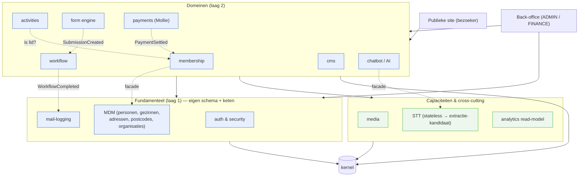
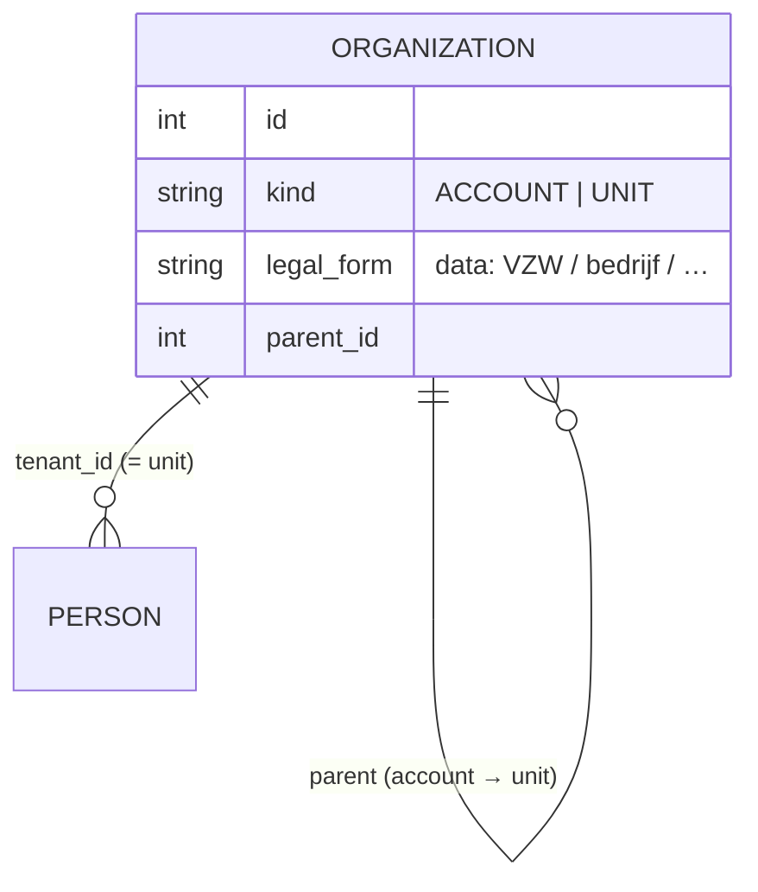
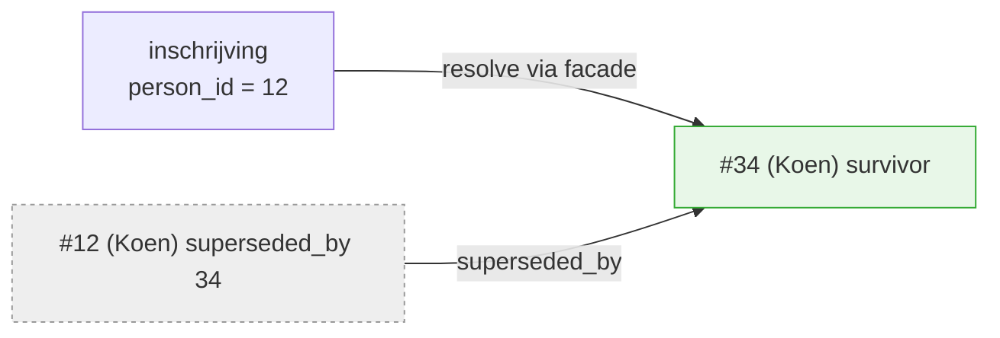

# Intermediate Architecture Upgrade — v1

> Werkdocument. Denkkader voor de tussenstap naar een **modulair, multi-tenant
> ERP/portaal/CRM**: domeinmodules met een facade + eigen Postgres-schema (en, waar
> afsplitsbaar, een eigen migratieketen), afgedwongen grenzen, en per-tenant merk-
> autonomie. Nog **geen** release toegewezen. Gerelateerd: epic **#366** (#360–#365).

---

## 1. Doel & principes

Van **modulaire monoliet** naar componenten met een **afdwingbare buitengrens**, zodat
we er later — enkel bij een concrete driver — een aparte app van kunnen maken. Bewust
een **leertraject**: forms is het sjabloon dat we op elk volgend domein herhalen.

- **Capture → Record → Act** — publieke capture (bezoeker), record-kern (eigen data +
  regels), rol-gated back-office (act).
- **Eén verticale slice per component** in `app/domains/<c>/`, met een **facade
  (`api.py`)** als enige publieke oppervlak — geen reach-in in models/services.
- **Owned data** — eigen Postgres-schema; cross-component enkel via **facade/events**,
  nooit live ORM-objecten of cross-schema FK's.
- **Kernel** = plumbing (db, config, events, tenant-context); hangt van geen domein af.
- **Modulariteit = OO op macroschaal** — module = object; facade = encapsulation,
  events = message passing, import-linter = het ontbrekende `private`-keyword.

---

## 2. Twee onafhankelijke assen

Verwar **modularisatie** en **multi-tenancy** niet — ze staan loodrecht op elkaar:

- **Module** (verticaal): *wélk soort data?* → eigen package + **Postgres-schema**
  (`form`, `payment`, `mdm` …).
- **Tenant** (horizontaal): *van wélke vereniging?* → **`tenant_id`** (rij-niveau) in
  elke moduletabel.

De koepel snijdt dwars door beide (ziet alle tenants in alle modules) → rij-niveau
`tenant_id` is het juiste model (§7).

---

## 3. Componentenkaart



Regels: schermen praten enkel met een **facade**; domeinen onderling enkel via
**facade/events**; **history** is een gedeeld kernel-patroon (geen aparte component).

---

## 4. Schermen ↔ componenten

Regel: **een scherm hoort bij de component wiens data het toont** — publiek én
back-office. Publiek vs back-office = rol/auth, geen componentgrens. Dus de
formulier-bouwer én de publieke render horen bij **form**.

| Scherm | Component | Rol |
|---|---|---|
| Formulier invullen / bouwer / inzendingen | **form** | — / ADMIN |
| Betaalflow / overzicht + **terugvordering** | **payment** | — / **FINANCE** |
| Lid/gezin inschrijven / ledenbeheer | **MDM** (+ membership) | — / ADMIN |
| Activiteiten publiek / beheer | **activities** | — / ADMIN |
| E-maillog | **mail** | ADMIN |
| Login / gebruikers & rollen | **auth** | — / ADMIN |
| CMS-pagina's | **cms** | — / ADMIN |

**Frontend spiegelt de backend**: `features/<component>/` (eigen componenten, api-slice,
types); `lib/` houdt enkel gedeelde primitives (money, errors, axios).

---

## 5. Componenten in detail

**5.1 auth & security** (laag 1). `users`, rollen, tokens, JWT-uitgifte/-verificatie.
Eén aparte, apart-deploybare component; **iedereen gebruikt `auth.api`**; auth hangt
enkel van de kernel af (de kernel roept auth niet aan → geen cyclus). Rol-toewijzingen
dragen `tenant_id` als waarde.

**5.2 mail** (laag 1). `email_log` + het centrale `_send`-chokepoint + retentie. Facade
`send/list/delete`; anderen sturen via facade of `MailRequested`-event. `email_log`
blijft in `mail`/`public`, niet in `form` (correctie op migratie 062).

**5.3 MDM** (laag 1) — identiteit, **géén lidmaatschap**. Personen, gezinnen, adressen,
postcodes, organisaties (§6) + `external_numbers` + de codes `relation/contact/gender`.
Gezinssamenstelling = MDM; "is betalend lid" = membership. Facade `get_person/
find_family/resolve_postal_code/list_organizations` + `resolve/merge` (§6).

**5.4 membership** — eigen component, **zuster van activities** (niet samenvoegen, niet
in MDM). Lidmaatschaps-relatie (persoon/gezin ↔ UNIT), jaren, lidgeld, bestuurslid.
Beide steunen op MDM en voeden `payment`. `activities` vraagt membership "is lid?" via
facade (ledenkorting) → daarom apart en testbaar.

**5.5 AI & STT** — ondersteunend, aan de rand.
- **STT** = stateless capaciteit (audio→tekst), géén schema → **eerste
  extractie-kandidaat** (zware libs/GPU): in-process nu, externe service later, zelfde
  facade (#364).
- **chatbot/AI** = laag-2 domein (schema `ai`) dat STT + LLM-providers consumeert.
- Providers achter adapters, **Europe-First**; keys = per-tenant secret.

**5.6 media** — gedeelde **capaciteit** (zoals mail), geen blad-domein. Meerdere
domeinen verwijzen via een `asset_id` (waarde). Schema `media` (metadata) + storage-
adapter (schijf/Storage Box, Europe-First). Facade `store/get_url/delete/resize`.
Tenant-scoped.

**5.7 workflow** — pluggbaar **vervolgproces + menselijke taken**. Form blijft dom
(publiceert `SubmissionCreated`); workflow luistert, start een instantie en beheert
states + taken (bewaart `submission_id` als waarde). Bouwer koppelt enkel een
`workflow_definition`-id; de procesdefinitie + takeninbox horen bij workflow. Facade
`start/advance/list_tasks/complete_task`; publiceert `WorkflowCompleted`.
**IdeaBox = een geseed formulier + workflow `nieuw → in behandeling → in orde`** (de
losse `ideas`-component vervalt).

**5.8 Cross-cutting & plaatsing van resttabellen**
- **History = gedeeld kernel-patroon** (`Historized`-mixin), per-component `*_history`
  in het eigen schema — géén centrale audit-component.
- **`business_events`**: geen meerwaarde → parkeren/verwijderen.
- **`external_numbers`** → MDM (externe identiteit).
- **Referentiecodes** → in het schema van hun eigen component (geen gedeelde
  `reference`-namespace); anderen bewaren de **waarde**.

---

## 6. MDM: organisaties, merge & soft-refs

### Organisaties (generiek, niet vzw-specifiek)

`organizations` is zelf-refererend: **ACCOUNT** = koepel/klant (wortel), **UNIT** =
operationele eenheid (bij Raak: Millegem, X, Y, Z). `legal_form` is **data** → org-type-
neutraal. Elke tenant-rij draagt `tenant_id` = UNIT; de account-scope volgt uit de boom.

### Merge & survivorship — nooit verwijderen
MDM-entiteiten worden **nooit hard verwijderd**; dubbels worden gemergd tot één *golden
record*, de verliezer blijft als **tombstone** die naar de survivor wijst.


- **ID-redirect**: `superseded_by_id` (self-FK, `null`=actief); `resolve()` volgt de
  keten (bij merge platgeslagen → O(1)). `merge()` idempotent.
- **Altijd actueel**: consumenten lezen via `mdm.api.get/resolve` → een oude
  inschrijving komt vanzelf bij de survivor uit.
- **Niets verloren → unmerge mogelijk**; de merge wordt gelogd (history-patroon).
- Event **`EntityMerged`** voor optionele housekeeping (niet nodig voor correctheid).

### Soft reference (zo verwijst bv. de form engine naar een persoon)
- **Waarde-kolom** `mdm_person_id` (nullable), **geen cross-schema FK** — een echte FK
  zou de schema's koppelen, onafhankelijk deployen breken én de merge-redirect
  onmogelijk maken. Concreet: `form_submissions.mdm_person_id`.
- **Optioneel** (forms mogen anoniem blijven → losse koppeling behouden); **altijd via
  de facade lezen** (redirect transparant). Het nooit-verwijderen + tombstone garandeert
  dat een id **nooit dangelt** — sterker dan een harde FK. Zelfde patroon voor
  membership/activities/payment.

---

## 7. Multi-tenant

**Klant = ACCOUNT** (generiek elk type org), **tenants = UNITs**. Drie niveaus:
**operator** (platform, ziet alles) → **account** (klant/billing) → **unit** (eigen
brand). Een klant die quasi-autonome, eigen-brand bedrijven beheert = **één account,
één unit per bedrijf**. Meerdere accounts naast elkaar is **native** (aparte
`organizations`-wortels).

```mermaid
flowchart TB
  OP["operator (ziet alles)"]:::o --> A1["ACCOUNT: Raak vzw"]:::a & A2["ACCOUNT: Bedrijvengroep"]:::a
  A1 --> U1["UNIT: Millegem"]:::u & U2["UNIT: Raak X"]:::u
  A2 --> U3["UNIT: Bedrijf A"]:::u & U4["UNIT: Bedrijf B"]:::u
  classDef o fill:#ffd,stroke:#aa0; classDef a fill:#e8f0ff,stroke:#36b; classDef u fill:#eef7ee,stroke:#3a3;
```

- **Model = rij-niveau `tenant_id`** (shared schema). Schema-/DB-per-tenant vallen af:
  de koepel moet dwars over tenants rapporteren (`WHERE tenant_id IN …` i.p.v. een
  cross-schema-union). **RLS** later als DB-vangnet.
- **Tenant-context in de kernel** (uit JWT/hostname); facades filteren standaard op de
  actieve tenant. **Rollen**: `ADMIN`/`FINANCE` per UNIT, `ACCOUNT_ADMIN` per account,
  `OPERATOR` op platformniveau.
- **Cross-account isolatie is hard**; **zichtbaarheid binnen een account is
  configureerbaar** (gedeeld: koepel ziet/deelt alles — vs geïsoleerd: units delen niet,
  account enkel oversight) — een facade-policy, geen schemawijziging.
- **Uitrol per app, niet dark/big-bang**: kernel levert de `tenant_id`-mixin + context;
  elke app adopteert dat op zijn moment, grondig getest.

### Config & secrets (multi-tenant-scheiding)
- **Per-tenant config** → **DB-beheerd** (afzendermail, Mollie-profiel, logo, branding,
  domein). Vandaag in `.env`; verhuist naar een per-tenant settings-store met `.env`-
  default tijdens de single-tenant-fase.
- **Per-tenant secrets** (Mollie-key) → **DB, versleuteld**.
- **Infra/technologie** (DB-wachtwoord, IP, SSH, `SECRET_KEY`, proxy/CA) → **`.env`**.

### Merk-autonomie & SEO — aparte site per unit
Harde eis: **elke unit is een zelfstandig indexerende site** (Google/Bing/Qwant) → een
**eigen host per unit** (geen pad-prefix):
- **Eigen domein** (`raakmillegem.be`, `raakx.be`) — aanrader, sterkste scheiding +
  domain authority. **Subdomein** kan ook. **Pad-prefix valt af** (dat is één site).
- **Hostname-resolutie** (Next.js middleware) → tenant; per unit een **canonical
  base-URL** in de per-tenant config. Cert/DNS per host via Caddy. Overstap subdomein →
  domein = config + DNS + **301-redirects**, geen code.
- **SEO is een afgeleide**: `generateMetadata`, `Organization`-JSON-LD, `sitemap.xml` en
  `robots.txt` lezen de actieve tenant. Content is al tenant-scoped (CMS + activiteiten).
  De issues #320 (JSON-LD) en #322 (og:image) worden zo **per unit**.

---

## 8. Afhankelijkheden & grens-handhaving

3-lagen-model — afhankelijkheden wijzen **enkel naar beneden**:

| Laag | Bevat | Mag afhangen van |
|---|---|---|
| **0 · Kernel** | db, config, events, tenant-context, history-mixin | niets |
| **1 · Fundamenteel** | auth, mail, MDM | enkel kernel |
| **2 · Domeinen** | form, payment, activities, membership, workflow, cms, chatbot | kernel + laag-1-facades + elkaars facades/events |

Gehandhaafd door: **(1)** import-linter in CI (mapgrens = moduulgrens); **(2)** geen
cross-schema FK's (integratietest op `information_schema`); **(3)** aparte Alembic-keten
per afsplitsbaar component (drift/één-head-tests); **(4)** later per-schema `GRANT` + RLS.

---

## 9. Ontwikkelen binnen een component — contract-stabiliteit

Het **contract** = facade-signaturen (`api.py`) + DTO's + event-schema's
(`kernel/contracts`). Alles daaronder (models, service, schema) is intern en mag vrij
wijzigen.

- **Additief = vrij** (nieuwe functie/optioneel veld/event).
- **Breaking = deprecatie-cyclus**: nieuwe variant → oude `@deprecated` → consumenten
  migreren → verwijderen; events versioneerbaar (`…V2` naast `…V1`).

> Werkregel: *onder de facade refactor je vrij; aan de facade wijzig je niets zonder
> deprecatie-cyclus én groene contract-tests.* De import-linter garandeert dat het
> contract de enige koppeling is.

---

## 10. Teststrategie

Vier lagen, van snel/lokaal naar breed:
1. **Unit** — in-component, tegen het eigen schema (validatielagen apart).
2. **Contract** (de naad) — provider bewijst dat facade/events het schema naleven; elke
   consument test tegen een **stub die aan datzelfde schema wordt gevalideerd** → een
   contract-breuk laat de consument in CI falen. Zo ontwikkel je **in isolatie**.
3. **Integratie-flow** — "golden flows" tegen de echt gewired app + alle schema's, bv.:
   *inschrijving → membership-check → betaling → mail + history*; *formulier → submission
   → confirmatiemail*; *terugvordering (FINANCE) → payment-status + mail*.
4. **Migratie/grens** — per keten: één head, autogenerate-drift, geen cross-schema FK.

CI: unit + contract + linter op elke push; integratie + migratie op PR/merge (echte
Postgres 16, alle ketens). Import-linter sluit *verborgen* koppeling uit, contract-tests
vangen *contract-breuk*, golden flows bewijzen de *samengestelde* werking.

---

## 11. Conventies (GUI · code · API)

Componenten moeten er **hetzelfde uitzien en aanvoelen** — anders krijg je N eilandjes.

- **GUI**: gedeelde **UI-kit** + twee sjablonen — **AdminConsole** (lijst+filters →
  detail → rol-gated acties + bevestiging) en **Public-capture** (token/anoniem →
  gevalideerde submit → bevestiging). Rol-bewuste UI, a11y-baseline, nl-BE + gedeelde
  formatting.
- **Code**: identieke component-structuur (`api/router/schemas/service/models`);
  validatielagen (vorm→router, regels→service, integriteit→DB); import-linter; ruff +
  mypy / eslint + prettier + tsc; **kernel-patronen hergebruiken** (tenant-mixin,
  history-mixin, soft-delete, `superseded_by`, event-dispatcher).
- **API**: `/api/v1/<component>/<resource>`; standaard error-/paginatie-envelope; DTO's
  & events als contract (`kernel/contracts`, events `<Aggregate><Verb>`); **OpenAPI** als
  waarheidsbron (`api.ts` spiegelt); idempotentie waar het telt (`merge`, Mollie-webhook);
  `created_at/updated_at` tz-aware.

---

## 12. Component-documentatie & change-impact

Prosa veroudert → **contract-als-code + een dun manifest, afgedwongen door tests.**

- **`CONTRACT.md` per component**: publiceert (facade + events), consumeert
  (afhankelijkheden), bezit (schema/config), deprecaties, `CODEOWNERS`.
- **Bron van waarheid** (manifest verwíjst ernaar): OpenAPI + DTO/event-schema's;
  contract-tests toetsen diezelfde schema's → de test *is* de handhaving.
- **Change-impact**: uit de "consumeert"-declaraties bouw je een **reverse-index**
  ("wie hangt van mij af") + de dependency-graph. Een contract-wijziging → **contract-
  tests bij de consumenten falen** → blast radius met naam; `CODEOWNERS` tagt reviewers.

> Regel: een contract wijzig je niet zonder `CONTRACT.md` bijgewerkt én groene
> contract-tests bij álle consumenten.

---

## 13. Codebase-(her)structurering

Van **package-by-layer** (form ligt versnipperd over `routers/models/services/schemas`)
naar **package-by-domain**. Je bent al begonnen (`domains/`); we maken het af.
*Eén map = één component = één schema = één toekomstige app.*

**Backend**
```
app/
  kernel/     database, config, soft_delete, security(verify),
              events, contracts, tenancy(mixin+context), history(mixin)
  domains/
    auth/  mdm/  mail/                      # laag 1
      api.py router.py schemas.py service.py models.py migrations/ CONTRACT.md
    membership/ activities/ form/ workflow/ payment/ cms/ chatbot/   # laag 2
    media/ stt/ analytics/                  # capaciteiten / read-model
  main.py     # mount enkel domains/*/router.py
  # routers/ models/ services/ schemas/ → lopen leeg en verdwijnen
```
Interne modules (cms, activities, analytics) krijgen wél een eigen schema, géén eigen
keten (§14).

**Frontend** — spiegel: `src/features/<component>/` (+ `_shared/` UI-kit); `lib/` enkel
gedeelde primitives.

**Migratiepad (strangler, geen big-bang)**: forms eerst als sjabloon (`git mv` +
facade, geen gedragswijziging) → per component één PR → kernel optrekken. **Valkuil**:
model-discovery — verplaats je models, laat `Base.metadata`/Alembic ze nog vinden
(import in `domains/__init__.py` of `env.py`).

---

## 14. Roadmap & backlog

**Nog geen issues aangemaakt** — dit wordt op go sub-issues onder #366. Vast sjabloon
per component-PR: `facade → import-linter → eigen schema (+ keten waar afsplitsbaar) →
contract-/integratietests → frontend-feature → CONTRACT.md`.

**Kritiek pad**: F (fundering) → Fase 0 (forms-sjabloon) → mail/auth → MDM → tenancy.
De rest kan grotendeels **parallel** zodra fundering + sjabloon staan.

| Blok | Werkpakketten | Status |
|---|---|---|
| **F · Fundering** | kernel optrekken (events/contracts/tenancy/history/security); import-linter-harness; component-scaffold + `CONTRACT.md`-template; test-harness (contract + golden-flow); UI-kit + templates | nieuw |
| **0 · Form-sjabloon** | forms→`domains/forms` + facade; import-linter; schema `form` + handoff; 2e keten + integratietests | **#360–#363** |
| **1 · Cross-cutting** | mail-component; auth-component (laag 1) | nieuw |
| **2 · MDM** | MDM (+ `external_numbers`) + schema/keten; merge/survivorship; soft-ref-patroon | nieuw |
| **3 · Payments** | `domains/payments` (gateway+status) + FINANCE-refund; **wees-record-check** op `payable_id` (§19) | **#365** |
| **4 · Domeinen** | membership (+`is_member`); activities; workflow + IdeaBox; media; cms; chatbot | nieuw |
| **5 · Multi-tenant** | organizations (ACCOUNT/UNIT); per-tenant config/secrets-store; `tenant_id` per app + context + rollen; meerdere accounts + hostname-resolutie + per-unit SEO | nieuw |
| **6 · Extractie** | STT → externe service (bij driver) | **#364** |
| **H · Operationele hardening** (§19, kan vóór alles) | deploy-vangnet (pre-migratie-backup, smoke als gate, rollback-runbook); security-batch (non-root containers, OTP-hash, JWT-TTL/HttpOnly, blokkerende audit); CI-gates vervroegen (vitest-gate, e2e-geldflow blokkerend, `alembic check`) | nieuw |
| **O · Opruiming** (§19, kan vóór alles) | `business_events` verwijderen; `ideas` → geseed formulier; `domains/common/` + stale docs weg; dead-endpoint-sweep | nieuw |

---

## 15. Ontwerpkeuzes (register)

- ✅ **Package-by-domain**; facade `api.py`; grens via **import-linter**.
- ✅ **Eigen Alembic-keten** voor afsplitsbare apps (auth, mail, MDM, form, payment);
  interne modules enkel een eigen schema.
- ✅ **auth = één fundamentele component** (niet gesplitst; verify-mechanisme in kernel).
- ✅ **MDM**: `master`→MDM; bevat `external_numbers`; **nooit verwijderen +
  merge/survivorship**; anderen verwijzen via **soft-ref** (waarde-id).
- ✅ **membership = eigen component** (zuster van activities), **niet**
  `activities_membership`.
- ✅ **AI/STT gesplitst** (STT capaciteit/extractie-kandidaat; chatbot domein).
- ✅ **media = gedeelde capaciteit**; **workflow = eigen component**; **IdeaBox = form +
  workflow** (`ideas` vervalt).
- ✅ **history = kernel-patroon** per component; **`business_events` schrappen**.
- ✅ **Referentiecodes in eigen component-schema** (geen gedeelde namespace).
- ✅ **Multi-tenant = rij-niveau `tenant_id`**; **geen dark tenant_id** (per app,
  getest); **RLS later**. **Meerdere accounts native**; rollen `ACCOUNT_ADMIN`/`OPERATOR`.
- ✅ **Org-model generiek** (`ACCOUNT_ADMIN`, `legal_form` als data).
- ✅ **Config-scheiding**: per-tenant config/secrets in DB (secrets versleuteld); infra
  in `.env`.
- ✅ **Aparte site per unit** (eigen host, hostname-resolutie; geen pad-prefix).
- ✅ **Frontend per fase/component** (`features/<c>/` samen met de backend).

---

## 16. Kostenefficiëntie voor AI-assisted development

De grootste kostendrijver is *hoeveel er gelezen moet worden om veilig te handelen*.
Kleine componenten verkleinen dat leesoppervlak → **lagere kost per taak** (een
investering, geen automatische korting).

- **Daalt door**: begrensde context (`domains/<c>/` i.p.v. de hele repo); **contract
  i.p.v. implementatie** lezen (`CONTRACT.md`/facade); scherpe feedback (linter +
  contract-tests wijzen breuk met naam aan); kleinere test-/CI-scope.
- **Kost of helpt niet**: upfront-herstructurering; cross-cutting wijzigingen; vereist
  discipline (grenzen echt afgedwongen); iets meer boilerplate per triviale change.

> Een typische taak verschuift van *"lees een groot deel van de repo"* naar *"lees één
> map + een paar contracten"* — dáár zit de winst, en dat maakt latere agentische/
> parallelle ontwikkeling per component haalbaar.

---

## 17. Waarom — korte & lange termijn

**Korte termijn**: stop de fragiliteit/data-verlies (bv. #357: bewerken wiste
inzendingen); sneller & goedkoper ontwikkelen; makkelijker redeneren en overdragen
(facade + `CONTRACT.md`); en de concrete noden nu (form engine, betalingen/refund,
kernel-fundering).

**Lange termijn**: modulair ERP/portaal/CRM met onafhankelijk evoluerende, afsplitsbare
componenten; multi-tenant SaaS (meerdere accounts, aparte site per unit — **nieuwe
klant = config, geen code**); herbruikbare componenten; toekomstbestendig voor
AI/agentisch werk; beheersbare compliance/isolatie; en géén "big ball of mud".

> De strangler-aanpak laat KT-waarde en LT-fundering **samenvallen**: elke stap lost nu
> iets op én legt een steen voor later.

---

## 18. Out-of-scope — bewust (nog) niet

Levend register: "LT" = heroverwegen zodra de trigger opduikt.

| Idee | Waarom nu niet / trigger |
|---|---|
| Microservices / aparte DB's / message broker | Modulaire monoliet volstaat; splits enkel bij een concrete driver. Naden liggen klaar. |
| DB-/schema-per-tenant | Rij-niveau gekozen; enkel bij harde isolatie-eis. |
| Postgres RLS | Eerst facade-filtering; als hardening ná Fase 5. |
| Externe IdP / SSO | Eigen `auth` volstaat; bij klantvraag. |
| Volledige BPM-engine (Camunda…) | Start met lichte eigen `workflow`. |
| Event-sourcing / CQRS | Enkel read-models waar nuttig. |
| Extra betaalproviders | Mollie (EU) volstaat; adapter maakt uitbreiding triviaal. |
| Volledige i18n | nl-BE nu; bij markt-/tenantvraag. |
| Mobiel/native, real-time (websockets) | Web-first; bij behoefte. |
| BI / datawarehouse | Simpele `analytics` nu. |
| `business_events` → audit-platform | Geschrapt (§5.8). |
| GDPR-self-service | Na tenancy + MDM; nu admin-verwijderen (MDM = tombstone, nooit hard). |
| Feature-flag-platform | Lichte config-vlaggen volstaan. |
| Kubernetes / auto-scaling | Docker-compose volstaat; bij schaalnood. |
| "Dark" `tenant_id` vervroegd | Bewust niet (per app, getest). |

---

## 19. Aanvullingen uit de codebase-analyse (juli 2026)

De analyse (`codebase-analyse-erp-fundament.md`, vier deep-dives met
file:line-bewijs) **valideert dit plan**: de lazy-import-cykels bewijzen de
payments-facade, de frontend-duplicatie bewijst de UI-kit (§11), de CI-gaten
bewijzen §8/§10. Drie concrete aanvullingen + een vereenvoudigingsregister:

### 19.1 Operationele hardening (backlog-blok H)
- **Deploy-vangnet** — pre-migratie-backup-hook in `deploy-prod.sh`, post-deploy
  smoke als **gate** (nu `|| true`), rollback-runbook. Klein werk, essentieel met
  financiële data; vereist de modularisatie niet.
- **Security-batch** — non-root containers (`USER` in Dockerfiles), OTP-codes
  gehasht opslaan, kortere JWT-TTL of HttpOnly-cookie-pad, dependency-audit
  blokkerend voor high-severity. (Geen kritieke bevindingen; dit is hardening.)
- **CI-gates vervroegen** — de goedkope gates uit §10/§11 nu al aanzetten:
  vitest zonder `--passWithNoTests`, e2e-geldflow blokkerend, `alembic check`
  (drift). De import-linter volgt met Fase 0.

### 19.2 Integriteit polymorfe refs
`payment_records.payable_type/payable_id` is een soft-ref zónder de
MDM-tombstone-garantie (§6): een wees-record is vandaag mogelijk. Toevoegen aan de
grens-/integratietests (§10 laag 4): **check dat elke payable_id naar een bestaande
bron wijst** (reconciliatie-query, faalt luid).

### 19.3 Vereenvoudiging & afscheid (register, backlog-blok O)
Snoeien is ook architectuur. Levend register, zelfde geest als §18:

| Actie | Winst |
|---|---|
| **`business_events` verwijderen** (beslist, §5.8 — nu uitvoeren) | −1 tabel, −PII-guard-service, −6 emit-sites in 5 flows, −admin-stats-endpoint, −13 tests |
| **`ideas` → geseed formulier** (beslist; kan al zónder workflow — Inzendingen-tab bestaat) | −router, −model+tabel, −admin-pagina, −IdeaBox-component, −idea_limiter |
| **`domains/common/` (leeg) + `docs/change_request_0X.md`** opruimen | minder dode structuur |
| **Dead-endpoint-sweep**: backend-routes vs. werkelijk `api.ts`-gebruik | kleiner API-oppervlak (kandidaat: 32 routes in `activities.py`) |
| **Consolidaties die code verwijderen** (vallen onder F/§11): UI-kit (6 badges→1, 4 modals→1, 13 `confirm()`→1), OpenAPI-codegen (handgeschreven `api.ts` + dubbele types weg), één PaymentRecord-lookup-helper, design-tokens één bron | netto mínder regels, zelfde gedrag |

**Niet snoeien** (lijkt vereenvoudiging, is het niet): migraties squashen (CI test
nu de hele keten — dat is waarde), history-tabellen/e-maillog-body (audit-waarde,
bewuste keuzes met retentie), tests, `member_import` (eerst bevestigen dat het
eenmalig was — oogt terugkerend).

### 19.4 py↔ts-drift structureel voorkomen (OpenAPI-codegen + gate)
1. **Stap 0 — conventie**: elk endpoint een `response_model` (kale dicts genereren
   leeg schema; bv. form-results/inzendingen-view).
2. **Export**: script dumpt `app.openapi()` deterministisch naar `openapi.json`
   (gecommit; geen draaiende server nodig).
3. **Genereren, gefaseerd**: eerst `openapi-typescript` → één `api-types.gen.ts`
   (types only, nul runtime) en de handgeschreven/dubbele types verwijderen;
   later per component volledige client-gen (nette `operation_id`s) die de
   `api.ts`-wrappers vervangt.
4. **CI-drift-gate — de eigenlijke preventie**: export + codegen + `git diff
   --exit-code` op de gegenereerde bestanden → schema gewijzigd zonder
   regeneratie = build rood. Zelfde filosofie als import-linter/`alembic check`.

Codegen bewaakt de **vorm**; de contract-tests (§10) bewaken de **betekenis**.
Geen runtime-validatie (zod) in de frontend — de server valideert al; een tweede
schema zou een tweede waarheid zijn. Stappen 0/2/3a/4 = klein zelfstandig pakket
(past in blok H, vóór de modularisatie); volledige client-gen per component mee
met `features/<c>/`.
