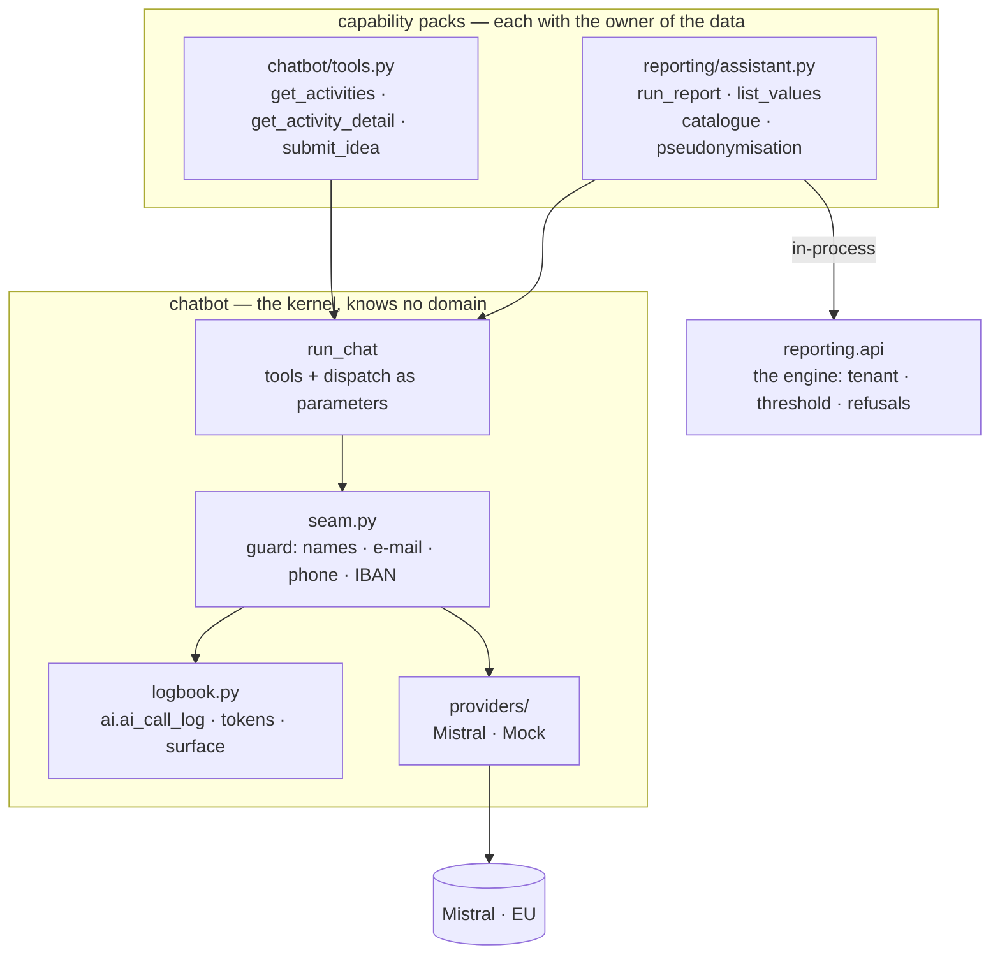

# Raakje in the back office — conversational reporting

The board asks a question in plain Dutch and gets an answer that stands on a real
report. This document is about **how data from the administration reaches a
language model, and what stops it from reaching one it should not** — the same
question `chatbot.md` answers for the public bot, with a different answer, because
the data is different.

Built per `change_request_07_raakje_backoffice.md` (#917). That change request is the reasoning; this
is what was built, including the three places where it turned out differently.

## One Raakje, two toolkits

There is no second chatbot. The conversation kernel — the loop, the provider seam,
the budgets, the guard and the outbound log — is domain-neutral and lives in
`domains/chatbot`. A *capability pack* supplies tools plus a dispatcher and lives
with whoever owns the data. The public bot is the first pack (`chatbot/tools.py`);
the back-office assistant is the second (`reporting/assistant.py`).

The arrow that is not there matters as much as the ones that are: the model never
sees SQL, never sees a `reporting.*` view, and never calls `/api/v1`. It composes a
*selection* out of the catalogue; the existing engine executes it. One path to one
number — the reports panel uses the same one, so the assistant and the panel cannot
disagree about revenue.

## What leaves, and what stops it

Four mechanisms, in the order a value meets them.

| # | Mechanism | Where | What it holds |
|---|---|---|---|
| 1 | `ai_exposure` on every universe object, no default | `reporting/universe.py` | Adding an object without deciding is an **import error** — CI is red before a test runs |
| 2 | Refusal of `none` objects | `reporting/assistant.py`, before `build_query` | Free text (a treasurer's note) never travels; no phase makes it allowed |
| 3 | Tokenisation of `admin_tokenised` objects | `reporting/assistant.py`, after `run_selection` | A household leaves as `gezin-23`; the admin reads the name, Mistral never does |
| 4 | The seam guard | `chatbot/seam.py`, immediately before the HTTP post | An independent second check that blocks the call |

Mechanism 4 shares **no code** with 1–3, deliberately: a check that fails together
with what it checks, checks nothing. It also sits at the provider, so every future
pack inherits it without knowing it exists.

The classification lives on the object and not at the call site, for the reason a
flag on an outbound channel always should: a flag someone can forget lets
forgetting decide what leaves.

### The three directions of a token

- **Outbound** — the value becomes `gezin-23`, built from the row's entity id.
  Stateless: nothing about the mapping is stored, so the same household is
  `gezin-23` in the first turn and after a restart.
- **Inbound at render time** — tokens in the answer become names again, server-side,
  with one tenant-scoped lookup. The id comes out of a model's output, so that
  lookup is the one number an injected instruction could try to choose; a token
  pointing elsewhere stays a token.
- **The typed question** — a name the admin types is replaced by that household's
  token before anything leaves. A name that means one household becomes its token;
  a name that means several becomes `[naam]`, and the catalogue tells the model to
  ask which one rather than pick.

### Verifiability

Every outbound call is stored verbatim in `ai.ai_call_log`, with token usage and
which surface called. The screen offers a per-answer **"Wat zag Mistral?"**
fold-out that reads exactly that payload. An assurance the admin cannot inspect is
not assurance.

One query answers "what does the AI cost this month?" for both bots at once —
token usage was already in every Mistral response and used to be discarded.

## Three things that turned out differently

**The patterns skip the system prompt.** The first run of the guard blocked every
public question, and the culprit was the association's own privacy page in the
prompt: its e-mail address and its IBAN, published on purpose, because without a
bank account the bot cannot say where the membership fee goes. A guard that blocks
that protects nothing and breaks everything, and is switched off within the week.
The typed question and every tool result stay fully covered — those are the two
channels along which administration data can actually leave.

**The guard is per capability.** The public bot's contact path exists so a visitor
can type their own name and e-mail; a global name-and-e-mail check would block
`submit_idea` on the first message it was designed for. Phone and IBAN patterns
apply to both surfaces; names and e-mail only to the back office.

**The small-cell threshold is gone, on both sides** (decided by Koen, 14 September
2026). CR-07 §5.5 kept it as a second line: groups under five people were merged
into one row, for the panel and the assistant alike. Two things were wrong with
that. Inside the back office it protected nobody — whoever may open the report may
look the household up anyway — while hiding "Anderlecht: 1" in a pooled row, and a
figure that disappears without a visible reason costs trust in every number around
it. And for the assistant it conflated two different rules: **a count is not
personal data**. What must not reach a language model is a name, an address, a date
of birth, a phone number, an e-mail address, free text — and that rule is untouched
and enforced three ways over (declaration, tokenisation, seam guard).

The consequence worth stating: for a row about one household, the token is now the
first line and the only one. That makes the masking gates heavier than they were,
not lighter.

## Operating it

Two switches in series, and off wins on either:

- `ADMIN_CHAT_ENABLED` per environment (default **off**, so the code ships without
  the assistant doing anything);
- **Raakje in de backoffice** per tenant, under `/admin/tenants` → settings.

Other settings, next to and separate from the public `CHAT_*` family:
`ADMIN_CHAT_MODEL` (a bigger model — composing a selection is harder than a
lookup), `ADMIN_CHAT_DAILY_CHAR_BUDGET` (per **signed-in admin**, not per IP),
`ADMIN_CHAT_MAX_TOOL_ROUNDS`, `ADMIN_CHAT_MAX_ROWS`, `ADMIN_CHAT_TIMEOUT_SECONDS`.

The way in is one button on `/admin/rapporten`; there is no menu entry of its own.

## Before it may be switched on anywhere beyond HDEV

Two items, neither of them code, both from CR-07 §6.1. Pseudonymised data is still
personal data under the GDPR — we hold the key that links `gezin-23` back to a
person — so:

- [ ] a processor agreement (*verwerkersovereenkomst*) with Mistral is accepted;
- [ ] the members' privacy statement names Mistral as processor for reporting
      questions.

These are ticked by hand by the responsible administrator in the release tracker,
and no deploy beyond HDEV happens before they are.

## Evaluation

The bar is **6/6 on the seeded test set**, graded by a person against a real model
before each release that touches the assistant, result recorded in the tracker.

- The **data half runs in CI**: every question names the universe path that answers
  it and the number it must produce on `tests/_assistant_seed.py`. This is the half
  that rots silently when an object is renamed.
- The **model half is run by hand**: `python -m app.domains.reporting.evaluation`
  puts each question to the assistant and prints the answer next to what a correct
  one must contain. A clarifying question counts as correct.

Questions 7 and 8 are cohort reasoning: what is graded there is the *shape* of the
answer — indicators and reasons, never an invented percentage.

## What it deliberately does not do

No saved reports from the conversation, no charts, no streaming, no chat history
across sessions, no cross-tenant questions, and no trained prediction model (that
track is #171 and stays separate). The conversation does persist *within* one
screen session, in the page and not on the server.
